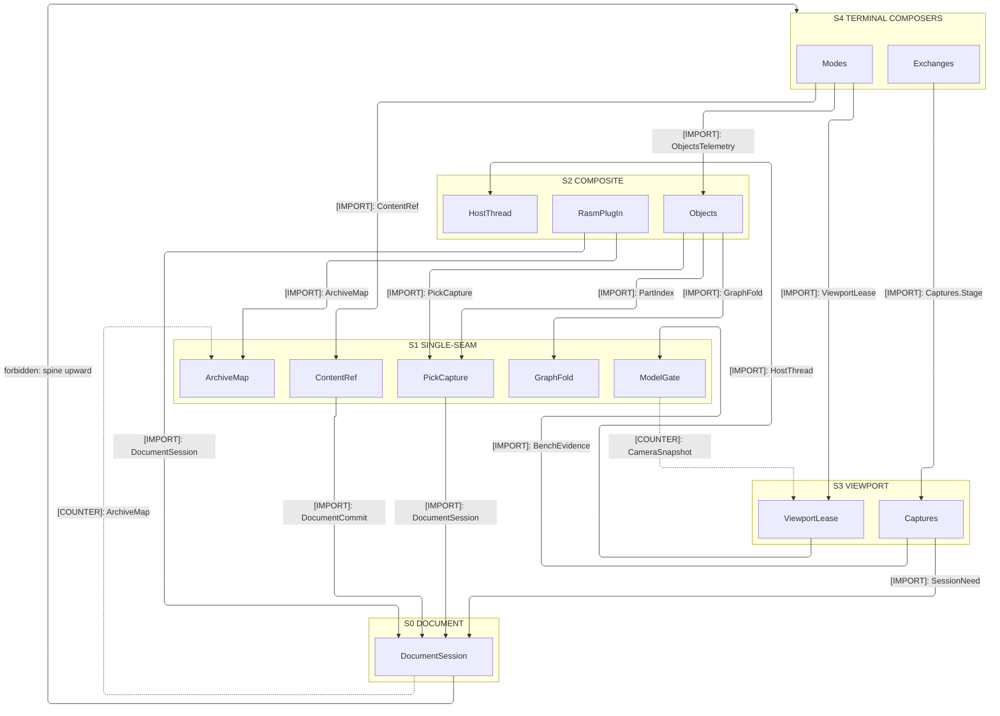
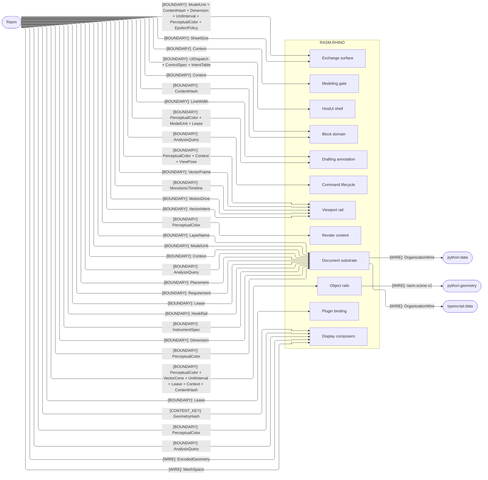
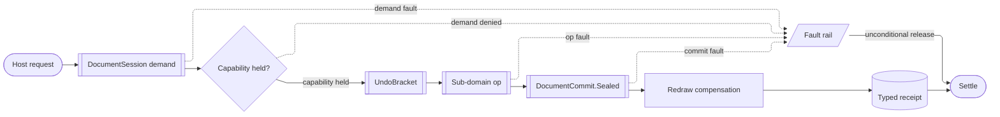

# [RASM_RHINO_ARCHITECTURE]

`Rasm.Rhino` maps the Rhino 9 host boundary over the RhinoCommon surfaces, the `Rhino.UI` shell, and the kernel `Rasm.Interaction` band, composing the `Rasm` kernel for every host-neutral and Eto-shaped concern, so the boundary declares no Eto twin. Each sub-domain folder maps to one namespace, and project references terminate at the kernel. Host owners compose same-assembly owners at their own or lower stratum. Seam map names only boundary-crossing contracts, each a frozen-name value type consumed down from the kernel, while host-internal wiring stays on the mutation spine.

## [01]-[DOMAIN_MAP]

```text codemap
Rasm.Rhino/             # Rhino host boundary over the Rasm kernel
├── Document/           # Host-document substrate under every host surface
│   ├── Session.cs      # Capability-scoped document-session demand, unit-regime adjustment, worksession custody
│   ├── Geometry.cs     # GeometryHandle retained custody: deep-copy mutation commits, in-quarantine failed disposals
│   ├── Tables.cs       # TableKind/TableTarget vocabulary; mutation programs return consequence evidence on the Amend rail
│   ├── Events.cs       # Event observation, the transactional DocumentStream, and the hook-point registry
│   ├── Layers.cs       # Managed layer tree with persistent visibility variants; the drafting-standards lowering seat
│   ├── Facts.cs        # IFactSlot readable kind gate and the fact accumulation the sealing commit stamps
│   ├── Commit.cs       # One host-mutation commit envelope; every folder commit rail enters here and none seals its own
│   └── Lifetime.cs     # Package-wide lifetime primitives: claims capsule, symmetric subscription rollback, failure-release fold
├── Persistence/        # Typed serialization, settings custody, attached data, user text, saved-state presets
│   ├── Dictionary.cs   # ArchiveValue one boxed-host-value carrier; every KV payload admits through one gate
│   ├── Settings.cs     # Settings custody scopes, typed value rail, guards, and the change ledger
│   ├── AppSettings.cs  # AppSettingsFamily rows with capture, default, apply, and reset delegates; AppState snapshots
│   ├── UserData.cs     # ArchiveIo spine, TypedUserData template, roster census, custody transfer
│   ├── UserText.cs     # TextOperation closing document, attribute, geometry, detached, and wildcard text as one concern
│   ├── Presets.cs      # Sub-domain admission-refusal family mint; the construction-plane vocabulary presets and viewport share
│   └── Snapshots.cs    # Scripted snapshot ops and the SnapShotsClient participant
├── Objects/            # Live document-object domain over the table rail
│   ├── State.cs        # StateAsk closed read family, Touch selection mutation, TableAddress composition
│   ├── Attributes.cs   # AttributeEdit closing every writable ObjectAttributes family with verified payload carriers
│   ├── Materials.cs    # MaterialScope overload discriminant; MaterialAsk<TAnswer> self-typed reads fix their own answers
│   ├── Lights.cs       # LightKind capability rows, LightSeed one construction union, LightEdit gated edit family
│   ├── History.cs      # HistoryScript generated slots into leased HistoryRecords; Regrown replays, ReplayProgram composition
│   └── Authoring.cs    # Custom-object, grip, and render-mesh programs; ObjectsTelemetry egress, host taps, classification, instrument rows
├── Commands/           # Native command lifecycle, input acquisition, and picked-reference projection
│   ├── Command.cs      # CommandFlow<TState>.Drive bounded interpretation; RasmCommand<TSelf,TState> the one host entry
│   ├── Acquisition.cs  # Parameterized input-acquisition matrix and its receipt
│   ├── Options.cs      # OptionSet.Bind getter-window vocabulary; OptionLease native custody through deterministic release
│   └── Selection.cs    # Picks projection with terminal ObjRef windows; owned references dispose, borrowed never
├── Blocks/             # Instance-definition domain over the kernel
│   ├── Model.cs        # Live block address, LinkState carrier, closed mutation and preview policy values
│   ├── Graph.cs        # Definition-graph topology, queries, and archive closure
│   ├── Lifecycle.cs    # Preview bitmap custody, versioned grants, document-scoped invalidation, deterministic disposal
│   └── Operations.cs   # Block operation and query rail, geometry intake, and receipts
├── Modeling/           # Host-fidelity native construction compute over the custody seam
│   ├── Solids.cs       # SolidOp family and the Extrusion lifecycle through Solids.Build over leased ModelGate borrows
│   ├── Lofting.cs      # LoftOp admission through the spine's ModelClaim fold; rails, profiles, constraints, ruling evidence
│   ├── Surfaces.cs     # FreeformOp union through HostSurfaces.Build: network fits, rail revolves, grid interpolation
│   ├── Curves.cs       # CurveOp union through one build entry; pulls, projections, booleans, blend construction cases
│   ├── Meshing.cs      # HostMeshes.Build admitted creation and egress; MeshOp.QuadRemesh the sole mesh-to-SubD seam
│   ├── SubD.cs         # SubDOp raw-handle admission through ModelClaim; value-semantic edits, crease topology, Brep egress
│   ├── Deform.cs       # DeformOp driver admission through ModelClaim; generated policies own every native knob
│   └── Projection.cs   # ProjectionOp union through Projections.Build; ProjectionFrame admits the value frame once
├── Annotation/         # Drafting annotation domain over the resource tables
│   ├── Style.cs        # StyleField rows pairing exact payloads with catalogued DimensionStyle.Field entries; one patch fold
│   ├── Text.cs         # TextSeed/TextSpec/LeaderSpec one admission; RunFormat decoration edits, FieldKind evaluator space
│   ├── Dimension.cs    # DimensionSpec one construction admission; DimAdjust kind-matched refits on the drafting spine
│   ├── Hatch.cs        # PatternDef detached round trip, HatchSpec boundary-family construction, Hatches.Commit fold
│   ├── Linetype.cs     # StrokeDef authorable aggregate over SegmentRow atoms; Linetypes.Commit on the drafting spine
│   └── Typeface.cs     # FaceDecoration/FaceTrait capability rosters, FaceQuery one admission, FaceInfo detached descriptor
├── Viewport/           # Camera model, operation rail, capture spec, and motion pacing
│   ├── Camera.cs       # CameraPose kernel-vector composition; session-scoped borrows over the ViewportTarget address
│   ├── Operations.cs   # Camera-operation union applied behind the viewport lease
│   ├── Capture.cs      # Capture plan, request cardinality, leased delivery, and run-rail bench timing
│   └── Motion.cs       # MotionPump host lease over the kernel sampling algebra it re-declares nothing of
├── Display/            # Display-pipeline participation and renderer boundary
│   ├── Conduit.cs      # Conduit-pipeline algebra, display-mode participation, and the cull/draw veto hook mounts
│   ├── Draw.cs         # Marks.Paint one dispatch over four canvases; DisplayMark screen and world payload bands
│   ├── Interaction.cs  # Pointers/Gumballs/WidgetHost configure entries; host input admitted once, bounded facts out
│   ├── Render.cs       # Render-job session, realtime engine participant, and scene change-queue reader
│   └── Modes.cs        # Modes.Configure request algebra; raw host editors stay inside the fold, viewport binding by value
├── Render/             # RDK content model and document render configuration
│   ├── Content.cs      # ContentRef live RDK graph identity; scoped mutation, detached topology, replayable hash evidence
│   ├── Kinds.cs        # Material bridge, texture configuration, and environment bake
│   ├── Fields.cs       # One polymorphic field-value owner, declaration, binding, parameter routes
│   ├── Registry.cs     # ContentUuidCatalog seed data, ContentSerializer read transfer, Registry.Run registration close
│   ├── Settings.cs     # Render-settings duality, sub-owner states, sun astronomy, edit rail
│   └── Mapping.cs      # MappingSpec construction with recoverable primitive evidence; Mappings.Run one request family
├── Exchange/           # Document interchange and publication surface
│   ├── Formats.cs      # File-codec matrix: detection, filters, and dispatch
│   ├── Options.cs      # FormatDial per-codec policy; Admit proves codec-phase correspondence once, Dials.Resolve applies
│   ├── Archive.cs      # Archives.Apply File3dm admission and bounded materialization; one lease holds every handle
│   ├── Operations.cs   # Exchange-operation rail and headless convert sessions
│   ├── Sheets.cs       # Sheet plans, live selectors, and declarative detail state
│   └── Publish.cs      # Page-target dispatch and atomic content-keyed file landing
├── HostUi/             # Rhino.UI shell composed over the kernel Interaction band
│   ├── Shell.cs        # Host-thread session marshal, status, prompt, progress, runtime hosting, and notices
│   ├── Panels.cs       # Panel fact stream, placement, RUI state fold, and Rhino control rows
│   ├── Pages.cs        # HostPage realization from PagePlan rows; host base classes stay behind internal leaves
│   └── Dialogs.cs      # Capability-gated inquiry rail and preview projection
└── Plugin/             # Host plug-in binding, registry census, entitlement, and document participation
    ├── Lifecycle.cs    # RasmPlugIn the one PlugIn derivation and load root; quarantined host subclassing, fault ledger
    ├── Census.cs       # PluginCensus.Ask one polymorphic registry read; identity, descriptors, protection, installed roll
    ├── Licensing.cs    # Licenses.Ask entitlement union; RasmPlugIn.Entitlement the acquisition arm, typed verdicts
    └── Document.cs     # Participation.Cross write/read callback carrier; PluginSettings.Commit the settings-rail bridge
```

## [02]-[STRATA]

Five strata order the sub-domain folders; a folder composes its own owners and lower strata only, `Rasm` kernel namespaces underlie the whole boundary as the host-neutral floor, and two ruled counter-edges stand: Document's configured-open source takes Persistence's `ArchiveMap` as its typed open-options payload, minted before any session exists, and Modeling's projection frame takes Viewport's `CameraSnapshot`/`CameraPose` value shapes, value-only with no lease or borrow crossing. Every other consumption edge points down, so a new folder seats one stratum above its highest composed owner.

- S0 `Document` — spine under everything: `DocumentSession` demand, `Tables.Commit`, `Layers.Commit`, and the transactional `DocumentStream`.
- S1 single-seam — every S1 folder composes the spine ALONE, so any one deletes without moving a sibling; the single seam is the rank's test.
- S1 map — one fence node per folder: `PickCapture` Commands, `GraphFold` Blocks, `ArchiveMap` Persistence, `ModelGate` Modeling, `ContentRef` Render.
- S1 absent edge — `Annotation` composes the spine with no discriminating import, so the fence draws it nowhere.
- S1 law — `Modeling` reaches only the geometry-custody capsule; its camera read is the ruled counter-edge, never a lease.
- S1 law — kernel `Rasm.Interaction` (`UiThread`, `ControlForge`, `IntentTable`, `Surface`) floors every shell surface, adapted by nothing here.
- S2 composite — `Objects` (`Objects`, `Attributes`, `Chronicle`) adds Commands, Blocks' `GraphProjection`, and Annotation's `LinetypeSource`.
- S2 composite — `HostUi` (`HostThread`, `PanelHost`, `HostPage`) composes the kernel `Rasm.Interaction` band directly.
- S2 composite — Plugin (`RasmPlugIn`, `PluginCensus`, `Licenses`, `Participation`) composes Persistence's settings rail and `PluginKey` identity.
- S2 law — Plugin routes page-collection callbacks onto HostUi's `PageBasket`/`PageMount.Land`, a same-stratum peer edge, and mints no page owner.
- S3 `Viewport` — the lease-custody rank: every camera read and capture crosses the leased pair, and no lower folder holds a lease.
- S3 law — every borrow crosses the `HostThread` session rail, `HostThread.Run(HostWork<T>.Session(...))`, under a `SessionNeed`.
- S3 law — the capture run rail takes Modeling's `BenchEvidence`/`BenchBand` value shapes — value-only, no lease or borrow crossing.
- S3 law — `Viewport/camera` reads Persistence's `CPlaneGrid`/`CPlanePalette` value shapes downward — value-only, one seat.
- S4 law — Display draws through the kernel `Interaction/paint` surface and publishes conduit faults through Objects' `ObjectsTelemetry` egress.
- S4 law — Display composes Render's `EnvironmentRole`, dither owner, and `FailureLedger`/`RetentionPolicy` downward; nothing composes S4.
- S4 ruled edge — every delivery leg is a CASE of `Exchange/publish`'s `[Union] Landing` built ARMS-UP; lower pages keep preparation values alone.


```mermaid
---
config:
  layout: elk
  flowchart:
    curve: linear
    padding: 25
---
flowchart TB
    accTitle: Rasm.Rhino interior strata
    accDescr: Interior strata down to the document spine; dashed counter-edges carry ArchiveMap options and the camera frame values upward.
    subgraph S4["S4 TERMINAL COMPOSERS"]
        Modes[Modes]
        Exchanges[Exchanges]
    end
    subgraph S3["S3 VIEWPORT"]
        Lease[ViewportLease]
        Capture[Captures]
    end
    subgraph S2["S2 COMPOSITE"]
        Objects[Objects]
        HostThread[HostThread]
        Plugin[RasmPlugIn]
    end
    subgraph S1["S1 SINGLE-SEAM"]
        Picks[PickCapture]
        Blocks[GraphFold]
        Archive[ArchiveMap]
        Model[ModelGate]
        Registry[ContentRef]
    end
    subgraph S0["S0 DOCUMENT"]
        Session[DocumentSession]
    end
    Modes e1@-->|"[IMPORT]: ViewportLease"| Lease
    Modes e2@-->|"[IMPORT]: ContentRef"| Registry
    Exchanges e3@-->|"[IMPORT]: Captures.Stage"| Capture
    Registry e4@-->|"[IMPORT]: DocumentCommit"| Session
    Lease e5@-->|"[IMPORT]: HostThread"| HostThread
    Capture e6@-->|"[IMPORT]: SessionNeed"| Session
    Capture e7@-->|"[IMPORT]: BenchEvidence"| Model
    Objects e8@-->|"[IMPORT]: PickCapture"| Picks
    Objects e9@-->|"[IMPORT]: PartIndex"| Picks
    Objects e10@-->|"[IMPORT]: GraphFold"| Blocks
    Plugin e11@-->|"[IMPORT]: DocumentSession"| Session
    Plugin e12@-->|"[IMPORT]: ArchiveMap"| Archive
    Picks e13@-->|"[IMPORT]: DocumentSession"| Session
    Modes e14@-->|"[IMPORT]: ObjectsTelemetry"| Objects
    Session e15@-.->|"[COUNTER]: ArchiveMap"| Archive
    Model e16@-.->|"[COUNTER]: CameraSnapshot"| Lease
    Session f1@-->|"forbidden: spine upward"| S4
```

## [03]-[SEAMS]


```mermaid
---
config:
  layout: elk
  flowchart:
    curve: linear
    padding: 25
---
flowchart LR
    accTitle: Rasm.Rhino kernel-boundary seams
    accDescr: Which frozen-name kernel contracts the Rhino boundary consumes, one edge per contract family, and which wires its bands emit to peers.
    subgraph rhino[RASM.RHINO]
        Document[Document substrate]
        Objects[Object rails]
        Commands[Command lifecycle]
        Blocks[Block domain]
        Modeling[Modeling gate]
        Annotation[Drafting annotation]
        Viewport[Viewport rail]
        Display[Display composers]
        Render[Render content]
        Exchange[Exchange surface]
        HostUi[HostUi shell]
        Plugin[Plugin binding]
    end
    Rasm([Rasm])
    PyData([python:data])
    PyGeometry([python:geometry])
    TsData([typescript:data])
    Rasm e1@-->|"[BOUNDARY]: ModelUnit"| Document
    Rasm e2@-->|"[BOUNDARY]: Context"| Document
    Rasm e3@-->|"[BOUNDARY]: AnalysisQuery"| Document
    Rasm e4@-->|"[BOUNDARY]: Placement"| Document
    Rasm e5@-->|"[BOUNDARY]: Requirement"| Document
    Rasm e6@-->|"[BOUNDARY]: Lease"| Document
    Rasm e7@-->|"[BOUNDARY]: HookRail"| Document
    Rasm e8@-->|"[BOUNDARY]: InstrumentSpec"| Document
    Rasm e9@-->|"[BOUNDARY]: Dimension"| Document
    Rasm e10@-->|"[BOUNDARY]: PerceptualColor"| Document
    Rasm e11@-->|"[BOUNDARY]: LayerName"| Document
    Rasm e12@-->|"[BOUNDARY]: VectorFrame"| Viewport
    Rasm e13@-->|"[BOUNDARY]: AnalysisQuery"| Commands
    Rasm e14@-->|"[BOUNDARY]: UiDispatch + ControlSpec + IntentTable"| HostUi
    Rasm e15@-->|"[BOUNDARY]: MonotonicTimeline"| Viewport
    Rasm e16@-->|"[BOUNDARY]: MotionDrive"| Viewport
    Rasm e17@-->|"[BOUNDARY]: SheetSize"| Exchange
    Rasm e18@-->|"[BOUNDARY]: VectorIntent"| Viewport
    Rasm e19@-->|"[BOUNDARY]: Context"| Modeling
    Rasm e20@-->|"[BOUNDARY]: ContentHash"| Blocks
    Rasm e21@-->|"[BOUNDARY]: PerceptualColor"| Display
    Rasm e22@-->|"[BOUNDARY]: AnalysisQuery"| Display
    Rasm e23@-->|"[BOUNDARY]: PerceptualColor"| Render
    Rasm e24@-->|"[BOUNDARY]: PerceptualColor + Context + ViewPose"| Viewport
    Rasm e25@-->|"[BOUNDARY]: PerceptualColor + ModelUnit + Lease"| Annotation
    Rasm e26@-->|"[BOUNDARY]: LineWidth"| Annotation
    Rasm e27@-->|"[BOUNDARY]: Context"| Blocks
    Rasm e28@-->|"[BOUNDARY]: ModelUnit + ContentHash + Dimension + UnitInterval + PerceptualColor + EpsilonPolicy"| Exchange
    Rasm e29@-->|"[BOUNDARY]: Lease"| Plugin
    Rasm e30@-->|"[WIRE]: EncodedGeometry"| Display
    Rasm e31@-->|"[WIRE]: MeshSpace"| Display
    Rasm e32@-->|"[CONTENT_KEY]: GeometryHash"| Display
    Rasm e33@-->|"[BOUNDARY]: PerceptualColor + VectorCone + UnitInterval + Lease + Context + ContentHash"| Objects
    Document e34@-->|"[WIRE]: OrganizationWire"| PyData
    Document e35@-->|"[WIRE]: OrganizationWire"| TsData
    Objects e36@-->|"[WIRE]: rasm.scene.v1"| PyGeometry
```

Every kernel contract is a frozen-name value type the host binds and never re-mints: each `[BOUNDARY]` edge names the members its consuming sub-domain spells at its own fences, so a kernel shape reached only as a case payload of an already-registered carrier rides that carrier's edge and mints none of its own. Kernel source is host-neutral and consumes nothing back, so the strata-locked dependency is source-only by construction, and the kernel seam registry mirrors each edge from its producing side.

- `AnalysisQuery` rides the Document, Commands, and Display rails — `AnalysisOverlay` drives false-colour off `Analyze.In(...).Run`.
- `PerceptualColor` is the one colour crossing on every rail carrying it — `System.Drawing.Color` admits through `OfRgb` and leaves through `ToRgb`.
- `Document/layers#ORGANIZATION_PROJECTION` emits the `rasm.organization.v1` `OrganizationWire` document the python and TypeScript data peers fold.
- Wire names state the host-free organizational concept and the layer vocabulary translates at the projection — no host `Guid` or path crosses.
- `tests/contracts/MANIFEST.md` `ORGANIZATION_WIRE` owns that wire's schema and its fact identity.
- `Objects/lights#ASK_AND_COMMIT` emits the `rasm.scene.v1` captured-scene descriptor `python:geometry` decodes for daylight and comfort recipes.
- One emitter owns the whole descriptor — Objects composes the `Render/settings#SUN_ASTRONOMY` band downward, so nothing mints half a capture.
- Sun angles ride already solved and the consumer grades declared fidelity; identity crosses RFC-4122 big-endian, spectra scene-linear, on `SceneMap`.

## [04]-[INTERNAL]

Every host mutation walks one path: no sub-domain opens the document directly, the one carve being the worksession attach/detach rail, compensating through its declared per-verb inverse since Rhino's undo stack does not record it.

Document-session demand gates capability, `DocumentCommit.Sealed` frames the change over `UndoBracket`, the sub-domain executor runs inside it, and the sealing commit lands the typed receipt with redraw compensation; a denied demand and every mid-stage fault converge on the one rail that still releases the bracket.


```mermaid
---
config:
  layout: elk
  flowchart:
    curve: linear
    padding: 25
---
flowchart LR
    accTitle: Rasm.Rhino host-mutation spine
    accDescr: Which gate, bracket, and sealing owners one host mutation crosses, and the one releasing rail every fault converges on.
    Request([Host request]) e1@--> Session[[DocumentSession demand]]
    Session e2@--> Ready{Capability held?}
    Ready e3@-->|"capability held"| Bracket[[UndoBracket]]
    Bracket e4@--> Executor[[Sub-domain op]]
    Executor e5@--> Commit[[DocumentCommit.Sealed]]
    Commit e6@--> Redraw[Redraw compensation]
    Redraw e7@--> Ledger[(Typed receipt)]
    Ledger e8@--> Settle([Settle])
    Ready f1@-.->|"demand denied"| Fault[/Fault rail/]
    Session f2@-.->|"demand fault"| Fault
    Executor f3@-.->|"op fault"| Fault
    Commit f4@-.->|"commit fault"| Fault
    Fault f5@-->|"unconditional release"| Settle
```

## [05]-[BOUNDARIES]

- `Rasm.Rhino` owns the Rhino 9 host-boundary surface whole and re-owns no kernel concern; project references terminate at `Rasm`.
- Live host handles, native carriers, and `System.Drawing` screen structs stay inside the leasing sub-domain; kernel-neutral values alone cross.
- App roots alone compose the plug-in shell: `RasmPlugIn` is the load root, and no page binds hosting, DI, or telemetry providers beneath it.
- Peer packages consume this boundary's host-free value shapes through the seam registry; no peer references `Rasm.Rhino` and it references none.

## [06]-[NAMESPACES]

Namespace mirrors folder path: `.editorconfig` sets `dotnet_style_namespace_match_folder = true:error`, so every fence under `Rasm.Rhino/<Folder>/` declares `namespace Rasm.Rhino.<Folder>;` and the `[01]` codemap folders are the namespace roots verbatim.

Boundary compiles as ONE assembly, the single `Rasm.Rhino.csproj`, so internal members cross namespaces with no build edge, and the project references only `Rasm.csproj`.

Host-name resolution is one law: inside `Rasm.Rhino.*` a partial qualification re-resolves against the boundary's namespaces, so fences name host members BARE, with each `[RUNTIME_PRELUDE]` importing its host namespaces at global scope, matched by csproj usings. Unreachable host types spell `global::` in full; a simple-name collision takes one `<Using Alias>` row only where one winner serves the whole assembly, and a homonym whose winner differs per sub-domain spells fully qualified, since a project alias rebinds the other folder's bare reads.
