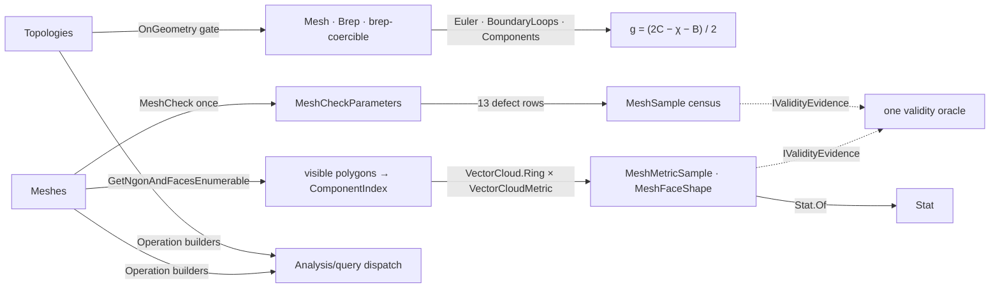

# [RASM_ANALYSIS_INSPECT]

The diagnostics owner — the host topology-scalar and mesh-quality inspection surface of the measured-query runtime. `Topologies` `[Union]` closes structural interrogation over Brep AND Mesh through ONE polymorphic gate: `Kind`/`Domains`/`SolidOrientation`/`Components`/`ContainsPoint` plus a `Scalar` case carrying the `TopologyScalar` `[SmartEnum<int>]` — Manifold/Euler/BoundaryLoops/Genus/HoleCount/FaceCount/EdgeCount/VertexCount as delegate-backed rows, each extracting through the `OnGeometry` mesh-or-brep fold that lowers brep-like inputs through the `Domain/normalization` `BrepForm` lease. The genus is DERIVED, never stored: `g = (2C − χ − B) / 2` folds the Euler characteristic, the boundary-loop count, and the connected-component count through the same three scalar rows, gated on oriented-manifold admission — one formula spanning both geometry families because the rows themselves are polymorphic. `Meshes` `[Union]` closes mesh inspection: the `MeshSampleGroup` banded sample census (`Validity`/`Counts`/`Defects`/`Quality`) over the `MeshSampleKind` `[SmartEnum<int>]` — thirty-plus sample rows whose defect band reads the FULL host `Mesh.Check` + `MeshCheckParameters` defect capture (degenerate/duplicate faces, disjoint pieces, short edges, invalid ngons, naked and non-manifold edges, normal defects, self-intersecting pairs, unused vertices) — plus per-polygon `FaceQuality`/`FaceShape` metrics, visible-polygon extraction (`AtVisiblePolygon`/`VisiblePolygonCount`), naked-edge polylines, and plane-projected outlines.

Face metrics are ngon-aware by construction: `MeshMetric` `[SmartEnum<int>]` (EdgeAspect/Area/Perimeter/Skewness/DihedralAngle) measures VISIBLE polygons — the `GetNgonAndFacesEnumerable` census where an ngon is one polygon and its constituent triangles are not — resolving each polygon to a `ComponentIndex` (`MeshFace` or `MeshNgon`), extracting its boundary ring, and measuring through the `Spatial/cloud` ring metrics (`VectorCloud.Ring` + `VectorCloudMetric.Perimeter`/`Skewness`/`Area`/`EdgeAspect`/`Normal`/`Shape` projected by `Processing/intent` `VectorIntent.Cloud`) — the host fast path (`GetFaceAspectRatio`, `FaceNormals`) short-circuits where it exists and the ring metric is the uniform fallback, with ngon area folding constituent-face areas and ngon normals area-weighting constituent normals. The dihedral angle folds the maximum inter-polygon normal angle over `AdjacentFaces` adjacency through `VectorIntent.Angular`. Receipts (`MeshSample`/`MeshMetricSample`/`MeshFaceShape`) declare validity through the `Domain/rails` `IValidityEvidence` contract — the one oracle admits them with zero local switch. `Requirement.MeshCheck` gates every metric operation so no defective mesh reaches a measurement, and the `Meshes` census itself runs the check ONCE per mesh, threading the captured `MeshCheckParameters` into every defect row.

## [01]-[INDEX]

- [02]-[TOPOLOGY]: `Topologies` `[Union]` (6 cases, 13 factories) + `TopologyScalar` `[SmartEnum<int>]` (8 rows); the `OnGeometry` mesh/brep polymorphic gate; Euler/genus/boundary/component folds; solid orientation, point containment, domain extraction, kind classification.
- [03]-[MESH]: `Meshes` `[Union]` (7 cases, 10 factories) + `MeshSampleGroup` (5 bands) + `MeshSampleKind` (30+ rows) + `MeshMetric` (6 rows); the visible-polygon census; ring-metric measurement; the `MeshSample`/`MeshMetricSample`/`MeshFaceShape` evidence receipts.

## [02]-[TOPOLOGY]

- Owner: `Topologies` `[Union]` — `KindCase` (the `Domain/normalization` `Kind`/`Topology`/`string` classification of any admitted geometry), `DomainsCase` (`Interval` streams — one for curves, U then V for surfaces, surface-like inputs lowered through the `SurfaceForm` lease), `SolidOrientationCase` (`BrepSolidOrientation` — mesh `SolidOrientation()` int mapped onto the SAME enum, brep property read directly), `ComponentsCase` (connected components — `Mesh.SplitDisjointPieces` / `Brep.GetConnectedComponents`, a valid single-component brep duplicating itself), `ContainsPointCase(Point3d)` (solid containment at model tolerance under `Requirement.SolidTopology`), `ScalarCase(TopologyScalar)`. `TopologyScalar` `[BoundaryAdapter]` `[SmartEnum<int>]` — eight rows binding the typed `Output` and the `[UseDelegateFromConstructor]` `Extract(GeometryBase, Op)` delegate: `Manifold` (`bool`), `Euler`/`BoundaryLoops`/`Genus`/`HoleCount`/`FaceCount`/`EdgeCount`/`VertexCount` (`int`), the count rows parameterized by mesh/brep count projections over ONE `ElementCountOf` fold.
- Cases: `Topologies` `Kind` · `Domains` · `SolidOrientation` · `Components` · `ContainsPoint` · `Scalar` (6 declared; scalar factories `Manifold`/`Euler`/`BoundaryLoops`/`Genus`/`HoleCount`/`FaceCount`/`EdgeCount`/`VertexCount` preserve the flat vocabulary); `TopologyScalar` 8 rows.
- Entry: `Topologies.Operation<TGeometry, TOut>()` — the family seam; every arm gates capability (`Capability.EvaluateTopology.Admits` for scalar/orientation/containment — the ONE surviving topology-evaluation row, its byte-identical solid twin collapsed; `Capability.CurveForm || Capability.SurfaceForm` admission for domains) and output type at build. Context is demanded exactly where read — `Kind` (unit-aware classification) declares `requiresContext`, `ContainsPoint` demands through its `SolidTopology` requirement, and the scalar/domain/orientation/component rows run scope-less under the default context; an operation that demands context it never reads is the deleted over-requirement.
- Auto: `OnGeometry` is the ONE mesh/brep polymorphic gate — `Mesh` and `Brep` dispatch directly, `HasBrepForm` natives and brep-coercible inputs lower through the leased `BrepForm`, everything else rejects — every scalar, orientation, containment, and component operation folds through it, so brep-like admission is written ONCE; `EulerOf` computes `V − E + F` from mesh topology lists or brep tables, gating brep counts on `IsManifold`; `BoundaryLoopsOf` counts mesh naked-edge polylines or brep outer/inner loops containing a naked-valence trim edge; `GenusOf` demands oriented-manifold (mesh) or manifold (brep) then applies `g = (2C − χ − B) / 2` through the applicative three-way `(EulerOf, BoundaryLoopsOf, ComponentCountOf).Apply(…)`; `HoleCountOf` is `max(0, B − C)`; `ComponentCountOf` disposes the split pieces it counts.
- Receipt: none on a dedicated rail — scalars project onto `bool`/`int`/`Interval`/`Kind`/`Topology`/`string`/`BrepSolidOrientation`/geometry values admitted through the one oracle; `Components` re-emits owned `GeometryBase` pieces, disposing every piece on a failed typed projection.
- Packages: RhinoCommon (`Mesh` `TopologyVertices`/`TopologyEdges`/`Faces`/`GetNakedEdges`/`SplitDisjointPieces`/`IsManifold`/`IsPointInside`/`SolidOrientation`, `Brep` `Vertices`/`Edges`/`Faces`/`Loops`/`Trims`/`IsManifold`/`IsPointInside`/`SolidOrientation`/`GetConnectedComponents`, `BrepLoopType`, `EdgeAdjacency`, `BrepSolidOrientation`), `Rasm.Domain` (`Kind` capability web + `KindOf`, `BrepForm`/`SurfaceForm` leases, `Requirement.SolidTopology`, `Op`/`Fault` rail), Thinktecture.Runtime.Extensions (`[UseDelegateFromConstructor]` generated delegate binding), LanguageExt.Core.
- Growth: a new topology scalar (a shell count, a cavity count) is one `TopologyScalar` row — key, output, extract delegate over the SAME `OnGeometry` fold; a new structural interrogation is one `Topologies` case; a new geometry family entering the gate is one `OnGeometry` arm serving every row at once.
- Boundary: brep/mesh polymorphism lives in ONE gate — per-operation `is Mesh`/`is Brep` switches beside `OnGeometry` are the deleted repetition; the genus/hole/Euler family is DERIVED from three primitive rows and a stored or re-enumerated genus beside the formula is the killed form; `Capability.EvaluateTopology` is the single admission row — its solid-topology twin was byte-identical and exists no longer, containment escalating through `Requirement.SolidTopology` instead; `SolidOrientationOf` maps the mesh int onto `BrepSolidOrientation` so BOTH families answer in one enum — a mesh-specific orientation enum is the rejected parallel vocabulary; component extraction OWNS its disposal — pieces that fail the typed projection are disposed before the fault leaves, never leaked.

```csharp contract
// --- [RUNTIME_PRELUDE] ----------------------------------------------------------------------
using System;
using System.Globalization;
using Foundation.CSharp.Analyzers.Contracts;
using LanguageExt;
using Rasm.Domain;
using Rhino.Geometry;
using Thinktecture;
using static LanguageExt.Prelude;

namespace Rasm.Analysis;

// --- [TYPES] --------------------------------------------------------------------------------
[Union]
public abstract partial record Topologies {
    private Topologies() { }
    public sealed record KindCase : Topologies;
    public sealed record DomainsCase : Topologies;
    public sealed record SolidOrientationCase : Topologies;
    public sealed record ComponentsCase : Topologies;
    public sealed record ContainsPointCase(Point3d Point) : Topologies;
    public sealed record ScalarCase(TopologyScalar Scalar) : Topologies;
    public static Topologies Kind => new KindCase();
    public static Topologies Domains => new DomainsCase();
    public static Topologies SolidOrientation => new SolidOrientationCase();
    public static Topologies Components => new ComponentsCase();
    public static Topologies ContainsPoint(Point3d point) => new ContainsPointCase(Point: point);
    public static Topologies Manifold => new ScalarCase(Scalar: TopologyScalar.Manifold);
    public static Topologies Euler => new ScalarCase(Scalar: TopologyScalar.Euler);
    public static Topologies BoundaryLoops => new ScalarCase(Scalar: TopologyScalar.BoundaryLoops);
    public static Topologies Genus => new ScalarCase(Scalar: TopologyScalar.Genus);
    public static Topologies HoleCount => new ScalarCase(Scalar: TopologyScalar.HoleCount);
    public static Topologies FaceCount => new ScalarCase(Scalar: TopologyScalar.FaceCount);
    public static Topologies EdgeCount => new ScalarCase(Scalar: TopologyScalar.EdgeCount);
    public static Topologies VertexCount => new ScalarCase(Scalar: TopologyScalar.VertexCount);
    internal Operation<TGeometry, TOut> Operation<TGeometry, TOut>() where TGeometry : notnull => Switch(
        kindCase: static _ => Analyze.Kind<TGeometry, TOut>(),
        domainsCase: static _ => Analyze.TopologyDomains<TGeometry, TOut>(),
        solidOrientationCase: static _ => Analyze.TopologySolidOrientation<TGeometry, TOut>(),
        componentsCase: static _ => Analyze.TopologyComponents<TGeometry, TOut>(),
        containsPointCase: static cp => Analyze.TopologyContains<TGeometry, TOut>(point: cp.Point),
        scalarCase: static scalar => Analyze.TopologyScalar<TGeometry, TOut>(scalar: scalar.Scalar));
}

[BoundaryAdapter, SmartEnum<int>]
public sealed partial class TopologyScalar {
    public static readonly TopologyScalar Manifold = new(key: 0, output: typeof(bool), extract: static (g, op) => Analyze.ManifoldOf(geometry: g, op: op).Map(static value => (object)value));
    public static readonly TopologyScalar Euler = new(key: 1, output: typeof(int), extract: static (g, op) => Analyze.EulerOf(geometry: g, op: op).Map(static value => (object)value));
    public static readonly TopologyScalar BoundaryLoops = new(key: 2, output: typeof(int), extract: static (g, op) => Analyze.BoundaryLoopsOf(geometry: g, op: op).Map(static value => (object)value));
    public static readonly TopologyScalar Genus = new(key: 3, output: typeof(int), extract: static (g, op) => Analyze.GenusOf(geometry: g, op: op).Map(static value => (object)value));
    public static readonly TopologyScalar HoleCount = new(key: 4, output: typeof(int), extract: static (g, op) => Analyze.HoleCountOf(geometry: g, op: op).Map(static value => (object)value));
    public static readonly TopologyScalar FaceCount = new(key: 5, output: typeof(int), extract: static (g, op) => Analyze.ElementCountOf(geometry: g, op: op, meshCount: static m => m.Faces.Count, brepCount: static b => b.Faces.Count).Map(static value => (object)value));
    public static readonly TopologyScalar EdgeCount = new(key: 6, output: typeof(int), extract: static (g, op) => Analyze.ElementCountOf(geometry: g, op: op, meshCount: static m => m.TopologyEdges.Count, brepCount: static b => b.Edges.Count).Map(static value => (object)value));
    public static readonly TopologyScalar VertexCount = new(key: 7, output: typeof(int), extract: static (g, op) => Analyze.ElementCountOf(geometry: g, op: op, meshCount: static m => m.Vertices.Count, brepCount: static b => b.Vertices.Count).Map(static value => (object)value));
    public Type Output { get; }
    [UseDelegateFromConstructor] internal partial Fin<object> Extract(GeometryBase geometry, Op op);
    internal Fin<int> IntegerOf(GeometryBase geometry, Op op) => Extract(geometry: geometry, op: op).Bind(value => value is int count ? Fin.Succ(count) : Fin.Fail<int>(op.InvalidResult()));
}

// --- [OPERATIONS] ---------------------------------------------------------------------------
public static partial class Analyze {
    internal static Operation<TGeometry, TOut> Kind<TGeometry, TOut>() where TGeometry : notnull {
        Op key = Op.Of();
        return (Capability.Universal(type: typeof(TGeometry)) || Rasm.Domain.Kind.Of(type: typeof(TGeometry)).IsSome)
            ? typeof(TOut) switch {
                Type t when t == typeof(Kind) => KernelLift<TGeometry, Kind, Op>(key: key, state: key, extract: static (op, g, ctx) => g.KindOf(context: ctx).Bind(k => op.Accept(value: k)), requiresContext: true).As<TGeometry, TOut>(key: key),
                Type t when t == typeof(string) => KernelLift<TGeometry, string, Op>(key: key, state: key, extract: static (op, g, ctx) => g.KindOf(context: ctx).Bind(k => op.Accept(value: k.ToString(format: null, formatProvider: CultureInfo.InvariantCulture))), requiresContext: true).As<TGeometry, TOut>(key: key),
                Type t when t == typeof(Topology) => KernelLift<TGeometry, Topology, Op>(key: key, state: key, extract: static (op, g, ctx) => g.KindOf(context: ctx).Bind(k => op.Accept(value: k.Topology)), requiresContext: true).As<TGeometry, TOut>(key: key),
                _ => key.Unsupported<TGeometry, TOut>(),
            }
            : key.Unsupported<TGeometry, TOut>();
    }
    internal static Operation<TGeometry, TOut> TopologyDomains<TGeometry, TOut>() where TGeometry : notnull {
        Op key = Op.Of();
        return typeof(TOut) == typeof(Interval) && (Capability.CurveForm.Admits(type: typeof(TGeometry)) || Capability.SurfaceForm.Admits(type: typeof(TGeometry)))
            ? KernelLift<TGeometry, Interval, Op>(key: key, state: key, extract: static (op, g, _) => DomainsOf(geometry: g, op: op).Bind(domains => op.Accept(values: domains))).As<TGeometry, TOut>(key: key)
            : key.Unsupported<TGeometry, TOut>();
    }
    internal static Operation<TGeometry, TOut> TopologySolidOrientation<TGeometry, TOut>() where TGeometry : notnull {
        Op key = Op.Of();
        return typeof(TOut) == typeof(BrepSolidOrientation) && Capability.EvaluateTopology.Admits(type: typeof(TGeometry))
            ? KernelLift<TGeometry, BrepSolidOrientation, Op>(key: key, state: key, extract: static (op, g, _) => SolidOrientationOf(geometry: g, op: op).Bind(orientation => op.Accept(value: orientation))).As<TGeometry, TOut>(key: key)
            : key.Unsupported<TGeometry, TOut>();
    }
    internal static Operation<TGeometry, TOut> TopologyComponents<TGeometry, TOut>() where TGeometry : notnull {
        Op key = Op.Of();
        return ((typeof(Brep).IsAssignableFrom(c: typeof(TGeometry)) || typeof(TGeometry) == typeof(object) || typeof(TGeometry) == typeof(GeometryBase)) && typeof(TOut) == typeof(Brep))
            || ((typeof(Mesh).IsAssignableFrom(c: typeof(TGeometry)) || typeof(TGeometry) == typeof(object) || typeof(TGeometry) == typeof(GeometryBase)) && typeof(TOut) == typeof(Mesh))
            ? KernelLift<TGeometry, TOut, Op>(key: key, state: key, extract: static (op, g, _) => ComponentsOf(geometry: g, op: op).Bind(components => ProjectComponents<TOut>(components: components, op: op))).As<TGeometry, TOut>(key: key)
            : key.Unsupported<TGeometry, TOut>();
    }
    internal static Operation<TGeometry, TOut> TopologyContains<TGeometry, TOut>(Point3d point) where TGeometry : notnull {
        Op key = Op.Of();
        return point.IsValid && typeof(TOut) == typeof(bool) && Capability.EvaluateTopology.Admits(type: typeof(TGeometry))
            ? KernelLift<TGeometry, bool, (Op Key, Point3d Target)>(key: key, state: (Key: key, Target: point), requirement: Requirement.SolidTopology,
                extract: static (s, g, ctx) => ContainsPoint(geometry: g, target: s.Target, context: ctx, op: s.Key).Bind(contained => s.Key.Accept(value: contained))).As<TGeometry, TOut>(key: key)
            : key.Unsupported<TGeometry, TOut>();
    }
    internal static Operation<TGeometry, TOut> TopologyScalar<TGeometry, TOut>(TopologyScalar scalar) where TGeometry : notnull {
        Op key = Op.Of();
        return typeof(TOut) == scalar.Output && Capability.EvaluateTopology.Admits(type: typeof(TGeometry))
            ? KernelLift<TGeometry, TOut, (Op Key, TopologyScalar Scalar)>(key: key, state: (Key: key, Scalar: scalar),
                extract: static (s, g, _) => OnGeometry(geometry: g, op: s.Key, onMesh: mesh => s.Scalar.Extract(geometry: mesh, op: s.Key), onBrep: brep => s.Scalar.Extract(geometry: brep, op: s.Key))
                    .Bind(value => value is TOut typed ? s.Key.Accept(value: typed) : Fin.Fail<Seq<TOut>>(s.Key.Unsupported(geometryType: value.GetType(), outputType: typeof(TOut)))))
            : key.Unsupported<TGeometry, TOut>();
    }
    internal static Fin<Seq<Interval>> DomainsOf<TGeometry>(TGeometry geometry, Op op) where TGeometry : notnull =>
        Optional(geometry).ToFin(op.InvalidInput()).Bind(g => g switch {
            Curve curve => Fin.Succ(Seq(curve.Domain)),
            Surface surface => Fin.Succ(Seq(surface.Domain(direction: 0), surface.Domain(direction: 1))),
            object surfaceLike when Capability.SurfaceForm.Admits(type: surfaceLike.GetType()) => Normalization.SurfaceForm(source: surfaceLike, key: op).Bind(lease => lease.Use(surface => DomainsOf(geometry: surface, op: op))),
            _ => Fin.Fail<Seq<Interval>>(op.Unsupported(g.GetType(), typeof(Interval))),
        });
    internal static Fin<BrepSolidOrientation> SolidOrientationOf<TGeometry>(TGeometry geometry, Op op) where TGeometry : notnull =>
        OnGeometry(geometry: geometry, op: op,
            onMesh: mesh => Fin.Succ(mesh.SolidOrientation() switch {
                1 => BrepSolidOrientation.Outward,
                -1 => BrepSolidOrientation.Inward,
                _ => BrepSolidOrientation.None,
            }),
            onBrep: brep => Fin.Succ(brep.SolidOrientation));
    internal static Fin<bool> ContainsPoint<TGeometry>(TGeometry geometry, Point3d target, Context context, Op op) where TGeometry : notnull =>
        from _ in guard(target.IsValid, op.InvalidInput())
        from contained in OnGeometry(geometry: geometry, op: op,
            onMesh: mesh => Fin.Succ(mesh.IsPointInside(point: target, tolerance: context.Absolute.Value, strictlyIn: false)),
            onBrep: brep => Fin.Succ(brep.IsPointInside(point: target, tolerance: context.Absolute.Value, strictlyIn: false)))
        select contained;
    internal static Fin<Seq<GeometryBase>> ComponentsOf<TGeometry>(TGeometry geometry, Op op) where TGeometry : notnull =>
        Optional(geometry).ToFin(op.InvalidInput()).Bind(g => g switch {
            Mesh mesh => Fin.Succ(toSeq(mesh.SplitDisjointPieces().Cast<GeometryBase>())),
            Brep brep => BrepComponentsOf(brep: brep, op: op),
            GeometryBase { HasBrepForm: true } native => Normalization.BrepForm(source: native, key: op).Bind(lease => lease.Use(brep => BrepComponentsOf(brep: brep, op: op))),
            _ => Fin.Fail<Seq<GeometryBase>>(op.Unsupported(g.GetType(), typeof(Seq<GeometryBase>))),
        });
    internal static Fin<bool> ManifoldOf<TG>(TG geometry, Op op) where TG : notnull =>
        OnGeometry(geometry: geometry, op: op,
            onMesh: static m => Fin.Succ(m.IsManifold(topologicalTest: true, isOriented: out bool _, hasBoundary: out bool _)),
            onBrep: static b => Fin.Succ(b.IsManifold));
    internal static Fin<int> EulerOf<TG>(TG geometry, Op op) where TG : notnull =>
        OnGeometry(geometry: geometry, op: op,
            onMesh: static m => Fin.Succ(m.TopologyVertices.Count - m.TopologyEdges.Count + m.Faces.Count),
            onBrep: b => guard(b.IsManifold, op.Unsupported(typeof(Brep), typeof(int))).ToFin().Map(_ => b.Vertices.Count - b.Edges.Count + b.Faces.Count));
    internal static Fin<int> BoundaryLoopsOf<TG>(TG geometry, Op op) where TG : notnull =>
        OnGeometry(geometry: geometry, op: op,
            onMesh: static m => Fin.Succ(Optional(m.GetNakedEdges()).Map(static loops => loops.Length).IfNone(0)),
            onBrep: static b => Fin.Succ(BrepBoundaryCount(brep: b, predicate: static loop => loop.LoopType is BrepLoopType.Outer or BrepLoopType.Inner)));
    internal static Fin<int> GenusOf<TG>(TG geometry, Op op) where TG : notnull =>
        OnGeometry(geometry: geometry, op: op,
            onMesh: m => m.IsManifold(topologicalTest: true, isOriented: out bool oriented, hasBoundary: out bool _) && oriented
                ? (EulerOf(geometry: m, op: op), BoundaryLoopsOf(geometry: m, op: op), ComponentCountOf(geometry: m, op: op)).Apply(static (euler, boundaries, components) => ((2 * components) - euler - boundaries) / 2).As()
                : Fin.Fail<int>(op.Unsupported(typeof(Mesh), typeof(int))),
            onBrep: b => b.IsManifold
                ? (EulerOf(geometry: b, op: op), BoundaryLoopsOf(geometry: b, op: op), ComponentCountOf(geometry: b, op: op)).Apply(static (euler, boundaries, components) => ((2 * components) - euler - boundaries) / 2).As()
                : Fin.Fail<int>(op.Unsupported(typeof(Brep), typeof(int))));
    internal static Fin<int> HoleCountOf<TG>(TG geometry, Op op) where TG : notnull =>
        OnGeometry(geometry: geometry, op: op,
            onMesh: m => (BoundaryLoopsOf(geometry: m, op: op), ComponentCountOf(geometry: m, op: op)).Apply(static (boundaries, components) => Math.Max(val1: 0, val2: boundaries - components)).As(),
            onBrep: b => (BoundaryLoopsOf(geometry: b, op: op), ComponentCountOf(geometry: b, op: op)).Apply(static (boundaries, components) => Math.Max(val1: 0, val2: boundaries - components)).As());
    internal static Fin<int> ElementCountOf<TG>(TG geometry, Op op, Func<Mesh, int> meshCount, Func<Brep, int> brepCount) where TG : notnull =>
        OnGeometry(geometry: geometry, op: op, onMesh: m => Fin.Succ(meshCount(arg: m)), onBrep: b => Fin.Succ(brepCount(arg: b)));
    private static Operation<TGeometry, TValue> KernelLift<TGeometry, TValue, TState>(Op key, TState state, Func<TState, TGeometry, Context, Fin<Seq<TValue>>> extract, Requirement? requirement = null, bool requiresContext = false) where TGeometry : notnull =>
        Operation<TGeometry, TValue>.Build(
            key: key, requirement: requirement, requiresContext: requiresContext, state: (State: state, Extract: extract),
            evaluator: static (s, geometry) =>
                from context in Env.Asks
                from result in s.Extract(arg1: s.State, arg2: geometry, arg3: context).ToEff()
                select result);
    private static Fin<TResult> OnGeometry<TGeometry, TResult>(TGeometry geometry, Op op, Func<Mesh, Fin<TResult>> onMesh, Func<Brep, Fin<TResult>> onBrep) where TGeometry : notnull =>
        Optional(geometry).ToFin(op.InvalidInput()).Bind(g => g switch {
            Mesh mesh => onMesh(arg: mesh),
            Brep brep => onBrep(arg: brep),
            GeometryBase { HasBrepForm: true } native => Normalization.BrepForm(source: native, key: op).Bind(lease => lease.Use(project: onBrep)),
            object brepLike when Capability.BrepForm.Admits(type: brepLike.GetType()) => Normalization.BrepForm(source: brepLike, key: op).Bind(lease => lease.Use(project: onBrep)),
            _ => Fin.Fail<TResult>(op.Unsupported(g.GetType(), typeof(TResult))),
        });
    private static Fin<Seq<GeometryBase>> BrepComponentsOf(Brep brep, Op op) =>
        brep.GetConnectedComponents() switch {
            Brep[] components when components.Length > 0 => Fin.Succ(toSeq(components.Cast<GeometryBase>())),
            _ when brep.IsValid => op.AcceptValue(brep).Map(static valid => Seq((GeometryBase)valid.DuplicateBrep())),
            _ => Fin.Fail<Seq<GeometryBase>>(op.InvalidResult()),
        };
    private static Fin<Seq<TOut>> ProjectComponents<TOut>(Seq<GeometryBase> components, Op op) =>
        components.TraverseM(component => component is TOut typed ? Fin.Succ(typed) : Fin.Fail<TOut>(op.Unsupported(geometryType: component.GetType(), outputType: typeof(TOut)))).As()
            .BindFail(error => components.Iter(static component => component.Dispose()) switch { _ => Fin.Fail<Seq<TOut>>(error) });
    private static int BrepBoundaryCount(Brep brep, Func<BrepLoop, bool> predicate) =>
        toSeq(brep.Loops).Filter(loop => predicate(arg: loop) && toSeq(loop.Trims).Exists(static trim => trim.Edge is { Valence: EdgeAdjacency.Naked })).Count;
    private static Fin<int> ComponentCountOf<TGeometry>(TGeometry geometry, Op op) where TGeometry : notnull =>
        ComponentsOf(geometry: geometry, op: op)
            .Map(static components => components.Iter(static component => component.Dispose()) switch { _ => Math.Max(val1: 1, val2: components.Count) });
}
```

## [03]-[MESH]

- Owner: `MeshSampleGroup` `[BoundaryAdapter]` `[SmartEnum<int>]` — five bands (`None`/`Validity`/`Count`/`Defect`/`Quality`) with the `Inspect` column marking the one band that demands a `Mesh.Check` capture, and `Kinds` deriving each band's row set from the full `MeshSampleKind.Items` — the band membership IS the query, never a hand-kept list. `MeshSampleKind` `[SmartEnum<int>]` — thirty-plus rows binding the band and the `[UseDelegateFromConstructor]` `Sample(Mesh, MeshCheckParameters)` delegate: validity flags (`Valid`/`Closed`/`Oriented`/`Solid`/`Manifold`/`BoundaryFree`), census counts (`Vertices`/`Faces`/`Triangles`/`Quads`/`Edges`/`Euler`/`VisiblePolygons` — the topology rows reusing the `TopologyScalar` extractors), the THIRTEEN defect counters reading the threaded `MeshCheckParameters` capture (`DegenerateFaceCount`/`DisjointMeshCount`/`DuplicateFaceCount`/`ExtremelyShortEdgeCount`/`InvalidNgonCount`/`NakedEdgeCount`/`NonManifoldEdgeCount`/`NonUnitVectorNormalCount`/`RandomFaceNormalCount`/`SelfIntersectingPairsCount`/`UnusedVertexCount`/`VertexFaceNormalsDifferCount`/`ZeroLengthNormalCount`), and quality folds (`MaximumValence`/`MinimumValence`/`AverageValence` over `TopologyVertices.ConnectedEdgesCount`, `BoundaryLoopCount`, `Genus`). `MeshMetric` `[BoundaryAdapter]` `[SmartEnum<int>]` — six rows (`None` rejecting, `EdgeAspect`/`Area`/`Perimeter`/`Skewness`/`DihedralAngle`) measuring one visible polygon through the `[UseDelegateFromConstructor]` measure delegate. `Meshes` `[Union]` — `SamplesCase(MeshSampleGroup)`/`FaceQualityCase(MeshMetric)`/`FaceShapeCase`/`AtVisiblePolygonCase(Option<int>)`/`VisiblePolygonCountCase`/`NakedEdgesCase`/`OutlineCase(Plane)`.
- Cases: `Meshes` 7 declared (factories `Validity`/`Counts`/`Defects`/`Quality`/`FaceQuality`/`FaceShape`/`AtVisiblePolygon`/`VisiblePolygonCount`/`NakedEdges`/`Outline`); `MeshSampleKind` 32 rows in 5 bands; `MeshMetric` 6 rows.
- Entry: `Meshes.Operation<TGeometry, TOut>()` — every arm lifts through `MeshLift` (the `Analyze.Native` mesh specialization: a typed `Operation<Mesh, TValue>` applied to any geometry that IS a mesh, rejecting the rest), so the family accepts `object`-typed pipelines and stays mesh-strict at evaluation.
- Auto: the sample census runs `Mesh.Check` ONCE — `MeshCheck` captures `MeshCheckParameters.Defaults()` through `Requirement.MeshReport`, and the band's rows all read the same capture; visible-polygon resolution (`VisiblePolygonSourceOf`) maps an ngon-or-face onto the canonical `ComponentIndex` (`MeshNgon` where the face belongs to an ngon, `MeshFace` otherwise) so every per-polygon metric addresses the SAME component vocabulary the rest of the corpus uses; `VerticesOf` extracts the polygon boundary ring (`GetFaceVertices` for faces, `NgonBoundaryVertexList` for ngons); metric measurement short-circuits host fast paths (`GetFaceAspectRatio` for face aspect; `FaceNormals` for face normals) and folds the ring metric via `VectorCloud.Ring` + `VectorIntent.Cloud` everywhere else; ngon area sums constituent-face areas, ngon normals area-weight constituent face normals, and the dihedral fold walks `AdjacentFaces` neighbours (ngon-external only) taking the maximum `VectorIntent.Angular` normal angle; `MeshMetricStatOp` folds any metric's samples through the `Domain/stats` Welford `Stat.Of` so per-polygon streams and their summary ride one machinery.
- Receipt: `MeshSample(Kind, Value)` — non-negative sample under a real band; `MeshMetricSample(Source, Value)` — addressed finite non-negative measurement; `MeshFaceShape(Source, Shape)` — addressed `Spatial/cloud` `VectorCloudShape` classification; all three declare `IValidityEvidence` through the `Domain/rails` `ValidityClaim` fold, oracle-admitted.
- Packages: RhinoCommon (`Mesh.Check` + `MeshCheckParameters`, `MeshNgon` + `Ngons` census, `Faces` `GetFaceVertices`/`GetFaceAspectRatio`/`AdjacentFaces`/`TriangleCount`/`QuadCount`, `FaceNormals.ComputeFaceNormals`, `TopologyVertices.ConnectedEdgesCount`, `GetNakedEdges`, `GetOutlines(Plane)`, `GetNgonAndFacesEnumerable`/`GetNgonAndFacesCount`, `ComponentIndex`), `Rasm.Vectors` (`VectorCloud.Ring`, `VectorCloudMetric`, `VectorCloudShape`, `VectorIntent.Cloud`/`Direction`/`Angular`), `Rasm.Domain` (`Requirement.MeshCheck`/`MeshReport`, `Stat`, `TopologyProjection`, `Op`/`Fault` rail), Thinktecture.Runtime.Extensions, LanguageExt.Core.
- Growth: a new mesh sample is one `MeshSampleKind` row in its band — the census, the banded factories, and the receipt machinery are untouched; a new face metric is one `MeshMetric` row binding a measure delegate over the SAME polygon resolution; a new polygon-level extraction is one `Meshes` case lifted through `MeshLift`.
- Boundary: the census bands derive from row membership — a hand-maintained per-band kind list beside the enum is the deleted drift form; defect rows read the ONE threaded `MeshCheckParameters` capture and a per-row re-run of `Mesh.Check` is the killed N-fold host cost; face metrics measure VISIBLE polygons through the canonical `ComponentIndex` addressing — a triangle-level metric family beside the ngon-aware one is the rejected split vocabulary; ring measurement routes through the `Spatial/cloud` metric surface exclusively — a local perimeter/skewness/area loop beside `VectorCloudMetric` is the killed parallel rail; `AtVisiblePolygon` re-emits the `Domain/normalization` `TopologyProjection` carrier (mesh-component band) so downstream face extraction shares the corpus-wide transfer/disposal protocol.

```csharp contract
// --- [RUNTIME_PRELUDE] ----------------------------------------------------------------------
using System;
using System.Linq;
using System.Runtime.InteropServices;
using Foundation.CSharp.Analyzers.Contracts;
using LanguageExt;
using Rasm.Domain;
using Rasm.Vectors;
using Rhino.Geometry;
using Thinktecture;
using static LanguageExt.Prelude;

namespace Rasm.Analysis;

// --- [TYPES] --------------------------------------------------------------------------------
[Union]
public abstract partial record Meshes {
    private Meshes() { }
    public sealed record SamplesCase(MeshSampleGroup Group) : Meshes;
    public sealed record FaceQualityCase(MeshMetric Metric) : Meshes;
    public sealed record FaceShapeCase : Meshes;
    public sealed record AtVisiblePolygonCase(Option<int> Value) : Meshes;
    public sealed record VisiblePolygonCountCase : Meshes;
    public sealed record NakedEdgesCase : Meshes;
    public sealed record OutlineCase(Plane Plane) : Meshes;
    private static readonly Op SamplesKey = Op.Of(name: "MeshSamples"), FaceQualityKey = Op.Of(name: "MeshFaceQuality"), FaceShapeKey = Op.Of(name: "MeshFaceShape");
    private static readonly Op AtVisiblePolygonKey = Op.Of(name: "MeshAtVisiblePolygon"), VisiblePolygonCountKey = Op.Of(name: "MeshVisiblePolygonCount"), NakedEdgesKey = Op.Of(name: "MeshNakedEdges"), OutlineKey = Op.Of(name: "MeshOutline");
    public static Meshes Validity => new SamplesCase(Group: MeshSampleGroup.Validity);
    public static Meshes Counts => new SamplesCase(Group: MeshSampleGroup.Count);
    public static Meshes Defects => new SamplesCase(Group: MeshSampleGroup.Defect);
    public static Meshes Quality => new SamplesCase(Group: MeshSampleGroup.Quality);
    public static Meshes FaceQuality(MeshMetric? metric = null) => new FaceQualityCase(Metric: metric ?? MeshMetric.EdgeAspect);
    public static Meshes FaceShape => new FaceShapeCase();
    public static Meshes AtVisiblePolygon(int? index = null) => new AtVisiblePolygonCase(Value: Optional(index));
    public static Meshes VisiblePolygonCount => new VisiblePolygonCountCase();
    public static Meshes NakedEdges => new NakedEdgesCase();
    public static Meshes Outline(Plane plane) => new OutlineCase(Plane: plane);
    internal Operation<TGeometry, TOut> Operation<TGeometry, TOut>() where TGeometry : notnull => Switch(
        samplesCase: static s => Analyze.MeshLift<TGeometry, TOut, MeshSample>(key: SamplesKey, source: Analyze.MeshSamples(group: s.Group)),
        faceQualityCase: static fq => fq.Metric.Equals(MeshMetric.None)
            ? Analysis.Operation<TGeometry, TOut>.Reject(key: FaceQualityKey, fault: FaceQualityKey.InvalidInput())
            : typeof(TOut) switch {
                Type output when output == typeof(MeshMetricSample) => Analyze.MeshLift<TGeometry, TOut, MeshMetricSample>(key: FaceQualityKey, source: Analyze.MeshMetricSamplesOp(metric: fq.Metric, key: FaceQualityKey)),
                Type output when output == typeof(Stat) => Analyze.MeshLift<TGeometry, TOut, Stat>(key: FaceQualityKey, source: Analyze.MeshMetricStatOp(metric: fq.Metric, key: FaceQualityKey)),
                _ => FaceQualityKey.Unsupported<TGeometry, TOut>(),
            },
        faceShapeCase: static _ => typeof(TOut) == typeof(MeshFaceShape)
            ? Analyze.MeshLift<TGeometry, TOut, MeshFaceShape>(key: FaceShapeKey, source: Analyze.MeshFaceShapesOp(key: FaceShapeKey))
            : FaceShapeKey.Unsupported<TGeometry, TOut>(),
        atVisiblePolygonCase: static at => Analyze.MeshLift<TGeometry, TOut, TopologyProjection>(key: AtVisiblePolygonKey, source: Analyze.MeshAtVisiblePolygon(index: at.Value)),
        visiblePolygonCountCase: static _ => Analyze.MeshLift<TGeometry, TOut, int>(key: VisiblePolygonCountKey, source: Analyze.MeshVisiblePolygonCount),
        nakedEdgesCase: static _ => Analyze.MeshLift<TGeometry, TOut, Polyline>(key: NakedEdgesKey, source: Analyze.MeshNakedEdges),
        outlineCase: static o => Analyze.MeshLift<TGeometry, TOut, Polyline>(key: OutlineKey, source: Analyze.MeshOutline(plane: o.Plane)));
}

[BoundaryAdapter, SmartEnum<int>]
public sealed partial class MeshSampleGroup {
    public static readonly MeshSampleGroup None = new(key: 0, label: nameof(None), inspect: false);
    public static readonly MeshSampleGroup Validity = new(key: 1, label: nameof(Validity), inspect: false);
    public static readonly MeshSampleGroup Count = new(key: 2, label: nameof(Count), inspect: false);
    public static readonly MeshSampleGroup Defect = new(key: 3, label: nameof(Defect), inspect: true);
    public static readonly MeshSampleGroup Quality = new(key: 4, label: nameof(Quality), inspect: false);
    public string Label { get; }
    internal bool Inspect { get; }
    internal Seq<MeshSampleKind> Kinds => toSeq(MeshSampleKind.Items).Filter(kind => kind.Group.Equals(this));
}

[SmartEnum<int>]
public sealed partial class MeshSampleKind {
    public static readonly MeshSampleKind None = new(key: 0, group: MeshSampleGroup.None, sample: static (_, _) => Fin.Succ(0));
    public static readonly MeshSampleKind Valid = new(key: 1, group: MeshSampleGroup.Validity, sample: static (m, _) => Fin.Succ(m.IsValid ? 1 : 0));
    public static readonly MeshSampleKind Closed = new(key: 2, group: MeshSampleGroup.Validity, sample: static (m, _) => Fin.Succ(m.IsClosed ? 1 : 0));
    public static readonly MeshSampleKind Oriented = new(key: 3, group: MeshSampleGroup.Validity, sample: static (m, _) => Fin.Succ((m.IsManifold(topologicalTest: true, isOriented: out bool oriented, hasBoundary: out bool _) && oriented) ? 1 : 0));
    public static readonly MeshSampleKind Solid = new(key: 4, group: MeshSampleGroup.Validity, sample: static (m, _) => Fin.Succ(m.IsSolid ? 1 : 0));
    public static readonly MeshSampleKind Manifold = new(key: 5, group: MeshSampleGroup.Validity, sample: static (m, _) => Analyze.ManifoldOf(geometry: m, op: ManifoldKey).Map(static value => value ? 1 : 0));
    public static readonly MeshSampleKind BoundaryFree = new(key: 6, group: MeshSampleGroup.Validity, sample: static (m, _) => Fin.Succ((m.IsManifold(topologicalTest: true, isOriented: out bool _, hasBoundary: out bool boundary) && !boundary) ? 1 : 0));
    public static readonly MeshSampleKind Vertices = new(key: 10, group: MeshSampleGroup.Count, sample: static (m, _) => TopologyScalar.VertexCount.IntegerOf(geometry: m, op: VertexCountKey));
    public static readonly MeshSampleKind Faces = new(key: 11, group: MeshSampleGroup.Count, sample: static (m, _) => TopologyScalar.FaceCount.IntegerOf(geometry: m, op: FaceCountKey));
    public static readonly MeshSampleKind Triangles = new(key: 12, group: MeshSampleGroup.Count, sample: static (m, _) => Fin.Succ(m.Faces.TriangleCount));
    public static readonly MeshSampleKind Quads = new(key: 13, group: MeshSampleGroup.Count, sample: static (m, _) => Fin.Succ(m.Faces.QuadCount));
    public static readonly MeshSampleKind Edges = new(key: 14, group: MeshSampleGroup.Count, sample: static (m, _) => TopologyScalar.EdgeCount.IntegerOf(geometry: m, op: EdgeCountKey));
    public static readonly MeshSampleKind Euler = new(key: 15, group: MeshSampleGroup.Count, sample: static (m, _) => Analyze.EulerOf(geometry: m, op: EulerKey));
    public static readonly MeshSampleKind VisiblePolygons = new(key: 16, group: MeshSampleGroup.Count, sample: static (m, _) => Fin.Succ(m.GetNgonAndFacesCount()));
    public static readonly MeshSampleKind DegenerateFaces = new(key: 20, group: MeshSampleGroup.Defect, sample: static (_, p) => Fin.Succ(p.DegenerateFaceCount));
    public static readonly MeshSampleKind DisjointMeshes = new(key: 21, group: MeshSampleGroup.Defect, sample: static (_, p) => Fin.Succ(p.DisjointMeshCount));
    public static readonly MeshSampleKind DuplicateFaces = new(key: 22, group: MeshSampleGroup.Defect, sample: static (_, p) => Fin.Succ(p.DuplicateFaceCount));
    public static readonly MeshSampleKind ExtremelyShortEdges = new(key: 23, group: MeshSampleGroup.Defect, sample: static (_, p) => Fin.Succ(p.ExtremelyShortEdgeCount));
    public static readonly MeshSampleKind InvalidNgons = new(key: 24, group: MeshSampleGroup.Defect, sample: static (_, p) => Fin.Succ(p.InvalidNgonCount));
    public static readonly MeshSampleKind NakedEdges = new(key: 25, group: MeshSampleGroup.Defect, sample: static (_, p) => Fin.Succ(p.NakedEdgeCount));
    public static readonly MeshSampleKind NonManifoldEdges = new(key: 26, group: MeshSampleGroup.Defect, sample: static (_, p) => Fin.Succ(p.NonManifoldEdgeCount));
    public static readonly MeshSampleKind NonUnitVectorNormals = new(key: 27, group: MeshSampleGroup.Defect, sample: static (_, p) => Fin.Succ(p.NonUnitVectorNormalCount));
    public static readonly MeshSampleKind RandomFaceNormals = new(key: 28, group: MeshSampleGroup.Defect, sample: static (_, p) => Fin.Succ(p.RandomFaceNormalCount));
    public static readonly MeshSampleKind SelfIntersectingPairs = new(key: 29, group: MeshSampleGroup.Defect, sample: static (_, p) => Fin.Succ(p.SelfIntersectingPairsCount));
    public static readonly MeshSampleKind UnusedVertices = new(key: 30, group: MeshSampleGroup.Defect, sample: static (_, p) => Fin.Succ(p.UnusedVertexCount));
    public static readonly MeshSampleKind VertexFaceNormalsDiffer = new(key: 31, group: MeshSampleGroup.Defect, sample: static (_, p) => Fin.Succ(p.VertexFaceNormalsDifferCount));
    public static readonly MeshSampleKind ZeroLengthNormals = new(key: 32, group: MeshSampleGroup.Defect, sample: static (_, p) => Fin.Succ(p.ZeroLengthNormalCount));
    public static readonly MeshSampleKind MaximumValence = new(key: 40, group: MeshSampleGroup.Quality, sample: static (m, _) => Fin.Succ(Valences(mesh: m).Fold(0, Math.Max)));
    public static readonly MeshSampleKind MinimumValence = new(key: 41, group: MeshSampleGroup.Quality, sample: static (m, _) => Valences(mesh: m) switch { Seq<int> v when !v.IsEmpty => Fin.Succ(v.Fold(v.Head.IfNone(0), Math.Min)), _ => Fin.Succ(0) });
    public static readonly MeshSampleKind BoundaryLoopCount = new(key: 42, group: MeshSampleGroup.Quality, sample: static (m, _) => Analyze.BoundaryLoopsOf(geometry: m, op: BoundaryLoopsKey));
    public static readonly MeshSampleKind Genus = new(key: 43, group: MeshSampleGroup.Quality, sample: static (m, _) => Analyze.GenusOf(geometry: m, op: GenusKey));
    public static readonly MeshSampleKind AverageValence = new(key: 44, group: MeshSampleGroup.Quality, sample: static (m, _) => Valences(mesh: m) switch { Seq<int> v when !v.IsEmpty => Fin.Succ((int)Math.Round(v.Fold(0, static (acc, n) => acc + n) / (double)v.Count, MidpointRounding.ToEven)), _ => Fin.Succ(0) });
    private static readonly Op ManifoldKey = Op.Of(name: "MeshManifold"), VertexCountKey = Op.Of(name: "MeshVertexCount"), FaceCountKey = Op.Of(name: "MeshFaceCount"), EdgeCountKey = Op.Of(name: "MeshEdgeCount");
    private static readonly Op EulerKey = Op.Of(name: "MeshEuler"), BoundaryLoopsKey = Op.Of(name: "MeshBoundaryLoops"), GenusKey = Op.Of(name: "MeshGenus");
    internal MeshSampleGroup Group { get; }
    [UseDelegateFromConstructor] internal partial Fin<int> Sample(Mesh mesh, MeshCheckParameters parameters);
    private static Seq<int> Valences(Mesh mesh) =>
        toSeq(Enumerable.Range(0, mesh.TopologyVertices.Count).Select(mesh.TopologyVertices.ConnectedEdgesCount));
}

[BoundaryAdapter, SmartEnum<int>]
public sealed partial class MeshMetric {
    public static readonly MeshMetric None = new(key: 0, measure: static (_, _, _, _, key) => Fin.Fail<double>(key.InvalidInput()));
    public static readonly MeshMetric EdgeAspect = new(key: 1, measure: FaceEdgeAspect);
    public static readonly MeshMetric Area = new(key: 2, measure: FaceArea);
    public static readonly MeshMetric Perimeter = new(key: 3, measure: static (mesh, source, vertices, context, key) => RingMetric<double>(metric: VectorCloudMetric.Perimeter, mesh: mesh, source: source, vertices: vertices, context: context, key: key));
    public static readonly MeshMetric Skewness = new(key: 4, measure: static (mesh, source, vertices, context, key) => RingMetric<double>(metric: VectorCloudMetric.Skewness, mesh: mesh, source: source, vertices: vertices, context: context, key: key));
    public static readonly MeshMetric DihedralAngle = new(key: 5, measure: FaceMaxDihedral);
    [UseDelegateFromConstructor] private partial Fin<double> Measure(Mesh mesh, ComponentIndex source, Seq<Point3d> vertices, Context context, Op key);
    internal Fin<MeshMetricSample> Sample(Mesh? mesh, MeshNgon polygon, Context context, Op key) =>
        Optional(mesh).ToFin(key.InvalidInput())
            .Bind(native => Analyze.VisiblePolygonSourceOf(mesh: native, polygon: polygon, key: key)
                .Bind(source => VerticesOf(mesh: native, source: source, key: key).Map(vertices => (Mesh: native, Source: source, Vertices: vertices))))
            .Bind(state => Measure(mesh: state.Mesh, source: state.Source, vertices: state.Vertices, context: context, key: key).Map(value => (state.Source, Value: value)))
            .Bind(state => key.AcceptValue(value: new MeshMetricSample(Source: state.Source, Value: state.Value)));
    internal static Fin<MeshFaceShape> Shape(Mesh? mesh, MeshNgon polygon, Context context, Op key) =>
        Optional(mesh).ToFin(key.InvalidInput())
            .Bind(native => Analyze.VisiblePolygonSourceOf(mesh: native, polygon: polygon, key: key)
                .Bind(source => VerticesOf(mesh: native, source: source, key: key).Map(vertices => (Mesh: native, Source: source, Vertices: vertices))))
            .Bind(state => RingMetric<VectorCloudShape>(metric: VectorCloudMetric.Shape, mesh: state.Mesh, source: state.Source, vertices: state.Vertices, context: context, key: key)
                .Map(shape => new MeshFaceShape(Source: state.Source, Shape: shape)));
    private static Fin<Seq<Point3d>> VerticesOf(Mesh mesh, ComponentIndex source, Op key) => source switch {
        { ComponentIndexType: ComponentIndexType.MeshFace, Index: int face } when face >= 0 && face < mesh.Faces.Count =>
            mesh.Faces.GetFaceVertices(face, out Point3f a, out Point3f b, out Point3f c, out Point3f d) switch {
                true when mesh.Faces[face].IsQuad => Fin.Succ(Seq((Point3d)a, (Point3d)b, (Point3d)c, (Point3d)d)),
                true => Fin.Succ(Seq((Point3d)a, (Point3d)b, (Point3d)c)),
                false => Fin.Fail<Seq<Point3d>>(key.InvalidResult()),
            },
        { ComponentIndexType: ComponentIndexType.MeshNgon, Index: int ngon } when ngon >= 0 && ngon < mesh.Ngons.Count =>
            Optional(mesh.Ngons.NgonBoundaryVertexList(ngon: mesh.Ngons[ngon], bAppendStartPoint: false)).ToFin(key.InvalidResult()).Map(static points => toSeq(points)),
        _ => Fin.Fail<Seq<Point3d>>(key.InvalidInput()),
    };
    private static Fin<Seq<int>> FaceIndicesOf(Mesh mesh, int ngon, Op key) =>
        Optional(mesh.Ngons[ngon].FaceIndexList()).ToFin(key.InvalidResult())
            .Bind(faces => toSeq(faces).TraverseM(face => face <= int.MaxValue && (int)face < mesh.Faces.Count ? Fin.Succ((int)face) : Fin.Fail<int>(key.InvalidResult())).As()
                .Bind(indices => indices.IsEmpty ? Fin.Fail<Seq<int>>(key.InvalidResult()) : Fin.Succ(indices)));
    private static Fin<TOut> RingMetric<TOut>(VectorCloudMetric metric, Mesh mesh, ComponentIndex source, Seq<Point3d> vertices, Context context, Op key) =>
        (vertices.IsEmpty ? VerticesOf(mesh: mesh, source: source, key: key) : Fin.Succ(vertices))
            .Bind(points => VectorCloud.Ring(points: points, context: context, key: key))
            .Bind(cloud => VectorIntent.Cloud(cloud: cloud, metric: metric, key: key))
            .Bind(intent => intent.Project<TOut>(context: context, key: key));
    private static Fin<Vector3d> NormalOf(Mesh mesh, ComponentIndex source, Seq<Point3d> vertices, Context context, Op key) => source switch {
        { ComponentIndexType: ComponentIndexType.MeshFace, Index: int face } when face >= 0 && face < mesh.Faces.Count =>
            (mesh.FaceNormals.Count > face || mesh.FaceNormals.ComputeFaceNormals()) && mesh.FaceNormals.Count > face
                ? VectorIntent.Direction(value: new Vector3d(mesh.FaceNormals[face])).Project<Vector3d>(context: context, key: key)
                : Fin.Fail<Vector3d>(key.InvalidResult()),
        { ComponentIndexType: ComponentIndexType.MeshNgon, Index: int ngon } when ngon >= 0 && ngon < mesh.Ngons.Count =>
            FaceIndicesOf(mesh: mesh, ngon: ngon, key: key)
                .Bind(faces => ((mesh.FaceNormals.Count >= mesh.Faces.Count || mesh.FaceNormals.ComputeFaceNormals()) && mesh.FaceNormals.Count >= mesh.Faces.Count) switch {
                    true => faces.TraverseM(face => FaceArea(mesh: mesh, source: new ComponentIndex(ComponentIndexType.MeshFace, face), vertices: Seq<Point3d>(), context: context, key: key)
                            .Map(area => new Vector3d(mesh.FaceNormals[face]) * area)).As()
                        .Bind(weighted => VectorIntent.Direction(value: weighted.Fold(initialState: Vector3d.Zero, f: static (sum, normal) => sum + normal)).Project<Vector3d>(context: context, key: key)),
                    false => RingMetric<Vector3d>(metric: VectorCloudMetric.Normal, mesh: mesh, source: source, vertices: vertices, context: context, key: key),
                }),
        _ => Fin.Fail<Vector3d>(key.InvalidInput()),
    };
    private static Fin<double> FaceEdgeAspect(Mesh mesh, ComponentIndex source, Seq<Point3d> vertices, Context context, Op key) =>
        (source switch {
            { ComponentIndexType: ComponentIndexType.MeshFace, Index: int index } when index >= 0 && index < mesh.Faces.Count => Fin.Succ(mesh.Faces.GetFaceAspectRatio(index: index)),
            _ => Fin.Fail<double>(key.InvalidInput()),
        }).BindFail(_ => RingMetric<double>(metric: VectorCloudMetric.EdgeAspect, mesh: mesh, source: source, vertices: vertices, context: context, key: key));
    private static Fin<double> FaceArea(Mesh mesh, ComponentIndex source, Seq<Point3d> vertices, Context context, Op key) =>
        source switch {
            { ComponentIndexType: ComponentIndexType.MeshNgon, Index: int ngon } when ngon >= 0 && ngon < mesh.Ngons.Count =>
                FaceIndicesOf(mesh: mesh, ngon: ngon, key: key)
                    .Bind(faces => faces.TraverseM(face => FaceArea(mesh: mesh, source: new ComponentIndex(ComponentIndexType.MeshFace, face), vertices: Seq<Point3d>(), context: context, key: key)).As())
                    .Map(static areas => areas.Fold(initialState: 0.0, f: static (total, area) => total + area)),
            _ => RingMetric<double>(metric: VectorCloudMetric.Area, mesh: mesh, source: source, vertices: vertices, context: context, key: key),
        };
    private static Fin<double> FaceMaxDihedral(Mesh mesh, ComponentIndex source, Seq<Point3d> vertices, Context context, Op key) =>
        NormalOf(mesh: mesh, source: source, vertices: vertices, context: context, key: key).Bind(normal =>
            (source switch {
                { ComponentIndexType: ComponentIndexType.MeshFace, Index: int face } when face >= 0 && face < mesh.Faces.Count => Fin.Succ(toSeq(mesh.Faces.AdjacentFaces(faceIndex: face))),
                { ComponentIndexType: ComponentIndexType.MeshNgon, Index: int ngon } when ngon >= 0 && ngon < mesh.Ngons.Count =>
                    FaceIndicesOf(mesh: mesh, ngon: ngon, key: key)
                        .Map((Seq<int> parts) => parts.Bind((int face) => toSeq(mesh.Faces.AdjacentFaces(faceIndex: face))).Filter((int other) => !parts.Exists((int face) => face == other)).Distinct()),
                _ => Fin.Fail<Seq<int>>(key.InvalidInput()),
            }).Bind((Seq<int> neighbours) => neighbours
                .Fold(initialState: Fin.Succ((Max: 0.0, Mesh: mesh, Normal: normal, Context: context, Key: key)),
                    f: static (state, other) => state.Bind(s => NormalOf(mesh: s.Mesh, source: new ComponentIndex(ComponentIndexType.MeshFace, other), vertices: Seq<Point3d>(), context: s.Context, key: s.Key)
                        .Bind(neighbour => VectorIntent.Angular(a: s.Normal, b: neighbour).Project<double>(context: s.Context, key: s.Key)
                            .Map(angle => (Max: Math.Max(val1: s.Max, val2: angle), s.Mesh, s.Normal, s.Context, s.Key)))))
                .Map(static state => state.Max)));
}

// --- [MODELS] -------------------------------------------------------------------------------
[BoundaryAdapter, StructLayout(LayoutKind.Auto)]
public readonly record struct MeshSample(MeshSampleKind Kind, int Value) : IValidityEvidence {
    public bool IsValid => ValidityClaim.All(
        ValidityClaim.Of(!Kind.Group.Equals(MeshSampleGroup.None)),
        ValidityClaim.Of(Value >= 0));
}

[BoundaryAdapter, StructLayout(LayoutKind.Auto)]
public readonly record struct MeshMetricSample(ComponentIndex Source, double Value) : IValidityEvidence {
    public bool IsValid => ValidityClaim.All(
        ValidityClaim.Of(Source is { ComponentIndexType: not ComponentIndexType.InvalidType, Index: >= 0 }),
        ValidityClaim.Nonnegative(Value));
}

[BoundaryAdapter, StructLayout(LayoutKind.Auto)]
public readonly record struct MeshFaceShape(ComponentIndex Source, VectorCloudShape Shape) : IValidityEvidence {
    public bool IsValid => ValidityClaim.Of(Source is { ComponentIndexType: not ComponentIndexType.InvalidType, Index: >= 0 });
}

// --- [OPERATIONS] ---------------------------------------------------------------------------
public static partial class Analyze {
    internal static Operation<TGeometry, TOut> MeshLift<TGeometry, TOut, TValue>(Op key, Operation<Mesh, TValue> source) where TGeometry : notnull =>
        Native<TGeometry, TOut, Mesh, TValue, Operation<Mesh, TValue>>(key: key, state: source, requirement: source.Requirement, requiresContext: source.RequiresContext,
            project: static (operation, mesh) => operation.Apply(geometry: Seq(mesh)));
    internal static Operation<Mesh, MeshCheckParameters> MeshCheck {
        get {
            Op key = Op.Of();
            return Operation<Mesh, MeshCheckParameters>.Build(key: key, state: key,
                evaluator: static (op, geometry) =>
                    from parameters in Requirement.MeshReport(mesh: geometry, check: op.ToString()).ToEff()
                    from result in op.Accept(value: parameters).ToEff()
                    select result);
        }
    }
    internal static Operation<Mesh, MeshSample> MeshSamples(MeshSampleGroup group) {
        Op key = Op.Of(name: $"Mesh{group.Label}");
        return Operation<Mesh, MeshSample>.Build(key: key, state: (Key: key, group.Kinds, group.Inspect),
            evaluator: static (state, geometry) => state.Inspect switch {
                true => from parameters in MeshCheck.Apply(geometry: Seq(geometry))
                        from head in parameters.Head.ToFin(state.Key.InvalidResult()).ToEff()
                        from samples in state.Kinds.TraverseM(kind => kind.Sample(mesh: geometry, parameters: head).Bind(value => state.Key.AcceptValue(value: new MeshSample(Kind: kind, Value: value)))).As().ToEff()
                        select samples,
                false => state.Kinds.TraverseM(kind => kind.Sample(mesh: geometry, parameters: default).Bind(value => state.Key.AcceptValue(value: new MeshSample(Kind: kind, Value: value)))).As().ToEff(),
            });
    }
    internal static Operation<Mesh, MeshMetricSample> MeshMetricSamplesOp(MeshMetric metric, Op key) =>
        Operation<Mesh, MeshMetricSample>.Build(key: key, state: (Key: key, Metric: metric), requirement: Requirement.MeshCheck, requiresContext: true,
            evaluator: static (state, geometry) =>
                from context in Env.Asks
                from samples in MeshMetricSamples(mesh: geometry, metric: state.Metric, context: context, key: state.Key).ToEff()
                select samples);
    internal static Operation<Mesh, Stat> MeshMetricStatOp(MeshMetric metric, Op key) =>
        Operation<Mesh, Stat>.Build(key: key, state: (Key: key, Metric: metric), requirement: Requirement.MeshCheck, requiresContext: true,
            evaluator: static (state, geometry) =>
                from context in Env.Asks
                from stat in MeshMetricSamples(mesh: geometry, metric: state.Metric, context: context, key: state.Key)
                    .Bind(samples => Stat.Of(values: samples.Map(static sample => sample.Value), key: state.Key))
                    .Bind(stat => state.Key.Accept(value: stat)).ToEff()
                select stat);
    internal static Operation<Mesh, MeshFaceShape> MeshFaceShapesOp(Op key) =>
        Operation<Mesh, MeshFaceShape>.Build(key: key, state: key, requirement: Requirement.MeshCheck, requiresContext: true,
            evaluator: static (op, geometry) =>
                from context in Env.Asks
                from shapes in VisiblePolygonsOf(mesh: geometry, key: op).Bind(polygons => polygons.TraverseM(polygon => MeshMetric.Shape(mesh: geometry, polygon: polygon, context: context, key: op)).As()).ToEff()
                select shapes);
    internal static Operation<Mesh, TopologyProjection> MeshAtVisiblePolygon(Option<int> index = default) {
        Op key = Op.Of();
        return Operation<Mesh, TopologyProjection>.Build(key: key, state: (Key: key, Selector: index),
            evaluator: static (state, geometry) => VisiblePolygonsOf(mesh: geometry, key: state.Key).Bind(polygons => (Source: polygons, Index: state.Selector.IfNone(0)) switch {
                (Seq<MeshNgon> source, _) when source.Count == 0 => Fin.Fail<Seq<TopologyProjection>>(state.Key.InvalidResult()),
                (Seq<MeshNgon> source, int selected) when selected < 0 || selected >= source.Count => Fin.Fail<Seq<TopologyProjection>>(state.Key.InvalidInput()),
                (Seq<MeshNgon> source, int selected) => VisiblePolygonSourceOf(mesh: geometry, polygon: source[selected], key: state.Key)
                    .Bind(component => TopologyProjection.FromMesh(mesh: geometry, source: component))
                    .Bind(projection => state.Key.Accept(value: projection)),
            }).ToEff());
    }
    internal static Operation<Mesh, int> MeshVisiblePolygonCount {
        get {
            Op key = Op.Of();
            return Operation<Mesh, int>.Build(key: key, state: key,
                evaluator: static (op, mesh) => op.Accept(value: mesh.GetNgonAndFacesCount()).ToEff());
        }
    }
    internal static Operation<Mesh, Polyline> MeshNakedEdges {
        get {
            Op key = Op.Of(name: "MeshNakedEdges");
            return Operation<Mesh, Polyline>.Build(key: key, state: key,
                evaluator: static (op, mesh) => Optional(mesh.GetNakedEdges()).Map(loops => op.Accept(values: loops)).IfNone(Fin.Succ(Seq<Polyline>())).ToEff());
        }
    }
    internal static Operation<Mesh, Polyline> MeshOutline(Plane plane) {
        Op key = Op.Of(name: "MeshOutline");
        return plane.IsValid switch {
            true => Operation<Mesh, Polyline>.Build(key: key, state: (Key: key, Plane: plane),
                evaluator: static (state, mesh) => state.Key.Accept(values: mesh.GetOutlines(plane: state.Plane)).ToEff()),
            false => Operation<Mesh, Polyline>.Reject(key: key, fault: key.InvalidInput()),
        };
    }
    internal static Fin<ComponentIndex> VisiblePolygonSourceOf(Mesh mesh, MeshNgon polygon, Op key) =>
        Optional(polygon.BoundaryVertexIndexList()).Filter(static vertices => vertices.Length >= 3).ToFin(key.InvalidResult())
            .Bind(_ => Optional(polygon.FaceIndexList()).ToFin(key.InvalidResult()).Bind(faces => faces switch {
                uint[] values when values.Length == 1 && values[0] <= int.MaxValue && mesh.Ngons.NgonIndexFromFaceIndex((int)values[0]) < 0 => Fin.Succ(new ComponentIndex(ComponentIndexType.MeshFace, (int)values[0])),
                uint[] values when values.Length > 0 && values[0] <= int.MaxValue && mesh.Ngons.NgonIndexFromFaceIndex((int)values[0]) is >= 0 and int ngon => Fin.Succ(new ComponentIndex(ComponentIndexType.MeshNgon, ngon)),
                _ => Fin.Fail<ComponentIndex>(key.InvalidInput()),
            }));
    private static Fin<Seq<MeshMetricSample>> MeshMetricSamples(Mesh mesh, MeshMetric metric, Context context, Op key) =>
        VisiblePolygonsOf(mesh: mesh, key: key).Bind(polygons => polygons.TraverseM(polygon => metric.Sample(mesh: mesh, polygon: polygon, context: context, key: key)).As());
    private static Fin<Seq<MeshNgon>> VisiblePolygonsOf(Mesh mesh, Op key) =>
        Optional(mesh.GetNgonAndFacesEnumerable()).ToFin(key.InvalidResult()).Map(static polygons => toSeq(polygons));
}
```



## [04]-[DENSITY_BAR]

One owner per axis; a new scalar, sample, or metric is a row, never a sibling surface.

| [INDEX] | [AXIS/CONCERN]         | [OWNER]           | [KIND]                                                                    | [RAIL]                                    | [CASES] |
| :-----: | :--------------------- | :---------------- | :------------------------------------------------------------------------ | :----------------------------------------- | :-----: |
|  [01]   | Structural queries     | `Topologies`      | `[Union]` — kind/domain/orientation/components/containment/scalar         | `Operation → Eff<Env, Seq<TOut>>`          |    6    |
|  [1a]   | Topology scalars       | `TopologyScalar`  | `[SmartEnum<int>]` + `[UseDelegateFromConstructor]` extract rows          | `Fin<object>` typed at the operation gate  |    8    |
|  [02]   | Mesh queries           | `Meshes`          | `[Union]` — census/metric/shape/polygon/naked-edge/outline                | `Operation → Eff<Env, Seq<TOut>>`          |    7    |
|  [2a]   | Sample census          | `MeshSampleKind`  | `[SmartEnum<int>]` — 5 bands via `MeshSampleGroup`, delegate rows          | `Fin<int>` per row                          |   32    |
|  [2b]   | Face metrics           | `MeshMetric`      | `[SmartEnum<int>]` — ngon-aware measure delegates over ring metrics       | `Fin<MeshMetricSample>`                     |    6    |
|  [2c]   | Receipts               | `MeshSample` / `MeshMetricSample` / `MeshFaceShape` | evidence-carrying `readonly record struct` family      | `IValidityEvidence` carriers               |    —    |

Both fences are transcription-complete host captures: the full scalar/orientation/containment/component fold family over the one `OnGeometry` gate, and the complete sample census, metric measurement, and polygon-extraction machinery. The ring-metric mathematics is `Spatial/cloud` law; the `Stat` fold is `Domain/stats` law; the `TopologyProjection` carrier and the `Kind` capability web are `Domain/normalization` law — composed here, legislated there.

## [05]-[RESEARCH]

- [EULER_GENUS_FOLD] — the topology scalars satisfy the closed-surface algebra: for an oriented manifold, `χ = V − E + F`, boundary loops `B`, components `C`, and genus `g = (2C − χ − B) / 2`; hole count is `max(0, B − C)`. The law-matrix asserts the identities on constructed fixtures — a closed box (`χ = 2, g = 0`), a torus mesh (`χ = 0, g = 1`), a cylinder shell (`B = 2, g = 0`), multi-component unions (additivity of `χ` and `C`) — across BOTH families (mesh and brep answering the same numbers for the same solid), non-manifold inputs rejecting through the manifold gate rather than emitting a meaningless genus, and component disposal balance (every split piece disposed exactly once whether counted or projected). Verification rides the bridge scenario rail against live geometry.
- [DEFECT_CENSUS] — the defect band is a FULL capture of the host mesh check: one `Mesh.Check` invocation fills `MeshCheckParameters`, and thirteen rows read its counters — the invariant is single-invocation (the census never re-runs the check per row) and completeness (every counter the host exposes has a row; a host-added counter is one new row). The validity band derives flags from topology interrogation (`IsManifold` with orientation/boundary out-parameters) rather than re-deriving adjacency, and the quality band's valence folds read `TopologyVertices.ConnectedEdgesCount` over the welded topology, not the raw vertex list. The law-matrix asserts band derivation (`MeshSampleGroup.Kinds` equals the rows declaring that band — no orphan, no leak), census determinism, and defect-count agreement with hostile fixtures (a mesh seeded with known duplicate faces and naked edges reports exactly those counts).
- [VISIBLE_POLYGON_METRICS] — face quality measures the VISIBLE polygon census: an ngon is one polygon (its constituent triangles suppressed), a lone face is one polygon, and every measurement addresses its subject through the canonical `ComponentIndex` — `MeshNgon` or `MeshFace` — so downstream selection and repair speak the same address space. Ngon-awareness is compositional: area sums constituent faces, the normal area-weights constituent normals with the ring-metric fallback when face normals are absent, the dihedral fold considers only ngon-EXTERNAL adjacency (internal edges of an ngon are not creases), and edge aspect prefers the host per-face ratio with the ring metric as the uniform fallback. The law-matrix asserts census cardinality (`VisiblePolygonCount == Ngons.Count + faces outside any ngon`), metric invariance under triangulation of a planar ngon (area and perimeter agree before and after `Ngons` grouping at tolerance), and receipt evidence (every emitted sample passes the one oracle; an invalid `ComponentIndex` or a non-finite measurement is unrepresentable past it).
