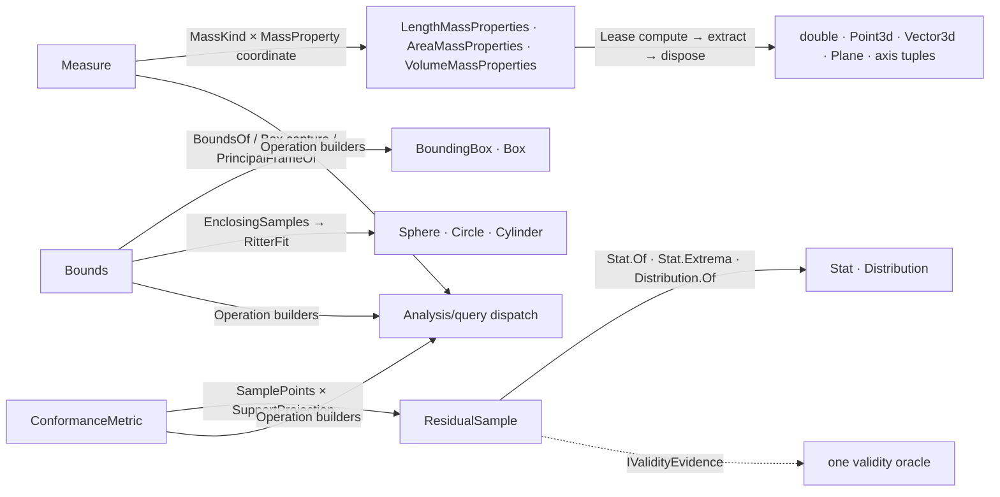

# [RASM_ANALYSIS_MEASURE]

`Measure`, `Bounds`, and `ConformanceMetric` own the metrology surface of the measured-query runtime — mass properties, enclosing bounds, and sampled conformance residuals over host geometry, each folding to one dispatch the `Analysis/query` seam forwards. Every mass answer is a `(MassKind, MassProperty)` coordinate, every bounding modality a union case, and every conformance a policy row over one sampling fold, so a new metrology answer lands as a row and never a sibling operation family.

Every native mass-properties handle leases through the `Domain/rails` `Lease<T>` discipline — computed, projected, disposed, never escaped — and the aggregate fold disposes every non-surviving handle after summing siblings through the host `Sum` mutator. Statistics compose `Domain/stats`, conformance distances the `Spatial/support` projection over the `Processing/intent` `VectorIntent.Support` rail, and two-operand admission the `Domain/validation` `RequirementContext.Pair` combinator; every receipt carries `IValidityEvidence` and admits through the folder's one acceptance gate.

## [01]-[INDEX]

- [02]-[MEASURE]: `Measure` `[Union]` over `MassKind` compute/aggregate rows and `MassProperty` moment-column rows; the polymorphic `LengthOf`/`CentroidOf` scalar folds and `MassKind.PrincipalFrameOf` frame recovery.
- [03]-[BOUNDS]: `Bounds` `[Union]` — box modalities, metrics through one `BoxMetric` builder, principal-frame OBB, and enclosing solids through one `RitterFit` fold with `EnclosingSamples` fallback.
- [04]-[CONFORMANCE]: `ConformanceMetric` `[SmartEnum<int>]` over the `ResidualSample` evidence receipt; the residual sampling pipeline with the exact curve-deviation short-circuit.

## [02]-[MEASURE]

- Owner: `MassKind` and `MassProperty` `[BoundaryAdapter]` `[SmartEnum<int>]` policy rows drive the `Measure` `[Union]` — a `MassKind` binds its `Requirement` and its compute and aggregate delegates, a `MassProperty` binds its moment-demand columns and typed extract, `KindOf` resolves the solid-aware default reading `IsSolid`, and `PrincipalFrameOf` recovers the centroid-anchored principal plane. Three `Measure` cases `Length`/`SpatialMidpoint`/`MassProperty(MassKind, MassProperty)` carry eleven factories minting `(MassKind, MassProperty)` coordinates.
- Entry: `Measure.Operation<TGeometry, TOut>()` builds the op the `Analysis/query` seam forwards; `MassProperty` always builds the AGGREGATE op, so a single geometry is the one-item degenerate case and per-item and batch answers ride one leased handle whose projections extract once.
- Auto: `LengthOf` short-circuits analytic primitives before the tolerance `Curve.GetLength` fold; `CentroidOf` routes each carrier to its exact center or mass computation, reading `IsSolid` per geometry rather than a caller flag; the aggregate fold accumulates leases, sums through the host mutator, disposes every non-surviving handle on success and failure, and routes a homogeneous curve set through the native multi-curve overload.
- Receipt: measures project onto host value types admitted through the acceptance gate; the principal-axis `(Moment, Axis)` tuple is oracle-validated per element — finite non-negative moment, non-tiny axis.
- Packages: RhinoCommon mass-properties `Compute`/`Sum`/moment accessors and `IsSolid`; `Rasm.Domain` `Requirement`, `Lease<T>`, `Op`, `Capability`, and `Normalization` owners.
- Growth: a new mass projection is one `MassProperty` row, a new mass domain one `MassKind` row binding its requirement and delegates, a new analytic centroid carrier one `CentroidOf` arm — zero operation edits.
- Boundary: eleven measures are three cases over two policy enums — a `MeasureLength`/`MeasureArea`/`MeasureVolume` sibling-operation family is the proliferation this coordinate design deletes; every mass handle is leased and an escaped `Compute` handle is the resource-leak defect; the moment-demand columns request exactly the moments the extraction reads; `MassKind.None` rejects through its delegates rather than a silent null-object; the area path threads model tolerances and a hardcoded tolerance literal is the deleted form.

```csharp signature
// --- [RUNTIME_PRELUDE] ----------------------------------------------------------------------
using System;
using System.Collections.Generic;
using System.Linq;
using Rasm.Csp;
using LanguageExt;
using Rasm.Domain;
using Rhino;
using Rhino.Geometry;
using Thinktecture;
using static LanguageExt.Prelude;

namespace Rasm.Analysis;

// --- [TYPES] --------------------------------------------------------------------------------
[Union]
public abstract partial record Measure {
    private Measure() { }
    public sealed record LengthCase : Measure;
    public sealed record SpatialMidpointCase : Measure;
    public sealed record MassPropertyCase(MassKind Mass, MassProperty Property) : Measure;
    public static Measure Length => new LengthCase();
    public static Measure SpatialMidpoint => new SpatialMidpointCase();
    public static Measure Area => new MassPropertyCase(Mass: MassKind.Area, Property: MassProperty.Magnitude);
    public static Measure Volume => new MassPropertyCase(Mass: MassKind.Volume, Property: MassProperty.Magnitude);
    public static Measure MassError(MassKind mass) => new MassPropertyCase(Mass: mass, Property: MassProperty.MagnitudeError);
    public static Measure Centroid(MassKind mass) => new MassPropertyCase(Mass: mass, Property: MassProperty.Centroid);
    public static Measure CentroidError(MassKind mass) => new MassPropertyCase(Mass: mass, Property: MassProperty.CentroidError);
    public static Measure Radii(MassKind mass) => new MassPropertyCase(Mass: mass, Property: MassProperty.Radii);
    public static Measure PrincipalAxes(MassKind mass) => new MassPropertyCase(Mass: mass, Property: MassProperty.PrincipalAxes);
    public static Measure Inertia(MassKind mass) => new MassPropertyCase(Mass: mass, Property: MassProperty.Inertia);
    public static Measure InertiaProducts(MassKind mass) => new MassPropertyCase(Mass: mass, Property: MassProperty.InertiaProducts);
    internal Operation<TGeometry, TOut> Operation<TGeometry, TOut>() where TGeometry : notnull => Switch(
        lengthCase: static _ => Analyze.Length<TGeometry, TOut>(),
        spatialMidpointCase: static _ => typeof(TOut) == typeof(Point3d) ? Analyze.SpatialMidpoint<TGeometry, TOut>() : Op.Of(name: "SpatialMidpoint").Unsupported<TGeometry, TOut>(),
        massPropertyCase: static p => Analyze.MassPropertyMeasure<TGeometry, TOut>(mass: p.Mass, property: p.Property));
}

[BoundaryAdapter, SmartEnum<int>]
public sealed partial class MassKind {
    public static readonly MassKind None = new(key: 0, label: nameof(None), requirement: Requirement.None,
        compute: static (_, _, _, _, _, _) => Fin.Fail<IDisposable>(new Fault.ComputationFailed(nameof(None))),
        aggregate: static (_, _, _, _, _, _, _) => Fin.Fail<IDisposable>(new Fault.ComputationFailed(nameof(None))));
    public static readonly MassKind Length = new(key: 1, label: nameof(Length), requirement: Requirement.CurveLength, compute: LengthOf, aggregate: LengthAggregate);
    public static readonly MassKind Area = new(key: 2, label: nameof(Area), requirement: Requirement.AreaMass, compute: AreaOf,
        aggregate: static (self, geometry, context, first, second, product, op) => SumAggregate<AreaMassProperties>(geometry: geometry, context: context, mass: self, firstMoments: first, secondMoments: second, productMoments: product, op: op, sum: static (total, summands) => total.Sum(summands: summands, bAddTo: true)));
    public static readonly MassKind Volume = new(key: 3, label: nameof(Volume), requirement: Requirement.VolumeMass, compute: VolumeOf,
        aggregate: static (self, geometry, context, first, second, product, op) => SumAggregate<VolumeMassProperties>(geometry: geometry, context: context, mass: self, firstMoments: first, secondMoments: second, productMoments: product, op: op, sum: static (total, summands) => total.Sum(summands: summands, bAddTo: true)));
    private readonly Func<object, Context, bool, bool, bool, Op, Fin<IDisposable>> compute;
    private readonly Func<MassKind, IEnumerable<object>, Context, bool, bool, bool, Op, Fin<IDisposable>> aggregate;
    public string Label { get; }
    internal Requirement Requirement { get; }
    internal Fin<IDisposable> Aggregate(IEnumerable<object> geometry, Context context, bool firstMoments, bool secondMoments, bool productMoments, Op op) =>
        aggregate(this, geometry, context, firstMoments, secondMoments, productMoments, op);
    internal static MassKind KindOf(GeometryBase geometry) => geometry switch {
        Curve => Length,
        Brep brep => brep.IsSolid ? Volume : Area,
        Mesh mesh => mesh.IsSolid ? Volume : Area,
        Extrusion extrusion => extrusion.IsSolid ? Volume : Area,
        Surface surface => surface.IsSolid ? Volume : Area,
        _ => None,
    };
    internal static Fin<Plane> PrincipalFrameOf(GeometryBase geometry, Context context, Op key) =>
        KindOf(geometry: geometry) switch {
            MassKind kind when kind.Equals(None) => Fin.Fail<Plane>(key.Unsupported(geometryType: geometry.GetType(), outputType: typeof(Plane))),
            MassKind kind => kind.compute(geometry, context, true, true, true, key)
                .Bind(handle => new Lease<IDisposable>.Owned(Value: handle).Use(mass => PrincipalFrameOf(mass: mass, key: key))),
        };
    internal static Fin<Plane> PrincipalFrameOf(IDisposable mass, Op key) =>
        (mass switch {
            LengthMassProperties l => Some(l.Centroid),
            AreaMassProperties a => Some(a.Centroid),
            VolumeMassProperties v => Some(v.Centroid),
            _ => Option<Point3d>.None,
        }).ToFin(key.InvalidResult()).Bind(centroid =>
            key.PrincipalAxesOf(mass: mass).Bind(axes => (axes.Count, centroid.IsValid) switch {
                ( >= 2, true) => key.AcceptValue(value: new Plane(origin: centroid, xDirection: axes[0].Axis, yDirection: axes[1].Axis)),
                _ => Fin.Fail<Plane>(key.InvalidResult()),
            }));
    private static Fin<IDisposable> Done<TMass>(TMass? mass) where TMass : class, IDisposable =>
        Optional(mass).ToFin(new Fault.ComputationFailed(typeof(TMass).Name)).Map(static handle => (IDisposable)handle);
    private static Fin<IDisposable> LengthOf(object geometry, Context _, bool firstMoments, bool secondMoments, bool productMoments, Op op) =>
        Normalization.CurveForm(source: geometry, key: op).Bind(lease => lease.Use(curve =>
            Done(LengthMassProperties.Compute(curve, length: true, firstMoments: firstMoments, secondMoments: secondMoments, productMoments: productMoments))));
    private static Fin<IDisposable> AreaOf(object geometry, Context context, bool firstMoments, bool secondMoments, bool productMoments, Op op) => geometry switch {
        Mesh mesh => Done(AreaMassProperties.Compute(mesh, area: true, firstMoments: firstMoments, secondMoments: secondMoments, productMoments: productMoments)),
        Curve curve => Done(AreaMassProperties.Compute(curve, context.Absolute.Value)),
        object curveLike when Capability.CurveForm.Admits(type: curveLike.GetType()) => Normalization.CurveForm(source: curveLike, key: op).Bind(lease => lease.Use(curve => AreaOf(geometry: curve, context: context, firstMoments: firstMoments, secondMoments: secondMoments, productMoments: productMoments, op: op))),
        Brep brep => Done(AreaMassProperties.Compute(brep, area: true, firstMoments: firstMoments, secondMoments: secondMoments, productMoments: productMoments, relativeTolerance: context.Fractional, absoluteTolerance: context.Absolute.Value)),
        Surface surface => Done(AreaMassProperties.Compute(surface, area: true, firstMoments: firstMoments, secondMoments: secondMoments, productMoments: productMoments)),
        GeometryBase { HasBrepForm: true } or Box or BoundingBox or Sphere or Cylinder or Cone or Torus =>
            Normalization.BrepForm(source: geometry, key: op).Bind(lease => lease.Use(brep => AreaOf(geometry: brep, context: context, firstMoments: firstMoments, secondMoments: secondMoments, productMoments: productMoments, op: op))),
        _ => Fin.Fail<IDisposable>(op.Unsupported(geometry.GetType(), typeof(AreaMassProperties))),
    };
    private static Fin<IDisposable> VolumeOf(object geometry, Context context, bool firstMoments, bool secondMoments, bool productMoments, Op op) => geometry switch {
        Mesh mesh => Done(VolumeMassProperties.Compute(mesh, volume: true, firstMoments: firstMoments, secondMoments: secondMoments, productMoments: productMoments)),
        Brep brep => Done(VolumeMassProperties.Compute(brep, volume: true, firstMoments: firstMoments, secondMoments: secondMoments, productMoments: productMoments, relativeTolerance: context.Fractional, absoluteTolerance: context.Absolute.Value)),
        Surface surface => Done(VolumeMassProperties.Compute(surface, volume: true, firstMoments: firstMoments, secondMoments: secondMoments, productMoments: productMoments)),
        GeometryBase { HasBrepForm: true } or Box or BoundingBox or Sphere or Cylinder or Cone or Torus =>
            Normalization.BrepForm(source: geometry, key: op).Bind(lease => lease.Use(brep => VolumeOf(geometry: brep, context: context, firstMoments: firstMoments, secondMoments: secondMoments, productMoments: productMoments, op: op))),
        _ => Fin.Fail<IDisposable>(op.Unsupported(geometry.GetType(), typeof(VolumeMassProperties))),
    };
    private static Fin<IDisposable> LengthAggregate(MassKind self, IEnumerable<object> geometry, Context context, bool firstMoments, bool secondMoments, bool productMoments, Op op) =>
        toSeq(geometry) switch {
            Seq<object> items when items.ForAll(static item => item is Curve) =>
                Done(LengthMassProperties.Compute(curves: items.AsIterable().Cast<Curve>(), length: true, firstMoments: firstMoments, secondMoments: secondMoments, productMoments: productMoments)),
            Seq<object> items => SumAggregate<LengthMassProperties>(geometry: items.AsIterable(), context: context, mass: self, firstMoments: firstMoments, secondMoments: secondMoments, productMoments: productMoments, op: op, sum: static (total, summands) => total.Sum(summands: summands, bAddTo: true)),
        };
    private static Fin<IDisposable> SumAggregate<TMass>(IEnumerable<object> geometry, Context context, MassKind mass, bool firstMoments, bool secondMoments, bool productMoments, Op op, Func<TMass, IEnumerable<TMass>, bool> sum) where TMass : class, IDisposable =>
        toSeq(geometry).Fold(Fin.Succ(Seq<IDisposable>()), (state, item) => state.Bind(owned =>
            mass.compute(item, context, firstMoments, secondMoments, productMoments, op)
                .Map(computed => computed.Cons(owned))
                .BindFail(error => {
                    _ = owned.Iter(static resource => resource.Dispose());
                    return Fin.Fail<Seq<IDisposable>>(error);
                })))
            .Bind(owned => {
                TMass[] masses = [.. owned.AsIterable().Cast<TMass>()];
                Fin<IDisposable> result = masses.Length switch {
                    1 => Fin.Succ<IDisposable>(masses[0]),
                    > 1 when sum(masses[0], Enumerable.Skip(masses, 1)) => Fin.Succ<IDisposable>(masses[0]),
                    _ => Fin.Fail<IDisposable>(new Fault.ComputationFailed(typeof(TMass).Name)),
                };
                return result
                    .Map(active => {
                        _ = toSeq(masses).Filter(resource => !ReferenceEquals(objA: resource, objB: active)).Iter(static resource => resource.Dispose());
                        return active;
                    })
                    .BindFail(error => {
                        _ = owned.Iter(static resource => resource.Dispose());
                        return Fin.Fail<IDisposable>(error);
                    });
            });
}

[BoundaryAdapter, SmartEnum<int>]
public sealed partial class MassProperty {
    public static readonly MassProperty Magnitude = new(key: 0, suffix: string.Empty, output: typeof(double), first: static _ => false, second: static _ => false, product: static _ => false,
        extract: static (k, p) => k.MassPropertyExtract(props: p, length: static l => l.Length, area: static a => a.Area, volume: static v => v.Volume));
    public static readonly MassProperty MagnitudeError = new(key: 1, suffix: "Error", output: typeof(double), first: static _ => false, second: static m => m.Equals(MassKind.Length), product: static _ => false,
        extract: static (k, p) => k.MassPropertyExtract(props: p, length: static l => l.LengthError, area: static a => a.AreaError, volume: static v => v.VolumeError));
    public static readonly MassProperty Centroid = new(key: 2, suffix: nameof(Centroid), output: typeof(Point3d), first: static _ => true, second: static m => m.Equals(MassKind.Length), product: static _ => false,
        extract: static (k, p) => k.MassPropertyExtract(props: p, length: static l => l.Centroid, area: static a => a.Centroid, volume: static v => v.Centroid));
    public static readonly MassProperty CentroidError = new(key: 3, suffix: nameof(CentroidError), output: typeof(Vector3d), first: static _ => true, second: static m => m.Equals(MassKind.Length), product: static _ => false,
        extract: static (k, p) => k.MassPropertyExtract(props: p, length: static l => l.CentroidError, area: static a => a.CentroidError, volume: static v => v.CentroidError));
    public static readonly MassProperty Radii = new(key: 4, suffix: nameof(Radii), output: typeof(Vector3d), first: static _ => true, second: static _ => true, product: static _ => false,
        extract: static (k, p) => k.MassPropertyExtract(props: p, length: static l => l.CentroidCoordinatesRadiiOfGyration, area: static a => a.CentroidCoordinatesRadiiOfGyration, volume: static v => v.CentroidCoordinatesRadiiOfGyration));
    public static readonly MassProperty PrincipalAxes = new(key: 5, suffix: "Principal", output: typeof(ValueTuple<double, Vector3d>), first: static _ => true, second: static _ => true, product: static _ => true,
        extract: static (k, p) => k.PrincipalAxesOf(mass: p).Map(static axes => axes.Map(static axis => (object)axis)));
    public static readonly MassProperty Inertia = new(key: 6, suffix: nameof(Inertia), output: typeof(Vector3d), first: static _ => true, second: static _ => true, product: static _ => true,
        extract: static (k, p) => k.MassPropertyExtract(props: p, length: static l => l.WorldCoordinatesMomentsOfInertia, area: static a => a.WorldCoordinatesMomentsOfInertia, volume: static v => v.WorldCoordinatesMomentsOfInertia));
    public static readonly MassProperty InertiaProducts = new(key: 7, suffix: "Products", output: typeof(Vector3d), first: static _ => true, second: static _ => true, product: static _ => true,
        extract: static (k, p) => k.MassPropertyExtract(props: p, length: static l => l.WorldCoordinatesProductMoments, area: static a => a.WorldCoordinatesProductMoments, volume: static v => v.WorldCoordinatesProductMoments));
    private readonly Func<MassKind, bool> first;
    private readonly Func<MassKind, bool> second;
    private readonly Func<MassKind, bool> product;
    private readonly Func<Op, IDisposable, Fin<Seq<object>>> extract;
    public string Suffix { get; }
    public Type Output { get; }
    internal bool FirstMoments(MassKind mass) => first(arg: mass);
    internal bool SecondMoments(MassKind mass) => second(arg: mass);
    internal bool ProductMoments(MassKind mass) => product(arg: mass);
    internal Fin<Seq<TValue>> Extract<TValue>(Op key, IDisposable mass) =>
        typeof(TValue) == Output
            ? extract(arg1: key, arg2: mass).Bind(values => values.TraverseM(value => value is TValue typed ? key.AcceptValue(value: typed) : Fin.Fail<TValue>(key.Unsupported(geometryType: value.GetType(), outputType: typeof(TValue)))).As())
            : Fin.Fail<Seq<TValue>>(key.Unsupported(geometryType: typeof(IDisposable), outputType: typeof(TValue)));
}

// --- [OPERATIONS] ---------------------------------------------------------------------------
public static partial class Analyze {
    internal static Operation<TGeometry, TOut> Length<TGeometry, TOut>() where TGeometry : notnull {
        Op key = Op.Of();
        Option<Requirement> requirement = (typeof(TOut) == typeof(double), typeof(TGeometry), Kind.Of(typeof(TGeometry)).Case) switch {
            (true, Type geometry, _) when geometry == typeof(object) || geometry == typeof(GeometryBase) => Some(Requirement.CurveLength),
            (true, _, Kind kind) when kind.Topology == Topology.Curve => Some(Requirement.CurveLength),
            _ => Option<Requirement>.None,
        };
        return requirement.Match(
            Some: active => Operation<TGeometry, double>.Build(key: key, requirement: active, requiresContext: true, state: key,
                evaluator: static (op, geometry) =>
                    from context in Env.Asks
                    from length in LengthOf(geometry: geometry, context: context, op: op).ToEff()
                    from result in op.Accept(value: length).ToEff()
                    select result).As<TGeometry, TOut>(key: key),
            None: () => key.Unsupported<TGeometry, TOut>());
    }
    internal static Operation<TGeometry, TOut> SpatialMidpoint<TGeometry, TOut>() where TGeometry : notnull {
        Op key = Op.Of();
        return (typeof(TOut), typeof(TGeometry)) switch {
            (Type output, Type geometry) when output == typeof(Point3d)
                && (geometry == typeof(object) || geometry == typeof(GeometryBase) || geometry == typeof(Point3d) || geometry == typeof(Point) || geometry == typeof(BoundingBox) || geometry == typeof(Box)
                    || Capability.CurveForm.Admits(type: geometry) || typeof(Brep).IsAssignableFrom(geometry) || typeof(Mesh).IsAssignableFrom(geometry) || Capability.SurfaceForm.Admits(type: geometry) || typeof(SubD).IsAssignableFrom(geometry)) =>
                Operation<TGeometry, Point3d>.Build(key: key, requiresContext: true, state: key,
                    evaluator: static (op, geometry) =>
                        from context in Env.Asks
                        from centroid in CentroidOf(geometry: geometry, context: context, op: op).ToEff()
                        from result in op.Accept(value: centroid).ToEff()
                        select result).As<TGeometry, TOut>(key: key),
            _ => key.Unsupported<TGeometry, TOut>(),
        };
    }
    internal static Operation<TGeometry, TOut> MassPropertyMeasure<TGeometry, TOut>(MassKind mass, MassProperty property) where TGeometry : notnull {
        Op key = Op.Of(name: $"{mass.Label}{property.Suffix}");
        return (mass.Equals(MassKind.None), typeof(TOut) == property.Output) switch {
            (true, _) => Operation<TGeometry, TOut>.Reject(key: key, fault: key.InvalidInput()),
            (false, true) => Operation<TGeometry, TOut>.Aggregate(
                key: key, requirement: mass.Requirement, requiresContext: true,
                project: geometry =>
                    from context in Env.Asks
                    from summed in mass.Aggregate(geometry: geometry.Map(static item => (object)item).AsIterable(), context: context, firstMoments: property.FirstMoments(mass: mass), secondMoments: property.SecondMoments(mass: mass), productMoments: property.ProductMoments(mass: mass), op: key).ToEff()
                    from values in new Lease<IDisposable>.Owned(Value: summed).Use(handle => property.Extract<TOut>(key: key, mass: handle)).ToEff()
                    select values),
            _ => key.Unsupported<TGeometry, TOut>(),
        };
    }
    internal static Fin<Seq<object>> MassPropertyExtract<TProp>(this Op key, IDisposable props, Func<LengthMassProperties, TProp> length, Func<AreaMassProperties, TProp> area, Func<VolumeMassProperties, TProp> volume) =>
        props switch {
            LengthMassProperties l => key.Accept(value: length(arg: l)).Map(static values => values.Map(static value => (object)value!)),
            AreaMassProperties a => key.Accept(value: area(arg: a)).Map(static values => values.Map(static value => (object)value!)),
            VolumeMassProperties v => key.Accept(value: volume(arg: v)).Map(static values => values.Map(static value => (object)value!)),
            _ => Fin.Fail<Seq<object>>(key.InvalidResult()),
        };
    internal static Fin<Seq<(double Moment, Vector3d Axis)>> PrincipalAxesOf<TMass>(this Op key, TMass mass) where TMass : class =>
        mass switch {
            LengthMassProperties length => PrincipalAxesFromMoments(key: key, solved: length.WorldCoordinatesPrincipalMomentsOfInertia(x: out double x, xaxis: out Vector3d xAxis, y: out double y, yaxis: out Vector3d yAxis, z: out double z, zaxis: out Vector3d zAxis), x: x, xAxis: xAxis, y: y, yAxis: yAxis, z: z, zAxis: zAxis),
            AreaMassProperties area => PrincipalAxesFromMoments(key: key, solved: area.WorldCoordinatesPrincipalMomentsOfInertia(x: out double x, xaxis: out Vector3d xAxis, y: out double y, yaxis: out Vector3d yAxis, z: out double z, zaxis: out Vector3d zAxis), x: x, xAxis: xAxis, y: y, yAxis: yAxis, z: z, zAxis: zAxis),
            VolumeMassProperties volume => PrincipalAxesFromMoments(key: key, solved: volume.WorldCoordinatesPrincipalMomentsOfInertia(x: out double x, xaxis: out Vector3d xAxis, y: out double y, yaxis: out Vector3d yAxis, z: out double z, zaxis: out Vector3d zAxis), x: x, xAxis: xAxis, y: y, yAxis: yAxis, z: z, zAxis: zAxis),
            _ => Fin.Fail<Seq<(double Moment, Vector3d Axis)>>(key.InvalidResult()),
        };
    private static Fin<Seq<(double Moment, Vector3d Axis)>> PrincipalAxesFromMoments(Op key, bool solved, double x, Vector3d xAxis, double y, Vector3d yAxis, double z, Vector3d zAxis) =>
        solved
            ? Fin.Succ(Seq((Moment: x, Axis: xAxis), (Moment: y, Axis: yAxis), (Moment: z, Axis: zAxis)))
            : Fin.Fail<Seq<(double Moment, Vector3d Axis)>>(key.InvalidResult());
    internal static Fin<double> LengthOf<TGeometry>(TGeometry geometry, Context context, Op op) where TGeometry : notnull =>
        Optional(geometry).ToFin(op.InvalidInput()).Bind(g => g switch {
            Line line => Fin.Succ(line.Length),
            Polyline polyline => Fin.Succ(polyline.Length),
            Circle circle => Fin.Succ(circle.Circumference),
            Arc arc => Fin.Succ(arc.Length),
            Ellipse ellipse => Optional(ellipse.ToNurbsCurve()).ToFin(op.InvalidResult()).Bind(curve => new Lease<Curve>.Owned(Value: curve).Use(native => LengthOf(geometry: native, context: context, op: op))),
            Curve curve => curve.GetLength(context.Fractional) switch {
                double length when RhinoMath.IsValidDouble(x: length) && length >= 0.0 => Fin.Succ(length),
                _ => Fin.Fail<double>(op.InvalidResult()),
            },
            _ => Fin.Fail<double>(op.Unsupported(g.GetType(), typeof(double))),
        });
    internal static Fin<Point3d> CentroidOf<TGeometry>(TGeometry geometry, Context context, Op op) where TGeometry : notnull =>
        Optional(geometry).ToFin(op.InvalidInput()).Bind(g => g switch {
            Point3d point => Fin.Succ(point),
            Point point => Fin.Succ(point.Location),
            Line line => Fin.Succ(line.PointAt(t: 0.5)),
            Polyline polyline => Fin.Succ(polyline.CenterPoint()),
            BoundingBox box => Fin.Succ(box.Center),
            Box box => Fin.Succ(box.Center),
            Brep brep => MassCentroidOf(geometry: brep, isSolid: brep.IsSolid, context: context, op: op),
            Mesh mesh => MassCentroidOf(geometry: mesh, isSolid: mesh.IsSolid, context: context, op: op),
            BrepFace face => MassCentroidOf(geometry: face, isSolid: false, context: context, op: op),
            Surface surface => MassCentroidOf(geometry: surface, isSolid: surface.IsSolid, context: context, op: op),
            Curve curve => (curve.IsClosed, curve.TryGetPlane(plane: out Plane _, tolerance: context.Absolute.Value)) switch {
                (false, _) => Optional(LengthMassProperties.Compute(curve)).ToFin(op.InvalidResult()).Map(static m => new Lease<LengthMassProperties>.Owned(Value: m).Use(static handle => handle.Centroid)),
                (true, true) => Optional(AreaMassProperties.Compute(curve, context.Absolute.Value)).ToFin(op.InvalidResult()).Map(static m => new Lease<AreaMassProperties>.Owned(Value: m).Use(static handle => handle.Centroid)),
                _ => Fin.Fail<Point3d>(op.InvalidResult()),
            },
            SubD subd => Optional(subd.ToBrep(SubDToBrepOptions.Default)).ToFin(op.InvalidResult()).Bind(brep => new Lease<Brep>.Owned(Value: brep).Use(owned => MassCentroidOf(geometry: owned, isSolid: owned.IsSolid, context: context, op: op))),
            _ => Fin.Fail<Point3d>(op.Unsupported(g.GetType(), typeof(Point3d))),
        });
    private static Fin<Point3d> MassCentroidOf(object geometry, bool isSolid, Context context, Op op) =>
        (isSolid ? MassKind.Volume : MassKind.Area).Aggregate(geometry: [geometry], context: context, firstMoments: true, secondMoments: false, productMoments: false, op: op)
            .Bind(handle => new Lease<IDisposable>.Owned(Value: handle).Use(owned => owned switch {
                LengthMassProperties l => Fin.Succ(l.Centroid),
                AreaMassProperties a => Fin.Succ(a.Centroid),
                VolumeMassProperties v => Fin.Succ(v.Centroid),
                _ => Fin.Fail<Point3d>(op.InvalidResult()),
            }));
}
```

## [03]-[BOUNDS]

- Owner: `Bounds` `[Union]` closes four modality clusters — box recovery, box projections, box metrics through one `BoxMetric` builder, and enclosing solids — over one shared sampling fallback and one generic `RitterFit` fold parameterized by the constructed solid.
- Cases: box recovery `AxisAligned`/`Oriented`/`Transformed`/`Principal`, projections `Center`/`Corners`/`Edges`, metrics `Area`/`Volume`/`Diagonal`/`AspectRatio`/`Tightness`, and enclosing solids `EnclosingSphere`/`EnclosingCircle`/`EnclosingCylinder`.
- Entry: `Bounds.Operation<TGeometry, TOut>()` — one generated `Switch` whose every arm gates input capability and output type before building, rejecting onto `Fault.Unsupported` at build time.
- Auto: `EnclosingSamples` samples the surface and DEGRADES to the eight box corners when sampling is unsupported, so enclosure coarsens rather than fails; `RitterFit` is one generic two-pass fold shared verbatim by sphere and cylinder-disc; the cylinder admits its axis through `VectorIntent.Direction` and folds the exact axial extent, and the enclosing circle delegates to the host exact smallest-enclosing-circle in the projection plane.
- Packages: RhinoCommon box accessors, oriented capture, and `Circle.TrySmallestEnclosingCircle`; `Rasm.Domain` `BoundsOf`/`SamplePoints` extensions and `Capability` rows; `Rasm.Processing` `VectorIntent.Direction` axis admission.
- Growth: a new box metric is one `BoxMetric` arm, a new enclosing solid composes the same `EnclosingSamples`+fit machinery, a new recovery frame one case arm — never a `BoundsCalculator` sibling.
- Boundary: fifteen modalities live on one union under one `Switch` — a `BoundingBoxOps`/`OrientedBoxOps`/`EnclosingSolidOps` class family is the fragmentation this owner deletes; the aspect-ratio denominator floors at `RhinoMath.ZeroTolerance` so a degenerate extent yields a large finite ratio rather than an infinity crossing the rail; `Corners(unique)` deduplicates at model tolerance, never a literal epsilon; enclosing fits are measured approximations by contract, every sample enclosed rather than a minimal-ball claim; box-metric ops accept box VALUES while recovery ops accept geometry, the type gates keeping the two altitudes disjoint.

```csharp signature
// --- [RUNTIME_PRELUDE] ----------------------------------------------------------------------
using System;
using LanguageExt;
using Rasm.Domain;
using Rasm.Processing;
using Rhino;
using Rhino.Geometry;
using Thinktecture;
using static LanguageExt.Prelude;

namespace Rasm.Analysis;

// --- [TYPES] --------------------------------------------------------------------------------
[Union]
public abstract partial record Bounds {
    private Bounds() { }
    public sealed record AxisAlignedCase : Bounds;
    public sealed record InPlaneCase(Plane Plane) : Bounds;
    public sealed record TransformedCase(Transform Xform) : Bounds;
    public sealed record PrincipalFrameCase : Bounds;
    public sealed record CenterCase : Bounds;
    public sealed record CornersCase(bool Unique) : Bounds;
    public sealed record EdgesCase : Bounds;
    public sealed record AreaCase : Bounds;
    public sealed record VolumeCase : Bounds;
    public sealed record DiagonalCase : Bounds;
    public sealed record AspectRatioCase : Bounds;
    public sealed record TightnessCase : Bounds;
    public sealed record EnclosingSphereCase(int Count = EnclosingSampleCount) : Bounds;
    public sealed record EnclosingCircleCase(Plane Plane, int Count = EnclosingSampleCount) : Bounds;
    public sealed record EnclosingCylinderCase(Vector3d Axis, int Count = EnclosingSampleCount) : Bounds;
    internal const int EnclosingSampleCount = 64;
    internal static readonly Op BoundsKey = Op.Of(name: nameof(Bounds)), OrientedKey = Op.Of(name: "OrientedBounds"), TransformedKey = Op.Of(name: "TransformedBounds"), PrincipalKey = Op.Of(name: "PrincipalBounds"), CenterKey = Op.Of(name: "BoundsCenter");
    internal static readonly Op CornersKey = Op.Of(name: "BoundsCorners"), BoxEdgesKey = Op.Of(name: "BoxEdges"), BoxAreaKey = Op.Of(name: "BoxArea"), BoxVolumeKey = Op.Of(name: "BoxVolume"), BoxDiagonalKey = Op.Of(name: "BoxDiagonal");
    internal static readonly Op BoxAspectRatioKey = Op.Of(name: "BoxAspectRatio"), BoxTightnessKey = Op.Of(name: "BoxTightness"), EnclosingSphereKey = Op.Of(name: "EnclosingSphere"), EnclosingCircleKey = Op.Of(name: "EnclosingCircle"), EnclosingCylinderKey = Op.Of(name: "EnclosingCylinder");
    public static Bounds AxisAligned => new AxisAlignedCase();
    public static Bounds Oriented(Plane plane) => new InPlaneCase(Plane: plane);
    public static Bounds Transformed(Transform transform) => new TransformedCase(Xform: transform);
    public static Bounds Principal => new PrincipalFrameCase();
    public static Bounds Center => new CenterCase();
    public static Bounds Corners(bool unique = false) => new CornersCase(Unique: unique);
    public static Bounds Edges => new EdgesCase();
    public static Bounds Area => new AreaCase();
    public static Bounds Volume => new VolumeCase();
    public static Bounds Diagonal => new DiagonalCase();
    public static Bounds AspectRatio => new AspectRatioCase();
    public static Bounds Tightness => new TightnessCase();
    public static Bounds EnclosingSphere(int count = EnclosingSampleCount) => new EnclosingSphereCase(Count: count);
    public static Bounds EnclosingCircle(Plane plane, int count = EnclosingSampleCount) => new EnclosingCircleCase(Plane: plane, Count: count);
    public static Bounds EnclosingCylinder(Vector3d axis, int count = EnclosingSampleCount) => new EnclosingCylinderCase(Axis: axis, Count: count);

    internal Operation<TGeometry, TOut> Operation<TGeometry, TOut>() where TGeometry : notnull => Switch(
        axisAlignedCase: static _ => (typeof(TOut) == typeof(BoundingBox) && Capability.Bound.Admits(type: typeof(TGeometry)))
            ? Analysis.Operation<TGeometry, BoundingBox>.Build(key: BoundsKey, state: BoundsKey,
                evaluator: static (op, geometry) => geometry.BoundsOf(key: op).Bind(box => op.Accept(value: box)).ToEff()).As<TGeometry, TOut>(key: BoundsKey)
            : BoundsKey.Unsupported<TGeometry, TOut>(),
        inPlaneCase: static p => (typeof(TOut) == typeof(Box) && typeof(GeometryBase).IsAssignableFrom(c: typeof(TGeometry)))
            ? Analyze.Native<TGeometry, TOut, GeometryBase, Box, (Op Key, Plane Plane)>(key: OrientedKey, state: (OrientedKey, p.Plane),
                project: static (state, native) => state.Key.Accept(value: new Box(state.Plane, native)).ToEff())
            : OrientedKey.Unsupported<TGeometry, TOut>(),
        transformedCase: static t => (typeof(TOut) == typeof(BoundingBox) && typeof(GeometryBase).IsAssignableFrom(c: typeof(TGeometry)))
            ? Analyze.Native<TGeometry, TOut, GeometryBase, BoundingBox, (Op Key, Transform Xform)>(key: TransformedKey, state: (Key: TransformedKey, t.Xform),
                project: static (state, native) => state.Key.Accept(value: native.GetBoundingBox(xform: state.Xform)).ToEff())
            : TransformedKey.Unsupported<TGeometry, TOut>(),
        principalFrameCase: static _ => (typeof(TOut) == typeof(Box) && Capability.OrientedBound.Admits(type: typeof(TGeometry)))
            ? Analyze.Native<TGeometry, TOut, GeometryBase, Box, Op>(key: PrincipalKey, state: PrincipalKey, requirement: Requirement.Basic,
                project: static (state, native) =>
                    from context in Env.Asks
                    from frame in MassKind.PrincipalFrameOf(geometry: native, context: context, key: state).ToEff()
                    from box in state.AcceptValue(value: new Box(frame, native)).ToEff()
                    from result in state.Accept(value: box).ToEff()
                    select result)
            : PrincipalKey.Unsupported<TGeometry, TOut>(),
        centerCase: static _ => (typeof(TOut) == typeof(Point3d) && Capability.Bound.Admits(type: typeof(TGeometry)))
            ? Analysis.Operation<TGeometry, Point3d>.Build(key: CenterKey, state: CenterKey,
                evaluator: static (op, geometry) => geometry.BoundsOf(key: op).Bind(box => op.Accept(value: box.Center)).ToEff()).As<TGeometry, TOut>(key: CenterKey)
            : CenterKey.Unsupported<TGeometry, TOut>(),
        cornersCase: static c => (typeof(TOut) == typeof(Point3d) && Capability.Bound.Admits(type: typeof(TGeometry)))
            ? Analysis.Operation<TGeometry, Point3d>.Build(key: CornersKey, requiresContext: c.Unique, state: (Key: CornersKey, c.Unique),
                evaluator: static (state, geometry) =>
                    from runtime in Env.EnvAsks
                    from box in geometry.BoundsOf(key: state.Key).ToEff()
                    from result in state.Key.Accept(values: state.Unique ? Point3d.CullDuplicates(points: box.GetCorners(), tolerance: runtime.Context.Absolute.Value) : box.GetCorners()).ToEff()
                    select result).As<TGeometry, TOut>(key: CornersKey)
            : CornersKey.Unsupported<TGeometry, TOut>(),
        edgesCase: static _ => (typeof(TGeometry) == typeof(BoundingBox) && typeof(TOut) == typeof(Line))
            ? Analysis.Operation<BoundingBox, Line>.Build(key: BoxEdgesKey, state: BoxEdgesKey,
                evaluator: static (op, geometry) => op.Accept(values: geometry.GetEdges()).ToEff()).As<TGeometry, TOut>(key: BoxEdgesKey)
            : BoxEdgesKey.Unsupported<TGeometry, TOut>(),
        areaCase: static _ => Analyze.BoxMetric<TGeometry, TOut>(key: BoxAreaKey, boundingBox: static box => box.Area, box: static box => box.Area),
        volumeCase: static _ => Analyze.BoxMetric<TGeometry, TOut>(key: BoxVolumeKey, boundingBox: static box => box.Volume, box: static box => box.Volume),
        diagonalCase: static _ => Analyze.BoxMetric<TGeometry, TOut>(key: BoxDiagonalKey, boundingBox: static box => box.Diagonal.Length, box: static box => box.BoundingBox.Diagonal.Length),
        aspectRatioCase: static _ => Analyze.BoxMetric<TGeometry, TOut>(key: BoxAspectRatioKey, boundingBox: static box => AspectOf(box.Diagonal), box: static box => AspectOf(new Vector3d(box.X.Length, box.Y.Length, box.Z.Length))),
        tightnessCase: static _ => (typeof(TOut) == typeof(double) && typeof(GeometryBase).IsAssignableFrom(c: typeof(TGeometry)) && Capability.OrientedBound.Admits(type: typeof(TGeometry)))
            ? Analyze.Native<TGeometry, TOut, GeometryBase, double, Op>(key: BoxTightnessKey, state: BoxTightnessKey, requirement: Requirement.Basic,
                project: static (state, native) =>
                    from context in Env.Asks
                    from frame in MassKind.PrincipalFrameOf(geometry: native, context: context, key: state).ToEff()
                    from obb in state.AcceptValue(value: new Box(frame, native)).ToEff()
                    from aabb in native.BoundsOf(key: state).ToEff()
                    from result in (obb.Volume > RhinoMath.ZeroTolerance ? state.Accept(value: aabb.Volume / obb.Volume) : Fin.Fail<Seq<double>>(state.InvalidResult())).ToEff()
                    select result)
            : BoxTightnessKey.Unsupported<TGeometry, TOut>(),
        enclosingSphereCase: static s => (typeof(TOut) == typeof(Sphere) && Capability.Bound.Admits(type: typeof(TGeometry)))
            ? Analysis.Operation<TGeometry, Sphere>.Build(key: EnclosingSphereKey, requiresContext: true, state: (Key: EnclosingSphereKey, s.Count),
                evaluator: static (state, geometry) =>
                    from context in Env.Asks
                    from samples in EnclosingSamples(geometry: geometry, count: state.Count, context: context, key: state.Key).ToEff()
                    from result in RitterFit(samples: samples, key: state.Key, construct: static (center, radius) => new Sphere(center: center, radius: radius), isValid: static sphere => sphere.IsValid).ToEff()
                    from accepted in state.Key.Accept(value: result).ToEff()
                    select accepted).As<TGeometry, TOut>(key: EnclosingSphereKey)
            : EnclosingSphereKey.Unsupported<TGeometry, TOut>(),
        enclosingCircleCase: static c => (typeof(TOut) == typeof(Circle) && Capability.Bound.Admits(type: typeof(TGeometry)))
            ? Analysis.Operation<TGeometry, Circle>.Build(key: EnclosingCircleKey, requiresContext: true, state: (Key: EnclosingCircleKey, c.Plane, c.Count),
                evaluator: static (state, geometry) =>
                    from context in Env.Asks
                    from samples in EnclosingSamples(geometry: geometry, count: state.Count, context: context, key: state.Key).ToEff()
                    from projected in Fin.Succ(samples.Choose(p => state.Plane.ClosestParameter(testPoint: p, s: out double s, t: out double t) ? Some(new Point2d(x: s, y: t)) : Option<Point2d>.None)).ToEff()
                    from result in ((projected.Count, Circle.TrySmallestEnclosingCircle(points: projected.AsIterable(), tolerance: context.Absolute.Value, circle: out Circle circle, indicesOnCircle: out int[] _), circle) switch {
                        ( > 0, true, { IsValid: true } planar) => Fin.Succ(new Circle(plane: new Plane(origin: state.Plane.PointAt(u: planar.Center.X, v: planar.Center.Y), xDirection: state.Plane.XAxis, yDirection: state.Plane.YAxis), radius: planar.Radius)),
                        _ => Fin.Fail<Circle>(state.Key.InvalidResult()),
                    }).ToEff()
                    from accepted in state.Key.Accept(value: result).ToEff()
                    select accepted).As<TGeometry, TOut>(key: EnclosingCircleKey)
            : EnclosingCircleKey.Unsupported<TGeometry, TOut>(),
        enclosingCylinderCase: static cy => (typeof(TOut) == typeof(Cylinder) && Capability.Bound.Admits(type: typeof(TGeometry)))
            ? Analysis.Operation<TGeometry, Cylinder>.Build(key: EnclosingCylinderKey, requiresContext: true, state: (Key: EnclosingCylinderKey, cy.Axis, cy.Count),
                evaluator: static (state, geometry) =>
                    from context in Env.Asks
                    from axis in VectorIntent.Direction(value: state.Axis).Project<Vector3d>(context: context, key: state.Key).ToEff()
                    from samples in EnclosingSamples(geometry: geometry, count: state.Count, context: context, key: state.Key).ToEff()
                    let plane = new Plane(origin: Point3d.Origin, normal: axis)
                    from projected in Fin.Succ(samples.Map(plane.ClosestPoint)).ToEff()
                    from disc in RitterFit(samples: projected, key: state.Key, construct: static (center, radius) => (Center: center, Radius: radius), isValid: static d => d.Radius >= 0.0).ToEff()
                    let extent = samples.Fold(initialState: (Min: double.PositiveInfinity, Max: double.NegativeInfinity, Axis: axis), f: static (s, p) => ((p - Point3d.Origin) * s.Axis) switch {
                        double d => (Min: Math.Min(val1: s.Min, val2: d), Max: Math.Max(val1: s.Max, val2: d), s.Axis),
                    })
                    from result in state.Key.Accept(value: new Cylinder(baseCircle: new Circle(plane: new Plane(origin: disc.Center + (axis * extent.Min), normal: axis), radius: disc.Radius), height: extent.Max - extent.Min)).ToEff()
                    select result).As<TGeometry, TOut>(key: EnclosingCylinderKey)
            : EnclosingCylinderKey.Unsupported<TGeometry, TOut>());

    private static double AspectOf(Vector3d extents) {
        double ax = Math.Abs(extents.X), ay = Math.Abs(extents.Y), az = Math.Abs(extents.Z);
        return Math.Max(Math.Max(ax, ay), az) / Math.Max(Math.Min(Math.Min(ax, ay), az), RhinoMath.ZeroTolerance);
    }
    private static Fin<Seq<Point3d>> EnclosingSamples<TGeometry>(TGeometry geometry, int count, Context context, Op key) where TGeometry : notnull =>
        geometry.SamplePoints(count: count, context: context, key: key)
            .BindFail(error => error switch {
                Fault.Unsupported => geometry.BoundsOf(key: key).Bind(box => guard(box.IsValid, key.InvalidInput()).ToFin().Map(_ => toSeq(box.GetCorners()))),
                _ => Fin.Fail<Seq<Point3d>>(error),
            });
    private static Point3d FarthestFrom(Seq<Point3d> samples, Point3d anchor) =>
        samples.Fold(
            initialState: (Best: anchor, Anchor: anchor, SqDist: 0.0),
            f: static (state, p) => ((p - state.Anchor) * (p - state.Anchor)) switch {
                double sq when sq > state.SqDist => state with { Best = p, SqDist = sq },
                _ => state,
            }).Best;
    private static Fin<T> RitterFit<T>(Seq<Point3d> samples, Op key, Func<Point3d, double, T> construct, Func<T, bool> isValid) =>
        (samples.Count switch {
            0 => Fin.Fail<(Point3d Center, double Radius)>(key.InvalidResult()),
            1 => Fin.Succ((Center: samples[0], Radius: 0.0)),
            _ => Fin.Succ(FarthestFrom(samples: samples, anchor: samples[0]) switch {
                Point3d p1 => FarthestFrom(samples: samples, anchor: p1) switch {
                    Point3d p2 => samples.Fold(
                        initialState: (Center: new Point3d(x: (p1.X + p2.X) * 0.5, y: (p1.Y + p2.Y) * 0.5, z: (p1.Z + p2.Z) * 0.5), Radius: p1.DistanceTo(other: p2) * 0.5),
                        f: static (state, p) => p.DistanceTo(other: state.Center) switch {
                            double d when d <= state.Radius => state,
                            double d => (Center: state.Center + ((p - state.Center) * ((d - state.Radius) * 0.5 / d)), Radius: (state.Radius + d) * 0.5),
                        }),
                },
            }),
        }).Bind(result => construct(arg1: result.Center, arg2: result.Radius) switch {
            T fit when isValid(arg: fit) => Fin.Succ(fit),
            _ => Fin.Fail<T>(key.InvalidResult()),
        });
}

// --- [OPERATIONS] ---------------------------------------------------------------------------
public static partial class Analyze {
    internal static Operation<TGeometry, TOut> BoxMetric<TGeometry, TOut>(Op key, Func<BoundingBox, double> boundingBox, Func<Box, double> box) where TGeometry : notnull =>
        (typeof(TOut) == typeof(double), typeof(TGeometry)) switch {
            (true, Type geometry) when geometry == typeof(BoundingBox) => Operation<BoundingBox, double>.Build(key: key, state: (Key: key, Project: boundingBox),
                evaluator: static (state, geometry) => state.Key.AcceptValue(value: geometry).Bind(validated => state.Key.Accept(value: state.Project(arg: validated))).ToEff()).As<TGeometry, TOut>(key: key),
            (true, Type geometry) when geometry == typeof(Box) => Operation<Box, double>.Build(key: key, state: (Key: key, Project: box),
                evaluator: static (state, geometry) => state.Key.AcceptValue(value: geometry).Bind(validated => state.Key.Accept(value: state.Project(arg: validated))).ToEff()).As<TGeometry, TOut>(key: key),
            _ => key.Unsupported<TGeometry, TOut>(),
        };
}
```

## [04]-[CONFORMANCE]

- Owner: `ConformanceMetric` `[BoundaryAdapter]` `[SmartEnum<int>]` policy rows drive one residual pipeline — each row binds its typed `Output`, its `IsSigned`/`IsContainment`/`ExactCurveDeviation` admission columns, and its projection folding the sampled residual stream; `ResidualSample` is the per-sample receipt declaring `IValidityEvidence`.
- Cases: `Distance`, `Rms`, `WithinTolerance`, `Summary`, `Maximum`, `SignedResidual`, `Containment`, `Distribution`.
- Entry: `Analyze.RelationConformance<TGeometry, TTarget, TOut>(metric, count, percentiles, key)` — the pair op the `Analysis/query` `Conformance` case forwards to; build-time gates reject a null metric, non-positive count, inadmissible kind pair, or output mismatch.
- Auto: admission is data-driven — `AcceptsTarget` reads the metric columns and `TargetRequirement` escalates containment targets to solid topology, all through `RequirementContext.Pair` before any sample; a curve-vs-curve pair under an exact metric SHORT-CIRCUITS to the exact `CurveDeviationOf`, one host call replacing N samples, while every other pair samples N points through the support-projection gate, reading the runtime token between samples so a cancelled run faults mid-stream rather than passing a truncated set as complete.
- Receipt: `ResidualSample` is evidence-carrying and admitted through the acceptance gate; aggregate metrics re-emit `Stat`/`Distribution` whose validity the Domain oracle already owns.
- Packages: `Rasm.Spatial` support projection, `Rasm.Processing` `VectorIntent.Support`, `Rasm.Domain` `Stat`/`RequirementContext`/`SamplePoints`/`Capability` owners, RhinoCommon geometry payloads.
- Growth: a new conformance metric is one row — key, output, three columns, one projection; a new target admission class is one column `AcceptsTarget` reads — zero pipeline edits.
- Boundary: the residual pipeline is one sampling fold parameterized by the metric row — a `DistanceConformance`/`ContainmentConformance`/`SignedConformance` family is the deleted form; distance routes through the `Spatial/support` projection gate exclusively, a local closest-point switch beside it the killed parallel proximity rail; every sample's `WithinTolerance` is DERIVED at construction from model tolerance, so the evidence law makes an inconsistent sample unrepresentable past the oracle; percentiles reach only the `Distribution` row.

```csharp signature
// --- [RUNTIME_PRELUDE] ----------------------------------------------------------------------
using System;
using System.Runtime.InteropServices;
using System.Threading;
using Rasm.Csp;
using LanguageExt;
using Rasm.Domain;
using Rasm.Processing;
using Rasm.Spatial;
using Rhino.Geometry;
using Thinktecture;
using static LanguageExt.Prelude;

namespace Rasm.Analysis;

// --- [TYPES] --------------------------------------------------------------------------------
[BoundaryAdapter, SmartEnum<int>]
public sealed partial class ConformanceMetric {
    public static readonly ConformanceMetric Distance = new(key: 0, output: typeof(double), isSigned: false, isContainment: false, exactCurveDeviation: false,
        projection: static (residuals, _, _, key) => Analyze.ConformanceResidualDistances(samples: residuals, key: key).Map(static values => values.Map(static value => (object)value)));
    public static readonly ConformanceMetric Rms = new(key: 1, output: typeof(double), isSigned: false, isContainment: false, exactCurveDeviation: false,
        projection: static (residuals, _, context, key) => Analyze.ConformanceResidualSummary(samples: residuals, tolerance: context.Absolute.Value, key: key).Map(static stat => Seq((object)stat.Rms)));
    public static readonly ConformanceMetric WithinTolerance = new(key: 2, output: typeof(bool), isSigned: false, isContainment: false, exactCurveDeviation: true,
        projection: static (residuals, _, context, key) => Analyze.ConformanceResidualSummary(samples: residuals, tolerance: context.Absolute.Value, key: key).Map(static stat => Seq((object)stat.WithinTolerance)));
    public static readonly ConformanceMetric Summary = new(key: 3, output: typeof(Stat), isSigned: false, isContainment: false, exactCurveDeviation: false,
        projection: static (residuals, _, context, key) => Analyze.ConformanceResidualSummary(samples: residuals, tolerance: context.Absolute.Value, key: key).Map(static stat => Seq((object)stat)));
    public static readonly ConformanceMetric Maximum = new(key: 4, output: typeof(ResidualSample), isSigned: false, isContainment: false, exactCurveDeviation: true,
        projection: static (residuals, _, _, key) => Analyze.ConformanceResidualMaximum(samples: residuals, key: key).Map(static sample => Seq((object)sample)));
    public static readonly ConformanceMetric SignedResidual = new(key: 5, output: typeof(ResidualSample), isSigned: true, isContainment: false, exactCurveDeviation: false,
        projection: static (residuals, _, _, _) => Fin.Succ(residuals.Map(static sample => (object)sample)));
    public static readonly ConformanceMetric Containment = new(key: 6, output: typeof(ResidualSample), isSigned: true, isContainment: true, exactCurveDeviation: false,
        projection: static (residuals, _, _, _) => Fin.Succ(residuals.Map(static sample => (object)sample)));
    public static readonly ConformanceMetric Distribution = new(key: 7, output: typeof(Distribution), isSigned: false, isContainment: false, exactCurveDeviation: false,
        projection: static (residuals, percentiles, _, key) => Analyze.ConformanceResidualDistribution(samples: residuals, percentiles: percentiles, key: key).Map(static result => Seq((object)result)));
    internal delegate Fin<Seq<object>> ConformanceProjection(Seq<ResidualSample> residuals, Seq<double> percentiles, Context context, Op key);
    public Type Output { get; }
    internal bool IsSigned { get; }
    internal bool IsContainment { get; }
    internal bool ExactCurveDeviation { get; }
    internal ConformanceProjection Projection { get; }
    internal bool AcceptsTarget(Type target, bool curveSource) =>
        (IsContainment && (target == typeof(Brep) || target == typeof(Mesh)))
        || (IsSigned && !IsContainment && Capability.SignedDistance.Admits(type: target))
        || (!IsSigned && !IsContainment && (Capability.Closest.Admits(type: target)
            || (curveSource && (target == typeof(Line) || target == typeof(Circle) || target == typeof(Arc) || target == typeof(Polyline) || Capability.CurveForm.Admits(type: target)))));
    internal Requirement TargetRequirement(Kind kind) =>
        IsContainment && (kind.Topology == Topology.Brep || kind.Topology == Topology.Mesh) ? Requirement.SolidTopology : Requirement.None;
    internal Fin<Seq<TOut>> Project<TOut>(Seq<ResidualSample> residuals, Seq<double> percentiles, Context context, Op key) =>
        Output == typeof(TOut)
            ? Projection(residuals: residuals, percentiles: percentiles, context: context, key: key).Bind(values => new AnalysisOutput<TOut>(key).Objects(values: values, sourceType: Output))
            : Fin.Fail<Seq<TOut>>(key.Unsupported(geometryType: typeof(ConformanceMetric), outputType: typeof(TOut)));
}

// --- [MODELS] -------------------------------------------------------------------------------
[BoundaryAdapter, StructLayout(LayoutKind.Auto)]
public readonly record struct ResidualSample(int Index, Point3d Location, double Distance, double Tolerance, bool WithinTolerance) : IValidityEvidence {
    public bool IsValid => ValidityClaim.All(
        ValidityClaim.Of(Index >= 0),
        ValidityClaim.Finite(Location),
        ValidityClaim.Finite(Distance),
        ValidityClaim.Nonnegative(Tolerance),
        ValidityClaim.Of(WithinTolerance == (Math.Abs(Distance) <= Tolerance)));
}

// --- [OPERATIONS] ---------------------------------------------------------------------------
public static partial class Analyze {
    internal static Operation<(TGeometry Geometry, TTarget Target), TOut> RelationConformance<TGeometry, TTarget, TOut>(ConformanceMetric? metric, int count, Seq<double> percentiles, Op key) where TGeometry : notnull where TTarget : notnull =>
        (metric, count) switch {
            (null, _) => Operation<(TGeometry Geometry, TTarget Target), TOut>.Reject(key: key, fault: key.InvalidInput()),
            (_, <= 0) => Operation<(TGeometry Geometry, TTarget Target), TOut>.Reject(key: key, fault: key.InvalidInput()),
            (ConformanceMetric active, _) when CanConform(metric: active, geometry: typeof(TGeometry), target: typeof(TTarget)) && typeof(TOut) == active.Output =>
                ConformancePair<TGeometry, TTarget, TOut>(metric: active, count: count, percentiles: percentiles, key: key),
            _ => key.Unsupported<(TGeometry Geometry, TTarget Target), TOut>(),
        };
    internal static Fin<Seq<double>> ConformanceResidualDistances(Seq<ResidualSample> samples, Op key) =>
        samples.TraverseM(sample => key.AcceptValue(value: sample)).As().Map(static validated => validated.Map(static sample => sample.Distance));
    internal static Fin<Stat> ConformanceResidualSummary(Seq<ResidualSample> samples, double tolerance, Op key) =>
        ConformanceResidualDistances(samples: samples, key: key)
            .Bind(distances => Stat.Of(values: distances, key: key))
            .Bind(stat => key.AcceptValue(value: stat with { Context = StatContext.Tolerance(tolerance: tolerance, minimum: stat.Minimum, maximum: stat.Maximum) }));
    internal static Fin<ResidualSample> ConformanceResidualMaximum(Seq<ResidualSample> samples, Op key) =>
        samples.TraverseM(sample => key.AcceptValue(value: sample)).As()
            .Bind(validated => Stat.Extrema(items: validated, projection: static sample => sample.Distance, tolerance: 0.0, direction: ExtremumDirection.Maximum).Head.ToFin(key.InvalidResult()))
            .Bind(sample => key.AcceptValue(value: sample));
    internal static Fin<Distribution> ConformanceResidualDistribution(Seq<ResidualSample> samples, Seq<double> percentiles, Op key) =>
        ConformanceResidualDistances(samples: samples, key: key)
            .Bind(distances => Distribution.Of(values: distances, percentiles: percentiles, key: key));
    private static bool CanConform(ConformanceMetric metric, Type geometry, Type target) =>
        geometry == typeof(object) || target == typeof(object)
        || (Capability.CurveForm.Admits(type: geometry) && metric.AcceptsTarget(target: target, curveSource: true))
        || (Capability.SurfaceForm.Admits(type: geometry) && metric.AcceptsTarget(target: target, curveSource: false));
    private static Fin<double> ConformanceDistanceFor(ConformanceMetric metric, object target, Point3d point, Context context, Op key) =>
        from space in SupportSpace.Of(value: target, key: key)
        let projection = metric.IsContainment ? SupportProjection.ContainmentDistance : metric.IsSigned ? SupportProjection.SignedDistance : SupportProjection.Distance
        from intent in VectorIntent.Support(space: space, sample: point, projection: projection, key: key)
        from distance in intent.Project<double>(context: context, key: key)
        select distance;
    private static Fin<Seq<ResidualSample>> ConformanceSampleResiduals<TGeometry, TPrimitive>(TGeometry geometry, TPrimitive primitive, int count, Context context, Op key, CancellationToken cancel, Func<TGeometry, int, Context, Op, Fin<Seq<Point3d>>> sampler, Func<TPrimitive, Point3d, Context, Fin<double>> distance) where TGeometry : notnull where TPrimitive : notnull =>
        sampler(arg1: geometry, arg2: count, arg3: context, arg4: key)
            .Bind(points => points.Map((p, i) => cancel.IsCancellationRequested
                ? Fin.Fail<ResidualSample>(new Fault.Cancelled())
                : distance(arg1: primitive, arg2: p, arg3: context).Map(d => new ResidualSample(i, p, d, context.Absolute.Value, Math.Abs(d) <= context.Absolute.Value))).TraverseM(identity).As());
    private static Fin<Seq<ResidualSample>> ConformanceSamples<TGeometry, TTarget>(ConformanceMetric metric, int count, TGeometry geometry, TTarget target, Context context, Op key, CancellationToken cancel) where TGeometry : notnull where TTarget : notnull =>
        (geometry, target) switch {
            (object curveLike, object targetCurveLike) when Capability.CurveForm.Admits(type: curveLike.GetType()) && Capability.CurveForm.Admits(type: targetCurveLike.GetType()) && metric.ExactCurveDeviation =>
                Normalization.CurveForm(source: curveLike, key: key).Bind(leftLease => Normalization.CurveForm(source: targetCurveLike, key: key).Bind(rightLease => leftLease.Use(left => rightLease.Use(right =>
                    CurveDeviationOf(left: left, right: right, context: context, op: key)
                        .Map(static d => Seq(new ResidualSample(Index: 0, Location: d.MaximumA, Distance: d.MaximumDistance, Tolerance: d.Tolerance, WithinTolerance: d.WithinTolerance))))))),
            (object curveLike, _) when Capability.CurveForm.Admits(type: curveLike.GetType()) =>
                Normalization.CurveForm(source: curveLike, key: key).Bind(lease => lease.Use(curve => ConformanceSampleResiduals(curve, target, count, context, key, cancel,
                    sampler: static (c, n, ctx, op) => c.SamplePoints(count: n, context: ctx, key: op),
                    distance: (t, pt, model) => ConformanceDistanceFor(metric: metric, target: t, point: pt, context: model, key: key)))),
            (object surfaceLike, _) when Capability.SurfaceForm.Admits(type: surfaceLike.GetType()) =>
                Normalization.SurfaceForm(source: surfaceLike, key: key).Bind(lease => lease.Use(surface => ConformanceSampleResiduals(surface, target, count, context, key, cancel,
                    sampler: static (s, n, ctx, op) => s.SamplePoints(count: n, context: ctx, key: op),
                    distance: (t, pt, model) => ConformanceDistanceFor(metric: metric, target: t, point: pt, context: model, key: key)))),
            _ => Fin.Fail<Seq<ResidualSample>>(key.Unsupported(typeof(TGeometry), typeof(ResidualSample))),
        };
    private static Operation<(TGeometry Geometry, TTarget Target), TValue> ConformancePair<TGeometry, TTarget, TValue>(ConformanceMetric metric, int count, Seq<double> percentiles, Op key) where TGeometry : notnull where TTarget : notnull =>
        Operation<(TGeometry Geometry, TTarget Target), TValue>.Build(
            key: key, requiresContext: true, state: (Metric: metric, Count: count, Percentiles: percentiles, Key: key),
            evaluator: static (state, pair) =>
                from runtime in Env.EnvAsks
                from resolved in runtime.Context.Pair(a: pair.Geometry, b: pair.Target, op: state.Key, requirements: (op, kindG, kindT) =>
                    guard(kindG.Topology == Topology.Curve || kindG.Topology == Topology.Surface, op.Unsupported(geometryType: kindG.Type, outputType: typeof(ResidualSample))).ToFin()
                        .Map(_ => (A: Requirement.ForKind(kind: kindG), B: state.Metric.TargetRequirement(kind: kindT))), cancel: runtime.Cancellation).ToEff()
                from residuals in ConformanceSamples(metric: state.Metric, count: state.Count, geometry: resolved.A, target: resolved.B, context: runtime.Context, key: state.Key, cancel: runtime.Cancellation).ToEff()
                from result in state.Metric.Project<TValue>(residuals: residuals, percentiles: state.Percentiles, context: runtime.Context, key: state.Key).ToEff()
                select result);
}
```



## [05]-[RESEARCH]

<!-- source-only: research row template:
[TOKEN]-[OPEN|BLOCKED]: <exact question>; <verification route>.
[SPLIT_MEMBER]-[OPEN]: does `shape-core` expose `split_all`; verify against the member rail.
-->

(none)
