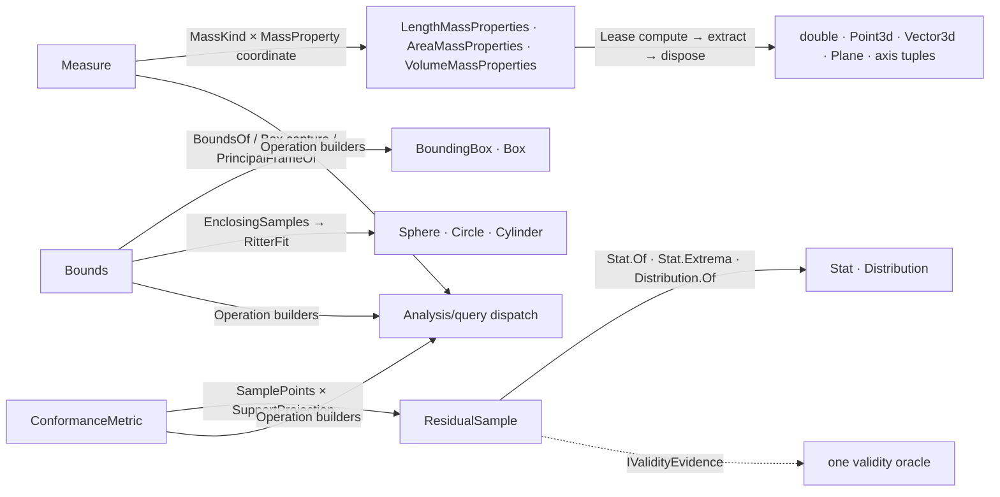

# [RASM_ANALYSIS_MEASURE]

The metrology owner — the host mass-property, bounding, and conformance surface of the measured-query runtime. `Measure` `[Union]` closes the scalar/centroid/inertia vocabulary over TWO policy smart enums: `MassKind` (None/Length/Area/Volume) carries the compute and aggregate delegates that drive `LengthMassProperties`/`AreaMassProperties`/`VolumeMassProperties` under the matching `Domain/validation` `Requirement` row, and `MassProperty` (Magnitude/MagnitudeError/Centroid/CentroidError/Radii/PrincipalAxes/Inertia/InertiaProducts) carries the moment-flag columns and the typed extract delegate — eleven public measures are THREE cases (`Length`/`SpatialMidpoint`/`MassProperty`) because every mass measure is one `(MassKind, MassProperty)` coordinate, never a sibling operation per measure name. `Bounds` `[Union]` closes fifteen bounding modalities — axis-aligned, plane-oriented, transformed, principal-frame OBB, center, corners, edges, area, volume, diagonal, aspect ratio, tightness, and the three enclosing solids (sphere/circle/cylinder) — over one shared sampling fallback and ONE generic Ritter fit fold parameterized by the constructed solid. `ConformanceMetric` `[SmartEnum<int>]` closes residual analysis (Distance/Rms/WithinTolerance/Summary/Maximum/SignedResidual/Containment/Distribution) as eight policy rows, each carrying its typed output, its target-admission predicate, and its projection delegate over the sampled `ResidualSample` stream.

Every mass-properties handle is a disposable native resource leased through the `Domain/rails` `Lease<T>` discipline — computed, projected, disposed, never escaped — and the aggregate fold sums sibling handles through the host `Sum(summands, bAddTo: true)` mutator, disposing every non-surviving handle on both the success and failure branches. Statistics compose the `Domain/stats` owners (`Stat.Of` Welford summary, `Stat.Extrema` tolerance-banded extremum, `Distribution.Of` quantiles, `StatContext.Tolerance` provenance); conformance distances compose the `Spatial/support` proximity adapter (`SupportSpace.Of` + `SupportProjection.Distance`/`SignedDistance`/`ContainmentDistance`) through the `Processing/intent` `VectorIntent.Support` rail; two-operand admission composes the `Domain/validation` `RequirementContext.Pair` kind-resolve-then-validate combinator. `ResidualSample` declares validity through the `Domain/rails` `IValidityEvidence` contract — the one oracle admits it with zero local switch. The factory spellings `Measure.Length`/`Area`/`Volume`/`SpatialMidpoint`/`MassError`/`Centroid`/`CentroidError`/`Radii`/`PrincipalAxes`/`Inertia`/`InertiaProducts`, `Bounds.AxisAligned`/`Center`/`Corners`, and the `AnalysisQuery.Measure`/`Bounds`/`Conformance` routes are frozen host contract — the Grasshopper component surface and the Rhino overlay bind them by name.

## [01]-[INDEX]

- [02]-[MEASURE]: `Measure` `[Union]` (3 cases, 11 factories) over `MassKind` compute/aggregate delegate rows and `MassProperty` moment-column rows; the `LengthOf`/`CentroidOf` polymorphic scalar folds; the principal-frame recovery `MassKind.PrincipalFrameOf`.
- [03]-[BOUNDS]: `Bounds` `[Union]` (15 cases) — box modalities, box metrics through one `BoxMetric` builder, principal-frame OBB and tightness through `MassKind`, enclosing solids through one `RitterFit` fold + `EnclosingSamples` fallback.
- [04]-[CONFORMANCE]: `ConformanceMetric` `[SmartEnum<int>]` (8 rows) + `ResidualSample` evidence receipt; the residual sampling pipeline over curve/surface sources against support-projected targets; exact curve-curve deviation short-circuit.

## [02]-[MEASURE]

- Owner: `MassKind` `[BoundaryAdapter]` `[SmartEnum<int>]` — four rows binding `Requirement` (Length→`CurveLength`, Area→`AreaMass`, Volume→`VolumeMass`, None→rejecting delegates) plus the `compute` delegate (one geometry → one leased `IDisposable` mass handle) and the `aggregate` delegate (many geometries → one summed handle); `KindOf(GeometryBase)` resolves the solid-aware default (Curve→Length; Brep/Mesh/Extrusion/Surface→`IsSolid ? Volume : Area`); `PrincipalFrameOf` recovers the centroid-anchored principal plane from full second+product moments. `MassProperty` `[BoundaryAdapter]` `[SmartEnum<int>]` — eight rows binding the op-key `Suffix`, the typed `Output`, three moment-demand columns (`FirstMoments`/`SecondMoments`/`ProductMoments` as `Func<MassKind, bool>` — length-error uniquely demands second moments), and the `extract` delegate projecting the host handle (`Length`/`Area`/`Volume` magnitudes, `Centroid`, `CentroidError`, `CentroidCoordinatesRadiiOfGyration`, `WorldCoordinatesPrincipalMomentsOfInertia` axes, `WorldCoordinatesMomentsOfInertia`, `WorldCoordinatesProductMoments`). `Measure` `[Union]` — `LengthCase`/`SpatialMidpointCase`/`MassPropertyCase(MassKind, MassProperty)` with the eleven factories minting `(MassKind, MassProperty)` coordinates.
- Cases: `Measure` `Length` · `SpatialMidpoint` · `MassProperty` (3 declared; 11 factories); `MassKind` `None` · `Length` · `Area` · `Volume` (4); `MassProperty` `Magnitude` · `MagnitudeError` · `Centroid` · `CentroidError` · `Radii` · `PrincipalAxes` · `Inertia` · `InertiaProducts` (8).
- Entry: `Measure.Operation<TGeometry, TOut>()` — the family seam `Analysis/query` forwards to; `Length` builds the scalar-length op only where the geometry kind is curve-topology or universal AND `TOut == double`; `SpatialMidpoint` builds the polymorphic centroid op for `TOut == Point3d` over point/box/curve/brep/mesh/surface/SubD-shaped inputs; `MassProperty` builds the leased mass op when `TOut == property.Output`, per-item through `MassKind.Compute` and aggregate through `MassKind.Aggregate` — the SAME operation carries both modalities, the aggregate branch traversing the whole prepared sequence into one summed handle.
- Auto: `LengthOf` short-circuits analytic primitives (`Line.Length`/`Polyline.Length`/`Circle.Circumference`/`Arc.Length`) before the fractional-tolerance `Curve.GetLength` fold, lowering `Ellipse` through a leased NURBS form; `CentroidOf` routes closed-planar curves to `AreaMassProperties`, open curves to `LengthMassProperties`, solids to volume mass, sheets to area mass, and analytic carriers (`Point3d`/`Point`/`Line`/`Polyline`/`BoundingBox`/`Box`) to their exact centers — the solid/sheet decision reads `IsSolid` per geometry, never a caller flag; the aggregate fold accumulates leases, sums via the host `Sum(summands, bAddTo: true)`, disposes every non-surviving handle on success AND failure branches, and degrades a heterogeneous length aggregate to per-item sum only when a non-curve member forces it.
- Receipt: none on a dedicated rail — measures project onto host value types (`double`/`Point3d`/`Vector3d`/`Plane`/`(double, Vector3d)` axis tuples) admitted through the one oracle; the `(double Moment, Vector3d Axis)` principal-axis tuple is oracle-validated per element (finite non-negative moment, non-tiny valid axis).
- Packages: RhinoCommon (`LengthMassProperties`/`AreaMassProperties`/`VolumeMassProperties` `Compute` + `Sum` + moment accessors, `Curve`/`Brep`/`Mesh`/`Surface`/`Extrusion` `IsSolid`, `SubDToBrepOptions.Default`), `Rasm.Domain` (`Requirement` rows, `Lease<T>`, `Op` rail, `Kind` capability web, coercion lattice `CurveForm`/`BrepForm`), Thinktecture.Runtime.Extensions, LanguageExt.Core.
- Growth: a new mass projection (a gyration tensor, a centroid-frame inertia) is one `MassProperty` row — key, suffix, output, three moment columns, one extract delegate — zero operation edits; a new mass domain is one `MassKind` row binding its requirement and compute/aggregate delegates; a new analytic centroid carrier is one `CentroidOf` switch arm.
- Boundary: eleven measures are three cases over two policy enums — a `MeasureLength`/`MeasureArea`/`MeasureVolume`/`MeasureCentroid` sibling-operation family is the named proliferation this coordinate design deletes; every mass handle is leased (`Lease<IDisposable>.Owned(…).Use(…)`) and a raw `Compute` whose handle escapes the projection scope is the resource-leak defect; the moment-demand columns request EXACTLY the moments the extraction reads (magnitude requests none, inertia requests all three) so the host never computes unread moments; `MassKind.None` rejects through its delegates rather than a null-object silently succeeding; the area path threads `context.Fractional`/`context.Absolute.Value` into the host tolerances and a hardcoded tolerance literal is the deleted form.

```csharp contract
// --- [RUNTIME_PRELUDE] ----------------------------------------------------------------------
using System;
using System.Collections.Generic;
using System.Linq;
using Foundation.CSharp.Analyzers.Contracts;
using LanguageExt;
using Rasm.Domain;
using Rhino.Geometry;
using Thinktecture;
using static LanguageExt.Prelude;

namespace Rasm.Analysis;

// --- [TYPES] --------------------------------------------------------------------------------
[SkipUnionOps]
[Union]
public partial record Measure {
    public sealed record LengthCase : Measure;
    public sealed record SpatialMidpointCase : Measure;
    public sealed record MassPropertyCase(MassKind Mass, MassProperty Property) : Measure;
    public static Measure Length => new LengthCase();
    public static Measure SpatialMidpoint => new SpatialMidpointCase();
    public static Measure Area => new MassPropertyCase(Mass: MassKind.Area, Property: MassProperty.Magnitude);
    public static Measure Volume => new MassPropertyCase(Mass: MassKind.Volume, Property: MassProperty.Magnitude);
    public static Measure MassError(MassKind mass) => new MassPropertyCase(Mass: mass, Property: MassProperty.MagnitudeError);
    public static Measure Centroid(MassKind mass) => new MassPropertyCase(Mass: mass, Property: MassProperty.Centroid);
    public static Measure CentroidError(MassKind mass) => new MassPropertyCase(Mass: mass, Property: MassProperty.CentroidError);
    public static Measure Radii(MassKind mass) => new MassPropertyCase(Mass: mass, Property: MassProperty.Radii);
    public static Measure PrincipalAxes(MassKind mass) => new MassPropertyCase(Mass: mass, Property: MassProperty.PrincipalAxes);
    public static Measure Inertia(MassKind mass) => new MassPropertyCase(Mass: mass, Property: MassProperty.Inertia);
    public static Measure InertiaProducts(MassKind mass) => new MassPropertyCase(Mass: mass, Property: MassProperty.InertiaProducts);
    internal Operation<TGeometry, TOut> Operation<TGeometry, TOut>() where TGeometry : notnull => Switch(
        lengthCase: static _ => Analyze.Length<TGeometry, TOut>(),
        spatialMidpointCase: static _ => typeof(TOut) == typeof(Point3d) ? Analyze.SpatialMidpoint<TGeometry, TOut>() : Op.Of(name: "SpatialMidpoint").Unsupported<TGeometry, TOut>(),
        massPropertyCase: static p => Analyze.MassPropertyMeasure<TGeometry, TOut>(mass: p.Mass, property: p.Property));
}

[BoundaryAdapter, SmartEnum<int>]
public sealed partial class MassKind {
    public static readonly MassKind None = new(key: 0, label: nameof(None), requirement: Requirement.None,
        compute: static (_, _, _, _, _, _) => Fin.Fail<IDisposable>(new Fault.ComputationFailed(nameof(None))),
        aggregate: static (_, _, _, _, _, _, _) => Fin.Fail<IDisposable>(new Fault.ComputationFailed(nameof(None))));
    public static readonly MassKind Length = new(key: 1, label: nameof(Length), requirement: Requirement.CurveLength, compute: LengthOf, aggregate: LengthAggregate);
    public static readonly MassKind Area = new(key: 2, label: nameof(Area), requirement: Requirement.AreaMass, compute: AreaOf,
        aggregate: static (self, geometry, context, first, second, product, op) => SumAggregate<AreaMassProperties>(geometry: geometry, context: context, mass: self, firstMoments: first, secondMoments: second, productMoments: product, op: op, sum: static (total, summands) => total.Sum(summands: summands, bAddTo: true)));
    public static readonly MassKind Volume = new(key: 3, label: nameof(Volume), requirement: Requirement.VolumeMass, compute: VolumeOf,
        aggregate: static (self, geometry, context, first, second, product, op) => SumAggregate<VolumeMassProperties>(geometry: geometry, context: context, mass: self, firstMoments: first, secondMoments: second, productMoments: product, op: op, sum: static (total, summands) => total.Sum(summands: summands, bAddTo: true)));
    private readonly Func<object, Context, bool, bool, bool, Op, Fin<IDisposable>> compute;
    private readonly Func<MassKind, IEnumerable<object>, Context, bool, bool, bool, Op, Fin<IDisposable>> aggregate;
    public string Label { get; }
    internal Requirement Requirement { get; }
    public Eff<Env, IDisposable> Compute(object? geometry, Op op, bool firstMoments = false, bool secondMoments = false, bool productMoments = false) =>
        Optional(geometry).ToFin(op.InvalidInput()).ToEff().Bind(g => Env.Asks.Bind(context => compute(g, context, firstMoments, secondMoments, productMoments, op).ToEff()));
    internal Fin<IDisposable> Aggregate(IEnumerable<object> geometry, Context context, bool firstMoments, bool secondMoments, bool productMoments, Op op) =>
        aggregate(this, geometry, context, firstMoments, secondMoments, productMoments, op);
    internal static MassKind KindOf(GeometryBase geometry) => geometry switch {
        Curve => Length,
        Brep brep => brep.IsSolid ? Volume : Area,
        Mesh mesh => mesh.IsSolid ? Volume : Area,
        Extrusion extrusion => extrusion.IsSolid ? Volume : Area,
        Surface surface => surface.IsSolid ? Volume : Area,
        _ => None,
    };
    internal static Fin<Plane> PrincipalFrameOf(GeometryBase geometry, Context context, Op key) =>
        KindOf(geometry: geometry) switch {
            MassKind kind when kind.Equals(None) => Fin.Fail<Plane>(key.Unsupported(geometryType: geometry.GetType(), outputType: typeof(Plane))),
            MassKind kind => kind.compute(geometry, context, true, true, true, key)
                .Bind(handle => new Lease<IDisposable>.Owned(Value: handle).Use(mass => PrincipalFrameOf(mass: mass, key: key))),
        };
    internal static Fin<Plane> PrincipalFrameOf(IDisposable mass, Op key) =>
        (mass switch {
            LengthMassProperties l => Some(l.Centroid),
            AreaMassProperties a => Some(a.Centroid),
            VolumeMassProperties v => Some(v.Centroid),
            _ => Option<Point3d>.None,
        }).ToFin(key.InvalidResult()).Bind(centroid =>
            key.PrincipalAxesOf(mass: mass).Bind(axes => (axes.Count, centroid.IsValid) switch {
                ( >= 2, true) => key.AcceptValue(value: new Plane(origin: centroid, xDirection: axes[0].Axis, yDirection: axes[1].Axis)),
                _ => Fin.Fail<Plane>(key.InvalidResult()),
            }));
    private static Fin<IDisposable> Done<TMass>(TMass? mass) where TMass : class, IDisposable =>
        Optional(mass).ToFin(new Fault.ComputationFailed(typeof(TMass).Name)).Map(static handle => (IDisposable)handle);
    private static Fin<IDisposable> LengthOf(object geometry, Context _, bool firstMoments, bool secondMoments, bool productMoments, Op op) =>
        geometry.CurveForm(op: op).Bind(lease => lease.Use(curve =>
            Done(LengthMassProperties.Compute(curve, length: true, firstMoments: firstMoments, secondMoments: secondMoments, productMoments: productMoments))));
    private static Fin<IDisposable> AreaOf(object geometry, Context context, bool firstMoments, bool secondMoments, bool productMoments, Op op) => geometry switch {
        Mesh mesh => Done(AreaMassProperties.Compute(mesh, area: true, firstMoments: firstMoments, secondMoments: secondMoments, productMoments: productMoments)),
        Curve curve => Done(AreaMassProperties.Compute(curve, context.Absolute.Value)),
        object curveLike when Kind.CanCurveForm(type: curveLike.GetType()) => curveLike.CurveForm(op: op).Bind(lease => lease.Use(curve => AreaOf(geometry: curve, context: context, firstMoments: firstMoments, secondMoments: secondMoments, productMoments: productMoments, op: op))),
        Brep brep => Done(AreaMassProperties.Compute(brep, area: true, firstMoments: firstMoments, secondMoments: secondMoments, productMoments: productMoments, relativeTolerance: context.Fractional, absoluteTolerance: context.Absolute.Value)),
        Surface surface => Done(AreaMassProperties.Compute(surface, area: true, firstMoments: firstMoments, secondMoments: secondMoments, productMoments: productMoments)),
        GeometryBase { HasBrepForm: true } or Box or BoundingBox or Sphere or Cylinder or Cone or Torus =>
            geometry.BrepForm(op: op).Bind(lease => lease.Use(brep => AreaOf(geometry: brep, context: context, firstMoments: firstMoments, secondMoments: secondMoments, productMoments: productMoments, op: op))),
        _ => Fin.Fail<IDisposable>(op.Unsupported(geometry.GetType(), typeof(AreaMassProperties))),
    };
    private static Fin<IDisposable> VolumeOf(object geometry, Context context, bool firstMoments, bool secondMoments, bool productMoments, Op op) => geometry switch {
        Mesh mesh => Done(VolumeMassProperties.Compute(mesh, volume: true, firstMoments: firstMoments, secondMoments: secondMoments, productMoments: productMoments)),
        Brep brep => Done(VolumeMassProperties.Compute(brep, volume: true, firstMoments: firstMoments, secondMoments: secondMoments, productMoments: productMoments, relativeTolerance: context.Fractional, absoluteTolerance: context.Absolute.Value)),
        Surface surface => Done(VolumeMassProperties.Compute(surface, volume: true, firstMoments: firstMoments, secondMoments: secondMoments, productMoments: productMoments)),
        GeometryBase { HasBrepForm: true } or Box or BoundingBox or Sphere or Cylinder or Cone or Torus =>
            geometry.BrepForm(op: op).Bind(lease => lease.Use(brep => VolumeOf(geometry: brep, context: context, firstMoments: firstMoments, secondMoments: secondMoments, productMoments: productMoments, op: op))),
        _ => Fin.Fail<IDisposable>(op.Unsupported(geometry.GetType(), typeof(VolumeMassProperties))),
    };
    private static Fin<IDisposable> LengthAggregate(MassKind self, IEnumerable<object> geometry, Context context, bool firstMoments, bool secondMoments, bool productMoments, Op op) =>
        toSeq(geometry) switch {
            Seq<object> items when items.ForAll(static item => item is Curve) =>
                Done(LengthMassProperties.Compute(curves: items.AsIterable().Cast<Curve>(), length: true, firstMoments: firstMoments, secondMoments: secondMoments, productMoments: productMoments)),
            Seq<object> items => SumAggregate<LengthMassProperties>(geometry: items.AsIterable(), context: context, mass: self, firstMoments: firstMoments, secondMoments: secondMoments, productMoments: productMoments, op: op, sum: static (total, summands) => total.Sum(summands: summands, bAddTo: true)),
        };
    private static Fin<IDisposable> SumAggregate<TMass>(IEnumerable<object> geometry, Context context, MassKind mass, bool firstMoments, bool secondMoments, bool productMoments, Op op, Func<TMass, IEnumerable<TMass>, bool> sum) where TMass : class, IDisposable =>
        toSeq(geometry).Fold(Fin.Succ(Seq<IDisposable>()), (state, item) => state.Bind(owned =>
            mass.compute(item, context, firstMoments, secondMoments, productMoments, op)
                .Map(computed => computed.Cons(owned))
                .BindFail(error => {
                    _ = owned.Iter(static resource => resource.Dispose());
                    return Fin.Fail<Seq<IDisposable>>(error);
                })))
            .Bind(owned => {
                TMass[] masses = [.. owned.AsIterable().Cast<TMass>()];
                Fin<IDisposable> result = masses.Length switch {
                    1 => Fin.Succ<IDisposable>(masses[0]),
                    > 1 when sum(masses[0], Enumerable.Skip(masses, 1)) => Fin.Succ<IDisposable>(masses[0]),
                    _ => Fin.Fail<IDisposable>(new Fault.ComputationFailed(typeof(TMass).Name)),
                };
                return result
                    .Map(active => {
                        _ = toSeq(masses).Filter(resource => !ReferenceEquals(objA: resource, objB: active)).Iter(static resource => resource.Dispose());
                        return active;
                    })
                    .BindFail(error => {
                        _ = owned.Iter(static resource => resource.Dispose());
                        return Fin.Fail<IDisposable>(error);
                    });
            });
}

[BoundaryAdapter, SmartEnum<int>]
public sealed partial class MassProperty {
    public static readonly MassProperty Magnitude = new(key: 0, suffix: string.Empty, output: typeof(double), first: static _ => false, second: static _ => false, product: static _ => false,
        extract: static (k, p) => k.MassPropertyExtract(props: p, length: static l => l.Length, area: static a => a.Area, volume: static v => v.Volume));
    public static readonly MassProperty MagnitudeError = new(key: 1, suffix: "Error", output: typeof(double), first: static _ => false, second: static m => m.Equals(MassKind.Length), product: static _ => false,
        extract: static (k, p) => k.MassPropertyExtract(props: p, length: static l => l.LengthError, area: static a => a.AreaError, volume: static v => v.VolumeError));
    public static readonly MassProperty Centroid = new(key: 2, suffix: nameof(Centroid), output: typeof(Point3d), first: static _ => true, second: static m => m.Equals(MassKind.Length), product: static _ => false,
        extract: static (k, p) => k.MassPropertyExtract(props: p, length: static l => l.Centroid, area: static a => a.Centroid, volume: static v => v.Centroid));
    public static readonly MassProperty CentroidError = new(key: 3, suffix: nameof(CentroidError), output: typeof(Vector3d), first: static _ => true, second: static m => m.Equals(MassKind.Length), product: static _ => false,
        extract: static (k, p) => k.MassPropertyExtract(props: p, length: static l => l.CentroidError, area: static a => a.CentroidError, volume: static v => v.CentroidError));
    public static readonly MassProperty Radii = new(key: 4, suffix: nameof(Radii), output: typeof(Vector3d), first: static _ => true, second: static _ => true, product: static _ => false,
        extract: static (k, p) => k.MassPropertyExtract(props: p, length: static l => l.CentroidCoordinatesRadiiOfGyration, area: static a => a.CentroidCoordinatesRadiiOfGyration, volume: static v => v.CentroidCoordinatesRadiiOfGyration));
    public static readonly MassProperty PrincipalAxes = new(key: 5, suffix: "Principal", output: typeof(ValueTuple<double, Vector3d>), first: static _ => true, second: static _ => true, product: static _ => true,
        extract: static (k, p) => k.PrincipalAxesOf(mass: p).Map(static axes => axes.Map(static axis => (object)axis)));
    public static readonly MassProperty Inertia = new(key: 6, suffix: nameof(Inertia), output: typeof(Vector3d), first: static _ => true, second: static _ => true, product: static _ => true,
        extract: static (k, p) => k.MassPropertyExtract(props: p, length: static l => l.WorldCoordinatesMomentsOfInertia, area: static a => a.WorldCoordinatesMomentsOfInertia, volume: static v => v.WorldCoordinatesMomentsOfInertia));
    public static readonly MassProperty InertiaProducts = new(key: 7, suffix: "Products", output: typeof(Vector3d), first: static _ => true, second: static _ => true, product: static _ => true,
        extract: static (k, p) => k.MassPropertyExtract(props: p, length: static l => l.WorldCoordinatesProductMoments, area: static a => a.WorldCoordinatesProductMoments, volume: static v => v.WorldCoordinatesProductMoments));
    private readonly Func<MassKind, bool> first;
    private readonly Func<MassKind, bool> second;
    private readonly Func<MassKind, bool> product;
    private readonly Func<Op, IDisposable, Fin<Seq<object>>> extract;
    public string Suffix { get; }
    public Type Output { get; }
    internal bool FirstMoments(MassKind mass) => first(arg: mass);
    internal bool SecondMoments(MassKind mass) => second(arg: mass);
    internal bool ProductMoments(MassKind mass) => product(arg: mass);
    internal Fin<Seq<TValue>> Extract<TValue>(Op key, IDisposable mass) =>
        typeof(TValue) == Output
            ? extract(arg1: key, arg2: mass).Bind(values => values.TraverseM(value => value is TValue typed ? key.AcceptValue(value: typed) : Fin.Fail<TValue>(key.Unsupported(geometryType: value.GetType(), outputType: typeof(TValue)))).As())
            : Fin.Fail<Seq<TValue>>(key.Unsupported(geometryType: typeof(IDisposable), outputType: typeof(TValue)));
}

// --- [OPERATIONS] ---------------------------------------------------------------------------
public static partial class Analyze {
    internal static Operation<TGeometry, TOut> Length<TGeometry, TOut>() where TGeometry : notnull {
        Op key = Op.Of();
        Option<Requirement> requirement = (typeof(TOut) == typeof(double), typeof(TGeometry), Kind.Of(typeof(TGeometry)).Case) switch {
            (true, Type geometry, _) when geometry == typeof(object) || geometry == typeof(GeometryBase) => Some(Requirement.CurveLength),
            (true, _, Kind kind) when kind.Topology == Topology.Curve => Some(Requirement.CurveLength),
            _ => Option<Requirement>.None,
        };
        return requirement.Match(
            Some: active => Operation<TGeometry, double>.Build(key: key, requirement: active, requiresContext: true, state: key,
                evaluator: static (op, geometry) =>
                    from context in Env.Asks
                    from length in LengthOf(geometry: geometry, context: context, op: op).ToEff()
                    from result in op.Accept(value: length).ToEff()
                    select result).As<TGeometry, TOut>(key: key),
            None: () => key.Unsupported<TGeometry, TOut>());
    }
    internal static Operation<TGeometry, TOut> SpatialMidpoint<TGeometry, TOut>() where TGeometry : notnull {
        Op key = Op.Of();
        return (typeof(TOut), typeof(TGeometry)) switch {
            (Type output, Type geometry) when output == typeof(Point3d)
                && (geometry == typeof(object) || geometry == typeof(GeometryBase) || geometry == typeof(Point3d) || geometry == typeof(Point) || geometry == typeof(BoundingBox) || geometry == typeof(Box)
                    || Kind.CanCurveForm(type: geometry) || typeof(Brep).IsAssignableFrom(geometry) || typeof(Mesh).IsAssignableFrom(geometry) || Kind.CanSurfaceForm(type: geometry) || typeof(SubD).IsAssignableFrom(geometry)) =>
                Operation<TGeometry, Point3d>.Build(key: key, requiresContext: true, state: key,
                    evaluator: static (op, geometry) =>
                        from context in Env.Asks
                        from centroid in CentroidOf(geometry: geometry, context: context, op: op).ToEff()
                        from result in op.Accept(value: centroid).ToEff()
                        select result).As<TGeometry, TOut>(key: key),
            _ => key.Unsupported<TGeometry, TOut>(),
        };
    }
    internal static Operation<TGeometry, TOut> MassPropertyMeasure<TGeometry, TOut>(MassKind mass, MassProperty property) where TGeometry : notnull {
        Op key = Op.Of(name: $"{mass.Label}{property.Suffix}");
        return (mass.Equals(MassKind.None), typeof(TOut) == property.Output) switch {
            (true, _) => Operation<TGeometry, TOut>.Reject(key: key, fault: key.InvalidInput()),
            (false, true) => Operation<TGeometry, TOut>.Build(
                key: key, state: (Key: key, Mass: mass, Property: property), requirement: mass.Requirement, requiresContext: true,
                aggregate: Some<Func<Seq<TGeometry>, Eff<Env, Seq<TOut>>>>(
                    geometry => from context in Env.Asks
                                from aggregate in mass.Aggregate(geometry: geometry.Map(static item => (object)item).AsIterable(), context: context, firstMoments: property.FirstMoments(mass: mass), secondMoments: property.SecondMoments(mass: mass), productMoments: property.ProductMoments(mass: mass), op: key).ToEff()
                                from values in new Lease<IDisposable>.Owned(Value: aggregate).Use(handle => property.Extract<TOut>(key: key, mass: handle)).ToEff()
                                select values),
                evaluator: static (state, geometry) =>
                    from computed in state.Mass.Compute(geometry: geometry, op: state.Key, firstMoments: state.Property.FirstMoments(mass: state.Mass), secondMoments: state.Property.SecondMoments(mass: state.Mass), productMoments: state.Property.ProductMoments(mass: state.Mass))
                    from values in new Lease<IDisposable>.Owned(Value: computed).Use(handle => state.Property.Extract<TOut>(key: state.Key, mass: handle)).ToEff()
                    select values),
            _ => key.Unsupported<TGeometry, TOut>(),
        };
    }
    internal static Fin<Seq<object>> MassPropertyExtract<TProp>(this Op key, IDisposable props, Func<LengthMassProperties, TProp> length, Func<AreaMassProperties, TProp> area, Func<VolumeMassProperties, TProp> volume) =>
        props switch {
            LengthMassProperties l => key.Accept(value: length(arg: l)).Map(static values => values.Map(static value => (object)value!)),
            AreaMassProperties a => key.Accept(value: area(arg: a)).Map(static values => values.Map(static value => (object)value!)),
            VolumeMassProperties v => key.Accept(value: volume(arg: v)).Map(static values => values.Map(static value => (object)value!)),
            _ => Fin.Fail<Seq<object>>(key.InvalidResult()),
        };
    internal static Fin<Seq<(double Moment, Vector3d Axis)>> PrincipalAxesOf<TMass>(this Op key, TMass mass) where TMass : class =>
        mass switch {
            LengthMassProperties length => PrincipalAxesFromMoments(key: key, solved: length.WorldCoordinatesPrincipalMomentsOfInertia(x: out double x, xaxis: out Vector3d xAxis, y: out double y, yaxis: out Vector3d yAxis, z: out double z, zaxis: out Vector3d zAxis), x: x, xAxis: xAxis, y: y, yAxis: yAxis, z: z, zAxis: zAxis),
            AreaMassProperties area => PrincipalAxesFromMoments(key: key, solved: area.WorldCoordinatesPrincipalMomentsOfInertia(x: out double x, xaxis: out Vector3d xAxis, y: out double y, yaxis: out Vector3d yAxis, z: out double z, zaxis: out Vector3d zAxis), x: x, xAxis: xAxis, y: y, yAxis: yAxis, z: z, zAxis: zAxis),
            VolumeMassProperties volume => PrincipalAxesFromMoments(key: key, solved: volume.WorldCoordinatesPrincipalMomentsOfInertia(x: out double x, xaxis: out Vector3d xAxis, y: out double y, yaxis: out Vector3d yAxis, z: out double z, zaxis: out Vector3d zAxis), x: x, xAxis: xAxis, y: y, yAxis: yAxis, z: z, zAxis: zAxis),
            _ => Fin.Fail<Seq<(double Moment, Vector3d Axis)>>(key.InvalidResult()),
        };
    private static Fin<Seq<(double Moment, Vector3d Axis)>> PrincipalAxesFromMoments(Op key, bool solved, double x, Vector3d xAxis, double y, Vector3d yAxis, double z, Vector3d zAxis) =>
        solved
            ? Fin.Succ(Seq((Moment: x, Axis: xAxis), (Moment: y, Axis: yAxis), (Moment: z, Axis: zAxis)))
            : Fin.Fail<Seq<(double Moment, Vector3d Axis)>>(key.InvalidResult());
    internal static Fin<double> LengthOf<TGeometry>(TGeometry geometry, Context context, Op op) where TGeometry : notnull =>
        Optional(geometry).ToFin(op.InvalidInput()).Bind(g => g switch {
            Line line => Fin.Succ(line.Length),
            Polyline polyline => Fin.Succ(polyline.Length),
            Circle circle => Fin.Succ(circle.Circumference),
            Arc arc => Fin.Succ(arc.Length),
            Ellipse ellipse => Optional(ellipse.ToNurbsCurve()).ToFin(op.InvalidResult()).Bind(curve => new Lease<Curve>.Owned(Value: curve).Use(native => LengthOf(geometry: native, context: context, op: op))),
            Curve curve => curve.GetLength(context.Fractional) switch {
                double length when RhinoMath.IsValidDouble(x: length) && length >= 0.0 => Fin.Succ(length),
                _ => Fin.Fail<double>(op.InvalidResult()),
            },
            _ => Fin.Fail<double>(op.Unsupported(g.GetType(), typeof(double))),
        });
    internal static Fin<Point3d> CentroidOf<TGeometry>(TGeometry geometry, Context context, Op op) where TGeometry : notnull =>
        Optional(geometry).ToFin(op.InvalidInput()).Bind(g => g switch {
            Point3d point => Fin.Succ(point),
            Point point => Fin.Succ(point.Location),
            Line line => Fin.Succ(line.PointAt(t: 0.5)),
            Polyline polyline => Fin.Succ(polyline.CenterPoint()),
            BoundingBox box => Fin.Succ(box.Center),
            Box box => Fin.Succ(box.Center),
            Brep brep => MassCentroidOf(geometry: brep, isSolid: brep.IsSolid, context: context, op: op),
            Mesh mesh => MassCentroidOf(geometry: mesh, isSolid: mesh.IsSolid, context: context, op: op),
            BrepFace face => MassCentroidOf(geometry: face, isSolid: false, context: context, op: op),
            Surface surface => MassCentroidOf(geometry: surface, isSolid: surface.IsSolid, context: context, op: op),
            Curve curve => (curve.IsClosed, curve.TryGetPlane(plane: out Plane _, tolerance: context.Absolute.Value)) switch {
                (false, _) => Optional(LengthMassProperties.Compute(curve)).ToFin(op.InvalidResult()).Map(static m => new Lease<LengthMassProperties>.Owned(Value: m).Use(static handle => handle.Centroid)),
                (true, true) => Optional(AreaMassProperties.Compute(curve, context.Absolute.Value)).ToFin(op.InvalidResult()).Map(static m => new Lease<AreaMassProperties>.Owned(Value: m).Use(static handle => handle.Centroid)),
                _ => Fin.Fail<Point3d>(op.InvalidResult()),
            },
            SubD subd => Optional(subd.ToBrep(SubDToBrepOptions.Default)).ToFin(op.InvalidResult()).Bind(brep => new Lease<Brep>.Owned(Value: brep).Use(owned => MassCentroidOf(geometry: owned, isSolid: owned.IsSolid, context: context, op: op))),
            _ => Fin.Fail<Point3d>(op.Unsupported(g.GetType(), typeof(Point3d))),
        });
    private static Fin<Point3d> MassCentroidOf(object geometry, bool isSolid, Context context, Op op) =>
        (isSolid ? MassKind.Volume : MassKind.Area).Aggregate(geometry: [geometry], context: context, firstMoments: true, secondMoments: false, productMoments: false, op: op)
            .Bind(handle => new Lease<IDisposable>.Owned(Value: handle).Use(owned => owned switch {
                LengthMassProperties l => Fin.Succ(l.Centroid),
                AreaMassProperties a => Fin.Succ(a.Centroid),
                VolumeMassProperties v => Fin.Succ(v.Centroid),
                _ => Fin.Fail<Point3d>(op.InvalidResult()),
            }));
}
```

## [03]-[BOUNDS]

- Owner: `Bounds` `[Union]` `[SkipUnionOps]` — fifteen cases over four modality clusters: box RECOVERY (`AxisAlignedCase` → `BoundingBox` through the `Domain/normalization` `BoundsOf` extension; `InPlaneCase(Plane)` → the plane-oriented `Box(plane, geometry)` capture; `TransformedCase(Transform)` → `GetBoundingBox(xform)`; `PrincipalFrameCase` → the `MassKind.PrincipalFrameOf` OBB), box PROJECTIONS (`CenterCase`/`CornersCase(bool Unique)`/`EdgesCase` → `Point3d`/`Line` streams, corners optionally deduplicated through `Point3d.CullDuplicates` at model tolerance), box METRICS (`AreaCase`/`VolumeCase`/`DiagonalCase`/`AspectRatioCase`/`TightnessCase` → scalars through ONE `BoxMetric` builder over `BoundingBox`-or-`Box` inputs; tightness = AABB volume over principal-OBB volume, the orientation-quality ratio), and ENCLOSING solids (`EnclosingSphereCase(int)`/`EnclosingCircleCase(Plane, int)`/`EnclosingCylinderCase(Vector3d, int)` → Ritter-fitted `Sphere`, native smallest-circle `Circle` in a projection plane, axis-projected Ritter-disc `Cylinder` with exact axial extent).
- Cases: `AxisAligned` · `Oriented` · `Transformed` · `Principal` · `Center` · `Corners` · `Edges` · `Area` · `Volume` · `Diagonal` · `AspectRatio` · `Tightness` · `EnclosingSphere` · `EnclosingCircle` · `EnclosingCylinder` (15).
- Entry: `Bounds.Operation<TGeometry, TOut>()` — one generated `Switch` where every arm gates capability (`Kind.CanBound(type, includeSphere: true)` for boundable inputs, `Kind.Can(type, static k => k.CanPrincipal)` for mass-backed frames, `GeometryBase` assignability for oriented/transformed capture) and output type before building, rejecting onto `Fault.Unsupported` at build time.
- Auto: `EnclosingSamples` samples the geometry surface through the `Domain/evaluation` `SamplePoints` extension and DEGRADES to the eight bounding-box corners when sampling is unsupported for the type — enclosure never fails for a boundable input, it coarsens; `RitterFit` is ONE generic two-pass fold (farthest-from-seed, farthest-from-that, then the grow-ball sweep) parameterized by the constructed solid and its validity predicate — sphere and cylinder-disc share it verbatim; the cylinder derives its axis through `VectorIntent.Direction` admission, projects samples to the axis-normal plane for the disc, and folds the exact axial extent `(min, max)` along the admitted axis; the enclosing circle projects through `Plane.ClosestParameter` and delegates to the host `Circle.TrySmallestEnclosingCircle` — native exact beats a hand-rolled Welzl here, then re-embeds the planar result into world space.
- Packages: RhinoCommon (`BoundingBox` `GetCorners`/`GetEdges`/`Diagonal`/`Center`/`Area`/`Volume`, `Box(Plane, GeometryBase)` capture, `GeometryBase.GetBoundingBox(Transform)`, `Circle.TrySmallestEnclosingCircle`, `Point3d.CullDuplicates`), `Rasm.Domain` (`BoundsOf`/`SamplePoints` extensions, `Kind` capability web, `RhinoMath.ZeroTolerance` degenerate-ratio floor), `Rasm.Vectors` (`VectorIntent.Direction` axis admission), Thinktecture.Runtime.Extensions, LanguageExt.Core.
- Growth: a new box metric is one `BoxMetric` call arm (two projection lambdas); a new enclosing solid (a capsule, an ellipsoid) is one case composing the SAME `EnclosingSamples` + `RitterFit`/native-fit machinery; a new recovery frame source is one case arm — never a `BoundsCalculator` sibling class.
- Boundary: fifteen modalities live on ONE union dispatched by ONE `Switch` — a `BoundingBoxOps`/`OrientedBoxOps`/`EnclosingSolidOps` class family is the named fragmentation this owner deletes; the aspect-ratio denominator floors at `RhinoMath.ZeroTolerance` so a degenerate extent yields a large finite ratio, never an infinity crossing the rail; `Corners(unique: true)` deduplicates at MODEL absolute tolerance from the threaded `Context`, never a literal epsilon; the enclosing fits are measured approximations by contract — Ritter over N surface samples, documented as the bounding guarantee (every sample enclosed), not a minimal-ball claim; the box-metric operations accept `BoundingBox` or `Box` VALUES as the geometry input (the box is the analyzed object), the recovery operations accept geometry — one union serves both altitudes and the type gates keep them disjoint.

```csharp contract
// --- [RUNTIME_PRELUDE] ----------------------------------------------------------------------
using System;
using LanguageExt;
using Rasm.Domain;
using Rasm.Vectors;
using Rhino.Geometry;
using Thinktecture;
using static LanguageExt.Prelude;

namespace Rasm.Analysis;

// --- [TYPES] --------------------------------------------------------------------------------
[SkipUnionOps]
[Union]
public partial record Bounds {
    public sealed record AxisAlignedCase : Bounds;
    public sealed record InPlaneCase(Plane Plane) : Bounds;
    public sealed record TransformedCase(Transform Xform) : Bounds;
    public sealed record PrincipalFrameCase : Bounds;
    public sealed record CenterCase : Bounds;
    public sealed record CornersCase(bool Unique) : Bounds;
    public sealed record EdgesCase : Bounds;
    public sealed record AreaCase : Bounds;
    public sealed record VolumeCase : Bounds;
    public sealed record DiagonalCase : Bounds;
    public sealed record AspectRatioCase : Bounds;
    public sealed record TightnessCase : Bounds;
    public sealed record EnclosingSphereCase(int Count = 64) : Bounds;
    public sealed record EnclosingCircleCase(Plane Plane, int Count = 64) : Bounds;
    public sealed record EnclosingCylinderCase(Vector3d Axis, int Count = 64) : Bounds;
    internal static readonly Op BoundsKey = Op.Of(name: nameof(Bounds)), OrientedKey = Op.Of(name: "OrientedBounds"), TransformedKey = Op.Of(name: "TransformedBounds"), PrincipalKey = Op.Of(name: "PrincipalBounds"), CenterKey = Op.Of(name: "BoundsCenter");
    internal static readonly Op CornersKey = Op.Of(name: "BoundsCorners"), BoxEdgesKey = Op.Of(name: "BoxEdges"), BoxAreaKey = Op.Of(name: "BoxArea"), BoxVolumeKey = Op.Of(name: "BoxVolume"), BoxDiagonalKey = Op.Of(name: "BoxDiagonal");
    internal static readonly Op BoxAspectRatioKey = Op.Of(name: "BoxAspectRatio"), BoxTightnessKey = Op.Of(name: "BoxTightness"), EnclosingSphereKey = Op.Of(name: "EnclosingSphere"), EnclosingCircleKey = Op.Of(name: "EnclosingCircle"), EnclosingCylinderKey = Op.Of(name: "EnclosingCylinder");
    public static Bounds AxisAligned => new AxisAlignedCase();
    public static Bounds Oriented(Plane plane) => new InPlaneCase(Plane: plane);
    public static Bounds Transformed(Transform transform) => new TransformedCase(Xform: transform);
    public static Bounds Principal => new PrincipalFrameCase();
    public static Bounds Center => new CenterCase();
    public static Bounds Corners(bool unique = false) => new CornersCase(Unique: unique);
    public static Bounds Edges => new EdgesCase();
    public static Bounds Area => new AreaCase();
    public static Bounds Volume => new VolumeCase();
    public static Bounds Diagonal => new DiagonalCase();
    public static Bounds AspectRatio => new AspectRatioCase();
    public static Bounds Tightness => new TightnessCase();
    public static Bounds EnclosingSphere(int count = 64) => new EnclosingSphereCase(Count: count);
    public static Bounds EnclosingCircle(Plane plane, int count = 64) => new EnclosingCircleCase(Plane: plane, Count: count);
    public static Bounds EnclosingCylinder(Vector3d axis, int count = 64) => new EnclosingCylinderCase(Axis: axis, Count: count);

    internal Operation<TGeometry, TOut> Operation<TGeometry, TOut>() where TGeometry : notnull => Switch(
        axisAlignedCase: static _ => (typeof(TOut) == typeof(BoundingBox) && Kind.CanBound(typeof(TGeometry), includeSphere: true))
            ? Analysis.Operation<TGeometry, BoundingBox>.Build(key: BoundsKey, state: BoundsKey,
                evaluator: static (op, geometry) => geometry.BoundsOf(op: op).Bind(box => op.Accept(value: box)).ToEff()).As<TGeometry, TOut>(key: BoundsKey)
            : BoundsKey.Unsupported<TGeometry, TOut>(),
        inPlaneCase: static p => (typeof(TOut) == typeof(Box) && typeof(GeometryBase).IsAssignableFrom(c: typeof(TGeometry)))
            ? Analyze.Native<TGeometry, TOut, GeometryBase, Box, (Op Key, Plane Plane)>(key: OrientedKey, state: (OrientedKey, p.Plane),
                project: static (state, native) => state.Key.Accept(value: new Box(state.Plane, native)).ToEff())
            : OrientedKey.Unsupported<TGeometry, TOut>(),
        transformedCase: static t => (typeof(TOut) == typeof(BoundingBox) && typeof(GeometryBase).IsAssignableFrom(c: typeof(TGeometry)))
            ? Analyze.Native<TGeometry, TOut, GeometryBase, BoundingBox, (Op Key, Transform Xform)>(key: TransformedKey, state: (Key: TransformedKey, t.Xform),
                project: static (state, native) => state.Key.Accept(value: native.GetBoundingBox(xform: state.Xform)).ToEff())
            : TransformedKey.Unsupported<TGeometry, TOut>(),
        principalFrameCase: static _ => (typeof(TOut) == typeof(Box) && Kind.Can(type: typeof(TGeometry), predicate: static k => k.CanPrincipal))
            ? Analyze.Native<TGeometry, TOut, GeometryBase, Box, Op>(key: PrincipalKey, state: PrincipalKey, requirement: Requirement.Basic,
                project: static (state, native) =>
                    from context in Env.Asks
                    from frame in MassKind.PrincipalFrameOf(geometry: native, context: context, key: state).ToEff()
                    from box in state.AcceptValue(value: new Box(frame, native)).ToEff()
                    from result in state.Accept(value: box).ToEff()
                    select result)
            : PrincipalKey.Unsupported<TGeometry, TOut>(),
        centerCase: static _ => (typeof(TOut) == typeof(Point3d) && Kind.CanBound(typeof(TGeometry), includeSphere: true))
            ? Analysis.Operation<TGeometry, Point3d>.Build(key: CenterKey, state: CenterKey,
                evaluator: static (op, geometry) => geometry.BoundsOf(op: op).Bind(box => op.Accept(value: box.Center)).ToEff()).As<TGeometry, TOut>(key: CenterKey)
            : CenterKey.Unsupported<TGeometry, TOut>(),
        cornersCase: static c => (typeof(TOut) == typeof(Point3d) && Kind.CanBound(typeof(TGeometry), includeSphere: true))
            ? Analysis.Operation<TGeometry, Point3d>.Build(key: CornersKey, requiresContext: c.Unique, state: (Key: CornersKey, c.Unique),
                evaluator: static (state, geometry) =>
                    from runtime in Env.EnvAsks
                    from box in geometry.BoundsOf(op: state.Key).ToEff()
                    from result in state.Key.Accept(values: state.Unique ? Point3d.CullDuplicates(points: box.GetCorners(), tolerance: runtime.Context.Absolute.Value) : box.GetCorners()).ToEff()
                    select result).As<TGeometry, TOut>(key: CornersKey)
            : CornersKey.Unsupported<TGeometry, TOut>(),
        edgesCase: static _ => (typeof(TGeometry) == typeof(BoundingBox) && typeof(TOut) == typeof(Line))
            ? Analysis.Operation<BoundingBox, Line>.Build(key: BoxEdgesKey, state: BoxEdgesKey,
                evaluator: static (op, geometry) => op.Accept(values: geometry.GetEdges()).ToEff()).As<TGeometry, TOut>(key: BoxEdgesKey)
            : BoxEdgesKey.Unsupported<TGeometry, TOut>(),
        areaCase: static _ => Analyze.BoxMetric<TGeometry, TOut>(key: BoxAreaKey, boundingBox: static box => box.Area, box: static box => box.Area),
        volumeCase: static _ => Analyze.BoxMetric<TGeometry, TOut>(key: BoxVolumeKey, boundingBox: static box => box.Volume, box: static box => box.Volume),
        diagonalCase: static _ => Analyze.BoxMetric<TGeometry, TOut>(key: BoxDiagonalKey, boundingBox: static box => box.Diagonal.Length, box: static box => box.BoundingBox.Diagonal.Length),
        aspectRatioCase: static _ => Analyze.BoxMetric<TGeometry, TOut>(key: BoxAspectRatioKey, boundingBox: static box => AspectOf(box.Diagonal), box: static box => AspectOf(new Vector3d(box.X.Length, box.Y.Length, box.Z.Length))),
        tightnessCase: static _ => (typeof(TOut) == typeof(double) && typeof(GeometryBase).IsAssignableFrom(c: typeof(TGeometry)) && Kind.Can(type: typeof(TGeometry), predicate: static k => k.CanPrincipal))
            ? Analyze.Native<TGeometry, TOut, GeometryBase, double, Op>(key: BoxTightnessKey, state: BoxTightnessKey, requirement: Requirement.Basic,
                project: static (state, native) =>
                    from context in Env.Asks
                    from frame in MassKind.PrincipalFrameOf(geometry: native, context: context, key: state).ToEff()
                    from obb in state.AcceptValue(value: new Box(frame, native)).ToEff()
                    from aabb in native.BoundsOf(op: state).ToEff()
                    from result in (obb.Volume > RhinoMath.ZeroTolerance ? state.Accept(value: aabb.Volume / obb.Volume) : Fin.Fail<Seq<double>>(state.InvalidResult())).ToEff()
                    select result)
            : BoxTightnessKey.Unsupported<TGeometry, TOut>(),
        enclosingSphereCase: static s => (typeof(TOut) == typeof(Sphere) && Kind.CanBound(typeof(TGeometry), includeSphere: true))
            ? Analysis.Operation<TGeometry, Sphere>.Build(key: EnclosingSphereKey, requiresContext: true, state: (Key: EnclosingSphereKey, s.Count),
                evaluator: static (state, geometry) =>
                    from context in Env.Asks
                    from samples in EnclosingSamples(geometry: geometry, count: state.Count, context: context, key: state.Key).ToEff()
                    from result in RitterFit(samples: samples, key: state.Key, construct: static (center, radius) => new Sphere(center: center, radius: radius), isValid: static sphere => sphere.IsValid).ToEff()
                    from accepted in state.Key.Accept(value: result).ToEff()
                    select accepted).As<TGeometry, TOut>(key: EnclosingSphereKey)
            : EnclosingSphereKey.Unsupported<TGeometry, TOut>(),
        enclosingCircleCase: static c => (typeof(TOut) == typeof(Circle) && Kind.CanBound(typeof(TGeometry), includeSphere: true))
            ? Analysis.Operation<TGeometry, Circle>.Build(key: EnclosingCircleKey, requiresContext: true, state: (Key: EnclosingCircleKey, c.Plane, c.Count),
                evaluator: static (state, geometry) =>
                    from context in Env.Asks
                    from samples in EnclosingSamples(geometry: geometry, count: state.Count, context: context, key: state.Key).ToEff()
                    from projected in Fin.Succ(samples.Choose(p => state.Plane.ClosestParameter(testPoint: p, s: out double s, t: out double t) ? Some(new Point2d(x: s, y: t)) : Option<Point2d>.None)).ToEff()
                    from result in ((projected.Count, Circle.TrySmallestEnclosingCircle(points: projected.AsIterable(), tolerance: context.Absolute.Value, circle: out Circle circle, indicesOnCircle: out int[] _), circle) switch {
                        ( > 0, true, { IsValid: true } planar) => Fin.Succ(new Circle(plane: new Plane(origin: state.Plane.PointAt(u: planar.Center.X, v: planar.Center.Y), xDirection: state.Plane.XAxis, yDirection: state.Plane.YAxis), radius: planar.Radius)),
                        _ => Fin.Fail<Circle>(state.Key.InvalidResult()),
                    }).ToEff()
                    from accepted in state.Key.Accept(value: result).ToEff()
                    select accepted).As<TGeometry, TOut>(key: EnclosingCircleKey)
            : EnclosingCircleKey.Unsupported<TGeometry, TOut>(),
        enclosingCylinderCase: static cy => (typeof(TOut) == typeof(Cylinder) && Kind.CanBound(typeof(TGeometry), includeSphere: true))
            ? Analysis.Operation<TGeometry, Cylinder>.Build(key: EnclosingCylinderKey, requiresContext: true, state: (Key: EnclosingCylinderKey, cy.Axis, cy.Count),
                evaluator: static (state, geometry) =>
                    from context in Env.Asks
                    from axis in VectorIntent.Direction(value: state.Axis).Project<Vector3d>(context: context, key: state.Key).ToEff()
                    from samples in EnclosingSamples(geometry: geometry, count: state.Count, context: context, key: state.Key).ToEff()
                    let plane = new Plane(origin: Point3d.Origin, normal: axis)
                    from projected in Fin.Succ(samples.Map(plane.ClosestPoint)).ToEff()
                    from disc in RitterFit(samples: projected, key: state.Key, construct: static (center, radius) => (Center: center, Radius: radius), isValid: static d => d.Radius >= 0.0).ToEff()
                    let extent = samples.Fold(initialState: (Min: double.PositiveInfinity, Max: double.NegativeInfinity, Axis: axis), f: static (s, p) => ((p - Point3d.Origin) * s.Axis) switch {
                        double d => (Min: Math.Min(val1: s.Min, val2: d), Max: Math.Max(val1: s.Max, val2: d), s.Axis),
                    })
                    from result in state.Key.Accept(value: new Cylinder(baseCircle: new Circle(plane: new Plane(origin: disc.Center + (axis * extent.Min), normal: axis), radius: disc.Radius), height: extent.Max - extent.Min)).ToEff()
                    select result).As<TGeometry, TOut>(key: EnclosingCylinderKey)
            : EnclosingCylinderKey.Unsupported<TGeometry, TOut>());

    private static double AspectOf(Vector3d extents) {
        double ax = Math.Abs(extents.X), ay = Math.Abs(extents.Y), az = Math.Abs(extents.Z);
        return Math.Max(Math.Max(ax, ay), az) / Math.Max(Math.Min(Math.Min(ax, ay), az), RhinoMath.ZeroTolerance);
    }
    private static Fin<Seq<Point3d>> EnclosingSamples<TGeometry>(TGeometry geometry, int count, Context context, Op key) where TGeometry : notnull =>
        geometry.SamplePoints(count: count, context: context, key: key)
            .BindFail(error => error switch {
                Fault.Unsupported => geometry.BoundsOf(op: key).Bind(box => guard(box.IsValid, key.InvalidInput()).ToFin().Map(_ => toSeq(box.GetCorners()))),
                _ => Fin.Fail<Seq<Point3d>>(error),
            });
    private static Point3d FarthestFrom(Seq<Point3d> samples, Point3d anchor) =>
        samples.Fold(
            initialState: (Best: anchor, Anchor: anchor, SqDist: 0.0),
            f: static (state, p) => ((p - state.Anchor) * (p - state.Anchor)) switch {
                double sq when sq > state.SqDist => state with { Best = p, SqDist = sq },
                _ => state,
            }).Best;
    private static Fin<T> RitterFit<T>(Seq<Point3d> samples, Op key, Func<Point3d, double, T> construct, Func<T, bool> isValid) =>
        (samples.Count switch {
            0 => Fin.Fail<(Point3d Center, double Radius)>(key.InvalidResult()),
            1 => Fin.Succ((Center: samples[0], Radius: 0.0)),
            _ => Fin.Succ(FarthestFrom(samples: samples, anchor: samples[0]) switch {
                Point3d p1 => FarthestFrom(samples: samples, anchor: p1) switch {
                    Point3d p2 => samples.Fold(
                        initialState: (Center: new Point3d(x: (p1.X + p2.X) * 0.5, y: (p1.Y + p2.Y) * 0.5, z: (p1.Z + p2.Z) * 0.5), Radius: p1.DistanceTo(other: p2) * 0.5),
                        f: static (state, p) => p.DistanceTo(other: state.Center) switch {
                            double d when d <= state.Radius => state,
                            double d => (Center: state.Center + ((p - state.Center) * ((d - state.Radius) * 0.5 / d)), Radius: (state.Radius + d) * 0.5),
                        }),
                },
            }),
        }).Bind(result => construct(arg1: result.Center, arg2: result.Radius) switch {
            T fit when isValid(arg: fit) => Fin.Succ(fit),
            _ => Fin.Fail<T>(key.InvalidResult()),
        });
}

// --- [OPERATIONS] ---------------------------------------------------------------------------
public static partial class Analyze {
    internal static Operation<TGeometry, TOut> BoxMetric<TGeometry, TOut>(Op key, Func<BoundingBox, double> boundingBox, Func<Box, double> box) where TGeometry : notnull =>
        (typeof(TOut) == typeof(double), typeof(TGeometry)) switch {
            (true, Type geometry) when geometry == typeof(BoundingBox) => Operation<BoundingBox, double>.Build(key: key, state: (Key: key, Project: boundingBox),
                evaluator: static (state, geometry) => state.Key.AcceptValue(value: geometry).Bind(validated => state.Key.Accept(value: state.Project(arg: validated))).ToEff()).As<TGeometry, TOut>(key: key),
            (true, Type geometry) when geometry == typeof(Box) => Operation<Box, double>.Build(key: key, state: (Key: key, Project: box),
                evaluator: static (state, geometry) => state.Key.AcceptValue(value: geometry).Bind(validated => state.Key.Accept(value: state.Project(arg: validated))).ToEff()).As<TGeometry, TOut>(key: key),
            _ => key.Unsupported<TGeometry, TOut>(),
        };
}
```

## [04]-[CONFORMANCE]

- Owner: `ConformanceMetric` `[BoundaryAdapter]` `[SmartEnum<int>]` — eight policy rows, each binding the typed `Output` (`double`/`bool`/`Stat`/`ResidualSample`/`Distribution`), the `IsSigned`/`IsContainment`/`ExactCurveDeviation` admission columns, and the `ConformanceProjection` delegate folding the sampled residual stream into the metric's result: `Distance` streams the raw distances, `Rms`/`WithinTolerance`/`Summary` fold the `Domain/stats` Welford `Stat` with `StatContext.Tolerance` provenance, `Maximum` extracts the worst sample through `Stat.Extrema`, `SignedResidual`/`Containment` stream the typed samples themselves, `Distribution` folds `Distribution.Of` over caller percentiles. `ResidualSample` `[BoundaryAdapter]` — the per-sample receipt (`Index`, `Location`, `Distance`, `Tolerance`, `WithinTolerance`) declaring validity through `IValidityEvidence`: non-negative index, valid location, finite distance/tolerance, and the `WithinTolerance == (|Distance| <= Tolerance)` consistency law.
- Cases: `Distance` · `Rms` · `WithinTolerance` · `Summary` · `Maximum` · `SignedResidual` · `Containment` · `Distribution` (8).
- Entry: `Analyze.RelationConformance<TGeometry, TTarget, TOut>(metric, count, percentiles, key)` — the pair operation `Analysis/query`'s `Conformance` case forwards to; build-time gates reject a null metric, a non-positive count, an inadmissible `(geometry, target)` kind pair, or an output mismatching the metric's `Output`.
- Auto: admission is data-driven — `AcceptsTarget` reads the metric columns (containment demands `Brep`/`Mesh` targets; signed demands `Kind.CanSignedDistance` targets; unsigned accepts any closest-point-capable or curve-like target) and `TargetRequirement` escalates containment targets to `Requirement.SolidTopology`; the two-operand gate runs `RequirementContext.Pair` — kind-resolve both operands, demand curve-or-surface source topology, apply `Requirement.ForKind` to the source and the metric-derived requirement to the target, all before a single sample; curve-vs-curve pairs under an `ExactCurveDeviation` metric SHORT-CIRCUIT to the `Analysis/relations` exact `CurveDeviationOf` — one host call replaces N samples when exactness is available; every other pair samples N points through the `Domain/evaluation` `SamplePoints` extension and measures each through `SupportSpace.Of` + the metric-selected `SupportProjection` (`ContainmentDistance`/`SignedDistance`/`Distance`) projected by `VectorIntent.Support`.
- Receipt: `ResidualSample` — evidence-carrying, oracle-admitted; aggregate metrics re-emit `Stat`/`Distribution` whose own validity the Domain oracle already owns.
- Packages: `Rasm.Vectors` (`SupportSpace`/`SupportProjection` — the `Spatial/support` adapter; `VectorIntent.Support` — the `Processing/intent` rail), `Rasm.Domain` (`Stat`/`StatContext`/`Distribution` — the `Domain/stats` substrate; `RequirementContext.Pair`; `SamplePoints`/`CurveForm` extensions; `Kind` capability web), RhinoCommon (geometry payloads), Thinktecture.Runtime.Extensions, LanguageExt.Core.
- Growth: a new conformance metric (a percentile band, a signed RMS, a Hausdorff estimate) is ONE row — key, output, three columns, one projection delegate — zero pipeline edits; a new target admission class is one column read by `AcceptsTarget`, never a parallel sampling pipeline.
- Boundary: the residual pipeline is ONE sampling fold parameterized by the metric row — a `DistanceConformance`/`ContainmentConformance`/`SignedConformance` operation family is the deleted sibling form; distance measurement routes through the `Spatial/support` projection gate exclusively — a local closest-point/containment switch beside `SupportSpace` is the killed parallel proximity rail; `WithinTolerance` inside every sample is DERIVED at construction from the threaded model tolerance (`|d| <= context.Absolute.Value`), so the receipt is self-consistent by construction and the evidence law makes an inconsistent sample unrepresentable past the oracle; percentiles reach only the `Distribution` row — the factory already stripped them elsewhere, and the projection signature still carries them so the row set stays uniform.

```csharp contract
// --- [RUNTIME_PRELUDE] ----------------------------------------------------------------------
using System;
using System.Runtime.InteropServices;
using Foundation.CSharp.Analyzers.Contracts;
using LanguageExt;
using Rasm.Domain;
using Rasm.Vectors;
using Rhino.Geometry;
using Thinktecture;
using static LanguageExt.Prelude;

namespace Rasm.Analysis;

// --- [TYPES] --------------------------------------------------------------------------------
[BoundaryAdapter, SmartEnum<int>]
public sealed partial class ConformanceMetric {
    public static readonly ConformanceMetric Distance = new(key: 0, output: typeof(double), isSigned: false, isContainment: false, exactCurveDeviation: false,
        projection: static (residuals, _, _, key) => Analyze.ConformanceResidualDistances(samples: residuals, key: key).Map(static values => values.Map(static value => (object)value)));
    public static readonly ConformanceMetric Rms = new(key: 1, output: typeof(double), isSigned: false, isContainment: false, exactCurveDeviation: false,
        projection: static (residuals, _, context, key) => Analyze.ConformanceResidualSummary(samples: residuals, tolerance: context.Absolute.Value, key: key).Map(static stat => Seq((object)stat.Rms)));
    public static readonly ConformanceMetric WithinTolerance = new(key: 2, output: typeof(bool), isSigned: false, isContainment: false, exactCurveDeviation: true,
        projection: static (residuals, _, context, key) => Analyze.ConformanceResidualSummary(samples: residuals, tolerance: context.Absolute.Value, key: key).Map(static stat => Seq((object)stat.WithinTolerance)));
    public static readonly ConformanceMetric Summary = new(key: 3, output: typeof(Stat), isSigned: false, isContainment: false, exactCurveDeviation: false,
        projection: static (residuals, _, context, key) => Analyze.ConformanceResidualSummary(samples: residuals, tolerance: context.Absolute.Value, key: key).Map(static stat => Seq((object)stat)));
    public static readonly ConformanceMetric Maximum = new(key: 4, output: typeof(ResidualSample), isSigned: false, isContainment: false, exactCurveDeviation: true,
        projection: static (residuals, _, _, key) => Analyze.ConformanceResidualMaximum(samples: residuals, key: key).Map(static sample => Seq((object)sample)));
    public static readonly ConformanceMetric SignedResidual = new(key: 5, output: typeof(ResidualSample), isSigned: true, isContainment: false, exactCurveDeviation: false,
        projection: static (residuals, _, _, _) => Fin.Succ(residuals.Map(static sample => (object)sample)));
    public static readonly ConformanceMetric Containment = new(key: 6, output: typeof(ResidualSample), isSigned: true, isContainment: true, exactCurveDeviation: false,
        projection: static (residuals, _, _, _) => Fin.Succ(residuals.Map(static sample => (object)sample)));
    public static readonly ConformanceMetric Distribution = new(key: 7, output: typeof(Distribution), isSigned: false, isContainment: false, exactCurveDeviation: false,
        projection: static (residuals, percentiles, _, key) => Analyze.ConformanceResidualDistribution(samples: residuals, percentiles: percentiles, key: key).Map(static result => Seq((object)result)));
    internal delegate Fin<Seq<object>> ConformanceProjection(Seq<ResidualSample> residuals, Seq<double> percentiles, Context context, Op key);
    public Type Output { get; }
    internal bool IsSigned { get; }
    internal bool IsContainment { get; }
    internal bool ExactCurveDeviation { get; }
    internal ConformanceProjection Projection { get; }
    internal bool AcceptsTarget(Type target, bool curveSource) =>
        (IsContainment && (target == typeof(Brep) || target == typeof(Mesh)))
        || (IsSigned && !IsContainment && Kind.CanSignedDistance(type: target))
        || (!IsSigned && !IsContainment && (Kind.CanClosest(type: target)
            || (curveSource && (target == typeof(Line) || target == typeof(Circle) || target == typeof(Arc) || target == typeof(Polyline) || Kind.CanCurveForm(type: target)))));
    internal Requirement TargetRequirement(Kind kind) =>
        IsContainment && (kind.Topology == Topology.Brep || kind.Topology == Topology.Mesh) ? Requirement.SolidTopology : Requirement.None;
    internal Fin<Seq<TOut>> Project<TOut>(Seq<ResidualSample> residuals, Seq<double> percentiles, Context context, Op key) =>
        Output == typeof(TOut)
            ? Projection(residuals: residuals, percentiles: percentiles, context: context, key: key).Bind(values => new AnalysisOutput<TOut>(key).Objects(values: values, sourceType: Output))
            : Fin.Fail<Seq<TOut>>(key.Unsupported(geometryType: typeof(ConformanceMetric), outputType: typeof(TOut)));
}

// --- [MODELS] -------------------------------------------------------------------------------
[BoundaryAdapter, StructLayout(LayoutKind.Auto)]
public readonly record struct ResidualSample(int Index, Point3d Location, double Distance, double Tolerance, bool WithinTolerance) : IValidityEvidence {
    public bool IsValid =>
        Index >= 0 && Location.IsValid && RhinoMath.IsValidDouble(Distance) && RhinoMath.IsValidDouble(Tolerance) && Tolerance >= 0.0
        && WithinTolerance == (Math.Abs(Distance) <= Tolerance);
}

// --- [OPERATIONS] ---------------------------------------------------------------------------
public static partial class Analyze {
    internal static Operation<(TGeometry Geometry, TTarget Target), TOut> RelationConformance<TGeometry, TTarget, TOut>(ConformanceMetric? metric, int count, Seq<double> percentiles, Op key) where TGeometry : notnull where TTarget : notnull =>
        (metric, count) switch {
            (null, _) => Operation<(TGeometry Geometry, TTarget Target), TOut>.Reject(key: key, fault: key.InvalidInput()),
            (_, <= 0) => Operation<(TGeometry Geometry, TTarget Target), TOut>.Reject(key: key, fault: key.InvalidInput()),
            (ConformanceMetric active, _) when CanConform(metric: active, geometry: typeof(TGeometry), target: typeof(TTarget)) && typeof(TOut) == active.Output =>
                ConformancePair<TGeometry, TTarget, TOut>(metric: active, count: count, percentiles: percentiles, key: key),
            _ => key.Unsupported<(TGeometry Geometry, TTarget Target), TOut>(),
        };
    internal static Fin<Seq<double>> ConformanceResidualDistances(Seq<ResidualSample> samples, Op key) =>
        samples.TraverseM(sample => key.AcceptValue(value: sample)).As().Map(static validated => validated.Map(static sample => sample.Distance));
    internal static Fin<Stat> ConformanceResidualSummary(Seq<ResidualSample> samples, double tolerance, Op key) =>
        ConformanceResidualDistances(samples: samples, key: key)
            .Bind(distances => Stat.Of(values: distances, key: key))
            .Bind(stat => key.AcceptValue(value: stat with { Context = StatContext.Tolerance(tolerance: tolerance, minimum: stat.Minimum, maximum: stat.Maximum) }));
    internal static Fin<ResidualSample> ConformanceResidualMaximum(Seq<ResidualSample> samples, Op key) =>
        samples.TraverseM(sample => key.AcceptValue(value: sample)).As()
            .Bind(validated => Stat.Extrema(items: validated, projection: static sample => sample.Distance, tolerance: 0.0, direction: ExtremumDirection.Maximum).Head.ToFin(key.InvalidResult()))
            .Bind(sample => key.AcceptValue(value: sample));
    internal static Fin<Distribution> ConformanceResidualDistribution(Seq<ResidualSample> samples, Seq<double> percentiles, Op key) =>
        ConformanceResidualDistances(samples: samples, key: key)
            .Bind(distances => Distribution.Of(values: distances, percentiles: percentiles, key: key));
    private static bool CanConform(ConformanceMetric metric, Type geometry, Type target) =>
        geometry == typeof(object) || target == typeof(object)
        || (Kind.CanCurveForm(type: geometry) && metric.AcceptsTarget(target: target, curveSource: true))
        || (Kind.CanSurfaceForm(type: geometry) && metric.AcceptsTarget(target: target, curveSource: false));
    private static Fin<double> ConformanceDistanceFor(ConformanceMetric metric, object target, Point3d point, Context context, Op key) =>
        from space in SupportSpace.Of(value: target, key: key)
        let projection = metric.IsContainment ? SupportProjection.ContainmentDistance : metric.IsSigned ? SupportProjection.SignedDistance : SupportProjection.Distance
        from intent in VectorIntent.Support(space: space, sample: point, projection: projection, key: key)
        from distance in intent.Project<double>(context: context, key: key)
        select distance;
    private static Fin<Seq<ResidualSample>> ConformanceSampleResiduals<TGeometry, TPrimitive>(TGeometry geometry, TPrimitive primitive, int count, Context context, Op key, Func<TGeometry, int, Context, Op, Fin<Seq<Point3d>>> sampler, Func<TPrimitive, Point3d, Context, Fin<double>> distance) where TGeometry : notnull where TPrimitive : notnull =>
        sampler(arg1: geometry, arg2: count, arg3: context, arg4: key)
            .Bind(points => points.Map((p, i) => distance(arg1: primitive, arg2: p, arg3: context).Map(d => new ResidualSample(i, p, d, context.Absolute.Value, Math.Abs(d) <= context.Absolute.Value))).TraverseM(identity).As());
    private static Fin<Seq<ResidualSample>> ConformanceSamples<TGeometry, TTarget>(ConformanceMetric metric, int count, TGeometry geometry, TTarget target, Context context, Op key) where TGeometry : notnull where TTarget : notnull =>
        (geometry, target) switch {
            (object curveLike, object targetCurveLike) when Kind.CanCurveForm(type: curveLike.GetType()) && Kind.CanCurveForm(type: targetCurveLike.GetType()) && metric.ExactCurveDeviation =>
                curveLike.CurveForm(op: key).Bind(leftLease => targetCurveLike.CurveForm(op: key).Bind(rightLease => leftLease.Use(left => rightLease.Use(right =>
                    CurveDeviationOf(left: left, right: right, context: context, op: key)
                        .Map(static d => Seq(new ResidualSample(Index: 0, Location: d.MaximumA, Distance: d.MaximumDistance, Tolerance: d.Tolerance, WithinTolerance: d.WithinTolerance))))))),
            (object curveLike, _) when Kind.CanCurveForm(type: curveLike.GetType()) =>
                curveLike.CurveForm(op: key).Bind(lease => lease.Use(curve => ConformanceSampleResiduals(curve, target, count, context, key,
                    sampler: static (c, n, ctx, op) => c.SamplePoints(count: n, context: ctx, key: op),
                    distance: (t, pt, model) => ConformanceDistanceFor(metric: metric, target: t, point: pt, context: model, key: key)))),
            (object surfaceLike, _) when Kind.CanSurfaceForm(type: surfaceLike.GetType()) =>
                surfaceLike.SurfaceForm(op: key).Bind(lease => lease.Use(surface => ConformanceSampleResiduals(surface, target, count, context, key,
                    sampler: static (s, n, ctx, op) => s.SamplePoints(count: n, context: ctx, key: op),
                    distance: (t, pt, model) => ConformanceDistanceFor(metric: metric, target: t, point: pt, context: model, key: key)))),
            _ => Fin.Fail<Seq<ResidualSample>>(key.Unsupported(typeof(TGeometry), typeof(ResidualSample))),
        };
    private static Operation<(TGeometry Geometry, TTarget Target), TValue> ConformancePair<TGeometry, TTarget, TValue>(ConformanceMetric metric, int count, Seq<double> percentiles, Op key) where TGeometry : notnull where TTarget : notnull =>
        Operation<(TGeometry Geometry, TTarget Target), TValue>.Build(
            key: key, requiresContext: true, state: (Metric: metric, Count: count, Percentiles: percentiles, Key: key),
            evaluator: static (state, pair) =>
                from runtime in Env.EnvAsks
                from resolved in runtime.Context.Pair(a: pair.Geometry, b: pair.Target, op: state.Key, requirements: (op, kindG, kindT) =>
                    guard(kindG.Topology == Topology.Curve || kindG.Topology == Topology.Surface, op.Unsupported(geometryType: kindG.Type, outputType: typeof(ResidualSample))).ToFin()
                        .Map(_ => (A: Requirement.ForKind(kind: kindG), B: state.Metric.TargetRequirement(kind: kindT))), cancel: runtime.Cancellation).ToEff()
                from residuals in ConformanceSamples(metric: state.Metric, count: state.Count, geometry: resolved.A, target: resolved.B, context: runtime.Context, key: state.Key).ToEff()
                from result in state.Metric.Project<TValue>(residuals: residuals, percentiles: state.Percentiles, context: runtime.Context, key: state.Key).ToEff()
                select result);
}
```



## [05]-[DENSITY_BAR]

One owner per axis; a new measure, bound, or metric is a row or a case, never a sibling surface.

| [INDEX] | [AXIS/CONCERN]        | [OWNER]             | [KIND]                                                                    | [RAIL]                                       | [CASES] |
| :-----: | :-------------------- | :------------------ | :------------------------------------------------------------------------ | :------------------------------------------- | :-----: |
|  [01]   | Measure vocabulary    | `Measure`           | `[Union]` — 3 cases spanning 11 factories over the mass coordinate       | `Operation → Eff<Env, Seq<TOut>>`            |    3    |
|  [1a]   | Mass domain           | `MassKind`          | `[SmartEnum<int>]` + `Requirement` + compute/aggregate delegates          | `Fin<IDisposable>` leased handles            |    4    |
|  [1b]   | Mass projection       | `MassProperty`      | `[SmartEnum<int>]` + moment columns + typed extract delegate              | `Fin<Seq<TValue>>` oracle-admitted           |    8    |
|  [02]   | Bounding vocabulary   | `Bounds`            | `[Union]` — recovery/projection/metric/enclosing clusters                 | `Operation → Eff<Env, Seq<TOut>>`            |   15    |
|  [03]   | Conformance vocabulary| `ConformanceMetric` | `[SmartEnum<int>]` + admission columns + projection delegate              | `Fin<Seq<TOut>>` through `Project<TOut>`     |    8    |
|  [3a]   | Residual receipt      | `ResidualSample`    | `readonly record struct` + `IValidityEvidence` consistency law            | evidence carrier                             |    —    |

All three fences are transcription-complete host captures: the mass compute/aggregate/extract lattice with its lease discipline, the fifteen-modality bounds dispatch with the shared Ritter fold, and the metric-row residual pipeline. The `Stat`/`Distribution`/`SampleMoment` statistics substrate is `Domain/stats` law composed here; the support-distance projection is `Spatial/support` + `Processing/intent` law; the exact curve deviation is `Analysis/relations` law.

## [06]-[RESEARCH]

- [MASS_LEASE_DISCIPLINE] — every host mass-properties handle is an unmanaged-backed `IDisposable`, and the algebra guarantees no handle escapes: per-item compute leases one handle for the extract scope; the aggregate fold accumulates handles left-to-right, disposes the accumulated set on any mid-fold failure, sums into the first handle through the host `Sum(summands, bAddTo: true)` mutator, disposes every non-surviving summand on success, and disposes everything on a failed sum — the law-matrix asserts handle balance (creations equal disposals) across success, mid-fold failure, and sum-failure paths, and moment-demand minimality (the host computes exactly the moments the property row's columns request). The homogeneous curve aggregate routes the host's native multi-curve `LengthMassProperties.Compute(IEnumerable<Curve>, …)` overload — one native call, not N sums.
- [RITTER_ENCLOSURE] — the enclosing-solid family holds one geometric contract: every surface sample lies inside the emitted solid. `RitterFit` is the classic two-pass bounding-sphere construction (seed diameter from two farthest-point sweeps, then grow-ball) whose result over-approximates the minimal ball by a bounded factor — the sphere and the cylinder disc compose the SAME fold, the cylinder adding an exact axial extent so its height is tight even when its radius is Ritter-approximate; the circle delegates to the host exact smallest-enclosing-circle in the projection plane. The law-matrix asserts containment (all samples inside, at tolerance), the sampling fallback (an unsupported sampler degrades to the eight AABB corners and still encloses the box), and axis admission (a zero or non-finite cylinder axis rejects through `VectorIntent.Direction`, never a NaN frame). Verification rides the bridge scenario rail against live geometry.
- [RESIDUAL_SAMPLING] — conformance is a sampled-residual estimate with an exactness escape hatch: N surface/curve samples measured against the target through the support-projection gate yield `ResidualSample` receipts whose `WithinTolerance` is derived from the threaded model tolerance at construction — the receipt's evidence law (`WithinTolerance == (|Distance| <= Tolerance)`) makes a tampered or drifted sample unrepresentable past the oracle; curve-vs-curve pairs under exact metrics bypass sampling entirely through the host `Curve.GetDistancesBetweenCurves` deviation, so `WithinTolerance`/`Maximum` answer from the true extremum, never a sample undercount. The law-matrix asserts estimate monotonicity (more samples never lower the maximum residual), exact-path agreement (the sampled maximum converges toward the exact deviation as N grows), and containment-metric escalation (solid targets validate under `Requirement.SolidTopology` before any inside/outside distance is trusted).
