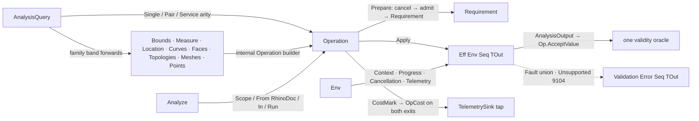

# [RASM_ANALYSIS_QUERY]

The measured-query runtime — the kernel's public analysis entry. `AnalysisQuery` `[Union]` is THE one request algebra: twenty-five cases in four bands — geometry, family, relation, spatial — with the call arity recovered from the case through the `Single`/`Pair`/`Service` virtual dispatch, never a name suffix, a verb sibling, or a mode knob. The geometry band IS the absorbed geometry-request vocabulary: `Coerce`/`CurveForm`/`Vertices`/`SamplePoints`/`SurfaceUv`/`Closest`/`SignedDistance` are first-class cases and `Kind`/`Bounds`/`SurfaceForm`/`BrepForm` are factory spellings onto their dispatch-equivalent cases — a second request ADT beside this union, re-dispatched through a mapping switch into the same operations, is the killed form; one vocabulary, one dispatch. The family band forwards to the owning family unions (`Bounds`/`Measure`/`Location`/`Curves`/`Faces`/`Topologies`/`Meshes`/`Points`) through the ONE seam law: every family union exposes `internal Operation<TGeometry, TOut> Operation<TGeometry, TOut>()`, and the `AnalysisQuery` case forwards to it — `Analysis/measure`, `Analysis/inspect`, `Analysis/select`, `Analysis/relations`, and `Parametric/locate` plug in as operation builders, never as parallel entry surfaces. The relation band routes the `Analysis/relations` pairwise lattice (`Intersections`/`Classification`/`CurveDeviation`/`SelfIntersection`/`Ray`/`Conformance`); the spatial band carries the `Spatial/neighbors` substrate (`NeighborIndex`/`NeighborQuery` box/sphere search, index overlaps, KNN/radius point-pairs) as `Service` operations over `Unit`. The union name, the factory spellings (`Measure(…)`/`Bounds(…)`/`Selection(…)`/`MeshPointSpatial(…)`/`Location(…)`/`Intersections`/`Classification`/`CurveDeviation`/`SelfIntersection`/`Ray(…)`/`Conformance(…)`/`Search(…)`/`Overlaps(…)`/`PointPairs(…)`), and the `Analyze`/`Env`/`Operation` runtime shapes are the frozen host contract — the Grasshopper output binding constructs `Analyze.Query<object, TOut>(query)` and `new Env(Context: …, Progress: …, Cancellation: …)`, the Rhino command context exposes `Analyze.In(context: …)` as a public `Analyze.Scope`, and the overlay runs `Analyze.Run<object, BoundingBox>(query: AnalysisQuery.Bounds(Bounds.AxisAligned), …)`; the host boundary re-enters against these exact spellings.

`Operation<TGeometry, TOut>` is the effect-carrying operation algebra: a private `Body` `[Union]` (`Rejected`/`PerItem`/`Aggregate`/`Service`) behind `Build`/`Reject`/`Service` constructors, a `Prepare` gate that folds cancellation, null-geometry admission, and the `Domain/validation` `Requirement` readiness matrix over every item before evaluation — geometry always earns at least the validity-oracle admission even under an empty requirement — and one `Apply(Seq<TGeometry>) → Eff<Env, Seq<TOut>>` fold that traverses per-item bodies, feeds aggregate bodies the whole prepared sequence, and runs service bodies input-free. `Env` is the reader record (`Context` + `IProgress<double>?` + `CancellationToken` + the optional `TelemetrySink` tap) with the `EnvAsks`/`Asks`/`Taps` runtime projections — the Op-threading law holds corpus-wide: `Op` travels as the explicit value key in operation state, `Eff<Env>` carries the ambient runtime, and no operation smuggles context through a second channel; `Apply` marks a `CostMark` before its body fold and charges the `OpCost` capsule on both exits through the sink, so kernel-grain cost and fault evidence flow with zero emit calls in domain code. `Analyze` is the one facade (a `static partial class` — each family page contributes its operation builders to this single owner): `Scope` binds context/progress/cancellation with `With` combinators and its own `Run`; `From(RhinoDoc)` is the ONE doc-coupled boundary adapter beside `Context.Of(RhinoDoc)`; `In(UnitSystem)`/`In(double, double, double, UnitSystem)`/`In(Context)` are the host-neutral scope builders; `Run`/`Query` close the three arities over `Validation<Error, Seq<TOut>>`. `AnalysisOutput<TOut>` projects raw evaluator values onto the typed output rail with acceptance DELEGATING to the ONE `Domain/validation` oracle — `Op.AcceptValue` — because every Analysis receipt implements the `Domain/rails` `IValidityEvidence` contract and the oracle's evidence arm admits it with zero Analysis-side switch; a second acceptance oracle that re-declares per-receipt validity arms beside the Domain owner is the killed parallel rail.

## [01]-[INDEX]

- [02]-[REQUEST_ALGEBRA]: `AnalysisQuery` `[Union]` — four bands, twenty-five cases, the `Single`/`Pair`/`Service` arity dispatch, the absorbed geometry band with its `Analyze` operation builders, the family-union seam law.
- [03]-[OPERATION_RUNTIME]: `Env` reader record; `Operation<TGeometry, TOut>` `Body` algebra with the `Prepare` gate and the `Apply` effect fold; the `Analyze` facade (`Scope`/`From`/`In`/`Run`/`Query` + the `Unsupported`/`As`/`Native` lifts); `AnalysisOutput<TOut>` one-oracle projection.

## [02]-[REQUEST_ALGEBRA]

- Owner: `AnalysisQuery` `[Union]` — the single public request vocabulary (request cases are data, not operations, so the union carries no `[GenerateUnionOps]` — the kernel union-ops generator is strictly opt-in). GEOMETRY band: `CoerceCase(Type)` gated on `Capability.Coercible` and `Output == typeof(TOut)`; `CurveFormCase` producing the `Rasm.Domain` `CurveForm` classification; `VerticesCase`/`SamplePointsCase(int)` producing `Point3d` streams; `SurfaceUvCase(Point2d)` producing the inverse-evaluated `Point2d` under `Requirement.SurfaceEvaluation`; `ClosestCase(Point3d)` producing the `Domain/evaluation` `ClosestHit` receipt; `SignedDistanceCase(Point3d, ClosestHit)` producing the normal-signed scalar. FAMILY band: `BoundsCase(Bounds)`/`MeasureCase(Measure)`/`LocationCase(Location)`/`CurvesCase(Curves)`/`FacesCase(Faces)`/`TopologyCase(Topologies)`/`MeshesCase(Meshes)`/`PointsCase(Points)` — each forwards to the family union's internal `Operation<TGeometry, TOut>()` builder. RELATION band: `IntersectionsCase`/`ClassificationCase`/`CurveDeviationCase` (pair arity), `SelfIntersectionCase`/`RayCase(RayQuery)` (single arity), `ConformanceCase(ConformanceMetric, int, Seq<double>)` (pair arity). SPATIAL band: `SearchBoxCase(NeighborIndex, BoundingBox)`/`SearchSphereCase(NeighborIndex, Sphere)`/`OverlapCase(NeighborIndex, NeighborIndex, double)`/`PointPairsCase(Seq<Point3d>, Seq<Point3d>, NeighborQuery)` — service arity over the `Spatial/neighbors` substrate.
- Cases: geometry `Coerce` · `CurveForm` · `Vertices` · `SamplePoints` · `SurfaceUv` · `Closest` · `SignedDistance` (7 declared; `Kind`/`Bounds()`/`SurfaceForm`/`BrepForm` factory-preserved); family `Bounds` · `Measure` · `Location` · `Curves` · `Faces` · `Topologies` · `Meshes` · `Points` (8); relation `Intersections` · `Classification` · `CurveDeviation` · `SelfIntersection` · `Ray` · `Conformance` (6); spatial `SearchBox` · `SearchSphere` · `Overlap` · `PointPairs` (4).
- Entry: the three `internal virtual` dispatchers — `Single<TGeometry, TOut>(Op)`, `Pair<TA, TB, TOut>(Op)`, `Service<TOut>(Op)` — each defaulting to `key.Unsupported<…>()` so a case consumed at the wrong arity rejects on the rail, never throws; a case overrides exactly the arities it owns. Consumers reach the dispatch only through `Analyze.Query`/`Analyze.Run` — the union's dispatch surface stays internal.
- Auto: `SurfaceForm`/`BrepForm` collapse onto `Coerce(typeof(Surface))`/`Coerce(typeof(Brep))` because their operations are the same coercion op gated by the same output-type test — three factory spellings, one case, one operation; `Kind` routes to `Selection(Topologies.Kind)` and parameterless `Bounds()` defaults to `Bounds(Bounds.AxisAligned)` because those requests were always the identical operations reached through a second vocabulary. The `Conformance` factory computes its percentile payload eagerly — percentiles survive only under `ConformanceMetric.Distribution`, every other metric carries the empty `Seq<double>`.
- Packages: Thinktecture.Runtime.Extensions (`[Union]`, generated `Switch`), LanguageExt.Core (`Fin`/`Option`/`Seq`/`Eff`), `Rasm.Domain` (`Op`/`Fault`/`Requirement`/`Context`/`Kind` capability web/`CurveForm`/`ClosestHit`/coercion-evaluation extension lattice), `Rasm.Spatial` (`NeighborIndex`/`NeighborQuery`/`NeighborSource`/`NeighborAnswer` — the `Spatial/neighbors` substrate), RhinoCommon (`Point3d`/`Point2d`/`BoundingBox`/`Sphere` payload values).
- Growth: a new query modality is one case on the owning band plus one factory — a family page gaining a capability adds a case to ITS union and this algebra is untouched; a new relation is one case forwarding to a `Analysis/relations` builder; a new spatial probe shape is one `NeighborQuery` case on the `Spatial/neighbors` owner. A new band is admitted only by charter amendment.
- Boundary: the request algebra is ONE union — a `GeometryRequest`-style second ADT wrapped by a `Geometry(…)` case and re-dispatched through a `request switch` mapping into the same operations is the collapsed dead form, and the twin coercion builders it forced (`GeometryCoerce` beside `Coerce`) collapse to one; factory spellings preserve every absorbed request (`Kind`, `Bounds`, `CurveForm`, `SurfaceForm`, `BrepForm`, `Vertices`, `SamplePoints`, `SurfaceUv`, `Closest`, `SignedDistance`) so no consumer capability is dropped by the unification; the output-type gates (`Output == typeof(TOut)`, `typeof(TOut) == typeof(CurveForm)`) reject at operation-build time onto the `Fault.Unsupported` rail — code 9104, the host binding's probe discriminant — never at evaluation, while spatial VALUE defects (an invalid box or sphere, a negative or non-finite tolerance) reject `InvalidInput` at build so 9104 stays a pure modality discriminant; the geometry-band operations compose the `Domain/normalization` coercion lattice and the `Domain/evaluation` closest/sampling surface as settled owner vocabulary (`CoerceTo<TOut>`/`CurveForm`/`SurfaceForm`/`CurveFormOf`/`VerticesOf`/`SamplePoints`/`SurfaceUv`/`ClosestOf`/`SignedDistanceOf`), never re-implementing a coercion or an evaluation locally; the spatial band rides ONE service spine — every builder resolves its index, forwards to the `Spatial/neighbors` owner's `NeighborIndex.Query` dispatch (`Box`/`Ball`/`Overlaps`/`Pairs` cases) with the runtime token threaded into the substrate's cancellation capsule, and projects its `NeighborAnswer` union (`Hits(Seq<NeighborHit>)` and `PairsFound(Seq<NeighborPair>)` are the two arms this band lifts, every other answer shape rejects as `InvalidResult`); pair-probe admission is the substrate's own law — volume/overlap/nested probes refuse THERE, so a new pair-admissible probe lands as one upstream case with zero edits here — and a query-side probe whitelist, RTree wrapper, or second answer vocabulary beside that substrate is the deleted parallel rail.

```csharp signature
// --- [RUNTIME_PRELUDE] ----------------------------------------------------------------------
using System;
using LanguageExt;
using LanguageExt.Common;
using Rasm.Domain;
using Rasm.Parametric;
using Rasm.Spatial;
using Rhino.Geometry;
using Thinktecture;
using static LanguageExt.Prelude;

namespace Rasm.Analysis;

// --- [TYPES] --------------------------------------------------------------------------------
[Union]
public abstract partial record AnalysisQuery {
    private AnalysisQuery() { }

    // --- [GEOMETRY_BAND]
    public sealed record CoerceCase(Type Output) : AnalysisQuery { internal override Operation<TGeometry, TOut> Single<TGeometry, TOut>(Op key) => Output == typeof(TOut) ? Analyze.GeometryCoerce<TGeometry, TOut>(key: key) : key.Unsupported<TGeometry, TOut>(); }
    public sealed record CurveFormCase : AnalysisQuery { internal override Operation<TGeometry, TOut> Single<TGeometry, TOut>(Op key) => typeof(TOut) == typeof(CurveForm) ? Analyze.GeometryCurveForm<TGeometry, TOut>(key: key) : key.Unsupported<TGeometry, TOut>(); }
    public sealed record VerticesCase : AnalysisQuery { internal override Operation<TGeometry, TOut> Single<TGeometry, TOut>(Op key) => typeof(TOut) == typeof(Point3d) ? Analyze.GeometryVertices<TGeometry, TOut>(key: key) : key.Unsupported<TGeometry, TOut>(); }
    public sealed record SamplePointsCase(int Count) : AnalysisQuery { internal override Operation<TGeometry, TOut> Single<TGeometry, TOut>(Op key) => typeof(TOut) == typeof(Point3d) ? Analyze.GeometrySamples<TGeometry, TOut>(count: Count, key: key) : key.Unsupported<TGeometry, TOut>(); }
    public sealed record SurfaceUvCase(Point2d Uv) : AnalysisQuery { internal override Operation<TGeometry, TOut> Single<TGeometry, TOut>(Op key) => typeof(TOut) == typeof(Point2d) ? Analyze.GeometrySurfaceUv<TGeometry, TOut>(uv: Uv, key: key) : key.Unsupported<TGeometry, TOut>(); }
    public sealed record ClosestCase(Point3d Target) : AnalysisQuery { internal override Operation<TGeometry, TOut> Single<TGeometry, TOut>(Op key) => typeof(TOut) == typeof(ClosestHit) ? Analyze.GeometryClosest<TGeometry, TOut>(target: Target, key: key) : key.Unsupported<TGeometry, TOut>(); }
    public sealed record SignedDistanceCase(Point3d Sample, ClosestHit Hit) : AnalysisQuery { internal override Operation<TGeometry, TOut> Single<TGeometry, TOut>(Op key) => typeof(TOut) == typeof(double) ? Analyze.GeometrySignedDistance<TGeometry, TOut>(sample: Sample, hit: Hit, key: key) : key.Unsupported<TGeometry, TOut>(); }

    // --- [FAMILY_BAND]
    public sealed record BoundsCase(Bounds Query) : AnalysisQuery { internal override Operation<TGeometry, TOut> Single<TGeometry, TOut>(Op key) => Query.Operation<TGeometry, TOut>(); }
    public sealed record MeasureCase(Measure Query) : AnalysisQuery { internal override Operation<TGeometry, TOut> Single<TGeometry, TOut>(Op key) => Query.Operation<TGeometry, TOut>(); }
    public sealed record LocationCase(Location Query) : AnalysisQuery { internal override Operation<TGeometry, TOut> Single<TGeometry, TOut>(Op key) => Query.Operation<TGeometry, TOut>(); }
    public sealed record CurvesCase(Curves Query) : AnalysisQuery { internal override Operation<TGeometry, TOut> Single<TGeometry, TOut>(Op key) => Query.Operation<TGeometry, TOut>(); }
    public sealed record FacesCase(Faces Query) : AnalysisQuery { internal override Operation<TGeometry, TOut> Single<TGeometry, TOut>(Op key) => Query.Operation<TGeometry, TOut>(); }
    public sealed record TopologyCase(Topologies Query) : AnalysisQuery { internal override Operation<TGeometry, TOut> Single<TGeometry, TOut>(Op key) => Query.Operation<TGeometry, TOut>(); }
    public sealed record MeshesCase(Meshes Query) : AnalysisQuery { internal override Operation<TGeometry, TOut> Single<TGeometry, TOut>(Op key) => Query.Operation<TGeometry, TOut>(); }
    public sealed record PointsCase(Points Query) : AnalysisQuery { internal override Operation<TGeometry, TOut> Single<TGeometry, TOut>(Op key) => Query.Operation<TGeometry, TOut>(); }

    // --- [RELATION_BAND]
    public sealed record IntersectionsCase : AnalysisQuery { internal override Operation<(TA A, TB B), TOut> Pair<TA, TB, TOut>(Op key) => Analyze.RelationIntersection<TA, TB, TOut>(key: key); }
    public sealed record ClassificationCase : AnalysisQuery { internal override Operation<(TA A, TB B), TOut> Pair<TA, TB, TOut>(Op key) => Analyze.RelationClassification<TA, TB, TOut>(key: key); }
    public sealed record CurveDeviationCase : AnalysisQuery { internal override Operation<(TA A, TB B), TOut> Pair<TA, TB, TOut>(Op key) => Analyze.RelationDeviation<TA, TB, TOut>(key: key); }
    public sealed record SelfIntersectionCase : AnalysisQuery { internal override Operation<TGeometry, TOut> Single<TGeometry, TOut>(Op key) => Analyze.RelationSelfIntersection<TGeometry, TOut>(key: key); }
    public sealed record RayCase(RayQuery Query) : AnalysisQuery { internal override Operation<TGeometry, TOut> Single<TGeometry, TOut>(Op key) => Analyze.RelationRay<TGeometry, TOut>(query: Query, key: key); }
    public sealed record ConformanceCase(ConformanceMetric Metric, int Count, Seq<double> Percentiles) : AnalysisQuery { internal override Operation<(TA A, TB B), TOut> Pair<TA, TB, TOut>(Op key) => Analyze.RelationConformance<TA, TB, TOut>(metric: Metric, count: Count, percentiles: Percentiles, key: key); }

    // --- [SPATIAL_BAND]
    public sealed record SearchBoxCase(NeighborIndex Index, BoundingBox Box) : AnalysisQuery { internal override Operation<Unit, TOut> Service<TOut>(Op key) => Analyze.SpatialSearch<TOut>(index: Index, box: Box, key: key); }
    public sealed record SearchSphereCase(NeighborIndex Index, Sphere Sphere) : AnalysisQuery { internal override Operation<Unit, TOut> Service<TOut>(Op key) => Analyze.SpatialSearch<TOut>(index: Index, sphere: Sphere, key: key); }
    public sealed record OverlapCase(NeighborIndex Left, NeighborIndex Right, double Tolerance) : AnalysisQuery { internal override Operation<Unit, TOut> Service<TOut>(Op key) => Analyze.SpatialOverlaps<TOut>(left: Left, right: Right, tolerance: Tolerance, key: key); }
    public sealed record PointPairsCase(Seq<Point3d> Points, Seq<Point3d> Needles, NeighborQuery Probe) : AnalysisQuery { internal override Operation<Unit, TOut> Service<TOut>(Op key) => Analyze.SpatialPointPairs<TOut>(points: Points, needles: Needles, probe: Probe, key: key); }

    // --- [FACTORIES]
    public static AnalysisQuery Kind => new TopologyCase(Query: Topologies.Kind);
    public static AnalysisQuery Coerce(Type output) => new CoerceCase(Output: output);
    public static AnalysisQuery CurveForm => new CurveFormCase();
    public static AnalysisQuery SurfaceForm => new CoerceCase(Output: typeof(Surface));
    public static AnalysisQuery BrepForm => new CoerceCase(Output: typeof(Brep));
    public static AnalysisQuery Vertices => new VerticesCase();
    public static AnalysisQuery SamplePoints(int count) => new SamplePointsCase(Count: count);
    public static AnalysisQuery SurfaceUv(Point2d uv) => new SurfaceUvCase(Uv: uv);
    public static AnalysisQuery Closest(Point3d target) => new ClosestCase(Target: target);
    public static AnalysisQuery SignedDistance(Point3d sample, ClosestHit hit) => new SignedDistanceCase(Sample: sample, Hit: hit);
    public static AnalysisQuery Bounds(Bounds? query = null) => new BoundsCase(Query: query ?? Analysis.Bounds.AxisAligned);
    public static AnalysisQuery Measure(Measure query) => new MeasureCase(Query: query);
    public static AnalysisQuery Location(Location query) => new LocationCase(Query: query);
    public static AnalysisQuery Selection(Curves query) => new CurvesCase(Query: query);
    public static AnalysisQuery Selection(Faces query) => new FacesCase(Query: query);
    public static AnalysisQuery Selection(Topologies query) => new TopologyCase(Query: query);
    public static AnalysisQuery MeshPointSpatial(Meshes query) => new MeshesCase(Query: query);
    public static AnalysisQuery MeshPointSpatial(Points query) => new PointsCase(Query: query);
    public static AnalysisQuery Intersections => new IntersectionsCase();
    public static AnalysisQuery Classification => new ClassificationCase();
    public static AnalysisQuery CurveDeviation => new CurveDeviationCase();
    public static AnalysisQuery SelfIntersection => new SelfIntersectionCase();
    public static AnalysisQuery Ray(RayQuery query) => new RayCase(Query: query);
    public static AnalysisQuery Conformance(ConformanceMetric metric, int count, params double[] percentiles) =>
        new ConformanceCase(Metric: metric, Count: count, Percentiles: Optional(metric).Bind(m => m.Equals(ConformanceMetric.Distribution) ? Some(toSeq(percentiles)) : Option<Seq<double>>.None).IfNone(Seq<double>()));
    public static AnalysisQuery Search(NeighborIndex index, BoundingBox box) => new SearchBoxCase(Index: index, Box: box);
    public static AnalysisQuery Search(NeighborIndex index, Sphere sphere) => new SearchSphereCase(Index: index, Sphere: sphere);
    public static AnalysisQuery Overlaps(NeighborIndex left, NeighborIndex right, double tolerance = 0.0) => new OverlapCase(Left: left, Right: right, Tolerance: tolerance);
    public static AnalysisQuery PointPairs(ReadOnlySpan<Point3d> points, ReadOnlySpan<Point3d> needles, NeighborQuery probe) => new PointPairsCase(Points: Seq(points), Needles: Seq(needles), Probe: probe);

    // --- [ARITY_DISPATCH]
    internal virtual Operation<TGeometry, TOut> Single<TGeometry, TOut>(Op key) where TGeometry : notnull where TOut : notnull => key.Unsupported<TGeometry, TOut>();
    internal virtual Operation<(TA A, TB B), TOut> Pair<TA, TB, TOut>(Op key) where TA : notnull where TB : notnull where TOut : notnull => key.Unsupported<(TA A, TB B), TOut>();
    internal virtual Operation<Unit, TOut> Service<TOut>(Op key) where TOut : notnull => key.Unsupported<Unit, TOut>();
}

// --- [OPERATIONS] ---------------------------------------------------------------------------
public static partial class Analyze {
    internal static Operation<TGeometry, TOut> GeometryCoerce<TGeometry, TOut>(Op key) where TGeometry : notnull where TOut : notnull =>
        Capability.Coercible(source: typeof(TGeometry), target: typeof(TOut))
            ? Operation<TGeometry, TOut>.Build(key: key, requirement: Requirement.Basic, requiresContext: true, state: key,
                evaluator: static (op, geometry) =>
                    from context in Env.Asks
                    from value in geometry.CoerceTo<TOut>(context: context, key: op).ToEff()
                    from output in new AnalysisOutput<TOut>(Key: op).One(value: value).ToEff()
                    select output)
            : key.Unsupported<TGeometry, TOut>();

    internal static Operation<TGeometry, TOut> GeometryCurveForm<TGeometry, TOut>(Op key) where TGeometry : notnull where TOut : notnull =>
        Operation<TGeometry, CurveForm>.Build(key: key, requirement: Requirement.Basic, requiresContext: true, state: key,
            evaluator: static (op, geometry) =>
                from context in Env.Asks
                from form in Normalization.CurveForm(source: geometry, key: op).Bind(lease => lease.Use(curve => Normalization.CurveFormOf(curve: curve, context: context))).ToEff()
                from output in new AnalysisOutput<CurveForm>(Key: op).One(value: form).ToEff()
                select output)
            .As<TGeometry, TOut>(key: key);

    internal static Operation<TGeometry, TOut> GeometryVertices<TGeometry, TOut>(Op key) where TGeometry : notnull where TOut : notnull =>
        Operation<TGeometry, Point3d>.Build(key: key, state: key,
            evaluator: static (op, geometry) =>
                from points in geometry.VerticesOf(key: op).ToEff()
                from output in new AnalysisOutput<Point3d>(Key: op).Many(values: points).ToEff()
                select output)
            .As<TGeometry, TOut>(key: key);

    internal static Operation<TGeometry, TOut> GeometrySamples<TGeometry, TOut>(int count, Op key) where TGeometry : notnull where TOut : notnull =>
        Operation<TGeometry, Point3d>.Build(key: key, requiresContext: true, state: (Key: key, Count: count),
            evaluator: static (state, geometry) =>
                from context in Env.Asks
                from points in geometry.SamplePoints(count: state.Count, context: context, key: state.Key).ToEff()
                from output in new AnalysisOutput<Point3d>(Key: state.Key).Many(values: points).ToEff()
                select output)
            .As<TGeometry, TOut>(key: key);

    internal static Operation<TGeometry, TOut> GeometrySurfaceUv<TGeometry, TOut>(Point2d uv, Op key) where TGeometry : notnull where TOut : notnull =>
        Operation<TGeometry, Point2d>.Build(key: key, requirement: Requirement.SurfaceEvaluation, requiresContext: true, state: (Key: key, Uv: uv),
            evaluator: static (state, geometry) =>
                from context in Env.Asks
                from result in Normalization.SurfaceForm(source: geometry, key: state.Key).Bind(lease => lease.Use(surface => Evaluation.SurfaceUv(surface: surface, uv: state.Uv, context: context, key: state.Key))).ToEff()
                from output in new AnalysisOutput<Point2d>(Key: state.Key).One(value: result).ToEff()
                select output)
            .As<TGeometry, TOut>(key: key);

    internal static Operation<TGeometry, TOut> GeometryClosest<TGeometry, TOut>(Point3d target, Op key) where TGeometry : notnull where TOut : notnull =>
        Operation<TGeometry, ClosestHit>.Build(key: key, requiresContext: true, state: (Key: key, Target: target),
            evaluator: static (state, geometry) =>
                from hit in geometry.ClosestOf(target: state.Target, key: state.Key).ToEff()
                from output in new AnalysisOutput<ClosestHit>(Key: state.Key).One(value: hit).ToEff()
                select output)
            .As<TGeometry, TOut>(key: key);

    internal static Operation<TGeometry, TOut> GeometrySignedDistance<TGeometry, TOut>(Point3d sample, ClosestHit hit, Op key) where TGeometry : notnull where TOut : notnull =>
        Operation<TGeometry, double>.Build(key: key, state: (Key: key, Sample: sample, Hit: hit),
            evaluator: static (state, geometry) =>
                from distance in geometry.SignedDistanceOf(hit: state.Hit, sample: state.Sample, key: state.Key).ToEff()
                from output in new AnalysisOutput<double>(Key: state.Key).One(value: distance).ToEff()
                select output)
            .As<TGeometry, TOut>(key: key);

    // --- [SPATIAL_BAND_BUILDERS]
    internal static Operation<Unit, TOut> SpatialSearch<TOut>(NeighborIndex index, BoundingBox box, Op key) where TOut : notnull =>
        (typeof(TOut) == typeof(NeighborHit), box.IsValid) switch {
            (false, _) => key.Unsupported<Unit, TOut>(),
            (_, false) => Operation<Unit, TOut>.Reject(key: key, fault: key.InvalidInput()),
            _ => SpatialService<TOut>(key: key, resolve: _ => Fin.Succ(index), query: new NeighborQuery.BoxCase(Bounds: box), anchor: box.Center),
        };
    internal static Operation<Unit, TOut> SpatialSearch<TOut>(NeighborIndex index, Sphere sphere, Op key) where TOut : notnull =>
        (typeof(TOut) == typeof(NeighborHit), sphere.IsValid) switch {
            (false, _) => key.Unsupported<Unit, TOut>(),
            (_, false) => Operation<Unit, TOut>.Reject(key: key, fault: key.InvalidInput()),
            _ => SpatialService<TOut>(key: key, resolve: _ => Fin.Succ(index), query: new NeighborQuery.BallCase(Ball: sphere), anchor: sphere.Center),
        };
    internal static Operation<Unit, TOut> SpatialOverlaps<TOut>(NeighborIndex left, NeighborIndex right, double tolerance, Op key) where TOut : notnull =>
        (typeof(TOut) == typeof(NeighborPair), double.IsFinite(tolerance) && tolerance >= 0.0) switch {
            (false, _) => key.Unsupported<Unit, TOut>(),
            (_, false) => Operation<Unit, TOut>.Reject(key: key, fault: key.InvalidInput()),
            _ => SpatialService<TOut>(key: key, resolve: _ => Fin.Succ(left), query: new NeighborQuery.OverlapsCase(Other: right, Tolerance: tolerance), anchor: Point3d.Origin),
        };
    internal static Operation<Unit, TOut> SpatialPointPairs<TOut>(Seq<Point3d> points, Seq<Point3d> needles, NeighborQuery probe, Op key) where TOut : notnull =>
        typeof(TOut) == typeof(NeighborPair)
            ? SpatialService<TOut>(key: key, resolve: op => NeighborIndex.Of(source: new NeighborSource.PointsCase(Values: points), key: op), query: new NeighborQuery.PairsCase(Needles: needles, Probe: probe), anchor: Point3d.Origin)
            : key.Unsupported<Unit, TOut>();
    private static Operation<Unit, TOut> SpatialService<TOut>(Op key, Func<Op, Fin<NeighborIndex>> resolve, NeighborQuery query, Point3d anchor) where TOut : notnull =>
        Operation<Unit, TOut>.Service(key: key, evaluate: () =>
            from runtime in Env.EnvAsks
            from index in resolve(key).ToEff()
            from answer in index.Query(query: query, anchor: anchor, key: key, cancel: runtime.Cancellation).ToEff()
            from projected in ProjectAnswer<TOut>(answer: answer, key: key).ToEff()
            select projected);
    private static Fin<Seq<TOut>> ProjectAnswer<TOut>(NeighborAnswer answer, Op key) => answer switch {
        NeighborAnswer.Hits found => new AnalysisOutput<TOut>(Key: key).Many(values: found.Values),
        NeighborAnswer.PairsFound found => new AnalysisOutput<TOut>(Key: key).Many(values: found.Values),
        _ => Fin.Fail<Seq<TOut>>(key.InvalidResult()),
    };
}
```

## [03]-[OPERATION_RUNTIME]

- Owner: `Env` `[BoundaryAdapter]` — the `Eff` reader runtime (`Context` + `IProgress<double>?` + `CancellationToken` + `TelemetrySink?`) with the three static projections `EnvAsks` (the whole runtime), `Asks` (the `Context` alone), and `Taps` (the sink as `Option<TelemetrySink>`); the record shape is host-frozen — the Grasshopper binding constructs it positionally, and the sink is the defaulted trailing parameter so every frozen construction spelling survives unchanged. `Operation<TGeometry, TOut>` — the operation algebra: private `Body` `[Union]` (`Rejected(Error)` / `PerItem(Func<TGeometry, Eff<Env, Seq<TOut>>>)` / `Aggregate(Func<Seq<TGeometry>, Eff<Env, Seq<TOut>>>)` / `Service(Func<Eff<Env, Seq<TOut>>>)`); public `Key`, internal `Requirement`/`RequiresContext`/`IsSupported`/`IsAggregate`/`NeedsContext`; one constructor per `Body` case — `Build` wires the `Prepare` gate ahead of every per-item evaluator, `Aggregate` folds the same gate across the whole input before its one sequence projection, `Reject` carries a build-time fault, `Service` runs input-free — no constructor argument another constructor silently discards; `Apply(Seq<TGeometry>)` is the ONE execution fold over the `Body` `Switch`, opening a `CostMark` before the fold and charging the `OpCost` capsule through the `Env` tap on both exits — the fail exit also publishes the fault fact, and an absent sink costs one null test. `Analyze` — the facade: `Scope` (a `Fin<Context>`-carrying record with `With(IProgress<double>)`/`With(CancellationToken)`/`With(TelemetrySink)` and its own `Run`), `From(RhinoDoc?)`, `In(UnitSystem)`/`In(double, double, double, UnitSystem)`/`In(Context)`, the three `Query` arities resolving an `AnalysisQuery?` onto typed operations, the three `Run` arities executing them, and the internal `Unsupported`/`As`/`Native` lifts every family page composes. `AnalysisOutput<TOut>` `[BoundaryAdapter]` — the typed projection gate (`One`/`Many`/`Objects`) admitting every value through `Op.AcceptValue`, the one oracle; enumerable host ingress is `Op.Accept(values:)`'s job, never a second arm here.
- Entry: `Analyze.Run<TGeometry, TOut>(AnalysisQuery, params ReadOnlySpan<TGeometry>)` / `Run<TA, TB, TOut>(AnalysisQuery, params ReadOnlySpan<(TA A, TB B)>)` / `Run<TOut>(AnalysisQuery)` → `Validation<Error, Seq<TOut>>`; scoped execution through `Analyze.In(…).With(progress).With(cancel).Run(operation, input)`; operation construction through `Analyze.Query<…>(query, key)`. One entry family, three arities discriminated by the input shape — no `RunMany`/`RunPair`/`RunService` verb siblings.
- Auto: `Prepare` folds — cancellation first (`Fault.Cancelled`), null-admission second (`Fault.MissingGeometry`), then the `Requirement` matrix; an EMPTY requirement still routes `GeometryBase` values through `Requirement.Apply`'s validity-oracle admission, so no geometry reaches an evaluator unvetted while non-geometry service payloads pass untouched. Scope-less `Run` resolves context by need: an operation with `NeedsContext` and no scope fails `Fault.MissingContext`; a context-free operation defaults to `Context.Of(units: UnitSystem.Millimeters)`. `Apply` flattens per-item chunks (`TraverseM` + `Bind`), feeds aggregates the whole prepared `Seq`, and lifts a `Rejected` body's fault onto the effect rail — rejection is data until execution.
- Receipt: none on a dedicated rail — `Validation<Error, Seq<TOut>>` IS the public result carrier; faults accumulate the `Domain/rails` `Fault` union, and `Fault.Unsupported` (code 9104) is the probe discriminant the host binding branches on.
- Packages: LanguageExt.Core (`Eff` reader via `Eff.runtime<Env>()`, `Validation`/`Fin` rails, `TraverseM` applicative traversal), Thinktecture.Runtime.Extensions (`Body` `[Union]` + generated `Switch`), `Rasm.Domain` (`Context.Of` builders, `Requirement.Apply`, the `Op`/`Fault` rail), RhinoCommon (`RhinoDoc` at the ONE `From` adapter, `UnitSystem`).
- Growth: a new execution modality is one `Body` case plus one constructor on the SAME owner (a streaming body, a batched-chunk body) — never a second operation class; a new scope source is one `In`/`From` overload minting a `Context`; a new runtime capability (a deadline) is one field on `Env` threaded by the reader with zero operation edits — the telemetry sink landed exactly this way, one defaulted trailing field plus one `Taps` projection.
- Boundary: `Analyze.From(RhinoDoc)` is the ONE document-coupled adapter in the folder — every other scope builder is unit- or context-driven, and a second `RhinoDoc` reach anywhere in the analysis surface is the seam violation; acceptance delegates to `Op.AcceptValue` — the `Domain/validation` oracle extended by `IValidityEvidence` registration — and a folder-local `ValidityOf` switch re-declaring receipt arms is the killed parallel oracle; `Operation.Build`'s evaluator receives state BY VALUE (`static` lambdas, no closure capture) so operations stay allocation-lean and referentially transparent; the `As` object-lift is the sanctioned type-erasure bridge for object-typed host pipelines — it rejects onto `Fault.Unsupported`, never casts unsafely; `ValidationLifts.ToEff` is the one `Validation → Eff` rail bridge; exceptions never cross — host machinery that throws is wrapped at the owning boundary through `Op.Catch`.

```csharp signature
// --- [RUNTIME_PRELUDE] ----------------------------------------------------------------------
using System;
using System.Runtime.InteropServices;
using System.Threading;
using Rasm.Csp;
using LanguageExt;
using LanguageExt.Common;
using Rasm.Domain;
using Rhino;
using Rhino.Geometry;
using Thinktecture;
using static LanguageExt.Prelude;

namespace Rasm.Analysis;

// --- [MODELS] -------------------------------------------------------------------------------
[BoundaryAdapter]
public sealed record Env(Context Context, IProgress<double>? Progress, CancellationToken Cancellation, TelemetrySink? Telemetry = null) {
    public static readonly Eff<Env, Env> EnvAsks = Eff.runtime<Env>().As();
    public static readonly Eff<Env, Context> Asks = Eff.runtime<Env>().Map(static env => env.Context).As();
    public static readonly Eff<Env, Option<TelemetrySink>> Taps = Eff.runtime<Env>().Map(static env => Optional(env.Telemetry)).As();
}

[BoundaryAdapter, StructLayout(LayoutKind.Auto)]
internal readonly record struct AnalysisOutput<TOut>(Op Key) {
    public Fin<Seq<TOut>> One<TValue>(TValue value) => Many(values: Seq(value));
    public Fin<Seq<TOut>> Many<TValue>(Seq<TValue> values) => Project(key: Key, values: values);
    public Fin<Seq<TOut>> Objects(Seq<object> values, Type sourceType) {
        Op key = Key;
        return typeof(TOut) == sourceType
            ? values.TraverseM(value => key.AcceptValue(value: (TOut)value)).As()
            : Fin.Fail<Seq<TOut>>(key.Unsupported(geometryType: sourceType, outputType: typeof(TOut)));
    }
    private static Fin<Seq<TOut>> Project<TValue>(Op key, Seq<TValue> values) =>
        typeof(TOut) == typeof(TValue)
            ? values.TraverseM(value => key.AcceptValue(value: value)).As().Map(static admitted => admitted.Map(static value => (TOut)(object)value!))
            : Fin.Fail<Seq<TOut>>(key.Unsupported(geometryType: typeof(TValue), outputType: typeof(TOut)));
}

// --- [SERVICES] -----------------------------------------------------------------------------
public sealed partial record Operation<TGeometry, TOut> where TGeometry : notnull {
    [Union]
    private abstract partial record Body {
        private Body() { }
        internal sealed record Rejected(Error Fault) : Body;
        internal sealed record PerItem(Func<TGeometry, Eff<Env, Seq<TOut>>> Evaluate) : Body;
        internal sealed record Aggregate(Func<Seq<TGeometry>, Eff<Env, Seq<TOut>>> Evaluate) : Body;
        internal sealed record Service(Func<Eff<Env, Seq<TOut>>> Evaluate) : Body;
    }
    private Operation(Op key, Requirement requirement, bool requiresContext, Body body) {
        Key = key;
        Requirement = requirement;
        RequiresContext = requiresContext;
        Execution = body;
    }
    public Op Key { get; }
    internal Requirement Requirement { get; init; }
    internal bool RequiresContext { get; init; }
    private Body Execution { get; init; }
    internal bool IsSupported => Execution is not Body.Rejected;
    internal bool IsAggregate => Execution is Body.Aggregate;
    internal bool NeedsContext => RequiresContext || !Requirement.IsEmpty;
    private static Error Charge(Env runtime, Op key, CostMark mark, int items, Error error) =>
        (Charge(runtime: runtime, key: key, mark: mark, items: items, succeeded: false), runtime.Telemetry is { } sink ? ignore(sink.Tap(fact: SignalFact.Fault(domain: KernelDomain.Analysis, key: key, fault: error))) : unit, error).Item3;
    private static Unit Charge(Env runtime, Op key, CostMark mark, int items, bool succeeded) =>
        runtime.Telemetry is { } sink
            ? ignore(sink.Tap(fact: SignalFact.Cost(cost: mark.Stop(key: key, domain: KernelDomain.Analysis, items: items, succeeded: succeeded))))
            : unit;
    internal static Operation<TGeometry, TOut> Build<TState>(Op key, TState state, Func<TState, TGeometry, Eff<Env, Seq<TOut>>> evaluator, Requirement? requirement = null, bool requiresContext = false) {
        Requirement active = requirement ?? Requirement.None;
        return new Operation<TGeometry, TOut>(key: key, requirement: active, requiresContext: requiresContext,
            body: new Body.PerItem(Evaluate: geometry =>
                from prepared in Prepare(geometry: geometry, requirement: active)
                from value in evaluator(arg1: state, arg2: prepared)
                select value));
    }
    internal static Operation<TGeometry, TOut> Aggregate(Op key, Func<Seq<TGeometry>, Eff<Env, Seq<TOut>>> project, Requirement? requirement = null, bool requiresContext = false) {
        Requirement active = requirement ?? Requirement.None;
        return new Operation<TGeometry, TOut>(key: key, requirement: active, requiresContext: requiresContext,
            body: new Body.Aggregate(Evaluate: geometry =>
                from resolved in geometry.TraverseM(item => Prepare(geometry: item, requirement: active)).As()
                from result in project(arg: resolved)
                select result));
    }
    internal static Operation<TGeometry, TOut> Reject(Op key, Error fault) =>
        new(key: key, requirement: Requirement.None, requiresContext: false, body: new Body.Rejected(Fault: fault));
    internal static Operation<TGeometry, TOut> Service(Op key, Func<Eff<Env, Seq<TOut>>> evaluate, bool requiresContext = false) =>
        new(key: key, requirement: Requirement.None, requiresContext: requiresContext, body: new Body.Service(Evaluate: evaluate));
    // Cost capsule: the mark opens before the body fold (Prepare runs inside the window), both exits
    // charge through the Env tap, and the fail exit also publishes the fault fact — sink absent, zero cost.
    public Eff<Env, Seq<TOut>> Apply(Seq<TGeometry> geometry) =>
        from runtime in Env.EnvAsks
        from mark in Fin.Succ(CostMark.Start()).ToEff()
        from result in Folded(geometry: geometry)
            .MapFail(error => Charge(runtime: runtime, key: Key, mark: mark, items: geometry.Count, error: error))
        from _ in Fin.Succ(Charge(runtime: runtime, key: Key, mark: mark, items: geometry.Count, succeeded: true)).ToEff()
        select result;
    private Eff<Env, Seq<TOut>> Folded(Seq<TGeometry> geometry) =>
        Execution.Switch(
            state: geometry,
            rejected: static (_, r) => Fin.Fail<Seq<TOut>>(r.Fault).ToEff(),
            perItem: static (items, i) => items.TraverseM(i.Evaluate).As().Map(static chunks => chunks.Bind(static chunk => chunk)),
            aggregate: static (items, a) => a.Evaluate(arg: items),
            service: static (_, s) => s.Evaluate());
    internal Fin<Operation<TGeometry, TOut>> Supported() =>
        Execution switch {
            Body.Rejected rejected => Fin.Fail<Operation<TGeometry, TOut>>(rejected.Fault),
            _ => Fin.Succ(this),
        };
    private static Eff<Env, TGeometry> Prepare(TGeometry geometry, Requirement requirement) =>
        from runtime in Env.EnvAsks
        from ready in (runtime.Cancellation.IsCancellationRequested switch {
            true => Fin.Fail<TGeometry>(new Fault.Cancelled()),
            false => Optional(geometry).ToFin(new Fault.MissingGeometry()),
        }).ToEff()
        from validated in (requirement.IsEmpty, ready) switch {
            (true, GeometryBase native) => from _ in requirement.Apply(context: runtime.Context, value: native, cancel: runtime.Cancellation).ToEff()
                                           select ready,
            (true, _) => Fin.Succ(ready).ToEff(),
            _ => from _ in requirement.Apply(context: runtime.Context, value: ready, cancel: runtime.Cancellation).ToEff()
                 select ready,
        }
        select validated;
}

// --- [OPERATIONS] ---------------------------------------------------------------------------
public static partial class Analyze {
    public sealed record Scope {
        public Fin<Context> Context { get; }
        public IProgress<double>? Progress { get; init; }
        public CancellationToken Cancellation { get; init; }
        public TelemetrySink? Telemetry { get; init; }
        internal Scope(Fin<Context> context) => Context = context;
        public Scope With(IProgress<double> progress) => this with { Progress = progress };
        public Scope With(CancellationToken cancellation) => this with { Cancellation = cancellation };
        public Scope With(TelemetrySink telemetry) => this with { Telemetry = telemetry };
        public Validation<Error, Seq<TOut>> Run<TGeometry, TOut>(Operation<TGeometry, TOut>? operation, params ReadOnlySpan<TGeometry> input) where TGeometry : notnull =>
            Analyze.Run(operation: operation, scope: Some(this), input: input);
    }
    public static Scope From(RhinoDoc? doc) => new(context: Context.Of(doc: doc).ToFin());
    public static Scope In(UnitSystem units) => new(context: Context.Of(units: units).ToFin());
    public static Scope In(double absolute, double relative, double angle, UnitSystem units) =>
        new(context: Context.Of(absolute: absolute, relative: relative, angle: angle, units: units).ToFin());
    public static Scope In(Context context) => new(context: Optional(context).ToFin(Op.Of(name: nameof(Scope)).MissingContext()));

    public static Operation<TGeometry, TOut> Query<TGeometry, TOut>(AnalysisQuery? query, Op? key = null) where TGeometry : notnull where TOut : notnull {
        Op active = key.OrDefault();
        return Optional(query).Map(q => q.Single<TGeometry, TOut>(key: active)).IfNone(Operation<TGeometry, TOut>.Reject(key: active, fault: active.InvalidInput()));
    }
    public static Operation<(TA A, TB B), TOut> Query<TA, TB, TOut>(AnalysisQuery? query, Op? key = null) where TA : notnull where TB : notnull where TOut : notnull {
        Op active = key.OrDefault();
        return Optional(query).Map(q => q.Pair<TA, TB, TOut>(key: active)).IfNone(Operation<(TA A, TB B), TOut>.Reject(key: active, fault: active.InvalidInput()));
    }
    public static Operation<Unit, TOut> Query<TOut>(AnalysisQuery? query, Op? key = null) where TOut : notnull {
        Op active = key.OrDefault();
        return Optional(query).Map(q => q.Service<TOut>(key: active)).IfNone(Operation<Unit, TOut>.Reject(key: active, fault: active.InvalidInput()));
    }

    public static Validation<Error, Seq<TOut>> Run<TGeometry, TOut>(AnalysisQuery query, params ReadOnlySpan<TGeometry> input) where TGeometry : notnull where TOut : notnull =>
        Run(operation: Query<TGeometry, TOut>(query: query), input: input);
    public static Validation<Error, Seq<TOut>> Run<TA, TB, TOut>(AnalysisQuery query, params ReadOnlySpan<(TA A, TB B)> input) where TA : notnull where TB : notnull where TOut : notnull =>
        Run(operation: Query<TA, TB, TOut>(query: query), input: input);
    public static Validation<Error, Seq<TOut>> Run<TOut>(AnalysisQuery query) where TOut : notnull =>
        Run(operation: Query<TOut>(query: query), input: Unit.Default);
    public static Validation<Error, Seq<TOut>> Run<TGeometry, TOut>(Operation<TGeometry, TOut>? operation, params ReadOnlySpan<TGeometry> input) where TGeometry : notnull =>
        Run(operation: operation, scope: Option<Scope>.None, input: input);

    internal static Operation<TGeometry, TOut> Unsupported<TGeometry, TOut>(this Op key) where TGeometry : notnull =>
        Operation<TGeometry, TOut>.Reject(key: key, fault: key.Unsupported(geometryType: typeof(TGeometry), outputType: typeof(TOut)));
    internal static Operation<TGeometry, TOut> As<TGeometry, TOut>(this object operation, Op key) where TGeometry : notnull => operation switch {
        Operation<TGeometry, TOut> typed => typed,
        _ => Operation<TGeometry, TOut>.Reject(key: key, fault: key.Unsupported(geometryType: typeof(TGeometry), outputType: typeof(TOut))),
    };
    internal static Operation<TGeometry, TOut> Native<TGeometry, TOut, TNative, TValue, TState>(Op key, TState state, Func<TState, TNative, Eff<Env, Seq<TValue>>> project, Requirement? requirement = null, bool requiresContext = false) where TGeometry : notnull where TNative : notnull =>
        Operation<TGeometry, TValue>.Build(
            key: key, requirement: requirement, requiresContext: requiresContext, state: (Key: key, State: state, Project: project),
            evaluator: static (state, geometry) => geometry switch {
                TNative native => state.Project(arg1: state.State, arg2: native),
                _ => Fin.Fail<Seq<TValue>>(state.Key.Unsupported(geometryType: geometry.GetType(), outputType: typeof(TValue))).ToEff(),
            }).As<TGeometry, TOut>(key: key);

    private static Validation<Error, Seq<TOut>> Run<TGeometry, TOut>(Operation<TGeometry, TOut>? operation, Option<Scope> scope, ReadOnlySpan<TGeometry> input) where TGeometry : notnull {
        TGeometry[] inputValues = input.ToArray();
        (IProgress<double>? progress, CancellationToken cancellation, TelemetrySink? telemetry) = scope.Case switch {
            Scope active => (active.Progress, active.Cancellation, active.Telemetry),
            _ => (null, CancellationToken.None, null),
        };
        return (
            from active in Optional(operation).ToFin(new Fault.MissingOperation())
            from accepted in active.Supported()
            from context in scope.Case switch {
                Scope provided => provided.Context,
                _ => accepted.NeedsContext switch {
                    true => Fin.Fail<Context>(accepted.Key.MissingContext()),
                    false => Context.Of(units: UnitSystem.Millimeters).ToFin(),
                },
            }
            from result in accepted.Apply(geometry: inputValues.AsIterable().ToSeq()).Run(env: new Env(Context: context, Progress: progress, Cancellation: cancellation, Telemetry: telemetry))
            select result).ToValidation();
    }
}

internal static class ValidationLifts {
    internal static Eff<Env, T> ToEff<T>(this Validation<Error, T> validation) => validation.ToFin();
}
```



## [04]-[DENSITY_BAR]

One owner per axis; capability is a case, a factory row, or a body arm, never a sibling surface. Each owner returns on the `[RAIL]` its row names; the facade closes 3 `Query` and 4 `Run` arities and the output gate projects `One`/`Many`/`Objects`, with the `[02]`/`[03]` sections spelling each band, body case, and member in full.

| [INDEX] | [CONCERN]           | [OWNER]                      | [KIND]                                | [RAIL]                         | [CASES] |
| :-----: | :------------------ | :--------------------------- | :------------------------------------ | :----------------------------- | :-----: |
|  [01]   | Request vocabulary  | `AnalysisQuery`              | `[Union]` — 4 bands, arity-dispatched | dispatch; build-time `Reject`  |   25    |
|  [02]   | Operation algebra   | `Operation<TGeometry, TOut>` | `Body` `[Union]` + `Prepare` gate     | `Apply → Eff<Env, Seq<TOut>>`  |    4    |
|  [03]   | Runtime environment | `Env`                        | reader + `EnvAsks`/`Asks`/`Taps`      | `Eff<Env, _>` carriage         |    —    |
|  [04]   | Execution facade    | `Analyze`                    | `static partial class`                | `Validation<Error, Seq<TOut>>` |    —    |
|  [05]   | Output projection   | `AnalysisOutput<TOut>`       | `readonly record struct`              | `Fin<Seq<TOut>>`, one oracle   |    3    |

Both fences are transcription-complete: the request union with all four bands and every factory spelling, the geometry-band operation builders composing the `Domain/normalization` + `Domain/evaluation` owner lattice, the spatial-band service builders lifting the `Spatial/neighbors` `NeighborIndex.Query` substrate onto the operation rail, the full `Body`/`Prepare`/`Apply` algebra, the `Analyze` facade with the one `RhinoDoc` adapter, and the one-oracle `AnalysisOutput`. The family and relation builders the union forwards to are owned by `Analysis/measure`, `Analysis/inspect`, `Analysis/select`, `Analysis/relations`, and `Parametric/locate` — composed here by name, legislated there.

## [05]-[RESEARCH]

- [REQUEST_UNIFICATION] — one request algebra serves the whole analysis surface: the geometry band's absorbed cases dispatch to the SAME operations a second vocabulary reaches only through a mapping switch, so the unification is behavior-preserving by construction — `Coerce` subsumes the surface-form and brep-form requests (one coercion op gated by the output type), `Kind` and `Bounds` route to the family cases whose operations were always the dispatch targets, and the remaining seven land as first-class cases. The law-matrix asserts factory/dispatch equivalence: every absorbed spelling produces an operation whose `Key`, `Requirement`, and output-type gate match its band case exactly; the arity defaults reject — a pair-band case consumed through `Single` and a single-band case consumed through `Pair` both route `Fault.Unsupported`, never a miscast. Verification rides the bridge scenario rail — the union dispatch and the build-time gates are host-independent and exercise without a live document.
- [OPERATION_MONAD] — `Operation` is a reader-effect algebra whose totality claims are structural: `Prepare` runs before EVERY evaluation (per-item bodies gate each item, aggregate bodies gate the whole sequence through the same fold), cancellation is checked before admission so a cancelled run never touches geometry, and the empty-requirement path still routes `GeometryBase` through the validity oracle — the invariant is that no evaluator ever receives an invalid or null geometry, and the law-matrix asserts it by driving hostile inputs (null items, pre-cancelled tokens, invalid geometry) through every body kind and requiring the matching `Fault` case on the rail with zero evaluator invocations. `Apply` over `PerItem` distributes over sequence concatenation (`Apply(a ++ b) == Apply(a) ++ Apply(b)` under a pure evaluator) — the property that makes per-item and batched execution observationally equal; `Aggregate` deliberately breaks it and `IsAggregate` names the break.
- [ONE_ORACLE] — acceptance has exactly one authority: `AnalysisOutput` routes every projected value through `Op.AcceptValue`, whose evidence arm reads `IValidityEvidence.IsValid` — the receipts this folder mints (`RayQuery`, `CurveDeviation`, `IntersectionHit`, `ResidualSample`, mesh receipts) all declare evidence through that contract, so admitting a NEW receipt is one interface implementation, zero oracle edits. A folder-local acceptance switch that re-enumerates receipt types is the killed form because it forks the authority: two oracles drift, and the drift is invisible until a receipt admitted by one is rejected by the other. The law-matrix asserts oracle agreement — for every receipt, `AcceptValue` succeeds exactly when the receipt's own evidence holds — and rejection shape: a failed acceptance routes `Fault.InvalidResult` carrying the operation key, never a null or a silent drop.
- [HOST_CONTRACT_FREEZE] — the runtime's public spellings are load-bearing beyond this assembly: `Analyze.Query<object, TOut>(query)` + `Operation.Apply(…).Run(env: new Env(…))` is the Grasshopper output-binding execution path, `Analyze.In(context: …)` → `Analyze.Scope` is the Rhino command-context surface, and `Analyze.Run<object, BoundingBox>(query: AnalysisQuery.Bounds(Bounds.AxisAligned), …)` is the overlay probe — the fence spellings above are the re-entry contract for the host boundary, and any rename there is a breaking edit against dormant consumers. The scenario rail exercises the exact frozen call shapes against a live document through `From(RhinoDoc)` under the bridge evidence discipline.
