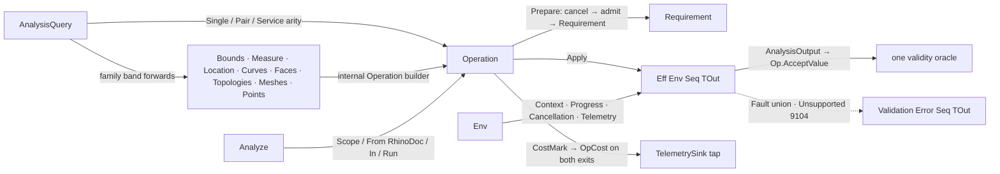

# [RASM_ANALYSIS_QUERY]

`AnalysisQuery` `[Union]` is the kernel's one public request algebra and `Analyze` its execution facade — the measured-query runtime every host consumer enters. Call arity is recovered from the case through the `Single`/`Pair`/`Service` virtual dispatch, never a name suffix, a verb sibling, or a mode knob, and the geometry band absorbs the geometry-request vocabulary as first-class cases with the factory spellings preserved: a second request ADT re-dispatched through a mapping switch into the same operations is the killed form. `Analyze.From(RhinoDoc)` is the surface's one doc-coupled adapter.

Every family union exposes `internal Operation<TGeometry, TOut> Operation<TGeometry, TOut>()`, so `Analysis/measure`, `Analysis/inspect`, `Analysis/select`, `Analysis/relations`, and `Parametric/locate` plug in as operation builders, never parallel entry surfaces. `Operation<TGeometry, TOut>` carries the effect algebra over `Eff<Env, _>`, threading `Op` as the value key while `Env` holds the ambient runtime from `Domain/rails`; acceptance delegates to the one `Domain/validation` oracle `Op.AcceptValue`, and the host re-enters against frozen spellings a rename breaks.

## [01]-[INDEX]

- [02]-[REQUEST_ALGEBRA]: `AnalysisQuery` `[Union]`, the arity-dispatched request cases, and the family-union seam.
- [03]-[OPERATION_RUNTIME]: the `Operation<TGeometry, TOut>` effect algebra, the `Env` runtime, and the `Analyze` facade over `Validation`.

## [02]-[REQUEST_ALGEBRA]

- Owner: `AnalysisQuery` `[Union]` mints the one public request vocabulary across four bands — geometry, family, relation, spatial. Request cases are data, not operations, so the union carries no `[GenerateUnionOps]`.
- Cases: geometry `Coerce` `CurveForm` `Vertices` `SamplePoints` `SurfaceUv` `Closest` `SignedDistance`; family `Bounds` `Measure` `Location` `Curves` `Faces` `Topologies` `Meshes` `Points`; relation `Intersections` `Classification` `CurveDeviation` `SelfIntersection` `Ray` `Conformance`; spatial `SearchBox` `SearchSphere` `Overlap` `PointPairs`.
- Entry: the three `internal virtual` dispatchers `Single`/`Pair`/`Service` each default to `key.Unsupported<…>()`, so a case consumed at the wrong arity rejects on the rail rather than throwing and a case overrides only the arities it owns; consumers reach dispatch through `Analyze.Query`/`Analyze.Run` alone, the union's dispatch surface staying internal.
- Auto: `SurfaceForm` and `BrepForm` collapse onto `Coerce` and `Kind` onto `Selection(Topologies.Kind)` because those requests are the identical operation reached through a second spelling; parameterless `Bounds()` defaults to `Bounds.AxisAligned`, and the `Conformance` factory computes percentiles only under `ConformanceMetric.Distribution`, every other metric carrying the empty `Seq<double>`.
- Packages: Thinktecture.Runtime.Extensions (`[Union]` and generated `Switch`), LanguageExt.Core (`Fin`/`Option`/`Seq`/`Eff`), `Rasm.Domain` (the `Op`/`Fault`/`Requirement`/`Context` rail and the coercion-evaluation lattice), `Rasm.Spatial` (the `Spatial/neighbors` substrate), RhinoCommon (`Point3d`/`Point2d`/`BoundingBox`/`Sphere` payload values).
- Growth: a new query modality is one case with one factory on the owning band; a family page gaining a capability adds a case to ITS union with this algebra untouched, a new relation forwards to an `Analysis/relations` builder, a new spatial probe is one `NeighborQuery` case on the `Spatial/neighbors` owner, and a new band is admitted only by charter amendment.
- Boundary: output-type gates (`Output == typeof(TOut)`) reject at operation-build time onto `Fault.Unsupported` — code 9104, the host binding's probe discriminant — while spatial value defects reject `InvalidInput` at build, so 9104 stays a pure modality discriminant; the geometry band composes the `Domain/normalization` coercion lattice and the `Domain/evaluation` closest/sampling surface rather than re-implementing either locally; the spatial band rides one service spine forwarding to the `Spatial/neighbors` owner's `NeighborIndex.Query` and projecting its `NeighborAnswer` arms `Hits` and `PairsFound`, every other answer rejecting `InvalidResult` — pair-probe admission is the substrate's own law, so a query-side probe whitelist, RTree wrapper, or second answer vocabulary is the deleted parallel rail.

```csharp conceptual
// --- [RUNTIME_PRELUDE] ----------------------------------------------------------------------
using System;
using LanguageExt;
using LanguageExt.Common;
using Rasm.Domain;
using Rasm.Parametric;
using Rasm.Spatial;
using Rhino.Geometry;
using Thinktecture;
using static LanguageExt.Prelude;

namespace Rasm.Analysis;

// --- [TYPES] --------------------------------------------------------------------------------
[Union]
public abstract partial record AnalysisQuery {
    private AnalysisQuery() { }

    // --- [GEOMETRY_BAND]
    public sealed record CoerceCase(Type Output) : AnalysisQuery { internal override Operation<TGeometry, TOut> Single<TGeometry, TOut>(Op key) => Output == typeof(TOut) ? Analyze.GeometryCoerce<TGeometry, TOut>(key: key) : key.Unsupported<TGeometry, TOut>(); }
    public sealed record CurveFormCase : AnalysisQuery { internal override Operation<TGeometry, TOut> Single<TGeometry, TOut>(Op key) => typeof(TOut) == typeof(CurveForm) ? Analyze.GeometryCurveForm<TGeometry, TOut>(key: key) : key.Unsupported<TGeometry, TOut>(); }
    public sealed record VerticesCase : AnalysisQuery { internal override Operation<TGeometry, TOut> Single<TGeometry, TOut>(Op key) => typeof(TOut) == typeof(Point3d) ? Analyze.GeometryVertices<TGeometry, TOut>(key: key) : key.Unsupported<TGeometry, TOut>(); }
    public sealed record SamplePointsCase(int Count) : AnalysisQuery { internal override Operation<TGeometry, TOut> Single<TGeometry, TOut>(Op key) => typeof(TOut) == typeof(Point3d) ? Analyze.GeometrySamples<TGeometry, TOut>(count: Count, key: key) : key.Unsupported<TGeometry, TOut>(); }
    public sealed record SurfaceUvCase(Point2d Uv) : AnalysisQuery { internal override Operation<TGeometry, TOut> Single<TGeometry, TOut>(Op key) => typeof(TOut) == typeof(Point2d) ? Analyze.GeometrySurfaceUv<TGeometry, TOut>(uv: Uv, key: key) : key.Unsupported<TGeometry, TOut>(); }
    public sealed record ClosestCase(Point3d Target) : AnalysisQuery { internal override Operation<TGeometry, TOut> Single<TGeometry, TOut>(Op key) => typeof(TOut) == typeof(ClosestHit) ? Analyze.GeometryClosest<TGeometry, TOut>(target: Target, key: key) : key.Unsupported<TGeometry, TOut>(); }
    public sealed record SignedDistanceCase(Point3d Sample, ClosestHit Hit) : AnalysisQuery { internal override Operation<TGeometry, TOut> Single<TGeometry, TOut>(Op key) => typeof(TOut) == typeof(double) ? Analyze.GeometrySignedDistance<TGeometry, TOut>(sample: Sample, hit: Hit, key: key) : key.Unsupported<TGeometry, TOut>(); }

    // --- [FAMILY_BAND]
    public sealed record BoundsCase(Bounds Query) : AnalysisQuery { internal override Operation<TGeometry, TOut> Single<TGeometry, TOut>(Op key) => Query.Operation<TGeometry, TOut>(); }
    public sealed record MeasureCase(Measure Query) : AnalysisQuery { internal override Operation<TGeometry, TOut> Single<TGeometry, TOut>(Op key) => Query.Operation<TGeometry, TOut>(); }
    public sealed record LocationCase(Location Query) : AnalysisQuery { internal override Operation<TGeometry, TOut> Single<TGeometry, TOut>(Op key) => Query.Operation<TGeometry, TOut>(); }
    public sealed record CurvesCase(Curves Query) : AnalysisQuery { internal override Operation<TGeometry, TOut> Single<TGeometry, TOut>(Op key) => Query.Operation<TGeometry, TOut>(); }
    public sealed record FacesCase(Faces Query) : AnalysisQuery { internal override Operation<TGeometry, TOut> Single<TGeometry, TOut>(Op key) => Query.Operation<TGeometry, TOut>(); }
    public sealed record TopologyCase(Topologies Query) : AnalysisQuery { internal override Operation<TGeometry, TOut> Single<TGeometry, TOut>(Op key) => Query.Operation<TGeometry, TOut>(); }
    public sealed record MeshesCase(Meshes Query) : AnalysisQuery { internal override Operation<TGeometry, TOut> Single<TGeometry, TOut>(Op key) => Query.Operation<TGeometry, TOut>(); }
    public sealed record PointsCase(Points Query) : AnalysisQuery { internal override Operation<TGeometry, TOut> Single<TGeometry, TOut>(Op key) => Query.Operation<TGeometry, TOut>(); }

    // --- [RELATION_BAND]
    public sealed record IntersectionsCase : AnalysisQuery { internal override Operation<(TA A, TB B), TOut> Pair<TA, TB, TOut>(Op key) => Analyze.RelationIntersection<TA, TB, TOut>(key: key); }
    public sealed record ClassificationCase : AnalysisQuery { internal override Operation<(TA A, TB B), TOut> Pair<TA, TB, TOut>(Op key) => Analyze.RelationClassification<TA, TB, TOut>(key: key); }
    public sealed record CurveDeviationCase : AnalysisQuery { internal override Operation<(TA A, TB B), TOut> Pair<TA, TB, TOut>(Op key) => Analyze.RelationDeviation<TA, TB, TOut>(key: key); }
    public sealed record SelfIntersectionCase : AnalysisQuery { internal override Operation<TGeometry, TOut> Single<TGeometry, TOut>(Op key) => Analyze.RelationSelfIntersection<TGeometry, TOut>(key: key); }
    public sealed record RayCase(RayQuery Query) : AnalysisQuery { internal override Operation<TGeometry, TOut> Single<TGeometry, TOut>(Op key) => Analyze.RelationRay<TGeometry, TOut>(query: Query, key: key); }
    public sealed record ConformanceCase(ConformanceMetric Metric, int Count, Seq<double> Percentiles) : AnalysisQuery { internal override Operation<(TA A, TB B), TOut> Pair<TA, TB, TOut>(Op key) => Analyze.RelationConformance<TA, TB, TOut>(metric: Metric, count: Count, percentiles: Percentiles, key: key); }

    // --- [SPATIAL_BAND]
    public sealed record SearchBoxCase(NeighborIndex Index, BoundingBox Box) : AnalysisQuery { internal override Operation<Unit, TOut> Service<TOut>(Op key) => Analyze.SpatialSearch<TOut>(index: Index, box: Box, key: key); }
    public sealed record SearchSphereCase(NeighborIndex Index, Sphere Sphere) : AnalysisQuery { internal override Operation<Unit, TOut> Service<TOut>(Op key) => Analyze.SpatialSearch<TOut>(index: Index, sphere: Sphere, key: key); }
    public sealed record OverlapCase(NeighborIndex Left, NeighborIndex Right, double Tolerance) : AnalysisQuery { internal override Operation<Unit, TOut> Service<TOut>(Op key) => Analyze.SpatialOverlaps<TOut>(left: Left, right: Right, tolerance: Tolerance, key: key); }
    public sealed record PointPairsCase(Seq<Point3d> Points, Seq<Point3d> Needles, NeighborQuery Probe) : AnalysisQuery { internal override Operation<Unit, TOut> Service<TOut>(Op key) => Analyze.SpatialPointPairs<TOut>(points: Points, needles: Needles, probe: Probe, key: key); }

    // --- [FACTORIES]
    public static AnalysisQuery Kind => new TopologyCase(Query: Topologies.Kind);
    public static AnalysisQuery Coerce(Type output) => new CoerceCase(Output: output);
    public static AnalysisQuery CurveForm => new CurveFormCase();
    public static AnalysisQuery SurfaceForm => new CoerceCase(Output: typeof(Surface));
    public static AnalysisQuery BrepForm => new CoerceCase(Output: typeof(Brep));
    public static AnalysisQuery Vertices => new VerticesCase();
    public static AnalysisQuery SamplePoints(int count) => new SamplePointsCase(Count: count);
    public static AnalysisQuery SurfaceUv(Point2d uv) => new SurfaceUvCase(Uv: uv);
    public static AnalysisQuery Closest(Point3d target) => new ClosestCase(Target: target);
    public static AnalysisQuery SignedDistance(Point3d sample, ClosestHit hit) => new SignedDistanceCase(Sample: sample, Hit: hit);
    public static AnalysisQuery Bounds(Bounds? query = null) => new BoundsCase(Query: query ?? Analysis.Bounds.AxisAligned);
    public static AnalysisQuery Measure(Measure query) => new MeasureCase(Query: query);
    public static AnalysisQuery Location(Location query) => new LocationCase(Query: query);
    public static AnalysisQuery Selection(Curves query) => new CurvesCase(Query: query);
    public static AnalysisQuery Selection(Faces query) => new FacesCase(Query: query);
    public static AnalysisQuery Selection(Topologies query) => new TopologyCase(Query: query);
    public static AnalysisQuery MeshPointSpatial(Meshes query) => new MeshesCase(Query: query);
    public static AnalysisQuery MeshPointSpatial(Points query) => new PointsCase(Query: query);
    public static AnalysisQuery Intersections => new IntersectionsCase();
    public static AnalysisQuery Classification => new ClassificationCase();
    public static AnalysisQuery CurveDeviation => new CurveDeviationCase();
    public static AnalysisQuery SelfIntersection => new SelfIntersectionCase();
    public static AnalysisQuery Ray(RayQuery query) => new RayCase(Query: query);
    public static AnalysisQuery Conformance(ConformanceMetric metric, int count, params double[] percentiles) =>
        new ConformanceCase(Metric: metric, Count: count, Percentiles: Optional(metric).Bind(m => m.Equals(ConformanceMetric.Distribution) ? Some(toSeq(percentiles)) : Option<Seq<double>>.None).IfNone(Seq<double>()));
    public static AnalysisQuery Search(NeighborIndex index, BoundingBox box) => new SearchBoxCase(Index: index, Box: box);
    public static AnalysisQuery Search(NeighborIndex index, Sphere sphere) => new SearchSphereCase(Index: index, Sphere: sphere);
    public static AnalysisQuery Overlaps(NeighborIndex left, NeighborIndex right, double tolerance = 0.0) => new OverlapCase(Left: left, Right: right, Tolerance: tolerance);
    public static AnalysisQuery PointPairs(ReadOnlySpan<Point3d> points, ReadOnlySpan<Point3d> needles, NeighborQuery probe) => new PointPairsCase(Points: Seq(points), Needles: Seq(needles), Probe: probe);

    // --- [ARITY_DISPATCH]
    internal virtual Operation<TGeometry, TOut> Single<TGeometry, TOut>(Op key) where TGeometry : notnull where TOut : notnull => key.Unsupported<TGeometry, TOut>();
    internal virtual Operation<(TA A, TB B), TOut> Pair<TA, TB, TOut>(Op key) where TA : notnull where TB : notnull where TOut : notnull => key.Unsupported<(TA A, TB B), TOut>();
    internal virtual Operation<Unit, TOut> Service<TOut>(Op key) where TOut : notnull => key.Unsupported<Unit, TOut>();
}

// --- [OPERATIONS] ---------------------------------------------------------------------------
public static partial class Analyze {
    internal static Operation<TGeometry, TOut> GeometryCoerce<TGeometry, TOut>(Op key) where TGeometry : notnull where TOut : notnull =>
        Capability.Coercible(source: typeof(TGeometry), target: typeof(TOut))
            ? Operation<TGeometry, TOut>.Build(key: key, requirement: Requirement.Basic, requiresContext: true, state: key,
                evaluator: static (op, geometry) =>
                    from context in Env.Asks
                    from value in geometry.CoerceTo<TOut>(context: context, key: op).ToEff()
                    from output in new AnalysisOutput<TOut>(Key: op).One(value: value).ToEff()
                    select output)
            : key.Unsupported<TGeometry, TOut>();

    internal static Operation<TGeometry, TOut> GeometryCurveForm<TGeometry, TOut>(Op key) where TGeometry : notnull where TOut : notnull =>
        Operation<TGeometry, CurveForm>.Build(key: key, requirement: Requirement.Basic, requiresContext: true, state: key,
            evaluator: static (op, geometry) =>
                from context in Env.Asks
                from form in Normalization.CurveForm(source: geometry, key: op).Bind(lease => lease.Use(curve => Normalization.CurveFormOf(curve: curve, context: context))).ToEff()
                from output in new AnalysisOutput<CurveForm>(Key: op).One(value: form).ToEff()
                select output)
            .As<TGeometry, TOut>(key: key);

    internal static Operation<TGeometry, TOut> GeometryVertices<TGeometry, TOut>(Op key) where TGeometry : notnull where TOut : notnull =>
        Operation<TGeometry, Point3d>.Build(key: key, state: key,
            evaluator: static (op, geometry) =>
                from points in geometry.VerticesOf(key: op).ToEff()
                from output in new AnalysisOutput<Point3d>(Key: op).Many(values: points).ToEff()
                select output)
            .As<TGeometry, TOut>(key: key);

    internal static Operation<TGeometry, TOut> GeometrySamples<TGeometry, TOut>(int count, Op key) where TGeometry : notnull where TOut : notnull =>
        Operation<TGeometry, Point3d>.Build(key: key, requiresContext: true, state: (Key: key, Count: count),
            evaluator: static (state, geometry) =>
                from context in Env.Asks
                from points in geometry.SamplePoints(count: state.Count, context: context, key: state.Key).ToEff()
                from output in new AnalysisOutput<Point3d>(Key: state.Key).Many(values: points).ToEff()
                select output)
            .As<TGeometry, TOut>(key: key);

    internal static Operation<TGeometry, TOut> GeometrySurfaceUv<TGeometry, TOut>(Point2d uv, Op key) where TGeometry : notnull where TOut : notnull =>
        Operation<TGeometry, Point2d>.Build(key: key, requirement: Requirement.SurfaceEvaluation, requiresContext: true, state: (Key: key, Uv: uv),
            evaluator: static (state, geometry) =>
                from context in Env.Asks
                from result in Normalization.SurfaceForm(source: geometry, key: state.Key).Bind(lease => lease.Use(surface => Evaluation.SurfaceUv(surface: surface, uv: state.Uv, context: context, key: state.Key))).ToEff()
                from output in new AnalysisOutput<Point2d>(Key: state.Key).One(value: result).ToEff()
                select output)
            .As<TGeometry, TOut>(key: key);

    internal static Operation<TGeometry, TOut> GeometryClosest<TGeometry, TOut>(Point3d target, Op key) where TGeometry : notnull where TOut : notnull =>
        Operation<TGeometry, ClosestHit>.Build(key: key, state: (Key: key, Target: target),
            evaluator: static (state, geometry) =>
                from hit in geometry.ClosestOf(target: state.Target, key: state.Key).ToEff()
                from output in new AnalysisOutput<ClosestHit>(Key: state.Key).One(value: hit).ToEff()
                select output)
            .As<TGeometry, TOut>(key: key);

    internal static Operation<TGeometry, TOut> GeometrySignedDistance<TGeometry, TOut>(Point3d sample, ClosestHit hit, Op key) where TGeometry : notnull where TOut : notnull =>
        Operation<TGeometry, double>.Build(key: key, state: (Key: key, Sample: sample, Hit: hit),
            evaluator: static (state, geometry) =>
                from distance in geometry.SignedDistanceOf(hit: state.Hit, sample: state.Sample, key: state.Key).ToEff()
                from output in new AnalysisOutput<double>(Key: state.Key).One(value: distance).ToEff()
                select output)
            .As<TGeometry, TOut>(key: key);

    // --- [SPATIAL_BAND_BUILDERS]
    internal static Operation<Unit, TOut> SpatialSearch<TOut>(NeighborIndex index, BoundingBox box, Op key) where TOut : notnull =>
        (typeof(TOut) == typeof(NeighborHit), box.IsValid) switch {
            (false, _) => key.Unsupported<Unit, TOut>(),
            (_, false) => Operation<Unit, TOut>.Reject(key: key, fault: key.InvalidInput()),
            _ => SpatialService<TOut>(key: key, resolve: _ => Fin.Succ(index), query: new NeighborQuery.BoxCase(Bounds: box), anchor: box.Center),
        };
    internal static Operation<Unit, TOut> SpatialSearch<TOut>(NeighborIndex index, Sphere sphere, Op key) where TOut : notnull =>
        (typeof(TOut) == typeof(NeighborHit), sphere.IsValid) switch {
            (false, _) => key.Unsupported<Unit, TOut>(),
            (_, false) => Operation<Unit, TOut>.Reject(key: key, fault: key.InvalidInput()),
            _ => SpatialService<TOut>(key: key, resolve: _ => Fin.Succ(index), query: new NeighborQuery.BallCase(Ball: sphere), anchor: sphere.Center),
        };
    internal static Operation<Unit, TOut> SpatialOverlaps<TOut>(NeighborIndex left, NeighborIndex right, double tolerance, Op key) where TOut : notnull =>
        (typeof(TOut) == typeof(NeighborPair), double.IsFinite(tolerance) && tolerance >= 0.0) switch {
            (false, _) => key.Unsupported<Unit, TOut>(),
            (_, false) => Operation<Unit, TOut>.Reject(key: key, fault: key.InvalidInput()),
            _ => SpatialService<TOut>(key: key, resolve: _ => Fin.Succ(left), query: new NeighborQuery.OverlapsCase(Other: right, Tolerance: tolerance), anchor: Point3d.Origin),
        };
    internal static Operation<Unit, TOut> SpatialPointPairs<TOut>(Seq<Point3d> points, Seq<Point3d> needles, NeighborQuery probe, Op key) where TOut : notnull =>
        typeof(TOut) == typeof(NeighborPair)
            ? SpatialService<TOut>(key: key, resolve: op => NeighborIndex.Of(source: new NeighborSource.PointsCase(Values: points), key: op), query: new NeighborQuery.PairsCase(Needles: needles, Probe: probe), anchor: Point3d.Origin)
            : key.Unsupported<Unit, TOut>();
    private static Operation<Unit, TOut> SpatialService<TOut>(Op key, Func<Op, Fin<NeighborIndex>> resolve, NeighborQuery query, Point3d anchor) where TOut : notnull =>
        Operation<Unit, TOut>.Service(key: key, state: (Key: key, Resolve: resolve, Query: query, Anchor: anchor), evaluate: static state =>
            from runtime in Env.EnvAsks
            from index in state.Resolve(state.Key).ToEff()
            from answer in index.Query(query: state.Query, anchor: state.Anchor, key: state.Key, cancel: runtime.Cancellation).ToEff()
            from projected in ProjectAnswer<TOut>(answer: answer, key: state.Key).ToEff()
            select projected);
    private static Fin<Seq<TOut>> ProjectAnswer<TOut>(NeighborAnswer answer, Op key) => answer switch {
        NeighborAnswer.Hits found => new AnalysisOutput<TOut>(Key: key).Many(values: found.Values),
        NeighborAnswer.PairsFound found => new AnalysisOutput<TOut>(Key: key).Many(values: found.Values),
        _ => Fin.Fail<Seq<TOut>>(key.InvalidResult()),
    };
}
```

## [03]-[OPERATION_RUNTIME]

- Owner: `Env` `[BoundaryAdapter]` is the `Eff` reader runtime, its record shape host-frozen — the Grasshopper binding constructs it positionally and the telemetry sink is the defaulted trailing field, so every frozen construction spelling survives a new runtime field. `Operation<TGeometry, TOut>` is the operation algebra behind a private `Body` `[Union]` (`Rejected`/`PerItem`/`Aggregate`/`Service`) with one constructor per case, a `Prepare` gate ahead of every evaluator, and one `Apply` fold over the `Body` `Switch` opening a `CostMark` before the fold and charging the `OpCost` capsule through the `Env` tap on both exits, the fail exit also publishing the fault. `Analyze` is the one facade — `Scope` binding context, progress, cancellation, and sink; `From(RhinoDoc)` the one doc adapter; host-neutral `In` scope builders; `Query` closing three arities and static `Run` four overloads over `Validation<Error, Seq<TOut>>`. `AnalysisOutput<TOut>` `[BoundaryAdapter]` is the typed projection gate admitting every value through `Op.AcceptValue`, the one oracle.
- Entry: `Analyze.Run<…>` closes single-query, pair-query, service-query, and already-built-operation inputs onto `Validation<Error, Seq<TOut>>` — one entry family discriminated by query and input shape, no `RunMany`/`RunPair`/`RunService` verb siblings; scoped execution threads `Analyze.In(…).With(progress).With(cancel).Run(operation, input)`.
- Auto: `Prepare` folds cancellation first (`Fault.Cancelled`), null admission second (`Fault.MissingGeometry`), then the `Requirement` matrix — an empty requirement still routes `GeometryBase` values through the validity-oracle admission so no geometry reaches an evaluator unvetted, while non-geometry service payloads pass untouched; scope-less `Run` fails `Fault.MissingContext` when an operation `NeedsContext` and otherwise defaults to `Context.Of(units: UnitSystem.Millimeters)`; `Apply` flattens per-item chunks, feeds aggregates the whole prepared `Seq`, and lifts a `Rejected` body's fault onto the effect rail, rejection staying data until execution.
- Receipt: `Validation<Error, Seq<TOut>>` is the public result carrier with no dedicated receipt rail; faults accumulate the `Domain/rails` `Fault` union, `Fault.Unsupported` the host probe discriminant.
- Packages: LanguageExt.Core (the `Validation`/`Fin` rails and `TraverseM`), Thinktecture.Runtime.Extensions (the `Body` `[Union]` and generated `Switch`), `Rasm.Domain` (`Context.Of` builders, `Requirement.Apply`, the `Op`/`Fault` rail), RhinoCommon (`RhinoDoc` at the one `From` adapter, `UnitSystem`).
- Growth: a new execution modality is one `Body` case with one constructor on the same owner, never a second operation class; a new scope source is one `In`/`From` overload minting a `Context`; a new runtime capability is one field on `Env` threaded by the reader with zero operation edits.
- Boundary: `Analyze.From(RhinoDoc)` is the one document-coupled adapter in the folder, so a second `RhinoDoc` reach anywhere in the analysis surface is the seam violation; a folder-local `ValidityOf` switch re-declaring receipt arms beside `Op.AcceptValue` is the killed parallel oracle; `Build` and `Service` evaluators receive state by value through `static` lambdas over an explicit state record, keeping operations allocation-lean and referentially transparent; the `As` object-lift is the sanctioned type-erasure bridge, rejecting onto `Fault.Unsupported` rather than casting unsafely; `ValidationLifts.ToEff` is the one `Validation → Eff` rail bridge, and host machinery that throws is wrapped at its owning boundary through `Op.Catch`.

```csharp conceptual
// --- [RUNTIME_PRELUDE] ----------------------------------------------------------------------
using System;
using System.Runtime.InteropServices;
using System.Threading;
using Rasm.Csp;
using LanguageExt;
using LanguageExt.Common;
using Rasm.Domain;
using Rhino;
using Rhino.Geometry;
using Thinktecture;
using static LanguageExt.Prelude;

namespace Rasm.Analysis;

// --- [MODELS] -------------------------------------------------------------------------------
[BoundaryAdapter]
public sealed record Env(Context Context, IProgress<double>? Progress, CancellationToken Cancellation, TelemetrySink? Telemetry = null) {
    public static readonly Eff<Env, Env> EnvAsks = Eff.runtime<Env>().As();
    public static readonly Eff<Env, Context> Asks = Eff.runtime<Env>().Map(static env => env.Context).As();
    public static readonly Eff<Env, Option<TelemetrySink>> Taps = Eff.runtime<Env>().Map(static env => Optional(env.Telemetry)).As();
}

[BoundaryAdapter, StructLayout(LayoutKind.Auto)]
internal readonly record struct AnalysisOutput<TOut>(Op Key) {
    public Fin<Seq<TOut>> One<TValue>(TValue value) => Many(values: Seq(value));
    public Fin<Seq<TOut>> Many<TValue>(Seq<TValue> values) => Project(key: Key, values: values);
    public Fin<Seq<TOut>> Objects(Seq<object> values, Type sourceType) {
        Op key = Key;
        return typeof(TOut) == sourceType
            ? values.TraverseM(value => key.AcceptValue(value: (TOut)value)).As()
            : Fin.Fail<Seq<TOut>>(key.Unsupported(geometryType: sourceType, outputType: typeof(TOut)));
    }
    private static Fin<Seq<TOut>> Project<TValue>(Op key, Seq<TValue> values) =>
        typeof(TOut) == typeof(TValue)
            ? values.TraverseM(value => key.AcceptValue(value: value)).As().Map(static admitted => admitted.Map(static value => (TOut)(object)value!))
            : Fin.Fail<Seq<TOut>>(key.Unsupported(geometryType: typeof(TValue), outputType: typeof(TOut)));
}

// --- [SERVICES] -----------------------------------------------------------------------------
public sealed partial record Operation<TGeometry, TOut> where TGeometry : notnull {
    [Union]
    private abstract partial record Body {
        private Body() { }
        internal sealed record Rejected(Error Fault) : Body;
        internal sealed record PerItem(Func<TGeometry, Eff<Env, Seq<TOut>>> Evaluate) : Body;
        internal sealed record Aggregate(Func<Seq<TGeometry>, Eff<Env, Seq<TOut>>> Evaluate) : Body;
        internal sealed record Service(Func<Eff<Env, Seq<TOut>>> Evaluate) : Body;
    }
    private Operation(Op key, Requirement requirement, bool requiresContext, Body body) {
        Key = key;
        Requirement = requirement;
        RequiresContext = requiresContext;
        Execution = body;
    }
    public Op Key { get; }
    internal Requirement Requirement { get; init; }
    internal bool RequiresContext { get; init; }
    private Body Execution { get; init; }
    internal bool IsSupported => Execution is not Body.Rejected;
    internal bool IsAggregate => Execution is Body.Aggregate;
    internal bool NeedsContext => RequiresContext || !Requirement.IsEmpty;
    private static Error Charge(Env runtime, Op key, CostMark mark, int items, Error error) =>
        (Charge(runtime: runtime, key: key, mark: mark, items: items, succeeded: false), runtime.Telemetry is { } sink ? ignore(sink.Tap(fact: SignalFact.Fault(domain: KernelDomain.Analysis, key: key, fault: error))) : unit, error).Item3;
    private static Unit Charge(Env runtime, Op key, CostMark mark, int items, bool succeeded) =>
        runtime.Telemetry is { } sink
            ? ignore(sink.Tap(fact: SignalFact.Cost(cost: mark.Stop(key: key, domain: KernelDomain.Analysis, items: items, succeeded: succeeded))))
            : unit;
    internal static Operation<TGeometry, TOut> Build<TState>(Op key, TState state, Func<TState, TGeometry, Eff<Env, Seq<TOut>>> evaluator, Requirement? requirement = null, bool requiresContext = false) {
        Requirement active = requirement ?? Requirement.None;
        return new Operation<TGeometry, TOut>(key: key, requirement: active, requiresContext: requiresContext,
            body: new Body.PerItem(Evaluate: geometry =>
                from prepared in Prepare(geometry: geometry, requirement: active)
                from value in evaluator(arg1: state, arg2: prepared)
                select value));
    }
    internal static Operation<TGeometry, TOut> Aggregate(Op key, Func<Seq<TGeometry>, Eff<Env, Seq<TOut>>> project, Requirement? requirement = null, bool requiresContext = false) {
        Requirement active = requirement ?? Requirement.None;
        return new Operation<TGeometry, TOut>(key: key, requirement: active, requiresContext: requiresContext,
            body: new Body.Aggregate(Evaluate: geometry =>
                from resolved in geometry.TraverseM(item => Prepare(geometry: item, requirement: active)).As()
                from result in project(arg: resolved)
                select result));
    }
    internal static Operation<TGeometry, TOut> Reject(Op key, Error fault) =>
        new(key: key, requirement: Requirement.None, requiresContext: false, body: new Body.Rejected(Fault: fault));
    internal static Operation<TGeometry, TOut> Service<TState>(Op key, TState state, Func<TState, Eff<Env, Seq<TOut>>> evaluate, bool requiresContext = false) =>
        new(key: key, requirement: Requirement.None, requiresContext: requiresContext, body: new Body.Service(Evaluate: () => evaluate(arg: state)));
    // Cost capsule: CostMark spans Prepare and the fold; both exits charge through the Env tap, the fail exit publishing the fault; absent sink, zero cost.
    public Eff<Env, Seq<TOut>> Apply(Seq<TGeometry> geometry) =>
        from runtime in Env.EnvAsks
        from mark in Fin.Succ(CostMark.Start()).ToEff()
        from result in Folded(geometry: geometry)
            .MapFail(error => Charge(runtime: runtime, key: Key, mark: mark, items: geometry.Count, error: error))
        from _ in Fin.Succ(Charge(runtime: runtime, key: Key, mark: mark, items: geometry.Count, succeeded: true)).ToEff()
        select result;
    private Eff<Env, Seq<TOut>> Folded(Seq<TGeometry> geometry) =>
        Execution.Switch(
            state: geometry,
            rejected: static (_, r) => Fin.Fail<Seq<TOut>>(r.Fault).ToEff(),
            perItem: static (items, i) => items.TraverseM(i.Evaluate).As().Map(static chunks => chunks.Bind(static chunk => chunk)),
            aggregate: static (items, a) => a.Evaluate(arg: items),
            service: static (_, s) => s.Evaluate());
    internal Fin<Operation<TGeometry, TOut>> Supported() =>
        Execution switch {
            Body.Rejected rejected => Fin.Fail<Operation<TGeometry, TOut>>(rejected.Fault),
            _ => Fin.Succ(this),
        };
    private static Eff<Env, TGeometry> Prepare(TGeometry geometry, Requirement requirement) =>
        from runtime in Env.EnvAsks
        from ready in (runtime.Cancellation.IsCancellationRequested switch {
            true => Fin.Fail<TGeometry>(new Fault.Cancelled()),
            false => Optional(geometry).ToFin(new Fault.MissingGeometry()),
        }).ToEff()
        from validated in (requirement.IsEmpty, ready) switch {
            (true, GeometryBase native) => from _ in requirement.Apply(context: runtime.Context, value: native, cancel: runtime.Cancellation).ToEff()
                                           select ready,
            (true, _) => Fin.Succ(ready).ToEff(),
            _ => from _ in requirement.Apply(context: runtime.Context, value: ready, cancel: runtime.Cancellation).ToEff()
                 select ready,
        }
        select validated;
}

// --- [OPERATIONS] ---------------------------------------------------------------------------
public static partial class Analyze {
    public sealed record Scope {
        public Fin<Context> Context { get; }
        public IProgress<double>? Progress { get; init; }
        public CancellationToken Cancellation { get; init; }
        public TelemetrySink? Telemetry { get; init; }
        internal Scope(Fin<Context> context) => Context = context;
        public Scope With(IProgress<double> progress) => this with { Progress = progress };
        public Scope With(CancellationToken cancellation) => this with { Cancellation = cancellation };
        public Scope With(TelemetrySink telemetry) => this with { Telemetry = telemetry };
        public Validation<Error, Seq<TOut>> Run<TGeometry, TOut>(Operation<TGeometry, TOut>? operation, params ReadOnlySpan<TGeometry> input) where TGeometry : notnull =>
            Analyze.Run(operation: operation, scope: Some(this), input: input);
    }
    public static Scope From(RhinoDoc? doc) => new(context: Context.Of(doc: doc).ToFin());
    public static Scope In(UnitSystem units) => new(context: Context.Of(units: units).ToFin());
    public static Scope In(double absolute, double relative, double angle, UnitSystem units) =>
        new(context: Context.Of(absolute: absolute, relative: relative, angle: angle, units: units).ToFin());
    public static Scope In(Context context) => new(context: Optional(context).ToFin(Op.Of(name: nameof(Scope)).MissingContext()));

    public static Operation<TGeometry, TOut> Query<TGeometry, TOut>(AnalysisQuery? query, Op? key = null) where TGeometry : notnull where TOut : notnull {
        Op active = key.OrDefault();
        return Optional(query).Map(q => q.Single<TGeometry, TOut>(key: active)).IfNone(Operation<TGeometry, TOut>.Reject(key: active, fault: active.InvalidInput()));
    }
    public static Operation<(TA A, TB B), TOut> Query<TA, TB, TOut>(AnalysisQuery? query, Op? key = null) where TA : notnull where TB : notnull where TOut : notnull {
        Op active = key.OrDefault();
        return Optional(query).Map(q => q.Pair<TA, TB, TOut>(key: active)).IfNone(Operation<(TA A, TB B), TOut>.Reject(key: active, fault: active.InvalidInput()));
    }
    public static Operation<Unit, TOut> Query<TOut>(AnalysisQuery? query, Op? key = null) where TOut : notnull {
        Op active = key.OrDefault();
        return Optional(query).Map(q => q.Service<TOut>(key: active)).IfNone(Operation<Unit, TOut>.Reject(key: active, fault: active.InvalidInput()));
    }

    public static Validation<Error, Seq<TOut>> Run<TGeometry, TOut>(AnalysisQuery query, params ReadOnlySpan<TGeometry> input) where TGeometry : notnull where TOut : notnull =>
        Run(operation: Query<TGeometry, TOut>(query: query), input: input);
    public static Validation<Error, Seq<TOut>> Run<TA, TB, TOut>(AnalysisQuery query, params ReadOnlySpan<(TA A, TB B)> input) where TA : notnull where TB : notnull where TOut : notnull =>
        Run(operation: Query<TA, TB, TOut>(query: query), input: input);
    public static Validation<Error, Seq<TOut>> Run<TOut>(AnalysisQuery query) where TOut : notnull =>
        Run(operation: Query<TOut>(query: query), input: Unit.Default);
    public static Validation<Error, Seq<TOut>> Run<TGeometry, TOut>(Operation<TGeometry, TOut>? operation, params ReadOnlySpan<TGeometry> input) where TGeometry : notnull =>
        Run(operation: operation, scope: Option<Scope>.None, input: input);

    internal static Operation<TGeometry, TOut> Unsupported<TGeometry, TOut>(this Op key) where TGeometry : notnull =>
        Operation<TGeometry, TOut>.Reject(key: key, fault: key.Unsupported(geometryType: typeof(TGeometry), outputType: typeof(TOut)));
    internal static Operation<TGeometry, TOut> As<TGeometry, TOut>(this object operation, Op key) where TGeometry : notnull => operation switch {
        Operation<TGeometry, TOut> typed => typed,
        _ => Operation<TGeometry, TOut>.Reject(key: key, fault: key.Unsupported(geometryType: typeof(TGeometry), outputType: typeof(TOut))),
    };
    internal static Operation<TGeometry, TOut> Native<TGeometry, TOut, TNative, TValue, TState>(Op key, TState state, Func<TState, TNative, Eff<Env, Seq<TValue>>> project, Requirement? requirement = null, bool requiresContext = false) where TGeometry : notnull where TNative : notnull =>
        Operation<TGeometry, TValue>.Build(
            key: key, requirement: requirement, requiresContext: requiresContext, state: (Key: key, State: state, Project: project),
            evaluator: static (state, geometry) => geometry switch {
                TNative native => state.Project(arg1: state.State, arg2: native),
                _ => Fin.Fail<Seq<TValue>>(state.Key.Unsupported(geometryType: geometry.GetType(), outputType: typeof(TValue))).ToEff(),
            }).As<TGeometry, TOut>(key: key);

    private static Validation<Error, Seq<TOut>> Run<TGeometry, TOut>(Operation<TGeometry, TOut>? operation, Option<Scope> scope, ReadOnlySpan<TGeometry> input) where TGeometry : notnull {
        TGeometry[] inputValues = input.ToArray();
        (IProgress<double>? progress, CancellationToken cancellation, TelemetrySink? telemetry) = scope.Case switch {
            Scope active => (active.Progress, active.Cancellation, active.Telemetry),
            _ => (null, CancellationToken.None, null),
        };
        return (
            from active in Optional(operation).ToFin(new Fault.MissingOperation())
            from accepted in active.Supported()
            from context in scope.Case switch {
                Scope provided => provided.Context,
                _ => accepted.NeedsContext switch {
                    true => Fin.Fail<Context>(accepted.Key.MissingContext()),
                    false => Context.Of(units: UnitSystem.Millimeters).ToFin(),
                },
            }
            from result in accepted.Apply(geometry: inputValues.AsIterable().ToSeq()).Run(env: new Env(Context: context, Progress: progress, Cancellation: cancellation, Telemetry: telemetry))
            select result).ToValidation();
    }
}

internal static class ValidationLifts {
    internal static Eff<Env, T> ToEff<T>(this Validation<Error, T> validation) => validation.ToFin();
}
```



## [04]-[DENSITY_BAR]

Each concern homes at one owner returning on the rail its row names.

| [INDEX] | [CONCERN]           | [OWNER]                      | [KIND]                     | [RAIL]                         |
| :-----: | :------------------ | :--------------------------- | :------------------------- | :----------------------------- |
|  [01]   | Request vocabulary  | `AnalysisQuery`              | arity-dispatched `[Union]` | `Operation` dispatch           |
|  [02]   | Operation algebra   | `Operation<TGeometry, TOut>` | `Body` union + `Prepare`   | `Eff<Env, _>`                  |
|  [03]   | Runtime environment | `Env`                        | `[BoundaryAdapter]` reader | `Eff<Env, _>`                  |
|  [04]   | Execution facade    | `Analyze`                    | `static partial class`     | `Validation<Error, Seq<TOut>>` |
|  [05]   | Output projection   | `AnalysisOutput<TOut>`       | `readonly record struct`   | `Fin<Seq<TOut>>`, one oracle   |

## [05]-[RESEARCH]

<!-- source-only: research row template:
[TOKEN]-[OPEN|BLOCKED]: <exact question>; <verification route>.
[SPLIT_MEMBER]-[OPEN]: does `shape-core` expose `split_all`; verify against the member rail.
-->

- [EFF_RUNTIME_CATALOG]-[BLOCKED]: does the languageext `.api` tier catalog `public static Eff<RT, RT> runtime<RT>()`; verify against `libs/csharp/.api/api-languageext.md`.
- [REQUEST_UNIFICATION]-[OPEN]: does each absorbed factory produce the same `Key`, `Requirement`, output gate, and operation as its band case with wrong-arity `Single`/`Pair` calls routing `Fault.Unsupported`; verify through the bridge scenario rail.
- [OPERATION_MONAD]-[OPEN]: does `Operation` admit every input through `Prepare` before evaluation and preserve per-item distribution (`Apply(a ++ b) == Apply(a) ++ Apply(b)` for a pure `PerItem`); verify through the bridge scenario rail.
- [ONE_ORACLE]-[OPEN]: does `Op.AcceptValue` succeed exactly when a receipt's `IValidityEvidence.IsValid` holds and reject through `Fault.InvalidResult` otherwise; verify against the `Domain/validation` oracle.
- [HOST_CONTRACT_FREEZE]-[OPEN]: do the frozen spellings `Analyze.Query<object, TOut>`, `Analyze.In(context:)` to `Analyze.Scope`, and `Analyze.Run<object, BoundingBox>` still serve the Grasshopper binding, Rhino command context, and overlay probe; verify through a live-document bridge scenario.
