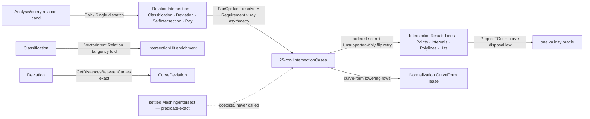

# [RASM_ANALYSIS_RELATIONS]

The pairwise-relation owner — the RhinoCommon-native intersection, classification, deviation, and self-intersection surface of the measured-query runtime. The heart is ONE data-driven lattice: twenty-five `IntersectionCase` table rows, each binding a type-pair admission predicate, a result SHAPE (`Lines`/`Points`/`Intervals`/`Polylines`/`Hits` — the five-case internal `IntersectionResult` union), and a compute delegate over the host `Rhino.Geometry.Intersect.Intersection` surface — line/line through brep/brep, mesh/plane and mesh/mesh under the model's mesh-intersection tolerance, trim-aware ray casting against surfaces and breps, plus two curve-form LOWERING rows that admit analytic curve-likes (`Line`/`Circle`/`Arc`/`Ellipse`/`Polyline`) on either operand through the `Domain/normalization` lease recovery. Dispatch is table scan, symmetry is ONE retry law (`unordered` re-probes the flipped pair only when the ordered scan answers `Fault.Unsupported`), and a new pair is a ROW — never a method family, never an `IntersectXxYy` sibling. This is the Rhino-parametric ALTITUDE by standing decision: the settled `Meshing/intersect` page owns the predicate-exact robust counterpart and explicitly never owns this host-native surface; the two coexist under the Tier-0 capture law, and consumers select by altitude.

The evidence tier registers with the one oracle: `IntersectionHit` `[Union]` (name frozen — a cs-analyzer docID) carries point hits with `IntersectionTangency` enrichment, curve hits with their `IntersectionKind`, and overlap hits with both parameter intervals and the optional trimmed sub-curve — every projection (`Curve`/`Point3d`/`Interval`/`IntersectionKind`/`IntersectionTangency`/self) routes through the typed projection gate with the DISPOSAL law folded in: curve payloads are host resources, so any projection that does not transfer them disposes them, on success and failure alike. `RayQuery` (name frozen — a cs-analyzer docID) is the admitted ray request (`Ray3d` + reflection count under the named `ReflectionCeiling`); `CurveDeviation` is the exact min/max deviation receipt (`Curve.GetDistancesBetweenCurves`) whose `WithinTolerance` is derived from the threaded model tolerance at construction. All three declare validity through the `Domain/rails` `IValidityEvidence` claim fold — the `Domain/validation` oracle admits them through the one interface arm, and an `AnalysisAcceptance`-style folder-local fork is the killed parallel oracle. Classification is tangency ENRICHMENT: curve-pair intersections re-evaluate each unknown-tangency point hit through the `Processing/intent` `VectorIntent.Relation` rail (`Parallel`/`AntiParallel` → `Tangent`, else `Transversal`), so classification is the intersection lattice plus one enrichment fold, never a second intersector. The `AnalysisQuery.Intersections`/`Classification`/`CurveDeviation`/`SelfIntersection`/`Ray(…)` routes are frozen host contract — the Grasshopper component surface binds them by name, and the 9104 `Fault.Unsupported` code is the probe discriminant its drain branches on.

## [01]-[INDEX]

- [02]-[RELATION_EVIDENCE]: `IntersectionKind` (4) + `IntersectionTangency` (3) vocabulary; `RayQuery` the admitted ray request; `CurveDeviation` the exact deviation receipt; `IntersectionHit` `[Union]` (3 cases) with the typed projection gate and the curve-disposal law.
- [03]-[INTERSECTION_TABLE]: the internal `IntersectionResult` five-shape union; the `IntersectionCase` row model; the twenty-five-row lattice over `Intersection.*`; the ordered scan, the unordered retry law, and the event/solved-array hit builders.
- [04]-[RELATION_OPERATIONS]: the five relation builders (`RelationIntersection`/`RelationClassification`/`RelationDeviation`/`RelationSelfIntersection`/`RelationRay`) over ONE `PairOp` admission spine; the deviation and self-intersection kernels.

## [02]-[RELATION_EVIDENCE]

- Owner: `IntersectionKind` `[SmartEnum<int>]` — `Unknown`/`Point`/`Overlap`/`Curve`, the result-geometry discriminant every shape projection can answer; `IntersectionTangency` `[SmartEnum<int>]` — `Unknown`/`Transversal`/`Tangent`, the curve-pair contact classification; `RayQuery` `readonly record struct` — `Ray3d` + `MaxReflections` with the `Of` factory and the named `ReflectionCeiling` bound (a reflection count is policy under a ceiling, never an unbounded knob); `CurveDeviation` `readonly record struct` — the eight-field exact receipt (min/max distance, the four witness points, the tolerance, and the derived verdict); `IntersectionHit` `[Union]` — `PointCase(Point3d, IntersectionTangency)` / `CurveCase(Curve, IntersectionKind)` / `OverlapCase(Point3d Start, Point3d End, Interval OverlapA, Interval OverlapB, Option<Curve>)` with the `At`/`Along`/`Overlap` factories, the `Kind`/`Curves`/`Points`/`Intervals` facet projections, the frozen projectable set + `Project<TOut>` batch gate, and the internal `Dispose` releasing every carried curve.
- Cases: `IntersectionHit` `Point` · `Curve` · `Overlap` (3); `IntersectionKind` 4; `IntersectionTangency` 3; `Project<TOut>` outputs `IntersectionHit` · `Curve` · `Point3d` · `Interval` · `IntersectionKind` · `IntersectionTangency` (6).
- Entry: `IntersectionHit.Project<TOut>(Seq<IntersectionHit>, Op)` — the ONE batch projection: validity-gates the whole batch through each hit's evidence, projects the requested facet, and applies the disposal law (curve payloads transfer ONLY under the `Curve` output; every other output — and every failure — disposes them); `RayQuery.Of(ray, maxReflections)`; the receipts construct only through the lattice and the deviation kernel.
- Auto: hit evidence is per-case claims — a point hit demands a finite point; a curve hit demands a live valid curve tagged `Curve` or `Overlap`; an overlap hit demands finite endpoints, valid intervals, and a valid carried sub-curve when one exists — and the batch projection short-circuits on the first invalid hit so a poisoned lattice answer never half-projects; `CurveDeviation`'s verdict is DERIVED (`WithinTolerance == (MaximumDistance <= Tolerance)`) and its ordering (`Minimum ≤ Maximum`, both non-negative) is claim law, so an incoherent receipt is unrepresentable past the oracle; `RayQuery` demands a valid anchored direction with above-tolerance square length and a reflection count inside `[1, ReflectionCeiling]`.
- Receipt: all three carriers ARE the receipts — `IValidityEvidence` conformance registers each with the `Domain/validation` oracle through the one interface arm; a folder-local acceptance switch re-enumerating these types is the killed `AnalysisAcceptance` fork.
- Packages: RhinoCommon (`Ray3d`, `Curve`, `Interval`, `Point3d`, `RhinoMath.ZeroTolerance`/`IsValidDouble`), `Rasm.Domain` (`Op`/`Fault`, `IValidityEvidence`/`ValidityClaim`, the oracle), Thinktecture.Runtime.Extensions, LanguageExt.Core, Foundation analyzer contracts (`[BoundaryAdapter]`).
- Growth: a new hit facet (a per-hit depth, a face component) is one field + one facet projection + one claim conjunct; a new projectable output is one row in the frozen set + one projection arm; a new tangency refinement (angle-banded near-tangency) is one `IntersectionTangency` row fed by the enrichment fold.
- Boundary: `IntersectionHit` and `RayQuery` are frozen spellings — cs-analyzer carries their docIDs and the host boundary re-enters against them; curve payloads are HOST RESOURCES — the disposal law is load-bearing (a projection path that drops a curve without disposing it is the named leak defect; a path that disposes a transferred curve is the named use-after-free defect — the `Curve` output transfers, everything else disposes); a hand-rolled `&&`-chain validity body is the dead form — evidence is the `ValidityClaim` fold per the `Domain/rails` law; `ReflectionCeiling` is the named policy bound — a bare reflection-count literal is the dead form.

```csharp contract
// --- [RUNTIME_PRELUDE] ----------------------------------------------------------------------
using System;
using System.Collections.Frozen;
using System.Runtime.InteropServices;
using Foundation.CSharp.Analyzers.Contracts;
using LanguageExt;
using Rasm.Domain;
using Rhino.Geometry;
using Thinktecture;
using static LanguageExt.Prelude;

namespace Rasm.Analysis;

// --- [TYPES] --------------------------------------------------------------------------------
[SmartEnum<int>]
public sealed partial class IntersectionKind {
    public static readonly IntersectionKind Unknown = new(key: 0);
    public static readonly IntersectionKind Point = new(key: 1);
    public static readonly IntersectionKind Overlap = new(key: 2);
    public static readonly IntersectionKind Curve = new(key: 3);
}

[SmartEnum<int>]
public sealed partial class IntersectionTangency {
    public static readonly IntersectionTangency Unknown = new(key: 0);
    public static readonly IntersectionTangency Transversal = new(key: 1);
    public static readonly IntersectionTangency Tangent = new(key: 2);
}

// --- [MODELS] -------------------------------------------------------------------------------
[BoundaryAdapter, StructLayout(LayoutKind.Auto)]
public readonly record struct RayQuery(Ray3d Ray, int MaxReflections = 1) : IValidityEvidence {
    internal const int ReflectionCeiling = 1000;
    public static RayQuery Of(Ray3d ray, int maxReflections = 1) => new(Ray: ray, MaxReflections: maxReflections);
    public bool IsValid => ValidityClaim.All(
        ValidityClaim.Finite(Ray.Position),
        ValidityClaim.Finite(Ray.Direction),
        ValidityClaim.Of(Ray.Direction.SquareLength > RhinoMath.ZeroTolerance * RhinoMath.ZeroTolerance),
        ValidityClaim.Of(MaxReflections is >= 1 and <= ReflectionCeiling));
}

[BoundaryAdapter, StructLayout(LayoutKind.Auto)]
public readonly record struct CurveDeviation(
    double MinimumDistance,
    Point3d MinimumA,
    Point3d MinimumB,
    double MaximumDistance,
    Point3d MaximumA,
    Point3d MaximumB,
    double Tolerance,
    bool WithinTolerance) : IValidityEvidence {
    public bool IsValid => ValidityClaim.All(
        ValidityClaim.Nonnegative(MinimumDistance),
        ValidityClaim.Ordered(lower: MinimumDistance, upper: MaximumDistance),
        ValidityClaim.Finite(MinimumA),
        ValidityClaim.Finite(MinimumB),
        ValidityClaim.Finite(MaximumA),
        ValidityClaim.Finite(MaximumB),
        ValidityClaim.Nonnegative(Tolerance),
        ValidityClaim.Of(WithinTolerance == (MaximumDistance <= Tolerance)));
}

[BoundaryAdapter]
[SkipUnionOps]
[Union]
public abstract partial record IntersectionHit : IValidityEvidence {
    private IntersectionHit() { }
    public sealed record PointCase(Point3d Point, IntersectionTangency Tangency) : IntersectionHit;
    public sealed record CurveCase(Curve Curve, IntersectionKind CurveKind) : IntersectionHit;
    public sealed record OverlapCase(Point3d Start, Point3d End, Interval OverlapA, Interval OverlapB, Option<Curve> Curve) : IntersectionHit;
    private static readonly FrozenSet<Type> Projectable = new[] {
        typeof(IntersectionHit), typeof(Curve), typeof(Point3d), typeof(Interval), typeof(IntersectionKind), typeof(IntersectionTangency),
    }.ToFrozenSet();
    public IntersectionKind Kind => Switch(pointCase: static _ => IntersectionKind.Point, curveCase: static c => c.CurveKind, overlapCase: static _ => IntersectionKind.Overlap);
    public Seq<Curve> Curves => Switch(pointCase: static _ => Seq<Curve>(), curveCase: static c => Seq(c.Curve), overlapCase: static o => o.Curve.ToSeq());
    public Seq<Point3d> Points => Switch(pointCase: static p => Seq(p.Point), curveCase: static _ => Seq<Point3d>(), overlapCase: static o => Seq(o.Start, o.End));
    public Seq<Interval> Intervals => Switch(pointCase: static _ => Seq<Interval>(), curveCase: static _ => Seq<Interval>(), overlapCase: static o => Seq(o.OverlapA, o.OverlapB));
    public static IntersectionHit At(Point3d point, IntersectionTangency? tangency = null) => new PointCase(Point: point, Tangency: tangency ?? IntersectionTangency.Unknown);
    public static IntersectionHit Along(Curve curve, IntersectionKind kind) => new CurveCase(Curve: curve, CurveKind: kind);
    public static IntersectionHit Overlap(Point3d start, Point3d end, Interval overlapA, Interval overlapB, Option<Curve> curve = default) =>
        new OverlapCase(Start: start, End: end, OverlapA: overlapA, OverlapB: overlapB, Curve: curve);
    public bool IsValid => Switch(
        pointCase: static p => ValidityClaim.Finite(p.Point),
        curveCase: static c => ValidityClaim.All(
            ValidityClaim.Of(c.CurveKind.Equals(IntersectionKind.Curve) || c.CurveKind.Equals(IntersectionKind.Overlap)),
            ValidityClaim.Of(Optional(c.Curve).Map(static curve => curve.IsValid).IfNone(noneValue: false))),
        overlapCase: static o => ValidityClaim.All(
            ValidityClaim.Finite(o.Start),
            ValidityClaim.Finite(o.End),
            ValidityClaim.Of(o.OverlapA.IsValid),
            ValidityClaim.Of(o.OverlapB.IsValid),
            ValidityClaim.Of(o.Curve.Map(static curve => curve.IsValid).IfNone(noneValue: true))));
    internal Unit Dispose() => Curves.Iter(static curve => curve.Dispose());
    internal static bool CanProjectTo(Type output) => Projectable.Contains(output);
    internal static Fin<Seq<TOut>> Project<TOut>(Seq<IntersectionHit> hits, Op key) =>
        hits.ForAll(static hit => hit.IsValid) switch {
            false => DropCurves(hits: hits, result: Fin.Fail<Seq<TOut>>(key.InvalidResult())),
            true => typeof(TOut) switch {
                Type t when t == typeof(IntersectionHit) => new AnalysisOutput<TOut>(Key: key).Many(values: hits),
                Type t when t == typeof(Curve) => new AnalysisOutput<TOut>(Key: key).Many(values: hits.Bind(static hit => hit.Curves)),
                Type t when t == typeof(Point3d) => DropCurves(hits: hits, result: new AnalysisOutput<TOut>(Key: key).Many(values: hits.Bind(static hit => hit.Points))),
                Type t when t == typeof(Interval) => DropCurves(hits: hits, result: new AnalysisOutput<TOut>(Key: key).Many(values: hits.Bind(static hit => hit.Intervals))),
                Type t when t == typeof(IntersectionKind) => DropCurves(hits: hits, result: new AnalysisOutput<TOut>(Key: key).Many(values: hits.Map(static hit => hit.Kind))),
                Type t when t == typeof(IntersectionTangency) => DropCurves(hits: hits, result: new AnalysisOutput<TOut>(Key: key).Many(values: hits.Map(static hit => hit is PointCase point ? point.Tangency : IntersectionTangency.Unknown))),
                _ => DropCurves(hits: hits, result: Fin.Fail<Seq<TOut>>(key.Unsupported(geometryType: typeof(IntersectionHit), outputType: typeof(TOut)))),
            },
        };
    private static Fin<Seq<TOut>> DropCurves<TOut>(Seq<IntersectionHit> hits, Fin<Seq<TOut>> result) {
        _ = hits.Iter(static hit => hit.Dispose());
        return result;
    }
}
```

## [03]-[INTERSECTION_TABLE]

- Owner: `IntersectionResult` internal `[SkipUnionOps]` `[Union]` — the five result SHAPES (`Lines`/`Points`/`Intervals`/`Polylines(curve, kind)`/`Hits`) with the shape singletons the table rows declare, `Supports(left, right, output, unordered)` the static admission probe (an `object`-typed operand admits any shape — the erased host ingress resolves at runtime), `CanProject(output)` the per-shape output test, and `Project<TOut>(Op)` the generated-`Switch` projection routing every element stream through the `AnalysisOutput` one-oracle gate — uniform shapes project their element type or a repeated `IntersectionKind` tag, polylines project curves or their kinds, hits delegate to `IntersectionHit.Project`. `IntersectionCase` internal `readonly record struct` — the row model: `Supports(Type, Type)` admission, the declared `Shape`, and the `Compute` delegate; `IntersectionCase.Pair<TL, TR>` the typed row factory closing assignability admission and runtime pattern-match dispatch in one place.
- Cases: twenty-five rows — value-primitive band `Line/Line` · `Line/Plane` · `Plane/Plane` · `Line/Circle` · `Line/Sphere` · `Line/BoundingBox` · `Line/Box` (7, points/lines/intervals shapes, finite-segment clamped); curve band `Line/Curve` · `Curve/Curve` · `Curve/Plane` · `Curve/Line` · `Curve/BrepFace` · `Curve/Brep` · `Curve/Surface` (7, hits shape, event-derived); solid band `Surface/Surface` · `Brep/Plane` · `Brep/Surface` · `Brep/Brep` (4, hits shape, solved-array-derived, join-curves on); mesh band `Mesh/Line` · `Mesh/Plane` · `Mesh/Mesh` (3, points/polylines shapes under `Context.MeshIntersectionTolerance`, the plane row leasing a `MeshIntersectionCache`, the mesh/mesh row leasing a `TextLog` with cancellation + progress threading); ray band `RayQuery/Mesh` · `RayQuery/Surface|Brep|brep-coercible` (2 — mesh single-cast `Intersection.MeshRay`, surface multi-reflection `Intersection.RayShoot`, brep trim-aware forward-filtered cast); lowering band left-curve-form · right-curve-form (2 — analytic curve-likes recover through `Normalization.CurveForm` and re-enter the ordered scan exactly once).
- Entry: `Analyze.IntersectionOf(left, right, context, op, progress, unordered, cancel) : Fin<IntersectionResult>` — the ONE compute entry: null-admit both operands, scan the table in declaration order for the first row whose runtime admission accepts, and under `unordered` retry the FLIPPED pair only when the ordered scan answers `Fault.Unsupported` (a real failure never retries — a mesh/mesh cancellation is not a missing row); `Analyze.IntersectionShape(left, right, output, unordered) : Option<IntersectionResult>` — the build-time shape probe operation builders gate on.
- Auto: finite-segment discipline is per-row — line/line demands both parameters in `[0, 1]`, line/circle and line/sphere filter hits to the finite segment at model tolerance, line/box clamps the parameter interval against `[0, 1]` preserving direction; event-derived rows (`CurveIntersections`) lease the host event set, convert point events (finite-line-filtered when a `Line` operand rides as an infinite-line proxy), and convert overlap events with the interval RE-PARAMETERIZATION law — when the proxy clamped, the A-interval re-derives through the B-interval's normalized clamp so both intervals describe the SAME clamped overlap — trimming the overlap sub-curve off the source; solved-array rows accept partial results by declaration (`Curve/Brep` reports found curves/points even when the host returns false — the `partial` column) and tag curves `Curve` or `Overlap` per the row's semantic; the trim-aware ray row builds a proxy `LineCurve` sized by the target's bounding diagonal, intersects `Curve/Brep`, and keeps only forward hits (`(p − origin) · direction ≥ 0`).
- Packages: RhinoCommon (`Intersection.LineLine`/`LinePlane`/`PlanePlane`/`LineCircle`/`LineSphere`/`LineBox`/`CurveLine`/`CurveCurve`/`CurvePlane`/`CurveBrepFace`/`CurveBrep`/`CurveSurface`/`SurfaceSurface`/`BrepPlane`/`BrepSurface`/`BrepBrep`/`MeshLineSorted`/`MeshPlane`/`MeshMesh`/`MeshRay`/`RayShoot`, `CurveIntersections`, `MeshIntersectionCache`, `LineCircleIntersection`/`LineSphereIntersection`, `TextLog`), `Rasm.Domain` (`Context.MeshIntersectionTolerance`/`Absolute`, `Normalization.CurveForm`, `Capability` rows, `Lease`, `Op`/`Fault`), LanguageExt.Core, Thinktecture.Runtime.Extensions.
- Growth: a new geometry pair is ONE row — admission, shape, compute — and every relation operation, output gate, and consumer reads it with zero edits; a new result shape is one `IntersectionResult` case + its `CanProject`/`Project` arms; a new host intersector (a SubD band when the host ships one) is rows, never a parallel dispatcher.
- Boundary: the table IS the dispatch — a `switch` over type pairs or an `IntersectAB` method family beside it is the deleted form; every disposable the host mints is leased (`CurveIntersections`, `MeshIntersectionCache`, `TextLog`, the ray proxy `LineCurve` under `using`) — a bare host handle crossing an expression boundary is the named leak defect; mesh rows thread `Context.MeshIntersectionTolerance` (the host coefficient law lives on `Domain/context`) and cancellation faults as `Fault.Cancelled`, never as an empty result; the unordered retry fires ONLY on the 9104 `Unsupported` — retrying a hard failure would double-run a cancelled or failed host call; this lattice is the host-parametric altitude — the settled `Meshing/intersect` predicate-exact owner is never called from here and never re-implemented here, per the standing two-altitude decision.

```csharp contract
// --- [RUNTIME_PRELUDE] ----------------------------------------------------------------------
using System;
using System.Linq;
using System.Threading;
using LanguageExt;
using Rasm.Domain;
using Rhino.FileIO;
using Rhino.Geometry;
using Rhino.Geometry.Intersect;
using Thinktecture;
using static LanguageExt.Prelude;

namespace Rasm.Analysis;

// --- [TYPES] --------------------------------------------------------------------------------
[SkipUnionOps]
[Union]
internal partial record IntersectionResult {
    public sealed record Lines(Seq<Line> Values) : IntersectionResult;
    public sealed record Points(Seq<Point3d> Values) : IntersectionResult;
    public sealed record Intervals(Seq<Interval> Values) : IntersectionResult;
    public sealed record Polylines(Seq<(Polyline Curve, IntersectionKind Kind)> Values) : IntersectionResult;
    public sealed record Hits(Seq<IntersectionHit> Values) : IntersectionResult;
    internal static readonly IntersectionResult LinesShape = new Lines(Values: Seq<Line>());
    internal static readonly IntersectionResult PointsShape = new Points(Values: Seq<Point3d>());
    internal static readonly IntersectionResult IntervalsShape = new Intervals(Values: Seq<Interval>());
    internal static readonly IntersectionResult PolylinesShape = new Polylines(Values: Seq<(Polyline Curve, IntersectionKind Kind)>());
    internal static readonly IntersectionResult HitsShape = new Hits(Values: Seq<IntersectionHit>());
    private static readonly Seq<IntersectionResult> AllShapes = Seq(LinesShape, PointsShape, IntervalsShape, PolylinesShape, HitsShape);
    internal static bool Supports(Type left, Type right, Type output, bool unordered = false) =>
        (left == typeof(object) || right == typeof(object))
            ? AllShapes.Exists(shape => shape.CanProject(output: output))
            : Analyze.IntersectionShape(left: left, right: right, output: output, unordered: unordered).IsSome;
    internal bool CanProject(Type output) => Switch(
        state: output,
        lines: static (o, _) => o == typeof(Line) || o == typeof(IntersectionKind),
        points: static (o, _) => o == typeof(Point3d) || o == typeof(IntersectionKind),
        intervals: static (o, _) => o == typeof(Interval) || o == typeof(IntersectionKind),
        polylines: static (o, _) => o == typeof(Polyline) || o == typeof(IntersectionKind),
        hits: static (o, _) => IntersectionHit.CanProjectTo(output: o));
    internal Fin<Seq<TOut>> Project<TOut>(Op key) => Switch(
        state: key,
        lines: static (k, l) => UniformAs<Line, TOut>(values: l.Values, key: k, caseType: typeof(Lines), tag: IntersectionKind.Curve),
        points: static (k, p) => UniformAs<Point3d, TOut>(values: p.Values, key: k, caseType: typeof(Points), tag: IntersectionKind.Point),
        intervals: static (k, i) => UniformAs<Interval, TOut>(values: i.Values, key: k, caseType: typeof(Intervals), tag: IntersectionKind.Overlap),
        polylines: static (k, p) => typeof(TOut) switch {
            Type t when t == typeof(Polyline) => new AnalysisOutput<TOut>(Key: k).Many(values: p.Values.Map(static row => row.Curve)),
            Type t when t == typeof(IntersectionKind) => new AnalysisOutput<TOut>(Key: k).Many(values: p.Values.Map(static row => row.Kind)),
            _ => Fin.Fail<Seq<TOut>>(k.Unsupported(geometryType: typeof(Polylines), outputType: typeof(TOut))),
        },
        hits: static (k, h) => IntersectionHit.Project<TOut>(hits: h.Values, key: k));
    private static Fin<Seq<TOut>> UniformAs<TNative, TOut>(Seq<TNative> values, Op key, Type caseType, IntersectionKind tag) where TNative : notnull => typeof(TOut) switch {
        Type t when t == typeof(TNative) => new AnalysisOutput<TOut>(Key: key).Many(values: values),
        Type t when t == typeof(IntersectionKind) => new AnalysisOutput<TOut>(Key: key).Many(values: toSeq(Enumerable.Repeat(element: tag, count: values.Count))),
        _ => Fin.Fail<Seq<TOut>>(key.Unsupported(geometryType: caseType, outputType: typeof(TOut))),
    };
}

// --- [OPERATIONS] ---------------------------------------------------------------------------
public static partial class Analyze {
    private readonly record struct IntersectionCase(
        Func<Type, Type, bool> Supports,
        IntersectionResult Shape,
        Func<object, object, Context, Op, CancellationToken, IProgress<double>?, Option<Fin<IntersectionResult>>> Compute) {
        internal bool CanProject(Type left, Type right, Type output) => Supports(arg1: left, arg2: right) && Shape.CanProject(output: output);
        internal Option<Fin<IntersectionResult>> TryCompute(object left, object right, Context context, Op op, CancellationToken cancel, IProgress<double>? progress) =>
            Supports(arg1: left.GetType(), arg2: right.GetType()) ? Compute(arg1: left, arg2: right, arg3: context, arg4: op, arg5: cancel, arg6: progress) : Option<Fin<IntersectionResult>>.None;
        internal static IntersectionCase Pair<TL, TR>(IntersectionResult shape, Func<TL, TR, Context, Op, CancellationToken, IProgress<double>?, Fin<IntersectionResult>> compute) where TL : notnull where TR : notnull =>
            new(
                Supports: static (l, r) => typeof(TL).IsAssignableFrom(l) && typeof(TR).IsAssignableFrom(r),
                Shape: shape,
                Compute: (left, right, context, op, cancel, progress) => (left, right) switch {
                    (TL a, TR b) => Some(compute(arg1: a, arg2: b, arg3: context, arg4: op, arg5: cancel, arg6: progress)),
                    _ => Option<Fin<IntersectionResult>>.None,
                });
    }
    private static readonly Seq<IntersectionCase> IntersectionCases = Seq(
        IntersectionCase.Pair<Line, Line>(IntersectionResult.PointsShape, static (a, b, context, _, _, _) =>
            Fin.Succ((IntersectionResult)new IntersectionResult.Points(Intersection.LineLine(lineA: a, lineB: b, a: out double ta, b: out double _, tolerance: context.Absolute.Value, finiteSegments: true) ? Seq(a.PointAt(t: ta)) : Seq<Point3d>()))),
        IntersectionCase.Pair<Line, Plane>(IntersectionResult.PointsShape, static (a, b, _, _, _, _) =>
            Fin.Succ((IntersectionResult)new IntersectionResult.Points(Intersection.LinePlane(a, b, out double t) && t is >= 0.0 and <= 1.0 ? Seq(a.PointAt(t: t)) : Seq<Point3d>()))),
        IntersectionCase.Pair<Plane, Plane>(IntersectionResult.LinesShape, static (a, b, _, _, _, _) =>
            Fin.Succ((IntersectionResult)new IntersectionResult.Lines(Intersection.PlanePlane(a, b, out Line line) ? Seq(line) : Seq<Line>()))),
        IntersectionCase.Pair<Line, Circle>(IntersectionResult.PointsShape, static (a, b, _, _, _, _) =>
            Fin.Succ((IntersectionResult)new IntersectionResult.Points(Intersection.LineCircle(a, b, out double t1, out Point3d p1, out double t2, out Point3d p2) switch {
                LineCircleIntersection.Single when t1 is >= 0.0 and <= 1.0 => Seq(p1),
                LineCircleIntersection.Multiple => Seq((T: t1, Point: p1), (T: t2, Point: p2)).Filter(static hit => hit.T is >= 0.0 and <= 1.0).Map(static hit => hit.Point),
                _ => Seq<Point3d>(),
            }))),
        IntersectionCase.Pair<Line, Sphere>(IntersectionResult.PointsShape, static (a, b, context, _, _, _) =>
            Fin.Succ((IntersectionResult)new IntersectionResult.Points(Intersection.LineSphere(a, b, out Point3d p1, out Point3d p2) switch {
                LineSphereIntersection.Single when OnFiniteLine(line: a, point: p1, tolerance: context.Absolute.Value) => Seq(p1),
                LineSphereIntersection.Multiple => Seq(p1, p2).Filter(point => OnFiniteLine(line: a, point: point, tolerance: context.Absolute.Value)),
                _ => Seq<Point3d>(),
            }))),
        IntersectionCase.Pair<Line, BoundingBox>(IntersectionResult.IntervalsShape, static (a, b, context, _, _, _) =>
            Fin.Succ((IntersectionResult)new IntersectionResult.Intervals(Intersection.LineBox(a, b, context.Absolute.Value, out Interval interval) ? SegmentInterval(interval: interval) : Seq<Interval>()))),
        IntersectionCase.Pair<Line, Box>(IntersectionResult.IntervalsShape, static (a, b, context, _, _, _) =>
            Fin.Succ((IntersectionResult)new IntersectionResult.Intervals(Intersection.LineBox(a, b, context.Absolute.Value, out Interval interval) ? SegmentInterval(interval: interval) : Seq<Interval>()))),
        IntersectionCase.Pair<Line, Curve>(IntersectionResult.HitsShape, static (a, b, context, _, _, _) =>
            CurveAgainst(a: b, b: a, context: context, intersect: static (curve, line, tolerance) => Intersection.CurveLine(curve, line, tolerance, tolerance), finiteLine: Some(a))),
        IntersectionCase.Pair<Curve, Curve>(IntersectionResult.HitsShape, static (a, b, context, _, cancel, _) =>
            new Lease<CurveIntersections>.Owned(Value: Intersection.CurveCurve(a, b, context.Absolute.Value, context.Absolute.Value)).Use(hits =>
                cancel.IsCancellationRequested ? Fin.Fail<IntersectionResult>(new Fault.Cancelled()) : HitsFromEvents(hits: hits, source: a))),
        IntersectionCase.Pair<Curve, Plane>(IntersectionResult.HitsShape, static (a, b, context, _, _, _) =>
            CurveAgainst(a: a, b: b, context: context, intersect: static (curve, plane, tolerance) => Intersection.CurvePlane(curve, plane, tolerance))),
        IntersectionCase.Pair<Curve, Line>(IntersectionResult.HitsShape, static (a, b, context, _, _, _) =>
            CurveAgainst(a: a, b: b, context: context, intersect: static (curve, line, tolerance) => Intersection.CurveLine(curve, line, tolerance, tolerance), finiteLine: Some(b))),
        IntersectionCase.Pair<Curve, BrepFace>(IntersectionResult.HitsShape, static (a, b, context, op, cancel, _) =>
            HitsFromSolved(solved: Intersection.CurveBrepFace(a, b, context.Absolute.Value, out Curve[] curves, out Point3d[] points), curves: curves, points: points, kind: IntersectionKind.Overlap, op: op, cancel: cancel)),
        IntersectionCase.Pair<Curve, Brep>(IntersectionResult.HitsShape, static (a, b, context, op, cancel, _) =>
            HitsFromSolved(solved: Intersection.CurveBrep(a, b, context.Absolute.Value, out Curve[] curves, out Point3d[] points), curves: curves, points: points, kind: IntersectionKind.Overlap, op: op, cancel: cancel, partial: true)),
        IntersectionCase.Pair<Curve, Surface>(IntersectionResult.HitsShape, static (a, b, context, _, _, _) =>
            CurveAgainst(a: a, b: b, context: context, intersect: static (curve, surface, tolerance) => Intersection.CurveSurface(curve, surface, tolerance, tolerance))),
        IntersectionCase.Pair<Surface, Surface>(IntersectionResult.HitsShape, static (a, b, context, op, cancel, _) =>
            HitsFromSolved(solved: Intersection.SurfaceSurface(a, b, context.Absolute.Value, out Curve[] curves, out Point3d[] points), curves: curves, points: points, kind: IntersectionKind.Curve, op: op, cancel: cancel)),
        IntersectionCase.Pair<Brep, Plane>(IntersectionResult.HitsShape, static (a, b, context, op, cancel, _) =>
            HitsFromSolved(solved: Intersection.BrepPlane(a, b, context.Absolute.Value, out Curve[] curves, out Point3d[] points), curves: curves, points: points, kind: IntersectionKind.Curve, op: op, cancel: cancel)),
        IntersectionCase.Pair<Brep, Surface>(IntersectionResult.HitsShape, static (a, b, context, op, cancel, _) =>
            HitsFromSolved(solved: Intersection.BrepSurface(brep: a, surface: b, tolerance: context.Absolute.Value, joinCurves: true, intersectionCurves: out Curve[] curves, intersectionPoints: out Point3d[] points), curves: curves, points: points, kind: IntersectionKind.Curve, op: op, cancel: cancel)),
        IntersectionCase.Pair<Brep, Brep>(IntersectionResult.HitsShape, static (a, b, context, op, cancel, _) =>
            HitsFromSolved(solved: Intersection.BrepBrep(brepA: a, brepB: b, tolerance: context.Absolute.Value, joinCurves: true, intersectionCurves: out Curve[] curves, intersectionPoints: out Point3d[] points), curves: curves, points: points, kind: IntersectionKind.Curve, op: op, cancel: cancel)),
        IntersectionCase.Pair<Mesh, Line>(IntersectionResult.PointsShape, static (a, b, _, _, _, _) =>
            Fin.Succ((IntersectionResult)new IntersectionResult.Points(toSeq(Intersection.MeshLineSorted(a, b, out int[] _) ?? [])))),
        IntersectionCase.Pair<Mesh, Plane>(IntersectionResult.PolylinesShape, static (a, b, context, _, _, _) =>
            new Lease<MeshIntersectionCache>.Owned(Value: new MeshIntersectionCache()).Use(cache =>
                Fin.Succ((IntersectionResult)new IntersectionResult.Polylines(
                    toSeq(Optional(Intersection.MeshPlane(mesh: a, cache: cache, plane: b, tolerance: context.MeshIntersectionTolerance, overlaps: true)).ToSeq().Bind(static found => found))
                        .Map(static polyline => (Curve: polyline, Kind: IntersectionKind.Curve)))))),
        IntersectionCase.Pair<Mesh, Mesh>(IntersectionResult.PolylinesShape, static (a, b, context, op, cancel, progress) =>
            new Lease<TextLog>.Owned(Value: new TextLog()).Use(log =>
                Intersection.MeshMesh(meshes: [a, b], tolerance: context.MeshIntersectionTolerance, intersections: out Polyline[] crossings, overlapsPolylines: true, overlapsPolylinesResult: out Polyline[] overlaps, overlapsMesh: false, overlapsMeshResult: out Mesh _, textLog: log, cancel: cancel, progress: progress) switch {
                    true => Fin.Succ((IntersectionResult)new IntersectionResult.Polylines(
                        toSeq(Optional(crossings).ToSeq().Bind(static found => found)).Map(static polyline => (Curve: polyline, Kind: IntersectionKind.Curve))
                        + toSeq(Optional(overlaps).ToSeq().Bind(static found => found)).Map(static polyline => (Curve: polyline, Kind: IntersectionKind.Overlap)))),
                    false when cancel.IsCancellationRequested => Fin.Fail<IntersectionResult>(new Fault.Cancelled()),
                    false => Fin.Fail<IntersectionResult>(op.InvalidResult()),
                })),
        IntersectionCase.Pair<RayQuery, Mesh>(IntersectionResult.PointsShape, static (a, b, _, op, _, _) =>
            (a.IsValid, a.MaxReflections) switch {
                (true, 1) => Fin.Succ((IntersectionResult)new IntersectionResult.Points(Intersection.MeshRay(b, a.Ray) switch {
                    double t when double.IsFinite(t) && t >= 0.0 => Seq(a.Ray.PointAt(t: t)),
                    _ => Seq<Point3d>(),
                })),
                (true, _) => Fin.Fail<IntersectionResult>(op.Unsupported(typeof(Mesh), typeof(IntersectionResult))),
                _ => Fin.Fail<IntersectionResult>(op.InvalidInput()),
            }),
        new IntersectionCase(
            Supports: static (l, r) => l == typeof(RayQuery) && (typeof(Surface).IsAssignableFrom(r) || typeof(Brep).IsAssignableFrom(r) || Capability.BrepForm.Admits(type: r)),
            Shape: IntersectionResult.HitsShape,
            Compute: static (left, right, context, op, cancel, _) => (left, right) switch {
                (RayQuery a, Surface b) => Some(RayShoot(query: a, geometry: b, op: op)),
                (RayQuery a, Brep b) => Some(a.MaxReflections == 1 ? TrimAwareRayBrep(query: a, brep: b, context: context, op: op, cancel: cancel) : Fin.Fail<IntersectionResult>(a.IsValid ? op.Unsupported(typeof(Brep), typeof(IntersectionResult)) : op.InvalidInput())),
                (RayQuery a, GeometryBase { HasBrepForm: true } b) => Some(a.IsValid
                    ? Normalization.BrepForm(source: b, key: op).Bind(lease => lease.Use(brep => a.MaxReflections == 1 ? TrimAwareRayBrep(query: a, brep: brep, context: context, op: op, cancel: cancel) : Fin.Fail<IntersectionResult>(op.Unsupported(typeof(Brep), typeof(IntersectionResult)))))
                    : Fin.Fail<IntersectionResult>(op.InvalidInput())),
                (RayQuery, GeometryBase) => Some(Fin.Fail<IntersectionResult>(op.Unsupported(geometryType: right.GetType(), outputType: typeof(IntersectionResult)))),
                _ => Option<Fin<IntersectionResult>>.None,
            }),
        new IntersectionCase(
            Supports: static (l, r) => Capability.CurveForm.Admits(type: l) && (Capability.CurveForm.Admits(type: r) || r == typeof(Plane) || r == typeof(Line) || typeof(Surface).IsAssignableFrom(r) || typeof(Brep).IsAssignableFrom(r) || typeof(BrepFace).IsAssignableFrom(r)),
            Shape: IntersectionResult.HitsShape,
            Compute: static (left, right, context, op, cancel, progress) => left is not Curve && Capability.CurveForm.Admits(type: left.GetType())
                ? Some(Normalization.CurveForm(source: left, key: op).Bind(lease => lease.Use(curve => IntersectOrdered(left: curve, right: right, context: context, op: op, cancel: cancel, progress: progress))))
                : Option<Fin<IntersectionResult>>.None),
        new IntersectionCase(
            Supports: static (l, r) => (Capability.CurveForm.Admits(type: l) || l == typeof(Plane) || l == typeof(Line) || typeof(Surface).IsAssignableFrom(l) || typeof(Brep).IsAssignableFrom(l) || typeof(BrepFace).IsAssignableFrom(l)) && Capability.CurveForm.Admits(type: r),
            Shape: IntersectionResult.HitsShape,
            Compute: static (left, right, context, op, cancel, progress) => right is not Curve && Capability.CurveForm.Admits(type: right.GetType())
                ? Some(Normalization.CurveForm(source: right, key: op).Bind(lease => lease.Use(curve => IntersectOrdered(left: left, right: curve, context: context, op: op, cancel: cancel, progress: progress))))
                : Option<Fin<IntersectionResult>>.None));
    internal static Option<IntersectionResult> IntersectionShape(Type left, Type right, Type output, bool unordered) =>
        IntersectionShapeOrdered(left: left, right: right, output: output) | (unordered ? IntersectionShapeOrdered(left: right, right: left, output: output) : Option<IntersectionResult>.None);
    internal static Fin<IntersectionResult> IntersectionOf<TL, TR>(TL left, TR right, Context context, Op op, IProgress<double>? progress, bool unordered, CancellationToken cancel) where TL : notnull where TR : notnull =>
        (Optional(left).ToFin(op.InvalidInput()), Optional(right).ToFin(op.InvalidInput())).Apply(static (l, r) => (L: (object)l, R: (object)r)).As()
            .Bind(pair => IntersectOrdered(left: pair.L, right: pair.R, context: context, op: op, cancel: cancel, progress: progress)
                .BindFail(error => (unordered, error) switch {
                    (true, Fault.Unsupported) => IntersectOrdered(left: pair.R, right: pair.L, context: context, op: op, cancel: cancel, progress: progress),
                    _ => Fin.Fail<IntersectionResult>(error),
                }));
    internal static Fin<IntersectionResult> ClassifiedIntersectionOf<TL, TR>(TL left, TR right, Context context, Op op, IProgress<double>? progress, CancellationToken cancel) where TL : notnull where TR : notnull =>
        IntersectionOf(left: left, right: right, context: context, op: op, progress: progress, unordered: true, cancel: cancel)
            .Bind(result => (result, Capability.CurveForm.Admits(type: typeof(TL)) && Capability.CurveForm.Admits(type: typeof(TR))) switch {
                (IntersectionResult.Hits hits, true) => EnrichTangency(hits: hits.Values, left: left, right: right, context: context, key: op)
                    .Map(static enriched => (IntersectionResult)new IntersectionResult.Hits(Values: enriched)),
                _ => Fin.Succ(result),
            });
    private static Option<IntersectionResult> IntersectionShapeOrdered(Type left, Type right, Type output) =>
        IntersectionCases.Find(predicate: row => row.CanProject(left: left, right: right, output: output)).Map(static row => row.Shape);
    private static Fin<IntersectionResult> IntersectOrdered(object left, object right, Context context, Op op, CancellationToken cancel, IProgress<double>? progress) =>
        cancel.IsCancellationRequested switch {
            true => Fin.Fail<IntersectionResult>(new Fault.Cancelled()),
            false => IntersectionCases.Choose(row => row.TryCompute(left: left, right: right, context: context, op: op, cancel: cancel, progress: progress)).Head
                .ToFin(op.Unsupported(left.GetType(), right.GetType()))
                .Bind(static result => result),
        };
    private static bool OnFiniteLine(Line line, Point3d point, double tolerance) =>
        point.IsValid && point.DistanceTo(other: line.ClosestPoint(testPoint: point, limitToFiniteSegment: true)) <= tolerance;
    private static Seq<Interval> SegmentInterval(Interval interval) =>
        (Math.Min(interval.T0, interval.T1), Math.Max(interval.T0, interval.T1)) switch {
            (double min, double max) when Math.Max(min, 0.0) <= Math.Min(max, 1.0) => Seq(new Interval(
                t0: interval.T0 <= interval.T1 ? Math.Max(min, 0.0) : Math.Min(max, 1.0),
                t1: interval.T0 <= interval.T1 ? Math.Min(max, 1.0) : Math.Max(min, 0.0))),
            _ => Seq<Interval>(),
        };
    private static Fin<IntersectionResult> HitsFromEvents(CurveIntersections? hits, Curve? source = null, Option<Line> finiteLine = default, double tolerance = 0.0) =>
        hits switch {
            CurveIntersections native => Fin.Succ((IntersectionResult)new IntersectionResult.Hits(Values: toSeq(native.AsIterable().SelectMany(hit => hit switch {
                { IsPoint: true } when finiteLine.Map(line => OnFiniteLine(line: line, point: hit.PointB, tolerance: tolerance)).IfNone(noneValue: true) => Seq(IntersectionHit.At(point: hit.PointA)),
                { IsOverlap: true } => (finiteLine.Case switch {
                    Line => SegmentInterval(interval: hit.OverlapB).Head.Map(clamped => (A: new Interval(t0: hit.OverlapA.ParameterAt(hit.OverlapB.NormalizedParameterAt(clamped.T0)), t1: hit.OverlapA.ParameterAt(hit.OverlapB.NormalizedParameterAt(clamped.T1))), B: clamped)),
                    _ => Some((A: hit.OverlapA, B: hit.OverlapB)),
                }).Map(overlap => Optional(source)
                    .Map(curve => IntersectionHit.Overlap(start: curve.PointAt(t: overlap.A.T0), end: curve.PointAt(t: overlap.A.T1), overlapA: overlap.A, overlapB: overlap.B, curve: Optional(curve.Trim(domain: overlap.A))))
                    .IfNone(IntersectionHit.Overlap(start: hit.PointA, end: hit.PointA2, overlapA: overlap.A, overlapB: overlap.B))).ToSeq(),
                _ => Seq<IntersectionHit>(),
            })))),
            _ => Fin.Succ((IntersectionResult)new IntersectionResult.Hits(Values: Seq<IntersectionHit>())),
        };
    private static Fin<IntersectionResult> HitsFromSolved(bool solved, Curve[]? curves, Point3d[]? points, IntersectionKind kind, Op op, CancellationToken cancel, bool partial = false) =>
        (Curves: toSeq(curves ?? []), Points: toSeq(points ?? [])) switch {
            (Seq<Curve> found, Seq<Point3d> hits) => (solved || (partial && (!found.IsEmpty || !hits.IsEmpty)), cancel.IsCancellationRequested) switch {
                (_, true) => Fin.Fail<IntersectionResult>(new Fault.Cancelled()),
                (true, _) => Fin.Succ((IntersectionResult)new IntersectionResult.Hits(Values: found.Map(curve => IntersectionHit.Along(curve: curve, kind: kind)) + hits.Map(static point => IntersectionHit.At(point: point)))),
                _ => Fin.Fail<IntersectionResult>(op.InvalidResult()),
            },
        };
    private static Fin<IntersectionResult> CurveAgainst<TRight>(Curve a, TRight b, Context context, Func<Curve, TRight, double, CurveIntersections?> intersect, Option<Line> finiteLine = default) {
        using CurveIntersections? hits = intersect(arg1: a, arg2: b, arg3: context.Absolute.Value);
        return HitsFromEvents(hits: hits, source: a, finiteLine: finiteLine, tolerance: finiteLine.IsSome ? context.Absolute.Value : 0.0);
    }
    private static Fin<Seq<IntersectionHit>> EnrichTangency<TL, TR>(Seq<IntersectionHit> hits, TL left, TR right, Context context, Op key) where TL : notnull where TR : notnull =>
        Normalization.CurveForm(source: left, key: key).Bind(leftLease =>
            Normalization.CurveForm(source: right, key: key).Bind(rightLease =>
                leftLease.Use(leftCurve => rightLease.Use(rightCurve =>
                    hits.TraverseM(hit => hit switch {
                        IntersectionHit.PointCase point when point.Tangency.Equals(IntersectionTangency.Unknown) =>
                            TangencyAt(left: leftCurve, right: rightCurve, point: point.Point, context: context, key: key)
                                .Map(tangency => IntersectionHit.At(point: point.Point, tangency: tangency)),
                        _ => Fin.Succ(hit),
                    }).As()))));
    private static Fin<IntersectionTangency> TangencyAt(Curve left, Curve right, Point3d point, Context context, Op key) =>
        (left.ClosestPoint(testPoint: point, t: out double tl), right.ClosestPoint(testPoint: point, t: out double tr)) switch {
            (true, true) => Rasm.Vectors.VectorIntent.Relation(a: left.TangentAt(t: tl), b: right.TangentAt(t: tr))
                .Project<Rasm.Vectors.VectorRelation>(context: context, key: key)
                .Map(static relation => relation.Equals(Rasm.Vectors.VectorRelation.Parallel) || relation.Equals(Rasm.Vectors.VectorRelation.AntiParallel)
                    ? IntersectionTangency.Tangent
                    : IntersectionTangency.Transversal)
                .BindFail(static _ => Fin.Succ(IntersectionTangency.Unknown)),
            _ => Fin.Succ(IntersectionTangency.Unknown),
        };
    private static Fin<IntersectionResult> RayShoot(RayQuery query, GeometryBase geometry, Op op) =>
        guard(query.IsValid, op.InvalidInput()).ToFin()
            .Map(_ => (IntersectionResult)new IntersectionResult.Hits(Values: toSeq(Intersection.RayShoot(Seq(geometry).AsIterable(), query.Ray, query.MaxReflections) ?? []).Map(static hit => IntersectionHit.At(point: hit.Point))));
    private static Fin<IntersectionResult> TrimAwareRayBrep(RayQuery query, Brep brep, Context context, Op op, CancellationToken cancel) {
        BoundingBox box = brep.GetBoundingBox(accurate: true);
        using LineCurve ray = new(line: new Line(
            start: query.Ray.Position,
            direction: query.Ray.Direction,
            length: query.Ray.Position.DistanceTo(other: box.Center) + box.Diagonal.Length));
        return (query.IsValid, box) switch {
            (true, { IsValid: true }) => HitsFromSolved(
                solved: Intersection.CurveBrep(ray, brep, context.Absolute.Value, out Curve[] curves, out Point3d[] points),
                curves: curves,
                points: [.. points.Where(point => (point - query.Ray.Position) * query.Ray.Direction >= 0.0)],
                kind: IntersectionKind.Overlap,
                op: op,
                cancel: cancel,
                partial: true),
            (true, _) => Fin.Fail<IntersectionResult>(op.InvalidResult()),
            _ => Fin.Fail<IntersectionResult>(op.InvalidInput()),
        };
    }
}
```

## [04]-[RELATION_OPERATIONS]

- Owner: the five relation builders on the `Analyze` facade — `RelationIntersection<TA, TB, TOut>` (the unordered lattice pair), `RelationClassification<TA, TB, TOut>` (curve-pair lattice + tangency enrichment, outputs constrained to `IntersectionHit`/`IntersectionTangency`), `RelationDeviation<TA, TB, TOut>` (the exact curve-deviation pair), `RelationSelfIntersection<TGeometry, TOut>` (curve self-events + mesh perforation/overlap capture), `RelationRay<TGeometry, TOut>` (the admitted `RayQuery` against a single target) — plus ONE `PairOp` admission spine shared by every pair builder and the deviation/self-intersection kernels (`DeviationOf`/`CurveDeviationOf`/`SelfIntersectionOf`).
- Entry: each builder is the target of an `Analysis/query` relation-band case (`Intersections`/`Classification`/`CurveDeviation` dispatch `Pair`; `SelfIntersection`/`Ray` dispatch `Single`); build-time gates read `IntersectionResult.Supports` (shape × output admission), `CanDeviation` (both operands curve-formable), `CanSelfIntersect` (curve- or mesh-shaped), and the ray shape probe — an inadmissible combination rejects onto `Fault.Unsupported` before any geometry is touched.
- Auto: `PairOp` resolves the pair through `RequirementContext.Pair` — kind-resolve both operands, apply `Requirement.Basic` to each, all under cancellation — EXCEPT when one operand is a `RayQuery`: the ray is a request value, not geometry, so it admits through `Op.AcceptInput` (its evidence law) while the geometry operand alone runs the readiness gate, on whichever side it rides; `RelationDeviation` escalates both operands to `Requirement.CurveLength` (a below-tolerance curve cannot carry a meaningful deviation); `RelationSelfIntersection` runs under `Requirement.Basic` and discriminates curve (leased `Intersection.CurveSelf` events) versus mesh (`GetSelfIntersections` under the mesh-intersection tolerance, perforations tagged `Curve`, overlaps tagged `Overlap`, both lifted through owned NURBS forms) with cancellation faulting as `Fault.Cancelled`; every builder projects its `IntersectionResult` through the shape's `Project<TOut>` so the output gate, the oracle, and the curve-disposal law apply uniformly.
- Receipt: `CurveDeviation` — the exact receipt (`Curve.GetDistancesBetweenCurves` min/max with witness points, tolerance-derived verdict), constructed only through applicative acceptance of every field so a non-finite host answer never assembles a receipt; intersection answers carry no dedicated receipt — the typed hits ARE the evidence, each oracle-admitted.
- Packages: RhinoCommon (`Curve.GetDistancesBetweenCurves`/`ClosestPoint`/`TangentAt`/`Trim`/`PointAt`, `Intersection.CurveSelf`, `Mesh.GetSelfIntersections`, `CurveIntersections`, `TextLog`), `Rasm.Domain` (`RequirementContext.Pair`, `Requirement` rows, `Normalization.CurveForm`, `Capability.CurveForm`, `Lease`, `Op`/`Fault`), `Rasm.Vectors` (`VectorIntent.Relation`/`VectorRelation` — the tangency rail), Thinktecture.Runtime.Extensions, LanguageExt.Core.
- Growth: a new pairwise relation (a clearance query, a minimal-distance witness pair) is one builder over the SAME `PairOp` spine plus its kernel — the admission, preparation, and projection law are inherited; a new self-intersecting form is one `SelfIntersectionOf` arm plus its `CanSelfIntersect` disjunct.
- Boundary: `PairOp` is the ONE pair-admission spine — a relation builder that re-derives kind resolution, readiness, or ray asymmetry locally is the deleted repetition; classification NEVER re-intersects — it is the intersection answer plus one enrichment fold, and a second curve-pair intersector for tangency is the killed form; the tangency probe degrades to `Unknown` on projection failure rather than faulting the whole answer (an unclassifiable contact is still a contact); deviation is EXACT by contract — the host extremum computation, never a sampled estimate (the sampled counterpart is `Analysis/measure`'s conformance pipeline, which short-circuits TO this kernel when exactness is demanded); self-intersection disposal is total — event sets lease, mesh polylines lift into owned curves the hit carriers dispose under the projection law.

```csharp contract
// --- [RUNTIME_PRELUDE] ----------------------------------------------------------------------
using System;
using System.Threading;
using LanguageExt;
using Rasm.Domain;
using Rhino.FileIO;
using Rhino.Geometry;
using Rhino.Geometry.Intersect;
using static LanguageExt.Prelude;

namespace Rasm.Analysis;

// --- [OPERATIONS] ---------------------------------------------------------------------------
public static partial class Analyze {
    internal static Operation<(TA A, TB B), TOut> RelationIntersection<TA, TB, TOut>(Op key) where TA : notnull where TB : notnull =>
        PairOp<TA, TB, TOut>(
            key: key,
            supported: IntersectionResult.Supports(left: typeof(TA), right: typeof(TB), output: typeof(TOut), unordered: true),
            compute: static (a, b, context, op, progress, cancel) => IntersectionOf(left: a, right: b, context: context, op: op, progress: progress, unordered: true, cancel: cancel));
    internal static Operation<(TA A, TB B), TOut> RelationClassification<TA, TB, TOut>(Op key) where TA : notnull where TB : notnull {
        bool curvePair = Capability.CurveForm.Admits(type: typeof(TA)) && Capability.CurveForm.Admits(type: typeof(TB));
        return PairOp<TA, TB, TOut>(
            key: key,
            supported: curvePair
                       && IntersectionResult.Supports(left: typeof(TA), right: typeof(TB), output: typeof(TOut), unordered: true)
                       && (typeof(TOut) == typeof(IntersectionHit) || typeof(TOut) == typeof(IntersectionTangency)),
            compute: static (a, b, context, op, progress, cancel) => ClassifiedIntersectionOf(left: a, right: b, context: context, op: op, progress: progress, cancel: cancel));
    }
    internal static Operation<(TA A, TB B), TOut> RelationDeviation<TA, TB, TOut>(Op key) where TA : notnull where TB : notnull =>
        (CanDeviation(left: typeof(TA), right: typeof(TB)) && typeof(TOut) == typeof(CurveDeviation))
            ? Operation<(TA A, TB B), TOut>.Build(
                key: key, requiresContext: true, state: key,
                evaluator: static (op, pair) =>
                    from runtime in Env.EnvAsks
                    from resolved in runtime.Context.Pair(a: pair.A, b: pair.B, op: op, requirements: static (_, _, _) => Fin.Succ((A: Requirement.CurveLength, B: Requirement.CurveLength)), cancel: runtime.Cancellation).ToEff()
                    from deviation in DeviationOf(left: resolved.A, right: resolved.B, context: runtime.Context, op: op).ToEff()
                    from result in new AnalysisOutput<TOut>(Key: op).Many(values: Seq(deviation)).ToEff()
                    select result)
            : key.Unsupported<(TA A, TB B), TOut>();
    internal static Operation<TGeometry, TOut> RelationSelfIntersection<TGeometry, TOut>(Op key) where TGeometry : notnull =>
        (CanSelfIntersect(geometry: typeof(TGeometry)) && IntersectionResult.HitsShape.CanProject(output: typeof(TOut)))
            ? Operation<TGeometry, TOut>.Build(
                key: key, requirement: Requirement.Basic, state: key,
                evaluator: static (op, geometry) =>
                    from runtime in Env.EnvAsks
                    from result in SelfIntersectionOf(geometry: geometry, context: runtime.Context, op: op, cancel: runtime.Cancellation, progress: runtime.Progress).ToEff()
                    from typed in result.Project<TOut>(key: op).ToEff()
                    select typed)
            : key.Unsupported<TGeometry, TOut>();
    internal static Operation<TGeometry, TOut> RelationRay<TGeometry, TOut>(RayQuery query, Op key) where TGeometry : notnull =>
        IntersectionResult.Supports(left: typeof(RayQuery), right: typeof(TGeometry), output: typeof(TOut), unordered: false)
            ? Operation<TGeometry, TOut>.Build(
                key: key, requiresContext: true, state: (Key: key, Query: query),
                evaluator: static (state, geometry) =>
                    from runtime in Env.EnvAsks
                    from ray in state.Key.AcceptInput(value: state.Query).ToEff()
                    from ready in Requirement.Basic.Apply(context: runtime.Context, value: geometry, cancel: runtime.Cancellation).ToEff()
                    from result in IntersectionOf(left: ray, right: ready, context: runtime.Context, op: state.Key, progress: runtime.Progress, unordered: false, cancel: runtime.Cancellation).ToEff()
                    from typed in result.Project<TOut>(key: state.Key).ToEff()
                    select typed)
            : key.Unsupported<TGeometry, TOut>();
    internal static bool CanDeviation(Type left, Type right) =>
        Capability.CurveForm.Admits(type: left) && Capability.CurveForm.Admits(type: right);
    internal static bool CanSelfIntersect(Type geometry) =>
        geometry == typeof(object) || typeof(Curve).IsAssignableFrom(c: geometry) || typeof(Mesh).IsAssignableFrom(c: geometry);
    internal static Fin<CurveDeviation> DeviationOf<TL, TR>(TL left, TR right, Context context, Op op) where TL : notnull where TR : notnull =>
        Normalization.CurveForm(source: left, key: op)
            .Bind(leftLease => leftLease.Use(leftCurve => Normalization.CurveForm(source: right, key: op)
                .Bind(rightLease => rightLease.Use(rightCurve => CurveDeviationOf(left: leftCurve, right: rightCurve, context: context, op: op)))));
    internal static Fin<CurveDeviation> CurveDeviationOf(Curve left, Curve right, Context context, Op op) =>
        Curve.GetDistancesBetweenCurves(curveA: left, curveB: right, tolerance: context.Absolute.Value, maxDistance: out double maxDistance, maxDistanceParameterA: out double maxA, maxDistanceParameterB: out double maxB, minDistance: out double minDistance, minDistanceParameterA: out double minA, minDistanceParameterB: out double minB) switch {
            true => (op.AcceptValue(value: minDistance), op.AcceptValue(value: maxDistance), op.AcceptValue(value: left.PointAt(t: minA)), op.AcceptValue(value: right.PointAt(t: minB)), op.AcceptValue(value: left.PointAt(t: maxA)), op.AcceptValue(value: right.PointAt(t: maxB)))
                .Apply((minValue, maxValue, minPointA, minPointB, maxPointA, maxPointB) => new CurveDeviation(
                    MinimumDistance: minValue, MinimumA: minPointA, MinimumB: minPointB,
                    MaximumDistance: maxValue, MaximumA: maxPointA, MaximumB: maxPointB,
                    Tolerance: context.Absolute.Value, WithinTolerance: maxValue <= context.Absolute.Value))
                .As()
                .Bind(deviation => deviation.IsValid ? Fin.Succ(deviation) : Fin.Fail<CurveDeviation>(op.InvalidResult())),
            false => Fin.Fail<CurveDeviation>(op.InvalidResult()),
        };
    internal static Fin<IntersectionResult> SelfIntersectionOf<TGeometry>(TGeometry geometry, Context context, Op op, CancellationToken cancel, IProgress<double>? progress) where TGeometry : notnull =>
        Optional(geometry).ToFin(op.InvalidInput()).Bind(g => (cancel.IsCancellationRequested, g) switch {
            (true, _) => Fin.Fail<IntersectionResult>(new Fault.Cancelled()),
            (_, Curve curve) => new Lease<CurveIntersections>.Owned(Value: Intersection.CurveSelf(curve: curve, tolerance: context.Absolute.Value)).Use(hits => HitsFromEvents(hits: hits, source: curve)),
            (_, Mesh mesh) => new Lease<TextLog>.Owned(Value: new TextLog()).Use(log =>
                mesh.GetSelfIntersections(tolerance: context.MeshIntersectionTolerance, perforations: out Polyline[] perforations, overlapsPolylines: true, overlapsPolylinesResult: out Polyline[] overlaps, overlapsMesh: false, overlapsMeshResult: out Mesh _, textLog: log, cancel: cancel, progress: progress) switch {
                    true => Fin.Succ((IntersectionResult)new IntersectionResult.Hits(Values:
                        toSeq(Optional(perforations).ToSeq().Bind(static found => found)).Map(static polyline => IntersectionHit.Along(curve: polyline.ToNurbsCurve(), kind: IntersectionKind.Curve))
                        + toSeq(Optional(overlaps).ToSeq().Bind(static found => found)).Map(static polyline => IntersectionHit.Along(curve: polyline.ToNurbsCurve(), kind: IntersectionKind.Overlap)))),
                    false when cancel.IsCancellationRequested => Fin.Fail<IntersectionResult>(new Fault.Cancelled()),
                    false => Fin.Fail<IntersectionResult>(op.InvalidResult()),
                }),
            _ => Fin.Fail<IntersectionResult>(op.Unsupported(g.GetType(), typeof(IntersectionResult))),
        });
    private static Operation<(TA A, TB B), TOut> PairOp<TA, TB, TOut>(Op key, bool supported, Func<TA, TB, Context, Op, IProgress<double>?, CancellationToken, Fin<IntersectionResult>> compute) where TA : notnull where TB : notnull =>
        supported switch {
            true => Operation<(TA A, TB B), TOut>.Build(
                key: key, requiresContext: true, state: (Key: key, Compute: compute),
                evaluator: static (state, pair) =>
                    from runtime in Env.EnvAsks
                    from resolved in ((pair.A, pair.B) switch {
                        (RayQuery ray, GeometryBase geometry) =>
                            (state.Key.AcceptInput(value: ray), Requirement.Basic.Apply(context: runtime.Context, value: geometry, cancel: runtime.Cancellation).ToFin())
                                .Apply(static (query, target) => (A: (TA)(object)query, B: (TB)(object)target)).As(),
                        (GeometryBase geometry, RayQuery ray) =>
                            (Requirement.Basic.Apply(context: runtime.Context, value: geometry, cancel: runtime.Cancellation).ToFin(), state.Key.AcceptInput(value: ray))
                                .Apply(static (target, query) => (A: (TA)(object)target, B: (TB)(object)query)).As(),
                        _ => runtime.Context.Pair(a: pair.A, b: pair.B, op: state.Key, requirements: static (_, _, _) => Fin.Succ((A: Requirement.Basic, B: Requirement.Basic)), cancel: runtime.Cancellation)
                            .ToFin()
                            .Map(static resolved => (resolved.A, resolved.B)),
                    }).ToEff()
                    from result in state.Compute(resolved.A, resolved.B, runtime.Context, state.Key, runtime.Progress, runtime.Cancellation).ToEff()
                    from typed in result.Project<TOut>(key: state.Key).ToEff()
                    select typed),
            false => key.Unsupported<(TA A, TB B), TOut>(),
        };
}
```



## [05]-[DENSITY_BAR]

One owner per axis; a new pair, shape, or relation is a row, a case, or a builder over the one spine — never a sibling dispatcher.

| [INDEX] | [AXIS/CONCERN]        | [OWNER]                 | [KIND]                                                                   | [RAIL]                                        | [CASES] |
| :-----: | :-------------------- | :---------------------- | :------------------------------------------------------------------------ | :---------------------------------------------- | :-----: |
|  [01]   | Contact vocabulary    | `IntersectionKind` / `IntersectionTangency` | `[SmartEnum<int>]` pair                                | rows (pure)                                    |  4 + 3  |
|  [02]   | Ray request           | `RayQuery`              | `readonly record struct` + `ReflectionCeiling` + evidence fold            | `IValidityEvidence` → the one oracle           |    —    |
|  [03]   | Deviation receipt     | `CurveDeviation`        | 8-field exact receipt, derived verdict, evidence fold                     | `IValidityEvidence` → the one oracle           |    —    |
|  [04]   | Hit evidence          | `IntersectionHit`       | `[Union]` + facet projections + batch `Project<TOut>` + disposal law      | `Fin<Seq<TOut>>` through `AnalysisOutput`      |    3    |
|  [05]   | Result shape          | `IntersectionResult`    | internal `[Union]` — five shapes, `Supports`/`CanProject`/`Project`       | generated `Switch` → the output gate           |    5    |
|  [06]   | Pair dispatch         | `IntersectionCases`     | 25-row `IntersectionCase` table + ordered scan + unordered retry law      | `Fin<IntersectionResult>` over `Fault`         |   25    |
|  [07]   | Relation operations   | `Analyze.Relation*`     | five builders over ONE `PairOp` spine + deviation/self kernels            | `Operation → Eff<Env, Seq<TOut>>`              |    5    |

All three fences are transcription-complete host captures: the evidence tier with the oracle-registered receipts, the full twenty-five-row lattice with its lease/tolerance/cancellation discipline and both curve-form lowering rows, and the five relation builders over the shared admission spine. The `RequirementContext.Pair` combinator, the `Requirement` rows, and the oracle are `Domain/validation` law; the form recoveries are `Domain/normalization` law; the tangency relation is `Numerics/atoms` + `Processing/intent` law — composed here, legislated there.

## [06]-[RESEARCH]

- [TABLE_DISPATCH] — the lattice is a first-match declaration-ordered scan: specific rows (typed pairs) precede the lowering rows (curve-form recovery), so an already-native `Curve` never re-enters recovery, and the lowering rows re-dispatch exactly once (the recovered operand IS a `Curve`, which every re-entered probe matches natively — recursion depth is structurally ≤ 1). Symmetry is data: `unordered` retries the flipped pair ONLY on `Fault.Unsupported` (code 9104), so a cancelled mesh/mesh run or a failed host solve surfaces as itself, never as a spurious flipped re-run; ordered queries (`Ray`) never flip. The law-matrix asserts scan determinism (one row computes per call), flip discipline (a hard failure never double-runs the host), lowering termination, and shape agreement (the shape the build-time probe promised is the shape the runtime answer carries — `IntersectionShape` and `TryCompute` read the SAME rows, so the two can never disagree).
- [FINITE_SEGMENT_LAW] — `Line` operands are finite segments by contract, and every row honors it in its own geometry: line/line demands both parameters inside `[0, 1]`, line/circle filters by parameter, line/sphere filters by distance-to-segment at model tolerance, line/box clamps the parameter interval direction-preserving, and the curve-line event rows filter point events by segment membership and RE-PARAMETERIZE overlap events — the A-interval re-derives through the B-interval's normalized clamp so both intervals describe the same clamped overlap and the trimmed sub-curve matches its endpoints. The law-matrix asserts endpoint inclusion at tolerance, interval/witness agreement (`PointAt(OverlapA.T0) == Start` at tolerance), direction preservation under clamping, and the ray forward-filter (`(p − origin) · direction ≥ 0` — a trim-aware brep cast never reports a behind-the-origin hit).
- [DISPOSAL_TOTALITY] — three resource families cross this page and each has one release path: host EVENT SETS (`CurveIntersections`) lease through `Lease.Owned`/`using` windows and never escape; host SCRATCH (`MeshIntersectionCache`, `TextLog`, the ray proxy `LineCurve`) leases the same way; hit-carried CURVES (overlap trims, solved intersection curves, lifted self-intersection polylines) ride the `IntersectionHit` disposal law — transferred to the caller only under the `Curve` output, disposed under every other projection AND every failure branch. The law-matrix asserts handle balance per family across success/failure/cancellation paths, and the evidence gate ordering (batch validity is checked BEFORE projection, and an invalid batch disposes everything — a poisoned hit set can neither leak nor half-project).
- [ALTITUDE_COEXISTENCE] — this page and the settled `Meshing/intersect` owner answer intersection at two deliberate altitudes: the robust owner computes predicate-exact mesh/segment/triangle crossings from first principles (adaptive-precision orientation predicates, exactness certificates); this owner captures the HOST's parametric machinery — trim-aware breps, joined solid-solid curves, tolerance-banded curve events, document-calibrated mesh crossings — at the model's tolerance semantics. Neither calls the other: a robust consumer needs no `RhinoDoc`-calibrated tolerance, a host consumer needs the host's answer to agree with the host's own modeling operations. The law-matrix pins the seam: for clean transversal fixtures both altitudes agree on incidence counts within tolerance; for degenerate fixtures (tangent circles, coplanar overlaps) THIS page reports the host's banded answer (`Overlap`/`Tangent` enrichment) while the robust page certifies exactly — and the classification fold's `Unknown` degradation names the honesty boundary (an unclassifiable contact stays a contact, never a guessed tangency). Verification rides the bridge scenario rail against live geometry.
