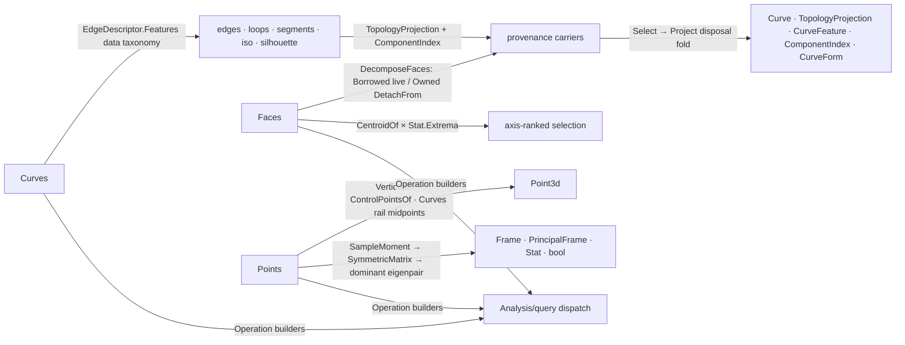

# [RASM_ANALYSIS_SELECT]

The selection/extraction owner — the host sub-geometry decomposition surface of the measured-query runtime: which curves, faces, and points a geometry yields, selected by feature, rank, or index, projected onto typed outputs through the `Domain/normalization` `TopologyProjection` carrier and its leak-free transfer fold. `Curves` `[Union]` closes fourteen selection spellings over SIX cases — edge selection by feature, segment/sub-curve decomposition, trim-aware iso extraction, silhouette/draft capture, index selection, and analytic form classification — with the edge taxonomy DATA-DRIVEN: an internal `EdgeDescriptor` union describes what an edge IS (brep valence + loop membership, mesh connected-face count, loop type) and one `Features` projection derives which `CurveFeature` rows it carries, so selection is `Matches(descriptor)` against a feature row, never per-source `if` ladders. `Faces` `[Union]` closes face decomposition over THREE cases (all, axis-ranked top/bottom through the ONE `Stat.Extrema` fold, index) fanned across EIGHT typed projections (`Brep`/`TopologyProjection`/`Plane`/`Point3d`/`Vector3d`/`ComponentIndex`/`int`/`Interval`) — eight outputs are projection rows on one operation builder, never eight sibling operations. `Points` `[Union]` closes point extraction over FIVE cases — directional extrema (curve quadrants under admitted axes), edge midpoints (composed through the `Curves` rail, never a second edge walker), vertices, control points, and the PCA spread family (`SpreadAspect` fit-plane/principal-frame/distribution/collinear/coplanar) whose principal angle rides the `Domain/stats` `SampleMoment` covariance into the `Numerics/matrix` `SymmetricMatrix` eigendecomposition.

Every projection that duplicates host geometry travels as a `TopologyProjection` — `ComponentIndex` provenance preserved so downstream selection, repair, and host drains address the SAME component space — and every batch releases non-transferred duplicates through the carrier's static `Project` disposal fold; ownership is decided by the `Domain/rails` `Lease` case and the carrier's `DetachFrom` severing, never a caller flag. Capability admission is the `Domain/normalization` row vocabulary (`Capability.CurveForm`/`SurfaceForm`/`BrepForm`/`DecomposeFaces`/`ReadVertices` + `Capability.Native` topology membership + the `Kind` readability columns); evaluation composes the `Domain/evaluation` lattice (`VerticesOf`, `Evaluation.FrameAt`); statistics compose `Stat.Of`/`Stat.Extrema`/`SampleMoment`; direction admission and planar decomposition ride the `Processing/intent` `VectorIntent` rail (`Direction`/`Axes`/`Components`). The silhouette arm is the HOST-native capture tier (`Silhouette.Compute`/`ComputeDraftCurve`) standing beside the settled `Drawing/view` robust hidden-line owner by the Tier-0 capture law — the two altitudes coexist, neither re-implements the other. The factory spellings `Curves.All`/`Boundary`/`NakedOuter`/`NakedInner`/`Interior`/`NonManifold`/`OuterLoop`/`InnerLoop`/`Segments`/`Iso`/`Silhouette`/`Draft`/`At`/`Form`, `Faces.All`/`Top`/`Bottom`/`At`, `Points.Quadrants`/`Extrema`/`EdgeMidpoints`/`Vertices`/`ControlPoints`/`Spread`, and the `AnalysisQuery.Selection(…)`/`MeshPointSpatial(Points)` routes are frozen host contract — the frozen Grasshopper component surface binds them by name.

## [01]-[INDEX]

- [02]-[CURVES]: `CurveFeature` `[SmartEnum<int>]` (14 rows) + internal `EdgeDescriptor` `[Union]` (3 cases, the `Features` derivation) + `Curves` `[Union]` (6 cases, 14 factories); the `CurveProject` builder over the `TopologyProjection` disposal fold; the extraction lattice (edges/loops/segments/iso/silhouette/input) and the `IsoSeq` trim-aware iso kernel.
- [03]-[FACES]: `Faces` `[Union]` (3 cases, 4 factories) fanned across eight typed projections; the `FaceOperation` builder; lease-aware `DecomposeFaces` with the `DetachFrom` ownership protocol; axis-ranked selection through `Stat.Extrema`.
- [04]-[POINTS]: `SpreadAspect` `[SmartEnum<int>]` (5 rows) + `Points` `[Union]` (5 cases, 6 factories); directional extrema, the `Curves`-composed edge midpoints, vertex/control-point extraction, and the `SampleMoment`→`SymmetricMatrix` PCA spread family.

## [02]-[CURVES]

- Owner: `CurveFeature` `[SmartEnum<int>]` — the closed curve-provenance vocabulary (`Input`/`Segment`/`Edge`/`Boundary`/`NakedOuter`/`NakedInner`/`Interior`/`NonManifold`/`OuterLoop`/`InnerLoop`/`Iso`/`Silhouette`/`SubCurve`/`Draft`): every extracted curve names WHAT it was on the source, so downstream filtering reads a row, never re-derives adjacency. `EdgeDescriptor` internal `[Union]` — `OfBrep(EdgeAdjacency, Seq<BrepLoopType>)`/`OfMesh(int ConnectedFaces)`/`OfLoop(BrepLoopType)` with the ONE `Features` projection deriving the feature rows an edge carries (naked brep edge → `Boundary` plus its loop-side rows; interior valence → `Interior`; valence above two or above-two mesh face count → `NonManifold`; mesh boundary at one connected face) and `IsSelectableEdge` naming the selectable subset. `Curves` `[Union]` — `EdgesCase(Option<CurveFeature>)` (`None` = all selectable edges) / `SegmentsCase(bool Smooth)` (polycurve segments versus G1 sub-curves) / `IsoCase(IsoStatus, double Normalized)` / `SilhouetteCase(Vector3d?, Option<double> DraftAngle)` (one case owns silhouette AND draft — the angle's presence selects the host computation) / `AtCase(int?)` / `FormCase(int?)`, with `Feature(Topology)` resolving the emitted feature per source stratum (curve input → `Input`, surface boundary → `Boundary`, else `Edge`), `Matches(EdgeDescriptor)` the data-driven selection test, and `Select(Seq<TopologyProjection>)` the ONE index-selection law (`At` null index → first, `Form` null index → every candidate classified, out-of-range → `Fault.InvalidInput` — never a silent clamp).
- Cases: `Curves` `Edges` · `Segments` · `Iso` · `Silhouette` · `At` · `Form` (6 declared; 14 factories — eight `EdgesCase` feature spellings, `Segments`, `Iso`, `Silhouette`, `Draft`, `At`, `Form`); `EdgeDescriptor` 3; `CurveFeature` 14.
- Entry: `Curves.Operation<TGeometry, TOut>()` — the family seam `Analysis/query` forwards to; admission is `CanProject` (universal ingress, else `Kind.Of` topology dispatch against the case's source lattice), and the output gate fans ONE `CurveProject` builder across five typed projections: `Curve` (the duplicated geometry), `TopologyProjection` (the provenance carrier itself — resource transfer to the caller), `CurveFeature` (the provenance row), `ComponentIndex` (the source address), and `CurveForm` (analytic classification under `FormCase` through the `Domain/normalization` `CurveFormOf`).
- Auto: `CurveProject` resolves the source kind once (`geometry.KindOf(context)`), derives the emitted feature from the aspect × topology, extracts ALL candidate projections, applies `Select`, projects the chosen subset, and releases every non-transferred projection through `TopologyProjection.Project` — extraction, selection, projection, and disposal are one fold, and a leaked duplicate is structurally impossible on both success and failure branches; the extraction lattice discriminates per source: curve-formable inputs lower through `Normalization.CurveForm` (polyline inputs explode to per-segment `LineCurve` projections under boundary spellings; `SegmentsCase` routes `GetSubCurves` for smooth G1 pieces versus `DuplicateSegments` for polycurve segments, degrading to the whole duplicated curve when the source is monolithic), brep edges/loops and mesh topology edges select through `Matches` over their descriptors, `BrepFace` boundaries walk loop trims, iso extraction is TRIM-AWARE on faces (`TrimAwareIsoCurve` at west/east/south/north domain ends or the normalized interior parameter) and domain-parameterized on plain surfaces (`IsoCurve`), SubD edges duplicate after a lazy surface-mesh cache update, and silhouettes admit the view direction through `VectorIntent.Direction` (default `Vector3d.ZAxis`), lower `Surface`/`SubD` sources to owned breps inside a `Lease` window, and route `DraftAngle` presence to `ComputeDraftCurve` versus the full `SilhouetteType` union under model absolute + angle tolerances with cooperative cancellation.
- Packages: RhinoCommon (`BrepEdge.Valence`/`TrimIndices`/`DuplicateCurve`/`EdgeIndex`, `BrepLoop.LoopType`/`To3dCurve`, `Brep.Edges`/`Loops`/`Trims`/`Faces`, `Mesh.TopologyEdges.GetConnectedFaces`/`EdgeLine`, `Surface.IsoCurve`/`Domain`, `BrepFace.TrimAwareIsoCurve`/`Domain`, `Silhouette.Compute`/`ComputeDraftCurve` + `SilhouetteType`, `SubD.DuplicateEdgeCurves`/`UpdateSurfaceMeshCache`, `Curve.TryGetPolyline`/`GetSubCurves`/`DuplicateSegments`, `IsoStatus`, `EdgeAdjacency`, `ComponentIndex`), `Rasm.Domain` (`Capability` rows, `Normalization` form recoveries, `TopologyProjection` + `Project` fold, `CurveForm`/`CurveFormOf`, `Kind`/`Topology`, `Lease`), `Rasm.Processing` (`VectorIntent.Direction`), Thinktecture.Runtime.Extensions, LanguageExt.Core.
- Growth: a new edge feature is one `CurveFeature` row plus one `Features` derivation arm — selection, projection, and disposal are untouched; a new extraction source is one lattice arm emitting `TopologyProjection`s; a new typed output is one projection row on the `Operation` fan; a new silhouette flavor is a `SilhouetteType` flag or policy value on the existing case, never a sibling case.
- Boundary: the edge taxonomy is DATA — `EdgeDescriptor.Features` is the one place adjacency becomes provenance, and a per-source feature `if` ladder beside it is the deleted form; fourteen spellings are six cases (the eight edge spellings differ only by feature row — a `BoundaryCurves`/`NakedCurves`/`InteriorCurves` operation family is the named proliferation this design kills); every duplicate rides `TopologyProjection` with its true `ComponentIndex` (`BrepEdge`/`BrepLoop`/`MeshTopologyEdge`/`BrepFace`/`PolycurveSegment`/`SubdEdge`) so the host drain and the repair pages address the same component space; the silhouette arm is host capture BESIDE the settled `Drawing/view` robust owner — a local hidden-line kernel here is the altitude violation; owned lowering (`Surface`/`SubD` → brep) disposes through the `Lease` window on every branch; `Select` rejects an out-of-range index onto the rail — a clamp-on-one-family/reject-on-the-other asymmetry is the collapsed dead form; ONE reject law serves the curve and face families alike.

```csharp contract
// --- [RUNTIME_PRELUDE] ----------------------------------------------------------------------
using System;
using System.Collections.Generic;
using System.Linq;
using System.Threading;
using LanguageExt;
using Rasm.Domain;
using Rasm.Processing;
using Rhino.Geometry;
using Thinktecture;
using static LanguageExt.Prelude;

namespace Rasm.Analysis;

// --- [TYPES] --------------------------------------------------------------------------------
[SmartEnum<int>]
public sealed partial class CurveFeature {
    public static readonly CurveFeature Input = new(key: 0);
    public static readonly CurveFeature Segment = new(key: 1);
    public static readonly CurveFeature Edge = new(key: 2);
    public static readonly CurveFeature Boundary = new(key: 3);
    public static readonly CurveFeature NakedOuter = new(key: 4);
    public static readonly CurveFeature NakedInner = new(key: 5);
    public static readonly CurveFeature Interior = new(key: 6);
    public static readonly CurveFeature NonManifold = new(key: 7);
    public static readonly CurveFeature OuterLoop = new(key: 8);
    public static readonly CurveFeature InnerLoop = new(key: 9);
    public static readonly CurveFeature Iso = new(key: 10);
    public static readonly CurveFeature Silhouette = new(key: 11);
    public static readonly CurveFeature SubCurve = new(key: 12);
    public static readonly CurveFeature Draft = new(key: 13);
}

[Union]
internal abstract partial record EdgeDescriptor {
    private EdgeDescriptor() { }
    public sealed record OfBrep(EdgeAdjacency Valence, Seq<BrepLoopType> Loops) : EdgeDescriptor;
    public sealed record OfMesh(int ConnectedFaces) : EdgeDescriptor;
    public sealed record OfLoop(BrepLoopType LoopType) : EdgeDescriptor;
    internal bool IsSelectableEdge => this is OfBrep or OfMesh;
    internal Seq<CurveFeature> Features => this switch {
        OfBrep { Valence: EdgeAdjacency.Naked, Loops: Seq<BrepLoopType> loops } =>
            Seq(CurveFeature.Boundary) + loops.Choose(static loop => loop == BrepLoopType.Outer ? Some(CurveFeature.NakedOuter) : loop == BrepLoopType.Inner ? Some(CurveFeature.NakedInner) : Option<CurveFeature>.None),
        OfBrep { Valence: EdgeAdjacency.Interior } => Seq(CurveFeature.Interior),
        OfBrep { Valence: EdgeAdjacency.NonManifold } => Seq(CurveFeature.NonManifold),
        OfMesh { ConnectedFaces: 1 } => Seq(CurveFeature.Boundary),
        OfMesh { ConnectedFaces: 2 } => Seq(CurveFeature.Interior),
        OfMesh { ConnectedFaces: > 2 } => Seq(CurveFeature.NonManifold),
        OfLoop { LoopType: BrepLoopType.Outer } => Seq(CurveFeature.OuterLoop),
        OfLoop { LoopType: BrepLoopType.Inner } => Seq(CurveFeature.InnerLoop),
        _ => Seq<CurveFeature>(),
    };
}

[Union]
public abstract partial record Curves {
    private Curves() { }
    public sealed record EdgesCase(Option<CurveFeature> Kind) : Curves;
    public sealed record SegmentsCase(bool Smooth) : Curves;
    public sealed record IsoCase(IsoStatus Direction, double Normalized) : Curves;
    public sealed record SilhouetteCase(Vector3d? Direction, Option<double> DraftAngle) : Curves;
    public sealed record AtCase(int? Value) : Curves;
    public sealed record FormCase(int? Index = null) : Curves;
    internal static readonly Op Key = Op.Of(name: nameof(Curves));
    public static Curves All => new EdgesCase(Kind: Option<CurveFeature>.None);
    public static Curves Boundary => new EdgesCase(Kind: Some(CurveFeature.Boundary));
    public static Curves NakedOuter => new EdgesCase(Kind: Some(CurveFeature.NakedOuter));
    public static Curves NakedInner => new EdgesCase(Kind: Some(CurveFeature.NakedInner));
    public static Curves Interior => new EdgesCase(Kind: Some(CurveFeature.Interior));
    public static Curves NonManifold => new EdgesCase(Kind: Some(CurveFeature.NonManifold));
    public static Curves OuterLoop => new EdgesCase(Kind: Some(CurveFeature.OuterLoop));
    public static Curves InnerLoop => new EdgesCase(Kind: Some(CurveFeature.InnerLoop));
    public static Curves Segments(bool smooth = false) => new SegmentsCase(Smooth: smooth);
    public static Curves Iso(IsoStatus direction, double normalized = 0.5) => new IsoCase(Direction: direction, Normalized: normalized);
    public static Curves Silhouette(Vector3d? direction = null) => new SilhouetteCase(Direction: direction, DraftAngle: Option<double>.None);
    public static Curves Draft(Vector3d? direction = null, double? angle = null) => new SilhouetteCase(Direction: direction, DraftAngle: Some(Optional(angle).IfNone(0.0)));
    public static Curves At(int? index = null) => new AtCase(Value: index);
    public static Curves Form(int? index = null) => new FormCase(Index: index);

    internal Operation<TGeometry, TOut> Operation<TGeometry, TOut>() where TGeometry : notnull =>
        CanProject(type: typeof(TGeometry)) switch {
            false => Key.Unsupported<TGeometry, TOut>(),
            true => typeof(TOut) switch {
                Type t when t == typeof(Curve) => Analyze.CurveProject<TGeometry, TOut, Curve>(key: Key, aspect: this, project: static (p, _, _, _) => Fin.Succ(p.As<Curve>())),
                Type t when t == typeof(TopologyProjection) => Analyze.CurveProject<TGeometry, TOut, TopologyProjection>(key: Key, aspect: this, project: static (p, _, _, _) => Fin.Succ(Some(p))),
                Type t when t == typeof(CurveFeature) => Analyze.CurveProject<TGeometry, TOut, CurveFeature>(key: Key, aspect: this, project: static (_, feature, _, _) => Fin.Succ(Some(feature))),
                Type t when t == typeof(ComponentIndex) => Analyze.CurveProject<TGeometry, TOut, ComponentIndex>(key: Key, aspect: this, project: static (p, _, _, _) => Fin.Succ(Some(p.Source))),
                Type t when t == typeof(CurveForm) && this is FormCase => Analyze.CurveProject<TGeometry, TOut, CurveForm>(key: Key, aspect: this, project: static (p, _, context, op) => Analyze.ClassifyCurveForm(projection: p, context: context, op: op)),
                _ => Key.Unsupported<TGeometry, TOut>(),
            },
        };

    internal bool CanProject(Type type) =>
        Capability.Universal(type: type)
        || Kind.Of(type: type).Map(kind => CanProject(topology: kind.Topology, type: type)).IfNone(noneValue: false);
    private bool CanProject(Topology topology, Type type) => Switch(
        state: (Topology: topology, Type: type),
        edgesCase: static (state, e) => e.Kind.Case switch {
            null => Capability.CurveForm.Admits(type: state.Type) || Capability.BrepForm.Admits(type: state.Type) || Capability.Native(state.Type, state.Topology, (Topology.Mesh, typeof(Mesh)), (Topology.SubD, typeof(SubD))),
            CurveFeature feature when feature.Equals(CurveFeature.Boundary) => Capability.CurveForm.Admits(type: state.Type) || Capability.BrepForm.Admits(type: state.Type) || Capability.Native(state.Type, state.Topology, (Topology.Mesh, typeof(Mesh))),
            CurveFeature feature when FeatureIsAny(feature, CurveFeature.NakedOuter, CurveFeature.NakedInner, CurveFeature.OuterLoop, CurveFeature.InnerLoop) => Capability.Native(state.Type, state.Topology, (Topology.Brep, typeof(Brep))),
            CurveFeature feature when FeatureIsAny(feature, CurveFeature.Interior, CurveFeature.NonManifold) => Capability.Native(state.Type, state.Topology, (Topology.Brep, typeof(Brep)), (Topology.Mesh, typeof(Mesh))),
            _ => false,
        },
        segmentsCase: static (state, _) => Capability.CurveForm.Admits(type: state.Type) || Capability.Native(state.Type, state.Topology, (Topology.SubD, typeof(SubD))),
        isoCase: static (state, _) => Capability.Native(state.Type, state.Topology, (Topology.Brep, typeof(Brep))) || Capability.SurfaceForm.Admits(type: state.Type),
        silhouetteCase: static (state, _) =>
            Capability.SurfaceForm.Admits(type: state.Type) || typeof(Extrusion).IsAssignableFrom(c: state.Type)
            || Capability.Native(state.Type, state.Topology, (Topology.Brep, typeof(Brep)), (Topology.Mesh, typeof(Mesh)), (Topology.SubD, typeof(SubD)), (Topology.Extrusion, typeof(Extrusion))),
        atCase: static (state, _) =>
            Capability.CurveForm.Admits(type: state.Type) || Capability.SurfaceForm.Admits(type: state.Type) || Capability.Native(state.Type, state.Topology, (Topology.Brep, typeof(Brep)), (Topology.Mesh, typeof(Mesh)), (Topology.SubD, typeof(SubD))),
        formCase: static (state, _) =>
            Capability.CurveForm.Admits(type: state.Type) || Capability.Native(state.Type, state.Topology, (Topology.Brep, typeof(Brep)), (Topology.Mesh, typeof(Mesh)), (Topology.SubD, typeof(SubD))));

    internal Fin<Seq<TopologyProjection>> Select(Seq<TopologyProjection> curves) =>
        (this, curves.Count) switch {
            (_, 0) => Fin.Succ(Seq<TopologyProjection>()),
            (AtCase { Value: int index }, int count) when index < 0 || index >= count => Fin.Fail<Seq<TopologyProjection>>(Key.InvalidInput()),
            (FormCase { Index: int index }, int count) when index < 0 || index >= count => Fin.Fail<Seq<TopologyProjection>>(Key.InvalidInput()),
            (AtCase { Value: int index }, _) => Fin.Succ(Seq(curves[index])),
            (FormCase { Index: int index }, _) => Fin.Succ(Seq(curves[index])),
            (AtCase, _) => Fin.Succ(Seq(curves[0])),
            _ => Fin.Succ(curves),
        };
    internal CurveFeature Feature(Topology topology) => Switch(
        state: topology,
        edgesCase: static (t, e) => e.Kind.IfNone(EdgeFeatureFor(topology: t)),
        segmentsCase: static (_, s) => s.Smooth ? CurveFeature.SubCurve : CurveFeature.Segment,
        isoCase: static (_, _) => CurveFeature.Iso,
        silhouetteCase: static (_, s) => s.DraftAngle.IsSome ? CurveFeature.Draft : CurveFeature.Silhouette,
        atCase: static (t, _) => EdgeFeatureFor(topology: t),
        formCase: static (t, _) => EdgeFeatureFor(topology: t));
    internal bool Matches(EdgeDescriptor descriptor) =>
        this switch {
            EdgesCase { Kind.IsNone: true } or AtCase or FormCase => descriptor.IsSelectableEdge,
            EdgesCase { Kind.Case: CurveFeature feature } => descriptor.Features.Exists(candidate => candidate.Equals(feature)),
            _ => false,
        };
    internal static bool HasEdgeFeature(Curves aspect, bool allowNone, params ReadOnlySpan<CurveFeature> features) =>
        aspect is EdgesCase edges && ((allowNone && edges.Kind.IsNone) || FeatureIsAny(edges.Kind, features));
    private static CurveFeature EdgeFeatureFor(Topology topology) =>
        topology == Topology.Curve ? CurveFeature.Input : topology == Topology.Surface ? CurveFeature.Boundary : CurveFeature.Edge;
    private static bool FeatureIsAny(Option<CurveFeature> kind, params ReadOnlySpan<CurveFeature> features) =>
        kind.Case is CurveFeature feature && FeatureIsAny(feature, features);
    private static bool FeatureIsAny(CurveFeature feature, params ReadOnlySpan<CurveFeature> features) =>
        features.Contains(feature);
}

// --- [OPERATIONS] ---------------------------------------------------------------------------
public static partial class Analyze {
    internal static Operation<TGeometry, TOut> CurveProject<TGeometry, TOut, TValue>(Op key, Curves aspect, Func<TopologyProjection, CurveFeature, Context, Op, Fin<Option<TValue>>> project) where TGeometry : notnull =>
        Operation<TGeometry, TValue>.Build(
            key: key, state: (Key: key, Aspect: aspect, Project: project), requiresContext: true,
            evaluator: static (state, geometry) =>
                from runtime in Env.EnvAsks
                from kind in geometry.KindOf(context: runtime.Context).ToEff()
                let feature = state.Aspect.Feature(topology: kind.Topology)
                from curves in CurveProjections(geometry: geometry, aspect: state.Aspect, context: runtime.Context, op: state.Key, cancel: runtime.Cancellation).ToEff()
                from chosen in state.Aspect.Select(curves: curves).ToEff()
                from result in TopologyProjection.Project(all: curves, chosen: chosen, project: values => values.TraverseM(projection => state.Project(arg1: projection, arg2: feature, arg3: runtime.Context, arg4: state.Key)).As().Bind(projected => state.Key.Accept(values: projected.Choose(static value => value)))).ToEff()
                select result).As<TGeometry, TOut>(key: key);

    internal static Fin<Seq<TopologyProjection>> CurveProjections<TGeometry>(TGeometry geometry, Curves aspect, Context context, Op op, CancellationToken cancel) where TGeometry : notnull =>
        Optional(geometry).ToFin(op.InvalidInput()).Bind(g => (g, aspect) switch {
            (Curve or Line or Polyline or Circle or Arc or Ellipse, Curves candidate) when Curves.HasEdgeFeature(candidate, allowNone: true, CurveFeature.Boundary) || candidate is Curves.AtCase or Curves.SegmentsCase or Curves.FormCase =>
                CurveInput(source: g, aspect: aspect, op: op),
            (Brep brep, Curves candidate) when Curves.HasEdgeFeature(candidate, allowNone: true, CurveFeature.Boundary, CurveFeature.NakedOuter, CurveFeature.NakedInner, CurveFeature.Interior, CurveFeature.NonManifold) || candidate is Curves.AtCase or Curves.FormCase =>
                SelectTopologyFeatures(source: brep.Edges, selector: aspect,
                    describe: static edge => new EdgeDescriptor.OfBrep(Valence: edge.Valence, Loops: toSeq(edge.TrimIndices()).Choose(t => Optional(edge.Brep.Trims[t].Loop).Map(static loop => loop.LoopType))),
                    project: edge => Optional(edge.DuplicateCurve()).Map(curve => TopologyProjection.Of(curve: curve, source: new ComponentIndex(ComponentIndexType.BrepEdge, edge.EdgeIndex)))),
            (Brep brep, Curves candidate) when Curves.HasEdgeFeature(candidate, allowNone: false, CurveFeature.OuterLoop, CurveFeature.InnerLoop) =>
                SelectTopologyFeatures(source: brep.Loops, selector: aspect,
                    describe: static loop => new EdgeDescriptor.OfLoop(LoopType: loop.LoopType),
                    project: loop => Optional(loop.To3dCurve()).Map(curve => TopologyProjection.Of(curve: curve, source: new ComponentIndex(ComponentIndexType.BrepLoop, loop.LoopIndex)))),
            (Brep brep, Curves.IsoCase iso) =>
                toSeq(brep.Faces).TraverseM(face => IsoSeq(surface: face, iso: iso.Direction, normalized: iso.Normalized, op: op)
                    .Map(curves => curves.Map(curve => TopologyProjection.Of(curve: curve, source: new ComponentIndex(ComponentIndexType.BrepFace, face.FaceIndex))))).As()
                    .Map(static nested => nested.Bind(static seq => seq)),
            (BrepFace face, Curves candidate) when Curves.HasEdgeFeature(candidate, allowNone: true, CurveFeature.Boundary) || candidate is Curves.AtCase or Curves.FormCase =>
                FaceBoundaryEdgesOf(face: face, selector: aspect),
            (Mesh mesh, Curves candidate) when Curves.HasEdgeFeature(candidate, allowNone: true, CurveFeature.Boundary, CurveFeature.Interior, CurveFeature.NonManifold) || candidate is Curves.AtCase or Curves.FormCase =>
                SelectTopologyFeatures(source: Enumerable.Range(start: 0, count: mesh.TopologyEdges.Count), selector: aspect,
                    describe: i => new EdgeDescriptor.OfMesh(ConnectedFaces: mesh.TopologyEdges.GetConnectedFaces(topologyEdgeIndex: i).Length),
                    project: i => Some(TopologyProjection.Of(curve: mesh.TopologyEdges.EdgeLine(topologyEdgeIndex: i).ToNurbsCurve(), source: new ComponentIndex(ComponentIndexType.MeshTopologyEdge, i)))),
            (Surface surface, Curves.IsoCase iso) =>
                IsoSeq(surface: surface, iso: iso.Direction, normalized: iso.Normalized, op: op)
                    .Map(curves => curves.Map(curve => TopologyProjection.Of(curve: curve, source: new ComponentIndex(ComponentIndexType.NoType, 0)))),
            (object surfaceLike, Curves.IsoCase iso) when Capability.SurfaceForm.Admits(type: surfaceLike.GetType()) =>
                Normalization.SurfaceForm(source: surfaceLike, key: op).Bind(lease => lease.Use(surface =>
                    IsoSeq(surface: surface, iso: iso.Direction, normalized: iso.Normalized, op: op)
                        .Map(curves => curves.Map(curve => TopologyProjection.Of(curve: curve, source: new ComponentIndex(ComponentIndexType.NoType, 0)))))),
            (object brepLike, Curves candidate) when (Curves.HasEdgeFeature(candidate, allowNone: true, CurveFeature.Boundary) || candidate is Curves.AtCase or Curves.FormCase) && Capability.BrepForm.Admits(type: brepLike.GetType()) =>
                Normalization.BrepForm(source: brepLike, key: op).Bind(lease => lease.Use(brep => SelectTopologyFeatures(source: brep.Edges, selector: aspect,
                    describe: static edge => new EdgeDescriptor.OfBrep(Valence: edge.Valence, Loops: toSeq(edge.TrimIndices()).Choose(t => Optional(edge.Brep.Trims[t].Loop).Map(static loop => loop.LoopType))),
                    project: edge => Optional(edge.DuplicateCurve()).Map(curve => TopologyProjection.Of(curve: curve, source: new ComponentIndex(ComponentIndexType.BrepEdge, edge.EdgeIndex)))))),
            (SubD subd, Curves.EdgesCase { Kind.Case: null } or Curves.AtCase or Curves.SegmentsCase or Curves.FormCase) => SubDEdges(subd: subd),
            (GeometryBase native, Curves.SilhouetteCase silhouette) => SilhouettesOf(geometry: native, silhouette: silhouette, context: context, op: op, cancel: cancel),
            _ => Fin.Fail<Seq<TopologyProjection>>(op.Unsupported(g.GetType(), typeof(Curve))),
        });

    internal static Fin<Seq<Curve>> IsoSeq(Surface surface, IsoStatus iso, double normalized, Op op) => (iso, normalized is >= 0.0 and <= 1.0) switch {
        (IsoStatus.West, _) when surface is BrepFace face => Fin.Succ(toSeq(face.TrimAwareIsoCurve(1, face.Domain(0).T0))),
        (IsoStatus.East, _) when surface is BrepFace face => Fin.Succ(toSeq(face.TrimAwareIsoCurve(1, face.Domain(0).T1))),
        (IsoStatus.South, _) when surface is BrepFace face => Fin.Succ(toSeq(face.TrimAwareIsoCurve(0, face.Domain(1).T0))),
        (IsoStatus.North, _) when surface is BrepFace face => Fin.Succ(toSeq(face.TrimAwareIsoCurve(0, face.Domain(1).T1))),
        (IsoStatus.West or IsoStatus.South or IsoStatus.East or IsoStatus.North, _) => Optional(surface.IsoCurve(iso)).ToFin(op.InvalidResult()).Map(static curve => Seq(curve)),
        (IsoStatus.X or IsoStatus.Y, true) when surface.Domain(iso == IsoStatus.X ? 0 : 1) is { IsValid: true } domain =>
            surface is BrepFace face
                ? Fin.Succ(toSeq(face.TrimAwareIsoCurve(iso == IsoStatus.X ? 1 : 0, domain.ParameterAt(normalized))))
                : Optional(surface.IsoCurve(iso, domain.ParameterAt(normalized))).ToFin(op.InvalidResult()).Map(static curve => Seq(curve)),
        _ => Fin.Fail<Seq<Curve>>(op.InvalidInput()),
    };
    internal static Fin<Option<CurveForm>> ClassifyCurveForm(TopologyProjection projection, Context context, Op op) =>
        projection.As<Curve>(key: op).Bind(curve => Normalization.CurveFormOf(curve: curve, context: context).Map(static form => Some(form)));

    private static Fin<Seq<TopologyProjection>> CurveInput(object source, Curves aspect, Op op) =>
        Normalization.CurveForm(source: source, key: op).Bind(lease => lease.Use(native => aspect switch {
            Curves candidate when Curves.HasEdgeFeature(candidate, allowNone: true, CurveFeature.Boundary) && native.TryGetPolyline(polyline: out Polyline polyline) && polyline.SegmentCount > 0 =>
                Fin.Succ(toSeq(polyline.GetSegments().Select((segment, i) => TopologyProjection.Of(curve: new LineCurve(segment), source: new ComponentIndex(ComponentIndexType.PolycurveSegment, i))))),
            Curves.SegmentsCase segments => Optional(segments.Smooth ? native.GetSubCurves() : native.DuplicateSegments()) switch {
                Option<Curve[]> pieces when pieces.Case is Curve[] found && found.Length > 0 =>
                    Fin.Succ(toSeq(found.Select((piece, i) => TopologyProjection.Of(curve: piece, source: new ComponentIndex(ComponentIndexType.PolycurveSegment, i))))),
                _ => Optional(native.DuplicateCurve()).ToFin(op.InvalidResult()).Map(whole => Seq(TopologyProjection.Of(curve: whole, source: new ComponentIndex(ComponentIndexType.PolycurveSegment, 0)))),
            },
            _ => Optional(native.DuplicateCurve()).ToFin(op.InvalidResult()).Map(whole => Seq(TopologyProjection.Of(curve: whole, source: new ComponentIndex(ComponentIndexType.NoType, 0)))),
        }));
    private static Fin<Seq<TopologyProjection>> SelectTopologyFeatures<TPrimitive>(IEnumerable<TPrimitive> source, Curves selector, Func<TPrimitive, EdgeDescriptor> describe, Func<TPrimitive, Option<TopologyProjection>> project) =>
        Fin.Succ(toSeq(source).Choose(item => selector.Matches(descriptor: describe(arg: item)) ? project(arg: item) : Option<TopologyProjection>.None));
    private static Fin<Seq<TopologyProjection>> FaceBoundaryEdgesOf(BrepFace face, Curves selector) =>
        Fin.Succ(toSeq(face.Loops).Bind(loop => toSeq(loop.Trims).Choose(trim => (selector, trim.Edge) switch {
            (Curves candidate, BrepEdge edge) when Curves.HasEdgeFeature(candidate, allowNone: true, CurveFeature.Boundary) || candidate is Curves.AtCase or Curves.FormCase =>
                Optional(edge.DuplicateCurve()).Map(curve => TopologyProjection.Of(curve: curve, source: new ComponentIndex(ComponentIndexType.BrepEdge, edge.EdgeIndex))),
            _ => Option<TopologyProjection>.None,
        })));
    private static Fin<Seq<TopologyProjection>> SubDEdges(SubD subd) {
        _ = subd.UpdateSurfaceMeshCache(lazyUpdate: true);
        return Fin.Succ(toSeq(subd.DuplicateEdgeCurves().Select((curve, i) => TopologyProjection.Of(curve: curve, source: new ComponentIndex(type: ComponentIndexType.SubdEdge, index: i)))));
    }
    private static Fin<Seq<TopologyProjection>> SilhouettesOf(GeometryBase geometry, Curves.SilhouetteCase silhouette, Context context, Op op, CancellationToken cancel) =>
        cancel.IsCancellationRequested
            ? Fin.Fail<Seq<TopologyProjection>>(new Fault.Cancelled())
            : VectorIntent.Direction(value: Optional(silhouette.Direction).IfNone(Vector3d.ZAxis)).Project<Vector3d>(context: context, key: op)
                .Bind(direction => (geometry switch {
                    Brep or BrepFace or Mesh or Extrusion => Fin.Succ<Lease<GeometryBase>>(new Lease<GeometryBase>.Borrowed(Value: geometry)),
                    Surface surface => Optional(surface.ToBrep()).ToFin(op.InvalidResult()).Map(static brep => (Lease<GeometryBase>)new Lease<GeometryBase>.Owned(Value: brep)),
                    SubD subd => Optional(subd.ToBrep(SubDToBrepOptions.Default)).ToFin(op.InvalidResult()).Map(static brep => (Lease<GeometryBase>)new Lease<GeometryBase>.Owned(Value: brep)),
                    _ => Fin.Fail<Lease<GeometryBase>>(op.Unsupported(geometry.GetType(), typeof(Curve))),
                }).Bind(lease => lease.Use(shape =>
                    Optional(silhouette.DraftAngle.Case switch {
                        double angle => Rhino.Geometry.Silhouette.ComputeDraftCurve(shape, angle, direction, context.Absolute.Value, context.Angle.Value, cancel),
                        _ => Rhino.Geometry.Silhouette.Compute(shape, SilhouetteType.Projecting | SilhouetteType.TangentProjects | SilhouetteType.Tangent | SilhouetteType.Crease | SilhouetteType.Boundary, direction, context.Absolute.Value, context.Angle.Value, [], cancel),
                    }).ToFin(cancel.IsCancellationRequested ? new Fault.Cancelled() : op.InvalidResult())
                    .Map(found => toSeq(found).Map(sil => TopologyProjection.Of(curve: sil.Curve, source: sil.GeometryComponentIndex))))));
}
```

## [03]-[FACES]

- Owner: `Faces` `[Union]` — `AllCase` / `RankedCase(Vector3d Axis, ExtremumDirection Direction)` (top and bottom are ONE case whose `Domain/stats` `ExtremumDirection` sign selects the extremum — never two operations) / `AtCase(int?)`, with the four factories `All`/`Top(axis?)`/`Bottom(axis?)`/`At(index?)` defaulting the ranking axis to `Vector3d.ZAxis`. One `FaceOperation` builder fans the union across eight typed projections; each projection row binds its own `Requirement` (`SurfaceEvaluation` where the row evaluates the face surface, `None` where it reads structure).
- Cases: `All` · `Ranked` · `At` (3 declared; 4 factories) × 8 projection rows (`Brep` face duplicate · `TopologyProjection` carrier · `Plane` centroid frame · `Point3d` centroid · `Vector3d` centroid normal · `ComponentIndex` address · `int` face index · `Interval` uv domains).
- Entry: `Faces.Operation<TGeometry, TOut>()` — the family seam; admission is `Capability.DecomposeFaces.Admits(type)` (universal ingress, `BrepFace` directly, any brep-coercible kind), and the output type selects the projection row at build time, rejecting onto `Fault.Unsupported`.
- Auto: `DecomposeFaces` resolves ownership through the `Lease` case — a BORROWED brep (the input IS a brep the host owns) yields borrowed face carriers addressing the live `BrepFace` list, an OWNED brep (coerced from `Box`/`Sphere`/`Extrusion`/`SubD`/…) yields carriers DETACHED through `TopologyProjection.DetachFrom` (each face duplicated as an independent single-face brep) BEFORE the owning lease disposes at scope exit — a caller-side `copy` flag beside the carrier is the dead form, ownership derives from the lease case; ranking admits the axis through `VectorIntent.Direction`, scores each face centroid against the admitted axis, and selects through the ONE `Stat.Extrema` fold at model tolerance (coplanar-tie faces all return — the band is the tolerance, not an arbitrary first-hit); `FrameAtFaceCentroid` recovers the surface frame at the centroid pull-back (`ClosestPointOnFace` → `Evaluation.FrameAt`, orientation-corrected by that owner's law); the centroid itself is `Analysis/measure`'s `CentroidOf` — the mass-backed centroid, never a vertex average; the `Interval` row reads `Analysis/inspect`'s `DomainsOf` (two uv domains per face).
- Packages: RhinoCommon (`Brep.Faces`, `BrepFace.ClosestPointOnFace`/`FaceIndex`, `ComponentIndex`), `Rasm.Domain` (`Capability.DecomposeFaces`, `Normalization.BrepForm`, `TopologyProjection` + `DetachFrom` + `Project` fold, `Evaluation.FrameAt`, `Stat.Extrema`/`ExtremumDirection`, `Lease`), `Rasm.Processing` (`VectorIntent.Direction`), Thinktecture.Runtime.Extensions, LanguageExt.Core.
- Growth: a new face projection (an area row, a perimeter row) is one output arm on the fan calling the owning family's fold — zero new operations; a new selection strategy (largest-area face, most-vertical face) is one case whose score projection feeds the SAME `Stat.Extrema` fold.
- Boundary: eight outputs on ONE builder — a `FacePlanes`/`FaceCentroids`/`FaceNormals` operation family is the named proliferation this fan deletes; the borrowed/owned decomposition asymmetry is the load-bearing resource law (borrowed carriers transfer live faces to the host drain; owned decompositions detach so no emitted face dangles after the coerced brep disposes) — a decomposition that hands out faces of a disposed brep is the named use-after-free defect this protocol kills; ranking and selection reject an out-of-range index onto the rail under the one selection law shared with `Curves.Select`; the centroid frame row composes `Analysis/measure` + `Domain/evaluation` law — a local mass or frame computation here is the deleted re-derivation.

```csharp contract
// --- [RUNTIME_PRELUDE] ----------------------------------------------------------------------
using System;
using System.Linq;
using LanguageExt;
using Rasm.Domain;
using Rasm.Processing;
using Rhino.Geometry;
using Thinktecture;
using static LanguageExt.Prelude;

namespace Rasm.Analysis;

// --- [TYPES] --------------------------------------------------------------------------------
[Union]
public abstract partial record Faces {
    private Faces() { }
    public sealed record AllCase : Faces;
    public sealed record RankedCase(Vector3d Axis, ExtremumDirection Direction) : Faces;
    public sealed record AtCase(int? Value) : Faces;
    internal static readonly Op Key = Op.Of(name: nameof(Faces));
    public static Faces All => new AllCase();
    public static Faces Top(Vector3d? axis = null) => new RankedCase(Axis: axis ?? Vector3d.ZAxis, Direction: ExtremumDirection.Maximum);
    public static Faces Bottom(Vector3d? axis = null) => new RankedCase(Axis: axis ?? Vector3d.ZAxis, Direction: ExtremumDirection.Minimum);
    public static Faces At(int? index = null) => new AtCase(Value: index);
    internal Operation<TGeometry, TOut> Operation<TGeometry, TOut>() where TGeometry : notnull =>
        Capability.DecomposeFaces.Admits(type: typeof(TGeometry)) switch {
            false => Key.Unsupported<TGeometry, TOut>(),
            true => typeof(TOut) switch {
                Type t when t == typeof(Brep) => Analyze.FaceOperation<TGeometry, TOut, Brep>(key: Key, selector: this, requirement: Requirement.None,
                    project: static (chosen, _) => Key.Accept(values: chosen.Choose(static face => face.As<Brep>()))),
                Type t when t == typeof(TopologyProjection) => Analyze.FaceOperation<TGeometry, TOut, TopologyProjection>(key: Key, selector: this, requirement: Requirement.None,
                    project: static (chosen, _) => Key.Accept(values: chosen)),
                Type t when t == typeof(Plane) => Analyze.FaceOperation<TGeometry, TOut, Plane>(key: Key, selector: this, requirement: Requirement.SurfaceEvaluation,
                    project: static (chosen, runtime) => chosen.TraverseM(face => face.As<BrepFace>(key: Key).Bind(native => Analyze.FrameAtFaceCentroid(face: native, context: runtime, op: Key))).As()),
                Type t when t == typeof(Point3d) => Analyze.FaceOperation<TGeometry, TOut, Point3d>(key: Key, selector: this, requirement: Requirement.SurfaceEvaluation,
                    project: static (chosen, runtime) => chosen.TraverseM(face => face.As<BrepFace>(key: Key).Bind(native => Analyze.CentroidOf(geometry: native, context: runtime, op: Key))).As()),
                Type t when t == typeof(Vector3d) => Analyze.FaceOperation<TGeometry, TOut, Vector3d>(key: Key, selector: this, requirement: Requirement.SurfaceEvaluation,
                    project: static (chosen, runtime) => chosen.TraverseM(face => face.As<BrepFace>(key: Key)
                        .Bind(native => Analyze.FrameAtFaceCentroid(face: native, context: runtime, op: Key))
                        .Bind(frame => VectorIntent.Direction(value: frame.ZAxis).Project<Vector3d>(context: runtime, key: Key))).As()),
                Type t when t == typeof(ComponentIndex) => Analyze.FaceOperation<TGeometry, TOut, ComponentIndex>(key: Key, selector: this, requirement: Requirement.None,
                    project: static (chosen, _) => Key.Accept(values: chosen.Map(static face => face.Source))),
                Type t when t == typeof(int) => Analyze.FaceOperation<TGeometry, TOut, int>(key: Key, selector: this, requirement: Requirement.None,
                    project: static (chosen, _) => Key.Accept(values: chosen.Map(static face => face.Source.Index))),
                Type t when t == typeof(Interval) => Analyze.FaceOperation<TGeometry, TOut, Interval>(key: Key, selector: this, requirement: Requirement.SurfaceEvaluation,
                    project: static (chosen, _) => chosen.TraverseM(face => face.As<BrepFace>(key: Key).Bind(native => Analyze.DomainsOf(geometry: native, op: Key))).As().Map(static nested => nested.Bind(static domains => domains))),
                _ => Key.Unsupported<TGeometry, TOut>(),
            },
        };
}

// --- [OPERATIONS] ---------------------------------------------------------------------------
public static partial class Analyze {
    internal static Operation<TGeometry, TOut> FaceOperation<TGeometry, TOut, TValue>(Op key, Faces selector, Requirement requirement, Func<Seq<TopologyProjection>, Context, Fin<Seq<TValue>>> project) where TGeometry : notnull =>
        Operation<TGeometry, TValue>.Build(
            key: key, state: (Key: key, Selector: selector, Project: project), requirement: requirement, requiresContext: true,
            evaluator: static (state, geometry) =>
                from context in Env.Asks
                from faces in DecomposeFaces(key: state.Key, geometry: geometry).ToEff()
                from chosen in SelectFaces(key: state.Key, faces: faces, selector: state.Selector, runtime: context).ToEff()
                from result in TopologyProjection.Project(all: faces, chosen: chosen, project: values => state.Project(arg1: values, arg2: context)).ToEff()
                select result).As<TGeometry, TOut>(key: key);
    internal static Fin<Seq<TopologyProjection>> DecomposeFaces<TGeometry>(Op key, TGeometry geometry) where TGeometry : notnull =>
        Optional(geometry).ToFin(key.InvalidInput()).Bind(g => g switch {
            BrepFace face => Fin.Succ(Seq(TopologyProjection.Of(face: face))),
            object brepLike when Capability.BrepForm.Admits(type: brepLike.GetType()) => Normalization.BrepForm(source: brepLike, key: key).Bind(lease => lease.Switch(
                borrowed: static borrowed => Fin.Succ(toSeq(borrowed.Value.Faces.Select(static face => TopologyProjection.Of(face: face)).ToArray())),
                owned: static owned => owned.Project(static brep => Fin.Succ(toSeq(brep.Faces.Select(face => TopologyProjection.Of(face: face).DetachFrom(source: brep)).ToArray()))))),
            _ => Fin.Fail<Seq<TopologyProjection>>(key.Unsupported(g.GetType(), typeof(Seq<TopologyProjection>))),
        });
    internal static Fin<Seq<TopologyProjection>> SelectFaces(Op key, Seq<TopologyProjection> faces, Faces selector, Context runtime) => selector.Switch(
        state: (Key: key, Faces: faces, Runtime: runtime),
        allCase: static (s, _) => Fin.Succ(s.Faces),
        rankedCase: static (s, ranked) => RankFaces(state: s, axis: ranked.Axis, direction: ranked.Direction),
        atCase: static (s, at) => (s.Faces.Count, at.Value) switch {
            (0, _) => Fin.Succ(Seq<TopologyProjection>()),
            (int count, int index) when index < 0 || index >= count => Fin.Fail<Seq<TopologyProjection>>(s.Key.InvalidInput()),
            (_, int index) => Fin.Succ(Seq(s.Faces[index])),
            _ => Fin.Succ(Seq(s.Faces[0])),
        });
    internal static Fin<Plane> FrameAtFaceCentroid(BrepFace face, Context context, Op op) =>
        CentroidOf(geometry: face, context: context, op: op).Bind(centroid =>
            face.ClosestPointOnFace(testPoint: centroid, u: out double u, v: out double v, maximumDistance: 0.0)
                ? Evaluation.FrameAt(surface: face, uv: new Point2d(x: u, y: v), key: op)
                : Fin.Fail<Plane>(op.InvalidResult()));
    private static Fin<Seq<TopologyProjection>> RankFaces((Op Key, Seq<TopologyProjection> Faces, Context Runtime) state, Vector3d axis, ExtremumDirection direction) =>
        state.Faces.IsEmpty switch {
            true => Fin.Succ(Seq<TopologyProjection>()),
            false => from vector in VectorIntent.Direction(value: axis).Project<Vector3d>(context: state.Runtime, key: state.Key)
                     from ranked in state.Faces.TraverseM(face => face.As<BrepFace>(key: state.Key)
                         .Bind(native => CentroidOf(geometry: native, context: state.Runtime, op: state.Key))
                         .Map(point => (Face: face, Score: new Vector3d(x: point.X, y: point.Y, z: point.Z) * vector))).As()
                     select Stat.Extrema(items: ranked, projection: static item => item.Score, tolerance: state.Runtime.Absolute.Value, direction: direction).Map(static item => item.Face),
        };
}
```

## [04]-[POINTS]

- Owner: `SpreadAspect` `[BoundaryAdapter]` `[SmartEnum<int>]` — five rows binding the typed `Output` column (`Frame`/`PrincipalFrame` → `Plane`, `Distribution` → `Stat`, `Collinear`/`Coplanar` → `bool`): what a point set's spread IS, asked as a row. `Points` `[Union]` — `ExtremaCase(Option<Seq<Vector3d>>)` (None = the canonical quadrant axes; Some = caller directions, every axis admitted through `VectorIntent.Axes`) / `EdgeMidpointsCase` / `VerticesCase` / `ControlPointsCase` / `SpreadCase(SpreadAspect)`, with the six factories `Quadrants`/`Extrema(directions)`/`EdgeMidpoints`/`Vertices`/`ControlPoints`/`Spread(aspect)`.
- Cases: `Points` `Extrema` · `EdgeMidpoints` · `Vertices` · `ControlPoints` · `Spread` (5 declared; 6 factories); `SpreadAspect` 5 rows.
- Entry: `Points.Operation<TGeometry, TOut>()` — the family seam; every arm gates capability through the `Domain/normalization` vocabulary (`Capability.CurveForm` for extrema, the `Kind.CanReadEdges` column for midpoints, `Capability.ReadVertices` for vertices and spread, the `Kind.CanReadControlPoints` column for control points) and output type (`Point3d` for the extraction cases, the aspect's `Output` for spread) before building.
- Auto: EXTREMA resolves directions through `VectorIntent.Axes(values, planar)` — planar curves collapse to the in-plane axis pair, absent directions derive the world quadrant set — then folds `Curve.ExtremeParameters` per direction through the ONE `Stat.Extrema` fold (direction-projected score, maximum), one extremum point per admitted axis; EDGE MIDPOINTS composes the `Curves` rail (`CurveProject` under `Curves.All`) and projects each edge's `PointAtNormalizedLength(0.5)` — the edge walk lives ONCE in the curve family, never a second walker here; VERTICES routes the `Domain/evaluation` `VerticesOf` lattice; CONTROL POINTS unfolds NURBS nets (curve points, surface uv grid, per-face brep nets) lowering non-NURBS sources through owned `To*Nurbs*` leases; SPREAD reads vertices, and either folds centroid distances into `Stat.Of` (the `Distribution` row, centroid from `Analysis/measure`'s `CentroidOf`) or fits `Plane.FitPlaneToPoints` and derives — `Frame` the raw fit, `PrincipalFrame` the fit rotated by the principal angle, `Coplanar` deviation-within-tolerance, `Collinear` minor-spread-within-tolerance, with the degenerate `≤ 2`-point admission answering `true` for the boolean rows.
- Auto: the principal angle is the PCA of the fitted-plane 2D coordinates — every point decomposes through `VectorIntent.Components` into the fit frame (abort-on-first-failure traversal, a silent zero-row substitution is the deleted form), the rows fold through the `Domain/stats` `SampleMoment` weighted covariance into a `Numerics/matrix` `SymmetricMatrix`, and the DOMINANT eigenpair — selected by `Stat.Extrema` over eigenvalues, independent of the decomposition's return order — gives the axis via `atan2`; `OrientedFrame` rotates the fit axes by that angle through admitted `VectorIntent.Direction`s, and `MinorSpread` measures the largest perpendicular offset about the principal direction.
- Packages: RhinoCommon (`Curve.ExtremeParameters`/`PointAt`/`IsPlanar`/`PointAtNormalizedLength`/`ToNurbsCurve`, `NurbsCurve.Points`, `Surface.ToNurbsSurface`, `NurbsSurface.Points.GetControlPoint`, `BrepFace.ToNurbsSurface`, `Plane.FitPlaneToPoints` + `PlaneFitResult`), `Rasm.Domain` (`Capability`/`Kind` columns, `VerticesOf`, `Stat`/`Stat.Extrema`/`SampleMoment`, `Lease`), `Rasm.Processing` (`VectorIntent.Axes`/`Components`/`Direction`), `Rasm.Numerics` (`SymmetricMatrix`/`Dimension`), Thinktecture.Runtime.Extensions, LanguageExt.Core.
- Growth: a new spread aspect (anisotropy ratio, spread eigenvalue gap) is one `SpreadAspect` row plus one `SpreadProject` arm over the SAME moment fold; a new extraction source is one lattice arm; a new extremum policy is a parameter on the existing fold, never a sibling case.
- Boundary: spread mathematics is COMPOSED — `SampleMoment` owns the covariance, `SymmetricMatrix.DecomposeEigen` owns the spectrum, `Stat.Extrema` owns the dominant-pair selection — and a local covariance accumulation or eigen ordering assumption here is the named double-owner defect (a first-returned-pair principal convention couples correctness to an upstream sort and is the dead form; the dominant-eigenvalue selection is order-independent by construction); planar-coordinate projection failures ABORT the fold — a zero-row substitution silently biases the covariance toward the origin and is the deleted form; `EdgeMidpoints` composing the `Curves` rail is the one-edge-walker law — a topology-edge loop here is the killed parallel walker; control-point extraction leases every minted NURBS form (`Owned`) so conversion never leaks.

```csharp contract
// --- [RUNTIME_PRELUDE] ----------------------------------------------------------------------
using System;
using System.Linq;
using System.Runtime.InteropServices;
using Rasm.Csp;
using LanguageExt;
using Rasm.Domain;
using Rasm.Numerics;
using Rasm.Processing;
using Rhino.Geometry;
using Thinktecture;
using static LanguageExt.Prelude;
// CS0104 guard: Rhino.Geometry declares Matrix/Dimension homonyms under the dual usings.
using Dimension = Rasm.Numerics.Dimension;

namespace Rasm.Analysis;

// --- [TYPES] --------------------------------------------------------------------------------
[BoundaryAdapter, SmartEnum<int>]
public sealed partial class SpreadAspect {
    public static readonly SpreadAspect Frame = new(key: 0, output: typeof(Plane));
    public static readonly SpreadAspect PrincipalFrame = new(key: 1, output: typeof(Plane));
    public static readonly SpreadAspect Distribution = new(key: 2, output: typeof(Stat));
    public static readonly SpreadAspect Collinear = new(key: 3, output: typeof(bool));
    public static readonly SpreadAspect Coplanar = new(key: 4, output: typeof(bool));
    public Type Output { get; }
}

[Union]
public abstract partial record Points {
    private Points() { }
    public sealed record ExtremaCase(Option<Seq<Vector3d>> Directions) : Points;
    public sealed record EdgeMidpointsCase : Points;
    public sealed record VerticesCase : Points;
    public sealed record ControlPointsCase : Points;
    public sealed record SpreadCase(SpreadAspect Aspect) : Points;
    private static readonly Op ExtremaKey = Op.Of(name: nameof(Extrema));
    private static readonly Op EdgeMidpointsKey = Op.Of(name: nameof(EdgeMidpoints));
    private static readonly Op VerticesKey = Op.Of(name: nameof(Vertices));
    private static readonly Op ControlPointsKey = Op.Of(name: nameof(ControlPoints));
    private static readonly Op SpreadKey = Op.Of(name: nameof(Spread));
    public static Points Quadrants => new ExtremaCase(Directions: Option<Seq<Vector3d>>.None);
    public static Points Extrema(Seq<Vector3d> directions) => new ExtremaCase(Directions: Some(value: directions));
    public static Points EdgeMidpoints => new EdgeMidpointsCase();
    public static Points Vertices => new VerticesCase();
    public static Points ControlPoints => new ControlPointsCase();
    public static Points Spread(SpreadAspect aspect) => new SpreadCase(Aspect: aspect);

    internal Operation<TGeometry, TOut> Operation<TGeometry, TOut>() where TGeometry : notnull => Switch(
        extremaCase: static c => typeof(TOut) == typeof(Point3d) && Capability.CurveForm.Admits(type: typeof(TGeometry))
            ? Analysis.Operation<TGeometry, Point3d>.Build(
                key: ExtremaKey, requirement: Requirement.Basic, requiresContext: true, state: (Key: ExtremaKey, c.Directions),
                evaluator: static (state, geometry) =>
                    from context in Env.Asks
                    from lease in Normalization.CurveForm(source: geometry, key: state.Key).ToEff()
                    from points in lease.Use((Curve curve) => curve.IsValid switch {
                        false => Fin.Fail<Seq<Point3d>>(state.Key.InvalidInput()),
                        true => DirectionsFor(custom: state.Directions, planar: curve.IsPlanar(tolerance: context.Absolute.Value), context: context, key: state.Key)
                            .Bind((Seq<Vector3d> directions) => directions.TraverseM((Vector3d direction) => Stat.Extrema(
                                    items: toSeq(curve.ExtremeParameters(direction: direction) ?? []).Map(curve.PointAt),
                                    projection: point => (Vector3d)point * direction,
                                    tolerance: 0.0,
                                    direction: ExtremumDirection.Maximum)
                                .Head.ToFin(state.Key.InvalidResult()))
                            .As()),
                    }).ToEff()
                    select points).As<TGeometry, TOut>(key: ExtremaKey)
            : ExtremaKey.Unsupported<TGeometry, TOut>(),
        edgeMidpointsCase: static _ => typeof(TOut) == typeof(Point3d) && (Capability.Universal(type: typeof(TGeometry)) || Kind.Of(type: typeof(TGeometry)).Map(static kind => kind.CanReadEdges).IfNone(noneValue: false))
            ? Analysis.Operation<TGeometry, Point3d>.Build(
                key: EdgeMidpointsKey, requiresContext: true, state: EdgeMidpointsKey,
                evaluator: static (op, geometry) => Analyze.CurveProject<TGeometry, Point3d, Point3d>(
                    key: op,
                    aspect: Curves.All,
                    project: static (projection, _, _, _) => Fin.Succ(projection.As<Curve>().Map(static curve => curve.PointAtNormalizedLength(length: 0.5))))
                    .Apply(geometry: Seq(geometry))).As<TGeometry, TOut>(key: EdgeMidpointsKey)
            : EdgeMidpointsKey.Unsupported<TGeometry, TOut>(),
        verticesCase: static _ => typeof(TOut) == typeof(Point3d) && Capability.ReadVertices.Admits(type: typeof(TGeometry))
            ? Analysis.Operation<TGeometry, Point3d>.Build(
                key: VerticesKey, state: VerticesKey,
                evaluator: static (op, geometry) =>
                    from points in geometry.VerticesOf(key: op).ToEff()
                    from result in op.Accept(values: points).ToEff()
                    select result).As<TGeometry, TOut>(key: VerticesKey)
            : VerticesKey.Unsupported<TGeometry, TOut>(),
        controlPointsCase: static _ => typeof(TOut) == typeof(Point3d) && (Capability.Universal(type: typeof(TGeometry)) || Kind.Of(type: typeof(TGeometry)).Map(static kind => kind.CanReadControlPoints).IfNone(noneValue: false))
            ? Analysis.Operation<TGeometry, Point3d>.Build(
                key: ControlPointsKey, state: ControlPointsKey,
                evaluator: static (op, geometry) =>
                    from points in Analyze.ControlPointsOf(geometry: geometry, op: op).ToEff()
                    from result in op.Accept(values: points).ToEff()
                    select result).As<TGeometry, TOut>(key: ControlPointsKey)
            : ControlPointsKey.Unsupported<TGeometry, TOut>(),
        spreadCase: static s => s.Aspect.Output == typeof(TOut) && Capability.ReadVertices.Admits(type: typeof(TGeometry))
            ? Analysis.Operation<TGeometry, TOut>.Build(
                key: SpreadKey, requiresContext: true, state: (Key: SpreadKey, s.Aspect),
                evaluator: static (state, geometry) =>
                    from context in Env.Asks
                    from points in geometry.VerticesOf(key: state.Key).ToEff()
                    from result in Analyze.SpreadProject<TOut>(aspect: state.Aspect, points: points, geometry: geometry, context: context, op: state.Key).ToEff()
                    select result)
            : SpreadKey.Unsupported<TGeometry, TOut>());
    private static Fin<Seq<Vector3d>> DirectionsFor(Option<Seq<Vector3d>> custom, bool planar, Context context, Op key) =>
        VectorIntent.Axes(values: custom, planar: planar).Project<Seq<Vector3d>>(context: context, key: key);
}

// --- [OPERATIONS] ---------------------------------------------------------------------------
public static partial class Analyze {
    internal static Fin<Seq<Point3d>> ControlPointsOf<TGeometry>(TGeometry geometry, Op op) where TGeometry : notnull =>
        Optional(geometry).ToFin(op.InvalidInput()).Bind(g => g switch {
            NurbsCurve nurbs => Fin.Succ(toSeq(Enumerable.Range(0, nurbs.Points.Count).Select(i => nurbs.Points[i].Location).ToArray())),
            Curve curve => Optional(curve.ToNurbsCurve()).ToFin(op.InvalidResult())
                .Map(static minted => new Lease<NurbsCurve>.Owned(Value: minted).Use(static owned => toSeq(Enumerable.Range(0, owned.Points.Count).Select(i => owned.Points[i].Location).ToArray()))),
            NurbsSurface nurbs => Fin.Succ(toSeq(Enumerable.Range(0, nurbs.Points.CountU).SelectMany(u => Enumerable.Range(0, nurbs.Points.CountV).Select(v => nurbs.Points.GetControlPoint(u, v).Location)).ToArray())),
            Surface surface => Optional(surface.ToNurbsSurface()).ToFin(op.InvalidResult())
                .Map(static minted => new Lease<NurbsSurface>.Owned(Value: minted).Use(static owned => toSeq(Enumerable.Range(0, owned.Points.CountU).SelectMany(u => Enumerable.Range(0, owned.Points.CountV).Select(v => owned.Points.GetControlPoint(u, v).Location)).ToArray()))),
            Brep brep => toSeq(brep.Faces).TraverseM(face => Optional(face.ToNurbsSurface()).ToFin(op.InvalidResult())
                .Map(static minted => new Lease<NurbsSurface>.Owned(Value: minted).Use(static owned => toSeq(Enumerable.Range(0, owned.Points.CountU).SelectMany(u => Enumerable.Range(0, owned.Points.CountV).Select(v => owned.Points.GetControlPoint(u, v).Location)).ToArray())))).As()
                .Map(static nested => nested.Bind(static points => points)),
            object surfaceLike when Capability.SurfaceForm.Admits(type: surfaceLike.GetType()) =>
                Normalization.SurfaceForm(source: surfaceLike, key: op).Bind(lease => lease.Use(surface => ControlPointsOf(geometry: surface, op: op))),
            _ => Fin.Fail<Seq<Point3d>>(op.Unsupported(g.GetType(), typeof(Point3d))),
        });
    internal static Fin<Seq<TOut>> SpreadProject<TOut>(SpreadAspect aspect, Seq<Point3d> points, object geometry, Context context, Op op) =>
        aspect.Equals(SpreadAspect.Distribution)
            ? CentroidOf(geometry: geometry, context: context, op: op)
                .Bind(centroid => Stat.Of(values: points.Map(point => point.DistanceTo(other: centroid)), key: op))
                .Bind(stat => op.AcceptResults<Stat, TOut>(values: Seq(stat)))
            : (Plane.FitPlaneToPoints(points: points.AsIterable(), plane: out Plane fit, maximumDeviation: out double deviation), fit.IsValid) switch {
                (PlaneFitResult.Success, true) => aspect switch {
                    SpreadAspect row when row.Equals(SpreadAspect.Frame) => op.AcceptResults<Plane, TOut>(values: Seq(fit)),
                    SpreadAspect row when row.Equals(SpreadAspect.PrincipalFrame) => OrientedFrame(fit: fit, points: points, context: context, op: op).Bind(plane => op.AcceptResults<Plane, TOut>(values: Seq(plane))),
                    SpreadAspect row when row.Equals(SpreadAspect.Coplanar) => op.AcceptResults<bool, TOut>(values: Seq(deviation <= context.Absolute.Value)),
                    SpreadAspect row when row.Equals(SpreadAspect.Collinear) => MinorSpread(fit: fit, points: points, context: context, op: op).Bind(spread => op.AcceptResults<bool, TOut>(values: Seq(spread <= context.Absolute.Value))),
                    _ => Fin.Fail<Seq<TOut>>(op.Unsupported(geometryType: typeof(SpreadAspect), outputType: typeof(TOut))),
                },
                _ when (aspect.Equals(SpreadAspect.Coplanar) || aspect.Equals(SpreadAspect.Collinear)) && points.Count <= 2 => op.AcceptResults<bool, TOut>(values: Seq(value: true)),
                _ => Fin.Fail<Seq<TOut>>(op.InvalidResult()),
            };
    // PCA of the fit-plane 2D coordinates: Domain/stats owns the covariance moments, Numerics/matrix
    // owns the eigendecomposition, and the dominant eigenpair is selected order-independently.
    private static Fin<double> PrincipalAngle(Seq<Point3d> points, Plane fit, Context context, Op op) =>
        points.TraverseM(point => VectorIntent.Components(anchor: fit.Origin, value: point - fit.Origin, frame: fit).Project<(double X, double Y)>(context: context, key: op)).As()
            .Map(static planar => planar.Map(static row => new Arr<double>([row.X, row.Y])))
            .Bind(rows => SampleMoment.Of(rows: rows, dimension: 2, key: op))
            .Bind(moment => SymmetricMatrix.Of(dim: Dimension.Create(value: moment.Dimension), upper: moment.UpperCovariance, key: op)
                .Bind(covariance => covariance.DecomposeEigen(key: op)))
            .Bind(pairs => Stat.Extrema(items: pairs, projection: static pair => pair.Eigenvalue, tolerance: 0.0, direction: ExtremumDirection.Maximum).Head.ToFin(op.InvalidResult()))
            .Map(static dominant => Math.Atan2(y: dominant.Eigenvector[1], x: dominant.Eigenvector[0]));
    private static Fin<Plane> OrientedFrame(Plane fit, Seq<Point3d> points, Context context, Op op) =>
        from angle in PrincipalAngle(points: points, fit: fit, context: context, op: op)
        from xAxis in VectorIntent.Direction(value: (fit.XAxis * Math.Cos(d: angle)) + (fit.YAxis * Math.Sin(a: angle))).Project<Vector3d>(context: context, key: op)
        from yAxis in VectorIntent.Direction(value: Vector3d.CrossProduct(a: fit.ZAxis, b: xAxis)).Project<Vector3d>(context: context, key: op)
        from plane in op.AcceptValue(value: new Plane(origin: fit.Origin, xDirection: xAxis, yDirection: yAxis))
        select plane;
    private static Fin<double> MinorSpread(Plane fit, Seq<Point3d> points, Context context, Op op) =>
        from angle in PrincipalAngle(points: points, fit: fit, context: context, op: op)
        from offsets in points.TraverseM(point => VectorIntent.Components(anchor: fit.Origin, value: point - fit.Origin, frame: fit)
            .Project<(double X, double Y)>(context: context, key: op)
            .Map(components => Math.Abs(value: (components.X * -Math.Sin(a: angle)) + (components.Y * Math.Cos(d: angle))))).As()
        select offsets.Fold(initialState: 0.0, f: Math.Max);
}
```



## [05]-[DENSITY_BAR]

One owner per axis; a new feature, projection, or aspect is a row, a case, or a fan arm — never a sibling surface.

| [INDEX] | [CONCERN]         | [OWNER]          | [KIND]                                                 | [RAIL]                            | [CASES] |
| :-----: | :---------------- | :--------------- | :----------------------------------------------------- | :-------------------------------- | :-----: |
|  [01]   | Curve provenance  | `CurveFeature`   | `[SmartEnum<int>]` closed feature vocabulary           | row (pure)                        |   14    |
|  [02]   | Edge taxonomy     | `EdgeDescriptor` | internal `[Union]` + the `Features` derivation         | `Matches → bool` (data-driven)    |    3    |
|  [03]   | Curve selection   | `Curves`         | `[Union]` — 6 cases, 14 factories, 5 typed projections | `Operation → Eff<Env, Seq<TOut>>` |    6    |
|  [04]   | Face selection    | `Faces`          | `[Union]` — 3 cases fanned across 8 typed projections  | `Operation → Eff<Env, Seq<TOut>>` |    3    |
|  [05]   | Point extraction  | `Points`         | `[Union]` — 5 cases, 6 factories                       | `Operation → Eff<Env, Seq<TOut>>` |    5    |
|  [06]   | Spread vocabulary | `SpreadAspect`   | `[SmartEnum<int>]` + typed `Output` column             | `SpreadProject → Fin<Seq<TOut>>`  |    5    |

All three fences are transcription-complete host captures: the full edge/loop/segment/iso/silhouette extraction lattice over the carrier disposal fold, the lease-aware face decomposition with the `DetachFrom` ownership protocol, and the extrema/midpoint/vertex/control-point/spread extraction family. The carrier and its transfer protocol are `Domain/normalization` law; the evaluation and vertex lattices are `Domain/evaluation` law; the statistics are `Domain/stats` law; the eigendecomposition is `Numerics/matrix` law — composed here, legislated there.

## [06]-[RESEARCH]

- [FEATURE_TAXONOMY] — edge selection is a two-stage relation: adjacency facts become an `EdgeDescriptor`, the descriptor derives its `CurveFeature` rows, and selection tests row membership — so the SAME selection spelling answers correctly over brep edges (valence + loop side), mesh topology edges (connected-face count), and loops (loop type), and a new source only describes itself. The law-matrix asserts derivation totality (every descriptor shape yields a deterministic feature set; naked brep edges always carry `Boundary` plus their loop-side refinement), selection soundness (a `Boundary` request never returns an interior or non-manifold edge on any source), provenance fidelity (every emitted curve's `ComponentIndex` addresses the source component that produced it — round-tripping the index through the host re-addresses the same edge), and disposal balance (every projection minted during extraction is either transferred into the output or disposed by the `Project` fold, across success, empty-selection, and failure branches). Verification rides the bridge scenario rail against live geometry.
- [RANKED_DECOMPOSITION] — face ranking is the composed pipeline mass-centroid → axis score → tolerance-banded extremum: the centroid is the mass-properties centroid (a face with concentrated area ranks by where its material lies, not by a vertex average), the score is the dot against an ADMITTED axis (a zero or non-finite axis rejects through `VectorIntent.Direction` before any centroid computes), and ties within model tolerance ALL return (a prism's top selection under `Top()` returns every coplanar top face, not an arbitrary first). The law-matrix asserts rank symmetry (`Top(axis)` equals `Bottom(-axis)`), tie completeness at tolerance, the borrowed/owned lease law (borrowed decompositions transfer live faces; owned decompositions emit only detached single-face duplicates — no emitted face references the disposed coerced brep), and the index law shared with the curve family (null → first, out-of-range → `InvalidInput`).
- [SPREAD_PCA] — the spread family reads one moment pipeline: fit plane, project to 2D through the intent rail, fold the `SampleMoment` covariance, decompose, select the dominant eigenpair. Dominance is selected by EIGENVALUE through the one extremum fold — the pipeline is correct under any decomposition return order, killing the first-pair convention that silently couples correctness to an upstream sort; projection failures abort rather than injecting zero rows, so a degenerate frame cannot bias the covariance toward the origin. The law-matrix asserts rotation invariance (the principal angle of a rotated point set shifts by exactly the rotation), collinear/coplanar degeneracy (`≤ 2` points answer `true`; a strict line answers `Collinear == true` at any tolerance; a noisy line answers under the model band), frame orthonormality (the oriented frame's axes admit through `VectorIntent.Direction` and remain right-handed with the fit normal), and distribution coherence (the `Stat` receipt's evidence law holds over centroid distances, with the centroid the mass-backed `CentroidOf`, never the vertex mean).
- [HOST_CAPTURE_SEAMS] — three deliberate host seams anchor this page: `Silhouette.Compute`/`ComputeDraftCurve` is the view-dependent capture tier standing beside the settled `Drawing/view` robust hidden-line owner (the host answers projecting/tangent/crease/boundary silhouettes and draft-angle curves against live tolerance; the robust owner answers exact-arithmetic visibility — the Tier-0 capture law keeps both, and consumers select by altitude); `TrimAwareIsoCurve` versus `IsoCurve` is the face/surface split (trim-aware extraction on faces so iso curves respect the trim boundary; domain extraction on plain surfaces); and control-point extraction lowers through owned NURBS conversions because the host exposes control nets only on NURBS forms. Each seam is one lattice arm — the law-matrix asserts the silhouette direction default (`ZAxis`), draft-versus-silhouette routing by `DraftAngle` presence, cancellation propagation (`Fault.Cancelled` before and during the host call), and iso normalized-parameter admission (`[0, 1]` interior, endpoint spellings exact).
