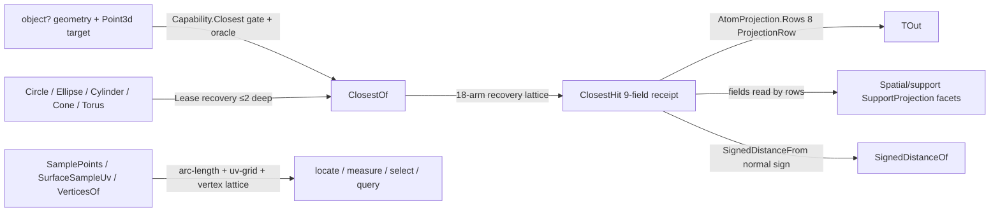

# [RASM_DOMAIN_EVALUATION]

`Evaluation` owns the closest-point and differential-frame lattice: one polymorphic dispatch answers where every admissible Rhino form sits relative to a sample and what its local frame is, recovering the richest evidence each form admits into one `ClosestHit` receipt. Evaluation reads `Rhino.Geometry` values only — document or view reach is the boundary-law violation — and nothing above the lattice re-derives closest-point logic.

A rebuild composes these seams unchanged: `ClosestHit` conforms to the `Domain/rails` `IValidityEvidence` fold the `Domain/validation` oracle reads through one interface arm; typed output projects through the `Numerics/atoms` `AtomProjection.Rows` rail, one `ProjectionRow` per facet; capability admission rides the `Domain/normalization` `Capability` rows while analytic value forms reach native arms through `Lease` recoveries; and facet selection past the canonical projection is `Spatial/support` `SupportProjection`'s row vocabulary over the receipt fields, so no boolean rides a signature.

## [01]-[INDEX]

- [01]-[EVALUATION]: the `ClosestHit` evidence receipt and the `Evaluation` lattice over closest-point, signed distance, frames, and sampling.

## [02]-[EVALUATION]

- Owner: `ClosestHit` `readonly record struct` mints the typed closest-point evidence receipt — a recovered `Point` and `Option` facets each present exactly when the form admits it, `IsValid` a per-facet vacuous-truth fold where an absent facet never invalidates and a present-but-degenerate one always does. `Evaluation` `[BoundaryAdapter]` holds the polymorphic `object?` ingress and the surface-typed members.
- Entry: `geometry.ClosestOf(target, key) : Fin<ClosestHit>` is the one entry per closest-point modality — `SignedDistanceOf`, `SamplePoints`, and `VerticesOf` share the shape — discriminating on the value's runtime shape and routing the `Domain/rails` `Fault` union across null, native-refusal, absent-host-product, and inadmissible-form failures. Count is the sampling policy input and form the discriminant, so no per-form sibling and no count-or-mode flag exists.
- Auto: capability admission rides the `Capability` rows so no arm re-derives type admissibility, and analytic value forms reach their native arms through one owned-`Lease` hop disposed at `Use` scope exit, recursion bounded at 2 hops (value form → native form → terminal arm). Termination is total — the smooth-curve vertex arm ends at endpoints so a closed curve yields its seam point once, the `Curve or Surface or Brep` native-refusal arm precedes the recovery arms, and the `BrepFace` arm is itself total so no refused face leaks through `BrepFace : Surface` assignability into the surface arm. `NormalAt` flips for `BrepFace.OrientationIsReversed` and `FrameAt` re-handeds the frame to agree, so the receipt never carries a frame/normal disagreement. Sampling is metric-honest: `SamplePoints(n)` yields n arc-length curve samples and an n×n uv grid, and `SurfaceSampleUv` pulls exterior grid samples back onto trimmed faces through `ClosestPointOnFace`, failing only when no sample survives the trim.
- Receipt: `ClosestHit` is the one evidence carrier for every arm; a per-form `CurveHit`/`MeshHit`/`BrepHit` family is the rejected proliferation, an absent facet is `Option.None` never a `double.NaN` or `Point2d.Unset` sentinel, and the receipt's own `IValidityEvidence` conformance retires the acceptance oracle's hand-enumerated arm under the one-oracle law.
- Packages: RhinoCommon geometry members, `Rasm.Numerics` `AtomProjection.Rows`/`ProjectionRow`, LanguageExt.Core rails, and the Foundation `[BoundaryAdapter]` contract; the fence owns the member roster.
- Growth: a new evaluatable form is one `ClosestOf` arm carrying its `Capability.Closest` admission; a new receipt facet is one `Option` field, one `ProjectionRow`, and one `IsValid` conjunct, every existing arm compiling unchanged because an absent facet is `None`; a new projection output type is one row, never a switch arm.
- Boundary: projection is `ProjectionRow` data through the one `AtomProjection.Rows` rail, so receipt and atom projection share one dispatch; distance is the `double` projection at this altitude while parameter, span, signed, and containment facet selection is `Spatial/support` `SupportProjection`'s row vocabulary over the same receipt fields. `ClosestHit.At` computes `Distance` from the query target, so a caller-supplied distance is the rejected trust hole. `Evaluation` preserves every recovery the mature kernel performed; the recursion ordering fixes change no terminating input's result, and the `BrepFace` totalization trades one silently-untrimmed underlying-surface point for a typed refusal.

```csharp signature
// --- [RUNTIME_PRELUDE] ----------------------------------------------------------------------
using System;
using System.Collections.Generic;
using System.Linq;
using System.Runtime.InteropServices;
using Rasm.Csp;
using LanguageExt;
using Rasm.Numerics;
using Rhino;
using Rhino.Geometry;
using static LanguageExt.Prelude;

namespace Rasm.Domain;

// --- [MODELS] -------------------------------------------------------------------------------
[BoundaryAdapter, StructLayout(LayoutKind.Auto)]
public readonly record struct ClosestHit(
    Point3d Point,
    Option<double> Distance,
    Option<double> Parameter,
    Option<Point2d> Uv,
    Option<Vector3d> Normal,
    Option<ComponentIndex> Component,
    Option<MeshPoint> MeshPoint,
    Option<Vector3d> Tangent,
    Option<Plane> Frame) : IValidityEvidence {
    internal static ClosestHit At(
        Point3d target,
        Point3d point,
        Option<double> parameter = default,
        Option<Point2d> uv = default,
        Option<Vector3d> normal = default,
        Option<ComponentIndex> component = default,
        Option<MeshPoint> meshPoint = default,
        Option<Vector3d> tangent = default,
        Option<Plane> frame = default) =>
        new(Point: point, Distance: Some(target.DistanceTo(other: point)), Parameter: parameter, Uv: uv, Normal: normal, Component: component, MeshPoint: meshPoint, Tangent: tangent, Frame: frame);
    public bool IsValid => ValidityClaim.All(
        ValidityClaim.Finite(Point),
        ValidityClaim.Of(Distance.Map(static d => ValidityClaim.Nonnegative(d).Holds).IfNone(noneValue: false)),
        ValidityClaim.Of(Parameter.Map(static t => ValidityClaim.Finite(t).Holds).IfNone(noneValue: true)),
        ValidityClaim.Of(Uv.Map(static uv => uv.IsValid).IfNone(noneValue: true)),
        ValidityClaim.Of(Normal.Map(static n => n.IsValid && n.Length > RhinoMath.ZeroTolerance).IfNone(noneValue: true)),
        ValidityClaim.Of(Component.Map(static c => c is { ComponentIndexType: not ComponentIndexType.InvalidType } && c.Index >= 0).IfNone(noneValue: true)),
        ValidityClaim.Of(MeshPoint.Map(static m => OpAcceptance.ValidityOf(source: m).IfNone(noneValue: false)).IfNone(noneValue: true)),
        ValidityClaim.Of(Tangent.Map(static v => v.IsValid && v.Length > RhinoMath.ZeroTolerance).IfNone(noneValue: true)),
        ValidityClaim.Of(Frame.Map(static p => p.IsValid).IfNone(noneValue: true)));
    internal Fin<TOut> Project<TOut>(Op key) {
        ClosestHit hit = this;
        Fin<TValue> Facet<TValue>(Option<TValue> facet) => facet.ToFin(Fail: key.InvalidResult()).Bind(value => key.AcceptValue(value: value));
        return AtomProjection.Rows<ClosestHit, TOut>(
            self: this,
            key: key,
            ProjectionRow.Of<ClosestHit>(() => key.AcceptValue(value: hit)),
            ProjectionRow.Of<Point3d>(() => key.AcceptValue(value: hit.Point)),
            ProjectionRow.Of<double>(() => Facet(facet: hit.Distance)),
            ProjectionRow.Of<Point2d>(() => Facet(facet: hit.Uv)),
            ProjectionRow.Of<Vector3d>(() => Facet(facet: hit.Normal)),
            ProjectionRow.Of<Plane>(() => Facet(facet: hit.Frame)),
            ProjectionRow.Of<ComponentIndex>(() => Facet(facet: hit.Component)),
            ProjectionRow.Of<MeshPoint>(() => Facet(facet: hit.MeshPoint)));
    }
    internal Fin<double> SignedDistanceFrom(Point3d sample, Op key) {
        ClosestHit hit = this;
        return hit.Distance.ToFin(Fail: key.InvalidResult()).Bind(distance =>
            hit.Normal.ToFin(Fail: key.InvalidResult()).Map(normal => ((sample - hit.Point) * normal) >= 0.0 ? distance : -distance));
    }
}

// --- [OPERATIONS] ---------------------------------------------------------------------------
[BoundaryAdapter]
internal static class Evaluation {
    extension(object? geometry) {
        public Fin<ClosestHit> ClosestOf(Point3d target, Op key) =>
            from _ in guard(target.IsValid, key.InvalidInput())
            from g in Optional(geometry).ToFin(key.InvalidInput())
            from __ in guard(!Capability.Closest.Admits(type: g.GetType()) || OpAcceptance.ValidityOf(source: g).IfNone(noneValue: false), key.InvalidInput())
            from hit in g switch {
                Point3d point when point.IsValid => Fin.Succ(ClosestHit.At(target: target, point: point)),
                Point { IsValid: true } point => Fin.Succ(ClosestHit.At(target: target, point: point.Location)),
                PointCloud { IsValid: true } cloud => cloud.ClosestPoint(testPoint: target) switch {
                    int index when index >= 0 && index < cloud.Count => Fin.Succ(ClosestHit.At(
                        target: target,
                        point: cloud.PointAt(index: index),
                        normal: cloud[index].Normal switch {
                            Vector3d normal when normal.IsValid && !normal.IsTiny() => Some(normal),
                            _ => Option<Vector3d>.None,
                        },
                        component: Some(new ComponentIndex(ComponentIndexType.PointCloudPoint, index)))),
                    _ => Fin.Fail<ClosestHit>(key.InvalidResult()),
                },
                Line line => (line.ClosestPoint(testPoint: target, limitToFiniteSegment: true), Math.Clamp(line.ClosestParameter(testPoint: target), 0.0, 1.0), line.UnitTangent) switch {
                    (Point3d closest, double parameter, Vector3d tangent) => Fin.Succ(ClosestHit.At(
                        target: target,
                        point: closest,
                        parameter: Some(parameter),
                        tangent: tangent is { IsValid: true } && !tangent.IsTiny() ? Some(tangent) : Option<Vector3d>.None,
                        frame: new Plane(origin: closest, normal: tangent) is { IsValid: true } lineFrame ? Some(lineFrame) : Option<Plane>.None)),
                },
                Polyline polyline => (polyline.ClosestParameter(testPoint: target), polyline.ClosestPoint(testPoint: target)) switch {
                    (double parameter, Point3d closest) => polyline.TangentAt(t: parameter) switch {
                        Vector3d polyTangent when polyTangent.IsValid && !polyTangent.IsTiny() => Fin.Succ(ClosestHit.At(
                            target: target,
                            point: closest,
                            parameter: Some(parameter),
                            tangent: Some(polyTangent),
                            frame: new Plane(origin: closest, normal: polyTangent) is { IsValid: true } polyFrame ? Some(polyFrame) : Option<Plane>.None)),
                        _ => Fin.Succ(ClosestHit.At(target: target, point: closest, parameter: Some(parameter))),
                    },
                },
                Plane plane when plane.ClosestParameter(testPoint: target, s: out double s, t: out double t) => Fin.Succ(ClosestHit.At(
                    target: target,
                    point: plane.PointAt(u: s, v: t),
                    uv: Some(new Point2d(x: s, y: t)),
                    normal: Some(plane.Normal),
                    frame: new Plane(origin: plane.PointAt(u: s, v: t), xDirection: plane.XAxis, yDirection: plane.YAxis) is { IsValid: true } planeFrame ? Some(planeFrame) : Option<Plane>.None)),
                Sphere sphere => Normalization.SurfaceForm(source: sphere, key: key).Bind(lease => lease.Use(surface => surface.ClosestOf(target: target, key: key))),
                Box box => Fin.Succ(ClosestHit.At(target: target, point: box.ClosestPoint(point: target, includeInterior: false))),
                BoundingBox box => Fin.Succ(ClosestHit.At(target: target, point: box.ClosestPoint(point: target, includeInterior: false))),
                Curve curve when curve.ClosestPoint(testPoint: target, t: out double parameter) => Fin.Succ(ClosestHit.At(
                    target: target,
                    point: curve.PointAt(t: parameter),
                    parameter: Some(parameter),
                    tangent: curve.TangentAt(t: parameter) switch { Vector3d v when v.IsValid && !v.IsTiny() => Some(v), _ => Option<Vector3d>.None },
                    frame: (curve.PerpendicularFrameAt(t: parameter, plane: out Plane perpFrame), perpFrame) switch { (true, { IsValid: true } valid) => Some(valid), _ => Option<Plane>.None })),
                BrepFace face => face.ClosestPointOnFace(testPoint: target, u: out double u, v: out double v, maximumDistance: 0.0)
                    ? NormalAt(surface: face, uv: new Point2d(x: u, y: v), key: key).Map(normal =>
                        ClosestHit.At(
                            target: target,
                            point: face.PointAt(u: u, v: v),
                            uv: Some(new Point2d(x: u, y: v)),
                            normal: Some(normal),
                            component: face.FaceIndex >= 0 ? Some(new ComponentIndex(ComponentIndexType.BrepFace, face.FaceIndex)) : Option<ComponentIndex>.None,
                            frame: FrameAt(surface: face, uv: new Point2d(x: u, y: v), key: key).ToOption()))
                    : Fin.Fail<ClosestHit>(key.InvalidInput()),
                Surface surface when surface.ClosestPoint(testPoint: target, u: out double u, v: out double v) =>
                    NormalAt(surface: surface, uv: new Point2d(x: u, y: v), key: key).Map(normal =>
                        ClosestHit.At(
                            target: target,
                            point: surface.PointAt(u: u, v: v),
                            uv: Some(new Point2d(x: u, y: v)),
                            normal: Some(normal),
                            frame: FrameAt(surface: surface, uv: new Point2d(x: u, y: v), key: key).ToOption())),
                Brep brep when brep.ClosestPoint(target, out Point3d point, out ComponentIndex component, out double u, out double v, 0.0, out Vector3d hitVector) =>
                    component switch {
                        { ComponentIndexType: ComponentIndexType.BrepFace, Index: int faceIndex } when faceIndex >= 0 && faceIndex < brep.Faces.Count =>
                            NormalAt(surface: brep.Faces[faceIndex], uv: new Point2d(x: u, y: v), key: key).Map(oriented =>
                                ClosestHit.At(
                                    target: target,
                                    point: point,
                                    uv: Some(new Point2d(x: u, y: v)),
                                    normal: Some(oriented),
                                    component: Some(component),
                                    frame: FrameAt(surface: brep.Faces[faceIndex], uv: new Point2d(x: u, y: v), key: key).ToOption())),
                        { ComponentIndexType: ComponentIndexType.BrepEdge, Index: int edgeIndex } when edgeIndex >= 0 && edgeIndex < brep.Edges.Count =>
                            Fin.Succ(ClosestHit.At(
                                target: target,
                                point: point,
                                parameter: Some(u),
                                component: Some(component),
                                tangent: hitVector.IsValid && hitVector.Length > RhinoMath.ZeroTolerance ? Some(hitVector) : Option<Vector3d>.None,
                                frame: (brep.Edges[edgeIndex].PerpendicularFrameAt(t: u, plane: out Plane edgeFrame), edgeFrame, hitVector) switch {
                                    (true, { IsValid: true } frame, _) => Some(frame),
                                    (_, _, { IsValid: true } tangent) when tangent.Length > RhinoMath.ZeroTolerance => new Plane(origin: point, normal: tangent) switch {
                                        { IsValid: true } frame => Some(frame),
                                        _ => Option<Plane>.None,
                                    },
                                    _ => Option<Plane>.None,
                                })),
                        _ => Fin.Succ(ClosestHit.At(target: target, point: point, component: Some(component))),
                    },
                Mesh mesh => Optional(mesh.ClosestMeshPoint(testPoint: target, maximumDistance: 0.0)).ToFin(key.InvalidResult())
                    .Map(meshPoint => mesh.NormalAt(meshPoint: meshPoint) switch {
                        Vector3d normal when normal.IsValid && !normal.IsTiny() =>
                            ClosestHit.At(
                                target: target,
                                point: meshPoint.Point,
                                normal: Some(normal),
                                component: Some(meshPoint.ComponentIndex),
                                meshPoint: Some(meshPoint),
                                frame: new Plane(origin: meshPoint.Point, normal: normal) is { IsValid: true } meshFrame ? Some(meshFrame) : Option<Plane>.None),
                        _ => ClosestHit.At(target: target, point: meshPoint.Point, component: Some(meshPoint.ComponentIndex), meshPoint: Some(meshPoint)),
                    }),
                Curve or Surface or Brep => Fin.Fail<ClosestHit>(key.InvalidInput()),
                object curveLike when Capability.CurveForm.Admits(type: curveLike.GetType()) =>
                    Normalization.CurveForm(source: curveLike, key: key).Bind(lease => lease.Use(curve => curve.ClosestOf(target: target, key: key))),
                object surfaceLike when Capability.SurfaceForm.Admits(type: surfaceLike.GetType()) =>
                    Normalization.SurfaceForm(source: surfaceLike, key: key).Bind(lease => lease.Use(surface => surface.ClosestOf(target: target, key: key))),
                _ => Fin.Fail<ClosestHit>(key.Unsupported(geometryType: g.GetType(), outputType: typeof(ClosestHit))),
            }
            select hit;
        public Fin<double> SignedDistanceOf(ClosestHit hit, Point3d sample, Op key) =>
            from source in Optional(geometry).ToFin(key.InvalidInput())
            from point in key.AcceptValue(value: sample)
            from active in key.AcceptValue(value: hit)
            from distance in source switch {
                Plane plane => key.AcceptValue(value: plane.DistanceTo(testPoint: point)),
                Sphere sphere => key.AcceptValue(value: point.DistanceTo(other: sphere.Center) - sphere.Radius),
                Box box => key.AcceptValue(value: (box.Contains(point: point, strict: false) ? -1.0 : 1.0) * point.DistanceTo(other: box.ClosestPoint(point: point, includeInterior: false))),
                BoundingBox box => key.AcceptValue(value: (box.Contains(point: point) ? -1.0 : 1.0) * point.DistanceTo(other: box.ClosestPoint(point: point, includeInterior: false))),
                object value when Capability.ClosestNormal.Admits(type: value.GetType()) => active.SignedDistanceFrom(sample: point, key: key),
                _ => Fin.Fail<double>(key.Unsupported(geometryType: source.GetType(), outputType: typeof(double))),
            }
            select distance;
        public Fin<Seq<Point3d>> SamplePoints(int count, Context context, Op key) =>
            guard(count > 0, key.InvalidInput()).Bind(_ => Optional(geometry).ToFin(key.InvalidInput()).Bind(value => value switch {
                Curve curve => CurveSampleParameters(curve: curve, count: count, context: context, key: key).Map(parameters => parameters.Map(curve.PointAt)),
                object curveLike when Capability.CurveForm.Admits(type: curveLike.GetType()) =>
                    Normalization.CurveForm(source: curveLike, key: key).Bind(lease => lease.Use(curve => curve.SamplePoints(count: count, context: context, key: key))),
                Surface surface => SurfaceSamplePoints(surface: surface, count: count, context: context, key: key),
                object surfaceLike when Capability.SurfaceForm.Admits(type: surfaceLike.GetType()) =>
                    Normalization.SurfaceForm(source: surfaceLike, key: key).Bind(lease => lease.Use(surface => SurfaceSamplePoints(surface: surface, count: count, context: context, key: key))),
                object vertexLike when Capability.ReadVertices.Admits(type: vertexLike.GetType()) => vertexLike.VerticesOf(key: key),
                _ => Fin.Fail<Seq<Point3d>>(key.Unsupported(geometryType: value.GetType(), outputType: typeof(Point3d))),
            }));
        public Fin<Seq<Point3d>> VerticesOf(Op key) =>
            Optional(geometry).ToFin(key.InvalidInput()).Bind(value => value switch {
                Point3d point => Fin.Succ(Seq(point)),
                Point point => Fin.Succ(Seq(point.Location)),
                Line line => Fin.Succ(Seq(line.From, line.To)),
                Arc arc => Fin.Succ(Seq(arc.StartPoint, arc.EndPoint)),
                Polyline polyline => Fin.Succ(toSeq(polyline)),
                BoundingBox box => Fin.Succ(toSeq(box.GetCorners())),
                Box box => Fin.Succ(toSeq(box.GetCorners())),
                Curve curve => curve.TryGetPolyline(polyline: out Polyline poly)
                    ? Fin.Succ(toSeq(poly))
                    : Fin.Succ(curve.IsClosed ? Seq(curve.PointAtStart) : Seq(curve.PointAtStart, curve.PointAtEnd)),
                object curveLike when Capability.CurveForm.Admits(type: curveLike.GetType()) =>
                    Normalization.CurveForm(source: curveLike, key: key).Bind(lease => lease.Use(curve => curve.VerticesOf(key: key))),
                Brep brep => Fin.Succ(toSeq(brep.DuplicateVertices())),
                Mesh mesh => Fin.Succ(toSeq(mesh.Vertices.ToPoint3dArray())),
                PointCloud cloud => Fin.Succ(toSeq(cloud.GetPoints())),
                SubD subd => Fin.Succ(toSeq(LanguageExt.List.unfold(
                    (SubDVertex?)subd.Vertices.First,
                    static vertex => vertex switch { SubDVertex current => Some((current.ControlNetPoint, (SubDVertex?)current.Next)), _ => None }))),
                GeometryBase { HasBrepForm: true } native => Normalization.BrepForm(source: native, key: key).Bind(lease => lease.Use(brep => brep.VerticesOf(key: key))),
                _ => Fin.Fail<Seq<Point3d>>(key.Unsupported(geometryType: value.GetType(), outputType: typeof(Point3d))),
            });
    }
    internal static Fin<Seq<double>> CurveSampleParameters(Curve curve, int count, Context context, Op key) =>
        Fractions(count: count, key: key).Bind(fractions =>
            Optional(curve.NormalizedLengthParameters([.. fractions.AsIterable()], context.Absolute.Value, context.Fractional)).ToFin(key.InvalidResult()).Map(static p => toSeq(p)));
    internal static Fin<Point2d> SurfaceUv(Surface surface, Point2d uv, Context context, Op key) =>
        (uv.IsValid, surface.Domain(0), surface.Domain(1)) switch {
            (true, Interval u, Interval v) when u.IsValid && v.IsValid && u.IncludesParameter(uv.X) && v.IncludesParameter(uv.Y)
                && (surface is not BrepFace face || face.IsPointOnFace(uv.X, uv.Y, context.Absolute.Value) != PointFaceRelation.Exterior) => Fin.Succ(uv),
            _ => Fin.Fail<Point2d>(key.InvalidInput()),
        };
    internal static Fin<Seq<Point2d>> SurfaceSampleUv(Surface surface, int count, Context context, Op key) =>
        Optional(context).ToFin(key.MissingContext()).Bind(model =>
        Optional(surface).ToFin(key.InvalidInput()).Bind(native => (native.Domain(0), native.Domain(1)) switch {
            (Interval u, Interval v) when u.IsValid && v.IsValid =>
                Fractions(count: count, key: key)
                    .Map(fractions => fractions.Bind(uf => fractions.Map(vf => new Point2d(u.ParameterAt(uf), v.ParameterAt(vf)))))
                    .Bind(samples => (native, model.Absolute.Value) switch {
                        (BrepFace face, double tolerance) => samples.Choose(uv =>
                            face.IsPointOnFace(u: uv.X, v: uv.Y, tolerance: tolerance) != PointFaceRelation.Exterior ? Some(uv)
                            : face.ClosestPointOnFace(testPoint: face.PointAt(u: uv.X, v: uv.Y), u: out double fu, v: out double fv, maximumDistance: 0.0)
                                && face.IsPointOnFace(u: fu, v: fv, tolerance: tolerance) != PointFaceRelation.Exterior ? Some(new Point2d(fu, fv)) : Option<Point2d>.None) switch {
                                    Seq<Point2d> valid when !valid.IsEmpty => Fin.Succ(valid),
                                    _ => Fin.Fail<Seq<Point2d>>(key.InvalidResult()),
                                },
                        _ => Fin.Succ(samples),
                    }),
            _ => Fin.Fail<Seq<Point2d>>(key.InvalidInput()),
        }));
    internal static Fin<Seq<Point3d>> SurfaceSamplePoints(Surface surface, int count, Context context, Op key) =>
        SurfaceSampleUv(surface: surface, count: count, context: context, key: key)
            .Map(uvs => uvs.Map(uv => surface.PointAt(u: uv.X, v: uv.Y)));
    internal static Fin<Vector3d> NormalAt(Surface surface, Point2d uv, Op key) =>
        surface.NormalAt(u: uv.X, v: uv.Y) switch {
            Vector3d normal when normal.IsValid && !normal.IsTiny() => Fin.Succ(surface is BrepFace { OrientationIsReversed: true } ? -normal : normal),
            _ => Fin.Fail<Vector3d>(key.InvalidResult()),
        };
    internal static Fin<Plane> FrameAt(Surface surface, Point2d uv, Op key) =>
        (surface.FrameAt(u: uv.X, v: uv.Y, frame: out Plane frame), frame) switch {
            (true, { IsValid: true } native) => NormalAt(surface: surface, uv: uv, key: key).Bind(normal =>
                Fin.Succ((native.ZAxis * normal) >= 0.0 ? native : new Plane(origin: native.Origin, xDirection: native.XAxis, yDirection: -native.YAxis))),
            _ => Fin.Fail<Plane>(key.InvalidResult()),
        };
    private static Fin<Seq<double>> Fractions(int count, Op key) =>
        count switch {
            1 => Fin.Succ(Seq(0.5)),
            > 1 => Fin.Succ(toSeq(Enumerable.Range(0, count).Select(i => i / (count - 1.0)))),
            _ => Fin.Fail<Seq<double>>(key.InvalidInput()),
        };
}
```



## [03]-[RESEARCH]

<!-- source-only: research row template:
[TOKEN]-[OPEN|BLOCKED]: <exact question>; <verification route>.
[SPLIT_MEMBER]-[OPEN]: does `shape-core` expose `split_all`; verify against the member rail.
-->

(none)
