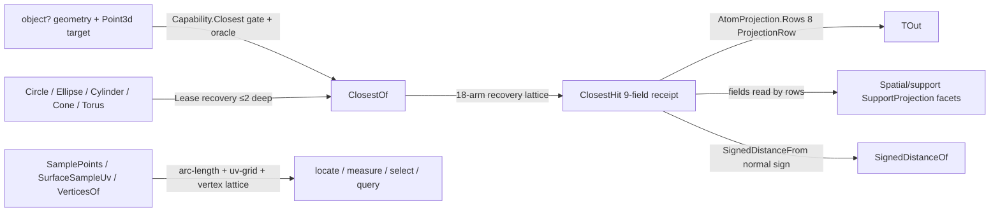

# [RASM_DOMAIN_EVALUATION]

The closest-point and evaluation lattice — the substrate that answers WHERE geometry is relative to a sample and WHAT the local differential frame looks like, for every admissible Rhino form through one polymorphic dispatch. ONE `ClosestHit` receipt (9 evidence fields: `Point`, `Distance`, `Parameter`, `Uv`, `Normal`, `Component`, `MeshPoint`, `Tangent`, `Frame` — every optional facet an `Option<T>`, never a sentinel) carries the full recovery a closest-point evaluation admits, conforms to the `Domain/rails` `IValidityEvidence` fold so the `Domain/validation` acceptance oracle reads it through the one interface arm, and projects typed output through the `Numerics/atoms` `AtomProjection.Rows` rail — one `ProjectionRow` per facet type, the `typeof(TOut)` switch-cascade form KILLED, and the `parameterMode` boolean knob KILLED with it: `double` projects the canonical `Distance` row, and facet variation (parameter-as-double, span, signed distance, containment) is `Spatial/support` `SupportProjection`'s 14-row vocabulary reading the receipt's fields — the receipt owns evidence, the support enum owns facet selection, no boolean rides a signature.

ONE `Evaluation` owner holds the lattice: `ClosestOf` — the polymorphic closest-point evaluation over `Point3d`/`Point`/`PointCloud`/`Line`/`Polyline`/`Plane`/`Sphere`/`Box`/`BoundingBox`/`Curve`/`BrepFace`/`Surface`/`Brep`/`Mesh` plus the analytic value forms reached through the `Domain/normalization` `Lease`-returning recoveries, each arm recovering the richest evidence its form admits (curve parameter + tangent + perpendicular frame; surface uv + oriented normal + normal-aligned frame; brep face/edge component discrimination with per-component recovery; mesh `MeshPoint` + normal frame; cloud index component + stored normal) — `SignedDistanceOf` (analytic plane/sphere/box signed distance, normal-sign fallthrough through the receipt), `NormalAt`/`FrameAt` (orientation-corrected surface evaluation — `BrepFace.OrientationIsReversed` flips the normal, the frame re-handeds to agree with it), `SurfaceUv`/`SurfaceSampleUv`/`SurfaceSamplePoints` (domain-validated uv admission, face-exterior pull-back through `ClosestPointOnFace`), and `SamplePoints`/`CurveSampleParameters`/`VerticesOf` (arc-length-uniform curve sampling through `NormalizedLengthParameters`, uv-grid surface sampling, the vertex extraction lattice with the SubD control-net unfold). Two latent unbounded recursions in the mature lattice die structurally here: the vertex lattice's smooth-curve arm now terminates at endpoints (closed → seam point) instead of re-entering the form recovery with an identical receiver, and the closest lattice's native-refusal fail arm precedes the form-recovery arms so a post-validity `ClosestPoint` refusal routes `InvalidInput` instead of looping; the `BrepFace` arm is additionally TOTAL — `BrepFace : Surface` assignability would otherwise hand a refused face to the surface arm and answer with the untrimmed underlying-surface point. `Spatial/support` `SupportSpace`, `Parametric/locate`, and the `Analysis/measure`/`select`/`query` families all compose this lattice; nothing above it re-derives closest-point logic.

## [01]-[INDEX]

- [01]-[EVALUATION]: the `ClosestHit` 9-field receipt (`At` factory, `IValidityEvidence` fold, `ProjectionRow`-railed `Project<TOut>`, `SignedDistanceFrom`) and the `Evaluation` polymorphic lattice (`ClosestOf`/`SignedDistanceOf`/`NormalAt`/`FrameAt`/`SurfaceUv`/`SurfaceSampleUv`/`SurfaceSamplePoints`/`SamplePoints`/`CurveSampleParameters`/`VerticesOf`).

## [02]-[EVALUATION]

- Owner: `ClosestHit` `readonly record struct` — the typed closest-point evidence receipt: `Point` the recovered closest point, `Distance` computed at the `At` factory from the query target (never caller-supplied), and seven `Option` facets each populated exactly when the source form admits them; `At(target, point, …)` the one factory computing distance and threading facets; `IsValid` the `ValidityClaim.All` claim fold (finite point, PRESENT non-negative distance — a defaulted receipt that skipped `At` carries no distance and is invalid — and per-facet vacuous-truth `Of` claims: an absent optional facet never invalidates, a present-but-degenerate one always does); `Project<TOut>(Op)` the typed projection through `AtomProjection.Rows` — eight `ProjectionRow` rows (self, `Point3d`, `double` = distance, `Point2d` = uv, `Vector3d` = normal, `Plane` = frame, `ComponentIndex`, `MeshPoint`), each row lifting its facet through `Op.AcceptValue` so projected output re-enters the acceptance rail; `SignedDistanceFrom(sample, Op)` the normal-sign signed distance over the receipt's own evidence. `Evaluation` `[BoundaryAdapter]` internal static — the `extension(object? geometry)` polymorphic ingress (`ClosestOf`/`SignedDistanceOf`/`SamplePoints`/`VerticesOf`) plus the surface-typed members (`NormalAt`/`FrameAt`/`SurfaceUv`/`SurfaceSampleUv`/`SurfaceSamplePoints`), the curve sampler (`CurveSampleParameters`), and the private `Fractions` count→unit-fraction policy (1 sample → midpoint 0.5, n samples → inclusive endpoints).
- Cases: `ClosestOf` 18 arms — `Point3d` · `Point` · `PointCloud` (index component + stored normal) · `Line` (clamped parameter + unit tangent + tangent frame) · `Polyline` (parameter + segment tangent + tangent frame) · `Plane` (uv + normal + axis frame) · `Sphere` (surface-form delegate) · `Box` · `BoundingBox` · `Curve` (parameter + tangent + perpendicular frame) · `BrepFace` (uv + oriented normal + face frame + face component) · `Surface` (uv + oriented normal + frame) · `Brep` (face-component recovery with uv/normal/frame, edge-component recovery with parameter/tangent/perpendicular-or-tangent frame, vertex-component tail) · `Mesh` (`MeshPoint` + normal + normal frame) · native-refusal fail arm (`Curve`/`Surface`/`Brep`; the `BrepFace` arm is total and fails its own refusal) · curve-form lease delegate · surface-form lease delegate · `Unsupported` tail; `SignedDistanceOf` 6 arms (plane/sphere analytic, box/bounding-box containment-signed, normal-capable receipt fallthrough, `Unsupported`); `VerticesOf` 15 arms; `SamplePoints` 6 arms; `Project<TOut>` 8 rows.
- Entry: `geometry.ClosestOf(target, key) : Fin<ClosestHit>` — ONE entry for every closest-point modality, discriminating on the value's runtime shape, `Fin` routing the `Domain/rails` `Fault` union (`InvalidInput` on null/invalid/native-refusal, `InvalidResult` on an absent host product — a null `MeshPoint`, a missing cloud index — and `Unsupported(geometryType, typeof(ClosestHit))` on an inadmissible form); `geometry.SignedDistanceOf(hit, sample, key)`; `geometry.SamplePoints(count, context, key)`; `geometry.VerticesOf(key)` — no `ClosestOfCurve`/`ClosestOfMesh` siblings, no per-form sampler family, no count/mode flags (the count IS the policy input, the form IS the discriminant).
- Auto: capability gating rides the `Domain/normalization` `Capability` rows (`Closest` admission with validity gated through the `Domain/validation` oracle, `ClosestNormal` for the signed-distance fallthrough, `CurveForm`/`SurfaceForm`/`ReadVertices` for the lease-delegate and vertex arms) so the lattice never re-derives type admissibility; analytic value forms (`Circle`/`Ellipse`/`Cylinder`/`Cone`/`Torus`) evaluate through the normalization `Lease` recoveries — `Owned` conversions dispose at `Use` scope exit, recursion is structurally ≤ 2 deep (value form → native form → terminal arm), and the two mature-source divergences are dead: the smooth-curve vertex arm terminates at endpoints (closed curve → its seam point once) and the `Curve or Surface or Brep` native-refusal arm precedes the form-recovery arms while the `BrepFace` arm carries its refusal in the arm body — no refused face leaks through `BrepFace : Surface` assignability into the surface arm; `NormalAt` flips for `BrepFace.OrientationIsReversed` so a reversed face reports the OUTWARD normal, and `FrameAt` re-handeds the frame (negated `YAxis`) whenever the host frame's `ZAxis` disagrees with the oriented normal — frame and normal never disagree in the receipt; `SurfaceSampleUv` pulls exterior grid samples back onto trimmed faces through `ClosestPointOnFace` and fails only when NO sample survives the trim; the count is dimension-honest — `SamplePoints(n)` yields n arc-length curve samples and an n×n uv surface grid, the fraction policy shared through the one `Fractions` fold.
- Receipt: `ClosestHit` is the one evidence carrier for every arm — a per-form receipt family (`CurveHit`/`MeshHit`/`BrepHit`) is the rejected proliferation; absence of a facet is `Option.None`, never `double.NaN`/`Point2d.Unset` sentinels; the receipt's `IsValid` is its own conformance (`IValidityEvidence`), so the acceptance oracle's hand-enumerated `ClosestHit` arm is retired under the one-oracle law.
- Packages: RhinoCommon (`Curve.ClosestPoint`/`PointAt`/`TangentAt`/`PerpendicularFrameAt`/`NormalizedLengthParameters`/`TryGetPolyline`/`IsClosed`/`PointAtStart`/`PointAtEnd`, `Surface.ClosestPoint`/`PointAt`/`NormalAt`/`FrameAt`/`Domain`, `BrepFace.ClosestPointOnFace`/`IsPointOnFace`/`PointAt`/`OrientationIsReversed`/`FaceIndex`, `Brep.ClosestPoint` (component overload) /`Faces`/`Edges`/`DuplicateVertices`, `Mesh.ClosestMeshPoint`/`NormalAt`/`Vertices.ToPoint3dArray`, `PointCloud.ClosestPoint`/`PointAt`/`GetPoints`, `Line`/`Polyline.ClosestPoint`/`ClosestParameter`/`TangentAt`/`UnitTangent`, `Plane.ClosestParameter`/`PointAt`/`Normal`, `Box`/`BoundingBox.ClosestPoint`/`Contains`/`GetCorners`, `SubD.Vertices` + `SubDVertex.ControlNetPoint`/`Next`, `MeshPoint`, `ComponentIndex`, `PointFaceRelation`, `RhinoMath.ZeroTolerance`), `Rasm.Numerics` (`AtomProjection.Rows`/`ProjectionRow` — the promoted projection rail), LanguageExt.Core (`Fin`/`Option`/`Seq`/`guard`/`toSeq`/`List.unfold`), Foundation analyzer contracts (`[BoundaryAdapter]`).
- Growth: a new evaluatable form is ONE `ClosestOf` arm recovering its richest evidence plus its `Capability.Closest` admission — the receipt, the projection rows, and every consumer are untouched; a new receipt facet is ONE `Option` field + ONE `ProjectionRow` + ONE `IsValid` conjunct, and every existing arm compiles unchanged (absent facet = `None`); a new projection output type is ONE row, never a switch arm.
- Boundary: the `typeof(TOut)` switch-cascade inside `Project<TOut>` is the named killed form — projection is `ProjectionRow` data through the ONE `AtomProjection.Rows` rail, so receipt projection, atom projection, and every downstream `.Project<TOut>` share one dispatch mechanism; the `parameterMode` boolean is the named killed knob — `double` means distance at this altitude, and parameter/span/signed/containment facet selection is `Spatial/support` `SupportProjection`'s row vocabulary over this receipt (`Parameter`/`Distance`/`Uv`/`Component`/`MeshPoint` rows read the fields directly), so the same evidence serves every facet without a mode flag; `ClosestHit.At` computes `Distance` from the target — a caller-supplied distance is the rejected trust hole; evaluation READS `Rhino.Geometry` only — document/view reach is the boundary-law violation; the lattice preserves capability totally — every recovery the mature kernel performed (curve perpendicular frames, brep edge-component tangent frames with the perpendicular-frame-then-tangent-plane fallback, mesh normal frames, cloud stored normals, box interior-exclusion closest points) lands in an arm, the two recursion fixes change no terminating input's result, and the face-refusal totalization trades exactly one degenerate answer — a silently untrimmed underlying-surface point — for a typed refusal.

```csharp contract
// --- [RUNTIME_PRELUDE] ----------------------------------------------------------------------
using System;
using System.Collections.Generic;
using System.Linq;
using System.Runtime.InteropServices;
using Foundation.CSharp.Analyzers.Contracts;
using LanguageExt;
using Rasm.Numerics;
using Rhino;
using Rhino.Geometry;
using static LanguageExt.Prelude;

namespace Rasm.Domain;

// --- [MODELS] -------------------------------------------------------------------------------
[BoundaryAdapter, StructLayout(LayoutKind.Auto)]
public readonly record struct ClosestHit(
    Point3d Point,
    Option<double> Distance,
    Option<double> Parameter,
    Option<Point2d> Uv,
    Option<Vector3d> Normal,
    Option<ComponentIndex> Component,
    Option<MeshPoint> MeshPoint,
    Option<Vector3d> Tangent,
    Option<Plane> Frame) : IValidityEvidence {
    internal static ClosestHit At(
        Point3d target,
        Point3d point,
        Option<double> parameter = default,
        Option<Point2d> uv = default,
        Option<Vector3d> normal = default,
        Option<ComponentIndex> component = default,
        Option<MeshPoint> meshPoint = default,
        Option<Vector3d> tangent = default,
        Option<Plane> frame = default) =>
        new(Point: point, Distance: Some(target.DistanceTo(other: point)), Parameter: parameter, Uv: uv, Normal: normal, Component: component, MeshPoint: meshPoint, Tangent: tangent, Frame: frame);
    public bool IsValid => ValidityClaim.All(
        ValidityClaim.Finite(Point),
        ValidityClaim.Of(Distance.Map(static d => ValidityClaim.Nonnegative(d).Holds).IfNone(noneValue: false)),
        ValidityClaim.Of(Parameter.Map(static t => ValidityClaim.Finite(t).Holds).IfNone(noneValue: true)),
        ValidityClaim.Of(Uv.Map(static uv => uv.IsValid).IfNone(noneValue: true)),
        ValidityClaim.Of(Normal.Map(static n => n.IsValid && n.Length > RhinoMath.ZeroTolerance).IfNone(noneValue: true)),
        ValidityClaim.Of(Component.Map(static c => c is { ComponentIndexType: not ComponentIndexType.InvalidType } && c.Index >= 0).IfNone(noneValue: true)),
        ValidityClaim.Of(MeshPoint.Map(static m => OpAcceptance.ValidityOf(source: m).IfNone(noneValue: false)).IfNone(noneValue: true)),
        ValidityClaim.Of(Tangent.Map(static v => v.IsValid && v.Length > RhinoMath.ZeroTolerance).IfNone(noneValue: true)),
        ValidityClaim.Of(Frame.Map(static p => p.IsValid).IfNone(noneValue: true)));
    internal Fin<TOut> Project<TOut>(Op key) {
        ClosestHit hit = this;
        Fin<TValue> Facet<TValue>(Option<TValue> facet) => facet.ToFin(Fail: key.InvalidResult()).Bind(value => key.AcceptValue(value: value));
        return AtomProjection.Rows<ClosestHit, TOut>(
            self: this,
            key: key,
            ProjectionRow.Of<ClosestHit>(() => key.AcceptValue(value: hit)),
            ProjectionRow.Of<Point3d>(() => key.AcceptValue(value: hit.Point)),
            ProjectionRow.Of<double>(() => Facet(facet: hit.Distance)),
            ProjectionRow.Of<Point2d>(() => Facet(facet: hit.Uv)),
            ProjectionRow.Of<Vector3d>(() => Facet(facet: hit.Normal)),
            ProjectionRow.Of<Plane>(() => Facet(facet: hit.Frame)),
            ProjectionRow.Of<ComponentIndex>(() => Facet(facet: hit.Component)),
            ProjectionRow.Of<MeshPoint>(() => Facet(facet: hit.MeshPoint)));
    }
    internal Fin<double> SignedDistanceFrom(Point3d sample, Op key) {
        ClosestHit hit = this;
        return hit.Distance.ToFin(Fail: key.InvalidResult()).Bind(distance =>
            hit.Normal.ToFin(Fail: key.InvalidResult()).Map(normal => ((sample - hit.Point) * normal) >= 0.0 ? distance : -distance));
    }
}

// --- [OPERATIONS] ---------------------------------------------------------------------------
[BoundaryAdapter]
internal static class Evaluation {
    extension(object? geometry) {
        public Fin<ClosestHit> ClosestOf(Point3d target, Op key) =>
            from _ in guard(target.IsValid, key.InvalidInput())
            from g in Optional(geometry).ToFin(key.InvalidInput())
            from __ in guard(!Capability.Closest.Admits(type: g.GetType()) || OpAcceptance.ValidityOf(source: g).IfNone(noneValue: false), key.InvalidInput())
            from hit in g switch {
                Point3d point when point.IsValid => Fin.Succ(ClosestHit.At(target: target, point: point)),
                Point { IsValid: true } point => Fin.Succ(ClosestHit.At(target: target, point: point.Location)),
                PointCloud { IsValid: true } cloud => cloud.ClosestPoint(testPoint: target) switch {
                    int index when index >= 0 && index < cloud.Count => Fin.Succ(ClosestHit.At(
                        target: target,
                        point: cloud.PointAt(index: index),
                        normal: cloud[index].Normal switch {
                            Vector3d normal when normal.IsValid && !normal.IsTiny() => Some(normal),
                            _ => Option<Vector3d>.None,
                        },
                        component: Some(new ComponentIndex(ComponentIndexType.PointCloudPoint, index)))),
                    _ => Fin.Fail<ClosestHit>(key.InvalidResult()),
                },
                Line line => (line.ClosestPoint(testPoint: target, limitToFiniteSegment: true), Math.Clamp(line.ClosestParameter(testPoint: target), 0.0, 1.0), line.UnitTangent) switch {
                    (Point3d closest, double parameter, Vector3d tangent) => Fin.Succ(ClosestHit.At(
                        target: target,
                        point: closest,
                        parameter: Some(parameter),
                        tangent: tangent is { IsValid: true } && !tangent.IsTiny() ? Some(tangent) : Option<Vector3d>.None,
                        frame: new Plane(origin: closest, normal: tangent) is { IsValid: true } lineFrame ? Some(lineFrame) : Option<Plane>.None)),
                },
                Polyline polyline => (polyline.ClosestParameter(testPoint: target), polyline.ClosestPoint(testPoint: target)) switch {
                    (double parameter, Point3d closest) => polyline.TangentAt(t: parameter) switch {
                        Vector3d polyTangent when polyTangent.IsValid && !polyTangent.IsTiny() => Fin.Succ(ClosestHit.At(
                            target: target,
                            point: closest,
                            parameter: Some(parameter),
                            tangent: Some(polyTangent),
                            frame: new Plane(origin: closest, normal: polyTangent) is { IsValid: true } polyFrame ? Some(polyFrame) : Option<Plane>.None)),
                        _ => Fin.Succ(ClosestHit.At(target: target, point: closest, parameter: Some(parameter))),
                    },
                },
                Plane plane when plane.ClosestParameter(testPoint: target, s: out double s, t: out double t) => Fin.Succ(ClosestHit.At(
                    target: target,
                    point: plane.PointAt(u: s, v: t),
                    uv: Some(new Point2d(x: s, y: t)),
                    normal: Some(plane.Normal),
                    frame: new Plane(origin: plane.PointAt(u: s, v: t), xDirection: plane.XAxis, yDirection: plane.YAxis) is { IsValid: true } planeFrame ? Some(planeFrame) : Option<Plane>.None)),
                Sphere sphere => Normalization.SurfaceForm(source: sphere, key: key).Bind(lease => lease.Use(surface => surface.ClosestOf(target: target, key: key))),
                Box box => Fin.Succ(ClosestHit.At(target: target, point: box.ClosestPoint(point: target, includeInterior: false))),
                BoundingBox box => Fin.Succ(ClosestHit.At(target: target, point: box.ClosestPoint(point: target, includeInterior: false))),
                Curve curve when curve.ClosestPoint(testPoint: target, t: out double parameter) => Fin.Succ(ClosestHit.At(
                    target: target,
                    point: curve.PointAt(t: parameter),
                    parameter: Some(parameter),
                    tangent: curve.TangentAt(t: parameter) switch { Vector3d v when v.IsValid && !v.IsTiny() => Some(v), _ => Option<Vector3d>.None },
                    frame: (curve.PerpendicularFrameAt(t: parameter, plane: out Plane perpFrame), perpFrame) switch { (true, { IsValid: true } valid) => Some(valid), _ => Option<Plane>.None })),
                BrepFace face => face.ClosestPointOnFace(testPoint: target, u: out double u, v: out double v, maximumDistance: 0.0)
                    ? NormalAt(surface: face, uv: new Point2d(x: u, y: v), key: key).Map(normal =>
                        ClosestHit.At(
                            target: target,
                            point: face.PointAt(u: u, v: v),
                            uv: Some(new Point2d(x: u, y: v)),
                            normal: Some(normal),
                            component: face.FaceIndex >= 0 ? Some(new ComponentIndex(ComponentIndexType.BrepFace, face.FaceIndex)) : Option<ComponentIndex>.None,
                            frame: FrameAt(surface: face, uv: new Point2d(x: u, y: v), key: key).ToOption()))
                    : Fin.Fail<ClosestHit>(key.InvalidInput()),
                Surface surface when surface.ClosestPoint(testPoint: target, u: out double u, v: out double v) =>
                    NormalAt(surface: surface, uv: new Point2d(x: u, y: v), key: key).Map(normal =>
                        ClosestHit.At(
                            target: target,
                            point: surface.PointAt(u: u, v: v),
                            uv: Some(new Point2d(x: u, y: v)),
                            normal: Some(normal),
                            frame: FrameAt(surface: surface, uv: new Point2d(x: u, y: v), key: key).ToOption())),
                Brep brep when brep.ClosestPoint(target, out Point3d point, out ComponentIndex component, out double u, out double v, 0.0, out Vector3d hitVector) =>
                    component switch {
                        { ComponentIndexType: ComponentIndexType.BrepFace, Index: int faceIndex } when faceIndex >= 0 && faceIndex < brep.Faces.Count =>
                            NormalAt(surface: brep.Faces[faceIndex], uv: new Point2d(x: u, y: v), key: key).Map(oriented =>
                                ClosestHit.At(
                                    target: target,
                                    point: point,
                                    uv: Some(new Point2d(x: u, y: v)),
                                    normal: Some(oriented),
                                    component: Some(component),
                                    frame: FrameAt(surface: brep.Faces[faceIndex], uv: new Point2d(x: u, y: v), key: key).ToOption())),
                        { ComponentIndexType: ComponentIndexType.BrepEdge, Index: int edgeIndex } when edgeIndex >= 0 && edgeIndex < brep.Edges.Count =>
                            Fin.Succ(ClosestHit.At(
                                target: target,
                                point: point,
                                parameter: Some(u),
                                component: Some(component),
                                tangent: hitVector.IsValid && hitVector.Length > RhinoMath.ZeroTolerance ? Some(hitVector) : Option<Vector3d>.None,
                                frame: (brep.Edges[edgeIndex].PerpendicularFrameAt(t: u, plane: out Plane edgeFrame), edgeFrame, hitVector) switch {
                                    (true, { IsValid: true } frame, _) => Some(frame),
                                    (_, _, { IsValid: true } tangent) when tangent.Length > RhinoMath.ZeroTolerance => new Plane(origin: point, normal: tangent) switch {
                                        { IsValid: true } frame => Some(frame),
                                        _ => Option<Plane>.None,
                                    },
                                    _ => Option<Plane>.None,
                                })),
                        _ => Fin.Succ(ClosestHit.At(target: target, point: point, component: Some(component))),
                    },
                Mesh mesh => Optional(mesh.ClosestMeshPoint(testPoint: target, maximumDistance: 0.0)).ToFin(key.InvalidResult())
                    .Map(meshPoint => mesh.NormalAt(meshPoint: meshPoint) switch {
                        Vector3d normal when normal.IsValid && !normal.IsTiny() =>
                            ClosestHit.At(
                                target: target,
                                point: meshPoint.Point,
                                normal: Some(normal),
                                component: Some(meshPoint.ComponentIndex),
                                meshPoint: Some(meshPoint),
                                frame: new Plane(origin: meshPoint.Point, normal: normal) is { IsValid: true } meshFrame ? Some(meshFrame) : Option<Plane>.None),
                        _ => ClosestHit.At(target: target, point: meshPoint.Point, component: Some(meshPoint.ComponentIndex), meshPoint: Some(meshPoint)),
                    }),
                Curve or Surface or Brep => Fin.Fail<ClosestHit>(key.InvalidInput()),
                object curveLike when Capability.CurveForm.Admits(type: curveLike.GetType()) =>
                    Normalization.CurveForm(source: curveLike, key: key).Bind(lease => lease.Use(curve => curve.ClosestOf(target: target, key: key))),
                object surfaceLike when Capability.SurfaceForm.Admits(type: surfaceLike.GetType()) =>
                    Normalization.SurfaceForm(source: surfaceLike, key: key).Bind(lease => lease.Use(surface => surface.ClosestOf(target: target, key: key))),
                _ => Fin.Fail<ClosestHit>(key.Unsupported(geometryType: g.GetType(), outputType: typeof(ClosestHit))),
            }
            select hit;
        public Fin<double> SignedDistanceOf(ClosestHit hit, Point3d sample, Op key) =>
            from source in Optional(geometry).ToFin(key.InvalidInput())
            from point in key.AcceptValue(value: sample)
            from active in key.AcceptValue(value: hit)
            from distance in source switch {
                Plane plane => key.AcceptValue(value: plane.DistanceTo(testPoint: point)),
                Sphere sphere => key.AcceptValue(value: point.DistanceTo(other: sphere.Center) - sphere.Radius),
                Box box => key.AcceptValue(value: (box.Contains(point: point, strict: false) ? -1.0 : 1.0) * point.DistanceTo(other: box.ClosestPoint(point: point, includeInterior: false))),
                BoundingBox box => key.AcceptValue(value: (box.Contains(point: point) ? -1.0 : 1.0) * point.DistanceTo(other: box.ClosestPoint(point: point, includeInterior: false))),
                object value when Capability.ClosestNormal.Admits(type: value.GetType()) => active.SignedDistanceFrom(sample: point, key: key),
                _ => Fin.Fail<double>(key.Unsupported(geometryType: source.GetType(), outputType: typeof(double))),
            }
            select distance;
        public Fin<Seq<Point3d>> SamplePoints(int count, Context context, Op key) =>
            guard(count > 0, key.InvalidInput()).Bind(_ => Optional(geometry).ToFin(key.InvalidInput()).Bind(value => value switch {
                Curve curve => CurveSampleParameters(curve: curve, count: count, context: context, key: key).Map(parameters => parameters.Map(curve.PointAt)),
                object curveLike when Capability.CurveForm.Admits(type: curveLike.GetType()) =>
                    Normalization.CurveForm(source: curveLike, key: key).Bind(lease => lease.Use(curve => curve.SamplePoints(count: count, context: context, key: key))),
                Surface surface => SurfaceSamplePoints(surface: surface, count: count, context: context, key: key),
                object surfaceLike when Capability.SurfaceForm.Admits(type: surfaceLike.GetType()) =>
                    Normalization.SurfaceForm(source: surfaceLike, key: key).Bind(lease => lease.Use(surface => SurfaceSamplePoints(surface: surface, count: count, context: context, key: key))),
                object vertexLike when Capability.ReadVertices.Admits(type: vertexLike.GetType()) => vertexLike.VerticesOf(key: key),
                _ => Fin.Fail<Seq<Point3d>>(key.Unsupported(geometryType: value.GetType(), outputType: typeof(Point3d))),
            }));
        public Fin<Seq<Point3d>> VerticesOf(Op key) =>
            Optional(geometry).ToFin(key.InvalidInput()).Bind(value => value switch {
                Point3d point => Fin.Succ(Seq(point)),
                Point point => Fin.Succ(Seq(point.Location)),
                Line line => Fin.Succ(Seq(line.From, line.To)),
                Arc arc => Fin.Succ(Seq(arc.StartPoint, arc.EndPoint)),
                Polyline polyline => Fin.Succ(toSeq(polyline)),
                BoundingBox box => Fin.Succ(toSeq(box.GetCorners())),
                Box box => Fin.Succ(toSeq(box.GetCorners())),
                Curve curve => curve.TryGetPolyline(polyline: out Polyline poly)
                    ? Fin.Succ(toSeq(poly))
                    : Fin.Succ(curve.IsClosed ? Seq(curve.PointAtStart) : Seq(curve.PointAtStart, curve.PointAtEnd)),
                object curveLike when Capability.CurveForm.Admits(type: curveLike.GetType()) =>
                    Normalization.CurveForm(source: curveLike, key: key).Bind(lease => lease.Use(curve => curve.VerticesOf(key: key))),
                Brep brep => Fin.Succ(toSeq(brep.DuplicateVertices())),
                Mesh mesh => Fin.Succ(toSeq(mesh.Vertices.ToPoint3dArray())),
                PointCloud cloud => Fin.Succ(toSeq(cloud.GetPoints())),
                SubD subd => Fin.Succ(toSeq(LanguageExt.List.unfold(
                    (SubDVertex?)subd.Vertices.First,
                    static vertex => vertex switch { SubDVertex current => Some((current.ControlNetPoint, (SubDVertex?)current.Next)), _ => None }))),
                GeometryBase { HasBrepForm: true } native => Normalization.BrepForm(source: native, key: key).Bind(lease => lease.Use(brep => brep.VerticesOf(key: key))),
                _ => Fin.Fail<Seq<Point3d>>(key.Unsupported(geometryType: value.GetType(), outputType: typeof(Point3d))),
            });
    }
    internal static Fin<Seq<double>> CurveSampleParameters(Curve curve, int count, Context context, Op key) =>
        Fractions(count: count, key: key).Bind(fractions =>
            Optional(curve.NormalizedLengthParameters([.. fractions.AsIterable()], context.Absolute.Value, context.Fractional)).ToFin(key.InvalidResult()).Map(static p => toSeq(p)));
    internal static Fin<Point2d> SurfaceUv(Surface surface, Point2d uv, Context context, Op key) =>
        (uv.IsValid, surface.Domain(0), surface.Domain(1)) switch {
            (true, Interval u, Interval v) when u.IsValid && v.IsValid && u.IncludesParameter(uv.X) && v.IncludesParameter(uv.Y)
                && (surface is not BrepFace face || face.IsPointOnFace(uv.X, uv.Y, context.Absolute.Value) != PointFaceRelation.Exterior) => Fin.Succ(uv),
            _ => Fin.Fail<Point2d>(key.InvalidInput()),
        };
    internal static Fin<Seq<Point2d>> SurfaceSampleUv(Surface surface, int count, Context context, Op key) =>
        Optional(context).ToFin(key.MissingContext()).Bind(model =>
        Optional(surface).ToFin(key.InvalidInput()).Bind(native => (native.Domain(0), native.Domain(1)) switch {
            (Interval u, Interval v) when u.IsValid && v.IsValid =>
                Fractions(count: count, key: key)
                    .Map(fractions => fractions.Bind(uf => fractions.Map(vf => new Point2d(u.ParameterAt(uf), v.ParameterAt(vf)))))
                    .Bind(samples => (native, model.Absolute.Value) switch {
                        (BrepFace face, double tolerance) => samples.Choose(uv =>
                            face.IsPointOnFace(u: uv.X, v: uv.Y, tolerance: tolerance) != PointFaceRelation.Exterior ? Some(uv)
                            : face.ClosestPointOnFace(testPoint: face.PointAt(u: uv.X, v: uv.Y), u: out double fu, v: out double fv, maximumDistance: 0.0)
                                && face.IsPointOnFace(u: fu, v: fv, tolerance: tolerance) != PointFaceRelation.Exterior ? Some(new Point2d(fu, fv)) : Option<Point2d>.None) switch {
                                    Seq<Point2d> valid when !valid.IsEmpty => Fin.Succ(valid),
                                    _ => Fin.Fail<Seq<Point2d>>(key.InvalidResult()),
                                },
                        _ => Fin.Succ(samples),
                    }),
            _ => Fin.Fail<Seq<Point2d>>(key.InvalidInput()),
        }));
    internal static Fin<Seq<Point3d>> SurfaceSamplePoints(Surface surface, int count, Context context, Op key) =>
        SurfaceSampleUv(surface: surface, count: count, context: context, key: key)
            .Map(uvs => uvs.Map(uv => surface.PointAt(u: uv.X, v: uv.Y)));
    internal static Fin<Vector3d> NormalAt(Surface surface, Point2d uv, Op key) =>
        surface.NormalAt(u: uv.X, v: uv.Y) switch {
            Vector3d normal when normal.IsValid && !normal.IsTiny() => Fin.Succ(surface is BrepFace { OrientationIsReversed: true } ? -normal : normal),
            _ => Fin.Fail<Vector3d>(key.InvalidResult()),
        };
    internal static Fin<Plane> FrameAt(Surface surface, Point2d uv, Op key) =>
        (surface.FrameAt(u: uv.X, v: uv.Y, frame: out Plane frame), frame) switch {
            (true, { IsValid: true } native) => NormalAt(surface: surface, uv: uv, key: key).Bind(normal =>
                Fin.Succ((native.ZAxis * normal) >= 0.0 ? native : new Plane(origin: native.Origin, xDirection: native.XAxis, yDirection: -native.YAxis))),
            _ => Fin.Fail<Plane>(key.InvalidResult()),
        };
    private static Fin<Seq<double>> Fractions(int count, Op key) =>
        count switch {
            1 => Fin.Succ(Seq(0.5)),
            > 1 => Fin.Succ(toSeq(Enumerable.Range(0, count).Select(i => i / (count - 1.0)))),
            _ => Fin.Fail<Seq<double>>(key.InvalidInput()),
        };
}
```



## [03]-[DENSITY_BAR]

One owner per axis; a new evaluatable form, receipt facet, or projection output is an arm, field, or row — never a sibling surface.

| [INDEX] | [AXIS/CONCERN]        | [OWNER]       | [KIND]                                                                     | [RAIL]                                    | [CASES] |
| :-----: | :-------------------- | :------------ | :-------------------------------------------------------------------------- | :------------------------------------------ | :-----: |
|  [01]   | Closest evidence      | `ClosestHit`  | `readonly record struct` receipt, 9 fields, `IValidityEvidence`             | `At` factory (pure); `IsValid` fold          |    9    |
|  [02]   | Receipt projection    | `ClosestHit.Project<TOut>` | `ProjectionRow` rows through `AtomProjection.Rows`               | `Fin<TOut>` over `Fault`                     |    8    |
|  [03]   | Closest evaluation    | `Evaluation.ClosestOf` | `extension(object?)` 18-arm recovery lattice                         | `Fin<ClosestHit>`                            |   18    |
|  [04]   | Signed distance       | `Evaluation.SignedDistanceOf` | analytic arms + receipt normal-sign fallthrough                | `Fin<double>`                                |    6    |
|  [05]   | Surface evaluation    | `NormalAt`/`FrameAt`/`SurfaceUv`/`SurfaceSampleUv`/`SurfaceSamplePoints` | orientation-corrected surface members | `Fin<Vector3d>`/`Fin<Plane>`/`Fin<Point2d>`/`Fin<Seq<Point3d>>` |    5    |
|  [06]   | Sampling + vertices   | `SamplePoints`/`CurveSampleParameters`/`VerticesOf` | polymorphic samplers over one `Fractions` policy | `Fin<Seq<Point3d>>`/`Fin<Seq<double>>` |   3    |

Every fence composes the `Domain/rails` `Op`/`Fault` vocabulary, the `Domain/normalization` `Capability` rows and `Lease` recoveries, the `Domain/validation` oracle, and the `Numerics/atoms` projection rail as settled material; no arm re-derives type admissibility, no facet travels as a sentinel, and no member reaches past `Rhino.Geometry`.

## [04]-[RESEARCH]

- [CLOSEST_RECOVERY] — the lattice recovers the RICHEST evidence each form admits, not a lowest-common point: curves recover the native parameter, the unit tangent, and the `PerpendicularFrameAt` rotation-minimizing frame; surfaces and faces recover uv, the orientation-corrected normal (`BrepFace.OrientationIsReversed` flips so the receipt always reports the outward normal), and the normal-agreeing frame (`FrameAt` re-handeds by negating `YAxis` when the host frame's `ZAxis` opposes the oriented normal — the receipt never carries a frame/normal disagreement); breps discriminate the recovered `ComponentIndex` — a face component re-enters the face recovery for uv/normal/frame, an edge component recovers the edge parameter, the hit tangent, and the perpendicular frame with a tangent-plane fallback, a vertex component carries the bare point — so downstream selection reads WHERE on the brep the closest point lives; meshes carry the full `MeshPoint` barycentric evidence plus the normal frame; clouds carry the point index component and the stored per-point normal when one exists. `Box`/`BoundingBox` closest points exclude the interior (`includeInterior: false`) because the closest-SURFACE point is the evaluation contract — interior containment is `SignedDistanceOf`'s sign, not a zero-distance hit.
- [PROJECTION_RAIL] — `Project<TOut>` is `ProjectionRow` data through the one `AtomProjection.Rows` dispatch: each row lifts its facet through `Op.AcceptValue` so a projected value re-enters the acceptance oracle (a degenerate normal or an invalid frame fails the projection, never escapes it), and the self row acceptance-checks the whole receipt — stronger than the rail's identity fallthrough, which returns self unchecked. The row table is the ONLY projectability statement: the mature consumer-less `CanProjectTo` pre-probe died with the `typeof` ladder, because a membership predicate beside the rows restates them for nobody. The `typeof(TOut)` switch-cascade and the `parameterMode` boolean are the two killed forms: type-keyed projection is row data shared with every other `.Project<TOut>` in the corpus, and facet selection beyond the canonical type mapping (parameter-as-double, span vectors, signed/containment distance) is `Spatial/support` `SupportProjection`'s capability-gated row vocabulary reading these same receipt fields — evidence lives once, facet policy lives once, and no boolean discriminates behavior at a signature.
- [RECURSION_FLOOR] — the two mature-source divergences and their structural kills: (1) the vertex lattice's `curveLike` arm re-entered `CurveForm` recovery with a receiver whose recovered form was ITSELF (`Circle` → owned `ArcCurve` → not a polyline → `curveLike` again → borrowed self → unbounded), fixed by making the `Curve` arm TOTAL — polyline vertices when `TryGetPolyline` succeeds, endpoints otherwise (a closed smooth curve yields its seam point once) — so every recovery path terminates at a total arm in ≤ 2 steps; (2) the closest lattice's native-refusal case (a form whose host `ClosestPoint` returned `false` after the validity gate) sat BELOW the form-recovery arms and re-entered them with an identical borrowed receiver, fixed by ordering the `Curve or Surface or Brep` refusal arm ABOVE the recovery arms so a post-validity host refusal routes `InvalidInput` immediately — and the `BrepFace` arm is TOTAL because pattern fall-through would route a refused face through `BrepFace : Surface` assignability into the surface arm, answering with the underlying surface's closest point outside the trim; the refusal now fails inside the face arm. The recursion fixes are capability-neutral (no terminating input changes its result, and the analytic value forms still reach their native arms through exactly one owned-lease hop); the face totalization is the one deliberate semantic tightening — a wrong point becomes a typed refusal.
- [EVALUATION_CONSUMERS] — the lattice aligns to its consumers through the receipt and the entries, never by coupling into their interiors: `Spatial/support` `SupportSpace.Closest` delegates every non-cluster form here and `SupportProjection`'s 14 facet rows read the receipt's fields under their own capability gates; `Parametric/locate` composes `CurveSampleParameters` for division parameters and the curve arms' parameter/tangent/frame recovery for `LocationValue` projection; `Analysis/measure` reads `SamplePoints` + `SignedDistanceOf` for conformance residual sampling; `Analysis/select` reads `VerticesOf` for vertex/control extraction and the closest lattice for `At` selection; `Analysis/query` routes the request algebra's closest/signed-distance/sample/vertices geometry band onto these entries. Sampling is arc-length-uniform for curves (`NormalizedLengthParameters` under the model's absolute + fractional tolerances — a parameter-uniform sampler is the rejected non-uniform form) and trim-aware for faces (exterior grid samples pull back through `ClosestPointOnFace` and only a fully-exterior grid fails), so every consumer inherits metrically meaningful samples without local resampling logic.
