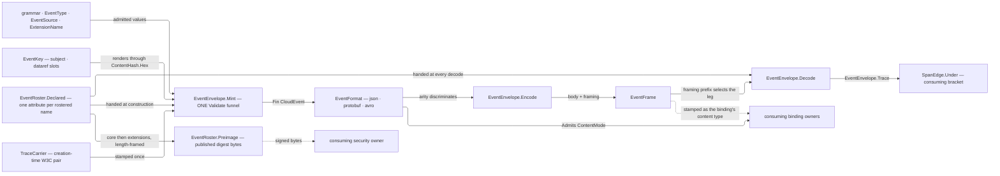

# [RASM_EVENT]

`Rasm.Domain` (`Domain/Event.cs`) owns the C# branch's ONE CloudEvents 1.0 message-envelope algebra — attribute grammar, extension roster, mint boundary, format contract — which every stratum above composes as an instance. Envelopes ANNOUNCE a fact and gain no authority over it: the producing receipt stays evidence truth and a consumer routes on attributes without opening the payload. Specification owns semantics and `CloudNative.CloudEvents` accelerates it, so a row the package spells narrower lands branch-owned beside that package surface.

Bindings, filters, subscriptions, and `dataref` residence policy seat at their consuming owners; nothing transport-shaped enters. Settled vocabulary arrives from siblings: `Op` and the `Fault` band from `rails.md`, the `UInt128` content key AND its one hex projection (`ContentHash.Hex`/`ContentHash.Admit`) from `identity.md`, `TraceCarrier` and `SpanEdge` from `telemetry.md` `[05]-[SIGNAL_TAP]`. Grammar segment `<domain>` is the capability subject every `rasm.*` metric name carries, so the branch conformance minter resolves it and this page publishes the segment that gate reads.

## [01]-[INDEX]

- [02]-[EVENT_GRAMMAR]: `EventType`, `EventSource`, `EventKey`, and `ExtensionName` — the four admitted attribute vocabularies and their segment projections.
- [03]-[EXTENSION_ROSTER]: `EventExtension` rows composing the package's own standard-extension attributes beside the branch-declared ones, `DataGrade` the handling classes, `EventRoster` the one declared set, and the digest preimage's published alphabetical order.
- [04]-[ENVELOPE_MINT]: `EventMint` the admitted construction shape, `EventEnvelope.Mint` and its `Raise` inverse over the one `Validate()` funnel, and `EventCarrier` the propagation accessor pair.
- [05]-[FORMAT_CONTRACT]: `EventFormat` rows over JSON, Protobuf, and Avro with their framing derivation and content-mode gate, `EventFrame` the body-and-framing carrier, and the one encode/decode pair.
- [06]-[DENSITY_BAR]: one owner per axis.

## [02]-[EVENT_GRAMMAR]

- Owner: `EventType` the `rasm.<domain>.<subject>.<fact>.v<N>` key with its four segment projections; `EventSource` the producing capability's URI-reference under the `rasm:<domain>/<capability>` spelling; `EventKey` the attribute-space seat naming which slots carry a content key and labelling a refusal with the slot it arrived in, its rendering and its admission both `identity.md`'s; `ExtensionName` the extension-name ceiling the specification fixes and the package omits.
- Entry: each vocabulary carries one composed mint and one wire admission — `EventType.Of(domain, subject, fact, major)` assembles from segments so no caller concatenates, and the generated `Create`/`TryCreate` pair admits producer text; `EventKey.Render` is the sole outbound spelling and `EventKey.Admit` the sole inbound gate, each one hop onto the digest owner.
- Law: `<fact>` reads past tense and `v<N>` moves only on a breaking `dataschema` change, so a compatible widening leaves every standing subscription matching; `EventType.At` derives the successor major from the same value rather than re-assembling one, so a deprecation row names its successor without a second concatenation.
- Law: `source` names the producing CAPABILITY and never a host, package, or deployment — a redeployment that re-authors the identity consumers keyed on is the failure the `rasm:` scheme and its two-segment path foreclose, since neither segment has a spelling an environment can move.
- Law: `(source, id)` is the uniqueness composite every dedup and idempotency key reads, so `id` carries the producer's OPERATION identity and never a content digest; the content key rides `subject` and, where the payload externalizes, `dataref`.
- Law: admission proves the ROUND TRIP, never the parse — a bare `UInt128.TryParse` admits upper-case and short forms this fabric never emits, so `"A"` and a full-width key ending `0a` collapse onto one dedup key while both read correct in isolation. That proof has ONE owner at `identity.md`: `ContentHash.Hex` renders and `ContentHash.Admit` refuses the spellings the outbound half cannot produce, and this page re-declares neither the `x32` literal nor the case rule.
- Law: the specification bounds an extension name at twenty lowercase alphanumeric characters and `CloudEventAttribute.CreateExtension` enforces the alphabet with no ceiling, so the ceiling is branch-owned here and a peer name past it is IGNORED at decode rather than faulting the whole message.
- Packages: Thinktecture.Runtime.Extensions, CloudNative.CloudEvents, LanguageExt.Core (`Fin`, `MapFail`), BCL inbox (`System.Buffers`, `System.Globalization`).
- Growth: a new attribute vocabulary is one value object on this cluster; a new capability subject is one row on the branch conformance roster and none here, because this grammar validates the segment's SHAPE and the minter resolves its MEMBERSHIP.
- Boundary: `EventType.Domain` is the segment `[08]-[OBSERVABILITY_CONFORMANCE]`'s naming gate resolves against the branch roster at the conformance minter, so an unrostered subject refuses at that declaration owner rather than reaching a broker; this page never names that roster, because a kernel page holding an app-platform vocabulary inverts the strata. `EventKey` is a wire PROJECTION of `identity.md`'s `UInt128` currency and mints no second identity space — `ContentHash` stays the only digest owner and the only renderer of one, so 32 lowercase hex whose ordinal text ordering agrees with the numeric ordering is what a `subject` join, a `dataref` tail, and a dedup key all compare as text with no base conversion. What seats HERE is the attribute-space fact — which slots carry a key and which fault a refusal names — because the digest owner knows nothing of envelopes.

```csharp signature
// --- [RUNTIME_PRELUDE] ----------------------------------------------------------------------
using System.Buffers;
using System.Globalization;
using CloudNative.CloudEvents;

namespace Rasm.Domain;

// --- [TYPES] --------------------------------------------------------------------------------
[ValueObject<string>]
[KeyMemberEqualityComparer<ComparerAccessors.StringOrdinal, string>]
[KeyMemberComparer<ComparerAccessors.StringOrdinal, string>]
public readonly partial struct EventType {
    private const string Prefix = "rasm";

    static partial void ValidateFactoryArguments(ref ValidationError? validationError, ref string value) =>
        validationError = value.Split('.') is [Prefix, var domain, var subject, var fact, ['v', .. var major]]
            && Segment(domain) && Segment(subject) && Segment(fact)
            && int.TryParse(major, NumberStyles.None, CultureInfo.InvariantCulture, out int parsed) && parsed > 0
            ? null
            : new ValidationError(message: $"EventType requires the rasm.<domain>.<subject>.<fact>.v<N> grammar: {value}");

    public static EventType Of(string domain, string subject, string fact, int major) =>
        Create(value: string.Create(CultureInfo.InvariantCulture, $"{Prefix}.{domain}.{subject}.{fact}.v{major}"));

    public string Domain => Part(index: 1);
    public string Subject => Part(index: 2);
    public string Fact => Part(index: 3);

    // The skipped glyph is the `'v'` the validator's own `['v', .. var major]` pattern matched, so this projection
    // is total on an admitted value and needs no fallback arm to forge.
    public int Major => int.Parse(Part(index: 4).AsSpan(start: 1), NumberStyles.None, CultureInfo.InvariantCulture);

    public EventType At(int major) => Of(domain: Domain, subject: Subject, fact: Fact, major: major);

    private string Part(int index) => Value.Split('.')[index];

    private static bool Segment(string text) =>
        text.Length > 0 && !text.AsSpan().ContainsAnyExcept(SegmentGlyphs);

    private static readonly SearchValues<char> SegmentGlyphs = SearchValues.Create("abcdefghijklmnopqrstuvwxyz0123456789-");
}

[ValueObject<string>]
[KeyMemberEqualityComparer<ComparerAccessors.StringOrdinal, string>]
[KeyMemberComparer<ComparerAccessors.StringOrdinal, string>]
public readonly partial struct EventSource {
    private const string Scheme = "rasm:";

    // The authority is EMPTY by construction, so no host or deployment can enter an identity a consumer keyed on.
    static partial void ValidateFactoryArguments(ref ValidationError? validationError, ref string value) =>
        validationError = value.StartsWith(Scheme, StringComparison.Ordinal)
            && value[Scheme.Length..].Split('/') is [{ Length: > 0 } domain, { Length: > 0 } capability]
            && !domain.AsSpan().ContainsAnyExcept(PathGlyphs) && !capability.AsSpan().ContainsAnyExcept(PathGlyphs)
            && Uri.TryCreate(value, UriKind.Absolute, out _)
            ? null
            : new ValidationError(message: $"EventSource requires the rasm:<domain>/<capability> spelling: {value}");

    public static EventSource Of(string domain, string capability) => Create(value: $"{Scheme}{domain}/{capability}");

    // `Uri` is the envelope slot, and admission already proved this text parses as one, so the crossing renders
    // without a rail and no consuming seam re-parses the value.
    public Uri Reference => new(uriString: Value, uriKind: UriKind.Absolute);

    private static readonly SearchValues<char> PathGlyphs = SearchValues.Create("abcdefghijklmnopqrstuvwxyz0123456789-.");
}

[ValueObject<string>]
[KeyMemberEqualityComparer<ComparerAccessors.StringOrdinal, string>]
[KeyMemberComparer<ComparerAccessors.StringOrdinal, string>]
public readonly partial struct ExtensionName {
    public const int Ceiling = 20;

    static partial void ValidateFactoryArguments(ref ValidationError? validationError, ref string value) =>
        validationError = value.Length is > 0 and <= Ceiling && !value.AsSpan().ContainsAnyExcept(NameGlyphs)
            ? null
            : new ValidationError(message: $"ExtensionName requires 1-{Ceiling} lowercase alphanumeric glyphs: {value}");

    // Declaration and admission in ONE spelling: a rostered row mints its attribute through this entry, and a peer
    // name arriving at a decode takes the `TryCreate` half whose `false` IS the ignore verdict.
    public CloudEventAttribute Extension(CloudEventAttributeType type) =>
        CloudEventAttribute.CreateExtension(name: Value, type: type);

    private static readonly SearchValues<char> NameGlyphs = SearchValues.Create("abcdefghijklmnopqrstuvwxyz0123456789");
}

// --- [OPERATIONS] ---------------------------------------------------------------------------
// The attribute-space seat over `identity.md`'s rendering: `subject`, `dataref`, and a dedup key are the slots a
// content key reaches, and a text that fails the digest owner's round-trip proof faults NAMING that slot rather
// than as a bare input refusal a caller cannot attribute to an attribute.
public static class EventKey {
    public static string Render(UInt128 digest) => ContentHash.Hex(digest: digest);

    public static Fin<UInt128> Admit(ReadOnlySpan<char> hex, Op key) =>
        ContentHash.Admit(hex: hex, key: key).MapFail(_ => new KernelFault.InvalidValue(
            Label: nameof(EventKey), Requirement: "thirty-two lowercase hex digits round-tripping their own rendering", Key: Some(key)));
}
```

## [03]-[EXTENSION_ROSTER]

- Owner: `EventExtension` the closed row family over every attribute the estate declares, each row carrying the `CloudEventAttribute` the wire binds and the `Digested` column deciding whether it enters the signing preimage; `BrokerReach` the three-valued reach a handling class may take across bindings; `DataGrade` the closed handling-class family the `dataclassification` row carries; `EventRoster` the one declared set handed at construction and at every decode, its resolution entry, and the published digest order.
- Cases: the roster's UPSTREAM is the CloudEvents documented-extensions registry for eleven rows (`traceparent`/`tracestate`/`baggage` from Distributed Tracing, `partitionkey`, `sequence`/`sequencetype`, `sampledrate`, `dataref`, `dataclassification`, `recordedtime`, `expirytime`) and this branch for the remaining five (`severity`, `correlation`, `deprecation`, `authcontext`, `dssematerial`), which is the split the charter's "a row the package spells narrower lands branch-owned" states — a registry row is transcribed at the registry's own name and type, never re-authored. Concerns a package helper owns carry that helper's OWN attribute singleton (`Partitioning.PartitionKeyAttribute`, `Sampling.SampledRateAttribute`, `Sequence.SequenceAttribute`/`SequenceTypeAttribute`), so this roster and each helper's `AllAttributes` are one object set and a hand-spelled twin has no construction path; every remaining concern mints through `ExtensionName.Extension`, which the package's own factory backs. `DataGrade` closes on four handling classes, each carrying its redaction obligation and one `BrokerReach` row.
- Entry: `EventExtension.Read<T>` and `Write<T>` are the one typed accessor pair over the row's attribute — absence answers `None` on the success rail, a value the attribute's own validator refuses answers a keyed fault, and a `T` outside the attribute's declared `ClrType` answers a second; `EventRoster.Declared` is the enumerable every mint and every decode takes, and `EventRoster.Resolve` the ignore-shaped lookup a peer name crosses.
- Auto: a roster spelled at one end alone is the silent-decode defect this family forecloses — a decoder without the declared set reads a typed extension as an untyped string, so `Declared` folds from `Items` and both directions take that one value; an over-length or unknown peer name resolves `None` and the message stands, because a whole-message fault over a name a peer added is the availability defect the specification's own ignore rule forecloses.
- Output: `EventRoster.Preimage` publishes the canonical digest BYTES — the specification's core attributes alphabetical, then the rostered extensions alphabetical, each value rendered through the attribute's own `Format` and every field length-framed. Two groups in that order is the estate-wide published order every branch's signer and every verifier reads; a signer walking `GetPopulatedAttributes` directly derives bytes from an unordered container and two runtimes then disagree on a value neither computed wrongly, while a single merged sort interleaves an extension between two core names and forks the digest against every peer runtime. FRAMING is `CanonicalWriter`'s and this page composes it — `Rows` count-frames, `String` length-frames, both int32-LE — so the branch keeps one preimage codec (branch RULINGS `[02]`) and a hand writer beside it cannot drift; the retaining mint is what hands the bytes back, since a signer needs the preimage and not only its key.
- Law: `dataclassification` carries a `DataGrade` key and never free text — `Redact` states whether the payload must cross the redaction route before egress, `Broker` states HOW FAR the class reaches across bindings, so a binding refuses the class rather than each sink re-deciding it. Reach is three-valued because the grade table names three reaches: a bool made `public` and `internal` byte-identical rows and left `restricted`'s estate-trusted reach with no value at all. Grades JOIN the branch's standing redaction taxonomy as `(taxonomy, value)` text on the federation that taxonomy already proves at boot, so no compliance type enters this assembly and no parallel grade set exists beside the one the redaction root resolves against.
- Law: `Redact` and `Broker` are INDEPENDENT policy columns, each read by a different gate on a different owner, and no legal-corner law binds them — the redaction route reads the obligation, the binding reads the reach, and neither reconstructs the other's answer — so they stay two columns rather than one `CapabilitySet`, whose set algebra would erase exactly the per-gate read that makes each load-bearing.
- Law: `sequence` is the ONE row whose write and read stay branch-owned against a package that owns the roster — `Sequence.SetSequence` throws on any value but `int` and `GetSequenceValue` parses the `Integer` type through that same surrogate, so a per-source position past `int` has no spelling through the helper while the specification types the attribute as a String whose `sequencetype` names its domain. Attributes compose from the helper; the value crossing does not.
- Law: the creation-time trace and the transport carrier are DISTINCT legs — `traceparent`/`tracestate`/`baggage` on this roster carry the trace live when the fact was minted, and the binding's own headers carry the current hop, so folding either onto the other loses the leg it alone records.
- Packages: CloudNative.CloudEvents, Thinktecture.Runtime.Extensions, LanguageExt.Core, `Rasm.Numerics` (`EpsilonPolicy`), BCL inbox (`System.Collections.Frozen`).
- Growth: a new estate-wide attribute is one `EventExtension` row with its type, its ceiling-checked name, and its `Digested` column, and every mint, decode, accessor, and preimage reads it with no second edit; a dimension a future SDK helper takes over swaps that row's attribute expression to the helper's singleton and nothing else moves.
- Boundary: rows declare the estate's OWN attribute space and never a peer's — an attribute a foreign producer adds is a `Resolve` miss carrying an untyped string, which is exactly the state the specification's ignore rule describes; per-binding policy for `dataref` (`threshold`, `residence`, `retain`, `dual`) seats at each consuming binding owner, so this roster carries the attribute and none of the five columns that decide when it ships.

| [INDEX] | [EXTENSION]                | [CARRIES]                                    | [UPSTREAM] |
| :-----: | :------------------------- | :------------------------------------------- | :--------- |
|  [01]   | `traceparent` `tracestate` | the creation-time W3C trace                  | registry   |
|  [02]   | `baggage`                  | the creation-time W3C baggage                | registry   |
|  [03]   | `partitionkey`             | the member a transport partitions on         | registry   |
|  [04]   | `sequence` `sequencetype`  | the per-source position and its domain       | registry   |
|  [05]   | `sampledrate`              | the producer's sampling denominator          | registry   |
|  [06]   | `dataref`                  | the externalized payload's content key       | registry   |
|  [07]   | `dataclassification`       | the handling class gating each binding       | registry   |
|  [08]   | `recordedtime`             | the receiver's ingest instant                | registry   |
|  [09]   | `expirytime`               | the instant past which delivery is moot      | registry   |
|  [10]   | `severity`                 | the fact's own operational grade             | branch     |
|  [11]   | `correlation`              | the causal chain a consumer joins on         | branch     |
|  [12]   | `deprecation`              | the superseding `type` and its window        | branch     |
|  [13]   | `authcontext`              | the producer's asserted principal            | branch     |
|  [14]   | `dssematerial`             | the DSSE envelope over the attribute digests | branch     |

| [INDEX] | [GRADE]      | [REDACT]             | [BROKER]  | [REACH]                              |
| :-----: | :----------- | :------------------- | :-------- | :----------------------------------- |
|  [01]   | `public`     | no obligation        | `every`   | every binding                        |
|  [02]   | `internal`   | no obligation        | `trusted` | estate-trusted bindings alone        |
|  [03]   | `restricted` | redaction route runs | `trusted` | estate-trusted bindings alone        |
|  [04]   | `secret`     | redaction route runs | `barred`  | no binding — reference-only carriage |

```csharp signature
// --- [RUNTIME_PRELUDE] ----------------------------------------------------------------------
using System.Collections.Frozen;
using CloudNative.CloudEvents;
using CloudNative.CloudEvents.Extensions;
using Rasm.Numerics;

namespace Rasm.Domain;

// --- [TYPES] --------------------------------------------------------------------------------
// THREE reaches, three rows: under a bool, `public` and `internal` were byte-identical and `restricted`'s
// estate-trusted reach had no value to inhabit, so the third case stranded exactly as `bool?` strands one
// (`Rasm` RULINGS `[02]`). WHICH bindings the trusted row admits is each binding owner's own trust column, because
// trust is a property of the transport a kernel cannot see; this roster fixes how far a class may reach at all.
[SmartEnum<string>]
[KeyMemberEqualityComparer<ComparerAccessors.StringOrdinal, string>]
[KeyMemberComparer<ComparerAccessors.StringOrdinal, string>]
public sealed partial class BrokerReach {
    public static readonly BrokerReach Every = new("every");
    public static readonly BrokerReach Trusted = new("trusted");
    public static readonly BrokerReach Barred = new("barred");
}

[SmartEnum<string>]
[KeyMemberEqualityComparer<ComparerAccessors.StringOrdinal, string>]
[KeyMemberComparer<ComparerAccessors.StringOrdinal, string>]
public sealed partial class DataGrade {
    public static readonly DataGrade Public = new("public", redact: false, broker: BrokerReach.Every);
    public static readonly DataGrade Internal = new("internal", redact: false, broker: BrokerReach.Trusted);
    public static readonly DataGrade Restricted = new("restricted", redact: true, broker: BrokerReach.Trusted);
    public static readonly DataGrade Secret = new("secret", redact: true, broker: BrokerReach.Barred);

    public static string Taxonomy => EventExtension.DataClassification.Key;

    public bool Redact { get; }

    public BrokerReach Broker { get; }
}

[SmartEnum<string>]
[KeyMemberEqualityComparer<ComparerAccessors.StringOrdinal, string>]
[KeyMemberComparer<ComparerAccessors.StringOrdinal, string>]
public sealed partial class EventExtension {
    // Package-owned rows bind the helper's OWN singleton, so this roster and `Partitioning`, `Sampling`, and
    // `Sequence`'s `AllAttributes` are reference-identical sets rather than agreeing copies.
    public static readonly EventExtension PartitionKey = new("partitionkey", Partitioning.PartitionKeyAttribute, digested: true);
    public static readonly EventExtension SampledRate = new("sampledrate", Sampling.SampledRateAttribute, digested: true);
    public static readonly EventExtension Sequence = new("sequence", Extensions.Sequence.SequenceAttribute, digested: true);
    public static readonly EventExtension SequenceType = new("sequencetype", Extensions.Sequence.SequenceTypeAttribute, digested: true);

    // Each of these mints through the ceiling gate rather than `CreateExtension` directly, so a name the package
    // would admit and a conforming peer would refuse cannot reach a wire.
    public static readonly EventExtension TraceParent = new("traceparent", CloudEventAttributeType.String, digested: true);
    public static readonly EventExtension TraceState = new("tracestate", CloudEventAttributeType.String, digested: true);
    public static readonly EventExtension Baggage = new("baggage", CloudEventAttributeType.String, digested: true);
    public static readonly EventExtension DataRef = new("dataref", CloudEventAttributeType.UriReference, digested: true);
    public static readonly EventExtension DataClassification = new("dataclassification", CloudEventAttributeType.String, digested: true);
    public static readonly EventExtension RecordedTime = new("recordedtime", CloudEventAttributeType.Timestamp, digested: true);
    public static readonly EventExtension ExpiryTime = new("expirytime", CloudEventAttributeType.Timestamp, digested: true);
    public static readonly EventExtension Severity = new("severity", CloudEventAttributeType.String, digested: true);
    public static readonly EventExtension Correlation = new("correlation", CloudEventAttributeType.String, digested: true);
    public static readonly EventExtension Deprecation = new("deprecation", CloudEventAttributeType.String, digested: true);
    public static readonly EventExtension AuthContext = new("authcontext", CloudEventAttributeType.String, digested: true);

    // Signatures never sign themselves: excluding this row makes the preimage reproducible at the verifier, which
    // holds the envelope AFTER the attribute landed and must rebuild the bytes without it.
    public static readonly EventExtension DsseMaterial = new("dssematerial", CloudEventAttributeType.Binary, digested: false);

    private EventExtension(string key, CloudEventAttributeType type, bool digested) : this(key, ExtensionName.Create(value: key).Extension(type: type), digested) { }

    public CloudEventAttribute Attribute { get; }

    public bool Digested { get; }

    // The GETTER re-runs the attribute's own validator and THROWS on a value whose CLR type the row refuses —
    // precisely what an envelope decoded WITHOUT this roster carries, where an untyped string sits under a
    // `Timestamp` or `UriReference` row and every read of it raises. Both directions therefore cross `Op.Catch`.
    public Fin<Option<T>> Read<T>(CloudEvent envelope, Op key) =>
        key.Catch(() => envelope[Attribute] switch {
            null => Fin.Succ(Option<T>.None),
            T held => Fin.Succ(Some(held)),
            var foreign => Fin.Fail<Option<T>>(new KernelFault.InvalidValue(
                Label: Key, Requirement: $"a {Attribute.Type.ClrType.Name} value, not {foreign.GetType().Name}", Key: Some(key))),
        });

    // The indexer MUTATES the envelope in place and its assignment runs the attribute's own throwing validator, so
    // the verdict is `Unit`: returning the same reference the caller already holds would state a substitution the
    // write never made and let a caller believe an unstamped envelope survived a refusal.
    public Fin<Unit> Write<T>(CloudEvent envelope, T value, Op key) where T : notnull =>
        key.Catch(() => { envelope[Attribute] = value; return Fin.Succ(unit); });
}

// --- [SERVICES] -----------------------------------------------------------------------------
public static class EventRoster {
    // Both projections are ACCESSOR-backed: the generated owner populates `Items` from its own static constructor,
    // so an eager `static readonly` fold here can run against an empty roster and freeze nothing at all
    // (`docs/stacks/csharp/shapes.md` `[LOOKUP_LIFECYCLE]`).
    public static Seq<CloudEventAttribute> Declared => DeclaredRows.Value;

    private static readonly Lazy<Seq<CloudEventAttribute>> DeclaredRows =
        new(static () => toSeq(EventExtension.Items).Map(static row => row.Attribute).Strict());

    private static readonly Lazy<FrozenDictionary<string, EventExtension>> Rows =
        new(static () => EventExtension.Items.ToFrozenDictionary(static row => row.Key, static row => row, StringComparer.Ordinal));

    public static Option<EventExtension> Resolve(string? name) =>
        Optional(name).Bind(spelled => Rows.Value.TryGetValue(spelled, out EventExtension? row) ? Some(row) : None);

    // ONE walk of `GetPopulatedAttributes`, split by the value's own `IsExtension` rather than by a flag a caller
    // re-supplies; an unrostered peer name is EXCLUDED because a foreign extension entering one runtime's preimage
    // and not another's forks the digest the moment a peer adds one.
    // LENGTH FRAMING is the WRITER's, byte for byte: `Rows` leads with the int32-LE pair count and `String` frames
    // each field as its int32-LE UTF-8 byte width followed by those bytes, which is exactly the framing this page
    // hand-spelled over a buffer writer. The tolerance is inert on a string-only stream and rides the grid-free
    // anchor the sibling `ContentHash.Of` entry supplies, so no second quantization enters this digest.
    public static Fin<ReadOnlyMemory<byte>> Preimage(CloudEvent envelope, Op key) {
        Seq<KeyValuePair<CloudEventAttribute, object>> populated = toSeq(envelope.GetPopulatedAttributes()).Strict();
        return CanonicalWriter.Retaining(tolerance: EpsilonPolicy.ZeroTolerance)
            .Rows(
                rows: Ordered(populated.Filter(static row => !row.Key.IsExtension))
                    + Ordered(populated.Filter(static row => row.Key.IsExtension && Digested(row.Key.Name))),
                field: static (row, writer) => writer.String(row.Name).String(row.Value))
            .ToBytes(key: key);
    }

    private static bool Digested(string name) => Resolve(name).Map(static row => row.Digested).IfNone(false);

    // An ordered LINQ run carries no LanguageExt carrier, so `toSeq` is the one re-entry back onto the rail.
    private static Seq<(string Name, string Value)> Ordered(Seq<KeyValuePair<CloudEventAttribute, object>> rows) =>
        toSeq(rows.Map(static row => (Name: row.Key.Name, Value: row.Key.Format(row.Value)))
                  .OrderBy(static row => row.Name, StringComparer.Ordinal))
            .Strict();
}
```

## [04]-[ENVELOPE_MINT]

- Owner: `EventMint` the whole admitted construction shape — required grammar values, the optional context attributes, the payload, the creation-time trace, and the rostered extension writes — and `EventEnvelope` the one mint entry the branch has; `EventCarrier` the accessor pair the app-platform propagation seam binds its generic inject and extract against.
- Entry: `EventEnvelope.Mint(request, key)` returns `Fin<CloudEvent>` and `EventEnvelope.Raise(attributes, data, dataType, key)` is its binary-mode inverse over already-unprefixed carrier pairs; `EventEnvelope.Trace(envelope, key)` projects the creation-time pair back as a `TraceCarrier` the consuming bracket folds through `SpanEdge.Under`.
- Auto: the mint is a BOUNDARY, not a projection — `CloudEvent.Validate()` throws on a malformed envelope, so construction, every rostered extension write, and the validation all funnel through the one `Op.Catch` and a caller composing facts never has a construction fault escape past its own `Fin` signature. Extension writes fold on the rail and the first refusal is the verdict.
- Law: the SDK indexer stamps IN PLACE, so a refused write leaves the instance partly stamped; what the rail guarantees is that such an instance is UNREACHABLE — `Mint` holds the only reference until `Validate()` returns it, and a refusal returns no envelope at all. A rail claiming the stronger "no half-stamped envelope exists" would be a law with no producer.
- Law: the trace stamped here is the CREATION-time trace and nothing else — an absent carrier stamps nothing and the envelope stays valid, so an untraced producer emits a conforming message rather than an empty header, and a transport that later rewrites these attributes from its publish fiber makes the arriving event claim a trace the producing receipt never recorded.
- Law: `datacontenttype` and `dataschema` are ROW DATA off the serdes arrow that produced the body — a literal at the mint site describes the producer's guess, and an unconditional `application/octet-stream` over a body that is Avro, JSON, or Protobuf under a registry frame is the shape that makes a consumer decode by convention rather than by declaration; the pair rides together for that reason and both collapse to the SDK's nullable slot at the one crossing, exactly as the optional `subject` does and exactly as `Trace` collapses onto `TraceCarrier`'s own declared nullable pair — every `null` on this page is a landed sibling's slot type reached at its one crossing, never an absence spelling this owner publishes.
- Law: `recordedtime` is the RECEIVER's stamp and never the producer's, so the mint carries no slot for it and the ingress leg writes the row; collapsing it onto `time` erases the queue the pair exists to measure.
- Law: `subject` is OPTIONAL under a non-empty validator, so a fact whose payload carries no content key omits the slot — a required slot makes every lifecycle and topic producer fabricate an address, and the empty string such a producer reaches for is the one value the specification's own validator refuses.
- Law: `EventCarrier` publishes ABSENCE on both halves and never `null` or `void` — an unrostered field and a value the row's own parser refuses are the specification's ignore rule, and stating them as `Option` lets the propagator adapter at the app platform decide what its text-map contract does with a miss. The `string?`/`void` shapes that contract wants are the ADAPTER's, minted where the propagator is registered, because a kernel owner spelling them publishes a second absence vocabulary every consumer must learn beside `Read<T>`'s.
- Receipt: none minted — the message envelope PROJECTS the producing rail's own typed receipt and adds address, trace, and handling facts alone; a parallel event ledger beside those receipts is the deleted form.
- Packages: CloudNative.CloudEvents, Generator.Equals, LanguageExt.Core, NodaTime, BCL inbox (`System.Net.Mime`).
- Growth: a new envelope dimension is one `EventExtension` row and one `Extensions` entry at the composing rail, never a mint parameter; a new payload shape is a `Data` value and a `datacontenttype` row, because the mint names no payload type at all. A new REQUIRED column on `EventMint` is the one growth this shape cannot prove — the eight-slot correspondence to `CloudEvent` is hand-written and a tenth column reaching no slot compiles, so the column lands with its initializer line in the same edit. A `[Mapper]` here is REFUSED: three `Option`-to-nullable collapses and two projections leave no reader-free mapping, and the `Op.Catch` funnel, the extension fold, and `Validate()` all stay outside any generated body.
- Boundary: mint sites are the composing rails at each stratum and this page fires none — an envelope emitter is an `observe` subscription over fired hook facts, so an emit inside a domain fold is the rejected form and the hook capsule at `Domain/hooks.md` `[02]-[HOOK_POINT]` owns the modality. `EventCarrier` supplies the accessors and holds no field names: the registered W3C composite decides which fields cross, so a propagator gaining a field reaches this carrier with no edit, and a field the roster does not declare drops on write rather than minting an undeclared attribute every decode reads untyped.

```csharp signature
// --- [RUNTIME_PRELUDE] ----------------------------------------------------------------------
using System.Net.Mime;
using CloudNative.CloudEvents;
using Generator.Equals;
using NodaTime;

namespace Rasm.Domain;

// --- [MODELS] -------------------------------------------------------------------------------
// Ordered equality is DECLARED because a `Seq` member under synthesized record equality compares by REFERENCE, so
// two structurally identical mint requests would otherwise read unequal.
[Equatable]
public sealed partial record EventMint(
    EventType Type,
    EventSource Source,
    string Id,
    Option<string> Subject,
    Instant Time,
    Option<Uri> DataSchema,
    Option<string> DataContentType,
    object? Data,
    TraceCarrier Trace,
    [property: OrderedEquality] Seq<(EventExtension Row, object Value)> Extensions);

// --- [OPERATIONS] ---------------------------------------------------------------------------
public static class EventEnvelope {
    public static Fin<CloudEvent> Mint(EventMint request, Op key) =>
        from envelope in key.Catch(() => Fin.Succ(new CloudEvent(CloudEventsSpecVersion.V1_0, EventRoster.Declared) {
            Id = request.Id,
            Source = request.Source.Reference,
            Type = request.Type.ToString(),
            Subject = request.Subject.IfNoneUnsafe(default(string)),
            Time = request.Time.ToDateTimeOffset(),
            DataSchema = request.DataSchema.IfNoneUnsafe(default(Uri)),
            DataContentType = request.DataContentType.IfNoneUnsafe(default(string)),
            Data = request.Data,
        }))
        from _ in Traced(envelope: envelope, carrier: request.Trace, key: key)
        from __ in request.Extensions.TraverseM(row => row.Row.Write(envelope: envelope, value: row.Value, key: key)).As()
        from validated in key.Catch(() => Fin.Succ(envelope.Validate()))
        select validated;

    private static Fin<Unit> Traced(CloudEvent envelope, TraceCarrier carrier, Op key) =>
        from _ in Optional(carrier.TraceParent).Match(
            Some: parent => EventExtension.TraceParent.Write(envelope: envelope, value: parent, key: key),
            None: () => Fin.Succ(unit))
        from __ in Optional(carrier.TraceState).Filter(static state => state.Length > 0).Match(
            Some: state => EventExtension.TraceState.Write(envelope: envelope, value: state, key: key),
            None: () => Fin.Succ(unit))
        select unit;

    // A binary-mode binding hands ALREADY-UNPREFIXED pairs, so this owner learns no prefix, header shape, or
    // placement and no second envelope construction exists inside this branch.
    public static Fin<CloudEvent> Raise(Seq<(string Name, string Value)> attributes, ReadOnlyMemory<byte> data,
        Option<ContentType> dataType, Op key) =>
        key.Catch(() => Fin.Succ(attributes.Fold(
            new CloudEvent(CloudEventsSpecVersion.V1_0, EventRoster.Declared) {
                Data = data,
                DataContentType = dataType.Map(static type => type.ToString()).IfNoneUnsafe(default(string)),
            },
            static (held, row) => Admitted(envelope: held, name: row.Name, value: row.Value)).Validate()));

    // Core names resolve on the SPECIFICATION's own spec-version roster and every other name rides the carrier, so
    // one lookup covers both attribute spaces. A CORE value its own attribute refuses RAISES into the enclosing
    // funnel because `Validate()` refuses that envelope anyway; an extension name unrostered or refused answers
    // absence, which IS the specification's ignore rule and the difference between one peer's malformed header and a darkened delivery.
    private static CloudEvent Admitted(CloudEvent envelope, string name, string value) {
        ignore(Optional(envelope.SpecVersion.GetAttribute(name)).Match(
            Some: core => ignore(envelope[core] = core.Parse(value)),
            None: () => ignore(EventCarrier.Write(envelope: envelope, field: name, value: value))));
        return envelope;
    }

    // A decode that could not read causality still delivers, so a refused or absent half answers absence here rather than failing the message the pair only annotates.
    public static TraceCarrier Trace(CloudEvent envelope, Op key) =>
        new(TraceParent: Held(envelope: envelope, row: EventExtension.TraceParent, key: key),
            TraceState: Held(envelope: envelope, row: EventExtension.TraceState, key: key));

    private static string? Held(CloudEvent envelope, EventExtension row, Op key) =>
        row.Read<string>(envelope: envelope, key: key)
            .Match(Succ: static held => held.IfNoneUnsafe(default(string)), Fail: static _ => default(string));
}

// Both halves cross the attribute's OWN canonical codec — `Format` renders a `Timestamp`, a `UriReference`, and a
// `Binary` row as the wire's exact text and `Parse` admits it back — so the pair stays TOTAL over this roster where
// a raw `string` assignment serves String-typed rows alone and raises on every other row declared here.
public static class EventCarrier {
    public static Option<string> Read(CloudEvent envelope, string field) =>
        EventRoster.Resolve(field).Bind(row => Optional(envelope[row.Attribute]).Map(row.Attribute.Format));

    // Absence names the row that did NOT land — an unrostered field or a value the row's own parser refused.
    public static Option<EventExtension> Write(CloudEvent envelope, string field, string value) =>
        EventRoster.Resolve(field).Bind(row => Op.Of(name: nameof(EventCarrier))
            .Catch(() => Fin.Succ(envelope[row.Attribute] = row.Attribute.Parse(value)))
            .ToOption()
            .Map(_ => row));
}
```

## [05]-[FORMAT_CONTRACT]

- Owner: `EventFormat` the closed row family over the three admitted event formats, each carrying its media-type suffix, its content-mode reach, its batch column, and the one formatter instance that IS the codec identity every binding shares; `EventFrame` the encoded body beside the framing the formatter chose; `EventEnvelope`'s encode and decode pair over both.
- Cases: three formats and two framings — JSON reaches structured, binary, and batch; Protobuf reaches all three with its data restricted to a message, a string, or bytes; Avro reaches structured alone, because the specification's Avro event format defines no batch envelope and no binary content mode, and the formatter answers `NotSupportedException` on both. Framing derives from `MimeUtilities.MediaType` and `BatchMediaType` with the row's suffix, so no literal media type is spelled anywhere.
- Entry: `EventEnvelope.Encode(format, key, envelopes)` discriminates on the span's ARITY — one envelope emits the structured body, two or more the batch body — and `EventEnvelope.Decode(frame, key)` consumes that same carrier, the framing's own prefix selecting the batch leg and both legs landing one `Seq`; `format.Admits(mode, key)` is the content-mode gate a binding crosses before it stamps a single header.
- Auto: an empty span is neither framing and is not a message — the batch encoder renders an empty array that decodes back as a batch which carried nothing, indistinguishable at the consumer from a broker that dropped every member — so the arity is a THIRD state the entry refuses; a batch asked of a non-batching format and a binary mode asked of a structured-only one each refuse on the row's own column, so the verdict names the format rather than surfacing a package's `NotSupportedException` at a caller's rail.
- Law: `Binary` and `Batches` are INDEPENDENT policy columns with no legal-corner law — the specification decides each per format and the estate's live rows occupy only three of the four corners, so a `CapabilitySet` over them would publish a set algebra no gate reads and erase the per-column refusal each gate states. `Binary` is read HERE by `Admits` rather than only at a binding, because a column whose sole reader lives in another package is a claim this page cannot keep.
- Law: ONE formatter instance per row is the codec identity every transport binding, every mint, and every decode shares — serializer options fix at construction, never per event, and a per-transport or per-event formatter is the rejected form; the JSON row's options identity registers the branch's own converters so a typed payload carrying instants, generated owners, or functional carriers round-trips through the same handle a raw `JsonElement` crosses.
- Law: duplicate JSON object keys are REFUSED at both levels — `JsonDocumentOptions.AllowDuplicateProperties` gates the envelope's own attribute object and `JsonSerializerOptions.AllowDuplicateProperties` gates a typed payload, and both default to admitting duplicates on this runtime, so an unset pair decodes a twice-emitted attribute as last-write-wins with no party raising.
- Law: the Protobuf format's generated envelope message shares the simple name `CloudEvent` with the SDK's own envelope, so every fence touching that surface qualifies both sides; the generated batch message is `CloudNative.CloudEvents.V1.CloudEventBatch`, and `ConvertToProto`/`ConvertFromProto` are the public crossings a registry-framed leg composes instead of re-encoding a body the formatter already holds.
- Law: the Avro formatter's schema is the package's own embedded `RecordSchema` read through the static `AvroSchema` property, and a custom `IGenericRecordSerializer` is the seat where a registry-framed Avro leg binds its own reader and writer — so a schema-registry frame joins the format at that seat and never by re-spelling the envelope schema.
- Boundary: `EventFrame` equality is the CARRIER's — `ReadOnlyMemory<T>` is unreachable to every ordered-equality generator, so two frames compare by the memory's reference and range and never by content; a consumer wanting body identity addresses the bytes through `identity.md`'s `ContentHash` rather than comparing frames. The obsolete top-level `CloudNative.CloudEvents.AvroEventFormatter` never lands — it exists for backward compatibility, carries `[Obsolete]`, and derives from the namespaced formatter this page names; CBOR and XML are working drafts and take no row. Content mode is a BINDING decision read off these columns through `Admits`, so a binding chooses structured or binary and this contract states which the format can serve; the binding itself, its headers, and its key mapping seat at the consuming owner.
- Packages: CloudNative.CloudEvents, CloudNative.CloudEvents.SystemTextJson, CloudNative.CloudEvents.Protobuf, CloudNative.CloudEvents.Avro, Thinktecture.Runtime.Extensions, Thinktecture.Runtime.Extensions.Json, NodaTime, NodaTime.Serialization.SystemTextJson, LanguageExt.Core, BCL inbox (`System.Net.Mime`, `System.Text.Json`).
- Growth: a new event format is one `EventFormat` row carrying its suffix, its columns, and its formatter instance, and every encode, decode, framing probe, and refusal reads it untouched; a typed payload lane binds `JsonEventFormatter<T>` against the SAME options identity rather than minting a second row.

| [INDEX] | [FORMAT]   | [SUFFIX]    | [STRUCTURED] | [BINARY] | [BATCH] |
| :-----: | :--------- | :---------- | :----------: | :------: | :-----: |
|  [01]   | `json`     | `+json`     |     yes      |   yes    |   yes   |
|  [02]   | `protobuf` | `+protobuf` |     yes      |   yes    |   yes   |
|  [03]   | `avro`     | `+avro`     |     yes      |    no    |   no    |

```csharp signature
// --- [RUNTIME_PRELUDE] ----------------------------------------------------------------------
using System.Net.Mime;
using System.Text.Json;
using CloudNative.CloudEvents;
using CloudNative.CloudEvents.Avro;
using CloudNative.CloudEvents.Core;
using CloudNative.CloudEvents.Protobuf;
using CloudNative.CloudEvents.SystemTextJson;
using NodaTime;
using NodaTime.Serialization.SystemTextJson;
using Thinktecture.Text.Json.Serialization;

namespace Rasm.Domain;

// --- [CONSTANTS] ----------------------------------------------------------------------------
// `AllowDuplicateProperties` defaults TRUE on both shapes at this runtime, so a producer emitting one attribute
// twice decodes last-write-wins with nothing raising; both halves refuse here. Converters register rather than
// re-implement: functional carriers cross through the kernel factory `rails.md` `[08]-[CARRIER_CODEC]` owns,
// generated owners through Thinktecture's factory, and semantic instants through NodaTime's own configuration.
public static class EventJson {
    public static readonly JsonDocumentOptions Documents = new() { AllowDuplicateProperties = false };

    public static readonly JsonSerializerOptions Options = Configured();

    private static JsonSerializerOptions Configured() {
        JsonSerializerOptions options = new(JsonSerializerDefaults.Web) { AllowDuplicateProperties = false };
        options.Converters.Add(new LanguageExtJsonConverterFactory());
        options.Converters.Add(new ThinktectureJsonConverterFactory());
        return options.ConfigureForNodaTime(DateTimeZoneProviders.Tzdb);
    }
}

// --- [TYPES] --------------------------------------------------------------------------------
[SmartEnum<string>]
[KeyMemberEqualityComparer<ComparerAccessors.StringOrdinal, string>]
[KeyMemberComparer<ComparerAccessors.StringOrdinal, string>]
public sealed partial class EventFormat {
    public static readonly EventFormat Json = new(
        "json", "+json", new JsonEventFormatter(EventJson.Options, EventJson.Documents), binary: true, batches: true);

    // Protobuf libraries themselves pack an `Any` under this default type-URL prefix, so a peer reading the packed
    // message resolves its type without knowing this estate exists.
    public static readonly EventFormat Protobuf = new(
        "protobuf", "+protobuf", new ProtobufEventFormatter(ProtobufEventFormatter.DefaultTypeUrlPrefix), binary: true, batches: true);

    public static readonly EventFormat Avro = new(
        "avro", "+avro", new AvroEventFormatter(), binary: false, batches: false);

    public string Suffix { get; }

    public CloudEventFormatter Formatter { get; }

    public bool Binary { get; }

    public bool Batches { get; }

    // Framing DERIVES from the package's own media-type constants, so no literal media type is spelled and a
    // formatter that renames its family moves both spellings at once.
    public string Structured => MimeUtilities.MediaType + Suffix;

    public string Batch => MimeUtilities.BatchMediaType + Suffix;

    // The content-mode gate every binding crosses BEFORE it stamps a header: a format whose specification defines
    // no binary mode refuses here naming the format, where the package answers `NotSupportedException` mid-write with the headers already placed.
    public Fin<Unit> Admits(ContentMode mode, Op key) =>
        mode is not ContentMode.Binary || Binary
            ? Fin.Succ(unit)
            : Fin.Fail<Unit>(new KernelFault.InvalidValue(
                Label: Key, Requirement: "a binary-mode event format", Key: Some(key)));

    // Batch probing reads the PREFIX, so a format's batch sibling needs no second dispatch and no literal.
    public static Option<EventFormat> Of(ContentType framing) =>
        toSeq(Items).Find(row => framing.MediaType.EndsWith(row.Suffix, StringComparison.Ordinal));

    public static bool Batched(ContentType framing) =>
        framing.MediaType.StartsWith(MimeUtilities.BatchMediaType, StringComparison.Ordinal);
}

// --- [MODELS] -------------------------------------------------------------------------------
// Discarding the formatter's `out ContentType` throws away the only evidence distinguishing a structured body from
// a batch array, so the chosen framing travels with the bytes it framed.
[BoundaryAdapter]
public readonly record struct EventFrame(ReadOnlyMemory<byte> Body, ContentType Framing);

// --- [OPERATIONS] ---------------------------------------------------------------------------
public static partial class EventEnvelope {
    public static Fin<EventFrame> Encode(EventFormat format, Op key, params ReadOnlySpan<CloudEvent> envelopes) =>
        envelopes switch {
            [] => Fin.Fail<EventFrame>(new KernelFault.InvalidValue(
                Label: format.Key, Requirement: "at least one envelope to frame", Key: Some(key))),
            [_, _, ..] when !format.Batches => Fin.Fail<EventFrame>(new KernelFault.InvalidValue(
                Label: format.Key, Requirement: "a batching event format", Key: Some(key))),
            _ => Framed(format: format, rows: envelopes.ToArray(), key: key),
        };

    // Exemption: the formatter publishes the framing it chose through an `out` parameter no expression can bind, and
    // a `ReadOnlySpan` cannot enter a closure, so the arity read materializes first and the statement pair is that
    // platform boundary whole — nothing else lives inside it.
    private static Fin<EventFrame> Framed(EventFormat format, CloudEvent[] rows, Op key) =>
        key.Catch(() => {
            ContentType framing;
            ReadOnlyMemory<byte> body = rows is [CloudEvent single]
                ? format.Formatter.EncodeStructuredModeMessage(single, out framing)
                : format.Formatter.EncodeBatchModeMessage(rows, out framing);
            return Fin.Succ(new EventFrame(Body: body, Framing: framing));
        });

    public static Fin<Seq<CloudEvent>> Decode(EventFrame frame, Op key) =>
        EventFormat.Of(frame.Framing)
            .ToFin(new KernelFault.InvalidValue(Label: frame.Framing.MediaType, Requirement: "an admitted event format", Key: Some(key)))
            .Bind(format => key.Catch(() => Fin.Succ(EventFormat.Batched(frame.Framing)
                ? toSeq(format.Formatter.DecodeBatchModeMessage(frame.Body, frame.Framing, EventRoster.Declared))
                : Seq(format.Formatter.DecodeStructuredModeMessage(frame.Body, frame.Framing, EventRoster.Declared)))))
            .Bind(rows => rows.IsEmpty
                ? Fin.Fail<Seq<CloudEvent>>(new KernelFault.InvalidValue(
                    Label: frame.Framing.MediaType, Requirement: "a frame carrying at least one envelope", Key: Some(key)))
                : Fin.Succ(rows));
}
```



## [06]-[DENSITY_BAR]

One owner per axis; capability is a row, case, or column, never a sibling surface, and a consuming stratum composes one instance of this algebra rather than re-declaring a mint.

| [INDEX] | [AXIS_CONCERN]      | [OWNER]                            | [RAIL]                                  |
| :-----: | :------------------ | :--------------------------------- | :-------------------------------------- |
|  [01]   | Type grammar        | `EventType`                        | generated factory + segment projection  |
|  [02]   | Producer identity   | `EventSource`                      | generated factory + `Reference`         |
|  [03]   | Content-key slots   | `EventKey`                         | `Render` / `Admit` onto `ContentHash`   |
|  [04]   | Extension names     | `ExtensionName`                    | generated factory + `Extension`         |
|  [05]   | Extension rows      | `EventExtension`                   | `Read → Fin<Option<T>>` / `Write → Fin` |
|  [06]   | Handling class      | `DataGrade` + `BrokerReach`        | `Redact` obligation / `Broker` reach    |
|  [07]   | Declared roster     | `EventRoster`                      | `Declared` / `Resolve` / framed bytes   |
|  [08]   | Construction shape  | `EventMint`                        | admitted record, no payload type        |
|  [09]   | Mint boundary       | `EventEnvelope.Mint` / `.Raise`    | `Fin<CloudEvent>` over one funnel       |
|  [10]   | Creation-time trace | `EventEnvelope.Trace`              | `TraceCarrier` ⇄ rostered attributes    |
|  [11]   | Propagation seam    | `EventCarrier`                     | `Option`-publishing accessor pair       |
|  [12]   | Format rows         | `EventFormat`                      | suffix + mode columns + `Admits`        |
|  [13]   | Codec options       | `EventJson`                        | one serializer + document identity      |
|  [14]   | Framing carriage    | `EventFrame`                       | body + chosen `ContentType`             |
|  [15]   | Encode / decode     | `EventEnvelope.Encode` / `.Decode` | arity in, framing prefix back           |

## [07]-[RESEARCH]

<!-- source-only: research row template:
[TOKEN]-[OPEN|BLOCKED]: <exact question>; <verification route>.
[SPLIT_MEMBER]-[OPEN]: does `shape-core` expose `split_all`; verify against the member rail.
-->

(none)
