# [RASM_EVENT]

`Rasm.Domain` (`Domain/Event.cs`) owns the C# branch's ONE CloudEvents 1.0 message-envelope algebra — attribute grammar, extension roster, mint boundary, format contract — which every stratum above composes as an instance. Envelopes ANNOUNCE a fact and gain no authority over it: the producing receipt stays evidence truth and a consumer routes on attributes without opening the payload. Specification owns semantics and `CloudNative.CloudEvents` accelerates it, so a row the package spells narrower lands branch-owned beside that package surface.

Bindings, filters, subscriptions, and `dataref` residence policy seat at their consuming owners; nothing transport-shaped enters. Settled vocabulary arrives from siblings: `Op` and the `Fault` band from `rails.md`, `UInt128` content keys from `identity.md`, `TraceCarrier` and `SpanEdge` from `telemetry.md` `[05]-[SIGNAL_TAP]`. Grammar segment `<domain>` is the capability subject every `rasm.*` metric name carries, so the branch conformance minter resolves it and this page publishes the segment that gate reads.

## [01]-[INDEX]

- [02]-[EVENT_GRAMMAR]: `EventType`, `EventSource`, `EventKey`, and `ExtensionName` — the four admitted attribute vocabularies and their segment projections.
- [03]-[EXTENSION_ROSTER]: `EventExtension` rows composing the package's own standard-extension attributes beside the branch-declared ones, `DataGrade` the handling classes, `EventRoster` the one declared set, and the digest preimage's published alphabetical order.
- [04]-[ENVELOPE_MINT]: `EventMint` the admitted construction shape, `EventEnvelope.Mint` and its `Raise` inverse over the one `Validate()` funnel, and `EventCarrier` the propagation getter/setter pair.
- [05]-[FORMAT_CONTRACT]: `EventFormat` rows over JSON, Protobuf, and Avro with their framing derivation, `EventFrame` the body-and-framing carrier, and the one encode/decode pair.
- [06]-[DENSITY_BAR]: one owner per axis.

## [02]-[EVENT_GRAMMAR]

- Owner: `EventType` the `rasm.<domain>.<subject>.<fact>.v<N>` key with its four segment projections; `EventSource` the producing capability's URI-reference under the `rasm:<domain>/<capability>` spelling; `EventKey` the ONE content-key wire spelling the `subject` and `dataref` attributes carry; `ExtensionName` the extension-name ceiling the specification fixes and the package omits.
- Entry: each vocabulary carries one composed mint and one wire admission — `EventType.Of(domain, subject, fact, major)` assembles from segments so no caller concatenates, and the generated `Create`/`TryCreate` pair admits producer text; `EventKey.Render` is the sole outbound spelling and `EventKey.Admit` the sole inbound gate.
- Law: `<fact>` reads past tense and `v<N>` moves only on a breaking `dataschema` change, so a compatible widening leaves every standing subscription matching; `EventType.At` derives the successor major from the same value rather than re-assembling one, so a deprecation row names its successor without a second concatenation.
- Law: `source` names the producing CAPABILITY and never a host, package, or deployment — a redeployment that re-authors the identity consumers keyed on is the failure the `rasm:` scheme and its two-segment path foreclose, since neither segment has a spelling an environment can move.
- Law: `(source, id)` is the uniqueness composite every dedup and idempotency key reads, so `id` carries the producer's OPERATION identity and never a content digest; the content key rides `subject` and, where the payload externalizes, `dataref`.
- Law: `EventKey.Admit` proves the ROUND TRIP rather than the parse — a bare parse admits upper-case and short forms this fabric never emits, so `"A"` and `"0000…0a"` collapse onto one dedup key while both read correct in isolation; the admitted value re-renders and must match byte for byte.
- Law: the specification bounds an extension name at twenty lowercase alphanumeric characters and `CloudEventAttribute.CreateExtension` enforces the alphabet with no ceiling, so the ceiling is branch-owned here and a peer name past it is IGNORED at decode rather than faulting the whole message.
- Packages: Thinktecture.Runtime.Extensions, CloudNative.CloudEvents, BCL inbox (`System.Globalization`).
- Growth: a new attribute vocabulary is one value object on this cluster; a new capability subject is one row on the branch conformance roster and none here, because this grammar validates the segment's SHAPE and the minter resolves its MEMBERSHIP.
- Boundary: `EventType.Domain` is the segment `[08]-[OBSERVABILITY_CONFORMANCE]`'s naming gate resolves against the branch roster at the conformance minter, so an unrostered subject refuses at that declaration owner rather than reaching a broker; this page never names that roster, because a kernel page holding an app-platform vocabulary inverts the strata. `EventKey` is a wire PROJECTION of `identity.md`'s `UInt128` currency and mints no second identity space — `ContentHash` stays the only digest owner and this the only rendering of it that an envelope attribute carries.

```csharp signature
// --- [RUNTIME_PRELUDE] ----------------------------------------------------------------------
using System.Buffers;                                 // SearchValues — the hex and segment alphabets
using System.Globalization;
using CloudNative.CloudEvents;
using Rasm.Csp;

namespace Rasm.Domain;

// --- [TYPES] --------------------------------------------------------------------------------
// One key over four segments: the estate prefix, the capability subject, the emitting concern, the past-tense fact,
// and the breaking-change major. Segment projections read the VALUE rather than a stored copy, so a `with`-free value
// object cannot drift between its text and its parts, and the conformance gate reads `Domain` off any admitted type
// without re-splitting the string at its own seam.
[ValueObject<string>]
[KeyMemberEqualityComparer<ComparerAccessors.StringOrdinal, string>]
[KeyMemberComparer<ComparerAccessors.StringOrdinal, string>]
public readonly partial struct EventType {
    private const string Prefix = "rasm";

    static partial void ValidateFactoryArguments(ref ValidationError? validationError, ref string value) =>
        validationError = value.Split('.') is [Prefix, var domain, var subject, var fact, ['v', .. var major]]
            && Segment(domain) && Segment(subject) && Segment(fact)
            && int.TryParse(major, NumberStyles.None, CultureInfo.InvariantCulture, out int parsed) && parsed > 0
            ? null
            : new ValidationError(message: $"EventType requires the rasm.<domain>.<subject>.<fact>.v<N> grammar: {value}");

    // Composed mint: a caller holding four segments never spells the separator, so a fact minted at one rail and a
    // subscription filter written at another cannot disagree about the shape they both claim to carry.
    public static EventType Of(string domain, string subject, string fact, int major) =>
        Create(value: string.Create(CultureInfo.InvariantCulture, $"{Prefix}.{domain}.{subject}.{fact}.v{major}"));

    public string Domain => Part(index: 1);
    public string Subject => Part(index: 2);
    public string Fact => Part(index: 3);
    public int Major => int.Parse(Part(index: 4).AsSpan(start: 1), NumberStyles.None, CultureInfo.InvariantCulture);

    // Successor derivation off the same value: a deprecation row names what supersedes it without re-assembling three
    // segments a rename could silently fork away from the value it claims to succeed.
    public EventType At(int major) => Of(domain: Domain, subject: Subject, fact: Fact, major: major);

    private string Part(int index) => Value.Split('.')[index];

    private static bool Segment(string text) =>
        text.Length > 0 && !text.AsSpan().ContainsAnyExcept(SegmentGlyphs);

    private static readonly SearchValues<char> SegmentGlyphs = SearchValues.Create("abcdefghijklmnopqrstuvwxyz0123456789-");
}

// `rasm:<domain>/<capability>` is the whole spelling: the scheme fixes the estate, the authority is EMPTY by
// construction so no host or deployment can enter the identity, and the two path segments name the capability a query
// joins on. A redeployment therefore re-authors nothing a consumer keyed on.
[ValueObject<string>]
[KeyMemberEqualityComparer<ComparerAccessors.StringOrdinal, string>]
[KeyMemberComparer<ComparerAccessors.StringOrdinal, string>]
public readonly partial struct EventSource {
    private const string Scheme = "rasm:";

    static partial void ValidateFactoryArguments(ref ValidationError? validationError, ref string value) =>
        validationError = value.StartsWith(Scheme, StringComparison.Ordinal)
            && value[Scheme.Length..].Split('/') is [{ Length: > 0 } domain, { Length: > 0 } capability]
            && !domain.AsSpan().ContainsAnyExcept(PathGlyphs) && !capability.AsSpan().ContainsAnyExcept(PathGlyphs)
            ? null
            : new ValidationError(message: $"EventSource requires the rasm:<domain>/<capability> spelling: {value}");

    public static EventSource Of(string domain, string capability) => Create(value: $"{Scheme}{domain}/{capability}");

    // `Uri` is the envelope slot, so this crossing renders once and no consuming seam re-parses the text.
    public Uri Reference => new(uriString: Value, uriKind: UriKind.Absolute);

    private static readonly SearchValues<char> PathGlyphs = SearchValues.Create("abcdefghijklmnopqrstuvwxyz0123456789-.");
}

// Specification ceiling the package omits: `CloudEventAttribute.CreateExtension` enforces `[a-z0-9]` with NO length
// bound, so a name past twenty glyphs constructs, formats, and ships while a conforming peer refuses it.
[ValueObject<string>]
[KeyMemberEqualityComparer<ComparerAccessors.StringOrdinal, string>]
[KeyMemberComparer<ComparerAccessors.StringOrdinal, string>]
public readonly partial struct ExtensionName {
    public const int Ceiling = 20;

    static partial void ValidateFactoryArguments(ref ValidationError? validationError, ref string value) =>
        validationError = value.Length is > 0 and <= Ceiling && !value.AsSpan().ContainsAnyExcept(NameGlyphs)
            ? null
            : new ValidationError(message: $"ExtensionName requires 1-{Ceiling} lowercase alphanumeric glyphs: {value}");

    // Declaration and admission in ONE spelling: a rostered row mints its attribute through this entry, and a peer
    // name arriving at a decode takes the `TryCreate` half whose `false` IS the ignore verdict.
    public CloudEventAttribute Extension(CloudEventAttributeType type) =>
        CloudEventAttribute.CreateExtension(name: Value, type: type);

    private static readonly SearchValues<char> NameGlyphs = SearchValues.Create("abcdefghijklmnopqrstuvwxyz0123456789");
}

// --- [OPERATIONS] ---------------------------------------------------------------------------
// One content-key spelling reaches an envelope attribute: fixed-width 32 lowercase hex, so ordinal text ordering
// agrees with the numeric ordering and a `subject` join, a `dataref` tail, and a dedup key compare as text without a
// base conversion anywhere. `identity.md` keeps `UInt128` as the identity currency; this is the boundary projection
// of it that the wire sees, and no second rendering exists at any consuming seam.
public static class EventKey {
    public const string Wire = "x32";

    public static string Render(UInt128 key) => key.ToString(Wire, CultureInfo.InvariantCulture);

    // ROUND TRIP, never parse: `UInt128.TryParse` under `HexNumber` admits upper-case digits and short forms this
    // fabric never emits, so `"A"` and a full-width key ending `0a` parse to one value and collapse onto one dedup
    // identity while each reads correct at its own site. Re-rendering the admitted value and comparing byte for byte
    // is the only gate that refuses the spellings the outbound half cannot produce.
    public static Fin<UInt128> Admit(string? hex, Op key) =>
        hex is { Length: 32 }
        && UInt128.TryParse(hex, NumberStyles.HexNumber, CultureInfo.InvariantCulture, out UInt128 value)
        && StringComparer.Ordinal.Equals(hex, Render(key: value))
            ? Fin.Succ(value)
            : Fin.Fail<UInt128>(new Fault.InvalidValue(
                Label: nameof(EventKey), Requirement: "thirty-two lowercase hex digits round-tripping their own rendering", Key: Some(key)));
}
```

## [03]-[EXTENSION_ROSTER]

- Owner: `EventExtension` the closed row family over every attribute the estate declares, each row carrying the `CloudEventAttribute` the wire binds and the `Digested` column deciding whether it enters the signing preimage; `DataGrade` the closed handling-class family the `dataclassification` row carries; `EventRoster` the one declared set handed at construction and at every decode, its resolution entry, and the published digest order.
- Cases: each concern on the roster table below carries one attribute, except the creation-time trace and the sequence position, which each spell two names under one concern. Concerns a package helper owns carry that helper's OWN attribute singleton (`Partitioning.PartitionKeyAttribute`, `Sampling.SampledRateAttribute`, `Sequence.SequenceAttribute`/`SequenceTypeAttribute`), so this roster and each helper's `AllAttributes` are one object set and a hand-spelled twin has no construction path; every remaining concern mints through `ExtensionName.Extension`, which the package's own factory backs. `DataGrade` closes on four handling classes, each carrying its redaction obligation and its broker reach.
- Entry: `EventExtension.Read<T>` and `Write<T>` are the one typed accessor pair over the row's attribute — absence answers `None` on the success rail, a value the attribute's own validator refuses answers a keyed fault, and a `T` outside the attribute's declared `ClrType` answers a second; `EventRoster.Declared` is the enumerable every mint and every decode takes, and `EventRoster.Resolve` the ignore-shaped lookup a peer name crosses.
- Auto: a roster spelled at one end alone is the silent-decode defect this family forecloses — a decoder without the declared set reads a typed extension as an untyped string, so `Declared` folds from `Items` and both directions take that one value; an over-length or unknown peer name resolves `None` and the message stands, because a whole-message fault over a name a peer added is the availability defect the specification's own ignore rule forecloses.
- Output: `EventRoster.Preimage` publishes the canonical digest BYTES — the specification's core attributes alphabetical, then the rostered extensions alphabetical, each value rendered through the attribute's own `Format` and every field length-framed. Two groups in that order is the estate-wide published order every branch's signer and every verifier reads; a signer walking `GetPopulatedAttributes` directly derives bytes from an unordered container and two runtimes then disagree on a value neither computed wrongly, while a single merged sort interleaves an extension between two core names and forks the digest against every peer runtime. Framing is the owner's under `docs/laws/patterns.md` `[PREIMAGE_FRAMING]`, so no signer joins pairs at its own call site and no separator inside a value shifts two field splits onto one digest.
- Law: `dataclassification` carries a `DataGrade` key and never free text — `Redact` states whether the payload must cross the redaction route before egress, `Broker` whether the class may cross a broker binding at all, so a binding refuses the class rather than each sink re-deciding it. Grades JOIN the branch's standing redaction taxonomy as `(taxonomy, value)` text on the federation that taxonomy already proves at boot, so no compliance type enters this assembly and no parallel grade set exists beside the one the redaction root resolves against.
- Law: `sequence` is the ONE row whose write and read stay branch-owned against a package that owns the roster — `Sequence.SetSequence` throws on any value but `int` and `GetSequenceValue` parses the `Integer` type through that same surrogate, so a per-source position past `int` has no spelling through the helper while the specification types the attribute as a String whose `sequencetype` names its domain. Attributes compose from the helper; the value crossing does not.
- Law: the creation-time trace and the transport carrier are DISTINCT legs — `traceparent`/`tracestate`/`baggage` on this roster carry the trace live when the fact was minted, and the binding's own headers carry the current hop, so folding either onto the other loses the leg it alone records.
- Packages: CloudNative.CloudEvents, Thinktecture.Runtime.Extensions, LanguageExt.Core, BCL inbox (`System.Collections.Frozen`).
- Growth: a new estate-wide attribute is one `EventExtension` row with its type, its ceiling-checked name, and its `Digested` column, and every mint, decode, accessor, and preimage reads it with no second edit; a dimension a future SDK helper takes over swaps that row's attribute expression to the helper's singleton and nothing else moves.
- Boundary: rows declare the estate's OWN attribute space and never a peer's — an attribute a foreign producer adds is a `Resolve` miss carrying an untyped string, which is exactly the state the specification's ignore rule describes; per-binding policy for `dataref` (`threshold`, `residence`, `retain`, `dual`) seats at each consuming binding owner, so this roster carries the attribute and none of the five columns that decide when it ships.

| [INDEX] | [EXTENSION]                | [CARRIES]                                    |
| :-----: | :------------------------- | :------------------------------------------- |
|  [01]   | `traceparent` `tracestate` | the creation-time W3C trace                  |
|  [02]   | `baggage`                  | the creation-time W3C baggage                |
|  [03]   | `partitionkey`             | the member a transport partitions on         |
|  [04]   | `sequence` `sequencetype`  | the per-source position and its domain       |
|  [05]   | `sampledrate`              | the producer's sampling denominator          |
|  [06]   | `dataref`                  | the externalized payload's content key       |
|  [07]   | `dataclassification`       | the handling class gating each binding       |
|  [08]   | `recordedtime`             | the receiver's ingest instant                |
|  [09]   | `expirytime`               | the instant past which delivery is moot      |
|  [10]   | `severity`                 | the fact's own operational grade             |
|  [11]   | `correlation`              | the causal chain a consumer joins on         |
|  [12]   | `deprecation`              | the superseding `type` and its window        |
|  [13]   | `authcontext`              | the producer's asserted principal            |
|  [14]   | `dssematerial`             | the DSSE envelope over the attribute digests |

| [INDEX] | [GRADE]      | [REDACT]             | [BROKER]                              |
| :-----: | :----------- | :------------------- | :------------------------------------ |
|  [01]   | `public`     | no obligation        | every binding                         |
|  [02]   | `internal`   | no obligation        | estate-trusted bindings alone         |
|  [03]   | `restricted` | redaction route runs | estate-trusted bindings alone         |
|  [04]   | `secret`     | redaction route runs | no binding — reference-only carriage  |

```csharp signature
// --- [RUNTIME_PRELUDE] ----------------------------------------------------------------------
using System.Buffers;                                 // ArrayBufferWriter — the framed preimage sink
using System.Buffers.Binary;
using System.Collections.Frozen;
using System.Text;
using CloudNative.CloudEvents;
using CloudNative.CloudEvents.Extensions;
using Rasm.Csp;

namespace Rasm.Domain;

// --- [TYPES] --------------------------------------------------------------------------------
// Handling classes carry their own obligations as columns: `Redact` decides whether a payload crosses the redaction
// route before egress, `Broker` whether the class reaches a broker binding at all — so a binding refuses a class
// rather than each sink re-deciding it, and a `secret` payload ships as a `dataref` reference or not at all.
// `Taxonomy` DERIVES from the extension's own name, so this family joins the branch redaction taxonomy's `(taxonomy,
// value)` federation as text and this assembly names no compliance type.
[SmartEnum<string>]
[KeyMemberEqualityComparer<ComparerAccessors.StringOrdinal, string>]
[KeyMemberComparer<ComparerAccessors.StringOrdinal, string>]
public sealed partial class DataGrade {
    public static readonly DataGrade Public = new("public", redact: false, broker: true);
    public static readonly DataGrade Internal = new("internal", redact: false, broker: true);
    public static readonly DataGrade Restricted = new("restricted", redact: true, broker: true);
    public static readonly DataGrade Secret = new("secret", redact: true, broker: false);

    public static string Taxonomy => EventExtension.DataClassification.Key;

    public bool Redact { get; }

    // `Broker` alone answers estate-external reach; WHICH bindings an estate-trusted class crosses is each binding
    // owner's own trust row, because trust is a property of the transport a kernel cannot see.
    public bool Broker { get; }
}

// One row per ATTRIBUTE: the trace pair and the sequence pair each spell two attributes for one concern, because
// dispatch keys on the name a wire carries. `Digested` is the signing column — `dssematerial` carries the signature
// and therefore cannot enter its own preimage, and a row added without answering the column breaks the static
// initializer that declared it.
[SmartEnum<string>]
[KeyMemberEqualityComparer<ComparerAccessors.StringOrdinal, string>]
[KeyMemberComparer<ComparerAccessors.StringOrdinal, string>]
public sealed partial class EventExtension {
    // Package-owned rows bind the helper's OWN singleton, so this roster and `Partitioning`, `Sampling`, and
    // `Sequence`'s `AllAttributes` are reference-identical sets rather than agreeing copies.
    public static readonly EventExtension PartitionKey = new("partitionkey", Partitioning.PartitionKeyAttribute, digested: true);
    public static readonly EventExtension SampledRate = new("sampledrate", Sampling.SampledRateAttribute, digested: true);
    public static readonly EventExtension Sequence = new("sequence", Extensions.Sequence.SequenceAttribute, digested: true);
    public static readonly EventExtension SequenceType = new("sequencetype", Extensions.Sequence.SequenceTypeAttribute, digested: true);

    // W3C context, the handling class, and the causal chain are String-typed rows the specification carries and no
    // helper owns; each mints through the ceiling gate rather than `CreateExtension` directly, so a name the package
    // would admit and a conforming peer would refuse cannot reach a wire.
    public static readonly EventExtension TraceParent = new("traceparent", CloudEventAttributeType.String, digested: true);
    public static readonly EventExtension TraceState = new("tracestate", CloudEventAttributeType.String, digested: true);
    public static readonly EventExtension Baggage = new("baggage", CloudEventAttributeType.String, digested: true);
    public static readonly EventExtension DataRef = new("dataref", CloudEventAttributeType.UriReference, digested: true);
    public static readonly EventExtension DataClassification = new("dataclassification", CloudEventAttributeType.String, digested: true);
    public static readonly EventExtension RecordedTime = new("recordedtime", CloudEventAttributeType.Timestamp, digested: true);
    public static readonly EventExtension ExpiryTime = new("expirytime", CloudEventAttributeType.Timestamp, digested: true);
    public static readonly EventExtension Severity = new("severity", CloudEventAttributeType.String, digested: true);
    public static readonly EventExtension Correlation = new("correlation", CloudEventAttributeType.String, digested: true);
    public static readonly EventExtension Deprecation = new("deprecation", CloudEventAttributeType.String, digested: true);
    public static readonly EventExtension AuthContext = new("authcontext", CloudEventAttributeType.String, digested: true);

    // Signatures never sign themselves: excluding this row makes the preimage reproducible at the verifier, which
    // holds the envelope AFTER the attribute landed and must rebuild the bytes without it.
    public static readonly EventExtension DsseMaterial = new("dssematerial", CloudEventAttributeType.Binary, digested: false);

    private EventExtension(string key, CloudEventAttributeType type, bool digested)
        : this(key, ExtensionName.Create(value: key).Extension(type: type), digested) { }

    public CloudEventAttribute Attribute { get; }

    public bool Digested { get; }

    // Typed accessor pair over the row's own attribute: absence is a success carrying `None`, a refused value and a
    // mismatched `T` are two distinct keyed faults. The indexer IS the package's accessor — `SetPartitionKey` and its
    // siblings assign through this same slot — so composing it here re-mints no helper and forks none. The GETTER
    // re-runs the attribute's own validator and THROWS on a value whose CLR type the row refuses — precisely what
    // an envelope decoded WITHOUT this roster carries, where an untyped string sits under a `Timestamp` or
    // `UriReference` row and every read of it raises. Both directions therefore cross the one `Op.Catch`.
    public Fin<Option<T>> Read<T>(CloudEvent envelope, Op key) =>
        key.Catch(() => envelope[Attribute] switch {
            null => Fin.Succ(Option<T>.None),
            T held => Fin.Succ(Some(held)),
            var foreign => Fin.Fail<Option<T>>(new Fault.InvalidValue(
                Label: Key, Requirement: $"a {Attribute.Type.ClrType.Name} value, not {foreign.GetType().Name}", Key: Some(key))),
        });

    // Assignment runs the attribute's own validator, which THROWS, so the write is a boundary and funnels onto the
    // rail here rather than at each of the sixteen call sites a per-row setter family would mint.
    public Fin<CloudEvent> Write<T>(CloudEvent envelope, T value, Op key) where T : notnull =>
        key.Catch(() => Fin.Succ((envelope[Attribute] = value, envelope).envelope));
}

// --- [SERVICES] -----------------------------------------------------------------------------
// ONE declared set, folded from the rows, taken by the constructor AND by every decode. An attribute declared for a
// write and forgotten at its read decodes as an untyped string row that every typed consumer then misses, which is
// why neither direction spells its own list.
public static class EventRoster {
    public static readonly Seq<CloudEventAttribute> Declared =
        toSeq(EventExtension.Items).Map(static row => row.Attribute).Strict();

    private static readonly FrozenDictionary<string, EventExtension> Rows =
        EventExtension.Items.ToFrozenDictionary(static row => row.Key, static row => row, StringComparer.Ordinal);

    // Resolution is the IGNORE shape: a peer name past the ceiling or outside this estate answers `None`, the
    // envelope keeps whatever untyped value it carried, and delivery continues — a refusal here would let one peer's
    // added extension darken every message the estate otherwise routes correctly.
    public static Option<EventExtension> Resolve(string? name) =>
        Optional(name).Bind(spelled => Rows.TryGetValue(spelled, out EventExtension? row) ? Some(row) : None);

    // PUBLISHED digest BYTES, read by the signing leg and by every verifier: the specification's own core attributes
    // ALPHABETICAL, then the rostered extensions ALPHABETICAL, each value rendered through the attribute's own
    // `Format` so a `DateTimeOffset`, a `byte[]`, and an `int` each cross as the exact text the wire carries. Two
    // groups rather than one merged sort, because that is the order every peer runtime publishes and a single sort
    // interleaves `dataref` between `datacontenttype` and `dataschema` — different bytes from one logical value with
    // neither side wrong. An unrostered peer name is EXCLUDED for the same reason: a foreign extension entering one
    // runtime's preimage and not another's forks the digest the moment a peer adds one. The signature's own row
    // never enters its own preimage, since a verifier rebuilds these bytes holding the envelope after it landed.
    public static ReadOnlyMemory<byte> Preimage(CloudEvent envelope) =>
        Framed(Group(envelope, extension: false) + Group(envelope, extension: true));

    private static Seq<(string Name, string Value)> Group(CloudEvent envelope, bool extension) =>
        toSeq(envelope.GetPopulatedAttributes())
            .Filter(populated => populated.Key.IsExtension == extension
                && (!extension || Resolve(populated.Key.Name).Map(static row => row.Digested).IfNone(false)))
            .Map(static populated => (Name: populated.Key.Name, Value: populated.Key.Format(populated.Value)))
            .OrderBy(static row => row.Name, StringComparer.Ordinal)
            .ToSeq()
            .Strict();

    // LENGTH FRAMING under `docs/laws/patterns.md` `[PREIMAGE_FRAMING]`: the pair count leads, then every name and
    // value crosses as its UTF-8 byte width followed by those bytes. Publishing ordered PAIRS instead would hand
    // each signer and verifier its own join, and a separator inside one attribute value then shifts two field
    // splits onto one digest. Exemption: a buffer writer is the span kernel framing earns, and these bytes are
    // produced here once.
    private static ReadOnlyMemory<byte> Framed(Seq<(string Name, string Value)> rows) {
        ArrayBufferWriter<byte> writer = new();
        Width(writer, rows.Count);
        rows.Iter(row => { Text(writer, row.Name); Text(writer, row.Value); });
        return writer.WrittenMemory;
    }

    private static void Width(ArrayBufferWriter<byte> writer, int value) {
        BinaryPrimitives.WriteInt32LittleEndian(writer.GetSpan(sizeof(int)), value);
        writer.Advance(sizeof(int));
    }

    private static void Text(ArrayBufferWriter<byte> writer, string value) {
        int width = Encoding.UTF8.GetByteCount(value);
        Width(writer, width);
        writer.Advance(Encoding.UTF8.GetBytes(value, writer.GetSpan(width)));
    }
}
```

## [04]-[ENVELOPE_MINT]

- Owner: `EventMint` the whole admitted construction shape — required grammar values, the optional context attributes, the payload, the creation-time trace, and the rostered extension writes — and `EventEnvelope` the one mint entry the branch has; `EventCarrier` the text-map getter/setter pair the app-platform propagation seam binds its generic inject and extract against.
- Entry: `EventEnvelope.Mint(request, key)` returns `Fin<CloudEvent>` and `EventEnvelope.Raise(attributes, data, dataType, key)` is its binary-mode inverse over already-unprefixed carrier pairs; `EventEnvelope.Trace(envelope)` projects the creation-time pair back as a `TraceCarrier` the consuming bracket folds through `SpanEdge.Under`.
- Auto: the mint is a BOUNDARY, not a projection — `CloudEvent.Validate()` throws on a malformed envelope, so construction, every rostered extension write, and the validation all funnel through the one `Op.Catch` and a caller composing facts never has a construction fault escape past its own `Fin` signature. Extension writes fold on the rail, so the first refusal is the verdict and no half-stamped envelope reaches `Validate`.
- Law: the trace stamped here is the CREATION-time trace and nothing else — an absent carrier stamps nothing and the envelope stays valid, so an untraced producer emits a conforming message rather than an empty header, and a transport that later rewrites these attributes from its publish fiber makes the arriving event claim a trace the producing receipt never recorded.
- Law: `datacontenttype` and `dataschema` are ROW DATA off the serdes arrow that produced the body — a literal at the mint site describes the producer's guess, and an unconditional `application/octet-stream` over a body that is Avro, JSON, or Protobuf under a registry frame is the shape that makes a consumer decode by convention rather than by declaration.
- Law: `recordedtime` is the RECEIVER's stamp and never the producer's, so the mint carries no slot for it and the ingress leg writes the row; collapsing it onto `time` erases the queue the pair exists to measure.
- Law: `subject` is OPTIONAL under a non-empty validator, so a fact whose payload carries no content key omits the slot — a required slot makes every lifecycle and topic producer fabricate an address, and the empty string such a producer reaches for is the one value the specification's own validator refuses.
- Receipt: none minted — the message envelope PROJECTS the producing rail's own typed receipt and adds address, trace, and handling facts alone; a parallel event ledger beside those receipts is the deleted form.
- Packages: CloudNative.CloudEvents, LanguageExt.Core, NodaTime, BCL inbox (`System.Diagnostics`).
- Growth: a new envelope dimension is one `EventExtension` row and one `Extensions` entry at the composing rail, never a mint parameter; a new payload shape is a `Data` value and a `datacontenttype` row, because the mint names no payload type at all.
- Boundary: mint sites are the composing rails at each stratum and this page fires none — an envelope emitter is an `observe` subscription over fired hook facts, so an emit inside a domain fold is the rejected form and the hook capsule at `telemetry.md` `[02]-[SIGNAL_CAPSULE]` owns the modality. `EventCarrier` supplies the accessor delegates and holds no field names: the registered W3C composite decides which fields cross, so a propagator gaining a field reaches this carrier with no edit, and a field the roster does not declare drops on write rather than minting an undeclared attribute every decode reads untyped.

```csharp signature
// --- [RUNTIME_PRELUDE] ----------------------------------------------------------------------
using System.Net.Mime;
using CloudNative.CloudEvents;
using NodaTime;
using Rasm.Csp;

namespace Rasm.Domain;

// --- [MODELS] -------------------------------------------------------------------------------
// One record holds the WHOLE admitted construction shape: three required grammar values, the content key, the
// registry binding, the serdes arrow's own content type, the payload, the creation-time trace, and the rostered
// extension writes. `Subject` is OPTIONAL because the specification declares it optional under a non-empty
// validator: a fact whose payload carries no content key — a lifecycle announcement, a board topic — omits the slot,
// where a required slot forces every such producer to fabricate a value or to hand `""` into a validator that
// throws. `DataSchema` and `DataContentType` ride together because both are row data off the arrow that produced
// `Data` — a mint carrying one and defaulting the other publishes a body a consumer must decode by convention.
// `Extensions` is a rostered pair sequence rather than typed columns, so a new dimension is a row on the family and
// never a fifteenth constructor slot.
public sealed record EventMint(
    EventType Type,
    EventSource Source,
    string Id,
    Option<string> Subject,
    Instant Time,
    Option<Uri> DataSchema,
    Option<string> DataContentType,
    object? Data,
    TraceCarrier Trace,
    Seq<(EventExtension Row, object Value)> Extensions);

// --- [OPERATIONS] ---------------------------------------------------------------------------
public static class EventEnvelope {
    // Construction, every rostered write, and `Validate()` cross ONE funnel. The SDK raises on a malformed envelope
    // and on any refused attribute value, so a caller whose signature is `Fin` would otherwise carry a construction
    // fault past its own rail; `Validate()` returns the event, so the chain closes on the value.
    public static Fin<CloudEvent> Mint(EventMint request, Op key) =>
        key.Catch(() => Fin.Succ(new CloudEvent(CloudEventsSpecVersion.V1_0, EventRoster.Declared) {
                Id = request.Id,
                Source = request.Source.Reference,
                Type = request.Type.ToString(),
                Subject = request.Subject.IfNoneUnsafe(default(string)),
                Time = request.Time.ToDateTimeOffset(),
                DataSchema = request.DataSchema.IfNoneUnsafe(default(Uri)),
                DataContentType = request.DataContentType.IfNoneUnsafe(default(string)),
                Data = request.Data,
            }))
            .Bind(envelope => Traced(envelope: envelope, carrier: request.Trace, key: key))
            .Bind(envelope => request.Extensions.Fold(
                Fin.Succ(envelope),
                (rail, row) => rail.Bind(held => row.Row.Write(envelope: held, value: row.Value, key: key))))
            .Bind(envelope => key.Catch(() => Fin.Succ(envelope.Validate())));

    // Creation-time stamp: an absent carrier writes nothing and the envelope stays valid, so an untraced producer
    // emits a conforming message rather than a header spelling an empty context.
    private static Fin<CloudEvent> Traced(CloudEvent envelope, TraceCarrier carrier, Op key) =>
        Optional(carrier.TraceParent)
            .Match(
                Some: parent => EventExtension.TraceParent.Write(envelope: envelope, value: parent, key: key),
                None: () => Fin.Succ(envelope))
            .Bind(held => Optional(carrier.TraceState).Filter(static state => state.Length > 0).Match(
                Some: state => EventExtension.TraceState.Write(envelope: held, value: state, key: key),
                None: () => Fin.Succ(held)));

    // Declared INVERSE of the mint, and the reason a carrier-shaped admission seats HERE rather than beside each
    // binding: construction, every admitted write, and `Validate()` are one funnel whichever direction crosses it,
    // so a binary-mode binding hands ALREADY-UNPREFIXED pairs and this owner learns no prefix, header shape, or
    // placement — those stay the binding's, and no second envelope construction exists inside this branch. A CORE
    // name whose value its own attribute refuses FAULTS, because `Validate()` refuses that envelope anyway; an
    // extension name unrostered or refused DROPS through the carrier's own write, which IS the specification's
    // ignore rule and the difference between one peer's malformed header and a darkened delivery.
    public static Fin<CloudEvent> Raise(Seq<(string Name, string Value)> attributes, ReadOnlyMemory<byte> data,
        Option<ContentType> dataType, Op key) =>
        key.Catch(() => Fin.Succ(attributes.Fold(
            new CloudEvent(CloudEventsSpecVersion.V1_0, EventRoster.Declared) {
                Data = data,
                DataContentType = dataType.Map(static type => type.ToString()).IfNoneUnsafe(default(string)),
            },
            static (held, row) => Admitted(envelope: held, name: row.Name, value: row.Value)).Validate()));

    // Core names resolve on the SPECIFICATION's own spec-version roster and every other name rides the carrier's
    // write, so one lookup covers both attribute spaces and the extension half is spelled once for both directions.
    private static CloudEvent Admitted(CloudEvent envelope, string name, string value) =>
        (Optional(envelope.SpecVersion.GetAttribute(name)).Match(
            Some: core => envelope[core] = core.Parse(value),
            None: () => EventCarrier.Write(envelope: envelope, field: name, value: value)), envelope).envelope;

    // Inverse projection the consuming bracket folds: `SpanEdge.Under` adopts this pair as the parent an ingress
    // continues, and a malformed pair already answers `None` at `TraceCarrier.Parent`, so a decode that could not
    // read causality still delivers its message.
    public static TraceCarrier Trace(CloudEvent envelope) =>
        new(TraceParent: (string?)envelope[EventExtension.TraceParent.Attribute],
            TraceState: (string?)envelope[EventExtension.TraceState.Attribute]);
}

// Text-map accessor pair for the composed W3C propagator: the propagation seam owns which fields cross and this owns
// how a field reaches an envelope attribute, so a propagator gaining a field lands here with no edit. Both halves
// cross the attribute's OWN canonical codec: `Format` renders a `Timestamp`, a `UriReference`, and a `Binary` row
// as exactly what the wire carries, `Parse` admits that same text back, and the pair therefore stays TOTAL over
// this whole roster. Casting to `string?` and assigning a raw string serves String-typed rows alone and raises on
// any other row this roster already declares.
public static class EventCarrier {
    public static string? Read(CloudEvent envelope, string field) =>
        EventRoster.Resolve(field)
            .Bind(row => Optional(envelope[row.Attribute]).Map(row.Attribute.Format))
            .IfNone(default(string));

    public static void Write(CloudEvent envelope, string field, string value) =>
        Held(field: field, value: value).Iter(held => envelope[held.Row.Attribute] = held.Parsed);

    // Absence is the DECLARED verdict on both halves, so the void propagator seam converts a refusal into absence
    // here rather than discarding a rail: an unrostered field drops because minting an undeclared attribute ships a
    // name every decode reads as an untyped string, and a value the row's own parser refuses drops because a
    // malformed peer header must never fault the delivery it arrived on.
    private static Option<(EventExtension Row, object Parsed)> Held(string field, string value) =>
        EventRoster.Resolve(field).Bind(row => Op.Of(name: nameof(EventCarrier))
            .Catch(() => Fin.Succ(row.Attribute.Parse(value)))
            .ToOption()
            .Map(parsed => (Row: row, Parsed: parsed)));
}
```

## [05]-[FORMAT_CONTRACT]

- Owner: `EventFormat` the closed row family over the three admitted event formats, each carrying its media-type suffix, its content-mode reach, its batch column, and the one formatter instance that IS the codec identity every binding shares; `EventFrame` the encoded body beside the framing the formatter chose; `EventEnvelope`'s encode and decode pair over both.
- Cases: three formats and two framings — JSON reaches structured, binary, and batch; Protobuf reaches all three with its data restricted to a message, a string, or bytes; Avro reaches structured alone, because the specification's Avro event format defines no batch envelope and no binary content mode, and the formatter answers `NotSupportedException` on both. Framing derives from `MimeUtilities.MediaType` and `BatchMediaType` with the row's suffix, so no literal media type is spelled anywhere.
- Entry: `EventEnvelope.Encode(format, key, envelopes)` discriminates on the span's ARITY — one envelope emits the structured body, two or more the batch body — and `EventEnvelope.Decode(frame, key)` consumes that same carrier, the framing's own prefix selecting the batch leg and both legs landing one `Seq`.
- Auto: an empty span is neither framing and is not a message — the batch encoder renders an empty array that decodes back as a batch which carried nothing, indistinguishable at the consumer from a broker that dropped every member — so the arity is a THIRD state the entry refuses; a batch asked of a non-batching format refuses on the row's own column, so the verdict names the format rather than surfacing a package's `NotSupportedException` at a caller's rail.
- Law: ONE formatter instance per row is the codec identity every transport binding, every mint, and every decode shares — serializer options fix at construction, never per event, and a per-transport or per-event formatter is the rejected form; the JSON row's options identity registers the branch's own converters so a typed payload carrying instants, generated owners, or functional carriers round-trips through the same handle a raw `JsonElement` crosses.
- Law: duplicate JSON object keys are REFUSED at both levels — `JsonDocumentOptions.AllowDuplicateProperties` gates the envelope's own attribute object and `JsonSerializerOptions.AllowDuplicateProperties` gates a typed payload, and both default to admitting duplicates on this runtime, so an unset pair decodes a twice-emitted attribute as last-write-wins with no party raising.
- Law: the Protobuf format's generated envelope message shares the simple name `CloudEvent` with the SDK's own envelope, so every fence touching that surface qualifies both sides; the generated batch message is `CloudNative.CloudEvents.V1.CloudEventBatch`, and `ConvertToProto`/`ConvertFromProto` are the public crossings a registry-framed leg composes instead of re-encoding a body the formatter already holds.
- Law: the Avro formatter's schema is the package's own embedded `RecordSchema` read through the static `AvroSchema` property, and a custom `IGenericRecordSerializer` is the seat where a registry-framed Avro leg binds its own reader and writer — so a schema-registry frame joins the format at that seat and never by re-spelling the envelope schema.
- Packages: CloudNative.CloudEvents, CloudNative.CloudEvents.SystemTextJson, CloudNative.CloudEvents.Protobuf, CloudNative.CloudEvents.Avro, Thinktecture.Runtime.Extensions, Thinktecture.Runtime.Extensions.Json, NodaTime, NodaTime.Serialization.SystemTextJson, LanguageExt.Core, BCL inbox (`System.Net.Mime`, `System.Text.Json`).
- Growth: a new event format is one `EventFormat` row carrying its suffix, its columns, and its formatter instance, and every encode, decode, framing probe, and refusal reads it untouched; a typed payload lane binds `JsonEventFormatter<T>` against the SAME options identity rather than minting a second row.
- Boundary: the obsolete top-level `CloudNative.CloudEvents.AvroEventFormatter` never lands — it exists for backward compatibility, carries `[Obsolete]`, and derives from the namespaced formatter this page names; CBOR and XML are working drafts and take no row. Content mode is a BINDING decision read off these columns, so a binding chooses structured or binary and this contract states which the format can serve; the binding itself, its headers, and its key mapping seat at the consuming owner.

| [INDEX] | [FORMAT]   | [SUFFIX]     | [STRUCTURED] | [BINARY] | [BATCH] |
| :-----: | :--------- | :----------- | :----------: | :------: | :-----: |
|  [01]   | `json`     | `+json`      |     yes      |   yes    |   yes   |
|  [02]   | `protobuf` | `+protobuf`  |     yes      |   yes    |   yes   |
|  [03]   | `avro`     | `+avro`      |     yes      |    no    |   no    |

```csharp signature
// --- [RUNTIME_PRELUDE] ----------------------------------------------------------------------
using System.Net.Mime;
using System.Text.Json;
using CloudNative.CloudEvents;
using CloudNative.CloudEvents.Avro;
using CloudNative.CloudEvents.Core;
using CloudNative.CloudEvents.Protobuf;
using CloudNative.CloudEvents.SystemTextJson;
using NodaTime;
using NodaTime.Serialization.SystemTextJson;
using Thinktecture.Text.Json.Serialization;
using Rasm.Csp;

namespace Rasm.Domain;

// --- [CONSTANTS] ----------------------------------------------------------------------------
// ONE options identity for the branch's JSON event format. `AllowDuplicateProperties` defaults TRUE on both shapes at
// this runtime, so a producer emitting one attribute twice decodes last-write-wins with nothing raising; both halves
// refuse here. The document options gate the envelope's own attribute object, the serializer options a typed payload
// — two objects, one policy, because the formatter reads them at different seams. Converters register rather than
// re-implement: functional carriers cross through the kernel factory `rails.md` `[08]-[CARRIER_CODEC]` owns,
// generated owners through Thinktecture's factory, and semantic instants through NodaTime's own configuration, so a
// typed payload needs no per-lane converter of its own.
public static class EventJson {
    public static readonly JsonDocumentOptions Documents = new() { AllowDuplicateProperties = false };

    public static readonly JsonSerializerOptions Options = Configured();

    private static JsonSerializerOptions Configured() {
        JsonSerializerOptions options = new(JsonSerializerDefaults.Web) { AllowDuplicateProperties = false };
        options.Converters.Add(new LanguageExtJsonConverterFactory());
        options.Converters.Add(new ThinktectureJsonConverterFactory());
        return options.ConfigureForNodaTime(DateTimeZoneProviders.Tzdb);
    }
}

// --- [TYPES] --------------------------------------------------------------------------------
// Format rows carry the whole variation: the media-type suffix both framings extend, the content modes the format
// reaches, and the one formatter instance every binding shares. Batch and binary are COLUMNS because the
// specification defines them per format — Avro's event format carries neither — so a caller asking for one gets a
// refusal naming the format rather than the package's own `NotSupportedException` at its rail.
[SmartEnum<string>]
[KeyMemberEqualityComparer<ComparerAccessors.StringOrdinal, string>]
[KeyMemberComparer<ComparerAccessors.StringOrdinal, string>]
public sealed partial class EventFormat {
    public static readonly EventFormat Json = new(
        "json", "+json", new JsonEventFormatter(EventJson.Options, EventJson.Documents), binary: true, batches: true);

    // Protobuf libraries themselves pack an `Any` under this default type-URL prefix, so a peer reading the packed
    // message resolves its type without knowing this estate exists.
    public static readonly EventFormat Protobuf = new(
        "protobuf", "+protobuf", new ProtobufEventFormatter(ProtobufEventFormatter.DefaultTypeUrlPrefix), binary: true, batches: true);

    // Structured alone: the specification's Avro event format defines no batch envelope and no binary content mode,
    // and the formatter answers `NotSupportedException` on both — one fact, stated by the columns.
    public static readonly EventFormat Avro = new(
        "avro", "+avro", new AvroEventFormatter(), binary: false, batches: false);

    public string Suffix { get; }

    public CloudEventFormatter Formatter { get; }

    public bool Binary { get; }

    public bool Batches { get; }

    // Framing DERIVES from the package's own media-type constants, so no literal media type is spelled and a
    // formatter that renames its family moves both spellings at once.
    public string Structured => MimeUtilities.MediaType + Suffix;

    public string Batch => MimeUtilities.BatchMediaType + Suffix;

    // Batch probing reads the PREFIX, so a format's batch sibling needs no second dispatch and no literal.
    public static Option<EventFormat> Of(ContentType framing) =>
        toSeq(Items).Find(row => framing.MediaType.EndsWith(row.Suffix, StringComparison.Ordinal));

    public static bool Batched(ContentType framing) =>
        framing.MediaType.StartsWith(MimeUtilities.BatchMediaType, StringComparison.Ordinal);
}

// --- [MODELS] -------------------------------------------------------------------------------
// Encoded body rides beside the framing the formatter CHOSE for it: that framing is the content type a binding stamps
// and the discriminant a decode reads to pick its reader, so both travel as one value. Discarding the `out
// ContentType` throws away the only evidence distinguishing a structured body from a batch array.
[BoundaryAdapter]
public readonly record struct EventFrame(ReadOnlyMemory<byte> Body, ContentType Framing);

// --- [OPERATIONS] ---------------------------------------------------------------------------
public static partial class EventEnvelope {
    // ONE encode over both framings, the span's ARITY discriminating: a `batch` flag beside these events would
    // re-describe what the value's own length already answers. ZERO is a third state — the batch encoder renders an
    // empty array that decodes back as a batch which carried nothing, which a consumer cannot tell from a broker that
    // dropped every member — so a caller that composed no facts learns it here.
    public static Fin<EventFrame> Encode(EventFormat format, Op key, params ReadOnlySpan<CloudEvent> envelopes) =>
        envelopes switch {
            [] => Fin.Fail<EventFrame>(new Fault.InvalidValue(
                Label: format.Key, Requirement: "at least one envelope to frame", Key: Some(key))),
            [_, _, ..] when !format.Batches => Fin.Fail<EventFrame>(new Fault.InvalidValue(
                Label: format.Key, Requirement: "a batching event format", Key: Some(key))),
            _ => Framed(format: format, rows: envelopes.ToArray(), key: key),
        };

    // Exemption: the formatter publishes the framing it chose through an `out` parameter no expression can bind, and
    // a `ReadOnlySpan` cannot enter a closure, so the arity read materializes first and the statement pair is that
    // platform boundary whole — nothing else lives inside it.
    private static Fin<EventFrame> Framed(EventFormat format, CloudEvent[] rows, Op key) =>
        key.Catch(() => {
            ContentType framing;
            ReadOnlyMemory<byte> body = rows is [CloudEvent single]
                ? format.Formatter.EncodeStructuredModeMessage(single, out framing)
                : format.Formatter.EncodeBatchModeMessage(rows, out framing);
            return Fin.Succ(new EventFrame(Body: body, Framing: framing));
        });

    // ONE decode consuming the encode's OWN carrier: the framing resolves the row and selects the leg, and both legs
    // land one `Seq` so a structured body yields exactly one row. The roster crosses at the read exactly as it
    // crossed at the mint, so a declared extension decodes typed rather than as an untyped string.
    public static Fin<Seq<CloudEvent>> Decode(EventFrame frame, Op key) =>
        EventFormat.Of(frame.Framing)
            .ToFin(new Fault.InvalidValue(Label: frame.Framing.MediaType, Requirement: "an admitted event format", Key: Some(key)))
            .Bind(format => key.Catch(() => Fin.Succ(EventFormat.Batched(frame.Framing)
                ? toSeq(format.Formatter.DecodeBatchModeMessage(frame.Body, frame.Framing, EventRoster.Declared))
                : Seq(format.Formatter.DecodeStructuredModeMessage(frame.Body, frame.Framing, EventRoster.Declared)))))
            .Bind(rows => rows.IsEmpty
                ? Fin.Fail<Seq<CloudEvent>>(new Fault.InvalidValue(
                    Label: frame.Framing.MediaType, Requirement: "a frame carrying at least one envelope", Key: Some(key)))
                : Fin.Succ(rows));
}
```



```mermaid
---
config:
  layout: elk
  flowchart:
    curve: linear
    padding: 25
---
flowchart LR
    accTitle: Kernel message-envelope algebra
    accDescr: Admitted grammar vocabularies and the extension roster feed one mint boundary that funnels the specification validator onto the kernel rail, the format rows frame the minted envelope into one body-and-framing carrier every binding stamps, and the same roster and carrier return through the one decode.
    Grammar["grammar · EventType · EventSource · EventKey · ExtensionName"] -->|admitted values| Mint["EventEnvelope.Mint — ONE Validate funnel"]
    Roster["EventRoster.Declared — one attribute per rostered name"] -->|handed at construction| Mint
    Roster -->|handed at every decode| Decode["EventEnvelope.Decode"]
    Roster -->|core then extensions, length-framed| Preimage["EventRoster.Preimage — published digest bytes"]
    Trace["TraceCarrier — creation-time W3C pair"] -->|stamped once| Mint
    Mint -->|Fin CloudEvent| Format["EventFormat — json · protobuf · avro"]
    Format -->|arity discriminates| Encode["EventEnvelope.Encode"]
    Encode -->|body + framing| Frame["EventFrame"]
    Frame -->|framing prefix selects the leg| Decode
    Decode -->|EventEnvelope.Trace| Edge["SpanEdge.Under — consuming bracket"]
    Frame -.->|stamped as the binding's content type| Bindings["consuming binding owners"]
    Preimage -.->|signed bytes| Signing["consuming security owner"]
```

## [06]-[DENSITY_BAR]

One owner per axis; capability is a row, case, or column, never a sibling surface, and a consuming stratum composes one instance of this algebra rather than re-declaring a mint.

| [INDEX] | [AXIS_CONCERN]      | [OWNER]                            | [RAIL]                                 |
| :-----: | :------------------ | :--------------------------------- | :------------------------------------- |
|  [01]   | Type grammar        | `EventType`                        | generated factory + segment projection |
|  [02]   | Producer identity   | `EventSource`                      | generated factory + `Reference`        |
|  [03]   | Content-key wire    | `EventKey`                         | `Render` / `Admit → Fin<UInt128>`      |
|  [04]   | Extension names     | `ExtensionName`                    | generated factory + `Extension`        |
|  [05]   | Extension rows      | `EventExtension`                   | `Read` / `Write → Fin`                 |
|  [06]   | Handling class      | `DataGrade`                        | `Redact` / `Broker` columns            |
|  [07]   | Declared roster     | `EventRoster`                      | `Declared` + `Resolve` + `Preimage`    |
|  [08]   | Construction shape  | `EventMint`                        | admitted record, no payload type       |
|  [09]   | Mint boundary       | `EventEnvelope.Mint` / `.Raise`    | `Fin<CloudEvent>` over one funnel      |
|  [10]   | Creation-time trace | `EventEnvelope.Trace`              | `TraceCarrier` ⇄ rostered attributes   |
|  [11]   | Propagation seam    | `EventCarrier`                     | field getter/setter pair               |
|  [12]   | Format rows         | `EventFormat`                      | suffix + mode columns + formatter      |
|  [13]   | Codec options       | `EventJson`                        | one serializer + document identity     |
|  [14]   | Framing carriage    | `EventFrame`                       | body + chosen `ContentType`            |
|  [15]   | Encode / decode     | `EventEnvelope.Encode` / `.Decode` | arity in, framing prefix back          |

## [07]-[RESEARCH]

<!-- source-only: research row template:
[TOKEN]-[OPEN|BLOCKED]: <exact question>; <verification route>.
[SPLIT_MEMBER]-[OPEN]: does `shape-core` expose `split_all`; verify against the member rail.
-->

(none)
