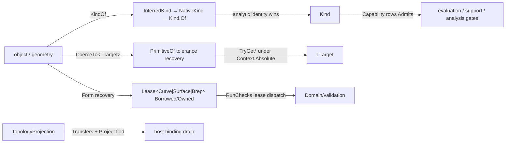

# [RASM_DOMAIN_NORMALIZATION]

The Rhino-kind taxonomy and coercion owner — the substrate every polymorphic geometry ingress in the kernel resolves through before any operation runs. ONE `Topology` `[SmartEnum<int>]` (10 rows) names the topological stratum, ONE `Kind` `[SmartEnum<int>]` (21 rows) binds each admissible Rhino type to its topology as item columns and carries the frozen capability web (`FrozenSet<Type>` primitive/source sets plus `FrozenSet<Topology>` readability sets) as owner-local tables, ONE keyless `Capability` `[SmartEnum]` (13 behavior rows) owns every type-level admission predicate as a `[UseDelegateFromConstructor]` delegate row — collapsing the seventeen-member internal-static predicate family into one vocabulary, killing the `CanEvaluateTopology`/`CanEvaluateSolidTopology` byte-identical twin as a single `EvaluateTopology` row, and deleting the consumer-less `CanSamplePoints` pre-gate (the sampling dispatch owns its admission arm-by-arm) — and ONE `CurveForm` `[Union]` (6 cases) carries analytic curve classification. The coercion lattice rides one `Normalization` owner: an `extension(object? geometry)` polymorphic ingress (`KindOf`/`BoundsOf`/`CoerceTo<TTarget>`) over the `Domain/rails` `Lease<T>`-returning form recoveries (`CurveForm`/`SurfaceForm`/`BrepForm` — `Borrowed` when the source already is the target, `Owned` when a conversion mints a disposable), the tolerance-aware `PrimitiveOf` analytic recovery (`TryGetPlane`/`TryGetSphere`/`TryGetFiniteCylinder`/`TryGetCone`/`TryGetTorus` under the `Domain/context` `Context.Absolute` band), and `CurveFormOf` classification. `Topology`, `Kind`, and `CurveForm` are frozen contract names — ten-plus settled pages and the sibling corpus compose them under `Rasm.Domain`.

ONE disposable projection carrier survives: `TopologyProjection` — the superset that ABSORBS the parallel `GeometryProjection` carrier (one "disposable geometry with a source component" concern, one owner) — carrying the `Lease<GeometryBase>` value, `ComponentIndex` provenance, orientation `Reversed`, the face↔brep bridging `As<T>` dual (an `Option` probe and an `Op`-keyed `Fin` projection), the `Transfers`/`DetachFrom`/`Dispose` transfer protocol (type-assignability for the batch fold, reference identity for a live output), the lazily minted `faceBrep` lease memo, and the static `Project` disposal fold that releases every non-transferred projection after a batch projects. The carrier conforms to the `Domain/rails` `IValidityEvidence` fold so the `Domain/validation` acceptance oracle admits it through the one interface arm, never a hand-enumerated type case. `GeometryRequest` is NOT re-minted here: the one request algebra lives in `Analysis/query` — this page owns what geometry IS and what it can become, never what a caller asks of it. The `Domain/validation` readiness gate (`RunChecks` lease dispatch), the `Domain/evaluation` closest lattice, the `Spatial/support` `SupportSpace` admission, and every `Rasm.Analysis` family compose this taxonomy; the page reads `Rhino.Geometry` value structs and reference geometry only — no `RhinoDoc`/`RhinoApp`/view/display reach, per the kernel boundary law.

## [01]-[INDEX]

- [01]-[TAXONOMY]: `Topology` (10) + `Kind` (21, capability-columned) + keyless `Capability` (13 delegate rows — the dead twin and the consumer-less sampling pre-gate deleted, the `includeSphere` knob split into `Bound`/`OrientedBound` rows) + `CurveForm` (6) — the closed kind vocabulary and its admission web.
- [02]-[COERCION]: the `Normalization` polymorphic ingress (`KindOf`/`BoundsOf`/`CoerceTo<TTarget>`), the `Lease`-returning `CurveForm`/`SurfaceForm`/`BrepForm` form recoveries, tolerance-aware `PrimitiveOf`/`InferredKind`/`NativeKind`, `CurveFormOf` classification, and the ONE `TopologyProjection` disposable carrier with its transfer/disposal protocol.

## [02]-[TAXONOMY]

- Owner: `Topology` `[SmartEnum<int>]` the topological-stratum discriminant (`Unknown`/`Point`/`Curve`/`Surface`/`Brep`/`Mesh`/`SubD`/`PointCloud`/`Hatch`/`Extrusion`); `Kind` `[SmartEnum<int>]` the Rhino-type row set — each row binds `Type` and `Topology` columns, the eight `FrozenSet` capability tables (`CurvePrimitives`/`SurfacePrimitives`/`BrepSources`/`VertexReadableTypes`/`EdgeReadableTypes` over `Type`, vertex/control/edge readability over `Topology`) drive the membership predicates (`CanReadVertices`/`CanReadControlPoints`/`CanReadEdges`/`CanCoerceTo`) while `CanBound`/`CanOrientedBound` read the `Type` column, `Of(Type)` resolves a raw type through the lazy `ByType` frozen index with a base-type walk plus the `Rhino.Geometry.Point` special row, and `ByObjectType` maps the host `Rhino.DocObjects.ObjectType` wire enum at the seam; `Capability` keyless `[SmartEnum]` — 13 behavior rows, each a `[UseDelegateFromConstructor]` `Admits(Type)` delegate bound to a private static predicate so rows compose each other with zero initialization-order hazard — plus the two non-row arities: `Coercible(Type source, Type target)` the pairwise coercion relation and `Native(Type, Topology, candidates)` the span-driven native-topology membership; `CurveForm` `[Union]` the analytic curve classification carrier (`Line`/`Circle`/`Arc`/`Ellipse`/`Polyline(IsClosed)`/`Nurbs(Degree,IsClosed,IsPlanar,IsPeriodic,SpanCount,Dimension)`).
- Cases: `Topology` rows 10; `Kind` rows 21 (`Point`/`Line`/`Polyline`/`Circle`/`Arc`/`Ellipse`/`Curve`/`Surface`/`Plane`/`Sphere`/`Cylinder`/`Cone`/`Torus`/`Brep`/`Box`/`BoundingBox`/`Mesh`/`SubD`/`PointCloud`/`Extrusion`/`Hatch`); `Capability` rows 13 (`CurveForm` · `SurfaceForm` · `BrepForm` · `Bound` · `OrientedBound` · `DecomposeFaces` · `EvaluateTopology` · `Closest` · `ClosestNormal` · `ClosestTangent` · `ClosestFrame` · `SignedDistance` · `ReadVertices`); `CurveForm` cases 6.
- Entry: `Kind.Of(Type) : Option<Kind>` the one type-resolution entry; `Capability.<Row>.Admits(Type) : bool` the one admission entry per capability; `Capability.Coercible(Type, Type)` / `Capability.Native(Type, Topology, params ReadOnlySpan<(Topology, Type)>)` the two relation arities that are genuinely pairwise, never rows.
- Auto: the `EvaluateTopology` row is the collapse of the byte-identical `CanEvaluateTopology`/`CanEvaluateSolidTopology` twin — one predicate, one row, the dead twin deleted; the mature `CanSamplePoints` pre-gate and the `Kind` principal column die consumer-less — the sampling entry's own arm lattice IS its admission, and principal recovery gates on `OrientedBound` plus mass admission at the measuring consumer; the `includeSphere` boolean knob dies as two rows — `Bound` (axis-aligned bounds: every kind but `Plane`) and `OrientedBound` (principal/oriented bounds: `Plane` and the rotation-invariant `Sphere` excluded) — so the caller's request shape selects the row and no boolean rides a signature; `Closest`/`ClosestFrame`/`SignedDistance` compose sibling predicates through the shared private statics, and `Universal` (`object`/`GeometryBase`) short-circuits every row so an erased ingress stays admissible until the value's runtime type refines it.
- Packages: Thinktecture.Runtime.Extensions (`[SmartEnum<int>]`/keyless `[SmartEnum]`/`[Union]`/`[UseDelegateFromConstructor]`), LanguageExt.Core (`Option`/`Optional`), RhinoCommon (the 21 geometry types, `Rhino.DocObjects.ObjectType` at the wire seam only), BCL (`FrozenSet`/`FrozenDictionary`/`Lazy`).
- Growth: a new Rhino geometry kind is ONE `Kind` row plus its capability-set memberships — every predicate, coercion gate, and downstream dispatch reads the row, zero new surface; a new type-level capability is ONE `Capability` row binding one private static predicate; a new analytic curve classification is ONE `CurveForm` case breaking every classification consumer loudly at compile time.
- Boundary: the seventeen-member internal-static predicate family is the named surface-spam defect collapsed here — sibling static predicates sharing the `Can` prefix are rows of one vocabulary, and a second predicate family beside `Capability` is the deleted form; the byte-identical twin predicate is the named dead-code defect — one `EvaluateTopology` row survives; a row or column with no consumer is the same defect — the `CanSamplePoints` pre-gate (restating admission the sampling dispatch owns arm-by-arm) and the `CanPrincipal` column with its `TopologyPrincipal` table (the one mature consumer re-gated onto `OrientedBound` + mass admission) are deleted, not carried; `Rhino.DocObjects.ObjectType` is a foreign wire enum admitted ONLY through the `ByObjectType` seam map and re-closed as `Kind` — a language enum leaking past the seam is the rejected form; `Topology`/`Kind`/`CurveForm` are frozen contract names under `Rasm.Domain` — the `[Union]` generator, the sibling corpus, and ten-plus settled pages bind them, so a rename is a corpus break, never a refactor; the capability web answers TYPE admissibility only — VALUE validity is the `Domain/validation` oracle's and readiness is the `Requirement` gate's, so a `Capability` row probing an instance is the altitude violation.

```csharp contract
// --- [RUNTIME_PRELUDE] ----------------------------------------------------------------------
using System;
using System.Collections.Frozen;
using System.Collections.Generic;
using System.Linq;
using Rasm.Csp;
using LanguageExt;
using Rhino;
using Rhino.Geometry;
using Thinktecture;
using static LanguageExt.Prelude;

namespace Rasm.Domain;

// --- [TYPES] --------------------------------------------------------------------------------
[SmartEnum<int>]
public sealed partial class Topology {
    public static readonly Topology Unknown = new(key: 0);
    public static readonly Topology Point = new(key: 1);
    public static readonly Topology Curve = new(key: 2);
    public static readonly Topology Surface = new(key: 3);
    public static readonly Topology Brep = new(key: 4);
    public static readonly Topology Mesh = new(key: 5);
    public static readonly Topology SubD = new(key: 6);
    public static readonly Topology PointCloud = new(key: 7);
    public static readonly Topology Hatch = new(key: 8);
    public static readonly Topology Extrusion = new(key: 9);
}

[SmartEnum<int>]
public sealed partial class Kind {
    public static readonly Kind Point = new(0, typeof(Point3d), Topology.Point);
    public static readonly Kind Line = new(1, typeof(Line), Topology.Curve);
    public static readonly Kind Polyline = new(2, typeof(Polyline), Topology.Curve);
    public static readonly Kind Circle = new(3, typeof(Circle), Topology.Curve);
    public static readonly Kind Arc = new(4, typeof(Arc), Topology.Curve);
    public static readonly Kind Ellipse = new(5, typeof(Ellipse), Topology.Curve);
    public static readonly Kind Curve = new(6, typeof(Curve), Topology.Curve);
    public static readonly Kind Surface = new(7, typeof(Surface), Topology.Surface);
    public static readonly Kind Plane = new(8, typeof(Plane), Topology.Surface);
    public static readonly Kind Sphere = new(9, typeof(Sphere), Topology.Surface);
    public static readonly Kind Cylinder = new(10, typeof(Cylinder), Topology.Surface);
    public static readonly Kind Cone = new(11, typeof(Cone), Topology.Surface);
    public static readonly Kind Torus = new(12, typeof(Torus), Topology.Surface);
    public static readonly Kind Brep = new(13, typeof(Brep), Topology.Brep);
    public static readonly Kind Box = new(14, typeof(Box), Topology.Brep);
    public static readonly Kind BoundingBox = new(15, typeof(BoundingBox), Topology.Brep);
    public static readonly Kind Mesh = new(16, typeof(Mesh), Topology.Mesh);
    public static readonly Kind SubD = new(17, typeof(SubD), Topology.SubD);
    public static readonly Kind PointCloud = new(18, typeof(PointCloud), Topology.PointCloud);
    public static readonly Kind Extrusion = new(19, typeof(Extrusion), Topology.Extrusion);
    public static readonly Kind Hatch = new(20, typeof(Hatch), Topology.Hatch);
    private static readonly FrozenSet<Type> CurvePrimitives = new[] { typeof(Line), typeof(Circle), typeof(Arc), typeof(Ellipse), typeof(Polyline) }.ToFrozenSet();
    private static readonly FrozenSet<Type> SurfacePrimitives = new[] { typeof(Plane), typeof(Sphere), typeof(Cylinder), typeof(Cone), typeof(Torus) }.ToFrozenSet();
    private static readonly FrozenSet<Type> BrepSources = new[] { typeof(Brep), typeof(Surface), typeof(Box), typeof(BoundingBox), typeof(Sphere), typeof(Cylinder), typeof(Cone), typeof(Torus), typeof(Extrusion), typeof(SubD) }.ToFrozenSet();
    private static readonly FrozenSet<Type> VertexReadableTypes = new[] { typeof(Point3d), typeof(Curve), typeof(Line), typeof(Polyline), typeof(Arc) }.ToFrozenSet();
    private static readonly FrozenSet<Type> EdgeReadableTypes = new[] { typeof(Line), typeof(Polyline), typeof(BoundingBox), typeof(Box) }.ToFrozenSet();
    private static readonly FrozenSet<Topology> TopologyVertexReadable = new[] { Topology.Point, Topology.Brep, Topology.Mesh, Topology.PointCloud, Topology.SubD, Topology.Extrusion }.ToFrozenSet();
    private static readonly FrozenSet<Topology> TopologyControlReadable = new[] { Topology.Curve, Topology.Surface, Topology.Brep }.ToFrozenSet();
    private static readonly FrozenSet<Topology> TopologyEdgeReadable = new[] { Topology.Brep, Topology.Mesh, Topology.SubD }.ToFrozenSet();
    private static readonly Lazy<FrozenDictionary<Type, Kind>> ByType = new(static () => Items.ToFrozenDictionary(static k => k.Type));
    internal static readonly FrozenDictionary<Rhino.DocObjects.ObjectType, Kind> ByObjectType = new (Rhino.DocObjects.ObjectType Key, Kind Value)[] {
        (Rhino.DocObjects.ObjectType.Point, Point), (Rhino.DocObjects.ObjectType.Curve, Curve), (Rhino.DocObjects.ObjectType.Surface, Surface),
        (Rhino.DocObjects.ObjectType.Brep, Brep), (Rhino.DocObjects.ObjectType.Mesh, Mesh), (Rhino.DocObjects.ObjectType.SubD, SubD),
        (Rhino.DocObjects.ObjectType.PointSet, PointCloud), (Rhino.DocObjects.ObjectType.Hatch, Hatch), (Rhino.DocObjects.ObjectType.Extrusion, Extrusion),
    }.ToFrozenDictionary(keySelector: static p => p.Key, elementSelector: static p => p.Value);
    public Type Type { get; }
    public Topology Topology { get; }
    internal bool CanBound => Type != typeof(Plane);
    internal bool CanOrientedBound => Type != typeof(Plane) && Type != typeof(Sphere);
    internal bool CanReadVertices => VertexReadableTypes.Contains(Type) || TopologyVertexReadable.Contains(Topology);
    internal bool CanReadControlPoints => TopologyControlReadable.Contains(Topology);
    internal bool CanReadEdges => EdgeReadableTypes.Contains(Type) || TopologyEdgeReadable.Contains(Topology);
    internal bool CanCoerceTo(Type target) =>
        target.IsAssignableFrom(Type)
        || (target == typeof(Box) && Type == typeof(Brep))
        || (target == typeof(Curve) && Topology == Topology.Curve)
        || (CurvePrimitives.Contains(target) && Type == typeof(Curve))
        || (SurfacePrimitives.Contains(target) && (Type == typeof(Brep) || Type == typeof(Surface)))
        || (target == typeof(Brep) && BrepSources.Contains(Type));
    public static Option<Kind> Of(Type type) {
        ArgumentNullException.ThrowIfNull(argument: type);
        return type == typeof(Rhino.Geometry.Point)
            ? Some(Point)
            : Optional(ByType.Value.GetValueOrDefault(key: type)) | (InheritsBase(type: type) is Type bt ? Optional(ByType.Value.GetValueOrDefault(key: bt)) : Option<Kind>.None);
    }
    private static Type? InheritsBase(Type type) => type.BaseType is Type b ? (ByType.Value.ContainsKey(key: b) ? b : InheritsBase(type: b)) : null;
}

[SmartEnum]
internal sealed partial class Capability {
    public static readonly Capability CurveForm = new(admits: CurveFormAdmits);
    public static readonly Capability SurfaceForm = new(admits: SurfaceFormAdmits);
    public static readonly Capability BrepForm = new(admits: static type => Universal(type: type) || Coercible(source: type, target: typeof(Brep)));
    public static readonly Capability Bound = new(admits: static type => Universal(type: type) || typeof(GeometryBase).IsAssignableFrom(c: type) || KindAdmits(type: type, predicate: static kind => kind.CanBound));
    public static readonly Capability OrientedBound = new(admits: static type => Universal(type: type) || typeof(GeometryBase).IsAssignableFrom(c: type) || KindAdmits(type: type, predicate: static kind => kind.CanOrientedBound));
    public static readonly Capability DecomposeFaces = new(admits: static type =>
        Universal(type: type) || typeof(BrepFace).IsAssignableFrom(c: type) || KindAdmits(type: type, predicate: static kind => kind.CanCoerceTo(target: typeof(Brep))));
    public static readonly Capability EvaluateTopology = new(admits: static type =>
        Universal(type: type) || typeof(Mesh).IsAssignableFrom(c: type) || typeof(Brep).IsAssignableFrom(c: type)
        || KindAdmits(type: type, predicate: static kind => kind.Topology == Topology.Mesh || kind.Topology == Topology.Brep || kind.CanCoerceTo(target: typeof(Brep))));
    public static readonly Capability Closest = new(admits: static type =>
        Universal(type: type) || type == typeof(Point3d) || type == typeof(Rhino.Geometry.Point)
        || typeof(PointCloud).IsAssignableFrom(c: type) || typeof(Brep).IsAssignableFrom(c: type) || typeof(Mesh).IsAssignableFrom(c: type)
        || type == typeof(Box) || type == typeof(BoundingBox) || CurveFormAdmits(type: type) || SurfaceFormAdmits(type: type));
    public static readonly Capability ClosestNormal = new(admits: ClosestNormalAdmits);
    public static readonly Capability ClosestTangent = new(admits: ClosestTangentAdmits);
    public static readonly Capability ClosestFrame = new(admits: static type =>
        Universal(type: type) || type == typeof(Plane) || ClosestTangentAdmits(type: type) || SurfaceFormAdmits(type: type)
        || typeof(BrepFace).IsAssignableFrom(c: type) || typeof(Mesh).IsAssignableFrom(c: type));
    public static readonly Capability SignedDistance = new(admits: static type =>
        type == typeof(Plane) || type == typeof(Sphere) || type == typeof(Box) || type == typeof(BoundingBox) || ClosestNormalAdmits(type: type));
    public static readonly Capability ReadVertices = new(admits: static type => Universal(type: type) || KindAdmits(type: type, predicate: static kind => kind.CanReadVertices));
    [UseDelegateFromConstructor]
    internal partial bool Admits(Type type);
    internal static bool Universal(Type type) => type == typeof(object) || type == typeof(GeometryBase);
    internal static bool Coercible(Type source, Type target) =>
        Universal(type: source) || Kind.Of(type: source).Map(kind => kind.CanCoerceTo(target: target)).IfNone(target.IsAssignableFrom(c: source));
    internal static bool Native(Type type, Topology topology, params ReadOnlySpan<(Topology Topology, Type Native)> candidates) {
        foreach ((Topology candidate, Type native) in candidates) {
            if (candidate.Equals(topology) && native.IsAssignableFrom(c: type)) { return true; }
        }
        return false;
    }
    private static bool KindAdmits(Type type, Func<Kind, bool> predicate) => Kind.Of(type: type).Map(predicate).IfNone(noneValue: false);
    private static bool CurveFormAdmits(Type type) => typeof(Curve).IsAssignableFrom(c: type) || Universal(type: type) || KindAdmits(type: type, predicate: static kind => kind.Topology == Topology.Curve);
    private static bool SurfaceFormAdmits(Type type) =>
        Universal(type: type) || typeof(Surface).IsAssignableFrom(c: type) || typeof(Brep).IsAssignableFrom(c: type) || KindAdmits(type: type, predicate: static kind => kind.Topology == Topology.Surface);
    private static bool ClosestNormalAdmits(Type type) =>
        Universal(type: type) || SurfaceFormAdmits(type: type) || typeof(PointCloud).IsAssignableFrom(c: type)
        || typeof(BrepFace).IsAssignableFrom(c: type) || typeof(Brep).IsAssignableFrom(c: type) || typeof(Mesh).IsAssignableFrom(c: type);
    private static bool ClosestTangentAdmits(Type type) =>
        Universal(type: type) || type == typeof(Line) || type == typeof(Polyline) || typeof(Brep).IsAssignableFrom(c: type) || CurveFormAdmits(type: type);
}

[Union]
public partial record CurveForm {
    public sealed record LineCase(Line Value) : CurveForm;
    public sealed record CircleCase(Circle Value) : CurveForm;
    public sealed record ArcCase(Arc Value) : CurveForm;
    public sealed record EllipseCase(Ellipse Value) : CurveForm;
    public sealed record PolylineCase(Polyline Value, bool IsClosed) : CurveForm;
    public sealed record NurbsCase(int Degree, bool IsClosed, bool IsPlanar, bool IsPeriodic, int SpanCount, int Dimension) : CurveForm;
}
```

## [03]-[COERCION]

- Owner: `Normalization` the internal static coercion owner — an `extension(object? geometry)` block is the polymorphic ingress (`KindOf(Context)` resolves the strongest kind through the `InferredKind` → `NativeKind` → declared-`Kind` ladder; `BoundsOf(Op)` the total bounding lattice over value structs, analytic primitives, and native geometry; `CoerceTo<TTarget>(Context, Op)` the typed coercion projecting `PrimitiveOf` recovery onto the target) plus the three `Lease`-returning form recoveries (`CurveForm`/`SurfaceForm` — the arms `Domain/validation` `RunChecks` lease-dispatches through — and `BrepForm`, feeding the bounds/vertex lattices and the `Analysis` face decompositions), `CurveFormOf(Curve, Context)` the tolerance-banded analytic classification (`IsLinear` → `TryGetCircle` → `TryGetArc` → `TryGetEllipse` → `TryGetPolyline` → `Nurbs` fallthrough — ordered so the strongest analytic form wins), and `PrimitiveOf` the tolerance-aware primitive recovery (`TryGetPlane`/`TryGetSphere`/`TryGetFiniteCylinder`/`TryGetCone`/`TryGetTorus` under `Context.Absolute`, `Brep.IsBox` box recovery, face-delegated recovery for single-face breps); `TopologyProjection` the ONE disposable projection carrier — `Lease<GeometryBase>` value + `ComponentIndex` provenance + `Reversed` orientation, the face↔brep `As<T>` bridge with the lazily minted `faceBrep` `Lease<Brep>.Owned` memo, the `Transfers` dual (type-assignability probe for the batch fold, reference-identity test for a live output), `DetachFrom` ownership severing (face → owned single-face duplicate, identity-shared mesh/geometry → owned duplicate), `Dispose` releasing the value lease and the face memo, and the static `Project` fold that projects a chosen subset and disposes every projection whose resource did not transfer into the output.
- Cases: `KindOf` inference probes 6 brep primitives / 5 surface primitives most-constrained-first and classifies the curve family through ONE `CurveFormOf` ladder mapped case→row (one host classification, never five re-probes); `BoundsOf` 13 arms (value-struct boxes, analytic primitives via form leases, `Plane` unbounded → `Unsupported`, native accurate-box fallthrough); `CurveForm` recovery 7 arms; `SurfaceForm` recovery 8 arms; `BrepForm` recovery 11 arms (`TryConvertBrep` identity-preserving arm returns `Borrowed` when the host returns the same reference, `Owned` otherwise); `TopologyProjection` factories 4 (`Of(Curve, ComponentIndex)` owned, `Of(BrepFace)` borrowed with orientation/provenance capture, `FromMesh(Mesh?, ComponentIndex)` borrowed validated, `Of(Lease<GeometryBase>, ComponentIndex, reversed)` the general absorbed ingress; the detached-single-face form mints only through `DetachFrom` — ownership is never a caller flag) and validity 6 arms (curve, indexed brep face, live face, mesh face, mesh ngon, general valid-geometry-with-component tail) — each named (value, component) pair computes its verdict IN the arm body, so a failed bound check fails its own arm and never falls through the pattern into the general tail.
- Entry: `geometry.KindOf(context)` / `geometry.BoundsOf(key)` / `geometry.CoerceTo<TTarget>(context, key)` — one extension ingress owns all three modalities, discriminating on the value's runtime shape, `Fin<T>` routing the `Domain/rails` `Fault` union (`InvalidInput` on null or invalid, `Unsupported(sourceType, targetType)` on an inadmissible pair) — no `KindOfCurve`/`KindOfBrep` siblings, no target-suffixed coercion family.
- Auto: `KindOf` prefers the ANALYTIC identity over the nominal one — a `Brep` that is a tolerance-exact box resolves `Kind.Box`, a `Curve` that is a circle resolves `Kind.Circle` — by probing `InferredKind` (primitive recovery per topology family) before `NativeKind` (`ObjectType` seam map plus `HasBrepForm`) before the declared type row; `CoerceTo` type-guards the recovered primitive — a base-walked row can recover a sibling representative (a `NurbsCurve` request meeting a `LineCurve` recovery), so the mismatch routes `Unsupported`, never an unchecked-cast throw; lease ownership is data-derived, never flagged — a source that already IS the target form travels `Borrowed` (zero disposal), a minted conversion travels `Owned` (the lease disposes it — and a conversion `CoerceTo` hands out transfers ownership to the caller by egress contract), and `BrepForm`'s `TryConvertBrep` arm decides by reference identity at the host boundary; the `faceBrep` memo mints the bridging `Brep` lease at most once per carrier and the carrier's `Dispose` releases it with the value.
- Packages: RhinoCommon (`Brep.TryConvertBrep`/`IsBox`, `Surface.TryGetPlane`/`TryGetSphere`/`TryGetFiniteCylinder`/`TryGetCone`/`TryGetTorus`, `Curve.IsLinear`/`TryGetCircle`/`TryGetArc`/`TryGetEllipse`/`TryGetPolyline`/`IsPlanar`, `Box`/`BoundingBox`/`Sphere`/`Cylinder`/`Cone`/`Torus`/`Extrusion.ToBrep`, `SubD.ToBrep(SubDToBrepOptions.Default)`, `LineCurve`/`ArcCurve`/`PlaneSurface`, `BrepFace.DuplicateFace`/`OrientationIsReversed`/`FaceIndex`, `Mesh.DuplicateMesh`/`Faces`/`Ngons`, `ComponentIndex`), LanguageExt.Core (`Fin`/`Option`/`Seq`/`guard`), Thinktecture (`[Union]` on the composed `Lease<T>`), Foundation analyzer contracts (`[BoundaryAdapter]`).
- Growth: a new coercion target is ONE `PrimitiveOf` arm plus one `Kind` capability-set membership — `CoerceTo<TTarget>` and every consumer read it with zero signature change; a new carrier source kind is ONE factory plus ONE validity arm on `TopologyProjection`; a new form recovery source is ONE arm in the owning `*Form` lattice.
- Boundary: `GeometryRequest` is NOT re-minted here — the one request algebra lives in `Analysis/query` and a second request ADT beside it is the named two-vocabulary defect this partition kills; `GeometryProjection` is ABSORBED — `TopologyProjection` is the superset carrier (general geometry + component provenance admitted through the general factory, validity widened with the valid-geometry tail arm, the `Fin`-projecting `As<T>(Op)` overload carrying the absorbed typed egress) and a second disposable projection carrier is the deleted parallel-rail form; the god-kernel is dead — taxonomy, coercion, and carrier live HERE, evaluation and sampling live in `Domain/evaluation`, readiness lives in `Domain/validation`, and one static class fusing all six concerns is the named weak-entry-point defect this split retires; the carrier's disposal protocol is load-bearing for the host re-entry contract (the frozen Grasshopper binding drains projections through `Transfers` + `Project`), so the transfer fold is preserved verbatim-semantics; coercion reads `Rhino.Geometry` values and reference geometry only — `RhinoDoc` reach is the boundary-law violation, and the ONE doc adapter in this substrate is `Context.Of(RhinoDoc)` on `Domain/context`, never here.

```csharp contract
// --- [RUNTIME_PRELUDE] ----------------------------------------------------------------------
using System;
using System.Collections.Generic;
using System.Linq;
using Rasm.Csp;
using LanguageExt;
using Rhino;
using Rhino.Geometry;
using Thinktecture;
using static LanguageExt.Prelude;

namespace Rasm.Domain;

// --- [MODELS] -------------------------------------------------------------------------------
[BoundaryAdapter]
public sealed record TopologyProjection : IValidityEvidence, IDisposable {
    private static readonly Op Key = Op.Of(name: nameof(TopologyProjection));
    private readonly Lease<GeometryBase> value;
    private readonly bool detachedSingleFace;
    private Option<Lease<Brep>> faceBrep;
    private TopologyProjection(Lease<GeometryBase> value, ComponentIndex source, bool reversed = false, bool detachedSingleFace = false) {
        this.value = value;
        this.detachedSingleFace = detachedSingleFace;
        Source = source;
        Reversed = reversed;
    }
    public static TopologyProjection Of(Curve curve, ComponentIndex source) {
        ArgumentNullException.ThrowIfNull(argument: curve);
        return new(value: new Lease<GeometryBase>.Owned(Value: curve), source: source);
    }
    public static TopologyProjection Of(BrepFace face) {
        ArgumentNullException.ThrowIfNull(argument: face);
        return new(
            value: new Lease<GeometryBase>.Borrowed(Value: face),
            source: new ComponentIndex(type: ComponentIndexType.BrepFace, index: face.FaceIndex),
            reversed: face.OrientationIsReversed);
    }
    public static TopologyProjection Of(Lease<GeometryBase> geometry, ComponentIndex source, bool reversed = false) {
        ArgumentNullException.ThrowIfNull(argument: geometry);
        return new(value: geometry, source: source, reversed: reversed);
    }
    public static Fin<TopologyProjection> FromMesh(Mesh? mesh, ComponentIndex source) =>
        Optional(mesh).ToFin(Key.InvalidInput()).Bind(native =>
            new TopologyProjection(value: new Lease<GeometryBase>.Borrowed(Value: native), source: source) switch {
                { IsValid: true } projection => Fin.Succ(projection),
                _ => Fin.Fail<TopologyProjection>(Key.InvalidInput()),
            });
    private static TopologyProjection Detached(BrepFace face) => new(
        value: new Lease<GeometryBase>.Owned(Value: face.DuplicateFace(duplicateMeshes: false)),
        source: new ComponentIndex(type: ComponentIndexType.BrepFace, index: face.FaceIndex),
        reversed: face.OrientationIsReversed,
        detachedSingleFace: true);
    public GeometryBase Value => value.Resource;
    public ComponentIndex Source { get; }
    public bool Reversed { get; }
    public bool IsValid => ValidityClaim.Of((Value, Source) switch {
        (Curve { IsValid: true }, _) => true,
        (Brep brep, { ComponentIndexType: ComponentIndexType.BrepFace, Index: int f }) => brep.IsValid && f >= 0 && (f < brep.Faces.Count || (detachedSingleFace && brep.Faces.Count == 1)),
        (BrepFace face, { ComponentIndexType: ComponentIndexType.BrepFace, Index: int f }) => face.IsValid && f >= 0 && f == face.FaceIndex,
        (Mesh mesh, { ComponentIndexType: ComponentIndexType.MeshFace, Index: int f }) => mesh.IsValid && f >= 0 && f < mesh.Faces.Count,
        (Mesh mesh, { ComponentIndexType: ComponentIndexType.MeshNgon, Index: int n }) => mesh.IsValid && n >= 0 && n < mesh.Ngons.Count,
        (GeometryBase { IsValid: true }, { ComponentIndexType: not ComponentIndexType.InvalidType }) => true,
        _ => false,
    });
    public Option<T> As<T>() where T : class =>
        Value is T match ? Some(match)
        : typeof(T) == typeof(BrepFace) && Value is Brep { Faces.Count: > 0 } brep && Source is { ComponentIndexType: ComponentIndexType.BrepFace, Index: int faceIndex } ? faceIndex switch {
            >= 0 when faceIndex < brep.Faces.Count => Some((T)(object)brep.Faces[faceIndex]),
            >= 0 when detachedSingleFace && brep.Faces.Count == 1 => Some((T)(object)brep.Faces[0]),
            _ => Option<T>.None,
        }
        : typeof(T) == typeof(Brep) && Value is BrepFace face
            ? faceBrep.Case switch {
                Lease<Brep> lease => Some((T)(object)lease.Resource),
                _ => Optional(face.DuplicateFace(duplicateMeshes: false)).Map(brep => { faceBrep = new Lease<Brep>.Owned(Value: brep); return (T)(object)brep; }),
            }
            : Option<T>.None;
    public Fin<T> As<T>(Op key) where T : class =>
        As<T>().ToFin(Fail: key.Unsupported(geometryType: Value.GetType(), outputType: typeof(T)));
    public TopologyProjection DetachFrom(GeometryBase source) {
        ArgumentNullException.ThrowIfNull(argument: source);
        return (Value, source) switch {
            (BrepFace face, _) when ReferenceEquals(objA: face.Brep, objB: source) => Detached(face: face),
            (Mesh mesh, Mesh owner) when ReferenceEquals(objA: mesh, objB: owner) && IsValid =>
                new(value: new Lease<GeometryBase>.Owned(Value: mesh.DuplicateMesh()), source: Source, reversed: Reversed),
            (GeometryBase shared, _) when ReferenceEquals(objA: shared, objB: source) =>
                new(value: new Lease<GeometryBase>.Owned(Value: shared.Duplicate()), source: Source, reversed: Reversed),
            _ => this,
        };
    }
    public bool Transfers(Type outputType) {
        ArgumentNullException.ThrowIfNull(argument: outputType);
        return outputType.IsAssignableFrom(typeof(TopologyProjection))
            || (Value is Curve curve && outputType.IsInstanceOfType(curve))
            || (Value is Brep or BrepFace && outputType.IsAssignableFrom(typeof(Brep)));
    }
    public bool Transfers(object? output) =>
        output switch {
            null => false,
            TopologyProjection projection => SameAs(other: projection),
            GeometryBase geometry => ReferenceEquals(objA: Value, objB: geometry) || (Value, geometry) switch {
                (Brep brep, BrepFace face) => ReferenceEquals(objA: brep, objB: face.Brep),
                (BrepFace face, Brep brep) => ReferenceEquals(objA: face.Brep, objB: brep),
                (BrepFace source, BrepFace face) => ReferenceEquals(objA: source.Brep, objB: face.Brep),
                _ => false,
            },
            _ => false,
        };
    public void Dispose() {
        _ = value.Dispose();
        _ = faceBrep.Iter(static owned => owned.Dispose());
    }
    private bool SameAs(TopologyProjection? other) =>
        other switch { TopologyProjection p => ReferenceEquals(objA: Value, objB: p.Value) && Source.Equals(p.Source), _ => false };
    internal static Fin<Seq<TValue>> Project<TValue>(Seq<TopologyProjection> all, Seq<TopologyProjection> chosen, Func<Seq<TopologyProjection>, Fin<Seq<TValue>>> project) {
        Fin<Seq<TValue>> result = project(chosen);
        _ = all.Filter(v => !result.IsSucc || !chosen.Exists(c => c.SameAs(other: v) && c.Transfers(outputType: typeof(TValue)))).Iter(static v => v.Dispose());
        return result;
    }
}

// --- [OPERATIONS] ---------------------------------------------------------------------------
[BoundaryAdapter]
internal static class Normalization {
    extension(object? geometry) {
        public Fin<Kind> KindOf(Context context) {
            Op key = Op.Of(name: nameof(Kind));
            return Optional(geometry).ToFin(key.InvalidInput()).Bind(g =>
                (InferredKind(geometry: g, context: context, key: key) | NativeKind(geometry: g) | Kind.Of(type: g.GetType()))
                .ToFin(key.InvalidInput()));
        }
        public Fin<BoundingBox> BoundsOf(Op key) =>
            Optional(geometry).ToFin(key.InvalidInput()).Bind(g => OpAcceptance.ValidityOf(source: g).Case switch {
                false => Fin.Fail<BoundingBox>(key.InvalidInput()),
                true => g switch {
                    BoundingBox box => Fin.Succ(box),
                    Box box => Fin.Succ(box.BoundingBox),
                    Sphere sphere => Fin.Succ(sphere.BoundingBox),
                    Line line => Fin.Succ(line.BoundingBox),
                    Polyline polyline => Fin.Succ(polyline.BoundingBox),
                    Circle circle => Fin.Succ(circle.BoundingBox),
                    Arc arc => Fin.Succ(arc.BoundingBox()),
                    Point3d point => Fin.Succ(new BoundingBox(point, point)),
                    Plane => Fin.Fail<BoundingBox>(key.Unsupported(geometryType: typeof(Plane), outputType: typeof(BoundingBox))),
                    Ellipse => CurveForm(source: g, key: key).Map(static lease => lease.Use(static d => d.GetBoundingBox(accurate: true))),
                    Cylinder or Cone or Torus => BrepForm(source: g, key: key).Map(static lease => lease.Use(static d => d.GetBoundingBox(accurate: true))),
                    GeometryBase native => guard(native.IsValid, key.InvalidInput()).ToFin().Map(_ => native.GetBoundingBox(accurate: true)),
                    _ => Fin.Fail<BoundingBox>(key.Unsupported(geometryType: g.GetType(), outputType: typeof(BoundingBox))),
                },
                _ => Fin.Fail<BoundingBox>(key.InvalidInput()),
            });
        public Fin<TTarget> CoerceTo<TTarget>(Context context, Op key) where TTarget : notnull =>
            Optional(geometry).ToFin(key.InvalidInput()).Bind(s => s switch {
                TTarget target => key.AcceptValue(value: target),
                _ => Kind.Of(type: typeof(TTarget))
                    .Bind(kind => PrimitiveOf(kind: kind, source: s, context: context, key: key))
                    .Bind(static recovered => recovered is TTarget typed ? Some(typed) : Option<TTarget>.None)
                    .ToFin(key.Unsupported(geometryType: s.GetType(), outputType: typeof(TTarget))),
            });
    }
    internal static Fin<Lease<Curve>> CurveForm(object? source, Op key) =>
        Optional(source).ToFin(key.InvalidInput()).Bind(value => value switch {
            Curve curve => Fin.Succ<Lease<Curve>>(new Lease<Curve>.Borrowed(Value: curve)),
            Line line when line.IsValid => Fin.Succ<Lease<Curve>>(new Lease<Curve>.Owned(Value: new LineCurve(line))),
            Polyline polyline when polyline.IsValid => Optional(polyline.ToPolylineCurve()).ToFin(key.InvalidResult()).Map(static curve => (Lease<Curve>)new Lease<Curve>.Owned(Value: curve)),
            Circle circle when circle.IsValid => Fin.Succ<Lease<Curve>>(new Lease<Curve>.Owned(Value: new ArcCurve(circle))),
            Arc arc when arc.IsValid => Fin.Succ<Lease<Curve>>(new Lease<Curve>.Owned(Value: new ArcCurve(arc))),
            Ellipse ellipse when ellipse.IsValid => Optional(ellipse.ToNurbsCurve()).ToFin(key.InvalidResult()).Map(static curve => (Lease<Curve>)new Lease<Curve>.Owned(Value: curve)),
            _ => Fin.Fail<Lease<Curve>>(key.Unsupported(geometryType: value.GetType(), outputType: typeof(Curve))),
        });
    internal static Fin<Lease<Surface>> SurfaceForm(object? source, Op key) =>
        Optional(source).ToFin(key.InvalidInput()).Bind(value => value switch {
            Surface surface => Fin.Succ<Lease<Surface>>(new Lease<Surface>.Borrowed(Value: surface)),
            Plane plane when plane.IsValid => Fin.Succ<Lease<Surface>>(new Lease<Surface>.Owned(Value: new PlaneSurface(plane))),
            Sphere sphere when sphere.IsValid => Optional(sphere.ToNurbsSurface()).ToFin(key.InvalidResult()).Map(static surface => (Lease<Surface>)new Lease<Surface>.Owned(Value: surface)),
            Cylinder cylinder when cylinder.IsValid => Optional(cylinder.ToNurbsSurface()).ToFin(key.InvalidResult()).Map(static surface => (Lease<Surface>)new Lease<Surface>.Owned(Value: surface)),
            Cone cone when cone.IsValid => Optional(cone.ToNurbsSurface()).ToFin(key.InvalidResult()).Map(static surface => (Lease<Surface>)new Lease<Surface>.Owned(Value: surface)),
            Torus torus when torus.IsValid => Optional(torus.ToNurbsSurface()).ToFin(key.InvalidResult()).Map(static surface => (Lease<Surface>)new Lease<Surface>.Owned(Value: surface)),
            Brep { IsSurface: true, Faces.Count: > 0 } brep => Fin.Succ<Lease<Surface>>(new Lease<Surface>.Borrowed(Value: brep.Faces[0])),
            _ => Fin.Fail<Lease<Surface>>(key.Unsupported(geometryType: value.GetType(), outputType: typeof(Surface))),
        });
    internal static Fin<Lease<Brep>> BrepForm(object? source, Op key) =>
        Optional(source).ToFin(key.InvalidInput()).Bind(value => value switch {
            Brep brep => Fin.Succ<Lease<Brep>>(new Lease<Brep>.Borrowed(Value: brep)),
            GeometryBase { HasBrepForm: true } native => Optional(Brep.TryConvertBrep(native)).ToFin(key.InvalidResult())
                .Map(brep => ReferenceEquals(objA: native, objB: brep) ? (Lease<Brep>)new Lease<Brep>.Borrowed(Value: brep) : new Lease<Brep>.Owned(Value: brep)),
            Box box => Optional(box.ToBrep()).ToFin(key.InvalidResult()).Map(static brep => (Lease<Brep>)new Lease<Brep>.Owned(Value: brep)),
            BoundingBox box => Optional(box.ToBrep()).ToFin(key.InvalidResult()).Map(static brep => (Lease<Brep>)new Lease<Brep>.Owned(Value: brep)),
            Sphere sphere => Optional(sphere.ToBrep()).ToFin(key.InvalidResult()).Map(static brep => (Lease<Brep>)new Lease<Brep>.Owned(Value: brep)),
            Cylinder cylinder => Optional(cylinder.ToBrep(capBottom: true, capTop: true)).ToFin(key.InvalidResult()).Map(static brep => (Lease<Brep>)new Lease<Brep>.Owned(Value: brep)),
            Cone cone => Optional(cone.ToBrep(capBottom: true)).ToFin(key.InvalidResult()).Map(static brep => (Lease<Brep>)new Lease<Brep>.Owned(Value: brep)),
            Torus torus => Optional(torus.ToBrep()).ToFin(key.InvalidResult()).Map(static brep => (Lease<Brep>)new Lease<Brep>.Owned(Value: brep)),
            Extrusion extrusion => Optional(extrusion.ToBrep()).ToFin(key.InvalidResult()).Map(static brep => (Lease<Brep>)new Lease<Brep>.Owned(Value: brep)),
            SubD subd => Optional(subd.ToBrep(SubDToBrepOptions.Default)).ToFin(key.InvalidResult()).Map(static brep => (Lease<Brep>)new Lease<Brep>.Owned(Value: brep)),
            _ => Fin.Fail<Lease<Brep>>(key.Unsupported(geometryType: value.GetType(), outputType: typeof(Brep))),
        });
    internal static Fin<CurveForm> CurveFormOf(Curve curve, Context context) =>
        Fin.Succ<CurveForm>(curve switch {
            _ when curve.IsLinear(tolerance: context.Absolute.Value) => new CurveForm.LineCase(Value: new Line(from: curve.PointAtStart, to: curve.PointAtEnd)),
            _ when curve.TryGetCircle(circle: out Circle c, tolerance: context.Absolute.Value) => new CurveForm.CircleCase(Value: c),
            _ when curve.TryGetArc(arc: out Arc a, tolerance: context.Absolute.Value) => new CurveForm.ArcCase(Value: a),
            _ when curve.TryGetEllipse(ellipse: out Ellipse e, tolerance: context.Absolute.Value) => new CurveForm.EllipseCase(Value: e),
            _ when curve.TryGetPolyline(polyline: out Polyline p) => new CurveForm.PolylineCase(Value: p, IsClosed: curve.IsClosed),
            _ => new CurveForm.NurbsCase(Degree: curve.Degree, IsClosed: curve.IsClosed, IsPlanar: curve.IsPlanar(tolerance: context.Absolute.Value), IsPeriodic: curve.IsPeriodic, SpanCount: curve.SpanCount, Dimension: curve.Dimension),
        });
    internal static Option<object> PrimitiveOf(Kind kind, object source, Context context, Op key) =>
        (kind.Type, source) switch {
            (Type t, Rhino.Geometry.Point point) when t == typeof(Point3d) => Some((object)point.Location),
            (Type t, Brep brep) when t == typeof(Box) =>
                brep.IsBox(context.Absolute.Value) && brep.Faces[0].UnderlyingSurface().TryGetPlane(out Plane plane, context.Absolute.Value) && new Box(plane, brep) is { IsValid: true } box
                    ? Some((object)box)
                    : Option<object>.None,
            (Type t, object value) when t == typeof(Curve) => CurveForm(source: value, key: key).ToOption().Map(static lease => (object)lease.Resource),
            (Type t, Curve curve) when t == typeof(Line) || t == typeof(Circle) || t == typeof(Arc) || t == typeof(Ellipse) || t == typeof(Polyline) =>
                CurveFormOf(curve: curve, context: context).ToOption().Bind(form => (t, form) switch {
                    (Type output, CurveForm.LineCase line) when output == typeof(Line) => Some((object)line.Value),
                    (Type output, CurveForm.CircleCase circle) when output == typeof(Circle) => Some((object)circle.Value),
                    (Type output, CurveForm.ArcCase arc) when output == typeof(Arc) => Some((object)arc.Value),
                    (Type output, CurveForm.EllipseCase ellipse) when output == typeof(Ellipse) => Some((object)ellipse.Value),
                    (Type output, CurveForm.PolylineCase polyline) when output == typeof(Polyline) => Some((object)polyline.Value),
                    _ => Option<object>.None,
                }),
            (Type t, Brep { IsSurface: true, Faces.Count: > 0 } brep) when t == typeof(Plane) || t == typeof(Sphere) || t == typeof(Cylinder) || t == typeof(Cone) || t == typeof(Torus) =>
                PrimitiveOf(kind: kind, source: brep.Faces[0], context: context, key: key),
            (Type t, Surface surface) when t == typeof(Plane) && surface.TryGetPlane(out Plane value, context.Absolute.Value) => Some((object)value),
            (Type t, Surface surface) when t == typeof(Sphere) && surface.TryGetSphere(out Sphere value, context.Absolute.Value) => Some((object)value),
            (Type t, Surface surface) when t == typeof(Cylinder) && surface.TryGetFiniteCylinder(out Cylinder value, context.Absolute.Value) => Some((object)value),
            (Type t, Surface surface) when t == typeof(Cone) && surface.TryGetCone(out Cone value, context.Absolute.Value) => Some((object)value),
            (Type t, Surface surface) when t == typeof(Torus) && surface.TryGetTorus(out Torus value, context.Absolute.Value) => Some((object)value),
            (Type t, object value) when t == typeof(Brep) => BrepForm(source: value, key: key).ToOption().Map(static lease => (object)lease.Resource),
            _ => Option<object>.None,
        };
    private static Option<Kind> InferredKind(object geometry, Context context, Op key) =>
        geometry switch {
            Curve curve => CurveFormOf(curve: curve, context: context).ToOption().Bind(static form => form switch {
                CurveForm.LineCase => Some(Kind.Line),
                CurveForm.CircleCase => Some(Kind.Circle),
                CurveForm.ArcCase => Some(Kind.Arc),
                CurveForm.EllipseCase => Some(Kind.Ellipse),
                CurveForm.PolylineCase => Some(Kind.Polyline),
                _ => Option<Kind>.None,
            }),
            Brep => Seq(Kind.Box, Kind.Plane, Kind.Sphere, Kind.Cylinder, Kind.Cone, Kind.Torus)
                .Choose(kind => PrimitiveOf(kind: kind, source: geometry, context: context, key: key).Map(_ => kind)).Head,
            Surface => Seq(Kind.Plane, Kind.Sphere, Kind.Cylinder, Kind.Cone, Kind.Torus)
                .Choose(kind => PrimitiveOf(kind: kind, source: geometry, context: context, key: key).Map(_ => kind)).Head,
            _ => Option<Kind>.None,
        };
    private static Option<Kind> NativeKind(object geometry) =>
        geometry is GeometryBase native
            ? Optional(Kind.ByObjectType.GetValueOrDefault(native.ObjectType)) | (native.HasBrepForm ? Some(Kind.Brep) : Option<Kind>.None)
            : Option<Kind>.None;
}
```



## [04]-[DENSITY_BAR]

One owner per axis; capability is a row, case, or fold arm, never a sibling surface.

| [INDEX] | [CONCERN]             | [OWNER]              | [KIND]                                                                          | [RAIL]                                    | [CASES] |
| :-----: | :-------------------- | :------------------- | :------------------------------------------------------------------------------ | :----------------------------------------- | :-----: |
|  [01]   | Topological stratum   | `Topology`           | `[SmartEnum<int>]`                                                              | discriminant (pure)                        |   10    |
|  [02]   | Rhino kind + web      | `Kind`               | `[SmartEnum<int>]` + `Type`/`Topology` columns + frozen capability sets         | `Kind.Of → Option<Kind>`                   |   21    |
|  [03]   | Type-level admission  | `Capability`         | keyless `[SmartEnum]` + `[UseDelegateFromConstructor]` `Admits(Type)` rows      | `Admits → bool` (pure)                     |   13    |
|  [04]   | Curve classification  | `CurveForm`          | `[Union]` analytic cases                                                        | `CurveFormOf → Fin<CurveForm>`             |    6    |
|  [05]   | Coercion lattice      | `Normalization`      | `extension(object?)` ingress + `Lease`-returning form recoveries + `PrimitiveOf` | `Fin<T>` / `Fin<Lease<T>>` over `Fault`    |   3+3   |
|  [06]   | Projection carrier    | `TopologyProjection` | disposable lease carrier + transfer protocol + `IValidityEvidence`              | factories `Fin`/total; `As<T>` dual        |    4    |

The `Capability` vocabulary is the collapse of seventeen sibling static predicates into thirteen delegate rows plus two genuinely pairwise relation members — the byte-identical twin and the consumer-less sampling pre-gate deleted outright; the `Normalization` extension block is the one polymorphic ingress over erased geometry; the `TopologyProjection` carrier is the one disposable projection concern after the `GeometryProjection` absorption. Every fence composes the `Domain/rails` `Op`/`Fault`/`Lease` vocabulary and the `Domain/context` tolerance bundle as settled material and depends on no live-host member beyond the stable `Rhino.Geometry` surface.

## [05]-[RESEARCH]

- [TAXONOMY_WEB] — `Kind` binds nominal type, topological stratum, and capability membership as ONE row so every downstream gate is a column read: the eight `FrozenSet` tables are the primary correspondence and the set-driven predicates derive from them, never enumerate beside them. `Kind.Of` walks `BaseType` so host subclasses (`NurbsCurve` → `Curve`, `PolyCurve` → `Curve`, `NurbsSurface` → `Surface`) resolve their declared row without per-subclass rows, and `Rhino.Geometry.Point` maps onto the `Point3d` row because the kernel's point vocabulary is the value struct, not the document wrapper. The `Capability` rows bind private static predicates rather than referencing sibling row fields so composition (`Closest` reads `CurveForm`+`SurfaceForm` logic, `SignedDistance` reads `ClosestNormal`) carries zero smart-enum initialization-order hazard. The twin collapse is semantic, not cosmetic: solid-topology evaluation admits exactly the mesh/brep/brep-coercible set that topology evaluation admits, so the second predicate encoded no information and its deletion is capability-neutral. The same census discipline kills the sampling pre-gate and the principal column: `CanSamplePoints` was consumer-less even in the mature source (sampling admission lives arm-by-arm on the dispatch the pre-gate merely restated), and the principal column's one mature consumer — the Bounds principal family — re-gated onto `OrientedBound` plus mass admission, so neither deletion drops a live read.
- [COERCION_LATTICE] — `KindOf` resolves the STRONGEST identity by probing analytic recovery before nominal typing: a six-face box brep is `Kind.Box`, a degree-2 rational circle is `Kind.Circle`; the brep/surface families probe most-constrained-first (box before plane/sphere/cylinder/cone/torus) while the curve family classifies ONCE through `CurveFormOf`'s strongest-first ladder (line → circle → arc → ellipse → polyline) and maps the form onto its row — one host classification instead of five re-entrant ladders, the identical winner, deterministic under the `Context.Absolute` band. Every `TryGet*` recovery threads the model tolerance — a domain-local epsilon literal is the named defect — and every minted conversion travels `Lease<T>.Owned` so disposal is structural: the `Use` fold disposes owned resources at scope exit and borrowed resources never dispose, which is what lets `Requirement.RunChecks`, the `Domain/evaluation` lattice arms, and the `Analysis` families share one recovery without double-free or leak. `BrepForm`'s `TryConvertBrep` arm decides ownership by host reference identity — the one place the borrowed-versus-owned decision is a runtime fact rather than a static arm property.
- [CARRIER_PROTOCOL] — `TopologyProjection` exists because host geometry projections outlive the operation that minted them: the Grasshopper drain transfers a projection's resource into the output exactly when `Transfers` proves it — reference identity or face↔brep co-ownership for a live output, type-assignability inside the batch fold — and the static `Project` fold disposes every projection that did NOT transfer, the leak-free batch protocol the host re-entry contract binds to. The face↔brep `As<T>` bridge mints the owning `Brep` at most once through the `faceBrep` memo and ties its lifetime to the carrier's `Dispose`; `DetachFrom` severs shared ownership by duplication only under proven reference identity (face-of-source, identity-shared mesh, identity-shared geometry) so an already-independent carrier passes through untouched. The `GeometryProjection` absorption is the strict-superset proof: the general factory admits any `Lease<GeometryBase>` + `ComponentIndex` ingress, the validity switch gains the valid-geometry-with-component tail arm, and the `Fin`-projecting `As<T>(Op)` overload carries the absorbed typed egress — every consumer capability of the dead carrier lands on the survivor, and the `IValidityEvidence` conformance retires the acceptance oracle's hand-enumerated `TopologyProjection` arm under the one-oracle law. Validity is pair-owned: each named (value, component) arm computes its verdict in the arm body, so an out-of-range face index fails its own arm instead of falling through the failed pattern into the absorbed general tail — the tail admits only the (shape, component) pairs no named arm owns, which is exactly the dead carrier's population.
- [NORMALIZATION_CONSUMERS] — the taxonomy aligns to its consumers through rows and leases, never by coupling into their interiors, and every row earns its keep against this census: `Domain/validation` `Requirement.ForKind` dispatches readiness on `Kind.Topology` and `RunChecks` lease-dispatches through `Capability.CurveForm`/`SurfaceForm`/`Coercible` + the form recoveries; `Domain/evaluation` gates on `Closest`/`ClosestNormal` and lease-delegates through `CurveForm`/`SurfaceForm`/`ReadVertices`; `Spatial/support` `SupportSpace.Of` admits on `Closest` and gates its facet rows on `ClosestNormal`/`ClosestTangent`/`ClosestFrame`/`SignedDistance`; `Analysis/measure` reads `SignedDistance`/`Closest` for conformance targets and `Bound`/`OrientedBound` for the box family; `Analysis/inspect` reads `EvaluateTopology`/`BrepForm`; `Analysis/select` reads `DecomposeFaces`/`ReadVertices`/`Native`, the `Kind` edge/control columns, and `BrepForm`; `Analysis/query` routes `Kind`/`Coerce`/`Bounds` requests onto `KindOf`/`CoerceTo`/`BoundsOf` under `Coercible`; `Parametric/locate` admits on `Closest`. Each consumer reaches the owner through a row or an entry — never by re-deriving type admissibility locally.
