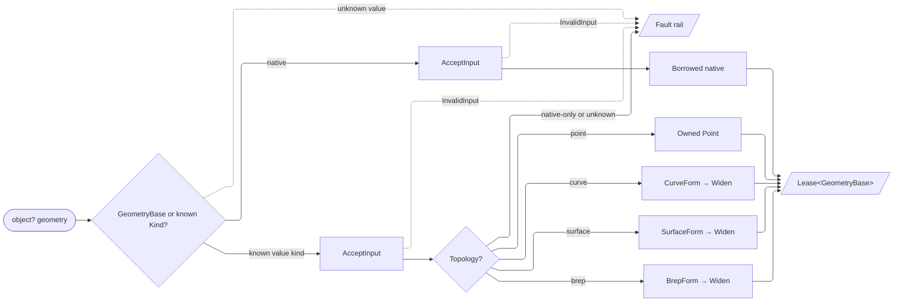

# [RASM_DOMAIN_NORMALIZATION]

The Rhino-kind taxonomy and coercion owner binds every polymorphic geometry ingress before an operation runs. `Topology` names the topological stratum, `Kind` binds each admitted Rhino type to that stratum and the frozen capability web, keyless `Capability` rows own type-level admission through `[UseDelegateFromConstructor]`, and `CurveForm` carries analytic curve classification. `Normalization` is the receiver-local coercion surface: `KindOf` resolves analytic and nominal identity, `GeometryForm` converts every admitted kernel geometry value into an ownership-bearing `Lease<GeometryBase>`, `BoundsOf` derives a box, `CoerceTo<TTarget>` projects the typed coercion lattice, and the `CurveForm`/`SurfaceForm`/`BrepForm` recoveries preserve borrowed versus minted lifetime. `PrimitiveOf` and `CurveFormOf` own tolerance-aware analytic recovery under `Context`.

`TopologyProjection` owns disposable geometry with component provenance. It carries `Lease<GeometryBase>`, `ComponentIndex`, orientation, typed projection, ownership severing, transfer detection, and batch disposal behind one carrier. `IValidityEvidence` registers the carrier with `OpAcceptance`, and `GeometryRequest` remains the request algebra owned by `Analysis/query`. Readiness composes `Requirement`, evaluation composes the form leases, and host consumers compose `GeometryForm`; this page reaches only `Rhino.Geometry` value and reference geometry.

## [01]-[INDEX]

- [01]-[TAXONOMY]: `Topology`, capability-columned `Kind`, delegate-row `Capability`, and analytic `CurveForm` own the closed kind vocabulary and its admission web.
- [02]-[COERCION]: `Normalization` owns `KindOf`, `GeometryForm`, `BoundsOf`, `CoerceTo<TTarget>`, the form leases, and analytic recovery; `TopologyProjection` owns component-aware transfer and disposal.

## [02]-[TAXONOMY]

- Owner: `Topology` `[SmartEnum<int>]` is the topological-stratum discriminant. `Kind` `[SmartEnum<int>]` binds each Rhino `Type` to a `Topology`, derives type and topology capability membership from owner-local frozen sets, resolves raw types through the lazy `ByType` index and base walk, and re-closes `Rhino.DocObjects.ObjectType` through `ByObjectType`. Keyless `Capability` rows bind `[UseDelegateFromConstructor]` `Admits(Type)` behavior, while `Coercible` and `Native` retain the pairwise relations their operands require. `CurveForm` `[Union]` carries analytic classification and its case-specific evidence.
- Cases: declarations in the fence are the registry for `Topology`, `Kind`, `Capability`, and `CurveForm`; no parallel prose roster owns membership.
- Entry: `Kind.Of(Type) : Option<Kind>` resolves type identity; `Capability.<Row>.Admits(Type) : bool` resolves admission; `Capability.Coercible(Type, Type)` and `Capability.Native(Type, Topology, params ReadOnlySpan<(Topology, Type)>)` resolve pairwise relations.
- Auto: `EvaluateTopology` owns topology evaluation admission. Sampling admits arm-by-arm at its operation, `Bound` and `OrientedBound` encode distinct request shapes, and shared predicates derive the composite capability rows. `Universal` keeps erased `object` and `GeometryBase` ingress open until the runtime value refines it.
- Packages: Thinktecture.Runtime.Extensions (`[SmartEnum<int>]`, keyless `[SmartEnum]`, `[Union]`, `[UseDelegateFromConstructor]`), LanguageExt.Core (`Option`, `Optional`), RhinoCommon (`Rhino.Geometry`, `Rhino.DocObjects.ObjectType` at the wire seam), BCL (`FrozenSet`, `FrozenDictionary`, `Lazy`).
- Growth: a Rhino geometry kind lands as a `Kind` row with capability memberships; a type-level capability lands as a `Capability` row with its predicate; an analytic classification lands as a `CurveForm` case. Generated dispatch and row reads propagate each addition.
- Boundary: `ByObjectType` is the sole `Rhino.DocObjects.ObjectType` conversion, and `Topology`, `Kind`, and `CurveForm` retain their contract names under `Rasm.Domain`. `Capability` answers type admission, `OpAcceptance` answers value validity, and `Requirement` answers readiness.

```csharp signature
// --- [RUNTIME_PRELUDE] ----------------------------------------------------------------------
using System;
using System.Collections.Frozen;
using System.Collections.Generic;
using System.Linq;
using Rasm.Csp;
using LanguageExt;
using Rhino;
using Rhino.Geometry;
using Thinktecture;
using static LanguageExt.Prelude;

namespace Rasm.Domain;

// --- [TYPES] --------------------------------------------------------------------------------
[SmartEnum<int>]
public sealed partial class Topology {
    public static readonly Topology Unknown = new(key: 0);
    public static readonly Topology Point = new(key: 1);
    public static readonly Topology Curve = new(key: 2);
    public static readonly Topology Surface = new(key: 3);
    public static readonly Topology Brep = new(key: 4);
    public static readonly Topology Mesh = new(key: 5);
    public static readonly Topology SubD = new(key: 6);
    public static readonly Topology PointCloud = new(key: 7);
    public static readonly Topology Hatch = new(key: 8);
    public static readonly Topology Extrusion = new(key: 9);
}

[SmartEnum<int>]
public sealed partial class Kind {
    public static readonly Kind Point = new(0, typeof(Point3d), Topology.Point);
    public static readonly Kind Line = new(1, typeof(Line), Topology.Curve);
    public static readonly Kind Polyline = new(2, typeof(Polyline), Topology.Curve);
    public static readonly Kind Circle = new(3, typeof(Circle), Topology.Curve);
    public static readonly Kind Arc = new(4, typeof(Arc), Topology.Curve);
    public static readonly Kind Ellipse = new(5, typeof(Ellipse), Topology.Curve);
    public static readonly Kind Curve = new(6, typeof(Curve), Topology.Curve);
    public static readonly Kind Surface = new(7, typeof(Surface), Topology.Surface);
    public static readonly Kind Plane = new(8, typeof(Plane), Topology.Surface);
    public static readonly Kind Sphere = new(9, typeof(Sphere), Topology.Surface);
    public static readonly Kind Cylinder = new(10, typeof(Cylinder), Topology.Surface);
    public static readonly Kind Cone = new(11, typeof(Cone), Topology.Surface);
    public static readonly Kind Torus = new(12, typeof(Torus), Topology.Surface);
    public static readonly Kind Brep = new(13, typeof(Brep), Topology.Brep);
    public static readonly Kind Box = new(14, typeof(Box), Topology.Brep);
    public static readonly Kind BoundingBox = new(15, typeof(BoundingBox), Topology.Brep);
    public static readonly Kind Mesh = new(16, typeof(Mesh), Topology.Mesh);
    public static readonly Kind SubD = new(17, typeof(SubD), Topology.SubD);
    public static readonly Kind PointCloud = new(18, typeof(PointCloud), Topology.PointCloud);
    public static readonly Kind Extrusion = new(19, typeof(Extrusion), Topology.Extrusion);
    public static readonly Kind Hatch = new(20, typeof(Hatch), Topology.Hatch);
    private static readonly FrozenSet<Type> CurvePrimitives = new[] { typeof(Line), typeof(Circle), typeof(Arc), typeof(Ellipse), typeof(Polyline) }.ToFrozenSet();
    private static readonly FrozenSet<Type> SurfacePrimitives = new[] { typeof(Plane), typeof(Sphere), typeof(Cylinder), typeof(Cone), typeof(Torus) }.ToFrozenSet();
    private static readonly FrozenSet<Type> BrepSources = new[] { typeof(Brep), typeof(Surface), typeof(Box), typeof(BoundingBox), typeof(Sphere), typeof(Cylinder), typeof(Cone), typeof(Torus), typeof(Extrusion), typeof(SubD) }.ToFrozenSet();
    private static readonly FrozenSet<Type> VertexReadableTypes = new[] { typeof(Point3d), typeof(Curve), typeof(Line), typeof(Polyline), typeof(Arc) }.ToFrozenSet();
    private static readonly FrozenSet<Type> EdgeReadableTypes = new[] { typeof(Line), typeof(Polyline), typeof(BoundingBox), typeof(Box) }.ToFrozenSet();
    private static readonly FrozenSet<Topology> TopologyVertexReadable = new[] { Topology.Point, Topology.Brep, Topology.Mesh, Topology.PointCloud, Topology.SubD, Topology.Extrusion }.ToFrozenSet();
    private static readonly FrozenSet<Topology> TopologyControlReadable = new[] { Topology.Curve, Topology.Surface, Topology.Brep }.ToFrozenSet();
    private static readonly FrozenSet<Topology> TopologyEdgeReadable = new[] { Topology.Brep, Topology.Mesh, Topology.SubD }.ToFrozenSet();
    private static readonly Lazy<FrozenDictionary<Type, Kind>> ByType = new(static () => Items.ToFrozenDictionary(static k => k.Type));
    internal static readonly FrozenDictionary<Rhino.DocObjects.ObjectType, Kind> ByObjectType = new (Rhino.DocObjects.ObjectType Key, Kind Value)[] {
        (Rhino.DocObjects.ObjectType.Point, Point), (Rhino.DocObjects.ObjectType.Curve, Curve), (Rhino.DocObjects.ObjectType.Surface, Surface),
        (Rhino.DocObjects.ObjectType.Brep, Brep), (Rhino.DocObjects.ObjectType.Mesh, Mesh), (Rhino.DocObjects.ObjectType.SubD, SubD),
        (Rhino.DocObjects.ObjectType.PointSet, PointCloud), (Rhino.DocObjects.ObjectType.Hatch, Hatch), (Rhino.DocObjects.ObjectType.Extrusion, Extrusion),
    }.ToFrozenDictionary(keySelector: static p => p.Key, elementSelector: static p => p.Value);
    public Type Type { get; }
    public Topology Topology { get; }
    internal bool CanBound => Type != typeof(Plane);
    internal bool CanOrientedBound => Type != typeof(Plane) && Type != typeof(Sphere);
    internal bool CanReadVertices => VertexReadableTypes.Contains(Type) || TopologyVertexReadable.Contains(Topology);
    internal bool CanReadControlPoints => TopologyControlReadable.Contains(Topology);
    internal bool CanReadEdges => EdgeReadableTypes.Contains(Type) || TopologyEdgeReadable.Contains(Topology);
    internal bool CanCoerceTo(Type target) =>
        target.IsAssignableFrom(Type)
        || (target == typeof(Box) && Type == typeof(Brep))
        || (target == typeof(Curve) && Topology == Topology.Curve)
        || (CurvePrimitives.Contains(target) && Type == typeof(Curve))
        || (SurfacePrimitives.Contains(target) && (Type == typeof(Brep) || Type == typeof(Surface)))
        || (target == typeof(Brep) && BrepSources.Contains(Type));
    public static Option<Kind> Of(Type type) {
        ArgumentNullException.ThrowIfNull(argument: type);
        return type == typeof(Rhino.Geometry.Point)
            ? Some(Point)
            : Optional(ByType.Value.GetValueOrDefault(key: type)) | (InheritsBase(type: type) is Type bt ? Optional(ByType.Value.GetValueOrDefault(key: bt)) : Option<Kind>.None);
    }
    private static Type? InheritsBase(Type type) => type.BaseType is Type b ? (ByType.Value.ContainsKey(key: b) ? b : InheritsBase(type: b)) : null;
}

[SmartEnum]
internal sealed partial class Capability {
    public static readonly Capability CurveForm = new(admits: CurveFormAdmits);
    public static readonly Capability SurfaceForm = new(admits: SurfaceFormAdmits);
    public static readonly Capability BrepForm = new(admits: static type => Universal(type: type) || Coercible(source: type, target: typeof(Brep)));
    public static readonly Capability Bound = new(admits: static type => Universal(type: type) || typeof(GeometryBase).IsAssignableFrom(c: type) || KindAdmits(type: type, predicate: static kind => kind.CanBound));
    public static readonly Capability OrientedBound = new(admits: static type => Universal(type: type) || typeof(GeometryBase).IsAssignableFrom(c: type) || KindAdmits(type: type, predicate: static kind => kind.CanOrientedBound));
    public static readonly Capability DecomposeFaces = new(admits: static type =>
        Universal(type: type) || typeof(BrepFace).IsAssignableFrom(c: type) || KindAdmits(type: type, predicate: static kind => kind.CanCoerceTo(target: typeof(Brep))));
    public static readonly Capability EvaluateTopology = new(admits: static type =>
        Universal(type: type) || typeof(Mesh).IsAssignableFrom(c: type) || typeof(Brep).IsAssignableFrom(c: type)
        || KindAdmits(type: type, predicate: static kind => kind.Topology == Topology.Mesh || kind.Topology == Topology.Brep || kind.CanCoerceTo(target: typeof(Brep))));
    public static readonly Capability Closest = new(admits: static type =>
        Universal(type: type) || type == typeof(Point3d) || type == typeof(Rhino.Geometry.Point)
        || typeof(PointCloud).IsAssignableFrom(c: type) || typeof(Brep).IsAssignableFrom(c: type) || typeof(Mesh).IsAssignableFrom(c: type)
        || type == typeof(Box) || type == typeof(BoundingBox) || CurveFormAdmits(type: type) || SurfaceFormAdmits(type: type));
    public static readonly Capability ClosestNormal = new(admits: ClosestNormalAdmits);
    public static readonly Capability ClosestTangent = new(admits: ClosestTangentAdmits);
    public static readonly Capability ClosestFrame = new(admits: static type =>
        Universal(type: type) || type == typeof(Plane) || ClosestTangentAdmits(type: type) || SurfaceFormAdmits(type: type)
        || typeof(BrepFace).IsAssignableFrom(c: type) || typeof(Mesh).IsAssignableFrom(c: type));
    public static readonly Capability SignedDistance = new(admits: static type =>
        type == typeof(Plane) || type == typeof(Sphere) || type == typeof(Box) || type == typeof(BoundingBox) || ClosestNormalAdmits(type: type));
    public static readonly Capability ReadVertices = new(admits: static type => Universal(type: type) || KindAdmits(type: type, predicate: static kind => kind.CanReadVertices));
    [UseDelegateFromConstructor]
    internal partial bool Admits(Type type);
    internal static bool Universal(Type type) => type == typeof(object) || type == typeof(GeometryBase);
    internal static bool Coercible(Type source, Type target) =>
        Universal(type: source) || Kind.Of(type: source).Map(kind => kind.CanCoerceTo(target: target)).IfNone(target.IsAssignableFrom(c: source));
    internal static bool Native(Type type, Topology topology, params ReadOnlySpan<(Topology Topology, Type Native)> candidates) {
        foreach ((Topology candidate, Type native) in candidates) {
            if (candidate.Equals(topology) && native.IsAssignableFrom(c: type)) { return true; }
        }
        return false;
    }
    private static bool KindAdmits(Type type, Func<Kind, bool> predicate) => Kind.Of(type: type).Map(predicate).IfNone(noneValue: false);
    private static bool CurveFormAdmits(Type type) => typeof(Curve).IsAssignableFrom(c: type) || Universal(type: type) || KindAdmits(type: type, predicate: static kind => kind.Topology == Topology.Curve);
    private static bool SurfaceFormAdmits(Type type) =>
        Universal(type: type) || typeof(Surface).IsAssignableFrom(c: type) || typeof(Brep).IsAssignableFrom(c: type) || KindAdmits(type: type, predicate: static kind => kind.Topology == Topology.Surface);
    private static bool ClosestNormalAdmits(Type type) =>
        Universal(type: type) || SurfaceFormAdmits(type: type) || typeof(PointCloud).IsAssignableFrom(c: type)
        || typeof(BrepFace).IsAssignableFrom(c: type) || typeof(Brep).IsAssignableFrom(c: type) || typeof(Mesh).IsAssignableFrom(c: type);
    private static bool ClosestTangentAdmits(Type type) =>
        Universal(type: type) || type == typeof(Line) || type == typeof(Polyline) || typeof(Brep).IsAssignableFrom(c: type) || CurveFormAdmits(type: type);
}

[Union]
public partial record CurveForm {
    public sealed record LineCase(Line Value) : CurveForm;
    public sealed record CircleCase(Circle Value) : CurveForm;
    public sealed record ArcCase(Arc Value) : CurveForm;
    public sealed record EllipseCase(Ellipse Value) : CurveForm;
    public sealed record PolylineCase(Polyline Value, bool IsClosed) : CurveForm;
    public sealed record NurbsCase(int Degree, bool IsClosed, bool IsPlanar, bool IsPeriodic, int SpanCount, int Dimension) : CurveForm;
}
```

## [03]-[COERCION]

- Owner: `Normalization` is the internal coercion owner consumed across the friend-assembly seam. Its `extension(object? geometry)` block resolves kind, converts the complete geometry vocabulary to `Lease<GeometryBase>`, derives bounds, and projects typed coercions. `GeometryForm` classifies the source shape before value admission, borrows an admitted native `GeometryBase`, creates an owned `Rhino.Geometry.Point` for an admitted `Point3d`, and total-dispatches every remaining topology through the existing `CurveForm`, `SurfaceForm`, and `BrepForm` leases. `Widen` transfers those lease cases to `Lease<GeometryBase>` without consuming or duplicating their resources. `CurveFormOf` and `PrimitiveOf` own tolerance-aware analytic recovery. `TopologyProjection` owns component provenance, typed projection, ownership severing, transfer detection, and disposal.
- Cases: declarations and generated dispatch in the fence are the registry for kind inference, geometry-form conversion, bounds, typed coercion, form recovery, and projection validity; no prose count owns closure.
- Entry: `geometry.KindOf(context)`, `geometry.GeometryForm(key)`, `geometry.BoundsOf(key)`, and `geometry.CoerceTo<TTarget>(context, key)` form the receiver-local ingress. Every refusal remains `Fin`-typed as `InvalidInput` or `Unsupported`.
- Auto: `KindOf` prefers analytic identity before native and declared identity. `GeometryForm` reconstructs topology from the source type, so callers supply no kind, context, ownership, or conversion-mode knob. A native source and a recognized value kind each pass `OpAcceptance` before conversion; an unrecognized non-native type fails as `Unsupported` before the validity oracle can relabel it. Native reference geometry remains borrowed, and every admitted value primitive becomes owned through the relevant existing form recovery. `CoerceTo<TTarget>` type-checks recovered primitives, `BrepForm` derives ownership from reference identity, and `TopologyProjection` ties its face bridge to carrier disposal.
- Packages: RhinoCommon (`Rhino.Geometry.Point(Point3d)`, `Brep.TryConvertBrep`, analytic `Curve` and `Surface` recovery, primitive-to-form construction, geometry duplication, `ComponentIndex`), LanguageExt.Core (`Fin`, `Option`, `Seq`, `guard`), Thinktecture.Runtime.Extensions (`[Union]`, generated `Switch`), Foundation analyzer contracts (`[BoundaryAdapter]`).
- Growth: a geometry kind lands in `Kind` and the relevant form lattice; generated `Topology.Switch` forces `GeometryForm` to classify the new stratum. A typed coercion target lands in `PrimitiveOf`, and a projection source lands in `TopologyProjection` with its validity law.
- Boundary: `GeometryRequest` stays in `Analysis/query`, evaluation and sampling stay in `Domain/evaluation`, and readiness stays in `Domain/validation`. Coercion reads `Rhino.Geometry` values and reference geometry only; document access enters through `Context.Of(RhinoDoc)` outside this owner.

```csharp signature
// --- [RUNTIME_PRELUDE] ----------------------------------------------------------------------
using System;
using System.Collections.Generic;
using System.Linq;
using Rasm.Csp;
using LanguageExt;
using Rhino;
using Rhino.Geometry;
using Thinktecture;
using static LanguageExt.Prelude;

namespace Rasm.Domain;

// --- [MODELS] -------------------------------------------------------------------------------
[BoundaryAdapter]
public sealed record TopologyProjection : IValidityEvidence, IDisposable {
    private static readonly Op Key = Op.Of(name: nameof(TopologyProjection));
    private readonly Lease<GeometryBase> value;
    private readonly bool detachedSingleFace;
    private Option<Lease<Brep>> faceBrep;
    private TopologyProjection(Lease<GeometryBase> value, ComponentIndex source, bool reversed = false, bool detachedSingleFace = false) {
        this.value = value;
        this.detachedSingleFace = detachedSingleFace;
        Source = source;
        Reversed = reversed;
    }
    public static TopologyProjection Of(Curve curve, ComponentIndex source) {
        ArgumentNullException.ThrowIfNull(argument: curve);
        return new(value: new Lease<GeometryBase>.Owned(Value: curve), source: source);
    }
    public static TopologyProjection Of(BrepFace face) {
        ArgumentNullException.ThrowIfNull(argument: face);
        return new(
            value: new Lease<GeometryBase>.Borrowed(Value: face),
            source: new ComponentIndex(type: ComponentIndexType.BrepFace, index: face.FaceIndex),
            reversed: face.OrientationIsReversed);
    }
    public static TopologyProjection Of(Lease<GeometryBase> geometry, ComponentIndex source, bool reversed = false) {
        ArgumentNullException.ThrowIfNull(argument: geometry);
        return new(value: geometry, source: source, reversed: reversed);
    }
    public static Fin<TopologyProjection> FromMesh(Mesh? mesh, ComponentIndex source) =>
        Optional(mesh).ToFin(Key.InvalidInput()).Bind(native =>
            new TopologyProjection(value: new Lease<GeometryBase>.Borrowed(Value: native), source: source) switch {
                { IsValid: true } projection => Fin.Succ(projection),
                _ => Fin.Fail<TopologyProjection>(Key.InvalidInput()),
            });
    private static TopologyProjection Detached(BrepFace face) => new(
        value: new Lease<GeometryBase>.Owned(Value: face.DuplicateFace(duplicateMeshes: false)),
        source: new ComponentIndex(type: ComponentIndexType.BrepFace, index: face.FaceIndex),
        reversed: face.OrientationIsReversed,
        detachedSingleFace: true);
    public GeometryBase Value => value.Resource;
    public ComponentIndex Source { get; }
    public bool Reversed { get; }
    public bool IsValid => ValidityClaim.Of((Value, Source) switch {
        (Curve { IsValid: true }, _) => true,
        (Brep brep, { ComponentIndexType: ComponentIndexType.BrepFace, Index: int f }) => brep.IsValid && f >= 0 && (f < brep.Faces.Count || (detachedSingleFace && brep.Faces.Count == 1)),
        (BrepFace face, { ComponentIndexType: ComponentIndexType.BrepFace, Index: int f }) => face.IsValid && f >= 0 && f == face.FaceIndex,
        (Mesh mesh, { ComponentIndexType: ComponentIndexType.MeshFace, Index: int f }) => mesh.IsValid && f >= 0 && f < mesh.Faces.Count,
        (Mesh mesh, { ComponentIndexType: ComponentIndexType.MeshNgon, Index: int n }) => mesh.IsValid && n >= 0 && n < mesh.Ngons.Count,
        (GeometryBase { IsValid: true }, { ComponentIndexType: not ComponentIndexType.InvalidType }) => true,
        _ => false,
    });
    public Option<T> As<T>() where T : class =>
        Value is T match ? Some(match)
        : typeof(T) == typeof(BrepFace) && Value is Brep { Faces.Count: > 0 } brep && Source is { ComponentIndexType: ComponentIndexType.BrepFace, Index: int faceIndex } ? faceIndex switch {
            >= 0 when faceIndex < brep.Faces.Count => Some((T)(object)brep.Faces[faceIndex]),
            >= 0 when detachedSingleFace && brep.Faces.Count == 1 => Some((T)(object)brep.Faces[0]),
            _ => Option<T>.None,
        }
        : typeof(T) == typeof(Brep) && Value is BrepFace face
            ? faceBrep.Case switch {
                Lease<Brep> lease => Some((T)(object)lease.Resource),
                _ => Optional(face.DuplicateFace(duplicateMeshes: false)).Map(brep => { faceBrep = new Lease<Brep>.Owned(Value: brep); return (T)(object)brep; }),
            }
            : Option<T>.None;
    public Fin<T> As<T>(Op key) where T : class =>
        As<T>().ToFin(Fail: key.Unsupported(geometryType: Value.GetType(), outputType: typeof(T)));
    public TopologyProjection DetachFrom(GeometryBase source) {
        ArgumentNullException.ThrowIfNull(argument: source);
        return (Value, source) switch {
            (BrepFace face, _) when ReferenceEquals(objA: face.Brep, objB: source) => Detached(face: face),
            (Mesh mesh, Mesh owner) when ReferenceEquals(objA: mesh, objB: owner) && IsValid =>
                new(value: new Lease<GeometryBase>.Owned(Value: mesh.DuplicateMesh()), source: Source, reversed: Reversed),
            (GeometryBase shared, _) when ReferenceEquals(objA: shared, objB: source) =>
                new(value: new Lease<GeometryBase>.Owned(Value: shared.Duplicate()), source: Source, reversed: Reversed),
            _ => this,
        };
    }
    public bool Transfers(Type outputType) {
        ArgumentNullException.ThrowIfNull(argument: outputType);
        return outputType.IsAssignableFrom(typeof(TopologyProjection))
            || (Value is Curve curve && outputType.IsInstanceOfType(curve))
            || (Value is Brep or BrepFace && outputType.IsAssignableFrom(typeof(Brep)));
    }
    public bool Transfers(object? output) =>
        output switch {
            null => false,
            TopologyProjection projection => SameAs(other: projection),
            GeometryBase geometry => ReferenceEquals(objA: Value, objB: geometry) || (Value, geometry) switch {
                (Brep brep, BrepFace face) => ReferenceEquals(objA: brep, objB: face.Brep),
                (BrepFace face, Brep brep) => ReferenceEquals(objA: face.Brep, objB: brep),
                (BrepFace source, BrepFace face) => ReferenceEquals(objA: source.Brep, objB: face.Brep),
                _ => false,
            },
            _ => false,
        };
    public void Dispose() {
        _ = value.Dispose();
        _ = faceBrep.Iter(static owned => owned.Dispose());
    }
    private bool SameAs(TopologyProjection? other) =>
        other switch { TopologyProjection p => ReferenceEquals(objA: Value, objB: p.Value) && Source.Equals(p.Source), _ => false };
    internal static Fin<Seq<TValue>> Project<TValue>(Seq<TopologyProjection> all, Seq<TopologyProjection> chosen, Func<Seq<TopologyProjection>, Fin<Seq<TValue>>> project) {
        Fin<Seq<TValue>> result = project(chosen);
        _ = all.Filter(v => !result.IsSucc || !chosen.Exists(c => c.SameAs(other: v) && c.Transfers(outputType: typeof(TValue)))).Iter(static v => v.Dispose());
        return result;
    }
}

// --- [OPERATIONS] ---------------------------------------------------------------------------
[BoundaryAdapter]
internal static class Normalization {
    extension(object? geometry) {
        public Fin<Kind> KindOf(Context context) {
            Op key = Op.Of(name: nameof(Kind));
            return Optional(geometry).ToFin(key.InvalidInput()).Bind(g =>
                (InferredKind(geometry: g, context: context, key: key) | NativeKind(geometry: g) | Kind.Of(type: g.GetType()))
                .ToFin(key.InvalidInput()));
        }
        public Fin<Lease<GeometryBase>> GeometryForm(Op key) =>
            Optional(geometry).ToFin(key.InvalidInput()).Bind(source => source switch {
                GeometryBase native => key.AcceptInput(value: native)
                    .Map(static admitted => (Lease<GeometryBase>)new Lease<GeometryBase>.Borrowed(Value: admitted)),
                _ => Kind.Of(type: source.GetType())
                    .ToFin(key.Unsupported(geometryType: source.GetType(), outputType: typeof(GeometryBase)))
                    .Bind(kind => key.AcceptInput(value: source).Bind(value => kind.Topology.Switch(
                        state: (Source: value, Key: key),
                        unknown: static state => UnsupportedGeometry(source: state.Source, key: state.Key),
                        point: static state => state.Source is Point3d point
                            ? Fin.Succ<Lease<GeometryBase>>(new Lease<GeometryBase>.Owned(Value: new Rhino.Geometry.Point(location: point)))
                            : UnsupportedGeometry(source: state.Source, key: state.Key),
                        curve: static state => CurveForm(source: state.Source, key: state.Key).Map(static lease => Widen(lease: lease)),
                        surface: static state => SurfaceForm(source: state.Source, key: state.Key).Map(static lease => Widen(lease: lease)),
                        brep: static state => BrepForm(source: state.Source, key: state.Key).Map(static lease => Widen(lease: lease)),
                        mesh: static state => UnsupportedGeometry(source: state.Source, key: state.Key),
                        subD: static state => UnsupportedGeometry(source: state.Source, key: state.Key),
                        pointCloud: static state => UnsupportedGeometry(source: state.Source, key: state.Key),
                        hatch: static state => UnsupportedGeometry(source: state.Source, key: state.Key),
                        extrusion: static state => UnsupportedGeometry(source: state.Source, key: state.Key)))),
            });
        public Fin<BoundingBox> BoundsOf(Op key) =>
            Optional(geometry).ToFin(key.InvalidInput()).Bind(g => OpAcceptance.ValidityOf(source: g).Case switch {
                false => Fin.Fail<BoundingBox>(key.InvalidInput()),
                true => g switch {
                    BoundingBox box => Fin.Succ(box),
                    Box box => Fin.Succ(box.BoundingBox),
                    Sphere sphere => Fin.Succ(sphere.BoundingBox),
                    Line line => Fin.Succ(line.BoundingBox),
                    Polyline polyline => Fin.Succ(polyline.BoundingBox),
                    Circle circle => Fin.Succ(circle.BoundingBox),
                    Arc arc => Fin.Succ(arc.BoundingBox()),
                    Point3d point => Fin.Succ(new BoundingBox(point, point)),
                    Plane => Fin.Fail<BoundingBox>(key.Unsupported(geometryType: typeof(Plane), outputType: typeof(BoundingBox))),
                    Ellipse => CurveForm(source: g, key: key).Map(static lease => lease.Use(static d => d.GetBoundingBox(accurate: true))),
                    Cylinder or Cone or Torus => BrepForm(source: g, key: key).Map(static lease => lease.Use(static d => d.GetBoundingBox(accurate: true))),
                    GeometryBase native => guard(native.IsValid, key.InvalidInput()).ToFin().Map(_ => native.GetBoundingBox(accurate: true)),
                    _ => Fin.Fail<BoundingBox>(key.Unsupported(geometryType: g.GetType(), outputType: typeof(BoundingBox))),
                },
                _ => Fin.Fail<BoundingBox>(key.InvalidInput()),
            });
        public Fin<TTarget> CoerceTo<TTarget>(Context context, Op key) where TTarget : notnull =>
            Optional(geometry).ToFin(key.InvalidInput()).Bind(s => s switch {
                TTarget target => key.AcceptValue(value: target),
                _ => Kind.Of(type: typeof(TTarget))
                    .Bind(kind => PrimitiveOf(kind: kind, source: s, context: context, key: key))
                    .Bind(static recovered => recovered is TTarget typed ? Some(typed) : Option<TTarget>.None)
                    .ToFin(key.Unsupported(geometryType: s.GetType(), outputType: typeof(TTarget))),
            });
    }
    internal static Fin<Lease<Curve>> CurveForm(object? source, Op key) =>
        Optional(source).ToFin(key.InvalidInput()).Bind(value => value switch {
            Curve curve => Fin.Succ<Lease<Curve>>(new Lease<Curve>.Borrowed(Value: curve)),
            Line line when line.IsValid => Fin.Succ<Lease<Curve>>(new Lease<Curve>.Owned(Value: new LineCurve(line))),
            Polyline polyline when polyline.IsValid => Optional(polyline.ToPolylineCurve()).ToFin(key.InvalidResult()).Map(static curve => (Lease<Curve>)new Lease<Curve>.Owned(Value: curve)),
            Circle circle when circle.IsValid => Fin.Succ<Lease<Curve>>(new Lease<Curve>.Owned(Value: new ArcCurve(circle))),
            Arc arc when arc.IsValid => Fin.Succ<Lease<Curve>>(new Lease<Curve>.Owned(Value: new ArcCurve(arc))),
            Ellipse ellipse when ellipse.IsValid => Optional(ellipse.ToNurbsCurve()).ToFin(key.InvalidResult()).Map(static curve => (Lease<Curve>)new Lease<Curve>.Owned(Value: curve)),
            _ => Fin.Fail<Lease<Curve>>(key.Unsupported(geometryType: value.GetType(), outputType: typeof(Curve))),
        });
    internal static Fin<Lease<Surface>> SurfaceForm(object? source, Op key) =>
        Optional(source).ToFin(key.InvalidInput()).Bind(value => value switch {
            Surface surface => Fin.Succ<Lease<Surface>>(new Lease<Surface>.Borrowed(Value: surface)),
            Plane plane when plane.IsValid => Fin.Succ<Lease<Surface>>(new Lease<Surface>.Owned(Value: new PlaneSurface(plane))),
            Sphere sphere when sphere.IsValid => Optional(sphere.ToNurbsSurface()).ToFin(key.InvalidResult()).Map(static surface => (Lease<Surface>)new Lease<Surface>.Owned(Value: surface)),
            Cylinder cylinder when cylinder.IsValid => Optional(cylinder.ToNurbsSurface()).ToFin(key.InvalidResult()).Map(static surface => (Lease<Surface>)new Lease<Surface>.Owned(Value: surface)),
            Cone cone when cone.IsValid => Optional(cone.ToNurbsSurface()).ToFin(key.InvalidResult()).Map(static surface => (Lease<Surface>)new Lease<Surface>.Owned(Value: surface)),
            Torus torus when torus.IsValid => Optional(torus.ToNurbsSurface()).ToFin(key.InvalidResult()).Map(static surface => (Lease<Surface>)new Lease<Surface>.Owned(Value: surface)),
            Brep { IsSurface: true, Faces.Count: > 0 } brep => Fin.Succ<Lease<Surface>>(new Lease<Surface>.Borrowed(Value: brep.Faces[0])),
            _ => Fin.Fail<Lease<Surface>>(key.Unsupported(geometryType: value.GetType(), outputType: typeof(Surface))),
        });
    internal static Fin<Lease<Brep>> BrepForm(object? source, Op key) =>
        Optional(source).ToFin(key.InvalidInput()).Bind(value => value switch {
            Brep brep => Fin.Succ<Lease<Brep>>(new Lease<Brep>.Borrowed(Value: brep)),
            GeometryBase { HasBrepForm: true } native => Optional(Brep.TryConvertBrep(native)).ToFin(key.InvalidResult())
                .Map(brep => ReferenceEquals(objA: native, objB: brep) ? (Lease<Brep>)new Lease<Brep>.Borrowed(Value: brep) : new Lease<Brep>.Owned(Value: brep)),
            Box box => Optional(box.ToBrep()).ToFin(key.InvalidResult()).Map(static brep => (Lease<Brep>)new Lease<Brep>.Owned(Value: brep)),
            BoundingBox box => Optional(box.ToBrep()).ToFin(key.InvalidResult()).Map(static brep => (Lease<Brep>)new Lease<Brep>.Owned(Value: brep)),
            Sphere sphere => Optional(sphere.ToBrep()).ToFin(key.InvalidResult()).Map(static brep => (Lease<Brep>)new Lease<Brep>.Owned(Value: brep)),
            Cylinder cylinder => Optional(cylinder.ToBrep(capBottom: true, capTop: true)).ToFin(key.InvalidResult()).Map(static brep => (Lease<Brep>)new Lease<Brep>.Owned(Value: brep)),
            Cone cone => Optional(cone.ToBrep(capBottom: true)).ToFin(key.InvalidResult()).Map(static brep => (Lease<Brep>)new Lease<Brep>.Owned(Value: brep)),
            Torus torus => Optional(torus.ToBrep()).ToFin(key.InvalidResult()).Map(static brep => (Lease<Brep>)new Lease<Brep>.Owned(Value: brep)),
            Extrusion extrusion => Optional(extrusion.ToBrep()).ToFin(key.InvalidResult()).Map(static brep => (Lease<Brep>)new Lease<Brep>.Owned(Value: brep)),
            SubD subd => Optional(subd.ToBrep(SubDToBrepOptions.Default)).ToFin(key.InvalidResult()).Map(static brep => (Lease<Brep>)new Lease<Brep>.Owned(Value: brep)),
            _ => Fin.Fail<Lease<Brep>>(key.Unsupported(geometryType: value.GetType(), outputType: typeof(Brep))),
        });
    private static Lease<GeometryBase> Widen<TGeometry>(Lease<TGeometry> lease) where TGeometry : GeometryBase =>
        lease.Switch(
            owned: static owned => (Lease<GeometryBase>)new Lease<GeometryBase>.Owned(Value: owned.Value),
            borrowed: static borrowed => (Lease<GeometryBase>)new Lease<GeometryBase>.Borrowed(Value: borrowed.Value));
    private static Fin<Lease<GeometryBase>> UnsupportedGeometry(object source, Op key) =>
        Fin.Fail<Lease<GeometryBase>>(key.Unsupported(geometryType: source.GetType(), outputType: typeof(GeometryBase)));
    internal static Fin<CurveForm> CurveFormOf(Curve curve, Context context) =>
        Fin.Succ<CurveForm>(curve switch {
            _ when curve.IsLinear(tolerance: context.Absolute.Value) => new CurveForm.LineCase(Value: new Line(from: curve.PointAtStart, to: curve.PointAtEnd)),
            _ when curve.TryGetCircle(circle: out Circle c, tolerance: context.Absolute.Value) => new CurveForm.CircleCase(Value: c),
            _ when curve.TryGetArc(arc: out Arc a, tolerance: context.Absolute.Value) => new CurveForm.ArcCase(Value: a),
            _ when curve.TryGetEllipse(ellipse: out Ellipse e, tolerance: context.Absolute.Value) => new CurveForm.EllipseCase(Value: e),
            _ when curve.TryGetPolyline(polyline: out Polyline p) => new CurveForm.PolylineCase(Value: p, IsClosed: curve.IsClosed),
            _ => new CurveForm.NurbsCase(Degree: curve.Degree, IsClosed: curve.IsClosed, IsPlanar: curve.IsPlanar(tolerance: context.Absolute.Value), IsPeriodic: curve.IsPeriodic, SpanCount: curve.SpanCount, Dimension: curve.Dimension),
        });
    internal static Option<object> PrimitiveOf(Kind kind, object source, Context context, Op key) =>
        (kind.Type, source) switch {
            (Type t, Rhino.Geometry.Point point) when t == typeof(Point3d) => Some((object)point.Location),
            (Type t, Brep brep) when t == typeof(Box) =>
                brep.IsBox(context.Absolute.Value) && brep.Faces[0].UnderlyingSurface().TryGetPlane(out Plane plane, context.Absolute.Value) && new Box(plane, brep) is { IsValid: true } box
                    ? Some((object)box)
                    : Option<object>.None,
            (Type t, object value) when t == typeof(Curve) => CurveForm(source: value, key: key).ToOption().Map(static lease => (object)lease.Resource),
            (Type t, Curve curve) when t == typeof(Line) || t == typeof(Circle) || t == typeof(Arc) || t == typeof(Ellipse) || t == typeof(Polyline) =>
                CurveFormOf(curve: curve, context: context).ToOption().Bind(form => (t, form) switch {
                    (Type output, CurveForm.LineCase line) when output == typeof(Line) => Some((object)line.Value),
                    (Type output, CurveForm.CircleCase circle) when output == typeof(Circle) => Some((object)circle.Value),
                    (Type output, CurveForm.ArcCase arc) when output == typeof(Arc) => Some((object)arc.Value),
                    (Type output, CurveForm.EllipseCase ellipse) when output == typeof(Ellipse) => Some((object)ellipse.Value),
                    (Type output, CurveForm.PolylineCase polyline) when output == typeof(Polyline) => Some((object)polyline.Value),
                    _ => Option<object>.None,
                }),
            (Type t, Brep { IsSurface: true, Faces.Count: > 0 } brep) when t == typeof(Plane) || t == typeof(Sphere) || t == typeof(Cylinder) || t == typeof(Cone) || t == typeof(Torus) =>
                PrimitiveOf(kind: kind, source: brep.Faces[0], context: context, key: key),
            (Type t, Surface surface) when t == typeof(Plane) && surface.TryGetPlane(out Plane value, context.Absolute.Value) => Some((object)value),
            (Type t, Surface surface) when t == typeof(Sphere) && surface.TryGetSphere(out Sphere value, context.Absolute.Value) => Some((object)value),
            (Type t, Surface surface) when t == typeof(Cylinder) && surface.TryGetFiniteCylinder(out Cylinder value, context.Absolute.Value) => Some((object)value),
            (Type t, Surface surface) when t == typeof(Cone) && surface.TryGetCone(out Cone value, context.Absolute.Value) => Some((object)value),
            (Type t, Surface surface) when t == typeof(Torus) && surface.TryGetTorus(out Torus value, context.Absolute.Value) => Some((object)value),
            (Type t, object value) when t == typeof(Brep) => BrepForm(source: value, key: key).ToOption().Map(static lease => (object)lease.Resource),
            _ => Option<object>.None,
        };
    private static Option<Kind> InferredKind(object geometry, Context context, Op key) =>
        geometry switch {
            Curve curve => CurveFormOf(curve: curve, context: context).ToOption().Bind(static form => form switch {
                CurveForm.LineCase => Some(Kind.Line),
                CurveForm.CircleCase => Some(Kind.Circle),
                CurveForm.ArcCase => Some(Kind.Arc),
                CurveForm.EllipseCase => Some(Kind.Ellipse),
                CurveForm.PolylineCase => Some(Kind.Polyline),
                _ => Option<Kind>.None,
            }),
            Brep => Seq(Kind.Box, Kind.Plane, Kind.Sphere, Kind.Cylinder, Kind.Cone, Kind.Torus)
                .Choose(kind => PrimitiveOf(kind: kind, source: geometry, context: context, key: key).Map(_ => kind)).Head,
            Surface => Seq(Kind.Plane, Kind.Sphere, Kind.Cylinder, Kind.Cone, Kind.Torus)
                .Choose(kind => PrimitiveOf(kind: kind, source: geometry, context: context, key: key).Map(_ => kind)).Head,
            _ => Option<Kind>.None,
        };
    private static Option<Kind> NativeKind(object geometry) =>
        geometry is GeometryBase native
            ? Optional(Kind.ByObjectType.GetValueOrDefault(native.ObjectType)) | (native.HasBrepForm ? Some(Kind.Brep) : Option<Kind>.None)
            : Option<Kind>.None;
}
```



## [04]-[DENSITY_BAR]

One owner per axis; capability is a row, case, or fold arm, never a sibling surface.

| [INDEX] | [OWNER]              | [SHAPE]                                   | [RAIL]                              |
| :-----: | :------------------- | :---------------------------------------- | :---------------------------------- |
|  [01]   | `Topology`           | `[SmartEnum<int>]`                        | pure discriminant                   |
|  [02]   | `Kind`               | columned `[SmartEnum<int>]` + frozen sets | `Kind.Of → Option<Kind>`            |
|  [03]   | `Capability`         | delegate-row keyless `[SmartEnum]`        | `Admits → bool`                     |
|  [04]   | `CurveForm`          | analytic `[Union]`                        | `CurveFormOf → Fin<CurveForm>`      |
|  [05]   | `Normalization`      | receiver ingress + form leases            | `Fin<T>` / `Fin<Lease<T>>`          |
|  [06]   | `TopologyProjection` | component-aware `IValidityEvidence` lease | typed factories and `As<T>` results |

`Capability` owns the type-admission web, `Normalization` owns every erased geometry conversion, and `TopologyProjection` owns component-aware resource transfer. Every fence composes `Op`, `Fault`, `Lease<T>`, and `Context` and depends on no live-host member beyond `Rhino.Geometry`.

## [05]-[RESEARCH]

- [TAXONOMY_WEB] — `Kind` binds nominal type, topological stratum, and capability membership in each row, and the frozen sets remain the primary correspondence from which predicates derive. `Kind.Of` walks `BaseType` so host subclasses resolve their declared row, while `Rhino.Geometry.Point` maps to the `Point3d` identity. `Capability` rows bind private predicates, so composite admission reads settled behavior without smart-enum initialization-order coupling.
- [COERCION_LATTICE] — `KindOf` probes analytic recovery before nominal typing. `GeometryForm` first separates native geometry from recognized value kinds: each branch admits through `OpAcceptance`, an unknown non-native type fails as `Unsupported`, native geometry borrows, `Point3d` mints `Rhino.Geometry.Point`, and curve-, surface-, and brep-topology values reuse form leases through `Widen`. Total `Topology.Switch` routes non-native values on native-only strata to `Unsupported`, tolerance-sensitive recovery threads `Context`, and every minted conversion travels `Lease<T>.Owned`.
- [CARRIER_PROTOCOL] — `TopologyProjection` transfers a resource only when reference identity, face-to-brep co-ownership, or output assignability proves the handoff. `Project` disposes every non-transferred projection, `As<T>` ties any minted face bridge to the carrier, and `DetachFrom` duplicates only when ownership remains shared. `IValidityEvidence` registers the carrier through the common acceptance oracle.
- [NORMALIZATION_CONSUMERS] — `Requirement.ForKind` reads `Kind.Topology`, validation and evaluation consume the typed form leases, analysis reads capability rows and coercion entries, and host-boundary geometry intake composes `GeometryForm`. Consumers never enumerate the Rhino value-to-geometry conversion space locally.
