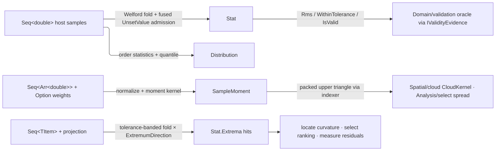

# [RASM_DOMAIN_STATS]

`Rasm.Domain` statistics is the kernel's evidence layer over scalar samples: every summary, extremum, quantile, and moment a host evaluation produces becomes one typed, admitted receipt minted here. Each receipt carries its own validity invariant, so a downstream reader trusts the summary without re-inspecting the samples behind it.

Every receipt composes the `Domain/rails` `ValidityClaim` rows and re-enters the `Domain/validation` oracle through `Op.AcceptValue`, registering through the single `IValidityEvidence` arm.

## [01]-[INDEX]

- [02]-[STATISTICS]: `ScalarMetric`/`ExtremumDirection`/`StatContext` vocabulary, the Welford `Stat.Of` fold and tolerance-banded `Stat.Extrema`, `Distribution` quantiles, and the `SampleMoment` packed covariance.

## [02]-[STATISTICS]

- Owner: `ScalarMetric` `[SmartEnum<int>]` maps a geometry scalar (`Magnitude`/`Gaussian`/`Mean`) to its value through one total generated `Switch` per payload shape; `ExtremumDirection` `[SmartEnum<int>]` carries the ±1 sign the extrema fold multiplies through; `StatContext` `[Union]` carries summary provenance (`None`/`Metric`/`Tolerance`), the tolerance case deriving its verdict at construction; `Stat` `readonly record struct` is the six-field Welford summary owning the `Of` fold and the generic `Extrema<TItem>` fold; `Distribution` `readonly record struct` carries median/IQR/percentile order statistics; `SampleMoment` internal `readonly record struct` owns weighted first and second moments as a packed upper-triangular covariance behind a symmetric `this[row, column]` indexer.
- Cases: `ScalarMetric` — `Magnitude`/`Gaussian`/`Mean` over `Vector3d` and `SurfaceCurvature` payloads; `ExtremumDirection` — `Maximum`/`Minimum`; `StatContext` — `NoneCase`/`MetricCase`/`ToleranceCase`.
- Entry: `Stat.Of(values, key, Option<StatContext>) : Fin<Stat>` is the one summary entry, absence of provenance an `Option` defaulting to `StatContext.None`; `Stat.Extrema(items, projection, tolerance, direction) : Seq<TItem>` is the one extremum fold over any projected stream; `Distribution.Of(values, percentiles, key, Option<StatContext>) : Fin<Distribution>` admits percentiles by abort-on-first `TraverseM`; `SampleMoment.Of(rows, dimension, key, Option<Arr<double>> weights) : Fin<SampleMoment>` collapses weighted and unweighted onto one entry discriminating on the `Option`; `metric.Of(value, key) : Fin<double>` projects one scalar. A tolerance verdict stamps AFTER the fold, re-accepted through `Op.AcceptValue`, so the coherence conjunct re-proves against the receipt's own extrema.
- Auto: the Welford recurrence updates mean and M2 in one pass so variance escapes the catastrophic cancellation of the naive sum-of-squares form, min/max ride the same fold, and the fused `AllFinite` conjunct admits each sample against the `ValidityClaim.Finite` row inside the accumulation — screening the host `RhinoMath.UnsetValue` sentinel that a bare `double.IsFinite` admits as an ordinary finite value and shifts every moment silently, so an empty or sentinel-bearing stream routes `InvalidResult`; population variance (`M2/n`, the sample summarized rather than a parent estimated) clamps at zero against last-ulp negative residue. `Extrema` tracks the running best under the signed direction, resets the hit set on strict improvement beyond the band, appends score-carrying ties within the band, and re-proves every retained candidate against the FINAL extremum before `Rev()` restores encounter order. `Quantile` interpolates linearly between order statistics at index `(n−1)·p` under the R-7 inclusive convention, snapping to an integral order statistic within `RhinoMath.ZeroTolerance`. `SampleMoment.Of` validates shape and finiteness once, normalizes supplied weights to unit sum or derives the uniform `1/n` row, clamps each diagonal covariance at zero, and re-enters the oracle through `Op.AcceptValue`; the `MomentOf` accumulation loops are the named span-kernel exemption, and the indexer maps `(row, column)` onto the packed offset after ordering `i ≤ j` so consumers never restate triangular arithmetic.
- Receipt: `Stat`, `Distribution`, and `SampleMoment` ARE the typed receipts — each conforms to `IValidityEvidence` with its full invariant co-located as a `ValidityClaim.All` fold (`Stat`: count floor, ordered min/max, finite mean, non-negative variance/RMS, and context coherence where the `ToleranceCase` verdict equals the recomputed band test; `Distribution`: nested `Evidence(Summary)`, finite median, non-negative IQR, every percentile row in `[0,100]` with a finite value; `SampleMoment`: shape-coherent packed lengths, finite moments, non-negative diagonals); construction re-enters the oracle through `Op.AcceptValue`, so every minted receipt is valid by construction.
- Packages: LanguageExt.Core (`Seq`/`Arr`/`Fin`/`Option`/`Fold`/`TraverseM`/`guard`), Thinktecture.Runtime.Extensions (`[SmartEnum<int>]`/`[Union]` + generated total `Switch`), RhinoCommon (`RhinoMath.ZeroTolerance`, `Vector3d`/`SurfaceCurvature` payloads), Foundation `[BoundaryAdapter]`, BCL `Math`/`Enumerable`; scalar admission composes the `Domain/rails` `ValidityClaim` rows.
- Growth: skewness/kurtosis are two more Welford slots (M3/M4), two `Stat` fields, and two `IsValid` conjuncts in the same fold; a weighted `Stat` is one `Option<Seq<double>>` weights parameter on that fold; a new scalar metric is one `ScalarMetric` row breaking both `Switch` projections at compile time; a new provenance is one `StatContext` case; a streaming quantile sketch is a policy row beside `Distribution.Of`.
- Boundary: sample admission runs once inside the fold, and the receipt's `IsValid` is the sole downstream evidence of a summarized stream.

```csharp signature
// --- [RUNTIME_PRELUDE] ----------------------------------------------------------------------
using System;
using System.Collections.Generic;
using System.Linq;
using System.Runtime.InteropServices;
using Rasm.Csp;
using LanguageExt;
using Rhino;
using Rhino.Geometry;
using Thinktecture;
using static LanguageExt.Prelude;

namespace Rasm.Domain;

// --- [TYPES] --------------------------------------------------------------------------------
[SmartEnum<int>]
public sealed partial class ScalarMetric {
    public static readonly ScalarMetric Magnitude = new(key: 0);
    public static readonly ScalarMetric Gaussian = new(key: 1);
    public static readonly ScalarMetric Mean = new(key: 2);
    internal Fin<double> Of(Vector3d value, Op key) => Switch(
        state: (Value: value, Key: key),
        magnitude: static state =>
            from vector in state.Key.AcceptValue(value: state.Value)
            from length in state.Key.AcceptValue(value: vector.Length)
            select length,
        gaussian: static state => Fin.Fail<double>(error: state.Key.Unsupported(geometryType: typeof(Vector3d), outputType: typeof(double))),
        mean: static state => Fin.Fail<double>(error: state.Key.Unsupported(geometryType: typeof(Vector3d), outputType: typeof(double))));
    internal Fin<double> Of(SurfaceCurvature value, Op key) => Switch(
        state: (Value: value, Key: key),
        magnitude: static state => Fin.Fail<double>(error: state.Key.Unsupported(geometryType: typeof(SurfaceCurvature), outputType: typeof(double))),
        gaussian: static state => state.Key.AcceptValue(value: state.Value.Gaussian),
        mean: static state => state.Key.AcceptValue(value: state.Value.Mean));
}

[SmartEnum<int>]
public sealed partial class ExtremumDirection {
    public static readonly ExtremumDirection Maximum = new(key: +1);
    public static readonly ExtremumDirection Minimum = new(key: -1);
}

[Union]
public partial record StatContext {
    public sealed record NoneCase : StatContext;
    public sealed record MetricCase(ScalarMetric Value) : StatContext;
    public sealed record ToleranceCase(double Value, bool WithinTolerance) : StatContext;
    public static StatContext None { get; } = new NoneCase();
    public static StatContext Metric(ScalarMetric metric) => new MetricCase(Value: metric);
    public static StatContext Tolerance(double tolerance, double minimum, double maximum) =>
        new ToleranceCase(Value: tolerance, WithinTolerance: Math.Max(val1: Math.Abs(value: minimum), val2: Math.Abs(value: maximum)) <= tolerance);
}

// --- [MODELS] -------------------------------------------------------------------------------
[BoundaryAdapter, StructLayout(LayoutKind.Auto)]
public readonly record struct Stat(int Count, double Minimum, double Maximum, double Mean, double Variance, StatContext Context) : IValidityEvidence {
    internal double Rms => Math.Sqrt(d: (Mean * Mean) + Variance);
    internal bool WithinTolerance => Context is StatContext.ToleranceCase t && t.WithinTolerance;
    public bool IsValid => ValidityClaim.All(
        ValidityClaim.CountAtLeast(count: Count, floor: 1),
        ValidityClaim.Ordered(lower: Minimum, upper: Maximum),
        ValidityClaim.Finite(Mean),
        ValidityClaim.Nonnegative(Variance),
        ValidityClaim.Nonnegative(Rms),
        ValidityClaim.Of(Context switch {
            StatContext.NoneCase => true,
            StatContext.MetricCase { Value: not null } => true,
            StatContext.ToleranceCase t => ValidityClaim.Nonnegative(t.Value).Holds
                && t.WithinTolerance == (Math.Max(val1: Math.Abs(value: Minimum), val2: Math.Abs(value: Maximum)) <= t.Value),
            _ => false,
        }));
    public static Fin<Stat> Of(Seq<double> values, Op key, Option<StatContext> context = default) =>
        values.Fold(
            initialState: (Count: 0, Mean: 0.0, M2: 0.0, Minimum: double.PositiveInfinity, Maximum: double.NegativeInfinity, AllFinite: true),
            f: static (state, value) => (Count: state.Count + 1, Delta: value - state.Mean) switch {
                (int count, double delta) => (
                    Count: count,
                    Mean: state.Mean + (delta / count),
                    M2: state.M2 + (delta * (value - (state.Mean + (delta / count)))),
                    Minimum: Math.Min(val1: state.Minimum, val2: value),
                    Maximum: Math.Max(val1: state.Maximum, val2: value),
                    AllFinite: state.AllFinite && ValidityClaim.Finite(value: value)),
            }) switch {
                (0, _, _, _, _, _) or (_, _, _, _, _, false) => Fin.Fail<Stat>(key.InvalidResult()),
                (int count, double mean, double m2, double minimum, double maximum, _) => key.AcceptValue(value: new Stat(
                    Count: count,
                    Minimum: minimum,
                    Maximum: maximum,
                    Mean: mean,
                    Variance: Math.Max(val1: 0.0, val2: m2 / count),
                    Context: context.IfNone(StatContext.None))),
            };
    internal static Seq<TItem> Extrema<TItem>(Seq<TItem> items, Func<TItem, double> projection, double tolerance, ExtremumDirection direction) => items.Fold(
        initialState: (Best: direction.Key > 0 ? double.NegativeInfinity : double.PositiveInfinity, Hits: Seq<(TItem Item, double Score)>(), Tolerance: tolerance, Projection: projection, Direction: (double)direction.Key),
        f: static (state, item) => state.Projection(arg: item) switch {
            double score when state.Direction * score > (state.Direction * state.Best) + state.Tolerance => state with { Best = score, Hits = Seq((Item: item, Score: score)) },
            double score when state.Direction * score >= (state.Direction * state.Best) - state.Tolerance =>
                state with { Best = state.Direction * score > state.Direction * state.Best ? score : state.Best, Hits = (Item: item, Score: score).Cons(state.Hits) },
            _ => state,
        }) switch {
            (double best, Seq<(TItem Item, double Score)> hits, double band, _, double sign) =>
                hits.Filter(hit => (sign * hit.Score) >= (sign * best) - band).Map(static hit => hit.Item).Rev(),
        };
}

[BoundaryAdapter, StructLayout(LayoutKind.Auto)]
public readonly record struct Distribution(Stat Summary, double Median, double Iqr, Seq<(double Percentile, double Value)> Percentiles) : IValidityEvidence {
    public bool IsValid => ValidityClaim.All(
        ValidityClaim.Evidence(Summary),
        ValidityClaim.Finite(Median),
        ValidityClaim.Nonnegative(Iqr),
        ValidityClaim.Of(Percentiles.ForAll(static p =>
            ValidityClaim.Finite(p.Percentile).Holds && p.Percentile is >= 0.0 and <= 100.0 && ValidityClaim.Finite(p.Value).Holds)));
    internal static Fin<Distribution> Of(Seq<double> values, Seq<double> percentiles, Op key, Option<StatContext> context = default) =>
        percentiles.TraverseM(p => guard(ValidityClaim.Finite(value: p) && p is >= 0.0 and <= 100.0, key.InvalidInput()).ToFin().Map(_ => p)).As()
            .Bind(valid => Stat.Of(values: values, key: key, context: context).Map(stat =>
                values.Order().AsIterable().ToSeq() switch {
                    Seq<double> sorted => new Distribution(
                        Summary: stat,
                        Median: Quantile(sorted: sorted, fraction: 0.5),
                        Iqr: Quantile(sorted: sorted, fraction: 0.75) - Quantile(sorted: sorted, fraction: 0.25),
                        Percentiles: valid.Map(p => (Percentile: p, Value: Quantile(sorted: sorted, fraction: p / 100.0)))),
                }))
            .Bind(distribution => key.AcceptValue(value: distribution));
    private static double Quantile(Seq<double> sorted, double fraction) =>
        ((sorted.Count - 1) * Math.Clamp(value: fraction, min: 0.0, max: 1.0)) switch {
            double idx when Math.Abs(value: idx - Math.Floor(d: idx)) <= RhinoMath.ZeroTolerance => sorted[(int)Math.Floor(d: idx)],
            double idx when Math.Abs(value: Math.Ceiling(a: idx) - idx) <= RhinoMath.ZeroTolerance => sorted[(int)Math.Ceiling(a: idx)],
            double idx => sorted[(int)Math.Floor(d: idx)] + ((sorted[(int)Math.Ceiling(a: idx)] - sorted[(int)Math.Floor(d: idx)]) * (idx - Math.Floor(d: idx))),
        };
}

[BoundaryAdapter, StructLayout(LayoutKind.Auto)]
internal readonly record struct SampleMoment(int Dimension, Arr<double> Mean, Arr<double> UpperCovariance) : IValidityEvidence {
    internal double this[int row, int column] {
        get {
            (int i, int j) = row <= column ? (row, column) : (column, row);
            return UpperCovariance[index: (i * Dimension) - (i * (i - 1) / 2) + (j - i)];
        }
    }
    public bool IsValid {
        get {
            SampleMoment self = this;
            return ValidityClaim.All(
                ValidityClaim.CountAtLeast(count: Dimension, floor: 1),
                ValidityClaim.CountExactly(count: Mean.Count, expected: Dimension),
                ValidityClaim.CountExactly(count: UpperCovariance.Count, expected: Dimension * (Dimension + 1) / 2),
                ValidityClaim.Of(Mean.ForAll(static value => ValidityClaim.Finite(value).Holds)),
                ValidityClaim.Of(UpperCovariance.ForAll(static value => ValidityClaim.Finite(value).Holds)),
                ValidityClaim.Of(Enumerable.Range(start: 0, count: Dimension).All(k => ValidityClaim.Nonnegative(self[k, k]).Holds)));
        }
    }
    internal static Fin<SampleMoment> Of(Seq<Arr<double>> rows, int dimension, Op key, Option<Arr<double>> weights = default) =>
        new Arr<Arr<double>>([.. rows.AsIterable()]) switch {
            Arr<Arr<double>> samples when dimension > 0 && !samples.IsEmpty && samples.ForAll(row => row.Count == dimension && row.ForAll(static value => ValidityClaim.Finite(value: value).Holds)) =>
                weights switch {
                    { IsSome: true, Case: Arr<double> raw } => (raw.Count, raw.Fold(initialState: 0.0, f: static (sum, value) => sum + value)) switch {
                        (int length, double sum) when length == samples.Count && raw.ForAll(static value => ValidityClaim.Positive(value: value).Holds) && ValidityClaim.Finite(value: sum) && sum > RhinoMath.ZeroTolerance =>
                            MomentOf(rows: samples, weights: new Arr<double>([.. raw.AsIterable().Select(value => value / sum)]), dimension: dimension, key: key),
                        _ => Fin.Fail<SampleMoment>(key.InvalidInput()),
                    },
                    _ => MomentOf(rows: samples, weights: new Arr<double>([.. Enumerable.Repeat(element: 1.0 / samples.Count, count: samples.Count)]), dimension: dimension, key: key),
                },
            _ => Fin.Fail<SampleMoment>(key.InvalidInput()),
        };
    // Span-kernel exemption: measured boundary kernel, not domain branching.
    private static Fin<SampleMoment> MomentOf(Arr<Arr<double>> rows, Arr<double> weights, int dimension, Op key) {
        double MeanAt(int component) {
            double total = 0.0;
            for (int row = 0; row < rows.Count; row++) { total += weights[index: row] * rows[index: row][index: component]; }
            return total;
        }
        double CovarianceAt(Arr<double> mean, int left, int right) {
            double total = 0.0;
            for (int row = 0; row < rows.Count; row++) { total += weights[index: row] * (rows[index: row][index: left] - mean[index: left]) * (rows[index: row][index: right] - mean[index: right]); }
            return total;
        }
        Arr<double> mean = new([.. Enumerable.Range(start: 0, count: dimension).Select(MeanAt)]);
        Arr<double> upper = new([.. Enumerable.Range(start: 0, count: dimension)
            .SelectMany(left => Enumerable.Range(start: left, count: dimension - left).Select(right => CovarianceAt(mean: mean, left: left, right: right) switch {
                double raw when left == right => Math.Max(val1: 0.0, val2: raw),
                double raw => raw,
            }))]);
        return key.AcceptValue(value: new SampleMoment(Dimension: dimension, Mean: mean, UpperCovariance: upper));
    }
}
```



## [03]-[DENSITY_BAR]

One owner per statistical axis; a new statistic lands as a fold slot, vocabulary row, or case on the owner that already holds its axis.

| [INDEX] | [CONCERN]          | [OWNER]               | [KIND]                 | [RAIL]                   | [CASES] |
| :-----: | :----------------- | :-------------------- | :--------------------- | :----------------------- | :-----: |
|  [01]   | Scalar provenance  | `ScalarMetric`        | smart-enum + Switch    | `Of → Fin<double>`       |    3    |
|  [02]   | Extremum axis      | `ExtremumDirection`   | smart-enum sign key    | discriminant (pure)      |    2    |
|  [03]   | Summary provenance | `StatContext`         | union                  | carried case (pure)      |    3    |
|  [04]   | Sample summary     | `Stat`                | record + Welford fold  | `Of → Fin<Stat>`         |   6f    |
|  [05]   | Extremum query     | `Stat.Extrema<TItem>` | generic banded fold    | `Seq<TItem>` (pure)      |    1    |
|  [06]   | Order statistics   | `Distribution`        | record + quantile      | `Of → Fin<Distribution>` |   4f    |
|  [07]   | Weighted moments   | `SampleMoment`        | internal packed record | `Of → Fin<SampleMoment>` |   3f    |

## [04]-[RESEARCH]

<!-- source-only: research row template:
[TOKEN]-[OPEN|BLOCKED]: <exact question>; <verification route>.
[SPLIT_MEMBER]-[OPEN]: does `shape-core` expose `split_all`; verify against the member rail.
-->

(none)
