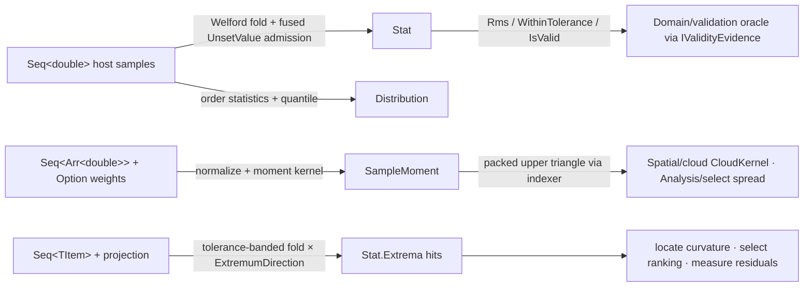

# [RASM_DOMAIN_STATS]

The statistics substrate — the one place scalar samples become typed statistical evidence anywhere in the kernel. ONE `Stat` receipt (count/min/max/mean/variance + provenance) minted by a numerically stable single-pass Welford fold whose finiteness admission is FUSED into the fold (one traversal admits and accumulates — the guard filters the host's `RhinoMath.UnsetValue` sentinel, which `double.IsFinite` would admit as an ordinary finite value and silently poison every downstream moment; this substrate is RhinoCommon-aware by law and its samples come from host evaluations, so the sentinel-aware guard is capability, not coupling). ONE generic tolerance-banded `Extrema<TItem>` fold owns every extremum query in the kernel — strict improvement beyond the band resets the hit set, band membership accumulates ties, and the signed `ExtremumDirection` key turns maximum/minimum into one algebra — so the eight-plus extremum call sites across the analysis families share one fold, never re-derive one. ONE `Distribution` receipt carries median/IQR/percentile order statistics through a linear-interpolation quantile with `ZeroTolerance` index snapping, and ONE `SampleMoment` owns weighted first and second moments — the packed upper-triangular covariance with a symmetric `[row, column]` indexer so no consumer re-derives the triangular offset arithmetic.

`SampleMoment` stays HERE by explicit ruling: it is the kernel's one covariance/moment owner — `Spatial/cloud` `CloudKernel` PCA composes it into `SymmetricMatrix` eigendecomposition, `Analysis/select` composes it for point-spread principal frames, and the settled `Processing/fit` robust-fit page consumes the cloud-PCA vocabulary built ON it upstream of its `FitOp` boundary — a consumer, never a second owner; a covariance re-mint beside this type is the named double-owner defect. The vocabulary tier is three owners: `ScalarMetric` (which geometry scalar a sample measures — vector magnitude, Gaussian or mean surface curvature — with ONE total generated-`Switch` projection per payload shape, retiring the key-compare branch hackery), `ExtremumDirection` (the ±1 signed axis the extrema fold multiplies through), and `StatContext` (the `None`/`Metric`/`Tolerance` provenance union a `Stat` carries so a downstream reader knows WHAT was summarized and against WHICH band). All three receipts conform to the `Domain/rails` `IValidityEvidence` fold, so the `Domain/validation` acceptance oracle admits them through the one interface arm and its hand-enumerated `Stat`/`Distribution` type cases are retired under the one-oracle law — validity lives ON the owner, co-located with the invariants it checks.

## [01]-[INDEX]

- [01]-[STATISTICS]: `ScalarMetric`/`ExtremumDirection`/`StatContext` vocabulary; the Welford `Stat.Of` single-pass fold + the generic tolerance-banded `Stat.Extrema` fold; `Distribution` median/IQR/quantile; `SampleMoment` weighted mean + packed upper-triangular covariance with the symmetric indexer.

## [02]-[STATISTICS]

- Owner: `ScalarMetric` `[SmartEnum<int>]` — the geometry-scalar provenance rows (`Magnitude`/`Gaussian`/`Mean`) with one total generated-`Switch` `Of` projection per payload shape (`Vector3d` → length under `Magnitude`, `SurfaceCurvature` → the selected curvature under `Gaussian`/`Mean`, every inadmissible pairing a typed `Unsupported` fault) — overloads discriminate on the input's TYPE, the `Switch` discriminates on the row, and no key-comparison predicate branches beside the vocabulary; `ExtremumDirection` `[SmartEnum<int>]` — `Maximum(+1)`/`Minimum(-1)`, the key IS the sign the fold multiplies through; `StatContext` `[SkipUnionOps]` `[Union]` — `NoneCase`/`MetricCase(ScalarMetric)`/`ToleranceCase(Value, WithinTolerance)` where the tolerance case derives its verdict at construction from the extrema it summarizes; `Stat` `readonly record struct` — the six-field summary receipt with derived `Rms` and `WithinTolerance`, the `Of` Welford fold, and the generic `Extrema<TItem>` fold; `Distribution` `readonly record struct` — `Summary` + `Median` + `Iqr` + `(Percentile, Value)` rows, the `Of` order-statistics constructor and the private linear-interpolation `Quantile`; `SampleMoment` internal `readonly record struct` — `Dimension` + `Mean` + `UpperCovariance` packed row-major upper triangle, the symmetric `this[row, column]` indexer, and the `Of`/`MomentOf` weighted-moment admission.
- Cases: `ScalarMetric` 3 rows × 2 payload shapes; `ExtremumDirection` 2; `StatContext` 3 cases.
- Entry: `Stat.Of(Seq<double> values, Op key, Option<StatContext> context = default) : Fin<Stat>` — ONE summary entry, absence of provenance is `Option` defaulting to `StatContext.None`, never a nullable; `Stat.Extrema(items, projection, tolerance, direction) : Seq<TItem>` — ONE extremum fold over any projected item stream; `Distribution.Of(values, percentiles, Op, Option<StatContext>) : Fin<Distribution>` — percentiles admitted by an abort-on-first `TraverseM` (an out-of-range percentile is a caller defect, not an accumulation case); `SampleMoment.Of(rows, dimension, Op, Option<Arr<double>> weights = default) : Fin<SampleMoment>` — weighted and unweighted are ONE entry discriminating on the `Option`, uniform weights derived when absent; `metric.Of(value, key) : Fin<double>` the scalar projection.
- Auto: the Welford recurrence updates mean and M2 in one pass (`M2 += delta * (value − updatedMean)`) so variance never suffers the catastrophic cancellation of the naive sum-of-squares form, min/max ride the same fold, and the `AllFinite` conjunct fuses sample admission into the accumulation — an empty or sentinel-bearing stream routes `InvalidResult`, and population variance clamps at zero against negative rounding residue; `Extrema` tracks the running best under the signed direction, RESETS the hit set on a strict improvement beyond the band, APPENDS on band membership (updating best only when strictly better), and `Rev()` restores encounter order after the `Cons` accumulation; `Quantile` interpolates linearly between order statistics at index `(n−1)·p`, snapping to an integral order statistic within `RhinoMath.ZeroTolerance` so exact quartiles of small samples read exactly; `SampleMoment.Of` validates dimension/shape/finiteness once, normalizes supplied weights to unit sum (each positive finite, the sum above `ZeroTolerance`) or derives the uniform `1/n` row, and the `MomentOf` accumulation loops are the named span-kernel exemption — a measured boundary kernel, not domain branching; the indexer maps `(row, column)` onto the packed offset `i·d − i(i−1)/2 + (j−i)` after ordering `i ≤ j`, so symmetric reads are one expression and consumers never restate triangular arithmetic.
- Receipt: `Stat`, `Distribution`, and `SampleMoment` ARE the typed receipts — each conforms to `IValidityEvidence` with its full invariant co-located as a `ValidityClaim.All` claim fold (`Stat`: `CountAtLeast(1)`, `Ordered(min, max)`, finite mean, non-negative variance/RMS, and a coherent context `Of` claim — the `ToleranceCase` verdict must EQUAL the recomputed band test; `Distribution`: nested `Evidence(Summary)`, finite median, non-negative IQR, every percentile row in `[0,100]` with a finite value; `SampleMoment`: `CountExactly` shape-coherent packed lengths, finite moments, non-negative diagonal variances) — so the `Domain/validation` oracle reads the interface arm and its hand-enumerated `Stat`/`Distribution` cases are retired; construction re-enters the oracle through `Op.AcceptValue`, making every minted receipt valid-by-construction.
- Packages: LanguageExt.Core (`Seq`/`Arr`/`Fin`/`Option`/`Fold`/`TraverseM`/`guard`/`toSeq`/`Cons`/`Rev`), Thinktecture.Runtime.Extensions (`[SmartEnum<int>]`/`[Union]` + generated total `Switch`), RhinoCommon (`RhinoMath.IsValidDouble`/`ZeroTolerance` — the sentinel-aware admission band, `Vector3d`/`SurfaceCurvature` projection payloads), Foundation analyzer contracts (`[BoundaryAdapter]`, `[SkipUnionOps]`), BCL (`Math`, `Enumerable.Range`/`Repeat`).
- Growth: skewness/kurtosis are TWO more Welford slots (M3/M4 in the same fold state) + two `Stat` fields + two `IsValid` conjuncts — no second pass, no sibling receipt; a weighted `Stat` is one `Option<Seq<double>>` weights parameter on the SAME fold (the `SampleMoment` admission pattern); a new scalar metric is ONE `ScalarMetric` row breaking both `Switch` projections loudly at compile time; a new provenance is ONE `StatContext` case; a streaming quantile sketch (P²/t-digest) is a policy row beside `Distribution.Of`, never a replacement for the exact small-sample quantile.
- Boundary: `SampleMoment` lives HERE — the cloud-PCA vocabulary (`Spatial/cloud`), the point-spread principal frame (`Analysis/select`), and the settled `Processing/fit` normal-field seeding all COMPOSE this one moment owner, and a domain-local covariance accumulation beside it is the named double-owner defect; `Stat.Extrema` is the ONE extremum fold — the analysis families' curvature extrema, face ranking, and residual maxima all thread it, and a per-family best-so-far loop is the deleted re-derivation; the `IsMagnitude`/`IsSurface` key-comparison predicates are the named killed form — row dispatch is the generated total `Switch`, so a new row cannot silently fall through a boolean; the `StatContext?` nullable-with-coalescing parameter is the named killed form — absence is `Option` with the canonical `None` derived once; `RhinoMath.IsValidDouble` is the DECIDED admission guard (the host `UnsetValue` sentinel is finite, so `double.IsFinite` admits it — swapping the guard is a silent capability regression, not a host-neutrality win); sample admission happens IN the fold exactly once — a pre-validation pass over the stream is the rejected second traversal, and re-validation downstream of the receipt is the rejected re-check (the receipt's `IsValid` is the evidence).

```csharp contract
// --- [RUNTIME_PRELUDE] ----------------------------------------------------------------------
using System;
using System.Collections.Generic;
using System.Linq;
using System.Runtime.InteropServices;
using Foundation.CSharp.Analyzers.Contracts;
using LanguageExt;
using LanguageExt.Common;
using Rhino;
using Rhino.Geometry;
using Thinktecture;
using static LanguageExt.Prelude;

namespace Rasm.Domain;

// --- [TYPES] --------------------------------------------------------------------------------
[SmartEnum<int>]
public sealed partial class ScalarMetric {
    public static readonly ScalarMetric Magnitude = new(key: 0);
    public static readonly ScalarMetric Gaussian = new(key: 1);
    public static readonly ScalarMetric Mean = new(key: 2);
    internal Fin<double> Of(Vector3d value, Op key) => Switch(
        state: (Value: value, Key: key),
        magnitude: static state =>
            from vector in state.Key.AcceptValue(value: state.Value)
            from length in state.Key.AcceptValue(value: vector.Length)
            select length,
        gaussian: static state => Fin.Fail<double>(error: state.Key.Unsupported(geometryType: typeof(Vector3d), outputType: typeof(double))),
        mean: static state => Fin.Fail<double>(error: state.Key.Unsupported(geometryType: typeof(Vector3d), outputType: typeof(double))));
    internal Fin<double> Of(SurfaceCurvature value, Op key) => Switch(
        state: (Value: value, Key: key),
        magnitude: static state => Fin.Fail<double>(error: state.Key.Unsupported(geometryType: typeof(SurfaceCurvature), outputType: typeof(double))),
        gaussian: static state => state.Key.AcceptValue(value: state.Value.Gaussian),
        mean: static state => state.Key.AcceptValue(value: state.Value.Mean));
}

[SmartEnum<int>]
public sealed partial class ExtremumDirection {
    public static readonly ExtremumDirection Maximum = new(key: +1);
    public static readonly ExtremumDirection Minimum = new(key: -1);
}

[SkipUnionOps]
[Union]
public partial record StatContext {
    public sealed record NoneCase : StatContext;
    public sealed record MetricCase(ScalarMetric Value) : StatContext;
    public sealed record ToleranceCase(double Value, bool WithinTolerance) : StatContext;
    public static StatContext None => new NoneCase();
    public static StatContext Metric(ScalarMetric metric) => new MetricCase(Value: metric);
    public static StatContext Tolerance(double tolerance, double minimum, double maximum) =>
        new ToleranceCase(Value: tolerance, WithinTolerance: Math.Max(val1: Math.Abs(value: minimum), val2: Math.Abs(value: maximum)) <= tolerance);
}

// --- [MODELS] -------------------------------------------------------------------------------
[BoundaryAdapter, StructLayout(LayoutKind.Auto)]
public readonly record struct Stat(int Count, double Minimum, double Maximum, double Mean, double Variance, StatContext Context) : IValidityEvidence {
    internal double Rms => Math.Sqrt(d: (Mean * Mean) + Variance);
    internal bool WithinTolerance => Context is StatContext.ToleranceCase t && t.WithinTolerance;
    public bool IsValid => ValidityClaim.All(
        ValidityClaim.CountAtLeast(count: Count, floor: 1),
        ValidityClaim.Ordered(lower: Minimum, upper: Maximum),
        ValidityClaim.Finite(Mean),
        ValidityClaim.Nonnegative(Variance),
        ValidityClaim.Nonnegative(Rms),
        ValidityClaim.Of(Context switch {
            StatContext.NoneCase => true,
            StatContext.MetricCase { Value: not null } => true,
            StatContext.ToleranceCase t => ValidityClaim.Nonnegative(t.Value).Holds
                && t.WithinTolerance == (Math.Max(val1: Math.Abs(value: Minimum), val2: Math.Abs(value: Maximum)) <= t.Value),
            _ => false,
        }));
    public static Fin<Stat> Of(Seq<double> values, Op key, Option<StatContext> context = default) =>
        values.Fold(
            initialState: (Count: 0, Mean: 0.0, M2: 0.0, Minimum: double.PositiveInfinity, Maximum: double.NegativeInfinity, AllFinite: true),
            f: static (state, value) => (Count: state.Count + 1, Delta: value - state.Mean) switch {
                (int count, double delta) => (
                    Count: count,
                    Mean: state.Mean + (delta / count),
                    M2: state.M2 + (delta * (value - (state.Mean + (delta / count)))),
                    Minimum: Math.Min(val1: state.Minimum, val2: value),
                    Maximum: Math.Max(val1: state.Maximum, val2: value),
                    AllFinite: state.AllFinite && RhinoMath.IsValidDouble(x: value)),
            }) switch {
                (0, _, _, _, _, _) or (_, _, _, _, _, false) => Fin.Fail<Stat>(key.InvalidResult()),
                (int count, double mean, double m2, double minimum, double maximum, _) => key.AcceptValue(value: new Stat(
                    Count: count,
                    Minimum: minimum,
                    Maximum: maximum,
                    Mean: mean,
                    Variance: Math.Max(val1: 0.0, val2: m2 / count),
                    Context: context.IfNone(StatContext.None))),
            };
    internal static Seq<TItem> Extrema<TItem>(Seq<TItem> items, Func<TItem, double> projection, double tolerance, ExtremumDirection direction) => items.Fold(
        initialState: (Best: direction.Key > 0 ? double.NegativeInfinity : double.PositiveInfinity, Hits: Seq<TItem>(), Tolerance: tolerance, Projection: projection, Direction: (double)direction.Key),
        f: static (state, item) => state.Projection(arg: item) switch {
            double score when state.Direction * score > (state.Direction * state.Best) + state.Tolerance => state with { Best = score, Hits = Seq(item) },
            double score when state.Direction * score >= (state.Direction * state.Best) - state.Tolerance =>
                state with { Best = state.Direction * score > state.Direction * state.Best ? score : state.Best, Hits = item.Cons(state.Hits) },
            _ => state,
        }).Hits.Rev();
}

[BoundaryAdapter, StructLayout(LayoutKind.Auto)]
public readonly record struct Distribution(Stat Summary, double Median, double Iqr, Seq<(double Percentile, double Value)> Percentiles) : IValidityEvidence {
    public bool IsValid => ValidityClaim.All(
        ValidityClaim.Evidence(Summary),
        ValidityClaim.Finite(Median),
        ValidityClaim.Nonnegative(Iqr),
        ValidityClaim.Of(Percentiles.ForAll(static p =>
            ValidityClaim.Finite(p.Percentile).Holds && p.Percentile is >= 0.0 and <= 100.0 && ValidityClaim.Finite(p.Value).Holds)));
    internal static Fin<Distribution> Of(Seq<double> values, Seq<double> percentiles, Op key, Option<StatContext> context = default) =>
        percentiles.TraverseM(p => guard(RhinoMath.IsValidDouble(x: p) && p is >= 0.0 and <= 100.0, key.InvalidInput()).ToFin().Map(_ => p)).As()
            .Bind(valid => Stat.Of(values: values, key: key, context: context).Map(stat =>
                values.Order().AsIterable().ToSeq() switch {
                    Seq<double> sorted => new Distribution(
                        Summary: stat,
                        Median: Quantile(sorted: sorted, fraction: 0.5),
                        Iqr: Quantile(sorted: sorted, fraction: 0.75) - Quantile(sorted: sorted, fraction: 0.25),
                        Percentiles: valid.Map(p => (Percentile: p, Value: Quantile(sorted: sorted, fraction: p / 100.0)))),
                }))
            .Bind(distribution => key.AcceptValue(value: distribution));
    private static double Quantile(Seq<double> sorted, double fraction) =>
        ((sorted.Count - 1) * Math.Clamp(value: fraction, min: 0.0, max: 1.0)) switch {
            double idx when Math.Abs(value: idx - Math.Floor(d: idx)) <= RhinoMath.ZeroTolerance => sorted[(int)Math.Floor(d: idx)],
            double idx when Math.Abs(value: Math.Ceiling(a: idx) - idx) <= RhinoMath.ZeroTolerance => sorted[(int)Math.Ceiling(a: idx)],
            double idx => sorted[(int)Math.Floor(d: idx)] + ((sorted[(int)Math.Ceiling(a: idx)] - sorted[(int)Math.Floor(d: idx)]) * (idx - Math.Floor(d: idx))),
        };
}

[BoundaryAdapter, StructLayout(LayoutKind.Auto)]
internal readonly record struct SampleMoment(int Dimension, Arr<double> Mean, Arr<double> UpperCovariance) : IValidityEvidence {
    internal double this[int row, int column] {
        get {
            (int i, int j) = row <= column ? (row, column) : (column, row);
            return UpperCovariance[index: (i * Dimension) - (i * (i - 1) / 2) + (j - i)];
        }
    }
    public bool IsValid {
        get {
            SampleMoment self = this;
            return ValidityClaim.All(
                ValidityClaim.CountAtLeast(count: Dimension, floor: 1),
                ValidityClaim.CountExactly(count: Mean.Count, expected: Dimension),
                ValidityClaim.CountExactly(count: UpperCovariance.Count, expected: Dimension * (Dimension + 1) / 2),
                ValidityClaim.Of(Mean.ForAll(static value => ValidityClaim.Finite(value).Holds)),
                ValidityClaim.Of(UpperCovariance.ForAll(static value => ValidityClaim.Finite(value).Holds)),
                ValidityClaim.Of(Enumerable.Range(start: 0, count: Dimension).All(k => ValidityClaim.Nonnegative(self[k, k]).Holds)));
        }
    }
    internal static Fin<SampleMoment> Of(Seq<Arr<double>> rows, int dimension, Op key, Option<Arr<double>> weights = default) =>
        new Arr<Arr<double>>([.. rows.AsIterable()]) switch {
            Arr<Arr<double>> samples when dimension > 0 && !samples.IsEmpty && samples.ForAll(row => row.Count == dimension && row.ForAll(RhinoMath.IsValidDouble)) =>
                weights switch {
                    { IsSome: true, Case: Arr<double> raw } => (raw.Count, raw.Fold(initialState: 0.0, f: static (sum, value) => sum + value)) switch {
                        (int length, double sum) when length == samples.Count && raw.ForAll(static value => RhinoMath.IsValidDouble(x: value) && value > 0.0) && RhinoMath.IsValidDouble(x: sum) && sum > RhinoMath.ZeroTolerance =>
                            MomentOf(rows: samples, weights: new Arr<double>([.. raw.AsIterable().Select(value => value / sum)]), dimension: dimension, key: key),
                        _ => Fin.Fail<SampleMoment>(key.InvalidInput()),
                    },
                    _ => MomentOf(rows: samples, weights: new Arr<double>([.. Enumerable.Repeat(element: 1.0 / samples.Count, count: samples.Count)]), dimension: dimension, key: key),
                },
            _ => Fin.Fail<SampleMoment>(key.InvalidInput()),
        };
    // Span-kernel exemption: the weighted-moment accumulation is a measured boundary kernel.
    private static Fin<SampleMoment> MomentOf(Arr<Arr<double>> rows, Arr<double> weights, int dimension, Op key) {
        double MeanAt(int component) {
            double total = 0.0;
            for (int row = 0; row < rows.Count; row++) { total += weights[index: row] * rows[index: row][index: component]; }
            return total;
        }
        double CovarianceAt(Arr<double> mean, int left, int right) {
            double total = 0.0;
            for (int row = 0; row < rows.Count; row++) { total += weights[index: row] * (rows[index: row][index: left] - mean[index: left]) * (rows[index: row][index: right] - mean[index: right]); }
            return total;
        }
        Arr<double> mean = new([.. Enumerable.Range(start: 0, count: dimension).Select(MeanAt)]);
        Arr<double> upper = new([.. Enumerable.Range(start: 0, count: dimension)
            .SelectMany(left => Enumerable.Range(start: left, count: dimension - left).Select(right => CovarianceAt(mean: mean, left: left, right: right)))]);
        return (mean.ForAll(RhinoMath.IsValidDouble), upper.ForAll(RhinoMath.IsValidDouble)) switch {
            (true, true) => Fin.Succ(new SampleMoment(Dimension: dimension, Mean: mean, UpperCovariance: upper)),
            _ => Fin.Fail<SampleMoment>(key.InvalidResult()),
        };
    }
}
```



## [03]-[DENSITY_BAR]

One owner per axis; a new statistic is a fold slot, row, or case — never a sibling receipt or a second traversal.

| [INDEX] | [AXIS/CONCERN]         | [OWNER]              | [KIND]                                                            | [RAIL]                              | [CASES] |
| :-----: | :--------------------- | :------------------- | :----------------------------------------------------------------- | :------------------------------------ | :-----: |
|  [01]   | Scalar provenance      | `ScalarMetric`       | `[SmartEnum<int>]` + total `Switch` projections per payload shape | `Of → Fin<double>`                    |    3    |
|  [02]   | Extremum axis          | `ExtremumDirection`  | `[SmartEnum<int>]`, key = fold sign                               | discriminant (pure)                   |    2    |
|  [03]   | Summary provenance     | `StatContext`        | `[Union]` `None`/`Metric`/`Tolerance`                             | carried case (pure)                   |    3    |
|  [04]   | Sample summary         | `Stat`               | `readonly record struct` Welford receipt + `IValidityEvidence`    | `Of → Fin<Stat>`                      |    6f   |
|  [05]   | Extremum query         | `Stat.Extrema<TItem>` | generic tolerance-banded fold                                     | `Seq<TItem>` (pure)                   |    1    |
|  [06]   | Order statistics       | `Distribution`       | `readonly record struct` + linear-interp `Quantile`               | `Of → Fin<Distribution>`              |    4f   |
|  [07]   | Weighted moments       | `SampleMoment`       | internal packed-triangle receipt + symmetric indexer              | `Of → Fin<SampleMoment>`              |    3f   |

Every fence composes the `Domain/rails` `Op`/`Fault` vocabulary as settled material; construction re-enters the `Domain/validation` oracle through `Op.AcceptValue`, and the three receipts' `IValidityEvidence` conformances retire the oracle's hand-enumerated statistical arms. No member reaches past `RhinoMath` and the two projection payload structs — the fold algebra itself is host-independent by inspection.

## [04]-[RESEARCH]

- [WELFORD_FOLD] — the single-pass recurrence (`mean += δ/n; M2 += δ·(x − mean′)`) is the numerically stable online form: the naive `Σx² − (Σx)²/n` cancels catastrophically when `|mean| ≫ σ`, which is the NORMAL regime for model-space coordinates (millimeter deviations at kilometer offsets), so the stable form is correctness, not preference. Population variance (`M2/n`) is the deliberate choice — the receipt summarizes THE sample handed to it, not an estimator of a hypothetical parent — and the zero clamp absorbs the last-ulp negative residue the recurrence can leave. Admission is FUSED: `AllFinite` conjoins `RhinoMath.IsValidDouble` per element inside the same fold, one traversal total, and the sentinel-aware guard is load-bearing — `RhinoMath.UnsetValue` (a finite negative double the host returns as "no value") passes `double.IsFinite` and would shift every moment silently; filtering it at admission is the difference between a wrong mean and a typed `InvalidResult`. Growth to higher moments is co-located by construction: M3/M4 are two more slots in the same tuple state, landing skewness/kurtosis with zero new traversal.
- [EXTREMA_BAND] — the fold is a tolerance-banded argmax/argmin, not a sort: `direction.Key` (±1) multiplies scores so one algebra serves both directions; a score strictly ABOVE `best + tolerance` resets the hit seq (a genuinely better extremum invalidates the old band), a score within `[best − tolerance, best + tolerance]` joins the band (updating `best` only when strictly better, so the band anchors to the true extremum, never drifts), and everything below the band is discarded — O(n), no sort, ties preserved in encounter order after `Rev()`. The band semantic is what the analysis families need (curvature extrema on a curve are PLURAL when symmetric; the top face of a box is FOUR coplanar candidates), which is why one generic fold owns all of them — a per-family best-so-far loop loses the band and returns an arbitrary single winner.
- [QUANTILE_LAW] — `Quantile` interpolates linearly between adjacent order statistics at fractional index `(n−1)·p` — the R-7/Excel-inclusive convention, exact at the sample points, continuous in `p`, and the standard choice for descriptive summaries of complete samples — with `ZeroTolerance` snapping so an integral index reads its order statistic exactly instead of interpolating against floating residue. Median and IQR derive from the same function at fixed fractions, and requested percentiles are admitted by an abort-on-first `TraverseM` because an out-of-range percentile is a caller defect (one typed fault), not an accumulation scenario. The sort is once per `Of` — `Distribution` is the batch order-statistics receipt; a streaming-quantile need (P², t-digest) grows as a policy row producing the SAME receipt shape.
- [MOMENT_OWNERSHIP] — `SampleMoment` is the kernel's ONE weighted first/second-moment owner (the explicit siting ruling): weights admit once (each positive finite, unit-normalized against a `ZeroTolerance`-guarded sum) or derive uniform, the covariance accumulates weighted deviation products per unique pair, and the packed row-major upper triangle (`i·d − i(i−1)/2 + (j−i)` after `i ≤ j` normalization, exposed as the symmetric indexer) stores `d(d+1)/2` values instead of `d²` with zero consumer-side offset arithmetic. Consumers compose, never re-own: `Spatial/cloud` `CloudKernel` unpacks the triangle into `SymmetricMatrix` for eigendecomposition (cloud PCA, oriented-normal seeding), `Analysis/select` reads it for point-spread principal frames and collinearity/coplanarity verdicts, `Analysis/measure` carries `Stat`/`Distribution` for conformance residual summaries, and the settled `Processing/fit` page consumes the cloud-PCA vocabulary UPSTREAM of its `FitOp` boundary — the fit's own document states it carries no covariance re-mint, which is exactly this ownership seam read from the consumer side. The dimension is a parameter, not a constant: the same owner serves 2D footprint spreads, 3D cloud PCA, and any higher-dimensional feature moment a future descriptor pipeline lands.
