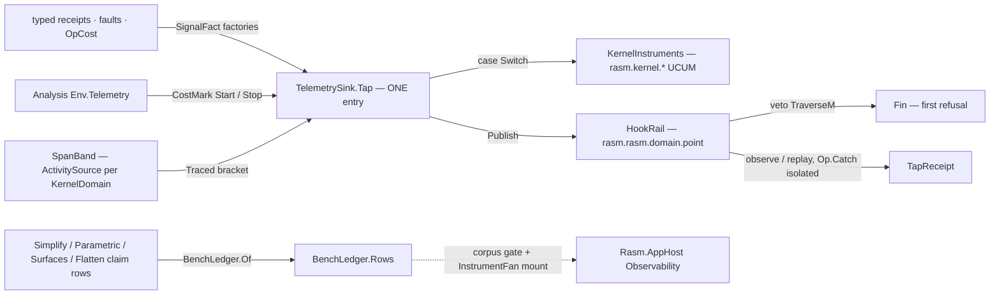

# [RASM_TELEMETRY]

Kernel signal owner (`Rasm.Domain`, `Domain/Telemetry.cs`) — receipt-as-truth telemetry turning the typed-receipt corpus into hook facts, metrics, spans, op-cost evidence, and benchmark-claim rows with ZERO OpenTelemetry reference. One `TelemetrySink` capsule is the whole consumer surface: `SignalFact` the one fact union, `HookRail` the registry delivering `rasm.rasm.<domain>.<point>` points under veto/observe/replay modalities, `KernelInstruments` the `rasm.kernel.<measure>` UCUM set minted through `IMeterFactory.Create(MeterOptions)`, `SpanBand` the per-sub-domain `ActivitySource` rows, `OpCost`/`CostMark` the op-cost capsule, `BenchClaim`/`BenchLedger` the enumerable speed-claim fold.

App-neutrality is absolute: registry, meter factory, sink, and ledger are instance-owned and composition-entered — no process-global static, no ambient meter, no registry slot two apps fight over. Every instrument create and write lives inside THIS page's fences; an emitting page declares facts through the sink's one `Tap`. AppHost's `InstrumentFan` mounts exactly this surface as its kernel arm — rail subscription, `rasm.kernel` meter admission by name, `BenchLedger` enumeration — and the kernel never references the fan.

## [01]-[INDEX]

- [02]-[SIGNAL_TAP]: `KernelDomain` sub-domain vocabulary; `TapPoint` hook-point key; `TapModality` veto/observe/replay rows; `TapSubscription`/`TapDetach`; `SignalFact` the one fact `[Union]`; `TapReceipt` the delivery evidence; `HookRail` the instance registry.
- [03]-[INSTRUMENT_SPINE]: `KernelInstruments` UCUM instrument capsule; `SpanBand` per-domain `ActivitySource` rows; `TelemetrySink` the one composition capsule with the polymorphic `Tap` and the `Traced` span bracket.
- [04]-[OP_COST]: `CostMark` capture pair and `OpCost` evidence — elapsed, allocated bytes, item count per `Op` key.
- [05]-[BENCH_LEDGER]: `BenchClaim` typed speed-claim row and `BenchLedger` the duplicate-refusing enumerable fold the corpus gate ingests.

## [02]-[SIGNAL_TAP]

- Owner: `KernelDomain` `[SmartEnum<string>]` — the nine sub-domain rows mirroring the folder map (`domain` · `numerics` · `spatial` · `parametric` · `meshing` · `processing` · `solving` · `drawing` · `analysis`), each deriving its `SourceName` (`rasm.rasm.<domain>`) — span-source name and hook-point prefix are ONE derivation off the row key, never two spellings. `TapPoint` `[ValueObject<string>]` — the hook-point key `rasm.rasm.<domain>.<point>`, ordinal equality AND ordinal ordering like `Op`, minted only through `Of(KernelDomain, string)` so a free-spelled point string cannot enter the registry. `TapModality` keyless `[SmartEnum]` — `Veto` (a subscriber may refuse; the first `Fail` is the publish verdict), `Observe` (fault-isolated delivery; a throwing or failing subscriber never disturbs the publisher), `Replay` (observe with immediate delivery of the retained last fact on subscribe). `TapSubscription` carries the handler row, `TapDetach` is the disposable detacher `Subscribe` returns, `SignalFact` is the one fact `[Union]` (`ReceiptCase` · `FaultCase` · `CostCase`) threading the universal `At` point through the base positional parameter, `TapReceipt` is the typed delivery evidence, and `HookRail` is the instance-owned registry.
- Cases: `KernelDomain` rows 9; `TapModality` rows 3; `SignalFact` cases `ReceiptCase(TapPoint, Op, IValidityEvidence)` · `FaultCase(TapPoint, Op, Error)` · `CostCase(TapPoint, OpCost)` (3) with the `Cost`/`Fault`/`Receipt` factories deriving canonical points (`<domain>.cost`, `<domain>.fault`, caller-named for receipts).
- Entry: `HookRail.Subscribe(TapSubscription) → TapDetach` and `HookRail.Publish(SignalFact) → Fin<TapReceipt>` — two members, no verb siblings. Publish order is law: retention updates first (replay truth is the LAST fact even when a veto refuses delivery), veto handlers fold through `TraverseM` inside the same `Op.Catch` funnel (first refusal — a returned `Fail` or a captured throw — is the publish verdict), observe and replay handlers then run isolated through the funnel with every isolated failure collected onto `TapReceipt.Isolated` — a subscriber fault is evidence or a refusal, never a publisher exception.
- Law: veto binds only at gate points consulted BEFORE the guarded action — a post-hoc fact (a cost capsule, an already-raised fault) publishes for observation and its veto verdict is advisory, discarded by the emitting runtime; a consumer that must refuse work subscribes `Veto` on the gate point its operation consults, and the refusal travels the same `Fin` rail every kernel failure travels.
- Law: subscriber faults isolate onto the rail — EVERY handler runs inside `Op.Catch`: an observe/replay capture lands in `TapReceipt.Isolated` and delivery continues to the remaining subscribers, a veto capture surfaces as the refusing verdict, and the subscribe-time replay delivery discards its capture by design (the receipt exists only at `Publish`; the subscriber's next published fact carries evidence); no handler sinks the publisher or starves its siblings — isolation is structural.
- Law: the registry is a boundary state cell — subscriptions and retained facts ride two `Atom<HashMap<...>>` cells with idempotent swaps, detach is per-subscription and idempotent, and a detached handler never receives a later fact; no global registry exists, so two apps composing the kernel each own their rail.
- Boundary: fact payloads are evidence, never live resources — `ReceiptCase` carries the receipt value (every kernel receipt implements `IValidityEvidence`), `FaultCase` carries the already-lowered `Error` (both fault families — the substrate `Fault` union and the band-2400 `GeometryFault` — arrive as `Error`, so one case serves both), and no case retains geometry, leases, or handles.

```csharp signature
// --- [RUNTIME_PRELUDE] ----------------------------------------------------------------------
using Rasm.Csp;

namespace Rasm.Domain;

// --- [TYPES] --------------------------------------------------------------------------------
[SmartEnum<string>]
[KeyMemberEqualityComparer<ComparerAccessors.StringOrdinal, string>]
[KeyMemberComparer<ComparerAccessors.StringOrdinal, string>]
public sealed partial class KernelDomain {
    public static readonly KernelDomain Domain = new("domain");
    public static readonly KernelDomain Numerics = new("numerics");
    public static readonly KernelDomain Spatial = new("spatial");
    public static readonly KernelDomain Parametric = new("parametric");
    public static readonly KernelDomain Meshing = new("meshing");
    public static readonly KernelDomain Processing = new("processing");
    public static readonly KernelDomain Solving = new("solving");
    public static readonly KernelDomain Drawing = new("drawing");
    public static readonly KernelDomain Analysis = new("analysis");

    // One derivation serves the span source AND the hook-point prefix — two spellings is the drift.
    public string SourceName => $"rasm.rasm.{Key}";
}

[ValueObject<string>]
[KeyMemberEqualityComparer<ComparerAccessors.StringOrdinal, string>]
[KeyMemberComparer<ComparerAccessors.StringOrdinal, string>]
public readonly partial struct TapPoint {
    static partial void ValidateFactoryArguments(ref ValidationError? validationError, ref string value) =>
        validationError = string.IsNullOrWhiteSpace(value: value) ? new ValidationError(message: "TapPoint requires a non-whitespace point name.") : null;
    [BoundaryAdapter] public static TapPoint Of(KernelDomain domain, string point) => Create(value: $"{domain.SourceName}.{point}");
}

[SmartEnum]
public sealed partial class TapModality {
    public static readonly TapModality Veto = new();
    public static readonly TapModality Observe = new();
    public static readonly TapModality Replay = new();
}

// --- [MODELS] -------------------------------------------------------------------------------
public sealed record TapSubscription(TapPoint Point, TapModality Modality, Func<SignalFact, Fin<Unit>> Handler);

[BoundaryAdapter, StructLayout(LayoutKind.Auto)]
public readonly record struct TapDetach(Action Detach) : IDisposable {
    public void Dispose() => Detach();
}

[BoundaryAdapter, StructLayout(LayoutKind.Auto)]
public readonly record struct TapReceipt(int Delivered, int Vetoers, Seq<Error> Isolated) : IValidityEvidence {
    public bool IsValid => ValidityClaim.All(
        ValidityClaim.CountAtLeast(count: Delivered, floor: 0),
        ValidityClaim.CountAtLeast(count: Vetoers, floor: 0));
}

[Union]
public abstract partial record SignalFact {
    private SignalFact(TapPoint at) => At = at;
    public TapPoint At { get; }

    public sealed record ReceiptCase(TapPoint Point, Op Key, IValidityEvidence Receipt) : SignalFact(Point);
    public sealed record FaultCase(TapPoint Point, Op Key, Error Fault) : SignalFact(Point);
    public sealed record CostCase(TapPoint Point, OpCost Cost) : SignalFact(Point);

    public static SignalFact Receipt(TapPoint point, Op key, IValidityEvidence receipt) => new ReceiptCase(Point: point, Key: key, Receipt: receipt);
    public static SignalFact Fault(KernelDomain domain, Op key, Error fault) => new FaultCase(Point: TapPoint.Of(domain: domain, point: "fault"), Key: key, Fault: fault);
    public static SignalFact Cost(OpCost cost) => new CostCase(Point: TapPoint.Of(domain: cost.Domain, point: "cost"), Cost: cost);
}

// --- [SERVICES] -----------------------------------------------------------------------------
public sealed class HookRail {
    private readonly Atom<HashMap<TapPoint, Seq<TapSubscription>>> subscriptions = Atom(HashMap<TapPoint, Seq<TapSubscription>>());
    private readonly Atom<HashMap<TapPoint, SignalFact>> retained = Atom(HashMap<TapPoint, SignalFact>());

    public TapDetach Subscribe(TapSubscription subscription) {
        ignore(subscriptions.Swap(held => held.AddOrUpdate(subscription.Point, existing => existing.Add(subscription), Seq(subscription))));
        Unit _ = subscription.Modality.Equals(TapModality.Replay)
            ? retained.Value.Find(subscription.Point).Map(fact => Isolated(subscription: subscription, fact: fact).Match(Succ: static _ => unit, Fail: static _ => unit)).IfNone(unit)
            : unit;
        return new TapDetach(Detach: () => ignore(subscriptions.Swap(held =>
            held.Find(subscription.Point).Map(existing => held.SetItem(subscription.Point, existing.Filter(row => !ReferenceEquals(row, subscription)))).IfNone(held))));
    }

    public Fin<TapReceipt> Publish(SignalFact fact) {
        ignore(retained.Swap(held => held.AddOrUpdate(fact.At, _ => fact, fact)));
        Seq<TapSubscription> rows = subscriptions.Value.Find(fact.At).IfNone(Seq<TapSubscription>());
        Seq<TapSubscription> vetoers = rows.Filter(static row => row.Modality.Equals(TapModality.Veto));
        return vetoers.TraverseM(row => Isolated(subscription: row, fact: fact)).As().Map(_ => {
            (int delivered, Seq<Error> isolated) = rows.Filter(static row => !row.Modality.Equals(TapModality.Veto))
                .Fold((Delivered: 0, Isolated: Seq<Error>()), (acc, row) => Isolated(subscription: row, fact: fact).Match(
                    Succ: _ => (acc.Delivered + 1, acc.Isolated),
                    Fail: error => (acc.Delivered, acc.Isolated.Add(error))));
            return new TapReceipt(Delivered: delivered, Vetoers: vetoers.Count, Isolated: isolated);
        });
    }

    private static Fin<Unit> Isolated(TapSubscription subscription, SignalFact fact) =>
        Op.Of(name: nameof(Publish)).Catch(() => subscription.Handler(fact));
}
```

## [03]-[INSTRUMENT_SPINE]

- Owner: `KernelInstruments` — the one metric capsule: `Of(IMeterFactory)` mints the `rasm.kernel` meter through `IMeterFactory.Create(MeterOptions)` (the factory mint is the only path — a `new Meter(...)` construction is the rejected form) and binds four instruments whose names, UCUM units, and descriptions are declaration facts: `rasm.kernel.op.duration` (`s`), `rasm.kernel.op.allocated` (`By`), `rasm.kernel.op.items` (`{item}`) histograms, and the `rasm.kernel.fault.count` (`{fault}`) counter partitioned by fault category, case, and code — the band-2400 `GeometryFault` family and the substrate `Fault` family land in ONE counter discriminated by tags, never two counters. `SpanBand` — the per-sub-domain span row set: one `ActivitySource(name: row.SourceName, version)` per `KernelDomain` row, `HasListeners()` gating every start so an unlistened band costs one branch, and `Traced` the one span bracket (start → run → status → dispose). `TelemetrySink` — the composition capsule `Env` carries: `Of(IMeterFactory, version)` assembles rail + instruments + band, `Tap(SignalFact)` is the ONE polymorphic emission entry (the fact case selects the instrument writes, then the rail publishes), `Traced` forwards the span bracket, `Dispose` releases the span sources — meter and instrument lifetime ride the minting factory, never the sink.
- Entry: `TelemetrySink.Tap(SignalFact) → Fin<TapReceipt>` — one entry discriminating on the fact case through the generated `Switch`; no `RecordCost`/`CountFault`/`PublishReceipt` verb family. `TelemetrySink.Traced<T>(KernelDomain, Op, Func<Fin<T>>) → Fin<T>` — the span bracket: listeners absent runs the body through `Op.Catch` alone; listeners present opens the domain source's activity named `<source>.<op>`, runs the same funnel, stamps `ActivityStatusCode.Error` with the fault category tag on the fail side, and disposes on both exits.
- Law: writes ride the tagged `params ReadOnlySpan` overloads — `Counter<long>.Add(1, tags)` and `Histogram<double|long>.Record(value, tags)` — with the op key and domain as tag rows; instrument identity de-duplicates by name inside the one meter, so the const name rows here are the single spelling and an inline create with a drifted unit is the forked-stream defect.
- Law: the sink is composition-entered — an app stratum mints one `TelemetrySink.Of(factory)` per composition and threads it (the analysis runtime carries it on `Env`; a synchronous kernel below the `Eff` floor that hosts a gate point takes the sink as an explicit trailing parameter per the rails threading law); a kernel page never constructs, caches, or reaches an ambient sink.
- Law: span admission evidence enters at creation — the activity name binds the domain source and the op key at `StartActivity`, `HasListeners()` precedes every start so tag computation never runs unheard, and the error status is the typed verdict a backend filter reads, never a tag-only error fact.
- Boundary: this page is the kernel's whole telemetry spine — provider wiring, exporters, sampling, views, and resource identity are the app stratum's; the kernel emits natively and is admitted by name (`rasm.kernel` meter, `rasm.rasm.<domain>` sources), and the AppHost `InstrumentFan` arm subscribes and mounts against exactly these spellings.

```csharp signature
// --- [RUNTIME_PRELUDE] ----------------------------------------------------------------------
using System.Collections.Frozen;
using System.Diagnostics;
using System.Diagnostics.Metrics;
using Rasm.Csp;

namespace Rasm.Domain;

// --- [SERVICES] -----------------------------------------------------------------------------
// Meter and instrument lifetime ride the minting factory — provider disposal owns them, so the
// capsule retains no meter handle and disposes nothing.
public sealed class KernelInstruments {
    private const string MeterName = "rasm.kernel";
    private const string OpDuration = "rasm.kernel.op.duration";
    private const string OpAllocated = "rasm.kernel.op.allocated";
    private const string OpItems = "rasm.kernel.op.items";
    private const string FaultCount = "rasm.kernel.fault.count";

    private readonly Histogram<double> duration;
    private readonly Histogram<long> allocated;
    private readonly Histogram<long> items;
    private readonly Counter<long> faults;

    private KernelInstruments(Meter meter) {
        duration = meter.CreateHistogram<double>(name: OpDuration, unit: "s", description: "Kernel operation wall time.");
        allocated = meter.CreateHistogram<long>(name: OpAllocated, unit: "By", description: "Kernel operation allocated bytes.");
        items = meter.CreateHistogram<long>(name: OpItems, unit: "{item}", description: "Kernel operation item count.");
        faults = meter.CreateCounter<long>(name: FaultCount, unit: "{fault}", description: "Kernel fault stream by category, case, and code.");
    }

    public static KernelInstruments Of(IMeterFactory factory) => new(meter: factory.Create(new MeterOptions(MeterName)));

    public Unit Cost(OpCost cost) {
        KeyValuePair<string, object?> op = new("rasm.op", cost.Key.ToString());
        KeyValuePair<string, object?> domain = new("rasm.domain", cost.Domain.Key);
        duration.Record(cost.Elapsed.TotalSeconds, op, domain);
        allocated.Record(cost.AllocatedBytes, op, domain);
        items.Record(cost.Items, op, domain);
        return unit;
    }

    public Unit Fault(Op key, Error fault) {
        faults.Add(1,
            new KeyValuePair<string, object?>("rasm.op", key.ToString()),
            new KeyValuePair<string, object?>("rasm.fault.category", fault.Category),
            new KeyValuePair<string, object?>("rasm.fault.case", fault.GetType().Name),
            new KeyValuePair<string, object?>("rasm.fault.code", fault.Code));
        return unit;
    }
}

public sealed class SpanBand : IDisposable {
    private readonly FrozenDictionary<KernelDomain, ActivitySource> sources;

    private SpanBand(FrozenDictionary<KernelDomain, ActivitySource> sources) => this.sources = sources;

    public static SpanBand Of(string? version = null) =>
        new(sources: KernelDomain.Items.ToFrozenDictionary(static row => row, row => new ActivitySource(name: row.SourceName, version: version ?? string.Empty)));

    public Fin<T> Traced<T>(KernelDomain domain, Op key, Func<Fin<T>> body) {
        ActivitySource source = sources[domain];
        if (!source.HasListeners()) { return key.Catch(body); }
        using Activity? span = source.StartActivity(name: $"{domain.SourceName}.{key}", kind: ActivityKind.Internal);   // platform-forced disposal seam
        Fin<T> result = key.Catch(body);
        return result.MapFail(error => {
            _ = span?.SetStatus(ActivityStatusCode.Error, error.Message);
            _ = span?.SetTag("rasm.fault.category", error.Category);
            return error;
        });
    }

    public void Dispose() {
        foreach (ActivitySource source in sources.Values) { source.Dispose(); }   // bulk release over the frozen row set
    }
}

public sealed class TelemetrySink : IDisposable {
    private readonly KernelInstruments instruments;
    private readonly SpanBand spans;

    private TelemetrySink(HookRail rail, KernelInstruments instruments, SpanBand spans) {
        Rail = rail;
        this.instruments = instruments;
        this.spans = spans;
    }

    public HookRail Rail { get; }

    public static TelemetrySink Of(IMeterFactory factory, string? version = null) =>
        new(rail: new HookRail(), instruments: KernelInstruments.Of(factory: factory), spans: SpanBand.Of(version: version));

    public Fin<TapReceipt> Tap(SignalFact fact) {
        Unit _ = fact.Switch(
            state: instruments,
            receiptCase: static (_, _) => unit,
            faultCase: static (spine, f) => spine.Fault(key: f.Key, fault: f.Fault),
            costCase: static (spine, c) => spine.Cost(cost: c.Cost));
        return Rail.Publish(fact: fact);
    }

    public Fin<T> Traced<T>(KernelDomain domain, Op key, Func<Fin<T>> body) => spans.Traced(domain: domain, key: key, body: body);

    public void Dispose() => spans.Dispose();   // span sources are sink-owned; meter lifetime rides the factory
}
```

## [04]-[OP_COST]

- Owner: `CostMark` — the capture pair (`Stopwatch.GetTimestamp()` monotonic tick, `GC.GetAllocatedBytesForCurrentThread()` allocation counter) minted by `Start()` before the guarded work; `Stop` folds the pair into `OpCost`. `OpCost` — the uniform op-cost evidence: `Op` key, owning `KernelDomain`, `Stopwatch.GetElapsedTime` wall span, thread-local allocated-byte delta, item count, and the success bit — the kernel-side billing-truth feed the app strata attribute to tenants.
- Law: the capsule is captured once at the operation runtime — the analysis `Operation.Apply` marks before its body fold (the `Prepare` gate runs inside the marked window, so admission cost is charged to the operation that demanded it) and charges on BOTH exits: the success leg records `Succeeded: true`, the fail leg records `Succeeded: false` AND publishes the fault fact, so cost and failure evidence never diverge.
- Law: the allocation delta is thread-local evidence — valid because the synchronous runtime collapse runs the marked window on one thread; a lane that hops threads keeps elapsed truth and reads the delta as an allocation floor, never a total.
- Boundary: `OpCost` registers `IValidityEvidence` so the fact reaches the one acceptance oracle like every kernel receipt; the capsule never wraps a second timer or a sampling profiler — profile capture is the app stratum's, this row is the per-op scalar truth.

```csharp signature
// --- [RUNTIME_PRELUDE] ----------------------------------------------------------------------
using System.Diagnostics;
using Rasm.Csp;

namespace Rasm.Domain;

// --- [MODELS] -------------------------------------------------------------------------------
[BoundaryAdapter, StructLayout(LayoutKind.Auto)]
public readonly record struct OpCost(Op Key, KernelDomain Domain, TimeSpan Elapsed, long AllocatedBytes, int Items, bool Succeeded) : IValidityEvidence {
    public bool IsValid => ValidityClaim.All(
        ValidityClaim.Nonnegative(value: Elapsed.TotalSeconds),
        ValidityClaim.Of(holds: AllocatedBytes >= 0L),
        ValidityClaim.CountAtLeast(count: Items, floor: 0));
}

[BoundaryAdapter, StructLayout(LayoutKind.Auto)]
public readonly record struct CostMark(long Timestamp, long Allocated) {
    public static CostMark Start() => new(Timestamp: Stopwatch.GetTimestamp(), Allocated: GC.GetAllocatedBytesForCurrentThread());

    public OpCost Stop(Op key, KernelDomain domain, int items, bool succeeded) =>
        new(Key: key, Domain: domain,
            Elapsed: Stopwatch.GetElapsedTime(startingTimestamp: Timestamp),
            AllocatedBytes: long.Max(0L, GC.GetAllocatedBytesForCurrentThread() - Allocated),
            Items: items, Succeeded: succeeded);
}
```

## [05]-[BENCH_LEDGER]

- Owner: `BenchClaim` — the typed speed-claim row: `Claim` the `Op` key naming the gated lane, `VectorizedLane` and `ReferenceLane` the exact member spellings under measurement, `SpeedupFloor` the admission threshold the corpus gate enforces; registers `IValidityEvidence`. `BenchLedger` — the enumerable fold: `Of(params ReadOnlySpan<BenchClaim>)` refuses an invalid row and a duplicate claim key typed, `Rows` is the enumeration the corpus gate ingests, and `Unproven(Seq<Op>)` returns every claim lacking a proven receipt — an unproven speed claim is a visible ledger defect, never a prose hunt.
- Law: claim rows live BESIDE the lanes they gate — `Simplify.HausdorffClaim` (the `TensorPrimitives.Max` distance reduction), `Parametric.FrameDefectClaim` (the station-frame orthogonality reduction), `Surfaces.CurvatureSummaryClaim` (the curvature-band extrema reductions), and `Flatten.DistortionClaim` (the distortion-receipt folds) are `static readonly` rows on their owning pages; the ledger composes rows at the app composition root (`BenchLedger.Of([Simplify.HausdorffClaim, Parametric.FrameDefectClaim, Surfaces.CurvatureSummaryClaim, Flatten.DistortionClaim])`) because the substrate floor never references an upper stratum.
- Law: a claim is correctness-independent — the vectorized lane's RESULT never depends on the claim holding; the claim gates only the lane's admission to the hot path, and a lane whose speed claim fails the gate reverts to its reference row with zero behavior change.
- Boundary: the AppHost corpus gate reads `Rows` and resolves each claim to its `BenchmarkReceipt` verdict; judging, regression budgets, and host evidence binding are the gate's — this ledger owns only the typed enumeration and the duplicate-refusal fold.

```csharp signature
// --- [RUNTIME_PRELUDE] ----------------------------------------------------------------------
using Rasm.Csp;

namespace Rasm.Domain;

// --- [MODELS] -------------------------------------------------------------------------------
public sealed record BenchClaim(Op Claim, string VectorizedLane, string ReferenceLane, double SpeedupFloor) : IValidityEvidence {
    public bool IsValid => ValidityClaim.All(
        ValidityClaim.Positive(value: SpeedupFloor),
        ValidityClaim.Of(holds: !string.IsNullOrWhiteSpace(value: VectorizedLane)),
        ValidityClaim.Of(holds: !string.IsNullOrWhiteSpace(value: ReferenceLane)));
}

// --- [SERVICES] -----------------------------------------------------------------------------
public sealed class BenchLedger {
    private BenchLedger(Seq<BenchClaim> rows) => Rows = rows;

    public Seq<BenchClaim> Rows { get; }

    public static Fin<BenchLedger> Of(params ReadOnlySpan<BenchClaim> claims) {
        Seq<BenchClaim> rows = toSeq(claims.ToArray());
        return rows.Exists(static row => !row.IsValid)
            ? Fin.Fail<BenchLedger>(new Fault.InvalidValue(Label: nameof(BenchClaim), Requirement: "positive speedup floor and non-blank lane spellings"))
            : rows.Map(static row => row.Claim).Distinct().Count != rows.Count
                ? Fin.Fail<BenchLedger>(new Fault.InvalidValue(Label: nameof(BenchLedger), Requirement: "one ledger row per claim key"))
                : Fin.Succ(new BenchLedger(rows: rows));
    }

    public Seq<BenchClaim> Unproven(Seq<Op> proven) => Rows.Filter(row => !proven.Contains(row.Claim));
}
```



## [06]-[DENSITY_BAR]

One owner per axis; capability is a case, row, or fold arm, never a sibling surface. Growth: a new fact kind is one `SignalFact` case and one `Tap` arm; a new instrument is one const row and one write in the owning arm; a new sub-domain is one `KernelDomain` row (span source and point prefix derive); a new speed-gated lane is one `BenchClaim` row on its owning page and one composition-root ledger entry.

| [INDEX] | [AXIS_CONCERN]      | [OWNER]                          | [RAIL]                              | [CASES] |
| :-----: | :------------------ | :------------------------------- | :---------------------------------- | :-----: |
|  [01]   | Sub-domain rows     | `KernelDomain`                   | discriminant (`SourceName` derives) |    9    |
|  [02]   | Hook points         | `TapPoint` + `TapModality`       | key + modality rows                 |  1 + 3  |
|  [03]   | Fact vocabulary     | `SignalFact`                     | carrier + factories                 |    3    |
|  [04]   | Hook registry       | `HookRail`                       | `Publish → Fin<TapReceipt>`         |    —    |
|  [05]   | Instrument spine    | `KernelInstruments` + `SpanBand` | tagged writes + `Traced → Fin<T>`   |    —    |
|  [06]   | Composition capsule | `TelemetrySink`                  | `Tap → Fin<TapReceipt>`             |    —    |
|  [07]   | Op-cost capsule     | `OpCost` + `CostMark`            | evidence (oracle-registered)        |    —    |
|  [08]   | Bench claims        | `BenchClaim` + `BenchLedger`     | `Of → Fin<BenchLedger>`             |    —    |

## [07]-[RESEARCH]

- [VETO_GATE_SITES] — which kernel gate points consult `Veto` before their guarded action: the analysis `Prepare` fold is the natural first site (point `rasm.rasm.analysis.prepare`, consulted once per operation, refusal routed as the operation's own `Fault` case), and the arrangement/decimate budget gates are candidates; the composition cost of one `Publish` per operation against a subscriber-empty rail must measure as a dictionary miss. Route: land the first veto consultation on `Analysis/query.md` `Prepare` once the AppHost fan's subscriber story fixes which refusals it actually issues; verify the empty-rail fast path against the `BenchLedger` gate.
- [APPHOST_MOUNT_CONTRACT] — the `InstrumentFan` mount consumes this page's surface (rail subscription, `rasm.kernel` meter admission, `BenchLedger.Rows` enumeration); the exact contributed-arm signature the fan expects (`TelemetryContributorPort`, kind-arm table) lives on `Rasm.AppHost` `Observability/instruments.md` and may demand a kernel-side kind vocabulary beside `SignalFact`. Route: re-open the AppHost `[CONTRIBUTED_ARM_ROSTER]` card when its arm lands and reconcile the fact-to-kind projection there, never by widening this union speculatively.
