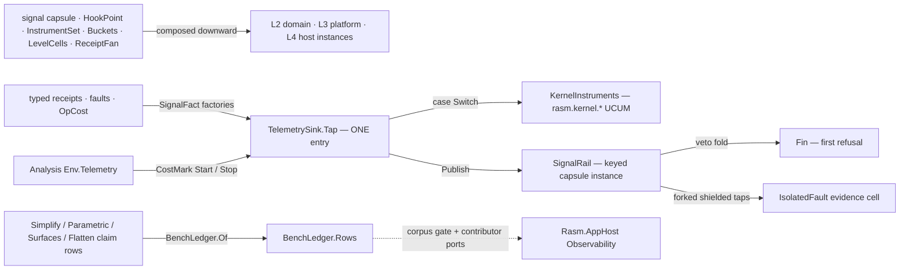

# [RASM_TELEMETRY]

Kernel signal owner (`Rasm.Domain`, `Domain/Telemetry.cs`) — the C# branch's one OTel-free signal capsule and the kernel's own receipt-as-truth consumption of it, with ZERO OpenTelemetry reference. This page mints the generic mechanism every stratum composes downward — `HookId`, `HookModality`, `HookPoint<TFact>`, `HookRegistry`, `InstrumentRow`/`InstrumentSet`, `Buckets`, `LevelCells`, `ReceiptFan`, `TelemetryContributorPort`, `TelemetryIdentity` — and its FIRST consumer: `SignalFact` the kernel fact union, `SignalRail` the keyed composition instance, `KernelInstruments` the `rasm.kernel` UCUM set, `OpCost`/`CostMark` the op-cost capsule, and `BenchClaim`/`BenchLedger` the enumerable speed-claim fold. A folder above this stratum composes an INSTANCE of the capsule against its own fact union; the capsule TYPE has one home.

App-neutrality is absolute: every capsule, registry, meter set, rail, and ledger is instance-owned and composition-entered — no process-global static, no ambient meter, no registry slot two apps fight over. Dependency-cleanliness draws the capsule's split line: this page carries BCL `System.Diagnostics.Metrics`, LanguageExt, and Thinktecture alone; OTel-SDK wiring, exporters, sampling, the source roster, and the correlation-and-tenant-laced receipt envelope stay at the app platform, which maps plain contributor scope strings into its own meter and source admission. Fire is synchronous from any stratum; an effect-rail caller lifts `Fire` at its own composition seam and the capsule never threads a caller's rail.

## [01]-[INDEX]

- [02]-[SIGNAL_CAPSULE]: `HookId` grammar; `HookModality` veto/observe/replay rows with `CanVeto`; `IHookPoint` floor; `HookPoint<TFact>` the one synchronous-fire capsule; `IsolatedFault` + `HookDetacher`; `HookRegistry` the frozen composition mount.
- [03]-[INSTRUMENT_MECHANISM]: `Buckets` the one advice holder with `Advised<T>`; `InstrumentRow`/`InstrumentSet`; `LevelCells` the keyed level owner with `Reader`; `InstrumentArm`/`ReceiptFan` the kind-keyed projection fold; `TelemetryContributorPort`; `TelemetryIdentity.Mint`.
- [04]-[SIGNAL_TAP]: `KernelDomain` sub-domain vocabulary; `SignalFact` the kernel fact `[Union]`; `SignalRail` the keyed capsule instance; `TelemetrySink` the composition capsule; `KernelInstruments` the `rasm.kernel` rows, capsule, and contributor port; `TraceScope` and `SpanBand` the composition trace band.
- [05]-[OP_COST]: `CostMark` capture pair and `OpCost` evidence — elapsed, allocated bytes, item count per `Op` key.
- [06]-[BENCH_LEDGER]: `BenchClaim` typed speed-claim row and `BenchLedger` the duplicate-refusing enumerable fold the corpus gate ingests.

## [02]-[SIGNAL_CAPSULE]

- Owner: `HookId` `[ValueObject<string>]` — the point name under the one estate grammar `rasm.<pkg>.<domain>.<point>`, admitted at declaration so a malformed id is a typed refusal, never a silent registry miss. `HookModality` `[SmartEnum<string>]` — `Veto` (a subscriber may transform or refuse; `CanVeto` is the row's own column, so veto admission is row data, never a subscriber-supplied flag), `Observe` (fault-isolated tap), `Replay` (observe with a bounded buffer late subscribers drain). `HookPoint<TFact>` — the one typed point capsule over the `IHookPoint` floor; `IsolatedFault` the parked subscriber-failure evidence row; `HookDetacher` the disposable detacher every subscription returns; `HookRegistry` the composition-time mount folding declared points into one frozen id-keyed table.
- Entry: `Fire` discriminates by call shape — `Fire(TFact) → Fin<TFact>` publishes a settled fact, `Fire<T>(TFact, Func<Fin<T>>) → Fin<T>` guards a seam body so vetoes refuse BEFORE the guarded action and observe taps run only from its success path; `Veto`, `Observe`, and `Drain` are the subscriber entries. Delegate admission rejects a null before use — a guarded `Fire` body and a `Veto` gate refuse on the typed rail, `Observe` throws at its immediate argument contract — so no null delegate reaches mount or dispatch.
- Auto: fire order is law — retention first (replay truth is the last fact even under veto refusal), the veto fold second (vetoes fold left in registration order through `Bind`, the first refusal is the verdict, parked beside the return), observe taps last, forked through `IO.Fork` before their shielded execution so the synchronous fire path returns without waiting; a fork refusal or throwing tap parks as `IsolatedFault` on the composition's evidence cell and delivery continues to the remaining taps; a replay point prunes its buffer to `depth` oldest-first on every fire, and a fresh subscriber receives the held window on attach.
- Receipt: a hook fire is the evidence event itself — the emitter's typed receipt already carries the fact, so a point mints nothing; the shared `Atom<Seq<IsolatedFault>>` cell is the one evidence surface — veto refusals and shielded tap faults, point-attributed — drained by the composing app or projected onto a rejects counter through the cell's `Change` tap.
- Packages: Thinktecture.Runtime.Extensions, LanguageExt.Core, BCL inbox.
- Growth: a new delivery semantics is one `HookModality` row breaking every modality dispatch at compile time; a consuming folder's new hook point is one declared `HookPoint<TFact>` value on its own point vocabulary — the capsule type never widens per folder.
- Boundary: the payload type closes at declaration — `TFact` is a typed record or union case from the owning folder, so a stringly payload cannot enter the rail; subscriber failure is evidence or a refusal, never a broken emitter or a starved sibling — isolation is structural because every tap runs inside its own shield; a caller on an effect rail lifts the synchronous fire at its composition seam (`IO.lift(() => point.Fire(fact))`), and a second capsule type threading fire onto an effect rail is the two-shape drift this owner exists to delete; the evidence cell arrives from the owning composition, so two compositions hold two cells.

```csharp signature
// --- [RUNTIME_PRELUDE] ----------------------------------------------------------------------
using System.Collections.Frozen;
using Rasm.Csp;

namespace Rasm.Domain;

// --- [TYPES] --------------------------------------------------------------------------------
// Point-name grammar rasm.<pkg>.<domain>.<point> — four dot-separated lowercase segments, rasm first —
// one spelling discipline serving hook points, instrumentation scopes, and metric names.
[ValueObject<string>]
[KeyMemberEqualityComparer<ComparerAccessors.StringOrdinal, string>]
[KeyMemberComparer<ComparerAccessors.StringOrdinal, string>]
public readonly partial struct HookId {
    static partial void ValidateFactoryArguments(ref ValidationError? validationError, ref string value) =>
        validationError = value.Split('.') is ["rasm", var pkg, var domain, var point]
            && pkg.Length > 0 && domain.Length > 0 && point.Length > 0
            && value.All(static ch => char.IsAsciiLetterLower(ch) || char.IsAsciiDigit(ch) || ch is '.' or '-' or '_')
            ? null
            : new ValidationError(message: $"HookId requires the rasm.<pkg>.<domain>.<point> grammar: {value}");
}

[SmartEnum<string>]
[KeyMemberEqualityComparer<ComparerAccessors.StringOrdinal, string>]
[KeyMemberComparer<ComparerAccessors.StringOrdinal, string>]
public sealed partial class HookModality {
    public static readonly HookModality Veto = new("veto", canVeto: true);
    public static readonly HookModality Observe = new("observe", canVeto: false);
    public static readonly HookModality Replay = new("replay", canVeto: false);

    public bool CanVeto { get; }
}

// --- [MODELS] -------------------------------------------------------------------------------
[BoundaryAdapter, StructLayout(LayoutKind.Auto)]
public readonly record struct IsolatedFault(HookId Point, Error Cause);

[BoundaryAdapter, StructLayout(LayoutKind.Auto)]
public readonly record struct HookDetacher(Action Detach) : IDisposable {
    public void Dispose() => Detach();
}

// --- [SERVICES] -----------------------------------------------------------------------------
public interface IHookPoint {
    HookId Id { get; }
    HookModality Modality { get; }
    Type Fact { get; }
}

// One synchronous fire from any stratum: retain, veto-fold, then fork-and-shield the observe fan; the
// evidence cell arrives from the owning composition — never a process-static — so two compositions hold
// two cells, and an effect-rail caller lifts Fire at its own seam.
public sealed class HookPoint<TFact> : IHookPoint {
    private readonly HookId id;
    private readonly HookModality modality;
    private readonly Atom<Seq<IsolatedFault>> faults;
    private readonly int depth;
    private readonly Atom<Seq<Func<TFact, Fin<TFact>>>> vetoes = Atom(Seq<Func<TFact, Fin<TFact>>>());
    private readonly Atom<Seq<Func<TFact, IO<Unit>>>> taps = Atom(Seq<Func<TFact, IO<Unit>>>());
    private readonly Atom<Seq<TFact>> buffer = Atom(Seq<TFact>());

    public HookPoint(HookId id, HookModality modality, Atom<Seq<IsolatedFault>> faults, int depth = 64) {
        ArgumentOutOfRangeException.ThrowIfNegative(depth);
        this.id = id;
        this.modality = modality;
        this.faults = faults;
        this.depth = depth;
    }

    public HookId Id => id;
    public HookModality Modality => modality;
    public Type Fact => typeof(TFact);

    public Fin<TFact> Fire(TFact fact) => Fire(fact: fact, body: Fin.Succ);

    // Guarded shape: veto precedes the seam body, taps fan only from its success path — one capsule, two
    // call shapes, the input discriminating; a null body refuses on the rail before retention, matching
    // every delegate admission on this capsule.
    public Fin<T> Fire<T>(TFact fact, Func<Fin<T>> body) =>
        body is null
            ? Fin.Fail<T>(new Fault.InvalidValue(Label: Id.ToString(), Requirement: "a guarded fire requires a non-null body"))
            : Fire(fact: fact, body: _ => body());

    private Fin<T> Fire<T>(TFact fact, Func<TFact, Fin<T>> body) {
        Unit _ = Retain(fact: fact);
        return Admitted(fact: fact).Bind(admitted => body(admitted).Map(value => (Dispatch(fact: admitted), value).Item2));
    }

    public Fin<IDisposable> Veto(Func<TFact, Fin<TFact>> gate) =>
        gate is null
            ? Fin.Fail<IDisposable>(new Fault.InvalidValue(Label: Id.ToString(), Requirement: "a veto subscription requires a non-null gate"))
            : Modality.CanVeto
            ? Fin.Succ<IDisposable>(Attach(cell: vetoes, row: gate))
            : Fin.Fail<IDisposable>(new Fault.InvalidValue(Label: Id.ToString(), Requirement: "a veto subscription requires a veto-capable point"));

    public IDisposable Observe(Func<TFact, IO<Unit>> tap) {
        ArgumentNullException.ThrowIfNull(argument: tap);
        IDisposable detach = Attach(cell: taps, row: tap);
        ignore(buffer.Value.Iter(held => Forked(fact: held, tap: tap)));
        return detach;
    }

    public Seq<TFact> Drain() => buffer.Value;

    private Fin<TFact> Admitted(TFact fact) =>
        vetoes.Value.Fold(Fin.Succ(fact), static (state, veto) => state.Bind(veto))
            .MapFail(refusal => (Park(cause: refusal), refusal).Item2);

    private Unit Retain(TFact fact) =>
        Modality.Equals(HookModality.Replay)
            ? ignore(buffer.Swap(held => (held.Add(fact) is var next && next.Count > depth ? next.Skip(next.Count - depth) : next).Strict()))
            : unit;

    private Unit Dispatch(TFact fact) => ignore(taps.Value.Iter(tap => Forked(fact: fact, tap: tap)));

    // Fork before forcing: IO.Fork queues on the thread pool and Run forces only the fork operation —
    // never the subscriber body; fork and subscriber faults share one parked-evidence arm.
    private Unit Forked(TFact fact, Func<TFact, IO<Unit>> tap) =>
        Try.lift(() => IO.lift(() => Shielded(fact: fact, tap: tap)).Fork(None).Run()).Run().Match(
            Succ: static _ => unit,
            Fail: error => Park(cause: error));

    private Unit Shielded(TFact fact, Func<TFact, IO<Unit>> tap) =>
        Try.lift(() => tap(fact).Run()).Run().Match(
            Succ: static _ => unit,
            Fail: error => Park(cause: error));

    private Unit Park(Error cause) => ignore(faults.Swap(held => held.Add(new IsolatedFault(Point: Id, Cause: cause))));

    private static IDisposable Attach<T>(Atom<Seq<T>> cell, T row) {
        ignore(cell.Swap(held => held.Add(row)));
        return new HookDetacher(Detach: () => ignore(cell.Swap(held => held.Filter(entry => !ReferenceEquals(entry, row)).ToSeq().Strict())));
    }
}

// Composition-time mount: the frozen table is the audit surface, a duplicate id throws at composition,
// and a fired id outside it is unreachable because firing requires the declared point value.
public sealed record HookRegistry(FrozenDictionary<string, IHookPoint> Points) {
    public static HookRegistry Mount(params ReadOnlySpan<IHookPoint> points) =>
        new(Points: points.ToArray().ToFrozenDictionary(static point => point.Id.ToString(), static point => point, StringComparer.Ordinal));
}
```

## [03]-[INSTRUMENT_MECHANISM]

- Owner: `Buckets` — the one explicit-bucket advice holder: every stratum reads its named bound row here and binds it through the one generic `Advised<T>`, so a folder-local bound array is the forked-policy defect. `InstrumentRow` — the instrument declaration row (dotted name, UCUM unit, description, bind delegate whose created type IS the instrument kind, the closed per-instrument tag-key vocabulary) with `Observable<T>` the admitted state-reader row mint. `InstrumentSet` — the mounted-instrument capsule owning the composition's `LevelCells` and name-keyed tagged writes. `LevelCells` — the composition-owned level holder: scalar levels and keyed families swap by name, and `Reader` hands each observable gauge its collection-cadence callback. `InstrumentArm`/`ReceiptFan` — the kind-keyed projection fold every wire-borne fan composes. `TelemetryContributorPort` — the string-scoped contributor row set an app platform merges by scope. `TelemetryIdentity` — the one `(ActivitySource, Meter)` mint over `IMeterFactory.Create(MeterOptions)`.
- Entry: `InstrumentSet.Of(Meter, LevelCells, Seq<InstrumentRow>)` materializes a roster once over a minted meter and the admitted state holder; `InstrumentRow.Observable<T>(name, unit, description, dimensions)` binds one state-reader projection through the cataloged `Meter.CreateObservableGauge<T>` row, and `InstrumentSet.Bind<T>(name, read)` seats the live owner callback its gauge reads at collection cadence; `LevelCells.Level` discriminates scalar versus keyed by call shape and `Reader` the scalar versus tagged-measurement callback the same way; `ReceiptFan.Of(set, tables)` merges contributed arm tables — a duplicate kind throws at the frozen merge — and `Project(kind, payload)` folds one payload through the mounted arm and its set-owned cells; `TelemetryIdentity.Mint(factory, scope, version, schemaUrl, tags)` mints the pair, stamping the semconv coordinate as `MeterOptions.TelemetrySchemaUrl`.
- Auto: instrument identity de-duplicates by name inside a meter, so name, unit, description, and the state-reader projection are declaration facts a row carries once and an inline create with a drifted unit is the forked-stream defect; a keyed level family projects each map entry as one tagged `Measurement<long>` through the multi-measurement observe overload, so per-key cardinality rides ONE instrument and a per-key instrument mint is the deleted form; an unmapped kind projects nothing and stays receipt-only by declaration.
- Packages: LanguageExt.Core, BCL inbox (`System.Diagnostics.Metrics`, `System.Diagnostics.DiagnosticSource`, `System.Text.Json`).
- Growth: a new bucket policy is one `Buckets` row; a new instrument kind is a bind delegate at its declaring row; a new projected kind is one arm-table row in the contributing folder; a new level family is one `Level` write site and one `Reader`-bound gauge row.
- Boundary: the contributor port self-identifies by plain `string` scope — the app platform maps scope strings into its own meter and source admission, so a contributor never names a platform type and the port crosses every stratum legally; meter and instrument lifetime ride the minting factory — provider disposal owns them, so no capsule retains a meter handle or disposes one; a `new Meter(...)` construction is the rejected form everywhere.

```csharp signature
// --- [RUNTIME_PRELUDE] ----------------------------------------------------------------------
using System.Collections.Frozen;
using System.Collections.Immutable;
using System.Diagnostics;
using System.Diagnostics.Metrics;
using System.Text.Json;
using Rasm.Csp;

namespace Rasm.Domain;

// --- [CONSTANTS] ----------------------------------------------------------------------------
// One advice holder: named bound rows are estate policy data, and the fallback a backend without
// base2-exponential histograms reads.
public static class Buckets {
    public static readonly ImmutableArray<double> HopSeconds = [0.005, 0.01, 0.025, 0.05, 0.1, 0.25, 0.5, 1, 2.5, 5, 10];
    public static readonly ImmutableArray<double> RemoteSeconds = [0.005, 0.01, 0.025, 0.05, 0.1, 0.25, 0.5, 1, 2.5, 5, 10, 30];
    public static readonly ImmutableArray<double> ModelSeconds = [0.1, 0.25, 0.5, 1, 2, 5, 10, 30, 60];
    public static readonly ImmutableArray<double> BenchSeconds = [0.000001, 0.00001, 0.0001, 0.001, 0.01, 0.1, 1, 10];
    public static readonly ImmutableArray<double> DecodeSeconds = [0.01, 0.05, 0.1, 0.5, 1, 5, 15, 60, 300];
    public static readonly ImmutableArray<double> FoldSeconds = [0.0005, 0.001, 0.005, 0.01, 0.05, 0.1, 0.5, 1, 5, 10];
    public static readonly ImmutableArray<double> ProfileSeconds = [0.001, 0.01, 0.05, 0.1, 0.5, 1, 5, 15, 60];
    public static readonly ImmutableArray<double> CanvasFrameSeconds = [0.0005, 0.001, 0.0025, 0.005, 0.008, 0.017, 0.033, 0.066, 0.1, 0.25];
    public static readonly ImmutableArray<double> UiFrameSeconds = [0.002, 0.004, 0.008, 0.0167, 0.0333, 0.0667, 0.1, 0.25, 1];
    public static readonly ImmutableArray<double> AckSeconds = [0.001, 0.0025, 0.005, 0.01, 0.025, 0.05, 0.1, 0.25, 0.5, 1, 2.5];
    public static readonly ImmutableArray<double> InteractionSeconds = [0.005, 0.01, 0.025, 0.05, 0.1, 0.25, 0.5, 1, 2.5];
    public static readonly ImmutableArray<double> SolveSeconds = [0.00001, 0.0001, 0.001, 0.01, 0.1, 0.5, 1, 5];
    public static readonly ImmutableArray<double> CompileSeconds = [0.0001, 0.001, 0.01, 0.05, 0.1, 0.5, 1, 5];
    public static readonly ImmutableArray<double> CadenceSeconds = [0.05, 0.1, 0.25, 0.5, 1, 2.5, 5, 15, 60];
    public static readonly ImmutableArray<double> CycleSeconds = [1, 10, 60, 300, 900, 3600, 14400, 86400];
    public static readonly ImmutableArray<double> RefreshSeconds = [60, 300, 900, 3600, 14400, 86400, 604800];
    public static readonly ImmutableArray<double> Fractions = [0.01, 0.05, 0.1, 0.25, 0.5, 0.75, 0.9, 1.0];
    public static readonly ImmutableArray<double> GoverningRatio = [0.25, 0.5, 0.75, 0.9, 1, 1.1, 1.25, 1.5, 2, 4];
    public static readonly ImmutableArray<double> DivergenceRatio = [0.01, 0.025, 0.05, 0.1, 0.25, 0.5, 1, 2];
    public static readonly ImmutableArray<double> ResidualDecades = [1e-9, 1e-8, 1e-7, 1e-6, 1e-5, 1e-4, 1e-3, 1e-2, 1e-1, 1];
    public static readonly ImmutableArray<double> IterationCounts = [1, 2, 5, 10, 25, 50, 100, 250, 500, 1000, 2500];
    public static readonly ImmutableArray<double> Hypervolume = [0.05, 0.1, 0.2, 0.35, 0.5, 0.65, 0.8, 0.9, 0.95, 1];
    public static readonly ImmutableArray<double> CostUnitDecades = [0.0001, 0.001, 0.01, 0.1, 1, 10, 100, 1000];
    public static readonly ImmutableArray<double> Millimeters = [0.001, 0.005, 0.01, 0.025, 0.05, 0.1, 0.25, 1.0];
    public static readonly ImmutableArray<long> TokenCounts = [16, 64, 256, 1024, 4096, 16384, 65536];
    public static readonly ImmutableArray<long> GraphCounts = [10, 100, 1_000, 10_000, 100_000, 1_000_000];
    public static readonly ImmutableArray<long> ByteSizes = [10_000, 100_000, 1_000_000, 10_000_000, 100_000_000, 1_000_000_000];
    public static readonly ImmutableArray<long> PayloadBytes = [1_024, 16_384, 262_144, 4_194_304, 67_108_864, 536_870_912];

    public static Histogram<T> Advised<T>(Meter meter, string name, string unit, string text, ImmutableArray<T> bounds) where T : struct =>
        meter.CreateHistogram<T>(name, unit, text, tags: null, advice: new InstrumentAdvice<T> { HistogramBucketBoundaries = bounds });
}

// --- [MODELS] -------------------------------------------------------------------------------
public sealed record InstrumentRow(
    string Name,
    string Unit,
    string Description,
    Func<Meter, LevelCells, string, string, string, Instrument> Bind,
    Seq<string> Dimensions = default) {
    public static InstrumentRow Observable<T>(
        string name,
        string unit,
        string description,
        Seq<string> dimensions = default) where T : struct =>
        new(name, unit, description,
            (meter, cells, boundName, boundUnit, boundText) =>
                meter.CreateObservableGauge<T>(boundName, cells.Reader<T>(boundName), boundUnit, boundText),
            dimensions);
}

public sealed record TelemetryContributorPort(string Scope, string Version, string SchemaUrl, Seq<InstrumentRow> Instruments);

// --- [SERVICES] -----------------------------------------------------------------------------
// Composition-owned level holder: Level and Reader each discriminate scalar versus keyed by call shape;
// a keyed family reads whole at collection cadence as tagged measurements of ONE instrument.
public sealed class LevelCells {
    private readonly Atom<HashMap<string, double>> scalars = Atom(HashMap<string, double>());
    private readonly Atom<HashMap<(string Family, string Key), long>> families = Atom(HashMap<(string Family, string Key), long>());
    private readonly Atom<HashMap<(string Name, Type Value), Delegate>> readers = Atom(HashMap<(string Name, Type Value), Delegate>());

    public Unit Level(string name, double value) => ignore(scalars.Swap(held => held.AddOrUpdate(name, value)));

    public Unit Level(string family, string key, long value) => ignore(families.Swap(held => held.AddOrUpdate((family, key), value)));

    public Fin<Unit> Bind<T>(string name, Func<T> read) where T : struct {
        if (string.IsNullOrWhiteSpace(name) || read is null)
            return Fin.Fail<Unit>(new Fault.InvalidValue(
                Label: nameof(InstrumentRow.Observable),
                Requirement: "a named non-null state reader"));
        readers.Swap(held => held.AddOrUpdate((name, typeof(T)), read));
        return Fin.Succ(unit);
    }

    public Func<double> Reader(string name) => () => scalars.Value.Find(name).IfNone(0d);

    public Func<T> Reader<T>(string name) where T : struct =>
        () => readers.Value.Find((name, typeof(T))).Match(
            Some: static read => ((Func<T>)read)(),
            None: static () => default);

    public Func<IEnumerable<Measurement<long>>> Reader(string family, string tag) =>
        () => toSeq(families.Value).Filter(pair => pair.Key.Family == family)
            .Map(pair => new Measurement<long>(pair.Value, new KeyValuePair<string, object?>(tag, pair.Key.Key)));
}

public sealed record InstrumentSet(FrozenDictionary<string, Instrument> ByName, LevelCells Cells) {
    public static InstrumentSet Of(Meter meter, LevelCells cells, Seq<InstrumentRow> rows) =>
        new(
            ByName: rows.Map(row => KeyValuePair.Create(row.Name, row.Bind(meter, cells, row.Name, row.Unit, row.Description)))
                .ToFrozenDictionary(StringComparer.Ordinal),
            Cells: cells);

    public Fin<Unit> Bind<T>(string name, Func<T> read) where T : struct => Cells.Bind(name, read);

    // Statement seam: the params span cannot cross a lambda, so each write branches in place.
    public Unit Count(string name, long value, params ReadOnlySpan<KeyValuePair<string, object?>> tags) {
        if (ByName[name] is Counter<long> counter) counter.Add(value, tags);
        return unit;
    }

    public Unit Record(string name, double value, params ReadOnlySpan<KeyValuePair<string, object?>> tags) {
        if (ByName[name] is Histogram<double> histogram) histogram.Record(value, tags);
        return unit;
    }

    public Unit Record(string name, long value, params ReadOnlySpan<KeyValuePair<string, object?>> tags) {
        if (ByName[name] is Histogram<long> histogram) histogram.Record(value, tags);
        return unit;
    }
}

public delegate void InstrumentArm(InstrumentSet set, LevelCells cells, JsonElement payload);

// Kind-keyed projection fold: the arm table is the parameter, a duplicate kind across contributed
// tables throws at the frozen merge, and arm bodies are the one place wire names meet instrument writes.
public sealed record ReceiptFan(InstrumentSet Set, FrozenDictionary<string, InstrumentArm> Arms) {
    public static ReceiptFan Of(InstrumentSet set, params ReadOnlySpan<FrozenDictionary<string, InstrumentArm>> tables) =>
        new(Set: set, Arms: toSeq(tables.ToArray())
            .Bind(static table => toSeq(table.AsEnumerable()))
            .ToFrozenDictionary(StringComparer.Ordinal));

    public Unit Project(string kind, JsonElement payload) =>
        Arms.TryGetValue(kind, out InstrumentArm? arm) ? fun(() => arm(Set, Set.Cells, payload))() : unit;
}

public static class TelemetryIdentity {
    public static (ActivitySource Source, Meter Meter) Mint(
        IMeterFactory factory, string scope, string version, string schemaUrl,
        params ReadOnlySpan<KeyValuePair<string, object?>> tags) =>
        (new ActivitySource(scope, version),
         factory.Create(new MeterOptions(scope) {
             Version = version,
             TelemetrySchemaUrl = schemaUrl,
             Tags = [.. tags],
         }));
}
```

## [04]-[SIGNAL_TAP]

- Owner: `KernelDomain` `[SmartEnum<string>]` — the nine sub-domain rows mirroring the folder map (`domain` · `numerics` · `spatial` · `parametric` · `meshing` · `processing` · `solving` · `drawing` · `analysis`), each deriving its `SourceName` (`rasm.rasm.<domain>`) and minting point ids through `Point` — span-source name and hook-point prefix are ONE derivation off the row key, never two spellings. `SignalFact` — the kernel fact `[Union]` whose abstract `At` projects each case's own `Point` storage — one identity, `with`-safe by construction. `SignalRail` — the keyed composition instance of the capsule: composition declares each receipt-named point before emission, and every instance shares one evidence cell. `TelemetrySink` — the composition capsule `Env` carries, with `Tap` the one polymorphic emission entry. `KernelInstruments` — the `rasm.kernel` UCUM rows, the typed write capsule, and the kernel's own string-scoped contributor port. `TraceScope` admits one instrumentation-scope name; `SpanBand` mints one `ActivitySource` per kernel or external scope row and owns the rail-valued bracket.
- Cases: `SignalFact` cases `ReceiptCase(HookId, Op, IValidityEvidence)` · `FaultCase(HookId, Op, Error)` · `CostCase(HookId, OpCost)` with the `Cost`/`Fault`/`Receipt` factories deriving canonical points (`<domain>.cost`, `<domain>.fault`, caller-named for receipts).
- Entry: `SignalRail.Point(HookId, HookModality)` declares-or-resolves a point — first declaration fixes modality — and `Publish(SignalFact) → Fin<SignalFact>` admits only that declared point before firing; `TelemetrySink.Tap(SignalFact) → Fin<SignalFact>` discriminates on the fact case through the generated `Switch`, writes instruments, then publishes — no `RecordCost`/`CountFault`/`PublishReceipt` verb family.
- Auto: instrument writes ride the tagged `params ReadOnlySpan` writes with the op key and domain as tag rows; a veto binds only at gate points consulted BEFORE the guarded action — a post-hoc fact publishes for observation and its veto verdict is advisory, discarded by the emitting runtime — and a refusal travels the same `Fin` rail every kernel failure travels.
- Receipt: fact payloads are evidence, never live resources — `ReceiptCase` carries the receipt value (every kernel receipt implements `IValidityEvidence`), `FaultCase` carries the already-lowered `Error` (both fault families — the substrate `Fault` union and the band-2400 `GeometryFault` — arrive as `Error`, so one case serves both), and no case retains geometry, leases, or handles; both fault families land in ONE counter discriminated by tags, never two counters.
- Packages: Thinktecture.Runtime.Extensions, LanguageExt.Core, BCL inbox.
- Growth: a new fact kind is one `SignalFact` case and one `Tap` arm; a new instrument is one `KernelInstruments` row and one write in the owning arm; a new sub-domain is one `KernelDomain` row — span source and point prefix derive; a package trace plane is one `TraceScope` row admitted when the composition mints its band.
- Boundary: the sink is composition-entered — an app stratum mints one `TelemetrySink.Of(factory)` per composition and threads it (the analysis runtime carries it on `Env`; a synchronous kernel below the `Eff` floor that hosts a gate point takes the sink as an explicit trailing parameter per the rails threading law); a kernel page never constructs, caches, or reaches an ambient sink; instrument custody is one-per-composition — either `TelemetrySink.Of` materializes the rows or an app fan materializes the `KernelInstruments.Telemetry` port, never both; the kernel emits the `rasm.kernel` meter natively, and the app root admits every source row the band mints; `HasListeners` gates every bracket, so an unlistened span costs one null test and a failing rail lands `SetStatus(ActivityStatusCode.Error, message)` — the typed verdict, never an error tag. Package strata compose external scope rows into this band instead of minting a second bracket owner.

```csharp signature
// --- [RUNTIME_PRELUDE] ----------------------------------------------------------------------
using System.Collections.Frozen;
using System.Diagnostics;
using System.Diagnostics.Metrics;
using Rasm.Csp;

namespace Rasm.Domain;

// --- [TYPES] --------------------------------------------------------------------------------
[SmartEnum<string>]
[KeyMemberEqualityComparer<ComparerAccessors.StringOrdinal, string>]
[KeyMemberComparer<ComparerAccessors.StringOrdinal, string>]
public sealed partial class KernelDomain {
    public static readonly KernelDomain Domain = new("domain");
    public static readonly KernelDomain Numerics = new("numerics");
    public static readonly KernelDomain Spatial = new("spatial");
    public static readonly KernelDomain Parametric = new("parametric");
    public static readonly KernelDomain Meshing = new("meshing");
    public static readonly KernelDomain Processing = new("processing");
    public static readonly KernelDomain Solving = new("solving");
    public static readonly KernelDomain Drawing = new("drawing");
    public static readonly KernelDomain Analysis = new("analysis");

    // One derivation serves the span source AND the hook-point prefix — two spellings is the drift.
    public TraceScope Trace => TraceScope.Create(value: $"rasm.rasm.{Key}");
    public string SourceName => Trace.ToString();

    [BoundaryAdapter] public HookId Point(string point) => HookId.Create(value: $"{SourceName}.{point}");
}

[ValueObject<string>]
[KeyMemberEqualityComparer<ComparerAccessors.StringOrdinal, string>]
[KeyMemberComparer<ComparerAccessors.StringOrdinal, string>]
public readonly partial struct TraceScope {
    static partial void ValidateFactoryArguments(ref ValidationError? validationError, ref string value) =>
        validationError = value.Split('.') is ["rasm", var package, var plane]
            && package.Length > 0 && plane.Length > 0
            && value.All(static ch => char.IsAsciiLetterLower(ch) || char.IsAsciiDigit(ch) || ch is '.' or '-' or '_')
            ? null
            : new ValidationError(message: $"TraceScope requires the rasm.<package>.<plane> grammar: {value}");
}

// --- [MODELS] -------------------------------------------------------------------------------
[Union]
public abstract partial record SignalFact {
    private SignalFact() { }

    // One identity: each case's Point is the storage and At its derived projection, so a `with` rewrite
    // moves both together — a second stored copy is the divergence this shape forbids.
    public abstract HookId At { get; }

    public sealed record ReceiptCase(HookId Point, Op Key, IValidityEvidence Receipt) : SignalFact { public override HookId At => Point; }
    public sealed record FaultCase(HookId Point, Op Key, Error Fault) : SignalFact { public override HookId At => Point; }
    public sealed record CostCase(HookId Point, OpCost Cost) : SignalFact { public override HookId At => Point; }

    public static SignalFact Receipt(HookId point, Op key, IValidityEvidence receipt) => new ReceiptCase(Point: point, Key: key, Receipt: receipt);
    public static SignalFact Fault(KernelDomain domain, Op key, Error fault) => new FaultCase(Point: domain.Point(point: "fault"), Key: key, Fault: fault);
    public static SignalFact Cost(OpCost cost) => new CostCase(Point: cost.Domain.Point(point: "cost"), Cost: cost);
}

// --- [SERVICES] -----------------------------------------------------------------------------
// Keyed instance of the one capsule over the kernel's receipt-named point space; composition declares
// every point before firing, and the first declaration fixes its modality.
public sealed class SignalRail {
    private readonly Atom<HashMap<HookId, HookPoint<SignalFact>>> points = Atom(HashMap<HookId, HookPoint<SignalFact>>());

    public Atom<Seq<IsolatedFault>> Faults { get; } = Atom(Seq<IsolatedFault>());

    public HookPoint<SignalFact> Point(HookId point, HookModality modality) =>
        points.Swap(held => held.ContainsKey(point) ? held : held.Add(point, new HookPoint<SignalFact>(id: point, modality: modality, faults: Faults)))
            .Find(point).IfNone(() => throw new InvalidOperationException($"declared signal point {point} was not retained"));

    public Fin<SignalFact> Publish(SignalFact fact) =>
        points.Value.Find(fact.At)
            .ToFin(new Fault.InvalidValue(Label: fact.At.ToString(), Requirement: "a signal point declared before publication"))
            .Bind(point => point.Fire(fact: fact));
}

// Meter and instrument lifetime ride the minting factory — provider disposal owns them, so the capsule
// retains no meter handle and disposes nothing.
public sealed class KernelInstruments {
    public const string MeterName = "rasm.kernel";
    private const string OpDuration = "rasm.kernel.op.duration";
    private const string OpAllocated = "rasm.kernel.op.allocated";
    private const string OpItems = "rasm.kernel.op.items";
    private const string FaultCount = "rasm.kernel.fault.count";

    public static readonly Seq<InstrumentRow> Rows = Seq(
        new InstrumentRow(Name: OpDuration, Unit: "s", Description: "Kernel operation wall time.",
            Bind: static (meter, _, name, unit, text) => Buckets.Advised(meter, name, unit, text, Buckets.BenchSeconds),
            Dimensions: ["rasm.op", "rasm.domain"]),
        new InstrumentRow(Name: OpAllocated, Unit: "By", Description: "Kernel operation allocated bytes.",
            Bind: static (meter, _, name, unit, text) => Buckets.Advised(meter, name, unit, text, Buckets.ByteSizes),
            Dimensions: ["rasm.op", "rasm.domain"]),
        new InstrumentRow(Name: OpItems, Unit: "{item}", Description: "Kernel operation item count.",
            Bind: static (meter, _, name, unit, text) => Buckets.Advised(meter, name, unit, text, Buckets.GraphCounts),
            Dimensions: ["rasm.op", "rasm.domain"]),
        new InstrumentRow(Name: FaultCount, Unit: "{fault}", Description: "Kernel fault stream by category, case, and code.",
            Bind: static (meter, _, name, unit, text) => meter.CreateCounter<long>(name: name, unit: unit, description: text),
            Dimensions: ["rasm.op", "rasm.fault.category", "rasm.fault.case", "rasm.fault.code"]));

    private readonly InstrumentSet set;

    private KernelInstruments(InstrumentSet set) => this.set = set;

    public static KernelInstruments Of(IMeterFactory factory) =>
        new(set: InstrumentSet.Of(meter: factory.Create(new MeterOptions(MeterName)), cells: new LevelCells(), rows: Rows));

    public static TelemetryContributorPort Telemetry(string version, string schemaUrl) =>
        new(Scope: MeterName, Version: version, SchemaUrl: schemaUrl, Instruments: Rows);

    public Unit Cost(OpCost cost) {
        KeyValuePair<string, object?> op = new("rasm.op", cost.Key.ToString());
        KeyValuePair<string, object?> domain = new("rasm.domain", cost.Domain.Key);
        ignore(set.Record(OpDuration, cost.Elapsed.TotalSeconds, op, domain));
        ignore(set.Record(OpAllocated, cost.AllocatedBytes, op, domain));
        return set.Record(OpItems, cost.Items, op, domain);
    }

    public Unit Fault(Op key, Error fault) =>
        set.Count(FaultCount, 1L,
            new KeyValuePair<string, object?>("rasm.op", key.ToString()),
            new KeyValuePair<string, object?>("rasm.fault.category", fault.Category),
            new KeyValuePair<string, object?>("rasm.fault.case", fault.GetType().Name),
            new KeyValuePair<string, object?>("rasm.fault.code", fault.Code));
}

public sealed class TelemetrySink {
    private readonly KernelInstruments instruments;

    private TelemetrySink(SignalRail rail, KernelInstruments instruments) {
        Rail = rail;
        this.instruments = instruments;
    }

    public SignalRail Rail { get; }

    public static TelemetrySink Of(IMeterFactory factory) =>
        new(rail: new SignalRail(), instruments: KernelInstruments.Of(factory: factory));

    public Fin<SignalFact> Tap(SignalFact fact) {
        Unit _ = fact.Switch(
            state: instruments,
            receiptCase: static (_, _) => unit,
            faultCase: static (spine, f) => spine.Fault(key: f.Key, fault: f.Fault),
            costCase: static (spine, c) => spine.Cost(cost: c.Cost));
        return Rail.Publish(fact: fact);
    }
}

// One trace band per composition: kernel domains arrive automatically and package planes enter as
// admitted TraceScope rows; the unlistened path costs one probe.
public sealed class SpanBand : IDisposable {
    private readonly FrozenDictionary<string, ActivitySource> sources;

    private SpanBand(FrozenDictionary<string, ActivitySource> sources) => this.sources = sources;

    public static SpanBand Of(string version, params ReadOnlySpan<TraceScope> externalScopes) =>
        new(sources: KernelDomain.Items.AsIterable().Map(static row => row.Trace)
            .Concat(Iterable<TraceScope>.FromSpan(externalScopes))
            .ToFrozenDictionary(static scope => scope.ToString(), scope => new ActivitySource(scope.ToString(), version), StringComparer.Ordinal));

    public Fin<T> Traced<T>(KernelDomain domain, Op key, Func<Fin<T>> body) =>
        Traced(domain.Trace, key, _ => body());

    public Fin<T> Traced<T>(TraceScope scope, Op key, Func<Activity?, Fin<T>> body) {
        ActivitySource source = sources[scope.ToString()];
        if (!source.HasListeners()) { return body(null); }
        using Activity? span = source.StartActivity(key.ToString(), ActivityKind.Internal);
        return body(span).MapFail(error => {
            ignore(span?.SetStatus(ActivityStatusCode.Error, error.Message));
            return error;
        });
    }

    public void Dispose() {
        foreach (ActivitySource source in sources.Values) { source.Dispose(); }  // Exemption: disposal sweep over the frozen source set
    }
}
```

## [05]-[OP_COST]

- Owner: `CostMark` — the capture pair (`Stopwatch.GetTimestamp()` monotonic tick, `GC.GetAllocatedBytesForCurrentThread()` allocation counter) minted by `Start()` before the guarded work; `Stop` folds the pair into `OpCost`. `OpCost` — the uniform op-cost evidence: `Op` key, owning `KernelDomain`, `Stopwatch.GetElapsedTime` wall span, thread-local allocated-byte delta, item count, and the success bit — the kernel-side billing-truth feed the app strata attribute to tenants.
- Law: the capsule is captured once at the operation runtime — the analysis `Operation.Apply` marks before its body fold (the `Prepare` gate runs inside the marked window, so admission cost is charged to the operation that demanded it) and charges on BOTH exits: the success leg records `Succeeded: true`, the fail leg records `Succeeded: false` AND publishes the fault fact, so cost and failure evidence never diverge.
- Law: the allocation delta is thread-local evidence — valid because the synchronous runtime collapse runs the marked window on one thread; a lane that hops threads keeps elapsed truth and reads the delta as an allocation floor, never a total.
- Boundary: `OpCost` registers `IValidityEvidence` so the fact reaches the one acceptance oracle like every kernel receipt; the capsule never wraps a second timer or a sampling profiler — profile capture is the app stratum's, this row is the per-op scalar truth.

```csharp signature
// --- [RUNTIME_PRELUDE] ----------------------------------------------------------------------
using System.Diagnostics;
using Rasm.Csp;

namespace Rasm.Domain;

// --- [MODELS] -------------------------------------------------------------------------------
[BoundaryAdapter, StructLayout(LayoutKind.Auto)]
public readonly record struct OpCost(Op Key, KernelDomain Domain, TimeSpan Elapsed, long AllocatedBytes, int Items, bool Succeeded) : IValidityEvidence {
    public bool IsValid => ValidityClaim.All(
        ValidityClaim.Nonnegative(value: Elapsed.TotalSeconds),
        ValidityClaim.Of(holds: AllocatedBytes >= 0L),
        ValidityClaim.CountAtLeast(count: Items, floor: 0));
}

[BoundaryAdapter, StructLayout(LayoutKind.Auto)]
public readonly record struct CostMark(long Timestamp, long Allocated) {
    public static CostMark Start() => new(Timestamp: Stopwatch.GetTimestamp(), Allocated: GC.GetAllocatedBytesForCurrentThread());

    public OpCost Stop(Op key, KernelDomain domain, int items, bool succeeded) =>
        new(Key: key, Domain: domain,
            Elapsed: Stopwatch.GetElapsedTime(startingTimestamp: Timestamp),
            AllocatedBytes: long.Max(0L, GC.GetAllocatedBytesForCurrentThread() - Allocated),
            Items: items, Succeeded: succeeded);
}
```

## [06]-[BENCH_LEDGER]

- Owner: `BenchClaim` — the typed speed-claim row: `Claim` the `Op` key naming the gated lane, `VectorizedLane` and `ReferenceLane` the exact member spellings under measurement, `SpeedupFloor` the admission threshold the corpus gate enforces; registers `IValidityEvidence`. `BenchLedger` — the enumerable fold: `Of(params ReadOnlySpan<BenchClaim>)` refuses an invalid row and a duplicate claim key typed, `Rows` is the enumeration the corpus gate ingests, and `Unproven(Seq<Op>)` returns every claim lacking a proven receipt — an unproven speed claim is a visible ledger defect, never a prose hunt.
- Law: claim rows live BESIDE the lanes they gate — `Simplify.HausdorffClaim` (the `TensorPrimitives.Max` distance reduction), `Parametric.FrameDefectClaim` (the station-frame orthogonality reduction), `Surfaces.CurvatureSummaryClaim` (the curvature-band extrema reductions), and `Flatten.DistortionClaim` (the distortion-receipt folds) are `static readonly` rows on their owning pages; the ledger composes rows at the app composition root (`BenchLedger.Of([Simplify.HausdorffClaim, Parametric.FrameDefectClaim, Surfaces.CurvatureSummaryClaim, Flatten.DistortionClaim])`) because the substrate floor never references an upper stratum.
- Law: a claim is correctness-independent — the vectorized lane's RESULT never depends on the claim holding; the claim gates only the lane's admission to the hot path, and a lane whose speed claim fails the gate reverts to its reference row with zero behavior change.
- Boundary: the AppHost corpus gate reads `Rows` and resolves each claim to its `BenchmarkReceipt` verdict; judging, regression budgets, and host evidence binding are the gate's — this ledger owns only the typed enumeration and the duplicate-refusal fold.

```csharp signature
// --- [RUNTIME_PRELUDE] ----------------------------------------------------------------------
using Rasm.Csp;

namespace Rasm.Domain;

// --- [MODELS] -------------------------------------------------------------------------------
public sealed record BenchClaim(Op Claim, string VectorizedLane, string ReferenceLane, double SpeedupFloor) : IValidityEvidence {
    public bool IsValid => ValidityClaim.All(
        ValidityClaim.Positive(value: SpeedupFloor),
        ValidityClaim.Of(holds: !string.IsNullOrWhiteSpace(value: VectorizedLane)),
        ValidityClaim.Of(holds: !string.IsNullOrWhiteSpace(value: ReferenceLane)));
}

// --- [SERVICES] -----------------------------------------------------------------------------
public sealed class BenchLedger {
    private BenchLedger(Seq<BenchClaim> rows) => Rows = rows;

    public Seq<BenchClaim> Rows { get; }

    public static Fin<BenchLedger> Of(params ReadOnlySpan<BenchClaim> claims) {
        Seq<BenchClaim> rows = toSeq(claims.ToArray());
        return rows.Exists(static row => !row.IsValid)
            ? Fin.Fail<BenchLedger>(new Fault.InvalidValue(Label: nameof(BenchClaim), Requirement: "positive speedup floor and non-blank lane spellings"))
            : rows.Map(static row => row.Claim).Distinct().Count != rows.Count
                ? Fin.Fail<BenchLedger>(new Fault.InvalidValue(Label: nameof(BenchLedger), Requirement: "one ledger row per claim key"))
                : Fin.Succ(new BenchLedger(rows: rows));
    }

    public Seq<BenchClaim> Unproven(Seq<Op> proven) => Rows.Filter(row => !proven.Contains(row.Claim));
}
```



## [07]-[DENSITY_BAR]

One owner per axis; capability is a case, row, or fold arm, never a sibling surface. Growth: a new fact kind is one `SignalFact` case and one `Tap` arm; a new instrument is one row and one write in the owning arm; a new sub-domain is one `KernelDomain` row (span source and point prefix derive); a new speed-gated lane is one `BenchClaim` row on its owning page and one composition-root ledger entry; a new stratum consumer is one composed instance of the capsule, never a re-declared type.

| [INDEX] | [AXIS_CONCERN]      | [OWNER]                                | [RAIL]                              | [CASES] |
| :-----: | :------------------ | :------------------------------------- | :---------------------------------- | :-----: |
|  [01]   | Point identity      | `HookId` + `HookModality`              | grammar key + modality rows         |  1 + 3  |
|  [02]   | Hook capsule        | `HookPoint<TFact>` + `HookRegistry`    | `Fire → Fin` (unary and guarded)    |    —    |
|  [03]   | Instrument rows     | `InstrumentRow` + `InstrumentSet`      | name-keyed tagged writes            |    —    |
|  [04]   | Advice + levels     | `Buckets` + `LevelCells`               | named rows + keyed `Reader`         |    —    |
|  [05]   | Wire projection     | `InstrumentArm` + `ReceiptFan`         | kind-keyed arm fold                 |    —    |
|  [06]   | Contribution        | `TelemetryContributorPort` + identity  | string scope + `Mint` pair          |    —    |
|  [07]   | Sub-domain rows     | `KernelDomain`                         | discriminant (`SourceName` derives) |    9    |
|  [08]   | Fact vocabulary     | `SignalFact`                           | carrier + factories                 |    3    |
|  [09]   | Kernel rail + sink  | `SignalRail` + `TelemetrySink`         | `Tap → Fin<SignalFact>`             |    —    |
|  [10]   | Trace band          | `TraceScope` + `SpanBand`              | `Traced → Fin` bracket              |    —    |
|  [11]   | Op-cost capsule     | `OpCost` + `CostMark`                  | evidence (oracle-registered)        |    —    |
|  [12]   | Bench claims        | `BenchClaim` + `BenchLedger`           | `Of → Fin<BenchLedger>`             |    —    |

## [08]-[RESEARCH]

- [VETO_GATE_SITES]-[OPEN]: which kernel gate points consult `Veto` before their guarded action — the analysis `Prepare` fold is the natural first site (`rasm.rasm.analysis.prepare`, refusal routed as the operation's own `Fault` case) and the arrangement/decimate budget gates are candidates, with one subscriber-empty `Publish` per operation owing a dictionary-miss cost; land the first veto consultation on `Analysis/query.md` `Prepare` and verify the empty-rail fast path against the `BenchLedger` gate.
