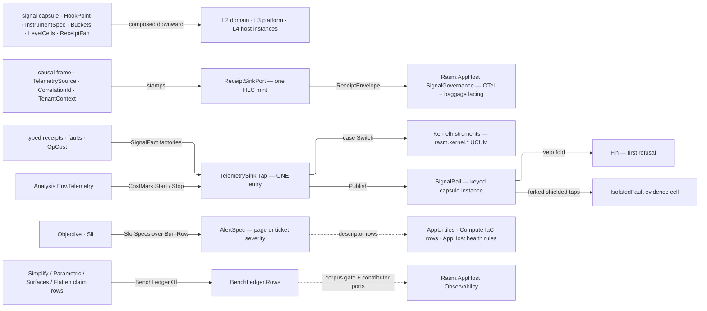

# [RASM_TELEMETRY]

`Rasm.Domain` (`Domain/Telemetry.cs`) owns the C# branch's one OTel-free signal capsule — the causal frame, hook, instrument, receipt, and objective mechanisms every stratum composes downward as an instance — and is its own first consumer. One home holds the capsule TYPE; a stratum above composes an INSTANCE against its own fact union, its own instrument roster, and its own objectives.

Every owner is instance-owned and composition-entered — evidence cell, meter, registry, HLC cell, clock, and emit delegate arrive from the composing app, so two compositions never contend for one slot. Dependency split draws the boundary: this page carries `System.Diagnostics.Metrics`, NodaTime, LanguageExt, and Thinktecture, while OTel-SDK wiring, exporters, sampling, resource identity, foreign-source rows, and the OTel baggage store stay at the app platform, which registers its baggage mirror as one `TenantMirror` row. Fire is synchronous from any stratum.

## [01]-[INDEX]

- [02]-[SIGNAL_CAPSULE]: `HookPoint<TFact>` fires one synchronous point over the id grammar, modality columns, and the frozen registry.
- [03]-[CAUSAL_FRAME]: `TelemetrySource` package identity, `CorrelationId`, `TenantId`/`TenantContext`, `ReceiptEnvelope`, and `ReceiptSinkPort`.
- [04]-[INSTRUMENT_MECHANISM]: `Buckets` advice, `InstrumentKind` x `MeasureForm` bind-and-listen derivation, `LevelCells` pushed cells beside lifetime-bound `LevelProbe` reads, the `InstrumentTally` backend-free read, and the `ReceiptFan` fold.
- [05]-[SIGNAL_TAP]: `SignalFact` and keyed rail, `TelemetrySink.Tap` one emission entry, `rasm.kernel` meters, and `TraceCarrier`-linked trace band.
- [06]-[SLO_ALGEBRA]: `Sli`, `Objective`, the four-row multi-window burn table, `AlertSeverity`, `AlertSpec`, and the panel vocabulary.
- [07]-[OP_COST]: `OpCost` bills each `Op` — elapsed, allocated bytes, and item count.
- [08]-[BENCH_LEDGER]: `BenchClaim` rows fold into the duplicate-refusing `BenchLedger` the corpus gate ingests.

## [02]-[SIGNAL_CAPSULE]

- Owner: `HookId` keys points under the estate grammar `rasm.<pkg>.<domain>.<point>`; `HookModality` carries `CanVeto` and `Retains` as row data, so veto admission and replay retention are the modality's own columns — a row-identity probe against `Replay` is the deleted form — `Veto` transforms or refuses, `Observe` taps fault-isolated, `Replay` buffers for late drain.
- Entry: `Fire` discriminates by call shape — unary publishes a settled fact, the guarded form hands its body the ADMITTED fact so a veto transform reaches the seam it guards and runs observe taps only from its success path; `Veto`, `Observe`, and `Drain` are the subscriber entries, and `Observe` discriminates its arm's rail shape so an effectful tap and a typed-rail projection reach one entry. Null delegates refuse on the typed rail (`Fire`, `Veto`) or throw at `Observe`'s argument contract, so no null reaches mount or dispatch.
- Auto: fire order is law — retention first so replay truth is the last fact even under a veto refusal; the veto left-fold second, its first refusal the verdict parked beside the return; observe taps last, each forked before its shielded run so the synchronous path returns without waiting. Fork refusals and throwing taps park as `IsolatedFault` while delivery continues; a replay point prunes its buffer to `depth` oldest-first per fire and hands a fresh subscriber the held window on attach.
- Receipt: a point mints nothing — the fire IS the evidence event, the emitter's typed receipt already carrying the fact; one shared fault cell records veto refusals and shielded tap faults point-attributed, drained by the composing app or projected onto a rejects counter through its `Change` tap.
- Packages: Thinktecture.Runtime.Extensions, LanguageExt.Core, BCL inbox.
- Growth: a new delivery semantics is one `HookModality` row with its column values, breaking every modality dispatch at compile time; a consuming folder's new point is one `HookPoint<TFact>` value on its own vocabulary — the capsule type never widens per folder.
- Boundary: `TFact` closes at declaration as a typed record or union case from the owning folder, so a stringly payload cannot enter the rail; a subscriber failure is evidence or a refusal, never a broken emitter or a starved sibling, because every tap runs inside its own shield.

```csharp signature
// --- [RUNTIME_PRELUDE] ----------------------------------------------------------------------
using System.Collections.Frozen;
using Rasm.Csp;

namespace Rasm.Domain;

// --- [TYPES] --------------------------------------------------------------------------------
[ValueObject<string>]
[KeyMemberEqualityComparer<ComparerAccessors.StringOrdinal, string>]
[KeyMemberComparer<ComparerAccessors.StringOrdinal, string>]
public readonly partial struct HookId {
    static partial void ValidateFactoryArguments(ref ValidationError? validationError, ref string value) =>
        validationError = value.Split('.') is ["rasm", var pkg, var domain, var point]
            && pkg.Length > 0 && domain.Length > 0 && point.Length > 0
            && value.All(static ch => char.IsAsciiLetterLower(ch) || char.IsAsciiDigit(ch) || ch is '.' or '-' or '_')
            ? null
            : new ValidationError(message: $"HookId requires the rasm.<pkg>.<domain>.<point> grammar: {value}");
}

[SmartEnum<string>]
[KeyMemberEqualityComparer<ComparerAccessors.StringOrdinal, string>]
[KeyMemberComparer<ComparerAccessors.StringOrdinal, string>]
public sealed partial class HookModality {
    public static readonly HookModality Veto = new("veto", canVeto: true, retains: false);
    public static readonly HookModality Observe = new("observe", canVeto: false, retains: false);
    public static readonly HookModality Replay = new("replay", canVeto: false, retains: true);

    public bool CanVeto { get; }

    public bool Retains { get; }
}

// --- [MODELS] -------------------------------------------------------------------------------
[BoundaryAdapter, StructLayout(LayoutKind.Auto)]
public readonly record struct IsolatedFault(HookId Point, Error Cause);

[BoundaryAdapter, StructLayout(LayoutKind.Auto)]
public readonly record struct HookDetacher(Action Detach) : IDisposable {
    public void Dispose() => Detach();
}

// --- [SERVICES] -----------------------------------------------------------------------------
public interface IHookPoint {
    HookId Id { get; }
    HookModality Modality { get; }
    Type Fact { get; }
}

// Evidence cell is a ctor param from the owning composition, never process-static — two compositions hold two cells.
public sealed class HookPoint<TFact> : IHookPoint {
    private readonly HookId id;
    private readonly HookModality modality;
    private readonly Atom<Seq<IsolatedFault>> faults;
    private readonly int depth;
    private readonly Atom<Seq<Func<TFact, Fin<TFact>>>> vetoes = Atom(Seq<Func<TFact, Fin<TFact>>>());
    private readonly Atom<Seq<Func<TFact, IO<Unit>>>> taps = Atom(Seq<Func<TFact, IO<Unit>>>());
    private readonly Atom<Seq<TFact>> buffer = Atom(Seq<TFact>());

    public HookPoint(HookId id, HookModality modality, Atom<Seq<IsolatedFault>> faults, int depth = 64) {
        ArgumentOutOfRangeException.ThrowIfNegative(depth);
        this.id = id;
        this.modality = modality;
        this.faults = faults;
        this.depth = depth;
    }

    public HookId Id => id;
    public HookModality Modality => modality;
    public Type Fact => typeof(TFact);

    public Fin<TFact> Fire(TFact fact) => Fire(fact: fact, body: Fin.Succ);

    // Guarded bodies receive the ADMITTED fact, so a transforming veto governs the seam and not the taps alone;
    // a null body refuses on the rail before retention, matching every delegate admission on this capsule.
    public Fin<T> Fire<T>(TFact fact, Func<TFact, Fin<T>> body) {
        if (body is null) {
            return Fin.Fail<T>(new Fault.InvalidValue(Label: Id.ToString(), Requirement: "a guarded fire requires a non-null body"));
        }
        Unit _ = Retain(fact: fact);
        return Admitted(fact: fact).Bind(admitted => body(admitted).Map(value => (Dispatch(fact: admitted), value).Item2));
    }

    public Fin<IDisposable> Veto(Func<TFact, Fin<TFact>> gate) =>
        gate is null
            ? Fin.Fail<IDisposable>(new Fault.InvalidValue(Label: Id.ToString(), Requirement: "a veto subscription requires a non-null gate"))
            : Modality.CanVeto
            ? Fin.Succ<IDisposable>(Attach(cell: vetoes, row: gate))
            : Fin.Fail<IDisposable>(new Fault.InvalidValue(Label: Id.ToString(), Requirement: "a veto subscription requires a veto-capable point"));

    public IDisposable Observe(Func<TFact, IO<Unit>> tap) {
        ArgumentNullException.ThrowIfNull(argument: tap);
        IDisposable detach = Attach(cell: taps, row: tap);
        ignore(buffer.Value.Iter(held => Forked(fact: held, tap: tap)));
        return detach;
    }

    // Rail shape discriminates the subscription: a projection arm returning the typed rail lifts onto the IO error
    // channel here, so a refused instrument write parks as `IsolatedFault` beside every other tap fault and no
    // consuming folder re-mints this lift as its own aspect.
    public IDisposable Observe(Func<TFact, Fin<Unit>> arm) =>
        Observe(fact => IO.lift(() => arm(fact)));

    public Seq<TFact> Drain() => buffer.Value;

    private Fin<TFact> Admitted(TFact fact) =>
        vetoes.Value.Fold(Fin.Succ(fact), static (state, veto) => state.Bind(veto))
            .MapFail(refusal => (Park(cause: refusal), refusal).Item2);

    private Unit Retain(TFact fact) =>
        Modality.Retains
            ? ignore(buffer.Swap(held => (held.Add(fact) is var next && next.Count > depth ? next.Skip(next.Count - depth) : next).Strict()))
            : unit;

    private Unit Dispatch(TFact fact) => ignore(taps.Value.Iter(tap => Forked(fact: fact, tap: tap)));

    // Fork before forcing: Run forces only the fork queue, never the subscriber body; fork and subscriber faults share one parked-evidence arm.
    private Unit Forked(TFact fact, Func<TFact, IO<Unit>> tap) =>
        Try.lift(() => IO.lift(() => Shielded(fact: fact, tap: tap)).Fork(None).Run()).Run().Match(
            Succ: static _ => unit,
            Fail: error => Park(cause: error));

    private Unit Shielded(TFact fact, Func<TFact, IO<Unit>> tap) =>
        Try.lift(() => tap(fact).Run()).Run().Match(
            Succ: static _ => unit,
            Fail: error => Park(cause: error));

    private Unit Park(Error cause) => ignore(faults.Swap(held => held.Add(new IsolatedFault(Point: Id, Cause: cause))));

    private static IDisposable Attach<T>(Atom<Seq<T>> cell, T row) {
        ignore(cell.Swap(held => held.Add(row)));
        return new HookDetacher(Detach: () => ignore(cell.Swap(held => held.Filter(entry => !ReferenceEquals(entry, row)).ToSeq().Strict())));
    }
}

// Frozen mount table is the audit surface; a fired id outside it is unreachable because firing requires the declared point value.
public sealed record HookRegistry(FrozenDictionary<string, IHookPoint> Points) {
    public static HookRegistry Mount(params ReadOnlySpan<IHookPoint> points) =>
        new(Points: points.ToArray().ToFrozenDictionary(static point => point.Id.ToString(), static point => point, StringComparer.Ordinal));
}
```

## [03]-[CAUSAL_FRAME]

- Owner: `TelemetrySource` is the minted package-identity roster every emitter names its scope by; `CorrelationId` the boot-minted root identity carrying `Slot`, its one dimension and span-attribute spelling; `TenantId`/`TenantContext` the tenancy pair with `TenantSlot` the one GUC, baggage, and meter-tag KEY spelling and `TenantId.Wire`/`Text`/`Of` the one VALUE text and its parse inverse; `TenantMirror` the ambient-store row a scope threads; `ReceiptEnvelope` the stamped evidence value; `ReceiptSinkPort` the emit port carrying the one HLC mint. Every L2 and L3 peer emits receipts through these, so a neutral-`Guid` twin at an emitting package has no reason to exist.
- Cases: three ambient stores partition by owner — the kernel `AsyncLocal` tenancy slot and the BCL `Activity` baggage store are the rows this assembly can reach, and the OTel `Baggage.Current` store registers as one composition-supplied row at `Rasm.AppHost` `SignalGovernance`; `TenantContext.Root` is the single-tenant ambient default, and a multi-tenant host mints one row per admitted tenant at boot from its tenant-feed configuration.
- Entry: `TenantContext.Stamp(params ReadOnlySpan<TenantMirror> mirrors)` returns the restoring scope over the ambient slot and every mirror row, so deferred work brackets each store as one tenancy value; `ReceiptSinkPort.Send(correlation, tenant, package, kind, payload)` returns the `IO<ReceiptEnvelope>` whose value is the emission evidence.
- Auto: the absent-tenant arm is structural — `Partitions` is false for the root row, so `Stamp` writes no entry into any store and `Tags` is empty; an absent `rasm.tenant` entry therefore reads as single-tenant everywhere, and a zero-valued attribute is the sentinel that reading forecloses. `TenantId.Wire`/`Text`/`Of` fix the one VALUE spelling beside `TenantSlot`'s one key spelling — fixed-width 32-hex-digit invariant text every ambient store, GUC, meter tag, durable partition column, object-name prefix, and series key carries byte-identically, so a peer joining a metric series to a store partition compares text and never converts a base, and `Entry` is that text under the tenancy pair's accessor rather than a second render. `Advance` is the one HLC mint — the logical half resets to zero on a physical advance and increments on a same-instant repeat, and `SkewBound` derives at stamp time as the wall-clock lag the advance observed.
- Receipt: `ReceiptEnvelope` carries the one causal frame — correlation, tenant, and the HLC two-half stamp threaded together so every receipt and every content key composes the identical `(tenant, physical, logical)` frame.
- Packages: NodaTime, Thinktecture.Runtime.Extensions, LanguageExt.Core, BCL inbox (`System.Diagnostics`, `System.Text.Json`, `System.Threading`).
- Growth: a new minted package is one `TelemetrySource` row; a new ambient store is one `TenantMirror` row supplied at composition, never a second stamping owner; a new stamped surface draws from the same `Atom<(Instant Physical, ulong Logical)>` cell.
- Boundary: the half order is FIXED and load-bearing — physical half first as the NodaTime `Instant` Unix-tick `long`, logical half second as the monotone `ulong`, both little-endian on the wire and byte-identical to `Rasm.Compute/Runtime/codecs#CONTENT_ADDRESSING` `InterchangeIdentity.Compose`, so a content key and a causal stamp seal one frame every peer re-derives from the same two-half order and an off-by-one-half pack corrupts the whole causal order. Tenancy rides an `AsyncLocal` slot rather than a named process-wide slot registry, so two compositions in one process — an app root beside a plugin ALC capsule — each hold their own tenancy without a duplicate-name registration fault. Foreign-source rows, OTel resource lacing, exporter wiring, and the `Baggage.Current` mirror stay `Rasm.AppHost` `SignalGovernance`, which binds its registered mirror set behind one stamping surface so a kernel caller spells `Stamp()` bare and never threads a mirror row per call site; a clock, an HLC cell, and an emit delegate are constructor material this capsule never mints.

```csharp signature
// --- [RUNTIME_PRELUDE] ----------------------------------------------------------------------
using System.Buffers;                                 // SearchValues — the tenant-text alphabet gate
using System.Diagnostics;
using System.Globalization;
using System.Text.Json;
using NodaTime;
using Rasm.Csp;

namespace Rasm.Domain;

// --- [TYPES] --------------------------------------------------------------------------------
// Minted rows alone: a foreign meter or source this branch never authors is an AppHost admission row.
[SmartEnum<string>]
[KeyMemberEqualityComparer<ComparerAccessors.StringOrdinal, string>]
[KeyMemberComparer<ComparerAccessors.StringOrdinal, string>]
public sealed partial class TelemetrySource {
    public static readonly TelemetrySource Kernel = new("rasm.kernel");
    public static readonly TelemetrySource Element = new("Rasm.Element");
    public static readonly TelemetrySource AppHost = new("Rasm.AppHost");
    public static readonly TelemetrySource Materials = new("Rasm.Materials");
    public static readonly TelemetrySource Bim = new("Rasm.Bim");
    public static readonly TelemetrySource Fabrication = new("Rasm.Fabrication");
    public static readonly TelemetrySource Persistence = new("Rasm.Persistence");
    public static readonly TelemetrySource Compute = new("Rasm.Compute");
    public static readonly TelemetrySource Generation = new("Rasm.Generation");
    public static readonly TelemetrySource AppUi = new("Rasm.AppUi");
    public static readonly TelemetrySource Rhino = new("Rasm.Rhino");
    public static readonly TelemetrySource Grasshopper = new("Rasm.Grasshopper");
}

[ValueObject<Guid>(
    ConversionToKeyMemberType = ConversionOperatorsGeneration.Implicit,
    ConversionFromKeyMemberType = ConversionOperatorsGeneration.None)]
public readonly partial struct CorrelationId : ISpanFormattable, IUtf8SpanFormattable {
    // Dimension and span-attribute spelling for the frame's other half: a `nameof(CorrelationId)` tag key
    // spells PascalCase against the dotted grammar every sibling slot obeys and forks per emitting package.
    public const string Slot = "rasm.correlation";

    public static readonly CorrelationId None = Create(Guid.Empty);

    // `IFormattable.ToString(string?, IFormatProvider?)` belongs to the generator: a formattable key member emits
    // it unless `SkipIFormattable` opts out, so a hand-written twin collides on the partial. Both span writers are
    // this declaration's own, because the generator emits no `ISpanFormattable` and no `IUtf8SpanFormattable`.
    public bool TryFormat(Span<char> destination, out int charsWritten, ReadOnlySpan<char> format, IFormatProvider? provider) => ((Guid)this).TryFormat(destination, out charsWritten, format);
    public bool TryFormat(Span<byte> utf8Destination, out int bytesWritten, ReadOnlySpan<char> format, IFormatProvider? provider) => ((Guid)this).TryFormat(utf8Destination, out bytesWritten, format);
}

[ValueObject<UInt128>(
    KeyMemberName = "Value",
    KeyMemberAccessModifier = AccessModifier.Public,
    ConversionToKeyMemberType = ConversionOperatorsGeneration.Implicit,
    ConversionFromKeyMemberType = ConversionOperatorsGeneration.None)]
public readonly partial struct TenantId {
    // `Wire`/`Text`/`Of` are the ONE tenant text pair. Fixed-width 32-hex-digit invariant text is what every
    // ambient store entry, RLS predicate, durable partition column, object-name prefix, AAD digest input, and
    // meter tag carries, so a peer joins a metric series to a store partition by text equality and never a base
    // conversion; a variable-width decimal render aligns with none of them. Both members read the public key
    // member directly, so neither depends on a generated formatting or parsing interface and a call site spells
    // `Text` rather than an interpolation format the generator's opt-out policy governs.
    public const string Wire = "x32";

    public string Text => Value.ToString(Wire, CultureInfo.InvariantCulture);

    // `Of` is the SOLE boundary of the identity contract, and the contract is exact: thirty-two ASCII hex
    // digits, nothing narrower, wider, or outside that alphabet. A short or wide span still parses, and the
    // value it yields renders back through `Text` as a different spelling than the text that produced it — so
    // the ambient entry, the RLS predicate, the object prefix, and the meter tag would each carry a form this
    // seam never admitted while every equality against them silently missed.
    public static TenantId Of(ReadOnlySpan<char> text) =>
        text.Length == 32 && !text.ContainsAnyExcept(HexDigits)
            ? Create(UInt128.Parse(text, NumberStyles.HexNumber, CultureInfo.InvariantCulture))
            : throw new FormatException($"<tenant-text:{text.Length}>");

    private static readonly SearchValues<char> HexDigits = SearchValues.Create("0123456789abcdefABCDEF");
}

// --- [MODELS] -------------------------------------------------------------------------------
// One ambient store per row: Read snapshots the prior entry, Write seats it or clears it. The OTel baggage
// store is the app platform's, so its row registers there and no OTel type enters this assembly.
public sealed record TenantMirror(string Store, Func<Option<string>> Read, Action<Option<string>> Write) {
    // Activity baggage clears an entry the current activity itself added; an entry inherited from a parent
    // stays the parent's to own, which is why the span mirror restores rather than deletes unconditionally.
    public static readonly TenantMirror Span = new(
        Store: nameof(Activity),
        Read: static () => Optional(Activity.Current?.GetBaggageItem(TenantContext.TenantSlot)),
        Write: static entry => ignore(Activity.Current?.SetBaggage(
            TenantContext.TenantSlot,
            entry.Match<string?>(Some: static held => held, None: static () => null))));
}

public sealed record TenantContext(TenantId TenantId, string Slug) {
    public const string TenantSlot = "rasm.tenant";

    public static readonly TenantContext Root = new(TenantId.Create(UInt128.Zero), "root");

    private static readonly AsyncLocal<TenantContext?> Ambient = new();

    public static TenantContext Current => Ambient.Value ?? Root;

    public bool Partitions => !Equals(Root);

    public string Entry => TenantId.Text;

    public Seq<KeyValuePair<string, object?>> Tags =>
        Partitions ? Seq(new KeyValuePair<string, object?>(TenantSlot, Entry)) : Seq<KeyValuePair<string, object?>>();

    // Stamping is ALL-OR-NOTHING: a mirror write that raises after the ambient slot and its predecessors
    // already moved leaves a scope no caller holds and therefore no caller can unwind, so the partial fold
    // rolls back through the same reverse-order restore disposal runs and re-raises carrying every
    // restoration failure beside the original. The seated prefix is the fold's own state, so a mirror raising
    // on the first write restores nothing and one raising on the last restores all of its predecessors.
    public IDisposable Stamp(params ReadOnlySpan<TenantMirror> mirrors) {
        TenantContext? prior = Ambient.Value;
        Seq<(TenantMirror Row, Option<string> Prior)> held = (Seq(TenantMirror.Span) + toSeq(mirrors.ToArray()))
            .Map(static row => (Row: row, Prior: row.Read())).Strict();
        Ambient.Value = this;
        Option<string> entry = Partitions ? Some(Entry) : None;
        (Seq<(TenantMirror Row, Option<string> Prior)> Seated, Option<Error> Fault) fold = held.Fold(
            (Seated: Seq<(TenantMirror Row, Option<string> Prior)>(), Fault: Option<Error>.None),
            (state, row) => state.Fault.IsSome
                ? state
                : Try.lift(() => { row.Row.Write(entry); return unit; }).Run().Match(
                    Succ: _ => (state.Seated.Add(row), state.Fault),
                    Fail: error => (state.Seated, Some(error))));
        return fold.Fault.Match(
            Some: error => throw Restored(prior, fold.Seated, Some(error)).IfNone(error).ToException(),
            None: () => (IDisposable)new TenantScope(prior, held));
    }

    // ONE restore fold both the failed stamp and disposal read: every row is attempted in reverse admission
    // order even when one raises, so a single raising mirror never strands its siblings under the retiring
    // tenant, and each restoration failure appends onto the error the fold carries in — the caller reads the
    // original cause and every secondary fault on one value rather than the first one thrown winning.
    private static Option<Error> Restored(TenantContext? prior, Seq<(TenantMirror Row, Option<string> Prior)> held, Option<Error> carried) =>
        held.Rev().Fold(
            Appended(carried, Try.lift(() => { Ambient.Value = prior; return unit; }).Run()),
            static (fault, row) => Appended(fault, Try.lift(() => { row.Row.Write(row.Prior); return unit; }).Run()));

    private static Option<Error> Appended(Option<Error> carried, Fin<Unit> step) =>
        step.Match(
            Succ: _ => carried,
            Fail: failure => Some(carried.Match(Some: held => held + failure, None: () => failure)));

    // Restore runs once and in reverse admission order, so an inner scope never resurrects an outer entry.
    private sealed class TenantScope(TenantContext? prior, Seq<(TenantMirror Row, Option<string> Prior)> held) : IDisposable {
        private int disposed;

        public void Dispose() {
            if (Interlocked.Exchange(ref disposed, 1) != 0) { return; }
            Restored(prior, held, Option<Error>.None).IfSome(static residue => throw residue.ToException());
        }
    }
}

public sealed record ReceiptEnvelope(
    CorrelationId Correlation,
    TenantContext Tenant,
    string Package,
    string Kind,
    JsonElement Payload,
    Instant Physical,
    ulong Logical,
    Duration SkewBound);

// --- [SERVICES] -----------------------------------------------------------------------------
public sealed record ReceiptSinkPort(
    IClock Clock,
    Atom<(Instant Physical, ulong Logical)> Hlc,
    Func<ReceiptEnvelope, IO<Unit>> Emit) {
    // The logical counter is BOUNDED, so an exhausted one advances the physical component by the clock's own
    // smallest step and restarts rather than wrapping to zero under the same instant — a wrap re-issues a
    // stamp the stream already carried, and every causal comparison after it reads reversed.
    public static (Instant Physical, ulong Logical) Advance(
        (Instant Physical, ulong Logical) last, Instant wall) =>
        wall > last.Physical ? (wall, 0UL)
        : last.Logical == ulong.MaxValue ? (last.Physical + Duration.Epsilon, 0UL)
        : (last.Physical, last.Logical + 1UL);

    public IO<ReceiptEnvelope> Send(CorrelationId correlation, TenantContext tenant, string package, string kind, JsonElement payload) =>
        IO.lift(() => Clock.GetCurrentInstant())
            .Map(wall => (Wall: wall, Cell: Hlc.Swap(last => Advance(last, wall))))
            .Map(state => new ReceiptEnvelope(
                correlation, tenant, package, kind, payload,
                state.Cell.Physical, state.Cell.Logical, state.Cell.Physical - state.Wall))
            .Bind(envelope => Emit(envelope).Map(_ => envelope));
}
```

## [04]-[INSTRUMENT_MECHANISM]

- Owner: `Buckets` is the one advice holder — every stratum reads a named bound row and binds it through `Advised<T>`, so a folder-local bound array is the forked-policy defect; `InstrumentSpec` is the ONE declaration row every sink composes, its `Kind` naming the instrument family and its `MeasureForm` the measurement type, so the bind body is derived and a folder re-spelling a counter, gauge, or histogram create re-mints it. `InstrumentTally` is the backend-free read plane over a mounted set — `ReadingCell` the one measured shape and `InstrumentReading` the per-row projection — so a support archive, a doctor verb, and an in-host panel each answer what this process measured with no exporter, collector, or store reachable.
- Cases: eight kinds span the whole instrument space — `Count` and `Delta` the synchronous monotone and signed writes, `Distribution` the advised histogram, `Reading` the call-site last value, `Total` and `Balance` the pulled monotone and signed totals, `Level` the pulled scalar, `Levels` the pulled keyed family; two forms close the measurement type, so one generic bind body spells each create exactly once.
- Entry: `InstrumentSpec`'s static factories are the only construction path, each taking exactly the payload its kind requires, so an under-specified row has no spelling and no runtime guard exists to check for one; `InstrumentSet.Of` mounts any number of `(meter, rows)` pairs against one cell store, so a one-meter root is its one-element call; `Write` and `Level` are the pushed and pulled measurement entries, `Write` discriminating the instrument family off the bound handle and `Level` scalar versus keyed by call shape; `Bind` is `Level`'s registered peer, taking an owner's own read beside the tags it reports under and returning the scope that retires it, so a bounded owner reports live occupancy without a call site pushing one; `ReceiptFan.Of` merges contributed arm tables and a duplicate kind throws at the frozen merge; `TelemetryContributorPort.Roster` freezes the port's whole declaration by name and `Admit` proves its pack against that roster, so a mounting root folds every contributor before it mints a meter; `TelemetryIdentity.Metered` and `Mint` stamp the semconv coordinate as `MeterOptions.TelemetrySchemaUrl`, the pair form adding the `ActivitySource` a root admits into its band; `InstrumentTally.Of(set, ceiling)` opens the read plane under its distinct-series bound and `Read()` is its one entry, driving the observables then projecting every declared row.
- Auto: a `Distribution` row with no bounds binds the plain histogram, so base2-exponential aggregation stays the wire default and an explicit-bucket row is the per-instrument fallback the declaration re-arms; instrument identity de-duplicates by name inside a meter, so a row carries name, unit, and state-reader once and an inline create with a drifted unit is the forked-stream defect; a keyed level family projects each map entry as one tagged `Measurement<T>`, so per-key cardinality rides ONE instrument and a per-key instrument mint is the deleted form; an unmapped kind projects nothing and stays receipt-only. Pulled rows fill from two sources under one reader — cells a producer PUSHES and probes a bounded owner REGISTERS — and a name carries every live probe rather than a slot the newest registration overwrites, so a lane limiter, a worker pool, and a durable intake each publish under their own tags instead of the last one bound deleting the readings before it; each probe reads inside its own fence, so one raising owner subtracts itself and its siblings still report; a probe's scope is what ENDS its reading, because a level whose owner retired and whose value freezes at that owner's last write is indistinguishable at every collection from a live level nothing is moving. Tallies admit by HANDLE identity against the mounted set, so a foreign instrument sharing a declared name never enters the read; a pushed measurement accumulates and an observable REPLACES, because an observable republishes its whole value each collection and accumulating one compounds a level into a total no producer measured; a declared row the process never measured projects an empty cell seq, so a doctor read distinguishes a quiet producer from a dead one instead of reporting a zero nothing recorded — which is why every pulled reader answers a MEASUREMENT SEQUENCE and yields none over an unwritten cell, a scalar reader having no spelling for absence and publishing a level no producer ever set; a distinct series past the tally's ceiling folds onto the specification's own overflow key, so the clipping reads as SDK-limited rather than as a measurement that never happened.
- Receipt: both measurement entries return the typed rail — an unmounted name, a pushed-versus-pulled polarity breach, and a family mismatch each land a refusal carrying the offending name, and `InstrumentArm` returns that rail so a refusal survives the fan instead of dying at the delegate boundary; a measurement therefore never disappears into a silent no-op and never throws a lookup exception into an emitting fold. `InstrumentKind.Pulled` is the enforced column: `LevelCells`'s own writes are assembly-internal, so the cell store has no reachable spelling outside this capsule and an ungated level write cannot be composed.
- Packages: LanguageExt.Core, BCL inbox (`System.Diagnostics.Metrics`, `System.Diagnostics.DiagnosticSource`, `System.Numerics`, `System.Text.Json`).
- Growth: a new bucket policy is one `Buckets` row, a new instrument family one `InstrumentKind` row breaking the one generic bind at compile time, a new measurement type one `MeasureForm` row carrying BOTH its mint and its listen column so a tally can never drop a type a mint admits, a new read moment one `ReadingCell` column, a tightened diagnostic memory bar one `ceiling` value at the arming composition, a new projected kind one arm-table row in the contributing folder, a new level family one `Level` write site and one `Levels` declaration, a new bounded owner reporting its own saturation one `Bind` scope over that owner's lifetime under its own tags, its probe joining the declared row's series and leaving with it, a contributor's whole board and reliability policy one `Board` value on its own port, and its whole span custody one `Planes` roster on that same port.
- Boundary: `TelemetryContributorPort` self-identifies by plain `string` scope — the app platform maps it into its own meter and source admission, so a contributor never names a platform type and crosses every stratum legally; `Instruments` and `Published` split by WHO MOUNTS — the root binds handles for the first and a contributor owning its own meter lifetime declares the second, `Declared` is the union every naming gate, view predicate, and pack admission reads, and a self-minted row seated in `Instruments` binds a second handle for one name while a row on neither roster exports a stream no gate can refuse; the port carries the contributor's board pack beside the rows that pack names and proves it against its OWN declaration, so a per-load-context contributor's pack is provable at all and a package-specific pack field reached by name from a composition root is the deleted form; `Planes` carries span custody on that same seam, so a platform referencing no emitting package still admits every plane; `SchemaUrl` defaults to the one pinned semconv coordinate so tracer, meter, and logger bump together and no branch hand-spells the value; the mounted `Rows` travel with the bound handles so the governance leg reads each row's declared `Dimensions` as its view tag-key set rather than re-deriving one; a keyed family's tag heads its own `Dimensions` from the factory, so a panel break key, a partition indicator, and a view tag key all resolve against one roster and a caller restating the tag beside its own rows cannot fork the two; scalar and keyed cells both hold `double`, so the whole (kind x form) product carries its declared measurement type and a keyed real-valued level never truncates; meter and instrument lifetime ride the minting factory, so no capsule retains a meter handle or disposes one, and a `new Meter(...)` construction is the rejected form everywhere; the tally is a DIAGNOSTIC composition an operating profile arms and disposes, never a standing emission leg — it holds one accumulator per (name, tag set) for the life of the listener, bounded by a distinct-series ceiling the arming composition supplies, so the memory an armed plane costs is a policy value rather than the process's whole tag space, and the arming seat stays a policy row at the app platform and never a default here; the read plane accumulates, it never emits, so a tally reading a stream is not a second truth beside the receipt fan and a projection written back onto an instrument from a reading is the deleted form.

```csharp signature
// --- [RUNTIME_PRELUDE] ----------------------------------------------------------------------
using System.Collections.Frozen;
using System.Collections.Immutable;
using System.Diagnostics;
using System.Diagnostics.Metrics;
using System.Numerics;
using System.Text.Json;
using Rasm.Csp;

namespace Rasm.Domain;

// --- [CONSTANTS] ----------------------------------------------------------------------------
// Named bound rows are estate policy data — the explicit-bucket fallback a backend without base2-exponential
// histograms reads. Boundaries are real values; the form converts them to the instrument's measurement type.
public static class Buckets {
    public static readonly ImmutableArray<double> HopSeconds = [0.005, 0.01, 0.025, 0.05, 0.1, 0.25, 0.5, 1, 2.5, 5, 10];
    public static readonly ImmutableArray<double> RemoteSeconds = [0.005, 0.01, 0.025, 0.05, 0.1, 0.25, 0.5, 1, 2.5, 5, 10, 30];
    public static readonly ImmutableArray<double> ModelSeconds = [0.1, 0.25, 0.5, 1, 2, 5, 10, 30, 60];
    public static readonly ImmutableArray<double> BenchSeconds = [0.000001, 0.00001, 0.0001, 0.001, 0.01, 0.1, 1, 10];
    public static readonly ImmutableArray<double> DecodeSeconds = [0.01, 0.05, 0.1, 0.5, 1, 5, 15, 60, 300];
    public static readonly ImmutableArray<double> FoldSeconds = [0.0005, 0.001, 0.005, 0.01, 0.05, 0.1, 0.5, 1, 5, 10];
    public static readonly ImmutableArray<double> ProfileSeconds = [0.001, 0.01, 0.05, 0.1, 0.5, 1, 5, 15, 60];
    public static readonly ImmutableArray<double> CanvasFrameSeconds = [0.0005, 0.001, 0.0025, 0.005, 0.008, 0.017, 0.033, 0.066, 0.1, 0.25];
    public static readonly ImmutableArray<double> UiFrameSeconds = [0.002, 0.004, 0.008, 0.0167, 0.0333, 0.0667, 0.1, 0.25, 1];
    public static readonly ImmutableArray<double> AckSeconds = [0.001, 0.0025, 0.005, 0.01, 0.025, 0.05, 0.1, 0.25, 0.5, 1, 2.5];
    public static readonly ImmutableArray<double> InteractionSeconds = [0.005, 0.01, 0.025, 0.05, 0.1, 0.25, 0.5, 1, 2.5];
    public static readonly ImmutableArray<double> SolveSeconds = [0.00001, 0.0001, 0.001, 0.01, 0.1, 0.5, 1, 5];
    public static readonly ImmutableArray<double> CompileSeconds = [0.0001, 0.001, 0.01, 0.05, 0.1, 0.5, 1, 5];
    public static readonly ImmutableArray<double> CadenceSeconds = [0.05, 0.1, 0.25, 0.5, 1, 2.5, 5, 15, 60];
    public static readonly ImmutableArray<double> CycleSeconds = [1, 10, 60, 300, 900, 3600, 14400, 86400];
    public static readonly ImmutableArray<double> RefreshSeconds = [60, 300, 900, 3600, 14400, 86400, 604800];
    public static readonly ImmutableArray<double> Fractions = [0.01, 0.05, 0.1, 0.25, 0.5, 0.75, 0.9, 1.0];
    public static readonly ImmutableArray<double> GoverningRatio = [0.25, 0.5, 0.75, 0.9, 1, 1.1, 1.25, 1.5, 2, 4];
    public static readonly ImmutableArray<double> DivergenceRatio = [0.01, 0.025, 0.05, 0.1, 0.25, 0.5, 1, 2];
    public static readonly ImmutableArray<double> ResidualDecades = [1e-9, 1e-8, 1e-7, 1e-6, 1e-5, 1e-4, 1e-3, 1e-2, 1e-1, 1];
    public static readonly ImmutableArray<double> IterationCounts = [1, 2, 5, 10, 25, 50, 100, 250, 500, 1000, 2500];
    public static readonly ImmutableArray<double> Hypervolume = [0.05, 0.1, 0.2, 0.35, 0.5, 0.65, 0.8, 0.9, 0.95, 1];
    public static readonly ImmutableArray<double> CostUnitDecades = [0.0001, 0.001, 0.01, 0.1, 1, 10, 100, 1000];
    public static readonly ImmutableArray<double> Millimeters = [0.001, 0.005, 0.01, 0.025, 0.05, 0.1, 0.25, 1.0];
    public static readonly ImmutableArray<double> TokenCounts = [16, 64, 256, 1024, 4096, 16384, 65536];
    public static readonly ImmutableArray<double> GraphCounts = [10, 100, 1_000, 10_000, 100_000, 1_000_000];
    public static readonly ImmutableArray<double> ByteSizes = [10_000, 100_000, 1_000_000, 10_000_000, 100_000_000, 1_000_000_000];
    public static readonly ImmutableArray<double> PayloadBytes = [1_024, 16_384, 262_144, 4_194_304, 67_108_864, 536_870_912];

    public static Histogram<T> Advised<T>(Meter meter, string name, string unit, string text, ImmutableArray<double> bounds)
        where T : struct, INumberBase<T> =>
        meter.CreateHistogram<T>(name, unit, text, tags: null,
            advice: new InstrumentAdvice<T> { HistogramBucketBoundaries = [.. bounds.Select(static bound => T.CreateSaturating(bound))] });
}

// --- [TYPES] --------------------------------------------------------------------------------
[SmartEnum<string>]
[KeyMemberEqualityComparer<ComparerAccessors.StringOrdinal, string>]
[KeyMemberComparer<ComparerAccessors.StringOrdinal, string>]
public sealed partial class InstrumentKind {
    public static readonly InstrumentKind Count = new("count", pulled: false);
    public static readonly InstrumentKind Delta = new("delta", pulled: false);
    public static readonly InstrumentKind Distribution = new("distribution", pulled: false);
    public static readonly InstrumentKind Reading = new("reading", pulled: false);
    public static readonly InstrumentKind Total = new("total", pulled: true);
    public static readonly InstrumentKind Balance = new("balance", pulled: true);
    public static readonly InstrumentKind Level = new("level", pulled: true);
    public static readonly InstrumentKind Levels = new("levels", pulled: true);

    // Polarity is the write law in one column: a pulled row reads a cell at collection cadence and refuses a
    // call-site write, a pushed row records an event-shaped fact and owns no cell.
    public bool Pulled { get; }
}

// Listener callbacks hand tags as a span, which no `Action<>` arity admits, so the fold is its own delegate;
// every form widens its measurement to `double` at the seam because the read plane carries one cell shape.
public delegate void ReadingFold(Instrument instrument, double measurement, ReadOnlySpan<KeyValuePair<string, object?>> tags);

// Measurement type is the ONLY axis every create call varies on, so one generic body closed twice yields
// this whole (kind x form) product and spells each create exactly once.
[SmartEnum<string>]
[KeyMemberEqualityComparer<ComparerAccessors.StringOrdinal, string>]
[KeyMemberComparer<ComparerAccessors.StringOrdinal, string>]
public sealed partial class MeasureForm {
    public static readonly MeasureForm Whole = new("long", Bound<long>, Heard<long>);
    public static readonly MeasureForm Real = new("double", Bound<double>, Heard<double>);

    [UseDelegateFromConstructor]
    public partial Instrument Mint(InstrumentSpec spec, Meter meter, LevelCells cells, string name, string unit, string text);

    // Each row carries its subscribe half beside its mint half, so a new measurement type lands both or has no
    // spelling — a tally registering a hand-listed type set drops every measurement the list forgot, and
    // `SetMeasurementEventCallback` reports no such gap.
    [UseDelegateFromConstructor]
    public partial void Heard(MeterListener listener, ReadingFold fold);

    private static void Heard<T>(MeterListener listener, ReadingFold fold) where T : struct, INumberBase<T> =>
        listener.SetMeasurementEventCallback<T>(
            (instrument, measurement, tags, _) => fold(instrument, double.CreateSaturating(measurement), tags));

    private static Instrument Bound<T>(InstrumentSpec spec, Meter meter, LevelCells cells, string name, string unit, string text)
        where T : struct, INumberBase<T> =>
        spec.Kind.Switch(
            state: (Spec: spec, Meter: meter, Cells: cells, Name: name, Unit: unit, Text: text),
            count: static bind => (Instrument)bind.Meter.CreateCounter<T>(bind.Name, bind.Unit, bind.Text),
            delta: static bind => bind.Meter.CreateUpDownCounter<T>(bind.Name, bind.Unit, bind.Text),
            distribution: static bind => bind.Spec.Bounds.Match(
                Some: bounds => Buckets.Advised<T>(bind.Meter, bind.Name, bind.Unit, bind.Text, bounds),
                None: () => bind.Meter.CreateHistogram<T>(bind.Name, bind.Unit, bind.Text)),
            reading: static bind => bind.Meter.CreateGauge<T>(bind.Name, bind.Unit, bind.Text),
            // Every pulled arm binds the `Func<IEnumerable<Measurement<T>>>` overload, so an unwritten cell publishes
            // ZERO measurements and the row exports no data point; the scalar `Func<T>` overload has no spelling for
            // that absence and reports a zero no producer measured.
            total: static bind => bind.Meter.CreateObservableCounter(bind.Name, bind.Cells.Reader<T>(bind.Name), bind.Unit, bind.Text),
            balance: static bind => bind.Meter.CreateObservableUpDownCounter(bind.Name, bind.Cells.Reader<T>(bind.Name), bind.Unit, bind.Text),
            level: static bind => bind.Meter.CreateObservableGauge(bind.Name, bind.Cells.Reader<T>(bind.Name), bind.Unit, bind.Text),
            // `Tag` is `Option<string>` because seven kinds carry none; the `Levels` factory is the only path to this
            // arm and always seats one, so the row's-own-name fallback is the total spelling of a state the private
            // constructor makes unconstructible rather than a second keying policy a caller can reach.
            levels: static bind => bind.Meter.CreateObservableGauge(
                bind.Name, bind.Cells.Reader<T>(bind.Name, Some(bind.Spec.Tag.IfNone(bind.Name))), bind.Unit, bind.Text));
}

// --- [MODELS] -------------------------------------------------------------------------------
// One declaration row for every sink: the private constructor makes the factories the only spelling, so a
// distribution without bounds or a keyed family without a tag is unconstructible rather than guarded, and it
// is the one admission every row's own values cross, so no consumer re-proves a name, a unit, or a bucket.
public sealed record InstrumentSpec {
    private InstrumentSpec(
        string name, InstrumentKind kind, MeasureForm form, string unit, string description,
        Option<ImmutableArray<double>> bounds, Option<string> tag, Seq<string> dimensions) {
        // The private constructor is the row's ADMISSION, not merely its narrowest spelling: every factory
        // funnels here, so a blank name, unit, or text, a blank or repeated dimension, and a bucket vector the
        // histogram cannot use each break the static initializer that declared them. A declaration row is
        // composition data — an unusable one reaching a meter publishes an unaddressable stream and a bucket
        // set no measurement lands in, which reads downstream as a producer that simply never measured.
        ArgumentException.ThrowIfNullOrWhiteSpace(name);
        ArgumentException.ThrowIfNullOrWhiteSpace(unit);
        ArgumentException.ThrowIfNullOrWhiteSpace(description);
        if (dimensions.Exists(string.IsNullOrWhiteSpace) || dimensions.Distinct().Count != dimensions.Count) {
            throw new ArgumentException($"<instrument-dimensions:{name}>", nameof(dimensions));
        }
        // Advised bounds carry the histogram's own contract: at least one boundary, every value finite, and
        // strictly ascending — the SDK reads an unordered or NaN-bearing vector as buckets nothing falls into.
        if (bounds.Map(static rows => rows.IsEmpty
                || rows.Any(static bound => !double.IsFinite(bound))
                || rows.Zip(rows.Skip(1)).Any(static pair => pair.First >= pair.Second)).IfNone(false)) {
            throw new ArgumentException($"<instrument-bounds:{name}>", nameof(bounds));
        }
        Name = name;
        Kind = kind;
        Form = form;
        Unit = unit;
        Description = description;
        Bounds = bounds;
        Tag = tag;
        Dimensions = dimensions;
    }

    public string Name { get; }
    public InstrumentKind Kind { get; }
    public MeasureForm Form { get; }
    public string Unit { get; }
    public string Description { get; }
    public Option<ImmutableArray<double>> Bounds { get; }
    public Option<string> Tag { get; }
    public Seq<string> Dimensions { get; }

    // Bound name, unit, and text stay delegate parameters so one row binds against any meter and any cells.
    public Func<Meter, LevelCells, string, string, string, Instrument> Bind =>
        (meter, cells, name, unit, text) => Form.Mint(this, meter, cells, name, unit, text);

    public static InstrumentSpec Count(string name, string unit, string text, MeasureForm form, params ReadOnlySpan<string> dimensions) =>
        new(name, InstrumentKind.Count, form, unit, text, None, None, toSeq(dimensions.ToArray()));

    public static InstrumentSpec Delta(string name, string unit, string text, MeasureForm form, params ReadOnlySpan<string> dimensions) =>
        new(name, InstrumentKind.Delta, form, unit, text, None, None, toSeq(dimensions.ToArray()));

    public static InstrumentSpec Distribution(string name, string unit, string text, MeasureForm form, params ReadOnlySpan<string> dimensions) =>
        new(name, InstrumentKind.Distribution, form, unit, text, None, None, toSeq(dimensions.ToArray()));

    public static InstrumentSpec Advised(string name, string unit, string text, MeasureForm form, ImmutableArray<double> bounds, params ReadOnlySpan<string> dimensions) =>
        new(name, InstrumentKind.Distribution, form, unit, text, Some(bounds), None, toSeq(dimensions.ToArray()));

    public static InstrumentSpec Reading(string name, string unit, string text, MeasureForm form, params ReadOnlySpan<string> dimensions) =>
        new(name, InstrumentKind.Reading, form, unit, text, None, None, toSeq(dimensions.ToArray()));

    public static InstrumentSpec Total(string name, string unit, string text, MeasureForm form, params ReadOnlySpan<string> dimensions) =>
        new(name, InstrumentKind.Total, form, unit, text, None, None, toSeq(dimensions.ToArray()));

    public static InstrumentSpec Balance(string name, string unit, string text, MeasureForm form, params ReadOnlySpan<string> dimensions) =>
        new(name, InstrumentKind.Balance, form, unit, text, None, None, toSeq(dimensions.ToArray()));

    public static InstrumentSpec Level(string name, string unit, string text, MeasureForm form, params ReadOnlySpan<string> dimensions) =>
        new(name, InstrumentKind.Level, form, unit, text, None, None, toSeq(dimensions.ToArray()));

    // Every keyed family declares its tag as a dimension — a panel breaks on it and the governance leg reads
    // it as a view tag key — so this factory seats it ahead of the caller's rows and a restated tag is unspellable.
    public static InstrumentSpec Levels(string name, string unit, string text, MeasureForm form, string tag, params ReadOnlySpan<string> dimensions) =>
        new(name, InstrumentKind.Levels, form, unit, text, None, Some(tag), tag.Cons(toSeq(dimensions.ToArray())));
}

// Contribution is ONE downward fact: instrument rows, trace planes, scope coordinate, and the board pack over
// those same rows travel together, so a mounting root proves every contributor's descriptors inside the
// expression that binds the handles and never reaches a package-specific static field by name. BoardPack seats
// at [06] of this same capsule, so carriage moves no strata edge and adds no reference at any contributor.
// `Planes` carries the contributor's own `TraceScope` roster VERBATIM — trace and meter scopes are distinct
// grammars neither derives from, so the root cannot compute one from `Scope`, and this column is the only
// carriage that crosses into a platform holding no reference to the emitting package. An empty roster reads as
// a meter-only contributor and the band still holds every kernel domain row.
// `Instruments` and `Published` split by WHO MOUNTS, not by what is declared: the root binds handles for
// `Instruments` on the meter it mints, while `Published` names rows the contributor mints on a meter it owns —
// a per-load-context capsule whose instrument lifetime cannot outlive its own unload. Both rosters are
// DECLARED capability, so a platform's naming gate and its view projection read the union and a contributor
// minting its own handles is governed exactly as a mounted one; carrying a self-minted row in `Instruments`
// instead binds a second handle for one name on a second meter, and leaving it off both rosters — that being
// this column's own reason to exist — exports an ungoverned stream no gate can refuse.
public sealed record TelemetryContributorPort(
    string Scope,
    string Version,
    Seq<InstrumentSpec> Instruments,
    Seq<InstrumentSpec> Published = default,
    Seq<TraceScope> Planes = default,
    string SchemaUrl = TelemetryIdentity.SchemaUrl,
    Option<BoardPack> Board = default) {
    // Whole declared surface, mounted and self-minted alike — one roster a naming gate proves, a view
    // predicate resolves, and a pack admits against, so none reads one half and passes the other.
    public Seq<InstrumentSpec> Declared => Instruments + Published;

    // DECLARATION is the proof surface, never the mounted handle set: a contributor minting rows on a meter
    // its own load context owns takes no seat in any root's `InstrumentSet`, so admitting its pack there
    // proves nothing and refuses everything — a pack provable by nobody. A name carried on BOTH columns
    // refuses here as the second-handle defect it is, which is also the one collision the frozen fold below
    // would otherwise throw on.
    public Fin<FrozenDictionary<string, InstrumentSpec>> Roster =>
        Declared is var rows && rows.Map(static row => row.Name).Distinct().Count == rows.Count
            ? Fin.Succ(rows.ToFrozenDictionary(static row => row.Name, static row => row, StringComparer.Ordinal))
            : Fin.Fail<FrozenDictionary<string, InstrumentSpec>>(new Fault.InvalidValue(
                Label: Scope, Requirement: "one declaration per name across the mounted and published columns"));

    // Traversal totalizes absence, so no arm exists: a packless port carries no descriptor to prove, one
    // member serves both shapes, and a root folds every port through it without reading the option. The port
    // needs no argument because it already holds everything the proof reads, so a root proves each pack
    // BEFORE it mints a meter rather than after the handles are already registered.
    public Fin<Unit> Admit() =>
        Roster.Bind(roster => Board.TraverseM(pack => pack.Admit(roster)).As()).Map(static _ => unit);
}

// --- [SERVICES] -----------------------------------------------------------------------------
// `LevelProbe` pairs one registered read with the tag set that read reports under, and identity is the VALUE, so
// two owners handing in one delegate still register twice and each retire drops exactly the entry it added — the
// reference-keyed detach a name-keyed slot cannot express. Tags materialize once at registration in the array
// shape `InstrumentSet.Tags` already mints, so a collection binds the params-span ctor with no conversion.
public sealed record LevelProbe(KeyValuePair<string, object?>[] Tags, Delegate Read);

// Raw cell store: every write and registration member is assembly-internal, so `InstrumentSet` is the only
// reachable pulled entry from any consuming package and an ungated cell write has no spelling outside this
// assembly. Registration constrains to the measurement types `MeasureForm` closes, because a probe bound at a
// type no `Reader<T>` resolves is a registration nothing ever collects and nothing ever refuses.
public sealed class LevelCells {
    private readonly Atom<HashMap<string, double>> scalars = Atom(HashMap<string, double>());
    private readonly Atom<HashMap<(string Family, string Key), double>> families = Atom(HashMap<(string Family, string Key), double>());
    private readonly Atom<HashMap<(string Name, Type Value), Seq<LevelProbe>>> probes =
        Atom(HashMap<(string Name, Type Value), Seq<LevelProbe>>());

    internal Unit Level(string name, double value) => ignore(scalars.Swap(held => held.AddOrUpdate(name, value)));

    // Keyed cells hold `double` like their scalar peers, so the (Levels x Real) product carries a real-valued
    // per-key level; a `long` family truncates every fraction the form admits and reads as a compiling defect.
    internal Unit Level(string family, string key, double value) => ignore(families.Swap(held => held.AddOrUpdate((family, key), value)));

    // Registration is a SET per name, not a slot: a bound name carries every live owner's read, so two lanes, a
    // worker pool, and a durable intake each publish their own point under their own tags instead of the last
    // registration silently deleting the readings before it. The returned scope is what ends a reading — a probe
    // whose owner retires stops publishing, where a pushed cell freezes at whatever value its dead owner last
    // wrote and no collection afterwards can tell that level from a live one.
    internal Fin<IDisposable> Bind<T>(string name, Func<T> read, KeyValuePair<string, object?>[] tags)
        where T : struct, INumberBase<T> =>
        string.IsNullOrWhiteSpace(name) || read is null
            ? Fin.Fail<IDisposable>(new Fault.InvalidValue(Label: nameof(Bind), Requirement: "a named non-null state reader"))
            : Fin.Succ(Attached(slot: (name, typeof(T)), probe: new LevelProbe(Tags: tags, Read: read)));

    // ONE pulled projection for both shapes — an absent tag reads the scalar sources, a present one the keyed
    // family — because both answer the same question at the same cadence and both must be able to answer NOTHING.
    // Cells no producer ever wrote yield zero measurements, so the row exports no data point and the tally reads it
    // UNMEASURED; converting an absent cell to `0d` instead publishes a level nobody measured, which a backend, a
    // board, and a doctor archive can no longer tell from a producer that died holding zero.
    // Bound probes win over the raw cell on the scalar shape — a bound name is a name whose owners answer live, so
    // falling back to a cell no owner maintains would republish a stale level as the probes' own reading — while a
    // keyed family UNIONS both, since a producer pushing per-key levels and a bounded owner registering its own key
    // fill one family and neither earns a second instrument.
    public Func<IEnumerable<Measurement<T>>> Reader<T>(string name, Option<string> tag = default) where T : struct, INumberBase<T> =>
        () => tag.Match(
            Some: key => Keyed<T>(name, key) + Probed<T>(name),
            None: () => probes.Value.ContainsKey((name, typeof(T))) ? Probed<T>(name) : Cell<T>(name));

    private IDisposable Attached((string Name, Type Value) slot, LevelProbe probe) {
        ignore(probes.Swap(held => held.AddOrUpdate(slot, live => live.Add(probe), () => Seq(probe))));
        return new HookDetacher(Detach: () => ignore(probes.Swap(held => Retired(held, slot, probe))));
    }

    // Retiring the LAST probe drops the slot rather than leaving an empty sequence, because an empty bound name
    // still takes the probe arm and publishes nothing while the scalar arm's cell fallback stays unreachable — so
    // that row reads UNMEASURED even where a producer keeps pushing cells into it.
    private static HashMap<(string Name, Type Value), Seq<LevelProbe>> Retired(
        HashMap<(string Name, Type Value), Seq<LevelProbe>> held, (string Name, Type Value) slot, LevelProbe probe) =>
        held.Find(slot).Map(live => live.Filter(row => !ReferenceEquals(row, probe)).Strict()).Match(
            Some: live => live.IsEmpty ? held.Remove(slot) : held.AddOrUpdate(slot, live),
            None: () => held);

    private Seq<Measurement<T>> Keyed<T>(string name, string key) where T : struct, INumberBase<T> =>
        toSeq(families.Value).Filter(pair => pair.Key.Family == name)
            .Map(pair => new Measurement<T>(T.CreateSaturating(pair.Value), new KeyValuePair<string, object?>(key, pair.Key.Key)));

    private Seq<Measurement<T>> Probed<T>(string name) where T : struct, INumberBase<T> =>
        probes.Value.Find((name, typeof(T))).Map(static live => live.Bind(static probe => Held<T>(probe)).Strict())
            .IfNone(Seq<Measurement<T>>());

    // Bound probes are caller code running inside the SDK collection loop, which folds every throwing observable
    // callback of one cycle into one `AggregateException` and abandons the whole cycle, so a raise degrades to this
    // PROBE's own absence rather than deleting its siblings' readings or every OTHER instrument's — the fence the
    // pulled plane cannot be composed without. A probe that cannot answer reads UNMEASURED, never a fabricated zero
    // and never a stale cell the owner it is failing on behalf of last wrote.
    private static Seq<Measurement<T>> Held<T>(LevelProbe probe) where T : struct, INumberBase<T> {
        try { return Seq(new Measurement<T>(((Func<T>)probe.Read)(), probe.Tags)); }
        catch (Exception) { return Seq<Measurement<T>>(); }
    }

    private Seq<Measurement<T>> Cell<T>(string name) where T : struct, INumberBase<T> =>
        scalars.Value.Find(name).Match(
            Some: held => Seq(new Measurement<T>(T.CreateSaturating(held))),
            None: static () => Seq<Measurement<T>>());
}

public sealed record InstrumentSet(
    FrozenDictionary<string, Instrument> ByName,
    FrozenDictionary<string, InstrumentSpec> Rows,
    LevelCells Cells) {
    // Multi-meter mount is the general shape and one meter its one-element instance, so a composition root
    // binding one meter per contributor port composes this entry rather than re-folding ByName/Rows/Cells.
    public static InstrumentSet Of(LevelCells cells, params ReadOnlySpan<(Meter Meter, Seq<InstrumentSpec> Rows)> mounts) =>
        Mounted(cells, toSeq(mounts.ToArray())
            .Bind(mount => mount.Rows.Map(row => (Row: row, Handle: row.Bind(mount.Meter, cells, row.Name, row.Unit, row.Description))))
            .Strict());

    private static InstrumentSet Mounted(LevelCells cells, Seq<(InstrumentSpec Row, Instrument Handle)> bound) =>
        new(
            ByName: bound.Map(static pair => KeyValuePair.Create(pair.Row.Name, pair.Handle)).ToFrozenDictionary(StringComparer.Ordinal),
            Rows: bound.Map(static pair => KeyValuePair.Create(pair.Row.Name, pair.Row)).ToFrozenDictionary(StringComparer.Ordinal),
            Cells: cells);

    // Pulled admission for every level write and reader bind: an unmounted name, a pushed row reached as a cell,
    // and a keyed-versus-scalar family mismatch each land a refusal the raw cell store structurally cannot raise.
    private Fin<InstrumentSpec> Pulled(string name, bool keyed) =>
        !Rows.TryGetValue(name, out InstrumentSpec? row)
            ? Fin.Fail<InstrumentSpec>(new Fault.InvalidValue(Label: name, Requirement: "a mounted instrument row"))
            : !row.Kind.Pulled
            ? Fin.Fail<InstrumentSpec>(new Fault.InvalidValue(Label: name, Requirement: "a pulled instrument row"))
            : row.Kind.Equals(InstrumentKind.Levels) != keyed
            ? Fin.Fail<InstrumentSpec>(new Fault.InvalidValue(
                Label: name, Requirement: keyed ? "a keyed levels family" : "a scalar pulled row"))
            : Fin.Succ(row);

    // `Bind` is `Level`'s registered peer: a bounded owner hands in its own read for its own lifetime and the
    // returned scope retires exactly that registration. Tag shape discriminates the row the same way `Level` does —
    // an untagged probe answers a scalar pulled row, a tagged one answers a key of a `Levels` family — so one entry
    // covers both pulled shapes and a saturation series carries every live bound rather than the last one bound.
    // Tags materialize ahead of the rail because a span cannot cross a lambda, matching `Write`'s own seam.
    public Fin<IDisposable> Bind<T>(string name, Func<T> read, params ReadOnlySpan<(string Slot, object? Value)> tags)
        where T : struct, INumberBase<T> {
        KeyValuePair<string, object?>[] row = Tags(tags);
        return Pulled(name, keyed: row.Length > 0).Bind(_ => Cells.Bind(name, read, row));
    }

    // Level is Write's pulled peer, discriminating scalar versus keyed by call shape: both admit through the
    // same mounted row, so a level written for a name no observable row projects refuses instead of
    // accumulating in a cell no reader ever samples.
    public Fin<Unit> Level<T>(string name, T value) where T : struct, INumberBase<T> =>
        Pulled(name, keyed: false).Map(_ => Cells.Level(name, double.CreateSaturating(value)));

    public Fin<Unit> Level<T>(string family, string key, T value) where T : struct, INumberBase<T> =>
        Pulled(family, keyed: true).Map(_ => Cells.Level(family, key, double.CreateSaturating(value)));

    // One tag-array projection for every emitting fold: `Write` takes the BCL measurement shape, and a folder
    // re-spelling this fold mints a per-package copy of the one materialization every arm already needs when a
    // tag set spans two writes. Tenanted calls append the frame's own partition, empty for the root row, so a
    // single-tenant process mints no tenant dimension and a page-local baggage read has no reason to exist;
    // tenancy arrives explicitly rather than read ambiently inside the projection.
    public static KeyValuePair<string, object?>[] Tags(params ReadOnlySpan<(string Slot, object? Value)> facts) =>
        [.. Iterable<(string Slot, object? Value)>.FromSpan(facts).Map(static fact => new KeyValuePair<string, object?>(fact.Slot, fact.Value))];

    public static KeyValuePair<string, object?>[] Tags(TenantContext tenant, params ReadOnlySpan<(string Slot, object? Value)> facts) =>
        [.. Tags(facts), .. tenant.Tags];

    // Statement seam: the params span cannot cross a lambda, so each family branches in place. Admission reads the
    // DECLARED row exactly as `Pulled` does, so the three breaches stay distinguishable — an unmounted name, an
    // observable row reached at a call site, and a row bound at the other measurement type each carry their own
    // verdict; inferring polarity from the handle's shape instead files every observable under the type mismatch.
    public Fin<Unit> Write<T>(string name, T value, params ReadOnlySpan<KeyValuePair<string, object?>> tags) where T : struct {
        if (!Rows.TryGetValue(name, out InstrumentSpec? row)) {
            return Fin.Fail<Unit>(new Fault.InvalidValue(Label: name, Requirement: "a mounted instrument row"));
        }
        if (row.Kind.Pulled) {
            return Fin.Fail<Unit>(new Fault.InvalidValue(Label: name, Requirement: "a pushed instrument row"));
        }
        switch (ByName[name]) {
            case Counter<T> counter: counter.Add(value, tags); break;
            case UpDownCounter<T> updown: updown.Add(value, tags); break;
            case Histogram<T> histogram: histogram.Record(value, tags); break;
            case Gauge<T> gauge: gauge.Record(value, tags); break;
            default:
                return Fin.Fail<Unit>(new Fault.InvalidValue(
                    Label: name, Requirement: $"a {row.Kind.Key} row bound at measurement type {typeof(T).Name}"));
        }
        return Fin.Succ(unit);
    }
}

// One cell shape spans the whole (kind x form) product: counters read `Sum`, advised distributions read all
// four moments, levels read `Last`, keyed families read one cell per tag set. Splitting a case per kind
// restates a discriminant `Row.Kind` already carries and forks the moment a ninth kind lands.
public readonly record struct ReadingCell(
    Seq<KeyValuePair<string, object?>> Tags, long Count, double Sum, double Min, double Max, double Last) {
    // First measurement SEEDS both extremes; a zero seed reports a minimum no producer measured, which is the
    // fabricated-zero the empty-cell form deletes everywhere else in this value.
    public ReadingCell Push(double measurement) =>
        Count is 0
            ? this with { Count = 1, Sum = measurement, Min = measurement, Max = measurement, Last = measurement }
            : this with {
                Count = Count + 1, Sum = Sum + measurement,
                Min = double.Min(Min, measurement), Max = double.Max(Max, measurement), Last = measurement,
            };

    // Observables republish their WHOLE value each collection, so accumulating one compounds a level into a
    // total nobody produced; the pulled arm replaces and counts the collections instead.
    public ReadingCell Pull(double measurement) =>
        Count is 0
            ? this with { Count = 1, Sum = measurement, Min = measurement, Max = measurement, Last = measurement }
            : this with {
                Count = Count + 1, Sum = measurement,
                Min = double.Min(Min, measurement), Max = double.Max(Max, measurement), Last = measurement,
            };
}

// Rows declared with no cell read as MEASURED NOTHING and never as a zero measurement, so a doctor reading
// distinguishes a quiet producer from a dead one.
public sealed record InstrumentReading(InstrumentSpec Row, Seq<ReadingCell> Cells);

// Backend-free read plane: the process answers what its own instruments hold with no exporter, no collector,
// and no store — the reading a support archive, a doctor verb, and an in-host diagnostic panel each fold.
public sealed class InstrumentTally : IDisposable {
    // `OverflowSlot` spells the OTel specification's own clipping marker: a series past the ceiling folds onto this
    // key rather than minting a cell, so a clipped read states its clipping instead of dropping the measurement.
    public const string OverflowSlot = "otel.metric.overflow";

    private const int DefaultCeiling = 2048;

    private static readonly Seq<KeyValuePair<string, object?>> Overflow = Seq(new KeyValuePair<string, object?>(OverflowSlot, true));

    private readonly Atom<HashMap<(string Name, string Tags), ReadingCell>> cells =
        Atom(HashMap<(string Name, string Tags), ReadingCell>());
    private readonly MeterListener listener = new();
    private readonly InstrumentSet set;
    private readonly int ceiling;

    private InstrumentTally(InstrumentSet mounted, int bound) {
        set = mounted;
        ceiling = bound;
    }

    // Admission is HANDLE identity, never name: a foreign instrument sharing a mounted name is a different
    // handle and never enters the read, so the tally reports exactly the declaration the roster proved. The
    // ceiling bounds DISTINCT series, because an operator arms this plane exactly when a tag space is exploding
    // and an unbounded accumulator turns a diagnostic read into the second failure.
    public static InstrumentTally Of(InstrumentSet set, int ceiling = DefaultCeiling) {
        InstrumentTally tally = new(set, ceiling);
        tally.listener.InstrumentPublished = (instrument, listening) => {
            if (set.ByName.TryGetValue(instrument.Name, out Instrument? mounted) && ReferenceEquals(mounted, instrument)) {
                listening.EnableMeasurementEvents(instrument, state: null);
            }
        };
        ignore(MeasureForm.Items.AsIterable().Map(form => { form.Heard(tally.listener, tally.Fold); return unit; }).Strict());
        tally.listener.Start();
        return tally;
    }

    // Tag identity is the ordered rendering of the measurement's own tag set, so one instrument's series split
    // by tenant, outcome, or family key reads as one cell each and a tag reordering never mints a twin.
    private static string Keyed(ReadOnlySpan<KeyValuePair<string, object?>> tags) =>
        string.Join('\u001f', toSeq(tags.ToArray())
            .OrderBy(static tag => tag.Key, StringComparer.Ordinal)
            .Map(static tag => string.Concat(tag.Key, "=", tag.Value?.ToString() ?? string.Empty)));

    // Spans cannot cross the swap lambda, so the tag set materializes ONCE at the seam and the fold reads that
    // captured value; `IsObservable` is the pushed-versus-pulled discriminant the runtime already carries,
    // so a tally never re-derives polarity off a declaration row it would have to look up per measurement.
    private void Fold(Instrument instrument, double measurement, ReadOnlySpan<KeyValuePair<string, object?>> tags) {
        (string Name, string Tags) key = (instrument.Name, Keyed(tags));
        Seq<KeyValuePair<string, object?>> row = toSeq(tags.ToArray());
        bool pulled = instrument.IsObservable;
        ignore(cells.Swap(held => Seated(held, key, row, measurement, pulled)));
    }

    // Admission and fold in ONE swap step, so the ceiling test reads the map the fold is about to write and two
    // racing measurements cannot both seat the cell that crosses it. A standing series folds in place, a new one
    // seats while the map is under the ceiling, and every further series folds onto its instrument's own overflow
    // cell — bounded past the ceiling by the declared row count alone, never by the tag space.
    private HashMap<(string Name, string Tags), ReadingCell> Seated(
        HashMap<(string Name, string Tags), ReadingCell> held, (string Name, string Tags) key,
        Seq<KeyValuePair<string, object?>> row, double measurement, bool pulled) =>
        held.ContainsKey(key) || held.Count < ceiling
            ? held.AddOrUpdate(key, cell => Folded(cell, measurement, pulled), () => Folded(new(row, 0L, 0d, 0d, 0d, 0d), measurement, pulled))
            : held.AddOrUpdate(
                (key.Name, OverflowSlot),
                cell => Folded(cell, measurement, pulled),
                () => Folded(new(Overflow, 0L, 0d, 0d, 0d, 0d), measurement, pulled));

    private static ReadingCell Folded(ReadingCell cell, double measurement, bool pulled) =>
        pulled ? cell.Pull(measurement) : cell.Push(measurement);

    // Reading DRIVES the observables once: a bare listener never samples a pulled row, so a tally read without
    // this call reports every level at whatever the last export cycle happened to leave. The whole drive is
    // fenced because the runtime folds one cycle's throwing callbacks into a single `AggregateException`.
    public Fin<Seq<InstrumentReading>> Read() {
        // The drive is ATOMIC in the cell map: a cycle that throws has already seated whatever callbacks ran
        // ahead of the raising one, so the pre-drive snapshot restores and the refusal reports a read that
        // measured nothing — where the surviving partial fold is a half-filled map every later read then
        // folds onto and no consumer can tell apart from a complete cycle.
        HashMap<(string Name, string Tags), ReadingCell> settled = cells.Value;
        try {
            listener.RecordObservableInstruments();
        } catch (Exception raised) {
            ignore(cells.Swap(_ => settled));
            return Fin.Fail<Seq<InstrumentReading>>(new Fault.InvalidValue(
                Label: nameof(Read), Requirement: $"non-throwing observable callbacks ({raised.Message})"));
        }
        // One grouping pass, then a lookup per row: filtering the whole cell map inside the row map re-walks
        // every tag set once per declaration and turns a wide keyed family into quadratic work.
        HashMap<string, Seq<ReadingCell>> byName = cells.Value.Fold(
            HashMap<string, Seq<ReadingCell>>(),
            static (held, pair) => held.AddOrUpdate(pair.Key.Name, cell => pair.Value.Cons(cell), () => [pair.Value]));
        return Fin.Succ(toSeq(set.Rows.Values).Map(row => new InstrumentReading(
            Row: row, Cells: byName.Find(row.Name).IfNone(Seq<ReadingCell>()))));
    }

    public void Dispose() => listener.Dispose();
}

// Arms return the write rail, so a refusal reaches the fan's caller instead of dying at the delegate
// boundary; `set` reaches its own cells, so a second `LevelCells` parameter is the knob this shape deletes.
public delegate Fin<Unit> InstrumentArm(InstrumentSet set, JsonElement payload);

// Arm bodies are the one place wire names meet instrument writes.
public sealed record ReceiptFan(InstrumentSet Set, FrozenDictionary<string, InstrumentArm> Arms) {
    public static ReceiptFan Of(InstrumentSet set, params ReadOnlySpan<FrozenDictionary<string, InstrumentArm>> tables) =>
        new(Set: set, Arms: toSeq(tables.ToArray())
            .Bind(static table => toSeq(table.AsEnumerable()))
            .ToFrozenDictionary(StringComparer.Ordinal));

    // Unmapped kinds stay receipt-only by declaration and succeed silently; a MOUNTED arm's refusal is a
    // defect and rides outward, so the two absences stay distinguishable at the subscribing seam.
    public Fin<Unit> Project(string kind, JsonElement payload) =>
        Arms.TryGetValue(kind, out InstrumentArm? arm) ? arm(Set, payload) : Fin.Succ(unit);
}

public static class TelemetryIdentity {
    // One semconv coordinate for the branch: tracer, meter, and logger read this pin, so all three bump together
    // and the python and typescript peers pin the identical schema.
    public const string SchemaUrl = "https://opentelemetry.io/schemas/1.43.0";

    // Meter-only mint for a scope whose spans ride `SpanBand`: version stamp and schema pin are the meter's, so
    // no root hand-spells `MeterOptions` and none takes a paired `ActivitySource` it never admits into a band.
    public static Meter Metered(
        IMeterFactory factory, string scope, string version, string schemaUrl = SchemaUrl,
        params ReadOnlySpan<KeyValuePair<string, object?>> tags) =>
        factory.Create(new MeterOptions(scope) {
            Version = version,
            TelemetrySchemaUrl = schemaUrl,
            Tags = [.. tags],
        });

    public static (ActivitySource Source, Meter Meter) Mint(
        IMeterFactory factory, string scope, string version, string schemaUrl = SchemaUrl,
        params ReadOnlySpan<KeyValuePair<string, object?>> tags) =>
        (new ActivitySource(scope, version), Metered(factory, scope, version, schemaUrl, tags));
}
```

## [05]-[SIGNAL_TAP]

- Owner: `KernelDomain` rows derive both `SourceName` (`rasm.rasm.<domain>`) and their point ids off one row key — span source and hook-point prefix are ONE derivation, never two spellings — and the scope projects through an `Items`-derived frozen index so a hot bracket pays a lookup rather than a re-parse. `SignalFact`'s abstract `At` projects each case's own `Point` storage, so identity moves `with`-safe. `SignalRail` is the keyed capsule instance; `TelemetrySink` the composition capsule `Env` carries; `TraceCarrier` is the one causal-edge owner, capturing the W3C pair where a producing span is live and projecting it back as the parent an ingress adopts or the `ActivityLink` a batch fans in on; `SpanEdge` is the one bracket carriage binding span kind, that parent, and that edge set; `SpanBand` owns every admitted scope's `ActivitySource`.
- Cases: `ReceiptCase`, `FaultCase`, and `CostCase`; the `Receipt`/`Fault`/`Cost` factories derive canonical points — `<domain>.cost`, `<domain>.fault`, caller-named for receipts; three span shapes off one carriage — a descendant bracket taking the carriage default, an ingress bracket adopting one inbound parent under a consumer or server kind, and a fan-in bracket carrying one link per upstream operation.
- Entry: `SignalRail.Point` declares-or-resolves a point, the first declaration fixing its modality, and `Publish` admits only a declared point before firing; `TelemetrySink.Tap` discriminates on the fact case through the generated `Switch`, writes instruments, then publishes — one entry, never a `RecordCost`/`CountFault`/`PublishReceipt` verb family; `TraceCarrier.Of(Activity?)` captures an edge, `TraceCarrier.Parent` reconstructs it, and `TraceCarrier.Link(facts)` projects a fan-in edge over that same parse; `SpanEdge.Under(carrier, kind)` and `SpanEdge.FanIn(links, kind)` fold either into the trailing carriage both `Traced` rail shapes take; `SpanBand.Of(version, externalScopes)` mints the band and `SpanBand.Names` projects the scope names a tracer provider registers.
- Auto: instrument writes carry the op key, domain, and outcome as tag rows, so a failed operation's cost stays separable from a successful one on the same series; a veto binds only at gate points consulted BEFORE the guarded action, so a post-hoc fact publishes for observation with its veto verdict advisory, and a refusal travels the same `Fin` rail every kernel failure travels.
- Receipt: fact payloads are evidence, never live resources — `ReceiptCase` carries the receipt value, `FaultCase` the already-lowered `Error` (both the substrate `Fault` union and the band-2400 `GeometryFault` arrive as `Error`, so one case serves both), and no case retains geometry, leases, or handles; both fault families land in ONE tag-discriminated counter, never two.
- Packages: Thinktecture.Runtime.Extensions, LanguageExt.Core, BCL inbox.
- Growth: a contributor minting on its own meter is one `Published` roster on its port, never a second gate; a new fact kind is one `SignalFact` case and one `Tap` arm; a new instrument one `KernelInstruments` row and one write in the owning arm; a new sub-domain one `KernelDomain` row, span source and point prefix deriving; a package trace plane one `TraceScope` row admitted when the composition mints its band; a new causal boundary is one `TraceCarrier` column on the shape that crosses it and one `SpanEdge` factory call at the consuming bracket, never a second edge vocabulary; a new bracket coordinate is one `SpanEdge` column every bracket already threads.
- Boundary: `SignalRail` governs EMISSION, never a guarded action — `Publish` fires the unary form and `SignalFact` holds evidence over live resources, so a `Veto` point here refuses or reshapes a fact before it reaches instruments and taps, while a gate guarding geometry, a lease, or a handle declares its own `HookPoint<TFact>` over a fact carrying that value and the guarded `Fire` overload serves those folder vocabularies alone.
- Boundary: quiet-path cost is structural — a subscriber-empty point folds an empty veto `Seq` and iterates an empty tap `Seq`, so a publish costs one keyed lookup and allocates nothing past its `Fin`, and an absent sink costs nothing at all because every emitting fold gates on the nullable sink before it mints the fact.
- Boundary: `TelemetrySink` is composition-entered — an app stratum mints one `TelemetrySink.Of(factory, version)` per composition and threads it on `Env` or as an explicit trailing parameter to a synchronous kernel below the `Eff` floor per the rails threading law, and a kernel page never constructs, caches, or reaches an ambient sink. Instrument custody is one-per-composition — `TelemetrySink.Of` or an app fan materializes the `KernelInstruments.Telemetry` port, never both. Receipt arms count validity and never project a wire payload: `ReceiptFan` arms key on the envelope kind an app stratum serializes, so the kernel fact — which holds live typed evidence, not a `JsonElement` — reaches the fan only after the sink port stamps it. `HasListeners` gates every bracket, so an unlistened span costs one null test and a failing rail lands `SetStatus(ActivityStatusCode.Error, message)`, the typed verdict never an error tag; `Traced` discriminates rail shape by call — synchronous `Fin` arms and effectful `IO` arms bracket the identical admitted-scope table — so a package stratum composes its external scope rows into this band and an emitting package whose arms are `IO`-shaped never earns the second bracket owner, and an unadmitted scope refuses on the rail rather than throwing a lookup. Edge shape follows producer arity, and `SpanEdge` is where that choice lands: a batch relaying N durable rows or draining N broker records descends from no single producer, so a parent edge to any one of them fabricates a causal chain the batch never had while the link set states exactly what caused it, and a single-producer hop is the inverse — an ingress adopting one carrier through `Under` continues the producing trace id where a link roots an orphan trace no query joins to its cause. Kind rides that same carriage because a remote-parented bracket declaring the internal default misreports the topology every backend derives its service graph from. Edges ride the START call because the sampler votes once at creation, and a producer whose span was unlistened carries the absent carrier, so an unsampled produce leg yields no edge and no parent rather than a parsed-from-nothing one.

```csharp signature
// --- [RUNTIME_PRELUDE] ----------------------------------------------------------------------
using System.Collections.Frozen;
using System.Diagnostics;
using System.Diagnostics.Metrics;
using Rasm.Csp;

namespace Rasm.Domain;

// --- [TYPES] --------------------------------------------------------------------------------
[SmartEnum<string>]
[KeyMemberEqualityComparer<ComparerAccessors.StringOrdinal, string>]
[KeyMemberComparer<ComparerAccessors.StringOrdinal, string>]
public sealed partial class KernelDomain {
    public static readonly KernelDomain Domain = new("domain");
    public static readonly KernelDomain Numerics = new("numerics");
    public static readonly KernelDomain Spatial = new("spatial");
    public static readonly KernelDomain Parametric = new("parametric");
    public static readonly KernelDomain Meshing = new("meshing");
    public static readonly KernelDomain Processing = new("processing");
    public static readonly KernelDomain Solving = new("solving");
    public static readonly KernelDomain Drawing = new("drawing");
    public static readonly KernelDomain Analysis = new("analysis");

    // Items-derived index materializes on first read, so the measured-op bracket never re-admits its scope string.
    private static readonly Lazy<FrozenDictionary<KernelDomain, TraceScope>> Scopes = new(
        static () => Items.ToFrozenDictionary(static row => row, static row => TraceScope.Create(value: $"rasm.rasm.{row.Key}")),
        LazyThreadSafetyMode.ExecutionAndPublication);

    public TraceScope Trace => Scopes.Value[this];
    public string SourceName => Trace.ToString();

    [BoundaryAdapter] public HookId Point(string point) => HookId.Create(value: $"{SourceName}.{point}");
}

[ValueObject<string>]
[KeyMemberEqualityComparer<ComparerAccessors.StringOrdinal, string>]
[KeyMemberComparer<ComparerAccessors.StringOrdinal, string>]
public readonly partial struct TraceScope {
    static partial void ValidateFactoryArguments(ref ValidationError? validationError, ref string value) =>
        validationError = value.Split('.') is ["rasm", var package, var plane]
            && package.Length > 0 && plane.Length > 0
            && value.All(static ch => char.IsAsciiLetterLower(ch) || char.IsAsciiDigit(ch) || ch is '.' or '-' or '_')
            ? null
            : new ValidationError(message: $"TraceScope requires the rasm.<package>.<plane> grammar: {value}");
}

// --- [MODELS] -------------------------------------------------------------------------------
[Union]
public abstract partial record SignalFact {
    private SignalFact() { }

    // At projects each case's stored Point — a second stored copy diverges under `with`.
    public abstract HookId At { get; }

    public sealed record ReceiptCase(HookId Point, Op Key, IValidityEvidence Receipt) : SignalFact { public override HookId At => Point; }
    public sealed record FaultCase(HookId Point, Op Key, Error Fault) : SignalFact { public override HookId At => Point; }
    public sealed record CostCase(HookId Point, OpCost Cost) : SignalFact { public override HookId At => Point; }

    public static SignalFact Receipt(HookId point, Op key, IValidityEvidence receipt) => new ReceiptCase(Point: point, Key: key, Receipt: receipt);
    public static SignalFact Fault(KernelDomain domain, Op key, Error fault) => new FaultCase(Point: domain.Point(point: "fault"), Key: key, Fault: fault);
    public static SignalFact Cost(OpCost cost) => new CostCase(Point: cost.Domain.Point(point: "cost"), Cost: cost);
}

// `TraceCarrier` holds the W3C pair every causal edge travels on, captured where the producing span is live
// and replayed where the consuming bracket opens. Three members close the whole edge concern — capture,
// parent adoption, and fan-in projection — so a consumer spells neither `ActivityContext.TryParse` nor an
// `ActivityTagsCollection` mint, and remote bit, tag shape, and malformed-carrier verdict each spell once.
public readonly record struct TraceCarrier(string? TraceParent, string? TraceState) {
    // Capture reads the live span's own id, so a durable row, a broker header, and a wire frame persist one
    // identical pair, and an unlistened produce leg carries the absent pair rather than a fabricated one.
    public static TraceCarrier Of(Activity? span) => new(span?.Id, span?.TraceStateString);

    // `Parent` reconstructs the context and owns the ONE parse on this capsule. isRemote is TRUE by
    // construction: a carrier reaches a consumer only across a process or a durable boundary, so the context
    // is foreign evidence, never an in-process parent whose recording flags a sampler would inherit. A
    // malformed pair projects None — an ingress roots a fresh trace and a batch drops the one edge it could
    // not parse while keeping every edge it could, where a throw loses the whole delivery or all causality.
    public Option<ActivityContext> Parent =>
        ActivityContext.TryParse(TraceParent, TraceState, isRemote: true, out ActivityContext context) ? Some(context) : None;

    // Fan-in edge over that same context: a batch relaying N durable rows or draining N broker records
    // descends from no single producer, so each member contributes a link while `Parent` serves the
    // single-producer hop an ingress adopts. Tags materialize BEFORE the projection because a `ReadOnlySpan`
    // cannot cross a lambda, and one parse serves both members.
    public Option<ActivityLink> Link(params ReadOnlySpan<(string Slot, object? Value)> facts) {
        ActivityTagsCollection? tags = facts.IsEmpty ? null : new ActivityTagsCollection(InstrumentSet.Tags(facts));
        return Parent.Map(context => new ActivityLink(context, tags));
    }
}

// `SpanEdge` carries one bracket's whole causality: the span kind semconv reads, the inbound parent an
// ingress adopts, and the fan-in edge set a batch replays. `default` IS the in-process internal bracket —
// kind zero, absent parent, empty links — so a descendant call passes nothing and the runtime resolves
// `Activity.Current` for both the sampling vote and the parent edge. Three trailing knobs across two
// bracket shapes fork on every edit; one value closes them and absorbs the next column untouched.
[BoundaryAdapter, StructLayout(LayoutKind.Auto)]
public readonly record struct SpanEdge(ActivityKind Kind, Option<ActivityContext> Parent, Seq<ActivityLink> Links) {
    // Durable rows, broker records, and wire frames each carry ONE producer, so this bracket adopts that
    // parent and the trace id survives the hop instead of rooting an orphan a backend joins to nothing.
    // `Consumer` heads the kind column because an internal kind on a remote-parented ingress misreports the
    // topology every backend derives its service graph from; a request-shaped ingress names `Server` here.
    public static SpanEdge Under(TraceCarrier carrier, ActivityKind kind = ActivityKind.Consumer) =>
        new(kind, carrier.Parent, Seq<ActivityLink>());

    // Batches descend from no single producer, so their edges are links and their parent stays the
    // in-process caller the runtime resolves; a malformed member drops its own edge, every sibling lands.
    public static SpanEdge FanIn(Seq<ActivityLink> links, ActivityKind kind = ActivityKind.Internal) =>
        new(kind, Option<ActivityContext>.None, links);

    // Absent parent passes the DEFAULT context, which the runtime resolves to `Activity.Current` for both the
    // sampling vote and the parent edge, so a carriage-free bracket keeps byte-identical parenting.
    public ActivityContext Context => Parent.IfNone(default(ActivityContext));

    // Causal edges ride the START call, never a post-start append: the sampler votes once, at creation, off
    // whatever links it is handed, so an appended edge reaches an already-decided span. Empty carriage
    // passes null rather than an empty sequence, so a bracket with no edges pays no enumerator.
    public IEnumerable<ActivityLink>? Edges => Links.IsEmpty ? null : Links;
}

// --- [SERVICES] -----------------------------------------------------------------------------
public sealed class SignalRail {
    private readonly Atom<HashMap<HookId, HookPoint<SignalFact>>> points = Atom(HashMap<HookId, HookPoint<SignalFact>>());

    public Atom<Seq<IsolatedFault>> Faults { get; } = Atom(Seq<IsolatedFault>());

    // Swap returns the settled map, so the indexer read is total and the declaration needs no refusal arm.
    public HookPoint<SignalFact> Point(HookId point, HookModality modality) =>
        points.Swap(held => held.ContainsKey(point) ? held : held.Add(point, new HookPoint<SignalFact>(id: point, modality: modality, faults: Faults)))[point];

    public Fin<SignalFact> Publish(SignalFact fact) =>
        points.Value.Find(fact.At)
            .ToFin(new Fault.InvalidValue(Label: fact.At.ToString(), Requirement: "a signal point declared before publication"))
            .Bind(point => point.Fire(fact: fact));
}

public sealed class KernelInstruments {
    // Every rasm-prefixed dimension key a contributed port declares resolves a rostered segment at admission,
    // so one bare key refuses the whole port and darkens every row beside it; these three carry the kernel subject.
    public const string OpSlot = "rasm.kernel.op";
    public const string DomainSlot = "rasm.kernel.domain";
    public const string OutcomeSlot = "rasm.kernel.outcome";
    public const string CategorySlot = "rasm.fault.category";
    public const string CaseSlot = "rasm.fault.case";
    public const string CodeSlot = "rasm.fault.code";
    private const string OpDuration = "rasm.kernel.op.duration";
    private const string OpAllocated = "rasm.kernel.op.allocated";
    private const string OpItems = "rasm.kernel.op.items";
    private const string OpReceipts = "rasm.kernel.op.receipts";
    private const string FaultCount = "rasm.kernel.fault.count";
    private const string Succeeded = "succeeded";
    private const string Failed = "failed";

    public static readonly Seq<InstrumentSpec> Rows = Seq(
        InstrumentSpec.Advised(OpDuration, "s", "Kernel operation wall time.", MeasureForm.Real, Buckets.BenchSeconds, OpSlot, DomainSlot, OutcomeSlot),
        InstrumentSpec.Advised(OpAllocated, "By", "Kernel operation allocated bytes.", MeasureForm.Whole, Buckets.ByteSizes, OpSlot, DomainSlot, OutcomeSlot),
        InstrumentSpec.Advised(OpItems, "{item}", "Kernel operation item count.", MeasureForm.Whole, Buckets.GraphCounts, OpSlot, DomainSlot, OutcomeSlot),
        InstrumentSpec.Count(OpReceipts, "{receipt}", "Kernel receipt stream by acceptance verdict.", MeasureForm.Whole, OpSlot, OutcomeSlot),
        InstrumentSpec.Count(FaultCount, "{fault}", "Kernel fault stream by category, case, and code.", MeasureForm.Whole, OpSlot, CategorySlot, CaseSlot, CodeSlot));

    private readonly InstrumentSet set;

    private KernelInstruments(InstrumentSet set) => this.set = set;

    public static KernelInstruments Of(IMeterFactory factory, string version) =>
        new(set: InstrumentSet.Of(new LevelCells(), (TelemetryIdentity.Metered(factory, TelemetrySource.Kernel.Key, version), Rows)));

    public static TelemetryContributorPort Telemetry(string version, string schemaUrl = TelemetryIdentity.SchemaUrl) =>
        new(Scope: TelemetrySource.Kernel.Key, Version: version, Instruments: Rows, SchemaUrl: schemaUrl);

    public Fin<Unit> Cost(OpCost cost) {
        KeyValuePair<string, object?>[] tags = [
            new(OpSlot, cost.Key.ToString()),
            new(DomainSlot, cost.Domain.Key),
            new(OutcomeSlot, cost.Succeeded ? Succeeded : Failed)];
        return set.Write(OpDuration, cost.Elapsed.TotalSeconds, tags)
            .Bind(_ => set.Write(OpAllocated, cost.AllocatedBytes, tags))
            .Bind(_ => set.Write(OpItems, (long)cost.Items, tags));
    }

    public Fin<Unit> Receipt(Op key, IValidityEvidence receipt) =>
        set.Write(OpReceipts, 1L,
            new KeyValuePair<string, object?>(OpSlot, key.ToString()),
            new KeyValuePair<string, object?>(OutcomeSlot, receipt.IsValid ? Succeeded : Failed));

    public Fin<Unit> Fault(Op key, Error fault) =>
        set.Write(FaultCount, 1L,
            new KeyValuePair<string, object?>(OpSlot, key.ToString()),
            new KeyValuePair<string, object?>(CategorySlot, fault.Category),
            new KeyValuePair<string, object?>(CaseSlot, fault.GetType().Name),
            new KeyValuePair<string, object?>(CodeSlot, fault.Code));
}

public sealed class TelemetrySink {
    private readonly KernelInstruments instruments;

    private TelemetrySink(SignalRail rail, KernelInstruments instruments) {
        Rail = rail;
        this.instruments = instruments;
    }

    public SignalRail Rail { get; }

    public static TelemetrySink Of(IMeterFactory factory, string version) =>
        new(rail: new SignalRail(), instruments: KernelInstruments.Of(factory: factory, version: version));

    // Publication LEADS the write, and the instruments measure the PUBLISHED fact: the rail is a hook plane
    // whose subscribers veto and transform, so a write ahead of it meters a fact a veto then withheld and
    // meters the pre-admission shape of one a subscriber revised. Refused instrument writes stay evidence
    // rather than a rail abort — the fact has already published and the refusal rides the returned rail
    // beside it, so a mount defect never silences the hook plane.
    public Fin<SignalFact> Tap(SignalFact fact) =>
        Rail.Publish(fact: fact).Bind(published => published.Switch(
            state: instruments,
            receiptCase: static (spine, f) => spine.Receipt(key: f.Key, receipt: f.Receipt),
            faultCase: static (spine, f) => spine.Fault(key: f.Key, fault: f.Fault),
            costCase: static (spine, c) => spine.Cost(cost: c.Cost)).Map(_ => published));
}

public sealed class SpanBand : IDisposable {
    private readonly FrozenDictionary<TraceScope, ActivitySource> sources;

    private SpanBand(FrozenDictionary<TraceScope, ActivitySource> sources) => this.sources = sources;

    public static SpanBand Of(string version, params ReadOnlySpan<TraceScope> externalScopes) =>
        new(sources: KernelDomain.Items.AsIterable().Map(static row => row.Trace)
            .Concat(Iterable<TraceScope>.FromSpan(externalScopes))
            .ToFrozenDictionary(static scope => scope, scope => new ActivitySource(scope.ToString(), version)));

    // Every admitted source name reaches a tracer provider through this projection. Freezing a scope here and
    // registering none at the provider holds a source no listener matches, so every bracket takes the null-span
    // arm and this band exports nothing while each call site still reads as traced.
    public Seq<string> Names => toSeq(sources.Values).Map(static source => source.Name).Strict();

    public Fin<T> Traced<T>(KernelDomain domain, Op key, Func<Fin<T>> body) =>
        Traced(domain.Trace, key, _ => body());

    public Fin<T> Traced<T>(TraceScope scope, Op key, Func<Activity?, Fin<T>> body, SpanEdge edge = default) {
        if (!sources.TryGetValue(scope, out ActivitySource? source)) { return Fin.Fail<T>(Unadmitted(scope)); }
        if (!source.HasListeners()) { return body(null); }
        using Activity? span = source.StartActivity(key.ToString(), edge.Kind, edge.Context, tags: null, links: edge.Edges);
        return body(span).MapFail(error => Marked(span, error));
    }

    // Rail shape discriminates the call: a synchronous arm brackets with `using`, an effectful arm brackets
    // through `IO`, and both resolve the same admitted-scope table and the same carriage — so an emitting
    // package composes its `TraceScope` row here rather than minting the second `ActivitySource` owner an
    // IO-shaped arm invites, and neither rail shape reaches a kind, parent, or edge set the other cannot.
    public IO<T> Traced<T>(TraceScope scope, Op key, Func<Activity?, IO<T>> body, SpanEdge edge = default) =>
        !sources.TryGetValue(scope, out ActivitySource? source)
            ? IO.fail<T>(Unadmitted(scope))
            : !source.HasListeners()
            ? body(null)
            : IO.lift(() => source.StartActivity(key.ToString(), edge.Kind, edge.Context, tags: null, links: edge.Edges)).Bracket(
                span => (body(span) | @catch<IO, T>(static _ => true, error => IO.fail<T>(Marked(span, error)))).As(),
                static span => IO.lift(() => ignore(span?.Dispose())));

    private static Error Unadmitted(TraceScope scope) =>
        new Fault.InvalidValue(Label: scope.ToString(), Requirement: "a trace scope admitted at band composition");

    private static Error Marked(Activity? span, Error error) =>
        (ignore(span?.SetStatus(ActivityStatusCode.Error, error.Message)), error).Item2;

    public void Dispose() {
        foreach (ActivitySource source in sources.Values) { source.Dispose(); }  // Exemption: disposal sweep over the frozen source set
    }
}
```

## [06]-[SLO_ALGEBRA]

- Owner: `Sli` is the closed reliability-indicator family every objective binds; `LevelBreach` is the polarity column a level indicator reads, so exhaustion measures and utilization measures share one shape; `Objective` binds one indicator to a target ratio and a compliance window with the error budget deriving; `BurnRow` is the multi-window multi-burn-rate table; `AlertSeverity` the one routing vocabulary the deploy plane's contact rows key on; `AlertSpec` the compilation-ready row each burn row derives; `PanelKind` the closed board vocabulary a descriptor row names, its `For` projection carrying the canonical widget per measurement shape; `PanelSpec` the board descriptor over one declared instrument and the dimension keys it breaks on; `BoardPack` the per-sink pack carrying its provenance key beside panels and objectives under one admission. Per-sink descriptors — viewport tiles, IaC rule rows, health rules, materials and fabrication rosters — compose these; a hand-typed window constant, a re-declared panel row, or a re-spelled admission fold beside them forks alerting and boards silently on any factor change.
- Cases: five indicator shapes — `Ratio` over a good and a total counter, `Partition` over ONE counter whose good half is a value set on a declared dimension, `Latency` over a distribution against a ceiling with its display quantile, `Saturation` over a level against a bound on either polarity, `Freshness` over a level against a staleness horizon; two breach polarities; four burn rows — two paging pairs at 14.4x and 6x, two ticketing pairs at 3x and 1x; two severities; three verdict states; eight panel rows.
- Entry: `Objective.Create(name, sli, target, window)` is the admission — a target outside the open unit interval, a blank or non-conforming name, and a window shorter than the longest burn row each refuse there, so a zero or negative budget has no construction path and no consumer guards one; `Slo.Evaluate(objective, readings)` folds one long-and-short sample pair per burn row into the verdict; `Slo.Specs(objective)` derives one spec per row; `Slo.Admit(roster, objective)` proves the indicator's own field domain, resolves every named series to a declared row of a kind the shape admits, and proves every partition key against that row's declared dimensions; `PanelSpec.Admit(roster)` resolves one panel's widget against the declared row's measurement shape after proving every break key against those same dimensions, and `BoardPack.Admit(roster)` is the one pack-wide proof — the two per-row admissions and objective-name distinctness — reached by a compile leg over any declaration keyset, a mounted set's own `Rows` included, and by a composition root through the port's argument-free `Admit`.
- Auto: a verdict fires only when BOTH windows exceed the row's factor — the long window proves sustained burn and the short window proves it still burns now, so a resolved incident resets without paging for its own tail; the dominant fired severity projects through the severity rank column rather than a branch ladder; the budget-share figure derives from factor, long window, and the objective's own window at derivation time, so the headline an operator reads cannot disagree with the thresholds that fired it; an empty window carries no rate, so absence stays `None` in the verdict rather than masquerading as a quiet zero.
- Law: `BoardPack` carries the provenance key the deploy plane admits it under as its FIRST column, so pack and key travel as one value and a key spelled only at the consuming tier has no construction path; the deploy tuple owns the closed vocabulary of admitted keys, so this column stays a plain `string` here and refuses at that boundary rather than forking a second roster in this branch.
- Receipt: `SloVerdict` carries per-row burn readings, state, and the dominant severity as data a caller routes on; emission, delivery routing, and rule provisioning belong to the consuming plane.
- Packages: NodaTime, Thinktecture.Runtime.Extensions, LanguageExt.Core, BCL inbox.
- Growth: a sixth indicator shape is one `Sli` case breaking every dispatch at compile time; a third breach polarity is one `LevelBreach` row every consumer reads through its column; a tuned discipline is one `BurnRow` value edit every consumer re-derives; a new routing posture is one `AlertSeverity` row with its columns; a new visualization is one `PanelKind` row every pack reads through `For` without an edit; a new board row is one `PanelSpec` on the owning pack; a new pack-wide claim is one leg on `BoardPack.Admit` every sink inherits.
- Boundary: the severity roster is exactly `page` and `ticket` — the vocabulary the deploy plane's contact rows already key on — so the compile leg receives one dialect and a rank-ordered incident ladder rides the `Rank` and `Escalated` columns inside those two rows rather than a second severity type; delivery receivers, schedules, and escalation chains are deploy-plane configuration keyed by the severity row, never spec data; the sample proves `Breaching <= Total` at admission, so every rate the fold divides is bounded and no consumer re-checks it; a sampler folding its own evidence stream constructs the breaching count as a subset of the total by filter order, so the claim holds structurally at the seam that mints it. `Partition` carries a success share over one tag-partitioned counter, never a second counter minted for the numerator — a good-half twin doubles the series a roster mounts, strands its own denominator on any arm edit, and re-mints per value the dimension already keys; `Ratio` stays the shape for genuinely independent counters. `Saturation` bounds a level in that level's OWN unit rather than a normalized share, so a rank, a depth, and a fraction each read one shape and the polarity row decides the side. Panel rows name visualization alone and carry no query dialect, provider field, or datasource binding, and a break key outside the declared row's own dimensions refuses at pack admission where the descriptor is still editable rather than at the first empty render; the whole `AlertSpec` crosses a deploy plane as data — annotation values are `string` because every one the derivation writes is a key or a name, and the indicator carries polymorphic metadata so a base-typed write cannot drop its case.

```csharp signature
// --- [RUNTIME_PRELUDE] ----------------------------------------------------------------------
using System.Collections.Frozen;
using System.Text.Json.Serialization;
using NodaTime;
using Rasm.Csp;

namespace Rasm.Domain;

// --- [TYPES] --------------------------------------------------------------------------------
[SmartEnum<string>]
[KeyMemberEqualityComparer<ComparerAccessors.StringOrdinal, string>]
[KeyMemberComparer<ComparerAccessors.StringOrdinal, string>]
public sealed partial class AlertSeverity {
    public static readonly AlertSeverity Ticket = new("ticket", rank: 0, holdMinutes: 30, tone: "warning", urgency: "queue");
    public static readonly AlertSeverity Page = new("page", rank: 1, holdMinutes: 0, tone: "critical", urgency: "interrupt");

    public int Rank { get; }

    // Hold is the dwell a spec sustains before it counts as firing: paging rows fire immediately because their
    // short window already debounces, ticketing rows hold to suppress flappy toil.
    public int HoldMinutes { get; }

    public string Tone { get; }

    public string Urgency { get; }

    public Duration Hold => Duration.FromMinutes(HoldMinutes);

    // Escalation walks to the lowest rank above this one, so a row inserted into the ladder joins the walk
    // with no edit here and the top row escalates to itself.
    public AlertSeverity Escalated =>
        toSeq(Items).Filter(row => row.Rank > Rank)
            .Fold(Option<AlertSeverity>.None, static (held, row) => held.Filter(seat => seat.Rank <= row.Rank).IsSome ? held : Some(row))
            .IfNone(this);
}

[SmartEnum<string>]
[KeyMemberEqualityComparer<ComparerAccessors.StringOrdinal, string>]
[KeyMemberComparer<ComparerAccessors.StringOrdinal, string>]
public sealed partial class BurnState {
    public static readonly BurnState Quiet = new("quiet");
    public static readonly BurnState Firing = new("firing");
    public static readonly BurnState NoData = new("no-data");
}

// Rows are the standing discipline: two paging pairs consume 2% of budget in 1h and 5% in 6h, two ticketing
// pairs 10% in 1d and 10% in 3d. The budget share derives, so no row carries a spend column to strand.
[SmartEnum<string>]
[KeyMemberEqualityComparer<ComparerAccessors.StringOrdinal, string>]
[KeyMemberComparer<ComparerAccessors.StringOrdinal, string>]
public sealed partial class BurnRow {
    public static readonly BurnRow PageFast = new("page-fast", factor: 14.4d, longMinutes: 60, shortMinutes: 5, severity: AlertSeverity.Page);
    public static readonly BurnRow PageSlow = new("page-slow", factor: 6d, longMinutes: 360, shortMinutes: 30, severity: AlertSeverity.Page);
    public static readonly BurnRow TicketFast = new("ticket-fast", factor: 3d, longMinutes: 1_440, shortMinutes: 120, severity: AlertSeverity.Ticket);
    public static readonly BurnRow TicketSlow = new("ticket-slow", factor: 1d, longMinutes: 4_320, shortMinutes: 360, severity: AlertSeverity.Ticket);

    public double Factor { get; }

    public int LongMinutes { get; }

    public int ShortMinutes { get; }

    public AlertSeverity Severity { get; }

    public Duration Long => Duration.FromMinutes(LongMinutes);

    public Duration Short => Duration.FromMinutes(ShortMinutes);
}

// Which side of a level's bound counts as breach. Half the estate's level rows are exhaustion measures whose
// breach falls BELOW a floor — remaining life, free capacity, budget remaining — so the comparison is a row
// column both the sampler and the deploy-plane compile leg read, never a second indicator shape.
[SmartEnum<string>]
[KeyMemberEqualityComparer<ComparerAccessors.StringOrdinal, string>]
[KeyMemberComparer<ComparerAccessors.StringOrdinal, string>]
public sealed partial class LevelBreach {
    public static readonly LevelBreach Ceiling = new("ceiling", static (reading, bound) => reading > bound);
    public static readonly LevelBreach Floor = new("floor", static (reading, bound) => reading < bound);

    [UseDelegateFromConstructor]
    public partial bool Breaches(double reading, double bound);
}

[SmartEnum<string>]
[KeyMemberEqualityComparer<ComparerAccessors.StringOrdinal, string>]
[KeyMemberComparer<ComparerAccessors.StringOrdinal, string>]
public sealed partial class PanelKind {
    public static readonly PanelKind Timeseries = new("timeseries");
    public static readonly PanelKind Stat = new("stat");
    public static readonly PanelKind Gauge = new("gauge");
    public static readonly PanelKind Heatmap = new("heatmap");
    public static readonly PanelKind Logs = new("logs");
    public static readonly PanelKind Table = new("table");
    public static readonly PanelKind Geomap = new("geomap");
    public static readonly PanelKind Nodes = new("nodes");

    // Measurement shape carries a canonical reading, so a descriptor plane derives its default panel instead
    // of re-deciding one per package; a board wanting a different widget overrides on its own row.
    public static PanelKind For(InstrumentKind measure) => measure.Switch(
        count: static () => Timeseries,
        delta: static () => Timeseries,
        distribution: static () => Heatmap,
        reading: static () => Stat,
        total: static () => Timeseries,
        balance: static () => Timeseries,
        level: static () => Gauge,
        levels: static () => Table);
}

// --- [MODELS] -------------------------------------------------------------------------------
// Each case names the instrument kinds its series may be declared as, so a known measure in the wrong
// statistical role refuses at admission rather than rendering an empty panel. Polymorphic metadata rides the
// family because every derived `AlertSpec` crosses to a deploy plane, where a base-typed write loses the case.
[Union]
[JsonPolymorphic(TypeDiscriminatorPropertyName = "sli")]
[JsonDerivedType(typeof(Ratio), "ratio")]
[JsonDerivedType(typeof(Partition), "partition")]
[JsonDerivedType(typeof(Latency), "latency")]
[JsonDerivedType(typeof(Saturation), "saturation")]
[JsonDerivedType(typeof(Freshness), "freshness")]
public abstract partial record Sli {
    private Sli() { }

    public sealed record Ratio(string Good, string Total) : Sli;
    public sealed record Partition(string Metric, string By, Seq<string> Good) : Sli;
    public sealed record Latency(string Metric, Duration Ceiling, double Quantile) : Sli;
    public sealed record Saturation(string Metric, double Bound, LevelBreach Breach) : Sli {
        // Polarity carries the classifier a sampler folds over one reading, so a floor measure and a
        // ceiling measure share this case and neither earns a shape of its own.
        public bool Breached(double reading) => Breach.Breaches(reading, Bound);
    }
    public sealed record Freshness(string Metric, Duration Horizon) : Sli;

    // Level indicators read a scalar cell or one key of a mounted family with no arithmetic change, so both
    // pulled kinds answer one shape and a per-key headroom target needs no second case.
    public Seq<InstrumentKind> Admits => Switch(
        ratio: static _ => Seq(InstrumentKind.Count),
        partition: static _ => Seq(InstrumentKind.Count),
        latency: static _ => Seq(InstrumentKind.Distribution),
        saturation: static _ => Seq(InstrumentKind.Level, InstrumentKind.Levels),
        freshness: static _ => Seq(InstrumentKind.Level, InstrumentKind.Levels));

    public Seq<string> Series => Switch(
        ratio: static row => Seq(row.Good, row.Total),
        partition: static row => Seq(row.Metric),
        latency: static row => Seq(row.Metric),
        saturation: static row => Seq(row.Metric),
        freshness: static row => Seq(row.Metric));

    // Dimension keys the indicator selects its good half on, proved against the declared row's own dimension
    // set exactly as a panel's break keys are — a partition over a tag no arm stamps reports a flat rate of
    // zero forever, which is the same silent failure an undeclared break key renders.
    public Seq<string> Breaks => Switch(
        ratio: static _ => Seq<string>(),
        partition: static row => Seq(row.By),
        latency: static _ => Seq<string>(),
        saturation: static _ => Seq<string>(),
        freshness: static _ => Seq<string>());

    // Each case's own field domain, proved once where the objective is still editable; the TypeScript
    // reference form spells these as schema refinements, so both branches refuse identical policy values and
    // no consumer re-checks a bound, a quantile, or a collided series.
    public bool Wellformed => Switch(
        ratio: static row => row.Good != row.Total,
        partition: static row => !row.Good.IsEmpty && row.Good.Distinct().Count == row.Good.Count,
        latency: static row => row.Ceiling > Duration.Zero && row.Quantile is > 0d and < 1d,
        saturation: static row => double.IsFinite(row.Bound),
        freshness: static row => row.Horizon > Duration.Zero);
}

[BoundaryAdapter, StructLayout(LayoutKind.Auto)]
public readonly record struct SloSample(long Breaching, long Total) : IValidityEvidence {
    public bool IsValid => ValidityClaim.All(
        ValidityClaim.Of(holds: Breaching >= 0L),
        ValidityClaim.Of(holds: Breaching <= Total));

    // Empty windows carry no rate, and neither does an invalid one: this projection is the sample's first
    // seam — the shape is a boundary carrier a foreign series read fills and `default` mints — so a negative
    // breach count or one past the window total answers absence here rather than a quotient outside `[0,1]`
    // a burn factor reads as a firing alert or a quiet stream. Every surviving quotient is a fraction of one.
    public Option<double> Rate => Total == 0L || !IsValid ? None : Some(Breaching / (double)Total);
}

[ComplexValueObject]
public sealed partial class Objective {
    public string Name { get; }
    public Sli Sli { get; }
    public double Target { get; }
    public Duration Window { get; }

    public double Budget => 1d - Target;

    // Windows canonicalize to the estate default before validation, so a caller omitting one never trips the
    // compliance floor, and that floor derives from the longest burn row rather than a literal.
    static partial void ValidateFactoryArguments(
        ref ValidationError? validationError, ref string name, ref Sli sli, ref double target, ref Duration window) {
        window = window == Duration.Zero ? Duration.FromDays(28) : window;
        Duration floor = BurnRow.Items.AsIterable().Map(static row => row.Long).Fold(Duration.Zero, static (held, next) => next > held ? next : held);
        validationError =
            !string.IsNullOrWhiteSpace(name)
            && name.All(static ch => char.IsAsciiLetterLower(ch) || char.IsAsciiDigit(ch) || ch is '.' or '-')
            && sli is not null
            && target is > 0d and < 1d
            && window >= floor
                ? null
                : new ValidationError(message: $"Objective requires a dotted lowercase name, a target inside (0,1), and a window of at least {floor}: {name}");
    }
}

[BoundaryAdapter, StructLayout(LayoutKind.Auto)]
public readonly record struct BurnReading(SloSample Long, SloSample Short);

public sealed record BurnVerdict(BurnRow Row, BurnState State, Option<double> Long, Option<double> Short);

public sealed record SloVerdict(Seq<BurnVerdict> Rows, Option<AlertSeverity> Severity);

// Compilation-ready policy data: a consumer spells these values in its own dialect and re-derives none of them.
public sealed record AlertSpec(
    string Slug,
    BurnRow Burn,
    AlertSeverity Severity,
    Sli Sli,
    double Target,
    double Spend,
    Seq<KeyValuePair<string, string>> Annotations);

// One board descriptor for every descriptor plane: a panel names a declared instrument and the dimension keys it
// breaks its series on, and an absent widget derives from that row's own measurement shape — a package spelling the
// canonical reading per row is the forked form `For` deletes.
public sealed record PanelSpec(string Title, string Instrument, Seq<string> By, Option<PanelKind> Widget) {
    public static PanelSpec Of(string title, string instrument, params ReadOnlySpan<string> by) =>
        new(title, instrument, toSeq(by.ToArray()), None);

    public static PanelSpec Of(string title, string instrument, PanelKind widget, params ReadOnlySpan<string> by) =>
        new(title, instrument, toSeq(by.ToArray()), Some(widget));

    // Roster is the DECLARATION keyset — a contributor port's own `Roster` or a mounted set's `Rows`, one
    // shape both reach — so a panel over a self-minted row proves exactly as one over a mounted row does.
    public Fin<PanelKind> Admit(FrozenDictionary<string, InstrumentSpec> roster) =>
        roster.TryGetValue(Instrument, out InstrumentSpec? row)
        && By.ForAll(key => row.Dimensions.Exists(declared => declared == key))
            ? Fin.Succ(Widget.IfNone(PanelKind.For(row.Kind)))
            : Fin.Fail<PanelKind>(new Fault.InvalidValue(
                Label: Title,
                Requirement: $"a declared {Instrument} row naming every break key"));
}

// Boards and reliability policy travel as one pack, so a roster change re-derives panels, objectives, and alerts in
// one diff and a hand-authored panel or rule beside the pack is the drift it deletes.
public sealed record BoardPack(string Wire, Seq<PanelSpec> Panels, Seq<Objective> Objectives) {
    public Seq<AlertSpec> Alerts => Objectives.Bind(Slo.Specs).Strict();

    // Three legs close a pack: panels resolve widget and break keys, objectives resolve series and partition
    // keys, and objective names stay distinct — the alert namespace two objectives collide in is the one
    // claim no per-row admission can make, because each sees a single row and a collided slug silently
    // overwrites its twin's rules at the deploy plane rather than refusing anywhere.
    public Fin<BoardPack> Admit(FrozenDictionary<string, InstrumentSpec> roster) =>
        Panels.TraverseM(panel => panel.Admit(roster)).As()
            .Bind(_ => Objectives.TraverseM(objective => Slo.Admit(roster, objective)).As())
            .Bind(_ => Objectives.Map(static row => row.Name).Distinct().Count == Objectives.Count
                ? Fin.Succ(this)
                : Fin.Fail<BoardPack>(new Fault.InvalidValue(
                    Label: nameof(BoardPack), Requirement: "one objective per alert-namespace name")));
}

// --- [OPERATIONS] ---------------------------------------------------------------------------
public static class Slo {
    public const string ObjectiveSlot = "rasm.slo.objective";
    public const string SeveritySlot = "rasm.slo.severity";
    public const string BurnSlot = "rasm.slo.burn";

    public static double Burn(Objective objective, double errorRate) => errorRate / objective.Budget;

    public static double Share(BurnRow row, Objective objective) =>
        row.Factor * row.Long.TotalSeconds / objective.Window.TotalSeconds;

    public static double Spent(Objective objective, double errorRate, Duration elapsed) =>
        Burn(objective, errorRate) * elapsed.TotalSeconds / objective.Window.TotalSeconds;

    public static SloVerdict Evaluate(Objective objective, Func<BurnRow, BurnReading> readings) {
        Seq<BurnVerdict> rows = toSeq(BurnRow.Items).Map(row => Verdict(objective, row, readings(row))).Strict();
        return new SloVerdict(
            Rows: rows,
            Severity: rows.Filter(static row => row.State.Equals(BurnState.Firing))
                .Fold(Option<AlertSeverity>.None, static (held, row) =>
                    held.Filter(seat => seat.Rank >= row.Row.Severity.Rank).IsSome ? held : Some(row.Row.Severity)));
    }

    public static Seq<AlertSpec> Specs(Objective objective) =>
        toSeq(BurnRow.Items).Map(row => new AlertSpec(
            Slug: $"{objective.Name}:{row.Key}",
            Burn: row,
            Severity: row.Severity,
            Sli: objective.Sli,
            Target: objective.Target,
            Spend: Share(row, objective),
            Annotations: Seq(
                new KeyValuePair<string, string>(ObjectiveSlot, objective.Name),
                new KeyValuePair<string, string>(SeveritySlot, row.Severity.Key),
                new KeyValuePair<string, string>(BurnSlot, row.Key)))).Strict();

    // Series admission against the declaration roster: an indicator failing its own field domain, a name with
    // no row, a row of a kind the shape never admits, and a partition key the row never declares each refuse
    // at composition where the objective is still editable rather than at the first empty dashboard read — a
    // collided ratio reports a flat rate of one forever and an unstamped partition key a flat rate of zero.
    public static Fin<Objective> Admit(FrozenDictionary<string, InstrumentSpec> roster, Objective objective) =>
        objective.Sli is var sli
        && sli.Wellformed
        && sli.Series.Filter(name =>
            !roster.TryGetValue(name, out InstrumentSpec? row)
            || !sli.Admits.Exists(kind => kind.Equals(row.Kind))
            || !sli.Breaks.ForAll(key => row.Dimensions.Exists(declared => declared == key))).IsEmpty
            ? Fin.Succ(objective)
            : Fin.Fail<Objective>(new Fault.InvalidValue(
                Label: objective.Name,
                Requirement: $"a wellformed indicator whose series declare as {string.Join(" or ", sli.Admits.Map(static kind => kind.Key))} and name every partition key"));

    private static BurnVerdict Verdict(Objective objective, BurnRow row, BurnReading reading) {
        Option<double> longBurn = reading.Long.Rate.Map(rate => Burn(objective, rate));
        Option<double> shortBurn = reading.Short.Rate.Map(rate => Burn(objective, rate));
        return new BurnVerdict(
            Row: row,
            // Both windows must exceed the factor, so a missing sample on either half is no-data, never quiet.
            State: longBurn.Bind(held => shortBurn.Map(now => held >= row.Factor && now >= row.Factor ? BurnState.Firing : BurnState.Quiet))
                .IfNone(BurnState.NoData),
            Long: longBurn,
            Short: shortBurn);
    }
}
```

## [07]-[OP_COST]

- Owner: `CostMark` is the capture pair — a monotonic tick and the thread allocation counter, minted by `Start()` before the guarded work and folded by `Stop` into `OpCost`. `OpCost` is the uniform per-op evidence (`Op` key, owning `KernelDomain`, wall span, allocated-byte delta, item count, success bit) — the kernel-side billing truth the app strata attribute to tenants.
- Law: one capture per operation runtime — `Operation.Apply` marks before its body fold, the `Prepare` gate inside the marked window so admission cost charges to the operation that demanded it, and charges on BOTH exits: the success leg records `Succeeded: true`, the fail leg `Succeeded: false` and publishes the fault fact, so cost and failure evidence never diverge and the outcome tag keeps the two populations separable on one series.
- Law: allocation delta is thread-local evidence, valid because the synchronous runtime runs the marked window on one thread; a thread-hopping lane keeps elapsed truth and reads the delta as an allocation floor, never a total.
- Boundary: `OpCost` registers `IValidityEvidence`, so the fact reaches the one acceptance oracle like every kernel receipt; the capsule never wraps a second timer or a sampling profiler — profile capture is the app stratum's, this row the per-op scalar truth.

```csharp signature
// --- [RUNTIME_PRELUDE] ----------------------------------------------------------------------
using System.Diagnostics;
using Rasm.Csp;

namespace Rasm.Domain;

// --- [MODELS] -------------------------------------------------------------------------------
[BoundaryAdapter, StructLayout(LayoutKind.Auto)]
public readonly record struct OpCost(Op Key, KernelDomain Domain, TimeSpan Elapsed, long AllocatedBytes, int Items, bool Succeeded) : IValidityEvidence {
    public bool IsValid => ValidityClaim.All(
        ValidityClaim.Nonnegative(value: Elapsed.TotalSeconds),
        ValidityClaim.Of(holds: AllocatedBytes >= 0L),
        ValidityClaim.CountAtLeast(count: Items, floor: 0));
}

[BoundaryAdapter, StructLayout(LayoutKind.Auto)]
public readonly record struct CostMark(long Timestamp, long Allocated) {
    public static CostMark Start() => new(Timestamp: Stopwatch.GetTimestamp(), Allocated: GC.GetAllocatedBytesForCurrentThread());

    public OpCost Stop(Op key, KernelDomain domain, int items, bool succeeded) =>
        new(Key: key, Domain: domain,
            Elapsed: Stopwatch.GetElapsedTime(startingTimestamp: Timestamp),
            AllocatedBytes: long.Max(0L, GC.GetAllocatedBytesForCurrentThread() - Allocated),
            Items: items, Succeeded: succeeded);
}
```

## [08]-[BENCH_LEDGER]

- Owner: `BenchClaim` is the typed speed-claim row — the `Op` key naming the gated lane, the exact vectorized and reference member spellings under measurement, and the `SpeedupFloor` the corpus gate enforces. `BenchLedger` is the enumerable fold: `Of` refuses an invalid row and a duplicate claim key on the typed rail, `Rows` is the enumeration the corpus gate ingests, and `Unproven` returns every claim lacking a proven receipt, so an unproven speed claim is a visible ledger defect, never a prose hunt.
- Law: claim rows live BESIDE the lanes they gate as `static readonly` rows on their owning pages, and the app composition root composes them into the ledger — the substrate floor never references an upper stratum, so the ledger cannot mint the rows itself.
- Law: a claim is correctness-independent — the vectorized lane's result never depends on it; the claim gates only admission to the hot path, and a lane whose claim fails reverts to its reference row with zero behavior change.
- Boundary: `Rasm.AppHost`'s corpus gate reads `Rows` and resolves each claim to its `BenchmarkReceipt` verdict; judging, regression budgets, and host-evidence binding are the gate's — this ledger owns only the typed enumeration and the duplicate-refusal fold.

```csharp signature
// --- [RUNTIME_PRELUDE] ----------------------------------------------------------------------
using Rasm.Csp;

namespace Rasm.Domain;

// --- [MODELS] -------------------------------------------------------------------------------
public sealed record BenchClaim(Op Claim, string VectorizedLane, string ReferenceLane, double SpeedupFloor) : IValidityEvidence {
    public bool IsValid => ValidityClaim.All(
        ValidityClaim.Positive(value: SpeedupFloor),
        ValidityClaim.Of(holds: !string.IsNullOrWhiteSpace(value: VectorizedLane)),
        ValidityClaim.Of(holds: !string.IsNullOrWhiteSpace(value: ReferenceLane)));
}

// --- [SERVICES] -----------------------------------------------------------------------------
public sealed class BenchLedger {
    private BenchLedger(Seq<BenchClaim> rows) => Rows = rows;

    public Seq<BenchClaim> Rows { get; }

    public static Fin<BenchLedger> Of(params ReadOnlySpan<BenchClaim> claims) {
        Seq<BenchClaim> rows = toSeq(claims.ToArray());
        return rows.Exists(static row => !row.IsValid)
            ? Fin.Fail<BenchLedger>(new Fault.InvalidValue(Label: nameof(BenchClaim), Requirement: "positive speedup floor and non-blank lane spellings"))
            : rows.Map(static row => row.Claim).Distinct().Count != rows.Count
                ? Fin.Fail<BenchLedger>(new Fault.InvalidValue(Label: nameof(BenchLedger), Requirement: "one ledger row per claim key"))
                : Fin.Succ(new BenchLedger(rows: rows));
    }

    // Seq carries no `Contains`, so the membership probe is the carrier's own `Exists` rather than a
    // `System.Linq` fall-through an implicit global using would have to keep supplying.
    public Seq<BenchClaim> Unproven(Seq<Op> proven) => Rows.Filter(row => !proven.Exists(claim => claim.Equals(row.Claim)));
}
```


```mermaid
---
config:
  layout: elk
  flowchart:
    curve: linear
    padding: 25
---
flowchart LR
    accTitle: Kernel signal fabric
    accDescr: Typed receipts, faults, and cost capsules flow through one sink onto instruments and the keyed signal rail, the causal frame stamps every emitted envelope, objectives derive their alert specs from one burn table, and claim rows fold into the ledger the AppHost gate ingests.
    Capsule["signal capsule · HookPoint · InstrumentSpec · Buckets · LevelCells · ReceiptFan"] -->|composed downward| Strata["L2 domain · L3 platform · L4 host instances"]
    Frame["causal frame · TelemetrySource · CorrelationId · TenantContext"] -->|stamps| Sink2["ReceiptSinkPort — one HLC mint"]
    Sink2 -->|ReceiptEnvelope| Governance["Rasm.AppHost SignalGovernance — OTel + baggage lacing"]
    Receipts["typed receipts · faults · OpCost"] -->|SignalFact factories| Sink["TelemetrySink.Tap — ONE entry"]
    Sink -->|case Switch| Instruments["KernelInstruments — rasm.kernel.* UCUM"]
    Sink -->|Publish| Rail["SignalRail — keyed capsule instance"]
    Rail -->|veto fold| Verdict["Fin — first refusal"]
    Rail -->|forked shielded taps| Faults["IsolatedFault evidence cell"]
    Env["Analysis Env.Telemetry"] -->|CostMark Start / Stop| Sink
    Objectives["Objective · Sli"] -->|Slo.Specs over BurnRow| Specs["AlertSpec — page or ticket severity"]
    Specs -.->|descriptor rows| Planes["AppUi tiles · Compute IaC rows · AppHost health rules"]
    Claims["Simplify / Parametric / Surfaces / Flatten claim rows"] -->|BenchLedger.Of| Ledger["BenchLedger.Rows"]
    Ledger -.->|corpus gate + contributor ports| AppHost["Rasm.AppHost Observability"]
```

## [09]-[DENSITY_BAR]

One owner per axis; capability is a case, row, or fold arm, never a sibling surface, and a stratum consumer is one composed instance of the capsule, never a re-declared type.

| [INDEX] | [AXIS_CONCERN]     | [OWNER]                                 | [RAIL]                                   |
| :-----: | :----------------- | :-------------------------------------- | :--------------------------------------- |
|  [01]   | Point identity     | `HookId` + `HookModality`               | grammar key + modality columns           |
|  [02]   | Hook capsule       | `HookPoint<TFact>` + `HookRegistry`     | `Fire → Fin` (unary and guarded)         |
|  [03]   | Package identity   | `TelemetrySource`                       | minted scope key                         |
|  [04]   | Causal frame       | `CorrelationId` + `TenantContext`       | ambient scope over `TenantMirror` rows   |
|  [05]   | Receipt egress     | `ReceiptEnvelope` + `ReceiptSinkPort`   | `Send → IO<ReceiptEnvelope>`             |
|  [06]   | Instrument rows    | `InstrumentSpec` + `InstrumentSet`      | `Write`/`Level` → `Fin<Unit>`            |
|  [07]   | Bind derivation    | `InstrumentKind` x `MeasureForm`        | one generic body per create              |
|  [08]   | Advice + levels    | `Buckets` + `LevelCells` + `LevelProbe` | named rows + cell/probe `Reader`, `Bind` |
|  [09]   | Wire projection    | `InstrumentArm` + `ReceiptFan`          | `Project → Fin<Unit>` arm fold           |
|  [10]   | Contribution       | `TelemetryContributorPort` + identity   | `Roster` + `Admit → Fin<Unit>`           |
|  [11]   | Sub-domain rows    | `KernelDomain`                          | discriminant (`Trace` index derives)     |
|  [12]   | Fact vocabulary    | `SignalFact`                            | carrier + factories                      |
|  [13]   | Kernel rail + sink | `SignalRail` + `TelemetrySink`          | `Tap → Fin<SignalFact>`                  |
|  [14]   | Trace band         | `TraceScope` + `SpanBand`               | `Traced → Fin` bracket                   |
|  [15]   | Causal edges       | `TraceCarrier` + `SpanEdge`             | `Of`/`Parent`/`Link` → bracket carriage  |
|  [16]   | Reliability policy | `Sli` + `Objective`                     | admission (`Create`) + `Admit → Fin`     |
|  [17]   | Burn discipline    | `BurnRow` + `AlertSeverity`             | `Evaluate → SloVerdict`, `Specs`         |
|  [18]   | Board vocabulary   | `PanelKind` + `PanelSpec` + `BoardPack` | `Admit(roster) → Fin`                    |
|  [19]   | Op-cost capsule    | `OpCost` + `CostMark`                   | evidence (oracle-registered)             |
|  [20]   | Bench claims       | `BenchClaim` + `BenchLedger`            | `Of → Fin<BenchLedger>`                  |

## [10]-[RESEARCH]

<!-- source-only: research row template:
[TOKEN]-[OPEN|BLOCKED]: <exact question>; <verification route>.
[SPLIT_MEMBER]-[OPEN]: does `shape-core` expose `split_all`; verify against the member rail.
-->

(none)
