# [RASM_HATCHING_HATCH]

`Rasm.Drawing` hatching folds one `HatchOp` through `Hatching.Apply` into the successor-linked SoA `HatchResult` wire: pattern courses generate against the region's own extent, clip by EXACT winding parity over the region boundary, and motif patterns orbit under the `Parametric` wallpaper vocabulary — filled sheet drawings leave the kernel wire with no host hatch round-trip and no approximate clipping. `HatchPattern` rows carry their line-family rhythm as row data; the per-region angle, spacing, and origin ride `HatchPlan` on the request shape.

This page founds no clipping kernel: regions normalize once through `ArrangementOp.PlanarOverlay` — the SAME overlay `DrawingProjection.Fill` routes — whose loops emit oriented (outer CCW, holes CW); course crossings resolve through `IntersectOp.SegmentSegment` exact straddles beside `Predicate.Orient2D` endpoint signs; motif orbits compose `Patterning.Apply`'s theorem-closed Seitz fold. Faults ride the locked two-family seam, `GeometryFault.HatchFault` 2437 the page's own `Projection`-cluster case.

## [01]-[INDEX]

- [02]-[HATCHING]: `HatchPattern` rhythm rows over `HatchFamily`/`HatchRhythm` columns; `HatchPlan`/`HatchPolicy` the per-region and solve policy rows; `HatchOp` folded by ONE `Hatching.Apply`; the overlay normalization, exact crossing-parity course weave, dash carve, and `Patterning` motif arm; `HatchResult` the successor-linked SoA wire with `HatchReceipt` evidence.

## [02]-[HATCHING]

- Owner: `HatchRhythm` is the dash law (`Length`/`Gap`/`Stagger` in spacing units) and `HatchFamily` one course family (`AngleOffset`, `SpacingScale`, `Phase`, `Option<HatchRhythm>` dash); `HatchPattern` `[SmartEnum<int>]` binds each pattern to its `Seq<HatchFamily>` rhythm table — the row IS the pattern's structure, so a new pattern is one row of family data, never a per-pattern class; `HatchPlan` carries the per-region policy (`Pattern`, absolute `Angle`/`Spacing`/`Origin`, `Option<HatchMotif>`) registering `IValidityEvidence`; `HatchMotif` pairs the `Parametric` `PatternPlan` orbit with the motif rings it stamps; `HatchPolicy` binds the composed `ArrangementPolicy`/`IntersectPolicy`/`BuildPolicy` rows and the `CourseBudget` census ceiling; `HatchStore` is the single-writer emission arena under the `Meshing/edit` arena law, `Freeze()` its one projection; `HatchOp`/`HatchResult` are the request/result shapes and `Hatching` owns the ONE `Apply`.
- Cases: `HatchOp` cases `Regions` (per-region ring sets, each with its own plan — per-region policy IS the request shape) · `Projection` (a `DrawingProjection` whose `Fill` loops seed one plan); `HatchPattern` rows `Parallel` · `Crosshatch` · `Staggered` · `Motif` — the first three are family-table data over one weave, `Motif` carries no families because its plan's orbit realizes it; both op cases meet at one `Weave` fold, so ingress never forks the algebra.
- Entry: `public static Fin<HatchResult> Hatching.Apply(HatchOp op, Op? key = null)` — the ONE entrypoint discriminating by op case, no `HatchRegion`/`HatchDrawing`/`HatchMotif` sibling statics. `DegenerateInput` 2400 routes the empty region SET; an empty covered region (a fully-clipped fill) hatches to nothing and is legal; an invalid plan, an open boundary chain, a course census over `CourseBudget`, or an orbit extent under the region radius routes `HatchFault` 2437 naming the pattern row and region ordinal; a composed sibling fault — overlay, crossing, orbit — surfaces unchanged, and non-geometric refusals ride the `Op` channel.
- Auto: `Normalize` resolves each raw ring set ONCE through `ArrangementOp.PlanarOverlay` (`BooleanOp.Union`, `Axis.Z`) so every region enters as the canonical covered-region loops — outer CCW, holes CW — and the `Projection` case reads the SAME loops off `DrawingProjection.Fill`; `Courses` sweeps the loop points once per family into the course frame (direction `d`, normal `n`, spacing, phase), gates the census against `CourseBudget` BEFORE any generation, and prunes candidates per course through one BVH `SpatialQuery.Range`; `Rows` decides each crossing by exact `Predicate.Orient2D` endpoint signs under the closed-open lift (a `Zero` sign reads `Positive`), the strict straddle minting its point through `IntersectOp.SegmentSegment` and a grazing vertex contributing its own explicit point, each row carrying the exact ±1 winding delta; the winding walk opens a run at 0→nonzero and closes at nonzero→0, `Dashes` carves runs on the world dash grid anchored at the plan origin (`Stagger` phase-shifts alternate courses), and `Motifs` orbits the motif through `Patterning.Apply`, stamps each planar site by its spin and mirror parity, and clips each instance through `PlanarOverlay` intersection so per-instance provenance survives as columns.
- Receipt: `HatchReceipt` — region, course, crossing, grazing-incidence, instance, and culled-instance census, every field measured by the run; `HatchResult` registers `IValidityEvidence`, its claims rejecting torn columns, out-of-range links, or a culled count exceeding the instance census.
- Packages: `Rasm.Meshing` (`Arrangement.Apply`/`ArrangementOp.PlanarOverlay`/`BooleanOp`, `Intersection.Apply`/`IntersectOp.SegmentSegment`, `Chain`), `Rasm.Spatial` (`Spatial.Apply` — `Build`/`Range`), `Rasm.Parametric` (`Patterning.Apply`, `PatternOp.Orbit`, `PatternPlan`, `InstanceStream.Planar` — the wallpaper-group symmetry vocabulary composed, never re-minted), `Rasm.Numerics` (`Predicate.Orient2D`, `Implicit`, `Sign`, `Axis`, `GeometryFault` band 2400), `Rasm.Domain` (`Op`, `Kind`, `ValidityClaim`/`IValidityEvidence`), `Rhino.Geometry`, Thinktecture.Runtime.Extensions, LanguageExt.Core, BCL inbox.
- Growth: a new pattern is one `HatchPattern` row of family data; a new rhythm axis (a dot rhythm, a per-course weight) is one `HatchFamily`/`HatchRhythm` column; a new ingress is one `HatchOp` case over the SAME `Weave` fold; a new per-region knob is one `HatchPlan` column; a per-course render cue is one SoA column on `HatchResult`; the frieze census (the 7 border groups, for curve-borne hatches) enters through `Patterning`'s own vocabulary, never a second orbit fold here; zero new entry surfaces.
- Law: `HatchLaws` is the tier-2 law matrix over this owner — the parity verdict agrees with a point-in-polygon oracle at every emitted segment midpoint, the closed-open lift keeps the winding walk total through vertex and collinear incidences (a boundary-through-vertex crossing counts exactly once, a tangent touch nets zero), the dash grid aligns across courses and regions because `s` measures from the plan origin, a mirrored orbit seat places a mirrored motif, the wire's links partition into disjoint chains, and emission is a deterministic function of the input.
- Boundary: the hatch owner is the ONE polymorphic `HatchOp` fold — a `ParallelHatcher`/`CrosshatchHatcher`/`MotifStamper` sibling-class family is the named density defect. Clipping is EXACT: region algebra composes `PlanarOverlay` (a page-local polygon clipper is deleted), crossing existence is the exact lifted-sign straddle and the crossing point the `SegmentSegment` construction (an epsilon-band straddle or a slope-intercept solve is the non-determinism defect), and the winding walk starts at zero because every course spans the extent with padded endpoints — no seed battery, no interior probe. Symmetry composes the `Parametric` wallpaper vocabulary (`Patterning.Apply` the orbit fold); a page-local Seitz table or a hand-rolled reflection coset is the deleted re-mint, and the `Drawing`→`Parametric` read is the recorded same-stratum S3 reach. Host `Rhino.Geometry.Hatch` never enters — the wire is host-neutral SoA data, host hatch materialization living at host `Annotation/hatch`, the hatch-table custody tier this synthesis stands beside, consumers selecting by output target; screen-plane raw `double` stays inside the course kernels, `Point3d`/`Line`/`Polyline` the only public coordinate carriers. Dash rhythm is row data in spacing units — an absolute dash length beside the spacing is the killed twin knob. `Apply` is total over the `Fin` rail; admission refusals ride the `Op` channel and geometry defects ride band 2400, neither family absorbing the other.

```csharp signature
// --- [RUNTIME_PRELUDE] ----------------------------------------------------------------------
using System;
using System.Collections.Generic;
using System.Linq;
using LanguageExt;
using Rasm.Domain;
using Rasm.Meshing;
using Rasm.Numerics;
using Rasm.Parametric;
using Rasm.Spatial;
using Rhino.Geometry;
using Thinktecture;
using static LanguageExt.Prelude;

namespace Rasm.Drawing;

// --- [TYPES] ------------------------------------------------------------------------------
// Dash law in SPACING units — absolute scale enters once through HatchPlan.Spacing; Stagger
// phase-shifts alternate courses by its fraction of one period. ADMITTED at Create: a zero-period rhythm
// (Length + Gap == 0) once sent the world dash grid into a non-advancing m++ loop — the closed pattern rows all
// carry valid literals today, but a grown row with a bad literal must break at admission, never hang the weave;
// non-finite or negative spans and an out-of-unit Stagger are equally unrepresentable.
[ComplexValueObject]
public readonly partial struct HatchRhythm {
    public double Length { get; }
    public double Gap { get; }
    public double Stagger { get; }

    static partial void ValidateFactoryArguments(ref ValidationError? validationError, ref double length, ref double gap, ref double stagger) {
        if (!(double.IsFinite(length) && length >= 0.0 && double.IsFinite(gap) && gap >= 0.0 && length + gap > 0.0
                && double.IsFinite(stagger) && stagger is >= 0.0 and < 1.0))
            validationError = new ValidationError($"<hatch-rhythm-out-of-range:{length:R},{gap:R},{stagger:R}>");
    }
}

// One course family relative to the plan: AngleOffset off Plan.Angle, SpacingScale on
// Plan.Spacing, Phase in [0,1) spacings, Dash = None a continuous course.
public readonly record struct HatchFamily(double AngleOffset, double SpacingScale, double Phase, Option<HatchRhythm> Dash);

// Row data IS the pattern's structure: family-table columns over ONE weave, no per-pattern class.
// Motif carries no families — its HatchPlan.Motif orbit realizes it through Patterning.Apply.
[SmartEnum<int>]
public sealed partial class HatchPattern {
    public static readonly HatchPattern Parallel   = new(key: 0, families: Seq(new HatchFamily(0.0, 1.0, 0.0, None)));
    public static readonly HatchPattern Crosshatch = new(key: 1, families: Seq(
        new HatchFamily(0.0, 1.0, 0.0, None),
        new HatchFamily(Math.PI / 2.0, 1.0, 0.0, None)));
    public static readonly HatchPattern Staggered  = new(key: 2, families: Seq(
        new HatchFamily(0.0, 1.0, 0.0, Some(HatchRhythm.Create(length: 1.0, gap: 1.0, stagger: 0.5)))));
    public static readonly HatchPattern Motif      = new(key: 3, families: Seq<HatchFamily>());

    public Seq<HatchFamily> Families { get; }
}

// --- [CONSTANTS] --------------------------------------------------------------------------
// CourseBudget caps the projected course census BEFORE any generation — a sub-tolerance spacing
// over a sheet extent fails typed instead of exploding the wire.
public sealed record HatchPolicy(ArrangementPolicy Arrange, IntersectPolicy Narrow, BuildPolicy Broad, int CourseBudget) : IValidityEvidence {
    public static readonly HatchPolicy Canonical =
        new(Arrange: ArrangementPolicy.Canonical, Narrow: IntersectPolicy.Canonical, Broad: BuildPolicy.Canonical, CourseBudget: 100_000);

    public bool IsValid => ValidityClaim.All(
        ValidityClaim.Positive(value: CourseBudget),
        ValidityClaim.Evidence(evidence: Arrange),
        ValidityClaim.Evidence(evidence: Narrow));
}

// --- [MODELS] -----------------------------------------------------------------------------
// Wallpaper symmetry rides Orbit.Group — Parametric's theorem-closed vocabulary composed as-is;
// Rings are the motif geometry the orbit stamps, closed by claim. A directional material's legality rides
// Orbit.Law the same way — the plan's own admission adjudicates, never a second gate here.
public sealed record HatchMotif(PatternPlan Orbit, Seq<Polyline> Rings);

// Per-region policy: absolute Angle/Spacing/Origin here, rhythm structure on the pattern row.
public sealed record HatchPlan(HatchPattern Pattern, double Angle, double Spacing, Point2d Origin, Option<HatchMotif> Motif = default) : IValidityEvidence {
    public bool IsValid => ValidityClaim.All(
        ValidityClaim.Positive(value: Spacing),
        ValidityClaim.Finite(value: Angle),
        ValidityClaim.Of(holds: Origin.IsValid),
        ValidityClaim.Of(holds: (Pattern == HatchPattern.Motif) == Motif.IsSome),
        ValidityClaim.Evidence(evidence: Motif.Map(static m => m.Orbit)),
        ValidityClaim.Of(holds: Motif.Map(static m => !m.Rings.IsEmpty && m.Rings.ForAll(static ring => ring.IsClosed)).IfNone(true)));
}

public readonly record struct HatchRegion(Seq<Polyline> Rings, HatchPlan Plan);

// Every field measured by the run; Grazed counts closed-open lift incidences (the exactness
// honesty census), Culled the motif instances whose clip against the region is empty.
public sealed record HatchReceipt(int Regions, int Courses, int Crossings, int Grazed, int Instances, int Culled);

// Successor-linked SoA wire: a course run is one row (Next = -1), a clipped motif loop a linked
// ring; Family = family ordinal (course arms) or orbit seat (motif arms), Course = course ordinal
// or instance ordinal. Chaining walks per Next exactly as DrawingProjection chains its runs.
public sealed record HatchResult(
    Arr<Point3d> Start, Arr<Point3d> End, Arr<int> Region, Arr<int> Family, Arr<int> Course, Arr<int> Next, HatchReceipt Receipt) : IValidityEvidence {

    public bool IsValid => ValidityClaim.All(
        ValidityClaim.CountExactly(count: End.Count, expected: Start.Count),
        ValidityClaim.CountExactly(count: Region.Count, expected: Start.Count),
        ValidityClaim.CountExactly(count: Family.Count, expected: Start.Count),
        ValidityClaim.CountExactly(count: Course.Count, expected: Start.Count),
        ValidityClaim.CountExactly(count: Next.Count, expected: Start.Count),
        ValidityClaim.Of(holds: Next.All(link => link >= -1 && link < Start.Count)),
        ValidityClaim.Nonnegative(value: Receipt.Crossings),
        ValidityClaim.Nonnegative(value: Receipt.Grazed),
        ValidityClaim.Of(holds: Receipt.Culled <= Receipt.Instances));

    public Seq<Line> ToSegments() => toSeq(Enumerable.Range(0, Start.Count).Select(i => new Line(Start[i], End[i])));

    // Open chains start at unlinked heads; leftover linked-only rows are motif RINGS, walked once.
    public Seq<Polyline> ToPolylines() {
        Set<int> linked = toSet(toSeq(Next).Filter(static link => link >= 0));
        bool[] visited = new bool[Start.Count];
        List<Polyline> chains = [];
        for (int head = 0; head < Start.Count; head++) {
            if (!visited[head] && !linked.Contains(head)) { chains.Add(Walk(head, visited)); }
        }
        for (int head = 0; head < Start.Count; head++) {
            if (!visited[head]) { chains.Add(Walk(head, visited)); }
        }
        return toSeq(chains);
    }

    Polyline Walk(int head, bool[] visited) {
        Polyline chain = [Start[head], End[head]];
        visited[head] = true;
        for (int next = Next[head]; next >= 0 && !visited[next]; next = Next[next]) {
            chain.Add(End[next]);
            visited[next] = true;
        }
        return chain;
    }
}

// Single-writer emission arena under the Meshing/edit arena law; Freeze() the one projection.
internal sealed class HatchStore {
    readonly List<Point3d> start = [];
    readonly List<Point3d> end = [];
    readonly List<int> region = [];
    readonly List<int> family = [];
    readonly List<int> course = [];
    readonly List<int> next = [];
    int regions, courses, crossings, grazed, instances, culled;

    internal int Add(Point3d a, Point3d b, int regionOrdinal, int familyOrdinal, int courseOrdinal) {
        start.Add(a); end.Add(b);
        region.Add(regionOrdinal); family.Add(familyOrdinal); course.Add(courseOrdinal); next.Add(-1);
        return start.Count - 1;
    }

    internal void Link(int fromSlot, int toSlot) => next[fromSlot] = toSlot;

    internal void Tally(int regionsDelta = 0, int coursesDelta = 0, int crossingsDelta = 0, int grazedDelta = 0, int instancesDelta = 0, int culledDelta = 0) {
        regions += regionsDelta; courses += coursesDelta; crossings += crossingsDelta;
        grazed += grazedDelta; instances += instancesDelta; culled += culledDelta;
    }

    internal HatchResult Freeze() => new(
        new([.. start]), new([.. end]), new([.. region]), new([.. family]), new([.. course]), new([.. next]),
        new HatchReceipt(regions, courses, crossings, grazed, instances, culled));
}

// --- [OPERATIONS] -------------------------------------------------------------------------
[Union(ConversionFromValue = ConversionOperatorsGeneration.None)]
public abstract partial record HatchOp {
    private HatchOp(HatchPolicy policy) => Policy = policy;

    // Per-region policy rides the request: each HatchRegion pairs its rings with its own plan.
    public sealed record Regions : HatchOp {
        public Regions(Seq<HatchRegion> set, HatchPolicy policy) : base(policy) => Set = set;
        public Seq<HatchRegion> Set { get; }
    }

    // Fill loops of an already-solved projection seed one plan — sheet drafting goes
    // projection → hatched in one op with no intermediate ring hand-off.
    public sealed record Projection : HatchOp {
        public Projection(DrawingProjection source, HatchPlan plan, HatchPolicy policy) : base(policy) {
            Source = source;
            Plan = plan;
        }
        public DrawingProjection Source { get; }
        public HatchPlan Plan { get; }
    }

    internal HatchPolicy Policy { get; }
}

public static class Hatching {
    public static Fin<HatchResult> Apply(HatchOp op, Op? key = null) {
        Op k = key.OrDefault();
        HatchStore store = new();
        return op.Switch(
            state: (Store: store, Key: k),
            regions: static (s, r) => r.Set.IsEmpty
                ? Fin.Fail<HatchResult>(new GeometryFault.DegenerateInput(Kind.Polyline, None, "empty region set").ToError())
                : r.Set.Map(static (region, ordinal) => (Region: region, Ordinal: ordinal))
                    .TraverseM(entry => Normalize(entry.Region.Rings, r.Policy, s.Key)
                        .Bind(loops => Weave(s.Store, entry.Ordinal, loops, entry.Region.Plan, r.Policy, s.Key)))
                    .As()
                    .Map(_ => s.Store.Freeze()),
            projection: static (s, p) => p.Source.Fill(BooleanOp.Union, p.Policy.Arrange, s.Key)
                .Bind(result => result is ArrangementResult.Overlay overlay
                    ? Fin.Succ(overlay.Loops)
                    : Fin.Fail<Seq<Chain>>(s.Key.InvalidResult()))
                .Bind(loops => Weave(s.Store, 0, loops, p.Plan, p.Policy, s.Key))
                .Map(_ => s.Store.Freeze()));
    }

    // --- [NORMALIZE]
    // ONE overlay resolves raw rings to the canonical covered region (outer CCW / holes CW);
    // ring admission lives on the overlay — open/degenerate/non-finite rings fail 2400 there, once.
    static Fin<Seq<Chain>> Normalize(Seq<Polyline> rings, HatchPolicy policy, Op key) =>
        Arrangement.Apply(new ArrangementOp.PlanarOverlay(A: rings, B: Seq<Polyline>(), Op: BooleanOp.Union, Plane: Axis.Z, Policy: policy.Arrange), key)
            .Bind(result => result is ArrangementResult.Overlay overlay
                ? Fin.Succ(overlay.Loops)
                : Fin.Fail<Seq<Chain>>(key.InvalidResult()));

    // --- [WEAVE]
    static Fin<Unit> Weave(HatchStore store, int region, Seq<Chain> loops, HatchPlan plan, HatchPolicy policy, Op key) {
        if (!plan.IsValid) {
            return Fin.Fail<Unit>(new GeometryFault.HatchFault(plan.Pattern, region, "invalid plan").ToError());
        }
        if (loops.IsEmpty) { return Fin.Succ(unit); }  // a fully-clipped fill hatches to nothing — legal, never a fault
        if (loops.Exists(static loop => !loop.Closed)) {
            return Fin.Fail<Unit>(new GeometryFault.HatchFault(plan.Pattern, region, "open boundary chain").ToError());
        }
        store.Tally(regionsDelta: 1);
        (Point3d A, Point3d B)[] edges = Edges(loops);
        return plan.Motif.Match(
            Some: motif => Motifs(store, region, loops, plan, motif, policy, key),
            None: () => Courses(store, region, edges, plan, policy, key));
    }

    // Directed edges preserve loop orientation; a closed Chain already repeats its first point.
    static (Point3d A, Point3d B)[] Edges(Seq<Chain> loops) {
        List<(Point3d, Point3d)> edges = [];
        foreach (Chain loop in loops) {
            for (int v = 0; v + 1 < loop.Points.Count; v++) { edges.Add((loop.Points[v], loop.Points[v + 1])); }
        }
        return [.. edges];
    }

    // --- [COURSES]
    // Census gates BEFORE generation, then one BVH per region prunes candidates per course.
    static Fin<Unit> Courses(HatchStore store, int region, (Point3d A, Point3d B)[] edges, HatchPlan plan, HatchPolicy policy, Op key) {
        Point3d origin = new(plan.Origin.X, plan.Origin.Y, 0.0);
        Seq<CourseFrame> frames = Frames(origin, plan, edges);
        double census = frames.Fold(0.0, static (sum, frame) => sum + frame.Count);
        if (census > policy.CourseBudget) {
            return Fin.Fail<Unit>(new GeometryFault.HatchFault(plan.Pattern, region, $"course census {census:F0} over budget {policy.CourseBudget}").ToError());
        }
        return Broad(edges, policy.Broad, key).Bind(index =>
            frames.TraverseM(frame => toSeq(Enumerable.Range(0, (int)frame.Count))
                    .TraverseM(ordinal => CourseOf(store, index, edges, origin, frame, ordinal, region, policy, key))
                    .As()
                    .Map(static _ => unit))
                .As()
                .Map(static _ => unit));
    }

    // Course coordinates: s = (p - origin)·D along the course, c = (p - origin)·N across it —
    // one frame per family, the extents swept once off the region's own edge points.
    readonly record struct CourseFrame(
        int Family, Vector3d D, Vector3d N, double Spacing, double Phase0, double KLo, double KHi, double TMin, double TMax, Option<HatchRhythm> Dash) {
        public double Count => Math.Max(0.0, KHi - KLo + 1.0);
    }

    static Seq<CourseFrame> Frames(Point3d origin, HatchPlan plan, (Point3d A, Point3d B)[] edges) =>
        plan.Pattern.Families.Map((familyRow, ordinal) => {
            double angle = plan.Angle + familyRow.AngleOffset;
            Vector3d d = new(Math.Cos(angle), Math.Sin(angle), 0.0);
            Vector3d n = new(-Math.Sin(angle), Math.Cos(angle), 0.0);
            double spacing = plan.Spacing * familyRow.SpacingScale;
            (double cMin, double cMax, double tMin, double tMax) =
                (double.PositiveInfinity, double.NegativeInfinity, double.PositiveInfinity, double.NegativeInfinity);
            foreach ((Point3d a, Point3d b) in edges) {
                foreach (Point3d p in (ReadOnlySpan<Point3d>)[a, b]) {
                    Vector3d r = p - origin;
                    (cMin, cMax) = (Math.Min(cMin, r * n), Math.Max(cMax, r * n));
                    (tMin, tMax) = (Math.Min(tMin, r * d), Math.Max(tMax, r * d));
                }
            }
            double phase0 = familyRow.Phase * spacing;
            // K range stays double until the census gate proves the int cast safe (overflow traps under checked math).
            return new CourseFrame(ordinal, d, n, spacing, phase0,
                Math.Ceiling((cMin - phase0) / spacing), Math.Floor((cMax - phase0) / spacing), tMin, tMax, familyRow.Dash);
        });

    // Padded endpoints sit strictly outside the region extent, so the winding walk SEEDS AT ZERO —
    // no interior probe, no stab battery; the crossing rows alone carry the parity. Iteration rides
    // frame-LOCAL ordinals (the global course index of a far-from-origin region overflows int),
    // while stagger parity reads the GLOBAL index so dash offsets align across regions.
    static Fin<Unit> CourseOf(HatchStore store, SpatialIndex index, (Point3d A, Point3d B)[] edges, Point3d origin, CourseFrame frame, int ordinal, int region, HatchPolicy policy, Op key) {
        double c = frame.Phase0 + ((frame.KLo + ordinal) * frame.Spacing);
        bool odd = (((long)frame.KLo + ordinal) & 1L) != 0;
        double pad = frame.Spacing;
        Line hatch = new(At(origin, frame, c, frame.TMin - pad), At(origin, frame, c, frame.TMax + pad));
        store.Tally(coursesDelta: 1);
        return Candidates(index, hatch, policy.Narrow.BroadPhaseInflation, key)
            .Bind(ids => Rows(hatch, edges, ids, origin, frame.D, policy, key))
            .Map(scan => {
                int winding = 0;
                double open = 0.0;
                foreach ((double s, int delta) in scan.Rows) {
                    int stepped = winding + delta;
                    if (winding == 0 && stepped != 0) { open = s; }
                    else if (winding != 0 && stepped == 0 && s > open) { Dashes(store, origin, frame, region, ordinal, odd, c, open, s); }
                    winding = stepped;
                }
                store.Tally(crossingsDelta: scan.Rows.Count, grazedDelta: scan.Grazed);
                return unit;
            });
    }

    // --- [PARITY]
    // Closed-open lift: a Zero endpoint sign reads Positive, so a boundary-through-vertex crossing
    // counts exactly once across its two incident edges, a tangent touch nets zero, and a
    // boundary-collinear edge contributes nothing (its neighbours carry the entry and exit).
    static Fin<(Seq<(double S, int Delta)> Rows, int Grazed)> Rows(Line hatch, (Point3d A, Point3d B)[] edges, Seq<int> ids, Point3d origin, Vector3d d, HatchPolicy policy, Op key) {
        List<(double S, int Delta)> rows = [];
        int grazed = 0;
        foreach (int id in ids) {
            (Point3d ea, Point3d eb) = edges[id];
            Sign rawFrom = Predicate.Orient2D(new Implicit(hatch.From), new Implicit(hatch.To), new Implicit(ea), Axis.Z);
            Sign rawTo = Predicate.Orient2D(new Implicit(hatch.From), new Implicit(hatch.To), new Implicit(eb), Axis.Z);
            if (rawFrom == Sign.Zero || rawTo == Sign.Zero) { grazed++; }
            Sign from = rawFrom == Sign.Zero ? Sign.Positive : rawFrom;
            Sign to = rawTo == Sign.Zero ? Sign.Positive : rawTo;
            if (from == to) { continue; }
            int delta = from == Sign.Negative ? 1 : -1;
            if (rawFrom.Times(rawTo) == Sign.Negative) {
                Fin<IntersectResult> hit = Intersection.Apply(new IntersectOp.SegmentSegment(hatch, new Line(ea, eb), Axis.Z, policy.Narrow), key);
                if (hit.IsFail) { return hit.Map(static _ => (Seq<(double S, int Delta)>(), 0)); }
                IntersectResult result = hit.IfFail(static _ => new IntersectResult.Points(Seq<Point3d>()));
                // Lifted signs proved a strict mutual straddle, so an empty exact answer is inconsistent state.
                if (result is not IntersectResult.Points { Hits: var hits } || hits.IsEmpty) {
                    return Fin.Fail<(Seq<(double S, int Delta)>, int)>(key.InvalidResult());
                }
                rows.Add(((hits[0] - origin) * d, delta));
            }
            else {
                Point3d vertex = rawFrom == Sign.Zero ? ea : eb;
                rows.Add(((vertex - origin) * d, delta));
            }
        }
        rows.Sort(static (l, r) => l.S != r.S ? l.S.CompareTo(r.S) : l.Delta.CompareTo(r.Delta));
        return Fin.Succ((toSeq(rows), grazed));
    }

    // --- [DASHES]
    // World dash grid anchors at the plan origin, so families align across courses AND regions;
    // Stagger phase-shifts globally-odd courses by its fraction of one period.
    static void Dashes(HatchStore store, Point3d origin, CourseFrame frame, int region, int course, bool odd, double c, double sA, double sB) {
        if (frame.Dash.Case is not HatchRhythm dash) {
            _ = store.Add(At(origin, frame, c, sA), At(origin, frame, c, sB), region, frame.Family, course);
            return;
        }
        double period = (dash.Length + dash.Gap) * frame.Spacing;
        double onSpan = dash.Length * frame.Spacing;
        double phase = odd ? dash.Stagger * period : 0.0;
        for (double m = Math.Floor((sA - phase) / period); (m * period) + phase < sB; m++) {
            double a = Math.Max(sA, (m * period) + phase);
            double b = Math.Min(sB, (m * period) + phase + onSpan);
            if (b > a) { _ = store.Add(At(origin, frame, c, a), At(origin, frame, c, b), region, frame.Family, course); }
        }
    }

    // Emission constructs from the (c, s) ordinates ONCE — dash grid and crossings share one frame.
    static Point3d At(Point3d origin, CourseFrame frame, double c, double s) => origin + (c * frame.N) + (s * frame.D);

    // --- [MOTIF]
    // Orbit extent must cover the region about the plan origin — an under-covering plan
    // under-fills silently, so the gate is typed; Patterning owns the Seitz fold whole.
    static Fin<Unit> Motifs(HatchStore store, int region, Seq<Chain> loops, HatchPlan plan, HatchMotif motif, HatchPolicy policy, Op key) {
        Point3d origin = new(plan.Origin.X, plan.Origin.Y, 0.0);
        double radius = loops.Fold(0.0, (reach, loop) => Math.Max(reach, loop.Points.Max(p => p.DistanceTo(origin))));
        if (motif.Orbit.Extent < radius) {
            return Fin.Fail<Unit>(new GeometryFault.HatchFault(plan.Pattern, region, $"orbit extent {motif.Orbit.Extent:R} under region radius {radius:R}").ToError());
        }
        return Patterning.Apply(new PatternOp.Orbit(motif.Orbit), key)
            .Bind(stream => stream is InstanceStream.Planar planar
                ? Fin.Succ(planar)
                : Fin.Fail<InstanceStream.Planar>(key.InvalidResult()))
            .Bind(planar => toSeq(Enumerable.Range(0, planar.Site.Count))
                .TraverseM(i => Stamp(store, region, loops, plan, motif, planar, i, policy, key))
                .As()
                .Map(static _ => unit));
    }

    // Per-instance clip keeps provenance: Family = seat ordinal, Course = instance ordinal — a
    // batched all-instance overlay would merge loops and erase both columns.
    static Fin<Unit> Stamp(HatchStore store, int region, Seq<Chain> loops, HatchPlan plan, HatchMotif motif, InstanceStream.Planar planar, int i, HatchPolicy policy, Op key) {
        (double U, double V) site = planar.Site[i];
        Transform orbitTurn = Transform.Rotation(angleRadians: plan.Angle, rotationAxis: Vector3d.ZAxis, rotationCenter: Point3d.Origin);
        Point3d world = new Point3d(plan.Origin.X, plan.Origin.Y, 0.0) + (orbitTurn * new Vector3d(site.U, site.V, 0.0));
        // Mirror BEFORE spin: y-handedness flips in the seat frame, so reflected seats place reflected motifs.
        Transform seat = Transform.Translation(world - Point3d.Origin)
            * Transform.Rotation(angleRadians: planar.Spin[i] + plan.Angle, rotationAxis: Vector3d.ZAxis, rotationCenter: Point3d.Origin)
            * (planar.Mirrored[i] ? Transform.Mirror(new Plane(Point3d.Origin, Vector3d.YAxis)) : Transform.Identity);
        Seq<Polyline> stamped = motif.Rings.Map(ring => new Polyline(ring.Select(p => seat * p)));
        store.Tally(instancesDelta: 1);
        return Arrangement.Apply(new ArrangementOp.PlanarOverlay(
                A: stamped, B: loops.Map(static loop => loop.Points), Op: BooleanOp.Intersection, Plane: Axis.Z, Policy: policy.Arrange), key)
            .Bind(result => result is ArrangementResult.Overlay overlay
                ? Fin.Succ(overlay.Loops)
                : Fin.Fail<Seq<Chain>>(key.InvalidResult()))
            .Map(clipped => {
                if (clipped.IsEmpty) { store.Tally(culledDelta: 1); return unit; }
                foreach (Chain loop in clipped) { Ring(store, region, planar.Seat[i], i, loop); }
                return unit;
            });
    }

    static void Ring(HatchStore store, int region, int familyOrdinal, int courseOrdinal, Chain loop) {
        (int head, int prev) = (-1, -1);
        for (int v = 0; v + 1 < loop.Points.Count; v++) {
            int slot = store.Add(loop.Points[v], loop.Points[v + 1], region, familyOrdinal, courseOrdinal);
            if (head < 0) { head = slot; }
            if (prev >= 0) { store.Link(prev, slot); }
            prev = slot;
        }
        if (loop.Closed && prev >= 0 && prev != head) { store.Link(prev, head); }
    }

    // --- [PRIMITIVES]
    static Fin<SpatialIndex> Broad((Point3d A, Point3d B)[] edges, BuildPolicy policy, Op key) =>
        Spatial.Apply(new SpatialOp.Build(SpatialKind.Bvh, Array.ConvertAll(edges, static e => new BoundingBox([e.A, e.B])), policy), key)
            .Bind(answer => answer is SpatialAnswer.Index index ? Fin.Succ(index.Value) : Fin.Fail<SpatialIndex>(key.InvalidResult()));

    static Fin<Seq<int>> Candidates(SpatialIndex index, Line hatch, double inflation, Op key) {
        BoundingBox box = new([hatch.From, hatch.To]);
        box.Inflate(inflation);
        return Spatial.Apply(new SpatialOp.Query(index, new SpatialQuery.Range(box, Option<Sphere>.None)), key)
            .Bind(answer => answer is SpatialAnswer.Result { Value: QueryResult.Hits hits }
                ? Fin.Succ(hits.Ids)
                : Fin.Fail<Seq<int>>(key.InvalidResult()));
    }
}
```

```mermaid
---
config:
  layout: elk
  flowchart:
    curve: linear
    padding: 25
---
flowchart LR
    accTitle: Hatch synthesis flow
    accDescr: Hatch operations normalize regions through the planar overlay, weave pattern courses by exact crossing parity or orbit motifs through the wallpaper fold, and emit the successor-linked SoA hatch wire.
    HatchOp -->|"Regions rings / Projection Fill loops"| Normalize["ArrangementOp.PlanarOverlay — outer CCW / holes CW"]
    Normalize -->|"HatchPattern.Families frames + census gate"| Courses["course generation over the region extent"]
    Courses -->|"BVH Range via Spatial.Apply"| Candidates["candidate boundary edges"]
    Candidates -->|"exact Orient2D lifted signs + SegmentSegment points"| Parity["crossing rows (s, ±1 delta)"]
    Parity -->|"winding walk — runs where w != 0"| Dashes["dash carve on the origin-anchored grid"]
    Normalize -->|"Motif plan"| Orbit["Patterning.Apply — PatternOp.Orbit"]
    Orbit -->|"seat spin + mirror parity stamp"| Clip["per-instance PlanarOverlay intersection"]
    Dashes --> Wire["HatchResult — successor-linked SoA wire"]
    Clip --> Wire
    Wire -->|"ToSegments / ToPolylines"| Sheet["Fabrication Documentation/projection sheet layer"]
    HatchOp -.->|"DegenerateInput 2400 / HatchFault 2437"| GeometryFault
```



## [03]-[DENSITY_BAR]

`[RAIL]` cells name each owner's return rail — `Fin`/`GeometryFault` where normalization, parity, or the orbit can fail its post-condition, pure carriers elsewhere.

| [INDEX] | [AXIS_CONCERN] | [OWNER]        | [RAIL]                               | [CASES] |
| :-----: | :------------- | :------------- | :----------------------------------- | :-----: |
|  [01]   | Hatching       | `HatchOp`      | `Hatching.Apply → Fin<HatchResult>`  |    2    |
|  [02]   | Pattern rows   | `HatchPattern` | rhythm rows (families column)        |    4    |
|  [03]   | Family rhythm  | `HatchFamily`  | value (`HatchRhythm` dash column)    |    —    |
|  [04]   | Region plan    | `HatchPlan`    | value (`IValidityEvidence`)          |    —    |
|  [05]   | Solve policy   | `HatchPolicy`  | value (`IValidityEvidence`)          |    —    |
|  [06]   | Result carrier | `HatchResult`  | carrier (`ToSegments`/`ToPolylines`) |    —    |

- [01]-[HATCHING]: `[Union]` (`Regions`/`Projection`) folded by ONE `Apply` with `Op?` threading, policy threaded through the base positional.
- [02]-[PATTERN_ROWS]: `[SmartEnum<int>]` four rows — family-table data over one weave, `Motif` realized by its plan's orbit.
- [03]-[FAMILY_RHYTHM]: relative angle/spacing/phase and the spacing-unit dash law; absolute scale enters once on the plan.
- [04]-[REGION_PLAN]: per-region pattern, angle, spacing, origin, and the optional `Patterning` orbit — policy on the request shape.
- [05]-[SOLVE_POLICY]: composed `ArrangementPolicy`/`IntersectPolicy`/`BuildPolicy` rows + the `CourseBudget` census ceiling.
- [06]-[RESULT_CARRIER]: successor-linked SoA columns + measured `HatchReceipt`; chaining walks `Next` per the drawing-carrier precedent.

Every cluster — `[NORMALIZE]`, `[COURSES]`, `[PARITY]`, `[DASHES]`, `[MOTIF]`, `[PRIMITIVES]` — composes only landed public seams; no member depends on a host spelling beyond the stable `Point3d`/`Line`/`Polyline`/`Plane`/`Transform` surface the siblings pin.

## [04]-[RESEARCH]

<!-- source-only: research row template:
[TOKEN]-[OPEN|BLOCKED]: <exact question>; <verification route>.
[SPLIT_MEMBER]-[OPEN]: does `shape-core` expose `split_all`; verify against the member rail.
-->

(none)
