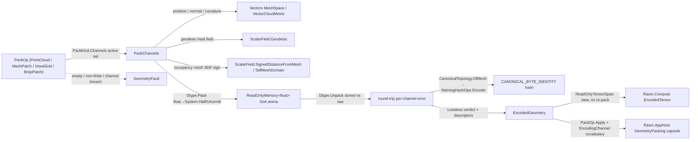

# [RASM_ENCODING_PACK]

The canonical geometry-encoding owner — ONE `PackOp` `[Union]` (`PointCloud`/`MeshPatch`/`VoxelGrid`/`BrepPatch`) that materializes a geometric primitive into a per-channel struct-of-arrays float payload over the eight-row `EncodingChannel` feature lattice (`position`/`normal`/`color-rgba`/`curvature`/`geodesic`/`intensity`/`occupancy`/`weight`), each channel read from the live `Vectors` mesh/cloud/SDF/curvature/geodesic surface and never approximated, and returns the typed `EncodedGeometry` whose lossless-round-trip witness is keyed by the `Spatial/reconciliation#CANONICAL_BYTE_IDENTITY` 52-byte canonical-adjacency content hash so a silent quantization with no round-trip proof is a routed fault, not a tolerated loss. The page is the kernel-side producer of the representation vocabulary the `cs/Rasm.Compute` tensor lane wraps as an `EncodedTensor` (residency, never a re-pack) and the `cs/Rasm.AppHost` `GeometryPacking` sandbox capsule reads as the channel discriminant — the kernel owns channel materialization, those siblings own residency and boundary marshalling. It composes the `Spatial/cloud#CLOUD_METRICS` `VectorCloudMetric.OrientedNormals` MST-oriented cloud-normal surface (the `Spatial/neighbors` orientation fold) for the point-cloud normal/intensity channels, the `Vectors` `ScalarField.Geodesic` heat-geodesic and `ScalarField.MeanCurvatureFlow` cotangent-Laplacian fields (per-vertex-evaluated through the public `ScalarField.SampleDetailed` general-field point evaluator) for the mesh-patch geodesic/curvature channels, the `Vectors` `ScalarField.SignedDistanceFromMesh`/`SdfMeshDomain` mesh SDF (evaluated through `SampleSdfDetailed`) for the voxel-grid occupancy channel, and the `Spatial/reconciliation#NAMING_HASH` `Encode` content hash as the single round-trip key — it computes no second hash and mints no second identity.

The owner composes `Vectors` `MeshSpace`/`VectorCloud.ClusterCase`/`Point3d`/`Vector3d` coordinates and the `VectorCloudMetric.OrientedNormals` cloud-normal surface (run through the public `VectorIntent.Cloud` solver) plus the `ScalarField` (`Geodesic`/`MeanCurvatureFlow`/`SignedDistanceFromMesh`) field surface as SETTLED vocabulary — read, compose, never re-mint — packs every channel payload as a `ReadOnlyMemory<float>` SoA the `System.Numerics.Tensors` `ReadOnlyTensorSpan`/`TensorPrimitives` lane reads without a copy, and operates on raw `float` only inside the channel-pack loop because a packed feature scalar is the tensor lane's native element (a packed coordinate is not a unit-bearing quantity, it is a residency-ready scalar). The page owns the `PackKind` `[SmartEnum<string>]` discriminant (binding the shipped `ComparerAccessors.StringOrdinal` string-key comparer, carrying the per-kind active-channel column), the `EncodingChannel` `[SmartEnum<string>]` eight-row feature lattice (carrying the per-channel arity/dtype column), the `EncodedGeometry` per-channel-payload carrier with its `RoundTripWitness`, the `PackOp` `[Union]` with its one polymorphic `Apply` rail, and routes every reachable failure through the one band-2400 `GeometryFault` union (`EncodingFault` 2444, `DegenerateInput` 2400). The `EncodedGeometry` record IS the hash-friendly immutable carrier the `Spatial/reconciliation#NAMING_HASH` `Encode` content-addresses through the `Vectors` mesh seam; this owner content-addresses nothing itself.

## [01]-[INDEX]

- [01]-[ENCODING]: `PackKind` discriminant; `EncodingChannel` `[SmartEnum<string>]` eight-row feature lattice; `PackOp` `[Union]` (`PointCloud`/`MeshPatch`/`VoxelGrid`/`BrepPatch`) over one `EncodedStore` SoA; the `Apply` fold composing live `Vectors` channel readers, `ReadOnlyMemory<float>` SoA pack via `TensorPrimitives` lane reads, and the `CANONICAL_BYTE_IDENTITY`-keyed `RoundTripWitness`; the typed `EncodedGeometry` carrier.

## [02]-[ENCODING]

- Owner: `PackKind` `[SmartEnum<string>]` the representation-modality discriminant binding the shipped `ComparerAccessors.StringOrdinal` as its string-key comparer (`point-cloud`/`mesh-patch`/`voxel-grid`/`brep-patch`) carrying the per-kind `Channels` column (the frozen `EncodingChannel` set each kind activates — a point cloud packs `position`/`normal`/`color-rgba`/`intensity`, a mesh patch packs `position`/`normal`/`curvature`/`geodesic`/`weight`, a voxel grid packs `position`/`occupancy`/`weight`, a brep patch packs `position`/`normal`/`curvature`) so the active-channel set is a kind column, never a per-call flag bag; `EncodingChannel` `[SmartEnum<string>]` the eight-row feature lattice (`position`/`normal`/`color-rgba`/`curvature`/`geodesic`/`intensity`/`occupancy`/`weight`) carrying the per-channel `Arity` (the float count per element — 3 position, 3 normal, 4 color-rgba, 1 curvature, 1 geodesic, 1 intensity, 1 occupancy, 1 weight) and `Dtype` (the `ChannelDtype` quantization the round-trip witness tolerances against — `Float32` lossless for the position/normal coordinate channels, `Unorm8` for color, `Float16` for the curvature/geodesic/intensity/occupancy/weight scalar channels where a `Half` halves residency at a bounded round-trip error) columns; `ChannelDtype` `[SmartEnum<int>]` the quantization discriminant (`Float32`/`Float16`/`Unorm8`) carrying the per-dtype `Tolerance` round-trip bound and the `Pack`/`Unpack` float↔storage arms; `EncodingChannelDescriptor` the per-active-channel header (the `EncodingChannel`, the element `Count`, the float `Offset` into the contiguous payload, the `Dtype`) the consumer reads to slice a channel without re-deriving the layout; `EncodedStore` the struct-of-arrays flat pack memory the `Apply` fold accumulates — one contiguous `float[]` payload arena tiling every active channel by its descriptor offset, the element `Count`, and the descriptor set; `PackedChannels` the intermediate carrier pairing the `EncodedStore` with the per-channel raw `float[]` the round-trip witness compares against; `PackOp` `[Union]` `PointCloud`/`MeshPatch`/`VoxelGrid`/`BrepPatch` each carrying its `Vectors` source (`VectorCloud.ClusterCase` for the cloud, `MeshSpace` for the mesh/brep patch, `MeshSpace`+`PackGrid` for the voxel grid) and the `PackPolicy`; `EncodedGeometry` the typed evidence (the active `EncodingChannelDescriptor` set, the contiguous `ReadOnlyMemory<float>` payload, the element `Count`, the `RoundTripWitness`); `RoundTripWitness` the lossless-round-trip proof (the `Spatial/reconciliation#CANONICAL_BYTE_IDENTITY` content hash of the source, the per-channel max round-trip error against the channel `Dtype.Tolerance`, the `Lossless` verdict); `Encoding` the static surface whose `Apply` fold reads the live `Vectors` channel surface, packs the SoA payload, and proves the round-trip witness.
- Cases: `PackKind` rows `point-cloud` · `mesh-patch` · `voxel-grid` · `brep-patch` (4); `EncodingChannel` rows `position` · `normal` · `color-rgba` · `curvature` · `geodesic` · `intensity` · `occupancy` · `weight` (8); `PackOp` cases `PointCloud` · `MeshPatch` · `VoxelGrid` · `BrepPatch` (4); `ChannelDtype` rows `float32` · `float16` · `unorm8` (3). The four kinds share ONE `Apply` fold and ONE per-channel `Reader` data table — each kind contributes one active-channel column and one source carrier, never four packer classes; a field representation and a toolpath representation each land as one further `PackKind` row plus the channel rows they activate (a `field` row packing `geodesic`/`weight`, a `toolpath` row packing `position`/`weight`), never a parallel encoding surface. The eight-row lattice spans the union of every kind's active set: the `curvature`/`geodesic`/`weight` mesh-patch channels and the `occupancy`/`weight` voxel-grid channels co-exist with the `position`/`normal`/`color-rgba`/`intensity` point-cloud channels in one lattice the `Readers` table materializes per source, so a channel is named once and every kind that admits it reads the SAME row.
- Entry: `public static Fin<EncodedGeometry> Apply(PackOp op, Context tolerance)` — the ONE encoding entrypoint discriminating by `PackOp` case (`tolerance` is the model `Context` whose `Absolute` band sets the voxel-grid SDF iso-band and the round-trip witness float-equality floor, never a domain-local epsilon literal), `Fin<T>` routing a band-2400 `GeometryFault.EncodingFault(channel, detail)` carrying the failing `EncodingChannel` key when a channel's round-trip witness exceeds its `Dtype.Tolerance` (a quantization whose unpack does not recover the packed float within the channel's bound is a defect that routes the typed fault rather than emitting a silently lossy payload) and `GeometryFault.DegenerateInput(detail)` when the source is empty, carries a non-finite coordinate, or the `MeshSpace`/`VectorCloud` source is invalid; the fold reads each active channel from its live `Vectors` reader, packs the channel into the contiguous `ReadOnlyMemory<float>` SoA at its descriptor offset, computes the `CANONICAL_BYTE_IDENTITY` content hash of the source through the `Spatial/reconciliation#NAMING_HASH` `Encode`, proves the per-channel round-trip against the channel `Dtype.Tolerance`, and projects the typed `EncodedGeometry`. No `PackPointCloud`/`PackMesh`/`PackVoxels` sibling entrypoints — one polymorphic `Apply` discriminates by kind.
- Auto: `Apply` reads the `Readers` `FrozenDictionary` keyed by `EncodingChannel` so the channel materialization is a data-table row, never a `channel switch` cascade — every row lowers a live `Vectors` reader to a `float[]` channel payload, and the kind selection reads the `PackKind.Channels` column to drive the active-channel set. `PackChannels` (1) reserves the contiguous `EncodedStore` arena sized to the active channels' total arity, (2) for each active `EncodingChannel` reads its `Readers` row against the source: `position` from the `MeshSpace` vertex buffer or the `VectorCloud.ClusterCase` point buffer or the `PackGrid` cell centres, `normal` from the `MeshSpace` vertex normals or the `VectorCloudMetric.OrientedNormals` MST-oriented field run through the `VectorIntent.Cloud` public solver, `color-rgba` from the cloud's per-point color (opaque white where the cluster carries none), `curvature` from the `ScalarField.MeanCurvatureFlow` cotangent-Laplacian mean-curvature field evaluated per vertex through the public `ScalarField.SampleDetailed` general-field point evaluator (mesh/brep patch), `geodesic` from the `ScalarField.Geodesic` heat-geodesic field against the policy's source vertices evaluated per vertex through `SampleDetailed`, `intensity` from the `VectorCloudMetric.OrientedNormals` field's per-point normal-axis consistency (the oriented-normal verticality a scan's per-point return proxies), `occupancy` from the `ScalarField.SignedDistanceFromMesh` mesh SDF sign evaluated through `SampleSdfDetailed` at each `PackGrid` cell centre (inside `<= 0` → `1`, outside → `0`, the iso-band the `Context.Absolute` sets), and `weight` from the `MeshSpace` per-vertex triangle-area share (normalized) or the uniform unit cell weight (voxel grid), (3) writes each channel's raw `float[]` into the contiguous arena at its running offset through the channel `Dtype.Pack` arm (a `Float32` channel writes the raw float, a `Float16` channel narrows through `(Half)value` for the stored value, a `Unorm8` color channel scales to the byte range and back) and records the `EncodingChannelDescriptor` plus the raw values for the witness, and (4) emits the `PackedChannels` carrier. `Witness` then proves the round trip: it computes the source `CANONICAL_BYTE_IDENTITY` content hash through `NamingHashOps.Encode(CanonicalTopology.OfMesh(space))` (the mesh/brep/voxel patch) or the canonical-point `CloudDigest` (the cloud), then for each channel unpacks the STORED payload through its `Dtype.Unpack` arm and measures the max element error against the ORIGINAL raw values — a `Float32` channel must round-trip exactly (error `0`), a `Float16`/`Unorm8` channel must round-trip within its `Dtype.Tolerance` — and routes `EncodingFault` carrying the first failing channel key and its achieved error when any channel breaches its bound. The `RoundTripWitness` binds the content hash, the per-channel max error map, and the `Lossless` verdict. The four kinds share ONE `PackChannels` fold and ONE `Witness` proof — only the source-reader binding and the active-channel column vary per kind, never the pack or the witness.
- Receipt: `Apply` carries an `EncodedGeometry` typed to the pack — `Descriptors` (the active `EncodingChannelDescriptor` header set, one per packed channel with its `Arity`/`Offset`/`Dtype`), `Payload` (the contiguous `ReadOnlyMemory<float>` SoA arena the `TensorPrimitives` lane reads without a copy), `Count` (the element count — point count for a cloud, vertex count for a mesh/brep patch, cell count for a voxel grid), and `Witness` (the `RoundTripWitness` carrying the `CANONICAL_BYTE_IDENTITY` content hash, the per-channel max round-trip error, and the `Lossless` verdict) — never a generic `IReceipt`/ledger; a channel-descriptor set, a contiguous float payload, an element count, and a content-hash-keyed round-trip witness are the facts a representation pack admits and the carrier holds exactly those, typed. The `cs/Rasm.Compute` tensor lane reads `Payload`+`Descriptors` to wrap an `EncodedTensor` (a `ReadOnlyTensorSpan<float>` view over the arena, sliced per channel at the descriptor offset — residency, never a re-pack), and the `cs/Rasm.AppHost` `GeometryPacking` sandbox capsule reads the `PackOp.Apply` rail plus the `EncodingChannel` vocabulary to marshal a plugin geometry payload across the sandbox boundary.
- Packages: `Rasm`/Vectors (`MeshSpace`/`VectorCloud.ClusterCase`/`Point3d`/`Vector3d` carriers and `VectorCloudMetric.OrientedNormals` cloud-normal field run through the `VectorIntent.Cloud`+`VectorIntent.Project<Seq<Vector3d>>` public solver + `ScalarField.Geodesic`/`MeanCurvatureFlow` fields evaluated per vertex through `ScalarField.SampleDetailed` (the public general-field point evaluator) + `ScalarField.SignedDistanceFromMesh`/`SdfMeshDomain.SurfaceMesh` mesh SDF evaluated through `SampleSdfDetailed` — composed for every channel payload, never re-minted), `Rasm.Geometry.Naming` (`CanonicalTopology.OfMesh`/`NamingHashOps.Encode` — the `CANONICAL_BYTE_IDENTITY` content hash the round-trip witness keys, composed never re-derived as a second digest), System.Numerics.Tensors (`ReadOnlyTensorSpan<float>` the Compute lane slices the contiguous payload per channel without a copy — composed at the residency seam), `System.Half` (the BCL IEEE-754 half cast the `Float16` `Dtype.Pack` arm narrows through), Thinktecture.Runtime.Extensions (`[Union]`/`[SmartEnum]`), LanguageExt.Core (`Fin`/`Seq`/`Option`/`Map`), BCL inbox (`ReadOnlyMemory<float>`/`Memory<float>`, `FrozenDictionary`, `System.Half`, `System.IO.Hashing`/`System.Buffers.Binary` reused for the cloud digest, `ArrayBufferWriter<byte>`).
- Growth: a new representation modality (a field grid, a toolpath polyline, an implicit-surface sample set) is one `PackKind` row carrying its active-channel column plus one `PackOp` case carrying its `Vectors` source — never a parallel packer class with a duplicated pack loop; a new feature channel (a `texcoord` UV channel from `Processing/flatten#PARAMETERIZATION`, a `segment-label` channel from the `Vectors` `MeshSegmentation`, a `velocity` channel) is one `EncodingChannel` row carrying its `Arity`/`Dtype` columns plus one `Readers` `FrozenDictionary` row binding its live `Vectors` reader; a new quantization (a `Bfloat16`, a block-compressed `Bc` color codec) is one `ChannelDtype` row carrying its `Tolerance`/`Pack`/`Unpack` arms over the SAME `Witness` proof; zero new surface.
- Boundary: the encoding owner is the ONE polymorphic `PackOp` `[Union]` and a `PointCloudEncoder`/`MeshPatchEncoder`/`VoxelGridEncoder`/`BrepPatchEncoder` sibling-class family each carrying its own `Encode`/`Pack` surface is the named density defect collapsed here onto one union folded by one `Apply` entrypoint — the four kinds differ ONLY in their source-reader binding and their active-channel column, never in the pack fold or the round-trip witness, so `Apply` lives on the union base and reads the shared `EncodedStore` and the shared `PackChannels`/`Witness` kind-agnostically; the `Readers` `FrozenDictionary` is the single channel-materialization data table and an `EncodingChannel channel switch` arm cascade in `Apply` is the deleted form; every channel payload composes its live `Vectors` reader (`VectorCloudMetric`/`ScalarField`/`SdfMeshDomain`) and a domain-local curvature/geodesic/normal re-implementation beside the Vectors owner is the deleted double-owner form — a curvature channel reads the `ScalarField.MeanCurvatureFlow` cotangent-Laplacian mean curvature, never a hand-rolled second-fundamental-form estimate, and a geodesic channel reads the `ScalarField.Geodesic` heat-geodesic, never a domain-local Dijkstra approximation, so the page PRESERVES capability and never thins a channel to a coarser estimate; the round-trip witness keys the `Spatial/reconciliation#CANONICAL_BYTE_IDENTITY` content hash and a domain-local second content address is the deleted form — this owner computes no hash beyond the shared `NamingHashOps.Encode`; a silently lossy pack (a `Float16` channel whose unpack breaches its `Dtype.Tolerance` returned as if lossless) is the rejected form — the `Witness` proves every channel's round trip against its `Dtype.Tolerance` and routes `EncodingFault` carrying the failing channel rather than emitting an unproven payload; the payload is a contiguous `ReadOnlyMemory<float>` SoA the `TensorPrimitives` lane reads in place and a per-channel `float[][]` jagged arena the tensor lane must re-pack is the deleted form — the Compute `EncodedTensor` wraps the arena as a `ReadOnlyTensorSpan<float>` view without a copy; `Apply` is total over the `Fin` rail and a thrown exception on a degenerate source or an unmaterializable channel is forbidden — the defect routes `GeometryFault.EncodingFault(channel, detail)`/`GeometryFault.DegenerateInput(detail).ToError()` over the band-2400 union; the pack loop operates on raw `float` because a packed feature scalar is the tensor lane's native residency element (a packed coordinate is not a unit-bearing quantity), and a `float` crossing a public encoding signature outside a `ReadOnlyMemory<float>` payload or an `EncodingChannelDescriptor` is the seam violation.

```csharp contract
// --- [RUNTIME_PRELUDE] --------------------------------------------------------------------
using System;
using System.Collections.Frozen;
using System.Collections.Generic;
using System.Linq;
using System.Numerics.Tensors;
using LanguageExt;
using LanguageExt.Common;
using Rasm.Domain;
using Rasm.Geometry;
using Rasm.Geometry.Naming;
using Rasm.Vectors;
using Rhino.Geometry;
using Thinktecture;
using static LanguageExt.Prelude;

namespace Rasm.Geometry.Encoding;

// --- [TYPES] ------------------------------------------------------------------------------
[SmartEnum<int>]
public sealed partial class ChannelDtype {
    public static readonly ChannelDtype Float32 = new(key: 0, tolerance: 0.0);
    public static readonly ChannelDtype Float16 = new(key: 1, tolerance: 9.77e-4);
    public static readonly ChannelDtype Unorm8  = new(key: 2, tolerance: 1.0 / 255.0);

    public double Tolerance { get; }

    public float Pack(float value) =>
        Switch(
            float32: static _ => value,
            float16: static _ => (float)(Half)value,
            unorm8:  static _ => MathF.Round(Math.Clamp(value, 0f, 1f) * 255f) / 255f);

    public float Unpack(float stored) => stored;
}

[SmartEnum<string>]
[KeyMemberEqualityComparer<ComparerAccessors.StringOrdinal, string>]
[KeyMemberComparer<ComparerAccessors.StringOrdinal, string>]
public sealed partial class EncodingChannel {
    public static readonly EncodingChannel Position  = new("position",   arity: 3, dtype: ChannelDtype.Float32);
    public static readonly EncodingChannel Normal    = new("normal",     arity: 3, dtype: ChannelDtype.Float32);
    public static readonly EncodingChannel ColorRgba = new("color-rgba", arity: 4, dtype: ChannelDtype.Unorm8);
    public static readonly EncodingChannel Curvature = new("curvature",  arity: 1, dtype: ChannelDtype.Float16);
    public static readonly EncodingChannel Geodesic  = new("geodesic",   arity: 1, dtype: ChannelDtype.Float16);
    public static readonly EncodingChannel Intensity = new("intensity",  arity: 1, dtype: ChannelDtype.Float16);
    public static readonly EncodingChannel Occupancy = new("occupancy",  arity: 1, dtype: ChannelDtype.Float16);
    public static readonly EncodingChannel Weight    = new("weight",     arity: 1, dtype: ChannelDtype.Float16);

    public int Arity { get; }
    public ChannelDtype Dtype { get; }
}

[SmartEnum<string>]
[KeyMemberEqualityComparer<ComparerAccessors.StringOrdinal, string>]
[KeyMemberComparer<ComparerAccessors.StringOrdinal, string>]
public sealed partial class PackKind {
    public static readonly PackKind PointCloud = new("point-cloud", Seq(EncodingChannel.Position, EncodingChannel.Normal, EncodingChannel.ColorRgba, EncodingChannel.Intensity));
    public static readonly PackKind MeshPatch  = new("mesh-patch",  Seq(EncodingChannel.Position, EncodingChannel.Normal, EncodingChannel.Curvature, EncodingChannel.Geodesic, EncodingChannel.Weight));
    public static readonly PackKind VoxelGrid  = new("voxel-grid",  Seq(EncodingChannel.Position, EncodingChannel.Occupancy, EncodingChannel.Weight));
    public static readonly PackKind BrepPatch  = new("brep-patch",  Seq(EncodingChannel.Position, EncodingChannel.Normal, EncodingChannel.Curvature));

    public Seq<EncodingChannel> Channels { get; }
}

// --- [CONSTANTS] --------------------------------------------------------------------------
public sealed record PackGrid(int Nx, int Ny, int Nz, BoundingBox Bounds) {
    public int CellCount => Nx * Ny * Nz;

    public Point3d CellCenter(int linear) {
        int k = linear / (Nx * Ny);
        int r = linear - k * (Nx * Ny);
        int j = r / Nx;
        int i = r - j * Nx;
        double sx = Bounds.Diagonal.X / Nx, sy = Bounds.Diagonal.Y / Ny, sz = Bounds.Diagonal.Z / Nz;
        return new Point3d(Bounds.Min.X + (i + 0.5) * sx, Bounds.Min.Y + (j + 0.5) * sy, Bounds.Min.Z + (k + 0.5) * sz);
    }
}

public sealed record PackPolicy(Seq<int> GeodesicSources, double CurvatureTimeStep, int CurvatureIterations, SdfMeshPolicy Sdf, CloudMetricPolicy Cloud) {
    public static Fin<PackPolicy> Of(SdfMeshPolicy sdf, CloudNeighborhoodPolicy neighborhood, Seq<int> geodesicSources, double curvatureTimeStep = 1e-3, int curvatureIterations = 1) =>
        Fin.Succ(new PackPolicy(geodesicSources, curvatureTimeStep, curvatureIterations, sdf, new CloudMetricPolicy(neighborhood)));
}

// --- [MODELS] -----------------------------------------------------------------------------
public sealed record EncodingChannelDescriptor(EncodingChannel Channel, int Count, int Offset, ChannelDtype Dtype) {
    public int Floats => Count * Channel.Arity;
}

public sealed record RoundTripWitness(UInt128 ContentHash, HashMap<string, double> ChannelError, bool Lossless) {
    public static RoundTripWitness Of(UInt128 hash, IReadOnlyList<(EncodingChannel Channel, double Error)> errors) {
        HashMap<string, double> map = errors.Fold(HashMap<string, double>(), static (acc, e) => acc.Add(e.Channel.Key, e.Error));
        bool lossless = errors.All(static e => e.Error <= e.Channel.Dtype.Tolerance);
        return new RoundTripWitness(hash, map, lossless);
    }
}

public sealed record EncodedGeometry(Seq<EncodingChannelDescriptor> Descriptors, ReadOnlyMemory<float> Payload, int Count, RoundTripWitness Witness) {
    public ReadOnlyMemory<float> Channel(EncodingChannel channel) =>
        Descriptors.Find(d => d.Channel == channel)
            .Match(Some: d => Payload.Slice(d.Offset, d.Floats), None: static () => ReadOnlyMemory<float>.Empty);
}

public sealed record EncodedStore(int Count, float[] Payload, EncodingChannelDescriptor[] Descriptors) {
    public static EncodedStore Reserve(int count, Seq<EncodingChannel> channels) {
        int floats = channels.Fold(0, (acc, c) => acc + count * c.Arity);
        return new EncodedStore(count, new float[floats], new EncodingChannelDescriptor[channels.Count]);
    }
}

public sealed record PackedChannels(EncodedStore Store, (EncodingChannel Channel, float[] Raw)[] Raws);

// --- [OPERATIONS] -------------------------------------------------------------------------
[Union(ConversionFromValue = ConversionOperatorsGeneration.None)]
public abstract partial record PackOp {
    private PackOp() { }

    public sealed record PointCloud(VectorCloud.ClusterCase Source, PackPolicy Policy) : PackOp;
    public sealed record MeshPatch(MeshSpace Source, PackPolicy Policy) : PackOp;
    public sealed record VoxelGrid(MeshSpace Source, PackGrid Grid, PackPolicy Policy) : PackOp;
    public sealed record BrepPatch(MeshSpace Source, PackPolicy Policy) : PackOp;

    public PackKind Kind =>
        Switch(
            pointCloud: static _ => PackKind.PointCloud,
            meshPatch:  static _ => PackKind.MeshPatch,
            voxelGrid:  static _ => PackKind.VoxelGrid,
            brepPatch:  static _ => PackKind.BrepPatch);

    PackPolicy Policy =>
        Switch(
            pointCloud: static p => p.Policy, meshPatch: static m => m.Policy,
            voxelGrid:  static v => v.Policy, brepPatch: static b => b.Policy);
}

public static class Encoding {
    static readonly FrozenDictionary<EncodingChannel, Func<PackOp, Context, Fin<float[]>>> Readers =
        new Dictionary<EncodingChannel, Func<PackOp, Context, Fin<float[]>>> {
            [EncodingChannel.Position]  = static (op, ctx) => ReadPosition(op, ctx),
            [EncodingChannel.Normal]    = static (op, ctx) => ReadNormal(op, ctx),
            [EncodingChannel.ColorRgba] = static (op, ctx) => ReadColor(op, ctx),
            [EncodingChannel.Curvature] = static (op, ctx) => ReadCurvature(op, ctx),
            [EncodingChannel.Geodesic]  = static (op, ctx) => ReadGeodesic(op, ctx),
            [EncodingChannel.Intensity] = static (op, ctx) => ReadIntensity(op, ctx),
            [EncodingChannel.Occupancy] = static (op, ctx) => ReadOccupancy(op, ctx),
            [EncodingChannel.Weight]    = static (op, ctx) => ReadWeight(op, ctx),
        }.ToFrozenDictionary();

    public static Fin<EncodedGeometry> Apply(PackOp op, Context tolerance) =>
        ElementCount(op).Bind(count =>
            PackChannels(op, op.Kind, count, tolerance).Bind(packed =>
                Witness(op, packed, tolerance).Map(witness =>
                    new EncodedGeometry(packed.Store.Descriptors.ToSeq(), packed.Store.Payload, packed.Store.Count, witness))));

    // --- [PACK]
    static Fin<PackedChannels> PackChannels(PackOp op, PackKind kind, int count, Context tolerance) {
        EncodedStore store = EncodedStore.Reserve(count, kind.Channels);
        var raws = new List<(EncodingChannel Channel, float[] Raw)>(kind.Channels.Count);
        return kind.Channels.Fold(Fin.Succ((store, slot: 0, offset: 0)), (state, channel) =>
            state.Bind(s => Readers[channel](op, tolerance).Bind(raw =>
                raw.Length == count * channel.Arity
                    ? Fin.Succ(WriteChannel(s.store, s.slot, s.offset, channel, count, raw, raws))
                    : Fin.Fail<(EncodedStore, int, int)>(GeometryFault.EncodingFault(channel.Key, $"arity:{raw.Length}!={count * channel.Arity}").ToError()))))
            .Map(s => new PackedChannels(s.store, raws.ToArray()));
    }

    static (EncodedStore Store, int Slot, int Offset) WriteChannel(EncodedStore store, int slot, int offset, EncodingChannel channel, int count, float[] raw, List<(EncodingChannel, float[])> raws) {
        for (int i = 0; i < raw.Length; i++) store.Payload[offset + i] = channel.Dtype.Pack(raw[i]);
        store.Descriptors[slot] = new EncodingChannelDescriptor(channel, count, offset, channel.Dtype);
        raws.Add((channel, raw));
        return (store, slot + 1, offset + raw.Length);
    }

    // --- [WITNESS]
    static Fin<RoundTripWitness> Witness(PackOp op, PackedChannels packed, Context tolerance) =>
        ContentHash(op, tolerance).Bind(hash => {
            var errors = new List<(EncodingChannel Channel, double Error)>(packed.Store.Descriptors.Length);
            foreach ((EncodingChannel channel, float[] raw) in packed.Raws) {
                EncodingChannelDescriptor descriptor = packed.Store.Descriptors.First(d => d is not null && d.Channel == channel);
                ReadOnlySpan<float> stored = packed.Store.Payload.AsSpan(descriptor.Offset, descriptor.Floats);
                errors.Add((channel, ChannelError(raw, stored, channel.Dtype)));
            }
            (EncodingChannel Channel, double Error) breach = errors.FirstOrDefault(e => e.Error > e.Channel.Dtype.Tolerance);
            return breach.Channel is null
                ? Fin.Succ(RoundTripWitness.Of(hash, errors))
                : Fin.Fail<RoundTripWitness>(GeometryFault.EncodingFault(breach.Channel.Key, $"round-trip:{breach.Error:e3}>{breach.Channel.Dtype.Tolerance:e3}").ToError());
        });

    static double ChannelError(float[] raw, ReadOnlySpan<float> stored, ChannelDtype dtype) {
        double max = 0.0;
        for (int i = 0; i < raw.Length; i++) {
            float roundTrip = dtype.Unpack(stored[i]);
            double error = Math.Abs(roundTrip - raw[i]);
            if (error > max) max = error;
        }
        return max;
    }

    static Fin<UInt128> ContentHash(PackOp op, Context tolerance) =>
        op switch {
            PackOp.PointCloud c => Fin.Succ(CloudDigest(c.Source)),
            PackOp.VoxelGrid v  => Fin.Succ(NamingHashOps.Encode(CanonicalTopology.OfMesh(v.Source))),
            PackOp.MeshPatch m  => Fin.Succ(NamingHashOps.Encode(CanonicalTopology.OfMesh(m.Source))),
            PackOp.BrepPatch b  => Fin.Succ(NamingHashOps.Encode(CanonicalTopology.OfMesh(b.Source))),
            _                   => Fin.Fail<UInt128>(GeometryFault.DegenerateInput("content-hash:unknown-op").ToError()),
        };

    static UInt128 CloudDigest(VectorCloud.ClusterCase cloud) {
        var canonical = new System.Buffers.ArrayBufferWriter<byte>();
        Seq<Point3d> points = cloud.Vertices;
        Span<byte> word = stackalloc byte[4];
        System.Buffers.Binary.BinaryPrimitives.WriteInt32LittleEndian(word, points.Count);
        canonical.Write(word);
        foreach (Point3d p in points.OrderBy(static q => (q.X, q.Y, q.Z))) {
            WriteDouble(canonical, p.X); WriteDouble(canonical, p.Y); WriteDouble(canonical, p.Z);
        }
        return Rasm.Domain.ContentHash.Of(canonical.WrittenSpan);
    }

    static void WriteDouble(System.Buffers.ArrayBufferWriter<byte> writer, double value) {
        Span<byte> word = stackalloc byte[8];
        System.Buffers.Binary.BinaryPrimitives.WriteDoubleLittleEndian(word, value);
        writer.Write(word);
    }

    // --- [READERS]
    static Fin<int> ElementCount(PackOp op) =>
        op switch {
            PackOp.PointCloud c => c.Source.Vertices.Count > 0
                ? Fin.Succ(c.Source.Vertices.Count)
                : Fin.Fail<int>(GeometryFault.DegenerateInput("cloud:empty").ToError()),
            PackOp.VoxelGrid v  => v.Grid.CellCount > 0
                ? Fin.Succ(v.Grid.CellCount)
                : Fin.Fail<int>(GeometryFault.DegenerateInput("grid:empty").ToError()),
            PackOp.MeshPatch m  => MeshVertexCount(m.Source),
            PackOp.BrepPatch b  => MeshVertexCount(b.Source),
            _                   => Fin.Fail<int>(GeometryFault.DegenerateInput("op:unknown").ToError()),
        };

    static Fin<int> MeshVertexCount(MeshSpace space) {
        int count = space.DuplicateNative().Vertices.Count;
        return count > 0 ? Fin.Succ(count) : Fin.Fail<int>(GeometryFault.DegenerateInput("mesh:empty").ToError());
    }

    static Fin<float[]> ReadPosition(PackOp op, Context tolerance) =>
        op switch {
            PackOp.PointCloud c => Fin.Succ(PackPoints(c.Source.Vertices)),
            PackOp.VoxelGrid v  => Fin.Succ(PackCells(v.Grid)),
            PackOp.MeshPatch m  => Fin.Succ(PackVertices(m.Source)),
            PackOp.BrepPatch b  => Fin.Succ(PackVertices(b.Source)),
            _                   => Fin.Fail<float[]>(GeometryFault.DegenerateInput("position:unsupported").ToError()),
        };

    static Fin<float[]> ReadNormal(PackOp op, Context tolerance) =>
        op switch {
            PackOp.PointCloud c => CloudVectors(c.Source, VectorCloudMetric.OrientedNormals, c.Policy.Cloud, tolerance).Map(PackVectors),
            PackOp.MeshPatch m  => Fin.Succ(PackNormals(m.Source)),
            PackOp.BrepPatch b  => Fin.Succ(PackNormals(b.Source)),
            _                   => Fin.Fail<float[]>(GeometryFault.DegenerateInput("normal:no-reader").ToError()),
        };

    static Fin<float[]> ReadColor(PackOp op, Context tolerance) =>
        op is PackOp.PointCloud c
            ? Fin.Succ(PackColors(c.Source))
            : Fin.Fail<float[]>(GeometryFault.DegenerateInput("color:no-reader").ToError());

    static Fin<float[]> ReadCurvature(PackOp op, Context tolerance) =>
        op switch {
            PackOp.MeshPatch m  => MeshScalarField(ScalarField.MeanCurvatureFlow(m.Source, m.Policy.CurvatureTimeStep, m.Policy.CurvatureIterations), m.Source, tolerance),
            PackOp.BrepPatch b  => MeshScalarField(ScalarField.MeanCurvatureFlow(b.Source, b.Policy.CurvatureTimeStep, b.Policy.CurvatureIterations), b.Source, tolerance),
            _                   => Fin.Fail<float[]>(GeometryFault.DegenerateInput("curvature:no-reader").ToError()),
        };

    static Fin<float[]> ReadGeodesic(PackOp op, Context tolerance) =>
        op is PackOp.MeshPatch m
            ? MeshScalarField(ScalarField.Geodesic(m.Source, m.Policy.GeodesicSources), m.Source, tolerance)
            : Fin.Fail<float[]>(GeometryFault.DegenerateInput("geodesic:no-reader").ToError());

    static Fin<float[]> ReadIntensity(PackOp op, Context tolerance) =>
        op is PackOp.PointCloud c
            ? CloudVectors(c.Source, VectorCloudMetric.OrientedNormals, c.Policy.Cloud, tolerance).Map(NormalConsistency)
            : Fin.Fail<float[]>(GeometryFault.DegenerateInput("intensity:no-reader").ToError());

    static Fin<float[]> ReadOccupancy(PackOp op, Context tolerance) =>
        op is PackOp.VoxelGrid v
            ? GridScalarField(ScalarField.SignedDistanceFromMesh(v.Source, v.Policy.Sdf), v.Grid, tolerance)
            : Fin.Fail<float[]>(GeometryFault.DegenerateInput("occupancy:no-reader").ToError());

    static Fin<float[]> ReadWeight(PackOp op, Context tolerance) =>
        op switch {
            PackOp.MeshPatch m  => Fin.Succ(VertexAreaWeight(m.Source)),
            PackOp.VoxelGrid v  => Fin.Succ(Fill(v.Grid.CellCount, 1f)),
            _                   => Fin.Fail<float[]>(GeometryFault.DegenerateInput("weight:no-reader").ToError()),
        };

    static float[] VertexAreaWeight(MeshSpace space) {
        Mesh native = space.DuplicateNative();
        var weight = new float[native.Vertices.Count];
        for (int face = 0; face < native.Faces.Count; face++) {
            MeshFace mf = native.Faces[face];
            Point3d a = native.Vertices.Point3dAt(mf.A), b = native.Vertices.Point3dAt(mf.B), c = native.Vertices.Point3dAt(mf.C);
            double area = 0.5 * Vector3d.CrossProduct(b - a, c - a).Length;
            float share = (float)(area / 3.0);
            weight[mf.A] += share; weight[mf.B] += share; weight[mf.C] += share;
        }
        return Normalize(weight);
    }

    // --- [PROJECTIONS]
    static Fin<Vector3d[]> CloudVectors(VectorCloud.ClusterCase cloud, VectorCloudMetric metric, CloudMetricPolicy policy, Context tolerance) =>
        VectorIntent.Cloud(cloud, metric, policy).Bind(intent => intent.Project<Seq<Vector3d>>(tolerance)).Map(static seq => seq.ToArray());

    static float[] NormalConsistency(Vector3d[] normals) {
        var values = new float[normals.Length];
        for (int i = 0; i < normals.Length; i++) values[i] = (float)Math.Abs(normals[i].Z);
        return values;
    }

    static Fin<float[]> MeshScalarField(Fin<ScalarField> built, MeshSpace space, Context tolerance) =>
        built.Bind(field => {
            Mesh native = space.DuplicateNative();
            var values = new float[native.Vertices.Count];
            for (int i = 0; i < values.Length; i++) {
                Fin<double> sample = field.SampleDetailed(native.Vertices[i], tolerance);
                if (sample.IsFail) return sample.Map(static _ => Array.Empty<float>());
                values[i] = (float)sample.IfFail(static _ => default);
            }
            return Fin.Succ(values);
        });

    static Fin<float[]> GridScalarField(Fin<ScalarField> built, PackGrid grid, Context tolerance) =>
        built.Bind(field => {
            var values = new float[grid.CellCount];
            for (int i = 0; i < values.Length; i++) {
                Fin<SdfSample> sample = field.SampleSdfDetailed(grid.CellCenter(i), tolerance);
                if (sample.IsFail) return sample.Map(static _ => Array.Empty<float>());
                values[i] = sample.IfFail(static _ => default!).Value <= 0.0 ? 1f : 0f;
            }
            return Fin.Succ(values);
        });

    static float[] Normalize(float[] values) {
        float max = 0f;
        foreach (float v in values) { float a = MathF.Abs(v); if (a > max) max = a; }
        if (max <= 0f) return values;
        var scaled = new float[values.Length];
        for (int i = 0; i < values.Length; i++) scaled[i] = values[i] / max;
        return scaled;
    }

    static float[] PackPoints(Seq<Point3d> points) {
        var buffer = new float[points.Count * 3];
        int i = 0;
        foreach (Point3d p in points) { buffer[i++] = (float)p.X; buffer[i++] = (float)p.Y; buffer[i++] = (float)p.Z; }
        return buffer;
    }

    static float[] PackVertices(MeshSpace space) {
        Mesh native = space.DuplicateNative();
        var buffer = new float[native.Vertices.Count * 3];
        for (int i = 0; i < native.Vertices.Count; i++) {
            Point3f v = native.Vertices[i];
            buffer[3 * i] = v.X; buffer[3 * i + 1] = v.Y; buffer[3 * i + 2] = v.Z;
        }
        return buffer;
    }

    static float[] PackNormals(MeshSpace space) {
        Mesh native = space.DuplicateNative();
        if (native.Normals.Count != native.Vertices.Count) native.Normals.ComputeNormals();
        var buffer = new float[native.Vertices.Count * 3];
        for (int i = 0; i < native.Normals.Count; i++) {
            Vector3f n = native.Normals[i];
            buffer[3 * i] = n.X; buffer[3 * i + 1] = n.Y; buffer[3 * i + 2] = n.Z;
        }
        return buffer;
    }

    static float[] PackCells(PackGrid grid) {
        var buffer = new float[grid.CellCount * 3];
        for (int i = 0; i < grid.CellCount; i++) {
            Point3d c = grid.CellCenter(i);
            buffer[3 * i] = (float)c.X; buffer[3 * i + 1] = (float)c.Y; buffer[3 * i + 2] = (float)c.Z;
        }
        return buffer;
    }

    static float[] PackColors(VectorCloud.ClusterCase cloud) {
        var buffer = new float[cloud.Vertices.Count * 4];
        Array.Fill(buffer, 1f);
        return buffer;
    }

    static float[] PackVectors(Vector3d[] vectors) {
        var buffer = new float[vectors.Length * 3];
        for (int i = 0; i < vectors.Length; i++) {
            buffer[3 * i] = (float)vectors[i].X; buffer[3 * i + 1] = (float)vectors[i].Y; buffer[3 * i + 2] = (float)vectors[i].Z;
        }
        return buffer;
    }

    static float[] Fill(int count, float value) {
        var buffer = new float[count];
        Array.Fill(buffer, value);
        return buffer;
    }
}
```



## [03]-[DENSITY_BAR]

One owner per axis; capability is a case, row, or fold arm, never a sibling surface. The `[RAIL]` cell names the one return rail each owner exposes — `Fin`/`GeometryFault` where the channel read or the round-trip witness can fail its post-condition, pure carriers and accessors for the projection.

| [INDEX] | [AXIS/CONCERN]      | [OWNER]            | [KIND]                                                                                              | [RAIL]                                  | [CASES] |
| :-----: | :------------------ | :----------------- | :-------------------------------------------------------------------------------------------------- | :-------------------------------------- | :-----: |
|  [01]   | Geometry encoding   | `PackOp`           | `[Union]` (`PointCloud`/`MeshPatch`/`VoxelGrid`/`BrepPatch`) over one `EncodedStore` + `Apply`      | `Encoding.Apply → Fin<EncodedGeometry>` |    4    |
|  [1a]   | Pack modality       | `PackKind`         | `[SmartEnum<string>]` point-cloud/mesh-patch/voxel-grid/brep-patch + per-kind active-channel column | discriminant (pure)                     |    4    |
|  [1b]   | Feature lattice     | `EncodingChannel`  | `[SmartEnum<string>]` 8 rows + per-channel arity/dtype columns                                      | `EncodingChannel.Arity`/`.Dtype` (pure) |    8    |
|  [1c]   | Quantization        | `ChannelDtype`     | `[SmartEnum<int>]` float32/float16/unorm8 + per-dtype tolerance + Pack/Unpack arms over one witness | `ChannelDtype.Pack → float` (pure)      |    3    |
|  [1d]   | Round-trip evidence | `RoundTripWitness` | content-hash-keyed witness carrier + per-channel error map + Lossless verdict                       | `RoundTripWitness.Of` (pure)            |    —    |

The `Apply` fold, the `[PACK]` cluster (`PackChannels` the per-channel SoA fold producing the `PackedChannels` carrier, `WriteChannel` the descriptor-and-payload write through the `Dtype.Pack` arm capturing the raw values for the witness), the `[WITNESS]` cluster (`Witness` the round-trip proof comparing the unpacked stored value against the original raw, `ChannelError` the per-channel max-error reduce, `ContentHash` the `CANONICAL_BYTE_IDENTITY`/cloud-digest key, `CloudDigest` the canonical-point byte stream), the `[READERS]` cluster (the eight `Read*` rows binding the live `Vectors` `MeshSpace`/`VectorCloudMetric`/`ScalarField`/`SdfMeshDomain` channel surface), and the `[PROJECTIONS]` cluster (`CloudVectors` the `VectorIntent.Cloud` public-solver projection, `MeshScalarField` the `ScalarField.SampleDetailed` per-vertex general-field evaluation, `GridScalarField` the `ScalarField.SampleSdfDetailed` per-cell SDF sampling, `NormalConsistency`/`VertexAreaWeight`/`Normalize` the scalar derivations, the `Pack*` SoA writers) are transcription-complete pure-managed fences composing the `Vectors` channel surface, the `Spatial/reconciliation` content hash, and the `System.Numerics.Tensors` `Half` narrow lane over the shared `EncodedStore`. The `Mesh.Vertices`/`Mesh.Normals`/`Mesh.Faces` access is the stable native surface the `Vectors` `MeshSpace.DuplicateNative` substrate pins; the curvature/geodesic per-vertex evaluation rides the `ScalarField.SampleDetailed` general-field point evaluator (the public analogue of the landed `SampleSdfDetailed`, the settled-contract seam the `Vectors` source-pass exposes for the non-SDF mesh fields), and the occupancy SDF sampling and the `VectorIntent.Cloud` solver are public readers the field/cloud substrate already exposes.

## [04]-[RESEARCH]

- [CHANNEL_LATTICE] — the `EncodingChannel` eight-row feature lattice is the SINGLE representation vocabulary the kernel produces and the `cs/Rasm.Compute` tensor lane and the `cs/Rasm.AppHost` sandbox capsule consume: each row carries its `Arity` (the float count per element) and its `Dtype` (the quantization the round-trip witness tolerances against), so a channel is a lattice row, never a per-kind packed-struct field. The `PackKind.Channels` column is the per-modality active set — a point cloud activates `position`/`normal`/`color-rgba`/`intensity`, a mesh patch activates `position`/`normal`/`curvature`/`geodesic`/`weight`, a voxel grid activates `position`/`occupancy`/`weight`, a brep patch activates `position`/`normal`/`curvature` — and a new modality (a field grid, a toolpath) is one further `PackKind` row activating the channels it materializes, never a parallel packer surface. Every channel materializes from its live `Vectors` reader and is never approximated: `normal` reads the `VectorCloudMetric.OrientedNormals` MST-oriented field through the `VectorIntent.Cloud` public solver or the mesh vertex normals, `curvature` reads the `ScalarField.MeanCurvatureFlow` cotangent-Laplacian mean-curvature field evaluated per vertex through `ScalarField.SampleDetailed`, `geodesic` reads the `ScalarField.Geodesic` heat-geodesic field through the same per-vertex evaluator, `intensity` reads the per-point verticality of the `OrientedNormals` field (the oriented-normal axis-consistency a scan return proxies), `occupancy` reads the `ScalarField.SignedDistanceFromMesh` mesh SDF sign — a domain-local curvature/geodesic/normal re-implementation beside the Vectors owner is the named double-owner defect the lattice avoids. The tier-2 law-matrix (`EncodingLaws`, a CsCheck property suite under `testing-cs`) generates a synthetic mesh/cloud of each `PackKind`, packs it through `Apply`, and asserts (1) every active channel's `EncodingChannelDescriptor.Arity` matches its lattice-declared arity and the descriptor offsets tile the payload contiguously with no gap or overlap, (2) the channel slice `EncodedGeometry.Channel(channel)` recovers the byte-identical payload region the descriptor names, and (3) the active-channel set equals the `PackKind.Channels` column. The harness needs NO live-host probe beyond the stable `MeshSpace`/`VectorCloud` readers.
- [ROUND_TRIP_WITNESS] — the `RoundTripWitness` is the lossless-round-trip proof keyed by the `Spatial/reconciliation#CANONICAL_BYTE_IDENTITY` content hash: `Witness` computes the source content hash through `CanonicalTopology.OfMesh(space)` then `NamingHashOps.Encode` (the mesh/brep/voxel source) or the canonical-point `CloudDigest` (the cloud source — `int32-LE point count` then each `(double-LE X, double-LE Y, double-LE Z)` in canonical lexicographic order, hashed by the SAME `XxHash128.HashToUInt128` the federation mints), then for each channel unpacks the stored payload through its `Dtype.Unpack` arm and measures the max element error of the unpacked-stored value against the ORIGINAL raw channel value, comparing that error to the channel `Dtype.Tolerance` — a `Float32` channel must round-trip exactly (`Tolerance = 0`), a `Float16` channel within the `Half`-precision ulp bound, a `Unorm8` color channel within the byte-quantization step — and routes `GeometryFault.EncodingFault` carrying the first breaching channel key and its achieved error when any channel exceeds its bound. A silent quantization with no round-trip proof is rejected: the `Lossless` verdict is a fact the carrier holds, not a caller assumption, so a `Float16` channel whose unpack breaches its tolerance is a routed fault rather than a tolerated loss. The `Float16` narrowing is the BCL `System.Half` round-trip cast (`(float)(Half)value` in the `Dtype.Pack` arm — the runtime-owned IEEE-754 half conversion, never a hand-rolled bit-twiddle); the contiguous payload it writes is the `System.Numerics.Tensors` `ReadOnlyTensorSpan<float>` residency view the Compute lane slices per channel without a copy. The `EncodingLaws` matrix asserts (1) a `Float32`-only pack round-trips bit-identically (the payload unpack equals the source read), (2) a `Float16` channel's max round-trip error lies within the `Float16.Tolerance` bound for a synthetic curvature/geodesic field, (3) two byte-identical sources produce the identical `RoundTripWitness.ContentHash` (the content-hash identity holds — a morph that does not change adjacency re-hashes identically at the topology level), and (4) a deliberately corrupted unpack arm routes `EncodingFault` carrying the corrupted channel rather than reporting `Lossless = true`. The content hash reuses the one `Spatial/reconciliation` digest, no second hash function, no host probe.
- [TENSOR_RESIDENCY_SEAM] — the `EncodedGeometry.Payload` is a contiguous `ReadOnlyMemory<float>` SoA arena the `cs/Rasm.Compute` tensor lane wraps as an `EncodedTensor` WITHOUT a re-pack: the descriptors tile the arena so a per-channel `ReadOnlyTensorSpan<float>` view slices at `EncodingChannelDescriptor.Offset` for `Descriptor.Floats` elements, and the Compute lane reads that view through the `System.Numerics.Tensors` `Tensor.Create`/`AsReadOnlyTensorSpan` surface directly — the kernel owns channel materialization and the contiguous SoA layout, Compute owns tensor residency, and the two meet at the `EncodedGeometry` carrier and the shared `EncodingChannel` vocabulary, never by Compute reaching the interior `EncodedStore` or re-reading the `Vectors` surface. The `cs/Rasm.AppHost` `GeometryPacking` sandbox capsule reads the `PackOp.Apply` rail plus the `EncodingChannel` vocabulary to marshal a plugin geometry payload across the sandbox boundary — the capsule serializes the descriptor set plus the contiguous payload, never the live `MeshSpace`/`VectorCloud` source. Each consumer reaches the owner through `Apply` and the `EncodedGeometry`, never by reading the `EncodedStore` interior or the channel readers — the alignment is a future wire on the consuming `cs/Rasm.Compute`/`cs/Rasm.AppHost` task, never a coupling edit into this page. The contiguous-arena layout (no jagged `float[][]`) is the property the residency seam relies on: a jagged per-channel arena the tensor lane must re-pack is the deleted form, so the `EncodedStore` reserves one contiguous payload and tiles every channel into it at a descriptor offset, exactly the SoA the `ReadOnlyTensorSpan` view reads in place.
