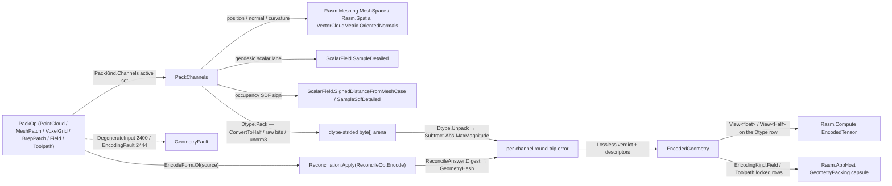

# [RASM_ENCODING_PACK]

The residency-encoding owner of `Rasm.Drawing` (fault cluster `encoding` 2444-2447) — ONE `PackOp` `[Union]` (`PointCloud`/`MeshPatch`/`VoxelGrid`/`BrepPatch`/`Field`/`Toolpath`) folded by ONE `Fin<EncodedGeometry> Encode.Apply(PackOp, Op? key = null)` that materializes a geometric primitive into a dtype-STRIDED `byte[]` struct-of-arrays payload over the eight-row `EncodingChannel` feature lattice (`position`/`normal`/`color-rgba`/`curvature`/`geodesic`/`intensity`/`occupancy`/`weight`). Every channel is read from the live kernel mesh/cloud/field/SDF surface and never approximated; every channel writes through its `ChannelDtype` row's bulk span arms — `Float32` a raw-bit copy, `Float16` the SIMD `TensorPrimitives.ConvertToHalf` narrow that HALVES residency for real (the widened-back `(float)(Half)` pack that stored 4 bytes per half-precision scalar is dead), `Unorm8` the byte quantization — so `EncodedStore.Payload` holds each channel at its own byte stride behind an `EncodingChannelDescriptor` header, and the always-`float[]` store is dead with it. The round-trip witness is keyed by the reconciliation content digest: `Reconciliation.Apply(new ReconcileOp.Encode(EncodeForm.Of(source)), key)` answers `ReconcileAnswer.Digest` carrying the `GeometryHash` `[ValueObject<UInt128>]`, so a silent quantization with no round-trip proof is a routed fault and this owner computes no hash and mints no second identity — the cloud's canonical byte order, the mesh's canonical adjacency stream, and the digest law are all `Spatial/reconciliation`'s, composed through its ONE entry, never a local second encoder.

The page is the kernel-side producer of the representation vocabulary the `cs/Rasm.Compute` tensor lane wraps as an `EncodedTensor` (residency view, never a re-pack — `ReadOnlyTensorSpan<float>`/`ReadOnlyTensorSpan<Half>` selected on the descriptor `Dtype` row) and the `cs/Rasm.AppHost` `GeometryPacking` sandbox capsule reads as the channel discriminant, with `EncodingKind.Field`/`EncodingKind.Toolpath` signature-locked on the `field`/`toolpath` `PackKind` rows this rebuild lands. It composes the `Spatial/cloud#CLOUD_METRICS` `VectorCloudMetric.OrientedNormals` metric row — the cloud-facing name of the landed `Spatial/neighbors` `NeighborKernel.OrientNormals` MST orientation fold — through the `VectorIntent.Cloud` public rail for the point-cloud normal/intensity channels, the `ScalarField.Geodesic` heat-geodesic and `ScalarField.MeanCurvatureFlow` cotangent-Laplacian fields per vertex through the public `ScalarField.SampleDetailed` tagged rail for the mesh-patch geodesic/curvature channels, and the mesh SDF — the admitted-payload `ScalarField.SignedDistanceFromMeshCase` constructed directly per the fields ingress law — through `SampleSdfDetailed` for the voxel-grid occupancy channel. Every reachable failure routes the band-2400 `GeometryFault` union in its locked payload forms — `EncodingFault(EncodingChannel, ChannelDtype, string)` 2444 and `DegenerateInput(Kind, int, string)` 2400 — and the `EncodedGeometry` registers `IValidityEvidence`, gated at the `Op` acceptance oracle like every kernel receipt.

## [01]-[INDEX]

- [01]-[ENCODING]: `PackKind` six-row modality discriminant with per-kind active-channel columns; `EncodingChannel` `[SmartEnum<string>]` eight-row feature lattice; `ChannelDtype` `[SmartEnum<int>]` width/tolerance rows with bulk span `Pack`/`Unpack` arms over `TensorPrimitives`; `PackOp` `[Union]` over one dtype-strided `EncodedStore` byte arena; the `Apply` fold composing live kernel channel readers and the `Reconciliation.Apply` `Encode` digest; `EncodedGeometry` the descriptor-dispatched typed-view carrier with its `RoundTripWitness`.

## [02]-[ENCODING]

- Owner: `PackKind` `[SmartEnum<string>]` the representation-modality discriminant binding the shipped `ComparerAccessors.StringOrdinal` as its string-key comparer (`point-cloud`/`mesh-patch`/`voxel-grid`/`brep-patch`/`field`/`toolpath` — the six keys the AppHost `EncodingKind` rows signature-lock one-to-one) carrying the per-kind `Channels` column (the frozen `EncodingChannel` set each kind activates — a point cloud packs `position`/`normal`/`color-rgba`/`intensity`, a mesh patch packs `position`/`normal`/`curvature`/`geodesic`/`weight`, a voxel grid packs `position`/`occupancy`/`weight`, a brep patch packs `position`/`normal`/`curvature`, a field packs `geodesic`/`weight` — the scalar lane rides the mesh the content digest already binds, so positions are never duplicated into a field pack — and a toolpath packs `position`/`weight`), so the active-channel set is a kind column, never a per-call flag bag; `EncodingChannel` `[SmartEnum<string>]` the eight-row feature lattice carrying the per-channel `Arity` (3 position, 3 normal, 4 color-rgba, 1 for each scalar row) and `Dtype` columns; `ChannelDtype` `[SmartEnum<int>]` the quantization vocabulary (`Float32`/`Float16`/`Unorm8`) carrying `Width` (the byte stride per scalar — 4/2/1, the residency fact), `Tolerance` (the round-trip bound), and the two bulk span arms `Pack(ReadOnlySpan<float>, Span<byte>)`/`Unpack(ReadOnlySpan<byte>, Span<float>)`; `EncodingChannelDescriptor` the per-active-channel header (`Channel` · element `Count` · `ByteOffset` into the arena · `Dtype`) with derived `Floats`/`Bytes` extents; `EncodedStore` the dtype-strided flat pack arena — one contiguous `byte[]` tiling every active channel at its descriptor byte offset; `PackedChannels` the intermediate carrier pairing the store with the per-channel raw `float[]` the witness compares against; `PackOp` the request `[Union]` (cases below); `EncodedGeometry` the typed evidence (`IValidityEvidence` — descriptor tiling is a claim set, not a convention) carrying `Descriptors` · the `ReadOnlyMemory<byte>` `Payload` · `Count` · `Witness`, with the `Channel` byte-slice accessor and the descriptor-dispatched `View<T>` typed tensor view; `RoundTripWitness` the lossless proof (`GeometryHash` content digest · per-channel max error map · `Lossless` verdict); `Encode` the static surface owning the ONE `Apply`.
- Cases: `PackKind` rows 6; `EncodingChannel` rows 8; `ChannelDtype` rows 3; `PackOp` cases `PointCloud(VectorCloud.ClusterCase, PackPolicy)` · `MeshPatch(MeshSpace, PackPolicy)` · `VoxelGrid(MeshSpace, PackGrid, PackPolicy)` · `BrepPatch(MeshSpace, PackPolicy)` · `Field(MeshSpace, ScalarField, PackPolicy)` · `Toolpath(VectorCloud.PolylineCase, PackPolicy)` (6 — the `field`/`toolpath` growth rows are REAL: `Field` carries its own admitted `ScalarField` and binds it to the `geodesic` lattice row — the row is the per-vertex scalar LANE, the case supplies the field — and `Toolpath` carries the directed `PolylineCase` whose stored order IS content under the reconciliation cloud law). The six kinds share ONE `Apply` fold, ONE `Readers` data table, and ONE `Witness` proof — each kind contributes one active-channel column and one source carrier, never six packer classes; the eight-row lattice spans the union of every kind's active set, so a channel is named once and every kind that admits it reads the SAME row.
- Entry: `public static Fin<EncodedGeometry> Encode.Apply(PackOp op, Op? key = null)` — the ONE encoding entrypoint discriminating by `PackOp` case; the model `Context` rides `PackPolicy.Tolerance` (its `Absolute` band sets the voxel-grid SDF iso-band and the field-sampling floor — never a domain-local epsilon literal), so the signature carries exactly the request and the key. `Fin<T>` routes `GeometryFault.EncodingFault(channel, channel.Dtype, detail)` 2444 when a channel's reader cannot bind the kind, when a packed extent disagrees with the lattice arity, or when the unpack breaches the channel's `Dtype.Tolerance` (a quantization whose unpack does not recover the packed float within its bound is a defect, never a tolerated loss), and `GeometryFault.DegenerateInput(kind, index, witness)` 2400 when the source is empty or under the modality floor; a non-digest reconcile answer routes the `Op` admission channel (`key.InvalidResult()` — the two-family seam). The fold reads each active channel from its live kernel reader, packs it through the dtype span arm into the byte arena at its descriptor offset, digests the source through `Reconciliation.Apply(new ReconcileOp.Encode(EncodeForm.Of(source)), key)`, proves the per-channel round trip, and gates the typed `EncodedGeometry` through `key.AcceptValue`. No `PackPointCloud`/`PackMesh`/`PackVoxels` sibling entrypoints — one polymorphic `Apply` discriminates by kind.
- Auto: `Apply` reads the `Readers` `FrozenDictionary` keyed by `EncodingChannel` so channel materialization is a data-table row, never a `channel switch` cascade — every row lowers a live kernel reader to a raw `float[]`, and the kind selection reads the `PackKind.Channels` column to drive the active set. `PackChannels` (1) reserves the arena at the active channels' summed BYTE extent (`count · arity · dtype.Width` per channel — the residency arithmetic is the descriptor's, never a caller guess), (2) reads each active row against the source — `position` from cloud points, toolpath vertices, grid cell centres, or mesh vertices; `normal` from `VectorIntent.Cloud(cloud, VectorCloudMetric.OrientedNormals, policy, key)` projected `Seq<Vector3d>` or the mesh vertex normals; `color-rgba` opaque white today — the `ClusterCase` carries no color column yet, so the row is the reserved lane a cluster color column fills when it lands; `curvature` from `ScalarField.MeanCurvatureFlow` per vertex through `SampleDetailed`; `geodesic` from `ScalarField.Geodesic` against the policy's source vertices (mesh patch) or the op-carried field (field pack), the same per-vertex evaluator; `intensity` from the oriented-normal axis consistency (the scan-return proxy); `occupancy` from the directly-constructed `ScalarField.SignedDistanceFromMeshCase` sign through `SampleSdfDetailed` at each cell centre; `weight` from the mesh per-vertex triangle-area share, the toolpath per-vertex chord-length share, or the uniform unit cell weight — (3) bulk-writes each raw block through `Dtype.Pack` (the `Float16` arm is ONE `TensorPrimitives.ConvertToHalf` span call — the SIMD narrow, not a per-element cast) and records the descriptor plus the raw block for the witness. `Witness` digests the source once through the reconciliation entry — `EncodeForm.Of(MeshSpace)` for every mesh-backed kind (a brep patch encodes through its meshed patch, the reconciliation growth law), `EncodeForm.Of(VectorCloud)` for the cluster and the polyline (the per-case canonical order and the frozen little-endian layout are reconciliation's sole-owner law) — then per channel unpacks the STORED bytes through `Dtype.Unpack` into pooled staging and reduces the SCALE-RELATIVE max element error through the `TensorPrimitives` lanes (`Subtract` · `Abs` · `MaxMagnitude`, the delta normalized by `max(1, ‖raw‖∞)` — the dtype tolerances are relative precision facts, so a real-scale geodesic never false-faults), routing `EncodingFault` with the first breaching channel and its achieved error. Scalar normalization composes `MaxMagnitude` + `Divide` (the lattice has no `Normalize` operator — the composition is the spelling). The six kinds share ONE `PackChannels` fold and ONE `Witness` proof — only the source-reader binding and the active-channel column vary per kind.
- Receipt: `EncodedGeometry`, `IValidityEvidence` — `Descriptors` (one header per packed channel), `Payload` (the contiguous dtype-strided `ReadOnlyMemory<byte>` arena), `Count`, and `Witness` (`GeometryHash` digest + per-channel max error + `Lossless`); the claim set proves the descriptors tile the arena contiguously with no gap or overlap and the witness errors are finite — a hand-assembled carrier with overlapping slices fails the acceptance oracle, never a consumer. The `cs/Rasm.Compute` tensor lane reads `Payload`+`Descriptors` to wrap an `EncodedTensor` — a `[Count × Arity]` `ReadOnlyTensorSpan<float>` or `ReadOnlyTensorSpan<Half>` view sliced at the descriptor byte offset per the `Dtype` row, residency, never a re-pack — and the `cs/Rasm.AppHost` `GeometryPacking` capsule marshals the descriptor set plus the payload across the sandbox boundary, its `EncodingKind` rows aligned onto the `PackKind` case axis.
- Packages: `Rasm.Meshing` (`MeshSpace`), `Rasm.Spatial` (`VectorCloud.ClusterCase`/`VectorCloud.PolylineCase`; `ScalarField.Geodesic`/`MeanCurvatureFlow` factories + the admitted-payload `SignedDistanceFromMeshCase` + `SampleDetailed`/`SampleSdfDetailed` the public field rails; `Reconciliation.Apply`/`ReconcileOp.Encode`/`EncodeForm.Of`/`ReconcileAnswer.Digest`/`GeometryHash` — the ONE content-digest chain the witness keys), `Rasm.Processing` (`VectorIntent.Cloud` + `Project<Seq<Vector3d>>` the public cloud-metric rail), `Rhino.Geometry` (`Point3d`/`Vector3d` carriers) — composed for every channel payload, never re-minted, `Rasm.Numerics` (`GeometryFault` band 2400), `Rasm.Domain` (`Op` key rail, `Kind` taxonomy, `ValidityClaim`/`IValidityEvidence`), System.Numerics.Tensors (`TensorPrimitives.ConvertToHalf`/`ConvertToSingle`/`Subtract`/`Abs`/`MaxMagnitude`/`Divide` — the bulk dtype and error lanes; `ReadOnlyTensorSpan<T>`/`TensorMarshal.CreateReadOnlyTensorSpan` — the typed residency view), CommunityToolkit.HighPerformance (`SpanOwner<T>` pooled witness staging), Thinktecture.Runtime.Extensions, LanguageExt.Core (`Fin`/`Seq`/`Option`/`HashMap`), BCL inbox (`FrozenDictionary`, `System.Half`, `MemoryMarshal`).
- Growth: a new representation modality is one `PackKind` row carrying its active-channel column plus one `PackOp` case carrying its kernel source — the `field`/`toolpath` rows are the executed precedent, landed exactly this way; a new feature channel (a `texcoord` UV channel from `Processing/flatten#PARAMETERIZATION`, a `segment-label` channel, a `velocity` channel) is one `EncodingChannel` row plus one `Readers` row; a new quantization (a `Bfloat16`, a block-compressed color codec) is one `ChannelDtype` row carrying its width/tolerance/span arms over the SAME witness; a per-instance or per-layer block descriptor is one column on `EncodingChannelDescriptor`, decoders re-binding loudly; zero new surface.
- Boundary: the encoding owner is the ONE polymorphic `PackOp` `[Union]` and a per-kind encoder-class family is the named density defect collapsed onto one union folded by one `Apply`; the `Readers` `FrozenDictionary` is the single channel-materialization table and a `channel switch` cascade is the deleted form; every channel composes its live kernel reader and a domain-local curvature/geodesic/normal re-implementation beside the kernel owner is the deleted double-owner form; the content digest is the reconciliation chain and a local digest — the retired canonical-point cloud encoder included — is the deleted form: cloud, mesh, and (growth) parametric byte layouts have ONE owner and this page binds `(form, digest)` pairs, never raw bytes; a silently lossy pack is rejected — the witness proves every channel against its `Dtype.Tolerance` or routes the typed 2444; the payload is ONE contiguous dtype-strided byte arena and both prior forms are dead — the per-channel `float[][]` jagged arena (re-pack tax) and the uniform `float[]` arena (the false-`Half` store whose "quantized" channels still spent 4 bytes per scalar); the typed view is descriptor-DISPATCHED — the `Dtype` row names the one legal element type and `View<T>` answers the empty view for an absent channel or a width-mismatched `T`, the descriptor set being the truth a consumer reads first; `Apply` is total over the `Fin` rail and a thrown exception on a degenerate source or an unmaterializable channel is forbidden; the pack loop operates on raw `float`/`byte` because a packed feature scalar is the residency lane's native element, and a raw scalar buffer crossing a public signature outside the `Payload`/descriptor pair is the seam violation.

```csharp
// --- [RUNTIME_PRELUDE] --------------------------------------------------------------------
using System;
using System.Collections.Frozen;
using System.Collections.Generic;
using System.Numerics.Tensors;
using System.Runtime.CompilerServices;
using System.Runtime.InteropServices;
using CommunityToolkit.HighPerformance.Buffers;
using LanguageExt;
using LanguageExt.Common;
using Rasm.Domain;
using Rasm.Meshing;
using Rasm.Numerics;
using Rasm.Processing;
using Rasm.Spatial;
using Rhino.Geometry;
using Thinktecture;
using static LanguageExt.Prelude;

namespace Rasm.Drawing;

// --- [TYPES] ------------------------------------------------------------------------------
// Width is the residency fact (bytes per scalar); the span arms are the ONE quantization seam.
// Row-test dispatch is the named span-kernel exemption: a generated Switch cannot carry
// ref-struct operands, so the three-row if-chain IS the dtype dispatch.
[SmartEnum<int>]
public sealed partial class ChannelDtype {
    public static readonly ChannelDtype Float32 = new(key: 0, width: 4, tolerance: 0.0);
    public static readonly ChannelDtype Float16 = new(key: 1, width: 2, tolerance: 9.77e-4);
    public static readonly ChannelDtype Unorm8  = new(key: 2, width: 1, tolerance: 1.0 / 255.0);

    public int Width { get; }
    public double Tolerance { get; }

    // Every row names its arm POSITIVELY: a new dtype row that extends neither arm packs nothing,
    // and the round-trip witness routes 2444 — never a silent fall-through into a foreign quantization.
    public void Pack(ReadOnlySpan<float> raw, Span<byte> stored) {
        if (this == Float32) { MemoryMarshal.AsBytes(raw).CopyTo(stored); return; }
        if (this == Float16) { TensorPrimitives.ConvertToHalf(raw, MemoryMarshal.Cast<byte, Half>(stored)); return; }
        if (this == Unorm8) { for (int i = 0; i < raw.Length; i++) stored[i] = (byte)MathF.Round(Math.Clamp(raw[i], 0f, 1f) * 255f); }
    }

    public void Unpack(ReadOnlySpan<byte> stored, Span<float> restored) {
        if (this == Float32) { MemoryMarshal.Cast<byte, float>(stored).CopyTo(restored); return; }
        if (this == Float16) { TensorPrimitives.ConvertToSingle(MemoryMarshal.Cast<byte, Half>(stored), restored); return; }
        if (this == Unorm8) { for (int i = 0; i < stored.Length; i++) restored[i] = stored[i] / 255f; }
    }
}

[SmartEnum<string>]
[KeyMemberEqualityComparer<ComparerAccessors.StringOrdinal, string>]
[KeyMemberComparer<ComparerAccessors.StringOrdinal, string>]
public sealed partial class EncodingChannel {
    public static readonly EncodingChannel Position  = new("position",   arity: 3, dtype: ChannelDtype.Float32);
    public static readonly EncodingChannel Normal    = new("normal",     arity: 3, dtype: ChannelDtype.Float32);
    public static readonly EncodingChannel ColorRgba = new("color-rgba", arity: 4, dtype: ChannelDtype.Unorm8);
    public static readonly EncodingChannel Curvature = new("curvature",  arity: 1, dtype: ChannelDtype.Float16);
    public static readonly EncodingChannel Geodesic  = new("geodesic",   arity: 1, dtype: ChannelDtype.Float16);
    public static readonly EncodingChannel Intensity = new("intensity",  arity: 1, dtype: ChannelDtype.Float16);
    public static readonly EncodingChannel Occupancy = new("occupancy",  arity: 1, dtype: ChannelDtype.Float16);
    public static readonly EncodingChannel Weight    = new("weight",     arity: 1, dtype: ChannelDtype.Float16);

    public int Arity { get; }
    public ChannelDtype Dtype { get; }
}

// Six keys signature-locked one-to-one onto the AppHost EncodingKind rows; the Channels column
// IS the active set — the field row rides the mesh the content digest binds (no position dup).
[SmartEnum<string>]
[KeyMemberEqualityComparer<ComparerAccessors.StringOrdinal, string>]
[KeyMemberComparer<ComparerAccessors.StringOrdinal, string>]
public sealed partial class PackKind {
    public static readonly PackKind PointCloud = new("point-cloud", Seq(EncodingChannel.Position, EncodingChannel.Normal, EncodingChannel.ColorRgba, EncodingChannel.Intensity));
    public static readonly PackKind MeshPatch  = new("mesh-patch",  Seq(EncodingChannel.Position, EncodingChannel.Normal, EncodingChannel.Curvature, EncodingChannel.Geodesic, EncodingChannel.Weight));
    public static readonly PackKind VoxelGrid  = new("voxel-grid",  Seq(EncodingChannel.Position, EncodingChannel.Occupancy, EncodingChannel.Weight));
    public static readonly PackKind BrepPatch  = new("brep-patch",  Seq(EncodingChannel.Position, EncodingChannel.Normal, EncodingChannel.Curvature));
    public static readonly PackKind Field      = new("field",       Seq(EncodingChannel.Geodesic, EncodingChannel.Weight));
    public static readonly PackKind Toolpath   = new("toolpath",    Seq(EncodingChannel.Position, EncodingChannel.Weight));

    public Seq<EncodingChannel> Channels { get; }
}

// --- [CONSTANTS] --------------------------------------------------------------------------
public sealed record PackGrid(int Nx, int Ny, int Nz, BoundingBox Bounds) {
    public int CellCount => Nx * Ny * Nz;

    public Point3d CellCenter(int linear) {
        int k = linear / (Nx * Ny);
        int r = linear - k * (Nx * Ny);
        int j = r / Nx;
        int i = r - j * Nx;
        double sx = Bounds.Diagonal.X / Nx, sy = Bounds.Diagonal.Y / Ny, sz = Bounds.Diagonal.Z / Nz;
        return new Point3d(Bounds.Min.X + (i + 0.5) * sx, Bounds.Min.Y + (j + 0.5) * sy, Bounds.Min.Z + (k + 0.5) * sz);
    }
}

// Tolerance is the model Context (SDF iso-band + field-sampling floor); Cloud defaults through
// the cloud tier's own AdmitOrDefault when the caller passes None.
public sealed record PackPolicy(
    Seq<int> GeodesicSources, double CurvatureTimeStep, int CurvatureIterations,
    SdfMeshPolicy Sdf, Option<CloudMetricPolicy> Cloud, Context Tolerance) {
    public static Fin<PackPolicy> Of(
        Context tolerance, SdfMeshPolicy sdf, Seq<int> geodesicSources = default,
        Option<CloudMetricPolicy> cloud = default, double curvatureTimeStep = 1e-3, int curvatureIterations = 1, Op? key = null) =>
        guard(curvatureTimeStep > 0.0 && curvatureIterations > 0, key.OrDefault().InvalidInput()).ToFin()
            .Map(_ => new PackPolicy(geodesicSources, curvatureTimeStep, curvatureIterations, sdf, cloud, tolerance));
}

// --- [MODELS] -----------------------------------------------------------------------------
public sealed record EncodingChannelDescriptor(EncodingChannel Channel, int Count, int ByteOffset, ChannelDtype Dtype) {
    public int Floats => Count * Channel.Arity;
    public int Bytes => Floats * Dtype.Width;
}

public sealed record RoundTripWitness(GeometryHash ContentHash, HashMap<string, double> ChannelError, bool Lossless) {
    public static RoundTripWitness Of(GeometryHash digest, Seq<(EncodingChannel Channel, double Error)> errors) =>
        new(digest,
            errors.Fold(HashMap<string, double>(), static (acc, e) => acc.Add(e.Channel.Key, e.Error)),
            errors.ForAll(static e => e.Error <= e.Channel.Dtype.Tolerance));
}

public sealed record EncodedGeometry(
    Seq<EncodingChannelDescriptor> Descriptors, ReadOnlyMemory<byte> Payload, int Count, RoundTripWitness Witness) : IValidityEvidence {

    // Descriptor tiling is a CLAIM set: contiguous byte offsets, no gap, no overlap, arena exact.
    public bool IsValid => ValidityClaim.All(
        ValidityClaim.CountAtLeast(count: Count, floor: 1),
        ValidityClaim.Of(Descriptors.Fold((Offset: 0, Holds: true), static (acc, d) =>
            (acc.Offset + d.Bytes, acc.Holds && d.ByteOffset == acc.Offset && d.Count > 0)) is var tile
            && tile.Holds && tile.Offset == Payload.Length),
        ValidityClaim.Of(Witness.ChannelError.Values.AsIterable().ForAll(static e => double.IsFinite(e) && e >= 0.0)));

    public ReadOnlyMemory<byte> Channel(EncodingChannel channel) =>
        Descriptors.Find(d => d.Channel == channel)
            .Match(Some: d => Payload.Slice(d.ByteOffset, d.Bytes), None: static () => ReadOnlyMemory<byte>.Empty);

    // Descriptor-dispatched typed residency view, [Count × Arity]: the Dtype row names the one
    // legal T (float32→float · float16→Half · unorm8→byte); an absent channel or a wrong-width T
    // answers the EMPTY view — the descriptor set is the truth a consumer reads first.
    public ReadOnlyTensorSpan<T> View<T>(EncodingChannel channel) where T : unmanaged {
        if (Descriptors.Find(d => d.Channel == channel).Case is not EncodingChannelDescriptor found || Unsafe.SizeOf<T>() != found.Dtype.Width)
            return default;
        ReadOnlySpan<T> cast = MemoryMarshal.Cast<byte, T>(Payload.Span.Slice(found.ByteOffset, found.Bytes));
        return TensorMarshal.CreateReadOnlyTensorSpan(
            ref MemoryMarshal.GetReference(cast), cast.Length, lengths: [found.Count, found.Channel.Arity], strides: [], pinned: false);
    }
}

// Dtype-strided byte arena: Reserve sums count·arity·width per active channel — the residency
// arithmetic lives on the descriptor row, never a caller size guess.
public sealed record EncodedStore(int Count, byte[] Payload, EncodingChannelDescriptor[] Descriptors) {
    public static EncodedStore Reserve(int count, Seq<EncodingChannel> channels) =>
        new(count, new byte[channels.Fold(0, (acc, c) => acc + (count * c.Arity * c.Dtype.Width))], new EncodingChannelDescriptor[channels.Count]);
}

public sealed record PackedChannels(EncodedStore Store, (EncodingChannel Channel, float[] Raw)[] Raws);

// --- [OPERATIONS] -------------------------------------------------------------------------
[Union(ConversionFromValue = ConversionOperatorsGeneration.None)]
public abstract partial record PackOp {
    private PackOp() { }

    public sealed record PointCloud(VectorCloud.ClusterCase Source, PackPolicy Policy) : PackOp;
    public sealed record MeshPatch(MeshSpace Source, PackPolicy Policy) : PackOp;
    public sealed record VoxelGrid(MeshSpace Source, PackGrid Grid, PackPolicy Policy) : PackOp;
    public sealed record BrepPatch(MeshSpace Source, PackPolicy Policy) : PackOp;
    public sealed record Field(MeshSpace Source, ScalarField Values, PackPolicy Policy) : PackOp;
    public sealed record Toolpath(VectorCloud.PolylineCase Source, PackPolicy Policy) : PackOp;

    public PackKind Kind =>
        Switch(
            pointCloud: static _ => PackKind.PointCloud,
            meshPatch:  static _ => PackKind.MeshPatch,
            voxelGrid:  static _ => PackKind.VoxelGrid,
            brepPatch:  static _ => PackKind.BrepPatch,
            field:      static _ => PackKind.Field,
            toolpath:   static _ => PackKind.Toolpath);

    internal PackPolicy Policy =>
        Switch(
            pointCloud: static p => p.Policy, meshPatch: static m => m.Policy, voxelGrid: static v => v.Policy,
            brepPatch:  static b => b.Policy, field:     static f => f.Policy, toolpath:  static t => t.Policy);
}

public static class Encode {
    static readonly FrozenDictionary<EncodingChannel, Func<PackOp, Op, Fin<float[]>>> Readers =
        new Dictionary<EncodingChannel, Func<PackOp, Op, Fin<float[]>>> {
            [EncodingChannel.Position]  = static (op, k) => ReadPosition(op),
            [EncodingChannel.Normal]    = static (op, k) => ReadNormal(op, k),
            [EncodingChannel.ColorRgba] = static (op, k) => ReadColor(op),
            [EncodingChannel.Curvature] = static (op, k) => ReadCurvature(op, k),
            [EncodingChannel.Geodesic]  = static (op, k) => ReadGeodesic(op, k),
            [EncodingChannel.Intensity] = static (op, k) => ReadIntensity(op, k),
            [EncodingChannel.Occupancy] = static (op, k) => ReadOccupancy(op, k),
            [EncodingChannel.Weight]    = static (op, k) => ReadWeight(op),
        }.ToFrozenDictionary();

    public static Fin<EncodedGeometry> Apply(PackOp op, Op? key = null) {
        Op k = key.OrDefault();
        return ElementCount(op)
            .Bind(count => PackChannels(op, op.Kind, count, k)
                .Bind(packed => Witness(op, packed, k)
                    .Map(witness => new EncodedGeometry(packed.Store.Descriptors.ToSeq(), packed.Store.Payload, packed.Store.Count, witness))))
            .Bind(geometry => k.AcceptValue(geometry));
    }

    // --- [PACK]
    static Fin<PackedChannels> PackChannels(PackOp op, PackKind kind, int count, Op key) {
        EncodedStore store = EncodedStore.Reserve(count, kind.Channels);
        List<(EncodingChannel Channel, float[] Raw)> raws = new(kind.Channels.Count);
        // TryGetValue keeps a lattice row without a Readers row on the typed rail — never a thrown lookup.
        return kind.Channels.Fold(Fin.Succ((slot: 0, offset: 0)), (state, channel) =>
                state.Bind(s => (Readers.TryGetValue(channel, out Func<PackOp, Op, Fin<float[]>>? reader)
                        ? reader(op, key)
                        : NoReader(channel, op)).Bind(raw =>
                    raw.Length == count * channel.Arity
                        ? Fin.Succ(WriteChannel(store, s.slot, s.offset, channel, count, raw, raws))
                        : Fin.Fail<(int, int)>(new GeometryFault.EncodingFault(
                            channel, channel.Dtype, $"arity {raw.Length} != {count * channel.Arity}").ToError()))))
            .Map(_ => new PackedChannels(store, raws.ToArray()));
    }

    static (int Slot, int Offset) WriteChannel(EncodedStore store, int slot, int offset, EncodingChannel channel, int count, float[] raw, List<(EncodingChannel, float[])> raws) {
        EncodingChannelDescriptor descriptor = new(channel, count, offset, channel.Dtype);
        channel.Dtype.Pack(raw, store.Payload.AsSpan(offset, descriptor.Bytes));
        store.Descriptors[slot] = descriptor;
        raws.Add((channel, raw));
        return (slot + 1, offset + descriptor.Bytes);
    }

    // --- [WITNESS]
    // ONE digest chain: EncodeForm.Of(source) → Reconciliation.Apply(Encode) → ReconcileAnswer.Digest.
    // The canonical byte layouts (mesh adjacency stream, cloud kind-tagged order) are reconciliation's
    // sole-owner law — no local encoder, no second hash. Error reduce = Subtract·Abs·MaxMagnitude, scale-relative.
    static Fin<RoundTripWitness> Witness(PackOp op, PackedChannels packed, Op key) =>
        SourceDigest(op, key).Bind(digest => {
            Seq<(EncodingChannel Channel, double Error)> errors = toSeq(packed.Raws).Map(row => {
                EncodingChannelDescriptor descriptor = System.Array.Find(packed.Store.Descriptors, d => d.Channel == row.Channel)!;
                return (row.Channel, ChannelError(row.Raw, packed.Store.Payload.AsSpan(descriptor.ByteOffset, descriptor.Bytes), row.Channel.Dtype));
            });
            return errors.Find(e => e.Error > e.Channel.Dtype.Tolerance).Match(
                Some: breach => Fin.Fail<RoundTripWitness>(new GeometryFault.EncodingFault(
                    breach.Channel, breach.Channel.Dtype, $"round-trip {breach.Error:e3} > {breach.Channel.Dtype.Tolerance:e3}").ToError()),
                None: () => Fin.Succ(RoundTripWitness.Of(digest, errors)));
        });

    // Scale-relative reduce: the dtype tolerances are RELATIVE precision facts, so the max delta
    // divides by max(1, ‖raw‖∞) — an absolute bound would fault every real-scale geodesic or
    // curvature channel whose magnitudes exceed one; a half-overflowed (infinite) delta stays loud.
    static double ChannelError(float[] raw, ReadOnlySpan<byte> stored, ChannelDtype dtype) {
        using SpanOwner<float> staging = SpanOwner<float>.Allocate(raw.Length);
        Span<float> restored = staging.Span;
        dtype.Unpack(stored, restored);
        TensorPrimitives.Subtract<float>(restored, raw, restored);
        TensorPrimitives.Abs<float>(restored, restored);
        return TensorPrimitives.MaxMagnitude<float>(restored) / Math.Max(1f, TensorPrimitives.MaxMagnitude<float>(raw));
    }

    static Fin<GeometryHash> SourceDigest(PackOp op, Op key) {
        EncodeForm form = op.Switch(
            pointCloud: static c => EncodeForm.Of(c.Source),
            meshPatch:  static m => EncodeForm.Of(m.Source),
            voxelGrid:  static v => EncodeForm.Of(v.Source),
            brepPatch:  static b => EncodeForm.Of(b.Source),
            field:      static f => EncodeForm.Of(f.Source),
            toolpath:   static t => EncodeForm.Of(t.Source));
        return Reconciliation.Apply(new ReconcileOp.Encode(form), key)
            .Bind(answer => answer is ReconcileAnswer.Digest digest
                ? Fin.Succ(digest.Value)
                : Fin.Fail<GeometryHash>(key.InvalidResult()));
    }

    // --- [READERS]
    static Fin<int> ElementCount(PackOp op) => op.Switch(
        pointCloud: static c => Elements(c.Source.Vertices.Count, 1, Kind.PointCloud),
        meshPatch:  static m => MeshVertexCount(m.Source),
        voxelGrid:  static v => Elements(v.Grid.CellCount, 1, Kind.BoundingBox),
        brepPatch:  static b => MeshVertexCount(b.Source),
        field:      static f => MeshVertexCount(f.Source),
        toolpath:   static t => Elements(t.Source.Vertices.Count, 2, Kind.Polyline));

    static Fin<int> Elements(int count, int floor, Kind kind) =>
        count >= floor
            ? Fin.Succ(count)
            : Fin.Fail<int>(new GeometryFault.DegenerateInput(kind, -1, $"under {floor} elements").ToError());

    static Fin<int> MeshVertexCount(MeshSpace space) => Elements(space.Native.Vertices.Count, 1, Kind.Mesh);

    static Fin<float[]> ReadPosition(PackOp op) =>
        op switch {
            PackOp.PointCloud c => Fin.Succ(PackPoints(c.Source.Vertices)),
            PackOp.Toolpath t   => Fin.Succ(PackPoints(t.Source.Vertices)),
            PackOp.VoxelGrid v  => Fin.Succ(PackCells(v.Grid)),
            PackOp.MeshPatch m  => Fin.Succ(PackVertices(m.Source)),
            PackOp.BrepPatch b  => Fin.Succ(PackVertices(b.Source)),
            _                   => NoReader(EncodingChannel.Position, op),
        };

    static Fin<float[]> ReadNormal(PackOp op, Op key) =>
        op switch {
            PackOp.PointCloud c => OrientedNormals(c.Source, c.Policy, key).Map(PackVectors),
            PackOp.MeshPatch m  => Fin.Succ(PackNormals(m.Source)),
            PackOp.BrepPatch b  => Fin.Succ(PackNormals(b.Source)),
            _                   => NoReader(EncodingChannel.Normal, op),
        };

    static Fin<float[]> ReadColor(PackOp op) =>
        op is PackOp.PointCloud c ? Fin.Succ(PackColors(c.Source)) : NoReader(EncodingChannel.ColorRgba, op);

    static Fin<float[]> ReadCurvature(PackOp op, Op key) =>
        op switch {
            PackOp.MeshPatch m => MeshScalarField(ScalarField.MeanCurvatureFlow(m.Source, m.Policy.CurvatureTimeStep, m.Policy.CurvatureIterations, key), m.Source, m.Policy.Tolerance, key),
            PackOp.BrepPatch b => MeshScalarField(ScalarField.MeanCurvatureFlow(b.Source, b.Policy.CurvatureTimeStep, b.Policy.CurvatureIterations, key), b.Source, b.Policy.Tolerance, key),
            _                  => NoReader(EncodingChannel.Curvature, op),
        };

    // The geodesic row is the per-vertex scalar LANE: the mesh patch binds the heat-geodesic field,
    // the field pack binds its op-carried ScalarField — one lattice row, two case bindings.
    static Fin<float[]> ReadGeodesic(PackOp op, Op key) =>
        op switch {
            PackOp.MeshPatch m => MeshScalarField(ScalarField.Geodesic(m.Source, m.Policy.GeodesicSources, key), m.Source, m.Policy.Tolerance, key),
            PackOp.Field f     => MeshScalarField(Fin.Succ(f.Values), f.Source, f.Policy.Tolerance, key),
            _                  => NoReader(EncodingChannel.Geodesic, op),
        };

    static Fin<float[]> ReadIntensity(PackOp op, Op key) =>
        op is PackOp.PointCloud c
            ? OrientedNormals(c.Source, c.Policy, key).Map(NormalConsistency)
            : NoReader(EncodingChannel.Intensity, op);

    // SignedDistanceFromMeshCase carries only admitted payloads — direct case construction per the
    // fields.md ingress law; raw-ingress siblings (MeanCurvatureFlow) go through their Fin factory.
    static Fin<float[]> ReadOccupancy(PackOp op, Op key) =>
        op is PackOp.VoxelGrid v
            ? GridOccupancy(new ScalarField.SignedDistanceFromMeshCase(Space: v.Source, Policy: v.Policy.Sdf), v.Grid, v.Policy.Tolerance, key)
            : NoReader(EncodingChannel.Occupancy, op);

    static Fin<float[]> ReadWeight(PackOp op) =>
        op switch {
            PackOp.MeshPatch m => Fin.Succ(VertexAreaWeight(m.Source)),
            PackOp.Field f     => Fin.Succ(VertexAreaWeight(f.Source)),
            PackOp.VoxelGrid v => Fin.Succ(Fill(v.Grid.CellCount, 1f)),
            PackOp.Toolpath t  => Fin.Succ(ChordWeight(t.Source.Vertices)),
            _                  => NoReader(EncodingChannel.Weight, op),
        };

    static Fin<float[]> NoReader(EncodingChannel channel, PackOp op) =>
        Fin.Fail<float[]>(new GeometryFault.EncodingFault(channel, channel.Dtype, $"no reader for {op.Kind.Key}").ToError());

    // --- [PROJECTIONS]
    static Fin<Vector3d[]> OrientedNormals(VectorCloud.ClusterCase cloud, PackPolicy policy, Op key) =>
        VectorIntent.Cloud(cloud, VectorCloudMetric.OrientedNormals, policy.Cloud, key)
            .Bind(intent => intent.Project<Seq<Vector3d>>(policy.Tolerance, key))
            .Map(static seq => seq.ToArray());

    static Fin<float[]> MeshScalarField(Fin<ScalarField> built, MeshSpace space, Context tolerance, Op key) =>
        built.Bind(field => {
            Mesh native = space.Native;
            float[] values = new float[native.Vertices.Count];
            for (int i = 0; i < values.Length; i++) {
                Fin<FieldSample> sample = field.SampleDetailed(native.Vertices.Point3dAt(i), tolerance, key);
                if (sample.IsFail) return sample.Map(static _ => System.Array.Empty<float>());
                values[i] = (float)sample.IfFail(static _ => default).Value;
            }
            return Fin.Succ(values);
        });

    static Fin<float[]> GridOccupancy(ScalarField field, PackGrid grid, Context tolerance, Op key) {
        float[] values = new float[grid.CellCount];
        for (int i = 0; i < values.Length; i++) {
            Fin<SdfSample> sample = field.SampleSdfDetailed(grid.CellCenter(i), tolerance, key);
            if (sample.IsFail) return sample.Map(static _ => System.Array.Empty<float>());
            values[i] = sample.IfFail(static _ => default).Value <= 0.0 ? 1f : 0f;
        }
        return Fin.Succ(values);
    }

    static float[] NormalConsistency(Vector3d[] normals) {
        float[] values = new float[normals.Length];
        for (int i = 0; i < normals.Length; i++) values[i] = (float)Math.Abs(normals[i].Z);
        return values;
    }

    static float[] VertexAreaWeight(MeshSpace space) {
        Mesh native = space.Native;
        float[] weight = new float[native.Vertices.Count];
        for (int face = 0; face < native.Faces.Count; face++) {
            MeshFace mf = native.Faces[face];
            Point3d a = native.Vertices.Point3dAt(mf.A), b = native.Vertices.Point3dAt(mf.B), c = native.Vertices.Point3dAt(mf.C);
            float share = (float)(0.5 * Vector3d.CrossProduct(b - a, c - a).Length / 3.0);
            weight[mf.A] += share; weight[mf.B] += share; weight[mf.C] += share;
        }
        return Normalize(weight);
    }

    static float[] ChordWeight(Seq<Point3d> chain) {
        float[] weight = new float[chain.Count];
        for (int i = 0; i + 1 < chain.Count; i++) {
            float half = (float)(0.5 * chain[i].DistanceTo(chain[i + 1]));
            weight[i] += half; weight[i + 1] += half;
        }
        return Normalize(weight);
    }

    // No Normalize operator exists on the lattice — MaxMagnitude + Divide IS the spelling.
    static float[] Normalize(float[] values) {
        float max = TensorPrimitives.MaxMagnitude<float>(values);
        if (!(max > 0f)) return values;
        float[] scaled = new float[values.Length];
        TensorPrimitives.Divide<float>(values, max, scaled);
        return scaled;
    }

    // SoA interleave writers: AoS→SoA transposition has no TensorPrimitives form — span kernels.
    static float[] PackPoints(Seq<Point3d> points) {
        float[] buffer = new float[points.Count * 3];
        int i = 0;
        foreach (Point3d p in points) { buffer[i++] = (float)p.X; buffer[i++] = (float)p.Y; buffer[i++] = (float)p.Z; }
        return buffer;
    }

    // Read-only channel reads ride space.Native; ONLY PackNormals duplicates — ComputeNormals
    // mutates and the defensive snapshot never mutates in place.
    static float[] PackVertices(MeshSpace space) {
        Mesh native = space.Native;
        float[] buffer = new float[native.Vertices.Count * 3];
        for (int i = 0; i < native.Vertices.Count; i++) {
            Point3f v = native.Vertices[i];
            (buffer[3 * i], buffer[3 * i + 1], buffer[3 * i + 2]) = (v.X, v.Y, v.Z);
        }
        return buffer;
    }

    static float[] PackNormals(MeshSpace space) {
        Mesh native = space.DuplicateNative();
        if (native.Normals.Count != native.Vertices.Count) native.Normals.ComputeNormals();
        float[] buffer = new float[native.Vertices.Count * 3];
        for (int i = 0; i < native.Normals.Count; i++) {
            Vector3f n = native.Normals[i];
            (buffer[3 * i], buffer[3 * i + 1], buffer[3 * i + 2]) = (n.X, n.Y, n.Z);
        }
        return buffer;
    }

    static float[] PackCells(PackGrid grid) {
        float[] buffer = new float[grid.CellCount * 3];
        for (int i = 0; i < grid.CellCount; i++) {
            Point3d c = grid.CellCenter(i);
            (buffer[3 * i], buffer[3 * i + 1], buffer[3 * i + 2]) = ((float)c.X, (float)c.Y, (float)c.Z);
        }
        return buffer;
    }

    static float[] PackColors(VectorCloud.ClusterCase cloud) {
        float[] buffer = new float[cloud.Vertices.Count * 4];
        System.Array.Fill(buffer, 1f);
        return buffer;
    }

    static float[] PackVectors(Vector3d[] vectors) {
        float[] buffer = new float[vectors.Length * 3];
        for (int i = 0; i < vectors.Length; i++) {
            (buffer[3 * i], buffer[3 * i + 1], buffer[3 * i + 2]) = ((float)vectors[i].X, (float)vectors[i].Y, (float)vectors[i].Z);
        }
        return buffer;
    }

    static float[] Fill(int count, float value) {
        float[] buffer = new float[count];
        System.Array.Fill(buffer, value);
        return buffer;
    }
}
```



## [03]-[DENSITY_BAR]

One owner per axis; capability is a case, row, or fold arm, never a sibling surface. The `[RAIL]` cell names the one return rail each owner exposes — `Fin`/`GeometryFault` where the channel read, the digest, or the round-trip witness can fail its post-condition, pure carriers and accessors for the projection; the per-axis collapse kind rides the indexed notes below.

| [INDEX] | [AXIS_CONCERN]      | [OWNER]            | [RAIL]                                  | [CASES] |
| :-----: | :------------------ | :----------------- | :-------------------------------------- | :-----: |
|  [01]   | Geometry encoding   | `PackOp`           | `Encode.Apply → Fin<EncodedGeometry>`   |    6    |
|  [02]   | Pack modality       | `PackKind`         | discriminant (pure)                     |    6    |
|  [03]   | Feature lattice     | `EncodingChannel`  | `EncodingChannel.Arity`/`.Dtype` (pure) |    8    |
|  [04]   | Quantization        | `ChannelDtype`     | span arms (total)                       |    3    |
|  [05]   | Round-trip evidence | `RoundTripWitness` | `RoundTripWitness.Of` (pure)            |    —    |
|  [06]   | Result carrier      | `EncodedGeometry`  | carrier (gated at `key.AcceptValue`)    |    —    |

- [01]-[GEOMETRY_ENCODING]: `[Union]` six source cases over one dtype-strided `EncodedStore` + `Apply`.
- [02]-[PACK_MODALITY]: `[SmartEnum<string>]` six rows + per-kind active-channel column, AppHost `EncodingKind` locked one-to-one.
- [03]-[FEATURE_LATTICE]: `[SmartEnum<string>]` 8 rows + per-channel arity/dtype columns.
- [04]-[QUANTIZATION]: `[SmartEnum<int>]` width/tolerance rows + bulk span `Pack`/`Unpack` arms over `TensorPrimitives`.
- [05]-[ROUND_TRIP_EVIDENCE]: `GeometryHash`-keyed witness + per-channel error map + `Lossless` verdict.
- [06]-[RESULT_CARRIER]: `IValidityEvidence` descriptor-tiled byte payload + `Channel` slice + `View<T>` typed tensor view.

The `Apply` fold, the `[PACK]` cluster (`PackChannels` the per-channel byte fold, `WriteChannel` the descriptor-and-payload write through the dtype span arm), the `[WITNESS]` cluster (`Witness` the round-trip proof, `ChannelError` the pooled `Subtract`/`Abs`/`MaxMagnitude` reduce, `SourceDigest` the ONE reconciliation digest chain), the `[READERS]` cluster (the eight rows binding the live kernel channel surface across six kinds), and the `[PROJECTIONS]` cluster (`OrientedNormals` the `VectorIntent.Cloud` public rail, `MeshScalarField`/`GridOccupancy` the tagged `SampleDetailed`/`SampleSdfDetailed` rails, the weight derivations, the SoA interleave writers) are transcription-complete pure-managed fences over the shared byte arena. The `Mesh.Vertices`/`Mesh.Normals`/`Mesh.Faces` access is the stable native surface `MeshSpace.DuplicateNative` pins; every composed member — the reconciliation entry, the cloud-metric rail, the field rails, the tensor conversion and reduction operators — is a landed public seam.

## [04]-[RESEARCH]

- [CHANNEL_LATTICE] — the `EncodingChannel` eight-row feature lattice is the SINGLE representation vocabulary the kernel produces and the `cs/Rasm.Compute` tensor lane and `cs/Rasm.AppHost` sandbox capsule consume: each row carries its `Arity` and its `Dtype`, so a channel is a lattice row, never a per-kind packed-struct field. The `PackKind.Channels` column is the per-modality active set across all SIX kinds, and the `field`/`toolpath` rows land exactly as the growth law promised — one `PackKind` row plus one `PackOp` case each, the `Field` case binding its op-carried `ScalarField` to the `geodesic` scalar lane (the row is the lane, the case supplies the field; the pack omits positions because the witness digest already binds the source mesh — a field pack is HALF the bytes of a mesh patch by construction) and the `Toolpath` case carrying the directed `PolylineCase` whose stored order is content. Every channel materializes from its live kernel reader and is never approximated: `normal`/`intensity` read the `VectorCloudMetric.OrientedNormals` metric row — the cloud-facing name of the landed `Spatial/neighbors` `NeighborKernel.OrientNormals` MST orientation — through the `VectorIntent.Cloud` public rail, `curvature` reads `ScalarField.MeanCurvatureFlow` per vertex through the tagged `SampleDetailed` rail, `geodesic` reads `ScalarField.Geodesic` the same way, `occupancy` reads the `ScalarField.SignedDistanceFromMeshCase` sign through `SampleSdfDetailed`. The tier-2 law-matrix (`EncodingLaws`, a CsCheck property suite) packs a synthetic source of each `PackKind` and asserts (1) every descriptor's `Floats`/`Bytes` extents match the lattice arity and dtype width and the byte offsets tile the payload contiguously with no gap or overlap — the same claims the carrier's `IsValid` fold enforces at the acceptance oracle, (2) `Channel(channel)` recovers the byte-identical region the descriptor names, and (3) the active set equals the `PackKind.Channels` column. No live-host probe beyond the stable `MeshSpace`/`VectorCloud` readers.
- [ROUND_TRIP_WITNESS] — the `RoundTripWitness` is the lossless-round-trip proof keyed by the reconciliation content digest: `SourceDigest` projects the source into the ONE encode-modality family — `EncodeForm.Of(MeshSpace)` for the mesh-backed kinds (the brep patch encodes through its meshed patch, the reconciliation growth law), `EncodeForm.Of(VectorCloud)` for the cluster and the polyline — and `Reconciliation.Apply(new ReconcileOp.Encode(form), key)` answers `ReconcileAnswer.Digest` carrying the `GeometryHash`; the canonical byte layouts, the cluster's lexicographic sort, the polyline's stored-order law, and the seed-zero `XxHash128` are all `Spatial/reconciliation#CANONICAL_BYTE_IDENTITY`'s sole-owner facts — the retired page-local cloud digest is dead, and every consumer seam carries the `(form, digest)` pair per the reconciliation boundary law. The witness then unpacks each channel's STORED bytes through its `Dtype.Unpack` span arm — `Float16` the SIMD `TensorPrimitives.ConvertToSingle` widen mirroring the `ConvertToHalf` pack — and reduces the scale-relative max element error against the original raw block (`Subtract` · `Abs` · `MaxMagnitude`, normalized by `max(1, ‖raw‖∞)`); a `Float32` channel must round-trip exactly (`Tolerance = 0` — the raw-bit copy guarantees it), a `Float16` channel within the half-precision relative bound, a `Unorm8` channel within the byte step, and any breach — a half-overflowed magnitude included — routes `EncodingFault(channel, dtype, detail)` 2444 rather than reporting `Lossless = true`. The `EncodingLaws` matrix asserts (1) a `Float32`-only pack round-trips bit-identically, (2) a `Float16` channel's stored extent is EXACTLY half its raw extent (the residency fact — the retired uniform-`float[]` store failed this by construction) with its max error within `Float16.Tolerance`, (3) two byte-identical sources produce the identical `GeometryHash` and a topology-preserving morph re-digests identically at the mesh level, and (4) a corrupted unpack arm routes the typed 2444 carrying the corrupted channel.
- [TENSOR_RESIDENCY_SEAM] — `EncodedGeometry.Payload` is one contiguous dtype-strided byte arena and the typed view is descriptor-DISPATCHED: `View<T>` gates `T` against the descriptor's `Dtype.Width` and wraps the channel slice as a `[Count × Arity]` `ReadOnlyTensorSpan<T>` through `TensorMarshal.CreateReadOnlyTensorSpan` — `View<float>` on a `Float32` row, `View<Half>` on a `Float16` row, zero copy either way — so the `cs/Rasm.Compute` `EncodedTensor` wrap is a pure residency view and the `Half` channels occupy half the bytes end to end, from arena through wire to tensor. Compute reads `Payload`+`Descriptors`+`Witness` (the content hash IS the kernel `CANONICAL_BYTE_IDENTITY` digest — no second key minted, no host geometry type named, per the settled `Rasm.Compute` residency ledger row) and never reaches the `EncodedStore` interior or the channel readers; the `cs/Rasm.AppHost` `GeometryPacking` capsule serializes the descriptor set plus the payload across the sandbox boundary, its six `EncodingKind` rows — `point-cloud`/`mesh-patch`/`voxel-grid`/`brep-patch`/`field`/`toolpath` — signature-locked one-to-one on the `PackKind` keys, so the `Field`/`Toolpath` contracts bind kernel rows, never a residency-side encoding owner. The alignment is a wire on the consuming task, never a coupling edit into this page; the contiguous-tiling claim the consumers rely on is enforced by the carrier's own `IsValid` fold at the acceptance oracle, not by decoder convention.
