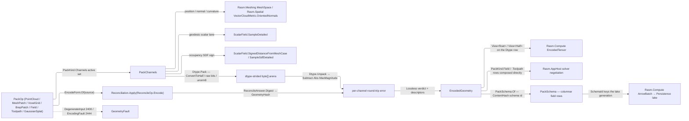

# [RASM_ENCODING_PACK]

`Rasm.Drawing` encoding folds one `PackOp` through `Encode.Apply` into a dtype-strided `EncodedGeometry`, every active channel proven against its quantization tolerance or routed as the typed fault. `ToolpathPath` retains line and circular spans, so arc centre and sense survive packing, posting, and reconciliation as content, never collapsing to sampled chords.

Compute wraps `EncodedGeometry.Payload` and its descriptors as an `EncodedTensor` residency view, and AppHost marshals the descriptor set under `EncodingKind` rows locked one-to-one onto `PackKind`.

## [01]-[INDEX]

- [02]-[ENCODING]: `PackOp` fold over its channel, dtype, and kind vocabulary into the descriptor-tiled `EncodedGeometry` with round-trip witness.
- [03]-[SCHEMA_AND_EVIDENCE]: `PackSchema` columnar schema identity, the frozen `EvidenceWire.Json` wire identity, and the `EvidenceWire` exact-hi/lo binary block.

## [02]-[ENCODING]

- Owner: `PackKind` binds each representation to its active `EncodingChannel` set, each channel composing its live kernel reader as the sole owner of its curvature, geodesic, normal, or UV field through a `[UseDelegateFromConstructor]` `Read` column no channel can omit. `ChannelDtype` owns the quantization seam — width, tolerance, the `Complex` pairing column, and the bulk pack/unpack arms — as the ONE storage-type roster the `Rasm.Element` raster sample vocabulary and the `Rasm.Materials` plane depth vocabulary seat onto; every channel writes into one descriptor-tiled byte arena carrying its round-trip proof. `Uv` stays `Float32` by law — the surface parameter domain is unbounded and a normalized dtype clamps silently while passing its own witness — and it reads the per-corner UV column the `Meshing/edit` arena publishes through its `ToSpace` freeze, so a textured `MeshPatch` travels as one payload.
- Cases: `ToolpathSpan` splits `Line` and `Arc`, the arc retaining its analytic centre and sense; the voxel sweep addresses through the `Numerics/atoms` `CellLattice`; `GaussianSplat` packs per-point scale, rotation, and SH-coefficient blocks over the SAME witness and schema identity; every `PackKind` shares one `Apply`, one `Read` column, and one witness fold.
- Entry: `Encode.Apply(PackOp, Op?)` is the ONE encoding entrypoint, discriminating by `PackOp` case on the `Fin` rail and gating `EncodedGeometry` at `key.AcceptValue`; `Encode.Of(int count, Seq<(EncodingChannel, float[])> lanes, Op?)` is its raw-lane modality — the interchange seam's mint for a decode already holding per-lane floats, running the SAME reserve/pack/witness tail with the digest rooted on the packed payload, so its witness stamps `DigestRoot.Payload` where `Apply` stamps `DigestRoot.Source`. `PackPolicy.Tolerance` sets the voxel SDF iso-band and the field-sampling floor, never a domain-local epsilon. `EncodingFault` 2444 routes a reader bind failure, a doubled raw-lane channel, an extent-versus-arity disagreement, or an unpack breaching `Dtype.Tolerance`; `DegenerateInput` 2400 routes an empty or sub-floor source; a non-digest reconcile answer routes the `Op` admission channel.
- Auto: `SourceDigest` projects a `ToolpathPath` through a canonical vertex stream, so reconciliation observes every analytic distinction rather than sampled chords.
- Receipt: `EncodedGeometry` is the `IValidityEvidence` carrier; its claim set rejects any descriptor set that gaps, overlaps, or carries a non-finite witness error, so a hand-assembled carrier fails the acceptance oracle. `View<T>` dispatches on the `Dtype` row, answering the empty view for an absent channel or a width-mismatched `T`. Structural equality is Generator.Equals-generated with `Payload` excluded: `Witness.ContentHash` keys the content under its `Witness.Root` provenance, and an `ImmutableArray<byte>` carrier swap re-types the public residency seam every wrapper composes.
- Packages: `Rasm.Meshing`, `Rasm.Spatial`, `Rasm.Processing`, `Rasm.Numerics`, `Rasm.Domain`, RhinoCommon, `System.Numerics.Tensors`, `CommunityToolkit.HighPerformance`, `Thinktecture.Runtime.Extensions`, `Generator.Equals`, `LanguageExt.Core`, and BCL inbox.
- Growth: a new modality is one `PackKind` row and one `PackOp` case; a new feature is one `EncodingChannel` row with its `Read` column; a new quantization is one `ChannelDtype` row over the SAME witness; a per-instance block descriptor is one column on `EncodingChannelDescriptor`. Zero new surface.
- Law: `EncodingLaws` is the tier-2 law matrix — descriptor tiling, per-channel recovery within `Dtype.Tolerance`, active-set equality against `PackKind.Channels`, and schema-id agreement between kind declaration and packed instance.
- Law: `BrepPatch` control-net quantization answers to the NURBS owner — any lane carrying the underlying control net ties to the `Rasm/Parametric/nurbs#NURBS_ENGINE` `NurbsForm` homogeneous SoA columns and the reconciliation `EncodeForm.Parametric` identity, whose admission gates (weights strictly positive, knots normalized) a dtype's rounding must preserve; a quantization whose round trip breaks either gate refuses at the witness rather than packing a net `Nurbs.Of` faults on re-admission.
- Boundary: one `PackOp` `[Union]` folds through `Apply` with no per-kind encoder class; reconciliation owns the content digest, so the page binds `(form, digest)` pairs and cloud, mesh, and parametric byte layouts share one digest owner rather than crossing as raw bytes; raw `float`/`byte` stay inside the pack loop, and the only public residency seam is the `Payload`/descriptor pair. Digest provenance splits TWO ways — `Apply` roots `Witness.ContentHash` on the SOURCE through the `SourceDigest` → reconciliation `EncodeForm` chain, `Of` on the PACKED PAYLOAD through `ContentHash.Of` — and no validity claim can adjudicate which is right, so `RoundTripWitness.Root` names the root and a consumer keying dedup or lake identity MUST read it: a source-rooted and a payload-rooted digest of ONE geometry differ by construction.

```csharp signature
// --- [RUNTIME_PRELUDE] --------------------------------------------------------------------
using System;
using System.Collections.Generic;
using System.Numerics.Tensors;
using System.Runtime.CompilerServices;
using System.Runtime.InteropServices;
using CommunityToolkit.HighPerformance.Buffers;
using Generator.Equals;
using LanguageExt;
using LanguageExt.Common;
using Rasm.Domain;
using Rasm.Meshing;
using Rasm.Numerics;
using Rasm.Processing;
using Rasm.Spatial;
using Rhino.Geometry;
using Thinktecture;
using static LanguageExt.Prelude;

namespace Rasm.Drawing;

// --- [TYPES] ------------------------------------------------------------------------------
// Width is the residency fact (bytes per SCALAR — a complex row's width already counts its (re, im) pair); the
// span arms are the ONE quantization seam. Generated Switch cannot carry ref-struct operands, so the
// storage-grouped if-chain IS the dispatch. The full storage roster seats the Rasm.Element RasterSampleType
// and Rasm.Materials PlaneDepth vocabularies onto this one owner: Complex is a COLUMN, never a sibling type
// family, and a complex row shares its component arm because the (re, im) interleave is the caller's layout.
// Unorm16 is the normalized row for genuinely unit-bounded raster channels — never Uv, whose surface
// parameter domain is unbounded and would clamp silently while passing its own round-trip witness.
[SmartEnum<int>]
public sealed partial class ChannelDtype {
    public static readonly ChannelDtype Float32  = new(key: 0,  width: 4,  tolerance: 0.0,           complex: false);
    public static readonly ChannelDtype Float16  = new(key: 1,  width: 2,  tolerance: 9.77e-4,       complex: false);
    public static readonly ChannelDtype Unorm8   = new(key: 2,  width: 1,  tolerance: 1.0 / 255.0,   complex: false);
    public static readonly ChannelDtype Unorm16  = new(key: 3,  width: 2,  tolerance: 1.0 / 65535.0, complex: false);
    public static readonly ChannelDtype Int8     = new(key: 4,  width: 1,  tolerance: 0.5,           complex: false);
    public static readonly ChannelDtype Int16    = new(key: 5,  width: 2,  tolerance: 0.5,           complex: false);
    public static readonly ChannelDtype UInt16   = new(key: 6,  width: 2,  tolerance: 0.5,           complex: false);
    public static readonly ChannelDtype Int32    = new(key: 7,  width: 4,  tolerance: 0.5,           complex: false);
    public static readonly ChannelDtype UInt32   = new(key: 8,  width: 4,  tolerance: 0.5,           complex: false);
    public static readonly ChannelDtype Int64    = new(key: 9,  width: 8,  tolerance: 0.5,           complex: false);
    public static readonly ChannelDtype UInt64   = new(key: 10, width: 8,  tolerance: 0.5,           complex: false);
    public static readonly ChannelDtype Float64  = new(key: 11, width: 8,  tolerance: 0.0,           complex: false);
    public static readonly ChannelDtype CInt16   = new(key: 12, width: 4,  tolerance: 0.5,           complex: true);
    public static readonly ChannelDtype CInt32   = new(key: 13, width: 8,  tolerance: 0.5,           complex: true);
    public static readonly ChannelDtype CFloat32 = new(key: 14, width: 8,  tolerance: 0.0,           complex: true);
    public static readonly ChannelDtype CFloat64 = new(key: 15, width: 16, tolerance: 0.0,           complex: true);
    // UInt8 is the RAW unsigned byte row (GDAL GDT_Byte, the dominant ortho type) — value-preserving 0..255,
    // never Unorm8's unit-scaled quantization; CFloat16 (GDT_CFloat16) shares Float16's component arms
    // exactly as CFloat32 shares Float32's.
    public static readonly ChannelDtype UInt8    = new(key: 16, width: 1,  tolerance: 0.5,           complex: false);
    public static readonly ChannelDtype CFloat16 = new(key: 17, width: 4,  tolerance: 9.77e-4,      complex: true);

    public int Width { get; }
    public double Tolerance { get; }
    public bool Complex { get; }

    // Component scalar count per logical value: a complex row stores two components per scalar slot.
    public int Components => Complex ? 2 : 1;

    // Any dtype row extending neither arm packs nothing and the witness routes 2444 — no silent fall-through.
    public void Pack(ReadOnlySpan<float> raw, Span<byte> stored) {
        if (this == Float32 || this == CFloat32) { MemoryMarshal.AsBytes(raw).CopyTo(stored); return; }
        if (this == Float16 || this == CFloat16) { TensorPrimitives.ConvertToHalf(raw, MemoryMarshal.Cast<byte, Half>(stored)); return; }
        if (this == Unorm8) { for (int i = 0; i < raw.Length; i++) stored[i] = (byte)MathF.Round(Math.Clamp(raw[i], 0f, 1f) * 255f); return; }
        if (this == UInt8) { for (int i = 0; i < raw.Length; i++) stored[i] = (byte)Math.Clamp(MathF.Round(raw[i]), byte.MinValue, byte.MaxValue); return; }
        if (this == Unorm16) { Span<ushort> u16 = MemoryMarshal.Cast<byte, ushort>(stored); for (int i = 0; i < raw.Length; i++) u16[i] = (ushort)MathF.Round(Math.Clamp(raw[i], 0f, 1f) * 65535f); return; }
        if (this == Int8) { Span<sbyte> s8 = MemoryMarshal.Cast<byte, sbyte>(stored); for (int i = 0; i < raw.Length; i++) s8[i] = (sbyte)Math.Clamp(MathF.Round(raw[i]), sbyte.MinValue, sbyte.MaxValue); return; }
        if (this == Int16 || this == CInt16) { Span<short> s16 = MemoryMarshal.Cast<byte, short>(stored); for (int i = 0; i < raw.Length; i++) s16[i] = (short)Math.Clamp(MathF.Round(raw[i]), short.MinValue, short.MaxValue); return; }
        if (this == UInt16) { Span<ushort> u16 = MemoryMarshal.Cast<byte, ushort>(stored); for (int i = 0; i < raw.Length; i++) u16[i] = (ushort)Math.Clamp(MathF.Round(raw[i]), ushort.MinValue, ushort.MaxValue); return; }
        if (this == Int32 || this == CInt32) { Span<int> s32 = MemoryMarshal.Cast<byte, int>(stored); for (int i = 0; i < raw.Length; i++) s32[i] = (int)Math.Clamp(Math.Round((double)raw[i]), int.MinValue, int.MaxValue); return; }
        if (this == UInt32) { Span<uint> u32 = MemoryMarshal.Cast<byte, uint>(stored); for (int i = 0; i < raw.Length; i++) u32[i] = (uint)Math.Clamp(Math.Round((double)raw[i]), uint.MinValue, uint.MaxValue); return; }
        if (this == Int64) { Span<long> s64 = MemoryMarshal.Cast<byte, long>(stored); for (int i = 0; i < raw.Length; i++) s64[i] = (long)Math.Clamp(Math.Round((double)raw[i]), long.MinValue, long.MaxValue); return; }
        if (this == UInt64) { Span<ulong> u64 = MemoryMarshal.Cast<byte, ulong>(stored); for (int i = 0; i < raw.Length; i++) u64[i] = (ulong)Math.Clamp(Math.Round((double)raw[i]), ulong.MinValue, ulong.MaxValue); return; }
        if (this == Float64 || this == CFloat64) { Span<double> f64 = MemoryMarshal.Cast<byte, double>(stored); for (int i = 0; i < raw.Length; i++) f64[i] = raw[i]; }
    }

    public void Unpack(ReadOnlySpan<byte> stored, Span<float> restored) {
        if (this == Float32 || this == CFloat32) { MemoryMarshal.Cast<byte, float>(stored).CopyTo(restored); return; }
        if (this == Float16 || this == CFloat16) { TensorPrimitives.ConvertToSingle(MemoryMarshal.Cast<byte, Half>(stored), restored); return; }
        if (this == Unorm8) { for (int i = 0; i < stored.Length; i++) restored[i] = stored[i] / 255f; return; }
        if (this == UInt8) { for (int i = 0; i < stored.Length; i++) restored[i] = stored[i]; return; }
        if (this == Unorm16) { ReadOnlySpan<ushort> u16 = MemoryMarshal.Cast<byte, ushort>(stored); for (int i = 0; i < u16.Length; i++) restored[i] = u16[i] / 65535f; return; }
        if (this == Int8) { ReadOnlySpan<sbyte> s8 = MemoryMarshal.Cast<byte, sbyte>(stored); for (int i = 0; i < s8.Length; i++) restored[i] = s8[i]; return; }
        if (this == Int16 || this == CInt16) { ReadOnlySpan<short> s16 = MemoryMarshal.Cast<byte, short>(stored); for (int i = 0; i < s16.Length; i++) restored[i] = s16[i]; return; }
        if (this == UInt16) { ReadOnlySpan<ushort> u16 = MemoryMarshal.Cast<byte, ushort>(stored); for (int i = 0; i < u16.Length; i++) restored[i] = u16[i]; return; }
        if (this == Int32 || this == CInt32) { ReadOnlySpan<int> s32 = MemoryMarshal.Cast<byte, int>(stored); for (int i = 0; i < s32.Length; i++) restored[i] = s32[i]; return; }
        if (this == UInt32) { ReadOnlySpan<uint> u32 = MemoryMarshal.Cast<byte, uint>(stored); for (int i = 0; i < u32.Length; i++) restored[i] = u32[i]; return; }
        if (this == Int64) { ReadOnlySpan<long> s64 = MemoryMarshal.Cast<byte, long>(stored); for (int i = 0; i < s64.Length; i++) restored[i] = s64[i]; return; }
        if (this == UInt64) { ReadOnlySpan<ulong> u64 = MemoryMarshal.Cast<byte, ulong>(stored); for (int i = 0; i < u64.Length; i++) restored[i] = u64[i]; return; }
        if (this == Float64 || this == CFloat64) { ReadOnlySpan<double> f64 = MemoryMarshal.Cast<byte, double>(stored); for (int i = 0; i < f64.Length; i++) restored[i] = (float)f64[i]; }
    }
}

// Digest provenance discriminant: Apply roots ContentHash on the SOURCE (SourceDigest → reconciliation
// EncodeForm chain), Of on the PACKED PAYLOAD (ContentHash.Of over the arena). One geometry therefore keys
// TWO different digests by construction, and the carrier cannot adjudicate which is right — so the witness
// names its root and a dedup or lake-identity consumer dispatches on it instead of assuming one chain.
[SmartEnum<int>]
public sealed partial class DigestRoot {
    public static readonly DigestRoot Source  = new(0);
    public static readonly DigestRoot Payload = new(1);
}

[SmartEnum<string>]
[KeyMemberEqualityComparer<ComparerAccessors.StringOrdinal, string>]
[KeyMemberComparer<ComparerAccessors.StringOrdinal, string>]
public sealed partial class EncodingChannel {
    public static readonly EncodingChannel Position  = new("position",   arity: 3, dtype: ChannelDtype.Float32, read: static (op, _) => Encode.ReadPosition(op));
    public static readonly EncodingChannel Normal    = new("normal",     arity: 3, dtype: ChannelDtype.Float32, read: Encode.ReadNormal);
    public static readonly EncodingChannel ColorRgba = new("color-rgba", arity: 4, dtype: ChannelDtype.Unorm8,  read: static (op, _) => Encode.ReadColor(op));
    public static readonly EncodingChannel Curvature = new("curvature",  arity: 1, dtype: ChannelDtype.Float16, read: Encode.ReadCurvature);
    public static readonly EncodingChannel Geodesic  = new("geodesic",   arity: 1, dtype: ChannelDtype.Float16, read: Encode.ReadGeodesic);
    public static readonly EncodingChannel Intensity = new("intensity",  arity: 1, dtype: ChannelDtype.Float16, read: Encode.ReadIntensity);
    public static readonly EncodingChannel Occupancy = new("occupancy",  arity: 1, dtype: ChannelDtype.Float16, read: Encode.ReadOccupancy);
    public static readonly EncodingChannel Weight    = new("weight",     arity: 1, dtype: ChannelDtype.Float16, read: static (op, _) => Encode.ReadWeight(op));
    public static readonly EncodingChannel ArcCenter = new("arc-center", arity: 3, dtype: ChannelDtype.Float32, read: static (op, _) => Encode.ReadArcCenter(op));
    public static readonly EncodingChannel ArcSense  = new("arc-sense",  arity: 1, dtype: ChannelDtype.Float32, read: static (op, _) => Encode.ReadArcSense(op));
    // Uv is Float32 BY LAW: UvTessellation.Uv and PanelField.Uv carry the unbounded surface parameter domain,
    // and a normalized dtype would clamp a real parameter while passing its own round-trip witness.
    public static readonly EncodingChannel Uv        = new("uv",         arity: 2, dtype: ChannelDtype.Float32, read: static (op, _) => Encode.ReadUv(op));
    // Gaussian-splat capture feature set: per-point anisotropic scale, rotation quaternion, and the SH3
    // color coefficient block (16 coefficients x 3 channels); a different SH degree is a per-instance block
    // descriptor column per the growth law, never a second harmonic channel.
    public static readonly EncodingChannel Scale     = new("scale",      arity: 3,  dtype: ChannelDtype.Float32, read: static (op, _) => Encode.ReadScale(op));
    public static readonly EncodingChannel Rotation  = new("rotation",   arity: 4,  dtype: ChannelDtype.Float32, read: static (op, _) => Encode.ReadRotation(op));
    public static readonly EncodingChannel Harmonic  = new("harmonic",   arity: 48, dtype: ChannelDtype.Float16, read: static (op, _) => Encode.ReadHarmonic(op));

    public int Arity { get; }
    public ChannelDtype Dtype { get; }

    [UseDelegateFromConstructor] internal partial Fin<float[]> Read(PackOp op, Op key);
}

// Channels IS the active set; the field row rides the mesh the content digest binds (no position dup).
[SmartEnum<string>]
[KeyMemberEqualityComparer<ComparerAccessors.StringOrdinal, string>]
[KeyMemberComparer<ComparerAccessors.StringOrdinal, string>]
public sealed partial class PackKind {
    public static readonly PackKind PointCloud = new("point-cloud", Seq(EncodingChannel.Position, EncodingChannel.Normal, EncodingChannel.ColorRgba, EncodingChannel.Intensity));
    public static readonly PackKind MeshPatch  = new("mesh-patch",  Seq(EncodingChannel.Position, EncodingChannel.Normal, EncodingChannel.Uv, EncodingChannel.Curvature, EncodingChannel.Geodesic, EncodingChannel.Weight));
    public static readonly PackKind VoxelGrid  = new("voxel-grid",  Seq(EncodingChannel.Position, EncodingChannel.Occupancy, EncodingChannel.Weight));
    public static readonly PackKind BrepPatch  = new("brep-patch",  Seq(EncodingChannel.Position, EncodingChannel.Normal, EncodingChannel.Curvature));
    public static readonly PackKind Field      = new("field",       Seq(EncodingChannel.Geodesic, EncodingChannel.Weight));
    public static readonly PackKind Toolpath   = new("toolpath",    Seq(EncodingChannel.Position, EncodingChannel.ArcCenter, EncodingChannel.ArcSense, EncodingChannel.Weight));
    // Gaussian-splat capture rides the SAME witness, descriptor arena, and schema identity as every kind — the
    // modality Compute residency (ResidencyStream) and AppUi reality consume with no second vocabulary.
    public static readonly PackKind GaussianSplat = new("gaussian-splat", Seq(EncodingChannel.Position, EncodingChannel.Scale, EncodingChannel.Rotation, EncodingChannel.ColorRgba, EncodingChannel.Harmonic, EncodingChannel.Weight));

    public Seq<EncodingChannel> Channels { get; }
}

// --- [CONSTANTS] -------------------------------------------------------------------------- The
// voxel sweep addresses through the Numerics/atoms CellLattice — the one bounded rectangular cell
// lattice; a page-local grid re-deriving anisotropic cell scale per call was the deleted fourth mint.

// Cloud defaults through its own AdmitOrDefault on None.
public sealed record PackPolicy(
    Seq<int> GeodesicSources, double CurvatureTimeStep, int CurvatureIterations,
    SdfMeshPolicy Sdf, Option<CloudMetricPolicy> Cloud, Context Tolerance) {
    public static Fin<PackPolicy> Of(
        Context tolerance, SdfMeshPolicy sdf, Seq<int> geodesicSources = default,
        Option<CloudMetricPolicy> cloud = default, double curvatureTimeStep = 1e-3, int curvatureIterations = 1, Op? key = null) =>
        guard(curvatureTimeStep > 0.0 && curvatureIterations > 0, key.OrDefault().InvalidInput()).ToFin()
            .Map(_ => new PackPolicy(geodesicSources, curvatureTimeStep, curvatureIterations, sdf, cloud, tolerance));
}

// --- [MODELS] -----------------------------------------------------------------------------
public sealed record EncodingChannelDescriptor(EncodingChannel Channel, int Count, int ByteOffset, ChannelDtype Dtype) {
    public int Floats => Count * Channel.Arity;
    public int Bytes => Floats * Dtype.Width;
}

// Root rides beside the digest because ContentHash alone is ambiguous currency: both mint sites set it —
// Witness stamps Source, PayloadWitness stamps Payload — and no consumer re-derives the provenance.
public sealed record RoundTripWitness(GeometryHash ContentHash, DigestRoot Root, HashMap<string, double> ChannelError, bool Lossless) {
    public static RoundTripWitness Of(GeometryHash digest, DigestRoot root, Seq<(EncodingChannel Channel, double Error)> errors) =>
        new(digest, root,
            errors.Fold(HashMap<string, double>(), static (acc, e) => acc.Add(e.Channel.Key, e.Error)),
            errors.ForAll(static e => e.Error <= e.Channel.Dtype.Tolerance));
}

// Payload leaves equality by law: ReadOnlyMemory compares by buffer coordinates, and Witness.ContentHash keys the content under its Root provenance.
[Equatable]
public sealed partial record EncodedGeometry(
    Seq<EncodingChannelDescriptor> Descriptors, [property: IgnoreEquality] ReadOnlyMemory<byte> Payload, int Count, RoundTripWitness Witness) : IValidityEvidence {

    public bool IsValid => ValidityClaim.All(
        ValidityClaim.CountAtLeast(count: Count, floor: 1),
        ValidityClaim.Of(Witness.Lossless),
        ValidityClaim.Of(Descriptors.Map(static d => d.Channel.Key).Distinct().Count == Descriptors.Count),
        ValidityClaim.CountExactly(count: Witness.ChannelError.Count, expected: Descriptors.Count),
        ValidityClaim.Of(Descriptors.ForAll(static d =>
            (long)d.Count * d.Channel.Arity * d.Dtype.Width is > 0 and <= int.MaxValue)),
        ValidityClaim.Of(Descriptors.Fold((Offset: 0L, Holds: true), static (acc, d) => {
            long bytes = (long)d.Count * d.Channel.Arity * d.Dtype.Width;
            return (acc.Offset + bytes,
                acc.Holds && d.ByteOffset == acc.Offset && d.Count == Count && d.Dtype == d.Channel.Dtype);
        }) is var tile
            && tile.Holds && tile.Offset == Payload.Length),
        ValidityClaim.Of(Witness.ChannelError.Values.AsIterable().ForAll(static error => double.IsFinite(error) && error >= 0.0)),
        ValidityClaim.Of(Descriptors.ForAll(d => Witness.ChannelError.Find(d.Channel.Key).Match(
            Some: error => double.IsFinite(error) && error >= 0.0 && error <= d.Channel.Dtype.Tolerance,
            None: static () => false))));

    public ReadOnlyMemory<byte> Channel(EncodingChannel channel) =>
        Descriptors.Find(d => d.Channel == channel)
            .Match(Some: d => Payload.Slice(d.ByteOffset, d.Bytes), None: static () => ReadOnlyMemory<byte>.Empty);

    // Dtype row names the one legal T: float32→float · float16→Half · unorm8→byte, over [Count × Arity].
    public ReadOnlyTensorSpan<T> View<T>(EncodingChannel channel) where T : unmanaged {
        if (Descriptors.Find(d => d.Channel == channel).Case is not EncodingChannelDescriptor found || Unsafe.SizeOf<T>() != found.Dtype.Width)
            return default;
        ReadOnlySpan<T> cast = MemoryMarshal.Cast<byte, T>(Payload.Span.Slice(found.ByteOffset, found.Bytes));
        return TensorMarshal.CreateReadOnlyTensorSpan(
            ref MemoryMarshal.GetReference(cast), cast.Length, lengths: [found.Count, found.Channel.Arity], strides: [], pinned: false);
    }
}

// Reserve sums count·arity·width per active channel — the residency arithmetic lives on the descriptor row.
public sealed record EncodedStore(int Count, byte[] Payload, EncodingChannelDescriptor[] Descriptors) {
    public static EncodedStore Reserve(int count, Seq<EncodingChannel> channels) =>
        new(count, new byte[channels.Fold(0, (acc, c) => acc + (count * c.Arity * c.Dtype.Width))], new EncodingChannelDescriptor[channels.Count]);
}

public sealed record PackedChannels(EncodedStore Store, (EncodingChannel Channel, float[] Raw)[] Raws);

[SmartEnum<int>]
public sealed partial class ToolpathArcSense {
    public static readonly ToolpathArcSense Clockwise = new(-1);
    public static readonly ToolpathArcSense Counterclockwise = new(1);
}

[Union(ConversionFromValue = ConversionOperatorsGeneration.None)]
public abstract partial record ToolpathSpan {
    private ToolpathSpan() { }

    public sealed record Line(Point3d Target) : ToolpathSpan;
    public sealed record Arc(Point3d Target, Point3d Center, ToolpathArcSense Sense) : ToolpathSpan;

    public Point3d Target => Switch(
        line: static span => span.Target,
        arc: static span => span.Target);
}

public sealed record ToolpathPath(Point3d Start, Seq<ToolpathSpan> Spans) {
    public Seq<Point3d> Vertices => Start.Cons(Spans.Map(static span => span.Target));
    public Seq<Point3d> CanonicalVertices => Spans.Fold(Seq(Start), static (stream, span) => span.Switch(
        state: stream,
        line: static (state, row) => state.Add(row.Target).Add(row.Target).Add(Point3d.Origin),
        arc: static (state, row) => state.Add(row.Target).Add(row.Center).Add(new Point3d(row.Sense.Key, 0.0, 0.0))));
}

// --- [OPERATIONS] -------------------------------------------------------------------------
[Union(ConversionFromValue = ConversionOperatorsGeneration.None)]
public abstract partial record PackOp {
    private PackOp() { }

    public sealed record PointCloud(VectorCloud.ClusterCase Source, PackPolicy Policy) : PackOp;
    public sealed record MeshPatch(MeshSpace Source, PackPolicy Policy) : PackOp;
    public sealed record VoxelGrid(MeshSpace Source, CellLattice Grid, PackPolicy Policy) : PackOp;
    public sealed record BrepPatch(MeshSpace Source, PackPolicy Policy) : PackOp;
    public sealed record Field(MeshSpace Source, ScalarField Values, PackPolicy Policy) : PackOp;
    public sealed record Toolpath(ToolpathPath Source, PackPolicy Policy) : PackOp;
    // Splat attributes arrive per point beside the cluster: lengths validate against the source count at the
    // reader, so a torn attribute set routes 2444 instead of packing a misaligned block.
    public sealed record GaussianSplat(VectorCloud.ClusterCase Source, Arr<float> Scales, Arr<float> Rotations, Arr<float> Harmonics, PackPolicy Policy) : PackOp;

    public PackKind Kind =>
        Switch(
            pointCloud: static _ => PackKind.PointCloud,
            meshPatch:  static _ => PackKind.MeshPatch,
            voxelGrid:  static _ => PackKind.VoxelGrid,
            brepPatch:  static _ => PackKind.BrepPatch,
            field:      static _ => PackKind.Field,
            toolpath:   static _ => PackKind.Toolpath,
            gaussianSplat: static _ => PackKind.GaussianSplat);

    internal PackPolicy Policy =>
        Switch(
            pointCloud: static p => p.Policy, meshPatch: static m => m.Policy, voxelGrid: static v => v.Policy,
            brepPatch:  static b => b.Policy, field:     static f => f.Policy, toolpath:  static t => t.Policy,
            gaussianSplat: static g => g.Policy);
}

public static class Encode {
    public static Fin<EncodedGeometry> Apply(PackOp op, Op? key = null) {
        Op k = key.OrDefault();
        return ElementCount(op)
            .Bind(count => PackChannels(op, op.Kind, count, k)
                .Bind(packed => Witness(op, packed, k)
                    .Map(witness => new EncodedGeometry(packed.Store.Descriptors.ToSeq(), packed.Store.Payload, packed.Store.Count, witness))))
            .Bind(geometry => k.AcceptValue(geometry));
    }

    // Raw-lane mint — the interchange seam's entry: a decode already holding per-lane floats (the Element
    // ImportedGeometry producer) reserves, packs, and witnesses through the SAME tail Apply runs once
    // PackChannels has produced its Raws, so a decoded arena and a kernel-packed one mint identically; the
    // digest folds the packed payload itself because a foreign decode carries no kernel EncodeForm source.
    public static Fin<EncodedGeometry> Of(int count, Seq<(EncodingChannel Channel, float[] Raw)> lanes, Op? key = null) {
        Op k = key.OrDefault();
        if (count <= 0 || lanes.IsEmpty) return Fin.Fail<EncodedGeometry>(k.InvalidInput());
        // Foreign lanes are caller-shaped where Apply's channels are declaration rosters, so the doubled-channel
        // lane refuses HERE: the witness keys per-channel error by channel, and a duplicate would otherwise
        // throw at that persistent map Add instead of routing 2444.
        Option<EncodingChannel> doubled = lanes.Fold(
            (Seen: Set<string>.Empty, Dup: Option<EncodingChannel>.None),
            static (acc, lane) => acc.Seen.Contains(lane.Channel.Key)
                ? (acc.Seen, acc.Dup.IsNone ? Some(lane.Channel) : acc.Dup)
                : (acc.Seen.Add(lane.Channel.Key), acc.Dup)).Dup;
        if (doubled.Case is EncodingChannel dup) {
            return Fin.Fail<EncodedGeometry>(new GeometryFault.EncodingFault(
                dup, dup.Dtype, $"duplicate channel {dup.Key}").ToError());
        }
        long bytes = lanes.Fold(0L, (extent, lane) => extent + ((long)count * lane.Channel.Arity * lane.Channel.Dtype.Width));
        if (bytes > Array.MaxLength) {
            EncodingChannel channel = lanes[0].Channel;
            return Fin.Fail<EncodedGeometry>(new GeometryFault.EncodingFault(
                channel, channel.Dtype, $"payload extent {bytes} exceeds {Array.MaxLength}").ToError());
        }
        EncodedStore store = EncodedStore.Reserve(count, lanes.Map(static lane => lane.Channel));
        List<(EncodingChannel Channel, float[] Raw)> raws = new(lanes.Count);
        return lanes.Fold(Fin.Succ((slot: 0, offset: 0)), (state, lane) =>
                state.Bind(s => lane.Raw.Length == count * lane.Channel.Arity
                    ? Fin.Succ(WriteChannel(store, s.slot, s.offset, lane.Channel, count, lane.Raw, raws))
                    : Fin.Fail<(int, int)>(new GeometryFault.EncodingFault(
                        lane.Channel, lane.Channel.Dtype, $"arity {lane.Raw.Length} != {count * lane.Channel.Arity}").ToError())))
            .Map(_ => new PackedChannels(store, raws.ToArray()))
            .Bind(packed => PayloadWitness(packed).Map(witness =>
                new EncodedGeometry(packed.Store.Descriptors.ToSeq(), packed.Store.Payload, packed.Store.Count, witness)))
            .Bind(geometry => k.AcceptValue(geometry));
    }

    // Payload-rooted witness for the raw-lane mint: the ONE round-trip screen, the digest the seed-zero
    // content key over the packed payload, stamped DigestRoot.Payload so the carrier says so.
    static Fin<RoundTripWitness> PayloadWitness(PackedChannels packed) =>
        Screened(packed, GeometryHash.Create(ContentHash.Of(packed.Store.Payload)), DigestRoot.Payload);

    // --- [PACK]
    static Fin<PackedChannels> PackChannels(PackOp op, PackKind kind, int count, Op key) {
        long bytes = kind.Channels.Fold(0L, static (extent, channel) =>
            extent + ((long)count * channel.Arity * channel.Dtype.Width));
        if (bytes > Array.MaxLength) {
            EncodingChannel channel = kind.Channels[0];
            return Fin.Fail<PackedChannels>(new GeometryFault.EncodingFault(
                channel, channel.Dtype, $"payload extent {bytes} exceeds {Array.MaxLength}").ToError());
        }
        EncodedStore store = EncodedStore.Reserve(count, kind.Channels);
        List<(EncodingChannel Channel, float[] Raw)> raws = new(kind.Channels.Count);
        return kind.Channels.Fold(Fin.Succ((slot: 0, offset: 0)), (state, channel) =>
                state.Bind(s => channel.Read(op, key).Bind(raw =>
                    raw.Length == count * channel.Arity
                        ? Fin.Succ(WriteChannel(store, s.slot, s.offset, channel, count, raw, raws))
                        : Fin.Fail<(int, int)>(new GeometryFault.EncodingFault(
                            channel, channel.Dtype, $"arity {raw.Length} != {count * channel.Arity}").ToError()))))
            .Map(_ => new PackedChannels(store, raws.ToArray()));
    }

    static (int Slot, int Offset) WriteChannel(EncodedStore store, int slot, int offset, EncodingChannel channel, int count, float[] raw, List<(EncodingChannel, float[])> raws) {
        EncodingChannelDescriptor descriptor = new(channel, count, offset, channel.Dtype);
        channel.Dtype.Pack(raw, store.Payload.AsSpan(offset, descriptor.Bytes));
        store.Descriptors[slot] = descriptor;
        raws.Add((channel, raw));
        return (slot + 1, offset + descriptor.Bytes);
    }

    // --- [WITNESS]
    // Source-rooted digest chain: EncodeForm.Of(source) → Reconciliation.Apply(Encode) → ReconcileAnswer.Digest,
    // stamped DigestRoot.Source; reconciliation solely owns the canonical byte layouts. The raw-lane mint's
    // PayloadWitness is the OTHER root. Error reduce = Subtract·Abs·MaxMagnitude, scale-relative.
    static Fin<RoundTripWitness> Witness(PackOp op, PackedChannels packed, Op key) =>
        SourceDigest(op, key).Bind(digest => Screened(packed, digest, DigestRoot.Source));

    // Screened is the ONE round-trip screen both digest roots share — per-channel error against
    // Dtype.Tolerance, the first breach routing 2444, the clean set folding into the witness under the root
    // the mint stamps.
    static Fin<RoundTripWitness> Screened(PackedChannels packed, GeometryHash digest, DigestRoot root) {
        Seq<(EncodingChannel Channel, double Error)> errors = toSeq(packed.Raws).Map(row => {
            EncodingChannelDescriptor descriptor = System.Array.Find(packed.Store.Descriptors, d => d.Channel == row.Channel)!;
            return (row.Channel, ChannelError(row.Raw, packed.Store.Payload.AsSpan(descriptor.ByteOffset, descriptor.Bytes), row.Channel.Dtype));
        });
        return errors.Find(e => e.Error > e.Channel.Dtype.Tolerance).Match(
            Some: breach => Fin.Fail<RoundTripWitness>(new GeometryFault.EncodingFault(
                breach.Channel, breach.Channel.Dtype, $"round-trip {breach.Error:e3} > {breach.Channel.Dtype.Tolerance:e3}").ToError()),
            None: () => Fin.Succ(RoundTripWitness.Of(digest, root, errors)));
    }

    // Dtype tolerances are RELATIVE precision facts, so the max delta divides by max(1, ‖raw‖∞) — an
    // absolute bound would fault every real-scale channel above magnitude one; an infinite delta stays loud.
    static double ChannelError(float[] raw, ReadOnlySpan<byte> stored, ChannelDtype dtype) {
        using SpanOwner<float> staging = SpanOwner<float>.Allocate(raw.Length);
        Span<float> restored = staging.Span;
        dtype.Unpack(stored, restored);
        TensorPrimitives.Subtract<float>(restored, raw, restored);
        TensorPrimitives.Abs<float>(restored, restored);
        return TensorPrimitives.MaxMagnitude<float>(restored) / Math.Max(1f, TensorPrimitives.MaxMagnitude<float>(raw));
    }

    // The generated total Switch, never a raw `op switch` with a `_` tail: under the tail the newest PackKind
    // fell through to InvalidResult, so a splat could never mint an EncodedGeometry and nothing broke the build.
    static Fin<GeometryHash> SourceDigest(PackOp op, Op key) => op.Switch(
        state: key,
        pointCloud:    static (k, s) => Digest(EncodeForm.Of(s.Source), k),
        meshPatch:     static (k, s) => Digest(EncodeForm.Of(s.Source), k),
        voxelGrid:     static (k, s) => Digest(EncodeForm.Of(s.Source), k),
        brepPatch:     static (k, s) => Digest(EncodeForm.Of(s.Source), k),
        field:         static (k, s) => Digest(EncodeForm.Of(s.Source), k),
        toolpath:      static (k, s) => VectorCloud.Polyline(s.Source.CanonicalVertices, s.Policy.Tolerance, k)
            .Bind(cloud => Digest(EncodeForm.Of(cloud), k)),
        gaussianSplat: static (k, s) => Digest(EncodeForm.Of(s.Source), k));

    static Fin<GeometryHash> Digest(EncodeForm form, Op key) =>
        Reconciliation.Apply(new ReconcileOp.Encode(form), key)
            .Bind(answer => answer is ReconcileAnswer.Digest digest
                ? Fin.Succ(digest.Value)
                : Fin.Fail<GeometryHash>(key.InvalidResult()));

    // --- [READERS]
    static Fin<int> ElementCount(PackOp op) => op.Switch(
        pointCloud: static c => Elements(c.Source.Vertices.Count, 1, Kind.PointCloud),
        meshPatch:  static m => MeshVertexCount(m.Source),
        // Lattice ceiling gates the census at admission; the int narrowing is re-proven here because the
        // descriptor arena's byte extents are int-bounded by its own validity claims.
        voxelGrid:  static v => v.Grid.CellCount <= int.MaxValue
            ? Elements((int)v.Grid.CellCount, 1, Kind.BoundingBox)
            : Fin.Fail<int>(new GeometryFault.DegenerateInput(Kind.BoundingBox, None, "cell-census-over-int").ToError()),
        brepPatch:  static b => MeshVertexCount(b.Source),
        field:      static f => MeshVertexCount(f.Source),
        toolpath:   static t => Elements(t.Source.Vertices.Count, 2, Kind.Polyline),
        gaussianSplat: static g => Elements(g.Source.Vertices.Count, 1, Kind.PointCloud));

    static Fin<int> Elements(int count, int floor, Kind kind) =>
        count >= floor
            ? Fin.Succ(count)
            : Fin.Fail<int>(new GeometryFault.DegenerateInput(kind, None, $"under {floor} elements").ToError());

    static Fin<int> MeshVertexCount(MeshSpace space) => Elements(space.Native.Vertices.Count, 1, Kind.Mesh);

    internal static Fin<float[]> ReadPosition(PackOp op) =>
        op switch {
            PackOp.PointCloud c    => Fin.Succ(PackPoints(c.Source.Vertices)),
            PackOp.Toolpath t      => Fin.Succ(PackPoints(t.Source.Vertices)),
            PackOp.VoxelGrid v     => Fin.Succ(PackCells(v.Grid)),
            PackOp.MeshPatch m     => Fin.Succ(PackVertices(m.Source)),
            PackOp.BrepPatch b     => Fin.Succ(PackVertices(b.Source)),
            PackOp.GaussianSplat g => Fin.Succ(PackPoints(g.Source.Vertices)),
            _                      => NoReader(EncodingChannel.Position, op),
        };

    internal static Fin<float[]> ReadNormal(PackOp op, Op key) =>
        op switch {
            PackOp.PointCloud c => OrientedNormals(c.Source, c.Policy, key).Map(PackVectors),
            PackOp.MeshPatch m  => Fin.Succ(PackNormals(m.Source)),
            PackOp.BrepPatch b  => Fin.Succ(PackNormals(b.Source)),
            _                   => NoReader(EncodingChannel.Normal, op),
        };

    internal static Fin<float[]> ReadColor(PackOp op) =>
        op switch {
            PackOp.PointCloud c    => Fin.Succ(PackColors(c.Source)),
            PackOp.GaussianSplat g => Fin.Succ(PackColors(g.Source)),
            _                      => NoReader(EncodingChannel.ColorRgba, op),
        };

    // Reads the per-corner UV column the Meshing/edit arena publishes through its ToSpace freeze; a mesh
    // without the column REFUSES — a fabricated (0,0) UV plane would pass the round-trip witness trivially.
    internal static Fin<float[]> ReadUv(PackOp op) =>
        op is PackOp.MeshPatch m
            ? m.Source.Native.TextureCoordinates.Count == m.Source.Native.Vertices.Count
                ? Fin.Succ(PackUvs(m.Source))
                : NoReader(EncodingChannel.Uv, op)
            : NoReader(EncodingChannel.Uv, op);

    // Splat attribute readers validate length against the source census, so a torn block routes 2444.
    internal static Fin<float[]> ReadScale(PackOp op) =>
        op is PackOp.GaussianSplat g && g.Scales.Count == g.Source.Vertices.Count * EncodingChannel.Scale.Arity
            ? Fin.Succ(g.Scales.ToArray())
            : NoReader(EncodingChannel.Scale, op);

    internal static Fin<float[]> ReadRotation(PackOp op) =>
        op is PackOp.GaussianSplat g && g.Rotations.Count == g.Source.Vertices.Count * EncodingChannel.Rotation.Arity
            ? Fin.Succ(g.Rotations.ToArray())
            : NoReader(EncodingChannel.Rotation, op);

    internal static Fin<float[]> ReadHarmonic(PackOp op) =>
        op is PackOp.GaussianSplat g && g.Harmonics.Count == g.Source.Vertices.Count * EncodingChannel.Harmonic.Arity
            ? Fin.Succ(g.Harmonics.ToArray())
            : NoReader(EncodingChannel.Harmonic, op);

    internal static Fin<float[]> ReadCurvature(PackOp op, Op key) =>
        op switch {
            PackOp.MeshPatch m => MeshScalarField(ScalarField.MeanCurvatureFlow(m.Source, m.Policy.CurvatureTimeStep, m.Policy.CurvatureIterations, key), m.Source, m.Policy.Tolerance, key),
            PackOp.BrepPatch b => MeshScalarField(ScalarField.MeanCurvatureFlow(b.Source, b.Policy.CurvatureTimeStep, b.Policy.CurvatureIterations, key), b.Source, b.Policy.Tolerance, key),
            _                  => NoReader(EncodingChannel.Curvature, op),
        };

    // Geodesic is the per-vertex scalar LANE: mesh patch binds the heat-geodesic field, field pack its ScalarField.
    internal static Fin<float[]> ReadGeodesic(PackOp op, Op key) =>
        op switch {
            PackOp.MeshPatch m => MeshScalarField(ScalarField.Geodesic(m.Source, m.Policy.GeodesicSources, key), m.Source, m.Policy.Tolerance, key),
            PackOp.Field f     => MeshScalarField(Fin.Succ(f.Values), f.Source, f.Policy.Tolerance, key),
            _                  => NoReader(EncodingChannel.Geodesic, op),
        };

    internal static Fin<float[]> ReadIntensity(PackOp op, Op key) =>
        op is PackOp.PointCloud c
            ? OrientedNormals(c.Source, c.Policy, key).Map(NormalConsistency)
            : NoReader(EncodingChannel.Intensity, op);

    // SignedDistanceFromMeshCase admits only vetted payloads by direct case construction; raw-ingress
    // siblings (MeanCurvatureFlow) go through their Fin factory.
    internal static Fin<float[]> ReadOccupancy(PackOp op, Op key) =>
        op is PackOp.VoxelGrid v
            ? GridOccupancy(new ScalarField.SignedDistanceFromMeshCase(Space: v.Source, Policy: v.Policy.Sdf), v.Grid, v.Policy.Tolerance, key)
            : NoReader(EncodingChannel.Occupancy, op);

    internal static Fin<float[]> ReadWeight(PackOp op) =>
        op switch {
            PackOp.MeshPatch m     => Fin.Succ(VertexAreaWeight(m.Source)),
            PackOp.Field f         => Fin.Succ(VertexAreaWeight(f.Source)),
            PackOp.VoxelGrid v     => Fin.Succ(Fill((int)v.Grid.CellCount, 1f)),
            PackOp.Toolpath t      => Fin.Succ(ChordWeight(t.Source.Vertices)),
            PackOp.GaussianSplat g => Fin.Succ(Fill(g.Source.Vertices.Count, 1f)),
            _                      => NoReader(EncodingChannel.Weight, op),
        };

    internal static Fin<float[]> ReadArcCenter(PackOp op) => op is PackOp.Toolpath toolpath
        ? Fin.Succ(PackPoints(toolpath.Source.Start.Cons(toolpath.Source.Spans.Map(static span => span.Switch(
            line: static row => row.Target,
            arc: static row => row.Center)))))
        : NoReader(EncodingChannel.ArcCenter, op);

    internal static Fin<float[]> ReadArcSense(PackOp op) => op is PackOp.Toolpath toolpath
        ? Fin.Succ(0f.Cons(toolpath.Source.Spans.Map(static span => span.Switch(
                line: static _ => 0f,
                arc: static row => (float)row.Sense.Key))).ToArray())
        : NoReader(EncodingChannel.ArcSense, op);

    static Fin<float[]> NoReader(EncodingChannel channel, PackOp op) =>
        Fin.Fail<float[]>(new GeometryFault.EncodingFault(channel, channel.Dtype, $"no reader for {op.Kind.Key}").ToError());

    // --- [PROJECTIONS]
    static Fin<Vector3d[]> OrientedNormals(VectorCloud.ClusterCase cloud, PackPolicy policy, Op key) =>
        VectorIntent.Cloud(cloud, VectorCloudMetric.OrientedNormals, policy.Cloud, key)
            .Bind(intent => intent.Project<Seq<Vector3d>>(policy.Tolerance, key))
            .Map(static seq => seq.ToArray());

    static Fin<float[]> MeshScalarField(Fin<ScalarField> built, MeshSpace space, Context tolerance, Op key) =>
        built.Bind(field => {
            Mesh native = space.Native;
            float[] values = new float[native.Vertices.Count];
            for (int i = 0; i < values.Length; i++) {
                Fin<FieldSample> sample = field.SampleDetailed(native.Vertices.Point3dAt(i), tolerance, key);
                if (sample.IsFail) return sample.Map(static _ => System.Array.Empty<float>());
                values[i] = (float)sample.IfFail(static _ => default).Value;
            }
            return Fin.Succ(values);
        });

    static Fin<float[]> GridOccupancy(ScalarField field, CellLattice grid, Context tolerance, Op key) {
        float[] values = new float[(int)grid.CellCount];
        for (int i = 0; i < values.Length; i++) {
            (int column, int row, int layer) = grid.Coordinate(i);
            Fin<SdfSample> sample = field.SampleSdfDetailed(grid.Center(column: column, row: row, layer: layer), tolerance, key);
            if (sample.IsFail) return sample.Map(static _ => System.Array.Empty<float>());
            values[i] = sample.IfFail(static _ => default).Value <= 0.0 ? 1f : 0f;
        }
        return Fin.Succ(values);
    }

    static float[] NormalConsistency(Vector3d[] normals) {
        float[] values = new float[normals.Length];
        for (int i = 0; i < normals.Length; i++) values[i] = (float)Math.Abs(normals[i].Z);
        return values;
    }

    static float[] VertexAreaWeight(MeshSpace space) {
        Mesh native = space.Native;
        float[] weight = new float[native.Vertices.Count];
        for (int face = 0; face < native.Faces.Count; face++) {
            MeshFace mf = native.Faces[face];
            Point3d a = native.Vertices.Point3dAt(mf.A), b = native.Vertices.Point3dAt(mf.B), c = native.Vertices.Point3dAt(mf.C);
            float abc = (float)(0.5 * Vector3d.CrossProduct(b - a, c - a).Length / 3.0);
            weight[mf.A] += abc; weight[mf.B] += abc; weight[mf.C] += abc;
            if (mf.IsQuad) {
                Point3d d = native.Vertices.Point3dAt(mf.D);
                float acd = (float)(0.5 * Vector3d.CrossProduct(c - a, d - a).Length / 3.0);
                weight[mf.A] += acd; weight[mf.C] += acd; weight[mf.D] += acd;
            }
        }
        return Normalize(weight);
    }

    static float[] ChordWeight(Seq<Point3d> chain) {
        float[] weight = new float[chain.Count];
        for (int i = 0; i + 1 < chain.Count; i++) {
            float half = (float)(0.5 * chain[i].DistanceTo(chain[i + 1]));
            weight[i] += half; weight[i + 1] += half;
        }
        return Normalize(weight);
    }

    // No Normalize operator exists on the lattice — MaxMagnitude + Divide IS the spelling.
    static float[] Normalize(float[] values) {
        float max = TensorPrimitives.MaxMagnitude<float>(values);
        if (!(max > 0f)) return values;
        float[] scaled = new float[values.Length];
        TensorPrimitives.Divide<float>(values, max, scaled);
        return scaled;
    }

    // SoA interleave writers: AoS→SoA transposition has no TensorPrimitives form — span kernels.
    static float[] PackPoints(Seq<Point3d> points) {
        float[] buffer = new float[points.Count * 3];
        int i = 0;
        foreach (Point3d p in points) { buffer[i++] = (float)p.X; buffer[i++] = (float)p.Y; buffer[i++] = (float)p.Z; }
        return buffer;
    }

    // Read-only channel reads ride space.Native; ONLY PackNormals duplicates because ComputeNormals mutates.
    static float[] PackVertices(MeshSpace space) {
        Mesh native = space.Native;
        float[] buffer = new float[native.Vertices.Count * 3];
        for (int i = 0; i < native.Vertices.Count; i++) {
            Point3f v = native.Vertices[i];
            (buffer[3 * i], buffer[3 * i + 1], buffer[3 * i + 2]) = (v.X, v.Y, v.Z);
        }
        return buffer;
    }

    static float[] PackNormals(MeshSpace space) {
        // The duplicate exists solely for the ComputeNormals mutation — scoped disposal returns the native copy
        // the moment the buffer fills; an undisposed duplicate per pack call leaked its unmanaged mesh.
        using Mesh native = space.DuplicateNative();
        if (native.Normals.Count != native.Vertices.Count) native.Normals.ComputeNormals();
        float[] buffer = new float[native.Vertices.Count * 3];
        for (int i = 0; i < native.Normals.Count; i++) {
            Vector3f n = native.Normals[i];
            (buffer[3 * i], buffer[3 * i + 1], buffer[3 * i + 2]) = (n.X, n.Y, n.Z);
        }
        return buffer;
    }

    static float[] PackCells(CellLattice grid) {
        int cells = (int)grid.CellCount;
        float[] buffer = new float[cells * 3];
        for (int i = 0; i < cells; i++) {
            (int column, int row, int layer) = grid.Coordinate(i);
            Point3d c = grid.Center(column: column, row: row, layer: layer);
            (buffer[3 * i], buffer[3 * i + 1], buffer[3 * i + 2]) = ((float)c.X, (float)c.Y, (float)c.Z);
        }
        return buffer;
    }

    static float[] PackUvs(MeshSpace space) {
        Mesh native = space.Native;
        float[] buffer = new float[native.TextureCoordinates.Count * 2];
        for (int i = 0; i < native.TextureCoordinates.Count; i++) {
            (buffer[2 * i], buffer[(2 * i) + 1]) = (native.TextureCoordinates[i].X, native.TextureCoordinates[i].Y);
        }
        return buffer;
    }

    static float[] PackColors(VectorCloud.ClusterCase cloud) {
        float[] buffer = new float[cloud.Vertices.Count * 4];
        System.Array.Fill(buffer, 1f);
        return buffer;
    }

    static float[] PackVectors(Vector3d[] vectors) {
        float[] buffer = new float[vectors.Length * 3];
        for (int i = 0; i < vectors.Length; i++) {
            (buffer[3 * i], buffer[3 * i + 1], buffer[3 * i + 2]) = ((float)vectors[i].X, (float)vectors[i].Y, (float)vectors[i].Z);
        }
        return buffer;
    }

    static float[] Fill(int count, float value) {
        float[] buffer = new float[count];
        System.Array.Fill(buffer, value);
        return buffer;
    }
}
```


```mermaid
---
config:
  layout: elk
  flowchart:
    curve: linear
    padding: 25
---
flowchart LR
    accTitle: Encoding channel flow
    accDescr: Pack operations select channel readers, write one typed byte arena, and bind round-trip evidence to the reconciliation digest.
    PackOp["PackOp (PointCloud / MeshPatch / VoxelGrid / BrepPatch / Field / Toolpath / GaussianSplat)"] -->|PackKind.Channels active set| PackChannels
    PackChannels -->|position / normal / curvature| Kernel["Rasm.Meshing MeshSpace / Rasm.Spatial VectorCloudMetric.OrientedNormals"]
    PackChannels -->|geodesic scalar lane| Fields["ScalarField.SampleDetailed"]
    PackChannels -->|occupancy SDF sign| Sdf["ScalarField.SignedDistanceFromMeshCase / SampleSdfDetailed"]
    PackChannels -->|"Dtype.Pack — ConvertToHalf / raw bits / unorm8"| Payload["dtype-strided byte[] arena"]
    Payload -->|"Dtype.Unpack → Subtract·Abs·MaxMagnitude"| Witness["per-channel round-trip error"]
    PackOp -->|"EncodeForm.Of(source)"| Reconcile["Reconciliation.Apply(ReconcileOp.Encode)"]
    Reconcile -->|"ReconcileAnswer.Digest → GeometryHash"| Witness
    Witness -->|Lossless verdict + descriptors| EncodedGeometry
    EncodedGeometry -->|"View&lt;float&gt; / View&lt;Half&gt; on the Dtype row"| Compute["Rasm.Compute EncodedTensor"]
    EncodedGeometry -->|"PackKind.Field / .Toolpath rows composed directly"| AppHost["Rasm.AppHost solver negotiation"]
    EncodedGeometry -->|"PackSchema.Of — ContentHash schema id"| Schema["PackSchema — columnar field rows"]
    Schema -->|"SchemaId keys the lake generation"| Lake["Rasm.Compute ArrowBatch → Persistence lake"]
    PackOp -.->|"DegenerateInput 2400 / EncodingFault 2444"| GeometryFault
```

## [03]-[SCHEMA_AND_EVIDENCE]

- Owner: `PackSchema` is the columnar schema identity every kernel wire carries beside its payload — a `ContentHash`-derived `SchemaId` over the owning `PackKind` and one `PackSchemaField` per active channel. `SchemaNullability` is the null-semantics vocabulary. `EvidenceWire` owns both evidence lanes: the lossless 106-bit count-prefixed binary block over `DoubleDoubleIOExpand`, and `Json`, one sealed `JsonSerializerOptions` identity carrying `DDoubleJsonConverter` over the `PackWireContext` resolver.
- Entry: `PackSchema.Of` is ONE polymorphic derivation discriminating on input shape — the `PackKind` projects the declaration truth, an `EncodedGeometry` projects the packed instance — and `Describes` validates both carriers before comparing ids on the `Fin` rail; `EvidenceWire.WriteBlock`/`ReadBlock` are the binary arms and `EvidenceWire.Json` is the one options argument every JSON evidence read and write binds.
- Law: the schema id derives through `ContentHash.Of` over the kind key then one invariant-culture line per field in active-set order, so two kinds sharing an active set still key distinct and any field, arity, dtype, width, or nullability drift re-keys.
- Law: `Json` seals at type init through `JsonSerializerOptions.MakeReadOnly()`, so the converter set and resolver chain are fixed before the first evidence byte moves and a composition appending to either throws at the append; both lanes therefore carry the same 106-bit value and a `double`-degrading round trip is structurally unreachable.
- Boundary: `SchemaId` is `UInt128` identity currency, its hex, two-lane `ulong`, and byte-order encodings consuming-seam projections; schema identity binds the representation vocabulary declared here, so a consumer-side roster re-declaring field rows diverges. Each derived-stride column stays contiguous at its descriptor offset, so a consumer wraps every field zero-copy while the kernel never touches a columnar client — `Rasm.Compute` `Runtime/codecs#ARROW_BATCH` borrows those slices into record-batch columns and `Rasm.Persistence` `Query/columnar#FLAT_TABLE_EGRESS` owns the writers, hive generation, and Flight serving beneath them; the kernel reaches neither, and `SchemaId` is the identity the lake generation keys its tree on. `PackWireContext` declares the kernel evidence payload alone and folds into the app-root suite as one `SuiteContracts.Wire` context argument — the kernel mints no second suite and admits no reflection resolver.

```csharp signature
// --- [RUNTIME_PRELUDE] --------------------------------------------------------------------
using System;
using System.Globalization;
using System.IO;
using System.Text;
using System.Text.Json;
using System.Text.Json.Serialization;
using DoubleDouble;
using LanguageExt;
using Rasm.Domain;
using Thinktecture;
using static LanguageExt.Prelude;

namespace Rasm.Drawing;

// --- [TYPES] ------------------------------------------------------------------------------
// Dense carries no null sentinel — absence is COLUMN absence; a mask is one Masked row, never a magic value.
[SmartEnum<int>]
public sealed partial class SchemaNullability {
    public static readonly SchemaNullability Dense = new(0);
    public static readonly SchemaNullability Masked = new(1);
}

// --- [MODELS] -----------------------------------------------------------------------------
public sealed record PackSchemaField(string Name, int Arity, ChannelDtype Dtype, int ElementStride, SchemaNullability Nulls) {
    public static PackSchemaField Of(EncodingChannel channel) =>
        new(Name: channel.Key, Arity: channel.Arity, Dtype: channel.Dtype, ElementStride: channel.Arity * channel.Dtype.Width, Nulls: SchemaNullability.Dense);
}

public sealed record PackSchema(UInt128 SchemaId, PackKind Kind, Seq<PackSchemaField> Fields) : IValidityEvidence {
    public bool IsValid => ValidityClaim.All(
        ValidityClaim.CountAtLeast(count: Fields.Count, floor: 1),
        ValidityClaim.Of(holds: Fields.Map(static field => field.Name).Distinct().Count == Fields.Count),
        ValidityClaim.Of(Fields.ForAll(static field =>
            field.Arity > 0
            && field.ElementStride == field.Arity * field.Dtype.Width
            && (field.Nulls == SchemaNullability.Dense || field.Nulls == SchemaNullability.Masked))),
        ValidityClaim.Of(SchemaId == Of(kind: Kind, fields: Fields).SchemaId),
        ValidityClaim.Of(SchemaId == Of(kind: Kind).SchemaId));

    public static PackSchema Of(PackKind kind) => Of(kind: kind, fields: kind.Channels.Map(PackSchemaField.Of));
    public static PackSchema Of(EncodedGeometry geometry, PackKind kind) =>
        Of(kind: kind, fields: geometry.Descriptors.Map(static descriptor =>
            new PackSchemaField(Name: descriptor.Channel.Key, Arity: descriptor.Channel.Arity, Dtype: descriptor.Dtype,
                ElementStride: descriptor.Channel.Arity * descriptor.Dtype.Width, Nulls: SchemaNullability.Dense)));

    public Fin<Unit> Describes(EncodedGeometry geometry, Op? key = null) {
        PackSchema instance = Of(geometry: geometry, kind: Kind);
        return IsValid && geometry.IsValid && instance.IsValid && instance.SchemaId == SchemaId
            ? Fin.Succ(unit)
            : Fin.Fail<Unit>(key.OrDefault().InvalidResult(detail: $"descriptor set diverges from schema {Tag}"));
    }

    public string Tag => SchemaId.ToString(format: "x32", provider: CultureInfo.InvariantCulture);

    private static PackSchema Of(PackKind kind, Seq<PackSchemaField> fields) =>
        new(SchemaId: ContentHash.Of(canonicalBytes: CanonicalBytes(kind: kind, fields: fields)), Kind: kind, Fields: fields);

    // Canonical projection is THIS owner's obligation; ContentHash owns only the digest.
    private static byte[] CanonicalBytes(PackKind kind, Seq<PackSchemaField> fields) =>
        Encoding.UTF8.GetBytes(fields.Fold(
            string.Create(CultureInfo.InvariantCulture, $"{kind.Key}\n"),
            static (acc, field) => acc + string.Create(CultureInfo.InvariantCulture,
                $"{field.Name}|{field.Arity}|{field.Dtype.Key}|{field.Dtype.Width}|{field.Nulls.Key}\n")));
}

// --- [BOUNDARIES] -------------------------------------------------------------------------
// Kernel declares its evidence payload alone; the app-root suite folds this context in as one
// argument, so no reflection resolver and no second suite ever reach the kernel.
[JsonSerializable(typeof(ddouble[]))]
public sealed partial class PackWireContext : JsonSerializerContext;

// --- [OPERATIONS] -------------------------------------------------------------------------
public static class EvidenceWire {
    public static readonly JsonSerializerOptions Json = Sealed();

    // Options-level converters outrank resolver metadata, so the exact hi/lo codec wins over any
    // generated ddouble contract; MakeReadOnly runs before the field publishes, so no caller observes
    // a mutable instance and a post-seal Converters or TypeInfoResolver write throws at the write.
    private static JsonSerializerOptions Sealed() {
        JsonSerializerOptions wire = new(JsonSerializerOptions.Strict) {
            TypeInfoResolver = PackWireContext.Default,
            NumberHandling = JsonNumberHandling.AllowNamedFloatingPointLiterals,
            Converters = { new DDoubleJsonConverter() },
        };
        wire.MakeReadOnly();
        return wire;
    }

    public static Unit WriteBlock(BinaryWriter writer, ReadOnlySpan<ddouble> evidence) {
        writer.Write(evidence.Length);
        foreach (ddouble value in evidence) { writer.Write(value); }   // exact hi/lo pair per value
        return unit;
    }

    public static Fin<ddouble[]> ReadBlock(BinaryReader reader, int ceiling, Op? key = null) {
        Op k = key.OrDefault();
        return k.Catch(() => {
            int count = reader.ReadInt32();
            if (count < 0 || count > ceiling) { return Fin.Fail<ddouble[]>(k.InvalidResult(detail: $"evidence block count {count} outside [0, {ceiling}]")); }
            ddouble[] values = new ddouble[count];
            for (int i = 0; i < count; i++) { values[i] = reader.ReadDDouble(); }
            return Fin.Succ(values);
        });
    }
}
```

## [04]-[RESEARCH]

<!-- source-only: research row template:
[TOKEN]-[OPEN|BLOCKED]: <exact question>; <verification route>.
[SPLIT_MEMBER]-[OPEN]: does `shape-core` expose `split_all`; verify against the member rail.
-->

(none)
