# [RASM_PROJECTION_VIEW]

`Rasm.Drawing` owns a REAL visibility engine (fault cluster `projection` 2436-2439): exact analytic Appel quantitative-invisibility over the `[V4]` crossing lattice. ONE `ViewOp` `[Union]` (`Silhouette`/`HiddenLine`/`Section`/`Outline`) folds through ONE `Fin<DrawingProjection> View.Apply(ViewOp, Op? key = null)`: the silhouette locus is the exact sign-change set where a front-facing and a back-facing triangle meet (`Predicate.Orient3D` of the eye against each supporting plane — a grazing edge never flickers), and a projected edge's invisibility count changes ONLY where it crosses a silhouette edge in the screen plane — every crossing an exact `Intersection.Apply(IntersectOp.SegmentSegment(…, Axis.Z, …))` verdict, every ±1 delta the exact before/after `Orient3D` occlusion transition, every absolute seed an exact battery. There is no sampling and no ordering structure: the `SampleStep` marcher, the per-sample BVH ray, the `OcclusionBias` epsilon, and the Newell-Newell-Sancha `BspNode`/`Partition`/`Split`/`Kill`/free-list apparatus are all dead — a float BSP split mints rounded constructed vertices, exactly the wrong shape beside an exact lattice, and the sampled marcher misses every occluder thinner than its step. Zero missed occluder edges is a property of the algorithm, not a tuning.

`Rasm.Drawing` composes landed entries exactly as declared: `MeshEdit.Of` is the ONE triangle-soup adapter (quads split by the arena's exact diagonal gate — no private soup derivation, no hand-built native mesh round-trip); `Spatial.Apply` is the ONE broad-phase entry — `SpatialOp.Build` over face bounds, the tandem `SpatialQuery.Overlap` for screen crossing candidates, the batched `SpatialQuery.Winding(Point3d[] Queries, Point3d[] Triangles, double BetaSquared) → QueryResult.Field(double[])` for the interior-occlusion cull of chain seeds; `Intersection.Apply` owns the `Section` cut (`IntersectOp.PlaneMesh`, closed AND typed open chains) plus every silhouette crossing and every seed stab (`SegmentTriangle`) — never a fourth inline crossing test; the crease `EdgeKind` lifts from the `FeatureReceipt` dihedral classification through `VectorIntent.Features`; drawing-region polygon fill routes `Arrangement.Apply(ArrangementOp.PlanarOverlay(…))`, never a local filler. `ToPolylines` chains by successor-linked connectivity — visible and hidden sets each walk their own `Next` links, never a kind-key concat, never a merged set. Failures route the locked band-2400 forms: `ProjectionFault(EdgeKind, int)` 2436 for a projection defect, `DegenerateInput(Kind, int, string)` 2400 for an inadmissible mesh, `key.InvalidInput()` for a malformed camera — the two-family seam. `DrawingProjection` is the one seam `Rasm.Fabrication` `Documentation/projection` reads, and `Rasm.AppUi` drafting consumes the `HiddenLineResult` receipt Fabrication projects from it — the RhinoCommon-typed `Point3d`/`Polyline` surface reaches the host-free sheet layer only through that receipt; the host `Silhouette.Compute` capture tier in `Analysis/select` stands beside this exact-arithmetic owner under the capture law, consumers selecting by altitude.

## [01]-[INDEX]

- [01]-[PROJECTION]: `ViewOp` `[Union]` (`Silhouette`/`HiddenLine`/`Section`/`Outline`) folded by ONE `View.Apply`; the exact `Orient3D` silhouette locus; the Appel quantitative-invisibility solve — screen crossing lattice via `Spatial.Apply` Overlap + `Intersection.Apply` SegmentSegment, exact ±1 deltas, two-stage seeding (batched `Winding` interior cull, then the exact `SegmentTriangle` stab battery); the `Section` cut delegated to `IntersectOp.PlaneMesh`; `DrawingProjection` the successor-linked visible/hidden carrier with `ToPolylines`/`ToSegments`/`Fill` projections; the `ViewConvention` drafting-catalog rows deriving `ViewPose` camera poses beside `Camera`.

## [02]-[PROJECTION]

- Owner: `ViewKind` `[SmartEnum<string>]` the operation discriminant (`silhouette`/`hidden-line`/`section`/`outline`) binding the shipped `ComparerAccessors.StringOrdinal` string-key comparer and carrying two CONSULTED data columns — `EmitsHidden` (the hidden run set is retained for a dashed-hidden render — `hidden-line` only) and `ResolvesVisibility` (the QI solve runs — `hidden-line` and `outline`; `silhouette` emits the raw locus, `section` lowers to one cut); the dead `NeedsBsp` column died with the BSP apparatus; `Camera` the projection frame value (eye, view direction, screen `Plane`, orthographic-or-perspective flag, the model `Context`) owning `Project`/`Depth`/`SideOf` — `SideOf` IS the exact `Predicate.Orient3D` of the eye against a face; `EdgeKind` `[SmartEnum<int>]` the silhouette/crease/boundary/intersection classification (the `faults.md` `ProjectionFault` payload composes this vocabulary — the rows are load-bearing corpus-wide); `Visibility` `[SmartEnum<int>]` the visible/hidden verdict DERIVED from the invisibility count (the never-assigned `clipped` row is dead); `ViewPolicy` the one policy row (`CreaseDihedralRadians` · `BetaSquared` the winding-cull accuracy knob · `Narrow` the composed `IntersectPolicy` every exact verdict threads · `Broad` the composed `BuildPolicy`); `ProjectedSegment` the emitted 2D run (screen endpoints, `EdgeKind`, the Appel `Invisibility` count, the `Next` successor link, source-edge provenance) with the derived `State`; `DrawingProjection` the typed result (visible set · hidden set · `EdgeKind` histogram) with `ToPolylines`/`ToSegments`/`Fill`; `EdgeHistogram` the per-kind census; `ViewOp` the request `[Union]` owning shared mesh, camera, and policy payload once while `Section` alone adds its cut plane; `View` the static surface owning the ONE `Apply`; `ViewProjectionIntent` `[SmartEnum<int>]` the host-agnostic projection vocabulary (`Parallel`/`Perspective`/`TwoPoint`/`ParallelReflected`, the `Perspective` column the camera derivation reads); `ViewConvention` `[SmartEnum<int>]` the architectural view-convention catalog (`TwoPointElevation`/`ParallelPlan`/`Axonometric`/`TopPerspective`/`SectionPerspective`/`ReflectedCeiling`) whose bounds-relative placement is COLUMN DATA folded through ONE derived `Pose(BoundingBox, Option<Direction>, Context, Op)` body; `ViewPose` the typed convention result whose `ToCamera` lowers the SAME pose onto this page's exact `Camera` — the viewport altitude and the exact-drawing altitude read one catalog.
- Cases: `ViewKind` rows 4; `ViewOp` cases `Silhouette` · `HiddenLine` · `Section` · `Outline` (4); `EdgeKind` rows `silhouette` · `crease` · `boundary` · `intersection` (4); `Visibility` rows `visible` · `hidden` (2). The `outline` row is the visible slice of the SAME silhouette walk and the SAME QI solve (visible silhouette + boundary, no hidden set), never a parallel outliner; the four kinds differ ONLY in which slice of the shared solve they project and in `Section`'s delegation — one walk, one lattice, one solve.
- Entry: `public static Fin<DrawingProjection> View.Apply(ViewOp op, Op? key = null)` — the ONE projection entrypoint discriminating by op case. `Fin<T>` routes `GeometryFault.DegenerateInput(Kind.Mesh, index, witness)` 2400 on an empty or non-finite mesh (the cross-cutting admission case any namespace routes), `key.InvalidInput()` on a degenerate camera direction (a malformed op parameter is the `Op` admission channel, never a geometry fault), `GeometryFault.ProjectionFault(EdgeKind.Silhouette, -1)` 2436 on an empty silhouette locus (a closed front-only or back-only view has no defined drawing), and `GeometryFault.ProjectionFault(EdgeKind.Intersection, -1)` 2436 on a non-chain section answer; a composed failure (`IntersectionFault` 2424, a spatial `KindMismatch` 2402) surfaces unchanged — the fold never re-labels a sibling's typed fault. The fold lowers each case: `Silhouette` extracts the exact locus and emits it whole; `Outline`/`HiddenLine` run the QI solve and project the visible or the visible+hidden slice per the `EmitsHidden` column; `Section` lowers to ONE `Intersection.Apply(IntersectOp.PlaneMesh(cut, mesh, policy.Narrow))` and projects the resulting closed and open chains. No `ExtractSilhouette`/`RemoveHiddenLines`/`SectionCut`/`ProjectOutline` sibling entrypoints.
- Auto: `Admit` materializes the soup ONCE through `MeshEdit.Of` (the arena's exact quad-diagonal split — the ONE adapter; the retired private `Soup` copy and the hand-built native `Mesh` round-trip are dead) and gates emptiness/finiteness/camera. `Silhouettes` walks the edge-incidence fold once: a boundary edge (one incident face) is always a silhouette; a two-face edge is a silhouette exactly where `FacesOppose` reads opposite nonzero `camera.SideOf` signs (SALVAGED VERBATIM — the exact sign-change locus); a non-silhouette two-face edge above the dihedral threshold lifts `EdgeKind.Crease` from the `FeatureReceipt` classification (`MeshFeaturePolicy.Of` → `VectorIntent.Features` → `Project<FeatureReceipt>` — a crease-lift failure PROPAGATES, never degrades to an empty crease set). `Resolve` owns the QI solve: (1) candidate edges label into connected components by shared mesh vertices (the QuikGraph `ConnectedComponents` walk — solver.md's island precedent, never a page-local union-find), each silhouette/boundary row carrying the occluding front face's third vertex so the delta's apex sign reads off the locus row; (2) the crossing lattice — candidate and silhouette screen segments each build a `Spatial.Apply` BVH over screen boxes, ONE tandem `SpatialQuery.Overlap` emits the surviving pairs, and each pair runs the exact `IntersectOp.SegmentSegment(a, b, Axis.Z, policy.Narrow)` (signs exact; the crossing coordinate is the lattice's canonical emission point) into per-edge crossing rows `(T, Delta)`; (3) each crossing's `Delta` compares both directed candidate endpoints against the eye–silhouette plane and maps the before/after match with the front-face apex to `0`, `+1`, or `−1`; reversing the silhouette endpoints flips every sign together and preserves the transition; (4) seeding is two-stage per component — ONE batched `SpatialQuery.Winding` over every component seed probe (the seed vertex nudged eye-ward by the model tolerance) classifies seeds buried inside closed occluder material (`round(w) ≥ 1` with zero screen crossings ⇒ the whole component is hidden at that shell depth, no battery), and every unresolved seed runs the exact stab battery — `SpatialQuery.Range` over the seed→eye segment box prunes, the front-facing filter reads the cached `SideOf` signs, and each surviving face answers ONE exact `IntersectOp.SegmentTriangle` crossing verdict, the count the absolute QI; (5) `Emit` splits each edge at its sorted crossing parameters, threads the running count seed→`+Delta`, rounds coordinates ONCE at emission, links same-visibility successors through shared vertices (`Next`), and drops hidden runs only where the op row's `EmitsHidden` column says so — the `HiddenLine` result retains BOTH sets. `Section` partitions the intersect chains closed/open and emits both as `EdgeKind.Intersection` runs — an open chain from a non-watertight section is a typed row, never silently closed, never dropped.
- Receipt: none on a dedicated rail — `DrawingProjection` (visible `Seq<ProjectedSegment>` · hidden `Seq<ProjectedSegment>` · `EdgeHistogram`) IS the typed result; each segment carries its exact-sign-derived `Invisibility` and `EdgeKind`, so a downstream dashed-hidden render reads the full set from one carrier. The record is the hash-friendly immutable form the reconciliation `Encode` content-addresses through the `Polyline`/`Line` projection — this owner mints no second identity.
- Packages: `Rasm.Meshing` (`MeshSpace`; `MeshEdit.Of` — the ONE soup adapter; `Intersection.Apply` — `PlaneMesh`/`SegmentSegment`/`SegmentTriangle`, composed never re-founded; `Arrangement.Apply`/`ArrangementOp.PlanarOverlay`/`BooleanOp` — the fill seam), `Rasm.Processing` (the `FeatureReceipt`/`MeshFeatureKind` dihedral vocabulary through `VectorIntent.Features` — composed), `Rasm.Spatial` (`Spatial.Apply` — `Build`/`Overlap`/`Range`/`Winding` over the ONE entry; the retired `SpatialIndex.Build` static and the `(QueryResult.RayHit)` hard cast are dead), `Rasm.Numerics` (`Predicate.Orient3D`, `Sign`, `Axis` — the exact floor, composed never re-minted; `GeometryFault` band 2400), `Rasm.Domain` (`Op` key rail, `Kind`, `Context`), QuikGraph (`UndirectedGraph<int, SEdge<int>>` + `AlgorithmExtensions.ConnectedComponents` — the candidate-component walk, in-computation only), `Rhino.Geometry` (`Point3d`/`Vector3d`/`Line`/`Plane`/`Polyline`), Thinktecture.Runtime.Extensions, LanguageExt.Core, BCL inbox (`Dictionary<TKey,TValue>`, `HashSet<T>`, `List<T>`).
- Growth: a new view modality (wireframe-with-depth-cue, cavalier/cabinet oblique, two-point perspective) is one `ViewKind` row plus one `ViewOp` case reading the SAME walk and the SAME solve — the `outline` row IS this leaf's executed precedent; a new edge classification is one `EdgeKind` row plus one `Silhouettes` arm reading the `FeatureReceipt` lift; a new camera projection is one column on `Camera`; a per-segment depth-cue column is one field on `ProjectedSegment` when its row lands; a fifth view kind is admitted only by charter amendment; zero new surface.
- Boundary: the projection owner is the ONE polymorphic `ViewOp` `[Union]` and a `SilhouetteExtractor`/`HiddenLineRemover`/`Sectioner`/`OutlineProjector` sibling-class family is the named density defect collapsed onto one union folded by one `Apply`; visibility is EXACT ANALYTIC — the dead forms are enumerated and stay dead: the `BspNode` SoA partition with its `Spawn`/`Kill`/free-list, the Newell-Newell-Sancha recursive split (rounded constructed vertices beside an exact lattice), the `PaintBackToFront` painter prose, the uniform `SampleStep` marcher whose misses scale with the step, the per-sample `OccludedAt` ray with its `OcclusionBias` epsilon, and the never-consulted `NeedsBsp`/`Clipped` columns; the silhouette locus composes `Predicate.Orient3D` and an epsilon-tolerant float dot test is the named non-determinism defect; every crossing, delta, and seed verdict is an exact sign through the intersect/predicate owners and a view-local crossing kernel is the deleted fourth copy; candidate-component labeling composes QuikGraph `ConnectedComponents` and a page-local union-find is the deleted form; the `Section` cut composes `IntersectOp.PlaneMesh` and an inline plane-mesh test or a host `Make2D` round-trip is the deleted form; the crease classification composes the `FeatureReceipt` dihedral and a local re-derivation is the deleted double owner; region fill composes `ArrangementOp.PlanarOverlay` and a local polygon filler or ear-clipper is the deleted form; `ToPolylines` walks successor links per visibility set and the `GroupBy(kind)` concat that merged visible with hidden is the deleted lie; the soup is `MeshEdit.Of` and a page-local `Soup`/`BuildNative` pair is the deleted third carrier; `Apply` is total over the `Fin` rail — a thrown exception on a degenerate camera or an empty locus is forbidden, admission refusals ride the `Op` channel and geometry defects ride band 2400, neither family absorbing the other; screen coordinates and depths operate on raw `double` only inside the projection kernels (a coordinate is the domain's native scalar) and a bare `double` crossing the public surface outside `Point3d`/`Plane`/`Polyline`/`Line` is the seam violation; the solve preserves capability — a hidden run is classified and RETAINED under `EmitsHidden`, never discarded to satisfy a budget; the view-convention catalog is drafting-presentation policy seated at THIS drawing tier — a geometry-rail (Processing) seat or a host-folder recipe catalog with inline multipliers is the killed form, a new convention is one row, and the host viewport rail consumes `ViewPose` while this page's exact drawing consumes `ToCamera` — one catalog, two altitudes.

```csharp
// --- [RUNTIME_PRELUDE] ----------------------------------------------------------------------
using System;
using System.Collections.Generic;
using System.Linq;
using LanguageExt;
using QuikGraph;
using QuikGraph.Algorithms;
using Rasm.Domain;
using Rasm.Meshing;
using Rasm.Numerics;
using Rasm.Processing;
using Rasm.Spatial;
using Rhino.Geometry;
using Thinktecture;
using static LanguageExt.Prelude;
// CS0104 guard: LanguageExt.HashSet collides with the BCL name under the dual usings.
using EdgeKeySet = System.Collections.Generic.HashSet<long>;

namespace Rasm.Drawing;

// --- [TYPES] ------------------------------------------------------------------------------
// Two CONSULTED columns: EmitsHidden drives hidden-run retention, ResolvesVisibility gates the
// QI solve (silhouette emits the raw locus; section lowers to one cut). NeedsBsp is dead.
[SmartEnum<string>]
[KeyMemberEqualityComparer<ComparerAccessors.StringOrdinal, string>]
[KeyMemberComparer<ComparerAccessors.StringOrdinal, string>]
public sealed partial class ViewKind {
    public static readonly ViewKind Silhouette = new("silhouette", emitsHidden: false, resolvesVisibility: false);
    public static readonly ViewKind HiddenLine = new("hidden-line", emitsHidden: true, resolvesVisibility: true);
    public static readonly ViewKind Section    = new("section", emitsHidden: false, resolvesVisibility: false);
    public static readonly ViewKind Outline    = new("outline", emitsHidden: false, resolvesVisibility: true);

    public bool EmitsHidden { get; }
    public bool ResolvesVisibility { get; }
}

// The faults.md ProjectionFault(EdgeKind, int) payload composes these rows — load-bearing corpus-wide.
[SmartEnum<int>]
public sealed partial class EdgeKind {
    public static readonly EdgeKind Silhouette   = new(0);
    public static readonly EdgeKind Crease       = new(1);
    public static readonly EdgeKind Boundary     = new(2);
    public static readonly EdgeKind Intersection = new(3);
}

// Derived from the Appel count (visible = 0).
[SmartEnum<int>]
public sealed partial class Visibility {
    public static readonly Visibility Visible = new(0);
    public static readonly Visibility Hidden  = new(1);
}

// Host-agnostic projection vocabulary a boundary lowers to its own projection calls; the
// Perspective column is the camera-derivation discriminant.
[SmartEnum<int>]
public sealed partial class ViewProjectionIntent {
    public static readonly ViewProjectionIntent Parallel = new(key: 0, perspective: false);
    public static readonly ViewProjectionIntent Perspective = new(key: 1, perspective: true);
    public static readonly ViewProjectionIntent TwoPoint = new(key: 2, perspective: true);
    public static readonly ViewProjectionIntent ParallelReflected = new(key: 3, perspective: false);

    public bool Perspective { get; }
}

// The architectural view-convention catalog — drafting-presentation policy seated at the DRAWING
// tier: bounds-relative placement is COLUMN DATA (projection intent, elevation/azimuth radians,
// distance factor, lens length) folded through ONE derived Pose body; a geometry-rail
// (Processing) seat or a host-folder recipe catalog with inline multipliers is the killed form.
[SmartEnum<int>]
public sealed partial class ViewConvention {
    public static readonly ViewConvention TwoPointElevation = new(key: 0, projection: ViewProjectionIntent.TwoPoint, elevation: 0.0, azimuth: 0.0, distanceFactor: 1.5, lens: 35.0);
    public static readonly ViewConvention ParallelPlan = new(key: 1, projection: ViewProjectionIntent.Parallel, elevation: Math.PI / 2.0, azimuth: 0.0, distanceFactor: 1.5, lens: 50.0);
    public static readonly ViewConvention Axonometric = new(key: 2, projection: ViewProjectionIntent.Parallel, elevation: 0.6154797086703873, azimuth: Math.PI / 4.0, distanceFactor: 2.0, lens: 50.0);
    public static readonly ViewConvention TopPerspective = new(key: 3, projection: ViewProjectionIntent.Perspective, elevation: 1.1, azimuth: Math.PI / 4.0, distanceFactor: 1.75, lens: 35.0);
    public static readonly ViewConvention SectionPerspective = new(key: 4, projection: ViewProjectionIntent.Perspective, elevation: 0.0, azimuth: 0.0, distanceFactor: 0.75, lens: 24.0);
    public static readonly ViewConvention ReflectedCeiling = new(key: 5, projection: ViewProjectionIntent.ParallelReflected, elevation: -Math.PI / 2.0, azimuth: 0.0, distanceFactor: 1.5, lens: 50.0);

    public ViewProjectionIntent Projection { get; }
    public double Elevation { get; }
    public double Azimuth { get; }
    public double DistanceFactor { get; }
    public double Lens { get; }

    // ONE derived body over the columns: the facing hint or world south fixes the bearing,
    // elevation/azimuth rotate it, the distance factor scales the subject diagonal into standoff,
    // and VectorFrame.Of admits the camera frame — six rows, zero per-row recipes.
    public Fin<ViewPose> Pose(BoundingBox subject, Option<Direction> facing, Context context, Op key) {
        ViewConvention row = this;
        return from _ in guard(subject.IsValid && subject.Diagonal.Length > EpsilonPolicy.ZeroTolerance, key.InvalidInput()).ToFin()
               from bearing in facing.Match(
                   Some: hint => Fin.Succ(new Vector3d(hint.Value.X, hint.Value.Y, 0.0)),
                   None: () => Fin.Succ(-Vector3d.YAxis))
               from horizontal in Direction.Of(value: bearing.IsTiny() ? -Vector3d.YAxis : bearing, context: context, key: key)
               from look in Direction.Of(
                   value: (Math.Cos(row.Elevation) * (Transform.Rotation(angleRadians: row.Azimuth, rotationAxis: Vector3d.ZAxis, rotationCenter: Point3d.Origin) * horizontal.Value))
                        - (Math.Sin(row.Elevation) * Vector3d.ZAxis),
                   context: context, key: key)
               from standoff in key.Positive(value: subject.Diagonal.Length * row.DistanceFactor)
               from frame in VectorFrame.Of(
                   origin: subject.Center - (look.Value * standoff),
                   normal: look.Value,
                   xHint: Math.Abs(row.Elevation) >= Math.PI / 2.0 - EpsilonPolicy.SqrtEpsilon ? Some(horizontal.Value) : Option<Vector3d>.None,
                   context: context, key: key)
               select new ViewPose(Frame: frame, Eye: subject.Center - (look.Value * standoff), Target: subject.Center, Subject: subject, Projection: row.Projection, Lens: row.Lens);
    }
}

// --- [CONSTANTS] --------------------------------------------------------------------------
// BetaSquared is the Barill-Jacobson winding accuracy knob the seed cull threads; Narrow is the
// composed exact-lattice policy; Broad the composed BVH build policy. No SampleStep, no bias.
public sealed record ViewPolicy(double CreaseDihedralRadians, double BetaSquared, IntersectPolicy Narrow, BuildPolicy Broad) {
    public static readonly ViewPolicy Canonical =
        new(CreaseDihedralRadians: 0.5235987755982988, BetaSquared: 4.0, Narrow: IntersectPolicy.Canonical, Broad: BuildPolicy.Canonical);
}

// --- [MODELS] -----------------------------------------------------------------------------
// The typed convention result: frame, eye, target, subject bounds, projection intent, lens. A host
// viewport rail seats it directly; ToCamera lowers the SAME pose onto this page's exact projection
// frame, so the viewport altitude and the exact-drawing altitude read ONE catalog.
public readonly record struct ViewPose(VectorFrame Frame, Point3d Eye, Point3d Target, BoundingBox Subject, ViewProjectionIntent Projection, double Lens) {
    public Fin<Camera> ToCamera(Context tolerance, Op? key = null) {
        Op op = key.OrDefault();
        ViewPose self = this;
        return from look in Direction.Of(value: self.Target - self.Eye, context: tolerance, key: op)
               from screen in Admit.Plane(basis: new Plane(origin: self.Target, normal: look.Value), key: op)
               select new Camera(Eye: self.Eye, Direction: look.Value, Screen: screen, Perspective: self.Projection.Perspective, Tolerance: tolerance);
    }
}

public sealed record Camera(Point3d Eye, Vector3d Direction, Plane Screen, bool Perspective, Context Tolerance) {
    public Point3d Project(Point3d world) {
        Screen.ClosestParameter(world, out double u, out double v);
        double depth = Perspective ? Depth(world) : 1.0;
        return new Point3d(u / depth, v / depth, 0.0);
    }

    public double Depth(Point3d world) {
        double d = (world - Eye) * Direction;
        return d <= 0.0 ? double.Epsilon : d;
    }

    // The exact view-side verdict: Orient3D of the eye against the face's supporting plane.
    public Sign SideOf(Point3d a, Point3d b, Point3d c) => Predicate.Orient3D(a, b, c, Eye);
}

// One emitted run: Invisibility is the Appel count over the run, Next the same-set successor
// (-1 = chain end), SourceA/SourceB the mesh-edge provenance. Coordinates rounded ONCE at emission.
public sealed record ProjectedSegment(Point3d ScreenA, Point3d ScreenB, EdgeKind Edge, int Invisibility, int Next, int SourceA, int SourceB) {
    public Visibility State => Invisibility == 0 ? Visibility.Visible : Visibility.Hidden;
}

public sealed record EdgeHistogram(int Silhouette, int Crease, int Boundary, int Intersection, int VisibleCount, int HiddenCount) {
    public static readonly EdgeHistogram Empty = new(0, 0, 0, 0, 0, 0);

    public EdgeHistogram Add(ProjectedSegment s) {
        // Stateless smart-enum Switch takes parameterless arms — the receiver already names the row.
        EdgeHistogram tally = s.Edge.Switch(
            silhouette:   () => this with { Silhouette = Silhouette + 1 },
            crease:       () => this with { Crease = Crease + 1 },
            boundary:     () => this with { Boundary = Boundary + 1 },
            intersection: () => this with { Intersection = Intersection + 1 });
        return s.Invisibility > 0
            ? tally with { HiddenCount = tally.HiddenCount + 1 }
            : tally with { VisibleCount = tally.VisibleCount + 1 };
    }
}

public sealed record DrawingProjection(Seq<ProjectedSegment> Visible, Seq<ProjectedSegment> Hidden, EdgeHistogram Histogram) {
    // Successor-linked chaining PER SET: visible and hidden walk their own Next links and never merge.
    public Seq<Polyline> ToPolylines() => Chains(Visible) + Chains(Hidden);

    public Seq<Line> ToSegments() => (Visible + Hidden).Map(static s => new Line(s.ScreenA, s.ScreenB));

    // Region fill is the arrangement's: closed visible chains overlay through PlanarOverlay on the
    // screen plane — never a local polygon filler beside the exact overlay owner.
    public Fin<ArrangementResult> Fill(BooleanOp op, ArrangementPolicy policy, Op? key = null) =>
        Arrangement.Apply(new ArrangementOp.PlanarOverlay(
            A: Chains(Visible).Filter(static loop => loop.IsClosed), B: Seq<Polyline>(), Op: op, Plane: Axis.Z, Policy: policy), key);

    // Open chains start at unlinked heads; the leftover linked-only segments are closed RINGS
    // (a section ring links terminal → head) — walked once each, visited-guarded, never dropped.
    static Seq<Polyline> Chains(Seq<ProjectedSegment> set) {
        Set<int> linked = toSet(set.Map(static s => s.Next).Filter(static n => n >= 0));
        bool[] visited = new bool[set.Count];
        List<Polyline> loops = [];
        for (int head = 0; head < set.Count; head++) {
            if (!visited[head] && !linked.Contains(head)) loops.Add(Walk(set, head, visited));
        }
        for (int head = 0; head < set.Count; head++) {
            if (!visited[head]) loops.Add(Walk(set, head, visited));
        }
        return toSeq(loops);
    }

    static Polyline Walk(Seq<ProjectedSegment> set, int head, bool[] visited) {
        Polyline loop = [set[head].ScreenA, set[head].ScreenB];
        visited[head] = true;
        for (int next = set[head].Next; next >= 0 && !visited[next]; next = set[next].Next) {
            loop.Add(set[next].ScreenB);
            visited[next] = true;
        }
        return loop;
    }
}

// --- [OPERATIONS] -------------------------------------------------------------------------
[Union(ConversionFromValue = ConversionOperatorsGeneration.None)]
public abstract partial record ViewOp {
    private ViewOp(MeshSpace mesh, Camera camera, ViewPolicy policy) {
        Mesh = mesh;
        Camera = camera;
        Policy = policy;
    }

    public sealed record Silhouette : ViewOp {
        public Silhouette(MeshSpace mesh, Camera camera, ViewPolicy policy) : base(mesh, camera, policy) { }
    }
    public sealed record HiddenLine : ViewOp {
        public HiddenLine(MeshSpace mesh, Camera camera, ViewPolicy policy) : base(mesh, camera, policy) { }
    }
    public sealed record Section : ViewOp {
        public Section(MeshSpace mesh, Plane cut, Camera camera, ViewPolicy policy) : base(mesh, camera, policy) => Cut = cut;
        public Plane Cut { get; }
    }
    public sealed record Outline : ViewOp {
        public Outline(MeshSpace mesh, Camera camera, ViewPolicy policy) : base(mesh, camera, policy) { }
    }

    internal MeshSpace Mesh { get; }
    internal Camera Camera { get; }
    internal ViewPolicy Policy { get; }

    public ViewKind Kind =>
        Switch(
            silhouette: static _ => ViewKind.Silhouette,
            hiddenLine: static _ => ViewKind.HiddenLine,
            section:    static _ => ViewKind.Section,
            outline:    static _ => ViewKind.Outline);
}

public static class View {
    public static Fin<DrawingProjection> Apply(ViewOp op, Op? key = null) {
        Op k = key.OrDefault();
        return op switch {
            _ when op.Camera.Direction.IsTiny() => Fin.Fail<DrawingProjection>(k.InvalidInput()),
            ViewOp.Section section => Cut(section.Mesh, section.Cut, section.Camera, section.Policy, k),
            _ => Admit(op.Mesh, k).Bind(soup =>
                Silhouettes(op.Mesh, soup, op.Camera, op.Policy, k).Bind(locus =>
                    op.Kind.ResolvesVisibility
                        ? Resolve(soup, locus, op.Camera, op.Policy, op.Kind.EmitsHidden, k)
                        : Fin.Succ(Emit(soup, locus.Edges, EmptyLattice(locus.Edges.Count), new int[locus.Edges.Count], op.Camera, emitHidden: false)))),
        };
    }

    // --- [ADMISSION]
    // MeshEdit.Of is the ONE soup adapter (exact quad-diagonal split); `using` is the arena
    // boundary capsule — the lease dies here, only value arrays escape.
    static Fin<(Point3d[] V, (int A, int B, int C)[] F)> Admit(MeshSpace mesh, Op key) {
        using MeshEdit edit = MeshEdit.Of(mesh);
        if (edit.VertexCount == 0 || edit.FaceCount == 0)
            return Fin.Fail<(Point3d[], (int, int, int)[])>(new GeometryFault.DegenerateInput(Kind.Mesh, -1, "empty").ToError());
        Point3d[] vertices = new Point3d[edit.VertexCount];
        for (int v = 0; v < vertices.Length; v++) {
            vertices[v] = edit.Position(v);
            if (!vertices[v].IsValid)
                return Fin.Fail<(Point3d[], (int, int, int)[])>(new GeometryFault.DegenerateInput(Kind.Mesh, v, "non-finite vertex").ToError());
        }
        (int A, int B, int C)[] faces = new (int A, int B, int C)[edit.FaceCount];
        for (int f = 0; f < faces.Length; f++) faces[f] = edit.Face(f);
        return Fin.Succ((vertices, faces));
    }

    // --- [SILHOUETTE]
    // Apex = the occluding FRONT face's third vertex on silhouette/boundary occluder rows (-1 on
    // crease and back-only rows) — the eye–silhouette-plane sign anchor the Delta kernel reads.
    readonly record struct Locus(Seq<(int A, int B, EdgeKind Kind, int Apex)> Edges, Sign[] Side);

    static Fin<Locus> Silhouettes(MeshSpace mesh, (Point3d[] V, (int A, int B, int C)[] F) soup, Camera camera, ViewPolicy policy, Op key) =>
        CreaseEdges(mesh, camera, policy, key).Bind(creases => {
            Sign[] side = new Sign[soup.F.Length];
            for (int f = 0; f < soup.F.Length; f++) side[f] = camera.SideOf(soup.V[soup.F[f].A], soup.V[soup.F[f].B], soup.V[soup.F[f].C]);
            Dictionary<(int, int), List<int>> incident = [];
            for (int f = 0; f < soup.F.Length; f++) {
                (int a, int b, int c) = soup.F[f];
                Register(incident, a, b, f); Register(incident, b, c, f); Register(incident, c, a, f);
            }
            List<(int A, int B, EdgeKind Kind, int Apex)> edges = [];
            foreach (((int u, int v) edge, List<int> faces) in incident) {
                if (faces.Count == 1) {
                    edges.Add((edge.u, edge.v, EdgeKind.Boundary, side[faces[0]] == Sign.Positive ? ThirdVertex(soup.F[faces[0]], edge.u, edge.v) : -1));
                    continue;
                }
                if (faces.Count != 2) continue;
                if (FacesOppose(side, faces[0], faces[1])) {
                    int front = side[faces[0]] == Sign.Positive ? faces[0] : faces[1];
                    edges.Add((edge.u, edge.v, EdgeKind.Silhouette, ThirdVertex(soup.F[front], edge.u, edge.v)));
                }
                else if (creases.Contains(Key(edge.u, edge.v))) edges.Add((edge.u, edge.v, EdgeKind.Crease, -1));
            }
            return edges.Count == 0
                ? Fin.Fail<Locus>(new GeometryFault.ProjectionFault(EdgeKind.Silhouette, -1).ToError())
                : Fin.Succ(new Locus(toSeq(edges), side));
        });

    // SALVAGED VERBATIM: the exact sign-change locus — opposite nonzero eye-side signs.
    static bool FacesOppose(Sign[] side, int f0, int f1) =>
        side[f0] != side[f1] && side[f0] != Sign.Zero && side[f1] != Sign.Zero;

    // Crease lift PROPAGATES failure — a degraded empty crease set is the deleted silent drop.
    static Fin<EdgeKeySet> CreaseEdges(MeshSpace mesh, Camera camera, ViewPolicy policy, Op key) =>
        MeshFeaturePolicy.Of(dihedralRadians: policy.CreaseDihedralRadians, space: mesh, faceRegions: Option<Arr<int>>.None, key: key)
            .Bind(features => VectorIntent.Features(mesh, features, key))
            .Bind(intent => intent.Project<FeatureReceipt>(camera.Tolerance, key))
            .Map(static receipt => new EdgeKeySet(receipt.Edges
                .Filter(static e => e.Kind == MeshFeatureKind.Crease)
                .Map(static e => Key(e.A, e.B))));

    static void Register(Dictionary<(int, int), List<int>> incident, int a, int b, int face) {
        (int lo, int hi) = a < b ? (a, b) : (b, a);
        (incident.TryGetValue((lo, hi), out List<int>? list) ? list : incident[(lo, hi)] = []).Add(face);
    }

    static long Key(int a, int b) { (int lo, int hi) = a < b ? (a, b) : (b, a); return ((long)lo << 32) | (uint)hi; }

    static int ThirdVertex((int A, int B, int C) face, int u, int v) =>
        face.A != u && face.A != v ? face.A : face.B != u && face.B != v ? face.B : face.C;

    // --- [QI_LATTICE]
    static Fin<DrawingProjection> Resolve((Point3d[] V, (int A, int B, int C)[] F) soup, Locus locus, Camera camera, ViewPolicy policy, bool emitHidden, Op key) {
        int[] component = Components(locus.Edges, soup.V.Length);
        Point3d[] triangles = Triangles(soup);
        return Broad(FaceBounds(soup), policy.Broad, key).Bind(world =>
            Crossings(soup, locus, camera, policy, key).Bind(lattice =>
                Seeds(soup, locus, component, camera, world, triangles, policy, key).Map(seeds =>
                    Emit(soup, locus.Edges, lattice, PropagateSeeds(component, locus.Edges, seeds), camera, emitHidden))));
    }

    // Screen crossing lattice: candidate + silhouette screen indexes → ONE tandem Overlap →
    // exact SegmentSegment per pair; each row carries the crossing parameter T along the
    // candidate and the exact ±1 Delta.
    static Fin<Seq<(double T, int Delta)>[]> Crossings((Point3d[] V, (int A, int B, int C)[] F) soup, Locus locus, Camera camera, ViewPolicy policy, Op key) {
        (Line[] candidate2d, Line[] occluder2d, int[] occluderEdge) = ScreenSegments(locus.Edges, soup.V, camera);
        return Broad(SegmentBounds(candidate2d), policy.Broad, key).Bind(cand =>
            Broad(SegmentBounds(occluder2d), policy.Broad, key).Bind(occ =>
                Pairs(cand, occ, camera.Tolerance.Absolute.Value, key).Bind(pairs =>
                    pairs.Filter(pair => pair.Left != occluderEdge[pair.Right])
                        .TraverseM(pair => Intersection
                            .Apply(new IntersectOp.SegmentSegment(candidate2d[pair.Left], occluder2d[pair.Right], Axis.Z, policy.Narrow), key)
                            .Map(result => result is IntersectResult.Points points
                                ? points.Hits.Map(hit => (Edge: pair.Left, Row: (ParameterAt(candidate2d[pair.Left], hit),
                                    Delta(soup, locus, pair.Left, occluderEdge[pair.Right], camera))))
                                : Seq<(int, (double, int))>()))
                        .As()
                        .Map(rows => Bucket(rows.Bind(identity), locus.Edges.Count)))));
    }

    // Exact transition: candidate endpoints read against the eye–silhouette plane; matching the
    // front-face apex means occluded. Endpoint reversal flips every sign together, so the state
    // transition remains invariant while candidate-direction reversal swaps enter with leave.
    static int Delta((Point3d[] V, (int A, int B, int C)[] F) soup, Locus locus, int candidate, int occluderEdge, Camera camera) {
        (int candA, int candB, _, _) = locus.Edges[candidate];
        (int silA, int silB, _, int apex) = locus.Edges[occluderEdge];
        if (apex < 0) return 0;
        Sign apexSide = Predicate.Orient3D(camera.Eye, soup.V[silA], soup.V[silB], soup.V[apex]);
        Sign nearSide = Predicate.Orient3D(camera.Eye, soup.V[silA], soup.V[silB], soup.V[candA]);
        Sign farSide = Predicate.Orient3D(camera.Eye, soup.V[silA], soup.V[silB], soup.V[candB]);
        if (apexSide == Sign.Zero || nearSide == Sign.Zero || farSide == Sign.Zero) return 0;
        return (nearSide == apexSide, farSide == apexSide) switch {
            (false, true) => 1,
            (true, false) => -1,
            _ => 0,
        };
    }

    // Two-stage seeding per component: ONE batched Winding over every seed probe (interior-material
    // cull — a buried component with zero screen crossings is hidden at round(w) shells), then the
    // exact stab battery for every unresolved seed.
    static Fin<int[]> Seeds((Point3d[] V, (int A, int B, int C)[] F) soup, Locus locus, int[] component, Camera camera, SpatialIndex world, Point3d[] triangles, ViewPolicy policy, Op key) {
        Point3d[] seed = ComponentSeeds(locus.Edges, component, soup.V, camera);
        Point3d[] probes = new Point3d[seed.Length];
        for (int i = 0; i < seed.Length; i++) {
            Vector3d toEye = camera.Eye - seed[i];
            toEye.Unitize();
            probes[i] = seed[i] + camera.Tolerance.Absolute.Value * toEye;
        }
        return WindingField(world, probes, triangles, policy, key).Bind(field =>
            toSeq(Enumerable.Range(0, seed.Length))
                .TraverseM(i => (int)Math.Round(field[i]) is int shells && shells >= 1
                    ? Fin.Succ(shells)
                    : StabCount(soup, locus.Side, seed[i], camera, world, policy, key))
                .As()
                .Map(static counts => counts.ToArray()));
    }

    // The exact absolute seed: Range prune over the seed→eye box, front-facing filter on the cached
    // SideOf signs, ONE exact SegmentTriangle verdict per survivor — the count IS the QI.
    static Fin<int> StabCount((Point3d[] V, (int A, int B, int C)[] F) soup, Sign[] side, Point3d seed, Camera camera, SpatialIndex world, ViewPolicy policy, Op key) =>
        Query(world, new SpatialQuery.Range(new BoundingBox([seed, camera.Eye]), Option<Sphere>.None), key)
            .Bind(result => result is QueryResult.Hits hits ? Fin.Succ(hits.Ids) : Fin.Fail<Seq<int>>(key.InvalidResult()))
            .Bind(candidates => candidates
                .Filter(f => side[f] == Sign.Positive)
                .TraverseM(f => Intersection
                    .Apply(new IntersectOp.SegmentTriangle(new Line(seed, camera.Eye), soup.V[soup.F[f].A], soup.V[soup.F[f].B], soup.V[soup.F[f].C], policy.Narrow), key)
                    .Map(static r => r is IntersectResult.Points p ? p.Hits.Count : 0))
                .As()
                .Map(static counts => counts.Sum()));

    // QI propagation + emission: each edge splits at its sorted crossing parameters, the running
    // count threads seed → +Delta, endpoints project ONCE (the one rounding seam), within-edge
    // consecutive same-visibility runs link directly, and edge-terminal runs chain to the same-set
    // run heading at their terminal mesh vertex; hidden runs land only under emitHidden, and the
    // histogram folds every emitted run.
    static DrawingProjection Emit((Point3d[] V, (int A, int B, int C)[] F) soup, Seq<(int A, int B, EdgeKind Kind, int Apex)> edges, Seq<(double T, int Delta)>[] lattice, int[] edgeSeed, Camera camera, bool emitHidden) {
        List<ProjectedSegment> visible = [];
        List<ProjectedSegment> hidden = [];
        Dictionary<int, int> visibleHead = [];
        Dictionary<int, int> hiddenHead = [];
        List<(bool Hidden, int Run, int EndVertex)> terminals = [];
        EdgeHistogram histogram = EdgeHistogram.Empty;
        for (int e = 0; e < edges.Count; e++) {
            (int a, int b, EdgeKind kind, _) = edges[e];
            Point3d pa = camera.Project(soup.V[a]);
            Point3d pb = camera.Project(soup.V[b]);
            (double prevT, int count, int prevRun, bool prevHidden) = (0.0, edgeSeed[e], -1, false);
            foreach ((double t, int delta) in lattice[e].OrderBy(static row => row.T).Append((T: 1.0, Delta: 0))) {
                double at = Math.Clamp(t, 0.0, 1.0);
                if (at > prevT) {
                    bool hiddenRun = count > 0;
                    if (hiddenRun && !emitHidden) { prevRun = -1; }
                    else {
                        List<ProjectedSegment> set = hiddenRun ? hidden : visible;
                        Dictionary<int, int> head = hiddenRun ? hiddenHead : visibleHead;
                        int run = set.Count;
                        ProjectedSegment segment = new(
                            ScreenA: pa + (prevT * (pb - pa)), ScreenB: pa + (at * (pb - pa)), Edge: kind, Invisibility: count,
                            Next: -1, SourceA: prevT == 0.0 ? a : -1, SourceB: at == 1.0 ? b : -1);
                        set.Add(segment);
                        histogram = histogram.Add(segment);
                        if (prevRun >= 0 && prevHidden == hiddenRun) set[prevRun] = set[prevRun] with { Next = run };
                        if (segment.SourceA >= 0 && !head.ContainsKey(segment.SourceA)) head[segment.SourceA] = run;
                        if (segment.SourceB >= 0) terminals.Add((hiddenRun, run, b));
                        (prevRun, prevHidden) = (run, hiddenRun);
                    }
                    prevT = at;
                }
                count += delta;
            }
        }
        // Cross-edge successor links: an edge-terminal run chains to the same-set run heading at its
        // terminal mesh vertex; a section-style self-link is refused — Chains closes rings by walk.
        foreach ((bool hiddenRun, int run, int endVertex) in terminals) {
            List<ProjectedSegment> set = hiddenRun ? hidden : visible;
            Dictionary<int, int> head = hiddenRun ? hiddenHead : visibleHead;
            if (set[run].Next < 0 && head.TryGetValue(endVertex, out int next) && next != run) set[run] = set[run] with { Next = next };
        }
        return new DrawingProjection(toSeq(visible), toSeq(hidden), histogram);
    }

    // --- [SECTION]
    // SALVAGED delegation: exactly ONE IntersectOp.PlaneMesh — closed AND typed open chains both
    // project as EdgeKind.Intersection runs; an open chain is a typed row, never silently closed.
    static Fin<DrawingProjection> Cut(MeshSpace mesh, Plane plane, Camera camera, ViewPolicy policy, Op key) =>
        Intersection.Apply(new IntersectOp.PlaneMesh(plane, mesh, policy.Narrow), key).Bind(result => result switch {
            IntersectResult.Chains chains => Fin.Succ(SectionDrawing(chains.Walked, camera)),
            _                             => Fin.Fail<DrawingProjection>(new GeometryFault.ProjectionFault(EdgeKind.Intersection, -1).ToError()),
        });

    static DrawingProjection SectionDrawing(Seq<Chain> chains, Camera camera) {
        List<ProjectedSegment> visible = [];
        EdgeHistogram histogram = EdgeHistogram.Empty;
        foreach (Chain chain in chains) {
            int first = visible.Count;
            for (int i = 0; i + 1 < chain.Points.Count; i++) {
                bool last = i + 2 >= chain.Points.Count;
                ProjectedSegment segment = new(
                    camera.Project(chain.Points[i]), camera.Project(chain.Points[i + 1]), EdgeKind.Intersection,
                    Invisibility: 0, Next: last ? (chain.Closed ? first : -1) : visible.Count + 1, SourceA: -1, SourceB: -1);
                visible.Add(segment);
                histogram = histogram.Add(segment);
            }
        }
        return new DrawingProjection(toSeq(visible), Seq<ProjectedSegment>(), histogram);
    }

    // --- [PRIMITIVES]
    static Fin<SpatialIndex> Broad(BoundingBox[] boxes, BuildPolicy policy, Op key) =>
        Spatial.Apply(new SpatialOp.Build(SpatialKind.Bvh, boxes, policy), key)
            .Bind(answer => answer is SpatialAnswer.Index index ? Fin.Succ(index.Value) : Fin.Fail<SpatialIndex>(key.InvalidResult()));

    static Fin<QueryResult> Query(SpatialIndex index, SpatialQuery probe, Op key) =>
        Spatial.Apply(new SpatialOp.Query(index, probe), key)
            .Bind(answer => answer is SpatialAnswer.Result result ? Fin.Succ(result.Value) : Fin.Fail<QueryResult>(key.InvalidResult()));

    static Fin<Seq<(int Left, int Right)>> Pairs(SpatialIndex candidates, SpatialIndex occluders, double tolerance, Op key) =>
        Query(candidates, new SpatialQuery.Overlap(occluders, tolerance), key)
            .Bind(result => result is QueryResult.Pairs pairs ? Fin.Succ(pairs.Overlaps) : Fin.Fail<Seq<(int, int)>>(key.InvalidResult()));

    static Fin<double[]> WindingField(SpatialIndex world, Point3d[] probes, Point3d[] triangles, ViewPolicy policy, Op key) =>
        Query(world, new SpatialQuery.Winding(probes, triangles, policy.BetaSquared), key)
            .Bind(result => result is QueryResult.Field field ? Fin.Succ(field.Values) : Fin.Fail<double[]>(key.InvalidResult()));

    static BoundingBox[] FaceBounds((Point3d[] V, (int A, int B, int C)[] F) soup) =>
        Array.ConvertAll(soup.F, f => new BoundingBox([soup.V[f.A], soup.V[f.B], soup.V[f.C]]));

    static Point3d[] Triangles((Point3d[] V, (int A, int B, int C)[] F) soup) {
        Point3d[] triangles = new Point3d[3 * soup.F.Length];
        for (int f = 0; f < soup.F.Length; f++)
            (triangles[3 * f], triangles[3 * f + 1], triangles[3 * f + 2]) = (soup.V[soup.F[f].A], soup.V[soup.F[f].B], soup.V[soup.F[f].C]);
        return triangles;
    }

    // Candidate edges label into components by shared mesh vertices through the QuikGraph
    // ConnectedComponents walk (solver.md's island precedent) — a hand-rolled union-find beside
    // the admitted graph owner is the deleted form; ids re-densify to edge-component ordinals.
    static int[] Components(Seq<(int A, int B, EdgeKind Kind, int Apex)> edges, int vertexCount) {
        UndirectedGraph<int, SEdge<int>> graph = new(allowParallelEdges: true);
        graph.AddVertexRange(Enumerable.Range(0, vertexCount));
        edges.Iter(edge => graph.AddEdge(new SEdge<int>(edge.A, edge.B)));
        Dictionary<int, int> component = [];
        _ = graph.ConnectedComponents(component);
        Dictionary<int, int> dense = [];
        int[] labels = new int[edges.Count];
        for (int e = 0; e < edges.Count; e++) {
            int raw = component[edges[e].A];
            labels[e] = dense.TryGetValue(raw, out int label) ? label : dense[raw] = dense.Count;
        }
        return labels;
    }

    // Each component's screen-lexicographic-extremal WORLD endpoint, indexed by component id — the
    // Seeds counts array is component-addressed; Seeds nudges these eye-ward in world space.
    static Point3d[] ComponentSeeds(Seq<(int A, int B, EdgeKind Kind, int Apex)> edges, int[] component, Point3d[] vertices, Camera camera) {
        int count = component.Length == 0 ? 0 : component.Max() + 1;
        Point3d[] seeds = new Point3d[count];
        (double U, double V)[] best = new (double, double)[count];
        Array.Fill(best, (double.PositiveInfinity, double.PositiveInfinity));
        for (int e = 0; e < edges.Count; e++) {
            foreach (int v in (ReadOnlySpan<int>)[edges[e].A, edges[e].B]) {
                Point3d screen = camera.Project(vertices[v]);
                int c = component[e];
                if (screen.X < best[c].U || (screen.X == best[c].U && screen.Y < best[c].V)) {
                    (best[c], seeds[c]) = ((screen.X, screen.Y), vertices[v]);
                }
            }
        }
        return seeds;
    }

    static int[] PropagateSeeds(int[] component, Seq<(int A, int B, EdgeKind Kind, int Apex)> edges, int[] seeds) {
        int[] perEdge = new int[edges.Count];
        for (int e = 0; e < edges.Count; e++) perEdge[e] = seeds[component[e]];
        return perEdge;
    }

    // Candidates = every locus edge projected; occluders = the front-bounding subset (rows carrying
    // an apex — silhouette and front-face boundary edges), with the edge-ordinal map the crossing
    // filter and the Delta kernel read.
    static (Line[] Candidate, Line[] Occluder, int[] OccluderEdge) ScreenSegments(Seq<(int A, int B, EdgeKind Kind, int Apex)> edges, Point3d[] vertices, Camera camera) {
        Line[] candidate = new Line[edges.Count];
        List<Line> occluder = [];
        List<int> occluderEdge = [];
        for (int e = 0; e < edges.Count; e++) {
            (int a, int b, _, int apex) = edges[e];
            candidate[e] = new Line(camera.Project(vertices[a]), camera.Project(vertices[b]));
            if (apex >= 0) { occluder.Add(candidate[e]); occluderEdge.Add(e); }
        }
        return (candidate, [.. occluder], [.. occluderEdge]);
    }

    static BoundingBox[] SegmentBounds(Line[] segments) =>
        Array.ConvertAll(segments, static s => new BoundingBox([s.From, s.To]));

    static double ParameterAt(Line segment, Point3d crossing) => segment.ClosestParameter(crossing);

    static Seq<(double T, int Delta)>[] Bucket(Seq<(int Edge, (double T, int Delta) Row)> rows, int edgeCount) {
        List<(double T, int Delta)>[] buckets = [.. Enumerable.Range(0, edgeCount).Select(static _ => new List<(double T, int Delta)>())];
        rows.Iter(row => buckets[row.Edge].Add(row.Row));
        return [.. buckets.Select(static bucket => toSeq(bucket))];
    }

    static Seq<(double T, int Delta)>[] EmptyLattice(int edgeCount) =>
        [.. Enumerable.Repeat(Seq<(double T, int Delta)>(), edgeCount)];
}
```

```mermaid
flowchart LR
    ViewOp -->|"MeshEdit.Of — the ONE soup adapter"| Soup["vertex/face arrays"]
    Soup -->|exact eye-side Orient3D| Locus["silhouette / boundary / crease locus"]
    Locus -->|"FeatureReceipt dihedral lift"| Crease["VectorIntent.Features"]
    Locus -->|"screen boxes → Spatial.Apply Overlap"| Pairs["crossing candidate pairs"]
    Pairs -->|"IntersectOp.SegmentSegment (Axis.Z) exact"| Lattice["crossing rows (T, ±1 delta)"]
    Locus -->|"batched SpatialQuery.Winding → Field"| Cull["buried-component cull"]
    Cull -->|"unresolved seeds: Range + SegmentTriangle"| Seeds["exact absolute QI"]
    Lattice -->|"seed + Σdelta, split at crossings"| Emit["successor-linked runs"]
    Emit -->|visible / hidden retained per EmitsHidden| DrawingProjection
    ViewOp -->|"Section: ONE IntersectOp.PlaneMesh"| DrawingProjection
    DrawingProjection -->|"ToPolylines / ToSegments / Fill(PlanarOverlay)"| Seam["Fabrication Documentation/projection"]
    Seam -->|"HiddenLineResult receipt"| AppUi["AppUi drafting"]
    ViewOp -.->|"DegenerateInput 2400 / InvalidInput / ProjectionFault 2436"| GeometryFault
```



## [03]-[DENSITY_BAR]

One owner per axis; capability is a case, row, or fold arm, never a sibling surface. The `[RAIL]` cell names the one return rail each owner exposes — `Fin`/`GeometryFault` where the locus, the lattice, the seeding, or the section cut can fail its post-condition, pure carriers for the projection; the per-axis collapse kind rides the indexed notes below.

| [INDEX] | [AXIS_CONCERN]      | [OWNER]                | [RAIL]                                    | [CASES] |
| :-----: | :------------------ | :--------------------- | :---------------------------------------- | :-----: |
|  [01]   | Projection          | `ViewOp`               | `View.Apply → Fin<DrawingProjection>`     |    4    |
|  [02]   | Operation kind      | `ViewKind`             | discriminant (pure)                       |    4    |
|  [03]   | Edge classification | `EdgeKind`             | discriminant (pure)                       |    4    |
|  [04]   | Segment visibility  | `Visibility`           | derived (pure)                            |    2    |
|  [05]   | Solve policy        | `ViewPolicy`           | value                                     |    —    |
|  [06]   | Result carrier      | `DrawingProjection`    | carrier (`Fill → Fin<ArrangementResult>`) |    —    |
|  [07]   | View conventions    | `ViewConvention`       | `Pose → Fin<ViewPose>`                    |    6    |
|  [08]   | Projection intent   | `ViewProjectionIntent` | discriminant (pure)                       |    4    |

- [01]-[PROJECTION]: `[Union]` (`Silhouette`/`HiddenLine`/`Section`/`Outline`) folded by ONE `Apply` with `Op?` threading.
- [02]-[OPERATION_KIND]: `[SmartEnum<string>]` four rows + consulted `EmitsHidden`/`ResolvesVisibility` columns.
- [03]-[EDGE_CLASSIFICATION]: `[SmartEnum<int>]` silhouette/crease/boundary/intersection — the 2436 fault payload vocabulary.
- [04]-[SEGMENT_VISIBILITY]: `[SmartEnum<int>]` visible/hidden DERIVED from the Appel count.
- [05]-[SOLVE_POLICY]: crease dihedral · winding β² · composed `IntersectPolicy`/`BuildPolicy` rows.
- [06]-[RESULT_CARRIER]: successor-linked visible/hidden sets + histogram + `ToPolylines`/`ToSegments`/`Fill` projections.
- [07]-[VIEW_CONVENTIONS]: `[SmartEnum<int>]` six drafting rows, placement as column data, one derived `Pose` body, `ViewPose.ToCamera` the exact-drawing lowering.
- [08]-[PROJECTION_INTENT]: `[SmartEnum<int>]` host-agnostic projection rows with the `Perspective` camera-derivation column.

`View.Apply`, the `[ADMISSION]` capsule (`MeshEdit.Of` lease), the `[SILHOUETTE]` cluster (`Silhouettes` exact locus + cached side signs, `FacesOppose` salvaged verbatim, `CreaseEdges` propagating lift, `Register`/`Key` incidence scratch), the `[QI_LATTICE]` cluster (`Resolve` orchestration, `Crossings` the Overlap→SegmentSegment lattice, `Seeds`/`StabCount` the two-stage exact seeding, the transcribed `Delta`/`Emit` sign and emission kernels), the `[SECTION]` cluster (`Cut` one `PlaneMesh` delegation, `SectionDrawing` closed/open chain projection), and the `[PRIMITIVES]` cluster (the `Spatial.Apply`/`Intersection.Apply` answer-extraction and staging kernels) compose only landed public seams — no member depends on a host spelling beyond the stable `Plane`/`Line`/`Polyline`/`BoundingBox` surface the siblings pin.

## [04]-[RESEARCH]

- [EXACT_SILHOUETTE] — the locus is the exact sign-change set: every mesh edge is walked once over the incidence fold, an edge between two faces is a silhouette exactly where the eye lies on opposite nonzero sides of the two supporting planes (`Predicate.Orient3D` via `Camera.SideOf`, the per-face signs cached ONCE and reused by the seed battery and the crossing deltas), a boundary edge is always a silhouette, and a crease above the dihedral threshold lifts from the `FeatureReceipt` classification — a lift failure propagates on the rail rather than degrading to an empty crease set. The soup arrives through `MeshEdit.Of` exactly once, quads split by the arena's exact diagonal gate, so the locus never sees a float-heuristic triangulation. The tier-2 law-matrix (`ProjectionLaws`, a CsCheck property suite) asserts the `FacesOppose` verdict agrees with a `System.Numerics.BigInteger` rational oracle of the eye-vs-plane determinant, the silhouette set is invariant under rigid transform of the mesh-and-camera pair, and the silhouette is closed on a closed manifold (even silhouette degree at every vertex). No live-host probe — the predicate floor, the arena adapter, and the feature lift are stable landed seams.
- [APPEL_QI_LATTICE] — the visibility solve is Appel's quantitative invisibility made exact end to end. CROSSINGS: a projected edge's count changes only where it crosses a silhouette edge in screen space; candidate and occluder screen segments index through two `Spatial.Apply` BVH builds and ONE tandem `SpatialQuery.Overlap`, and each surviving pair answers an exact `IntersectOp.SegmentSegment(…, Axis.Z, …)` — the broad phase is float and prunes only, the verdict is signs. DELTAS: at a crossing, the plane through the eye and the occluding silhouette edge is EXACTLY the surface where occlusion flips; each directed candidate endpoint either matches the occluding front face's apex sign or does not, and the before/after state transition emits enter, leave, or no change. Reversing the silhouette endpoints flips all three signs together, so no stored edge winding controls the delta. SEEDING: each connected component needs one absolute count; the batched `SpatialQuery.Winding` field over every seed probe (nudged eye-ward by the model tolerance, ONE query for all components — the batch shape the landed index page declares) culls components buried inside closed occluder material — an interior point's every path to the eye crosses the enclosing boundary, so `round(w) ≥ 1` with zero screen crossings is a complete hidden verdict at that shell depth — and every unresolved seed runs the exact stab battery: `SpatialQuery.Range` prunes the seed→eye segment, the cached side signs filter front-facing occluders, and each survivor answers ONE exact `SegmentTriangle` crossing, the count the QI. `ProjectionLaws` asserts the emitted visibility agrees with a brute-force exact per-face occlusion oracle on generic scenes, the solve is deterministic under input face permutation, and a partially-occluded edge yields both runs with the hidden run retained under `EmitsHidden` — the count is never truncated to satisfy a budget.
- [SECTION_CUT_COLLAPSE] — the `Section` arm is exactly ONE `IntersectOp.PlaneMesh`/`Intersection.Apply` against the cutting plane, the resulting `Chain` rows projected into the drawing plane as `EdgeKind.Intersection` runs: a closed chain links its terminal run back to its head (the successor ring), an OPEN chain from a non-watertight section emits end to end as a typed open row — never silently closed, never dropped — and a non-chain answer routes the typed `ProjectionFault(EdgeKind.Intersection, -1)`. The section is NOT a fourth inline plane-mesh crossing test and NOT a host `Make2D` round-trip; the AEC section/elevation reads the same cut through the `Polyline` seam. The law-matrix asserts the section curve lies on both the cutting plane and the mesh (the intersect owner's own chain law) and that open-chain counts match the mesh's boundary crossings of the plane.
- [PROJECTION_CONSUMERS] — the owner ALIGNS to its consumers through the `DrawingProjection` carrier: `Rasm.Fabrication` `Documentation/projection` reads the visible/hidden runs and the `EdgeKind` classification as its sheet input (the retired in-folder BSP HLR dies for this seam — `HiddenLineResult` is a thin projection of this carrier), `Rasm.AppUi` drafting consumes that `HiddenLineResult` receipt for sheet layout — the host-free sheet layer reaches the RhinoCommon-typed `Point3d`/`Polyline` surface only through the Fabrication receipt, the silhouette/NFP lane reads the `Silhouette`/`Outline` visible slice, and region FILL routes `DrawingProjection.Fill` → `Arrangement.Apply(ArrangementOp.PlanarOverlay(…))` on the screen plane — the kernel owns exact visibility, the arrangement owns the region complex, the sheet engines own page-side composition, and nobody reaches an interior store. The `Analysis/select` host capture tier (`Silhouette.Compute`/`ComputeDraftCurve` against live tolerance) stands BESIDE this owner under the capture law — the host answers view-dependent capture, this page answers exact-arithmetic visibility, consumers select by altitude, one anchor each side. The fault law is the locked two-family seam: `ProjectionFault(EdgeKind, int)` 2436 names the projection defect by its edge vocabulary, `DegenerateInput(Kind, int, string)` 2400 names inadmissible geometry, `key.InvalidInput()` carries malformed op parameters, and composed sibling faults surface unchanged.
