# [RASM_PROJECTION_VIEW]

`Rasm.Drawing` owns exact analytic visibility on the projection fault band: Appel quantitative-invisibility resolved through exact sign arithmetic, so the missed-occluder count is zero by construction rather than by a tuning knob. One `ViewOp` `[Union]` folds every view modality through one `View.Apply`, and `DrawingProjection` is the sole seam the host-free sheet layer reads — the RhinoCommon `Point3d`/`Polyline` drawing surface reaches that layer only through the receipt.

This page founds nothing: every silhouette, crossing, seed, section, crease, and fill kernel composes a landed sibling seam, so a rebuild reuses the intersect, spatial, feature, arrangement, and graph owners rather than re-deriving them. Faults ride the locked two-family seam — the `Op` admission channel and band 2400 geometry, neither absorbing the other. Exact-arithmetic visibility here stands beside the host `Silhouette.Compute` capture tier in `Analysis/select` under the capture law, consumers selecting by altitude.

## [01]-[INDEX]

- [02]-[PROJECTION]: `ViewOp` `[Union]` folded by one `View.Apply`; the exact `Orient3D` silhouette locus; the Appel quantitative-invisibility solve over the `Spatial.Apply`/`Intersection.Apply` crossing lattice with exact ±1 deltas and two-stage seeding; the `Section` cut through `IntersectOp.PlaneMesh`; `DrawingProjection` the successor-linked visible/hidden carrier; the `ViewConvention` drafting catalog deriving `ViewPose` poses.

## [02]-[PROJECTION]

- Owner: `ViewKind` `[SmartEnum<string>]` discriminates the four operations, binding the shipped `ComparerAccessors.StringOrdinal` comparer and carrying the consulted `EmitsHidden` (hidden-run retention) and `ResolvesVisibility` (QI-solve gate) columns; `Camera` owns `Project`/`Depth`/`SideOf`, and `SideOf` IS the exact `Predicate.Orient3D` of the eye against a face; `EdgeKind` classifies silhouette/crease/boundary/intersection, `Visibility` derives the visible/hidden verdict from the invisibility count, `ViewPolicy` binds the crease dihedral, winding β², and composed `Narrow`/`Broad` policies, and `ProjectedSegment`/`DrawingProjection`/`EdgeHistogram` complete the emission and result surface; `ViewOp` owns the shared mesh/camera/policy payload once while `Section` alone adds its cut plane, and `View` owns the ONE `Apply`; `ViewProjectionIntent`/`ViewConvention`/`ViewPose` are the drafting-convention catalog folding bounds-relative placement through ONE derived `Pose` body, whose `ToCamera` lowers the SAME pose onto this page's exact `Camera`.
- Cases: `outline` is the visible slice of the SAME silhouette walk and QI solve (visible silhouette + boundary, no hidden set), never a parallel outliner; the four kinds differ ONLY in which slice of the shared solve they project and in `Section`'s cut delegation — one walk, one lattice, one solve.
- Entry: `public static Fin<DrawingProjection> View.Apply(ViewOp op, Op? key = null)` — the ONE entrypoint discriminating by op case, no `ExtractSilhouette`/`RemoveHiddenLines`/`SectionCut`/`ProjectOutline` sibling family. Admission refusals ride the `Op` channel (`key.InvalidInput()` on a degenerate camera), geometry defects ride band 2400 (`DegenerateInput` on an empty or non-finite mesh), an empty locus or non-chain section routes `ProjectionFault` 2436, and a composed sibling fault surfaces unchanged — the fold never re-labels a sibling's typed fault.
- Auto: `Admit` materializes the soup ONCE through `MeshEdit.Of` and gates emptiness/finiteness/camera; `Silhouettes` walks the edge-incidence fold once — a boundary edge is always a silhouette, a two-face edge a silhouette exactly where `FacesOppose` reads opposite nonzero `SideOf` signs, and a crease above the dihedral threshold lifts `EdgeKind.Crease` from the `FeatureReceipt` classification with the lift failure propagating; `Resolve` owns the QI solve — QuikGraph-component labeling, the exact `SegmentSegment` crossing lattice, exact ±1 deltas off the eye–silhouette plane, and two-stage seeding (a batched `Winding` culls buried components, the exact `SegmentTriangle` battery counts the rest); `Emit` splits each edge at its crossings, threads the running count, rounds coordinates ONCE, and links same-visibility successors, retaining hidden runs under `EmitsHidden`; `Section` partitions the `PlaneMesh` chains closed/open, emitting an open chain as a typed row, never silently closed.
- Receipt: `DrawingProjection` (visible/hidden `Seq<ProjectedSegment>` + `EdgeHistogram`) IS the typed result — each segment carries its exact `Invisibility` and `EdgeKind`, so a dashed-hidden render reads the full set from one carrier; this owner mints no second identity, content-addressing through the `Polyline`/`Line` projection.
- Packages: `Rasm.Meshing` (`MeshEdit.Of` soup adapter, `Intersection.Apply` for `PlaneMesh`/`SegmentSegment`/`SegmentTriangle`, `Arrangement.Apply`/`ArrangementOp.PlanarOverlay` fill), `Rasm.Processing` (the `FeatureReceipt` dihedral vocabulary through `VectorIntent.Features`), `Rasm.Spatial` (`Spatial.Apply` — `Build`/`Overlap`/`Range`/`Winding`), `Rasm.Numerics` (`Predicate.Orient3D`, `Sign`, `Axis`, `GeometryFault` band 2400), `Rasm.Domain` (`Op`, `Kind`, `Context`), QuikGraph (`ConnectedComponents` component walk), `Rhino.Geometry`, Thinktecture.Runtime.Extensions, LanguageExt.Core, BCL inbox.
- Growth: a new view modality is one `ViewKind` row and one `ViewOp` case reading the SAME walk and solve — `outline` is this leaf's executed precedent; a new edge classification is one `EdgeKind` row and one `Silhouettes` arm reading the `FeatureReceipt` lift; a new camera projection is one column on `Camera`; a per-segment depth-cue is one field on `ProjectedSegment`; a fifth view kind enters only by charter amendment; zero new surface.
- Law: `ProjectionLaws` is the tier-2 law matrix over this owner — `FacesOppose` agrees with a rational eye-vs-plane determinant oracle, the silhouette set is rigid-transform invariant and closed on a closed manifold, the emitted visibility agrees with a brute-force per-face occlusion oracle and is permutation-deterministic, a partially-occluded edge yields both runs with the hidden run retained, and the section curve lies on both the cutting plane and the mesh.
- Boundary: the projection owner is the ONE polymorphic `ViewOp` `[Union]` folded by one `Apply`, and a `SilhouetteExtractor`/`HiddenLineRemover`/`Sectioner`/`OutlineProjector` sibling-class family is the named density defect. Visibility is EXACT ANALYTIC: the silhouette locus composes `Predicate.Orient3D` (an epsilon-tolerant float dot test is the non-determinism defect), every crossing/delta/seed is an exact sign through the intersect and predicate owners (a view-local crossing kernel is the deleted fourth copy), candidate-component labeling composes QuikGraph `ConnectedComponents` (a page-local union-find is deleted), the `Section` cut composes `IntersectOp.PlaneMesh` (an inline plane-mesh test or a host `Make2D` round-trip is deleted), the crease composes the `FeatureReceipt` dihedral (a local re-derivation is the deleted double owner), region fill composes `ArrangementOp.PlanarOverlay` (a local filler is deleted), the soup is `MeshEdit.Of` (a page-local `Soup`/`BuildNative` pair is the deleted third carrier), and `ToPolylines` walks successor links per visibility set (a `GroupBy(kind)` concat merging visible with hidden is the deleted lie). `Apply` is total over the `Fin` rail — a thrown exception on a degenerate camera or empty locus is forbidden, admission refusals ride the `Op` channel and geometry defects ride band 2400, neither family absorbing the other. Screen coordinates operate on raw `double` only inside the projection kernels; a bare `double` crossing the public surface outside `Point3d`/`Plane`/`Polyline`/`Line` is the seam violation. A hidden run is classified and RETAINED under `EmitsHidden`, never discarded to satisfy a budget. `ViewConvention` seats at THIS drawing tier as drafting-presentation policy — a geometry-rail seat or a host-folder recipe catalog with inline multipliers is the killed form; the host viewport rail consumes `ViewPose` while this page's exact drawing consumes `ToCamera`.

```csharp signature
// --- [RUNTIME_PRELUDE] ----------------------------------------------------------------------
using System;
using System.Collections.Generic;
using System.Linq;
using LanguageExt;
using QuikGraph;
using QuikGraph.Algorithms;
using Rasm.Domain;
using Rasm.Meshing;
using Rasm.Numerics;
using Rasm.Processing;
using Rasm.Spatial;
using Rhino.Geometry;
using Thinktecture;
using static LanguageExt.Prelude;
// CS0104 guard: LanguageExt.HashSet collides with the BCL name under the dual usings.
using EdgeKeySet = System.Collections.Generic.HashSet<long>;

namespace Rasm.Drawing;

// --- [TYPES] ------------------------------------------------------------------------------
// EmitsHidden retains hidden runs; ResolvesVisibility gates the QI solve.
[SmartEnum<string>]
[KeyMemberEqualityComparer<ComparerAccessors.StringOrdinal, string>]
[KeyMemberComparer<ComparerAccessors.StringOrdinal, string>]
public sealed partial class ViewKind {
    public static readonly ViewKind Silhouette = new("silhouette", emitsHidden: false, resolvesVisibility: false);
    public static readonly ViewKind HiddenLine = new("hidden-line", emitsHidden: true, resolvesVisibility: true);
    public static readonly ViewKind Section    = new("section", emitsHidden: false, resolvesVisibility: false);
    public static readonly ViewKind Outline    = new("outline", emitsHidden: false, resolvesVisibility: true);

    public bool EmitsHidden { get; }
    public bool ResolvesVisibility { get; }
}

// ProjectionFault(EdgeKind, int) composes these rows — consumed corpus-wide; renumbering breaks the payload.
[SmartEnum<int>]
public sealed partial class EdgeKind {
    public static readonly EdgeKind Silhouette   = new(0);
    public static readonly EdgeKind Crease       = new(1);
    public static readonly EdgeKind Boundary     = new(2);
    public static readonly EdgeKind Intersection = new(3);
}

// Derived from the Appel count (visible = 0).
[SmartEnum<int>]
public sealed partial class Visibility {
    public static readonly Visibility Visible = new(0);
    public static readonly Visibility Hidden  = new(1);
}

// Host-agnostic projection vocabulary; the Perspective column drives camera derivation.
[SmartEnum<int>]
public sealed partial class ViewProjectionIntent {
    public static readonly ViewProjectionIntent Parallel = new(key: 0, perspective: false);
    public static readonly ViewProjectionIntent Perspective = new(key: 1, perspective: true);
    public static readonly ViewProjectionIntent TwoPoint = new(key: 2, perspective: true);
    public static readonly ViewProjectionIntent ParallelReflected = new(key: 3, perspective: false);

    public bool Perspective { get; }
}

// Drafting-presentation catalog at the drawing tier: placement is COLUMN DATA folded through one Pose body.
[SmartEnum<int>]
public sealed partial class ViewConvention {
    public static readonly ViewConvention TwoPointElevation = new(key: 0, projection: ViewProjectionIntent.TwoPoint, elevation: 0.0, azimuth: 0.0, distanceFactor: 1.5, lens: 35.0);
    public static readonly ViewConvention ParallelPlan = new(key: 1, projection: ViewProjectionIntent.Parallel, elevation: Math.PI / 2.0, azimuth: 0.0, distanceFactor: 1.5, lens: 50.0);
    public static readonly ViewConvention Axonometric = new(key: 2, projection: ViewProjectionIntent.Parallel, elevation: 0.6154797086703873, azimuth: Math.PI / 4.0, distanceFactor: 2.0, lens: 50.0);
    public static readonly ViewConvention TopPerspective = new(key: 3, projection: ViewProjectionIntent.Perspective, elevation: 1.1, azimuth: Math.PI / 4.0, distanceFactor: 1.75, lens: 35.0);
    public static readonly ViewConvention SectionPerspective = new(key: 4, projection: ViewProjectionIntent.Perspective, elevation: 0.0, azimuth: 0.0, distanceFactor: 0.75, lens: 24.0);
    public static readonly ViewConvention ReflectedCeiling = new(key: 5, projection: ViewProjectionIntent.ParallelReflected, elevation: -Math.PI / 2.0, azimuth: 0.0, distanceFactor: 1.5, lens: 50.0);

    public ViewProjectionIntent Projection { get; }
    public double Elevation { get; }
    public double Azimuth { get; }
    public double DistanceFactor { get; }
    public double Lens { get; }

    // ONE derived body over the columns — zero per-row recipes.
    public Fin<ViewPose> Pose(BoundingBox subject, Option<Direction> facing, Context context, Op key) {
        ViewConvention row = this;
        return from _ in guard(subject.IsValid && subject.Diagonal.Length > EpsilonPolicy.ZeroTolerance, key.InvalidInput()).ToFin()
               from bearing in facing.Match(
                   Some: hint => Fin.Succ(new Vector3d(hint.Value.X, hint.Value.Y, 0.0)),
                   None: () => Fin.Succ(-Vector3d.YAxis))
               from horizontal in Direction.Of(value: bearing.IsTiny() ? -Vector3d.YAxis : bearing, context: context, key: key)
               from look in Direction.Of(
                   value: (Math.Cos(row.Elevation) * (Transform.Rotation(angleRadians: row.Azimuth, rotationAxis: Vector3d.ZAxis, rotationCenter: Point3d.Origin) * horizontal.Value))
                        - (Math.Sin(row.Elevation) * Vector3d.ZAxis),
                   context: context, key: key)
               from standoff in key.Positive(value: subject.Diagonal.Length * row.DistanceFactor)
               from frame in VectorFrame.Of(
                   origin: subject.Center - (look.Value * standoff),
                   normal: look.Value,
                   xHint: Math.Abs(row.Elevation) >= Math.PI / 2.0 - EpsilonPolicy.SqrtEpsilon ? Some(horizontal.Value) : Option<Vector3d>.None,
                   context: context, key: key)
               select new ViewPose(Frame: frame, Eye: subject.Center - (look.Value * standoff), Target: subject.Center, Subject: subject, Projection: row.Projection, Lens: row.Lens);
    }
}

// --- [CONSTANTS] --------------------------------------------------------------------------
// BetaSquared is the winding-cull accuracy knob; Narrow the exact-lattice policy, Broad the BVH build policy.
public sealed record ViewPolicy(double CreaseDihedralRadians, double BetaSquared, IntersectPolicy Narrow, BuildPolicy Broad) {
    public static readonly ViewPolicy Canonical =
        new(CreaseDihedralRadians: 0.5235987755982988, BetaSquared: 4.0, Narrow: IntersectPolicy.Canonical, Broad: BuildPolicy.Canonical);
}

// --- [MODELS] -----------------------------------------------------------------------------
// ToCamera lowers the SAME pose onto the exact projection frame — one catalog, two altitudes.
public readonly record struct ViewPose(VectorFrame Frame, Point3d Eye, Point3d Target, BoundingBox Subject, ViewProjectionIntent Projection, double Lens) {
    public Fin<Camera> ToCamera(Context tolerance, Op? key = null) {
        Op op = key.OrDefault();
        ViewPose self = this;
        return from look in Direction.Of(value: self.Target - self.Eye, context: tolerance, key: op)
               from screen in Admit.Plane(basis: new Plane(origin: self.Target, normal: look.Value), key: op)
               select new Camera(Eye: self.Eye, Direction: look.Value, Screen: screen, Perspective: self.Projection.Perspective, Tolerance: tolerance);
    }
}

public sealed record Camera(Point3d Eye, Vector3d Direction, Plane Screen, bool Perspective, Context Tolerance) {
    public Point3d Project(Point3d world) {
        Screen.ClosestParameter(world, out double u, out double v);
        double depth = Perspective ? Depth(world) : 1.0;
        return new Point3d(u / depth, v / depth, 0.0);
    }

    public double Depth(Point3d world) {
        double d = (world - Eye) * Direction;
        return d <= 0.0 ? double.Epsilon : d;
    }

    // Exact view-side verdict — Orient3D of the eye against the face's supporting plane.
    public Sign SideOf(Point3d a, Point3d b, Point3d c) => Predicate.Orient3D(a, b, c, Eye);
}

// Invisibility is the Appel count; Next = same-set successor (-1 ends the chain); coordinates round ONCE at emission.
public sealed record ProjectedSegment(Point3d ScreenA, Point3d ScreenB, EdgeKind Edge, int Invisibility, int Next, int SourceA, int SourceB) {
    public Visibility State => Invisibility == 0 ? Visibility.Visible : Visibility.Hidden;
}

public sealed record EdgeHistogram(int Silhouette, int Crease, int Boundary, int Intersection, int VisibleCount, int HiddenCount) {
    public static readonly EdgeHistogram Empty = new(0, 0, 0, 0, 0, 0);

    public EdgeHistogram Add(ProjectedSegment s) {
        // Stateless smart-enum Switch takes parameterless arms — the receiver already names the row.
        EdgeHistogram tally = s.Edge.Switch(
            silhouette:   () => this with { Silhouette = Silhouette + 1 },
            crease:       () => this with { Crease = Crease + 1 },
            boundary:     () => this with { Boundary = Boundary + 1 },
            intersection: () => this with { Intersection = Intersection + 1 });
        return s.Invisibility > 0
            ? tally with { HiddenCount = tally.HiddenCount + 1 }
            : tally with { VisibleCount = tally.VisibleCount + 1 };
    }
}

public sealed record DrawingProjection(Seq<ProjectedSegment> Visible, Seq<ProjectedSegment> Hidden, EdgeHistogram Histogram) {
    // Chaining is PER SET — visible and hidden walk their own Next links, never merged.
    public Seq<Polyline> ToPolylines() => Chains(Visible) + Chains(Hidden);

    public Seq<Line> ToSegments() => (Visible + Hidden).Map(static s => new Line(s.ScreenA, s.ScreenB));

    // Region fill is the arrangement's — closed visible chains overlay through PlanarOverlay on the screen plane.
    public Fin<ArrangementResult> Fill(BooleanOp op, ArrangementPolicy policy, Op? key = null) =>
        Arrangement.Apply(new ArrangementOp.PlanarOverlay(
            A: Chains(Visible).Filter(static loop => loop.IsClosed), B: Seq<Polyline>(), Op: op, Plane: Axis.Z, Policy: policy), key);

    // Open chains start at unlinked heads; leftover linked-only segments are closed RINGS, walked once, never dropped.
    static Seq<Polyline> Chains(Seq<ProjectedSegment> set) {
        Set<int> linked = toSet(set.Map(static s => s.Next).Filter(static n => n >= 0));
        bool[] visited = new bool[set.Count];
        List<Polyline> loops = [];
        for (int head = 0; head < set.Count; head++) {
            if (!visited[head] && !linked.Contains(head)) loops.Add(Walk(set, head, visited));
        }
        for (int head = 0; head < set.Count; head++) {
            if (!visited[head]) loops.Add(Walk(set, head, visited));
        }
        return toSeq(loops);
    }

    static Polyline Walk(Seq<ProjectedSegment> set, int head, bool[] visited) {
        Polyline loop = [set[head].ScreenA, set[head].ScreenB];
        visited[head] = true;
        for (int next = set[head].Next; next >= 0 && !visited[next]; next = set[next].Next) {
            loop.Add(set[next].ScreenB);
            visited[next] = true;
        }
        return loop;
    }
}

// --- [OPERATIONS] -------------------------------------------------------------------------
[Union(ConversionFromValue = ConversionOperatorsGeneration.None)]
public abstract partial record ViewOp {
    private ViewOp(MeshSpace mesh, Camera camera, ViewPolicy policy) {
        Mesh = mesh;
        Camera = camera;
        Policy = policy;
    }

    public sealed record Silhouette : ViewOp {
        public Silhouette(MeshSpace mesh, Camera camera, ViewPolicy policy) : base(mesh, camera, policy) { }
    }
    public sealed record HiddenLine : ViewOp {
        public HiddenLine(MeshSpace mesh, Camera camera, ViewPolicy policy) : base(mesh, camera, policy) { }
    }
    public sealed record Section : ViewOp {
        public Section(MeshSpace mesh, Plane cut, Camera camera, ViewPolicy policy) : base(mesh, camera, policy) => Cut = cut;
        public Plane Cut { get; }
    }
    public sealed record Outline : ViewOp {
        public Outline(MeshSpace mesh, Camera camera, ViewPolicy policy) : base(mesh, camera, policy) { }
    }

    internal MeshSpace Mesh { get; }
    internal Camera Camera { get; }
    internal ViewPolicy Policy { get; }

    public ViewKind Kind =>
        Switch(
            silhouette: static _ => ViewKind.Silhouette,
            hiddenLine: static _ => ViewKind.HiddenLine,
            section:    static _ => ViewKind.Section,
            outline:    static _ => ViewKind.Outline);
}

public static class View {
    public static Fin<DrawingProjection> Apply(ViewOp op, Op? key = null) {
        Op k = key.OrDefault();
        return op switch {
            _ when op.Camera.Direction.IsTiny() => Fin.Fail<DrawingProjection>(k.InvalidInput()),
            ViewOp.Section section => Cut(section.Mesh, section.Cut, section.Camera, section.Policy, k),
            _ => Admit(op.Mesh, k).Bind(soup =>
                Silhouettes(op.Mesh, soup, op.Camera, op.Policy, k).Bind(locus =>
                    op.Kind.ResolvesVisibility
                        ? Resolve(soup, locus, op.Camera, op.Policy, op.Kind.EmitsHidden, k)
                        : Fin.Succ(Emit(soup, locus.Edges, EmptyLattice(locus.Edges.Count), new int[locus.Edges.Count], op.Camera, emitHidden: false)))),
        };
    }

    // --- [ADMISSION]
    // MeshEdit.Of is the ONE soup adapter; the `using` lease dies here, only value arrays escape.
    static Fin<(Point3d[] V, (int A, int B, int C)[] F)> Admit(MeshSpace mesh, Op key) {
        using MeshEdit edit = MeshEdit.Of(mesh);
        if (edit.VertexCount == 0 || edit.FaceCount == 0)
            return Fin.Fail<(Point3d[], (int, int, int)[])>(new GeometryFault.DegenerateInput(Kind.Mesh, -1, "empty").ToError());
        Point3d[] vertices = new Point3d[edit.VertexCount];
        for (int v = 0; v < vertices.Length; v++) {
            vertices[v] = edit.Position(v);
            if (!vertices[v].IsValid)
                return Fin.Fail<(Point3d[], (int, int, int)[])>(new GeometryFault.DegenerateInput(Kind.Mesh, v, "non-finite vertex").ToError());
        }
        (int A, int B, int C)[] faces = new (int A, int B, int C)[edit.FaceCount];
        for (int f = 0; f < faces.Length; f++) faces[f] = edit.Face(f);
        return Fin.Succ((vertices, faces));
    }

    // --- [SILHOUETTE]
    // Apex = occluding FRONT face's third vertex on silhouette/boundary rows (-1 on crease/back-only) — the Delta sign anchor.
    readonly record struct Locus(Seq<(int A, int B, EdgeKind Kind, int Apex)> Edges, Sign[] Side);

    static Fin<Locus> Silhouettes(MeshSpace mesh, (Point3d[] V, (int A, int B, int C)[] F) soup, Camera camera, ViewPolicy policy, Op key) =>
        CreaseEdges(mesh, camera, policy, key).Bind(creases => {
            Sign[] side = new Sign[soup.F.Length];
            for (int f = 0; f < soup.F.Length; f++) side[f] = camera.SideOf(soup.V[soup.F[f].A], soup.V[soup.F[f].B], soup.V[soup.F[f].C]);
            Dictionary<(int, int), List<int>> incident = [];
            for (int f = 0; f < soup.F.Length; f++) {
                (int a, int b, int c) = soup.F[f];
                Register(incident, a, b, f); Register(incident, b, c, f); Register(incident, c, a, f);
            }
            List<(int A, int B, EdgeKind Kind, int Apex)> edges = [];
            foreach (((int u, int v) edge, List<int> faces) in incident) {
                if (faces.Count == 1) {
                    edges.Add((edge.u, edge.v, EdgeKind.Boundary, side[faces[0]] == Sign.Positive ? ThirdVertex(soup.F[faces[0]], edge.u, edge.v) : -1));
                    continue;
                }
                if (faces.Count != 2) continue;
                if (FacesOppose(side, faces[0], faces[1])) {
                    int front = side[faces[0]] == Sign.Positive ? faces[0] : faces[1];
                    edges.Add((edge.u, edge.v, EdgeKind.Silhouette, ThirdVertex(soup.F[front], edge.u, edge.v)));
                }
                else if (creases.Contains(Key(edge.u, edge.v))) edges.Add((edge.u, edge.v, EdgeKind.Crease, -1));
            }
            return edges.Count == 0
                ? Fin.Fail<Locus>(new GeometryFault.ProjectionFault(EdgeKind.Silhouette, -1).ToError())
                : Fin.Succ(new Locus(toSeq(edges), side));
        });

    // Exact sign-change locus — opposite nonzero eye-side signs.
    static bool FacesOppose(Sign[] side, int f0, int f1) =>
        side[f0] != side[f1] && side[f0] != Sign.Zero && side[f1] != Sign.Zero;

    // Crease lift PROPAGATES failure — never degrades to an empty crease set.
    static Fin<EdgeKeySet> CreaseEdges(MeshSpace mesh, Camera camera, ViewPolicy policy, Op key) =>
        MeshFeaturePolicy.Of(dihedralRadians: policy.CreaseDihedralRadians, space: mesh, faceRegions: Option<Arr<int>>.None, key: key)
            .Bind(features => VectorIntent.Features(mesh, features, key))
            .Bind(intent => intent.Project<FeatureReceipt>(camera.Tolerance, key))
            .Map(static receipt => new EdgeKeySet(receipt.Edges
                .Filter(static e => e.Kind == MeshFeatureKind.Crease)
                .Map(static e => Key(e.A, e.B))));

    static void Register(Dictionary<(int, int), List<int>> incident, int a, int b, int face) {
        (int lo, int hi) = a < b ? (a, b) : (b, a);
        (incident.TryGetValue((lo, hi), out List<int>? list) ? list : incident[(lo, hi)] = []).Add(face);
    }

    static long Key(int a, int b) { (int lo, int hi) = a < b ? (a, b) : (b, a); return ((long)lo << 32) | (uint)hi; }

    static int ThirdVertex((int A, int B, int C) face, int u, int v) =>
        face.A != u && face.A != v ? face.A : face.B != u && face.B != v ? face.B : face.C;

    // --- [QI_LATTICE]
    static Fin<DrawingProjection> Resolve((Point3d[] V, (int A, int B, int C)[] F) soup, Locus locus, Camera camera, ViewPolicy policy, bool emitHidden, Op key) {
        int[] component = Components(locus.Edges, soup.V.Length);
        Point3d[] triangles = Triangles(soup);
        return Broad(FaceBounds(soup), policy.Broad, key).Bind(world =>
            Crossings(soup, locus, camera, policy, key).Bind(lattice =>
                Seeds(soup, locus, component, camera, world, triangles, policy, key).Map(seeds =>
                    Emit(soup, locus.Edges, lattice, PropagateSeeds(component, locus.Edges, seeds), camera, emitHidden))));
    }

    // ONE tandem Overlap → exact SegmentSegment per pair; each row carries T along the candidate and the ±1 Delta.
    static Fin<Seq<(double T, int Delta)>[]> Crossings((Point3d[] V, (int A, int B, int C)[] F) soup, Locus locus, Camera camera, ViewPolicy policy, Op key) {
        (Line[] candidate2d, Line[] occluder2d, int[] occluderEdge) = ScreenSegments(locus.Edges, soup.V, camera);
        return Broad(SegmentBounds(candidate2d), policy.Broad, key).Bind(cand =>
            Broad(SegmentBounds(occluder2d), policy.Broad, key).Bind(occ =>
                Pairs(cand, occ, camera.Tolerance.Absolute.Value, key).Bind(pairs =>
                    pairs.Filter(pair => pair.Left != occluderEdge[pair.Right])
                        .TraverseM(pair => Intersection
                            .Apply(new IntersectOp.SegmentSegment(candidate2d[pair.Left], occluder2d[pair.Right], Axis.Z, policy.Narrow), key)
                            .Map(result => result is IntersectResult.Points points
                                ? points.Hits.Map(hit => (Edge: pair.Left, Row: (ParameterAt(candidate2d[pair.Left], hit),
                                    Delta(soup, locus, pair.Left, occluderEdge[pair.Right], camera))))
                                : Seq<(int, (double, int))>()))
                        .As()
                        .Map(rows => Bucket(rows.Bind(identity), locus.Edges.Count)))));
    }

    // Candidate endpoints read against the eye–silhouette plane; matching the front-face apex means occluded.
    // Endpoint reversal flips every sign together, preserving the transition.
    static int Delta((Point3d[] V, (int A, int B, int C)[] F) soup, Locus locus, int candidate, int occluderEdge, Camera camera) {
        (int candA, int candB, _, _) = locus.Edges[candidate];
        (int silA, int silB, _, int apex) = locus.Edges[occluderEdge];
        if (apex < 0) return 0;
        Sign apexSide = Predicate.Orient3D(camera.Eye, soup.V[silA], soup.V[silB], soup.V[apex]);
        Sign nearSide = Predicate.Orient3D(camera.Eye, soup.V[silA], soup.V[silB], soup.V[candA]);
        Sign farSide = Predicate.Orient3D(camera.Eye, soup.V[silA], soup.V[silB], soup.V[candB]);
        if (apexSide == Sign.Zero || nearSide == Sign.Zero || farSide == Sign.Zero) return 0;
        return (nearSide == apexSide, farSide == apexSide) switch {
            (false, true) => 1,
            (true, false) => -1,
            _ => 0,
        };
    }

    // Two-stage seeding: ONE batched Winding culls buried components (round(w) shells, zero crossings),
    // then the exact stab battery for every unresolved seed.
    static Fin<int[]> Seeds((Point3d[] V, (int A, int B, int C)[] F) soup, Locus locus, int[] component, Camera camera, SpatialIndex world, Point3d[] triangles, ViewPolicy policy, Op key) {
        Point3d[] seed = ComponentSeeds(locus.Edges, component, soup.V, camera);
        Point3d[] probes = new Point3d[seed.Length];
        for (int i = 0; i < seed.Length; i++) {
            Vector3d toEye = camera.Eye - seed[i];
            toEye.Unitize();
            probes[i] = seed[i] + camera.Tolerance.Absolute.Value * toEye;
        }
        return WindingField(world, probes, triangles, policy, key).Bind(field =>
            toSeq(Enumerable.Range(0, seed.Length))
                .TraverseM(i => (int)Math.Round(field[i]) is int shells && shells >= 1
                    ? Fin.Succ(shells)
                    : StabCount(soup, locus.Side, seed[i], camera, world, policy, key))
                .As()
                .Map(static counts => counts.ToArray()));
    }

    // Range prune over the seed→eye box, front-facing filter on cached SideOf signs, ONE SegmentTriangle per survivor — the count IS the QI.
    static Fin<int> StabCount((Point3d[] V, (int A, int B, int C)[] F) soup, Sign[] side, Point3d seed, Camera camera, SpatialIndex world, ViewPolicy policy, Op key) =>
        Query(world, new SpatialQuery.Range(new BoundingBox([seed, camera.Eye]), Option<Sphere>.None), key)
            .Bind(result => result is QueryResult.Hits hits ? Fin.Succ(hits.Ids) : Fin.Fail<Seq<int>>(key.InvalidResult()))
            .Bind(candidates => candidates
                .Filter(f => side[f] == Sign.Positive)
                .TraverseM(f => Intersection
                    .Apply(new IntersectOp.SegmentTriangle(new Line(seed, camera.Eye), soup.V[soup.F[f].A], soup.V[soup.F[f].B], soup.V[soup.F[f].C], policy.Narrow), key)
                    .Map(static r => r is IntersectResult.Points p ? p.Hits.Count : 0))
                .As()
                .Map(static counts => counts.Sum()));

    // Each edge splits at its crossings, the count threads seed → +Delta, endpoints project ONCE
    // (the one rounding seam); hidden runs land only under emitHidden, the histogram folds every run.
    static DrawingProjection Emit((Point3d[] V, (int A, int B, int C)[] F) soup, Seq<(int A, int B, EdgeKind Kind, int Apex)> edges, Seq<(double T, int Delta)>[] lattice, int[] edgeSeed, Camera camera, bool emitHidden) {
        List<ProjectedSegment> visible = [];
        List<ProjectedSegment> hidden = [];
        Dictionary<int, int> visibleHead = [];
        Dictionary<int, int> hiddenHead = [];
        List<(bool Hidden, int Run, int EndVertex)> terminals = [];
        EdgeHistogram histogram = EdgeHistogram.Empty;
        for (int e = 0; e < edges.Count; e++) {
            (int a, int b, EdgeKind kind, _) = edges[e];
            Point3d pa = camera.Project(soup.V[a]);
            Point3d pb = camera.Project(soup.V[b]);
            (double prevT, int count, int prevRun, bool prevHidden) = (0.0, edgeSeed[e], -1, false);
            foreach ((double t, int delta) in lattice[e].OrderBy(static row => row.T).Append((T: 1.0, Delta: 0))) {
                double at = Math.Clamp(t, 0.0, 1.0);
                if (at > prevT) {
                    bool hiddenRun = count > 0;
                    if (hiddenRun && !emitHidden) { prevRun = -1; }
                    else {
                        List<ProjectedSegment> set = hiddenRun ? hidden : visible;
                        Dictionary<int, int> head = hiddenRun ? hiddenHead : visibleHead;
                        int run = set.Count;
                        ProjectedSegment segment = new(
                            ScreenA: pa + (prevT * (pb - pa)), ScreenB: pa + (at * (pb - pa)), Edge: kind, Invisibility: count,
                            Next: -1, SourceA: prevT == 0.0 ? a : -1, SourceB: at == 1.0 ? b : -1);
                        set.Add(segment);
                        histogram = histogram.Add(segment);
                        if (prevRun >= 0 && prevHidden == hiddenRun) set[prevRun] = set[prevRun] with { Next = run };
                        if (segment.SourceA >= 0 && !head.ContainsKey(segment.SourceA)) head[segment.SourceA] = run;
                        if (segment.SourceB >= 0) terminals.Add((hiddenRun, run, b));
                        (prevRun, prevHidden) = (run, hiddenRun);
                    }
                    prevT = at;
                }
                count += delta;
            }
        }
        // Edge-terminal runs chain to the same-set head at their terminal vertex; a self-link is refused — Chains closes rings by walk.
        foreach ((bool hiddenRun, int run, int endVertex) in terminals) {
            List<ProjectedSegment> set = hiddenRun ? hidden : visible;
            Dictionary<int, int> head = hiddenRun ? hiddenHead : visibleHead;
            if (set[run].Next < 0 && head.TryGetValue(endVertex, out int next) && next != run) set[run] = set[run] with { Next = next };
        }
        return new DrawingProjection(toSeq(visible), toSeq(hidden), histogram);
    }

    // --- [SECTION]
    // Exactly ONE IntersectOp.PlaneMesh — closed AND open chains project as EdgeKind.Intersection; an open chain is a typed row, never silently closed.
    static Fin<DrawingProjection> Cut(MeshSpace mesh, Plane plane, Camera camera, ViewPolicy policy, Op key) =>
        Intersection.Apply(new IntersectOp.PlaneMesh(plane, mesh, policy.Narrow), key).Bind(result => result switch {
            IntersectResult.Chains chains => Fin.Succ(SectionDrawing(chains.Walked, camera)),
            _                             => Fin.Fail<DrawingProjection>(new GeometryFault.ProjectionFault(EdgeKind.Intersection, -1).ToError()),
        });

    static DrawingProjection SectionDrawing(Seq<Chain> chains, Camera camera) {
        List<ProjectedSegment> visible = [];
        EdgeHistogram histogram = EdgeHistogram.Empty;
        foreach (Chain chain in chains) {
            int first = visible.Count;
            for (int i = 0; i + 1 < chain.Points.Count; i++) {
                bool last = i + 2 >= chain.Points.Count;
                ProjectedSegment segment = new(
                    camera.Project(chain.Points[i]), camera.Project(chain.Points[i + 1]), EdgeKind.Intersection,
                    Invisibility: 0, Next: last ? (chain.Closed ? first : -1) : visible.Count + 1, SourceA: -1, SourceB: -1);
                visible.Add(segment);
                histogram = histogram.Add(segment);
            }
        }
        return new DrawingProjection(toSeq(visible), Seq<ProjectedSegment>(), histogram);
    }

    // --- [PRIMITIVES]
    static Fin<SpatialIndex> Broad(BoundingBox[] boxes, BuildPolicy policy, Op key) =>
        Spatial.Apply(new SpatialOp.Build(SpatialKind.Bvh, boxes, policy), key)
            .Bind(answer => answer is SpatialAnswer.Index index ? Fin.Succ(index.Value) : Fin.Fail<SpatialIndex>(key.InvalidResult()));

    static Fin<QueryResult> Query(SpatialIndex index, SpatialQuery probe, Op key) =>
        Spatial.Apply(new SpatialOp.Query(index, probe), key)
            .Bind(answer => answer is SpatialAnswer.Result result ? Fin.Succ(result.Value) : Fin.Fail<QueryResult>(key.InvalidResult()));

    static Fin<Seq<(int Left, int Right)>> Pairs(SpatialIndex candidates, SpatialIndex occluders, double tolerance, Op key) =>
        Query(candidates, new SpatialQuery.Overlap(occluders, tolerance), key)
            .Bind(result => result is QueryResult.Pairs pairs ? Fin.Succ(pairs.Overlaps) : Fin.Fail<Seq<(int, int)>>(key.InvalidResult()));

    static Fin<double[]> WindingField(SpatialIndex world, Point3d[] probes, Point3d[] triangles, ViewPolicy policy, Op key) =>
        Query(world, new SpatialQuery.Winding(probes, triangles, policy.BetaSquared), key)
            .Bind(result => result is QueryResult.Field field ? Fin.Succ(field.Values) : Fin.Fail<double[]>(key.InvalidResult()));

    static BoundingBox[] FaceBounds((Point3d[] V, (int A, int B, int C)[] F) soup) =>
        Array.ConvertAll(soup.F, f => new BoundingBox([soup.V[f.A], soup.V[f.B], soup.V[f.C]]));

    static Point3d[] Triangles((Point3d[] V, (int A, int B, int C)[] F) soup) {
        Point3d[] triangles = new Point3d[3 * soup.F.Length];
        for (int f = 0; f < soup.F.Length; f++)
            (triangles[3 * f], triangles[3 * f + 1], triangles[3 * f + 2]) = (soup.V[soup.F[f].A], soup.V[soup.F[f].B], soup.V[soup.F[f].C]);
        return triangles;
    }

    // Components label by shared mesh vertices through QuikGraph ConnectedComponents; ids re-densify to edge-component ordinals.
    static int[] Components(Seq<(int A, int B, EdgeKind Kind, int Apex)> edges, int vertexCount) {
        UndirectedGraph<int, SEdge<int>> graph = new(allowParallelEdges: true);
        graph.AddVertexRange(Enumerable.Range(0, vertexCount));
        edges.Iter(edge => graph.AddEdge(new SEdge<int>(edge.A, edge.B)));
        Dictionary<int, int> component = [];
        _ = graph.ConnectedComponents(component);
        Dictionary<int, int> dense = [];
        int[] labels = new int[edges.Count];
        for (int e = 0; e < edges.Count; e++) {
            int raw = component[edges[e].A];
            labels[e] = dense.TryGetValue(raw, out int label) ? label : dense[raw] = dense.Count;
        }
        return labels;
    }

    // Each component's screen-lexicographic-extremal WORLD endpoint, indexed by component id; Seeds nudges these eye-ward.
    static Point3d[] ComponentSeeds(Seq<(int A, int B, EdgeKind Kind, int Apex)> edges, int[] component, Point3d[] vertices, Camera camera) {
        int count = component.Length == 0 ? 0 : component.Max() + 1;
        Point3d[] seeds = new Point3d[count];
        (double U, double V)[] best = new (double, double)[count];
        Array.Fill(best, (double.PositiveInfinity, double.PositiveInfinity));
        for (int e = 0; e < edges.Count; e++) {
            foreach (int v in (ReadOnlySpan<int>)[edges[e].A, edges[e].B]) {
                Point3d screen = camera.Project(vertices[v]);
                int c = component[e];
                if (screen.X < best[c].U || (screen.X == best[c].U && screen.Y < best[c].V)) {
                    (best[c], seeds[c]) = ((screen.X, screen.Y), vertices[v]);
                }
            }
        }
        return seeds;
    }

    static int[] PropagateSeeds(int[] component, Seq<(int A, int B, EdgeKind Kind, int Apex)> edges, int[] seeds) {
        int[] perEdge = new int[edges.Count];
        for (int e = 0; e < edges.Count; e++) perEdge[e] = seeds[component[e]];
        return perEdge;
    }

    // Candidates = every locus edge projected; occluders = the apex-carrying subset, with the edge-ordinal map the crossing filter and Delta read.
    static (Line[] Candidate, Line[] Occluder, int[] OccluderEdge) ScreenSegments(Seq<(int A, int B, EdgeKind Kind, int Apex)> edges, Point3d[] vertices, Camera camera) {
        Line[] candidate = new Line[edges.Count];
        List<Line> occluder = [];
        List<int> occluderEdge = [];
        for (int e = 0; e < edges.Count; e++) {
            (int a, int b, _, int apex) = edges[e];
            candidate[e] = new Line(camera.Project(vertices[a]), camera.Project(vertices[b]));
            if (apex >= 0) { occluder.Add(candidate[e]); occluderEdge.Add(e); }
        }
        return (candidate, [.. occluder], [.. occluderEdge]);
    }

    static BoundingBox[] SegmentBounds(Line[] segments) =>
        Array.ConvertAll(segments, static s => new BoundingBox([s.From, s.To]));

    static double ParameterAt(Line segment, Point3d crossing) => segment.ClosestParameter(crossing);

    static Seq<(double T, int Delta)>[] Bucket(Seq<(int Edge, (double T, int Delta) Row)> rows, int edgeCount) {
        List<(double T, int Delta)>[] buckets = [.. Enumerable.Range(0, edgeCount).Select(static _ => new List<(double T, int Delta)>())];
        rows.Iter(row => buckets[row.Edge].Add(row.Row));
        return [.. buckets.Select(static bucket => toSeq(bucket))];
    }

    static Seq<(double T, int Delta)>[] EmptyLattice(int edgeCount) =>
        [.. Enumerable.Repeat(Seq<(double T, int Delta)>(), edgeCount)];
}
```

```mermaid
flowchart LR
    ViewOp -->|"MeshEdit.Of — the ONE soup adapter"| Soup["vertex/face arrays"]
    Soup -->|exact eye-side Orient3D| Locus["silhouette / boundary / crease locus"]
    Locus -->|"FeatureReceipt dihedral lift"| Crease["VectorIntent.Features"]
    Locus -->|"screen boxes → Spatial.Apply Overlap"| Pairs["crossing candidate pairs"]
    Pairs -->|"IntersectOp.SegmentSegment (Axis.Z) exact"| Lattice["crossing rows (T, ±1 delta)"]
    Locus -->|"batched SpatialQuery.Winding → Field"| Cull["buried-component cull"]
    Cull -->|"unresolved seeds: Range + SegmentTriangle"| Seeds["exact absolute QI"]
    Lattice -->|"seed + Σdelta, split at crossings"| Emit["successor-linked runs"]
    Emit -->|visible / hidden retained per EmitsHidden| DrawingProjection
    ViewOp -->|"Section: ONE IntersectOp.PlaneMesh"| DrawingProjection
    DrawingProjection -->|"ToPolylines / ToSegments / Fill(PlanarOverlay)"| Seam["Fabrication Documentation/projection"]
    Seam -->|"HiddenLineResult receipt"| AppUi["AppUi drafting"]
    ViewOp -.->|"DegenerateInput 2400 / InvalidInput / ProjectionFault 2436"| GeometryFault
```



## [03]-[DENSITY_BAR]

`[RAIL]` cells name each owner's return rail — `Fin`/`GeometryFault` where the locus, lattice, seeding, or section cut can fail its post-condition, pure carriers elsewhere; the per-axis collapse kind rides the indexed notes below.

| [INDEX] | [AXIS_CONCERN]      | [OWNER]                | [RAIL]                                    | [CASES] |
| :-----: | :------------------ | :--------------------- | :---------------------------------------- | :-----: |
|  [01]   | Projection          | `ViewOp`               | `View.Apply → Fin<DrawingProjection>`     |    4    |
|  [02]   | Operation kind      | `ViewKind`             | discriminant (pure)                       |    4    |
|  [03]   | Edge classification | `EdgeKind`             | discriminant (pure)                       |    4    |
|  [04]   | Segment visibility  | `Visibility`           | derived (pure)                            |    2    |
|  [05]   | Solve policy        | `ViewPolicy`           | value                                     |    —    |
|  [06]   | Result carrier      | `DrawingProjection`    | carrier (`Fill → Fin<ArrangementResult>`) |    —    |
|  [07]   | View conventions    | `ViewConvention`       | `Pose → Fin<ViewPose>`                    |    6    |
|  [08]   | Projection intent   | `ViewProjectionIntent` | discriminant (pure)                       |    4    |

- [01]-[PROJECTION]: `[Union]` (`Silhouette`/`HiddenLine`/`Section`/`Outline`) folded by ONE `Apply` with `Op?` threading.
- [02]-[OPERATION_KIND]: `[SmartEnum<string>]` four rows + consulted `EmitsHidden`/`ResolvesVisibility` columns.
- [03]-[EDGE_CLASSIFICATION]: `[SmartEnum<int>]` silhouette/crease/boundary/intersection — the 2436 fault payload vocabulary.
- [04]-[SEGMENT_VISIBILITY]: `[SmartEnum<int>]` visible/hidden DERIVED from the Appel count.
- [05]-[SOLVE_POLICY]: crease dihedral · winding β² · composed `IntersectPolicy`/`BuildPolicy` rows.
- [06]-[RESULT_CARRIER]: successor-linked visible/hidden sets + histogram + `ToPolylines`/`ToSegments`/`Fill` projections.
- [07]-[VIEW_CONVENTIONS]: `[SmartEnum<int>]` six drafting rows, placement as column data, one derived `Pose` body, `ViewPose.ToCamera` the exact-drawing lowering.
- [08]-[PROJECTION_INTENT]: `[SmartEnum<int>]` host-agnostic projection rows with the `Perspective` camera-derivation column.

Every cluster — `[ADMISSION]`, `[SILHOUETTE]`, `[QI_LATTICE]`, `[SECTION]`, and `[PRIMITIVES]` — composes only landed public seams, no member depending on a host spelling beyond the stable `Plane`/`Line`/`Polyline`/`BoundingBox` surface the siblings pin.

## [04]-[RESEARCH]

<!-- source-only: research row template:
[TOKEN]-[OPEN|BLOCKED]: <exact question>; <verification route>.
[SPLIT_MEMBER]-[OPEN]: does `shape-core` expose `split_all`; verify against the member rail.
-->

(none)
