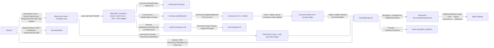

# [RASM_PROJECTION_VIEW]

`Rasm.Drawing` owns exact analytic visibility on the projection fault band: Appel quantitative-invisibility resolved through exact sign arithmetic, so the missed-occluder count is zero by construction rather than by a tuning knob. One `ViewOp` `[Union]` folds every view modality through one `View.Apply` over a PART ROSTER — one QI solve over the offset union soup, so occlusion BETWEEN parts rides the same walk that resolves occlusion within one, and a per-part solve loop is the named wrong form an assembly drawing cannot survive. `DrawingProjection` is the sole seam the host-free sheet layer reads — the RhinoCommon `Point3d`/`Polyline` drawing surface reaches that layer only through the receipt, every segment carrying its part and source-face provenance.

This page founds nothing: every silhouette, crossing, seed, section, crease, fill, and inter-part kernel composes a landed sibling seam, so a rebuild reuses the intersect, spatial, feature, arrangement, and graph owners rather than re-deriving them. Faults ride the locked two-family seam — the `Op` admission channel and band 2400 geometry, neither absorbing the other. Exact-arithmetic visibility here stands beside the host `Silhouette.Compute` capture tier in `Analysis/select` under the capture law, consumers selecting by altitude.

## [01]-[INDEX]

- [02]-[PROJECTION]: `ViewOp` `[Union]` over the `ViewSubject` part roster folded by one `View.Apply`; the exact `Orient3D` silhouette locus; the pairwise inter-part contact pass; the Appel quantitative-invisibility solve over the `Spatial.Apply`/`Intersection.Apply` crossing lattice with exact ±1 deltas and two-stage seeding; the `Section` cut through `IntersectOp.PlaneMesh` per part; `DrawingProjection` the successor-linked visible/hidden carrier with part provenance and the interference receipt; the `ViewConvention` drafting catalog deriving `ViewPose` poses.

## [02]-[PROJECTION]

- Owner: `ViewKind` `[SmartEnum<string>]` discriminates the four operations, binding the shipped `ComparerAccessors.StringOrdinal` comparer and carrying the consulted `EmitsHidden` (hidden-run retention) and `ResolvesVisibility` (QI-solve gate) columns; `ViewSubject` pairs one `MeshSpace` with its optional rigid `Pose` — exploded views and positioned instances are roster DATA applied once at admission, never a second modality; `PartSpan` is the union-soup offset row making face-to-part an O(1) read; `Camera` owns `Project`/`Depth`/`SideOf`/`ScreenBasis`, and `SideOf` IS the exact `Predicate.Orient3D` of the eye against a face; `EdgeKind` classifies silhouette/crease/boundary/intersection, `Visibility` derives the visible/hidden verdict from the invisibility count, `PartRole`/`PartMask` and `ContactPosture` are the occlusion-mask and contact vocabularies `ViewPolicy` binds beside the crease dihedral, winding β², and composed `Narrow`/`Broad` policies; `ContactKind`/`PartContact` carry the interference receipt, and `ProjectedSegment`/`DrawingProjection`/`EdgeHistogram` complete the emission and result surface; `ViewOp` owns the shared roster/camera/policy payload once while `Section` alone adds its cut plane, and `View` owns the ONE `Apply`; `ViewProjectionIntent`/`ViewConvention`/`ViewPose` are the drafting-convention catalog folding bounds-relative placement through ONE derived `Pose` body, whose `ToCamera` lowers the SAME pose onto this page's exact `Camera`.
- Cases: `outline` is the visible slice of the SAME silhouette walk and QI solve (visible silhouette + boundary, no hidden set), never a parallel outliner; the four kinds differ ONLY in which slice of the shared solve they project and in `Section`'s cut delegation — one walk, one lattice, one solve, over one union soup whatever the roster count.
- Entry: `public static Fin<DrawingProjection> View.Apply(ViewOp op, Op? key = null)` — the ONE entrypoint discriminating by op case, no `ExtractSilhouette`/`RemoveHiddenLines`/`SectionCut`/`ProjectOutline` sibling family and no assembly sibling: one part is a roster of one (`ViewSubject.Of`). Admission refusals ride the `Op` channel (`key.InvalidInput()` on a degenerate camera or an out-of-roster or role-less mask row), geometry defects ride band 2400 (`DegenerateInput` naming the part ordinal on a default, empty, or non-finite part; the same case naming the pair under `ContactPosture.Refuse`), an empty locus or non-chain section routes `ProjectionFault` 2436, and a composed sibling fault surfaces unchanged — the fold never re-labels a sibling's typed fault.
- Auto: `Admit` resolves each subject's POSED space once (`Kernels.Apply(MeshEdit.Of(space), pose)` frozen through `ToSpace`; identity poses pass the space through) and materializes the offset union soup through `MeshEdit.Of` — per-part vertex/face `PartSpan` offsets make cross-part welds unrepresentable in the edge-incidence fold — gating emptiness/finiteness/camera per part; `Contacts` runs the pairwise inter-part pass, ONE `SpatialQuery.Overlap` of the part-bounds index against itself pruning the pairs, `IntersectOp.MeshMesh` resolving each survivor, the lattice's transversal `Segments` classifying `Penetrating` and its `Coplanar` rows `Tangent`; penetrating chains append as `EdgeKind.Intersection` locus edges (candidate-only, `Apex = -1`) with their synthetic vertices, so inter-part seams draw and the QI solve stays untouched; `Silhouettes` walks the edge-incidence fold once over the union — a boundary edge is always a silhouette, a two-face edge a silhouette exactly where `FacesOppose` reads opposite nonzero `SideOf` signs, and a crease above the dihedral threshold lifts `EdgeKind.Crease` from the per-part `FeatureReceipt` classification with the lift failure propagating — every locus edge tagged with its part and classifying face; `Resolve` owns the QI solve — QuikGraph-component labeling, the exact `SegmentSegment` crossing lattice, exact ±1 deltas off the eye–silhouette plane, and two-stage seeding (a batched `Winding` culls buried components, the exact `SegmentTriangle` battery counts the rest) — reading only occlusion-eligible faces and occluder edges under the mask table; `Emit` splits each edge at its crossings, threads the running count, rounds coordinates ONCE, links same-visibility successors, retains hidden runs under `EmitsHidden`, skips `OccludingNotDrawn` parts, and folds the flat and per-part histograms in one pass; `Section` partitions the per-part `PlaneMesh` chains closed/open, emitting an open chain as a typed row, never silently closed.
- Receipt: `DrawingProjection` (visible/hidden `Seq<ProjectedSegment>` + `EdgeHistogram` + per-part `Parts` tallies + the `Contacts` interference roster) IS the typed result — each segment carries its exact `Invisibility`, `EdgeKind`, per-endpoint `Depth` cue, `Part` ordinal, and `SourceFace` (the classifying union-soup face, `-1` on inter-part and section segments), so a dashed-hidden render, per-part layer assignment, depth-weighted line weight, or face-grain attribution reads the full set from one carrier; `PartContact` rows surface the pairwise pass as clash evidence — penetrating versus tangent per pair with the chain census — from work the locus already paid for; this owner mints no second identity, content-addressing through the `Polyline`/`Line` projection.
- Packages: `Rasm.Meshing` (`MeshEdit.Of` soup adapter, `Kernels.Apply` the pose transform, `Intersection.Apply` for `PlaneMesh`/`SegmentSegment`/`SegmentTriangle`/`MeshMesh`, `Arrangement.Apply`/`ArrangementOp.PlanarOverlay` fill), `Rasm.Processing` (the `FeatureReceipt` dihedral vocabulary through `VectorIntent.Features`), `Rasm.Spatial` (`Spatial.Apply` — `Build`/`Overlap`/`Range`/`Winding`), `Rasm.Numerics` (`Predicate.Orient3D`, `Sign`, `Axis`, `GeometryFault` band 2400), `Rasm.Domain` (`Op`, `Kind`, `Context`), QuikGraph (`ConnectedComponents` component walk), `Rhino.Geometry`, Thinktecture.Runtime.Extensions, LanguageExt.Core, BCL inbox.
- Growth: a new view modality is one `ViewKind` row and one `ViewOp` case reading the SAME walk and solve — `outline` is this leaf's executed precedent; a new edge classification is one `EdgeKind` row and one `Silhouettes` arm reading the `FeatureReceipt` lift; a new camera projection is one column on `Camera`; a new per-segment render cue is one field on `ProjectedSegment` beside `Depth` — `Part` and `SourceFace` are the executed precedent; a new part role is one `PartRole` row read by the same mask table; a new contact posture is one `ContactPosture` row on the same admission gate; a fifth view kind enters only by charter amendment; zero new surface.
- Law: `ProjectionLaws` is the tier-2 law matrix over this owner — `FacesOppose` agrees with a rational eye-vs-plane determinant oracle, the silhouette set is rigid-transform invariant and closed on a closed manifold, the emitted visibility agrees with a brute-force per-face occlusion oracle OVER THE WHOLE ROSTER (the union-occlusion law: solving parts separately and merging is the enumerated wrong form, since it cannot count one part's faces against another's edges) and is permutation-deterministic, `Part`/`SourceFace` agree with the `PartSpan` lookup on every emitted segment, a partially-occluded edge yields both runs with the hidden run retained, the section curve lies on both the cutting plane and its part's mesh, and `ScreenBasis` agrees with `Project` on the parallel path — the transformed point's first two coordinates equal the projected `(u, v)`.
- Boundary: the projection owner is the ONE polymorphic `ViewOp` `[Union]` folded by one `Apply`, and a `SilhouetteExtractor`/`HiddenLineRemover`/`Sectioner`/`OutlineProjector` sibling-class family is the named density defect — as is a per-part solve loop at any consumer, which the roster payload exists to foreclose. Visibility is EXACT ANALYTIC: the silhouette locus composes `Predicate.Orient3D` (an epsilon-tolerant float dot test is the non-determinism defect), every crossing/delta/seed is an exact sign through the intersect and predicate owners, candidate-component labeling composes QuikGraph `ConnectedComponents` (a page-local union-find is deleted), the `Section` cut composes `IntersectOp.PlaneMesh` (an inline plane-mesh test or a host `Make2D` round-trip is deleted), the inter-part seam composes `IntersectOp.MeshMesh` (a page-local mesh-mesh march is deleted), the crease composes the `FeatureReceipt` dihedral (a local re-derivation is the deleted double owner), region fill composes `ArrangementOp.PlanarOverlay` (a local filler is deleted), the soup is `MeshEdit.Of` with poses applied through `Kernels.Apply` (a page-local `Soup`/`BuildNative` pair is the deleted third carrier), and `ToPolylines` walks successor links per visibility set (a `GroupBy(kind)` concat merging visible with hidden is the deleted lie). Coplanar face-to-face contact between parts is where `Orient3D` reads `Sign.Zero` and QI deltas silently stop transitioning, so contact takes an admission POSTURE rather than per-predicate guards: `Weld` accepts the joint — coincident surfaces change no visibility, the contact records on the receipt, and the parts' own locus edges draw the seam — while `Refuse` faults typed naming the pair; an unstated posture is the foreclosed silent form. Occlusion masks are `PartMask` DATA on the policy — a ghosted-context boolean per call site is the killed knob pair. `Apply` is total over the `Fin` rail — a thrown exception on a degenerate camera or empty locus is forbidden, admission refusals ride the `Op` channel and geometry defects ride band 2400, neither family absorbing the other. Screen coordinates operate on raw `double` only inside the projection kernels; a bare `double` crossing the public surface outside `Point3d`/`Plane`/`Polyline`/`Line`/`Transform` is the seam violation. Hidden runs classify and RETAIN under `EmitsHidden`, never discarded to satisfy a budget. `ViewConvention` seats at THIS drawing tier as drafting-presentation policy — a geometry-rail seat or a host-folder recipe catalog with inline multipliers is the killed form; the host viewport rail consumes `ViewPose` while this page's exact drawing consumes `ToCamera`, and annotation seams (GD&T datum targets, basic dimensions) consume `Camera.ScreenBasis` rather than re-deriving a basis.

```csharp signature
// --- [RUNTIME_PRELUDE] ----------------------------------------------------------------------
using System;
using System.Collections.Generic;
using System.Linq;
using LanguageExt;
using QuikGraph;
using QuikGraph.Algorithms;
using Rasm.Domain;
using Rasm.Meshing;
using Rasm.Numerics;
using Rasm.Processing;
using Rasm.Spatial;
using Rhino.Geometry;
using Thinktecture;
using static LanguageExt.Prelude;
// CS0104 guard: LanguageExt.HashSet collides with the BCL name under the dual usings.
using EdgeKeySet = System.Collections.Generic.HashSet<long>;

namespace Rasm.Drawing;

// --- [TYPES] ------------------------------------------------------------------------------
// EmitsHidden retains hidden runs; ResolvesVisibility gates the QI solve.
[SmartEnum<string>]
[KeyMemberEqualityComparer<ComparerAccessors.StringOrdinal, string>]
[KeyMemberComparer<ComparerAccessors.StringOrdinal, string>]
public sealed partial class ViewKind {
    public static readonly ViewKind Silhouette = new("silhouette", emitsHidden: false, resolvesVisibility: false);
    public static readonly ViewKind HiddenLine = new("hidden-line", emitsHidden: true, resolvesVisibility: true);
    public static readonly ViewKind Section    = new("section", emitsHidden: false, resolvesVisibility: false);
    public static readonly ViewKind Outline    = new("outline", emitsHidden: false, resolvesVisibility: true);

    public bool EmitsHidden { get; }
    public bool ResolvesVisibility { get; }
}

// ProjectionFault(EdgeKind, int) composes these rows — consumed corpus-wide; renumbering breaks the payload.
[SmartEnum<int>]
public sealed partial class EdgeKind {
    public static readonly EdgeKind Silhouette   = new(0);
    public static readonly EdgeKind Crease       = new(1);
    public static readonly EdgeKind Boundary     = new(2);
    public static readonly EdgeKind Intersection = new(3);
}

// Derived from the Appel count (visible = 0).
[SmartEnum<int>]
public sealed partial class Visibility {
    public static readonly Visibility Visible = new(0);
    public static readonly Visibility Hidden  = new(1);
}

// Occlusion-mask roles: a part outside the mask table is drawn AND occludes. DrawnNotOccluding is ghosted
// context (edges emit, faces never occlude); OccludingNotDrawn is clipping context (faces occlude, edges never emit).
[SmartEnum<int>]
public sealed partial class PartRole {
    public static readonly PartRole DrawnNotOccluding = new(0);
    public static readonly PartRole OccludingNotDrawn = new(1);
}

// Coplanar face-to-face contact posture: Weld accepts the joint (coincident surfaces change no visibility
// and the contact records on the receipt), Refuse faults typed naming the pair. Sign.Zero at a contact
// patch is the QI transition the posture forecloses from failing silently.
[SmartEnum<int>]
public sealed partial class ContactPosture {
    public static readonly ContactPosture Weld   = new(0);
    public static readonly ContactPosture Refuse = new(1);
}

// Interference classification off the MeshMesh lattice: transversal Segments read Penetrating, Coplanar-only
// rows read Tangent — the same evidence the contact posture adjudicates.
[SmartEnum<int>]
public sealed partial class ContactKind {
    public static readonly ContactKind Penetrating = new(0);
    public static readonly ContactKind Tangent     = new(1);
}

// Host-agnostic projection vocabulary; the Perspective column drives camera derivation.
[SmartEnum<int>]
public sealed partial class ViewProjectionIntent {
    public static readonly ViewProjectionIntent Parallel = new(key: 0, perspective: false);
    public static readonly ViewProjectionIntent Perspective = new(key: 1, perspective: true);
    public static readonly ViewProjectionIntent TwoPoint = new(key: 2, perspective: true);
    public static readonly ViewProjectionIntent ParallelReflected = new(key: 3, perspective: false);

    public bool Perspective { get; }
}

// Drafting-presentation catalog at the drawing tier: placement is COLUMN DATA folded through one Pose body.
[SmartEnum<int>]
public sealed partial class ViewConvention {
    public static readonly ViewConvention TwoPointElevation = new(key: 0, projection: ViewProjectionIntent.TwoPoint, elevation: 0.0, azimuth: 0.0, distanceFactor: 1.5, lens: 35.0);
    public static readonly ViewConvention ParallelPlan = new(key: 1, projection: ViewProjectionIntent.Parallel, elevation: Math.PI / 2.0, azimuth: 0.0, distanceFactor: 1.5, lens: 50.0);
    public static readonly ViewConvention Axonometric = new(key: 2, projection: ViewProjectionIntent.Parallel, elevation: 0.6154797086703873, azimuth: Math.PI / 4.0, distanceFactor: 2.0, lens: 50.0);
    public static readonly ViewConvention TopPerspective = new(key: 3, projection: ViewProjectionIntent.Perspective, elevation: 1.1, azimuth: Math.PI / 4.0, distanceFactor: 1.75, lens: 35.0);
    public static readonly ViewConvention SectionPerspective = new(key: 4, projection: ViewProjectionIntent.Perspective, elevation: 0.0, azimuth: 0.0, distanceFactor: 0.75, lens: 24.0);
    public static readonly ViewConvention ReflectedCeiling = new(key: 5, projection: ViewProjectionIntent.ParallelReflected, elevation: -Math.PI / 2.0, azimuth: 0.0, distanceFactor: 1.5, lens: 50.0);

    public ViewProjectionIntent Projection { get; }
    public double Elevation { get; }
    public double Azimuth { get; }
    public double DistanceFactor { get; }
    public double Lens { get; }

    // ONE derived body over the columns — zero per-row recipes.
    public Fin<ViewPose> Pose(BoundingBox subject, Option<Direction> facing, Context context, Op key) {
        ViewConvention row = this;
        return from _ in guard(subject.IsValid && subject.Diagonal.Length > EpsilonPolicy.ZeroTolerance, key.InvalidInput()).ToFin()
               from bearing in facing.Match(
                   Some: hint => Fin.Succ(new Vector3d(hint.Value.X, hint.Value.Y, 0.0)),
                   None: () => Fin.Succ(-Vector3d.YAxis))
               from horizontal in Direction.Of(value: bearing.IsTiny() ? -Vector3d.YAxis : bearing, context: context, key: key)
               from look in Direction.Of(
                   value: (Math.Cos(row.Elevation) * (Transform.Rotation(angleRadians: row.Azimuth, rotationAxis: Vector3d.ZAxis, rotationCenter: Point3d.Origin) * horizontal.Value))
                        - (Math.Sin(row.Elevation) * Vector3d.ZAxis),
                   context: context, key: key)
               from standoff in key.Positive(value: subject.Diagonal.Length * row.DistanceFactor)
               from frame in VectorFrame.Of(
                   origin: subject.Center - (look.Value * standoff),
                   normal: look.Value,
                   xHint: Math.Abs(row.Elevation) >= Math.PI / 2.0 - EpsilonPolicy.SqrtEpsilon ? Some(horizontal.Value) : Option<Vector3d>.None,
                   context: context, key: key)
               select new ViewPose(Frame: frame, Eye: subject.Center - (look.Value * standoff), Target: subject.Center, Subject: subject, Projection: row.Projection, Lens: row.Lens);
    }
}

// --- [CONSTANTS] --------------------------------------------------------------------------
// PartMask names the exception; an unmasked part is drawn and occludes. Rows are policy DATA, never call-site knobs.
public readonly record struct PartMask(int Part, PartRole Role);

// BetaSquared is the winding-cull accuracy knob; Narrow the exact-lattice policy, Broad the BVH build policy;
// Contact the coplanar-joint posture and Masks the per-part occlusion exceptions.
public sealed record ViewPolicy(double CreaseDihedralRadians, double BetaSquared, IntersectPolicy Narrow, BuildPolicy Broad, ContactPosture Contact, Arr<PartMask> Masks) {
    public static readonly ViewPolicy Canonical =
        new(CreaseDihedralRadians: 0.5235987755982988, BetaSquared: 4.0, Narrow: IntersectPolicy.Canonical, Broad: BuildPolicy.Canonical,
            Contact: ContactPosture.Weld, Masks: Arr<PartMask>.Empty);
}

// --- [MODELS] -----------------------------------------------------------------------------
// One roster row: the mesh and its optional rigid pose, applied ONCE at admission — exploded views and
// positioned instances are roster data, so the same MeshSpace seats N times under N poses with no copy upstream.
public readonly record struct ViewSubject(MeshSpace Mesh, Option<Transform> Pose) {
    public static ViewSubject Of(MeshSpace mesh) => new(mesh, Option<Transform>.None);
}

// Union-soup offset row: face-to-part and vertex-to-part are O(1) span reads, and offsetting makes a
// cross-part weld unrepresentable in the edge-incidence fold.
public readonly record struct PartSpan(int VertexStart, int VertexCount, int FaceStart, int FaceCount) {
    public bool HoldsFace(int face) => face >= FaceStart && face < FaceStart + FaceCount;
}

// Interference receipt row off the pairwise pass — clash evidence the locus already paid for.
public sealed record PartContact(int A, int B, ContactKind Kind, int Chains);

// ToCamera lowers the SAME pose onto the exact projection frame — one catalog, two altitudes.
public readonly record struct ViewPose(VectorFrame Frame, Point3d Eye, Point3d Target, BoundingBox Subject, ViewProjectionIntent Projection, double Lens) {
    // A perspective camera admits only a WHOLLY-IN-FRONT subject: every Subject corner strictly ahead of the eye
    // plane, or the pose refuses on the Op channel. The gate is the ONE seat that keeps Camera.Depth divide-safe —
    // a behind-eye point once clamped to double.Epsilon and projected to a finite astronomically-scaled screen
    // coordinate that no downstream probe caught; an interior eye now refuses here, and the caller clips to the
    // front frustum before re-posing. Parallel projection has no eye side, so the gate is perspective-only.
    public Fin<Camera> ToCamera(Context tolerance, Op? key = null) {
        Op op = key.OrDefault();
        ViewPose self = this;
        return from look in Direction.Of(value: self.Target - self.Eye, context: tolerance, key: op)
               from _ in guard(!self.Projection.Perspective
                       || self.Subject.GetCorners().AsIterable().ForAll(c => (c - self.Eye) * look.Value > EpsilonPolicy.ZeroTolerance),
                   op.InvalidInput()).ToFin()
               from screen in Admit.Plane(basis: new Plane(origin: self.Target, normal: look.Value), key: op)
               select new Camera(Eye: self.Eye, Direction: look.Value, Screen: screen, Perspective: self.Projection.Perspective, Tolerance: tolerance);
    }
}

public sealed record Camera(Point3d Eye, Vector3d Direction, Plane Screen, bool Perspective, Context Tolerance) {
    public Point3d Project(Point3d world) {
        Screen.ClosestParameter(world, out double u, out double v);
        double depth = Perspective ? Depth(world) : 1.0;
        return new Point3d(u / depth, v / depth, 0.0);
    }

    // RAW signed axial distance — positive by ToCamera's perspective admission over the subject, and an honest
    // signed fade cue under parallel projection where nothing sits "behind" a directional eye. The prior
    // `d <= 0 ? double.Epsilon : d` clamp forged both: an unprojectable perspective point became a finite
    // astronomically-scaled coordinate, and a legitimate negative parallel cue became an epsilon.
    public double Depth(Point3d world) => (world - Eye) * Direction;

    // Exact view-side verdict — Orient3D of the eye against the face's supporting plane.
    public Sign SideOf(Point3d a, Point3d b, Point3d c) => Predicate.Orient3D(a, b, c, Eye);

    // ScreenBasis yields the consumable world→screen frame for annotation seams: world coordinates
    // re-expressed in the screen frame — the (u, v) Project computes, with z the Target-plane-relative depth
    // (Camera.Depth minus the constant eye-to-target offset). An affine answer exists only without the
    // perspective divide, so a perspective camera REFUSES rather than handing a transform that disagrees
    // with Project; GD&T datum-target and basic-dimension transforms consume this value on parallel drafting
    // views, never a re-derived basis.
    public Fin<Transform> ScreenBasis(Op? key = null) =>
        Perspective
            ? Fin.Fail<Transform>(key.OrDefault().InvalidInput())
            : Fin.Succ(Transform.ChangeBasis(plane0: Plane.WorldXY, plane1: Screen));
}

// Invisibility is the Appel count; Next = same-set successor (-1 ends the chain); coordinates round ONCE at emission.
// Depth is the per-endpoint camera-axial cue Camera.Depth computes — a line-weight or atmospheric fade reads the
// pair directly and a mid-segment cue interpolates it, so no consumer re-projects world geometry for a render cue.
// Part is the roster ordinal (an inter-part seam segment carries the pair's lower DRAWN ordinal — the pair
// identity rides the Contacts roster) and SourceFace the classifying union-soup face (-1 on inter-part and
// section segments), so per-part layers and face-grain attribution read the segment, never a re-solve.
public sealed record ProjectedSegment(Point3d ScreenA, Point3d ScreenB, EdgeKind Edge, int Invisibility, int Next, int SourceA, int SourceB, (double A, double B) Depth, int Part, int SourceFace) {
    public Visibility State => Invisibility == 0 ? Visibility.Visible : Visibility.Hidden;
}

public sealed record EdgeHistogram(int Silhouette, int Crease, int Boundary, int Intersection, int VisibleCount, int HiddenCount) {
    public static readonly EdgeHistogram Empty = new(0, 0, 0, 0, 0, 0);

    public EdgeHistogram Add(ProjectedSegment s) {
        // Stateless smart-enum Switch takes parameterless arms — the receiver already names the row.
        EdgeHistogram tally = s.Edge.Switch(
            silhouette:   () => this with { Silhouette = Silhouette + 1 },
            crease:       () => this with { Crease = Crease + 1 },
            boundary:     () => this with { Boundary = Boundary + 1 },
            intersection: () => this with { Intersection = Intersection + 1 });
        return s.Invisibility > 0
            ? tally with { HiddenCount = tally.HiddenCount + 1 }
            : tally with { VisibleCount = tally.VisibleCount + 1 };
    }
}

// Parts is the per-part tally roster (indexed by roster ordinal; inter-part segments tally under their carried
// Part) and Contacts the interference receipt — both folded in the same emission pass as the flat histogram.
public sealed record DrawingProjection(Seq<ProjectedSegment> Visible, Seq<ProjectedSegment> Hidden, EdgeHistogram Histogram, Arr<EdgeHistogram> Parts, Seq<PartContact> Contacts) {
    // Chaining is PER SET — visible and hidden walk their own Next links, never merged.
    public Seq<Polyline> ToPolylines() => Chains(Visible) + Chains(Hidden);

    public Seq<Line> ToSegments() => (Visible + Hidden).Map(static s => new Line(s.ScreenA, s.ScreenB));

    // Region fill is the arrangement's — closed visible chains overlay through PlanarOverlay on the screen plane.
    public Fin<ArrangementResult> Fill(BooleanOp op, ArrangementPolicy policy, Op? key = null) =>
        Arrangement.Apply(new ArrangementOp.PlanarOverlay(
            A: Chains(Visible).Filter(static loop => loop.IsClosed), B: Seq<Polyline>(), Op: op, Plane: Axis.Z, Policy: policy), key);

    // Open chains start at unlinked heads; leftover linked-only segments are closed RINGS, walked once, never dropped.
    static Seq<Polyline> Chains(Seq<ProjectedSegment> set) {
        Set<int> linked = toSet(set.Map(static s => s.Next).Filter(static n => n >= 0));
        bool[] visited = new bool[set.Count];
        List<Polyline> loops = [];
        for (int head = 0; head < set.Count; head++) {
            if (!visited[head] && !linked.Contains(head)) loops.Add(Walk(set, head, visited));
        }
        for (int head = 0; head < set.Count; head++) {
            if (!visited[head]) loops.Add(Walk(set, head, visited));
        }
        return toSeq(loops);
    }

    static Polyline Walk(Seq<ProjectedSegment> set, int head, bool[] visited) {
        Polyline loop = [set[head].ScreenA, set[head].ScreenB];
        visited[head] = true;
        for (int next = set[head].Next; next >= 0 && !visited[next]; next = set[next].Next) {
            loop.Add(set[next].ScreenB);
            visited[next] = true;
        }
        return loop;
    }
}

// --- [OPERATIONS] -------------------------------------------------------------------------
[Union(ConversionFromValue = ConversionOperatorsGeneration.None)]
public abstract partial record ViewOp {
    private ViewOp(Seq<ViewSubject> parts, Camera camera, ViewPolicy policy) {
        Parts = parts;
        Camera = camera;
        Policy = policy;
    }

    public sealed record Silhouette : ViewOp {
        public Silhouette(Seq<ViewSubject> parts, Camera camera, ViewPolicy policy) : base(parts, camera, policy) { }
    }
    public sealed record HiddenLine : ViewOp {
        public HiddenLine(Seq<ViewSubject> parts, Camera camera, ViewPolicy policy) : base(parts, camera, policy) { }
    }
    public sealed record Section : ViewOp {
        public Section(Seq<ViewSubject> parts, Plane cut, Camera camera, ViewPolicy policy) : base(parts, camera, policy) => Cut = cut;
        public Plane Cut { get; }
    }
    public sealed record Outline : ViewOp {
        public Outline(Seq<ViewSubject> parts, Camera camera, ViewPolicy policy) : base(parts, camera, policy) { }
    }

    internal Seq<ViewSubject> Parts { get; }
    internal Camera Camera { get; }
    internal ViewPolicy Policy { get; }

    public ViewKind Kind =>
        Switch(
            silhouette: static _ => ViewKind.Silhouette,
            hiddenLine: static _ => ViewKind.HiddenLine,
            section:    static _ => ViewKind.Section,
            outline:    static _ => ViewKind.Outline);
}

public static class View {
    public static Fin<DrawingProjection> Apply(ViewOp op, Op? key = null) {
        Op k = key.OrDefault();
        // Mask rows gate range AND the default-mint ghost: a default(PartMask) array slot zero-inits a
        // null Role that would read as OccludingNotDrawn in Roles and silently suppress part 0 — the one
        // outer seam refuses it here; the two declared PartRole rows admit no other invalid instance.
        if (op.Camera.Direction.IsTiny() || op.Parts.IsEmpty
            || op.Policy.Masks.Exists(mask => mask.Part < 0 || mask.Part >= op.Parts.Count || mask.Role is null)) {
            return Fin.Fail<DrawingProjection>(k.InvalidInput());
        }
        return Admit(op.Parts, op.Camera.Tolerance, k).Bind(assembly =>
            Contacts(assembly, op.Policy, k).Bind(contact =>
                op switch {
                    ViewOp.Section section => Cut(assembly, contact.Roster, section.Cut, section.Camera, section.Policy, k),
                    _ => Silhouettes(assembly, contact.SeamEdges, op.Camera, op.Policy, k).Bind(locus =>
                        op.Kind.ResolvesVisibility
                            ? Resolve(assembly, locus, contact.Roster, op.Camera, op.Policy, op.Kind.EmitsHidden, k)
                            // locus.V, never assembly.V — seam edges index the grown vertex array on this path too.
                            : Fin.Succ(Emit(assembly, locus.Edges, EmptyLattice(locus.Edges.Count), new int[locus.Edges.Count], contact.Roster, op.Camera, op.Policy, emitHidden: false, locus.V))),
                }));
    }

    // --- [ADMISSION]
    // Roster carrier: posed spaces beside the offset union soup; FaceOwner is the face→part column derived
    // once from the span roster at admission — one authority, projected — so PartOfFace is the O(1)
    // provenance read the hot face loops pay per face, never a per-call span scan; -1 answers the
    // out-of-soup ordinals inter-part and section segments carry.
    internal readonly record struct Assembly(MeshSpace[] Posed, Point3d[] V, (int A, int B, int C)[] F, PartSpan[] Spans, int[] FaceOwner) {
        public int PartOfFace(int face) => face >= 0 && face < FaceOwner.Length ? FaceOwner[face] : -1;
    }

    // Poses apply ONCE — Kernels.Apply over the arena, frozen through ToSpace; MeshEdit.Of is the ONE soup
    // adapter and the offset copy makes cross-part welds unrepresentable; every gate names its part ordinal.
    static Fin<Assembly> Admit(Seq<ViewSubject> parts, Context tolerance, Op key) {
        MeshSpace[] posed = new MeshSpace[parts.Count];
        List<Point3d> vertices = [];
        List<(int A, int B, int C)> faces = [];
        PartSpan[] spans = new PartSpan[parts.Count];
        for (int p = 0; p < parts.Count; p++) {
            // Default-mint ghost gate ahead of the pose branch: a default(ViewSubject) array slot carries a
            // Native-less MeshSpace no admission saw, and MeshEdit.Of would throw on it instead of routing
            // typed — the one outer seam reads the key member and refuses, naming the part.
            if (parts[p].Mesh.Native is null)
                return Fin.Fail<Assembly>(new GeometryFault.DegenerateInput(Kind.Mesh, p, "default subject").ToError());
            Fin<MeshSpace> seated = parts[p].Pose.Match(
                Some: pose => {
                    // Kernels.Apply mutates the single-writer arena in place — the arena lease dies here, so
                    // one using scopes both the adapter and the transform before the freeze escapes as value.
                    using MeshEdit arena = MeshEdit.Of(parts[p].Mesh);
                    return Kernels.Apply(arena, pose).ToSpace(tolerance, key);
                },
                None: () => Fin.Succ(parts[p].Mesh));
            if (seated.IsFail) return seated.Map(static _ => default(Assembly));
            posed[p] = seated.IfFail(static _ => default);
            using MeshEdit edit = MeshEdit.Of(posed[p]);
            if (edit.VertexCount == 0 || edit.FaceCount == 0)
                return Fin.Fail<Assembly>(new GeometryFault.DegenerateInput(Kind.Mesh, p, "empty part").ToError());
            int vertexStart = vertices.Count;
            for (int v = 0; v < edit.VertexCount; v++) {
                Point3d at = edit.Position(v);
                if (!at.IsValid)
                    return Fin.Fail<Assembly>(new GeometryFault.DegenerateInput(Kind.Mesh, p, "non-finite vertex").ToError());
                vertices.Add(at);
            }
            int faceStart = faces.Count;
            for (int f = 0; f < edit.FaceCount; f++) {
                (int a, int b, int c) = edit.Face(f);
                faces.Add((a + vertexStart, b + vertexStart, c + vertexStart));
            }
            spans[p] = new PartSpan(vertexStart, edit.VertexCount, faceStart, edit.FaceCount);
        }
        // FaceOwner projects from the span roster in one pass — spans stay the one authority.
        int[] owner = new int[faces.Count];
        for (int p = 0; p < spans.Length; p++) Array.Fill(owner, p, spans[p].FaceStart, spans[p].FaceCount);
        return Fin.Succ(new Assembly(posed, [.. vertices], [.. faces], spans, owner));
    }

    // --- [CONTACT]
    // ONE part-bounds index Overlapped against itself prunes the pairs; MeshMesh resolves each survivor. The
    // lattice's transversal Segments classify Penetrating, Coplanar-only rows Tangent; Refuse fires on ANY
    // coplanar rows — a pair that both penetrates and touches face-to-face still carries the Sign.Zero patch the
    // posture adjudicates — while under Weld the contact records and coincident surfaces change no
    // visibility, the joint drawing through the parts' own locus edges. Penetrating chains return as
    // inter-part seam edges.
    internal readonly record struct ContactSet(Seq<PartContact> Roster, Seq<(Point3d A, Point3d B, int Part)> SeamEdges);

    static Fin<ContactSet> Contacts(Assembly assembly, ViewPolicy policy, Op key) {
        if (assembly.Spans.Length < 2) return Fin.Succ(new ContactSet(Seq<PartContact>(), Seq<(Point3d, Point3d, int)>()));
        (bool[] _, bool[] draws) = Roles(assembly.Spans.Length, policy.Masks);
        BoundingBox[] bounds = [.. assembly.Posed.Select(static space => space.Native.GetBoundingBox(accurate: false))];
        return Broad(bounds, policy.Broad, key).Bind(index =>
            Pairs(index, index, policy.Narrow.BroadPhaseInflation, key).Bind(pairs =>
                pairs.Filter(static pair => pair.Left < pair.Right)
                    .TraverseM(pair => Intersection
                        .Apply(new IntersectOp.MeshMesh(assembly.Posed[pair.Left], assembly.Posed[pair.Right], policy.Narrow), key)
                        .Bind(result => result is IntersectResult.Chains chains
                            ? Contact(pair.Left, pair.Right, chains, policy.Contact, draws, key)
                            : Fin.Fail<Option<(PartContact, Seq<(Point3d, Point3d, int)>)>>(key.InvalidResult())))
                    .As()
                    .Map(static rows => rows.Bind(static row => row.ToSeq()))
                    .Map(static rows => new ContactSet(rows.Map(static row => row.Item1), rows.Bind(static row => row.Item2)))));
    }

    // Contact seats the seam's carried ordinal on a DRAWN part where one exists, so a clipper-against-drawn
    // seam still draws and only a both-undrawn seam skips at emission; the pair identity always rides the
    // Contacts roster.
    static Fin<Option<(PartContact, Seq<(Point3d A, Point3d B, int Part)>)>> Contact(int a, int b, IntersectResult.Chains chains, ContactPosture posture, bool[] draws, Op key) {
        bool penetrating = chains.Lattice.Segments.Length > 0;
        bool coplanar = chains.Lattice.Coplanar.Length > 0;
        if (!penetrating && !coplanar) return Fin.Succ(Option<(PartContact, Seq<(Point3d, Point3d, int)>)>.None);
        if (coplanar && posture == ContactPosture.Refuse)
            return Fin.Fail<Option<(PartContact, Seq<(Point3d, Point3d, int)>)>>(
                new GeometryFault.DegenerateInput(Kind.Mesh, b, $"coplanar contact with part {a}").ToError());
        int carried = draws[int.Min(a, b)] ? int.Min(a, b) : int.Max(a, b);
        Seq<(Point3d, Point3d, int)> seams = penetrating
            ? chains.Walked.Bind(chain => toSeq(Enumerable.Range(0, chain.Points.Count - 1)
                .Select(i => (chain.Points[i], chain.Points[i + 1], carried))))
            : Seq<(Point3d, Point3d, int)>();
        return Fin.Succ(Some((
            new PartContact(a, b, penetrating ? ContactKind.Penetrating : ContactKind.Tangent, chains.Walked.Count),
            seams)));
    }

    // --- [SILHOUETTE]
    // Apex = occluding FRONT face's third vertex on silhouette/boundary rows (-1 on crease/inter-part rows) — the
    // Delta sign anchor; Part and Face carry provenance from the incidence fold, seam edges appending with their
    // synthetic vertices after it.
    readonly record struct Locus(Seq<(int A, int B, EdgeKind Kind, int Apex, int Part, int Face)> Edges, Sign[] Side, Point3d[] V);

    static Fin<Locus> Silhouettes(Assembly assembly, Seq<(Point3d A, Point3d B, int Part)> seams, Camera camera, ViewPolicy policy, Op key) =>
        CreaseEdges(assembly, camera, policy, key).Bind(creases => {
            (Point3d[] V, (int A, int B, int C)[] F) soup = (assembly.V, assembly.F);
            Sign[] side = new Sign[soup.F.Length];
            for (int f = 0; f < soup.F.Length; f++) side[f] = camera.SideOf(soup.V[soup.F[f].A], soup.V[soup.F[f].B], soup.V[soup.F[f].C]);
            Dictionary<(int, int), List<int>> incident = [];
            for (int f = 0; f < soup.F.Length; f++) {
                (int a, int b, int c) = soup.F[f];
                Register(incident, a, b, f); Register(incident, b, c, f); Register(incident, c, a, f);
            }
            List<(int A, int B, EdgeKind Kind, int Apex, int Part, int Face)> edges = [];
            foreach (((int u, int v) edge, List<int> faces) in incident) {
                if (faces.Count == 1) {
                    int face = faces[0];
                    edges.Add((edge.u, edge.v, EdgeKind.Boundary, side[face] == Sign.Positive ? ThirdVertex(soup.F[face], edge.u, edge.v) : -1, assembly.PartOfFace(face), face));
                    continue;
                }
                if (faces.Count != 2) continue;
                if (FacesOppose(side, faces[0], faces[1])) {
                    int front = side[faces[0]] == Sign.Positive ? faces[0] : faces[1];
                    edges.Add((edge.u, edge.v, EdgeKind.Silhouette, ThirdVertex(soup.F[front], edge.u, edge.v), assembly.PartOfFace(front), front));
                }
                else if (creases.Contains(Key(edge.u, edge.v))) {
                    int lower = int.Min(faces[0], faces[1]);
                    edges.Add((edge.u, edge.v, EdgeKind.Crease, -1, assembly.PartOfFace(lower), lower));
                }
            }
            // Inter-part seams enter as candidate-only intersection edges: synthetic vertices append past every
            // span, so no incidence row and no occluder apex — the union solve counts them like any candidate.
            Point3d[] grown = soup.V;
            if (!seams.IsEmpty) {
                List<Point3d> extended = [.. soup.V];
                foreach ((Point3d a, Point3d b, int part) in seams) {
                    edges.Add((extended.Count, extended.Count + 1, EdgeKind.Intersection, -1, part, -1));
                    extended.Add(a);
                    extended.Add(b);
                }
                grown = [.. extended];
            }
            return edges.Count == 0
                ? Fin.Fail<Locus>(new GeometryFault.ProjectionFault(EdgeKind.Silhouette, -1).ToError())
                : Fin.Succ(new Locus(toSeq(edges), side, grown));
        });

    // Exact sign-change locus — opposite nonzero eye-side signs.
    static bool FacesOppose(Sign[] side, int f0, int f1) =>
        side[f0] != side[f1] && side[f0] != Sign.Zero && side[f1] != Sign.Zero;

    // Per-part crease lift over the POSED space, keys offset onto union indices; failure PROPAGATES — never
    // degrades to an empty crease set.
    static Fin<EdgeKeySet> CreaseEdges(Assembly assembly, Camera camera, ViewPolicy policy, Op key) {
        EdgeKeySet union = [];
        for (int p = 0; p < assembly.Posed.Length; p++) {
            int offset = assembly.Spans[p].VertexStart;
            Fin<EdgeKeySet> lifted = MeshFeaturePolicy.Of(dihedralRadians: policy.CreaseDihedralRadians, space: assembly.Posed[p], faceRegions: Option<Arr<int>>.None, key: key)
                .Bind(features => VectorIntent.Features(assembly.Posed[p], features, key))
                .Bind(intent => intent.Project<FeatureReceipt>(camera.Tolerance, key))
                .Map(receipt => new EdgeKeySet(receipt.Edges
                    .Filter(static e => e.Kind == MeshFeatureKind.Crease)
                    .Map(e => Key(e.A + offset, e.B + offset))));
            if (lifted.IsFail) return lifted;
            union.UnionWith(lifted.IfFail(static _ => []));
        }
        return Fin.Succ(union);
    }

    static void Register(Dictionary<(int, int), List<int>> incident, int a, int b, int face) {
        (int lo, int hi) = a < b ? (a, b) : (b, a);
        (incident.TryGetValue((lo, hi), out List<int>? list) ? list : incident[(lo, hi)] = []).Add(face);
    }

    static long Key(int a, int b) { (int lo, int hi) = a < b ? (a, b) : (b, a); return ((long)lo << 32) | (uint)hi; }

    static int ThirdVertex((int A, int B, int C) face, int u, int v) =>
        face.A != u && face.A != v ? face.A : face.B != u && face.B != v ? face.B : face.C;

    // --- [MASKS]
    // Two derived lookups off the policy table: occludes[] gates the face batteries and occluder set,
    // draws[] gates candidacy and emission; an unmasked part reads true on both.
    static (bool[] Occludes, bool[] Draws) Roles(int parts, Arr<PartMask> masks) {
        bool[] occludes = new bool[parts];
        bool[] draws = new bool[parts];
        Array.Fill(occludes, true);
        Array.Fill(draws, true);
        foreach (PartMask mask in masks) {
            if (mask.Role == PartRole.DrawnNotOccluding) occludes[mask.Part] = false;
            else draws[mask.Part] = false;
        }
        return (occludes, draws);
    }

    // --- [QI_LATTICE]
    static Fin<DrawingProjection> Resolve(Assembly assembly, Locus locus, Seq<PartContact> contacts, Camera camera, ViewPolicy policy, bool emitHidden, Op key) {
        (bool[] occludes, bool[] _) = Roles(assembly.Spans.Length, policy.Masks);
        (Point3d[] V, (int A, int B, int C)[] F) soup = (locus.V, assembly.F);
        int[] component = Components(locus.Edges, soup.V.Length);
        (Point3d[] triangles, int[] triangleFace) = Triangles(assembly, occludes);
        return Broad(FaceBounds(assembly, occludes, out int[] worldFace), policy.Broad, key).Bind(world =>
            Crossings(assembly, locus, camera, policy, occludes, key).Bind(lattice =>
                Seeds(assembly, locus, component, camera, world, worldFace, triangles, policy, occludes, key).Map(seeds =>
                    Emit(assembly, locus.Edges, lattice, PropagateSeeds(component, locus.Edges, seeds), contacts, camera, policy, emitHidden, locus.V))));
    }

    // ONE tandem Overlap → exact SegmentSegment per pair; each row carries T along the candidate and the ±1 Delta.
    // Candidates are DRAWN parts' edges, occluders the apex-carrying edges of OCCLUDING parts.
    static Fin<Seq<(double T, int Delta)>[]> Crossings(Assembly assembly, Locus locus, Camera camera, ViewPolicy policy, bool[] occludes, Op key) {
        (bool[] _, bool[] draws) = Roles(assembly.Spans.Length, policy.Masks);
        (Line[] candidate2d, Line[] occluder2d, int[] occluderEdge) = ScreenSegments(locus.Edges, locus.V, camera, occludes);
        return Broad(SegmentBounds(candidate2d), policy.Broad, key).Bind(cand =>
            Broad(SegmentBounds(occluder2d), policy.Broad, key).Bind(occ =>
                Pairs(cand, occ, camera.Tolerance.Absolute.Value, key).Bind(pairs =>
                    pairs.Filter(pair => pair.Left != occluderEdge[pair.Right] && draws[locus.Edges[pair.Left].Part])
                        .TraverseM(pair => Intersection
                            .Apply(new IntersectOp.SegmentSegment(candidate2d[pair.Left], occluder2d[pair.Right], Axis.Z, policy.Narrow), key)
                            .Map(result => result is IntersectResult.Points points
                                ? points.Hits.Map(hit => (Edge: pair.Left, Row: (ParameterAt(candidate2d[pair.Left], hit),
                                    Delta(locus, pair.Left, occluderEdge[pair.Right], camera))))
                                : Seq<(int, (double, int))>()))
                        .As()
                        .Map(rows => Bucket(rows.Bind(identity), locus.Edges.Count)))));
    }

    // Candidate endpoints read against the eye–silhouette plane; matching the front-face apex means occluded.
    // Endpoint reversal flips every sign together, preserving the transition.
    static int Delta(Locus locus, int candidate, int occluderEdge, Camera camera) {
        (int candA, int candB, _, _, _, _) = locus.Edges[candidate];
        (int silA, int silB, _, int apex, _, _) = locus.Edges[occluderEdge];
        if (apex < 0) return 0;
        Sign apexSide = Predicate.Orient3D(camera.Eye, locus.V[silA], locus.V[silB], locus.V[apex]);
        Sign nearSide = Predicate.Orient3D(camera.Eye, locus.V[silA], locus.V[silB], locus.V[candA]);
        Sign farSide = Predicate.Orient3D(camera.Eye, locus.V[silA], locus.V[silB], locus.V[candB]);
        if (apexSide == Sign.Zero || nearSide == Sign.Zero || farSide == Sign.Zero) return 0;
        return (nearSide == apexSide, farSide == apexSide) switch {
            (false, true) => 1,
            (true, false) => -1,
            _ => 0,
        };
    }

    // Two-stage seeding: ONE batched Winding culls buried components (round(w) shells, zero crossings),
    // then the exact stab battery for every unresolved seed — both over OCCLUDING faces alone.
    static Fin<int[]> Seeds(Assembly assembly, Locus locus, int[] component, Camera camera, SpatialIndex world, int[] worldFace, Point3d[] triangles, ViewPolicy policy, bool[] occludes, Op key) {
        Point3d[] seed = ComponentSeeds(locus.Edges, component, locus.V, camera);
        Point3d[] probes = new Point3d[seed.Length];
        for (int i = 0; i < seed.Length; i++) {
            Vector3d toEye = camera.Eye - seed[i];
            toEye.Unitize();
            probes[i] = seed[i] + camera.Tolerance.Absolute.Value * toEye;
        }
        return WindingField(world, probes, triangles, policy, key).Bind(field =>
            toSeq(Enumerable.Range(0, seed.Length))
                .TraverseM(i => (int)Math.Round(field[i]) is int shells && shells >= 1
                    ? Fin.Succ(shells)
                    : StabCount(assembly, locus.Side, seed[i], camera, world, worldFace, policy, key))
                .As()
                .Map(static counts => counts.ToArray()));
    }

    // Range prune over the seed→eye box, front-facing filter on cached SideOf signs, ONE SegmentTriangle per
    // survivor — the count IS the QI; the world index already holds occluding faces alone, worldFace mapping
    // its ordinals back to soup faces.
    static Fin<int> StabCount(Assembly assembly, Sign[] side, Point3d seed, Camera camera, SpatialIndex world, int[] worldFace, ViewPolicy policy, Op key) =>
        Query(world, new SpatialQuery.Range(new BoundingBox([seed, camera.Eye]), Option<Sphere>.None), key)
            .Bind(result => result is QueryResult.Hits hits ? Fin.Succ(hits.Ids) : Fin.Fail<Seq<int>>(key.InvalidResult()))
            .Bind(candidates => candidates
                .Map(id => worldFace[id])
                .Filter(f => side[f] == Sign.Positive)
                .TraverseM(f => Intersection
                    .Apply(new IntersectOp.SegmentTriangle(new Line(seed, camera.Eye), assembly.V[assembly.F[f].A], assembly.V[assembly.F[f].B], assembly.V[assembly.F[f].C], policy.Narrow), key)
                    .Map(static r => r is IntersectResult.Points p ? p.Hits.Count : 0))
                .As()
                .Map(static counts => counts.Fold(0, static (total, count) => total + count)));

    // Each edge splits at its crossings, the count threads seed → +Delta, endpoints project ONCE (the one
    // rounding seam); hidden runs land only under emitHidden, OccludingNotDrawn parts skip emission whole,
    // and the flat and per-part histograms fold in the same pass.
    static DrawingProjection Emit(Assembly assembly, Seq<(int A, int B, EdgeKind Kind, int Apex, int Part, int Face)> edges, Seq<(double T, int Delta)>[] lattice, int[] edgeSeed, Seq<PartContact> contacts, Camera camera, ViewPolicy policy, bool emitHidden, Point3d[]? vertices = null) {
        Point3d[] v = vertices ?? assembly.V;
        (bool[] _, bool[] draws) = Roles(assembly.Spans.Length, policy.Masks);
        List<ProjectedSegment> visible = [];
        List<ProjectedSegment> hidden = [];
        Dictionary<int, int> visibleHead = [];
        Dictionary<int, int> hiddenHead = [];
        List<(bool Hidden, int Run, int EndVertex)> terminals = [];
        EdgeHistogram histogram = EdgeHistogram.Empty;
        EdgeHistogram[] parts = new EdgeHistogram[assembly.Spans.Length];
        Array.Fill(parts, EdgeHistogram.Empty);
        for (int e = 0; e < edges.Count; e++) {
            (int a, int b, EdgeKind kind, _, int part, int face) = edges[e];
            if (part >= 0 && !draws[part]) continue;
            Point3d pa = camera.Project(v[a]);
            Point3d pb = camera.Project(v[b]);
            (double da, double db) = (camera.Depth(v[a]), camera.Depth(v[b]));
            (double prevT, int count, int prevRun, bool prevHidden) = (0.0, edgeSeed[e], -1, false);
            foreach ((double t, int delta) in lattice[e].OrderBy(static row => row.T).Append((T: 1.0, Delta: 0))) {
                double at = Math.Clamp(t, 0.0, 1.0);
                if (at > prevT) {
                    bool hiddenRun = count > 0;
                    if (hiddenRun && !emitHidden) { prevRun = -1; }
                    else {
                        List<ProjectedSegment> set = hiddenRun ? hidden : visible;
                        Dictionary<int, int> head = hiddenRun ? hiddenHead : visibleHead;
                        int run = set.Count;
                        ProjectedSegment segment = new(
                            ScreenA: pa + (prevT * (pb - pa)), ScreenB: pa + (at * (pb - pa)), Edge: kind, Invisibility: count,
                            Next: -1, SourceA: prevT == 0.0 ? a : -1, SourceB: at == 1.0 ? b : -1,
                            Depth: (da + (prevT * (db - da)), da + (at * (db - da))), Part: part, SourceFace: face);
                        set.Add(segment);
                        histogram = histogram.Add(segment);
                        if (part >= 0) parts[part] = parts[part].Add(segment);
                        if (prevRun >= 0 && prevHidden == hiddenRun) set[prevRun] = set[prevRun] with { Next = run };
                        if (segment.SourceA >= 0 && !head.ContainsKey(segment.SourceA)) head[segment.SourceA] = run;
                        if (segment.SourceB >= 0) terminals.Add((hiddenRun, run, b));
                        (prevRun, prevHidden) = (run, hiddenRun);
                    }
                    prevT = at;
                }
                count += delta;
            }
        }
        // Edge-terminal runs chain to the same-set head at their terminal vertex; a self-link is refused — Chains closes rings by walk.
        foreach ((bool hiddenRun, int run, int endVertex) in terminals) {
            List<ProjectedSegment> set = hiddenRun ? hidden : visible;
            Dictionary<int, int> head = hiddenRun ? hiddenHead : visibleHead;
            if (set[run].Next < 0 && head.TryGetValue(endVertex, out int next) && next != run) set[run] = set[run] with { Next = next };
        }
        return new DrawingProjection(toSeq(visible), toSeq(hidden), histogram, new Arr<EdgeHistogram>(parts), contacts);
    }

    // --- [SECTION]
    // Exactly ONE IntersectOp.PlaneMesh per DRAWN part — closed AND open chains project as EdgeKind.Intersection
    // tagged with their part; an open chain is a typed row, never silently closed.
    static Fin<DrawingProjection> Cut(Assembly assembly, Seq<PartContact> contacts, Plane plane, Camera camera, ViewPolicy policy, Op key) {
        (bool[] _, bool[] draws) = Roles(assembly.Spans.Length, policy.Masks);
        return toSeq(Enumerable.Range(0, assembly.Posed.Length))
            .Filter(p => draws[p])
            .TraverseM(p => Intersection.Apply(new IntersectOp.PlaneMesh(plane, assembly.Posed[p], policy.Narrow), key)
                .Bind(result => result switch {
                    IntersectResult.Chains chains => Fin.Succ((Part: p, chains.Walked)),
                    _                             => Fin.Fail<(int, Seq<Chain>)>(new GeometryFault.ProjectionFault(EdgeKind.Intersection, p).ToError()),
                }))
            .As()
            .Map(cut => SectionDrawing(cut, contacts, camera, assembly.Spans.Length));
    }

    static DrawingProjection SectionDrawing(Seq<(int Part, Seq<Chain> Walked)> cut, Seq<PartContact> contacts, Camera camera, int partCount) {
        List<ProjectedSegment> visible = [];
        EdgeHistogram histogram = EdgeHistogram.Empty;
        EdgeHistogram[] parts = new EdgeHistogram[partCount];
        Array.Fill(parts, EdgeHistogram.Empty);
        foreach ((int part, Seq<Chain> chains) in cut) {
            foreach (Chain chain in chains) {
                int first = visible.Count;
                for (int i = 0; i + 1 < chain.Points.Count; i++) {
                    bool last = i + 2 >= chain.Points.Count;
                    ProjectedSegment segment = new(
                        camera.Project(chain.Points[i]), camera.Project(chain.Points[i + 1]), EdgeKind.Intersection,
                        Invisibility: 0, Next: last ? (chain.Closed ? first : -1) : visible.Count + 1, SourceA: -1, SourceB: -1,
                        Depth: (camera.Depth(chain.Points[i]), camera.Depth(chain.Points[i + 1])), Part: part, SourceFace: -1);
                    visible.Add(segment);
                    histogram = histogram.Add(segment);
                    parts[part] = parts[part].Add(segment);
                }
            }
        }
        return new DrawingProjection(toSeq(visible), Seq<ProjectedSegment>(), histogram, new Arr<EdgeHistogram>(parts), contacts);
    }

    // --- [PRIMITIVES]
    static Fin<SpatialIndex> Broad(BoundingBox[] boxes, BuildPolicy policy, Op key) =>
        Spatial.Apply(new SpatialOp.Build(SpatialKind.Bvh, boxes, policy), key)
            .Bind(answer => answer is SpatialAnswer.Index index ? Fin.Succ(index.Value) : Fin.Fail<SpatialIndex>(key.InvalidResult()));

    static Fin<QueryResult> Query(SpatialIndex index, SpatialQuery probe, Op key) =>
        Spatial.Apply(new SpatialOp.Query(index, probe), key)
            .Bind(answer => answer is SpatialAnswer.Result result ? Fin.Succ(result.Value) : Fin.Fail<QueryResult>(key.InvalidResult()));

    static Fin<Seq<(int Left, int Right)>> Pairs(SpatialIndex candidates, SpatialIndex occluders, double tolerance, Op key) =>
        Query(candidates, new SpatialQuery.Overlap(occluders, tolerance), key)
            .Bind(result => result is QueryResult.Pairs pairs ? Fin.Succ(pairs.Overlaps) : Fin.Fail<Seq<(int, int)>>(key.InvalidResult()));

    static Fin<double[]> WindingField(SpatialIndex world, Point3d[] probes, Point3d[] triangles, ViewPolicy policy, Op key) =>
        Query(world, new SpatialQuery.Winding(probes, triangles, policy.BetaSquared), key)
            .Bind(result => result is QueryResult.Field field ? Fin.Succ(field.Values) : Fin.Fail<double[]>(key.InvalidResult()));

    // Occluding faces alone enter the world index; worldFace maps index ordinals back to soup faces.
    static BoundingBox[] FaceBounds(Assembly assembly, bool[] occludes, out int[] worldFace) {
        List<BoundingBox> bounds = [];
        List<int> map = [];
        for (int f = 0; f < assembly.F.Length; f++) {
            if (!occludes[assembly.PartOfFace(f)]) continue;
            bounds.Add(new BoundingBox([assembly.V[assembly.F[f].A], assembly.V[assembly.F[f].B], assembly.V[assembly.F[f].C]]));
            map.Add(f);
        }
        worldFace = [.. map];
        return [.. bounds];
    }

    static (Point3d[] Triangles, int[] Face) Triangles(Assembly assembly, bool[] occludes) {
        List<Point3d> triangles = [];
        List<int> map = [];
        for (int f = 0; f < assembly.F.Length; f++) {
            if (!occludes[assembly.PartOfFace(f)]) continue;
            triangles.Add(assembly.V[assembly.F[f].A]);
            triangles.Add(assembly.V[assembly.F[f].B]);
            triangles.Add(assembly.V[assembly.F[f].C]);
            map.Add(f);
        }
        return ([.. triangles], [.. map]);
    }

    // Components label by shared mesh vertices through QuikGraph ConnectedComponents; ids re-densify to edge-component ordinals.
    static int[] Components(Seq<(int A, int B, EdgeKind Kind, int Apex, int Part, int Face)> edges, int vertexCount) {
        UndirectedGraph<int, SEdge<int>> graph = new(allowParallelEdges: true);
        graph.AddVertexRange(Enumerable.Range(0, vertexCount));
        edges.Iter(edge => graph.AddEdge(new SEdge<int>(edge.A, edge.B)));
        Dictionary<int, int> component = [];
        _ = graph.ConnectedComponents(component);
        Dictionary<int, int> dense = [];
        int[] labels = new int[edges.Count];
        for (int e = 0; e < edges.Count; e++) {
            int raw = component[edges[e].A];
            labels[e] = dense.TryGetValue(raw, out int label) ? label : dense[raw] = dense.Count;
        }
        return labels;
    }

    // Each component's screen-lexicographic-extremal WORLD endpoint, indexed by component id; Seeds nudges these eye-ward.
    static Point3d[] ComponentSeeds(Seq<(int A, int B, EdgeKind Kind, int Apex, int Part, int Face)> edges, int[] component, Point3d[] vertices, Camera camera) {
        int count = component.Length == 0 ? 0 : component.Max() + 1;
        Point3d[] seeds = new Point3d[count];
        (double U, double V)[] best = new (double, double)[count];
        Array.Fill(best, (double.PositiveInfinity, double.PositiveInfinity));
        for (int e = 0; e < edges.Count; e++) {
            foreach (int v in (ReadOnlySpan<int>)[edges[e].A, edges[e].B]) {
                Point3d screen = camera.Project(vertices[v]);
                int c = component[e];
                if (screen.X < best[c].U || (screen.X == best[c].U && screen.Y < best[c].V)) {
                    (best[c], seeds[c]) = ((screen.X, screen.Y), vertices[v]);
                }
            }
        }
        return seeds;
    }

    static int[] PropagateSeeds(int[] component, Seq<(int A, int B, EdgeKind Kind, int Apex, int Part, int Face)> edges, int[] seeds) {
        int[] perEdge = new int[edges.Count];
        for (int e = 0; e < edges.Count; e++) perEdge[e] = seeds[component[e]];
        return perEdge;
    }

    // Candidates = every locus edge projected; occluders = the apex-carrying subset of OCCLUDING parts,
    // with the edge-ordinal map the crossing filter and Delta read.
    static (Line[] Candidate, Line[] Occluder, int[] OccluderEdge) ScreenSegments(Seq<(int A, int B, EdgeKind Kind, int Apex, int Part, int Face)> edges, Point3d[] vertices, Camera camera, bool[] occludes) {
        Line[] candidate = new Line[edges.Count];
        List<Line> occluder = [];
        List<int> occluderEdge = [];
        for (int e = 0; e < edges.Count; e++) {
            (int a, int b, _, int apex, int part, _) = edges[e];
            candidate[e] = new Line(camera.Project(vertices[a]), camera.Project(vertices[b]));
            if (apex >= 0 && (part < 0 || occludes[part])) { occluder.Add(candidate[e]); occluderEdge.Add(e); }
        }
        return (candidate, [.. occluder], [.. occluderEdge]);
    }

    static BoundingBox[] SegmentBounds(Line[] segments) =>
        Array.ConvertAll(segments, static s => new BoundingBox([s.From, s.To]));

    static double ParameterAt(Line segment, Point3d crossing) => segment.ClosestParameter(crossing);

    static Seq<(double T, int Delta)>[] Bucket(Seq<(int Edge, (double T, int Delta) Row)> rows, int edgeCount) {
        List<(double T, int Delta)>[] buckets = [.. Enumerable.Range(0, edgeCount).Select(static _ => new List<(double T, int Delta)>())];
        rows.Iter(row => buckets[row.Edge].Add(row.Row));
        return [.. buckets.Select(static bucket => toSeq(bucket))];
    }

    static Seq<(double T, int Delta)>[] EmptyLattice(int edgeCount) =>
        [.. Enumerable.Repeat(Seq<(double T, int Delta)>(), edgeCount)];
}
```


```mermaid
---
config:
  layout: elk
  flowchart:
    curve: linear
    padding: 25
---
flowchart LR
    accTitle: Drawing view projection flow
    accDescr: View.Apply folds ViewOp cases over the part roster through the union silhouette walk, inter-part contact pass, and QI solve into DrawingProjection segments with part provenance, composing arrangement fill, plane-mesh and mesh-mesh intersection, and the spatial broad phase.
    ViewOp -->|"ViewSubject roster — Kernels.Apply poses, MeshEdit.Of the ONE soup adapter"| Soup["offset union soup + PartSpan rows"]
    Soup -->|"part-bounds Overlap → IntersectOp.MeshMesh"| Contact["PartContact roster + inter-part seam edges"]
    Soup -->|exact eye-side Orient3D| Locus["silhouette / boundary / crease / seam locus — Part + Face tagged"]
    Locus -->|"per-part FeatureReceipt dihedral lift"| Crease["VectorIntent.Features"]
    Locus -->|"screen boxes → Spatial.Apply Overlap"| Pairs["crossing candidate pairs"]
    Pairs -->|"IntersectOp.SegmentSegment (Axis.Z) exact"| Lattice["crossing rows (T, ±1 delta)"]
    Locus -->|"batched SpatialQuery.Winding over occluding faces"| Cull["buried-component cull"]
    Cull -->|"unresolved seeds: Range + SegmentTriangle"| Seeds["exact absolute QI"]
    Lattice -->|"seed + Σdelta, split at crossings, masks applied"| Emit["successor-linked runs + per-part tallies"]
    Emit -->|visible / hidden retained per EmitsHidden| DrawingProjection
    ViewOp -->|"Section: ONE IntersectOp.PlaneMesh per drawn part"| DrawingProjection
    Contact --> DrawingProjection
    DrawingProjection -->|"ToPolylines / ToSegments / Fill(PlanarOverlay)"| Seam["Fabrication Documentation/projection"]
    DrawingProjection -->|"Fill loops → HatchOp.Projection"| Hatch["hatch.md pattern synthesis"]
    Seam -->|"HiddenLineResult receipt — Part → layers, SourceFace → attribution"| AppUi["AppUi drafting"]
    ViewOp -.->|"DegenerateInput 2400 / InvalidInput / ProjectionFault 2436"| GeometryFault
```

## [03]-[DENSITY_BAR]

`[RAIL]` cells name each owner's return rail — `Fin`/`GeometryFault` where the locus, contact pass, lattice, seeding, or section cut can fail its post-condition, pure carriers elsewhere; the per-axis collapse kind rides the indexed notes below.

| [INDEX] | [AXIS_CONCERN]      | [OWNER]                    | [RAIL]                                    | [CASES] |
| :-----: | :------------------ | :------------------------- | :---------------------------------------- | :-----: |
|  [01]   | Projection          | `ViewOp`                   | `View.Apply → Fin<DrawingProjection>`     |    4    |
|  [02]   | Operation kind      | `ViewKind`                 | discriminant (pure)                       |    4    |
|  [03]   | Edge classification | `EdgeKind`                 | discriminant (pure)                       |    4    |
|  [04]   | Segment visibility  | `Visibility`               | derived (pure)                            |    2    |
|  [05]   | Solve policy        | `ViewPolicy`               | value                                     |    —    |
|  [06]   | Result carrier      | `DrawingProjection`        | carrier (`Fill → Fin<ArrangementResult>`) |    —    |
|  [07]   | View conventions    | `ViewConvention`           | `Pose → Fin<ViewPose>`                    |    6    |
|  [08]   | Projection intent   | `ViewProjectionIntent`     | discriminant (pure)                       |    4    |
|  [09]   | Part roles          | `PartRole`/`PartMask`      | policy rows (pure)                        |    2    |
|  [10]   | Contact posture     | `ContactPosture`           | admission discriminant                    |    2    |
|  [11]   | Contact kind        | `ContactKind`/`PartContact`| receipt rows (pure)                       |    2    |

- [01]-[PROJECTION]: `[Union]` (`Silhouette`/`HiddenLine`/`Section`/`Outline`) over the `ViewSubject` roster folded by ONE `Apply` with `Op?` threading.
- [02]-[OPERATION_KIND]: `[SmartEnum<string>]` four rows + consulted `EmitsHidden`/`ResolvesVisibility` columns.
- [03]-[EDGE_CLASSIFICATION]: `[SmartEnum<int>]` silhouette/crease/boundary/intersection — the 2436 fault payload vocabulary; inter-part seams ride the intersection row.
- [04]-[SEGMENT_VISIBILITY]: `[SmartEnum<int>]` visible/hidden DERIVED from the Appel count.
- [05]-[SOLVE_POLICY]: crease dihedral · winding β² · composed `IntersectPolicy`/`BuildPolicy` rows · contact posture · occlusion-mask table.
- [06]-[RESULT_CARRIER]: successor-linked visible/hidden sets + flat and per-part histograms + `Contacts` interference roster + `ToPolylines`/`ToSegments`/`Fill` projections; the `Fill` loops seed `Drawing/hatch` pattern synthesis through `HatchOp.Projection`.
- [07]-[VIEW_CONVENTIONS]: `[SmartEnum<int>]` six drafting rows, placement as column data, one derived `Pose` body, `ViewPose.ToCamera` the exact-drawing lowering, `Camera.ScreenBasis` the annotation-seam consumable.
- [08]-[PROJECTION_INTENT]: `[SmartEnum<int>]` host-agnostic projection rows with the `Perspective` camera-derivation column.
- [09]-[PART_ROLES]: `[SmartEnum<int>]` two exception rows over the drawn-and-occluding default — mask DATA on the policy.
- [10]-[CONTACT_POSTURE]: `[SmartEnum<int>]` weld/refuse — the admission-time answer to `Sign.Zero` at coplanar joints.
- [11]-[CONTACT_KIND]: `[SmartEnum<int>]` penetrating/tangent off the MeshMesh lattice's own `Segments`/`Coplanar` split — clash evidence from paid-for work.

Every cluster — `[ADMISSION]`, `[CONTACT]`, `[SILHOUETTE]`, `[MASKS]`, `[QI_LATTICE]`, `[SECTION]`, and `[PRIMITIVES]` — composes only landed public seams, no member depending on a host spelling beyond the stable `Plane`/`Line`/`Polyline`/`BoundingBox`/`Transform` surface the siblings pin.

## [04]-[RESEARCH]

<!-- source-only: research row template:
[TOKEN]-[OPEN|BLOCKED]: <exact question>; <verification route>.
[SPLIT_MEMBER]-[OPEN]: does `shape-core` expose `split_all`; verify against the member rail.
-->

(none)
