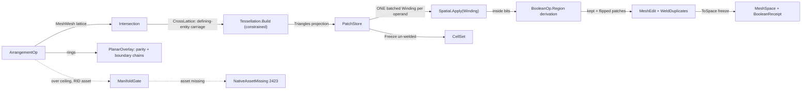

# [RASM_ARRANGEMENT]

`Rasm.Meshing` owns the exact mesh-and-polygon arrangement: ONE `ArrangementOp` `[Union]` — `MeshBoolean`, `PlanarOverlay`, `CellComplex` — folded by ONE `Arrangement.Apply` entry over the shared subdivide → classify → keep → weld algebra, `BooleanOp` the region-predicate vocabulary keep and flip derive from, so union, difference, and intersection are three data rows over one classification. Managed exactness is the ONE correctness rail, `manifoldc` the tier-3 scale companion behind the finite `ScaleCeiling`: an over-ceiling call with no per-RID native asset fails typed on the `Rasm.Numerics` band-2400 union.

A rebuild composes each floor from its owner: the crossing lattice from `Intersection.Apply` (`CrossLattice`, defining-entity carriage on both operand faces), the per-face constrained re-triangulation from `Tessellation.Build` (`Constraint.Crossing` foreign-plane rows, `CrossKey`-interned `Implicit` crossing vertices, depth-1 re-anchoring owned there), the batched inside/outside scalar from ONE `SpatialQuery.Winding` per operand, soup and weld from `MeshEdit.Of` + `Kernels.WeldDuplicates` at the `ArenaPolicy` band. `BooleanOp` and `BooleanReceipt` mint here; `Processing/receipts` composes `BooleanReceipt` as the heal-session payload, `Processing/repair`'s `HealOp.Boolean` delegates to `Arrangement.Apply`.

## [01]-[INDEX]

- [01]-[ARRANGEMENT]: `Arrangement.Apply` folds the subdivide → classify → keep → weld algebra over `BooleanOp` region-predicate rows; `PatchStore` arena and frozen `CellSet`; `BooleanReceipt` with typed `BooleanRoute`; the `manifoldc` tier-3 scale gate.

## [02]-[ARRANGEMENT]

- Owner: `BooleanOp` `[SmartEnum<int>]` (`Union`/`Difference`/`Intersection`) — each row carries the `[UseDelegateFromConstructor]` `Region` predicate column and the `Native` `ManifoldOpType` ordinal; `Keep` and `Flip` DERIVE over `Region`, one classification never three keep bodies; `BooleanRoute` `[SmartEnum<string>]` (`managed`/`native`) the typed route evidence; `BooleanReceipt` the one typed boolean evidence; `ArrangementPolicy` the policy row binding GWN accuracy, probe nudge, winding admission, the finite `ScaleCeiling`, the constrained `Substrate`, spatial/intersect policies, and the weld `Arena`, registering `IValidityEvidence`; `PatchStore` the single-writer patch arena (triangle corners, operand origin, per-operand inside bits) with its frozen `CellSet` projection; `ArrangementOp`/`ArrangementResult` the request/result unions; `Arrangement` the static surface.
- Cases: `BooleanOp` 3 (`Union`/`Difference`/`Intersection`), `BooleanRoute` 2 (`managed`/`native`), `ArrangementOp` 3 (`MeshBoolean`/`PlanarOverlay`/`CellComplex`), `ArrangementResult` 3 (`Boolean`/`Overlay`/`Complex`); the fence carries every roster. `PlanarOverlay` admits ring sets directly (the `Meshing/offset` self-overlap seam); `CellComplex` retains the classified arrangement un-welded for the `Rasm.Bim` solid classifier.
- Entry: one polymorphic `Apply` discriminating on the op case; no `MeshBool`/`PolygonBool`/`BuildComplex` sibling statics. `Fin` routes `GeometryFault.DegenerateInput` 2400 on an empty mesh operand or an open/degenerate/non-finite overlay ring (rings arrive raw and admit here once; mesh operands carry the `MeshSpace` admission's evidence, the interior never re-validating), `DegenerateArrangement` 2420 on a degenerate classification soup or a substrate failure re-mapped with its face witness, and `NativeAssetMissing` 2423 EXACTLY when combined operand faces exceed `ScaleCeiling` and the per-RID native asset does not resolve — under the ceiling the managed body serves every workload and the gate is never consulted; an over-ceiling `CellComplex` refuses TYPED with an actionable witness, the native engine emitting no classified cell set so the caller raises the revisable `ScaleCeiling` row for a managed run. Both volumetric cases share ONE fold with ONE soup admission per operand — gate, subdivision, classification, native raise, and emission read the same two arenas. `PlanarOverlay` returns oriented loops (outer CCW / holes CW) on intersect's chain vocabulary.
- Auto: `MeshBoolean`/`CellComplex` run the shared `Arrange` fold — (1) `Intersection.Apply(IntersectOp.MeshMesh(a, b, policy.Narrow), key)` yields the frozen `CrossLattice` (defining-entity crossing rows, per-face segments, coplanar constraint rows recorded on BOTH operand faces so the two surfaces split coherently on their shared curve); (2) per operand face, `lattice.OnFace` + `lattice.CoplanarOnFace` drive the subdivision — an un-cut face passes whole as one patch, a cut face builds `Tessellation.Build(TessellationOp.Points(...))` whose vertex rows are the three explicit corners and each crossing endpoint's `Implicit` construction interned by its `CrossKey`, piercing constraints `Constraint.Crossing` rows carrying the OTHER operand's face plane and coplanar sub-segments the perpendicular plane `(S, T, S + ê)` through their carrier edge, the sub-triangles read back through `Triangles()`; (3) classification batches every patch probe (centroid nudged `InteriorOffset` along the patch normal) into ONE `SpatialQuery.Winding(probes, otherSoup, BetaSquared)` per operand, `QueryResult.Field` scalars crossing `WindingThreshold` into the per-operand inside bits; (4) `MeshBoolean` keeps patches where `op.Keep(fromA, insideOther)`, flips winding where `op.Flip(...)` holds, and welds through `MeshEdit.Of` + `Kernels.WeldDuplicates` + `ToSpace`; `CellComplex` stops after (3) and freezes the full `CellSet`. `PlanarOverlay` is the SAME algebra on rings: all ring vertices enter ONE constrained `Tessellation.Build` with every ring edge a `Constraint.Segment`, each triangle classifies by the exact NONZERO winding of its centroid against each operand's ring set (upward crossings +1 / downward −1, exact signs with no epsilon band — nonzero so a self-overlapping cycle set resolves to its true covered region, coinciding with even-odd on simple rings), the region keeps per `op.Region(inA, inB)` directly, and the kept-region boundary edges chain into oriented `Chain` loops.
- Receipt: `BooleanReceipt` — the classified-patch census, keep survivor count, weld vertex-collapse count, and typed `BooleanRoute`; the patch-count delta with route is the boolean evidence `Processing/receipts` carries as the heal-session payload and `Rasm.Bim` reconstruction reads.
- Packages: `Rasm.Meshing` (`Intersection.Apply`, `CrossLattice`/`CrossKey`/`Chain` — the crossing lattice, composed), `Rasm.Numerics` delaunay owners (`Tessellation.Build`, `TessellationOp.Points`, `Constraint.Segment`/`Crossing`, `TessellationPolicy.Constrained`, `Triangles()` — the constrained substrate, composed), `Rasm.Spatial` (`Spatial.Apply` + `SpatialQuery.Winding` batched GWN + `SpatialOp.Build` — composed, never re-built), `Rasm.Meshing` (`MeshEdit.Of`, `Kernels.WeldDuplicates`, `ArenaPolicy` — the soup and weld owners), `Rasm.Numerics` (`Predicate`/`Implicit`/`Sign`/`Axis` — the parity classification signs), `Rasm.Numerics` (`GeometryFault`), `Rasm.Domain` (`Op`, `Kind`, `Context`, `ValidityClaim`/`IValidityEvidence`), `Rasm.Meshing` (`MeshSpace`), `Rhino.Geometry` (`Point3d`/`Polyline`), `manifoldc` (in-house P/Invoke, `api-manifold.md` — the tier-3 scale companion; NO NuGet pin), Thinktecture.Runtime.Extensions, LanguageExt.Core, BCL inbox (`NativeLibrary`, `RuntimeInformation`).
- Growth: a new arrangement modality (a Nef-style 3D cell refinement, a coplanar-face merge overlay) is one `ArrangementOp` case over the SAME arrange fold; a new boolean operation is ONE `BooleanOp` row — its `Region` delegate derives keep and flip with zero new bodies; a new classification or weld knob is one `ArrangementPolicy` column; the tier-3 native path grows only behind the existing `ScaleCeiling` gate (a second native engine is a charter amendment); zero new surface.
- Boundary: ONE `ArrangementOp` `[Union]` owns all three modalities, keep and flip DERIVING from the one `Region` column; composition stops at the public seams — `Tessellation.Build`'s op and `Triangles` projection, never the interior `SimplexStore` or a page-local triangulator, and ONE batched `Spatial/index` `Winding` per operand, the 2D ring parity being the overlay's own exact classification owned here; the managed arrangement is the correctness rail, the native route a scale companion only; `Apply` is total over the `Fin` rail; `CellComplex` retains classification un-welded while the welded boolean is terminal.

```csharp signature
// --- [RUNTIME_PRELUDE] ----------------------------------------------------------------------
using System;
using System.Collections.Generic;
using System.Linq;
using System.Runtime.InteropServices;
using LanguageExt;
using Rasm.Domain;
using Rasm.Numerics;
using Rasm.Spatial;
using Rhino.Geometry;
using Thinktecture;
using static LanguageExt.Prelude;

namespace Rasm.Meshing;

// --- [TYPES] ------------------------------------------------------------------------------
// ONE Region column per row: Keep = region-flip across the patch (a dangling artifact has equal
// region both sides and vanishes), Flip = region on the front side; Native = the ManifoldOpType ordinal.
[SmartEnum<int>]
public sealed partial class BooleanOp {
    public static readonly BooleanOp Union        = new(0, native: 0, static (inA, inB) => inA || inB);
    public static readonly BooleanOp Difference   = new(1, native: 1, static (inA, inB) => inA && !inB);
    public static readonly BooleanOp Intersection = new(2, native: 2, static (inA, inB) => inA && inB);

    public int Native { get; }

    [UseDelegateFromConstructor]
    public partial bool Region(bool inA, bool inB);

    public bool Keep(bool fromA, bool insideOther) =>
        fromA ? Region(true, insideOther) != Region(false, insideOther)
              : Region(insideOther, true) != Region(insideOther, false);

    public bool Flip(bool fromA, bool insideOther) =>
        fromA ? Region(false, insideOther) : Region(insideOther, false);
}

[SmartEnum<string>]
[KeyMemberEqualityComparer<ComparerAccessors.StringOrdinal, string>]
[KeyMemberComparer<ComparerAccessors.StringOrdinal, string>]
public sealed partial class BooleanRoute {
    public static readonly BooleanRoute Managed = new("managed");
    public static readonly BooleanRoute Native  = new("native");
}

// --- [CONSTANTS] --------------------------------------------------------------------------
// ScaleCeiling caps combined operand faces before the manifoldc scale route or the typed 2423 fail.
public sealed record ArrangementPolicy(
    double BetaSquared, double InteriorOffset, double WindingThreshold, long ScaleCeiling,
    TessellationPolicy Substrate, BuildPolicy Broad, IntersectPolicy Narrow, ArenaPolicy Arena) : IValidityEvidence {
    public static readonly ArrangementPolicy Canonical = new(
        BetaSquared: 4.0, InteriorOffset: 1e-7, WindingThreshold: 0.5, ScaleCeiling: 1_000_000,
        Substrate: TessellationPolicy.Constrained, Broad: BuildPolicy.Canonical,
        Narrow: IntersectPolicy.Canonical, Arena: ArenaPolicy.Canonical);

    public bool BeyondManaged(long operandFaces) => operandFaces > ScaleCeiling;

    public bool IsValid => ValidityClaim.All(
        ValidityClaim.Positive(value: BetaSquared),
        ValidityClaim.Positive(value: InteriorOffset),
        ValidityClaim.UnitInterval(value: WindingThreshold),
        ValidityClaim.Positive(value: ScaleCeiling));
}

// --- [MODELS] -----------------------------------------------------------------------------
public sealed record BooleanReceipt(int Classified, int Kept, int Welded, BooleanRoute Route) {
    public static readonly BooleanReceipt Empty = new(0, 0, 0, BooleanRoute.Managed);
}

// Frozen classification projection: the CellComplex artifact the Rasm.Bim solid classifier reads.
public sealed record CellSet((Point3d A, Point3d B, Point3d C)[] Patches, bool[] FromA, bool[] InsideA, bool[] InsideB);

// Single-writer patch arena under the Meshing/edit#ARENA_LAW contract; Freeze() emits the one CellSet projection.
public sealed class PatchStore {
    (Point3d A, Point3d B, Point3d C)[] patches;
    bool[] fromA, insideA, insideB;
    int count;

    public PatchStore(int seed) {
        patches = new (Point3d, Point3d, Point3d)[seed];
        fromA = new bool[seed];
        insideA = new bool[seed];
        insideB = new bool[seed];
    }

    public int Count => count;
    public (Point3d A, Point3d B, Point3d C) Patch(int row) => patches[row];
    public bool FromA(int row) => fromA[row];
    public bool InsideOther(int row) => fromA[row] ? insideB[row] : insideA[row];

    public int Add((Point3d A, Point3d B, Point3d C) patch, bool sideA) {
        Grow(count + 1);
        (patches[count], fromA[count]) = (patch, sideA);
        return count++;
    }

    public void Classify(int row, bool inA, bool inB) => (insideA[row], insideB[row]) = (inA, inB);

    public Point3d Interior(int row, double offset) {
        (Point3d a, Point3d b, Point3d c) = patches[row];
        Point3d centroid = new((a.X + b.X + c.X) / 3.0, (a.Y + b.Y + c.Y) / 3.0, (a.Z + b.Z + c.Z) / 3.0);
        Vector3d n = Vector3d.CrossProduct(b - a, c - a);
        return n.IsTiny() ? centroid : centroid + (offset * (n / n.Length));
    }

    public CellSet Freeze() => new([.. patches.AsSpan(0, count)], [.. fromA.AsSpan(0, count)], [.. insideA.AsSpan(0, count)], [.. insideB.AsSpan(0, count)]);

    void Grow(int needed) {
        if (needed <= patches.Length) { return; }
        int extent = int.Max(needed, patches.Length << 1);
        Array.Resize(ref patches, extent);
        Array.Resize(ref fromA, extent);
        Array.Resize(ref insideA, extent);
        Array.Resize(ref insideB, extent);
    }
}

// --- [OPERATIONS] -------------------------------------------------------------------------
[Union(ConversionFromValue = ConversionOperatorsGeneration.None)]
public abstract partial record ArrangementOp {
    private ArrangementOp() { }

    public sealed record MeshBoolean(MeshSpace A, MeshSpace B, BooleanOp Op, ArrangementPolicy Policy) : ArrangementOp;
    public sealed record PlanarOverlay(Seq<Polyline> A, Seq<Polyline> B, BooleanOp Op, Axis Plane, ArrangementPolicy Policy) : ArrangementOp;
    public sealed record CellComplex(MeshSpace A, MeshSpace B, ArrangementPolicy Policy) : ArrangementOp;
}

[Union(ConversionFromValue = ConversionOperatorsGeneration.None)]
public abstract partial record ArrangementResult {
    private ArrangementResult() { }

    public sealed record Boolean(MeshSpace Solid, BooleanReceipt Receipt) : ArrangementResult;
    public sealed record Overlay(Seq<Chain> Loops, BooleanReceipt Receipt) : ArrangementResult;
    public sealed record Complex(CellSet Cells, BooleanReceipt Receipt) : ArrangementResult;
}

public static class Arrangement {
    public static Fin<ArrangementResult> Apply(ArrangementOp op, Op? key = null) =>
        op.Switch(
            state: key,
            meshBoolean:   static (key, m) => Volumetric(m.A, m.B, Some(m.Op), m.Policy, key),
            planarOverlay: static (key, p) => Overlay(p, key),
            cellComplex:   static (key, c) => Volumetric(c.A, c.B, None, c.Policy, key));

    // ONE soup admission per operand feeds the whole volumetric fold — gate, subdivide, classify, raise,
    // emit share the two arenas; the boolean keeps-and-welds, the cell complex freezes un-welded.
    static Fin<ArrangementResult> Volumetric(MeshSpace a, MeshSpace b, Option<BooleanOp> keep, ArrangementPolicy policy, Op? key) {
        using MeshEdit ea = MeshEdit.Of(a);
        using MeshEdit eb = MeshEdit.Of(b);
        return Gate(ea, eb, policy).Bind(route => route == BooleanRoute.Native
            ? keep.Match(
                Some: op => ManifoldGate.Boolean(ea, eb, op, a.Tolerance, policy, key),
                None: () => Fin.Fail<ArrangementResult>(new GeometryFault.DegenerateArrangement((int)long.Min(policy.ScaleCeiling, int.MaxValue), "cell complex has no native tier; raise ScaleCeiling for a managed run").ToError()))
            : Arrange(a, b, ea, eb, policy, key).Bind(store => keep.Match(
                Some: op => KeepAndWeld(store, op, a.Tolerance, policy, key),
                None: () => Fin.Succ((ArrangementResult)new ArrangementResult.Complex(
                    store.Freeze(), BooleanReceipt.Empty with { Classified = store.Count, Kept = store.Count })))));
    }

    // Admission + tier-3 scale gate. Finiteness is the MeshSpace admission's own evidence, so the
    // interior never re-validates; over-ceiling routes Native only when the RID asset resolves, else 2423.
    static Fin<BooleanRoute> Gate(MeshEdit ea, MeshEdit eb, ArrangementPolicy policy) {
        long faces = (long)ea.FaceCount + eb.FaceCount;
        return (ea.VertexCount, eb.VertexCount) switch {
            (0, _) or (_, 0) => Fin.Fail<BooleanRoute>(new GeometryFault.DegenerateInput(Kind.Mesh, 0, "empty operand").ToError()),
            _ when !policy.BeyondManaged(faces) => Fin.Succ(BooleanRoute.Managed),
            _ when ManifoldGate.AssetResolves() => Fin.Succ(BooleanRoute.Native),
            _ => Fin.Fail<BooleanRoute>(new GeometryFault.NativeAssetMissing("manifoldc", RuntimeInformation.RuntimeIdentifier, policy.ScaleCeiling).ToError()),
        };
    }

    // --- [ARRANGE]
    static Fin<PatchStore> Arrange(MeshSpace a, MeshSpace b, MeshEdit ea, MeshEdit eb, ArrangementPolicy policy, Op? key) {
        PatchStore store = new(int.Max(ea.FaceCount + eb.FaceCount, 16));
        return Intersection.Apply(new IntersectOp.MeshMesh(a, b, policy.Narrow), key)
            .Bind(result => result is IntersectResult.Chains chains
                ? Fin.Succ(chains.Lattice)
                : Fin.Fail<CrossLattice>(new GeometryFault.DegenerateArrangement(0, "mesh-mesh lattice unavailable").ToError()))
            .Bind(lattice => Subdivided(store, ea, lattice, sideA: true, eb, policy, key)
                .Bind(_ => Subdivided(store, eb, lattice, sideA: false, ea, policy, key)))
            .Bind(_ => Classify(store, ea, eb, policy, key));
    }

    static Fin<Unit> Subdivided(PatchStore store, MeshEdit soup, CrossLattice lattice, bool sideA, MeshEdit other, ArrangementPolicy policy, Op? key) {
        int side = sideA ? 0 : 1;
        for (int f = 0; f < soup.FaceCount; f++) {
            (int A, int B, int FaceA, int FaceB)[] cuts = lattice.OnFace(side, f).ToArray();
            (int A, int B, int FaceA, int FaceB, int CarrierU, int CarrierV, int CarrierSide)[] flush = lattice.CoplanarOnFace(side, f).ToArray();
            (int v0, int v1, int v2) = soup.Face(f);
            (Point3d ca, Point3d cb, Point3d cc) = (soup.Position(v0), soup.Position(v1), soup.Position(v2));
            if (cuts.Length == 0 && flush.Length == 0) {
                store.Add((ca, cb, cc), sideA);
                continue;
            }
            Fin<Unit> built = FaceBuild(store, lattice, cuts, flush, sideA, (ca, cb, cc), f, soup, other, policy, key);
            if (built.IsFail) { return built; }
        }
        return Fin.Succ(unit);
    }

    // One constrained per-face build: 3 explicit corners + CrossKey-interned Implicit crossing rows.
    // A piercing cut carries the OTHER operand's face plane; a coplanar sub-segment carries the
    // PERPENDICULAR plane (S, T, S+ê) through its carrier edge — the coplanar face's own plane would
    // degenerate the delaunay recovery re-anchor. Support = this face's corners (the recovery witness).
    static Fin<Unit> FaceBuild(PatchStore store, CrossLattice lattice, (int A, int B, int FaceA, int FaceB)[] cuts, (int A, int B, int FaceA, int FaceB, int CarrierU, int CarrierV, int CarrierSide)[] flush, bool sideA, (Point3d A, Point3d B, Point3d C) face, int faceId, MeshEdit soup, MeshEdit other, ArrangementPolicy policy, Op? key) {
        List<Implicit> rows = new() { new(face.A), new(face.B), new(face.C) };
        Dictionary<CrossKey, int> slotOf = new();
        int Intern(int latticeRow) {
            Crossing crossing = lattice.Rows[latticeRow];
            if (slotOf.TryGetValue(crossing.Key, out int at)) { return at; }
            rows.Add(crossing.Point);
            return slotOf[crossing.Key] = rows.Count - 1;
        }
        return Axis.DominantOf(face.A, face.B, face.C, key).Bind(plane => {
            Vector3d lift = plane.Key == 0 ? new Vector3d(1.0, 0.0, 0.0) : plane.Key == 1 ? new Vector3d(0.0, 1.0, 0.0) : new Vector3d(0.0, 0.0, 1.0);
            List<Constraint> constraints = new(cuts.Length + flush.Length);
            foreach ((int A, int B, int FaceA, int FaceB) cut in cuts) {
                (int o0, int o1, int o2) = other.Face(sideA ? cut.FaceB : cut.FaceA);
                constraints.Add(new Constraint.Crossing(Intern(cut.A), Intern(cut.B), other.Position(o0), other.Position(o1), other.Position(o2)));
            }
            foreach ((int A, int B, int FaceA, int FaceB, int CarrierU, int CarrierV, int CarrierSide) row in flush) {
                MeshEdit carrier = row.CarrierSide == (sideA ? 0 : 1) ? soup : other;
                (Point3d s, Point3d t) = (carrier.Position(row.CarrierU), carrier.Position(row.CarrierV));
                constraints.Add(new Constraint.Crossing(Intern(row.A), Intern(row.B), s, t, s + lift));
            }
            return Tessellation.Build(
                    new TessellationOp.Points(TessellationKind.Triangulation, [.. rows], toSeq(constraints), policy.Substrate, plane, Some((face.A, face.B, face.C))), key)
                .MapFail(fail => new GeometryFault.DegenerateArrangement(faceId, $"substrate: {fail.Message}").ToError())
                .Bind(t => t.Triangles(key))
                .Map(tris => {
                    foreach ((Point3d a, Point3d b, Point3d c) in tris) { store.Add((a, b, c), sideA); }
                    return unit;
                });
        });
    }

    // ONE batched Winding query per operand over every patch probe — never a per-patch loop.
    static Fin<PatchStore> Classify(PatchStore store, MeshEdit ea, MeshEdit eb, ArrangementPolicy policy, Op? key) {
        Point3d[] probes = new Point3d[store.Count];
        for (int p = 0; p < store.Count; p++) { probes[p] = store.Interior(p, policy.InteriorOffset); }
        return (Winding(probes, ea, policy, key), Winding(probes, eb, policy, key)).Apply((wa, wb) => (wa, wb)).As()
            .Map(t => {
                for (int p = 0; p < store.Count; p++) { store.Classify(p, t.wa[p] > policy.WindingThreshold, t.wb[p] > policy.WindingThreshold); }
                return store;
            });
    }

    static Fin<double[]> Winding(Point3d[] probes, MeshEdit soup, ArrangementPolicy policy, Op? key) {
        Point3d[] triangles = new Point3d[3 * soup.FaceCount];
        BoundingBox[] boxes = new BoundingBox[soup.FaceCount];
        for (int f = 0; f < soup.FaceCount; f++) {
            (int a, int b, int c) = soup.Face(f);
            (triangles[3 * f], triangles[(3 * f) + 1], triangles[(3 * f) + 2]) = (soup.Position(a), soup.Position(b), soup.Position(c));
            boxes[f] = soup.Bounds(f);
        }
        return Spatial.Apply(new SpatialOp.Build(SpatialKind.Bvh, boxes, policy.Broad), key)
            .Bind(answer => answer is SpatialAnswer.Index built
                ? Spatial.Apply(new SpatialOp.Query(built.Value, new SpatialQuery.Winding(probes, triangles, policy.BetaSquared)), key)
                : Fin.Fail<SpatialAnswer>(new GeometryFault.DegenerateArrangement(soup.FaceCount, "winding index unavailable").ToError()))
            .Bind(static answer => answer is SpatialAnswer.Result { Value: QueryResult.Field field }
                ? Fin.Succ(field.Values)
                : Fin.Fail<double[]>(new GeometryFault.KindMismatch(SpatialKind.Bvh, QueryKind.Winding).ToError()));
    }

    // --- [KEEP_AND_WELD]
    static Fin<ArrangementResult> KeepAndWeld(PatchStore store, BooleanOp op, Context tolerance, ArrangementPolicy policy, Op? key) {
        List<Point3d> vertices = new(3 * store.Count);
        List<(int, int, int)> faces = new(store.Count);
        int kept = 0;
        for (int p = 0; p < store.Count; p++) {
            if (!op.Keep(store.FromA(p), store.InsideOther(p))) { continue; }
            (Point3d a, Point3d b, Point3d c) = store.Patch(p);
            int at = vertices.Count;
            vertices.AddRange([a, b, c]);
            faces.Add(op.Flip(store.FromA(p), store.InsideOther(p)) ? (at, at + 2, at + 1) : (at, at + 1, at + 2));
            kept++;
        }
        using MeshEdit edit = MeshEdit.Of([.. vertices], [.. faces], policy.Arena);
        int before = edit.VertexCount;
        Kernels.WeldDuplicates(edit);
        return edit.ToSpace(tolerance, key).Map(solid => (ArrangementResult)new ArrangementResult.Boolean(
            solid, new BooleanReceipt(store.Count, kept, before - edit.VertexCount, BooleanRoute.Managed)));
    }

    // --- [PLANAR_OVERLAY]
    static Fin<ArrangementResult> Overlay(ArrangementOp.PlanarOverlay op, Op? key) {
        List<Implicit> rows = new();
        List<Constraint> constraints = new();
        int ordinal = 0;
        foreach (Polyline ring in op.A.Concat(op.B)) {
            if (ring.Count < 4 || !ring.IsClosed) {
                return Fin.Fail<ArrangementResult>(new GeometryFault.DegenerateInput(Kind.Polyline, ordinal, "open or degenerate ring").ToError());
            }
            for (int v = 0; v < ring.Count - 1; v++) {  // rings arrive RAW — this is their one admission seam
                if (!ring[v].IsValid) { return Fin.Fail<ArrangementResult>(new GeometryFault.DegenerateInput(Kind.Polyline, ordinal, "non-finite ring vertex").ToError()); }
            }
            int baseAt = rows.Count;
            for (int v = 0; v < ring.Count - 1; v++) { rows.Add(new Implicit(ring[v])); }
            for (int v = 0; v < ring.Count - 1; v++) { constraints.Add(new Constraint.Segment(baseAt + v, baseAt + ((v + 1) % (ring.Count - 1)))); }
            ordinal++;
        }
        return Tessellation.Build(new TessellationOp.Points(TessellationKind.Triangulation, [.. rows], toSeq(constraints), op.Policy.Substrate, op.Plane), key)
            .Bind(t => t.Triangles(key))
            .Map(tris => {
                bool[] region = new bool[tris.Length];
                for (int i = 0; i < tris.Length; i++) {
                    (Point3d a, Point3d b, Point3d c) = tris[i];
                    Point3d probe = new((a.X + b.X + c.X) / 3.0, (a.Y + b.Y + c.Y) / 3.0, (a.Z + b.Z + c.Z) / 3.0);
                    region[i] = op.Op.Region(Winding(probe, op.A, op.Plane), Winding(probe, op.B, op.Plane));
                }
                Seq<Chain> loops = BoundaryLoops(tris, region);
                return (ArrangementResult)new ArrangementResult.Overlay(
                    loops, new BooleanReceipt(tris.Length, region.Count(static r => r), 0, BooleanRoute.Managed));
            });
    }

    // Exact NONZERO winding: the +U half-line counts edge (a,b) iff its endpoints straddle V
    // HALF-OPEN (a Zero endpoint counts with the non-negative side, so an on-ray vertex neither
    // double-counts nor vanishes) at an exact +U side sign; +1 up, -1 down. Nonzero, not even-odd,
    // so a self-overlapping cycle set resolves to its true covered region. Probes are build centroids.
    static bool Winding(Point3d probe, Seq<Polyline> rings, Axis plane) {
        int v = plane.V;
        int count = 0;
        foreach (Polyline ring in rings) {
            for (int e = 0; e < ring.Count - 1; e++) {
                (Point3d a, Point3d b) = (ring[e], ring[e + 1]);
                bool aBelow = Sign.Of(Axis.Coord(a, v).CompareTo(Axis.Coord(probe, v))) == Sign.Negative;
                bool bBelow = Sign.Of(Axis.Coord(b, v).CompareTo(Axis.Coord(probe, v))) == Sign.Negative;
                if (aBelow == bBelow) { continue; }
                Sign side = Predicate.Orient2D(new Implicit(a), new Implicit(b), new Implicit(probe), plane);
                if (side == Sign.Zero) { continue; }
                if (aBelow ? side == Sign.Positive : side == Sign.Negative) { count += aBelow ? 1 : -1; }
            }
        }
        return count != 0;
    }

    // Boundary of the kept region: kept/unkept edge pairs cancel in opposite orientation, chained by
    // shared endpoints (outer CCW, holes CW). Endpoint keys are BIT-IDENTICAL (one Round() per row),
    // so a pinch vertex is a stacked start the walk drains one loop at a time; seeds drain first-seen.
    static Seq<Chain> BoundaryLoops((Point3d A, Point3d B, Point3d C)[] tris, bool[] region) {
        Dictionary<(Point3d, Point3d), (Point3d From, Point3d To)> boundary = new();
        for (int i = 0; i < tris.Length; i++) {
            if (!region[i]) { continue; }
            foreach ((Point3d p, Point3d q) in (ReadOnlySpan<(Point3d, Point3d)>)[(tris[i].A, tris[i].B), (tris[i].B, tris[i].C), (tris[i].C, tris[i].A)]) {
                if (!boundary.Remove((q, p))) { boundary[(p, q)] = (p, q); }
            }
        }
        Dictionary<Point3d, Stack<Point3d>> byStart = new();
        List<Point3d> order = new();
        for (int i = 0; i < tris.Length; i++) {
            if (!region[i]) { continue; }
            foreach ((Point3d p, Point3d q) in (ReadOnlySpan<(Point3d, Point3d)>)[(tris[i].A, tris[i].B), (tris[i].B, tris[i].C), (tris[i].C, tris[i].A)]) {
                if (!boundary.TryGetValue((p, q), out (Point3d From, Point3d To) edge)) { continue; }
                if (!byStart.TryGetValue(edge.From, out Stack<Point3d>? tos)) {
                    byStart[edge.From] = tos = new Stack<Point3d>();
                    order.Add(edge.From);
                }
                tos.Push(edge.To);
            }
        }
        List<Chain> loops = new();
        foreach (Point3d seed in order) {
            while (byStart.ContainsKey(seed)) {
                Polyline loop = new() { seed };
                Point3d cur = seed;
                while (byStart.TryGetValue(cur, out Stack<Point3d>? outgoing)) {
                    Point3d next = outgoing.Pop();
                    if (outgoing.Count == 0) { byStart.Remove(cur); }
                    loop.Add(next);
                    cur = next;
                    if (cur == seed) { break; }
                }
                if (loop.Count > 2) { loops.Add(new Chain(loop, Closed: cur == seed)); }
            }
        }
        return toSeq(loops);
    }

}

// --- [COMPOSITION] --------------------------------------------------------------------------
// Tier-3 scale companion (api-manifold.md): capsule-owned manifoldc P/Invoke. Booleans are LAZY CSG
// upstream, so manifold_status is the eager read surfacing a propagated rejection BEFORE extraction;
// every alloc pairs with delete on every exit — the memory law, the platform-forced statement seam.
file static partial class ManifoldGate {
    [LibraryImport("manifoldc")] private static partial nint manifold_alloc_meshgl64();
    [LibraryImport("manifoldc")] private static partial nint manifold_alloc_manifold();
    [LibraryImport("manifoldc")] private static partial nint manifold_meshgl64(nint mem, [In] double[] vertProps, nuint nVerts, nuint nProps, [In] ulong[] triVerts, nuint nTris);
    [LibraryImport("manifoldc")] private static partial nint manifold_of_meshgl64(nint mem, nint mesh);
    [LibraryImport("manifoldc")] private static partial nint manifold_boolean(nint mem, nint a, nint b, int op);
    [LibraryImport("manifoldc")] private static partial int manifold_status(nint m);
    [LibraryImport("manifoldc")] private static partial nint manifold_get_meshgl64(nint mem, nint m);
    [LibraryImport("manifoldc")] private static partial nuint manifold_meshgl64_num_vert(nint m);
    [LibraryImport("manifoldc")] private static partial nuint manifold_meshgl64_num_tri(nint m);
    [LibraryImport("manifoldc")] private static partial nint manifold_meshgl64_vert_properties([Out] double[] mem, nint m);
    [LibraryImport("manifoldc")] private static partial nint manifold_meshgl64_tri_verts([Out] ulong[] mem, nint m);
    [LibraryImport("manifoldc")] private static partial void manifold_delete_manifold(nint m);
    [LibraryImport("manifoldc")] private static partial void manifold_delete_meshgl64(nint m);

    internal static bool AssetResolves() => NativeLibrary.TryLoad("manifoldc", out nint handle) && Free(handle);

    static bool Free(nint handle) { NativeLibrary.Free(handle); return true; }

    internal static Fin<ArrangementResult> Boolean(MeshEdit ea, MeshEdit eb, BooleanOp op, Context tolerance, ArrangementPolicy policy, Op? key) {
        (nint ma, nint mb, nint raw) = (0, 0, 0);
        try {
            ma = Raise(ea);
            mb = Raise(eb);
            if (manifold_status(ma) != 0 || manifold_status(mb) != 0) {
                return Fin.Fail<ArrangementResult>(new GeometryFault.DegenerateArrangement(0, "manifoldc rejected an operand").ToError());
            }
            raw = manifold_boolean(manifold_alloc_manifold(), ma, mb, op.Native);
            return manifold_status(raw) is int status and not 0
                ? Fin.Fail<ArrangementResult>(new GeometryFault.DegenerateArrangement(0, $"manifoldc boolean status {status}").ToError())
                : Lower(raw, tolerance, policy, key).Map(lowered =>
                    (ArrangementResult)new ArrangementResult.Boolean(lowered.Solid, lowered.Receipt));
        }
        finally {
            if (raw != 0) { manifold_delete_manifold(raw); }
            if (mb != 0) { manifold_delete_manifold(mb); }
            if (ma != 0) { manifold_delete_manifold(ma); }
        }
    }

    // Raise: the already-admitted arena's double columns feed manifold_meshgl64 (positions-only,
    // n_props = 3); manifold_of_meshgl64 never aborts — the status read is the typed rejection.
    static nint Raise(MeshEdit soup) {
        double[] props = new double[3 * soup.VertexCount];
        for (int v = 0; v < soup.VertexCount; v++) { (props[3 * v], props[(3 * v) + 1], props[(3 * v) + 2]) = (soup.X[v], soup.Y[v], soup.Z[v]); }
        ulong[] tris = new ulong[3 * soup.FaceCount];
        for (int f = 0; f < soup.FaceCount; f++) {
            (int a, int b, int c) = soup.Face(f);
            (tris[3 * f], tris[(3 * f) + 1], tris[(3 * f) + 2]) = ((ulong)a, (ulong)b, (ulong)c);
        }
        nint mesh = manifold_meshgl64(manifold_alloc_meshgl64(), props, (nuint)soup.VertexCount, 3, tris, (nuint)soup.FaceCount);
        try { return manifold_of_meshgl64(manifold_alloc_manifold(), mesh); }
        finally { manifold_delete_meshgl64(mesh); }
    }

    // Lower: census-sized extraction, then the SAME weld + freeze seam the managed route publishes — one emission law.
    static Fin<(MeshSpace Solid, BooleanReceipt Receipt)> Lower(nint result, Context tolerance, ArrangementPolicy policy, Op? key) {
        nint mesh = manifold_get_meshgl64(manifold_alloc_meshgl64(), result);
        try {
            int nv = (int)manifold_meshgl64_num_vert(mesh);
            int nt = (int)manifold_meshgl64_num_tri(mesh);
            double[] props = new double[3 * nv];
            ulong[] tris = new ulong[3 * nt];
            _ = manifold_meshgl64_vert_properties(props, mesh);
            _ = manifold_meshgl64_tri_verts(tris, mesh);
            Point3d[] vertices = new Point3d[nv];
            for (int v = 0; v < nv; v++) { vertices[v] = new Point3d(props[3 * v], props[(3 * v) + 1], props[(3 * v) + 2]); }
            (int, int, int)[] faces = new (int, int, int)[nt];
            for (int f = 0; f < nt; f++) { faces[f] = ((int)tris[3 * f], (int)tris[(3 * f) + 1], (int)tris[(3 * f) + 2]); }
            using MeshEdit edit = MeshEdit.Of(vertices, faces, policy.Arena);
            int before = edit.VertexCount;
            Kernels.WeldDuplicates(edit);
            return edit.ToSpace(tolerance, key).Map(solid =>
                (solid, new BooleanReceipt(nt, nt, before - edit.VertexCount, BooleanRoute.Native)));
        }
        finally { manifold_delete_meshgl64(mesh); }
    }
}
```



## [03]-[DENSITY_BAR]

`[RAIL]` cells name the one return rail each owner exposes.

| [INDEX] | [AXIS_CONCERN]     | [OWNER]          | [RAIL]                                       | [CASES] |
| :-----: | :----------------- | :--------------- | :------------------------------------------- | :-----: |
|  [01]   | Arrangement        | `ArrangementOp`  | `Arrangement.Apply → Fin<ArrangementResult>` |    3    |
|  [02]   | Boolean vocabulary | `BooleanOp`      | policy rows (repair delegates)               |    3    |
|  [03]   | Route evidence     | `BooleanRoute`   | receipt field                                |    2    |
|  [04]   | Boolean evidence   | `BooleanReceipt` | carrier                                      |    —    |
|  [05]   | Patch arena        | `PatchStore`     | frozen projection                            |    —    |
|  [06]   | Scale companion    | `ManifoldGate`   | `Fin` (2423 on missing asset)                |    —    |

## [04]-[RESEARCH]

<!-- source-only: research row template:
[TOKEN]-[OPEN|BLOCKED]: <exact question>; <verification route>.
[SPLIT_MEMBER]-[OPEN]: does `shape-core` expose `split_all`; verify against the member rail.
-->

(none)
