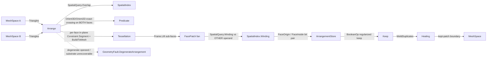

# [RASM_ARRANGEMENT]

The fully-managed exact-arithmetic mesh and polygon arrangement owner — ONE `Arrangement` `[Union]` (`MeshBoolean`/`PlanarOverlay`/`CellComplex`) that subdivides each operand surface triangle IN ITS OWN supporting plane on the triangle-triangle intersection segments it carries, classifies each resulting surface patch inside/outside the OTHER operand by the exact per-triangle solid-angle generalized-winding scalar, keeps the patches the `BooleanOp` regularized membership rule selects, and welds the kept-patch boundary into a clean manifold (the Cherchi-Attene mesh-arrangement boolean — a surface subdivision, NEVER a convex-hull tetrahedralization of the combined point set). The page composes the `Numerics/predicates#ROBUST_PREDICATES` exact `Orient3D`/`Orient2D`/`InCircle`/`InSphere` floor so every triangle-triangle crossing existence and containment decision is an exact `Sign` — never a loosened float band — and rides the `Meshing/delaunay#TESSELLATION` constrained `Build`/`ToMesh` rail as the per-face in-plane re-triangulation substrate whose own constraint recovery routes the constructed crossing through the `Numerics/predicates#INDIRECT_PREDICATES` `Lpi`/`Tpi` exact-sign path, and reads the `Spatial/index#GENERALIZED_WINDING` `SpatialQuery.Winding` scalar and the `Spatial/index#SPATIAL_INDEX` `SpatialQuery.Overlap` broad-phase as the patch classifier and the candidate-pair generator. The page owns the `ArrangementKind` `[SmartEnum<string>]` discriminant (binding the shipped `ComparerAccessors.StringOrdinal` string-key comparer), the `ArrangementStore` flat sub-face SoA, the `Arrangement` `[Union]` with its one polymorphic `Apply` fold, and the typed `BooleanReceipt` evidence — retiring the tier-3 native CSG gate the `Processing/repair#BOOLEAN_NATIVE_ASSET` row reserves for the common managed cases.

The arrangement composes `Vectors` `Point3d`/`Vector3d`/`MeshSpace`, the `Healing` `BooleanOp` `[SmartEnum<int>]` (`Union`/`Difference`/`Intersection`) and the `Healing` `DuplicateWeld` boundary kernel, and the `Geometry` `ComparerAccessors.StringOrdinal` ordinal comparer as SETTLED vocabulary — read, compose, never re-mint — and operates on raw `double` only at the `Predicate` and `SpatialQuery.Winding` seams (a coordinate is the domain's native scalar) plus the welder's snap inner loop the healing page already sanctions. Every reachable failure routes the band-2400 `GeometryFault` union; the managed boolean is gated only on the tier-3 native asset reserved for the performance/scale path the exact managed arrangement does not cover, never on a missing managed body. The `MeshBoolean` result re-emits the canonical hash-friendly `MeshSpace` the `Spatial/reconciliation#NAMING_HASH` `Encode` content-addresses; this owner computes no hash and mints no second identity.

## [01]-[INDEX]

- [01]-[ARRANGEMENT]: `ArrangementKind` discriminant; `Arrangement` `[Union]` (`MeshBoolean`/`PlanarOverlay`/`CellComplex`) over one `ArrangementStore` SoA; the `Apply` surface-arrangement fold composing exact-sign crossing subdivision, per-face in-plane constrained re-triangulation substrate, GWN surface-patch classification, `BooleanOp` patch-keep predicate, and `DuplicateWeld` boundary weld; the typed `BooleanReceipt` evidence.

## [02]-[ARRANGEMENT]

- Owner: `ArrangementKind` `[SmartEnum<string>]` the arrangement-modality discriminant binding the shipped `ComparerAccessors.StringOrdinal` as its string-key comparer (`mesh-boolean`/`planar-overlay`/`cell-complex`) carrying the per-kind `Substrate` (`Triangulation` for all — the boolean is a surface arrangement, re-meshed in each face's own supporting plane, never a volumetric tetrahedralization) column; `ArrangementStore` the struct-of-arrays flat sub-face memory `ScorePatches` writes and the weld re-keys — `Vertices` the lifted 3D patch corners, `Faces` triple-slot vertex indices, `FaceOrigin` the operand a patch was carved from (`FromA`/`FromB`), `FaceInside` the per-operand inside/outside bit pair; `Arrangement` `[Union]` `MeshBoolean`/`PlanarOverlay`/`CellComplex` carrying that one store plus the chosen `BooleanOp`; `BooleanReceipt` the typed evidence (classified-patch count, kept-patch count, weld-collapse count, asset-gated flag); `Apply` the ONE polymorphic fold by `Arrangement` case.
- Cases: `ArrangementKind` rows `mesh-boolean` · `planar-overlay` · `cell-complex` (3); `Arrangement` cases `MeshBoolean` · `PlanarOverlay` · `CellComplex` (3 — `PlanarOverlay` is the SAME surface-patch algebra restricted to one shared supporting plane, the exact 2D polygon boolean retiring the float Clipper2 the fabrication lane carries for the robust core, never a parallel `PolygonBoolean` class); `BooleanOp` rows `Union` · `Difference` · `Intersection` (3, COMPOSED from `Processing/repair#HEALING`, never a second discriminant); `BooleanReceipt` one typed evidence carrier (the most refined receipt the arrangement admits — a patch-count delta, not a generic ledger).
- Entry: `public static Fin<Arrangement> Apply(ArrangementKind kind, MeshSpace a, MeshSpace b, BooleanOp op, ArrangementPolicy policy)` — the ONE arrangement entrypoint discriminating by `ArrangementKind` value, `Fin<T>` routing a band-2400 `GeometryFault.DegenerateInput` on an empty/non-finite operand and `GeometryFault.NativeAssetMissing` only when `ArrangementPolicy.BeyondManaged(operandTriangleCount)` reports the combined operand-triangle count above the `ScaleCeiling` column (the reserved tier-3 native scale route, a deterministic pure trigger), so under `ArrangementPolicy.Canonical` (`ScaleCeiling: int.MaxValue`) the managed body satisfies EVERY workload and the gate is never taken; there is no `MeshBool`/`PolygonBool`/`BuildComplex` sibling family — one polymorphic `Apply` discriminates by kind, and the `CellComplex` kind ignores `op` (it retains every classified patch as the reusable arrangement the `Rasm.Bim` solid classifier reads). `public Fin<MeshSpace> ToMesh(Context tolerance)` re-emits the kept-patch boundary as a `Vectors` `MeshSpace` at the in-process seam; `public BooleanReceipt Receipt` reads the typed patch-count evidence.
- Auto: `Apply` reads the `Arrangers` `FrozenDictionary` keyed by `ArrangementKind` so the modality selection is a data-table row, never a `kind switch` cascade — every row lowers to the SAME `Arrange` surface-arrangement fold over the shared `ArrangementStore`. `Arrange` (1) broad-phases the operand-triangle pairs through the `Spatial/index#SPATIAL_INDEX` `SpatialQuery.Overlap` over the two operands' BVHs so only the AABB-overlapping pairs reach the narrow phase (never an O(n²) all-pairs cross), (2) for each candidate pair computes the triangle-triangle intersection SEGMENT by the EXACT crossing test — an operand edge crosses the other triangle's supporting plane iff its two endpoints carry differing non-zero `Predicate.Orient3D` signs against that plane, and the crossing lies inside the triangle iff the exact `Predicate.Orient2D` containment holds in the dominant-axis projection (the same symmetric exact straddle the `Processing/repair#HEALING` `SelfIntersectResolve` spells), the crossing coordinate materialized at the plane intersection only as the substrate vertex the constrained re-triangulation consumes (the exactness is in the sign decisions, never a loosened float in/out guess), ordering the crossing endpoints along the segment by their projection on the segment direction so a fan subdivides deterministically, and recording the segment ON BOTH operand faces it cuts so the two surfaces split coherently on their shared intersection curve, (3) subdivides EACH operand face in its OWN supporting plane (`Subdivide` drops the face to its dominant-axis 2D `Frame`, feeds the in-plane crossing segments as `Constraint.Segment`s into the `Meshing/delaunay#TESSELLATION` `Tessellation.Build(kind.Substrate, points, constraints, policy.Substrate)` at `Triangulation` arity, and lifts each emitted sub-triangle back to 3D by `Frame.Lift` barycentric reconstruction against the parent corners — a face with no crossing passes through whole, a constructed Steiner crossing routing the substrate's own `Numerics/predicates#INDIRECT_PREDICATES` `Lpi`/`Tpi` exact-sign path the delaunay `Recover` already composes), (4) classifies each resulting surface patch inside/outside the OTHER operand by the `Spatial/index#GENERALIZED_WINDING` `SpatialQuery.Winding` scalar evaluated at the patch's interior probe point (the centroid nudged `InteriorOffset` along the patch normal) against that other operand's triangle soup (`~1` inside, `~0` outside, robust across the operand's own defects — the exact per-triangle solid-angle GWN the `repair.md#BOOLEAN_NATIVE_ASSET` contract names, here composed not re-built), packing BOTH per-operand bits into `FaceInside` so a `CellComplex` reader keeps the full classification, (5) selects the kept patches by the `BooleanOp` regularized membership rule (`Union`: each operand's patches OUTSIDE the other; `Difference` A−B: A-patches outside B plus B-patches inside A; `Intersection`: each operand's patches inside the other), and (6) welds the kept-patch boundary through the `Processing/repair#HEALING` `Kernels.WeldDuplicates` kernel so the seam between adjacent kept patches collapses to a clean shared edge and the result is a manifold. The `CellComplex` kind stops after (4) and retains every classified patch with its full per-operand `FaceInside` bit pair; the two boolean kinds run (5)–(6). The `BooleanReceipt` binds the classified-patch count, the kept-patch count, the weld-collapse count, and `AssetGated: false` (the managed body satisfied the operation without the native asset).
- Receipt: `Apply` carries a `BooleanReceipt` typed to the arrangement — `Classified` (the patch count the GWN pass scored), `Kept` (the patch count the `BooleanOp` predicate selected), `Welded` (the boundary-vertex count the weld collapsed), and `AssetGated` (false for the managed path, true only on the reserved tier-3 native route) — never a generic `IReceipt`/ledger; the patch-count delta IS the boolean evidence the `Rasm.Bim` reconstruction and the consuming tests read.
- Packages: `Rasm.Geometry.Numerics` (`Predicate.Orient3D`/`Orient2D` exact crossing/containment signs and `Sign` verdict for the segment construction; `Predicate.OrientLPI`/`OrientTPI` and the `Lpi`/`Tpi` exact homogeneous implicit points the substrate's constraint recovery composes for the constructed-crossing flip — composed, the robustness floor), `Rasm.Geometry.Tessellation` (`Tessellation.Build`/`ToMesh`, `Constraint.Segment`, `TessellationKind` — the per-face in-plane constrained re-triangulation substrate, composed), `Rasm.Geometry.Spatial` (`SpatialIndex.Build`/`Query`, `SpatialQuery.Winding`/`Overlap`, `QueryResult.Scalar`/`Pairs` — the GWN patch classifier and the broad-phase, composed, never re-built), `Rasm.Geometry.Healing` (`BooleanOp` `[SmartEnum<int>]`, `MeshEdit`, `Kernels.WeldDuplicates` — the boundary weld, composed), `Rasm`/Vectors (`MeshSpace`, native `Mesh` topology, `Point3d`/`Vector3d` — composed), ExtendedNumerics.BigRational (`Fraction`/`Fraction.CompareTo`, `(Fraction)double` lossless decomposition — the exact-rational crossing-endpoint ordering key so the cell complex's combinatorial structure never depends on a float projection sort, composed never re-minted), Thinktecture.Runtime.Extensions, LanguageExt.Core, BCL inbox (`FrozenDictionary`, `List<T>`, `Dictionary<,>`, `ILookup<,>`).
- Growth: a new arrangement modality (a 3D cell-complex Nef-style regularized boolean, a coplanar-face overlay merge) is one `ArrangementKind` row plus one `Arrangers` `FrozenDictionary` row writing the shared `ArrangementStore` over the same `Arrange` fold — never a parallel `MeshArranger`/`PolygonOverlay` class with a duplicated classification surface; a new boolean operation is admitted only by a `BooleanOp` row on the `Healing` owner (this page composes it, never widens it); a new classification accuracy or weld knob is one column on `ArrangementPolicy`; the reserved tier-3 native scale route lands as a finite `ArrangementPolicy.ScaleCeiling` value plus one `Arrangers`-side native branch the `BeyondManaged` gate already routes — never a second arrangement owner or a parallel scale gate; zero new surface.
- Boundary: the arrangement is the ONE polymorphic `Arrangement` `[Union]` and a `MeshBooleanOp`/`PlanarOverlayOp`/`CellComplexBuilder` sibling-class family each carrying its own `Run`/`Build`/`Execute` surface is the named density defect collapsed here onto one union folded by one `Apply` — the three kinds differ ONLY in whether they keep the `BooleanOp`-selected patches or retain the full classified arrangement, never in the subdivide/classify/keep/weld algebra, so `Apply`/`ToMesh`/`Receipt` live on the union base and read the shared store kind-agnostically; the `Arrangers` `FrozenDictionary` is the single modality-selection data table and an `ArrangementKind kind switch` arm cascade in `Apply` is the deleted form; the divergent names `MeshArrangement`/`CellClassification`/`ArrangementReceipt` are DROPPED — `Arrangement`/the in-store `FaceInside` classification/`BooleanReceipt` are the canonical owners; the boolean is a SURFACE arrangement — each operand face is subdivided in its own supporting plane and a convex-hull tetrahedralization of the combined point set (whose connected components are NOT the boolean's bounded regions and whose internal faces are not the operand surfaces) is the named correctness defect this rebuild deletes; every triangle-triangle crossing existence and containment is an exact `Predicate.Orient3D`/`Orient2D` sign and a loosened float in/out band over a near-coplanar pair is the named precision-loss defect the exact floor prevents; the materialized crossing coordinate is a substrate vertex only, and the substrate's constraint recovery routes it through the `Numerics/predicates#INDIRECT_PREDICATES` `Lpi`/`Tpi` exact-sign path so the substrate's flip decisions never round (re-rounding a substrate flip back through a loosened float in-circle is the named defect the implicit-point family exists to prevent); the patch classification COMPOSES the `Spatial/index#GENERALIZED_WINDING` `SpatialQuery.Winding` scalar and a domain-local ray-parity or per-patch winding re-implementation is the rejected double-owner form (the spatial owner is the single GWN owner this page reads); the in-plane re-triangulation COMPOSES the `Meshing/delaunay#TESSELLATION` `Build`/`ToMesh` rail and a domain-local triangulator is the deleted form; the boundary weld COMPOSES the `Processing/repair#HEALING` `Kernels.WeldDuplicates` kernel and a domain-local welder is the deleted form; the broad-phase COMPOSES the `Spatial/index#SPATIAL_INDEX` `SpatialQuery.Overlap` and an O(n²) all-pairs triangle cross is the deleted form; `Apply` is total over the `Fin` rail and a thrown exception on a degenerate operand is forbidden — the defect routes `GeometryFault.DegenerateInput`/`GeometryFault.DegenerateArrangement(...).ToError()` over the band-2400 union (`DegenerateArrangement` is the `arrangement` sub-band case 2420 the `Numerics/faults#FAULT_BAND` owner already declares — this page routes it, never mints it); the subdivide/classify tests operate on raw `double` only at the `Predicate` and `SpatialQuery.Winding` seams because a coordinate is the domain's native scalar, and a `double` crossing a public arrangement signature outside a `Point3d` coordinate is the seam violation; the boolean preserves capability — the weld collapses a coincident boundary but never deletes a kept patch, and the `Difference`/`Intersection` keep-predicate retains the full selected solid surface, so no arrangement reduces the result below its valid genus.

```csharp contract
// --- [RUNTIME_PRELUDE] --------------------------------------------------------------------
using System;
using System.Collections.Frozen;
using System.Collections.Generic;
using System.Linq;
using ExtendedNumerics;
using LanguageExt;
using LanguageExt.Common;
using Rasm.Geometry;
using Rasm.Geometry.Healing;
using Rasm.Geometry.Numerics;
using Rasm.Geometry.Spatial;
using Rasm.Geometry.Tessellation;
using Rasm.Vectors;
using Rhino.Geometry;
using Thinktecture;
using static LanguageExt.Prelude;

namespace Rasm.Geometry.Arrangement;

// --- [TYPES] ------------------------------------------------------------------------------
[SmartEnum<string>]
[KeyMemberEqualityComparer<ComparerAccessors.StringOrdinal, string>]
[KeyMemberComparer<ComparerAccessors.StringOrdinal, string>]
public sealed partial class ArrangementKind {
    public static readonly ArrangementKind MeshBoolean  = new("mesh-boolean", substrate: TessellationKind.Triangulation);
    public static readonly ArrangementKind PlanarOverlay = new("planar-overlay", substrate: TessellationKind.Triangulation);
    public static readonly ArrangementKind CellComplex  = new("cell-complex", substrate: TessellationKind.Triangulation);

    // Every kind re-meshes each operand face IN ITS OWN supporting plane — the arrangement is a surface
    // subdivision, so the substrate is `Triangulation` at planar arity for the 3D and 2D kinds alike; the
    // 3D-vs-2D distinction is the per-face dominant-axis drop the subdivision computes, not a substrate arity.
    public TessellationKind Substrate { get; }
}

// --- [CONSTANTS] --------------------------------------------------------------------------
public sealed record ArrangementPolicy(double BetaSquared, double WeldTolerance, double InteriorOffset, int ScaleCeiling, TessellationPolicy Substrate, BuildPolicy Broad) {
    public static readonly ArrangementPolicy Canonical =
        new(BetaSquared: 4.0, WeldTolerance: 1e-6, InteriorOffset: 1e-7, ScaleCeiling: int.MaxValue, Substrate: TessellationPolicy.Canonical, Broad: BuildPolicy.Canonical);

    public RepairPolicy Weld => RepairPolicy.Canonical with { WeldTolerance = WeldTolerance };

    public bool BeyondManaged(int operandTriangles) => operandTriangles > ScaleCeiling;
}

// --- [MODELS] -----------------------------------------------------------------------------
// The arrangement is a flat sub-face SoA: one row per subdivided operand patch carrying its three lifted
// vertex slots, its operand origin (`FromA`/`FromB`), and its per-operand inside bit pair, then re-keyed to
// the welded vertex set on the kept boundary. `FaceOrigin`/`FaceInside` are populated by `ScorePatches` and
// the welded re-key by `Weld` — no zero-init ghost column survives.
public sealed record ArrangementStore(
    int FaceCount,
    Point3d[] Vertices,
    int[] Faces,
    int[] FaceOrigin,
    int[] FaceInside,
    BooleanReceipt Receipt) {
    public ReadOnlySpan<int> FaceVertices(int face) => Faces.AsSpan(3 * face, 3);
    public IEnumerable<Point3d> PatchCorners(int face) { ReadOnlySpan<int> vs = FaceVertices(face); return [Vertices[vs[0]], Vertices[vs[1]], Vertices[vs[2]]]; }

    public PatchOrigin PatchSide(int face) => FaceOrigin[face] == 0 ? PatchOrigin.FromA : PatchOrigin.FromB;
    public bool FaceInsideA(int face) => (FaceInside[face] & 0b01) != 0;
    public bool FaceInsideB(int face) => (FaceInside[face] & 0b10) != 0;

    internal void Write(int slot, FacePatch patch, bool insideA, bool insideB) {
        (Vertices[3 * slot], Vertices[3 * slot + 1], Vertices[3 * slot + 2]) = (patch.A, patch.B, patch.C);
        (Faces[3 * slot], Faces[3 * slot + 1], Faces[3 * slot + 2]) = (3 * slot, 3 * slot + 1, 3 * slot + 2);
        (FaceOrigin[slot], FaceInside[slot]) = ((int)patch.Origin, (insideA ? 0b01 : 0) | (insideB ? 0b10 : 0));
    }

    public static ArrangementStore Allocate(int faceCapacity) =>
        new(0, new Point3d[3 * faceCapacity], new int[3 * faceCapacity], new int[faceCapacity], new int[faceCapacity], BooleanReceipt.Empty);

    // Re-key the kept patches to the welded vertex set: `welded` carries the de-duplicated vertices and the
    // re-indexed kept faces, the receipt recording the boundary-vertex collapse count. The boolean is terminal
    // at this point (the kept surface is the result `ToMesh` re-emits), so `FaceOrigin`/`FaceInside` are EMPTY
    // — per-patch origin and classification were consumed by the keep-predicate and the `CellComplex` path is
    // the one that retains them un-welded; an empty column here is the honest "consumed" state, not a ghost.
    public static ArrangementStore Welded(ArrangementStore source, MeshEdit welded, int keptFaces, int collapsed) {
        Point3d[] vertices = [.. welded.Vertices];
        int[] faces = new int[3 * welded.Faces.Count];
        for (int f = 0; f < welded.Faces.Count; f++) {
            (int a, int b, int c) = welded.Faces[f];
            (faces[3 * f], faces[3 * f + 1], faces[3 * f + 2]) = (a, b, c);
        }
        return source with {
            FaceCount = welded.Faces.Count, Vertices = vertices, Faces = faces, FaceOrigin = [], FaceInside = [],
            Receipt = source.Receipt with { Welded = collapsed, Kept = keptFaces },
        };
    }
}

public sealed record BooleanReceipt(int Classified, int Kept, int Welded, bool AssetGated) {
    public static readonly BooleanReceipt Empty = new(0, 0, 0, false);
}

// --- [OPERATIONS] -------------------------------------------------------------------------
[Union(ConversionFromValue = ConversionOperatorsGeneration.None)]
public abstract partial record Arrangement {
    private Arrangement() { }

    public sealed record MeshBoolean(ArrangementStore Store, BooleanOp Op, BooleanReceipt Receipt) : Arrangement;
    public sealed record PlanarOverlay(ArrangementStore Store, BooleanOp Op, BooleanReceipt Receipt) : Arrangement;
    public sealed record CellComplex(ArrangementStore Store, BooleanReceipt Receipt) : Arrangement;

    public ArrangementKind Kind =>
        Switch(
            meshBoolean:   static _ => ArrangementKind.MeshBoolean,
            planarOverlay: static _ => ArrangementKind.PlanarOverlay,
            cellComplex:   static _ => ArrangementKind.CellComplex);

    public BooleanReceipt Receipt =>
        Switch(
            meshBoolean:   static m => m.Receipt,
            planarOverlay: static p => p.Receipt,
            cellComplex:   static c => c.Receipt);

    ArrangementStore Store =>
        Switch(
            meshBoolean:   static m => m.Store,
            planarOverlay: static p => p.Store,
            cellComplex:   static c => c.Store);

    // --- [APPLY]
    static readonly FrozenDictionary<ArrangementKind, Func<MeshSpace, MeshSpace, BooleanOp, ArrangementPolicy, Fin<Arrangement>>> Arrangers =
        new (ArrangementKind Kind, Func<MeshSpace, MeshSpace, BooleanOp, ArrangementPolicy, Fin<Arrangement>> Build)[] {
            (ArrangementKind.MeshBoolean, static (a, b, op, policy) => ArrangeBoolean(ArrangementKind.MeshBoolean, a, b, op, policy)),
            (ArrangementKind.PlanarOverlay, static (a, b, op, policy) => ArrangeBoolean(ArrangementKind.PlanarOverlay, a, b, op, policy)),
            (ArrangementKind.CellComplex, static (a, b, _, policy) => ArrangeComplex(a, b, policy)),
        }.ToFrozenDictionary(static row => row.Kind, static row => row.Build);

    public static Fin<Arrangement> Apply(ArrangementKind kind, MeshSpace a, MeshSpace b, BooleanOp op, ArrangementPolicy policy) {
        (Mesh na, Mesh nb) = (a.DuplicateNative(), b.DuplicateNative());
        if (na.Vertices.Count == 0 || nb.Vertices.Count == 0)
            return Fin.Fail<Arrangement>(GeometryFault.DegenerateInput($"arrangement:{kind.Key}:empty-operand").ToError());
        if (!Finite(na) || !Finite(nb))
            return Fin.Fail<Arrangement>(GeometryFault.DegenerateInput($"arrangement:{kind.Key}:non-finite-coordinate").ToError());
        if (policy.BeyondManaged(na.Faces.Count + nb.Faces.Count))
            return Fin.Fail<Arrangement>(GeometryFault.NativeAssetMissing($"arrangement:{kind.Key}:scale={na.Faces.Count + nb.Faces.Count}>ceiling={policy.ScaleCeiling}").ToError());
        return Arrangers.TryGetValue(kind, out var arrange)
            ? arrange(a, b, op, policy)
            : Fin.Fail<Arrangement>(GeometryFault.DegenerateInput($"arrangement-kind-miss:{kind.Key}").ToError());
    }

    static bool Finite(Mesh mesh) => mesh.Vertices.All(static v => v.IsValid);

    // --- [ARRANGE_PATCHES]
    static Fin<Arrangement> ArrangeBoolean(ArrangementKind kind, MeshSpace a, MeshSpace b, BooleanOp op, ArrangementPolicy policy) =>
        Arrange(kind, a, b, policy).Bind(store => {
            int[] kept = Enumerable.Range(0, store.FaceCount).Where(face => Keep(op, store.PatchSide(face), store.FaceInsideA(face), store.FaceInsideB(face))).ToArray();
            return Weld(store, kept, a.Tolerance, policy).Map(welded => {
                BooleanReceipt receipt = welded.Receipt with { Classified = store.FaceCount, Kept = kept.Length };
                return kind == ArrangementKind.MeshBoolean
                    ? (Arrangement)new MeshBoolean(welded, op, receipt)
                    : new PlanarOverlay(welded, op, receipt);
            });
        });

    static Fin<Arrangement> ArrangeComplex(MeshSpace a, MeshSpace b, ArrangementPolicy policy) =>
        Arrange(ArrangementKind.CellComplex, a, b, policy)
            .Map(store => (Arrangement)new CellComplex(store, store.Receipt with { Classified = store.FaceCount, Kept = store.FaceCount }));

    // The boolean keep-predicate is the surface-patch regularized membership rule: a patch carved from
    // operand A is kept by its position relative to B (and a B-patch by its position relative to A), the
    // `Difference` and `Intersection` flipping the contributed B-side patches so the kept boundary is the
    // coherent two-sided solid surface, never a one-operand selection.
    static bool Keep(BooleanOp op, PatchOrigin side, bool insideA, bool insideB) =>
        op.Switch(
            state:        (Side: side, Other: side == PatchOrigin.FromA ? insideB : insideA),
            union:        static s => !s.Other,
            difference:   static s => s.Side == PatchOrigin.FromA ? !s.Other : s.Other,
            intersection: static s => s.Other);

    // --- [SUBDIVIDE_AND_CLASSIFY]
    static Fin<ArrangementStore> Arrange(ArrangementKind kind, MeshSpace a, MeshSpace b, ArrangementPolicy policy) {
        (Triangle[] triA, Triangle[] triB) = (Triangles(a), Triangles(b));
        Context tolerance = a.Tolerance;
        return BroadPhase(triA, triB, policy.Broad).Bind(pairs => {
            (Seq<CrossSegment> onA, Seq<CrossSegment> onB) = CrossSegments(triA, triB, pairs);
            return Patches(kind, triA, onA, PatchOrigin.FromA, tolerance, policy)
                .Bind(fromA => Patches(kind, triB, onB, PatchOrigin.FromB, tolerance, policy)
                    .Bind(fromB => ScorePatches(kind, toSeq(fromA.Concat(fromB)), triA, triB, policy)));
        });
    }

    static Fin<Seq<(int A, int B)>> BroadPhase(Triangle[] triA, Triangle[] triB, BuildPolicy broad) =>
        from ia in SpatialIndex.Build(SpatialKind.Bvh, triA.Select(static t => t.Box).ToArray(), broad)
        from ib in SpatialIndex.Build(SpatialKind.Bvh, triB.Select(static t => t.Box).ToArray(), broad)
        let pairs = (QueryResult.Pairs)ia.Query(new SpatialQuery.Overlap(ib, 0.0))
        select pairs.Overlaps;

    // The triangle-triangle crossing is recorded on BOTH operand faces — the segment constrains the
    // in-plane re-triangulation of `triA[pair.A]` AND `triB[pair.B]`, so the two operand surfaces split on
    // their shared intersection curve and the resulting patches meet edge-to-edge.
    static (Seq<CrossSegment> OnA, Seq<CrossSegment> OnB) CrossSegments(Triangle[] triA, Triangle[] triB, Seq<(int A, int B)> pairs) =>
        pairs.Fold((OnA: Seq<CrossSegment>(), OnB: Seq<CrossSegment>()), (acc, pair) =>
            SegmentOf(triA[pair.A], triB[pair.B]).Match(
                Some: seg => (acc.OnA.Add(seg with { Face = pair.A }), acc.OnB.Add(seg with { Face = pair.B })),
                None: () => acc));

    static Option<CrossSegment> SegmentOf(Triangle ta, Triangle tb) {
        ImplicitCrossing[] endpoints = [.. EdgeCrossings(ta, tb), .. EdgeCrossings(tb, ta)];
        if (endpoints.Length < 2) return None;
        Point3d origin = endpoints[0].Point;
        Vector3d axis = endpoints[^1].Point - origin;
        if (axis.IsTiny(1e-18)) return None;
        // Order the crossing endpoints along the segment by the EXACT rational projection: each materialized
        // coordinate widens losslessly through `(Fraction)double`, so a coincident-edge or near-tied crossing
        // sorts deterministically by `Fraction.CompareTo` rather than the float dot product that re-introduces the
        // non-robustness the exact arrangement exists to eliminate.
        ImplicitCrossing[] ordered = [.. endpoints.OrderBy(c => RationalProjection(c.Point, origin, axis))];
        return Some(new CrossSegment(-1, ordered[0], ordered[^1]));
    }

    static Fraction RationalProjection(Point3d p, Point3d origin, Vector3d axis) =>
        ((Fraction)p.X - (Fraction)origin.X) * (Fraction)axis.X
        + ((Fraction)p.Y - (Fraction)origin.Y) * (Fraction)axis.Y
        + ((Fraction)p.Z - (Fraction)origin.Z) * (Fraction)axis.Z;

    static IEnumerable<ImplicitCrossing> EdgeCrossings(Triangle edges, Triangle plane) =>
        edges.Edges()
            .Select(e => (e.U, e.V, SU: Predicate.Orient3D(plane.A, plane.B, plane.C, e.U), SV: Predicate.Orient3D(plane.A, plane.B, plane.C, e.V)))
            .Where(static e => e.SU != e.SV && e.SU != Sign.Zero && e.SV != Sign.Zero)
            .Select(e => new ImplicitCrossing(PlaneCrossPoint(e.U, e.V, plane.A, plane.B, plane.C), IsImplicit: true))
            .Where(c => InTriangle(c.Point, plane));

    static bool InTriangle(Point3d q, Triangle tri) {
        int axis = DominantAxis(Vector3d.CrossProduct(tri.B - tri.A, tri.C - tri.A));
        (Point3d a, Point3d b, Point3d c, Point3d p) = (Drop(tri.A, axis), Drop(tri.B, axis), Drop(tri.C, axis), Drop(q, axis));
        Sign s0 = Predicate.Orient2D(a, b, p), s1 = Predicate.Orient2D(b, c, p), s2 = Predicate.Orient2D(c, a, p);
        bool nonNeg = s0 != Sign.Negative && s1 != Sign.Negative && s2 != Sign.Negative;
        bool nonPos = s0 != Sign.Positive && s1 != Sign.Positive && s2 != Sign.Positive;
        return nonNeg || nonPos;
    }

    static Point3d PlaneCrossPoint(Point3d u, Point3d v, Point3d a, Point3d b, Point3d c) {
        Vector3d n = Vector3d.CrossProduct(b - a, c - a);
        double t = (n * (a - u)) / (n * (v - u));
        return u + (t * (v - u));
    }

    // A face is re-triangulated IN ITS OWN supporting plane (the dominant-axis 2D drop, the `Triangulation`
    // substrate at planar arity for every kind — the boolean is a surface arrangement, never a convex-hull
    // tetrahedralization of the combined point set), the crossing segments riding as 2D edge-constraints; a
    // face with no crossing passes through whole. The substrate is reached only through the settled
    // `Build`/`ToMesh` rail (never the interior `SimplexStore`): each sub-triangle of the planar re-mesh is
    // lifted back to 3D by barycentric reconstruction against the parent face corners, the substrate's own
    // LPI/TPI recovery keeping the constructed crossing-vertex flips exact over the materialized crossing.
    static Fin<Seq<FacePatch>> Patches(ArrangementKind kind, Triangle[] tris, Seq<CrossSegment> segments, PatchOrigin origin, Context tolerance, ArrangementPolicy policy) {
        ILookup<int, CrossSegment> byFace = segments.ToLookup(static s => s.Face);
        return toSeq(Enumerable.Range(0, tris.Length)).Fold(Fin.Succ(Seq<FacePatch>()), (acc, face) =>
            acc.Bind(soFar => Subdivide(kind, tris[face], face, origin, byFace[face], tolerance, policy).Map(fan => toSeq(soFar.Concat(fan)))));
    }

    static Fin<Seq<FacePatch>> Subdivide(ArrangementKind kind, Triangle tri, int face, PatchOrigin origin, IEnumerable<CrossSegment> crossings, Context tolerance, ArrangementPolicy policy) {
        CrossSegment[] cuts = [.. crossings];
        if (cuts.Length == 0)
            return Fin.Succ(Seq<FacePatch>(FacePatch.Whole(tri, face, origin)));
        int axis = DominantAxis(Vector3d.CrossProduct(tri.B - tri.A, tri.C - tri.A));
        Frame frame = Frame.Of(tri, axis);
        List<Point3d> points = [frame.A, frame.B, frame.C];
        Dictionary<Point3d, int> vertexOf = new() { [frame.A] = 0, [frame.B] = 1, [frame.C] = 2 };
        int Intern(Point3d planar) => vertexOf.TryGetValue(planar, out int id) ? id : (vertexOf[planar] = AddPoint(points, planar));
        Seq<Constraint> constraints = cuts.Fold(Seq<Constraint>(), (acc, cut) => {
            (int u, int v) = (Intern(Drop(cut.A.Point, axis)), Intern(Drop(cut.B.Point, axis)));
            return u == v ? acc : acc.Add(new Constraint.Segment(u, v));
        });
        return Tessellation.Build(kind.Substrate, points.ToArray(), constraints, policy.Substrate)
            .Bind(t => t.ToMesh(tolerance))
            .MapFail(_ => GeometryFault.DegenerateArrangement($"arrangement:{kind.Key}:face={face}:substrate-unrecoverable:cuts={cuts.Length}").ToError())
            .Map(space => SubFaces(space).Map(planar => FacePatch.Lift(frame, planar, face, origin)));
    }

    // Read the planar re-mesh back as its (z=0) sub-triangles through the `ToMesh` seam — the substrate
    // coordinates are the dropped 2D points fed in, so a face's three corners are the planar barycentric
    // anchors `Frame.Lift` reconstructs against the parent triangle.
    static Seq<(Point3d A, Point3d B, Point3d C)> SubFaces(MeshSpace space) {
        Mesh mesh = space.DuplicateNative();
        Point3d V(int i) { Point3f v = mesh.Vertices[i]; return new Point3d(v.X, v.Y, v.Z); }
        return toSeq(Enumerable.Range(0, mesh.Faces.Count).SelectMany(f => {
            MeshFace mf = mesh.Faces.GetFace(f);
            return mf.IsTriangle
                ? new[] { (V(mf.A), V(mf.B), V(mf.C)) }
                : new[] { (V(mf.A), V(mf.B), V(mf.C)), (V(mf.A), V(mf.C), V(mf.D)) };
        }));
    }

    // Each patch is classified inside/outside the OTHER operand by the `Spatial/index#GENERALIZED_WINDING`
    // GWN scalar at the patch centroid (`~1` inside, `~0` outside, continuous across the other operand's own
    // defects); the kept-side decision is the boolean keep-predicate over that one bit. The store carries the
    // patch geometry, its operand origin, and BOTH per-operand bits so a `CellComplex` reader keeps the full
    // classification while the boolean keeps the predicate-selected patches.
    static Fin<ArrangementStore> ScorePatches(ArrangementKind kind, Seq<FacePatch> patches, Triangle[] triA, Triangle[] triB, ArrangementPolicy policy) {
        (Classifier ca, Classifier cb) = (Classifier.Of(Soup(triA), policy.BetaSquared), Classifier.Of(Soup(triB), policy.BetaSquared));
        if (ca.Degenerate || cb.Degenerate)
            return Fin.Fail<ArrangementStore>(GeometryFault.DegenerateArrangement($"arrangement:{kind.Key}:degenerate-operand-soup").ToError());
        FacePatch[] rows = [.. patches];
        ArrangementStore store = ArrangementStore.Allocate(rows.Length) with { FaceCount = rows.Length };
        for (int f = 0; f < rows.Length; f++) {
            FacePatch patch = rows[f];
            Point3d interior = patch.Interior(policy.InteriorOffset);
            store.Write(f, patch, ca.Inside(interior), cb.Inside(interior));
        }
        return Fin.Succ(store);
    }

    // --- [WELD]
    static Fin<ArrangementStore> Weld(ArrangementStore store, int[] kept, Context tolerance, ArrangementPolicy policy) {
        Arr<Point3d> vertices = toArr(kept.SelectMany(face => store.PatchCorners(face)));
        Arr<(int A, int B, int C)> faces = toArr(Enumerable.Range(0, kept.Length).Select(static i => (3 * i, 3 * i + 1, 3 * i + 2)));
        MeshEdit edit = new(vertices, faces, Set<int>.Empty, Set<int>.Empty);
        return Kernels.WeldDuplicates(edit, policy.Weld)
            .Map(welded => ArrangementStore.Welded(store, welded, kept.Length, vertices.Count - welded.Vertices.Count));
    }

    // --- [PROJECTION]
    public Fin<MeshSpace> ToMesh(Context tolerance) {
        ArrangementStore store = Store;
        Mesh mesh = new();
        foreach (Point3d v in store.Vertices) mesh.Vertices.Add(v);
        for (int f = 0; f < store.FaceCount; f++) {
            ReadOnlySpan<int> vs = store.FaceVertices(f);
            mesh.Faces.AddFace(vs[0], vs[1], vs[2]);
        }
        mesh.RebuildNormals();
        return MeshSpace.Of(mesh, tolerance);
    }

    // --- [PRIMITIVES]
    static Triangle[] Triangles(MeshSpace space) {
        Mesh mesh = space.DuplicateNative();
        Point3d Vertex(int index) { Point3f v = mesh.Vertices[index]; return new Point3d(v.X, v.Y, v.Z); }
        return Enumerable.Range(0, mesh.Faces.Count).SelectMany(f => {
            MeshFace face = mesh.Faces.GetFace(f);
            (Point3d a, Point3d b, Point3d c) = (Vertex(face.A), Vertex(face.B), Vertex(face.C));
            return face.IsTriangle
                ? new[] { new Triangle(a, b, c) }
                : new[] { new Triangle(a, b, c), new Triangle(a, c, Vertex(face.D)) };
        }).ToArray();
    }

    static Point3d[] Soup(Triangle[] triangles) =>
        triangles.SelectMany(static t => new[] { t.A, t.B, t.C }).ToArray();

    static int AddPoint(List<Point3d> points, Point3d p) { points.Add(p); return points.Count - 1; }

    static int DominantAxis(Vector3d n) =>
        Math.Abs(n.X) >= Math.Abs(n.Y) && Math.Abs(n.X) >= Math.Abs(n.Z) ? 0 : Math.Abs(n.Y) >= Math.Abs(n.Z) ? 1 : 2;

    static Point3d Drop(Point3d p, int axis) => axis switch {
        0 => new(p.Y, p.Z, 0.0),
        1 => new(p.X, p.Z, 0.0),
        _ => new(p.X, p.Y, 0.0),
    };
}

// --- [COMPOSITION] ------------------------------------------------------------------------
file enum PatchOrigin { FromA = 0, FromB = 1 }

file readonly record struct Triangle(Point3d A, Point3d B, Point3d C) {
    public BoundingBox Box => new([A, B, C]);
    public IEnumerable<(Point3d U, Point3d V)> Edges() => [(A, B), (B, C), (C, A)];
}

// A crossing is implicit (a constructed triangle-triangle straddle point) or explicit (an input
// corner); the materialized Point is a substrate vertex only and the substrate's Point3d seam owns
// the exact LPI/TPI recovery internally, so the crossing records construction provenance, not the
// homogeneous payload the substrate re-derives.
file readonly record struct ImplicitCrossing(Point3d Point, bool IsImplicit) {
    public static ImplicitCrossing Explicit(Point3d point) => new(point, false);
}

// One triangle-triangle crossing, recorded once per operand face it cuts (`Face` re-stamped per side).
file readonly record struct CrossSegment(int Face, ImplicitCrossing A, ImplicitCrossing B);

// The per-face planar drop and barycentric lift: the dominant-axis projection carries each face into a 2D
// frame the `Triangulation` substrate re-meshes, and `Lift` reconstructs every emitted sub-triangle vertex
// back to 3D by its barycentric weight against the parent face corners (the drop is affine, so the weights
// computed in the dropped plane reconstruct the exact 3D point on the supporting plane).
file readonly record struct Frame(Triangle Source, int Axis, Point3d A, Point3d B, Point3d C) {
    public static Frame Of(Triangle tri, int axis) =>
        new(tri, axis, Drop2(tri.A, axis), Drop2(tri.B, axis), Drop2(tri.C, axis));

    public Point3d Lift(Point3d planar) {
        double area = Cross(A, B, C);
        if (Math.Abs(area) < double.Epsilon) return Source.A;
        double wA = Cross(planar, B, C) / area, wB = Cross(A, planar, C) / area, wC = Cross(A, B, planar) / area;
        return (Point3d)((wA * (Vector3d)Source.A) + (wB * (Vector3d)Source.B) + (wC * (Vector3d)Source.C));
    }

    static Point3d Drop2(Point3d p, int axis) => axis switch { 0 => new(p.Y, p.Z, 0.0), 1 => new(p.X, p.Z, 0.0), _ => new(p.X, p.Y, 0.0) };
    static double Cross(Point3d a, Point3d b, Point3d c) => ((b.X - a.X) * (c.Y - a.Y)) - ((b.Y - a.Y) * (c.X - a.X));
}

// A lifted sub-face of one operand surface: the 3D sub-triangle, the operand it was carved from, and the
// interior probe point the GWN classifier reads. A whole un-cut face is the identity patch.
file readonly record struct FacePatch(Point3d A, Point3d B, Point3d C, int Face, PatchOrigin Origin) {
    public static FacePatch Whole(Triangle tri, int face, PatchOrigin origin) => new(tri.A, tri.B, tri.C, face, origin);

    public static FacePatch Lift(Frame frame, (Point3d A, Point3d B, Point3d C) planar, int face, PatchOrigin origin) =>
        new(frame.Lift(planar.A), frame.Lift(planar.B), frame.Lift(planar.C), face, origin);

    public Point3d Interior(double offset) {
        Point3d centroid = (Point3d)(((Vector3d)A + (Vector3d)B + (Vector3d)C) / 3.0);
        Vector3d normal = Vector3d.CrossProduct(B - A, C - A);
        return normal.IsTiny(1e-18) ? centroid : centroid + (offset * (normal / normal.Length));
    }
}

file readonly record struct Classifier(Option<SpatialIndex> Index, Point3d[] Soup, double BetaSquared) {
    public static Classifier Of(Point3d[] soup, double betaSquared) {
        BoundingBox[] boxes = [.. Enumerable.Range(0, soup.Length / 3)
            .Select(t => new BoundingBox([soup[3 * t], soup[3 * t + 1], soup[3 * t + 2]]))];
        Option<SpatialIndex> index = SpatialIndex.Build(SpatialKind.Bvh, boxes, BuildPolicy.Canonical).ToOption();
        return new Classifier(index, soup, betaSquared);
    }

    public bool Degenerate => Index.IsNone;

    public bool Inside(Point3d interior) =>
        Index.Match(
            Some: idx => ((QueryResult.Scalar)idx.Query(new SpatialQuery.Winding(interior, Soup, BetaSquared))).Value > 0.5,
            None: static () => false);
}
```



## [03]-[RESEARCH]

- [IMPLICIT_SEGMENT_SUBDIVISION] — `CrossSegments` is the exact-sign triangle-triangle intersection-segment construction, recorded ON BOTH operand faces so the two surfaces split coherently. For each AABB-overlapping operand pair `EdgeCrossings` decides each edge-against-plane crossing by the EXACT `Predicate.Orient3D` straddle (differing non-zero signs of the edge endpoints against the opposite triangle's supporting plane) and the EXACT `Predicate.Orient2D` in-triangle containment in the dominant-axis projection — the same symmetric exact crossing test the `Processing/repair#HEALING` `SelfIntersectResolve` kernel spells, so a near-coplanar pair is decided deterministically where a float test either drops a real crossing or fabricates a spurious one. The crossing coordinate is materialized at the plane intersection (`PlaneCrossPoint`) ONLY as the substrate vertex the in-plane constrained re-triangulation consumes — the exactness is in the sign decisions, not a rounded in/out guess — and `SegmentOf` orders the two crossing endpoints along the segment direction by the EXACT `RationalProjection` `Fraction` key (`Fraction.CompareTo` over the lossless `(Fraction)double` decomposition) so a fan subdivides deterministically and a coincident-edge or near-tied crossing never sorts inconsistently the way a float dot-product key would (a near-zero-length segment from a vertex-touch is dropped, not interned as a degenerate constraint). `Subdivide` drops each operand face to its dominant-axis 2D `Frame`, feeds the in-plane crossing segments as `Constraint.Segment`s into the `Meshing/delaunay#TESSELLATION` `Tessellation.Build(TessellationKind.Triangulation, ...)`, reads the re-mesh back through the settled `ToMesh` seam, and lifts each sub-triangle to 3D by `Frame.Lift` barycentric reconstruction against the parent corners; the substrate's OWN constraint recovery routes the constructed Steiner crossing through the `Numerics/predicates#INDIRECT_PREDICATES` `Lpi`/`Tpi` exact-sign path the delaunay `Recover` already composes, so the substrate's flip decisions stay exact over the materialized point. The robustness floor is the whole correctness claim: the crossing existence, containment, and substrate flip decisions are exact, never a loosened float band. The tier-2 law-matrix asserts the exact `Orient3D`/`Orient2D` crossing signs against a `System.Numerics.BigInteger` rational oracle and that every sub-patch lies on its parent face's supporting plane and the patches tile the parent without gap or overlap — no host probe, `Predicate` and the substrate are pure-managed.
- [GWN_PATCH_CLASSIFICATION] — `ScorePatches` classifies each subdivided surface patch inside/outside the OTHER operand by composing the `Spatial/index#GENERALIZED_WINDING` `SpatialQuery.Winding` scalar over that other operand's triangle soup, evaluated at the patch's interior probe point (the patch centroid nudged `InteriorOffset` along the patch normal so an on-surface coplanar patch resolves to a definite side). The GWN is `~1` strictly inside a closed soup and `~0` strictly outside and varies continuously across the operand's own holes, self-intersections, and non-manifold defects, so the classifier is robust even when an operand is itself defective — this is exactly the exact per-triangle solid-angle algorithm the `Processing/repair#BOOLEAN_NATIVE_ASSET` contract names as the native row's obligation, here COMPOSED from the single spatial GWN owner rather than re-built. BOTH per-operand bits are packed into the `ArrangementStore` `FaceInside` (a patch carved from A still records its position relative to A as the trivial `~1`, and relative to B as the load-bearing bit) so a `CellComplex` reader keeps the full classification, and the `BooleanOp` regularized membership rule reads the OTHER-operand bit through `PatchSide` — `Union`: each operand's patches outside the other; `Difference` A−B: A-patches outside B plus B-patches inside A; `Intersection`: each operand's patches inside the other. The tier-2 law-matrix asserts the classification matches a known-watertight reference boolean and that the GWN verdict converges to the brute-force per-triangle solid-angle sum as `BetaSquared → ∞` — no host probe, the GWN owner is pure-managed and already law-covered on the spatial page.
- [BOOLEAN_NATIVE_ASSET] (tier-3 deploy-asset gate retired for the managed cases, not a byte probe) — the managed `Apply` IS the realized companion the `Processing/repair#BOOLEAN_NATIVE_ASSET` UPSTREAM-BLOCKED row reserves: it carries every floor the exact boolean needs (the `Numerics/predicates` exact implicit predicates, the `Meshing/delaunay` in-plane constrained re-triangulation, the `Spatial/index` GWN inside/outside scalar, the `Processing/repair` `WeldDuplicates` boundary weld), so the managed arrangement satisfies the common mesh-boolean and planar-overlay cases with ZERO native-deploy burden and `AssetGated: false`. The tier-3 native asset stays UPSTREAM-BLOCKED, reserved ONLY for a future performance/scale path the managed exact arrangement does not cover (a very large soup where the managed per-face re-triangulation and GWN classification cost dominates) — its admission is a charter amendment with its RID burden assessed, and until then `ArrangementPolicy.Canonical` pins `ScaleCeiling: int.MaxValue` so `BeyondManaged` is always false and `Apply` never routes `NativeAssetMissing` for a managed case — the gate fires only when a finite `ScaleCeiling` (set when the native asset lands) is crossed by the combined operand-triangle count. The `Processing/repair#HEALING` `Boolean.Apply` re-routes its `GeometryFault.NativeAssetMissing` return to `Arrangement.Apply` for the common managed cases — a `Processing/repair.md` source-pass alignment edit OUTSIDE this page's write-scope (recorded in `[4]-[CROSS_PAGE_SEAMS]`). The row gains the native body only when the native asset is gated in AND its arrangement output passes the repair kernels' post-conditions (manifold, no self-intersection) against a golden boolean fixture — never on self-declaration.
- [PLANAR_OVERLAY] — `PlanarOverlay` is the SAME `Arrange` surface-patch algebra restricted to a single shared supporting plane: the operand polygons triangulate to coplanar faces, every face's dominant-axis `Frame` drop is the same global 2D plane, the edge-edge crossings are decided by the exact `Predicate.Orient3D` straddle (the planar restriction the `Orient2D` containment confirms), each face is constrained-re-triangulated in-plane on the crossing segments (the substrate routing the constructed crossing through its `Lpi` exact-sign flip), each patch is classified inside/outside the other polygon by the GWN scalar (the 2D winding is the planar restriction of the same solid-angle integral), and the `BooleanOp` regularized rule selects the boolean of the two polygon interiors. This is the exact 2D polygon boolean retiring the float Clipper2 the `Rasm.Fabrication` NFP/silhouette lane carries for the robust core — never a parallel `PolygonBoolean` owner, one `ArrangementKind` row and one `Arrangers` data-table entry over the shared `Arrange` fold. The tier-2 law-matrix asserts the 2D overlay matches a reference polygon boolean over random polygon pairs including the degenerate coincident-edge and touching-vertex cases the exact predicate decides deterministically.

## [04]-[CROSS_PAGE_SEAMS]

Three seams reach sibling owners this page composes but does not write — noted for ALIGN, never edited here. The `Numerics/faults#FAULT_BAND` `GeometryFault.DegenerateArrangement` (2420) case is now ROUTED in-page — `ScorePatches` routes it on a fully-degenerate operand soup the GWN cannot score and `Subdivide` `MapFail`-remaps the substrate's per-face flip-budget exhaustion to it — composing the faults owner's already-declared `arrangement` sub-band case, never a domain-local fault type and never a fault-family edit.

- `Processing/repair#HEALING` `Boolean.Apply` re-route: the `HealOp.Boolean` `Apply` returns `GeometryFault.NativeAssetMissing` today (`repair.md` `Kernels.BooleanArrangement`). Once this page lands, the healing source-pass aligns `Boolean.Apply` to re-route the common managed cases to `Arrangement.Apply(ArrangementKind.MeshBoolean, edit.ToSpace(...), op.Tool.ToSpace(...), op.Op, ArrangementPolicy.Canonical)` and routes `NativeAssetMissing` only for the reserved scale threshold past the managed-arrangement ceiling — a `Processing/repair.md` edit OUTSIDE this page's write-scope. The prior cs/Rasm "Rasm.Healing produces" peer-folder seam is a PHANTOM: the re-route is intra-folder (`Rasm.Geometry.Healing` and `Rasm.Geometry.Arrangement` are siblings in this folder), so this is the intra-folder `Processing/repair#HEALING` re-route, never a cross-package wire.
- `Meshing/delaunay#TESSELLATION_CONSUMERS` substrate consume: this page is the named arrangement consumer the delaunay page reserves — it reaches the tessellation owner through `Tessellation.Build`/`ToMesh` and `Constraint.Segment` (the in-plane crossing is a segment edge-constraint at `TessellationKind.Triangulation` arity for every arrangement kind, the boolean being a surface subdivision re-meshed in each face's own plane), never by reading the interior `SimplexStore`. The alignment is the wire on THIS consuming page (the `Subdivide` helper composing `Build`/`ToMesh` per face), never a coupling edit into the delaunay interior.
- `Rasm.Fabrication/Posting/projection#PROJECTION_HIDDEN_LINE` consume-when-realized contract (the kernel side of the `Rasm.Fabrication` `[CSG_SILHOUETTE]`/`[CSG_WATERTIGHT_SILHOUETTE]` ripple): the Fabrication HLR silhouette arm composes the watertight boolean solid THIS owner produces, and the seam is a CONSUME-WHEN-REALIZED gate held on the realized C# `Arrangement.Apply`/`ToMesh` owner — the `Meshing/arrangement#ARRANGEMENT` DESIGN page is fully authored, so the compose-target anchor is settled and the Fabrication arm is forward-blocked on the `.cs` implementation landing, never on a missing design page. The kernel-side contract this owner exposes: `Apply(ArrangementKind.MeshBoolean, a, b, op, policy)` welds the `BooleanOp`-selected kept patches into a manifold solid surface (`Difference`/`Intersection` retain the full selected genus, the weld collapses only coincident boundary) and `ToMesh(tolerance)` re-emits that kept-patch boundary as a `Vectors` `MeshSpace`; the Fabrication `Hlr.Solve` reads that `MeshSpace` watertight outline as a `Silhouette` facet source through the `MeshSpace` and `Arrangement` union-value seams, NOT a Fabrication-side CSG kernel, NOT a native CSG asset, and NEVER a coupling into this page's `ArrangementStore` interior. The same `MeshSpace`/`CellComplex`/`BooleanReceipt` seam is the read surface the deferred `Rasm.Bim` solid-classification and `Rasm.Fabrication/Nesting/nfp` `PlanarOverlay` 2D-boolean consumers reach by reference (their tasks sequence after this kernel lands); this page exposes the contract and re-emits the outline, the consumers reach it through the union value and `ToMesh`, and neither side re-derives the arrangement.

## [05]-[DENSITY_BAR]

One owner per axis; capability is a case, row, or fold arm, never a sibling surface. The `[RAIL]` cell names the one return rail each owner exposes — `Fin`/`GeometryFault` where the arrangement can fail its post-condition, the typed `BooleanReceipt` carrier for the patch-count evidence.

| [INDEX] | [AXIS/CONCERN]       | [OWNER]            | [KIND]                                                                                                                                                         | [RAIL]                                 | [CASES] |
| :-----: | :------------------- | :----------------- | :------------------------------------------------------------------------------------------------------------------------------------------------------------- | :------------------------------------- | :-----: |
|  [05]   | Arrangement rail     | `Arrangement`      | `[Union]` (`MeshBoolean`/`PlanarOverlay`/`CellComplex`) over one `ArrangementStore` + three `Arrangers` rows over the shared `Arrange` fold + `Apply`/`ToMesh` | `Arrangement.Apply → Fin<Arrangement>` |    3    |
|  [5a]   | Arrangement modality | `ArrangementKind`  | `[SmartEnum<string>]` mesh-boolean/planar-overlay/cell-complex + `Substrate` column                                                                            | discriminant (pure)                    |    3    |
|  [5b]   | Sub-face store       | `ArrangementStore` | immutable SoA record (`Vertices`/`Faces`/`FaceOrigin`/`FaceInside` bit pair + `Receipt`) + `Write`/`Welded`/`FaceVertices`/`PatchCorners`/`PatchSide`/`FaceInsideA`-`B`/`Allocate` | pure carrier                           |    —    |
|  [5c]   | Boolean evidence     | `BooleanReceipt`   | typed record (classified/kept/welded/asset-gated patch-count delta)                                                                                            | pure carrier                           |    —    |

The three arrangement kinds (`MeshBoolean` 3D surface-mesh boolean, `PlanarOverlay` single-plane 2D polygon boolean, `CellComplex` the full classified surface arrangement) are transcription-complete managed fences over one `Arrangement` `[Union]` and one `ArrangementStore` SoA, folded by one `Apply` over the SAME `Arrange` subdivide/classify/keep/weld algebra — they differ only in whether they keep the `BooleanOp`-selected patches or retain the full classified arrangement; every kind re-meshes each operand face in its own supporting plane (a surface subdivision, never a convex-hull tetrahedralization). Every floor the exact boolean needs is COMPOSED from a single sibling owner: the `Numerics/predicates` exact `Orient3D`/`Orient2D` crossing signs (and the `Lpi`/`Tpi` implicit-point path the substrate's constraint recovery rides for the constructed crossing — no loosened float band), the `Meshing/delaunay` in-plane constrained `Build`/`ToMesh` substrate, the `Spatial/index` GWN `SpatialQuery.Winding` patch classifier and `SpatialQuery.Overlap` broad-phase, and the `Processing/repair` `WeldDuplicates` boundary weld — never a domain-local re-implementation. The managed `Apply` retires the tier-3 native CSG gate for the common cases (`AssetGated: false`); the native asset stays UPSTREAM-BLOCKED, reserved only for the future performance/scale path the managed exact arrangement does not cover, and `Apply` routes `NativeAssetMissing` solely for that reserved threshold keyed off the `ArrangementPolicy.ScaleCeiling` column (`int.MaxValue` under `Canonical`, so the managed body is the universal default). The `DegenerateArrangement` routing (the `arrangement` sub-band case 2420 the faults owner already declares) is ROUTED in-page — `ScorePatches` routes it on a fully-degenerate operand soup and `Subdivide` `MapFail`-remaps the substrate's per-face flip-budget exhaustion to it; the SoA store's `FaceOrigin` (the operand a patch was carved from) and `FaceInside` (the per-operand inside bit pair the keep-predicate reads through `PatchSide`) columns are populated by `ScorePatches`, read by the keep-predicate, and retained un-welded on the `CellComplex` path the `Rasm.Bim` reader consumes — never zero-init ghosts; the welded boolean store carries them EMPTY because the keep-predicate has already consumed them (the kept surface is terminal for `ToMesh`). The `Processing/repair` re-route and the `Rasm.Fabrication/Posting/projection#PROJECTION_HIDDEN_LINE` consume-when-realized silhouette contract are the sibling-page alignments in `[4]-[CROSS_PAGE_SEAMS]`, never written here.
