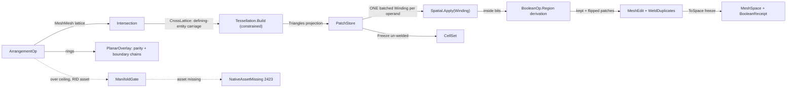

# [RASM_ARRANGEMENT]

The exact arrangement/boolean owner of `Rasm.Meshing` — ONE `ArrangementOp` `[Union]` (`MeshBoolean`/`PlanarOverlay`/`CellComplex`) folded by ONE `Arrangement.Apply(ArrangementOp, Op? key = null)` entry over the shared subdivide → classify → keep → weld algebra. The crossing lattice comes ONLY from `Meshing/intersect` (`Intersection.Apply(IntersectOp.MeshMesh, …)` — the frozen `CrossLattice` with defining-entity carriage; the inline `EdgeCrossings`/`PlaneCrossPoint`/`InTriangle` copies of the prior fence are DEAD), the per-face re-triangulation ONLY from `Meshing/delaunay` (`Tessellation.Build` in the CONSTRAINED zero-in-circum regime with `Implicit` crossing vertex rows and `Constraint.Crossing` foreign-plane carriage — the crossing endpoints ride their defining entities INTO the substrate, so the whole planar drop/barycentric-lift apparatus of the prior fence is DEAD: the substrate evaluates axis-projected exact predicates on 3D rows and rounds once at its own emission seam), the inside/outside scalar ONLY from `Spatial/index` (one BATCHED `SpatialQuery.Winding` per operand over every patch probe), and the weld and soup ONLY from `Meshing/edit` (`MeshEdit.Of` + `Kernels.WeldDuplicates` — the weld knob lives on `ArenaPolicy`, the triple `DuplicateNative` soup copies are dead). Interning keys on defining entities end to end — the bit-equality `Dictionary<Point3d,int>` and the `ImplicitCrossing.IsImplicit` rounded-at-birth carrier are the deleted forms — and coplanar operand pairs carry their FULL crossing set as constraint rows (no interior-crossing drop: the flush-contact boolean's worst case subdivides on every crossing).

`BooleanOp` LIVES HERE — the `[SmartEnum<int>]` re-homed from the healing tier, each row carrying ONE `Region(bool inA, bool inB)` delegate column from which the ENTIRE boolean derives: a patch is KEPT exactly when the region predicate flips across it (the regularized membership rule as one derivation — a dangling lower-dimensional artifact has equal region on both sides and vanishes by construction), and a kept patch FLIPS orientation exactly when the region holds on its front side, so union/difference/intersection are three data rows over one classification, never three keep bodies. `BooleanReceipt` is ONE TYPE owned here (`Processing/receipts` composes it as the heal-session boolean payload beside `ManifoldStatus` — no renamed sibling), its `Route` field the typed `BooleanRoute` evidence. The managed exact arrangement is the ONE correctness rail; `manifoldc` (the in-house P/Invoke over `elalish/manifold`, Apache-2.0 — `api-manifold.md`; NO NuGet pin, both feed homonyms rejected) is the tier-3 SCALE companion behind the finite `ArrangementPolicy.ScaleCeiling` of 1,000,000 combined operand faces: an over-ceiling call routes the native engine when the per-RID asset resolves and fails typed `GeometryFault.NativeAssetMissing` 2423 when it does not, activation gated on the golden-boolean fixture. Every failure routes the band-2400 union (`DegenerateArrangement` 2420, `NativeAssetMissing` 2423, the cross-cutting `DegenerateInput` 2400); the hash-eligible artifact is the frozen `MeshSpace` the weld publishes, never a live store.

## [01]-[INDEX]

- [01]-[ARRANGEMENT]: ONE `Arrangement.Apply(ArrangementOp, Op?)` entry; `BooleanOp` region-predicate rows (keep and flip DERIVED); crossing lattice from intersect, constrained substrate from delaunay, batched GWN from index, weld from edit; `PatchStore` arena + frozen `CellSet`; `BooleanReceipt` with typed `BooleanRoute`; the `manifoldc` tier-3 scale gate.

## [02]-[ARRANGEMENT]

- Owner: `BooleanOp` `[SmartEnum<int>]` (`Union` 0 / `Difference` 1 / `Intersection` 2) RE-HOMED here — each row carries the `[UseDelegateFromConstructor]` `Region(bool inA, bool inB)` predicate column and the `Native` column (the `ManifoldOpType` ordinal `MANIFOLD_ADD`/`MANIFOLD_SUBTRACT`/`MANIFOLD_INTERSECT` the tier-3 route maps onto); `Keep(bool fromA, bool insideOther)` and `Flip(bool fromA, bool insideOther)` are DERIVED members over `Region` — the one classification, never three keep bodies; `BooleanRoute` `[SmartEnum<string>]` (`managed`/`native`) the typed route evidence; `BooleanReceipt` the ONE typed boolean evidence (`Classified` · `Kept` · `Welded` · `Route`) — `Processing/receipts` composes it as payload, never re-mints it; `ArrangementPolicy` the policy row (`BetaSquared` GWN accuracy · `InteriorOffset` probe nudge · `ScaleCeiling` = 1,000,000 combined operand faces, FINITE — the `int.MaxValue` dead gate of the prior fence is deleted · `Substrate` the constrained `TessellationPolicy` · `Broad`/`Narrow` the spatial and intersect policies · `Arena` the `ArenaPolicy` carrying THE weld knob) registering `IValidityEvidence`; `PatchStore` the single-writer patch arena (triangle corners, operand origin, per-operand inside bits; amortized doubling) with its frozen `CellSet` projection; `ArrangementOp`/`ArrangementResult` the request/result unions; `Arrangement` the static surface.
- Cases: `BooleanOp` rows 3; `BooleanRoute` rows 2; `ArrangementOp` cases `MeshBoolean` · `PlanarOverlay` · `CellComplex` (3 — `PlanarOverlay` admits polygon RING SETS directly, the exact 2D boolean `Meshing/offset` routes its self-overlapping loop resolution through and the Fabrication NFP robust tier reads; `CellComplex` retains the full classified arrangement un-welded for the `Rasm.Bim` solid classifier); `ArrangementResult` cases `Boolean` · `Overlay` · `Complex` (3).
- Entry: `public static Fin<ArrangementResult> Apply(ArrangementOp op, Op? key = null)` — the ONE entry discriminating on the op case. `Fin<T>` routes `GeometryFault.DegenerateInput` 2400 on an empty mesh operand or an open/degenerate/non-finite overlay ring (RINGS arrive raw and admit here once; mesh operands carry the `MeshSpace` admission's own evidence — the interior never re-validates), `GeometryFault.DegenerateArrangement(cellCount, witness)` 2420 on a degenerate classification soup or a substrate failure re-mapped with its face witness, and `GeometryFault.NativeAssetMissing("manifoldc", rid, ceiling)` 2423 EXACTLY when the combined operand face count exceeds `ScaleCeiling` and the per-RID native asset does not resolve — under the ceiling the managed body serves every workload and the gate is never consulted; an over-ceiling `CellComplex` refuses TYPED with an actionable witness (the native engine emits no classified cell set — the caller raises the revisable `ScaleCeiling` row for a managed run), never a silent managed blowout. The two volumetric cases share ONE fold with ONE soup admission per operand — gate, subdivision, classification, native raise, and emission all read the same two arenas. `MeshBoolean` returns `ArrangementResult.Boolean(MeshSpace Solid, BooleanReceipt)`; `PlanarOverlay` returns `Overlay(Seq<Chain> Loops, BooleanReceipt)` — oriented loops (outer CCW / holes CW) riding intersect's chain vocabulary; `CellComplex` returns `Complex(CellSet, BooleanReceipt)`. No `MeshBool`/`PolygonBool`/`BuildComplex` sibling statics — one polymorphic `Apply`.
- Auto: `MeshBoolean`/`CellComplex` run the shared `Arrange` fold — (1) `Intersection.Apply(IntersectOp.MeshMesh(a, b, policy.Narrow), key)` yields the frozen `CrossLattice` (defining-entity crossing rows, per-face segments, coplanar constraint rows — recorded on BOTH operand faces so the two surfaces split coherently on their shared curve); (2) per operand face, `lattice.OnFace(side, face)` + `lattice.CoplanarOnFace(side, face)` drive the subdivision: an un-cut face passes whole as one patch, a cut face builds `Tessellation.Build(TessellationOp.Points(Triangulation, rows, constraints, policy.Substrate, plane: face dominant axis, support: the face's three corners))` — vertex rows are the three EXPLICIT corners plus each crossing endpoint's `Implicit` construction interned BY ITS `CrossKey` (defining-entity interning; two segments sharing an endpoint share one row by integer equality), piercing constraints are `Constraint.Crossing(u, v, foreignP, foreignQ, foreignR)` rows carrying the OTHER operand's face plane so a recovery-time split re-anchors exactly (`Tpi` over the support witness and two foreign planes — depth-1 sealed), coplanar sub-segment rows carry the PERPENDICULAR plane through their original carrier edge — `(S, T, S + ê)`, ê the build-axis unit, exact derived points whose trace on the build plane IS the carrier line (the coplanar face's own plane would degenerate the `Tpi`) — and the sub-triangles read back through the tessellation's `Triangles()` emission projection; (3) classification batches EVERY patch probe (centroid nudged `InteriorOffset` along the patch normal) into ONE `SpatialQuery.Winding(probes, otherSoup, BetaSquared)` per operand through `Spatial.Apply` — `QueryResult.Field` scalars threshold at `0.5` into the per-operand inside bits (`~1` inside, `~0` outside, continuous across the other operand's own defects); (4) `MeshBoolean` keeps patches where `op.Keep(fromA, insideOther)` — the region-flip derivation — flipping winding where `op.Flip(...)` holds, then welds through `MeshEdit.Of(vertices, faces, policy.Arena)` + `Kernels.WeldDuplicates` + `ToSpace(context, key)` (the freeze publishes the ONE hash-eligible artifact); `CellComplex` stops after (3) and freezes the full `CellSet`. `PlanarOverlay` is the SAME algebra on rings: ALL ring vertices of both operands enter ONE constrained `Tessellation.Build` with every ring edge a `Constraint.Segment` (the substrate's recovery mints exact `Ssi` Steiner rows at constraint×constraint crossings — depth-1 by construction), each triangle classifies by the exact NONZERO winding of its centroid against EACH operand's ring set (V-straddle + side signs, upward crossings +1 / downward −1 — exact signs, no epsilon band; nonzero so a self-overlapping cycle set resolves to its true covered region, coinciding with even-odd on simple rings), the region keeps per `op.Region(inA, inB)` directly, and the kept-region boundary edges chain into oriented `Chain` loops.
- Receipt: `BooleanReceipt(Classified, Kept, Welded, Route)` — the classified-patch census, the keep survivor count, the weld vertex-collapse count, and the typed `BooleanRoute` (`Managed` for the exact arrangement, `Native` only on the tier-3 scale route) — never a generic ledger; the patch-count delta plus route IS the boolean evidence `Processing/receipts` (W3) carries as the heal-session boolean payload and the `Rasm.Bim` reconstruction reads.
- Packages: `Rasm.Meshing` (`Intersection.Apply`, `CrossLattice`/`CrossKey`/`Chain` — the crossing lattice, composed), `Rasm.Numerics` delaunay owners (`Tessellation.Build`, `TessellationOp.Points`, `Constraint.Segment`/`Crossing`, `TessellationPolicy.Constrained`, `Triangles()` — the constrained substrate, composed), `Rasm.Spatial` (`Spatial.Apply` + `SpatialQuery.Winding` batched GWN + `SpatialOp.Build` — composed, never re-built), `Rasm.Meshing` (`MeshEdit.Of`, `Kernels.WeldDuplicates`, `ArenaPolicy` — the soup and weld owners), `Rasm.Numerics` (`Predicate`/`Implicit`/`Sign`/`Axis` — the parity classification signs), `Rasm.Numerics` (`GeometryFault`), `Rasm.Domain` (`Op`, `Kind`, `Context`, `ValidityClaim`/`IValidityEvidence`), `Rasm.Meshing` (`MeshSpace`), `Rhino.Geometry` (`Point3d`/`Polyline`), `manifoldc` (in-house P/Invoke, `api-manifold.md` — the tier-3 scale companion; NO NuGet pin), Thinktecture.Runtime.Extensions, LanguageExt.Core, BCL inbox (`NativeLibrary`, `RuntimeInformation`).
- Growth: a new arrangement modality (a Nef-style 3D cell refinement, a coplanar-face merge overlay) is one `ArrangementOp` case over the SAME arrange fold; a new boolean operation is ONE `BooleanOp` row — its `Region` delegate derives keep and flip with zero new bodies; a new classification or weld knob is one `ArrangementPolicy` column; the tier-3 native path grows only behind the existing `ScaleCeiling` gate (a second native engine is a charter amendment); zero new surface.
- Boundary: the arrangement is the ONE `ArrangementOp` `[Union]` and a `MeshBooleanOp`/`PolygonOverlay`/`CellComplexBuilder` sibling family is the named density defect collapsed onto one union; the keep predicate DERIVES from the one `Region` column and three enumerated keep bodies (or an external keep `switch`) are the deleted form; `BooleanOp` and `BooleanReceipt` live HERE — a healing-tier twin, a renamed `ArrangementReceipt`, or a second boolean discriminant anywhere in the kernel is the deleted duplicate (`Processing/repair`'s `HealOp.Boolean` DELEGATES to `Arrangement.Apply`, W3); the crossing lattice composes `Intersection.Apply` and an in-page straddle/containment/crossing kernel is the deleted triple-owner form; the substrate composes `Tessellation.Build` through its public op and projections and a reach into the interior `SimplexStore` — or a page-local triangulator, or the dead drop/lift barycentric frame — is the deleted form; crossing vertices enter the substrate as `Implicit` defining-entity rows and a rounded-at-birth `Point3d` interning key (bit-equality dictionary) is the named robustness defect this rebuild deletes; the GWN composes the ONE `Spatial/index` owner BATCHED (one `Winding` query per operand) and a per-patch query loop or a local ray-parity re-implementation against MESH operands is the deleted form (the 2D ring parity is the planar overlay's own exact classification over ring edges — a different concern, owned here); the weld composes `Kernels.WeldDuplicates` at the `ArenaPolicy` band and a local welder or a policy reach-through is dead; `Apply` is total over the `Fin` rail; the managed arrangement is the ONE correctness rail and the native route is a SCALE companion only — over-ceiling with no RID asset fails typed, never silently degrades, and activation is harness-gated on the golden-boolean fixture; the `CellComplex` path retains classification un-welded because the keep-predicate has not consumed it — the welded boolean is terminal and carries none.

```csharp
// --- [RUNTIME_PRELUDE] ----------------------------------------------------------------------
using System;
using System.Collections.Generic;
using System.Linq;
using System.Runtime.InteropServices;
using LanguageExt;
using Rasm.Domain;
using Rasm.Numerics;
using Rasm.Spatial;
using Rhino.Geometry;
using Thinktecture;
using static LanguageExt.Prelude;

namespace Rasm.Meshing;

// --- [TYPES] ------------------------------------------------------------------------------
// Re-homed boolean vocabulary: ONE Region(inA, inB) predicate column per row; keep and flip
// DERIVE (region-flip across the patch = kept; region on the front side = flipped) — the
// regularized membership rule as one derivation, dangling artifacts vanishing by construction.
// Native = the ManifoldOpType ordinal the tier-3 route maps onto (ADD/SUBTRACT/INTERSECT).
[SmartEnum<int>]
public sealed partial class BooleanOp {
    public static readonly BooleanOp Union        = new(0, native: 0, static (inA, inB) => inA || inB);
    public static readonly BooleanOp Difference   = new(1, native: 1, static (inA, inB) => inA && !inB);
    public static readonly BooleanOp Intersection = new(2, native: 2, static (inA, inB) => inA && inB);

    public int Native { get; }

    [UseDelegateFromConstructor]
    public partial bool Region(bool inA, bool inB);

    public bool Keep(bool fromA, bool insideOther) =>
        fromA ? Region(true, insideOther) != Region(false, insideOther)
              : Region(insideOther, true) != Region(insideOther, false);

    public bool Flip(bool fromA, bool insideOther) =>
        fromA ? Region(false, insideOther) : Region(insideOther, false);
}

[SmartEnum<string>]
[KeyMemberEqualityComparer<ComparerAccessors.StringOrdinal, string>]
[KeyMemberComparer<ComparerAccessors.StringOrdinal, string>]
public sealed partial class BooleanRoute {
    public static readonly BooleanRoute Managed = new("managed");
    public static readonly BooleanRoute Native  = new("native");
}

// --- [CONSTANTS] --------------------------------------------------------------------------
// ScaleCeiling is FINITE by ruling: 1,000,000 combined operand faces — above it the manifoldc
// scale route (RID-asset-gated) or the typed 2423 fail; the weld band rides Arena.WeldTolerance.
public sealed record ArrangementPolicy(
    double BetaSquared, double InteriorOffset, long ScaleCeiling,
    TessellationPolicy Substrate, BuildPolicy Broad, IntersectPolicy Narrow, ArenaPolicy Arena) : IValidityEvidence {
    public static readonly ArrangementPolicy Canonical = new(
        BetaSquared: 4.0, InteriorOffset: 1e-7, ScaleCeiling: 1_000_000,
        Substrate: TessellationPolicy.Constrained, Broad: BuildPolicy.Canonical,
        Narrow: IntersectPolicy.Canonical, Arena: ArenaPolicy.Canonical);

    public bool BeyondManaged(long operandFaces) => operandFaces > ScaleCeiling;

    public bool IsValid => ValidityClaim.All(
        ValidityClaim.Positive(value: BetaSquared),
        ValidityClaim.Positive(value: InteriorOffset),
        ValidityClaim.Positive(value: ScaleCeiling));
}

// --- [MODELS] -----------------------------------------------------------------------------
public sealed record BooleanReceipt(int Classified, int Kept, int Welded, BooleanRoute Route) {
    public static readonly BooleanReceipt Empty = new(0, 0, 0, BooleanRoute.Managed);
}

// Frozen classification projection: the CellComplex artifact the Rasm.Bim solid classifier reads.
public sealed record CellSet((Point3d A, Point3d B, Point3d C)[] Patches, bool[] FromA, bool[] InsideA, bool[] InsideB);

// Single-writer patch arena under the Meshing/edit ARENA_LAW: append-only rows, amortized
// doubling, Freeze() the one projection; no fault union of its own.
public sealed class PatchStore {
    (Point3d A, Point3d B, Point3d C)[] patches;
    bool[] fromA, insideA, insideB;
    int count;

    public PatchStore(int seed) {
        patches = new (Point3d, Point3d, Point3d)[seed];
        fromA = new bool[seed];
        insideA = new bool[seed];
        insideB = new bool[seed];
    }

    public int Count => count;
    public (Point3d A, Point3d B, Point3d C) Patch(int row) => patches[row];
    public bool FromA(int row) => fromA[row];
    public bool InsideOther(int row) => fromA[row] ? insideB[row] : insideA[row];

    public int Add((Point3d A, Point3d B, Point3d C) patch, bool sideA) {
        Grow(count + 1);
        (patches[count], fromA[count]) = (patch, sideA);
        return count++;
    }

    public void Classify(int row, bool inA, bool inB) => (insideA[row], insideB[row]) = (inA, inB);

    public Point3d Interior(int row, double offset) {
        (Point3d a, Point3d b, Point3d c) = patches[row];
        Point3d centroid = new((a.X + b.X + c.X) / 3.0, (a.Y + b.Y + c.Y) / 3.0, (a.Z + b.Z + c.Z) / 3.0);
        Vector3d n = Vector3d.CrossProduct(b - a, c - a);
        return n.IsTiny() ? centroid : centroid + (offset * (n / n.Length));
    }

    public CellSet Freeze() => new([.. patches.AsSpan(0, count)], [.. fromA.AsSpan(0, count)], [.. insideA.AsSpan(0, count)], [.. insideB.AsSpan(0, count)]);

    void Grow(int needed) {
        if (needed <= patches.Length) { return; }
        int extent = int.Max(needed, patches.Length << 1);
        Array.Resize(ref patches, extent);
        Array.Resize(ref fromA, extent);
        Array.Resize(ref insideA, extent);
        Array.Resize(ref insideB, extent);
    }
}

// --- [OPERATIONS] -------------------------------------------------------------------------
[Union(ConversionFromValue = ConversionOperatorsGeneration.None)]
public abstract partial record ArrangementOp {
    private ArrangementOp() { }

    public sealed record MeshBoolean(MeshSpace A, MeshSpace B, BooleanOp Op, ArrangementPolicy Policy) : ArrangementOp;
    public sealed record PlanarOverlay(Seq<Polyline> A, Seq<Polyline> B, BooleanOp Op, Axis Plane, ArrangementPolicy Policy) : ArrangementOp;
    public sealed record CellComplex(MeshSpace A, MeshSpace B, ArrangementPolicy Policy) : ArrangementOp;
}

[Union(ConversionFromValue = ConversionOperatorsGeneration.None)]
public abstract partial record ArrangementResult {
    private ArrangementResult() { }

    public sealed record Boolean(MeshSpace Solid, BooleanReceipt Receipt) : ArrangementResult;
    public sealed record Overlay(Seq<Chain> Loops, BooleanReceipt Receipt) : ArrangementResult;
    public sealed record Complex(CellSet Cells, BooleanReceipt Receipt) : ArrangementResult;
}

public static class Arrangement {
    public static Fin<ArrangementResult> Apply(ArrangementOp op, Op? key = null) =>
        op.Switch(
            state: key,
            meshBoolean:   static (key, m) => Volumetric(m.A, m.B, Some(m.Op), m.Policy, key),
            planarOverlay: static (key, p) => Overlay(p, key),
            cellComplex:   static (key, c) => Volumetric(c.A, c.B, None, c.Policy, key));

    // ONE soup admission per operand for the whole volumetric fold: gate, subdivide, classify,
    // native raise, and emit share the same two arenas — the boolean keeps-and-welds, the cell
    // complex (no BooleanOp payload) freezes the classification un-welded.
    static Fin<ArrangementResult> Volumetric(MeshSpace a, MeshSpace b, Option<BooleanOp> keep, ArrangementPolicy policy, Op? key) {
        using MeshEdit ea = MeshEdit.Of(a);
        using MeshEdit eb = MeshEdit.Of(b);
        return Gate(ea, eb, policy).Bind(route => route == BooleanRoute.Native
            ? keep.Match(
                Some: op => ManifoldGate.Boolean(ea, eb, op, a.Tolerance, policy, key),
                None: () => Fin.Fail<ArrangementResult>(new GeometryFault.DegenerateArrangement((int)long.Min(policy.ScaleCeiling, int.MaxValue), "cell complex has no native tier; raise ScaleCeiling for a managed run").ToError()))
            : Arrange(a, b, ea, eb, policy, key).Bind(store => keep.Match(
                Some: op => KeepAndWeld(store, op, a.Tolerance, policy, key),
                None: () => Fin.Succ((ArrangementResult)new ArrangementResult.Complex(
                    store.Freeze(), BooleanReceipt.Empty with { Classified = store.Count, Kept = store.Count })))));
    }

    // Admission + the tier-3 scale gate: an empty operand fails 2400 (finiteness is the MeshSpace
    // admission's own evidence — the interior never re-validates); over-ceiling routes Native only
    // when the RID asset resolves, else the typed 2423 — never a silent degrade.
    static Fin<BooleanRoute> Gate(MeshEdit ea, MeshEdit eb, ArrangementPolicy policy) {
        long faces = (long)ea.FaceCount + eb.FaceCount;
        return (ea.VertexCount, eb.VertexCount) switch {
            (0, _) or (_, 0) => Fin.Fail<BooleanRoute>(new GeometryFault.DegenerateInput(Kind.Mesh, 0, "empty operand").ToError()),
            _ when !policy.BeyondManaged(faces) => Fin.Succ(BooleanRoute.Managed),
            _ when ManifoldGate.AssetResolves() => Fin.Succ(BooleanRoute.Native),
            _ => Fin.Fail<BooleanRoute>(new GeometryFault.NativeAssetMissing("manifoldc", RuntimeInformation.RuntimeIdentifier, policy.ScaleCeiling).ToError()),
        };
    }

    // --- [ARRANGE]
    // Lattice from intersect; per-face constrained substrate builds with Implicit rows and
    // Constraint.Crossing foreign-plane carriage; batched GWN classification per operand.
    static Fin<PatchStore> Arrange(MeshSpace a, MeshSpace b, MeshEdit ea, MeshEdit eb, ArrangementPolicy policy, Op? key) {
        PatchStore store = new(int.Max(ea.FaceCount + eb.FaceCount, 16));
        return Intersection.Apply(new IntersectOp.MeshMesh(a, b, policy.Narrow), key)
            .Bind(result => result is IntersectResult.Chains chains
                ? Fin.Succ(chains.Lattice)
                : Fin.Fail<CrossLattice>(new GeometryFault.DegenerateArrangement(0, "mesh-mesh lattice unavailable").ToError()))
            .Bind(lattice => Subdivided(store, ea, lattice, sideA: true, eb, policy, key)
                .Bind(_ => Subdivided(store, eb, lattice, sideA: false, ea, policy, key)))
            .Bind(_ => Classify(store, ea, eb, policy, key));
    }

    static Fin<Unit> Subdivided(PatchStore store, MeshEdit soup, CrossLattice lattice, bool sideA, MeshEdit other, ArrangementPolicy policy, Op? key) {
        int side = sideA ? 0 : 1;
        for (int f = 0; f < soup.FaceCount; f++) {
            (int A, int B, int FaceA, int FaceB)[] cuts = lattice.OnFace(side, f).ToArray();
            (int A, int B, int FaceA, int FaceB, int CarrierU, int CarrierV, int CarrierSide)[] flush = lattice.CoplanarOnFace(side, f).ToArray();
            (int v0, int v1, int v2) = soup.Face(f);
            (Point3d ca, Point3d cb, Point3d cc) = (soup.Position(v0), soup.Position(v1), soup.Position(v2));
            if (cuts.Length == 0 && flush.Length == 0) {
                store.Add((ca, cb, cc), sideA);
                continue;
            }
            Fin<Unit> built = FaceBuild(store, lattice, cuts, flush, sideA, (ca, cb, cc), f, soup, other, policy, key);
            if (built.IsFail) { return built; }
        }
        return Fin.Succ(unit);
    }

    // One constrained per-face build: 3 explicit corners + CrossKey-interned Implicit crossing rows.
    // A piercing cut is a Constraint.Crossing carrying the OTHER operand's face plane; a coplanar
    // sub-segment carries the PERPENDICULAR plane through its original carrier edge — (S, T, S+ê)
    // with ê the build-axis unit, EXACT derived points whose trace on the build plane IS the
    // carrier line (the coplanar face's own plane would make the Tpi re-anchor degenerate). The
    // substrate's Support witness = this face's corners — recovery splits re-anchor exactly,
    // depth-1 sealed.
    static Fin<Unit> FaceBuild(PatchStore store, CrossLattice lattice, (int A, int B, int FaceA, int FaceB)[] cuts, (int A, int B, int FaceA, int FaceB, int CarrierU, int CarrierV, int CarrierSide)[] flush, bool sideA, (Point3d A, Point3d B, Point3d C) face, int faceId, MeshEdit soup, MeshEdit other, ArrangementPolicy policy, Op? key) {
        List<Implicit> rows = new() { new(face.A), new(face.B), new(face.C) };
        Dictionary<CrossKey, int> slotOf = new();
        int Intern(int latticeRow) {
            Crossing crossing = lattice.Rows[latticeRow];
            if (slotOf.TryGetValue(crossing.Key, out int at)) { return at; }
            rows.Add(crossing.Point);
            return slotOf[crossing.Key] = rows.Count - 1;
        }
        Axis plane = DominantAxis(face.A, face.B, face.C);
        Vector3d lift = plane.Key == 0 ? new Vector3d(1.0, 0.0, 0.0) : plane.Key == 1 ? new Vector3d(0.0, 1.0, 0.0) : new Vector3d(0.0, 0.0, 1.0);
        List<Constraint> constraints = new(cuts.Length + flush.Length);
        foreach ((int A, int B, int FaceA, int FaceB) cut in cuts) {
            (int o0, int o1, int o2) = other.Face(sideA ? cut.FaceB : cut.FaceA);
            constraints.Add(new Constraint.Crossing(Intern(cut.A), Intern(cut.B), other.Position(o0), other.Position(o1), other.Position(o2)));
        }
        foreach ((int A, int B, int FaceA, int FaceB, int CarrierU, int CarrierV, int CarrierSide) row in flush) {
            MeshEdit carrier = row.CarrierSide == (sideA ? 0 : 1) ? soup : other;
            (Point3d s, Point3d t) = (carrier.Position(row.CarrierU), carrier.Position(row.CarrierV));
            constraints.Add(new Constraint.Crossing(Intern(row.A), Intern(row.B), s, t, s + lift));
        }
        return Tessellation.Build(
                new TessellationOp.Points(TessellationKind.Triangulation, [.. rows], toSeq(constraints), policy.Substrate, plane, Some((face.A, face.B, face.C))), key)
            .MapFail(fail => new GeometryFault.DegenerateArrangement(faceId, $"substrate: {fail.Message}").ToError())
            .Bind(t => t.Triangles(key))
            .Map(tris => {
                foreach ((Point3d a, Point3d b, Point3d c) in tris) { store.Add((a, b, c), sideA); }
                return unit;
            });
    }

    // ONE batched Winding query per operand over every patch probe — never a per-patch loop.
    static Fin<PatchStore> Classify(PatchStore store, MeshEdit ea, MeshEdit eb, ArrangementPolicy policy, Op? key) {
        Point3d[] probes = new Point3d[store.Count];
        for (int p = 0; p < store.Count; p++) { probes[p] = store.Interior(p, policy.InteriorOffset); }
        return (Winding(probes, ea, policy, key), Winding(probes, eb, policy, key)).Apply((wa, wb) => (wa, wb)).As()
            .Map(t => {
                for (int p = 0; p < store.Count; p++) { store.Classify(p, t.wa[p] > 0.5, t.wb[p] > 0.5); }
                return store;
            });
    }

    static Fin<double[]> Winding(Point3d[] probes, MeshEdit soup, ArrangementPolicy policy, Op? key) {
        Point3d[] triangles = new Point3d[3 * soup.FaceCount];
        BoundingBox[] boxes = new BoundingBox[soup.FaceCount];
        for (int f = 0; f < soup.FaceCount; f++) {
            (int a, int b, int c) = soup.Face(f);
            (triangles[3 * f], triangles[(3 * f) + 1], triangles[(3 * f) + 2]) = (soup.Position(a), soup.Position(b), soup.Position(c));
            boxes[f] = soup.Bounds(f);
        }
        return Spatial.Apply(new SpatialOp.Build(SpatialKind.Bvh, boxes, policy.Broad), key)
            .Bind(answer => answer is SpatialAnswer.Index built
                ? Spatial.Apply(new SpatialOp.Query(built.Value, new SpatialQuery.Winding(probes, triangles, policy.BetaSquared)), key)
                : Fin.Fail<SpatialAnswer>(new GeometryFault.DegenerateArrangement(soup.FaceCount, "winding index unavailable").ToError()))
            .Bind(static answer => answer is SpatialAnswer.Result { Value: QueryResult.Field field }
                ? Fin.Succ(field.Values)
                : Fin.Fail<double[]>(new GeometryFault.KindMismatch(SpatialKind.Bvh, QueryKind.Winding).ToError()));
    }

    // --- [KEEP_AND_WELD]
    // Keep = region flip; Flip = region on the front side — both derived off the ONE row column.
    // Weld through the edit arena; the freeze publishes the hash-eligible MeshSpace.
    static Fin<ArrangementResult> KeepAndWeld(PatchStore store, BooleanOp op, Context tolerance, ArrangementPolicy policy, Op? key) {
        List<Point3d> vertices = new(3 * store.Count);
        List<(int, int, int)> faces = new(store.Count);
        int kept = 0;
        for (int p = 0; p < store.Count; p++) {
            if (!op.Keep(store.FromA(p), store.InsideOther(p))) { continue; }
            (Point3d a, Point3d b, Point3d c) = store.Patch(p);
            int at = vertices.Count;
            vertices.AddRange([a, b, c]);
            faces.Add(op.Flip(store.FromA(p), store.InsideOther(p)) ? (at, at + 2, at + 1) : (at, at + 1, at + 2));
            kept++;
        }
        using MeshEdit edit = MeshEdit.Of([.. vertices], [.. faces], policy.Arena);
        int before = edit.VertexCount;
        Kernels.WeldDuplicates(edit);
        return edit.ToSpace(tolerance, key).Map(solid => (ArrangementResult)new ArrangementResult.Boolean(
            solid, new BooleanReceipt(store.Count, kept, before - edit.VertexCount, BooleanRoute.Managed)));
    }

    // --- [PLANAR_OVERLAY]
    // The exact 2D boolean: ONE constrained build over every ring vertex + ring-edge constraints
    // (recovery mints exact Ssi Steiner rows at constraint crossings); triangles classify by exact
    // ray parity per operand; the region keeps directly; kept-region boundary chains oriented.
    static Fin<ArrangementResult> Overlay(ArrangementOp.PlanarOverlay op, Op? key) {
        List<Implicit> rows = new();
        List<Constraint> constraints = new();
        int ordinal = 0;
        foreach (Polyline ring in op.A.Concat(op.B)) {
            if (ring.Count < 4 || !ring.IsClosed) {
                return Fin.Fail<ArrangementResult>(new GeometryFault.DegenerateInput(Kind.Polyline, ordinal, "open or degenerate ring").ToError());
            }
            for (int v = 0; v < ring.Count - 1; v++) {  // rings arrive RAW — this is their one admission seam
                if (!ring[v].IsValid) { return Fin.Fail<ArrangementResult>(new GeometryFault.DegenerateInput(Kind.Polyline, ordinal, "non-finite ring vertex").ToError()); }
            }
            int baseAt = rows.Count;
            for (int v = 0; v < ring.Count - 1; v++) { rows.Add(new Implicit(ring[v])); }
            for (int v = 0; v < ring.Count - 1; v++) { constraints.Add(new Constraint.Segment(baseAt + v, baseAt + ((v + 1) % (ring.Count - 1)))); }
            ordinal++;
        }
        return Tessellation.Build(new TessellationOp.Points(TessellationKind.Triangulation, [.. rows], toSeq(constraints), op.Policy.Substrate, op.Plane), key)
            .Bind(t => t.Triangles(key))
            .Map(tris => {
                bool[] region = new bool[tris.Length];
                for (int i = 0; i < tris.Length; i++) {
                    (Point3d a, Point3d b, Point3d c) = tris[i];
                    Point3d probe = new((a.X + b.X + c.X) / 3.0, (a.Y + b.Y + c.Y) / 3.0, (a.Z + b.Z + c.Z) / 3.0);
                    region[i] = op.Op.Region(Winding(probe, op.A, op.Plane), Winding(probe, op.B, op.Plane));
                }
                Seq<Chain> loops = BoundaryLoops(tris, region);
                return (ArrangementResult)new ArrangementResult.Overlay(
                    loops, new BooleanReceipt(tris.Length, region.Count(static r => r), 0, BooleanRoute.Managed));
            });
    }

    // Exact NONZERO winding: the +U half-line from the probe counts edge (a,b) iff the endpoints
    // straddle on V HALF-OPEN (a Zero endpoint counts with the non-negative side — a ring vertex
    // exactly on the ray line never double-counts or vanishes) and the exact side sign puts the
    // crossing at +U; upward crossings count +1, downward -1. Nonzero — not even-odd — so a
    // self-overlapping cycle set (the Minkowski convolution, a doubled offset loop) resolves to
    // its true covered region; on simple rings the two rules coincide. Probes are triangle
    // centroids of the same build, never boundary points — an on-edge Zero side skips.
    static bool Winding(Point3d probe, Seq<Polyline> rings, Axis plane) {
        int v = plane.V;
        int count = 0;
        foreach (Polyline ring in rings) {
            for (int e = 0; e < ring.Count - 1; e++) {
                (Point3d a, Point3d b) = (ring[e], ring[e + 1]);
                bool aBelow = Sign.Of(Axis.Coord(a, v).CompareTo(Axis.Coord(probe, v))) == Sign.Negative;
                bool bBelow = Sign.Of(Axis.Coord(b, v).CompareTo(Axis.Coord(probe, v))) == Sign.Negative;
                if (aBelow == bBelow) { continue; }
                Sign side = Predicate.Orient2D(new Implicit(a), new Implicit(b), new Implicit(probe), plane);
                if (side == Sign.Zero) { continue; }
                if (aBelow ? side == Sign.Positive : side == Sign.Negative) { count += aBelow ? 1 : -1; }
            }
        }
        return count != 0;
    }

    // Boundary of the kept region: edges between kept and unkept (or hull) triangles cancel
    // pairwise in opposite orientation, chained by shared endpoints so the kept region sits left
    // (outer CCW, holes CW). Endpoint keys are BIT-IDENTICAL — one substrate build emits each
    // vertex row's Round() exactly once — so a pinch vertex (two kept regions touching) is a
    // stacked start the walk drains one loop at a time, never a tolerance weld. Seeds drain in
    // first-seen order — emission is a deterministic function of the input.
    static Seq<Chain> BoundaryLoops((Point3d A, Point3d B, Point3d C)[] tris, bool[] region) {
        Dictionary<(Point3d, Point3d), (Point3d From, Point3d To)> boundary = new();
        for (int i = 0; i < tris.Length; i++) {
            if (!region[i]) { continue; }
            foreach ((Point3d p, Point3d q) in (ReadOnlySpan<(Point3d, Point3d)>)[(tris[i].A, tris[i].B), (tris[i].B, tris[i].C), (tris[i].C, tris[i].A)]) {
                if (!boundary.Remove((q, p))) { boundary[(p, q)] = (p, q); }
            }
        }
        Dictionary<Point3d, Stack<Point3d>> byStart = new();
        List<Point3d> order = new();
        for (int i = 0; i < tris.Length; i++) {
            if (!region[i]) { continue; }
            foreach ((Point3d p, Point3d q) in (ReadOnlySpan<(Point3d, Point3d)>)[(tris[i].A, tris[i].B), (tris[i].B, tris[i].C), (tris[i].C, tris[i].A)]) {
                if (!boundary.TryGetValue((p, q), out (Point3d From, Point3d To) edge)) { continue; }
                if (!byStart.TryGetValue(edge.From, out Stack<Point3d>? tos)) {
                    byStart[edge.From] = tos = new Stack<Point3d>();
                    order.Add(edge.From);
                }
                tos.Push(edge.To);
            }
        }
        List<Chain> loops = new();
        foreach (Point3d seed in order) {
            while (byStart.ContainsKey(seed)) {
                Polyline loop = new() { seed };
                Point3d cur = seed;
                while (byStart.TryGetValue(cur, out Stack<Point3d>? outgoing)) {
                    Point3d next = outgoing.Pop();
                    if (outgoing.Count == 0) { byStart.Remove(cur); }
                    loop.Add(next);
                    cur = next;
                    if (cur == seed) { break; }
                }
                if (loop.Count > 2) { loops.Add(new Chain(loop, Closed: cur == seed)); }
            }
        }
        return toSeq(loops);
    }

    static Axis DominantAxis(Point3d a, Point3d b, Point3d c) {
        Vector3d n = Vector3d.CrossProduct(b - a, c - a);
        (double x, double y, double z) = (Math.Abs(n.X), Math.Abs(n.Y), Math.Abs(n.Z));
        return x >= y && x >= z ? Axis.X : y >= z ? Axis.Y : Axis.Z;
    }
}

// --- [COMPOSITION] --------------------------------------------------------------------------
// Tier-3 scale companion (api-manifold.md): capsule-owned manifoldc P/Invoke, reached ONLY from
// the over-ceiling gate with the RID asset resolved; activation is harness-gated on the
// golden-boolean fixture. Booleans are LAZY CSG upstream — manifold_status is the eager read
// that surfaces a propagated rejection BEFORE extraction; every alloc pairs with delete on every
// exit (the memory law), the whole body the named platform-forced statement seam.
file static partial class ManifoldGate {
    [LibraryImport("manifoldc")] private static partial nint manifold_alloc_meshgl64();
    [LibraryImport("manifoldc")] private static partial nint manifold_alloc_manifold();
    [LibraryImport("manifoldc")] private static partial nint manifold_meshgl64(nint mem, [In] double[] vertProps, nuint nVerts, nuint nProps, [In] ulong[] triVerts, nuint nTris);
    [LibraryImport("manifoldc")] private static partial nint manifold_of_meshgl64(nint mem, nint mesh);
    [LibraryImport("manifoldc")] private static partial nint manifold_boolean(nint mem, nint a, nint b, int op);
    [LibraryImport("manifoldc")] private static partial int manifold_status(nint m);
    [LibraryImport("manifoldc")] private static partial nint manifold_get_meshgl64(nint mem, nint m);
    [LibraryImport("manifoldc")] private static partial nuint manifold_meshgl64_num_vert(nint m);
    [LibraryImport("manifoldc")] private static partial nuint manifold_meshgl64_num_tri(nint m);
    [LibraryImport("manifoldc")] private static partial nint manifold_meshgl64_vert_properties([Out] double[] mem, nint m);
    [LibraryImport("manifoldc")] private static partial nint manifold_meshgl64_tri_verts([Out] ulong[] mem, nint m);
    [LibraryImport("manifoldc")] private static partial void manifold_delete_manifold(nint m);
    [LibraryImport("manifoldc")] private static partial void manifold_delete_meshgl64(nint m);

    internal static bool AssetResolves() => NativeLibrary.TryLoad("manifoldc", out nint handle) && Free(handle);

    static bool Free(nint handle) { NativeLibrary.Free(handle); return true; }

    internal static Fin<ArrangementResult> Boolean(MeshEdit ea, MeshEdit eb, BooleanOp op, Context tolerance, ArrangementPolicy policy, Op? key) {
        (nint ma, nint mb, nint raw) = (0, 0, 0);
        try {
            ma = Raise(ea);
            mb = Raise(eb);
            if (manifold_status(ma) != 0 || manifold_status(mb) != 0) {
                return Fin.Fail<ArrangementResult>(new GeometryFault.DegenerateArrangement(0, "manifoldc rejected an operand").ToError());
            }
            raw = manifold_boolean(manifold_alloc_manifold(), ma, mb, op.Native);
            return manifold_status(raw) is int status and not 0
                ? Fin.Fail<ArrangementResult>(new GeometryFault.DegenerateArrangement(0, $"manifoldc boolean status {status}").ToError())
                : Lower(raw, tolerance, policy, key).Map(lowered =>
                    (ArrangementResult)new ArrangementResult.Boolean(lowered.Solid, lowered.Receipt));
        }
        finally {
            if (raw != 0) { manifold_delete_manifold(raw); }
            if (mb != 0) { manifold_delete_manifold(mb); }
            if (ma != 0) { manifold_delete_manifold(ma); }
        }
    }

    // Raise: the ALREADY-ADMITTED arena's double columns feed manifold_meshgl64 (positions-only,
    // n_props = 3); manifold_of_meshgl64 never aborts — the status read above is the typed rejection.
    static nint Raise(MeshEdit soup) {
        double[] props = new double[3 * soup.VertexCount];
        for (int v = 0; v < soup.VertexCount; v++) { (props[3 * v], props[(3 * v) + 1], props[(3 * v) + 2]) = (soup.X[v], soup.Y[v], soup.Z[v]); }
        ulong[] tris = new ulong[3 * soup.FaceCount];
        for (int f = 0; f < soup.FaceCount; f++) {
            (int a, int b, int c) = soup.Face(f);
            (tris[3 * f], tris[(3 * f) + 1], tris[(3 * f) + 2]) = ((ulong)a, (ulong)b, (ulong)c);
        }
        nint mesh = manifold_meshgl64(manifold_alloc_meshgl64(), props, (nuint)soup.VertexCount, 3, tris, (nuint)soup.FaceCount);
        try { return manifold_of_meshgl64(manifold_alloc_manifold(), mesh); }
        finally { manifold_delete_meshgl64(mesh); }
    }

    // Lower: extraction sized by the census reads, then the SAME weld + freeze seam the managed
    // route publishes through — one emission law for both routes.
    static Fin<(MeshSpace Solid, BooleanReceipt Receipt)> Lower(nint result, Context tolerance, ArrangementPolicy policy, Op? key) {
        nint mesh = manifold_get_meshgl64(manifold_alloc_meshgl64(), result);
        try {
            int nv = (int)manifold_meshgl64_num_vert(mesh);
            int nt = (int)manifold_meshgl64_num_tri(mesh);
            double[] props = new double[3 * nv];
            ulong[] tris = new ulong[3 * nt];
            _ = manifold_meshgl64_vert_properties(props, mesh);
            _ = manifold_meshgl64_tri_verts(tris, mesh);
            Point3d[] vertices = new Point3d[nv];
            for (int v = 0; v < nv; v++) { vertices[v] = new Point3d(props[3 * v], props[(3 * v) + 1], props[(3 * v) + 2]); }
            (int, int, int)[] faces = new (int, int, int)[nt];
            for (int f = 0; f < nt; f++) { faces[f] = ((int)tris[3 * f], (int)tris[(3 * f) + 1], (int)tris[(3 * f) + 2]); }
            using MeshEdit edit = MeshEdit.Of(vertices, faces, policy.Arena);
            int before = edit.VertexCount;
            Kernels.WeldDuplicates(edit);
            return edit.ToSpace(tolerance, key).Map(solid =>
                (solid, new BooleanReceipt(nt, nt, before - edit.VertexCount, BooleanRoute.Native)));
        }
        finally { manifold_delete_meshgl64(mesh); }
    }
}
```



## [03]-[DENSITY_BAR]

One owner per axis; capability is a case, row, or fold arm, never a sibling surface. The `[RAIL]` cell names the one return rail each owner exposes.

| [INDEX] | [AXIS_CONCERN]     | [OWNER]          | [KIND]                                                                                                   | [RAIL]                                       | [CASES] |
| :-----: | :----------------- | :--------------- | :------------------------------------------------------------------------------------------------------- | :------------------------------------------- | :-----: |
|  [01]   | Arrangement        | `ArrangementOp`  | `[Union]` (`MeshBoolean`/`PlanarOverlay` rings/`CellComplex`) folded by ONE `Apply` with `Op?` threading | `Arrangement.Apply → Fin<ArrangementResult>` |    3    |
|  [1a]   | Boolean vocabulary | `BooleanOp`      | `[SmartEnum<int>]` re-homed — ONE `Region` delegate column; `Keep`/`Flip` DERIVED; `Native` ordinal      | policy rows (repair delegates, W3)           |    3    |
|  [1b]   | Route evidence     | `BooleanRoute`   | `[SmartEnum<string>]` managed/native                                                                     | receipt field                                |    2    |
|  [1c]   | Boolean evidence   | `BooleanReceipt` | ONE typed record — classified · kept · welded · route (receipts composes it as payload)                  | carrier                                      |    —    |
|  [1d]   | Patch arena        | `PatchStore`     | single-writer SoA arena + `Freeze → CellSet`                                                             | frozen projection                            |    —    |
|  [1e]   | Scale companion    | `ManifoldGate`   | `file` capsule — RID probe · meshgl64 ingest · one boolean call · status-gated extraction · teardown     | `Fin` (2423 on missing asset)                |    —    |

Every floor is COMPOSED from its single owner: crossings (`Intersection.Apply` + `CrossLattice`), substrate (`Tessellation.Build` constrained + `Constraint.Crossing` + `Triangles`), GWN (`Spatial.Apply` `Winding`, batched), soup + weld (`MeshEdit.Of` + `Kernels.WeldDuplicates`). The prior fence's local crossing kernels, drop/lift barycentric frame, bit-equality point interning, `ImplicitCrossing` carrier, endpoint-only coplanar truncation, and `int.MaxValue` dead gate are all deleted.

## [04]-[RESEARCH]

- [REGION_DERIVATION] — the boolean is ONE classification: each `BooleanOp` row carries only its `Region(inA, inB)` predicate, and both secondary maps derive — `Keep(fromA, insideOther)` is the region FLIP across the patch (a patch lies on the result boundary iff crossing it changes region membership; a dangling or coplanar-duplicated patch has equal region on both sides and vanishes — regularization by construction), `Flip(fromA, insideOther)` is the region on the patch's FRONT side (an outward result normal must face out of the region, so `Difference` B-side patches flip while every `Union` patch keeps its winding). A fourth boolean operation (symmetric difference: `inA != inB`) is one row with zero new bodies — the derivation is the executable specification the law-matrix proves against a watertight reference boolean per operand-pair orientation case.
- [EXACT_SUBDIVISION_SEAM] — each cut operand face re-triangulates through the constrained substrate with the crossing endpoints as `Implicit` defining-entity rows interned by `CrossKey` (integer merge — two segments sharing an endpoint share one row) and each crossing segment as a `Constraint.Crossing` carrying the OTHER operand's face plane, the build's `Support` witness this face's own corners: a recovery-time constraint×constraint split therefore re-expresses as `Tpi` over nine ORIGINAL points and never constructs over implicit endpoints — the depth-1 law sealed across the whole boolean. The substrate runs axis-projected exact predicates directly on the 3D rows and rounds once at its `Triangles()` emission seam, so the prior fence's dominant-axis drop, barycentric `Frame.Lift`, and their reconstruction error are structurally gone. Coplanar pairs ride the lattice's clipped sub-segment rows with EVERY interior crossing kept — the flush-contact case subdivides on its full crossing set — and each such constraint re-anchors on the exact PERPENDICULAR plane `(S, T, S + ê)` through its original carrier edge, so a recovery split stays depth-1 where the coplanar face's own plane would collapse the `Tpi` to a degenerate pencil.
- [GWN_CLASSIFICATION] — patch classification composes the `Spatial/index` generalized-winding owner BATCHED: one `SpatialQuery.Winding(probes, otherSoup, BetaSquared)` per operand carries every patch's interior probe (centroid nudged `InteriorOffset` along the patch normal so an on-surface coplanar patch resolves a definite side), returning `QueryResult.Field` scalars thresholded at `0.5` — `~1` inside, `~0` outside, continuous across the other operand's own holes and self-intersections, so the classifier is robust even on defective operands. The `CellComplex` path freezes the full per-operand classification (`CellSet`) un-welded for the `Rasm.Bim` solid classifier; the boolean path consumes it in the keep fold and publishes only the welded solid.
- [SCALE_GATE] — the managed exact arrangement is the ONE correctness rail; `manifoldc` is the tier-3 SCALE companion (`api-manifold.md`: `manifold_meshgl64` double ingest, `manifold_of_meshgl64` status-carrying raise, ONE `manifold_boolean` by the row's `Native` ordinal, `manifold_get_meshgl64` extraction, size/alloc/delete memory law) reached EXACTLY when the combined operand face count exceeds the finite `ScaleCeiling` 1,000,000 AND `NativeLibrary.TryLoad("manifoldc")` resolves the per-RID asset — otherwise the typed `NativeAssetMissing("manifoldc", rid, ceiling)` 2423, never a silent managed fallback above the ceiling and never a native call below it. Activation is HARNESS-GATED on the golden-boolean fixture: the native route ships only after its output passes the repair post-conditions (manifold, no self-intersection) against the fixture — never on self-declaration. Consumers: `Processing/repair` `HealOp.Boolean` DELEGATES here (W3); `Processing/receipts` carries `BooleanReceipt` as the heal-session boolean payload (W3); `Meshing/offset` routes `PlanarOverlay` for loop resolution (this wave, backward); `Drawing/view` and `Parametric/curve` route `PlanarOverlay` fill (W4); Fabrication reads the watertight `MeshSpace` outline through the seam (`Rasm.Fabrication/ARCHITECTURE.md` Posting rows) and the `Rasm.Bim` classifier reads `CellSet`.
