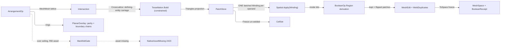

# [RASM_ARRANGEMENT]

`Rasm.Meshing` owns the exact mesh-and-polygon arrangement: ONE `ArrangementOp` `[Union]` — `MeshBoolean`, `PlanarOverlay`, `CellComplex` — folded by ONE `Arrangement.Apply` entry over the shared subdivide → classify → keep → weld algebra, `BooleanOp` the region-predicate vocabulary keep and flip derive from, four booleans as four data rows over one classification. Managed exactness is the ONE correctness rail, `manifoldc` the tier-3 scale companion behind the finite `ScaleCeiling`, an over-ceiling call with no per-RID native asset failing typed on the band-2400 union.

Rebuilding composes each floor from its owner: the crossing lattice from `Intersection.Apply` (`CrossLattice`), per-face constrained re-triangulation from `Tessellation.Build` (`Constraint.Crossing` rows, `CrossKey`-interned `Implicit` vertices), the batched inside/outside scalar from ONE `SpatialQuery.Winding` per operand, soup and weld from `MeshEdit.Of` + `Kernels.WeldDuplicates`. `BooleanOp` and `BooleanReceipt` mint here; `Processing/receipts` composes `BooleanReceipt` as the heal-session payload, `Processing/repair`'s `HealOp.Boolean` delegates to `Arrangement.Apply`.

## [01]-[INDEX]

- [02]-[ARRANGEMENT]: `Arrangement.Apply` folds the subdivide → classify → keep → weld algebra over `BooleanOp` region-predicate rows; `PatchStore` arena and frozen `CellSet`; `BooleanReceipt` with typed `BooleanRoute`; the `manifoldc` tier-3 scale gate.

## [02]-[ARRANGEMENT]

- Owner: `BooleanOp` `[SmartEnum<int>]` (`Union`/`Difference`/`Intersection`/`Xor`) — each row carries the `[UseDelegateFromConstructor]` `Region` predicate column and the `Native` `ManifoldOpType` ordinal (`Xor` carries −1: `ManifoldOpType` has no symmetric difference, so the scale lane decomposes it); `Keep` and `Flip` DERIVE over `Region`, one classification never four keep bodies; `PolygonFill` `[SmartEnum<int>]` (`NonZero`/`EvenOdd`/`Positive`/`Negative`) the fill-rule rows whose `Inside` delegate classifies the overlay's signed winding count; `BooleanRoute` `[SmartEnum<string>]` (`managed`/`native`) the typed route evidence; `BooleanReceipt` the one typed boolean evidence with its `Option<ManifoldEvidence>` native-guarantee column; `ArrangementPolicy` the policy row binding GWN accuracy, probe nudge, winding admission, the fill rule, the finite `ScaleCeiling`, the constrained `Substrate`, spatial/intersect policies, the weld `Arena`, and the native execution-governance band (`Cancel` token, `Progress` sink), registering `IValidityEvidence`; `PatchStore` the single-writer patch arena (triangle corners, operand origin, per-operand inside bits) with its frozen `CellSet` projection; `ArrangementOp`/`ArrangementResult` the request/result unions; `Arrangement` the static surface.
- Cases: `BooleanOp` 4 (`Union`/`Difference`/`Intersection`/`Xor`), `PolygonFill` 4, `BooleanRoute` 2 (`managed`/`native`), `ArrangementOp` 3 (`MeshBoolean`/`PlanarOverlay`/`CellComplex`), `ArrangementResult` 3 (`Boolean`/`Overlay`/`Complex`); the fence carries every roster. `MeshBoolean` carries its operands as one `Seq<MeshSpace>` — a pair is the two-element case, an N-solid fold one request — and `Boolean` returns `Seq<MeshSpace> Shells` so a severed result expresses its components. `PlanarOverlay` admits ring sets directly (the `Meshing/offset` self-overlap seam); `CellComplex` retains the classified arrangement un-welded for the `Rasm.Bim` solid classifier.
- Entry: one polymorphic `Apply` discriminating on the op case; no `MeshBool`/`PolygonBool`/`BuildComplex` sibling statics. `Fin` routes `GeometryFault.DegenerateInput` 2400 on an empty mesh operand or an open/degenerate/non-finite overlay ring (rings arrive raw and admit here once; mesh operands carry the `MeshSpace` admission's evidence, the interior never re-validating), `DegenerateArrangement` 2420 on a degenerate classification soup or a substrate failure re-mapped with its face witness, and `NativeAssetMissing` 2423 EXACTLY when combined operand faces exceed `ScaleCeiling` and the per-RID native asset does not resolve — under the ceiling the managed body serves every workload and the gate is never consulted; an over-ceiling `CellComplex` refuses TYPED with an actionable witness, the native engine emitting no classified cell set so the caller raises the revisable `ScaleCeiling` row for a managed run. Both volumetric cases share ONE fold with ONE soup admission per operand — gate, subdivision, classification, native raise, and emission read the same two arenas. `PlanarOverlay` returns oriented loops (outer CCW / holes CW) on intersect's chain vocabulary.
- Auto: `MeshBoolean`/`CellComplex` run the shared `Arrange` fold — (1) `Intersection.Apply(IntersectOp.MeshMesh(a, b, policy.Narrow), key)` yields the frozen `CrossLattice` (defining-entity crossing rows, per-face segments, coplanar constraint rows recorded on BOTH operand faces so the two surfaces split coherently on their shared curve); (2) per operand face, `lattice.OnFace` + `lattice.CoplanarOnFace` drive the subdivision — an un-cut face passes whole as one patch, a cut face builds `Tessellation.Build(TessellationOp.Points(...))` whose vertex rows are the three explicit corners and each crossing endpoint's `Implicit` construction interned by its `CrossKey`, piercing constraints `Constraint.Crossing` rows carrying the OTHER operand's face plane and coplanar sub-segments the perpendicular plane `(S, T, S + ê)` through their carrier edge, the sub-triangles read back through `Triangles()`; (3) classification batches every patch probe (centroid nudged `InteriorOffset` along the patch normal) into ONE `SpatialQuery.Winding(probes, otherSoup, BetaSquared)` per operand, `QueryResult.Field` scalars crossing `WindingThreshold` into the per-operand inside bits; (4) `MeshBoolean` keeps patches where `op.Keep(fromA, insideOther)`, flips winding where `op.Flip(...)` holds, and welds through `MeshEdit.Of` + `Kernels.WeldDuplicates` + `ToSpace`; `CellComplex` stops after (3) and freezes the full `CellSet`. `PlanarOverlay` is the SAME algebra on rings: all ring vertices enter ONE constrained `Tessellation.Build` with every ring edge a `Constraint.Segment`, each triangle's centroid gathers its exact SIGNED winding count against each operand's ring set (upward crossings +1 / downward −1, exact signs with no epsilon band), the policy's `PolygonFill` row classifies the raw count — `NonZero` canonical, so a self-overlapping cycle set resolves to its true covered region, with even-odd and one-sided fills the same walk under different rows — the region keeps per `op.Region(inA, inB)` directly, and the kept-region boundary edges chain into oriented `Chain` loops. Its native lane raises every operand ONCE, binds each handle to one execution context (`Cancel` cancels cooperatively, `MANIFOLD_CANCELLED` lowering on the same terminal status read), folds the whole operand vector in ONE `manifold_batch_boolean` call — `Xor` decomposing as union-minus-intersection over the raised handles — reads the genus/census/volume/area guarantee evidence off the result handle, and decomposes a severed result into shells.
- Receipt: `BooleanReceipt` — the classified-patch census, keep survivor count, weld vertex-collapse count, typed `BooleanRoute`, and the `Option<ManifoldEvidence>` column carrying the native lane's genus, V/E/F triple, volume, and area read off the result handle — the manifoldness guarantee the tier-3 route is bought for, witnessed rather than asserted; the patch-count delta with route is the boolean evidence `Processing/receipts` carries as the heal-session payload and `Rasm.Bim` reconstruction reads.
- Packages: `Rasm.Meshing` (`Intersection.Apply`, `CrossLattice`/`CrossKey`/`Chain` — the crossing lattice, composed), `Rasm.Numerics` delaunay owners (`Tessellation.Build`, `TessellationOp.Points`, `Constraint.Segment`/`Crossing`, `TessellationPolicy.Constrained`, `Triangles()` — the constrained substrate, composed), `Rasm.Spatial` (`Spatial.Apply` + `SpatialQuery.Winding` batched GWN + `SpatialOp.Build` — composed, never re-built), `Rasm.Meshing` (`MeshEdit.Of`, `Kernels.WeldDuplicates`, `ArenaPolicy` — the soup and weld owners), `Rasm.Numerics` (`Predicate`/`Implicit`/`Sign`/`Axis` — the parity classification signs), `Rasm.Numerics` (`GeometryFault`), `Rasm.Domain` (`Op`, `Kind`, `Context`, `ValidityClaim`/`IValidityEvidence`), `Rasm.Meshing` (`MeshSpace`), `Rhino.Geometry` (`Point3d`/`Polyline`), `manifoldc` (in-house P/Invoke, `api-manifold.md` — the tier-3 scale companion; NO NuGet pin), Thinktecture.Runtime.Extensions, LanguageExt.Core, BCL inbox (`NativeLibrary`, `RuntimeInformation`).
- Growth: a new arrangement modality (a Nef-style 3D cell refinement, a coplanar-face merge overlay) is one `ArrangementOp` case over the SAME arrange fold; a new boolean operation is ONE `BooleanOp` row — its `Region` delegate derives keep and flip with zero new bodies; a new classification or weld knob is one `ArrangementPolicy` column; the tier-3 native path grows only behind the existing `ScaleCeiling` gate (a second native engine is a charter amendment); zero new surface.
- Boundary: ONE `ArrangementOp` `[Union]` owns all three modalities, keep and flip DERIVING from the one `Region` column; composition stops at the public seams — `Tessellation.Build`'s op and `Triangles` projection, never the interior `SimplexStore` or a page-local triangulator, and ONE batched `Spatial/index` `Winding` per operand, the 2D ring parity being the overlay's own exact classification owned here; the managed arrangement is the correctness rail, the native route a scale companion only, and the native extraction feeds `ToSpace` with NO re-weld — a tolerance-grid weld over the engine's topologically-welded output destroys the guaranteed-manifold property the route buys; `Apply` is total over the `Fin` rail; `CellComplex` retains classification un-welded while the welded boolean is terminal.

```csharp signature
// --- [RUNTIME_PRELUDE] ----------------------------------------------------------------------
using System;
using System.Collections.Generic;
using System.Linq;
using System.Runtime.InteropServices;
using System.Threading;
using LanguageExt;
using Rasm.Domain;
using Rasm.Numerics;
using Rasm.Spatial;
using Rhino.Geometry;
using Thinktecture;
using static LanguageExt.Prelude;

namespace Rasm.Meshing;

// --- [TYPES] ------------------------------------------------------------------------------
// ONE Region column per row: Keep = region-flip across the patch (a dangling artifact has equal
// region both sides and vanishes), Flip = region on the front side; Native = the ManifoldOpType ordinal.
[SmartEnum<int>]
public sealed partial class BooleanOp {
    public static readonly BooleanOp Union        = new(0, native: 0, static (inA, inB) => inA || inB);
    public static readonly BooleanOp Difference   = new(1, native: 1, static (inA, inB) => inA && !inB);
    public static readonly BooleanOp Intersection = new(2, native: 2, static (inA, inB) => inA && inB);
    // ManifoldOpType carries no symmetric difference: Native -1 routes the scale lane through the
    // (A ∪ B) − (A ∩ B) decomposition over the already-raised handles — two batch calls, never a refusal.
    public static readonly BooleanOp Xor          = new(3, native: -1, static (inA, inB) => inA ^ inB);

    public int Native { get; }

    [UseDelegateFromConstructor]
    public partial bool Region(bool inA, bool inB);

    public bool Keep(bool fromA, bool insideOther) =>
        fromA ? Region(true, insideOther) != Region(false, insideOther)
              : Region(insideOther, true) != Region(insideOther, false);

    public bool Flip(bool fromA, bool insideOther) =>
        fromA ? Region(false, insideOther) : Region(insideOther, false);
}

[SmartEnum<string>]
[KeyMemberEqualityComparer<ComparerAccessors.StringOrdinal, string>]
[KeyMemberComparer<ComparerAccessors.StringOrdinal, string>]
public sealed partial class BooleanRoute {
    public static readonly BooleanRoute Managed = new("managed");
    public static readonly BooleanRoute Native  = new("native");
}

// Fill rule as a VALUE: the overlay's signed winding count classifies through the row's Inside delegate,
// so even-odd, positive-only, and negative-only fills are data over the one exact counting walk.
[SmartEnum<int>]
public sealed partial class PolygonFill {
    public static readonly PolygonFill NonZero  = new(key: 0, static winding => winding != 0);
    public static readonly PolygonFill EvenOdd  = new(key: 1, static winding => (winding & 1) != 0);
    public static readonly PolygonFill Positive = new(key: 2, static winding => winding > 0);
    public static readonly PolygonFill Negative = new(key: 3, static winding => winding < 0);

    [UseDelegateFromConstructor]
    public partial bool Inside(int winding);
}

// --- [CONSTANTS] --------------------------------------------------------------------------
// ScaleCeiling caps combined operand faces before the manifoldc scale route or the typed 2423 fail.
// Cancel and Progress are the native-lane execution-governance band: the token cancels the context-bound
// engine run cooperatively and the sink samples manifold progress — the managed rail ignores both.
public sealed record ArrangementPolicy(
    double BetaSquared, double InteriorOffset, double WindingThreshold, long ScaleCeiling,
    TessellationPolicy Substrate, BuildPolicy Broad, IntersectPolicy Narrow, ArenaPolicy Arena,
    PolygonFill Fill, CancellationToken Cancel = default, Option<IProgress<double>> Progress = default) : IValidityEvidence {
    public static readonly ArrangementPolicy Canonical = new(
        BetaSquared: 4.0, InteriorOffset: 1e-7, WindingThreshold: 0.5, ScaleCeiling: 1_000_000,
        Substrate: TessellationPolicy.Constrained, Broad: BuildPolicy.Canonical,
        Narrow: IntersectPolicy.Canonical, Arena: ArenaPolicy.Canonical, Fill: PolygonFill.NonZero);

    public bool BeyondManaged(long operandFaces) => operandFaces > ScaleCeiling;

    public bool IsValid => ValidityClaim.All(
        ValidityClaim.Positive(value: BetaSquared),
        ValidityClaim.Positive(value: InteriorOffset),
        ValidityClaim.UnitInterval(value: WindingThreshold),
        ValidityClaim.Positive(value: ScaleCeiling));
}

// --- [MODELS] -----------------------------------------------------------------------------
// Native-lane guarantee evidence, read off the RESULT handle before extraction: genus, the V/E/F
// triple, volume, and area witness the manifoldness the tier-3 route is bought for — never fabricated
// from the extraction census, which can only restate triangle counts.
public sealed record ManifoldEvidence(int Genus, int Vertices, int Edges, int Triangles, double Volume, double SurfaceArea);

// Managed rows sum under the pairwise fold; Native stays the LAST leg's evidence — a batch is one leg.
public sealed record BooleanReceipt(int Classified, int Kept, int Welded, BooleanRoute Route, Option<ManifoldEvidence> Native = default) {
    public static readonly BooleanReceipt Empty = new(0, 0, 0, BooleanRoute.Managed);

    public static BooleanReceipt operator +(BooleanReceipt left, BooleanReceipt right) =>
        new(left.Classified + right.Classified, left.Kept + right.Kept, left.Welded + right.Welded,
            right.Route, right.Native.IsSome ? right.Native : left.Native);
}

// Frozen classification projection: the CellComplex artifact the Rasm.Bim solid classifier reads.
public sealed record CellSet((Point3d A, Point3d B, Point3d C)[] Patches, bool[] FromA, bool[] InsideA, bool[] InsideB);

// Single-writer patch arena under the Meshing/edit#ARENA_LAW contract; Freeze() emits the one CellSet projection.
public sealed class PatchStore {
    (Point3d A, Point3d B, Point3d C)[] patches;
    bool[] fromA, insideA, insideB;
    int count;

    public PatchStore(int seed) {
        patches = new (Point3d, Point3d, Point3d)[seed];
        fromA = new bool[seed];
        insideA = new bool[seed];
        insideB = new bool[seed];
    }

    public int Count => count;
    public (Point3d A, Point3d B, Point3d C) Patch(int row) => patches[row];
    public bool FromA(int row) => fromA[row];
    public bool InsideOther(int row) => fromA[row] ? insideB[row] : insideA[row];

    public int Add((Point3d A, Point3d B, Point3d C) patch, bool sideA) {
        Grow(count + 1);
        (patches[count], fromA[count]) = (patch, sideA);
        return count++;
    }

    public void Classify(int row, bool inA, bool inB) => (insideA[row], insideB[row]) = (inA, inB);

    public Point3d Interior(int row, double offset) {
        (Point3d a, Point3d b, Point3d c) = patches[row];
        Point3d centroid = new((a.X + b.X + c.X) / 3.0, (a.Y + b.Y + c.Y) / 3.0, (a.Z + b.Z + c.Z) / 3.0);
        Vector3d n = Vector3d.CrossProduct(b - a, c - a);
        return n.IsTiny() ? centroid : centroid + (offset * (n / n.Length));
    }

    public CellSet Freeze() => new([.. patches.AsSpan(0, count)], [.. fromA.AsSpan(0, count)], [.. insideA.AsSpan(0, count)], [.. insideB.AsSpan(0, count)]);

    void Grow(int needed) {
        if (needed <= patches.Length) { return; }
        int extent = int.Max(needed, patches.Length << 1);
        Array.Resize(ref patches, extent);
        Array.Resize(ref fromA, extent);
        Array.Resize(ref insideA, extent);
        Array.Resize(ref insideB, extent);
    }
}

// --- [OPERATIONS] -------------------------------------------------------------------------
[Union(ConversionFromValue = ConversionOperatorsGeneration.None)]
public abstract partial record ArrangementOp {
    private ArrangementOp() { }

    // Arity rides the operand Seq — a pair is the two-element case, an N-solid fold one request.
    public sealed record MeshBoolean(Seq<MeshSpace> Operands, BooleanOp Op, ArrangementPolicy Policy) : ArrangementOp;
    public sealed record PlanarOverlay(Seq<Polyline> A, Seq<Polyline> B, BooleanOp Op, Axis Plane, ArrangementPolicy Policy) : ArrangementOp;
    public sealed record CellComplex(MeshSpace A, MeshSpace B, ArrangementPolicy Policy) : ArrangementOp;
}

[Union(ConversionFromValue = ConversionOperatorsGeneration.None)]
public abstract partial record ArrangementResult {
    private ArrangementResult() { }

    // Shells EXPRESS disconnection: a difference that severs the solid returns every component, the
    // managed weld the single-element case — a one-MeshSpace carrier could only lie about a severed result.
    public sealed record Boolean(Seq<MeshSpace> Shells, BooleanReceipt Receipt) : ArrangementResult;
    public sealed record Overlay(Seq<Chain> Loops, BooleanReceipt Receipt) : ArrangementResult;
    public sealed record Complex(CellSet Cells, BooleanReceipt Receipt) : ArrangementResult;
}

public static class Arrangement {
    public static Fin<ArrangementResult> Apply(ArrangementOp op, Op? key = null) =>
        op.Switch(
            state: key,
            meshBoolean:   static (key, m) => Volumetric(m.Operands, Some(m.Op), m.Policy, key),
            planarOverlay: static (key, p) => Overlay(p, key),
            cellComplex:   static (key, c) => Volumetric(Seq(c.A, c.B), None, c.Policy, key));

    // Arity rides the operand Seq. The managed rail folds the exact pairwise arrangement left-to-right
    // (Difference associates as first-minus-rest, Xor as pairwise symmetric difference); the native rail
    // raises every operand ONCE and folds them in one manifold_batch_boolean call; the cell complex is
    // its binary classification stop. Route decides once for the whole request off the combined census.
    static Fin<ArrangementResult> Volumetric(Seq<MeshSpace> operands, Option<BooleanOp> keep, ArrangementPolicy policy, Op? key) =>
        Gate(operands, policy).Bind(route => (Native: route == BooleanRoute.Native, keep.Case) switch {
            (true, BooleanOp op) => ManifoldGate.Boolean(operands, op, operands.Head.Tolerance, policy, key),
            (true, _) => Fin.Fail<ArrangementResult>(new GeometryFault.DegenerateArrangement((int)long.Min(policy.ScaleCeiling, int.MaxValue), "cell complex has no native tier; raise ScaleCeiling for a managed run").ToError()),
            (false, BooleanOp op) => operands.Tail
                .Fold(Fin.Succ((Solid: operands.Head, Receipt: BooleanReceipt.Empty)),
                    (acc, next) => acc.Bind(state => Pairwise(state.Solid, next, op, policy, key)
                        .Map(step => (step.Solid, Receipt: state.Receipt + step.Receipt))))
                .Map(final => (ArrangementResult)new ArrangementResult.Boolean(Seq(final.Solid), final.Receipt)),
            (false, _) => Complex(operands, policy, key),
        });

    // ONE soup admission per operand feeds one pairwise fold — gate, subdivide, classify, emit share the two arenas.
    static Fin<(MeshSpace Solid, BooleanReceipt Receipt)> Pairwise(MeshSpace a, MeshSpace b, BooleanOp op, ArrangementPolicy policy, Op? key) {
        using MeshEdit ea = MeshEdit.Of(a);
        using MeshEdit eb = MeshEdit.Of(b);
        return Arrange(a, b, ea, eb, policy, key).Bind(store => KeepAndWeld(store, op, a.Tolerance, policy, key));
    }

    static Fin<ArrangementResult> Complex(Seq<MeshSpace> operands, ArrangementPolicy policy, Op? key) {
        using MeshEdit ea = MeshEdit.Of(operands.Head);
        using MeshEdit eb = MeshEdit.Of(operands[1]);
        return Arrange(operands.Head, operands[1], ea, eb, policy, key).Map(store =>
            (ArrangementResult)new ArrangementResult.Complex(
                store.Freeze(), BooleanReceipt.Empty with { Classified = store.Count, Kept = store.Count }));
    }

    // Admission + tier-3 scale gate. Finiteness is the MeshSpace admission's own evidence, so the
    // interior never re-validates; over-ceiling routes Native only when the RID asset resolves, else 2423.
    static Fin<BooleanRoute> Gate(Seq<MeshSpace> operands, ArrangementPolicy policy) {
        long faces = operands.Sum(static space => (long)space.Native.Faces.Count);
        return operands.Count < 2 || operands.Exists(static space => space.Native.Vertices.Count == 0)
            ? Fin.Fail<BooleanRoute>(new GeometryFault.DegenerateInput(Kind.Mesh, operands.Count, "fewer than two operands or an empty operand").ToError())
            : !policy.BeyondManaged(faces) ? Fin.Succ(BooleanRoute.Managed)
            : ManifoldGate.AssetResolves() ? Fin.Succ(BooleanRoute.Native)
            : Fin.Fail<BooleanRoute>(new GeometryFault.NativeAssetMissing("manifoldc", RuntimeInformation.RuntimeIdentifier, policy.ScaleCeiling).ToError());
    }

    // --- [ARRANGE]
    static Fin<PatchStore> Arrange(MeshSpace a, MeshSpace b, MeshEdit ea, MeshEdit eb, ArrangementPolicy policy, Op? key) {
        PatchStore store = new(int.Max(ea.FaceCount + eb.FaceCount, 16));
        return Intersection.Apply(new IntersectOp.MeshMesh(a, b, policy.Narrow), key)
            .Bind(result => result is IntersectResult.Chains chains
                ? Fin.Succ(chains.Lattice)
                : Fin.Fail<CrossLattice>(new GeometryFault.DegenerateArrangement(0, "mesh-mesh lattice unavailable").ToError()))
            .Bind(lattice => Subdivided(store, ea, lattice, sideA: true, eb, policy, key)
                .Bind(_ => Subdivided(store, eb, lattice, sideA: false, ea, policy, key)))
            .Bind(_ => Classify(store, ea, eb, policy, key));
    }

    static Fin<Unit> Subdivided(PatchStore store, MeshEdit soup, CrossLattice lattice, bool sideA, MeshEdit other, ArrangementPolicy policy, Op? key) {
        int side = sideA ? 0 : 1;
        for (int f = 0; f < soup.FaceCount; f++) {
            (int A, int B, int FaceA, int FaceB)[] cuts = lattice.OnFace(side, f).ToArray();
            (int A, int B, int FaceA, int FaceB, int CarrierU, int CarrierV, int CarrierSide)[] flush = lattice.CoplanarOnFace(side, f).ToArray();
            (int v0, int v1, int v2) = soup.Face(f);
            (Point3d ca, Point3d cb, Point3d cc) = (soup.Position(v0), soup.Position(v1), soup.Position(v2));
            if (cuts.Length == 0 && flush.Length == 0) {
                store.Add((ca, cb, cc), sideA);
                continue;
            }
            Fin<Unit> built = FaceBuild(store, lattice, cuts, flush, sideA, (ca, cb, cc), f, soup, other, policy, key);
            if (built.IsFail) { return built; }
        }
        return Fin.Succ(unit);
    }

    // One constrained per-face build: 3 explicit corners + CrossKey-interned Implicit crossing rows.
    // Piercing cuts carry the OTHER operand's face plane; a coplanar sub-segment carries the
    // PERPENDICULAR plane (S, T, S+ê) through its carrier edge — the coplanar face's own plane would
    // degenerate the delaunay recovery re-anchor. Support = this face's corners (the recovery witness).
    static Fin<Unit> FaceBuild(PatchStore store, CrossLattice lattice, (int A, int B, int FaceA, int FaceB)[] cuts, (int A, int B, int FaceA, int FaceB, int CarrierU, int CarrierV, int CarrierSide)[] flush, bool sideA, (Point3d A, Point3d B, Point3d C) face, int faceId, MeshEdit soup, MeshEdit other, ArrangementPolicy policy, Op? key) {
        List<Implicit> rows = new() { new(face.A), new(face.B), new(face.C) };
        Dictionary<CrossKey, int> slotOf = new();
        int Intern(int latticeRow) {
            Crossing crossing = lattice.Rows[latticeRow];
            if (slotOf.TryGetValue(crossing.Key, out int at)) { return at; }
            rows.Add(crossing.Point);
            return slotOf[crossing.Key] = rows.Count - 1;
        }
        return Axis.DominantOf(face.A, face.B, face.C, key).Bind(plane => {
            Vector3d lift = plane.Key == 0 ? new Vector3d(1.0, 0.0, 0.0) : plane.Key == 1 ? new Vector3d(0.0, 1.0, 0.0) : new Vector3d(0.0, 0.0, 1.0);
            List<Constraint> constraints = new(cuts.Length + flush.Length);
            foreach ((int A, int B, int FaceA, int FaceB) cut in cuts) {
                (int o0, int o1, int o2) = other.Face(sideA ? cut.FaceB : cut.FaceA);
                constraints.Add(new Constraint.Crossing(Intern(cut.A), Intern(cut.B), other.Position(o0), other.Position(o1), other.Position(o2)));
            }
            foreach ((int A, int B, int FaceA, int FaceB, int CarrierU, int CarrierV, int CarrierSide) row in flush) {
                MeshEdit carrier = row.CarrierSide == (sideA ? 0 : 1) ? soup : other;
                (Point3d s, Point3d t) = (carrier.Position(row.CarrierU), carrier.Position(row.CarrierV));
                constraints.Add(new Constraint.Crossing(Intern(row.A), Intern(row.B), s, t, s + lift));
            }
            return Tessellation.Build(
                    new TessellationOp.Points(TessellationKind.Triangulation, [.. rows], toSeq(constraints), policy.Substrate, plane, Some((face.A, face.B, face.C))), key)
                .MapFail(fail => new GeometryFault.DegenerateArrangement(faceId, $"substrate: {fail.Message}").ToError())
                .Bind(t => t.Triangles(key))
                .Map(tris => {
                    foreach ((Point3d a, Point3d b, Point3d c) in tris) { store.Add((a, b, c), sideA); }
                    return unit;
                });
        });
    }

    // ONE batched Winding query per operand over every patch probe — never a per-patch loop.
    static Fin<PatchStore> Classify(PatchStore store, MeshEdit ea, MeshEdit eb, ArrangementPolicy policy, Op? key) {
        Point3d[] probes = new Point3d[store.Count];
        for (int p = 0; p < store.Count; p++) { probes[p] = store.Interior(p, policy.InteriorOffset); }
        return (Winding(probes, ea, policy, key), Winding(probes, eb, policy, key)).Apply((wa, wb) => (wa, wb)).As()
            .Map(t => {
                for (int p = 0; p < store.Count; p++) { store.Classify(p, t.wa[p] > policy.WindingThreshold, t.wb[p] > policy.WindingThreshold); }
                return store;
            });
    }

    static Fin<double[]> Winding(Point3d[] probes, MeshEdit soup, ArrangementPolicy policy, Op? key) {
        Point3d[] triangles = new Point3d[3 * soup.FaceCount];
        BoundingBox[] boxes = new BoundingBox[soup.FaceCount];
        for (int f = 0; f < soup.FaceCount; f++) {
            (int a, int b, int c) = soup.Face(f);
            (triangles[3 * f], triangles[(3 * f) + 1], triangles[(3 * f) + 2]) = (soup.Position(a), soup.Position(b), soup.Position(c));
            boxes[f] = soup.Bounds(f);
        }
        return Spatial.Apply(new SpatialOp.Build(SpatialKind.Bvh, boxes, policy.Broad), key)
            .Bind(answer => answer is SpatialAnswer.Index built
                ? Spatial.Apply(new SpatialOp.Query(built.Value, new SpatialQuery.Winding(probes, triangles, policy.BetaSquared)), key)
                : Fin.Fail<SpatialAnswer>(new GeometryFault.DegenerateArrangement(soup.FaceCount, "winding index unavailable").ToError()))
            .Bind(static answer => answer is SpatialAnswer.Result { Value: QueryResult.Field field }
                ? Fin.Succ(field.Values)
                : Fin.Fail<double[]>(new GeometryFault.KindMismatch(SpatialKind.Bvh, QueryKind.Winding).ToError()));
    }

    // --- [KEEP_AND_WELD]
    static Fin<(MeshSpace Solid, BooleanReceipt Receipt)> KeepAndWeld(PatchStore store, BooleanOp op, Context tolerance, ArrangementPolicy policy, Op? key) {
        List<Point3d> vertices = new(3 * store.Count);
        List<(int, int, int)> faces = new(store.Count);
        int kept = 0;
        for (int p = 0; p < store.Count; p++) {
            if (!op.Keep(store.FromA(p), store.InsideOther(p))) { continue; }
            (Point3d a, Point3d b, Point3d c) = store.Patch(p);
            int at = vertices.Count;
            vertices.AddRange([a, b, c]);
            faces.Add(op.Flip(store.FromA(p), store.InsideOther(p)) ? (at, at + 2, at + 1) : (at, at + 1, at + 2));
            kept++;
        }
        using MeshEdit edit = MeshEdit.Of([.. vertices], [.. faces], policy.Arena);
        int before = edit.VertexCount;
        Kernels.WeldDuplicates(edit);
        return edit.ToSpace(tolerance, key).Map(solid =>
            (solid, new BooleanReceipt(store.Count, kept, before - edit.VertexCount, BooleanRoute.Managed)));
    }

    // --- [PLANAR_OVERLAY]
    static Fin<ArrangementResult> Overlay(ArrangementOp.PlanarOverlay op, Op? key) {
        List<Implicit> rows = new();
        List<Constraint> constraints = new();
        int ordinal = 0;
        foreach (Polyline ring in op.A.Concat(op.B)) {
            if (ring.Count < 4 || !ring.IsClosed) {
                return Fin.Fail<ArrangementResult>(new GeometryFault.DegenerateInput(Kind.Polyline, ordinal, "open or degenerate ring").ToError());
            }
            for (int v = 0; v < ring.Count - 1; v++) {  // rings arrive RAW — this is their one admission seam
                if (!ring[v].IsValid) { return Fin.Fail<ArrangementResult>(new GeometryFault.DegenerateInput(Kind.Polyline, ordinal, "non-finite ring vertex").ToError()); }
            }
            int baseAt = rows.Count;
            for (int v = 0; v < ring.Count - 1; v++) { rows.Add(new Implicit(ring[v])); }
            for (int v = 0; v < ring.Count - 1; v++) { constraints.Add(new Constraint.Segment(baseAt + v, baseAt + ((v + 1) % (ring.Count - 1)))); }
            ordinal++;
        }
        return Tessellation.Build(new TessellationOp.Points(TessellationKind.Triangulation, [.. rows], toSeq(constraints), op.Policy.Substrate, op.Plane), key)
            .Bind(t => t.Triangles(key))
            .Map(tris => {
                bool[] region = new bool[tris.Length];
                for (int i = 0; i < tris.Length; i++) {
                    (Point3d a, Point3d b, Point3d c) = tris[i];
                    Point3d probe = new((a.X + b.X + c.X) / 3.0, (a.Y + b.Y + c.Y) / 3.0, (a.Z + b.Z + c.Z) / 3.0);
                    region[i] = op.Op.Region(
                        op.Policy.Fill.Inside(winding: Winding(probe, op.A, op.Plane)),
                        op.Policy.Fill.Inside(winding: Winding(probe, op.B, op.Plane)));
                }
                Seq<Chain> loops = BoundaryLoops(tris, region);
                return (ArrangementResult)new ArrangementResult.Overlay(
                    loops, new BooleanReceipt(tris.Length, region.Count(static r => r), 0, BooleanRoute.Managed));
            });
    }

    // Exact SIGNED winding count: the +U half-line counts edge (a,b) iff its endpoints straddle V
    // HALF-OPEN (a Zero endpoint counts with the non-negative side, so an on-ray vertex neither
    // double-counts nor vanishes) at an exact +U side sign; +1 up, -1 down. The count leaves RAW —
    // classified by the policy's PolygonFill row, so nonzero, even-odd, and one-sided fills are one
    // walk under four data rows, and a self-overlapping cycle set resolves per the caller's fill law.
    static int Winding(Point3d probe, Seq<Polyline> rings, Axis plane) {
        int v = plane.V;
        int count = 0;
        foreach (Polyline ring in rings) {
            for (int e = 0; e < ring.Count - 1; e++) {
                (Point3d a, Point3d b) = (ring[e], ring[e + 1]);
                bool aBelow = Sign.Of(Axis.Coord(a, v).CompareTo(Axis.Coord(probe, v))) == Sign.Negative;
                bool bBelow = Sign.Of(Axis.Coord(b, v).CompareTo(Axis.Coord(probe, v))) == Sign.Negative;
                if (aBelow == bBelow) { continue; }
                Sign side = Predicate.Orient2D(new Implicit(a), new Implicit(b), new Implicit(probe), plane);
                if (side == Sign.Zero) { continue; }
                if (aBelow ? side == Sign.Positive : side == Sign.Negative) { count += aBelow ? 1 : -1; }
            }
        }
        return count;
    }

    // Boundary of the kept region: kept/unkept edge pairs cancel in opposite orientation, chained by
    // shared endpoints (outer CCW, holes CW). Endpoint keys are BIT-IDENTICAL (one Round() per row),
    // so a pinch vertex is a stacked start the walk drains one loop at a time; seeds drain first-seen.
    static Seq<Chain> BoundaryLoops((Point3d A, Point3d B, Point3d C)[] tris, bool[] region) {
        Dictionary<(Point3d, Point3d), (Point3d From, Point3d To)> boundary = new();
        for (int i = 0; i < tris.Length; i++) {
            if (!region[i]) { continue; }
            foreach ((Point3d p, Point3d q) in (ReadOnlySpan<(Point3d, Point3d)>)[(tris[i].A, tris[i].B), (tris[i].B, tris[i].C), (tris[i].C, tris[i].A)]) {
                if (!boundary.Remove((q, p))) { boundary[(p, q)] = (p, q); }
            }
        }
        Dictionary<Point3d, Stack<Point3d>> byStart = new();
        List<Point3d> order = new();
        for (int i = 0; i < tris.Length; i++) {
            if (!region[i]) { continue; }
            foreach ((Point3d p, Point3d q) in (ReadOnlySpan<(Point3d, Point3d)>)[(tris[i].A, tris[i].B), (tris[i].B, tris[i].C), (tris[i].C, tris[i].A)]) {
                if (!boundary.TryGetValue((p, q), out (Point3d From, Point3d To) edge)) { continue; }
                if (!byStart.TryGetValue(edge.From, out Stack<Point3d>? tos)) {
                    byStart[edge.From] = tos = new Stack<Point3d>();
                    order.Add(edge.From);
                }
                tos.Push(edge.To);
            }
        }
        List<Chain> loops = new();
        foreach (Point3d seed in order) {
            while (byStart.ContainsKey(seed)) {
                Polyline loop = new() { seed };
                Point3d cur = seed;
                while (byStart.TryGetValue(cur, out Stack<Point3d>? outgoing)) {
                    Point3d next = outgoing.Pop();
                    if (outgoing.Count == 0) { byStart.Remove(cur); }
                    loop.Add(next);
                    cur = next;
                    if (cur == seed) { break; }
                }
                if (loop.Count > 2) { loops.Add(new Chain(loop, Closed: cur == seed)); }
            }
        }
        return toSeq(loops);
    }

}

// --- [COMPOSITION] --------------------------------------------------------------------------
// Tier-3 scale companion (api-manifold.md): capsule-owned manifoldc P/Invoke. Booleans are LAZY CSG
// upstream, so manifold_status is the eager read surfacing a propagated rejection BEFORE extraction;
// every alloc pairs with delete on every exit — the memory law, the platform-forced statement seam.
// Engine output arrives TOPOLOGICALLY WELDED: a tolerance-grid re-weld here would destroy the
// guaranteed-manifold property the tier-3 route buys, so extraction feeds ToSpace with no weld pass.
file static partial class ManifoldGate {
    [LibraryImport("manifoldc")] private static partial nint manifold_alloc_meshgl64();
    [LibraryImport("manifoldc")] private static partial nint manifold_alloc_manifold();
    [LibraryImport("manifoldc")] private static partial nint manifold_meshgl64(nint mem, [In] double[] vertProps, nuint nVerts, nuint nProps, [In] ulong[] triVerts, nuint nTris);
    [LibraryImport("manifoldc")] private static partial nint manifold_of_meshgl64(nint mem, nint mesh);
    [LibraryImport("manifoldc")] private static partial nint manifold_boolean(nint mem, nint a, nint b, int op);
    [LibraryImport("manifoldc")] private static partial nint manifold_batch_boolean(nint mem, nint vec, int op);
    [LibraryImport("manifoldc")] private static partial nint manifold_decompose(nint mem, nint m);
    [LibraryImport("manifoldc")] private static partial int manifold_status(nint m);
    [LibraryImport("manifoldc")] private static partial int manifold_genus(nint m);
    [LibraryImport("manifoldc")] private static partial nuint manifold_num_vert(nint m);
    [LibraryImport("manifoldc")] private static partial nuint manifold_num_edge(nint m);
    [LibraryImport("manifoldc")] private static partial nuint manifold_num_tri(nint m);
    [LibraryImport("manifoldc")] private static partial double manifold_volume(nint m);
    [LibraryImport("manifoldc")] private static partial double manifold_surface_area(nint m);
    [LibraryImport("manifoldc")] private static partial void manifold_execution_context_cancel(nint context);
    [LibraryImport("manifoldc")] private static partial int manifold_execution_context_cancelled(nint context);
    [LibraryImport("manifoldc")] private static partial double manifold_execution_context_progress(nint context);
    [LibraryImport("manifoldc")] private static partial nint manifold_with_context(nint mem, nint m, nint context);
    [LibraryImport("manifoldc")] private static partial nint manifold_get_meshgl64(nint mem, nint m);
    [LibraryImport("manifoldc")] private static partial nuint manifold_meshgl64_num_vert(nint m);
    [LibraryImport("manifoldc")] private static partial nuint manifold_meshgl64_num_tri(nint m);
    [LibraryImport("manifoldc")] private static partial nint manifold_meshgl64_vert_properties([Out] double[] mem, nint m);
    [LibraryImport("manifoldc")] private static partial nint manifold_meshgl64_tri_verts([Out] ulong[] mem, nint m);
    [LibraryImport("manifoldc")] private static partial void manifold_delete_manifold(nint m);
    [LibraryImport("manifoldc")] private static partial void manifold_delete_meshgl64(nint m);

    internal static bool AssetResolves() => NativeLibrary.TryLoad("manifoldc", out nint handle) && Free(handle);

    static bool Free(nint handle) { NativeLibrary.Free(handle); return true; }

    // N-ary in ONE engine call: every operand raises once and binds the execution context
    // (manifold_with_context returns a NEW handle — both generations delete in finally); the CSG tree
    // forces ONCE at the terminal status read, where MANIFOLD_CANCELLED lowers beside the rejection
    // arms; Xor (Native -1) decomposes as (∪ operands) − (∩ operands) over the same raised handles.
    // manifold_decompose splits a severed result into its shells, each lowered through one extraction.
    internal static Fin<ArrangementResult> Boolean(Seq<MeshSpace> operands, BooleanOp op, Context tolerance, ArrangementPolicy policy, Op? key) {
        nint context = OpenContext();
        using CancellationTokenRegistration cancel = policy.Cancel.Register(() => manifold_execution_context_cancel(context));
        nint[] raised = new nint[operands.Count];
        nint[] bound = new nint[operands.Count];
        nint raw = 0;
        long classified = operands.Sum(static space => (long)space.Native.Faces.Count);
        try {
            for (int i = 0; i < operands.Count; i++) {
                using MeshEdit soup = MeshEdit.Of(operands[i]);
                raised[i] = Raise(soup);
                bound[i] = manifold_with_context(manifold_alloc_manifold(), raised[i], context);
                if (manifold_status(bound[i]) != 0) {
                    return Fin.Fail<ArrangementResult>(new GeometryFault.DegenerateArrangement(i, "manifoldc rejected an operand").ToError());
                }
            }
            raw = op.Native >= 0
                ? BatchBoolean(bound, op.Native)
                : Subtract(BatchBoolean(bound, BooleanOp.Union.Native), BatchBoolean(bound, BooleanOp.Intersection.Native));
            policy.Progress.Iter(sink => sink.Report(manifold_execution_context_progress(context)));
            return manifold_status(raw) switch {
                0 => Evidence(raw).Bind(evidence => Shells(raw, tolerance, policy, key).Map(shells =>
                        (ArrangementResult)new ArrangementResult.Boolean(shells.Solids,
                            new BooleanReceipt((int)long.Min(classified, int.MaxValue), evidence.Triangles, 0, BooleanRoute.Native, Some(evidence))))),
                _ when manifold_execution_context_cancelled(context) != 0 =>
                    Fin.Fail<ArrangementResult>(new GeometryFault.DegenerateArrangement(0, "manifoldc run cancelled").ToError()),
                int status => Fin.Fail<ArrangementResult>(new GeometryFault.DegenerateArrangement(0, $"manifoldc boolean status {status}").ToError()),
            };
        }
        finally {
            if (raw != 0) { manifold_delete_manifold(raw); }
            foreach (nint handle in bound) { if (handle != 0) { manifold_delete_manifold(handle); } }
            foreach (nint handle in raised) { if (handle != 0) { manifold_delete_manifold(handle); } }
            CloseContext(context);
        }
    }

    // Guarantee reads populate the receipt off the RESULT handle — eager against an already-forced
    // status, so laziness is undisturbed and the evidence is the engine's own, never re-derived.
    static Fin<ManifoldEvidence> Evidence(nint result) =>
        Fin.Succ(new ManifoldEvidence(
            Genus: manifold_genus(result), Vertices: (int)manifold_num_vert(result), Edges: (int)manifold_num_edge(result),
            Triangles: (int)manifold_num_tri(result), Volume: manifold_volume(result), SurfaceArea: manifold_surface_area(result)));

    // Context lifetime pair and the ManifoldManifoldVec construction/read seams — the catalog rosters the
    // handles and the batch/decompose entries; the alloc, set, length, and get spellings ride [04]-[RESEARCH].
    static nint OpenContext();
    static void CloseContext(nint context);
    static nint BatchBoolean(nint[] bound, int op);                     // pack → manifold_batch_boolean → one result
    static nint Subtract(nint left, nint right);                        // manifold_boolean(…, 1), deleting both operands
    static Fin<(Seq<MeshSpace> Solids, int ShellCount)> Shells(nint result, Context tolerance, ArrangementPolicy policy, Op? key);  // manifold_decompose → Lower per shell

    // Raise: the already-admitted arena's double columns feed manifold_meshgl64 (positions-only,
    // n_props = 3); manifold_of_meshgl64 never aborts — the status read is the typed rejection.
    static nint Raise(MeshEdit soup) {
        double[] props = new double[3 * soup.VertexCount];
        for (int v = 0; v < soup.VertexCount; v++) { (props[3 * v], props[(3 * v) + 1], props[(3 * v) + 2]) = (soup.X[v], soup.Y[v], soup.Z[v]); }
        ulong[] tris = new ulong[3 * soup.FaceCount];
        for (int f = 0; f < soup.FaceCount; f++) {
            (int a, int b, int c) = soup.Face(f);
            (tris[3 * f], tris[(3 * f) + 1], tris[(3 * f) + 2]) = ((ulong)a, (ulong)b, (ulong)c);
        }
        nint mesh = manifold_meshgl64(manifold_alloc_meshgl64(), props, (nuint)soup.VertexCount, 3, tris, (nuint)soup.FaceCount);
        try { return manifold_of_meshgl64(manifold_alloc_manifold(), mesh); }
        finally { manifold_delete_meshgl64(mesh); }
    }

    // Lower: census-sized extraction straight into ToSpace — the engine welded topologically, so the
    // managed tolerance-grid weld is the DELETED pass that silently broke the manifold guarantee.
    static Fin<MeshSpace> Lower(nint shell, Context tolerance, ArrangementPolicy policy, Op? key) {
        nint mesh = manifold_get_meshgl64(manifold_alloc_meshgl64(), shell);
        try {
            int nv = (int)manifold_meshgl64_num_vert(mesh);
            int nt = (int)manifold_meshgl64_num_tri(mesh);
            double[] props = new double[3 * nv];
            ulong[] tris = new ulong[3 * nt];
            _ = manifold_meshgl64_vert_properties(props, mesh);
            _ = manifold_meshgl64_tri_verts(tris, mesh);
            Point3d[] vertices = new Point3d[nv];
            for (int v = 0; v < nv; v++) { vertices[v] = new Point3d(props[3 * v], props[(3 * v) + 1], props[(3 * v) + 2]); }
            (int, int, int)[] faces = new (int, int, int)[nt];
            for (int f = 0; f < nt; f++) { faces[f] = ((int)tris[3 * f], (int)tris[(3 * f) + 1], (int)tris[(3 * f) + 2]); }
            using MeshEdit edit = MeshEdit.Of(vertices, faces, policy.Arena);
            return edit.ToSpace(tolerance, key);
        }
        finally { manifold_delete_meshgl64(mesh); }
    }
}
```


```mermaid
---
config:
  layout: elk
  flowchart:
    curve: linear
    padding: 25
---
flowchart LR
    accTitle: Arrangement composition flow
    accDescr: Request flows from the arrangement op through the crossing lattice, constrained re-triangulation, batched winding classification, and region keep into the welded result.
    ArrangementOp -->|MeshMesh lattice| Intersection
    Intersection -->|CrossLattice: defining-entity carriage| Substrate["Tessellation.Build (constrained)"]
    Substrate -->|Triangles projection| PatchStore
    PatchStore -->|ONE batched Winding per operand| GWN["Spatial.Apply(Winding)"]
    GWN -->|inside bits| Keep["BooleanOp.Region derivation"]
    Keep -->|kept + flipped patches| Weld["MeshEdit + WeldDuplicates"]
    Weld -->|ToSpace freeze| MeshSpaceOut["MeshSpace + BooleanReceipt"]
    PatchStore -->|Freeze un-welded| CellSet
    ArrangementOp -->|rings| Overlay["PlanarOverlay: parity + boundary chains"]
    ArrangementOp -.->|over ceiling, RID asset| ManifoldGate
    ManifoldGate -.->|asset missing| Fault2423["NativeAssetMissing 2423"]
```

## [03]-[DENSITY_BAR]

`[RAIL]` cells name the one return rail each owner exposes.

| [INDEX] | [AXIS_CONCERN]     | [OWNER]          | [RAIL]                                       | [CASES] |
| :-----: | :----------------- | :--------------- | :------------------------------------------- | :-----: |
|  [01]   | Arrangement        | `ArrangementOp`  | `Arrangement.Apply → Fin<ArrangementResult>` |    3    |
|  [02]   | Boolean vocabulary | `BooleanOp`      | policy rows (repair delegates)               |    4    |
|  [03]   | Fill rule          | `PolygonFill`    | policy rows (`Inside` delegate)              |    4    |
|  [04]   | Route evidence     | `BooleanRoute`   | receipt field                                |    2    |
|  [05]   | Boolean evidence   | `BooleanReceipt` | carrier (+ `Option<ManifoldEvidence>`)       |    —    |
|  [06]   | Patch arena        | `PatchStore`     | frozen projection                            |    —    |
|  [07]   | Scale companion    | `ManifoldGate`   | `Fin` (2423 on missing asset)                |    —    |

## [04]-[RESEARCH]

<!-- source-only: research row template:
[TOKEN]-[OPEN|BLOCKED]: <exact question>; <verification route>.
[SPLIT_MEMBER]-[OPEN]: does `shape-core` expose `split_all`; verify against the member rail.
-->

- [MANIFOLD_VEC_MEMBERS]-[OPEN]: which exact `manifoldc` spellings construct, fill, measure, and read a `ManifoldManifoldVec` (the `manifold_batch_boolean`/`manifold_decompose` operand and result carrier), and which alloc/delete pair owns `ManifoldExecutionContext` lifetime; verify against `manifoldc.h` on the vendored header, then close `ManifoldGate.OpenContext`/`CloseContext`/`BatchBoolean`/`Shells`.
