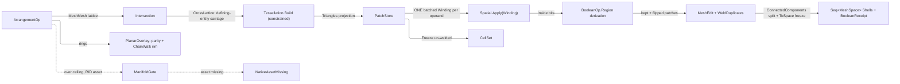

# [RASM_ARRANGEMENT]

`Rasm.Meshing` owns the exact mesh-and-polygon arrangement: ONE `ArrangementOp` `[Union]` — `MeshBoolean`, `PlanarOverlay`, `CellComplex` — folded by ONE `Arrangement.Apply` entry over the shared subdivide → classify → keep → weld algebra, `BooleanOp` the region-predicate vocabulary keep and flip derive from, four booleans as four data rows over one classification. Managed exactness is the ONE correctness rail, `manifoldc` the tier-3 scale companion behind the finite `ScaleCeiling`, an over-ceiling call with no per-RID native asset failing typed on the `GeometryFault` union.

Rebuilding composes each floor from its owner: the crossing lattice from `Intersection.Apply` (`CrossLattice`), per-face constrained re-triangulation from `Tessellation.Build` (`Conform.Crossing` rows, `CrossKey`-interned `Implicit` vertices), the batched inside/outside scalar from ONE `SpatialQuery.Winding` per operand, soup and weld from `MeshEdit.Of` + `Kernels.WeldDuplicates`, and both graph products — component severance and rim decomposition — from the ONE admitted QuikGraph walk family. `BooleanOp`, `BooleanReceipt`, and its `ManifoldEvidence`/`ManifoldProvenance` evidence records mint here; `Processing/receipts` composes `BooleanReceipt` as the heal-session payload, `Processing/repair`'s `HealOp.Boolean` delegates to `Arrangement.Apply`, and an `Analysis` `Eff<Env, T>` pipeline descending into this synchronous fold seats its governance through `ArrangementPolicy.Governed` at the crossing — the descent is one-way and `Analysis` gains no `Meshing` reference.

## [01]-[INDEX]

- [02]-[ARRANGEMENT]: `Arrangement.Apply` folds the subdivide → classify → keep → weld algebra over `BooleanOp` region-predicate rows; `PatchStore` arena and frozen `CellSet`; `BooleanReceipt` over census, guarantee, and provenance with typed `BooleanRoute`; the `AbandonWitness`/`Operand` governance and side bands both routes read; the `manifoldc` tier-3 scale gate.
- [03]-[DENSITY_BAR]: one owner per axis with its return rail and case count.

## [02]-[ARRANGEMENT]

- Owner: `BooleanOp` `[SmartEnum<int>]` (`Union`/`Difference`/`Intersection`/`Xor`) — each row carries the `[UseDelegateFromConstructor]` `Region` predicate column and the `Native` `ManifoldOpType` ordinal (`Xor` carries −1: `ManifoldOpType` has no symmetric difference, so the scale lane decomposes it); `Keep` and `Flip` DERIVE over `Region`, one classification never four keep bodies; `PolygonFill` `[SmartEnum<int>]` (`NonZero`/`EvenOdd`/`Positive`/`Negative`) the fill-rule rows whose `Inside` delegate classifies the overlay's signed winding count; `BooleanRoute` `[SmartEnum<string>]` (`managed`/`native`) the typed route evidence; `BooleanReceipt` the one typed boolean evidence over three axes — the summing census columns, the `Option<ManifoldEvidence>` native guarantee, and the `Option<ManifoldProvenance>` run attribution — beside its `Option<int> ShellCount` severance census, every optional slot spelling absence where an arm took no measure; `ManifoldProvenance` the operand-seated run windows, run ids, and per-triangle face ids with the one `OperandOf` join; the `Numerics/faults` `AbandonWitness` roster the governance band reads, each row declaring its own completed fraction and being exactly what the abandonment fault carries; `Operand` the keyless-wire `[SmartEnum<int>]` side vocabulary whose key IS the lattice side ordinal and whose columns carry the subdivision stage and the cut's facing-face projector, so no fold re-derives a side from a flag; `ArrangementPolicy` the policy row binding GWN accuracy, winding admission, the fill rule, the finite `ScaleCeiling`, the constrained `Substrate`, spatial/intersect policies, the weld `Arena`, and the execution-governance band BOTH routes read (`Cancel` token, `Progress` sink, the `Governed` seat projecting them down from the ambient `Env`); `PatchStore` the single-writer patch arena (triangle corners, operand origin, per-operand inside bits) with its frozen `CellSet` projection; `ArrangementOp`/`ArrangementResult` the request/result unions; `Arrangement` the static surface.
- Cases: `BooleanOp` 4 (`Union`/`Difference`/`Intersection`/`Xor`), `PolygonFill` 4, `BooleanRoute` 2 (`managed`/`native`), `Operand` 2 (`A`/`B`), `ArrangementOp` 3 (`MeshBoolean`/`PlanarOverlay`/`CellComplex`), `ArrangementResult` 3 (`Boolean`/`Overlay`/`Complex`); the fence carries every roster. `MeshBoolean` carries its operands as one `Seq<MeshSpace>` — a pair is the two-element case, an N-solid fold one request — and `Boolean` returns `Seq<MeshSpace> Shells` so a severed result expresses its components on BOTH routes, the managed rail decomposing its welded terminal through the one graph-walk owner and the native rail reading its `manifold_decompose` vector. `PlanarOverlay` admits ring sets directly (the `Meshing/offset` self-overlap seam); `CellComplex` retains the classified arrangement un-welded for the `Rasm.Bim` solid classifier.
- Entry: one polymorphic `[BoundaryAdapter] Apply` discriminating on the op case; no `MeshBool`/`PolygonBool`/`BuildComplex` sibling statics, and every interior static takes the resolved `Op` outright. `Fin` routes `GeometryFault.DegenerateInput` on an empty mesh operand or an open/degenerate/non-finite overlay ring (rings arrive raw and admit here once; mesh operands carry the `MeshSpace` admission's evidence, the interior never re-validating), `DegenerateArrangement` on a degenerate classification soup or a substrate failure re-mapped with its face witness, `RunAbandoned` EXACTLY when the governance token cancels — the native engine's `MANIFOLD_CANCELLED` status and the managed fold's stage reads lower the ONE case over the ONE `AbandonWitness` roster, carrying the fraction the abandoning stage measured, never a vocabulary per route — and `NativeAssetMissing` EXACTLY when combined operand faces exceed `ScaleCeiling` and the per-RID native asset does not resolve — under the ceiling the managed body serves every workload and the gate is never consulted; an over-ceiling `CellComplex` refuses TYPED with an actionable witness, the native engine emitting no classified cell set so the caller raises the revisable `ScaleCeiling` row for a managed run. Both volumetric cases share ONE fold with ONE soup admission per operand — gate, subdivision, classification, native raise, and emission read the same two arenas. `PlanarOverlay` returns oriented loops (outer CCW / holes CW) on intersect's chain vocabulary.
- Auto: `MeshBoolean`/`CellComplex` run the shared `Arrange` fold — (1) `Intersection.Apply(IntersectOp.MeshMesh(a, b, policy.Narrow), key)` yields the frozen `CrossLattice` (defining-entity crossing rows, per-face segments, coplanar constraint rows recorded on BOTH operand faces so the two surfaces split coherently on their shared curve); (2) per operand face, `lattice.OnFace` + `lattice.CoplanarOnFace` drive the subdivision — an un-cut face passes whole as one patch, a cut face builds `Tessellation.Build(TessellationOp.Points(...))` whose vertex rows are the three explicit corners and each crossing endpoint's `Implicit` construction interned by its `CrossKey`, piercing conforms `Conform.Crossing` rows carrying the OTHER operand's face plane and coplanar sub-segments the perpendicular plane `(S, T, S + ê)` through their carrier edge, the sub-triangles read back through `Triangles()` as corners beside face indices; (3) classification batches every patch probe (centroid nudged along the patch normal by the operand context's own `ToleranceLane.Offset` read) into ONE `SpatialQuery.Winding(probes, otherSoup, BetaSquared)` per operand, `QueryResult.Field` scalars crossing `WindingThreshold` into the per-operand inside bits; (4) `MeshBoolean` keeps patches where `op.Keep(fromA, insideOther)`, flips winding where `op.Flip(...)` holds, and welds through `MeshEdit.Of` + `Kernels.WeldDuplicates` + `ToSpace`; `CellComplex` stops after (3) and freezes the full `CellSet`. `PlanarOverlay` is the SAME algebra on rings: all ring vertices enter ONE constrained `Tessellation.Build` with every ring edge a `Conform.Edge`, each triangle's centroid gathers its exact SIGNED winding count against each operand's ring set (upward crossings +1 / downward −1, exact signs with no epsilon band), the policy's `PolygonFill` row classifies the raw count — `NonZero` canonical, so a self-overlapping cycle set resolves to its true covered region, with even-odd and one-sided fills the same walk under different rows — the region keeps per `op.Region(inA, inB)` directly, and the kept-region rim decomposes into oriented `Chain` loops through the folder's ONE `ChainWalk` owner over the substrate's own corner ordinals. Each managed stage — the two subdivision walks, the batched classification, the weld — OPENS by publishing its declared `AbandonWitness.Done` fraction and reading `policy.Cancel`, the subdivision walk re-reading the bare token per face, and the terminal welded result then decomposes into connected shells through the one QuikGraph component walk. Its native lane raises every operand ONCE and re-seats it through `manifold_as_original` so the result's runs name an operand the kernel declared, packs the operands into ONE `manifold_manifold_vec` and folds them in ONE `manifold_batch_boolean` call — `Xor` decomposing as union-minus-intersection over the same seated handles — then attaches the execution context to the RESULT, because a deferred batch op ignores an operand-attached context and returns one carrying none: `manifold_status` on that bound copy is the single eager force, the one point where `Cancel` reaches the evaluation and the progress read has anything to report. It reads the genus/census/volume/area guarantee off that forced handle, the run windows, run ids, and per-triangle face ids off its `meshgl64` as the attribution axis, and decomposes a severed result into shells.
- Receipt: `BooleanReceipt` — the classified-patch census, keep survivor count, weld vertex-collapse count, typed `BooleanRoute`, and three slots absent wherever the arm took no measure: `Option<int> ShellCount` the terminal severance census, `None` on an intermediate pairwise leg that decomposes nothing; `Option<ManifoldEvidence>` the native lane's genus, V/E/F triple, volume, and area read off the forced result handle — the manifoldness guarantee the tier-3 route is bought for, witnessed rather than asserted; and `Option<ManifoldProvenance>` the run attribution, separately absent because a native run whose operands were never seated carries guarantee with nothing to attribute. Patch-count delta with route is the boolean evidence `Processing/receipts` carries as the heal-session payload, and the provenance axis is the source key `Rasm.Bim` reconstruction joins an output face back to its operand on.
- Law: every `ArrangementPolicy` column is a guarded value object — `PositiveMagnitude` accuracy and nudge, `UnitInterval` admission, `Dimension` ceiling — so a nonpositive or out-of-band policy is unrepresentable and the record carries no evidence fold; the interior reads `.Value` and never re-guards.
- Exemption: mutable tables live inside one statement kernel and never freeze — `PatchStore`'s four SoA columns (the arena itself), `slotOf` per face build, `dense` per shell re-index, the QuikGraph `label` sink (the algorithm's own out-parameter shape), and the `rim` cancellation set per overlay. None survives its enclosing fold, and no fold publishes one.
- Packages: `Rasm.Meshing` (`Intersection.Apply`, `CrossLattice`/`CrossKey`/`Chain` — the crossing lattice, composed), `Rasm.Meshing` delaunay owners (`Tessellation.Build`, `TessellationOp.Points`, `Conform.Edge`/`Conform.Crossing`, `TessellationPolicy.Constrained`, `Triangles()` — the constrained substrate, composed), `Rasm.Spatial` (`Spatial.Apply` + `SpatialQuery.Winding` batched GWN + `SpatialOp.Build` — composed, never re-built), `Rasm.Meshing` (`MeshEdit.Of`, `Kernels.WeldDuplicates`, `ArenaPolicy` — the soup and weld owners), `Rasm.Numerics` (`Predicate`/`Implicit`/`Sign`/`Axis` — the parity classification signs; `Dimension`/`PositiveMagnitude`/`UnitInterval` the policy bands), `Rasm.Numerics` (`GeometryFault`), `Rasm.Domain` (`Op`, `Kind`, `Context`, `ValidityClaim`), `Rasm.Meshing` (`MeshSpace`), `Rhino.Geometry` (`Point3d`/`Polyline`), `manifoldc` (in-house P/Invoke, `api-manifold.md` — the tier-3 scale companion; NO NuGet pin), `Rasm.Meshing` intersect owners (`ChainWalk` — the folder's ONE oriented-edge decomposition, composed by the overlay rim), QuikGraph (`UndirectedGraph`/`SEdge` + `ConnectedComponents` — the shell labeller, the one graph product this page mints directly), Thinktecture.Runtime.Extensions, LanguageExt.Core, BCL inbox (`NativeLibrary`, `RuntimeInformation`, `FrozenDictionary`).
- Growth: a new arrangement modality (a Nef-style 3D cell refinement, a coplanar-face merge overlay) is one `ArrangementOp` case over the SAME arrange fold; a new boolean operation is ONE `BooleanOp` row — its `Region` delegate derives keep and flip with zero new bodies; a new classification or weld knob is one `ArrangementPolicy` column; a new managed governance checkpoint is one `AbandonWitness` row at the fault owner whose declared fraction the sink reads with no arithmetic elsewhere; a third operand side is one `Operand` row carrying its own stage and facing projector; the tier-3 native path grows only behind the existing `ScaleCeiling` gate (a second native engine is a charter amendment); zero new surface.
- Boundary: ONE `ArrangementOp` `[Union]` owns all three modalities, keep and flip DERIVING from the one `Region` column; composition stops at the public seams — `Tessellation.Build`'s op and `Triangles` projection, never the interior `SimplexStore` or a page-local triangulator, and ONE batched `Spatial/index` `Winding` per operand, the 2D ring parity being the overlay's own exact classification owned here; the managed arrangement is the correctness rail, the native route a scale companion only, and the native extraction feeds `ToSpace` with NO re-weld — a tolerance-grid weld over the engine's topologically-welded output destroys the guaranteed-manifold property the route buys; `Apply` is total over the `Fin` rail; `CellComplex` retains classification un-welded while the welded boolean is terminal; shells express disconnection LANE-UNIFORMLY, the managed rail labelling components through the one admitted graph-walk owner and never a page-local flood fill, and governance is one band both routes read — the token gates the managed stage walks and the engine's own context alike, so abandonment never forks into two vocabularies.

```csharp signature
// --- [RUNTIME_PRELUDE] ----------------------------------------------------------------------
using System;
using System.Collections.Frozen;
using System.Collections.Generic;
using System.Linq;
using System.Runtime.InteropServices;
using System.Threading;
using LanguageExt;
using LanguageExt.Common;
using QuikGraph;
using QuikGraph.Algorithms;
using Rasm.Domain;
using Rasm.Numerics;
using Rasm.Spatial;
using Rhino.Geometry;
using Thinktecture;
using static LanguageExt.Prelude;

namespace Rasm.Meshing;

// --- [TYPES] ------------------------------------------------------------------------------
[SmartEnum<int>]
public sealed partial class BooleanOp {
    public static readonly BooleanOp Union        = new(0, native: 0, static (inA, inB) => inA || inB);
    public static readonly BooleanOp Difference   = new(1, native: 1, static (inA, inB) => inA && !inB);
    public static readonly BooleanOp Intersection = new(2, native: 2, static (inA, inB) => inA && inB);
    public static readonly BooleanOp Xor          = new(3, native: -1, static (inA, inB) => inA ^ inB);

    public int Native { get; }

    [UseDelegateFromConstructor]
    public partial bool Region(bool inA, bool inB);

    // Keep = region-flip ACROSS the patch, so a dangling artifact with equal region on both sides vanishes
    // without a per-op survivor table; Flip = region on the front side.
    public bool Keep(bool fromA, bool insideOther) =>
        fromA ? Region(true, insideOther) != Region(false, insideOther)
              : Region(insideOther, true) != Region(insideOther, false);

    public bool Flip(bool fromA, bool insideOther) =>
        fromA ? Region(false, insideOther) : Region(insideOther, false);
}

[SmartEnum<string>]
[KeyMemberEqualityComparer<ComparerAccessors.StringOrdinal, string>]
[KeyMemberComparer<ComparerAccessors.StringOrdinal, string>]
public sealed partial class BooleanRoute {
    public static readonly BooleanRoute Managed = new("managed");
    public static readonly BooleanRoute Native  = new("native");
}

// The admitted native engines, one row each — the kernel's `NativeAssetMissing` names a row, never free text,
// so a per-RID asset gap reports an engine a consumer can switch on. Package admission is `RULINGS [01]`'s, and
// a rejected engine never gains a row here.
[SmartEnum<string>]
[KeyMemberEqualityComparer<ComparerAccessors.StringOrdinal, string>]
[KeyMemberComparer<ComparerAccessors.StringOrdinal, string>]
public sealed partial class NativeEngine {
    public static readonly NativeEngine ManifoldC = new("manifoldc");
}

[SmartEnum<int>]
public sealed partial class PolygonFill {
    public static readonly PolygonFill NonZero  = new(key: 0, static winding => winding != 0);
    public static readonly PolygonFill EvenOdd  = new(key: 1, static winding => (winding & 1) != 0);
    public static readonly PolygonFill Positive = new(key: 2, static winding => winding > 0);
    public static readonly PolygonFill Negative = new(key: 3, static winding => winding < 0);

    [UseDelegateFromConstructor]
    public partial bool Inside(int winding);
}

// Each KEY is the CrossLattice side ordinal, so the row selects its own lattice column, its own subdivision
// stage, and — through Facing — the OTHER operand's face on a cut row. The stage vocabulary is the fault
// owner's AbandonWitness: its row is exactly what in-process diagnostics render, so a page-local keyless roster
// carrying that text as a hand column gave one reason two homes and let two rows share it.
[SmartEnum<int>]
internal sealed partial class Operand {
    public static readonly Operand A = new(key: 0, stage: AbandonWitness.SubdivideA, static cut => cut.FaceB);
    public static readonly Operand B = new(key: 1, stage: AbandonWitness.SubdivideB, static cut => cut.FaceA);

    public AbandonWitness Stage { get; }

    [UseDelegateFromConstructor]
    public partial int Facing((int A, int B, int FaceA, int FaceB) cut);
}

// --- [CONSTANTS] --------------------------------------------------------------------------
// BetaSquared is beta^2 for the Barill-Dickson-Schmidt-Levin-Jacobson fast-winding accuracy parameter at
// beta = 2 (Barill et al. 2018, sec. 4): the far-field expansion error it bounds sits below the half-integer
// margin WindingThreshold classifies on, so raising it buys accuracy the threshold cannot use and lowering it
// puts the expansion error inside that margin. The probe nudge is NOT a column: a distance a consumer can
// override is a Context read by branch law, and Offset is the lane minted for it — an absolute 1e-7 leaves the
// probe inside a building-scale patch's own float noise and throws it through the neighbouring shell at
// jewellery scale.
public sealed record ArrangementPolicy(
    PositiveMagnitude BetaSquared, UnitInterval WindingThreshold,
    Dimension ScaleCeiling, TessellationPolicy Substrate, BuildPolicy Broad, IntersectPolicy Narrow,
    ArenaPolicy Arena, PolygonFill Fill,
    CancellationToken Cancel = default, Option<IProgress<double>> Progress = default) {
    public static readonly ArrangementPolicy Canonical = new(
        BetaSquared: PositiveMagnitude.Create(value: 4.0),
        WindingThreshold: UnitInterval.Create(value: 0.5),
        ScaleCeiling: Dimension.Create(value: 1_000_000),
        Substrate: TessellationPolicy.Constrained, Broad: BuildPolicy.Canonical,
        Narrow: IntersectPolicy.Canonical, Arena: ArenaPolicy.Canonical, Fill: PolygonFill.NonZero);

    public bool BeyondManaged(long operandFaces) => operandFaces > ScaleCeiling.Value;

    // S3 → S1 governance descends here: an Eff<Env, T> pipeline destructures its ambient Env at the seam and
    // seats the two values HERE, so no Analysis type enters Meshing and the strata never invert.
    public ArrangementPolicy Governed(Option<IProgress<double>> progress, CancellationToken cancel) =>
        this with { Progress = progress, Cancel = cancel };
}

// --- [MODELS] -----------------------------------------------------------------------------
public sealed record ManifoldEvidence(int Genus, int Vertices, int Edges, int Triangles, double Volume, double SurfaceArea);

// Widths cross the boundary UNEVENLY and are kept, not normalized: the seated read is int (a non-original
// reads −1) while every run buffer is uint32 and the face-id buffer uint64. Runs sort by original id and
// cover the result whole, so the face→operand join is one window lookup over the ONE stored correspondence.
public sealed record ManifoldProvenance(int[] OperandIds, uint[] RunIds, (int From, int To)[] RunFaces, ulong[] FaceIds) {
    // Runs sort by original id and cover the result whole, so the face-to-run step is a BINARY SEARCH over the
    // run-start column and the run-to-operand step one frozen read. Bim's reconstruction join calls this once
    // per output triangle, where the paired linear scans it replaces cost O(F x R x |operands|) for the same
    // answer the ordering already contains.
    readonly int[] starts = [.. RunFaces.Select(static window => window.From)];
    readonly Lazy<FrozenDictionary<uint, int>> operandOfRun = new(() =>
        RunIds.Index()
            .Select(row => (Run: row.Item, At: Array.IndexOf(OperandIds, (int)row.Item)))
            .Where(static row => row.At >= 0)
            .ToFrozenDictionary(static row => row.Run, static row => row.At));

    public Option<int> OperandOf(int face) {
        int probe = Array.BinarySearch(starts, face);
        int run = probe >= 0 ? probe : ~probe - 1;
        return run >= 0 && run < RunFaces.Length && face < RunFaces[run].To
            && operandOfRun.Value.TryGetValue(RunIds[run], out int operand)
                ? Some(operand)
                : None;
    }
}

// Census columns are LONG because the gate that feeds them already sums operand faces as long: the scale route
// exists precisely for meshes past a million faces, so narrowing the tally at publication saturates a number
// no producer measured.
public sealed record BooleanReceipt(
    long Classified, long Kept, long Welded, BooleanRoute Route, Option<int> ShellCount = default,
    Option<ManifoldEvidence> Native = default, Option<ManifoldProvenance> Source = default) {
    public static readonly BooleanReceipt Empty = new(0L, 0L, 0L, BooleanRoute.Managed);

    // Census columns SUM under the pairwise fold; a batch is one leg, so the evidence slots stay the last
    // leg's and the three optional slots merge by "last measurer wins", matching Route.
    public static BooleanReceipt operator +(BooleanReceipt left, BooleanReceipt right) =>
        new(left.Classified + right.Classified, left.Kept + right.Kept, left.Welded + right.Welded,
            right.Route, Last(left.ShellCount, right.ShellCount), Last(left.Native, right.Native),
            Last(left.Source, right.Source));

    static Option<T> Last<T>(Option<T> left, Option<T> right) => right.IsSome ? right : left;
}

public sealed record CellSet((Point3d A, Point3d B, Point3d C)[] Patches, bool[] FromA, bool[] InsideA, bool[] InsideB);

// Single-writer patch arena under the Meshing/edit#ARENA_LAW contract; Freeze() emits the one CellSet.
public sealed class PatchStore {
    (Point3d A, Point3d B, Point3d C)[] patches;
    bool[] fromA, insideA, insideB;
    int count;

    public PatchStore(int seed) {
        patches = new (Point3d, Point3d, Point3d)[seed];
        fromA = new bool[seed];
        insideA = new bool[seed];
        insideB = new bool[seed];
    }

    public int Count => count;
    public (Point3d A, Point3d B, Point3d C) Patch(int row) => patches[row];
    public bool FromA(int row) => fromA[row];
    public bool InsideOther(int row) => fromA[row] ? insideB[row] : insideA[row];

    internal int Add((Point3d A, Point3d B, Point3d C) patch, Operand from) {
        Grow(count + 1);
        (patches[count], fromA[count]) = (patch, from == Operand.A);
        return count++;
    }

    public void Classify(int row, bool inA, bool inB) => (insideA[row], insideB[row]) = (inA, inB);

    public Point3d Interior(int row, double offset) {
        (Point3d a, Point3d b, Point3d c) = patches[row];
        Point3d centroid = Centroid(a, b, c);
        Vector3d n = Vector3d.CrossProduct(b - a, c - a);
        return n.IsTiny() ? centroid : centroid + (offset * (n / n.Length));
    }

    // ONE probe centroid for both classification paths — the volumetric patch probe and the overlay's own.
    internal static Point3d Centroid(Point3d a, Point3d b, Point3d c) =>
        new((a.X + b.X + c.X) / 3.0, (a.Y + b.Y + c.Y) / 3.0, (a.Z + b.Z + c.Z) / 3.0);

    public CellSet Freeze() => new([.. patches.AsSpan(0, count)], [.. fromA.AsSpan(0, count)], [.. insideA.AsSpan(0, count)], [.. insideB.AsSpan(0, count)]);

    void Grow(int needed) {
        if (needed <= patches.Length) { return; }
        int extent = int.Max(needed, patches.Length << 1);
        Array.Resize(ref patches, extent);
        Array.Resize(ref fromA, extent);
        Array.Resize(ref insideA, extent);
        Array.Resize(ref insideB, extent);
    }
}

// --- [OPERATIONS] -------------------------------------------------------------------------
[Union(ConversionFromValue = ConversionOperatorsGeneration.None)]
public abstract partial record ArrangementOp {
    private ArrangementOp() { }

    public sealed record MeshBoolean(Seq<MeshSpace> Operands, BooleanOp Op, ArrangementPolicy Policy) : ArrangementOp;
    public sealed record PlanarOverlay(Seq<Polyline> A, Seq<Polyline> B, BooleanOp Op, Axis Plane, ArrangementPolicy Policy) : ArrangementOp;
    public sealed record CellComplex(MeshSpace A, MeshSpace B, ArrangementPolicy Policy) : ArrangementOp;
}

[Union(ConversionFromValue = ConversionOperatorsGeneration.None)]
public abstract partial record ArrangementResult {
    private ArrangementResult() { }

    public sealed record Boolean(Seq<MeshSpace> Shells, BooleanReceipt Receipt) : ArrangementResult;
    public sealed record Overlay(Seq<Chain> Loops, BooleanReceipt Receipt) : ArrangementResult;
    public sealed record Complex(CellSet Cells, BooleanReceipt Receipt) : ArrangementResult;
}

public static class Arrangement {
    [BoundaryAdapter]
    public static Fin<ArrangementResult> Apply(ArrangementOp op, Op? key = null) {
        Op site = key.OrDefault();
        return op.Switch(
            meshBoolean:   m => Volumetric(m.Operands, Some(m.Op), m.Policy, site),
            planarOverlay: p => Overlay(p, site),
            cellComplex:   c => Volumetric(Seq(c.A, c.B), None, c.Policy, site));
    }

    // Managed rail folds the exact pairwise arrangement left-to-right — Difference associates as
    // first-minus-rest, Xor as pairwise symmetric difference — and decomposes the TERMINAL result alone: an
    // intermediate leg threads the whole welded soup, severed components and all, because the next operand
    // acts on every one of them. Route decides once for the whole request off the combined census.
    static Fin<ArrangementResult> Volumetric(Seq<MeshSpace> operands, Option<BooleanOp> keep, ArrangementPolicy policy, Op key) =>
        Gate(operands, policy).Bind(route => (Native: route == BooleanRoute.Native, keep.Case) switch {
            (true, BooleanOp op) => ManifoldGate.Boolean(operands, op, operands.Head.Tolerance, policy, key),
            (true, _) => Fin.Fail<ArrangementResult>(new GeometryFault.DegenerateArrangement(policy.ScaleCeiling.Value, ArrangementWitness.NoNativeCellComplex)),
            (false, BooleanOp op) => operands.Tail
                .Fold(Fin.Succ((Solid: operands.Head, Receipt: BooleanReceipt.Empty)),
                    (acc, next) => acc.Bind(state => Pairwise(state.Solid, next, op, policy, key)
                        .Map(step => (step.Solid, Receipt: state.Receipt + step.Receipt))))
                .Bind(final => Severed(final.Solid, policy, key).Map(shells =>
                    (ArrangementResult)new ArrangementResult.Boolean(shells, final.Receipt with { ShellCount = Some(shells.Count) }))),
            (false, _) => Complex(operands, policy, key),
        });

    static Fin<(MeshSpace Solid, BooleanReceipt Receipt)> Pairwise(MeshSpace a, MeshSpace b, BooleanOp op, ArrangementPolicy policy, Op key) {
        using MeshEdit ea = MeshEdit.Of(a);
        using MeshEdit eb = MeshEdit.Of(b);
        return Arrange(a, b, ea, eb, policy, key).Bind(store => KeepAndWeld(store, op, a.Tolerance, policy, key));
    }

    static Fin<ArrangementResult> Complex(Seq<MeshSpace> operands, ArrangementPolicy policy, Op key) {
        using MeshEdit ea = MeshEdit.Of(operands.Head);
        using MeshEdit eb = MeshEdit.Of(operands[1]);
        return Arrange(operands.Head, operands[1], ea, eb, policy, key).Map(store =>
            (ArrangementResult)new ArrangementResult.Complex(
                store.Freeze(), BooleanReceipt.Empty with { Classified = store.Count, Kept = store.Count }));
    }

    static Fin<BooleanRoute> Gate(Seq<MeshSpace> operands, ArrangementPolicy policy) {
        long faces = operands.Sum(static space => (long)space.Native.Faces.Count);
        return operands.Count < 2 || operands.Exists(static space => space.Native.Vertices.Count == 0)
            ? Fin.Fail<BooleanRoute>(new GeometryFault.DegenerateInput(Kind.Mesh, operands.Count, "fewer than two operands or an empty operand"))
            : !policy.BeyondManaged(faces) ? Fin.Succ(BooleanRoute.Managed)
            : ManifoldGate.AssetResolves() ? Fin.Succ(BooleanRoute.Native)
            : Fin.Fail<BooleanRoute>(new GeometryFault.NativeAssetMissing(NativeEngine.ManifoldC, RuntimeInformation.RuntimeIdentifier, policy.ScaleCeiling.Value));
    }

    // --- [GOVERNANCE]
    // Stages OPEN by publishing their declared fraction; the bare token read repeats per face inside the walk
    // where re-publishing would flood the sink. Below the Eff floor the token and the sink ride
    // ArrangementPolicy, which every fold static already threads.
    static Option<Error> Opened(AbandonWitness stage, ArrangementPolicy policy) {
        stage.Done.Iter(done => policy.Progress.Iter(sink => sink.Report(done)));
        return Cancelled(stage, policy);
    }

    // Progress on the fault is the fraction the abandoning stage MEASURED: a managed stage's own declared Done,
    // the engine's context read on the native lane. A row declaring no fraction is the native one, which lowers
    // its abandonment at its own site, so the Option arm is total rather than defaulted.
    static Option<Error> Cancelled(AbandonWitness stage, ArrangementPolicy policy) =>
        policy.Cancel.IsCancellationRequested
            ? stage.Done.Map(done => new GeometryFault.RunAbandoned(Kind.Mesh, UnitInterval.Create(value: done), stage))
            : None;

    // --- [SEVERANCE]
    static Fin<Seq<MeshSpace>> Severed(MeshSpace solid, ArrangementPolicy policy, Op key) {
        using MeshEdit welded = MeshEdit.Of(solid);
        UndirectedGraph<int, SEdge<int>> graph = new(allowParallelEdges: false);
        graph.AddVertexRange(Enumerable.Range(0, welded.VertexCount));
        for (int f = 0; f < welded.FaceCount; f++) {
            (int a, int b, int c) = welded.Face(f);
            foreach ((int u, int v) in (ReadOnlySpan<(int, int)>)[(a, b), (b, c), (c, a)]) {
                if (u != v) { graph.AddEdge(new SEdge<int>(int.Min(u, v), int.Max(u, v))); }
            }
        }
        Dictionary<int, int> label = new();
        int shells = graph.ConnectedComponents(label);
        List<int>[] buckets = [.. Enumerable.Range(0, shells).Select(static _ => new List<int>())];
        for (int f = 0; f < welded.FaceCount; f++) { (int a, _, _) = welded.Face(f); buckets[label[a]].Add(f); }
        return toSeq(buckets).Map(bucket => Shell(welded, bucket, solid.Tolerance, policy, key))
            .TraverseM(identity).As().Map(static shells => shells.Strict());
    }

    // One arena per bucket, frozen with NO second weld: the soup already welded, and a second tolerance grid
    // would move the vertices the first pass settled.
    static Fin<MeshSpace> Shell(MeshEdit welded, List<int> bucket, Context context, ArrangementPolicy policy, Op key) {
        Dictionary<int, int> dense = new();
        List<Point3d> vertices = new();
        List<(int, int, int)> faces = new(bucket.Count);
        int Slot(int v) {
            if (dense.TryGetValue(v, out int at)) { return at; }
            vertices.Add(welded.Position(v));
            return dense[v] = vertices.Count - 1;
        }
        foreach (int f in bucket) {
            (int a, int b, int c) = welded.Face(f);
            faces.Add((Slot(a), Slot(b), Slot(c)));
        }
        using MeshEdit edit = MeshEdit.Of([.. vertices], [.. faces], context, policy.Arena);
        return edit.ToSpace(key);
    }

    // --- [ARRANGE]
    static Fin<PatchStore> Arrange(MeshSpace a, MeshSpace b, MeshEdit ea, MeshEdit eb, ArrangementPolicy policy, Op key) {
        PatchStore store = new(int.Max(ea.FaceCount + eb.FaceCount, 16));
        return Intersection.Apply(new IntersectOp.MeshMesh(a, b, policy.Narrow), key)
            .Bind(result => result is IntersectResult.Chains chains
                ? Fin.Succ(chains.Lattice)
                : Fin.Fail<CrossLattice>(new GeometryFault.DegenerateArrangement(0, ArrangementWitness.LatticeUnavailable)))
            .Bind(lattice => Subdivided(store, ea, lattice, Operand.A, eb, policy, key)
                .Bind(_ => Subdivided(store, eb, lattice, Operand.B, ea, policy, key)))
            .Bind(_ => Classify(store, ea, eb, a.Tolerance, policy, key));
    }

    static Fin<Unit> Subdivided(PatchStore store, MeshEdit soup, CrossLattice lattice, Operand side, MeshEdit other, ArrangementPolicy policy, Op key) {
        if (Opened(side.Stage, policy).Case is Error head) { return Fin.Fail<Unit>(head); }
        for (int f = 0; f < soup.FaceCount; f++) {
            if (Cancelled(side.Stage, policy).Case is Error beat) { return Fin.Fail<Unit>(beat); }
            (int A, int B, int FaceA, int FaceB)[] cuts = lattice.OnFace(side.Key, f).ToArray();
            (int A, int B, int FaceA, int FaceB, int CarrierU, int CarrierV, int CarrierSide)[] flush = lattice.CoplanarOnFace(side.Key, f).ToArray();
            (int v0, int v1, int v2) = soup.Face(f);
            (Point3d ca, Point3d cb, Point3d cc) = (soup.Position(v0), soup.Position(v1), soup.Position(v2));
            if (cuts.Length == 0 && flush.Length == 0) {
                store.Add((ca, cb, cc), side);
                continue;
            }
            Fin<Unit> built = FaceBuild(store, lattice, cuts, flush, side, (ca, cb, cc), f, soup, other, policy, key);
            if (built.IsFail) { return built; }
        }
        return Fin.Succ(unit);
    }

    // Coplanar sub-segments carry the PERPENDICULAR plane (S, T, S + ê) through their carrier edge — the
    // coplanar face's own plane would degenerate the delaunay recovery re-anchor.
    static Fin<Unit> FaceBuild(PatchStore store, CrossLattice lattice, (int A, int B, int FaceA, int FaceB)[] cuts, (int A, int B, int FaceA, int FaceB, int CarrierU, int CarrierV, int CarrierSide)[] flush, Operand side, (Point3d A, Point3d B, Point3d C) face, int faceId, MeshEdit soup, MeshEdit other, ArrangementPolicy policy, Op key) {
        List<Implicit> rows = new() { new(face.A), new(face.B), new(face.C) };
        Dictionary<CrossKey, int> slotOf = new();
        int Intern(int latticeRow) {
            Crossing crossing = lattice.Rows[latticeRow];
            if (slotOf.TryGetValue(crossing.Key, out int at)) { return at; }
            rows.Add(crossing.Point);
            return slotOf[crossing.Key] = rows.Count - 1;
        }
        return Axis.DominantOf(face.A, face.B, face.C, key).Bind(plane => {
            Vector3d lift = plane.Basis;
            List<Conform> conforms = new(cuts.Length + flush.Length);
            foreach ((int A, int B, int FaceA, int FaceB) cut in cuts) {
                (int o0, int o1, int o2) = other.Face(side.Facing(cut));
                conforms.Add(new Conform.Crossing(Intern(cut.A), Intern(cut.B), other.Position(o0), other.Position(o1), other.Position(o2)));
            }
            foreach ((int A, int B, int FaceA, int FaceB, int CarrierU, int CarrierV, int CarrierSide) row in flush) {
                MeshEdit carrier = row.CarrierSide == side.Key ? soup : other;
                (Point3d s, Point3d t) = (carrier.Position(row.CarrierU), carrier.Position(row.CarrierV));
                conforms.Add(new Conform.Crossing(Intern(row.A), Intern(row.B), s, t, s + lift));
            }
            return Tessellation.Build(
                    new TessellationOp.Points(TessellationKind.Triangulation, new Arr<Implicit>([.. rows]), toSeq(conforms), policy.Substrate, plane, Some((face.A, face.B, face.C))), key)
                // Substrate failure keeps BOTH causes on the rail: this face's witness leads and the
                // substrate's own typed case rides behind it under the Error monoid, so a consumer still tells
                // a spent Steiner budget from a collinear input instead of reading one code for two faults.
                .MapFail(fail => new GeometryFault.DegenerateArrangement(faceId, ArrangementWitness.Substrate) + fail)
                .Bind(t => t.Triangles(key))
                .Map(tris => {
                    foreach ((int a, int b, int c) in tris.Faces) { store.Add((tris.Corners[a], tris.Corners[b], tris.Corners[c]), side); }
                    return unit;
                });
        });
    }

    // ONE batched Winding query per operand over every patch probe, so the stage reads the token once at its
    // head: the walk it governs is two library calls, not a growable loop.
    static Fin<PatchStore> Classify(PatchStore store, MeshEdit ea, MeshEdit eb, Context context, ArrangementPolicy policy, Op key) {
        if (Opened(AbandonWitness.Classify, policy).Case is Error head) { return Fin.Fail<PatchStore>(head); }
        Point3d[] probes = new Point3d[store.Count];
        double nudge = context.For(ToleranceLane.Offset).Value;
        for (int p = 0; p < store.Count; p++) { probes[p] = store.Interior(p, nudge); }
        return (Field(probes, ea, policy, key), Field(probes, eb, policy, key)).Apply((wa, wb) => (wa, wb)).As()
            .Map(t => {
                for (int p = 0; p < store.Count; p++) {
                    store.Classify(p, t.wa[p] > policy.WindingThreshold.Value, t.wb[p] > policy.WindingThreshold.Value);
                }
                return store;
            });
    }

    static Fin<double[]> Field(Point3d[] probes, MeshEdit soup, ArrangementPolicy policy, Op key) {
        Point3d[] triangles = new Point3d[3 * soup.FaceCount];
        BoundingBox[] boxes = new BoundingBox[soup.FaceCount];
        for (int f = 0; f < soup.FaceCount; f++) {
            (int a, int b, int c) = soup.Face(f);
            (triangles[3 * f], triangles[(3 * f) + 1], triangles[(3 * f) + 2]) = (soup.Position(a), soup.Position(b), soup.Position(c));
            boxes[f] = soup.Bounds(f);
        }
        return Spatial.Apply(new SpatialOp.Build(SpatialKind.Bvh, boxes, policy.Broad), key)
            .Bind(answer => answer is SpatialAnswer.Index built
                ? Spatial.Apply(new SpatialOp.Query(built.Value, new SpatialQuery.Winding(probes, triangles, policy.BetaSquared.Value)), key)
                : Fin.Fail<SpatialAnswer>(new GeometryFault.DegenerateArrangement(soup.FaceCount, ArrangementWitness.WindingUnavailable)))
            .Bind(static answer => answer is SpatialAnswer.Result { Value: QueryResult.Field field }
                ? Fin.Succ(field.Values)
                : Fin.Fail<double[]>(new GeometryFault.KindMismatch(SpatialKind.Bvh, QueryKind.Winding)));
    }

    // --- [KEEP_AND_WELD]
    static Fin<(MeshSpace Solid, BooleanReceipt Receipt)> KeepAndWeld(PatchStore store, BooleanOp op, Context context, ArrangementPolicy policy, Op key) {
        if (Opened(AbandonWitness.Weld, policy).Case is Error head) { return Fin.Fail<(MeshSpace, BooleanReceipt)>(head); }
        List<Point3d> vertices = new(3 * store.Count);
        List<(int, int, int)> faces = new(store.Count);
        int kept = 0;
        for (int p = 0; p < store.Count; p++) {
            if (!op.Keep(store.FromA(p), store.InsideOther(p))) { continue; }
            (Point3d a, Point3d b, Point3d c) = store.Patch(p);
            int at = vertices.Count;
            vertices.AddRange([a, b, c]);
            faces.Add(op.Flip(store.FromA(p), store.InsideOther(p)) ? (at, at + 2, at + 1) : (at, at + 1, at + 2));
            kept++;
        }
        using MeshEdit edit = MeshEdit.Of([.. vertices], [.. faces], context, policy.Arena);
        int before = edit.VertexCount;
        Kernels.WeldDuplicates(edit);
        return edit.ToSpace(key).Map(solid =>
            (solid, new BooleanReceipt(store.Count, kept, before - edit.VertexCount, BooleanRoute.Managed)));
    }

    // --- [PLANAR_OVERLAY]
    static Fin<ArrangementResult> Overlay(ArrangementOp.PlanarOverlay op, Op key) {
        List<Implicit> rows = new();
        List<Conform> conforms = new();
        int ordinal = 0;
        foreach (Polyline ring in op.A.Concat(op.B)) {
            if (ring.Count < 4 || !ring.IsClosed) {
                return Fin.Fail<ArrangementResult>(new GeometryFault.DegenerateInput(Kind.Polyline, ordinal, "open or degenerate ring"));
            }
            for (int v = 0; v < ring.Count - 1; v++) {  // rings arrive RAW — this is their one admission seam
                if (!ValidityClaim.Finite(ring[v])) { return Fin.Fail<ArrangementResult>(new GeometryFault.DegenerateInput(Kind.Polyline, ordinal, "non-finite ring vertex")); }
            }
            int baseAt = rows.Count;
            for (int v = 0; v < ring.Count - 1; v++) { rows.Add(new Implicit(ring[v])); }
            for (int v = 0; v < ring.Count - 1; v++) { conforms.Add(new Conform.Edge(baseAt + v, baseAt + ((v + 1) % (ring.Count - 1)))); }
            ordinal++;
        }
        return Tessellation.Build(new TessellationOp.Points(TessellationKind.Triangulation, new Arr<Implicit>([.. rows]), toSeq(conforms), op.Policy.Substrate, op.Plane), key)
            .Bind(t => t.Triangles(key))
            .Bind(tris => {
                bool[] region = new bool[tris.Faces.Count];
                for (int i = 0; i < tris.Faces.Count; i++) {
                    (int a, int b, int c) = tris.Faces[i];
                    Point3d probe = PatchStore.Centroid(tris.Corners[a], tris.Corners[b], tris.Corners[c]);
                    region[i] = op.Op.Region(
                        op.Policy.Fill.Inside(winding: Winding(probe, op.A, op.Plane)),
                        op.Policy.Fill.Inside(winding: Winding(probe, op.B, op.Plane)));
                }
                // Welded 0 is STRUCTURAL, never an omission: the overlay chains rim edges and runs no weld
                // pass, and its result is loops, so ShellCount stays None over a census 2D has no shape for.
                return BoundaryLoops(tris, region).Map(loops => (ArrangementResult)new ArrangementResult.Overlay(
                    loops, new BooleanReceipt(tris.Faces.Count, region.Count(static r => r), 0, BooleanRoute.Managed)));
            });
    }

    // Exact SIGNED winding count: the +U half-line counts edge (a,b) iff its endpoints straddle V HALF-OPEN
    // (a Zero endpoint counts with the non-negative side, so an on-ray vertex neither double-counts nor
    // vanishes) at an exact +U side sign; +1 up, -1 down. The count leaves RAW for the PolygonFill row.
    static int Winding(Point3d probe, Seq<Polyline> rings, Axis plane) {
        int v = plane.V;
        int count = 0;
        foreach (Polyline ring in rings) {
            for (int e = 0; e < ring.Count - 1; e++) {
                (Point3d a, Point3d b) = (ring[e], ring[e + 1]);
                bool aBelow = Sign.Of(Axis.Coord(a, v).CompareTo(Axis.Coord(probe, v))) == Sign.Negative;
                bool bBelow = Sign.Of(Axis.Coord(b, v).CompareTo(Axis.Coord(probe, v))) == Sign.Negative;
                if (aBelow == bBelow) { continue; }
                Sign side = Predicate.Orient2D(new Implicit(a), new Implicit(b), new Implicit(probe), plane);
                if (side == Sign.Zero) { continue; }
                if (aBelow ? side == Sign.Positive : side == Sign.Negative) { count += aBelow ? 1 : -1; }
            }
        }
        return count;
    }

    // --- [RIM]
    // Rim of the kept region: kept/unkept edge pairs cancel in opposite orientation, so the survivors are the
    // oriented boundary. Corners are the substrate's OWN ordinals — Triangles publishes corners beside face
    // indices — so a shared corner is one ordinal by construction and no re-intern, exact or otherwise, stands
    // between the projection and the rim. Decomposition is the folder's ONE oriented-edge chain walk, the same
    // owner the crossing lattice reads, so a rim loop and a section loop are one algorithm rather than two
    // spellings of one result type; the rim is BALANCED at every vertex (each kept triangle contributes one in
    // and one out per corner), which is exactly the degree cap that walk admits on.
    static Fin<Seq<Chain>> BoundaryLoops((Arr<Point3d> Corners, Arr<(int A, int B, int C)> Faces) tris, bool[] region) {
        HashSet<(int From, int To)> rim = new();
        for (int i = 0; i < tris.Faces.Count; i++) {
            if (!region[i]) { continue; }
            (int ra, int rb, int rc) = tris.Faces[i];
            foreach ((int p, int q) in (ReadOnlySpan<(int, int)>)[(ra, rb), (rb, rc), (rc, ra)]) {
                if (!rim.Remove((q, p))) { rim.Add((p, q)); }
            }
        }
        return ChainWalk.Of(rim, at => Some(tris.Corners[at]), PrimitiveKind.Triangle, PrimitiveKind.Triangle);
    }
}

// --- [COMPOSITION] --------------------------------------------------------------------------
// Tier-3 scale companion (api-manifold.md): capsule-owned manifoldc P/Invoke. Booleans are LAZY CSG
// upstream, so manifold_status is the eager read surfacing a propagated rejection BEFORE extraction; every
// alloc pairs with delete on every exit — the memory law, the platform-forced statement seam. Engine output
// arrives TOPOLOGICALLY WELDED, so extraction feeds ToSpace with no weld pass.
file static partial class ManifoldGate {
    // Each alloc_* row mints malloc-backed storage, so each pairs with its delete_* twin and never with the
    // destruct_* form the catalog also rosters — that path is for caller-owned storage this gate never takes.
    [LibraryImport("manifoldc")] private static partial nint manifold_alloc_meshgl64();
    [LibraryImport("manifoldc")] private static partial nint manifold_alloc_manifold();
    [LibraryImport("manifoldc")] private static partial nint manifold_alloc_manifold_vec();
    [LibraryImport("manifoldc")] private static partial nint manifold_alloc_execution_context();
    [LibraryImport("manifoldc")] private static partial nint manifold_execution_context(nint mem);
    [LibraryImport("manifoldc")] private static partial nint manifold_meshgl64(nint mem, [In] double[] vertProps, nuint nVerts, nuint nProps, [In] ulong[] triVerts, nuint nTris);
    [LibraryImport("manifoldc")] private static partial nint manifold_of_meshgl64(nint mem, nint mesh);
    [LibraryImport("manifoldc")] private static partial nint manifold_as_original(nint mem, nint m);
    [LibraryImport("manifoldc")] private static partial int manifold_original_id(nint m);
    [LibraryImport("manifoldc")] private static partial nint manifold_boolean(nint mem, nint a, nint b, int op);
    [LibraryImport("manifoldc")] private static partial nint manifold_batch_boolean(nint mem, nint vec, int op);
    [LibraryImport("manifoldc")] private static partial nint manifold_decompose(nint mem, nint m);
    [LibraryImport("manifoldc")] private static partial nint manifold_manifold_vec(nint mem, nuint sz);
    [LibraryImport("manifoldc")] private static partial void manifold_manifold_vec_set(nint ms, nuint idx, nint m);
    [LibraryImport("manifoldc")] private static partial nuint manifold_manifold_vec_length(nint ms);
    [LibraryImport("manifoldc")] private static partial nint manifold_manifold_vec_get(nint mem, nint ms, nuint idx);
    [LibraryImport("manifoldc")] private static partial int manifold_status(nint m);
    [LibraryImport("manifoldc")] private static partial int manifold_genus(nint m);
    [LibraryImport("manifoldc")] private static partial nuint manifold_num_vert(nint m);
    [LibraryImport("manifoldc")] private static partial nuint manifold_num_edge(nint m);
    [LibraryImport("manifoldc")] private static partial nuint manifold_num_tri(nint m);
    [LibraryImport("manifoldc")] private static partial double manifold_volume(nint m);
    [LibraryImport("manifoldc")] private static partial double manifold_surface_area(nint m);
    [LibraryImport("manifoldc")] private static partial void manifold_execution_context_cancel(nint context);
    [LibraryImport("manifoldc")] private static partial int manifold_execution_context_cancelled(nint context);
    [LibraryImport("manifoldc")] private static partial double manifold_execution_context_progress(nint context);
    [LibraryImport("manifoldc")] private static partial nint manifold_with_context(nint mem, nint m, nint context);
    [LibraryImport("manifoldc")] private static partial nint manifold_get_meshgl64(nint mem, nint m);
    [LibraryImport("manifoldc")] private static partial nuint manifold_meshgl64_num_vert(nint m);
    [LibraryImport("manifoldc")] private static partial nuint manifold_meshgl64_num_tri(nint m);
    [LibraryImport("manifoldc")] private static partial nuint manifold_meshgl64_num_run(nint m);
    [LibraryImport("manifoldc")] private static partial nuint manifold_meshgl64_run_index_length(nint m);
    [LibraryImport("manifoldc")] private static partial nuint manifold_meshgl64_run_original_id_length(nint m);
    [LibraryImport("manifoldc")] private static partial nuint manifold_meshgl64_face_id_length(nint m);
    [LibraryImport("manifoldc")] private static partial nint manifold_meshgl64_vert_properties([Out] double[] mem, nint m);
    [LibraryImport("manifoldc")] private static partial nint manifold_meshgl64_tri_verts([Out] ulong[] mem, nint m);
    [LibraryImport("manifoldc")] private static partial nint manifold_meshgl64_run_index([Out] ulong[] mem, nint m);
    [LibraryImport("manifoldc")] private static partial nint manifold_meshgl64_run_original_id([Out] uint[] mem, nint m);
    [LibraryImport("manifoldc")] private static partial nint manifold_meshgl64_face_id([Out] ulong[] mem, nint m);
    [LibraryImport("manifoldc")] private static partial void manifold_delete_manifold(nint m);
    [LibraryImport("manifoldc")] private static partial void manifold_delete_manifold_vec(nint ms);
    [LibraryImport("manifoldc")] private static partial void manifold_delete_meshgl64(nint m);
    [LibraryImport("manifoldc")] private static partial void manifold_delete_execution_context(nint context);

    internal static bool AssetResolves() => NativeLibrary.TryLoad("manifoldc", out nint handle) && Free(handle);

    static bool Free(nint handle) { NativeLibrary.Free(handle); return true; }

    // Context does NOT ride the operands: manifold_batch_boolean is a DEFERRED op, so it ignores any
    // attached context and returns a result carrying none — an operand-bound context observes nothing. The
    // context therefore attaches to the RESULT (manifold_with_context returns a NEW handle both generations
    // delete) and manifold_status on that copy is the single eager force, the one point where Cancel reaches the
    // evaluation and progress has anything to report.
    internal static Fin<ArrangementResult> Boolean(Seq<MeshSpace> operands, BooleanOp op, Context context, ArrangementPolicy policy, Op key) {
        nint host = manifold_execution_context(manifold_alloc_execution_context());
        using CancellationTokenRegistration cancel = policy.Cancel.Register(() => manifold_execution_context_cancel(host));
        nint[] raised = new nint[operands.Count];
        int[] seated = new int[operands.Count];
        nint raw = 0;
        nint observed = 0;
        long classified = operands.Sum(static space => (long)space.Native.Faces.Count);
        try {
            for (int i = 0; i < operands.Count; i++) {
                using MeshEdit soup = MeshEdit.Of(operands[i]);
                raised[i] = Raise(soup);
                // The engine's status is MULTI-VALUED and travels with the verdict: a non-manifold operand, a
                // self-intersecting one, and an out-of-memory refusal are three answers wearing one code once
                // the number is discarded.
                int raisedStatus = manifold_status(raised[i]);
                if (raisedStatus != 0) {
                    return Fin.Fail<ArrangementResult>(new GeometryFault.DegenerateArrangement(i, ArrangementWitness.OperandRejected, Some(raisedStatus)));
                }
                seated[i] = manifold_original_id(raised[i]);
            }
            raw = op.Native >= 0
                ? BatchBoolean(raised, op.Native)
                : Subtract(BatchBoolean(raised, BooleanOp.Union.Native), BatchBoolean(raised, BooleanOp.Intersection.Native));
            observed = manifold_with_context(manifold_alloc_manifold(), raw, host);
            int status = manifold_status(observed);
            policy.Progress.Iter(sink => sink.Report(manifold_execution_context_progress(host)));
            return status switch {
                // Welded 0 is a MEASURED zero: the engine welded topologically and the managed weld never runs.
                0 => Shells(observed, context, policy, key)
                        .Map(shells => (Shells: shells, Evidence: Evidence(observed), Source: Provenance(observed, seated)))
                        .Map(read => (ArrangementResult)new ArrangementResult.Boolean(read.Shells.Solids, new BooleanReceipt(
                            Classified: classified, Kept: read.Evidence.Triangles, Welded: 0,
                            Route: BooleanRoute.Native, ShellCount: Some(read.Shells.ShellCount),
                            Native: Some(read.Evidence), Source: Some(read.Source)))),
                _ when manifold_execution_context_cancelled(host) != 0 => Fin.Fail<ArrangementResult>(
                    new GeometryFault.RunAbandoned(Kind.Mesh, UnitInterval.Create(value: Math.Clamp(manifold_execution_context_progress(host), 0.0, 1.0)), AbandonWitness.NativeCancelled)),
                _ => Fin.Fail<ArrangementResult>(new GeometryFault.DegenerateArrangement(0, ArrangementWitness.BooleanStatus, Some(status))),
            };
        }
        finally {
            if (observed != 0) { manifold_delete_manifold(observed); }
            if (raw != 0) { manifold_delete_manifold(raw); }
            foreach (nint handle in raised) { if (handle != 0) { manifold_delete_manifold(handle); } }
            manifold_delete_execution_context(host);
        }
    }

    // Guarantee reads run off the FORCED handle, eager against an already-read status, so laziness is
    // undisturbed and the evidence is the engine's own rather than re-derived from the extraction census.
    static ManifoldEvidence Evidence(nint result) =>
        new(Genus: manifold_genus(result), Vertices: (int)manifold_num_vert(result), Edges: (int)manifold_num_edge(result),
            Triangles: (int)manifold_num_tri(result), Volume: manifold_volume(result), SurfaceArea: manifold_surface_area(result));

    // Provenance rides the RESULT mesh, never a per-shell extraction: runs attribute the whole boolean output
    // while a decomposed shell renumbers its own triangles. run_index is num_run + 1 long and its values
    // index FLAT tri_verts, every one divisible by three, so the triangle window is the exact /3 — reading a
    // raw bound as a triangle index is off by that factor at every run.
    static ManifoldProvenance Provenance(nint result, int[] seated) {
        nint mesh = manifold_get_meshgl64(manifold_alloc_meshgl64(), result);
        try {
            int runs = (int)manifold_meshgl64_num_run(mesh);
            ulong[] bounds = new ulong[(int)manifold_meshgl64_run_index_length(mesh)];
            uint[] ids = new uint[(int)manifold_meshgl64_run_original_id_length(mesh)];
            ulong[] faces = new ulong[(int)manifold_meshgl64_face_id_length(mesh)];
            _ = manifold_meshgl64_run_index(bounds, mesh);
            _ = manifold_meshgl64_run_original_id(ids, mesh);
            _ = manifold_meshgl64_face_id(faces, mesh);
            (int From, int To)[] windows = new (int, int)[runs];
            for (int r = 0; r < runs; r++) { windows[r] = ((int)(bounds[r] / 3), (int)(bounds[r + 1] / 3)); }
            return new ManifoldProvenance(seated, ids, windows, faces);
        }
        finally { manifold_delete_meshgl64(mesh); }
    }

    // This vector is its own allocation and releases through its own delete; every operand handle still dies
    // on the caller's ladder.
    static nint BatchBoolean(nint[] raised, int op) {
        nint vec = manifold_manifold_vec(manifold_alloc_manifold_vec(), (nuint)raised.Length);
        try {
            for (int i = 0; i < raised.Length; i++) { manifold_manifold_vec_set(vec, (nuint)i, raised[i]); }
            return manifold_batch_boolean(manifold_alloc_manifold(), vec, op);
        }
        finally { manifold_delete_manifold_vec(vec); }
    }

    // Xor's decomposition consumes both intermediates here, so the caller's disposal ladder never sees them.
    static nint Subtract(nint left, nint right) {
        try { return manifold_boolean(manifold_alloc_manifold(), left, right, BooleanOp.Difference.Native); }
        finally { manifold_delete_manifold(left); manifold_delete_manifold(right); }
    }

    // Vector length IS the shell census; the traverse forces inside the borrow, so the vector outlives
    // every read it feeds.
    static Fin<(Seq<MeshSpace> Solids, int ShellCount)> Shells(nint result, Context context, ArrangementPolicy policy, Op key) {
        nint vec = manifold_decompose(manifold_alloc_manifold_vec(), result);
        try {
            int count = (int)manifold_manifold_vec_length(vec);
            return toSeq(Enumerable.Range(0, count)).Map(at => Lower(vec, at, context, policy, key))
                .TraverseM(identity).As().Map(solids => (Solids: solids.Strict(), ShellCount: count));
        }
        finally { manifold_delete_manifold_vec(vec); }
    }

    // Raise CLOSES on manifold_as_original so the operand becomes its own original and the result's runs
    // name an operand the kernel declared; without that seat the output ids are the engine's own and
    // attribute to nothing. as_original returns a COPY, so the pre-seat generation dies here.
    static nint Raise(MeshEdit soup) {
        double[] props = new double[3 * soup.VertexCount];
        for (int v = 0; v < soup.VertexCount; v++) { (props[3 * v], props[(3 * v) + 1], props[(3 * v) + 2]) = (soup.X[v], soup.Y[v], soup.Z[v]); }
        ulong[] tris = new ulong[3 * soup.FaceCount];
        for (int f = 0; f < soup.FaceCount; f++) {
            (int a, int b, int c) = soup.Face(f);
            (tris[3 * f], tris[(3 * f) + 1], tris[(3 * f) + 2]) = ((ulong)a, (ulong)b, (ulong)c);
        }
        nint mesh = manifold_meshgl64(manifold_alloc_meshgl64(), props, (nuint)soup.VertexCount, 3, tris, (nuint)soup.FaceCount);
        nint plain = 0;
        try {
            plain = manifold_of_meshgl64(manifold_alloc_manifold(), mesh);
            return manifold_as_original(manifold_alloc_manifold(), plain);
        }
        finally {
            if (plain != 0) { manifold_delete_manifold(plain); }
            manifold_delete_meshgl64(mesh);
        }
    }

    static Fin<MeshSpace> Lower(nint vec, int at, Context context, ArrangementPolicy policy, Op key) {
        nint shell = manifold_manifold_vec_get(manifold_alloc_manifold(), vec, (nuint)at);
        nint mesh = manifold_get_meshgl64(manifold_alloc_meshgl64(), shell);
        try {
            int nv = (int)manifold_meshgl64_num_vert(mesh);
            int nt = (int)manifold_meshgl64_num_tri(mesh);
            double[] props = new double[3 * nv];
            ulong[] tris = new ulong[3 * nt];
            _ = manifold_meshgl64_vert_properties(props, mesh);
            _ = manifold_meshgl64_tri_verts(tris, mesh);
            Point3d[] vertices = new Point3d[nv];
            for (int v = 0; v < nv; v++) { vertices[v] = new Point3d(props[3 * v], props[(3 * v) + 1], props[(3 * v) + 2]); }
            (int, int, int)[] faces = new (int, int, int)[nt];
            for (int f = 0; f < nt; f++) { faces[f] = ((int)tris[3 * f], (int)tris[(3 * f) + 1], (int)tris[(3 * f) + 2]); }
            using MeshEdit edit = MeshEdit.Of(vertices, faces, context, policy.Arena);
            return edit.ToSpace(key);
        }
        finally { manifold_delete_meshgl64(mesh); manifold_delete_manifold(shell); }
    }
}
```


```mermaid
---
config:
  layout: elk
  flowchart:
    curve: linear
    padding: 25
---
flowchart LR
    accTitle: Arrangement composition flow
    accDescr: Request flows from the arrangement op through the crossing lattice, constrained re-triangulation, batched winding classification, and region keep into the welded result.
    ArrangementOp -->|MeshMesh lattice| Intersection
    Intersection -->|CrossLattice: defining-entity carriage| Substrate["Tessellation.Build (constrained)"]
    Substrate -->|Triangles projection| PatchStore
    PatchStore -->|ONE batched Winding per operand| GWN["Spatial.Apply(Winding)"]
    GWN -->|inside bits| Keep["BooleanOp.Region derivation"]
    Keep -->|kept + flipped patches| Weld["MeshEdit + WeldDuplicates"]
    Weld -->|ConnectedComponents split + ToSpace freeze| MeshSpaceOut["Seq&lt;MeshSpace&gt; Shells + BooleanReceipt"]
    PatchStore -->|Freeze un-welded| CellSet
    ArrangementOp -->|rings| Overlay["PlanarOverlay: parity + ChainWalk rim"]
    ArrangementOp -.->|over ceiling, RID asset| ManifoldGate
    ManifoldGate -.->|asset missing| Fault["NativeAssetMissing"]
```

## [03]-[DENSITY_BAR]

`[RAIL]` cells name the one return rail each owner exposes.

| [INDEX] | [AXIS_CONCERN]     | [OWNER]              | [RAIL]                                       | [CASES] |
| :-----: | :----------------- | :------------------- | :------------------------------------------- | :-----: |
|  [01]   | Arrangement        | `ArrangementOp`      | `Arrangement.Apply → Fin<ArrangementResult>` |    3    |
|  [02]   | Boolean vocabulary | `BooleanOp`          | policy rows (repair delegates)               |    4    |
|  [03]   | Fill rule          | `PolygonFill`        | policy rows (`Inside` delegate)              |    4    |
|  [04]   | Route evidence     | `BooleanRoute`       | receipt field                                |    2    |
|  [05]   | Boolean evidence   | `BooleanReceipt`     | carrier (census, guarantee, provenance)      |    —    |
|  [06]   | Source attribution | `ManifoldProvenance` | `OperandOf → Option<int>`                    |    —    |
|  [07]   | Managed governance | `AbandonWitness`     | fault-owner rows (`Done` fraction)           |    5    |
|  [08]   | Operand side       | `Operand`            | policy rows (`Stage`/`Facing` columns)       |    2    |
|  [09]   | Patch arena        | `PatchStore`         | frozen projection                            |    —    |
|  [10]   | Scale companion    | `ManifoldGate`       | `Fin` ( on missing asset)                    |    —    |

## [04]-[RESEARCH]

<!-- source-only: research row template:
[TOKEN]-[OPEN|BLOCKED]: <exact question>; <verification route>.
[SPLIT_MEMBER]-[OPEN]: does `shape-core` expose `split_all`; verify against the member rail.
-->

(none)
