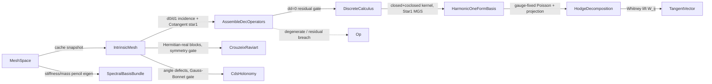

# [RASM_CALCULUS_DEC]

`DecAssembly` owns mesh-bound discrete-exterior-calculus assembly: one kernel builds the `Numerics/spectral` `DiscreteCalculus` bundle, the Crouzeix-Raviart connection heat system, CDS holonomy, the genus-dim harmonic basis and `ω = dα + δβ + η` Hodge decomposition with its Whitney lift, the extrinsic heat scaffold, and the spectral eigenbasis from the `Meshing/mesh` frozen `IntrinsicMesh` under the `∂∂ = 0` gate. This page assembles and never re-owns the settled `Numerics/spectral` algebra; `HodgeDecompositionReceipt` and `SpectralBasisBundle` declare beside their algorithms.

`Numerics/spectral` delivers the mesh-free algebra settled; this page dispatches on the `MeshLaplacian` discretization row and populates its carriers, never re-minting them. Every cotangent weight routes the one `Meshing/mesh` `Cotangent` owner: the intrinsic `OfLengths` path for `ComputeIntrinsicStar1` and CR pair emission, the extrinsic `OfEdges` path for divergence scatter and the heat scaffold. `Op` is the explicit value key, every receipt folds one `ValidityClaim.All` over the `Domain/rails` vocabulary, and failures route `Op` fault factories over `Fin<T>`.

## [01]-[INDEX]

- [02]-[DEC_ASSEMBLY]: `DecAssembly.Build` → `DiscreteCalculus` under the `∂∂ = 0` gate, the CR connection heat system, CDS holonomy, the harmonic basis + Hodge decomposition + Whitney lift, the extrinsic heat scaffold, and the spectral eigenbasis.
- [03]-[DENSITY_BAR]: one owner per assembly axis with its return rail.

## [02]-[DEC_ASSEMBLY]

- Owner: `DecAssembly` the one mesh-bound DEC kernel — `Build` produces the complete `DiscreteCalculus` (operators, and signpost transport and harmonic basis as `Option` demanded at the consumer's projection row, never operator hostages) from a `MeshSpace` and a `MeshLaplacian` row; `IntrinsicTriangle` the private per-face row every assembly fold reads, one shape serving DEC, CR, holonomy, and divergence; `HodgeDecomposition` the component carrier with `HodgeDecompositionReceipt` the unified Hodge witness; `WhitneyVectorAt` the edge-1-form → tangent-vector lift; `SpectralBasisBundle` the cached eigenbasis carrier.
- Cases: none — this page owns kernels and two receipt models; the `SpectralAssemblyKind` and `MeshLaplacian` vocabularies arrive settled from `Numerics/spectral` and `Meshing/mesh`.
- Entry: `Build` is the one assembly entry (defaulting `MeshLaplacian.IntrinsicDelaunay`, whose retriangulation clears the negative cotangent star1 weights obtuse triangles admit), routing snapshots through the `MeshLaplacian.Snapshot` row delegate — tufted, IDT, and unflipped-frozen each matched to its consistent mass — never a call-site equality branch; `BuildCrouzeixRaviartHeatSystemDetailed` seats the CR system behind frozen-snapshot and flipped-intrinsic gates, `DistributeHolonomy` the trivial connection behind closed-genus-0 and Gauss-Bonnet gates, `HodgeDecomposeDetailed` the decomposition with the basis riding `calculus.Harmonic` (None ⇒ dimension 0, `η ≡ 0`, a genus-0 sphere decomposing `ω = dα + δβ`) and the mass riding `calculus.Star0`, `WhitneyVectorAt` the component sample, and `ComputeSpectralBasisDetailed` the eigenbasis (`k` clamped to `VertexCount − 1`). Consumers reach cached artifacts through the `Meshing/mesh` cache, never by re-running assembly.
- Auto: every gate lands as a receipt-witnessed invariant — `AssembleDecOperators` excludes degenerate and edge-incomplete faces so `∂∂ = 0` holds per admitted triangle under the composition residual gated at `SqrtEpsilon` × the largest `D1` magnitude, and the harmonic dimension derives as `2·genus + max(0, boundaryComponents − 1)`; the CR system emits transpose-paired Hermitian-real blocks whose `max |M − Mᵀ|` gate scaled to the largest assembled magnitude drops any orientation-sign or degeneracy defect before it enters the factor; `DistributeHolonomy` validates discrete Gauss-Bonnet before scattering the cone 1-form and solving the coexact potential through the cached `(L + SpdMassShift·M)` Cholesky; `BuildHarmonicOneForms` Star1-orthonormalizes the closed+coclosed kernel by modified Gram-Schmidt; `HodgeDecomposeDetailed` recovers `δβ` by orthogonality with no indefinite hot-path solve; `ComputeSpectralBasisDetailed` routes the generalized eigen through the owning `SparseMatrix` member and cache-truncates one shared bundle at `DefaultSpectralCount`.
- Receipt: `SpectralAssemblyReceipt` per assembly (`Kind = Dec` with star, skip, and composition witnesses; `Kind = EdgeConnection` with block layout and symmetry residual); `HodgeDecompositionReceipt` folds one `ValidityClaim.All` over boundary-aware dimension agreement (`2g + max(0, b−1)`, admitting zero ⇔ `Harmonic` None), rank + nullity = edge count, and operator-scale-relative residuals; `SpectralBasisBundle` carries the eigen receipt with cache and skip witnesses.
- Packages: `Rasm.Meshing` `Meshing/mesh` (`MeshSpace`, `LaplacianCache` accessors, `IntrinsicMesh`/`IntrinsicEdge`, `Cotangent`, `TopologyReceipt`, `MeshKernel.TopologyDetailed`, `SignpostTransportReceiptOf`), `Numerics/spectral` (`DiscreteCalculus`, `SpectralBasis`, `SpectralAssemblyReceipt`, `SpectralAssemblyKind`, `HarmonicOneFormBasis`/`HarmonicOneFormReceipt`), `Numerics/matrix` (`SparseMatrix.FromTriplets`/`SingularSolveDetailed`/`GeneralizedEigenpairsDetailed`, `SymmetricMatrix.Of`/`DecomposeEigenDetailed`, `CholeskySparse`, `MatrixKernel.AddHermitianRealBlockTriplets`, `GaugePolicy`/`GaugeShift`, `SolveReceipt`/`EigenSolveReceipt`/`GaugeReceipt`), `Domain/rails` (`Op`, the validity fold), RhinoCommon (`Mesh.Vertices`/`GetNakedEdges`, `Vector3d.CrossProduct` for the extrinsic scaffold and CR face-field sampling), LanguageExt.Core, BCL (`CollectionsMarshal`).
- Growth: a new DEC operator is one field on `DiscreteCalculus` and one assembly fold arm; a new connection discretization is one member returning the same `(SparseMatrix, SpectralAssemblyReceipt)` pair under the same symmetry gate; a boundary-aware holonomy variant extends `DistributeHolonomy` behind its topology gate; a new basis normalization is one policy row on the settled spectral vocabulary — zero new receipt families.
- Boundary: this page populates the settled `Numerics/spectral` carriers and routes every cotangent through `Cotangent.OfLengths`/`OfEdges` — the `Rasm.Compute` adjoint seam binds those `DiscreteCalculus` spellings, so a redeclaration here forks the wire. CR assembly rejects a flipped intrinsic snapshot as `Unsupported`: its edge sources are encoded against original-mesh edges, and the signpost lift that lifts this gate is recorded growth. Gauss-Bonnet stays count-independent and integer-anchored (`0.25` floor), admitting only cone prescriptions that round to the correct integer. `HodgeDecomposeDetailed` recovers `δβ` by orthogonality, the residual gates witnessing the recovery. Assembly folds and outer-product accumulations are named statement-kernel exemptions; the public surface stays `Fin`-railed and exception-free.

```csharp signature
// --- [RUNTIME_PRELUDE] ----------------------------------------------------------------------
using System;
using System.Collections.Generic;
using System.Linq;
using System.Runtime.InteropServices;
using LanguageExt;
using Rasm.Domain;
using Rasm.Numerics;
using Rasm.Spatial;
using Rhino;
using Rhino.Geometry;
using static LanguageExt.Prelude;
// CS0104 guard: Rhino.Geometry declares Matrix/Dimension homonyms under the dual usings.
using Dimension = Rasm.Numerics.Dimension;

namespace Rasm.Meshing;

// --- [MODELS] -------------------------------------------------------------------------------
// Residual gates are operator-scale-relative: eigen tolerance and sqrt-machine-eps floor carry max(1, spectralRadius)
// when a basis exists, bare sqrt-eps when none; 1e4 is the dimensionless accumulation slack. Dimension law is
// boundary-aware (2g + max(0, b−1)) and ADMITS ZERO — a genus-0 closed surface decomposes as d(alpha) + delta(beta).
[BoundaryAdapter, StructLayout(LayoutKind.Auto)]
public readonly record struct HodgeDecompositionReceipt(
    int ExpectedGenus, int ExpectedBoundaryComponents, int ExpectedDimension, int BasisCount, int EdgeCount,
    int Rank, int Nullity, int FiniteVectorCount, int PositiveStar1Count,
    double MaxClosedResidual, double MaxCoClosedResidual,
    double Star1OrthonormalResidual, double ReconstructionResidual, double HarmonicEnergy,
    GaugeReceipt ExactGauge, Option<HarmonicOneFormReceipt> Harmonic) : IValidityEvidence {
    public bool IsValid {
        get {
            int basisCount = BasisCount; int edgeCount = EdgeCount;
            double gate = Harmonic
                .Map(static h => Math.Max(h.SvdTolerance, RhinoMath.SqrtEpsilon * Math.Max(1.0, h.SpectralRadius)))
                .IfNone(noneValue: RhinoMath.SqrtEpsilon) * 1.0e4;
            return ValidityClaim.All(
                ValidityClaim.CountExactly(count: ExpectedDimension, expected: (2 * ExpectedGenus) + Math.Max(0, ExpectedBoundaryComponents - 1)),
                ValidityClaim.CountExactly(count: BasisCount, expected: ExpectedDimension),
                ValidityClaim.Of(Harmonic.IsSome == (ExpectedDimension > 0)),
                ValidityClaim.CountAtLeast(count: EdgeCount, floor: 1),
                ValidityClaim.CountExactly(count: Rank + Nullity, expected: EdgeCount),
                ValidityClaim.CountExactly(count: FiniteVectorCount, expected: EdgeCount),
                ValidityClaim.CountAtLeast(count: PositiveStar1Count, floor: 1),
                ValidityClaim.CountAtLeast(count: EdgeCount, floor: PositiveStar1Count),
                ValidityClaim.Of(MaxClosedResidual <= gate), ValidityClaim.Of(MaxCoClosedResidual <= gate),
                ValidityClaim.Of(Star1OrthonormalResidual <= gate), ValidityClaim.Of(ReconstructionResidual <= gate),
                ValidityClaim.Nonnegative(HarmonicEnergy),
                ValidityClaim.Evidence(ExactGauge),
                ValidityClaim.Of(Harmonic.Map(h => h.IsValid && h.BasisCount == basisCount && h.EdgeCount == edgeCount)
                    .IfNone(noneValue: basisCount == 0)));
        }
    }
}

// Three edge 1-forms + the witness ARE the deliverable; same-typed components stay named fields because typed
// projection rows dispatch on TOut — three anonymous Arr<double> rows could never discriminate.
[BoundaryAdapter, StructLayout(LayoutKind.Auto)]
public readonly record struct HodgeDecomposition(Arr<double> Exact, Arr<double> Harmonic, Arr<double> CoExact, HodgeDecompositionReceipt Receipt) : IValidityEvidence {
    public bool IsValid => ValidityClaim.All(
        ValidityClaim.CountExactly(count: Exact.Count, expected: Receipt.EdgeCount),
        ValidityClaim.CountExactly(count: Harmonic.Count, expected: Receipt.EdgeCount),
        ValidityClaim.CountExactly(count: CoExact.Count, expected: Receipt.EdgeCount),
        ValidityClaim.Evidence(Receipt));
}

[BoundaryAdapter, StructLayout(LayoutKind.Auto)]
public readonly record struct SpectralBasisBundle(
    SpectralBasis Basis, EigenSolveReceipt<double, Arr<double>> Eigen,
    bool CacheHit = false, int SkippedDegenerateFaces = 0, Option<int> FactorNonZeros = default);

// CR factor and its assembly receipt travel together — the Meshing/mesh cache memoizes this pair per heat time.
internal readonly record struct EdgeConnectionFactor(CholeskySparse Factor, SpectralAssemblyReceipt Receipt);

// --- [OPERATIONS] ---------------------------------------------------------------------------
internal static class DecAssembly {
    internal const double HarmonicEpsRankDefault = 1e-10;

    // ONE per-face row every assembly fold reads, cotangents via the one Cotangent owner; Null when degenerate or edge-incomplete.
    private readonly record struct IntrinsicTriangle(int A, int B, int C, int[] Edges, double Area, double LAb, double LBc, double LCa) {
        internal (double A, double B, double C) Cotangents => (
            A: Cotangent.OfLengths(adjacent1: LAb, adjacent2: LCa, opposite: LBc, area: Area),
            B: Cotangent.OfLengths(adjacent1: LAb, adjacent2: LBc, opposite: LCa, area: Area),
            C: Cotangent.OfLengths(adjacent1: LBc, adjacent2: LCa, opposite: LAb, area: Area));
        internal (Point3d A, Point3d B, Point3d C) Points(Mesh mesh);
        internal int Vertex(int side);
        internal int Edge(int side);
        internal double Length(int side);
        internal double Orientation(MeshKernel.IntrinsicMesh imesh, int side);          // +1 when edge runs side->side+1
        internal (int I, int J, double Sign, double LA, double LB, double LOpp) CrouzeixPair(MeshKernel.IntrinsicMesh imesh, int side);
        internal double Angle(int side) => Cotangent.AngleOfLengths(opposite: Length((side + 1) % 3), adjacent1: Length(side), adjacent2: Length((side + 2) % 3));
    }
    private static IntrinsicTriangle? IntrinsicTriangleOf(MeshKernel.IntrinsicMesh imesh, int faceIdx, out bool missingEdges, out bool degenerate);

    // --- [DEC_OPERATORS]
    internal static Fin<DiscreteCalculus> Build(MeshSpace space, Op key) =>
        Build(space: space, kind: MeshLaplacian.IntrinsicDelaunay, key: key);
    // Row Snapshot delegate keeps operators and mass on ONE discretization: cotangent rides the unflipped
    // frozen snapshot matching its extrinsic mass.
    internal static Fin<DiscreteCalculus> Build(MeshSpace space, MeshLaplacian kind, Op key) =>
        from activeKind in Optional(kind).ToFin(key.InvalidInput())
        from imesh in activeKind.Snapshot(cache: space.Cache, key: key)
        from laplacian in space.Laplacian(kind: activeKind, key: key)
        from topology in MeshKernel.TopologyDetailed(space: space)
        from dec in AssembleDecOperators(imesh: imesh, mass: laplacian.MassLumped, topology: topology, key: key)
        // Transport failure is witnessed ABSENCE, never an operator hostage: operators stand alone, and a consumer
        // demanding transport faults at its own projection row.
        let transport = MeshKernel.SignpostTransportReceiptOf(space: space, imesh: imesh, key: key).ToOption()
        from harmonic in topology.Genus.Map(genus => ((2 * genus) + Math.Max(0, topology.BoundaryComponents - 1)) > 0).IfNone(noneValue: false)
            ? BuildHarmonicOneForms(calculus: dec, topology: topology, epsRank: HarmonicEpsRankDefault, key: key).Map(Some)
            : Fin.Succ(Option<HarmonicOneFormBasis>.None)
        let calculus = dec with { Transport = transport, Harmonic = harmonic }
        from valid in calculus.IsValid ? Fin.Succ(unit) : Fin.Fail<Unit>(key.InvalidResult())
        select calculus;

    // Degenerate/edge-incomplete faces EXCLUDED from D1 and star2 so dd=0 holds per admitted triangle, every skip
    // witnessed; composition residual max|D1*D0| gated at SqrtEpsilon x the largest D1 magnitude.
    private static Fin<DiscreteCalculus> AssembleDecOperators(MeshKernel.IntrinsicMesh imesh, Arr<double> mass, TopologyReceipt topology, Op key) {
        int vertCount = imesh.VertexCount, edgeCount = imesh.EdgeCount;
        int[] liveFaces = [.. imesh.LiveFaceIndices()];
        List<(int Row, int Col, double Value)> d0 = new(capacity: 2 * edgeCount);
        List<(int Row, int Col, double Value)> d1 = new(capacity: 3 * liveFaces.Length);
        Arr<double> star1 = ComputeIntrinsicStar1(imesh: imesh);
        List<double> star2 = new(capacity: liveFaces.Length);
        int admitted = 0, skippedDegenerate = 0, skippedMissing = 0;
        for (int e = 0; e < edgeCount; e++) {
            MeshKernel.IntrinsicEdge edge = imesh.EdgeAt(index: e);
            d0.AddRange([(e, edge.Lo, -1.0), (e, edge.Hi, +1.0)]);
        }
        for (int row = 0; row < liveFaces.Length; row++) {
            if (IntrinsicTriangleOf(imesh: imesh, faceIdx: liveFaces[row], missingEdges: out bool missing, degenerate: out _) is not { } face) {
                skippedMissing += missing ? 1 : 0; skippedDegenerate += missing ? 0 : 1; continue;
            }
            star2.Add(item: 1.0 / face.Area);
            for (int side = 0; side < 3; side++) d1.Add(item: (admitted, face.Edge(side: side), face.Orientation(imesh: imesh, side: side)));
            admitted++;
        }
        double boundaryResidual = BoundaryCompositionResidual(d0: d0, d1: d1);
        double compositionTolerance = RhinoMath.SqrtEpsilon * d1.Aggregate(1.0, static (max, t) => Math.Max(max, Math.Abs(t.Value)));
        int harmonicDimension = topology.Genus.Map(g => (2 * g) + Math.Max(0, topology.BoundaryComponents - 1)).IfNone(0);
        return admitted <= 0 || admitted + skippedDegenerate + skippedMissing != liveFaces.Length
            ? Fin.Fail<DiscreteCalculus>(key.Unsupported(geometryType: typeof(MeshKernel.IntrinsicMesh), outputType: typeof(DiscreteCalculus)))
            : mass.Count != vertCount || !mass.ForAll(static v => RhinoMath.IsValidDouble(x: v) && v > 0.0) || boundaryResidual > compositionTolerance
            ? Fin.Fail<DiscreteCalculus>(key.InvalidResult())
            : from D0 in SparseMatrix.FromTriplets(rows: Dimension.Create(value: edgeCount), cols: Dimension.Create(value: vertCount), triplets: d0, key: key)
              from D1 in SparseMatrix.FromTriplets(rows: Dimension.Create(value: admitted), cols: Dimension.Create(value: edgeCount), triplets: d1, key: key)
              let receipt = DecReceiptOf(imesh: imesh, topology: topology, D0: D0, D1: D1, mass: mass, star1: star1, star2: star2,
                  admitted: admitted, skippedDegenerate: skippedDegenerate, skippedMissing: skippedMissing,
                  boundaryResidual: boundaryResidual, compositionTolerance: compositionTolerance, harmonicDimension: harmonicDimension)
              select new DiscreteCalculus(D0: D0, D1: D1, Star0: mass, Star1: star1, Star2: new Arr<double>([.. star2]), Receipt: receipt);
    }
    // compositionTolerance lands as SpectralAssemblyReceipt.BoundaryCompositionTolerance — the ENFORCED dd=0 band,
    // so the receipt's conditional gate carries real enforcement, never the witness-only 0.0 default.
    private static SpectralAssemblyReceipt DecReceiptOf(MeshKernel.IntrinsicMesh imesh, TopologyReceipt topology, SparseMatrix D0, SparseMatrix D1,
        Arr<double> mass, Arr<double> star1, List<double> star2, int admitted, int skippedDegenerate, int skippedMissing,
        double boundaryResidual, double compositionTolerance, int harmonicDimension);
    private static double BoundaryCompositionResidual(List<(int Row, int Col, double Value)> d0, List<(int Row, int Col, double Value)> d1);

    // star1[e] = 0.5*(cot(alpha) + cot(beta)) over the opposite corners — the ONE Cotangent owner, intrinsic path.
    internal static Arr<double> ComputeIntrinsicStar1(MeshKernel.IntrinsicMesh imesh) {
        double[] star1 = new double[imesh.EdgeCount];
        for (int e = 0; e < imesh.EdgeCount; e++) {
            MeshKernel.IntrinsicEdge edge = imesh.EdgeAt(index: e);
            star1[e] = 0.5 * (CotOppositeCorner(imesh: imesh, edge: edge, faceIdx: edge.Face0)
                            + CotOppositeCorner(imesh: imesh, edge: edge, faceIdx: edge.Face1));
        }
        return new Arr<double>(star1);
    }
    private static double CotOppositeCorner(MeshKernel.IntrinsicMesh imesh, MeshKernel.IntrinsicEdge edge, int faceIdx);   // Cotangent.OfLengths over the opposite corner; 0 when absent

    // --- [HARMONIC_ONE_FORMS] — genus-dim kernel of the closed+coclosed normal operator, Star1-orthonormalized (MGS).
    private static Fin<HarmonicOneFormBasis> BuildHarmonicOneForms(DiscreteCalculus calculus, TopologyReceipt topology, double epsRank, Op key);
    private static Fin<Arr<Arr<double>>> Star1OrthonormalForms(IEnumerable<Arr<double>> vectors, Arr<double> star1, Op key);
    private static double Star1Inner(double[] left, Arr<double> right, Arr<double> star1);
    private static double MaxResidual(SparseMatrix matrix, Arr<Arr<double>> forms);                 // max |D1 form|
    private static double MaxCoClosedResidual(SparseMatrix d0, Arr<double> star1, Arr<Arr<double>> forms);
    private static double Star1OrthonormalResidual(Arr<Arr<double>> forms, Arr<double> star1);

    // --- [HODGE_DECOMPOSITION] — omega = d(alpha) + delta(beta) + eta. Exact: mean-zero gauge-fixed Poisson via
    // SingularSolveDetailed over calculus.Star0; harmonic: Star1 projection onto calculus.Harmonic (None = dimension 0,
    // eta ≡ 0); co-exact: remainder by orthogonality, no indefinite hot-path solve. Edge/vertex apply folds are the named statement-kernel exemption.
    internal static Fin<HodgeDecomposition> HodgeDecomposeDetailed(DiscreteCalculus calculus, SparseMatrix stiffness, Arr<double> omega, Context context, Op key) =>
        AdmitHodgeShapes(calculus: calculus, stiffness: stiffness, omega: omega, key: key)
            .Bind(_ => stiffness.SingularSolveDetailed(
                rhs: new Arr<double>(D0Transpose(d0: calculus.D0, edgeValues: HadamardEdge(left: calculus.Star1, right: omega))),
                gauge: GaugePolicy.PinConstant(index: 0, mass: Some(calculus.Star0), shift: GaugeShift.MeanZero), context: context, key: key))
            .Bind(solve => solve.Gauge.ToFin(key.InvalidResult()).Bind(gauge => {
                int edgeCount = calculus.D0.Rows.Value;
                Arr<Arr<double>> forms = calculus.Harmonic.Map(static basis => basis.Forms).IfNone(noneValue: Arr<Arr<double>>.Empty);
                double[] dAlpha = D0Apply(d0: calculus.D0, vertexValues: solve.Solution);
                double[] harmonic = new double[edgeCount];
                double harmonicEnergySquared = 0.0;
                double[] exactRemoved = [.. Enumerable.Range(0, edgeCount).Select(e => omega[index: e] - dAlpha[e])];
                foreach (Arr<double> form in forms.AsIterable()) {
                    double coefficient = Star1Inner(left: exactRemoved, right: form, star1: calculus.Star1);
                    harmonicEnergySquared += coefficient * coefficient;
                    for (int e = 0; e < edgeCount; e++) harmonic[e] += coefficient * form[index: e];
                }
                double[] coExact = [.. Enumerable.Range(0, edgeCount).Select(e => exactRemoved[e] - harmonic[e])];
                HodgeDecompositionReceipt receipt = HodgeReceiptOf(calculus: calculus, edgeCount: edgeCount, dAlpha: dAlpha,
                    harmonic: harmonic, coExact: coExact, omega: omega,
                    harmonicEnergySquared: harmonicEnergySquared, gauge: gauge);
                return receipt.IsValid
                    ? Fin.Succ(new HodgeDecomposition(
                        Exact: new Arr<double>(dAlpha), Harmonic: new Arr<double>(harmonic), CoExact: new Arr<double>(coExact), Receipt: receipt))
                    : Fin.Fail<HodgeDecomposition>(key.InvalidResult());
            }));
    private static Fin<Unit> AdmitHodgeShapes(DiscreteCalculus calculus, SparseMatrix stiffness, Arr<double> omega, Op key);
    private static HodgeDecompositionReceipt HodgeReceiptOf(DiscreteCalculus calculus, int edgeCount, double[] dAlpha,
        double[] harmonic, double[] coExact, Arr<double> omega, double harmonicEnergySquared, GaugeReceipt gauge);
    private static double[] HadamardEdge(Arr<double> left, Arr<double> right);
    private static double[] D0Apply(SparseMatrix d0, Arr<double> vertexValues);
    private static double[] D0Transpose(SparseMatrix d0, double[] edgeValues);
    // Whitney lift of an edge 1-form: locate the containing face, fold W_ij = lambda_i*grad(lambda_j) -
    // lambda_j*grad(lambda_i) over its three edges with d0 signs. REJECTS a flipped snapshot — flipped edges no longer match embedded chords.
    internal static Fin<Vector3d> WhitneyVectorAt(MeshSpace space, MeshKernel.IntrinsicMesh imesh, Arr<double> oneForm, Point3d sample, Op key);

    // --- [HODGE_POINT_EVALUATION] — the field-facing seat where Spatial/fields VectorField.Hodge and Processing/extract land.
    // Solve ONCE per (space, source): edge-integrate the field into omega, HodgeDecomposeDetailed over the selected
    // stiffness — memoized through the mesh.md type-keyed slot under HodgeSolutionKey; source identity keys the memo, sense never enters it.
    [StructLayout(LayoutKind.Auto)] internal readonly record struct HodgeSolutionKey(VectorField Source);
    internal static Fin<HodgeDecomposition> HodgeSolutionOf(VectorField source, MeshSpace space, Context context, Op key);
    // Sense selects at evaluation, never a second solve: Toward -> Exact (irrotational dα); Away -> the solenoidal
    // remainder (CoExact + Harmonic summed edgewise) — Whitney-lifted at the sample.
    internal static Fin<Vector3d> HodgeVectorAt(VectorField source, MeshSpace space, BoundarySense sense, Point3d sample, Context context, Op key) =>
        from solved in HodgeSolutionOf(source: source, space: space, context: context, key: key)
        from imesh in MeshLaplacian.IntrinsicDelaunay.Snapshot(cache: space.Cache, key: key)
        from value in WhitneyVectorAt(space: space, imesh: imesh, sample: sample, key: key,
            oneForm: sense.Equals(BoundarySense.Toward)
                ? solved.Exact
                : new Arr<double>([.. Enumerable.Range(0, solved.CoExact.Count).Select(e => solved.CoExact[index: e] + solved.Harmonic[index: e])]))
        select value;

    // --- [CROUZEIX_RAVIART] — edge-based connection heat operator M = (mass + time*grad) as Hermitian-real blocks.
    // Transpose-paired off-diagonals make max|M - M^T| the orientation-sign / degeneracy witness, gated machine-epsilon
    // scaled by the largest assembled magnitude. Flipped intrinsic snapshots are Unsupported.
    internal static Fin<(SparseMatrix Matrix, SpectralAssemblyReceipt Receipt)> BuildCrouzeixRaviartHeatSystemDetailed(MeshKernel.IntrinsicMesh mesh, double time, Op key) {
        if (!RhinoMath.IsValidDouble(x: time) || time <= 0.0 || !mesh.IsFrozen || mesh.EdgeCount == 0)
            return Fin.Fail<(SparseMatrix, SpectralAssemblyReceipt)>(key.InvalidInput());
        if (mesh.HasFlips)
            return Fin.Fail<(SparseMatrix, SpectralAssemblyReceipt)>(key.Unsupported(geometryType: typeof(MeshKernel.IntrinsicMesh), outputType: typeof(SparseMatrix)));
        int eCount = mesh.EdgeCount;
        List<(int Row, int Col, double Value)> triplets = new(capacity: (2 * eCount) + (mesh.LiveFaceCount * 36));
        double[] mass = new double[eCount];
        int admitted = 0, skippedDegenerate = 0, skippedMissing = 0;
        foreach (int f in mesh.LiveFaceIndices()) {
            if (IntrinsicTriangleOf(imesh: mesh, faceIdx: f, missingEdges: out bool missing, degenerate: out _) is not { } face) {
                skippedMissing += missing ? 1 : 0; skippedDegenerate += missing ? 0 : 1; continue;
            }
            admitted++;
            double contribution = face.Area / 3.0;
            for (int k = 0; k < 3; k++) mass[face.Edge(side: k)] += contribution;
            for (int side = 0; side < 3; side++)
                EmitCrouzeixRaviartPair(triplets: triplets, eCount: eCount, pair: face.CrouzeixPair(imesh: mesh, side: side), area: face.Area, time: time);
        }
        for (int e = 0; e < eCount; e++) triplets.AddRange([(e, e, mass[e]), (e + eCount, e + eCount, mass[e])]);
        return SymmetryGate(triplets: triplets, key: key)
            .Bind(residuals => SparseMatrix.FromTriplets(rows: Dimension.Create(value: 2 * eCount), cols: Dimension.Create(value: 2 * eCount), triplets: triplets, key: key)
                .Map(matrix => (Matrix: matrix, Receipt: EdgeConnectionReceiptOf(mesh: mesh, matrix: matrix, mass: mass,
                    admitted: admitted, skippedDegenerate: skippedDegenerate, skippedMissing: skippedMissing, residuals: residuals))));
    }
    private static void EmitCrouzeixRaviartPair(List<(int Row, int Col, double Value)> triplets, int eCount,
        (int I, int J, double Sign, double LA, double LB, double LOpp) pair, double area, double time) {
        double dot = (pair.LA * pair.LA) + (pair.LB * pair.LB) - (pair.LOpp * pair.LOpp);
        double weight = dot / (2.0 * area);
        double cosTheta = dot / (2.0 * pair.LA * pair.LB);
        double sinTheta = 2.0 * area / (pair.LA * pair.LB);
        MatrixKernel.AddHermitianRealBlockTriplets(triplets: triplets, order: eCount, i: pair.I, j: pair.J,
            real: weight * pair.Sign * cosTheta * time, imaginary: -weight * pair.Sign * sinTheta * time, diagonal: weight * time);
    }
    private static Fin<(double Residual, double Tolerance)> SymmetryGate(List<(int Row, int Col, double Value)> triplets, Op key);
    private static SpectralAssemblyReceipt EdgeConnectionReceiptOf(MeshKernel.IntrinsicMesh mesh, SparseMatrix matrix, double[] mass,
        int admitted, int skippedDegenerate, int skippedMissing, (double Residual, double Tolerance) residuals);
    // Stacked CR solution -> per-face unit tangent field (edge tangent + in-plane perpendicular components).
    internal static Vector3d[] SampleCrouzeixRaviartFaceField(Mesh mesh, MeshKernel.IntrinsicMesh imesh, Arr<double> stacked);
    // Per-vertex integrated divergence of a face field — the ONE extrinsic cotangent scatter (Cotangent.OfEdges).
    internal static Arr<double> ComputeIntrinsicVertexDivergence(Mesh mesh, MeshKernel.IntrinsicMesh imesh, Vector3d[] faceFields);
    private static void ScatterCotangentDivergence(double[] div, int a, int b, int c, Vector3d ab, Vector3d bc, Vector3d ca, (double A, double B, double C) cot, Vector3d g);

    // --- [CDS_HOLONOMY] — Crane-Desbrun-Schroeder trivial connection, closed genus-0 gate.
    internal static Arr<double> ComputeIntrinsicAngleDefects(MeshKernel.IntrinsicMesh imesh);        // 2*pi - sum(corner angles)
    internal static Fin<Arr<double>> DistributeHolonomy(MeshSpace space, MeshKernel.IntrinsicMesh imesh, Seq<(int Vertex, double ConeIndex)> cones, Op key) =>
        from topology in MeshKernel.TopologyDetailed(space: space)
        // VALIDATED closed genus-0 ONLY: a bounded surface breaks Gauss-Bonnet without the geodesic-curvature term this
        // kernel omits, and an unvalidated genus carries no trivial-connection guarantee — both route Unsupported.
        from _ in topology is { IsClosed: true, HasBoundary: false, Genus: { IsSome: true, Case: 0 } }
            ? Fin.Succ(unit)
            : Fin.Fail<Unit>(key.Unsupported(geometryType: typeof(MeshSpace), outputType: typeof(Arr<double>)))
        let defects = ComputeIntrinsicAngleDefects(imesh: imesh)
        from __ in ValidateGaussBonnet(mesh: space.Native, imesh: imesh, defects: defects, cones: cones, key: key)
        let u = BuildConePrimalOneForm(imesh: imesh, defects: defects, cones: cones)
        let star1 = ComputeIntrinsicStar1(imesh: imesh)
        let rhs = IntrinsicCoexactRhs(imesh: imesh, star1: star1, u: u)
        from beta in space.Cache.Cholesky(key: key).Bind(factor => factor.Solve(rhs: rhs, key: key))
        let dBeta = IntrinsicEdgeGradient(imesh: imesh, beta: beta)
        select new Arr<double>([.. dBeta.AsIterable().Select(static value => -value)]);
    // Discrete Gauss-Bonnet: sum(kappa)/2pi equals the integer Euler characteristic and cone indices are integer-valued,
    // so the balance is integer; the 0.25 floor is count-independent rounding admission.
    private static Fin<Unit> ValidateGaussBonnet(Mesh mesh, MeshKernel.IntrinsicMesh imesh, Arr<double> defects, Seq<(int Vertex, double ConeIndex)> cones, Op key);
    private static Arr<double> BuildConePrimalOneForm(MeshKernel.IntrinsicMesh imesh, Arr<double> defects, Seq<(int Vertex, double ConeIndex)> cones);
    private static Arr<double> IntrinsicCoexactRhs(MeshKernel.IntrinsicMesh imesh, Arr<double> star1, Arr<double> u);
    private static Arr<double> IntrinsicEdgeGradient(MeshKernel.IntrinsicMesh imesh, Arr<double> beta);

    // --- [HEAT_SCAFFOLD] — extrinsic face-gradient/divergence pair the heat-method solvers ride (Cotangent.OfEdges path).
    internal static Arr<double> BuildSourceDelta(int n, Seq<int> sources, Arr<double> mass);
    internal static Vector3d[] ComputeTriangleGradients(Mesh mesh, Arr<double> u);                   // unit -grad(u) per face
    internal static Arr<double> ComputeVertexDivergence(Mesh mesh, Vector3d[] gradients);

    // --- [SPECTRAL_BASIS] — generalized eigen over the IDT stiffness / consistent-mass pencil via Numerics/matrix.
    internal static Fin<SpectralBasisBundle> ComputeSpectralBasisDetailed(MeshSpace space, int k, Op key) =>
        Math.Min(val1: k, val2: space.Native.Vertices.Count - 1) switch {
            < 1 => Fin.Fail<SpectralBasisBundle>(key.InvalidInput()),
            int count => from laplacian in space.Laplacian(kind: MeshLaplacian.IntrinsicDelaunay, key: key)
                         from receipt in laplacian.Stiffness.GeneralizedEigenpairsDetailed(mass: laplacian.MassConsistent, k: count, key: key)
                         select new SpectralBasisBundle(
                             Basis: new SpectralBasis(
                                 Eigenvalues: new Arr<double>([.. receipt.Pairs.AsIterable().Select(static p => p.Eigenvalue)]),
                                 Eigenvectors: new Arr<Arr<double>>([.. receipt.Pairs.AsIterable().Select(static p => p.Eigenvector)])),
                             Eigen: receipt, CacheHit: false,
                             SkippedDegenerateFaces: laplacian.SkippedDegenerateFaces, FactorNonZeros: receipt.FactorNonZeros),
        };
}
```



## [03]-[DENSITY_BAR]

Each assembly axis seats one owner returning one rail:

| [INDEX] | [AXIS_CONCERN]     | [OWNER]                                  | [RAIL]                                           | [CASES] |
| :-----: | :----------------- | :--------------------------------------- | :----------------------------------------------- | :-----: |
|  [01]   | DEC assembly       | `DecAssembly.Build`                      | `Build → Fin<DiscreteCalculus>`                  |    —    |
|  [02]   | Face row           | `IntrinsicTriangle`                      | carrier                                          |    1    |
|  [03]   | Connection heat    | `BuildCrouzeixRaviartHeatSystemDetailed` | `→ Fin<(SparseMatrix, SpectralAssemblyReceipt)>` |    —    |
|  [04]   | Trivial connection | `DistributeHolonomy`                     | `→ Fin<Arr<double>>`                             |    —    |
|  [05]   | Harmonic + Hodge   | `BuildHarmonicOneForms`                  | `→ Fin<HarmonicOneFormBasis>`                    |    —    |
|  [06]   | Heat scaffold      | `ComputeTriangleGradients`               | pure folds                                       |    2    |
|  [07]   | Spectral basis     | `ComputeSpectralBasisDetailed`           | `→ Fin<SpectralBasisBundle>`                     |    —    |

## [04]-[RESEARCH]

<!-- source-only: research row template:
[TOKEN]-[OPEN|BLOCKED]: <exact question>; <verification route>.
[SPLIT_MEMBER]-[OPEN]: does `shape-core` expose `split_all`; verify against the member rail.
-->

(none)
