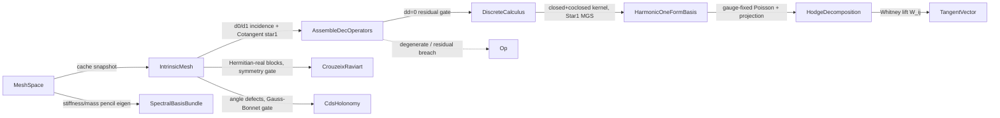

# [RASM_CALCULUS_DEC]

The mesh-bound discrete-exterior-calculus assembly owner: ONE `DecAssembly` kernel builds the `Numerics/spectral` `DiscreteCalculus` operator bundle (d0 incidence, d1 curl, star0 lumped mass, star1 cotan weights, star2 inverse area) from the `Meshing/mesh` frozen `IntrinsicMesh` under the `∂∂ = 0` composition-residual gate, assembles the Crouzeix-Raviart edge-connection heat system as Hermitian-real blocks under a machine-epsilon symmetry gate, distributes CDS trivial-connection holonomy under the Gauss-Bonnet integer gate, builds the genus-dimensional Star1-orthonormalized harmonic 1-form basis, decomposes any edge 1-form as `ω = dα + δβ + η` (gauge-fixed Poisson exact part, harmonic projection, co-exact remainder by orthogonality — no indefinite solve on the hot path) returning the COMPONENT 1-forms on the `HodgeDecomposition` carrier with the Whitney edge-form evaluator lifting any component to a tangent vector at a surface sample — the mature receipt-only deliverable and its deferred Whitney lift are both dead, and the `Spatial/fields` frozen `Hodge` case Whitney-evaluates real components — carries the extrinsic face-gradient/divergence heat scaffold the heat-method solvers ride, and computes the mesh-side spectral eigenbasis (generalized eigen via `Numerics/matrix`) cached as `SpectralBasisBundle`. The DDG receipt fracture is healed HERE: `HodgeDecompositionReceipt` and `SpectralBasisBundle` are declared beside the algorithms that produce them — the algorithm-in-one-file/receipt-in-another split between the mature `Spectral.cs` and `Mesh.cs` is dead.

Every cotangent weight in this page routes THE one `Meshing/mesh` `Cotangent` owner — `ComputeIntrinsicStar1` and the CR pair emission use the intrinsic `OfLengths` path, the divergence scatter and extrinsic scaffold use the extrinsic `OfEdges` path; the three parallel cotangent computations the mature lane carried are dead. The mesh-free algebra is composed, never re-minted: `DiscreteCalculus`, `SpectralBasis`, `SpectralFilter`, `SpectralAssemblyReceipt`, `SpectralAssemblyKind`, `HarmonicOneFormReceipt`, and `HarmonicOneFormBasis` arrive settled from `Numerics/spectral` (the `Rasm.Compute` adjoint seam binds `DiscreteCalculus` by name); this page owns only the mesh-bound assembly that populates them. `Op` stays the explicit value key; every receipt is one `ValidityClaim.All` fold over the `Domain/rails` claim vocabulary; failures route `Op` fault factories over `Fin<T>`; the flipped-intrinsic rejection on the CR system is an `Unsupported` fault, never a silent fallback.

## [01]-[INDEX]

- [02]-[DEC_ASSEMBLY]: `DecAssembly.Build` → `DiscreteCalculus` (d0/d1/stars + transport + harmonic, `∂∂ = 0` gated); Crouzeix-Raviart connection heat system; CDS trivial-connection holonomy; harmonic 1-form basis + Hodge decomposition (`HodgeDecomposition` components + `HodgeDecompositionReceipt` unified beside their algorithm) + the Whitney edge-form evaluator; extrinsic heat scaffold; spectral basis computation + `SpectralBasisBundle`.

## [02]-[DEC_ASSEMBLY]

- Owner: `DecAssembly` the ONE mesh-bound DEC kernel — `Build` produces the complete `DiscreteCalculus` (operators, plus signpost transport when the transport witness succeeds and the harmonic basis when topology admits one — both `Option`, demanded at the consumer's projection row, never operator hostages) from a `MeshSpace` and a `MeshLaplacian` discretization row; `IntrinsicTriangle` the private per-face row (vertices, edges, Heron area, edge lengths, cotangents via `Cotangent.OfLengths`, orientation signs, CR pair projection, corner angles) every assembly fold reads — one row shape serving DEC, CR, holonomy, and divergence instead of four ad-hoc face decompositions; `HodgeDecomposition` the component carrier (exact/harmonic/co-exact edge 1-forms + witness) with `HodgeDecompositionReceipt` the unified Hodge witness; `WhitneyVectorAt` the one edge-1-form → tangent-vector lift; `SpectralBasisBundle` the cached eigenbasis carrier (basis + eigen receipt + cache/skip/factor witnesses).
- Cases: none — this page owns kernels and two receipt models; the vocabularies (`SpectralAssemblyKind` `Dec`/`EdgeConnection`, `MeshLaplacian` rows) arrive settled from `Numerics/spectral` and `Meshing/mesh`.
- Entry: `internal static Fin<DiscreteCalculus> Build(MeshSpace space, Op key)` defaulting to `MeshLaplacian.IntrinsicDelaunay` and `internal static Fin<DiscreteCalculus> Build(MeshSpace space, MeshLaplacian kind, Op key)` — the one assembly entry; snapshot routing is the `MeshLaplacian.Snapshot` row delegate (tufted → the tufted intrinsic snapshot, Delaunay → the IDT snapshot, cotangent → the unflipped frozen snapshot consistent with its extrinsic mass), never a call-site equality branch; `BuildCrouzeixRaviartHeatSystemDetailed(IntrinsicMesh mesh, double time, Op key)` the CR entry (frozen-snapshot gate, flipped-intrinsic `Unsupported` gate); `DistributeHolonomy(MeshSpace space, IntrinsicMesh imesh, Seq<(int Vertex, double ConeIndex)> cones, Op key)` the trivial-connection entry (closed genus-0 gate, Gauss-Bonnet integer gate); `HodgeDecomposeDetailed(DiscreteCalculus calculus, SparseMatrix stiffness, Arr<double> omega, Context context, Op key)` the decomposition entry — the basis rides `calculus.Harmonic` (None = dimension 0: `η ≡ 0`, a genus-0 sphere decomposes as `ω = dα + δβ`) and the mass rides `calculus.Star0`, so the mature standalone basis and mass parameters die as desynchronizable duplicates; `WhitneyVectorAt(MeshSpace space, IntrinsicMesh imesh, Arr<double> oneForm, Point3d sample, Op key)` the component-sampling entry; `ComputeSpectralBasisDetailed(MeshSpace space, int k, Op key)` the eigenbasis entry (k clamped to `VertexCount − 1`, generalized eigen over the IDT stiffness/consistent-mass pencil). Consumers reach cached artifacts through the `Meshing/mesh` cache (`Calculus`, `SpectralBasisBundleOf`, `EdgeConnectionCholeskyDetailed`), never by re-running assembly.
- Auto: `AssembleDecOperators` excludes degenerate and edge-incomplete faces from the boundary operator — `D1` and `star2` span only admitted faces so `∂∂ = 0` holds per admitted triangle while the receipt witnesses every skip; the composition residual `max |D1·D0|` is gated at `SqrtEpsilon` scaled by the largest `D1` magnitude — the SAME band the receipt ships as `BoundaryCompositionTolerance`, so its conditional claim re-checks the enforced gate — and the harmonic dimension derives from topology as `2·genus + max(0, boundaryComponents − 1)`. `ComputeIntrinsicStar1` folds `0.5·(cot α + cot β)` over the two opposite corners of every edge through `Cotangent.OfLengths` — a boundary edge contributes its single corner, a missing face contributes zero. The CR system emits transpose-paired Hermitian-real blocks (`MatrixKernel.AddHermitianRealBlockTriplets`) and coalesces triplets to witness `max |M − Mᵀ|` against a machine-epsilon gate scaled by the largest assembled magnitude — any orientation-sign or length-degeneracy defect fails the gate, never enters the factor. `DistributeHolonomy` computes intrinsic angle defects (`2π − Σ corners`), validates discrete Gauss-Bonnet (`Σκ/2π` equals the integer Euler characteristic; the prescribed cone indices balance within the count-independent half-unit floor `0.25`), scatters the cone target onto first-incident edges as a primal 1-form, and solves the coexact potential through the cached `(L + SpdMassShift·M)` regularized-Poisson Cholesky. `BuildHarmonicOneForms` assembles the closed+coclosed normal operator (outer-product accumulation over `D1` rows and star1-weighted `D0` columns), takes the `expected`-smallest eigenpairs of the symmetrized operator, Star1-orthonormalizes them by modified Gram-Schmidt in the `⟨·,·⟩_{star1}` inner product, and gates closed/coclosed/orthonormality residuals at the operator-scale-relative tolerance. `HodgeDecomposeDetailed` solves the exact potential by the `Numerics/matrix` `SingularSolveDetailed` under `GaugePolicy.PinConstant(index: 0, calculus.Star0, GaugeShift.MeanZero)`, projects the remainder onto the `calculus.Harmonic` basis (empty fold when None), recovers the co-exact part by orthogonality, witnesses closed/coclosed/reconstruction residuals plus harmonic energy, and returns the three component 1-forms with the witness; `WhitneyVectorAt` lifts any component at a sample by folding `W_ij = λᵢ∇λⱼ − λⱼ∇λᵢ` over the containing face's three edges with `d0` orientation signs. `ComputeSpectralBasisDetailed` routes `SparseMatrix.GeneralizedEigenpairsDetailed` over the stiffness/consistent-mass pencil — the owning model member, never a direct kernel reach; the `Meshing/mesh` cache serves `k ≤ LaplacianCache.DefaultSpectralCount` by truncating one shared bundle (`CacheHit` witnessed) and recomputes above.
- Receipt: `SpectralAssemblyReceipt` (settled shape from `Numerics/spectral`) produced per assembly with `Kind = Dec` (star counts, skip witnesses, composition residual + tolerance, genus, harmonic dimension) or `Kind = EdgeConnection` (block layout, positive-mass count, symmetry residual + tolerance); `HodgeDecompositionReceipt` — boundary-aware dimension agreement (`2g + max(0, b−1)`, ZERO admitted: dimension 0 ⇔ the harmonic receipt is None ⇔ basis count 0 — the one law the harmonic basis and DEC receipt also state), basis agreement, rank + nullity = edge count, finite-vector totality, closed/coclosed/orthonormal/reconstruction residuals gated operator-scale-relative (the eigen tolerance and the `√ε` floor both carry `max(1, spectralRadius)` when a basis exists, the bare `√ε` floor when none; `1e4` is the dimensionless rounding-accumulation slack the applied differentials incur above the eigenvalue tolerance — never a bare absolute), harmonic energy, the exact-part `GaugeReceipt`, and the producing `Option<HarmonicOneFormReceipt>` — its domain law is one `ValidityClaim.All` fold; `SpectralBasisBundle` (basis + `EigenSolveReceipt<double, Arr<double>>` + `CacheHit`/`SkippedDegenerateFaces`/`FactorNonZeros`).
- Packages: `Rasm.Meshing` `Meshing/mesh` (`MeshSpace`, `LaplacianCache` accessors, `IntrinsicMesh`/`IntrinsicEdge`, `Cotangent`, `TopologyReceipt`, `MeshKernel.TopologyDetailed`, `SignpostTransportReceiptOf`), `Numerics/spectral` (`DiscreteCalculus`, `SpectralBasis`, `SpectralAssemblyReceipt`, `SpectralAssemblyKind`, `HarmonicOneFormBasis`/`HarmonicOneFormReceipt`), `Numerics/matrix` (`SparseMatrix.FromTriplets`/`SingularSolveDetailed`/`GeneralizedEigenpairsDetailed` — owning model members, `SymmetricMatrix.Of`/`DecomposeEigenDetailed`, `CholeskySparse`, `MatrixKernel.AddHermitianRealBlockTriplets` — the sanctioned assembly bridge, `GaugePolicy`/`GaugeShift`, `SolveReceipt`/`EigenSolveReceipt`/`GaugeReceipt`), `Domain/rails` (`Op`, the validity fold), RhinoCommon (`Mesh.Vertices`/`GetNakedEdges`, `Vector3d.CrossProduct` — the extrinsic scaffold and CR face-field sampling are genuinely Rhino-boundary), LanguageExt.Core, BCL (`CollectionsMarshal`).
- Growth: a new DEC operator (a primal-dual wedge, a bundle-valued star) is one field on the settled `DiscreteCalculus` carrier plus one assembly fold arm here; a new connection discretization is one assembly member producing the same `(SparseMatrix, SpectralAssemblyReceipt)` pair under the same symmetry gate; a boundary-aware holonomy variant extends `DistributeHolonomy` behind its topology gate; a new basis normalization is one policy row on the settled spectral vocabulary — zero new receipt families, zero sibling kernels.
- Boundary: this page assembles and never re-owns — a `DiscreteCalculus`/`SpectralBasis`/`SpectralFilter` redeclaration here is the named collapse violation (the `Rasm.Compute` adjoint seam binds the `Numerics/spectral` spellings); a local cotangent expression instead of `Cotangent.OfLengths`/`OfEdges` re-opens the three-path duplication this partition killed. The CR system REJECTS a flipped intrinsic snapshot (`Unsupported`) — CR edge sources are encoded against original-mesh edges, and running them over flipped connectivity would silently misattribute sources (the signpost transfer that would lift this gate is recorded growth, not a default). The Gauss-Bonnet gate is count-independent (never divided by cone count) and integer-anchored (`0.25` floor accepts any accumulation that rounds to the correct integer) — loosening it to a relative epsilon admits non-integer cone prescriptions that make the connection non-trivial. `HodgeDecomposeDetailed` recovers `δβ` by orthogonality — re-introducing an indefinite co-exact solve on the hot path is the named performance-and-correctness defect (the residual gates already witness the orthogonality recovery). Assembly folds and outer-product accumulations are named statement-kernel exemptions (allocation-sensitive triplet scatter); the public surface stays `Fin`-railed and exception-free.

```csharp contract
// --- [RUNTIME_PRELUDE] ----------------------------------------------------------------------
using System;
using System.Collections.Generic;
using System.Linq;
using System.Runtime.InteropServices;
using LanguageExt;
using Rasm.Domain;
using Rasm.Numerics;
using Rasm.Spatial;
using Rhino;
using Rhino.Geometry;
using static LanguageExt.Prelude;
// CS0104 guard: Rhino.Geometry declares Matrix/Dimension homonyms under the dual usings.
using Dimension = Rasm.Numerics.Dimension;

namespace Rasm.Meshing;

// --- [MODELS] -------------------------------------------------------------------------------
// UNIFIED beside its algorithm — the Hodge witness. Residual gates are operator-scale-relative: the eigen tolerance
// and the sqrt-machine-eps floor both carry max(1, spectralRadius) when a basis exists, bare sqrt-eps when none;
// 1e4 is the dimensionless accumulation slack. Dimension law is boundary-aware (2g + max(0, b−1)) and ADMITS ZERO:
// a genus-0 closed surface decomposes as omega = d(alpha) + delta(beta) with Harmonic None — the mature >=1 gate
// that failed every sphere is dead.
[BoundaryAdapter, StructLayout(LayoutKind.Auto)]
public readonly record struct HodgeDecompositionReceipt(
    int ExpectedGenus, int ExpectedBoundaryComponents, int ExpectedDimension, int BasisCount, int EdgeCount,
    int Rank, int Nullity, int FiniteVectorCount, int PositiveStar1Count,
    double MaxClosedResidual, double MaxCoClosedResidual,
    double Star1OrthonormalResidual, double ReconstructionResidual, double HarmonicEnergy,
    GaugeReceipt ExactGauge, Option<HarmonicOneFormReceipt> Harmonic) : IValidityEvidence {
    public bool IsValid {
        get {
            int basisCount = BasisCount; int edgeCount = EdgeCount;
            double gate = Harmonic
                .Map(static h => Math.Max(h.SvdTolerance, RhinoMath.SqrtEpsilon * Math.Max(1.0, h.SpectralRadius)))
                .IfNone(noneValue: RhinoMath.SqrtEpsilon) * 1.0e4;
            return ValidityClaim.All(
                ValidityClaim.CountExactly(count: ExpectedDimension, expected: (2 * ExpectedGenus) + Math.Max(0, ExpectedBoundaryComponents - 1)),
                ValidityClaim.CountExactly(count: BasisCount, expected: ExpectedDimension),
                ValidityClaim.Of(Harmonic.IsSome == (ExpectedDimension > 0)),
                ValidityClaim.CountAtLeast(count: EdgeCount, floor: 1),
                ValidityClaim.CountExactly(count: Rank + Nullity, expected: EdgeCount),
                ValidityClaim.CountExactly(count: FiniteVectorCount, expected: EdgeCount),
                ValidityClaim.CountAtLeast(count: PositiveStar1Count, floor: 1),
                ValidityClaim.CountAtLeast(count: EdgeCount, floor: PositiveStar1Count),
                ValidityClaim.Of(MaxClosedResidual <= gate), ValidityClaim.Of(MaxCoClosedResidual <= gate),
                ValidityClaim.Of(Star1OrthonormalResidual <= gate), ValidityClaim.Of(ReconstructionResidual <= gate),
                ValidityClaim.Nonnegative(HarmonicEnergy),
                ValidityClaim.Evidence(ExactGauge),
                ValidityClaim.Of(Harmonic.Map(h => h.IsValid && h.BasisCount == basisCount && h.EdgeCount == edgeCount)
                    .IfNone(noneValue: basisCount == 0)));
        }
    }
}

// The decomposition IS the deliverable: three edge 1-forms + the witness. Same-typed components stay named fields —
// typed projection rows dispatch on TOut, so three Arr<double> rows could never discriminate.
[BoundaryAdapter, StructLayout(LayoutKind.Auto)]
public readonly record struct HodgeDecomposition(Arr<double> Exact, Arr<double> Harmonic, Arr<double> CoExact, HodgeDecompositionReceipt Receipt) : IValidityEvidence {
    public bool IsValid => ValidityClaim.All(
        ValidityClaim.CountExactly(count: Exact.Count, expected: Receipt.EdgeCount),
        ValidityClaim.CountExactly(count: Harmonic.Count, expected: Receipt.EdgeCount),
        ValidityClaim.CountExactly(count: CoExact.Count, expected: Receipt.EdgeCount),
        ValidityClaim.Evidence(Receipt));
}

[BoundaryAdapter, StructLayout(LayoutKind.Auto)]
public readonly record struct SpectralBasisBundle(
    SpectralBasis Basis, EigenSolveReceipt<double, Arr<double>> Eigen,
    bool CacheHit = false, int SkippedDegenerateFaces = 0, Option<int> FactorNonZeros = default);

// The CR factor + its assembly receipt travel together — the Meshing/mesh cache memoizes this pair per heat time.
internal readonly record struct EdgeConnectionFactor(CholeskySparse Factor, SpectralAssemblyReceipt Receipt);

// --- [OPERATIONS] ---------------------------------------------------------------------------
internal static class DecAssembly {
    internal const double HarmonicEpsRankDefault = 1e-10;

    // ONE per-face row for every assembly fold: vertices, edge indices, Heron area, lengths, orientation signs,
    // cotangents via the one Cotangent owner, CR pair projection, corner angles. Null when degenerate/edge-incomplete.
    private readonly record struct IntrinsicTriangle(int A, int B, int C, int[] Edges, double Area, double LAb, double LBc, double LCa) {
        internal (double A, double B, double C) Cotangents => (
            A: Cotangent.OfLengths(adjacent1: LAb, adjacent2: LCa, opposite: LBc, area: Area),
            B: Cotangent.OfLengths(adjacent1: LAb, adjacent2: LBc, opposite: LCa, area: Area),
            C: Cotangent.OfLengths(adjacent1: LBc, adjacent2: LCa, opposite: LAb, area: Area));
        internal (Point3d A, Point3d B, Point3d C) Points(Mesh mesh);
        internal int Vertex(int side);
        internal int Edge(int side);
        internal double Length(int side);
        internal double Orientation(MeshKernel.IntrinsicMesh imesh, int side);          // +1 when edge runs side->side+1
        internal (int I, int J, double Sign, double LA, double LB, double LOpp) CrouzeixPair(MeshKernel.IntrinsicMesh imesh, int side);
        internal double Angle(int side) => Cotangent.AngleOfLengths(opposite: Length((side + 1) % 3), adjacent1: Length(side), adjacent2: Length((side + 2) % 3));
    }
    private static IntrinsicTriangle? IntrinsicTriangleOf(MeshKernel.IntrinsicMesh imesh, int faceIdx, out bool missingEdges, out bool degenerate);

    // --- [DEC_OPERATORS]
    internal static Fin<DiscreteCalculus> Build(MeshSpace space, Op key) =>
        Build(space: space, kind: MeshLaplacian.IntrinsicDelaunay, key: key);
    // The row's Snapshot delegate keeps operators and mass on ONE discretization: cotangent rides the unflipped
    // frozen snapshot matching its extrinsic mass — the mature lane's IDT-star1-against-extrinsic-star0 mix is dead.
    internal static Fin<DiscreteCalculus> Build(MeshSpace space, MeshLaplacian kind, Op key) =>
        from activeKind in Optional(kind).ToFin(key.InvalidInput())
        from imesh in activeKind.Snapshot(cache: space.Cache, key: key)
        from laplacian in space.Laplacian(kind: activeKind, key: key)
        from topology in MeshKernel.TopologyDetailed(space: space)
        from dec in AssembleDecOperators(imesh: imesh, mass: laplacian.MassLumped, topology: topology, key: key)
        // Transport failure is witnessed ABSENCE, never an operator hostage: the operators stand alone, and a consumer
        // demanding transport faults at its projection row — a Succ receipt is mint-gated valid.
        let transport = MeshKernel.SignpostTransportReceiptOf(space: space, imesh: imesh, key: key).ToOption()
        from harmonic in topology.Genus.Map(genus => ((2 * genus) + Math.Max(0, topology.BoundaryComponents - 1)) > 0).IfNone(noneValue: false)
            ? BuildHarmonicOneForms(calculus: dec, topology: topology, epsRank: HarmonicEpsRankDefault, key: key).Map(Some)
            : Fin.Succ(Option<HarmonicOneFormBasis>.None)
        let calculus = dec with { Transport = transport, Harmonic = harmonic }
        from valid in calculus.IsValid ? Fin.Succ(unit) : Fin.Fail<Unit>(key.InvalidResult())
        select calculus;

    // Degenerate/edge-incomplete faces are EXCLUDED from D1 and star2 so dd=0 holds per admitted triangle; the
    // receipt witnesses every skip. Composition residual max|D1*D0| gated at SqrtEpsilon x the largest D1 magnitude.
    private static Fin<DiscreteCalculus> AssembleDecOperators(MeshKernel.IntrinsicMesh imesh, Arr<double> mass, TopologyReceipt topology, Op key) {
        int vertCount = imesh.VertexCount, edgeCount = imesh.EdgeCount;
        int[] liveFaces = [.. imesh.LiveFaceIndices()];
        List<(int Row, int Col, double Value)> d0 = new(capacity: 2 * edgeCount);
        List<(int Row, int Col, double Value)> d1 = new(capacity: 3 * liveFaces.Length);
        Arr<double> star1 = ComputeIntrinsicStar1(imesh: imesh);
        List<double> star2 = new(capacity: liveFaces.Length);
        int admitted = 0, skippedDegenerate = 0, skippedMissing = 0;
        for (int e = 0; e < edgeCount; e++) {
            MeshKernel.IntrinsicEdge edge = imesh.EdgeAt(index: e);
            d0.AddRange([(e, edge.Lo, -1.0), (e, edge.Hi, +1.0)]);
        }
        for (int row = 0; row < liveFaces.Length; row++) {
            if (IntrinsicTriangleOf(imesh: imesh, faceIdx: liveFaces[row], missingEdges: out bool missing, degenerate: out _) is not { } face) {
                skippedMissing += missing ? 1 : 0; skippedDegenerate += missing ? 0 : 1; continue;
            }
            star2.Add(item: 1.0 / face.Area);
            for (int side = 0; side < 3; side++) d1.Add(item: (admitted, face.Edge(side: side), face.Orientation(imesh: imesh, side: side)));
            admitted++;
        }
        double boundaryResidual = BoundaryCompositionResidual(d0: d0, d1: d1);
        double compositionTolerance = RhinoMath.SqrtEpsilon * d1.Aggregate(1.0, static (max, t) => Math.Max(max, Math.Abs(t.Value)));
        int harmonicDimension = topology.Genus.Map(g => (2 * g) + Math.Max(0, topology.BoundaryComponents - 1)).IfNone(0);
        return admitted <= 0 || admitted + skippedDegenerate + skippedMissing != liveFaces.Length
            ? Fin.Fail<DiscreteCalculus>(key.Unsupported(geometryType: typeof(MeshKernel.IntrinsicMesh), outputType: typeof(DiscreteCalculus)))
            : mass.Count != vertCount || !mass.ForAll(static v => RhinoMath.IsValidDouble(x: v) && v > 0.0) || boundaryResidual > compositionTolerance
            ? Fin.Fail<DiscreteCalculus>(key.InvalidResult())
            : from D0 in SparseMatrix.FromTriplets(rows: Dimension.Create(value: edgeCount), cols: Dimension.Create(value: vertCount), triplets: d0, key: key)
              from D1 in SparseMatrix.FromTriplets(rows: Dimension.Create(value: admitted), cols: Dimension.Create(value: edgeCount), triplets: d1, key: key)
              let receipt = DecReceiptOf(imesh: imesh, topology: topology, D0: D0, D1: D1, mass: mass, star1: star1, star2: star2,
                  admitted: admitted, skippedDegenerate: skippedDegenerate, skippedMissing: skippedMissing,
                  boundaryResidual: boundaryResidual, compositionTolerance: compositionTolerance, harmonicDimension: harmonicDimension)
              select new DiscreteCalculus(D0: D0, D1: D1, Star0: mass, Star1: star1, Star2: new Arr<double>([.. star2]), Receipt: receipt);
    }
    // compositionTolerance lands as SpectralAssemblyReceipt.BoundaryCompositionTolerance — the ENFORCED
    // dd=0 band, so the receipt's conditional gate carries real enforcement, never the witness-only 0.0 default.
    private static SpectralAssemblyReceipt DecReceiptOf(MeshKernel.IntrinsicMesh imesh, TopologyReceipt topology, SparseMatrix D0, SparseMatrix D1,
        Arr<double> mass, Arr<double> star1, List<double> star2, int admitted, int skippedDegenerate, int skippedMissing,
        double boundaryResidual, double compositionTolerance, int harmonicDimension);
    private static double BoundaryCompositionResidual(List<(int Row, int Col, double Value)> d0, List<(int Row, int Col, double Value)> d1);

    // star1[e] = 0.5*(cot(alpha) + cot(beta)) over the opposite corners — the ONE Cotangent owner, intrinsic path.
    internal static Arr<double> ComputeIntrinsicStar1(MeshKernel.IntrinsicMesh imesh) {
        double[] star1 = new double[imesh.EdgeCount];
        for (int e = 0; e < imesh.EdgeCount; e++) {
            MeshKernel.IntrinsicEdge edge = imesh.EdgeAt(index: e);
            star1[e] = 0.5 * (CotOppositeCorner(imesh: imesh, edge: edge, faceIdx: edge.Face0)
                            + CotOppositeCorner(imesh: imesh, edge: edge, faceIdx: edge.Face1));
        }
        return new Arr<double>(star1);
    }
    private static double CotOppositeCorner(MeshKernel.IntrinsicMesh imesh, MeshKernel.IntrinsicEdge edge, int faceIdx);   // Cotangent.OfLengths over the opposite corner; 0 when absent

    // --- [HARMONIC_ONE_FORMS] — genus-dim kernel of the closed+coclosed normal operator, Star1-orthonormalized (MGS).
    private static Fin<HarmonicOneFormBasis> BuildHarmonicOneForms(DiscreteCalculus calculus, TopologyReceipt topology, double epsRank, Op key);
    private static Fin<Arr<Arr<double>>> Star1OrthonormalForms(IEnumerable<Arr<double>> vectors, Arr<double> star1, Op key);
    private static double Star1Inner(double[] left, Arr<double> right, Arr<double> star1);
    private static double MaxResidual(SparseMatrix matrix, Arr<Arr<double>> forms);                 // max |D1 form|
    private static double MaxCoClosedResidual(SparseMatrix d0, Arr<double> star1, Arr<Arr<double>> forms);
    private static double Star1OrthonormalResidual(Arr<Arr<double>> forms, Arr<double> star1);

    // --- [HODGE_DECOMPOSITION] — omega = d(alpha) + delta(beta) + eta. Exact part: mean-zero gauge-fixed Poisson via
    // SingularSolveDetailed over the calculus.Star0 mass; harmonic part: Star1 projection onto calculus.Harmonic
    // (None = dimension 0: eta ≡ 0); co-exact: remainder by orthogonality — no indefinite solve on the hot path.
    // The edge/vertex apply folds are the named statement-kernel exemption.
    internal static Fin<HodgeDecomposition> HodgeDecomposeDetailed(DiscreteCalculus calculus, SparseMatrix stiffness, Arr<double> omega, Context context, Op key) =>
        AdmitHodgeShapes(calculus: calculus, stiffness: stiffness, omega: omega, key: key)
            .Bind(_ => stiffness.SingularSolveDetailed(
                rhs: new Arr<double>(D0Transpose(d0: calculus.D0, edgeValues: HadamardEdge(left: calculus.Star1, right: omega))),
                gauge: GaugePolicy.PinConstant(index: 0, mass: Some(calculus.Star0), shift: GaugeShift.MeanZero), context: context, key: key))
            .Bind(solve => solve.Gauge.ToFin(key.InvalidResult()).Bind(gauge => {
                int edgeCount = calculus.D0.Rows.Value;
                Arr<Arr<double>> forms = calculus.Harmonic.Map(static basis => basis.Forms).IfNone(noneValue: Arr<Arr<double>>.Empty);
                double[] dAlpha = D0Apply(d0: calculus.D0, vertexValues: solve.Solution);
                double[] harmonic = new double[edgeCount];
                double harmonicEnergySquared = 0.0;
                double[] exactRemoved = [.. Enumerable.Range(0, edgeCount).Select(e => omega[index: e] - dAlpha[e])];
                foreach (Arr<double> form in forms.AsIterable()) {
                    double coefficient = Star1Inner(left: exactRemoved, right: form, star1: calculus.Star1);
                    harmonicEnergySquared += coefficient * coefficient;
                    for (int e = 0; e < edgeCount; e++) harmonic[e] += coefficient * form[index: e];
                }
                double[] coExact = [.. Enumerable.Range(0, edgeCount).Select(e => exactRemoved[e] - harmonic[e])];
                HodgeDecompositionReceipt receipt = HodgeReceiptOf(calculus: calculus, edgeCount: edgeCount, dAlpha: dAlpha,
                    harmonic: harmonic, coExact: coExact, omega: omega,
                    harmonicEnergySquared: harmonicEnergySquared, gauge: gauge);
                return receipt.IsValid
                    ? Fin.Succ(new HodgeDecomposition(
                        Exact: new Arr<double>(dAlpha), Harmonic: new Arr<double>(harmonic), CoExact: new Arr<double>(coExact), Receipt: receipt))
                    : Fin.Fail<HodgeDecomposition>(key.InvalidResult());
            }));
    private static Fin<Unit> AdmitHodgeShapes(DiscreteCalculus calculus, SparseMatrix stiffness, Arr<double> omega, Op key);
    private static HodgeDecompositionReceipt HodgeReceiptOf(DiscreteCalculus calculus, int edgeCount, double[] dAlpha,
        double[] harmonic, double[] coExact, Arr<double> omega, double harmonicEnergySquared, GaugeReceipt gauge);
    private static double[] HadamardEdge(Arr<double> left, Arr<double> right);
    private static double[] D0Apply(SparseMatrix d0, Arr<double> vertexValues);
    private static double[] D0Transpose(SparseMatrix d0, double[] edgeValues);
    // Whitney lift of an edge 1-form to a tangent vector: locate the containing face (ClosestMeshPoint barycentrics),
    // fold W_ij = lambda_i*grad(lambda_j) - lambda_j*grad(lambda_i) over the face's three edges with d0 orientation
    // signs. REJECTS a flipped intrinsic snapshot — flipped edges no longer correspond to embedded chords.
    internal static Fin<Vector3d> WhitneyVectorAt(MeshSpace space, MeshKernel.IntrinsicMesh imesh, Arr<double> oneForm, Point3d sample, Op key);

    // --- [HODGE_POINT_EVALUATION] — the field-facing seat: Spatial/fields' VectorField.Hodge arm and the
    // Processing/extract probe egress both land here. Solve ONCE per (space, source): sample the field at edge
    // chords, edge-integrate into the 1-form omega (chord-tangent dot under d0 orientation), then
    // HodgeDecomposeDetailed over the selected Laplacian's stiffness — memoized through the mesh.md type-keyed
    // Memoized slot under HodgeSolutionKey (source identity keys the memo; sense never enters the key).
    [StructLayout(LayoutKind.Auto)] internal readonly record struct HodgeSolutionKey(VectorField Source);
    internal static Fin<HodgeDecomposition> HodgeSolutionOf(VectorField source, MeshSpace space, Context context, Op key);
    // Sense selects at evaluation, never a second solve: Toward -> Exact (the irrotational dα); Away -> the
    // solenoidal remainder (CoExact + Harmonic summed edgewise) — Whitney-lifted at the sample.
    internal static Fin<Vector3d> HodgeVectorAt(VectorField source, MeshSpace space, BoundarySense sense, Point3d sample, Context context, Op key) =>
        from solved in HodgeSolutionOf(source: source, space: space, context: context, key: key)
        from imesh in MeshLaplacian.IntrinsicDelaunay.Snapshot(cache: space.Cache, key: key)
        from value in WhitneyVectorAt(space: space, imesh: imesh, sample: sample, key: key,
            oneForm: sense.Equals(BoundarySense.Toward)
                ? solved.Exact
                : new Arr<double>([.. Enumerable.Range(0, solved.CoExact.Count).Select(e => solved.CoExact[index: e] + solved.Harmonic[index: e])]))
        select value;

    // --- [CROUZEIX_RAVIART] — edge-based connection heat operator M = (mass + time*grad) as Hermitian-real blocks.
    // Transpose-paired off-diagonals make max|M - M^T| a witness of any orientation-sign or degeneracy defect; the
    // gate is machine-epsilon scaled by the largest assembled magnitude. Flipped intrinsic snapshots are Unsupported.
    internal static Fin<(SparseMatrix Matrix, SpectralAssemblyReceipt Receipt)> BuildCrouzeixRaviartHeatSystemDetailed(MeshKernel.IntrinsicMesh mesh, double time, Op key) {
        if (!RhinoMath.IsValidDouble(x: time) || time <= 0.0 || !mesh.IsFrozen || mesh.EdgeCount == 0)
            return Fin.Fail<(SparseMatrix, SpectralAssemblyReceipt)>(key.InvalidInput());
        if (mesh.HasFlips)
            return Fin.Fail<(SparseMatrix, SpectralAssemblyReceipt)>(key.Unsupported(geometryType: typeof(MeshKernel.IntrinsicMesh), outputType: typeof(SparseMatrix)));
        int eCount = mesh.EdgeCount;
        List<(int Row, int Col, double Value)> triplets = new(capacity: (2 * eCount) + (mesh.LiveFaceCount * 36));
        double[] mass = new double[eCount];
        int admitted = 0, skippedDegenerate = 0, skippedMissing = 0;
        foreach (int f in mesh.LiveFaceIndices()) {
            if (IntrinsicTriangleOf(imesh: mesh, faceIdx: f, missingEdges: out bool missing, degenerate: out _) is not { } face) {
                skippedMissing += missing ? 1 : 0; skippedDegenerate += missing ? 0 : 1; continue;
            }
            admitted++;
            double contribution = face.Area / 3.0;
            for (int k = 0; k < 3; k++) mass[face.Edge(side: k)] += contribution;
            for (int side = 0; side < 3; side++)
                EmitCrouzeixRaviartPair(triplets: triplets, eCount: eCount, pair: face.CrouzeixPair(imesh: mesh, side: side), area: face.Area, time: time);
        }
        for (int e = 0; e < eCount; e++) triplets.AddRange([(e, e, mass[e]), (e + eCount, e + eCount, mass[e])]);
        return SymmetryGate(triplets: triplets, key: key)
            .Bind(residuals => SparseMatrix.FromTriplets(rows: Dimension.Create(value: 2 * eCount), cols: Dimension.Create(value: 2 * eCount), triplets: triplets, key: key)
                .Map(matrix => (Matrix: matrix, Receipt: EdgeConnectionReceiptOf(mesh: mesh, matrix: matrix, mass: mass,
                    admitted: admitted, skippedDegenerate: skippedDegenerate, skippedMissing: skippedMissing, residuals: residuals))));
    }
    private static void EmitCrouzeixRaviartPair(List<(int Row, int Col, double Value)> triplets, int eCount,
        (int I, int J, double Sign, double LA, double LB, double LOpp) pair, double area, double time) {
        double dot = (pair.LA * pair.LA) + (pair.LB * pair.LB) - (pair.LOpp * pair.LOpp);
        double weight = dot / (2.0 * area);
        double cosTheta = dot / (2.0 * pair.LA * pair.LB);
        double sinTheta = 2.0 * area / (pair.LA * pair.LB);
        MatrixKernel.AddHermitianRealBlockTriplets(triplets: triplets, order: eCount, i: pair.I, j: pair.J,
            real: weight * pair.Sign * cosTheta * time, imaginary: -weight * pair.Sign * sinTheta * time, diagonal: weight * time);
    }
    private static Fin<(double Residual, double Tolerance)> SymmetryGate(List<(int Row, int Col, double Value)> triplets, Op key);
    private static SpectralAssemblyReceipt EdgeConnectionReceiptOf(MeshKernel.IntrinsicMesh mesh, SparseMatrix matrix, double[] mass,
        int admitted, int skippedDegenerate, int skippedMissing, (double Residual, double Tolerance) residuals);
    // Stacked CR solution -> per-face unit tangent field (edge tangent + in-plane perpendicular components).
    internal static Vector3d[] SampleCrouzeixRaviartFaceField(Mesh mesh, MeshKernel.IntrinsicMesh imesh, Arr<double> stacked);
    // Per-vertex integrated divergence of a face field — the ONE extrinsic cotangent scatter (Cotangent.OfEdges).
    internal static Arr<double> ComputeIntrinsicVertexDivergence(Mesh mesh, MeshKernel.IntrinsicMesh imesh, Vector3d[] faceFields);
    private static void ScatterCotangentDivergence(double[] div, int a, int b, int c, Vector3d ab, Vector3d bc, Vector3d ca, (double A, double B, double C) cot, Vector3d g);

    // --- [CDS_HOLONOMY] — Crane-Desbrun-Schroeder trivial connection, closed genus-0 gate.
    internal static Arr<double> ComputeIntrinsicAngleDefects(MeshKernel.IntrinsicMesh imesh);        // 2*pi - sum(corner angles)
    internal static Fin<Arr<double>> DistributeHolonomy(MeshSpace space, MeshKernel.IntrinsicMesh imesh, Seq<(int Vertex, double ConeIndex)> cones, Op key) =>
        from topology in MeshKernel.TopologyDetailed(space: space)
        // VALIDATED closed genus-0 ONLY: a bounded surface breaks Gauss-Bonnet without the geodesic-curvature term
        // this kernel never computes, and an unvalidated genus (non-manifold/non-oriented) carries no trivial-
        // connection guarantee — both route Unsupported, never a plausible-looking wrong connection.
        from _ in topology is { IsClosed: true, HasBoundary: false, Genus: { IsSome: true, Case: 0 } }
            ? Fin.Succ(unit)
            : Fin.Fail<Unit>(key.Unsupported(geometryType: typeof(MeshSpace), outputType: typeof(Arr<double>)))
        let defects = ComputeIntrinsicAngleDefects(imesh: imesh)
        from __ in ValidateGaussBonnet(mesh: space.Native, imesh: imesh, defects: defects, cones: cones, key: key)
        let u = BuildConePrimalOneForm(imesh: imesh, defects: defects, cones: cones)
        let star1 = ComputeIntrinsicStar1(imesh: imesh)
        let rhs = IntrinsicCoexactRhs(imesh: imesh, star1: star1, u: u)
        from beta in space.Cache.Cholesky(key: key).Bind(factor => factor.Solve(rhs: rhs, key: key))
        let dBeta = IntrinsicEdgeGradient(imesh: imesh, beta: beta)
        select new Arr<double>([.. dBeta.AsIterable().Select(static value => -value)]);
    // Discrete Gauss-Bonnet: sum(kappa)/2pi equals the integer Euler characteristic and prescribed cone indices are
    // integer-valued, so the balance is integer-valued; the 0.25 floor is count-independent rounding admission.
    private static Fin<Unit> ValidateGaussBonnet(Mesh mesh, MeshKernel.IntrinsicMesh imesh, Arr<double> defects, Seq<(int Vertex, double ConeIndex)> cones, Op key);
    private static Arr<double> BuildConePrimalOneForm(MeshKernel.IntrinsicMesh imesh, Arr<double> defects, Seq<(int Vertex, double ConeIndex)> cones);
    private static Arr<double> IntrinsicCoexactRhs(MeshKernel.IntrinsicMesh imesh, Arr<double> star1, Arr<double> u);
    private static Arr<double> IntrinsicEdgeGradient(MeshKernel.IntrinsicMesh imesh, Arr<double> beta);

    // --- [HEAT_SCAFFOLD] — extrinsic face-gradient/divergence pair the heat-method solvers ride (Cotangent.OfEdges path).
    internal static Arr<double> BuildSourceDelta(int n, Seq<int> sources, Arr<double> mass);
    internal static Vector3d[] ComputeTriangleGradients(Mesh mesh, Arr<double> u);                   // unit -grad(u) per face
    internal static Arr<double> ComputeVertexDivergence(Mesh mesh, Vector3d[] gradients);

    // --- [SPECTRAL_BASIS] — generalized eigen over the IDT stiffness / consistent-mass pencil via Numerics/matrix.
    internal static Fin<SpectralBasisBundle> ComputeSpectralBasisDetailed(MeshSpace space, int k, Op key) =>
        Math.Min(val1: k, val2: space.Native.Vertices.Count - 1) switch {
            < 1 => Fin.Fail<SpectralBasisBundle>(key.InvalidInput()),
            int count => from laplacian in space.Laplacian(kind: MeshLaplacian.IntrinsicDelaunay, key: key)
                         from receipt in laplacian.Stiffness.GeneralizedEigenpairsDetailed(mass: laplacian.MassConsistent, k: count, key: key)
                         select new SpectralBasisBundle(
                             Basis: new SpectralBasis(
                                 Eigenvalues: new Arr<double>([.. receipt.Pairs.AsIterable().Select(static p => p.Eigenvalue)]),
                                 Eigenvectors: new Arr<Arr<double>>([.. receipt.Pairs.AsIterable().Select(static p => p.Eigenvector)])),
                             Eigen: receipt, CacheHit: false,
                             SkippedDegenerateFaces: laplacian.SkippedDegenerateFaces, FactorNonZeros: receipt.FactorNonZeros),
        };
}
```



## [03]-[DENSITY_BAR]

| [INDEX] | [AXIS_CONCERN]     | [OWNER]                                                                                                      | [KIND]                                                                                                                            | [RAIL]                                                                          | [CASES] |
| :-----: | :----------------- | :----------------------------------------------------------------------------------------------------------- | :-------------------------------------------------------------------------------------------------------------------------------- | :------------------------------------------------------------------------------ | :-----: |
|  [01]   | DEC assembly       | `DecAssembly.Build`                                                                                          | one kernel over the frozen intrinsic snapshot, `∂∂ = 0` gated                                                                     | `Build → Fin<DiscreteCalculus>`                                                 |    —    |
|  [02]   | Face row           | `IntrinsicTriangle`                                                                                          | one private per-face row serving DEC/CR/holonomy/divergence folds                                                                 | carrier                                                                         |    1    |
|  [03]   | Connection heat    | `BuildCrouzeixRaviartHeatSystemDetailed`                                                                     | Hermitian-real block system, symmetry-residual gated                                                                              | `→ Fin<(SparseMatrix, SpectralAssemblyReceipt)>`                                |    —    |
|  [04]   | Trivial connection | `DistributeHolonomy`                                                                                         | CDS cone 1-form, Gauss-Bonnet integer gate                                                                                        | `→ Fin<Arr<double>>`                                                            |    —    |
|  [05]   | Harmonic + Hodge   | `BuildHarmonicOneForms` / `HodgeDecomposeDetailed` / `WhitneyVectorAt` / `HodgeSolutionOf` + `HodgeVectorAt` | genus-dim Star1-orthonormal basis + `ω = dα + δβ + η` components + Whitney lift + the memoized field-facing point-evaluation seat | `→ Fin<HarmonicOneFormBasis>` / `→ Fin<HodgeDecomposition>` / `→ Fin<Vector3d>` |    —    |
|  [06]   | Heat scaffold      | `ComputeTriangleGradients` / `ComputeIntrinsicVertexDivergence`                                              | extrinsic + intrinsic gradient/divergence pair                                                                                    | pure folds                                                                      |    2    |
|  [07]   | Spectral basis     | `ComputeSpectralBasisDetailed` + `SpectralBasisBundle`                                                       | generalized eigen over the (L, M) pencil, cache-truncated                                                                         | `→ Fin<SpectralBasisBundle>`                                                    |    —    |

`Build`, `AssembleDecOperators`, `HodgeDecomposeDetailed`, `HodgeVectorAt`, `BuildCrouzeixRaviartHeatSystemDetailed`, `EmitCrouzeixRaviartPair`, `DistributeHolonomy`, `ComputeIntrinsicStar1`, and `ComputeSpectralBasisDetailed` are transcription-complete; the residual folds, receipt constructors, harmonic-basis MGS, the `WhitneyVectorAt` lift, the `HodgeSolutionOf` edge-integrate-and-decompose memo body, and scatter kernels are signature-fixed with their bodies the algorithms the `[04]` contracts specify — every invariant they compute lands as a gated receipt field, so no signature-fixed body can silently weaken.

## [04]-[RESEARCH]

- [DEC_OPERATORS] — the intrinsic DEC over edge lengths alone: `d0` is signed vertex-edge incidence, `d1` signed edge-face incidence over admitted faces, `star0` the lumped mass, `star1` the half-cotangent-sum edge weights, `star2` inverse Heron area. The law-matrix (`DecLaws`, CsCheck) asserts: `∂∂ = 0` exactly on the admitted complex (the composition residual is a float witness, gated scale-relative), `star0`/`star2` strictly positive, `star1` bounded below by `−ε·scale` (obtuse triangles admit small negatives; the intrinsic-Delaunay row makes them vanish), skip accounting exact (`admitted + skipped == live`), and the harmonic dimension formula `2g + max(0, b−1)` consistent with the validated `TopologyReceipt` genus.
- [CROUZEIX_RAVIART] — the Stein-Wardetzky-Jacobson-Grinspun edge-based connection heat operator: per-face CR pairs emit `weight·sign·(cos θ, −sin θ)` rotation blocks scaled by `time`, edge lumped mass on both block diagonals. The block layout packs the complex operator as real `2e × 2e`; exact symmetry of the assembled matrix is the correctness witness (an orientation-sign error breaks transpose pairing before it can corrupt a solve). The `Meshing/reconstruct` boundary-source signed-heat spine is the primary consumer through the `Meshing/mesh` `EdgeConnectionCholeskyDetailed` memo.
- [CDS_HOLONOMY] — Crane-Desbrun-Schröder trivial connections restricted to closed genus-0 surfaces: prescribed cone indices must balance the total angle defect (Gauss-Bonnet, integer-anchored); the cone target scatters onto first-incident edges as a primal 1-form `u`, the coexact potential solves through the cached `(L + SpdMassShift·M)` factor, and the returned adjustment `−dβ` feeds the `Processing/segment` cross-field cone variants as the `edgeAdjustment` on the connection system. Any topology except VALIDATED closed genus-0 routes `Unsupported` — bounded surfaces need the geodesic-curvature boundary term this kernel never computes, unvalidated genus carries no guarantee, and genus > 0 needs the harmonic part; the genus/boundary extensions are recorded growth on this entry, never a silent approximation.
- [HODGE_SPECTRAL] — the decomposition asserts (law-matrix): exactness (`D1·dα` residual within gate), coexactness (`δ·coExact` residual within gate), reconstruction totality (`ω = dα + η + δβ` within gate), harmonic-energy nonnegativity, idempotence of the harmonic projection, and component-count agreement on the `HodgeDecomposition` carrier; on genus-0 closed surfaces the harmonic component is identically zero and the rail SUCCEEDS (`calculus.Harmonic` None) — the common case, never a fault. `WhitneyVectorAt` asserts the lift laws: `∫_e W(ω)·dl = ω_e` per containing-face edge and tangency to the face plane; it SUPERSEDES the mature per-vertex potential-gradient approximation (`HodgeProjectedAt`'s sampled bundle that never realized the star1-orthogonal split — its own comment admitted the gap) with the genuine component evaluation. `ComputeSpectralBasisDetailed` asserts eigenvalue nonnegativity within `−ε`, M-orthonormality of returned pairs (delegated to the `Numerics/matrix` `GeneralizedEigenpairsDetailed` receipt), and truncation consistency (a `k ≤ DefaultSpectralCount` cache hit equals the direct computation on the shared prefix). Consumers: `Processing/geodesics` (heat method, log maps), `Processing/segment` (descriptors, normalized cuts, cross fields, stripes), `Spatial/fields` spectral-distance + `Hodge` cases (edge-integrate → decompose → Whitney-evaluate the sense-selected component), and the `Rasm.Compute` adjoint seam through `MeshAdjointSnapshot`.

## [05]-[CROSS_PAGE_SEAMS]

- `Numerics/spectral` owns `DiscreteCalculus`/`SpectralBasis`/`SpectralFilter`/`SpectralAssemblyReceipt`/`HarmonicOneFormBasis`/`HarmonicOneFormReceipt` and the descriptor/filter algebra — this page populates those carriers and never re-teaches their projection or validity mechanics.
- `Meshing/mesh` owns the `Cotangent` primitive, the intrinsic snapshot, the signpost transport this page's `Build` embeds, and the cache memos (`Calculus`, `SpectralBasisBundleOf`, `EdgeConnectionCholeskyDetailed`, `Cholesky`) that memoize this page's outputs; `MeshAdjointSnapshot` projects the `Calculus` memo to `Rasm.Compute`.
- `Meshing/reconstruct` composes `BuildCrouzeixRaviartHeatSystemDetailed` + `SampleCrouzeixRaviartFaceField` + `ComputeIntrinsicVertexDivergence` as the surface row of its unified signed-heat spine; `Processing/geodesics` composes the heat scaffold and spectral basis; the `Spatial/fields` frozen `Hodge` case edge-integrates its source field into a 1-form, routes `HodgeDecomposeDetailed` (memoized through the `Meshing/mesh` type-keyed slot under a fields-owned key record), and samples the sense-selected component through `WhitneyVectorAt`; none re-assembles an operator this page owns.
