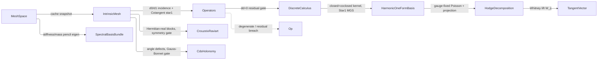

# [RASM_CALCULUS_DEC]

`DecAssembly` owns mesh-bound discrete-exterior-calculus assembly: one kernel builds the `Numerics/spectral` `DiscreteCalculus` bundle, the Crouzeix-Raviart connection heat system, CDS holonomy, the genus-dim harmonic basis and `ω = dα + δβ + η` Hodge decomposition with its Whitney lift, the extrinsic heat scaffold, and the spectral eigenbasis from the `Meshing/mesh` frozen `IntrinsicMesh` under the `∂∂ = 0` gate. This page assembles and never re-owns the settled `Numerics/spectral` algebra; `HodgeDecompositionReceipt` and `SpectralBasisBundle` declare beside their algorithms.

`Numerics/spectral` delivers the mesh-free algebra settled; this page dispatches on the `MeshLaplacian` discretization row and populates its carriers, never re-minting them. Every cotangent weight routes a `Meshing/mesh` owner: `MeshKernel.CotanEdgeWeightOf` is the one half-sum `Star1` projects, the intrinsic `Cotangent.OfLengths` path serves CR pair emission, and the extrinsic `OfEdges` path serves divergence scatter and the heat scaffold. `Op` is the explicit value key, every receipt folds one `ValidityClaim.All` over the `Domain/rails` vocabulary, and failures route `Op` fault factories over `Fin<T>`.

## [01]-[INDEX]

- [02]-[DEC_ASSEMBLY]: `DecAssembly.Build` → `DiscreteCalculus` under the `∂∂ = 0` gate, the CR connection heat system, CDS holonomy, the harmonic basis + Hodge decomposition + Whitney lift, the extrinsic heat scaffold, and the spectral eigenbasis.
- [03]-[DENSITY_BAR]: one owner per assembly axis with its return rail.

## [02]-[DEC_ASSEMBLY]

- Owner: `TripletStencil` the ONE sparse-assembly accumulator this page and `Meshing/skeleton` both write through — pooled index and value columns behind named stencil verbs, so an assembly names its stencil where four transcribed appends and a capacity guess used to stand; `DecAssembly` the one mesh-bound DEC kernel — `Build` produces the complete `DiscreteCalculus` (operators, signpost transport as the `Domain/validation` `Evidence` probe receipt so a refused signpost keeps its cause, and harmonic basis as `Option` demanded at the consumer's projection row, never operator hostages) from a `MeshSpace` and a `MeshLaplacian` row; `IntrinsicTriangle` the private per-face row every assembly fold reads, one shape serving DEC, CR, holonomy, and divergence; `HodgeDecomposition` the component carrier with `HodgeDecompositionReceipt` the unified Hodge witness; `WhitneyVectorAt` the edge-1-form → tangent-vector lift; `AssemblyOrigin` the `[SmartEnum]` cache-provenance row and `FaceSkip` the refusal vocabulary its census counts by ordinal; `SpectralBasisBundle` the cached eigenbasis carrier.
- Cases: `AssemblyOrigin` 2 (`Assembled`/`Cached`), `FaceSkip` 2 (`Incomplete`/`Degenerate`); the `SpectralAssemblyKind` and `MeshLaplacian` vocabularies arrive settled from `Numerics/spectral` and `Meshing/mesh`.
- Entry: `Build` is the one assembly entry (defaulting `MeshLaplacian.IntrinsicDelaunay`, whose retriangulation clears the negative cotangent star1 weights obtuse triangles admit), routing snapshots through the `MeshLaplacian.Snapshot` row delegate — tufted, IDT, and unflipped-frozen each matched to its consistent mass — never a call-site equality branch; `HeatSystemLifted` seats the CR system behind frozen-snapshot and flipped-intrinsic gates, taking the ONE signpost re-anchor and handing a still-flipped snapshot back typed while `HeatSystem` stays the total single-pass assembler beneath it, `DistributeHolonomy` the trivial connection behind closed-genus-0 and Gauss-Bonnet gates, `HodgeDecomposeDetailed` the decomposition with the basis riding `calculus.Harmonic` (None ⇒ dimension 0, `η ≡ 0`, a genus-0 sphere decomposing `ω = dα + δβ`) and the mass riding `calculus.Star0`, `WhitneyVectorAt` the component sample, and `ComputeSpectralBasisDetailed` the eigenbasis (`k` clamped to `VertexCount − 1`). Consumers reach cached artifacts through the `Meshing/mesh` cache, never by re-running assembly.
- Auto: every gate lands as a receipt-witnessed invariant — `Operators` excludes degenerate and edge-incomplete faces so `∂∂ = 0` holds per admitted triangle under the composition residual gated at `SqrtEpsilon` × the largest `D1` magnitude, and the harmonic dimension derives as `2·genus + max(0, boundaryComponents − 1)`; the CR system emits transpose-paired Hermitian-real blocks whose `max |M − Mᵀ|` gate scaled to the largest assembled magnitude drops any orientation-sign or degeneracy defect before it enters the factor; `DistributeHolonomy` validates discrete Gauss-Bonnet before scattering the cone 1-form and solving the coexact potential through the cached `(L + SpdMassShift·M)` Cholesky; `HarmonicForms` Star1-orthonormalizes the closed+coclosed kernel by modified Gram-Schmidt; `HodgeDecomposeDetailed` recovers `δβ` by orthogonality with no indefinite hot-path solve; `ComputeSpectralBasisDetailed` routes the generalized eigen through the owning `SparseMatrix` member and memoizes one bundle per REQUESTED width, the unqualified read taking `MeshAssemblyPolicy.SpectralCount`.
- Receipt: `SpectralAssemblyReceipt` per assembly (`Kind = Dec` with star, skip, and composition witnesses; `Kind = EdgeConnection` with block layout and symmetry residual); `HodgeDecompositionReceipt` folds one `ValidityClaim.All` over boundary-aware dimension agreement (`2g + max(0, b−1)`, admitting zero ⇔ `Harmonic` None), rank + nullity = edge count, and operator-scale-relative residuals; `SpectralBasisBundle` carries the eigen receipt with its `AssemblyOrigin` row and skip witnesses.
- Packages: `Rasm.Meshing` `Meshing/mesh` (`MeshSpace`, `LaplacianCache` accessors, `IntrinsicMesh`/`IntrinsicEdge`, `Cotangent`, `MeshKernel.CotanEdgeWeightOf`, `TopologyReceipt`, `MeshKernel.TopologyDetailed`, `SignpostTransportReceiptOf`), `Numerics/spectral` (`DiscreteCalculus`, `SpectralBasis`, `SpectralAssemblyReceipt`, `SpectralAssemblyKind`, `HarmonicOneFormBasis`/`HarmonicOneFormReceipt`), `Numerics/matrix` (`SparseMatrix.FromTriplets`/`SingularSolveDetailed`/`GeneralizedEigenpairsDetailed`, `SymmetricMatrix.Of`/`DecomposeEigenDetailed`, `CholeskySparse`, `MatrixKernel.AddHermitianRealBlockTriplets`, `GaugePolicy`/`GaugeShift`, `SolveReceipt`/`EigenSolveReceipt`/`GaugeReceipt`), `Domain/rails` (`Op`, the validity fold), `Domain/context` (`Context`, `ToleranceLane.Svd` the rank cut and `ToleranceLane.Drift` the accumulation slack, `Tolerance`), CommunityToolkit.HighPerformance (`ArrayPoolBufferWriter<T>` the stencil columns, `MemoryOwner<T>` the edge-plane scratch), System.Numerics.Tensors (`TensorPrimitives.Subtract`/`MultiplyAdd`/`Add`/`Negate` the fused edge-plane legs), RhinoCommon (`Mesh.Vertices`/`GetNakedEdges`, `Vector3d.CrossProduct` for the extrinsic scaffold and CR face-field sampling), LanguageExt.Core, BCL (`CollectionsMarshal`).
- Law: a face either ADMITS or names a `FaceSkip` row, so the census counts rows by ordinal and no nullable-plus-out-flag triple decodes at a call site; every sparse solve READS its receipt (`SolveReceipt.IsValid` folds the stop's usability) rather than projecting the solution out from under it.
- Growth: a new DEC operator is one field on `DiscreteCalculus` and one assembly fold arm; a new connection discretization is one member returning the same `(SparseMatrix, SpectralAssemblyReceipt)` pair under the same symmetry gate; a boundary-aware holonomy variant extends `DistributeHolonomy` behind its topology gate; a new basis normalization is one policy row on the settled spectral vocabulary; a new face refusal is one `FaceSkip` row the census counts with no fold edit — zero new receipt families.
- Boundary: this page populates the settled `Numerics/spectral` carriers and routes every cotangent through `Cotangent.OfLengths`/`OfEdges` — the `Rasm.Compute` adjoint seam binds those `DiscreteCalculus` spellings, so a redeclaration here forks the wire. CR assembly lifts a flipped intrinsic snapshot through the signpost seam at ONE site — `HeatSystemLifted` re-anchors flipped edge sources onto original-mesh edges before handing the assembler an unflipped snapshot, and a re-anchored snapshot still reporting flips stays the typed `Unsupported` refusal; the assembler itself refuses a flipped input outright, so no lift arm can re-enter it. Gauss-Bonnet stays count-independent and integer-anchored (`0.25` floor), admitting only cone prescriptions that round to the correct integer. `HodgeDecomposeDetailed` recovers `δβ` by orthogonality, the residual gates witnessing the recovery. CR rotation convention declares ONCE at `SampleCrouzeixRaviartFaceField` — canonical `Lo→Hi` tangent, `e2 = unit(n × e1)` taken before any flip, a reversed halfedge negating `e1` alone — and every source encoder feeding the sampler adopts it verbatim; a mirrored encoder rotates the diffused field ninety degrees, so the consumer's source-normal-agreement claim is the only gate that can see it. Assembly folds, triplet accumulators, and outer-product folds are named statement-kernel exemptions. `HeatSystem`'s `lifted` argument stays a bare bool: it threads ONE fact into `SpectralAssemblyReceipt.FlippedIntrinsicLifted`, a column `Numerics/spectral` declares, so a row here only re-wraps it at the seam. Public surface stays `Fin`-railed and exception-free.

```csharp signature
// --- [RUNTIME_PRELUDE] ----------------------------------------------------------------------
using System;
using System.Collections.Generic;
using System.Linq;
using System.Numerics.Tensors;
using System.Runtime.InteropServices;
using CommunityToolkit.HighPerformance.Buffers;
using LanguageExt;
using Rasm.Domain;
using Rasm.Numerics;
using Rasm.Spatial;
using Rhino;
using Rhino.Geometry;
using Thinktecture;
using static LanguageExt.Prelude;
// CS0104 guard: Rhino.Geometry declares Matrix/Dimension homonyms under the dual usings.
using Dimension = Rasm.Numerics.Dimension;

namespace Rasm.Meshing;

// --- [TYPES] --------------------------------------------------------------------------------
[SmartEnum<int>]
public sealed partial class AssemblyOrigin {
    public static readonly AssemblyOrigin Assembled = new(key: 0);
    public static readonly AssemblyOrigin Cached    = new(key: 1);
}

// Each KEY is the census ordinal, so a skip tallies into its own slot and a third refusal is one row.
[SmartEnum<int>]
internal sealed partial class FaceSkip {
    public static readonly FaceSkip Incomplete = new(key: 0);   // an edge the snapshot never seated
    public static readonly FaceSkip Degenerate = new(key: 1);   // vanishing area
}

// --- [MODELS] -------------------------------------------------------------------------------
// Residual gates are operator-scale-relative: eigen tolerance and sqrt-machine-eps floor carry max(1, spectralRadius)
// when a basis exists, bare sqrt-eps when none. `ResidualSlack` is the `ToleranceLane.Drift` read taken at
// `HodgeDecomposeDetailed`, where the Context is threaded — a bare dimensionless factor here would pin the band
// off-lane and leave no consumer able to move it.
[BoundaryAdapter, StructLayout(LayoutKind.Auto)]
// Harmonic-measurement slots live on the NESTED `HarmonicOneFormReceipt` alone (`Numerics/spectral` law: the
// composing receipt re-declares no slot) — this record keeps only decomposition-level facts. `EdgeCount` stays
// here because a genus-0 decomposition carries no harmonic receipt to read it from; the invariant states at
// both owners and the consistency conjunct moves them as one.
public readonly record struct HodgeDecompositionReceipt(
    int ExpectedGenus, int ExpectedBoundaryComponents, int EdgeCount, int FiniteVectorCount,
    double ReconstructionResidual, double HarmonicEnergy, Tolerance ResidualSlack,
    GaugeReceipt ExactGauge, Option<HarmonicOneFormReceipt> Harmonic) : IValidityEvidence {
    // Derived, never stored: 2g + max(0, b - 1).
    public int ExpectedDimension => (2 * ExpectedGenus) + Math.Max(val1: 0, val2: ExpectedBoundaryComponents - 1);
    public bool IsValid {
        get {
            int expected = ExpectedDimension; int edgeCount = EdgeCount;
            double anchor = Harmonic
                .Map(static h => Math.Max(h.SvdTolerance, EpsilonPolicy.SqrtEpsilon * Math.Max(1.0, h.SpectralRadius)))
                .IfNone(noneValue: EpsilonPolicy.SqrtEpsilon);
            // Accumulation over the edge fold widens the operator-scale anchor by the model's own ratio band, so a
            // project tightening `Drift` tightens this gate with it; the anchor stays the absolute floor beneath.
            double gate = Math.Max(anchor, ResidualSlack.Value);
            return ValidityClaim.All(
                Harmonic.IsSome == (expected > 0),
                ValidityClaim.CountAtLeast(count: EdgeCount, floor: 1),
                ValidityClaim.CountExactly(count: FiniteVectorCount, expected: EdgeCount),
                ValidityClaim.Evidence(ResidualSlack),
                ReconstructionResidual <= gate,
                ValidityClaim.Nonnegative(HarmonicEnergy),
                ValidityClaim.Evidence(ExactGauge),
                Harmonic.Map(h => h.IsValid && h.BasisCount == expected && h.EdgeCount == edgeCount)
                    .IfNone(noneValue: true));
        }
    }
}

// Three edge 1-forms + the witness ARE the deliverable; same-typed components stay named fields because typed
// projection rows dispatch on TOut — three anonymous Arr<double> rows could never discriminate.
[BoundaryAdapter, StructLayout(LayoutKind.Auto)]
public readonly record struct HodgeDecomposition(Arr<double> Exact, Arr<double> Harmonic, Arr<double> CoExact, HodgeDecompositionReceipt Receipt) : IValidityEvidence {
    public bool IsValid => ValidityClaim.All(
        ValidityClaim.CountExactly(count: Exact.Count, expected: Receipt.EdgeCount),
        ValidityClaim.CountExactly(count: Harmonic.Count, expected: Receipt.EdgeCount),
        ValidityClaim.CountExactly(count: CoExact.Count, expected: Receipt.EdgeCount),
        ValidityClaim.Evidence(Receipt));
}

[BoundaryAdapter, StructLayout(LayoutKind.Auto)]
public readonly record struct SpectralBasisBundle(
    SpectralBasis Basis, EigenSolveReceipt<double, Arr<double>> Eigen,
    AssemblyOrigin Origin, int SkippedDegenerateFaces = 0, Option<int> FactorNonZeros = default);

// CR factor and its assembly receipt travel together — the Meshing/mesh cache memoizes this pair per heat time.
internal readonly record struct EdgeConnectionFactor(CholeskySparse Factor, SpectralAssemblyReceipt Receipt);

// --- [OPERATIONS] ---------------------------------------------------------------------------
// ONE triplet accumulator for every sparse assembly this page and `Meshing/skeleton`'s contraction round spell.
// Each verb opens ONE pooled region for the whole stencil, so the four hand `List<(int, int, double)>` folds and
// their capacity guesses die together and a stencil is named where four appends used to be transcribed. The
// backing stays pooled columns rather than CSparse `CoordinateStorage<double>`: `SparseMatrix.FromTriplets` is
// the ONE CSR admission, so finalizing through CSparse's own `OfIndexed` would seat a second sparse owner beside it.
internal sealed class TripletStencil : IDisposable {
    readonly ArrayPoolBufferWriter<int> rows = new();
    readonly ArrayPoolBufferWriter<int> cols = new();
    readonly ArrayPoolBufferWriter<double> values = new();

    internal int Count => values.WrittenCount;

    // Symmetric off-diagonal pair with its two positive diagonal returns — the cotangent Laplacian stencil.
    internal void Laplace(int i, int j, double w) => Emit([i, j, i, j], [j, i, i, j], [-w, -w, w, w]);
    // Incidence row of the boundary operator: -1 at the low endpoint, +1 at the high one.
    internal void Incidence(int row, int lo, int hi) => Emit([row, row], [lo, hi], [-1.0, +1.0]);
    // One scalar on two diagonal slots — the stacked real/imaginary CR mass pair.
    internal void Diagonal(int a, int b, double value) => Emit([a, b], [a, b], [value, value]);
    internal void At(int row, int col, double value) => Emit([row], [col], [value]);
    // The stacked real/imaginary CR block — twelve slots through the matrix owner's one sink-shaped layout.
    internal void HermitianBlock(int order, int i, int j, double real, double imaginary, double diagonal) =>
        MatrixKernel.AddHermitianRealBlockTriplets(add: At, order: order, i: i, j: j, real: real, imaginary: imaginary, diagonal: diagonal);

    void Emit(ReadOnlySpan<int> row, ReadOnlySpan<int> col, ReadOnlySpan<double> value) {
        row.CopyTo(rows.GetSpan(sizeHint: row.Length)); rows.Advance(count: row.Length);
        col.CopyTo(cols.GetSpan(sizeHint: col.Length)); cols.Advance(count: col.Length);
        value.CopyTo(values.GetSpan(sizeHint: value.Length)); values.Advance(count: value.Length);
    }

    // The rented segments never escape this enumeration and the writer outlives it under the caller's `using`,
    // so `DangerousGetArray` is the read that keeps the stream allocation-free where `WrittenSpan` cannot cross
    // an iterator boundary at all.
    internal IEnumerable<(int Row, int Col, double Value)> Triplets() {
        (ArraySegment<int> row, ArraySegment<int> col, ArraySegment<double> value) =
            (rows.DangerousGetArray(), cols.DangerousGetArray(), values.DangerousGetArray());
        for (int t = 0; t < Count; t++) { yield return (row[t], col[t], value[t]); }
    }

    internal Fin<SparseMatrix> Freeze(Dimension rowCount, Dimension colCount, Op key) =>
        SparseMatrix.FromTriplets(rows: rowCount, cols: colCount, triplets: Triplets(), key: key);

    public void Dispose() { rows.Dispose(); cols.Dispose(); values.Dispose(); }
}

internal static class DecAssembly {
    private readonly record struct IntrinsicTriangle(int A, int B, int C, int[] Edges, double Area, double LAb, double LBc, double LCa) {
        internal (double A, double B, double C) Cotangents => (
            A: Cotangent.OfLengths(adjacent1: LAb, adjacent2: LCa, opposite: LBc, area: Area),
            B: Cotangent.OfLengths(adjacent1: LAb, adjacent2: LBc, opposite: LCa, area: Area),
            C: Cotangent.OfLengths(adjacent1: LBc, adjacent2: LCa, opposite: LAb, area: Area));
        internal (Point3d A, Point3d B, Point3d C) Points(Mesh mesh);
        internal int Vertex(int side);
        internal int Edge(int side);
        internal double Length(int side);
        internal double Orientation(MeshKernel.IntrinsicMesh imesh, int side);          // +1 when edge runs side->side+1
        internal (int I, int J, double Sign, double LA, double LB, double LOpp) CrouzeixPair(MeshKernel.IntrinsicMesh imesh, int side);
        internal Option<double> Angle(int side) => Cotangent.AngleOfLengths(opposite: Length((side + 1) % 3), adjacent1: Length(side), adjacent2: Length((side + 2) % 3));   // absent corner is ABSENCE, never a fabricated zero
    }
    // Reads either ADMIT or name their refusal row; neither arm is a null and neither rides an out-flag.
    private readonly record struct FaceRead(Option<IntrinsicTriangle> Face, Option<FaceSkip> Skip);
    private static FaceRead ReadFace(MeshKernel.IntrinsicMesh imesh, int faceIdx);

    // --- [DEC_OPERATORS]
    internal static Fin<DiscreteCalculus> Build(MeshSpace space, Op key) =>
        Build(space: space, kind: MeshLaplacian.IntrinsicDelaunay, key: key);
    internal static Fin<DiscreteCalculus> Build(MeshSpace space, MeshLaplacian kind, Op key) =>
        from activeKind in Optional(kind).ToFin(key.InvalidInput())
        from imesh in activeKind.Snapshot(cache: space.Cache, key: key)
        from laplacian in space.Laplacian(kind: activeKind, key: key)
        from topology in MeshKernel.TopologyDetailed(space: space)
        from dec in Operators(imesh: imesh, mass: laplacian.MassLumped, topology: topology, key: key)
        let transport = Evidence.Of(MeshKernel.SignpostTransportReceiptOf(space: space, imesh: imesh, key: key))
        from harmonic in topology.Genus.Map(genus => ((2 * genus) + Math.Max(0, topology.BoundaryComponents - 1)) > 0).IfNone(noneValue: false)
            ? HarmonicForms(calculus: dec, topology: topology, context: space.Tolerance, key: key).Map(Some)
            : Fin.Succ(Option<HarmonicOneFormBasis>.None)
        let calculus = dec with { Transport = transport, Harmonic = harmonic }
        from valid in calculus.IsValid ? Fin.Succ(unit) : Fin.Fail<Unit>(key.InvalidResult())
        select calculus;

    private static Fin<DiscreteCalculus> Operators(MeshKernel.IntrinsicMesh imesh, Arr<double> mass, TopologyReceipt topology, Op key) {
        int vertCount = imesh.VertexCount, edgeCount = imesh.EdgeCount;
        int[] liveFaces = [.. imesh.LiveFaceIndices()];
        using TripletStencil d0 = new();
        using TripletStencil d1 = new();
        Arr<double> star1 = Star1(imesh: imesh);
        List<double> star2 = new(capacity: liveFaces.Length);
        int admitted = 0;
        int[] skipped = new int[FaceSkip.Items.Count];
        for (int e = 0; e < edgeCount; e++) {
            MeshKernel.IntrinsicEdge edge = imesh.EdgeAt(index: e);
            d0.Incidence(row: e, lo: edge.Lo, hi: edge.Hi);
        }
        for (int row = 0; row < liveFaces.Length; row++) {
            FaceRead read = ReadFace(imesh: imesh, faceIdx: liveFaces[row]);
            if (read.Face.Case is not IntrinsicTriangle face) { read.Skip.Iter(why => skipped[why.Key]++); continue; }
            star2.Add(item: 1.0 / face.Area);
            for (int side = 0; side < 3; side++) d1.At(row: admitted, col: face.Edge(side: side), value: face.Orientation(imesh: imesh, side: side));
            admitted++;
        }
        double boundaryResidual = BoundaryCompositionResidual(d0: d0, d1: d1);
        double compositionTolerance = EpsilonPolicy.SqrtEpsilon * d1.Triplets().Aggregate(1.0, static (max, t) => Math.Max(max, Math.Abs(t.Value)));
        int harmonicDimension = topology.Genus.Map(g => (2 * g) + Math.Max(0, topology.BoundaryComponents - 1)).IfNone(0);
        return admitted <= 0 || admitted + skipped.Sum() != liveFaces.Length
            ? Fin.Fail<DiscreteCalculus>(key.Unsupported(inputType: typeof(MeshKernel.IntrinsicMesh), outputType: typeof(DiscreteCalculus)))
            : mass.Count != vertCount || !mass.ForAll(static v => RhinoMath.IsValidDouble(x: v) && v > 0.0) || boundaryResidual > compositionTolerance
            ? Fin.Fail<DiscreteCalculus>(key.InvalidResult())
            : from D0 in d0.Freeze(rowCount: Dimension.Create(value: edgeCount), colCount: Dimension.Create(value: vertCount), key: key)
              from D1 in d1.Freeze(rowCount: Dimension.Create(value: admitted), colCount: Dimension.Create(value: edgeCount), key: key)
              let receipt = DecReceiptOf(imesh: imesh, topology: topology, D0: D0, D1: D1, mass: mass, star1: star1, star2: star2,
                  admitted: admitted, skippedDegenerate: skipped[FaceSkip.Degenerate.Key], skippedMissing: skipped[FaceSkip.Incomplete.Key],
                  boundaryResidual: boundaryResidual, compositionTolerance: compositionTolerance, harmonicDimension: harmonicDimension)
              select new DiscreteCalculus(D0: D0, D1: D1, Star0: mass, Star1: star1, Star2: new Arr<double>([.. star2]), Receipt: receipt, Transport: new Evidence<SignpostTransportReceipt>.Absent());
    }
    // compositionTolerance lands as SpectralAssemblyReceipt.BoundaryCompositionTolerance — the ENFORCED dd=0 band,
    // never the witness-only 0.0 default. The Dec arm holds the real topology measures and publishes them, so the
    // chi = V-E+F and chi = 2-2g-b cross-source gates have real operands; FlippedIntrinsicLifted stays false here.
    private static SpectralAssemblyReceipt DecReceiptOf(MeshKernel.IntrinsicMesh imesh, TopologyReceipt topology, SparseMatrix D0, SparseMatrix D1,
        Arr<double> mass, Arr<double> star1, List<double> star2, int admitted, int skippedDegenerate, int skippedMissing,
        double boundaryResidual, double compositionTolerance, int harmonicDimension);
    private static double BoundaryCompositionResidual(TripletStencil d0, TripletStencil d1);

    // MeshKernel.CotanEdgeWeightOf is the ONE 0.5*(cot alpha + cot beta) the signpost transport rows read too.
    internal static Arr<double> Star1(MeshKernel.IntrinsicMesh imesh) =>
        new([.. Enumerable.Range(start: 0, count: imesh.EdgeCount)
            .Select(e => MeshKernel.CotanEdgeWeightOf(imesh: imesh, edge: imesh.EdgeAt(index: e)))]);

    // --- [HARMONIC_ONE_FORMS] — genus-dim kernel of the closed+coclosed normal operator, Star1-orthonormalized (MGS).
    // The SVD rank cut reads `context.For(ToleranceLane.Svd)` — the Residual-band lane whose own derivation floors
    // on `EpsilonPolicy.SqrtEpsilon`, so the cut moves with a project override instead of a page-minted literal.
    private static Fin<HarmonicOneFormBasis> HarmonicForms(DiscreteCalculus calculus, TopologyReceipt topology, Context context, Op key);
    private static Fin<Arr<Arr<double>>> Star1OrthonormalForms(IEnumerable<Arr<double>> vectors, Arr<double> star1, Op key);
    private static double Star1Inner(ReadOnlySpan<double> left, ReadOnlySpan<double> right, Arr<double> star1);
    private static double MaxResidual(SparseMatrix matrix, Arr<Arr<double>> forms);                 // max |D1 form|
    private static double MaxCoClosedResidual(SparseMatrix d0, Arr<double> star1, Arr<Arr<double>> forms);
    private static double Star1OrthonormalResidual(Arr<Arr<double>> forms, Arr<double> star1);

    // --- [HODGE_DECOMPOSITION] — omega = d(alpha) + delta(beta) + eta.
    internal static Fin<HodgeDecomposition> HodgeDecomposeDetailed(DiscreteCalculus calculus, SparseMatrix stiffness, Arr<double> omega, Context context, Op key) =>
        AdmitHodgeShapes(calculus: calculus, stiffness: stiffness, omega: omega, key: key)
            .Bind(_ => stiffness.SingularSolveDetailed(
                rhs: new Arr<double>(D0Transpose(d0: calculus.D0, edgeValues: HadamardEdge(left: calculus.Star1, right: omega))),
                gauge: GaugePolicy.PinConstant(index: 0, mass: Some(calculus.Star0), shift: GaugeShift.MeanZero), context: context, key: key))
            .Bind(solve => solve.Gauge.ToFin(key.InvalidResult()).Bind(gauge => {
                int edgeCount = calculus.D0.Rows.Value;
                // `Arr<A>` publishes no span view, so each edge plane materializes ONCE at the head and every
                // elementwise leg below runs on spans. The basis is genus-dimensional (2g + max(0, b-1)), so
                // materializing it costs a handful of rows and buys the fused accumulate the indexed walk lost.
                double[] omegaEdges = [.. omega];
                double[][] basis = [.. calculus.Harmonic.Map(static b => b.Forms).IfNone(noneValue: Arr<Arr<double>>.Empty)
                    .AsIterable().Select(static form => (double[])[.. form])];
                double[] dAlpha = D0Apply(d0: calculus.D0, vertexValues: solve.Solution);
                double[] harmonic = new double[edgeCount];
                double[] coExact = new double[edgeCount];
                double harmonicEnergySquared = 0.0;
                // `TensorPrimitives` destinations legally alias their inputs, so the removal, the per-form
                // accumulate, and the co-exact remainder fuse over ONE pooled scratch plane and the two result
                // planes; only `exactRemoved` is scratch, since `harmonic` and `coExact` ARE the published payload.
                using MemoryOwner<double> scratch = MemoryOwner<double>.Allocate(size: edgeCount, mode: AllocationMode.Clear);
                Span<double> exactRemoved = scratch.Span;
                TensorPrimitives.Subtract<double>(x: omegaEdges, y: dAlpha, destination: exactRemoved);
                foreach (double[] form in basis) {
                    double coefficient = Star1Inner(left: exactRemoved, right: form, star1: calculus.Star1);
                    harmonicEnergySquared += coefficient * coefficient;
                    TensorPrimitives.MultiplyAdd<double>(x: form, y: coefficient, addend: harmonic, destination: harmonic);
                }
                TensorPrimitives.Subtract<double>(x: exactRemoved, y: harmonic, destination: coExact);
                HodgeDecompositionReceipt receipt = HodgeReceiptOf(calculus: calculus, edgeCount: edgeCount, dAlpha: dAlpha,
                    harmonic: harmonic, coExact: coExact, omega: omegaEdges,
                    harmonicEnergySquared: harmonicEnergySquared, gauge: gauge,
                    slack: context.For(lane: ToleranceLane.Drift));
                return receipt.IsValid
                    ? Fin.Succ(new HodgeDecomposition(
                        Exact: new Arr<double>(dAlpha), Harmonic: new Arr<double>(harmonic), CoExact: new Arr<double>(coExact), Receipt: receipt))
                    : Fin.Fail<HodgeDecomposition>(key.InvalidResult());
            }));
    private static Fin<Unit> AdmitHodgeShapes(DiscreteCalculus calculus, SparseMatrix stiffness, Arr<double> omega, Op key);
    private static HodgeDecompositionReceipt HodgeReceiptOf(DiscreteCalculus calculus, int edgeCount, ReadOnlySpan<double> dAlpha,
        ReadOnlySpan<double> harmonic, ReadOnlySpan<double> coExact, ReadOnlySpan<double> omega,
        double harmonicEnergySquared, GaugeReceipt gauge, Tolerance slack);
    private static double[] HadamardEdge(Arr<double> left, Arr<double> right);
    private static double[] D0Apply(SparseMatrix d0, Arr<double> vertexValues);
    private static double[] D0Transpose(SparseMatrix d0, double[] edgeValues);
    // W_ij = lambda_i*grad(lambda_j) - lambda_j*grad(lambda_i) folded over the containing face's three edges with d0
    // signs. REJECTS a flipped snapshot — flipped edges no longer match embedded chords.
    internal static Fin<Vector3d> WhitneyVectorAt(MeshSpace space, MeshKernel.IntrinsicMesh imesh, Arr<double> oneForm, Point3d sample, Op key);
    // CR edge sources are encoded against ORIGINAL-mesh edges, so the lift re-expresses each flipped intrinsic edge
    // over embedded chords through MeshKernel.ConnectionEntriesOf, yielding an unflipped-SOURCED snapshot the
    // assembly admits on re-entry. A transport that cannot re-anchor stays the typed Unsupported refusal.
    private static Fin<MeshKernel.IntrinsicMesh> LiftFlippedSources(MeshKernel.IntrinsicMesh mesh, Op key);

    // --- [HODGE_POINT_EVALUATION] — the field-facing seat Spatial/fields and Processing/extract land on.
    // Solve ONCE per (space, source), memoized under HodgeSolutionKey: source identity keys the memo, sense never enters it.
    [StructLayout(LayoutKind.Auto)] internal readonly record struct HodgeSolutionKey(VectorField Source);
    internal static Fin<HodgeDecomposition> HodgeSolutionOf(VectorField source, MeshSpace space, Context context, Op key);
    // Sense selects at evaluation, never a second solve: Toward -> Exact (irrotational dα); Away -> the solenoidal
    // remainder (CoExact + Harmonic summed edgewise) — Whitney-lifted at the sample.
    internal static Fin<Vector3d> HodgeVectorAt(VectorField source, MeshSpace space, BoundarySense sense, Point3d sample, Context context, Op key) =>
        from solved in HodgeSolutionOf(source: source, space: space, context: context, key: key)
        from imesh in MeshLaplacian.IntrinsicDelaunay.Snapshot(cache: space.Cache, key: key)
        from value in WhitneyVectorAt(space: space, imesh: imesh, sample: sample, key: key,
            oneForm: sense.Equals(BoundarySense.Toward) ? solved.Exact : SolenoidalOf(solved: solved))
        select value;
    // Solenoidal remainder = CoExact + Harmonic edgewise. `Arr<A>` carries no span view, so both planes
    // materialize once and the sum runs as ONE elementwise leg into the destination it already owns.
    private static Arr<double> SolenoidalOf(HodgeDecomposition solved) {
        double[] plane = [.. solved.CoExact];
        double[] harmonic = [.. solved.Harmonic];
        TensorPrimitives.Add<double>(x: plane, y: harmonic, destination: plane);
        return new Arr<double>(plane);
    }
    // The coexact potential's edge gradient leaves NEGATED — one elementwise leg over the plane it owns, where
    // the per-element projection built a whole second sequence to flip a sign.
    private static Arr<double> Negated(Arr<double> values) {
        double[] plane = [.. values];
        TensorPrimitives.Negate<double>(x: plane, destination: plane);
        return new Arr<double>(plane);
    }

    // --- [CROUZEIX_RAVIART] — M = (mass + time*grad) as Hermitian-real blocks; transpose-paired off-diagonals make
    // max|M - M^T| the orientation-sign / degeneracy witness, gated machine-epsilon scaled to the largest magnitude.
    // THE entry every composer reaches: it walks `LiftFlippedSources` at most ONCE, and a re-anchored snapshot
    // still reporting flips is the transport's own refusal. The self-recursion this replaced carried no budget
    // and no proof that the second pass differed from the first, so a stubbornly flipped snapshot re-entered the
    // same arm forever; here the lift is off the assembler entirely and the descent is unrepresentable.
    internal static Fin<(SparseMatrix Matrix, SpectralAssemblyReceipt Receipt)> HeatSystemLifted(MeshKernel.IntrinsicMesh mesh, double time, Op key) =>
        !mesh.HasFlips
            ? HeatSystem(mesh: mesh, time: time, key: key, lifted: false)
            : LiftFlippedSources(mesh: mesh, key: key).Bind(reanchored => reanchored.HasFlips
                ? Fin.Fail<(SparseMatrix, SpectralAssemblyReceipt)>(
                    key.Unsupported(inputType: typeof(MeshKernel.IntrinsicMesh), outputType: typeof(SparseMatrix)))
                : HeatSystem(mesh: reanchored, time: time, key: key, lifted: true));
    // TOTAL single-pass assembler: a flipped snapshot REFUSES here rather than re-anchoring, so this body has no
    // recursive arm and no budget to exhaust. `lifted` stays a bare bool by the page's own boundary law — it
    // threads ONE fact onto `SpectralAssemblyReceipt.FlippedIntrinsicLifted`, a column `Numerics/spectral` owns.
    internal static Fin<(SparseMatrix Matrix, SpectralAssemblyReceipt Receipt)> HeatSystem(MeshKernel.IntrinsicMesh mesh, double time, Op key, bool lifted = false) {
        if (!RhinoMath.IsValidDouble(x: time) || time <= 0.0 || !mesh.IsFrozen || mesh.EdgeCount == 0 || mesh.HasFlips)
            return Fin.Fail<(SparseMatrix, SpectralAssemblyReceipt)>(key.InvalidInput());
        int eCount = mesh.EdgeCount;
        using TripletStencil system = new();
        double[] mass = new double[eCount];
        int admitted = 0;
        int[] skipped = new int[FaceSkip.Items.Count];
        foreach (int f in mesh.LiveFaceIndices()) {
            FaceRead read = ReadFace(imesh: mesh, faceIdx: f);
            if (read.Face.Case is not IntrinsicTriangle face) { read.Skip.Iter(why => skipped[why.Key]++); continue; }
            admitted++;
            double contribution = face.Area / 3.0;
            for (int k = 0; k < 3; k++) mass[face.Edge(side: k)] += contribution;
            for (int side = 0; side < 3; side++)
                EmitCrouzeixRaviartPair(system: system, eCount: eCount, pair: face.CrouzeixPair(imesh: mesh, side: side), area: face.Area, time: time);
        }
        for (int e = 0; e < eCount; e++) system.Diagonal(a: e, b: e + eCount, value: mass[e]);
        return SymmetryGate(triplets: system.Triplets(), key: key)
            .Bind(residuals => system.Freeze(rowCount: Dimension.Create(value: 2 * eCount), colCount: Dimension.Create(value: 2 * eCount), key: key)
                .Map(matrix => (Matrix: matrix, Receipt: EdgeConnectionReceiptOf(mesh: mesh, matrix: matrix, mass: mass,
                    admitted: admitted, skippedDegenerate: skipped[FaceSkip.Degenerate.Key], skippedMissing: skipped[FaceSkip.Incomplete.Key],
                    residuals: residuals, lifted: lifted))));
    }
    private static void EmitCrouzeixRaviartPair(TripletStencil system, int eCount,
        (int I, int J, double Sign, double LA, double LB, double LOpp) pair, double area, double time) {
        double dot = (pair.LA * pair.LA) + (pair.LB * pair.LB) - (pair.LOpp * pair.LOpp);
        double weight = dot / (2.0 * area);
        double cosTheta = dot / (2.0 * pair.LA * pair.LB);
        double sinTheta = 2.0 * area / (pair.LA * pair.LB);
        system.HermitianBlock(order: eCount, i: pair.I, j: pair.J,
            real: weight * pair.Sign * cosTheta * time, imaginary: -weight * pair.Sign * sinTheta * time, diagonal: weight * time);
    }
    private static Fin<(double Residual, double Tolerance)> SymmetryGate(IEnumerable<(int Row, int Col, double Value)> triplets, Op key);
    // Publishes FlippedIntrinsicLifted from the threaded lift fact (the CR recursion is the only arm that walks
    // LiftFlippedSources) and leaves BoundaryEdgeCount/NonManifoldEdgeCount/EulerCharacteristic None — the CR
    // assembly runs no topology pass, and a None here is structural absence, never an unmeasured zero.
    private static SpectralAssemblyReceipt EdgeConnectionReceiptOf(MeshKernel.IntrinsicMesh mesh, SparseMatrix matrix, double[] mass,
        int admitted, int skippedDegenerate, int skippedMissing, (double Residual, double Tolerance) residuals, bool lifted);
    // THE rotation convention, declared once for this page and every source encoder that feeds it: the stacked layout
    // carries reals in [0, eCount) and imaginaries in [eCount, 2*eCount), the per-halfedge basis is e1 = unit edge
    // tangent along the canonical Lo->Hi with e2 = unit(faceNormal x e1) taken BEFORE any flip, and a halfedge running
    // against that direction negates e1 ALONE. A mirrored e2 rotates the diffused field ninety degrees, which no gate
    // on this page can see — only the consumer's source-normal-agreement claim witnesses it.
    internal static Vector3d[] FaceField(Mesh mesh, MeshKernel.IntrinsicMesh imesh, Arr<double> stacked) {
        int eCount = imesh.EdgeCount;
        Vector3d[] field = new Vector3d[imesh.LiveFaceCount];
        int row = 0;
        foreach (int f in imesh.LiveFaceIndices()) {
            if (ReadFace(imesh: imesh, faceIdx: f).Face.Case is not IntrinsicTriangle face) { field[row++] = Vector3d.Zero; continue; }
            (Point3d pa, Point3d pb, Point3d pc) = face.Points(mesh: mesh);
            Vector3d normal = Vector3d.CrossProduct(a: pb - pa, b: pc - pa);
            (Point3d[] corners, Vector3d sum) = ([pa, pb, pc], Vector3d.Zero);
            for (int side = 0; side < 3; side++) {
                Vector3d e1 = corners[(side + 1) % 3] - corners[side];
                Vector3d e2 = Vector3d.CrossProduct(a: normal, b: e1);
                if (!e1.Unitize() || !e2.Unitize()) continue;
                int e = face.Edge(side: side);
                if (face.Orientation(imesh: imesh, side: side) < 0.0) e1 = -e1;
                sum += (stacked[index: e] * e1) + (stacked[index: e + eCount] * e2);
            }
            // Zero-guard, the reference's own: a face whose accumulated vector vanishes yields the zero vector rather
            // than a normalized NaN that would poison every divergence corner it touches.
            double length = sum.Length;
            field[row++] = length > EpsilonPolicy.ZeroTolerance ? sum / length : Vector3d.Zero;
        }
        return field;
    }
    // Per-vertex integrated divergence of a face field — the ONE extrinsic cotangent scatter (Cotangent.OfEdges).
    // Face order is LiveFaceIndices in both directions, so the field row advances with the face whether or not the
    // face admits; a degenerate face contributes nothing and still consumes its row.
    internal static Arr<double> IntrinsicDivergence(Mesh mesh, MeshKernel.IntrinsicMesh imesh, Vector3d[] faceFields) {
        double[] div = new double[imesh.VertexCount];
        int row = 0;
        foreach (int f in imesh.LiveFaceIndices()) {
            Vector3d g = faceFields[row++];
            if (ReadFace(imesh: imesh, faceIdx: f).Face.Case is not IntrinsicTriangle face) continue;
            (Point3d pa, Point3d pb, Point3d pc) = face.Points(mesh: mesh);
            ScatterCotangentDivergence(div: div, a: face.A, b: face.B, c: face.C,
                ab: pb - pa, bc: pc - pb, ca: pa - pc, cot: face.Cotangents, g: g);
        }
        return new Arr<double>(div);
    }
    // Half-cotangent pairing at each corner: div[i] += 0.5*(cot(theta_k)*(e_ij . g) + cot(theta_j)*(e_ik . g)),
    // theta_k the angle opposite e_ij and theta_j the angle opposite e_ik. The HALF is the operator's own factor,
    // not a normalization — dropping it doubles every divergence and the Poisson solve absorbs it as a scale.
    private static void ScatterCotangentDivergence(double[] div, int a, int b, int c, Vector3d ab, Vector3d bc, Vector3d ca, (double A, double B, double C) cot, Vector3d g);

    // --- [CDS_HOLONOMY] — Crane-Desbrun-Schroeder trivial connection, closed genus-0 gate.
    internal static Arr<double> AngleDefects(MeshKernel.IntrinsicMesh imesh);        // 2*pi - sum(corner angles)
    internal static Fin<Arr<double>> DistributeHolonomy(MeshSpace space, MeshKernel.IntrinsicMesh imesh, Seq<(int Vertex, double ConeIndex)> cones, Op key) =>
        from topology in MeshKernel.TopologyDetailed(space: space)
        // VALIDATED closed genus-0 ONLY: a bounded surface breaks Gauss-Bonnet without the geodesic-curvature term this
        // kernel omits, and an unvalidated genus carries no trivial-connection guarantee — both route Unsupported.
        from _ in topology.Traits.Admits(MeshTrait.Closed) && topology.BoundaryComponents == 0 && topology.Genus is { IsSome: true, Case: 0 }
            ? Fin.Succ(unit)
            : Fin.Fail<Unit>(key.Unsupported(inputType: typeof(MeshSpace), outputType: typeof(Arr<double>)))
        let defects = AngleDefects(imesh: imesh)
        from __ in ValidateGaussBonnet(mesh: space.Native, imesh: imesh, defects: defects, cones: cones, key: key)
        let u = ConeForm(imesh: imesh, defects: defects, cones: cones)
        let star1 = Star1(imesh: imesh)
        let rhs = IntrinsicCoexactRhs(imesh: imesh, star1: star1, u: u)
        from beta in space.Cache.Cholesky(key: key)
            .Bind(factor => factor.SolveDetailed(rhs: rhs, key: key))
            .Bind(receipt => receipt.IsValid ? Fin.Succ(receipt.Solution) : Fin.Fail<Arr<double>>(key.InvalidResult()))
        let dBeta = IntrinsicEdgeGradient(imesh: imesh, beta: beta)
        select Negated(values: dBeta);
    // Discrete Gauss-Bonnet: sum(kappa)/2pi equals the integer Euler characteristic and cone indices are integer-valued,
    // so the balance is integer; the 0.25 floor is count-independent rounding admission.
    private static Fin<Unit> ValidateGaussBonnet(Mesh mesh, MeshKernel.IntrinsicMesh imesh, Arr<double> defects, Seq<(int Vertex, double ConeIndex)> cones, Op key);
    private static Arr<double> ConeForm(MeshKernel.IntrinsicMesh imesh, Arr<double> defects, Seq<(int Vertex, double ConeIndex)> cones);
    private static Arr<double> IntrinsicCoexactRhs(MeshKernel.IntrinsicMesh imesh, Arr<double> star1, Arr<double> u);
    private static Arr<double> IntrinsicEdgeGradient(MeshKernel.IntrinsicMesh imesh, Arr<double> beta);

    // --- [HEAT_SCAFFOLD] — extrinsic face-gradient/divergence pair the heat-method solvers ride (Cotangent.OfEdges path).
    internal static Arr<double> SourceDelta(int n, Seq<int> sources, Arr<double> mass);
    internal static Vector3d[] FaceGradients(Mesh mesh, Arr<double> u);                   // unit -grad(u) per face
    internal static Arr<double> Divergence(Mesh mesh, Vector3d[] gradients);

    // --- [SPECTRAL_BASIS] — generalized eigen over the IDT stiffness / consistent-mass pencil via Numerics/matrix.
    internal static Fin<SpectralBasisBundle> ComputeSpectralBasisDetailed(MeshSpace space, int k, Op key) =>
        Math.Min(val1: k, val2: space.Native.Vertices.Count - 1) switch {
            < 1 => Fin.Fail<SpectralBasisBundle>(key.InvalidInput()),
            int count => from laplacian in space.Laplacian(kind: MeshLaplacian.IntrinsicDelaunay, key: key)
                         from receipt in laplacian.Stiffness.GeneralizedEigenpairsDetailed(mass: laplacian.MassConsistent, k: count, key: key)
                         // Mode indices are positional low-to-high — PairsIn demands the ascending convention on the rail.
                         from pairs in receipt.PairsIn(expected: EigenOrder.Ascending, key: key)
                         select new SpectralBasisBundle(
                             Basis: new SpectralBasis(
                                 Eigenvalues: new Arr<double>([.. pairs.AsIterable().Select(static p => p.Eigenvalue)]),
                                 Eigenvectors: new Arr<Arr<double>>([.. pairs.AsIterable().Select(static p => p.Eigenvector)])),
                             Eigen: receipt, Origin: AssemblyOrigin.Assembled,
                             SkippedDegenerateFaces: laplacian.SkippedDegenerateFaces, FactorNonZeros: receipt.Evidence.FactorNonZeros),
        };
}
```


```mermaid
---
config:
  layout: elk
  flowchart:
    curve: linear
    padding: 25
---
flowchart LR
    accTitle: DEC assembly flow
    accDescr: Mesh snapshots flow through the Laplacian row delegate into operator assembly, holonomy, Hodge decomposition, and the spectral eigenbasis carriers.
    MeshSpace -->|cache snapshot| IntrinsicMesh
    IntrinsicMesh -->|d0/d1 incidence + Cotangent star1| Operators
    Operators -->|dd=0 residual gate| DiscreteCalculus
    DiscreteCalculus -->|closed+coclosed kernel, Star1 MGS| HarmonicOneFormBasis
    HarmonicOneFormBasis -->|gauge-fixed Poisson + projection| HodgeDecomposition
    HodgeDecomposition -->|Whitney lift W_ij| TangentVector
    IntrinsicMesh -->|Hermitian-real blocks, symmetry gate| CrouzeixRaviart
    IntrinsicMesh -->|angle defects, Gauss-Bonnet gate| CdsHolonomy
    MeshSpace -->|stiffness/mass pencil eigen| SpectralBasisBundle
    Operators -.->|degenerate / residual breach| Op
```

## [03]-[DENSITY_BAR]

Each assembly axis seats one owner returning one rail:

| [INDEX] | [AXIS_CONCERN]     | [OWNER]                        | [RAIL]                                           | [CASES] |
| :-----: | :----------------- | :----------------------------- | :----------------------------------------------- | :-----: |
|  [01]   | DEC assembly       | `DecAssembly.Build`            | `Build → Fin<DiscreteCalculus>`                  |    —    |
|  [02]   | Face row           | `IntrinsicTriangle`            | `FaceRead` (admitted or a named `FaceSkip` row)  |    1    |
|  [03]   | Connection heat    | `HeatSystemLifted`             | `→ Fin<(SparseMatrix, SpectralAssemblyReceipt)>` |    —    |
|  [04]   | Trivial connection | `DistributeHolonomy`           | `→ Fin<Arr<double>>`                             |    —    |
|  [05]   | Harmonic + Hodge   | `HarmonicForms`                | `→ Fin<HarmonicOneFormBasis>`                    |    —    |
|  [06]   | Heat scaffold      | `FaceGradients`                | pure folds                                       |    2    |
|  [07]   | Spectral basis     | `ComputeSpectralBasisDetailed` | `→ Fin<SpectralBasisBundle>`                     |    —    |
|  [08]   | Face refusal       | `FaceSkip`                     | census rows (key IS the tally ordinal)           |    2    |
|  [09]   | Cache provenance   | `AssemblyOrigin`               | bundle column                                    |    2    |
|  [10]   | Sparse assembly    | `TripletStencil`               | `Freeze → Fin<SparseMatrix>`                     |    4    |

## [04]-[RESEARCH]

<!-- source-only: research row template:
[TOKEN]-[OPEN|BLOCKED]: <exact question>; <verification route>.
[SPLIT_MEMBER]-[OPEN]: does `shape-core` expose `split_all`; verify against the member rail.
-->

(none)
