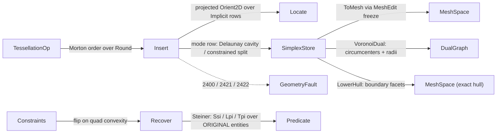

# [RASM_ARRANGEMENT_DELAUNAY]

The exact CDT/CDTet owner of `Rasm.Geometry.Arrangement` — ONE `Tessellation` `[Union]` (`Triangulation`/`Tetrahedralization`) built by ONE `Tessellation.Build(TessellationOp, Op? key = null)` entry over one `SimplexStore` arena, its vertex payload the closed `Numerics/predicates#ROBUST_PREDICATES` `Implicit` row store (`Explicit(Point3d)` | `Ssi` 4 defining points | `Lpi` 5 | `Tpi` 9) so a constructed crossing vertex is carried by its DEFINING ENTITIES and never materialized as a rounded coordinate before the ONE `Round()` emission seam. Every walk, cavity, flip, and recovery decision routes the landed exact family — `Predicate.Orient2D(in Implicit, in Implicit, in Implicit, Axis)` for the axis-projected orientation over any explicit/implicit combination, `Predicate.InCircle(Point3d, Point3d, Point3d, in Implicit, Axis)`/`InSphere(…, in Implicit)` for the explicit-corner in-circum with an explicit or constructed query, `Predicate.Compare` for exact coordinate ordering — signs exact, coordinates rounded only at emission. `TessellationPolicy.Mode` closes the two build regimes: `Delaunay` restores the empty-circum property by predicate-guarded flips wherever the landed in-circum family covers the corners, and `Constrained` is the zero-in-circum regime MANDATORY for implicit-bearing builds (the reference exact-arrangement shape: per-face constrained re-triangulation with no Delaunay restoration), the multi-implicit in-circum and 3D multi-implicit orientation families staying RECORDED GROWTH on the predicate owner gated on a CDTet consumer.

The page owns `TessellationKind` (dimensional discriminant), `TessellationMode` (restoration regime), `TessellationPolicy`, the `SimplexStore` single-writer arena (vertex rows + simplex slots + neighbour links under the `Meshing/edit#ARENA_LAW` contract), `Constraint` (`Segment`/`Facet`/`Crossing` — the implicit-point case carrying the foreign-plane defining points a recovery-time split re-anchors on, depth-1 sealed), `TessellationOp` (`Points`/`Insert`/`Recover`), the `Tessellation` result with its THREE projections — `ToMesh` through the `Meshing/edit` arena freeze, `VoronoiDual` (exact DT adjacency + circumcenters + circumradii materialized at emission — the medial-axis substrate `Meshing/offset` composes), and `LowerHull` (the lifted-paraboloid equivalence: the Delaunay complex IS the lower hull of the paraboloid lift, so the tessellation's boundary facets ARE the predicate-exact convex hull — the `[V11]` robust-grade envelope tier beside the landed `Spatial/cloud` host/complex-kind hull rail, tier boundary stated on both pages). No external engine is admitted for exact tessellation: Triangle.NET is MIT but float-epsilon with no exact CDT and no implicit-point carriage — the load-bearing bar is exactness plus defining-entity vertices, not license; TetGen stays AGPL-rejected. Every failure routes the band-2400 `GeometryFault` union through the `arrangement` cluster this namespace owns (`ConstraintUnrecoverable` 2421, `DegenerateTessellation` 2422, the cross-cutting `DegenerateInput` 2400); the kernel computes no hash — content identity binds the frozen `MeshSpace` the `ToMesh` freeze publishes, never a live arena.

## [01]-[INDEX]

- [01]-[TESSELLATION]: ONE `Tessellation.Build(TessellationOp, Op?)` entry; `Tessellation` `[Union]` over one `SimplexStore` arena with `Implicit` vertex rows; Bowyer-Watson insertion + constrained split-insertion under the `TessellationMode` row; constraint recovery with defining-entity Steiner re-anchoring; `ToMesh`/`VoronoiDual`/`LowerHull` projections.

## [02]-[TESSELLATION]

- Owner: `TessellationKind` `[SmartEnum<string>]` the dimensional discriminant (`triangulation`/`tetrahedralization`) binding the shipped `ComparerAccessors.StringOrdinal`, carrying the `SimplexArity` column (3/4); `TessellationMode` `[SmartEnum<string>]` the restoration regime (`delaunay`/`constrained`) carrying the `Restores` column the insert fold consults — `Constrained` is the zero-in-circum regime the R2 exact-arrangement path mandates for implicit-bearing builds; `TessellationPolicy` the policy row (`Mode` · `MaxFlipPasses` · `MaxRecoverySteiner` · `SuperSimplexScale`) registering `IValidityEvidence`; `SimplexStore` the single-writer mutable arena under the `Meshing/edit#ARENA_LAW` contract — `Implicit[]` vertex rows (the R2 hybrid vertex table: explicit and crossing rows in ONE closed carrier, implicit rows referencing INPUT points only — depth-1 sealed), `arity*capacity` simplex-vertex and neighbour slot columns (`-1` neighbour = hull face), the per-vertex `Anchor` column (one incident simplex, `Spawn`-stamped, lazily repaired — the star-walk seed every interior query rides), a dead bitset + free list, every column grown by amortized doubling (never an input-derived size guess); `Constraint` the closed recovery input — `Segment(A,B)` a constrained edge over vertex ids, `Facet(int[])` a 3D constrained face, `Crossing(A,B,P,Q,R)` the implicit-point case: a constrained segment that is the TRACE of a foreign supporting plane (its three ORIGINAL points carried on the case) so a recovery-time split re-anchors on the carrier — a constraint×constraint crossing re-expresses as `Tpi` over nine input points, a crossing with an explicit in-plane edge as `Lpi` over five, never a construction over implicit endpoints; `TessellationOp` `[Union]` (`Points`/`Insert`/`Recover`) the modality union; `Tessellation` `[Union]` (`Triangulation` carrying store + `SuperBase` + projection `Axis` + policy, `Tetrahedralization` carrying store + `SuperBase` + policy) with the three result projections; `DualGraph` the Voronoi-dual projection carrier (circumcenters + circumradii + dual edges + the crossed DT edge per dual edge).
- Cases: `TessellationKind` rows 2; `TessellationMode` rows 2; `Constraint` cases `Segment` · `Facet` · `Crossing` (3); `TessellationOp` cases `Points` · `Insert` · `Recover` (3); `Tessellation` cases 2.
- Entry: `public static Fin<Tessellation> Build(TessellationOp op, Op? key = null)` — the ONE entry over every modality: `Points(kind, vertices, constraints, policy, plane, support)` seeds, Morton-orders, inserts, recovers, and strips in one fold; `Insert(into, vertex)` is one incremental insertion into an existing tessellation (through the SAME one-row admission — the interior never re-validates); `Recover(into, constraints)` forces a constraint set into an existing complex (ids gated against the live vertex table). `Fin<T>` routes `GeometryFault.DegenerateInput(Kind, index, witness)` 2400 on an empty set, a non-finite explicit row, a BIT-IDENTICAL duplicate row (a coincident vertex degenerates every split that touches it), a constraint id outside the vertex table, a fully-degenerate set (nothing survives the super strip), an implicit-bearing build under `TessellationMode.Delaunay`, or an implicit row in a `Tetrahedralization` build (the 3D implicit family is recorded growth); `GeometryFault.ConstraintUnrecoverable(constraint, budget)` 2421 when a constraint exhausts its Steiner or flip budget; `GeometryFault.DegenerateTessellation(simplex, witness)` 2422 when a cavity, walk, or flip invariant breaks. Projections on the result: `public Fin<MeshSpace> ToMesh(Context context, Op? key = null)` freezes through the `Meshing/edit` arena (implicit rows `Round()` HERE — the one emission-seam materialization; tetra boundary faces wind outward by the exact apex sign); `public Fin<(Point3d A, Point3d B, Point3d C)[]> Triangles(Op? key = null)` the lightweight sub-triangle emission the arrangement's per-face readback and the overlay classification consume — live-simplex order is the index law shared with the dual; `public Fin<DualGraph> VoronoiDual(Op? key = null)` emits exact DT adjacency with circumcenters and circumradii materialized at emission, node `i` naming the same live triangle as `Triangles()[i]` (all-explicit builds — the V10c decoupled medial input; an implicit-bearing dual is a typed fail, the exact circumcenter side-of test a recorded growth row); `public Fin<MeshSpace> LowerHull(Context context, Op? key = null)` emits the outward-wound boundary facets — the exact convex hull by the paraboloid-lift equivalence, a TETRAHEDRALIZATION projection (a triangulation's hull is its boundary edge chain; the mesh spelling refuses typed). No `BuildTriangulation`/`BuildTetrahedralization`/`InsertVertex` sibling statics — one polymorphic `Build` discriminates on the op case.
- Auto: the `Points` arm validates, seeds the store with the scaled bounding super-simplex (explicit rows, occupying the table tail from `SuperBase`), folds insertion over the `Delaunay.InsertionOrder` Morton sequence (the 30-bit Z-order bit-spread over `Round()` materializations — insertion order is a LOCALITY heuristic carrying zero correctness weight; every sign decision reads the exact carrier), folds `RecoverOne` over the constraints, and strips super-incident simplices through the degenerate gate. `Insert` locates the containing simplex by the exact straight-walk (`ExitFace` crosses the face whose projected `Predicate.Orient2D` sign over the `Implicit` rows places the query strictly outside — one member spans every explicit/implicit combination via the carrier's case shape and the `Axis` row; the tetrahedral test is APEX-RELATIVE — query strictly opposite `vs[f]` — because the cyclic face triple flips parity with the face index), then dispatches the `TessellationMode` row: `Delaunay` floods the in-circum cavity (`Restorable` gates each candidate on explicit corners — the landed `InCircle(a,b,c, in Implicit, axis)`/`InSphere(…, in Implicit)` members serve an explicit OR constructed query against explicit corners; a candidate with an implicit corner is skipped, its restoration the recorded multi-implicit growth) and cones the cavity star to the vertex; `Constrained` performs the zero-in-circum split-insertion (interior 1→3, on-edge 2→4 across the shared face) — the reference exact-arrangement shape. Every interior query rides the vertex-anchored STAR WALK (`SimplexStore.Anchor` + neighbour flood — `EdgePresent`, `FirstCrossing`, `IncidentPair` are O(star), never table scans). 2D `RecoverOne` walks each missing constraint edge: a crossing UNCONSTRAINED diagonal flips when the surrounding quad is convex (four projected orientation signs — the ONE `SimplexFlip` both recovery and restoration ride); a crossing CONSTRAINED edge is a constraint×constraint crossing that mints the exact Steiner row over ORIGINAL entities — `Ssi` over four explicit endpoints in the build plane, `Lpi` over an explicit edge × the carried foreign plane, `Tpi` over the build's `Support` witness plane × two carried foreign planes — inserted by split-insertion, both sub-segments re-anchored ON THE PARENT CARRIER (a `Crossing` child keeps the foreign-plane carriage; the budget decrements per split). 3D edge recovery is FLIP-ONLY: `BlockingFace` finds the a-incident face strictly pierced by the segment (exact plane straddle + three same-sign edge-plane gates) and the 2-3 bistellar move removes it; `Facet` recovery forces boundary segments first, then `FacetConform` removes every facet-crossing tet edge by 3-2 moves (incidence three) or a 2-3 peel (higher incidence), orientation-guarded on the convex-bipyramid signs and bounded by `MaxFlipPasses` — a stuck corridor or surviving crossing faults typed. Delaunay-mode restoration re-runs the flip pass over non-constrained explicit-cornered edges until empty-circum holds or the pass budget exhausts.
- Receipt: none on the build rail — the `Tessellation` value IS the result, registering `IValidityEvidence` (`ValidityClaim.All` over live-simplex count and column extents); the frozen `MeshSpace` the `ToMesh` freeze publishes is the hash-eligible artifact `Spatial/reconciliation` `Encode` content-addresses; a live `SimplexStore` is never hashed.
- Packages: `Rasm.Geometry.Numerics` (`Predicate` direct + implicit family, `Implicit`/`Ssi`/`Lpi`/`Tpi`, `Sign`, `Axis` — the exact floor, composed never re-minted), `Rasm.Geometry.Meshing` (`MeshEdit.Of` soup arena + `ToSpace` freeze — the ONE `ToMesh` path), `Rasm.Geometry` (`GeometryFault` band-2400 union), `Rasm.Domain` (`Op` key threading, `Context`, `Kind`, `ValidityClaim`/`IValidityEvidence`), `Rasm`/Vectors (`Point3d`/`BoundingBox`/`MeshSpace`), Thinktecture.Runtime.Extensions, LanguageExt.Core, BCL inbox (`Stack<T>`, `Dictionary<,>`).
- Growth: a new tessellation modality (power/weighted Delaunay, an alpha-complex filter) is one `TessellationKind` or `TessellationMode` row plus one fold arm over the SAME `SimplexStore` — never a parallel triangulator; a new constraint shape is one `Constraint` case plus one `RecoverOne` arm; a new vertex-row construction is the predicate owner's `Implicit` case, this page widening by ZERO members (the carrier is closed there); the multi-implicit in-circum ({IIEE..IIII}) and 3D multi-implicit orientation family are RECORDED GROWTH on `Numerics/predicates` gated on a CDTet consumer — landing them widens `Restorable` by one arm and deletes the tetrahedral explicit-only admission gate; the exact circumcenter side-of test (medial trim) is a recorded `DualGraph` growth row; zero new surface.
- Boundary: the tessellation is the ONE `Tessellation` `[Union]` and a `DelaunayTriangulator`/`DelaunayTetrahedralizer` sibling-class family is the named density defect collapsed onto one union over one store — the two kinds differ ONLY in simplex arity and predicate dimension, never in the insertion algebra; the vertex payload is the closed `Implicit` row store and a rounded `Point3d` materialized at construction (a `bool IsImplicit` flag beside a lossy coordinate) is the named robustness defect this rebuild deletes — signs are exact, coordinates round ONCE at the emission seam; the depth-1 law is sealed — an implicit row references INPUT points only, a recovery split re-expresses over original entities through the `Constraint` carriage, and an implicit point defined over other implicit points is the forbidden depth-2 form; `TessellationMode.Constrained` is MANDATORY for implicit-bearing builds and an implicit-bearing `Delaunay` build is an admission fault, never a silent mode coercion; the walk/cavity/flip signs compose the `Predicate` family and a hand-rolled epsilon in-circle or float straddle is the named correctness defect the exact floor exists to eliminate; the `SimplexStore` is an honest single-writer mutable arena under the `Meshing/edit#ARENA_LAW` contract (amortized-doubling capacity, publish-by-freeze, no fault union of its own) and an immutable-record store mutated by copy — or arena prose claiming immutability — is the deleted form; `ToMesh` freezes through `MeshEdit`/`ToSpace` and a page-local `Mesh`+`RebuildNormals`+`MeshSpace.Of` path beside the arena freeze is the deleted duplicate; `Build`/projections are total over the `Fin` rail and a thrown exception on a degenerate set or an unrecoverable constraint is forbidden; a recovery never DROPS a constraint — it splits within budget or faults typed with the constraint index and budget; the `VoronoiDual`/`LowerHull` projections serve `Meshing/offset` (medial) and the Fabrication stock-envelope gate, and the landed `Spatial/cloud` hull rail stays the host/complex-kind tier — this page is the predicate-gated exact fold for robust-grade envelopes, one anchor each side, never a second hull owner.

```csharp
// --- [RUNTIME_PRELUDE] ----------------------------------------------------------------------
using System;
using System.Collections.Generic;
using System.Linq;
using LanguageExt;
using LanguageExt.Common;
using Rasm.Domain;
using Rasm.Geometry;
using Rasm.Geometry.Meshing;
using Rasm.Geometry.Numerics;
using Rasm.Vectors;
using Rhino.Geometry;
using Thinktecture;
using static LanguageExt.Prelude;

namespace Rasm.Geometry.Arrangement;

// --- [TYPES] ------------------------------------------------------------------------------
[SmartEnum<string>]
[KeyMemberEqualityComparer<ComparerAccessors.StringOrdinal, string>]
[KeyMemberComparer<ComparerAccessors.StringOrdinal, string>]
public sealed partial class TessellationKind {
    public static readonly TessellationKind Triangulation      = new("triangulation", simplexArity: 3);
    public static readonly TessellationKind Tetrahedralization = new("tetrahedralization", simplexArity: 4);

    public int SimplexArity { get; }
}

// Constrained is the zero-in-circum regime (the exact-arrangement reference shape); implicit-bearing
// builds REQUIRE it — the multi-implicit in-circum family is recorded growth on the predicate owner.
[SmartEnum<string>]
[KeyMemberEqualityComparer<ComparerAccessors.StringOrdinal, string>]
[KeyMemberComparer<ComparerAccessors.StringOrdinal, string>]
public sealed partial class TessellationMode {
    public static readonly TessellationMode Delaunay    = new("delaunay", restores: true);
    public static readonly TessellationMode Constrained = new("constrained", restores: false);

    public bool Restores { get; }
}

// --- [CONSTANTS] --------------------------------------------------------------------------
public sealed record TessellationPolicy(TessellationMode Mode, int MaxFlipPasses, int MaxRecoverySteiner, double SuperSimplexScale) : IValidityEvidence {
    public static readonly TessellationPolicy Canonical   = new(TessellationMode.Delaunay, MaxFlipPasses: 64, MaxRecoverySteiner: 1_024, SuperSimplexScale: 1e3);
    public static readonly TessellationPolicy Constrained = Canonical with { Mode = TessellationMode.Constrained };

    public bool IsValid => ValidityClaim.All(
        ValidityClaim.Positive(value: MaxFlipPasses),
        ValidityClaim.Positive(value: MaxRecoverySteiner),
        ValidityClaim.Positive(value: SuperSimplexScale));
}

// --- [MODELS] -----------------------------------------------------------------------------
// Single-writer arena under the Meshing/edit ARENA_LAW: Implicit vertex rows (the hybrid vertex
// table — explicit and defining-entity crossing rows in one closed carrier), arity-wide simplex
// vertex/neighbour slot columns, dead bitset + free list, amortized-doubling capacity. Publish is
// the owning Tessellation's projection seams; the arena mints no fault union.
public sealed class SimplexStore {
    Implicit[] rows;
    int[] vertices;
    int[] neighbours;
    int[] anchor;
    bool[] dead;
    readonly Stack<int> free = new();
    readonly int arity;
    int vertexCount, simplexCount, lastLive;

    internal SimplexStore(int arity, int capacity) {
        this.arity = arity;
        rows = new Implicit[capacity];
        vertices = new int[arity * capacity];
        neighbours = new int[arity * capacity];
        anchor = new int[capacity];
        dead = new bool[capacity];
    }

    public int Arity => arity;
    public int VertexCount => vertexCount;
    public int SimplexCount => simplexCount;
    public Implicit Row(int vertex) => rows[vertex];
    public bool Alive(int simplex) => simplex < simplexCount && !dead[simplex];
    public ReadOnlySpan<int> SimplexVertices(int simplex) => vertices.AsSpan(arity * simplex, arity);
    public int Neighbour(int simplex, int face) => neighbours[(arity * simplex) + face];
    public int LiveCount => Enumerable.Range(0, simplexCount).Count(Alive);

    internal int AddVertex(in Implicit row) {
        Grow(ref rows, vertexCount + 1);
        Grow(ref anchor, vertexCount + 1);
        rows[vertexCount] = row;
        anchor[vertexCount] = -1;
        return vertexCount++;
    }

    internal int Spawn(ReadOnlySpan<int> verts, ReadOnlySpan<int> nbrs) {
        int simplex = free.Count > 0 ? free.Pop() : simplexCount++;
        Grow(ref vertices, arity * (simplex + 1));
        Grow(ref neighbours, arity * (simplex + 1));
        Grow(ref dead, simplex + 1);
        verts.CopyTo(vertices.AsSpan(arity * simplex, arity));
        nbrs.CopyTo(neighbours.AsSpan(arity * simplex, arity));
        dead[simplex] = false;
        foreach (int v in verts) { anchor[v] = simplex; }
        return lastLive = simplex;
    }

    // One live incident simplex per vertex: Spawn stamps it, a stale stamp repairs by one scan and
    // re-caches — the star walks the recovery inner loop rides stay O(star) amortized.
    public int Anchor(int vertex) {
        int s = anchor[vertex];
        if (s >= 0 && Alive(s) && SimplexVertices(s).Contains(vertex)) { return s; }
        for (int i = 0; i < simplexCount; i++) {
            if (!dead[i] && SimplexVertices(i).Contains(vertex)) { return anchor[vertex] = i; }
        }
        return -1;
    }

    internal void Kill(int simplex) { dead[simplex] = true; free.Push(simplex); }
    internal void Link(int simplex, int face, int neighbour) { neighbours[(arity * simplex) + face] = neighbour; }

    internal void LinkBack(int simplex, int toOld, int toNew) {
        if (simplex < 0) { return; }
        for (int f = 0; f < arity; f++) {
            if (neighbours[(arity * simplex) + f] == toOld) { neighbours[(arity * simplex) + f] = toNew; return; }
        }
    }

    internal int LastLive() {
        if (Alive(lastLive)) { return lastLive; }
        for (int s = simplexCount - 1; s >= 0; s--) {
            if (!dead[s]) { return lastLive = s; }
        }
        return -1;
    }

    static void Grow<T>(ref T[] column, int needed) {
        if (needed > column.Length) { Array.Resize(ref column, int.Max(needed, column.Length << 1)); }
    }
}

[Union(ConversionFromValue = ConversionOperatorsGeneration.None)]
public abstract partial record Constraint {
    private Constraint() { }

    public sealed record Segment(int A, int B) : Constraint;
    public sealed record Facet(int[] Boundary) : Constraint;

    // The implicit-point case: a constrained segment that is the trace of a FOREIGN supporting plane
    // across the build plane; P/Q/R are that plane's ORIGINAL points. Splits re-anchor here — a
    // constraint x constraint crossing is Tpi over input points, never a construction over implicit
    // endpoints (depth-1 sealed).
    public sealed record Crossing(int A, int B, Point3d P, Point3d Q, Point3d R) : Constraint;

    public (int A, int B) Ends =>
        Switch(
            segment:  static s => (s.A, s.B),
            facet:    static f => (f.Boundary[0], f.Boundary[^1]),
            crossing: static c => (c.A, c.B));

    public Constraint Rebound(int a, int b) =>
        Switch(
            segment:  _ => (Constraint)new Segment(a, b),
            facet:    f => f with { },
            crossing: c => c with { A = a, B = b });
}

// Voronoi-dual projection carrier: circumcenters + circumradii (the clearance payload), dual
// edges, and the crossed DT edge per dual edge; node i names the same live triangle Triangles()[i].
public sealed record DualGraph(Point3d[] Circumcenters, double[] Radius, (int A, int B)[] Edges, (int U, int V)[] Across);

// --- [OPERATIONS] -------------------------------------------------------------------------
[Union(ConversionFromValue = ConversionOperatorsGeneration.None)]
public abstract partial record TessellationOp {
    private TessellationOp() { }

    // Support = the build plane's three ORIGINAL points (the Tpi witness a constraint x constraint
    // split needs); None for standalone planar builds whose constraints never carry foreign planes.
    public sealed record Points(
        TessellationKind Kind, Implicit[] Vertices, Seq<Constraint> Constraints,
        TessellationPolicy Policy, Axis Plane, Option<(Point3d P, Point3d Q, Point3d R)> Support = default) : TessellationOp;
    public sealed record Insert(Tessellation Into, Implicit Vertex) : TessellationOp;
    public sealed record Recover(Tessellation Into, Seq<Constraint> Constraints) : TessellationOp;
}

[Union(ConversionFromValue = ConversionOperatorsGeneration.None)]
public abstract partial record Tessellation : IValidityEvidence {
    private Tessellation() { }

    public sealed record Triangulation(SimplexStore Store, int SuperBase, Axis Plane, TessellationPolicy Policy, Option<(Point3d P, Point3d Q, Point3d R)> Support) : Tessellation;
    public sealed record Tetrahedralization(SimplexStore Store, int SuperBase, TessellationPolicy Policy) : Tessellation;

    public TessellationKind Kind =>
        Switch(triangulation: static _ => TessellationKind.Triangulation, tetrahedralization: static _ => TessellationKind.Tetrahedralization);

    public SimplexStore Store =>
        Switch(triangulation: static t => t.Store, tetrahedralization: static t => t.Store);

    int SuperBase =>
        Switch(triangulation: static t => t.SuperBase, tetrahedralization: static t => t.SuperBase);

    Axis Projection =>
        Switch(triangulation: static t => t.Plane, tetrahedralization: static _ => Axis.Z);

    TessellationPolicy Policy =>
        Switch(triangulation: static t => t.Policy, tetrahedralization: static t => t.Policy);

    public bool IsValid => ValidityClaim.All(
        ValidityClaim.CountAtLeast(count: Store.LiveCount, floor: 1),
        ValidityClaim.CountAtLeast(count: Store.VertexCount, floor: Kind.SimplexArity));

    // --- [BUILD]
    // Input rows occupy table slots [0, n) — a Constraint's vertex ids ARE input indices; the
    // super rows sit at the tail [SuperBase, SuperBase + arity). Morton order permutes only the
    // insertion SEQUENCE, never the ids.
    public static Fin<Tessellation> Build(TessellationOp op, Op? key = null) =>
        op switch {
            TessellationOp.Points p  => Admit(p).Bind(static admitted => Seeded(admitted)
                .Bind(seed => Delaunay.InsertionOrder(admitted.Vertices).Fold(
                    Fin.Succ(seed), (acc, v) => acc.Bind(t => t.InsertRow(v).Map(_ => t))))
                .Bind(filled => admitted.Constraints.Map(static (c, i) => (Index: i, Row: c))
                    .Fold(Fin.Succ(filled), (acc, c) => acc.Bind(t => t.RecoverOne(c.Row, c.Index))))
                .Bind(static done => done.Restore())
                .Bind(static done => done.Stripped())),
            TessellationOp.Insert i  => i.Into.AdmitRow(i.Vertex)
                .Bind(row => i.Into.InsertRow(i.Into.Store.AddVertex(in row)))
                .Map(_ => i.Into),
            TessellationOp.Recover r => r.Constraints.Map(static (c, i) => (Index: i, Row: c))
                .Fold(r.Into.AdmitIds(r.Constraints), (acc, c) => acc.Bind(t => t.RecoverOne(c.Row, c.Index))),
            _                        => Fin.Fail<Tessellation>(new GeometryFault.DegenerateInput(Kind.Mesh, 0, "unmatched tessellation op").ToError()),
        };

    static Fin<TessellationOp.Points> Admit(TessellationOp.Points p) {
        if (p.Vertices.Length == 0) { return Reject(0, "empty vertex set"); }
        var seen = new Dictionary<Point3d, int>(p.Vertices.Length);
        for (int i = 0; i < p.Vertices.Length; i++) {
            if (!p.Vertices[i].IsExplicit) { continue; }
            Point3d at = p.Vertices[i].AsExplicit;
            if (!ValidityClaim.Finite(point: at)) { return Reject(i, "non-finite explicit row"); }
            if (!seen.TryAdd(at, i)) { return Reject(i, "bit-identical duplicate row"); }  // a coincident vertex degenerates every split that touches it
        }
        foreach ((Constraint row, int index) in p.Constraints.Map(static (c, i) => (c, i))) {
            (int a, int b) = row.Ends;
            bool broken = a == b || a < 0 || b < 0 || a >= p.Vertices.Length || b >= p.Vertices.Length
                || (row is Constraint.Facet facet && (facet.Boundary.Length < 3 || facet.Boundary.Any(v => v < 0 || v >= p.Vertices.Length)));
            if (broken) { return Reject(index, "constraint id outside the vertex table"); }
        }
        bool implicitBearing = p.Vertices.Any(static v => !v.IsExplicit);
        return implicitBearing && p.Policy.Mode == TessellationMode.Delaunay ? Reject(0, "implicit rows demand constrained mode")
            : implicitBearing && p.Kind == TessellationKind.Tetrahedralization ? Reject(0, "3D implicit rows are CDTet-gated growth")
            : Fin.Succ(p);

        static Fin<TessellationOp.Points> Reject(int index, string witness) =>
            Fin.Fail<TessellationOp.Points>(new GeometryFault.DegenerateInput(Kind.Point, index, witness).ToError());
    }

    // Insert-modality admission: the one-row mirror of Admit — every entry arm admits once, the
    // interior never re-validates (the tetrahedral walk reads AsExplicit unconditionally).
    Fin<Implicit> AdmitRow(Implicit vertex) =>
        vertex.IsExplicit && !ValidityClaim.Finite(point: vertex.AsExplicit)
            ? Fin.Fail<Implicit>(new GeometryFault.DegenerateInput(Kind.Point, Store.VertexCount, "non-finite explicit row").ToError())
            : !vertex.IsExplicit && Policy.Mode == TessellationMode.Delaunay
                ? Fin.Fail<Implicit>(new GeometryFault.DegenerateInput(Kind.Point, Store.VertexCount, "implicit rows demand constrained mode").ToError())
                : !vertex.IsExplicit && Kind == TessellationKind.Tetrahedralization
                    ? Fin.Fail<Implicit>(new GeometryFault.DegenerateInput(Kind.Point, Store.VertexCount, "3D implicit rows are CDTet-gated growth").ToError())
                    : Fin.Succ(vertex);

    // Recover-modality admission: constraint ids must address the live vertex table.
    Fin<Tessellation> AdmitIds(Seq<Constraint> constraints) {
        foreach ((Constraint row, int index) in constraints.Map(static (c, i) => (c, i))) {
            (int a, int b) = row.Ends;
            bool broken = a == b || a < 0 || b < 0 || a >= Store.VertexCount || b >= Store.VertexCount
                || (row is Constraint.Facet facet && facet.Boundary.Any(v => v < 0 || v >= Store.VertexCount));
            if (broken) { return Fin.Fail<Tessellation>(new GeometryFault.DegenerateInput(Kind.Point, index, "constraint id outside the vertex table").ToError()); }
        }
        return Fin.Succ(this);
    }

    // --- [INSERT]
    Fin<int> InsertRow(int vertex) =>
        Locate(vertex).Bind(at => Policy.Mode.Restores && Restorable(at)
            ? CavityInsert(at, vertex)
            : SplitInsert(at, vertex));

    // Delaunay restoration is admissible only where the landed in-circum family covers the corners:
    // three (2D) / four (3D) EXPLICIT corners against an explicit-or-constructed query.
    bool Restorable(int simplex) {
        ReadOnlySpan<int> vs = Store.SimplexVertices(simplex);
        for (int i = 0; i < vs.Length; i++) {
            if (!Store.Row(vs[i]).IsExplicit) { return false; }
        }
        return true;
    }

    // --- [LOCATE]
    Fin<int> Locate(int query) {
        int current = Store.LastLive();
        Implicit q = Store.Row(query);
        for (int step = 0; step <= Store.SimplexCount; step++) {
            int exit = ExitFace(current, in q);
            if (exit < 0) { return Fin.Succ(current); }
            int next = Store.Neighbour(current, exit);
            if (next < 0) { return Fin.Fail<int>(new GeometryFault.DegenerateTessellation(current, "locate walked off the hull").ToError()); }
            current = next;
        }
        return Fin.Fail<int>(new GeometryFault.DegenerateTessellation(current, "locate walk overran the live count").ToError());
    }

    // The tetrahedral test is APEX-RELATIVE: the cyclic face triple (f+1, f+2, f+3) flips parity
    // with f, so a fixed-sign convention is wrong on half the faces — the query exits face f when
    // it lies strictly opposite the apex vs[f]; the 2D triangle rows are CCW by construction.
    int ExitFace(int simplex, in Implicit query) {
        ReadOnlySpan<int> vs = Store.SimplexVertices(simplex);
        int arity = Kind.SimplexArity;
        for (int f = 0; f < arity; f++) {
            Sign side;
            if (arity == 3) {
                side = Predicate.Orient2D(Store.Row(vs[(f + 1) % 3]), Store.Row(vs[(f + 2) % 3]), query, Projection);
            }
            else {
                (Point3d u1, Point3d u2, Point3d u3) = (Store.Row(vs[(f + 1) & 3]).AsExplicit, Store.Row(vs[(f + 2) & 3]).AsExplicit, Store.Row(vs[(f + 3) & 3]).AsExplicit);
                side = Predicate.Orient3D(u1, u2, u3, query.AsExplicit).Times(Predicate.Orient3D(u1, u2, u3, Store.Row(vs[f]).AsExplicit));
            }
            if (side == Sign.Negative) { return f; }
        }
        return -1;
    }

    // --- [CAVITY]
    // Membership commits at PUSH — deciding at pop would let a face toward a pending neighbour
    // enter the star spuriously and cone into the cavity interior.
    Fin<int> CavityInsert(int seed, int query) {
        HashSet<int> cavity = [seed];
        var star = new List<(int Simplex, int Face)>();
        var stack = new Stack<int>();
        stack.Push(seed);
        Implicit q = Store.Row(query);
        while (stack.Count > 0) {
            int s = stack.Pop();
            for (int f = 0; f < Kind.SimplexArity; f++) {
                int neighbour = Store.Neighbour(s, f);
                if (cavity.Contains(neighbour) && neighbour >= 0) { continue; }
                if (neighbour >= 0 && Restorable(neighbour) && InCircum(neighbour, in q) == Sign.Positive) {
                    cavity.Add(neighbour);
                    stack.Push(neighbour);
                }
                else { star.Add((s, f)); }
            }
        }
        return star.Count == 0
            ? Fin.Fail<int>(new GeometryFault.DegenerateTessellation(seed, "empty cavity star").ToError())
            : Fin.Succ(Cone(cavity, star, query));
    }

    Sign InCircum(int simplex, in Implicit query) {
        ReadOnlySpan<int> vs = Store.SimplexVertices(simplex);
        return Kind.SimplexArity == 3
            ? Predicate.InCircle(Store.Row(vs[0]).AsExplicit, Store.Row(vs[1]).AsExplicit, Store.Row(vs[2]).AsExplicit, in query, Projection)
            : Predicate.InSphere(Store.Row(vs[0]).AsExplicit, Store.Row(vs[1]).AsExplicit, Store.Row(vs[2]).AsExplicit, Store.Row(vs[3]).AsExplicit, in query);
    }

    // Cone the cavity-boundary star to the vertex: one new simplex per star face, outward neighbour
    // patched through LinkBack, sibling links resolved by the shared-subface dictionary.
    int Cone(HashSet<int> cavity, List<(int Simplex, int Face)> star, int query) {
        int arity = Kind.SimplexArity;
        var bySubface = new Dictionary<(int, int, int), (int Simplex, int Face)>();
        Span<int> verts = stackalloc int[arity];
        Span<int> nbrs = stackalloc int[arity];
        int seeded = -1;
        foreach ((int s, int f) in star) {
            ReadOnlySpan<int> vs = Store.SimplexVertices(s);
            verts[0] = query;
            for (int i = 1; i < arity; i++) { verts[i] = vs[(f + i) % arity]; }
            int outward = Store.Neighbour(s, f);
            nbrs[0] = outward;
            for (int i = 1; i < arity; i++) { nbrs[i] = -1; }
            int born = Store.Spawn(verts, nbrs);
            Store.LinkBack(outward, s, born);
            for (int i = 1; i < arity; i++) {
                (int, int, int) faceKey = SubfaceKey(verts, i, arity);
                if (bySubface.Remove(faceKey, out (int Simplex, int Face) other)) {
                    Store.Link(born, i, other.Simplex);
                    Store.Link(other.Simplex, other.Face, born);
                }
                else { bySubface[faceKey] = (born, i); }
            }
            seeded = born;
        }
        foreach (int s in cavity) { Store.Kill(s); }
        return seeded;

        static (int, int, int) SubfaceKey(ReadOnlySpan<int> verts, int face, int arity) {
            Span<int> rest = stackalloc int[3];
            int n = 0;
            for (int i = 0; i < arity; i++) {
                if (i != face) { rest[n++] = verts[i]; }
            }
            rest[..n].Sort();
            return (rest[0], n > 1 ? rest[1] : -1, n > 2 ? rest[2] : -1);
        }
    }

    // Zero-in-circum split-insertion (the constrained regime): interior 1->3; a query exactly on a
    // face (projected orientation Zero) splits both incident simplices 2->4.
    Fin<int> SplitInsert(int at, int query) {
        ReadOnlySpan<int> vs = Store.SimplexVertices(at);
        Implicit q = Store.Row(query);
        int onFace = -1;
        for (int f = 0; f < Kind.SimplexArity && Kind.SimplexArity == 3; f++) {
            if (Predicate.Orient2D(Store.Row(vs[(f + 1) % 3]), Store.Row(vs[(f + 2) % 3]), q, Projection) == Sign.Zero) { onFace = f; break; }
        }
        var star = new List<(int Simplex, int Face)>();
        var cavity = new HashSet<int> { at };
        if (onFace >= 0 && Store.Neighbour(at, onFace) is int twin and >= 0) { cavity.Add(twin); }
        foreach (int s in cavity) {
            for (int f = 0; f < Kind.SimplexArity; f++) {
                int n = Store.Neighbour(s, f);
                if (!cavity.Contains(n) || n < 0) { star.Add((s, f)); }
            }
        }
        return Fin.Succ(Cone(cavity, star, query));
    }

    // --- [RECOVER]
    // The hardest fold in the tree: walk the missing constraint edge, flip crossing unconstrained
    // diagonals on quad convexity, mint the exact Steiner row over ORIGINAL entities when the
    // crossing edge is itself constrained, re-anchor both sub-segments on the parent carrier and
    // re-pin the split crossing constraint's own halves.
    Fin<Tessellation> RecoverOne(Constraint constraint, int index) {
        if (constraint is Constraint.Facet facet) { return RecoverFacet(facet, index); }
        if (Kind == TessellationKind.Tetrahedralization) { return RecoverEdge3D(constraint, index); }  // 2D diagonal flips corrupt a tet store
        var queue = new Queue<Constraint>();
        queue.Enqueue(constraint);
        int budget = Policy.MaxRecoverySteiner;
        while (queue.Count > 0) {
            Constraint edge = queue.Dequeue();
            (int a, int b) = edge.Ends;
            int guard = Policy.MaxFlipPasses * int.Max(Store.SimplexCount, 1);
            while (!EdgePresent(a, b)) {
                if (guard-- <= 0) { return Fin.Fail<Tessellation>(new GeometryFault.ConstraintUnrecoverable(index, Policy.MaxRecoverySteiner).ToError()); }
                Option<(int P, int Q, bool Constrained)> crossing = FirstCrossing(a, b);
                if (crossing.Case is not ((int p, int q, bool pinned))) {
                    return Fin.Fail<Tessellation>(new GeometryFault.DegenerateTessellation(Store.LastLive(), "constraint walk found no crossing").ToError());
                }
                if (!pinned && FlipDiagonal(p, q)) { continue; }
                if (budget-- <= 0) { return Fin.Fail<Tessellation>(new GeometryFault.ConstraintUnrecoverable(index, Policy.MaxRecoverySteiner).ToError()); }
                Fin<int> steiner = SteinerOf(edge, p, q, index).Map(row => Store.AddVertex(in row)).Bind(InsertRow);
                if (steiner.Case is not int w) { return steiner.Map(_ => (Tessellation)this); }
                if (pinned && ConstraintOf(p, q) is Constraint other) {  // the split crossing constraint re-pins its own halves
                    Pin(p, w, other.Rebound(p, w));
                    Pin(w, q, other.Rebound(w, q));
                }
                queue.Enqueue(edge.Rebound(a, w));
                queue.Enqueue(edge.Rebound(w, b));
                break;
            }
            if (EdgePresent(a, b)) { Pin(a, b, edge); }
        }
        return Fin.Succ(this);
    }

    // The exact Steiner construction over ORIGINAL entities — depth-1 by case shape: two in-plane
    // explicit segments make an Ssi; an explicit edge against a carried foreign plane an Lpi; two
    // carried planes against the build's Support witness a Tpi. A split with no original-entity
    // spelling is UNANCHORABLE and faults — a rounded re-anchor would break the depth-1 law.
    Fin<Implicit> SteinerOf(Constraint edge, int p, int q, int index) {
        (int a, int b) = edge.Ends;
        (Implicit ra, Implicit rb, Implicit rp, Implicit rq) = (Store.Row(a), Store.Row(b), Store.Row(p), Store.Row(q));
        return (edge, ra.IsExplicit && rb.IsExplicit, rp.IsExplicit && rq.IsExplicit) switch {
            (Constraint.Segment, true, true)  => Fin.Succ<Implicit>(new Ssi(ra.AsExplicit, rb.AsExplicit, rp.AsExplicit, rq.AsExplicit, Projection)),
            (Constraint.Crossing c, _, true)  => Fin.Succ<Implicit>(new Lpi(rp.AsExplicit, rq.AsExplicit, c.P, c.Q, c.R)),
            (Constraint.Crossing c, _, false) when ConstraintOf(p, q) is Constraint.Crossing other && SupportWitness().Case is ((Point3d sp, Point3d sq, Point3d sr)) =>
                Fin.Succ<Implicit>(new Tpi(sp, sq, sr, c.P, c.Q, c.R, other.P, other.Q, other.R)),
            (Constraint.Segment, true, false) when ConstraintOf(p, q) is Constraint.Crossing other =>
                Fin.Succ<Implicit>(new Lpi(ra.AsExplicit, rb.AsExplicit, other.P, other.Q, other.R)),
            _                                 => Fin.Fail<Implicit>(new GeometryFault.ConstraintUnrecoverable(index, Policy.MaxRecoverySteiner).ToError()),
        };
    }

    Option<(Point3d P, Point3d Q, Point3d R)> SupportWitness() =>
        Switch(triangulation: static t => t.Support, tetrahedralization: static _ => None);

    // --- [STORE_OPS]
    // Input rows first (ids = input indices, so constraint ids are valid as written); super rows
    // at the tail from SuperBase = n.
    static Fin<Tessellation> Seeded(TessellationOp.Points p) {
        int arity = p.Kind.SimplexArity;
        var store = new SimplexStore(arity, int.Max(2 * p.Vertices.Length + arity, 16));
        foreach (Implicit row in p.Vertices) { store.AddVertex(in row); }
        BoundingBox box = new(p.Vertices.Select(static v => v.Round()));
        double r = p.Policy.SuperSimplexScale * double.Max(box.Diagonal.Length, 1.0);
        Point3d c = box.Center;
        Span<int> super = stackalloc int[arity];
        if (arity == 3) {
            (int u, int v) = (p.Plane.U, p.Plane.V);
            super[0] = store.AddVertex(Planar(c, u, v, -3.0 * r, -r));
            super[1] = store.AddVertex(Planar(c, u, v, 3.0 * r, -r));
            super[2] = store.AddVertex(Planar(c, u, v, 0.0, 3.0 * r));
        }
        else {
            super[0] = store.AddVertex(new Implicit(new Point3d(c.X - (3.0 * r), c.Y - r, c.Z - r)));
            super[1] = store.AddVertex(new Implicit(new Point3d(c.X + (3.0 * r), c.Y - r, c.Z - r)));
            super[2] = store.AddVertex(new Implicit(new Point3d(c.X, c.Y + (3.0 * r), c.Z - r)));
            super[3] = store.AddVertex(new Implicit(new Point3d(c.X, c.Y, c.Z + (3.0 * r))));
        }
        Span<int> hull = stackalloc int[arity];
        hull.Fill(-1);
        store.Spawn(super, hull);
        int superBase = p.Vertices.Length;
        return Fin.Succ(p.Kind == TessellationKind.Triangulation
            ? new Triangulation(store, superBase, p.Plane, p.Policy, p.Support)
            : new Tetrahedralization(store, superBase, p.Policy));

        static Implicit Planar(Point3d c, int u, int v, double du, double dv) {
            Span<double> at = [c.X, c.Y, c.Z];
            at[u] += du;
            at[v] += dv;
            return new Implicit(new Point3d(at[0], at[1], at[2]));
        }
    }

    // Star walk: flood the live simplices sharing a vertex through neighbour links from the
    // vertex's anchored simplex — O(star), never a table scan; the recovery inner loop rides this.
    IEnumerable<int> Star(int vertex) {
        int seed = Store.Anchor(vertex);
        if (seed < 0) { yield break; }
        var seen = new HashSet<int> { seed };
        var stack = new Stack<int>();
        stack.Push(seed);
        while (stack.Count > 0) {
            int s = stack.Pop();
            yield return s;
            for (int f = 0; f < Kind.SimplexArity; f++) {
                int n = Store.Neighbour(s, f);
                if (n >= 0 && Store.Alive(n) && Store.SimplexVertices(n).Contains(vertex) && seen.Add(n)) { stack.Push(n); }
            }
        }
    }

    bool EdgePresent(int a, int b) {
        foreach (int s in Star(a)) {
            if (Store.SimplexVertices(s).Contains(b)) { return true; }
        }
        return false;
    }

    // The corridor's first crossing: among a's star triangles, the edge OPPOSITE a strictly
    // straddled by segment (a,b) — the walk re-runs after every flip or split, so the corridor
    // advances one exact decision at a time.
    Option<(int P, int Q, bool Constrained)> FirstCrossing(int a, int b) {
        (Implicit ra, Implicit rb) = (Store.Row(a), Store.Row(b));
        foreach (int s in Star(a)) {
            ReadOnlySpan<int> vs = Store.SimplexVertices(s);
            for (int f = 0; f < 3; f++) {
                (int p, int q) = (vs[(f + 1) % 3], vs[(f + 2) % 3]);
                if (p == a || p == b || q == a || q == b) { continue; }
                (Implicit rp, Implicit rq) = (Store.Row(p), Store.Row(q));
                bool straddles =
                    Predicate.Orient2D(ra, rb, rp, Projection).Times(Predicate.Orient2D(ra, rb, rq, Projection)) == Sign.Negative
                    && Predicate.Orient2D(rp, rq, ra, Projection).Times(Predicate.Orient2D(rp, rq, rb, Projection)) == Sign.Negative;
                if (straddles) { return Some((p, q, IsPinned(p, q))); }
            }
        }
        return None;
    }

    // The ONE SimplexFlip both recovery and restoration ride: flip diagonal (p,q) of the quad formed
    // by its two incident triangles iff the quad is convex (four exact orientation signs).
    bool FlipDiagonal(int p, int q) {
        Option<(int S, int T, int Sp, int Tp)> pair = IncidentPair(p, q);
        if (pair.Case is not ((int s, int t, int apexS, int apexT))) { return false; }
        (Implicit rp, Implicit rq, Implicit rs, Implicit rt) = (Store.Row(p), Store.Row(q), Store.Row(apexS), Store.Row(apexT));
        bool convex =
            Predicate.Orient2D(rs, rt, rp, Projection).Times(Predicate.Orient2D(rs, rt, rq, Projection)) == Sign.Negative
            && Predicate.Orient2D(rp, rq, rs, Projection).Times(Predicate.Orient2D(rp, rq, rt, Projection)) == Sign.Negative;
        if (!convex) { return false; }
        RewireFlip(s, t, p, q, apexS, apexT);
        return true;
    }

    // --- [RESTORE]
    // Delaunay-mode terminal pass: flip non-pinned explicit-cornered edges failing empty-circum,
    // bounded by MaxFlipPasses; the constrained regime returns immediately. The pass is 2D — the
    // 3D Delaunay property rides the cavity insertion itself.
    Fin<Tessellation> Restore() {
        if (!Policy.Mode.Restores || Kind.SimplexArity != 3) { return Fin.Succ(this); }
        for (int pass = 0; pass < Policy.MaxFlipPasses; pass++) {
            bool flipped = false;
            for (int s = 0; s < Store.SimplexCount; s++) {
                if (!Store.Alive(s)) { continue; }
                ReadOnlySpan<int> vs = Store.SimplexVertices(s);
                for (int f = 0; f < 3; f++) {
                    (int p, int q) = (vs[(f + 1) % 3], vs[(f + 2) % 3]);
                    int twin = Store.Neighbour(s, f);
                    if (twin < 0 || IsPinned(p, q) || !Restorable(s) || !Restorable(twin)) { continue; }
                    int apex = Apex(twin, p, q);
                    Implicit qr = Store.Row(apex);
                    if (InCircum(s, in qr) == Sign.Positive && FlipDiagonal(p, q)) { flipped = true; break; }
                }
            }
            if (!flipped) { return Fin.Succ(this); }
        }
        return Fin.Succ(this);
    }

    // Strip, then the degenerate gate: a set whose every simplex touches the super frame
    // (collinear, or coplanar in 3D) leaves nothing live — typed, never an empty success.
    Fin<Tessellation> Stripped() {
        int arity = Kind.SimplexArity;
        for (int s = 0; s < Store.SimplexCount; s++) {
            if (!Store.Alive(s)) { continue; }
            ReadOnlySpan<int> vs = Store.SimplexVertices(s);
            for (int i = 0; i < arity; i++) {
                if (vs[i] >= SuperBase && vs[i] < SuperBase + arity) {
                    for (int f = 0; f < arity; f++) { Store.LinkBack(Store.Neighbour(s, f), s, -1); }
                    Store.Kill(s);
                    break;
                }
            }
        }
        return Store.LiveCount == 0
            ? Fin.Fail<Tessellation>(new GeometryFault.DegenerateInput(Kind.Point, 0, "fully degenerate set: no simplex survives the super strip").ToError())
            : Fin.Succ(this);
    }

    // --- [PROJECTIONS]
    // Emission seam: implicit rows Round() HERE, the arena freeze re-admits — no second mesh path.
    // Tetra boundary faces wind OUTWARD by the exact apex sign (the cyclic triple alone flips
    // parity with the face index — a fixed winding is inward on half the faces).
    public Fin<MeshSpace> ToMesh(Context context, Op? key = null) {
        using var edit = MeshEdit.Of([], []);
        var slot = new Dictionary<int, int>();
        int Emit(int v) => slot.TryGetValue(v, out int at) ? at : slot[v] = edit.AddVertex(Store.Row(v).Round());
        int arity = Kind.SimplexArity;
        for (int s = 0; s < Store.SimplexCount; s++) {
            if (!Store.Alive(s)) { continue; }
            ReadOnlySpan<int> vs = Store.SimplexVertices(s);
            if (arity == 3) { edit.AddFace(Emit(vs[0]), Emit(vs[1]), Emit(vs[2])); continue; }
            for (int f = 0; f < 4; f++) {
                if (Store.Neighbour(s, f) < 0) { EmitOutward(edit, Emit, vs, f); }
            }
        }
        return edit.ToSpace(context, key);
    }

    void EmitOutward(MeshEdit edit, Func<int, int> emit, ReadOnlySpan<int> vs, int f) {
        (int a, int b, int c) = (vs[(f + 1) & 3], vs[(f + 2) & 3], vs[(f + 3) & 3]);
        bool flip = Predicate.Orient3D(Store.Row(a).AsExplicit, Store.Row(b).AsExplicit, Store.Row(c).AsExplicit, Store.Row(vs[f]).AsExplicit) == Sign.Positive;
        if (flip) { edit.AddFace(emit(a), emit(c), emit(b)); }
        else { edit.AddFace(emit(a), emit(b), emit(c)); }
    }

    // The lightweight emission projection consumers read sub-triangles through (the arrangement's
    // per-face readback, the overlay's classification set) — rows Round() HERE; live-simplex order
    // is THE index law: Triangles()[i] and VoronoiDual node i name the same live triangle.
    public Fin<(Point3d A, Point3d B, Point3d C)[]> Triangles(Op? key = null) {
        if (Kind != TessellationKind.Triangulation) { return Fin.Fail<(Point3d, Point3d, Point3d)[]>(new GeometryFault.DegenerateTessellation(0, "triangle projection on a tetrahedralization").ToError()); }
        var tris = new List<(Point3d, Point3d, Point3d)>();
        for (int s = 0; s < Store.SimplexCount; s++) {
            if (!Store.Alive(s)) { continue; }
            ReadOnlySpan<int> vs = Store.SimplexVertices(s);
            tris.Add((Store.Row(vs[0]).Round(), Store.Row(vs[1]).Round(), Store.Row(vs[2]).Round()));
        }
        return Fin.Succ(tris.ToArray());
    }

    // Exact DT adjacency; circumcenters + circumradii materialize at THIS emission seam (V10c: the
    // medial input is all-explicit, so the dual lands unconditionally; an exact side-of test over
    // the dual is the recorded growth row). Node order = the Triangles() live order.
    public Fin<DualGraph> VoronoiDual(Op? key = null) {
        if (Kind != TessellationKind.Triangulation) { return Fin.Fail<DualGraph>(new GeometryFault.DegenerateTessellation(0, "dual is a triangulation projection").ToError()); }
        var live = Enumerable.Range(0, Store.SimplexCount).Where(Store.Alive).ToArray();
        var dualOf = live.Index().ToDictionary(static r => r.Item, static r => r.Index);
        var centers = new Point3d[live.Length];
        var radius = new double[live.Length];
        for (int i = 0; i < live.Length; i++) {
            ReadOnlySpan<int> vs = Store.SimplexVertices(live[i]);
            if (!Store.Row(vs[0]).IsExplicit || !Store.Row(vs[1]).IsExplicit || !Store.Row(vs[2]).IsExplicit) {
                return Fin.Fail<DualGraph>(new GeometryFault.DegenerateTessellation(live[i], "implicit-bearing dual").ToError());
            }
            (centers[i], radius[i]) = Circumcircle(Store.Row(vs[0]).AsExplicit, Store.Row(vs[1]).AsExplicit, Store.Row(vs[2]).AsExplicit, Projection);
        }
        var edges = new List<(int A, int B)>();
        var across = new List<(int U, int V)>();
        foreach (int s in live) {
            ReadOnlySpan<int> vs = Store.SimplexVertices(s);
            for (int f = 0; f < 3; f++) {
                int twin = Store.Neighbour(s, f);
                if (twin > s && Store.Alive(twin)) {
                    edges.Add((dualOf[s], dualOf[twin]));
                    across.Add((vs[(f + 1) % 3], vs[(f + 2) % 3]));
                }
            }
        }
        return Fin.Succ(new DualGraph(centers, radius, [.. edges], [.. across]));
    }

    // Paraboloid-lift equivalence: the Delaunay complex IS the lower hull of the lift, so the live
    // boundary facets ARE the predicate-exact convex hull — the [V11] robust-grade envelope tier.
    // The projection is TETRAHEDRAL: a triangulation's hull is its boundary edge chain, not a face
    // set — a mesh spelling of it is the typed refusal, never per-edge triangle garbage.
    public Fin<MeshSpace> LowerHull(Context context, Op? key = null) {
        if (Kind != TessellationKind.Tetrahedralization) {
            return Fin.Fail<MeshSpace>(new GeometryFault.DegenerateTessellation(0, "hull facets are a tetrahedralization projection").ToError());
        }
        using var edit = MeshEdit.Of([], []);
        var slot = new Dictionary<int, int>();
        int Emit(int v) => slot.TryGetValue(v, out int at) ? at : slot[v] = edit.AddVertex(Store.Row(v).Round());
        for (int s = 0; s < Store.SimplexCount; s++) {
            if (!Store.Alive(s)) { continue; }
            ReadOnlySpan<int> vs = Store.SimplexVertices(s);
            for (int f = 0; f < 4; f++) {
                if (Store.Neighbour(s, f) < 0) { EmitOutward(edit, Emit, vs, f); }
            }
        }
        return edit.ToSpace(context, key);
    }

    // --- [PRIVATE_KERNELS]
    // Pinned edges carry their Constraint so a later constraint x constraint split reads the
    // crossing edge's OWN carriage (the Tpi/Lpi re-anchor source).
    readonly Dictionary<(int, int), Constraint> pinned = [];
    void Pin(int a, int b, Constraint edge) => pinned[(int.Min(a, b), int.Max(a, b))] = edge;
    bool IsPinned(int a, int b) => pinned.ContainsKey((int.Min(a, b), int.Max(a, b)));
    Constraint? ConstraintOf(int p, int q) => pinned.TryGetValue((int.Min(p, q), int.Max(p, q)), out Constraint? c) ? c : null;

    Option<(int S, int T, int Sp, int Tp)> IncidentPair(int p, int q) {
        (int s, int t) = (-1, -1);
        foreach (int i in Star(p)) {
            if (!Store.SimplexVertices(i).Contains(q)) { continue; }
            if (s < 0) { s = i; }
            else { t = i; break; }
        }
        return s >= 0 && t >= 0 ? Some((s, t, Apex(s, p, q), Apex(t, p, q))) : None;
    }

    int Apex(int simplex, int p, int q) {
        ReadOnlySpan<int> vs = Store.SimplexVertices(simplex);
        for (int i = 0; i < vs.Length; i++) {
            if (vs[i] != p && vs[i] != q) { return vs[i]; }
        }
        return -1;
    }

    // Face i of [v0,v1,v2] is the edge opposite v[i]. The quad's four OUTWARD neighbours are the
    // two non-shared faces of each dying triangle; the shared (p,q) face dies with them.
    void RewireFlip(int s, int t, int p, int q, int apexS, int apexT) {
        (int sOppP, int sOppQ) = (Store.Neighbour(s, IndexOf(s, p)), Store.Neighbour(s, IndexOf(s, q)));
        (int tOppP, int tOppQ) = (Store.Neighbour(t, IndexOf(t, p)), Store.Neighbour(t, IndexOf(t, q)));
        Store.Kill(s);
        Store.Kill(t);
        Span<int> va = [apexS, apexT, q];
        Span<int> na = [tOppP, sOppP, -1];
        Span<int> vb = [apexT, apexS, p];
        Span<int> nb = [sOppQ, tOppQ, -1];
        int a = Store.Spawn(va, na);
        int b = Store.Spawn(vb, nb);
        Store.Link(a, 2, b);
        Store.Link(b, 2, a);
        Store.LinkBack(tOppP, t, a);
        Store.LinkBack(sOppP, s, a);
        Store.LinkBack(sOppQ, s, b);
        Store.LinkBack(tOppQ, t, b);

        int IndexOf(int simplex, int vertex) {
            ReadOnlySpan<int> vs = Store.SimplexVertices(simplex);
            for (int i = 0; i < vs.Length; i++) {
                if (vs[i] == vertex) { return i; }
            }
            return 0;
        }
    }

    Fin<Tessellation> RecoverFacet(Constraint.Facet facet, int index) =>
        facet.Boundary.Index().ToSeq().Fold(
            Fin.Succ(this),
            (acc, e) => acc.Bind(t => t.RecoverOne(new Constraint.Segment(facet.Boundary[e.Index], facet.Boundary[(e.Index + 1) % facet.Boundary.Length]), index)))
        .Bind(t => t.FacetConform(facet, index));

    // --- [BISTELLAR_3D]
    // 3D edge recovery is FLIP-ONLY: the blocking face pierced by segment (a,b) takes the 2-3 move
    // when its bipyramid is convex; a stuck corridor faults typed within budget — 3D Steiner
    // constructions stay CDTet-gated growth on the predicate owner.
    Fin<Tessellation> RecoverEdge3D(Constraint edge, int index) {
        (int a, int b) = edge.Ends;
        int guard = Policy.MaxFlipPasses * int.Max(Store.SimplexCount, 1);
        while (!EdgePresent(a, b)) {
            if (guard-- <= 0) { return Fin.Fail<Tessellation>(new GeometryFault.ConstraintUnrecoverable(index, Policy.MaxFlipPasses).ToError()); }
            Option<(int Simplex, int Face)> blocking = BlockingFace(a, b);
            if (blocking.Case is not ((int s, int f))) {
                return Fin.Fail<Tessellation>(new GeometryFault.DegenerateTessellation(Store.LastLive(), "edge walk found no blocking face").ToError());
            }
            if (!Flip23(s, f)) { return Fin.Fail<Tessellation>(new GeometryFault.ConstraintUnrecoverable(index, Policy.MaxFlipPasses).ToError()); }
        }
        Pin(a, b, edge);
        return Fin.Succ(this);
    }

    // The a-incident tet face strictly pierced by segment (a,b): plane straddle plus the three
    // same-sign edge-plane tests — every decision an exact Orient3D.
    Option<(int Simplex, int Face)> BlockingFace(int a, int b) {
        (Point3d pa, Point3d pb) = (Store.Row(a).AsExplicit, Store.Row(b).AsExplicit);
        foreach (int s in Star(a)) {
            ReadOnlySpan<int> vs = Store.SimplexVertices(s);
            for (int f = 0; f < 4; f++) {
                if (vs[f] != a) { continue; }
                (Point3d u, Point3d v, Point3d w) = (Store.Row(vs[(f + 1) & 3]).AsExplicit, Store.Row(vs[(f + 2) & 3]).AsExplicit, Store.Row(vs[(f + 3) & 3]).AsExplicit);
                if (Predicate.Orient3D(u, v, w, pa).Times(Predicate.Orient3D(u, v, w, pb)) != Sign.Negative) { continue; }
                Sign s1 = Predicate.Orient3D(pa, pb, u, v), s2 = Predicate.Orient3D(pa, pb, v, w), s3 = Predicate.Orient3D(pa, pb, w, u);
                if (s1 != Sign.Zero && s1 == s2 && s2 == s3) { return Some((s, f)); }
            }
        }
        return None;
    }

    // 2-3 bistellar move: the shared face (u,v,w) of tets s and t dies for the edge (p,q) joining
    // their apexes — legal exactly when that edge pierces the face (the convex five-point
    // bipyramid, three same-sign Orient3D gates); outward links re-wire through LinkBack, the
    // three born tets pair on their (p,q,·) faces.
    bool Flip23(int s, int f) {
        int t = Store.Neighbour(s, f);
        if (t < 0 || !Store.Alive(t)) { return false; }
        ReadOnlySpan<int> svs = Store.SimplexVertices(s);
        int p = svs[f];
        Span<int> face = [svs[(f + 1) & 3], svs[(f + 2) & 3], svs[(f + 3) & 3]];
        int q = -1;
        foreach (int v in Store.SimplexVertices(t)) {
            if (v != face[0] && v != face[1] && v != face[2]) { q = v; break; }
        }
        (Point3d pp, Point3d pq) = (Store.Row(p).AsExplicit, Store.Row(q).AsExplicit);
        (Point3d fu, Point3d fv, Point3d fw) = (Store.Row(face[0]).AsExplicit, Store.Row(face[1]).AsExplicit, Store.Row(face[2]).AsExplicit);
        Sign s1 = Predicate.Orient3D(pp, pq, fu, fv), s2 = Predicate.Orient3D(pp, pq, fv, fw), s3 = Predicate.Orient3D(pp, pq, fw, fu);
        if (s1 == Sign.Zero || s1 != s2 || s2 != s3) { return false; }
        Span<int> sOpp = [OppositeOf(s, face[0]), OppositeOf(s, face[1]), OppositeOf(s, face[2])];
        Span<int> tOpp = [OppositeOf(t, face[0]), OppositeOf(t, face[1]), OppositeOf(t, face[2])];
        Store.Kill(s);
        Store.Kill(t);
        Span<int> born = stackalloc int[3];
        for (int k = 0; k < 3; k++) {
            Span<int> verts = [p, q, face[(k + 1) % 3], face[(k + 2) % 3]];
            Span<int> nbrs = [tOpp[k], sOpp[k], -1, -1];
            born[k] = Store.Spawn(verts, nbrs);
            Store.LinkBack(tOpp[k], t, born[k]);
            Store.LinkBack(sOpp[k], s, born[k]);
        }
        for (int k = 0; k < 3; k++) {
            Store.Link(born[k], 2, born[(k + 1) % 3]);
            Store.Link(born[(k + 1) % 3], 3, born[k]);
        }
        return true;
    }

    // 3-2 bistellar move: the edge (p,q) shared by EXACTLY three tets dies for the face (x,y,z) of
    // their off-edge vertices — legal exactly when (p,q) pierces that face.
    bool Flip32(int p, int q) {
        var around = new List<int>(4);
        foreach (int s in Star(p)) {
            if (Store.SimplexVertices(s).Contains(q)) { around.Add(s); }
        }
        if (around.Count != 3) { return false; }
        var off = new List<int>(3);
        foreach (int s in around) {
            foreach (int v in Store.SimplexVertices(s)) {
                if (v != p && v != q && !off.Contains(v)) { off.Add(v); }
            }
        }
        if (off.Count != 3) { return false; }
        (int x, int y, int z) = (off[0], off[1], off[2]);
        (Point3d pp, Point3d pq) = (Store.Row(p).AsExplicit, Store.Row(q).AsExplicit);
        (Point3d px, Point3d py, Point3d pz) = (Store.Row(x).AsExplicit, Store.Row(y).AsExplicit, Store.Row(z).AsExplicit);
        if (Predicate.Orient3D(px, py, pz, pp).Times(Predicate.Orient3D(px, py, pz, pq)) != Sign.Negative) { return false; }
        Sign s1 = Predicate.Orient3D(pp, pq, px, py), s2 = Predicate.Orient3D(pp, pq, py, pz), s3 = Predicate.Orient3D(pp, pq, pz, px);
        if (s1 == Sign.Zero || s1 != s2 || s2 != s3) { return false; }
        int Txy = around.First(s => Store.SimplexVertices(s).Contains(x) && Store.SimplexVertices(s).Contains(y));
        int Tyz = around.First(s => Store.SimplexVertices(s).Contains(y) && Store.SimplexVertices(s).Contains(z));
        int Tzx = around.First(s => Store.SimplexVertices(s).Contains(z) && Store.SimplexVertices(s).Contains(x));
        (int aOx, int aOy, int aOz) = (OppositeOf(Tyz, q), OppositeOf(Tzx, q), OppositeOf(Txy, q));
        (int bOx, int bOy, int bOz) = (OppositeOf(Tyz, p), OppositeOf(Tzx, p), OppositeOf(Txy, p));
        foreach (int s in around) { Store.Kill(s); }
        Span<int> av = [p, x, y, z];
        Span<int> an = [-1, aOx, aOy, aOz];
        Span<int> bv = [q, x, y, z];
        Span<int> bn = [-1, bOx, bOy, bOz];
        int ta = Store.Spawn(av, an);
        int tb = Store.Spawn(bv, bn);
        Store.Link(ta, 0, tb);
        Store.Link(tb, 0, ta);
        Store.LinkBack(aOx, Tyz, ta);
        Store.LinkBack(aOy, Tzx, ta);
        Store.LinkBack(aOz, Txy, ta);
        Store.LinkBack(bOx, Tyz, tb);
        Store.LinkBack(bOy, Tzx, tb);
        Store.LinkBack(bOz, Txy, tb);
        return true;
    }

    // A face CONTAINING crossing edge (u,v) taken by the 2-3 move drops the edge's incidence by
    // one — the peel that unlocks a 3-2 on over-populated edges.
    bool Peel(int u, int v) {
        foreach (int s in Star(u)) {
            if (!Store.SimplexVertices(s).Contains(v)) { continue; }
            ReadOnlySpan<int> vs = Store.SimplexVertices(s);
            for (int i = 0; i < 4; i++) {
                if (vs[i] != u && vs[i] != v && Flip23(s, i)) { return true; }
            }
        }
        return false;
    }

    // Interior conformance: bounded passes remove every tet edge crossing the facet's interior —
    // incidence-three crossings take the 3-2 move directly, higher incidence peels one containing
    // face by the 2-3 move first; crossings surviving the budget fault typed.
    Fin<Tessellation> FacetConform(Constraint.Facet facet, int index) {
        if (Kind != TessellationKind.Tetrahedralization) { return Fin.Succ(this); }
        Option<(Point3d A, Point3d B, Point3d C)> witness = PlaneWitness(facet.Boundary);
        if (witness.Case is not ((Point3d wa, Point3d wb, Point3d wc))) {
            return Fin.Fail<Tessellation>(new GeometryFault.DegenerateInput(Kind.Point, index, "collinear facet boundary").ToError());
        }
        Axis plane = DominantOf(Vector3d.CrossProduct(wb - wa, wc - wa));
        for (int pass = 0; pass < Policy.MaxFlipPasses; pass++) {
            (bool crossing, bool moved) = (false, false);
            for (int s = 0; s < Store.SimplexCount && !moved; s++) {
                if (!Store.Alive(s)) { continue; }
                ReadOnlySpan<int> vs = Store.SimplexVertices(s);
                for (int i = 0; i < 4 && !moved; i++) {
                    for (int j = i + 1; j < 4 && !moved; j++) {
                        if (!CrossesFacet(vs[i], vs[j], facet.Boundary, wa, wb, wc, plane)) { continue; }
                        crossing = true;
                        moved = Flip32(vs[i], vs[j]) || Peel(vs[i], vs[j]);
                    }
                }
            }
            if (!crossing) { return Fin.Succ(this); }
            if (!moved) { break; }
        }
        return Fin.Fail<Tessellation>(new GeometryFault.ConstraintUnrecoverable(index, Policy.MaxFlipPasses).ToError());
    }

    // Strict facet crossing: plane straddle, then the Lpi crossing's exact projected parity
    // against the facet polygon — the containment runs ON the implicit point.
    bool CrossesFacet(int u, int v, int[] boundary, Point3d wa, Point3d wb, Point3d wc, Axis plane) {
        (Point3d pu, Point3d pv) = (Store.Row(u).AsExplicit, Store.Row(v).AsExplicit);
        if (Predicate.Orient3D(wa, wb, wc, pu).Times(Predicate.Orient3D(wa, wb, wc, pv)) != Sign.Negative) { return false; }
        Implicit hit = new Lpi(pu, pv, wa, wb, wc);
        Axis vOrdinal = Ordinal(plane.V);
        bool inside = false;
        for (int e = 0; e < boundary.Length; e++) {
            (Implicit rc, Implicit rd) = (Store.Row(boundary[e]), Store.Row(boundary[(e + 1) % boundary.Length]));
            Sign sc = Predicate.Compare(in rc, in hit, vOrdinal);
            Sign sd = Predicate.Compare(in rd, in hit, vOrdinal);
            if (sc.Times(sd) != Sign.Negative) { continue; }
            if (Predicate.Orient2D(in rc, in rd, in hit, plane).Times(sd) == Sign.Positive) { inside = !inside; }
        }
        return inside;
    }

    Option<(Point3d A, Point3d B, Point3d C)> PlaneWitness(int[] boundary) {
        (Point3d a, Point3d b) = (Store.Row(boundary[0]).AsExplicit, Store.Row(boundary[1]).AsExplicit);
        for (int k = 2; k < boundary.Length; k++) {
            Point3d c = Store.Row(boundary[k]).AsExplicit;
            bool collinear =
                Predicate.Orient2D(new Implicit(a), new Implicit(b), new Implicit(c), Axis.X) == Sign.Zero
                && Predicate.Orient2D(new Implicit(a), new Implicit(b), new Implicit(c), Axis.Y) == Sign.Zero
                && Predicate.Orient2D(new Implicit(a), new Implicit(b), new Implicit(c), Axis.Z) == Sign.Zero;
            if (!collinear) { return Some((a, b, c)); }
        }
        return None;
    }

    int OppositeOf(int simplex, int vertex) {
        ReadOnlySpan<int> vs = Store.SimplexVertices(simplex);
        for (int i = 0; i < vs.Length; i++) {
            if (vs[i] == vertex) { return Store.Neighbour(simplex, i); }
        }
        return -1;
    }

    static Axis DominantOf(Vector3d d) {
        (double x, double y, double z) = (Math.Abs(d.X), Math.Abs(d.Y), Math.Abs(d.Z));
        return x >= y && x >= z ? Axis.X : y >= z ? Axis.Y : Axis.Z;
    }

    static Axis Ordinal(int key) => key == 0 ? Axis.X : key == 1 ? Axis.Y : Axis.Z;

    static (Point3d Center, double Radius) Circumcircle(Point3d a, Point3d b, Point3d c, Axis plane) {
        (int u, int v) = (plane.U, plane.V);
        (double ax, double ay) = (Axis.Coord(a, u), Axis.Coord(a, v));
        (double bx, double by) = (Axis.Coord(b, u) - ax, Axis.Coord(b, v) - ay);
        (double cx, double cy) = (Axis.Coord(c, u) - ax, Axis.Coord(c, v) - ay);
        double d = 2.0 * ((bx * cy) - (by * cx));
        (double px, double py) = (((cy * ((bx * bx) + (by * by))) - (by * ((cx * cx) + (cy * cy)))) / d,
                                  ((bx * ((cx * cx) + (cy * cy))) - (cx * ((bx * bx) + (by * by)))) / d);
        Span<double> at = [0.0, 0.0, 0.0];
        (at[u], at[v], at[plane.Key]) = (ax + px, ay + py, (Axis.Coord(a, plane.Key) + Axis.Coord(b, plane.Key) + Axis.Coord(c, plane.Key)) / 3.0);
        var center = new Point3d(at[0], at[1], at[2]);
        return (center, center.DistanceTo(a));
    }
}

public static class Delaunay {
    // Morton insertion order over Round() materializations: a locality heuristic only — every sign
    // decision reads the exact carrier, so the rounded key carries zero correctness weight.
    public static Seq<int> InsertionOrder(Implicit[] rows) {
        Point3d[] sites = [.. rows.Select(static r => r.Round())];
        BoundingBox box = new(sites);
        Vector3d span = box.Max - box.Min;
        uint[] codes = Array.ConvertAll(sites, p => Morton(
            Normalize(p.X, box.Min.X, span.X), Normalize(p.Y, box.Min.Y, span.Y), Normalize(p.Z, box.Min.Z, span.Z)));
        return toSeq(Enumerable.Range(0, sites.Length).OrderBy(i => codes[i]));
    }

    static uint Morton(uint x, uint y, uint z) => Expand10(x) | (Expand10(y) << 1) | (Expand10(z) << 2);

    static uint Expand10(uint v) {
        v &= 0x3FF;
        v = (v | (v << 16)) & 0x030000FF;
        v = (v | (v << 8)) & 0x0300F00F;
        v = (v | (v << 4)) & 0x030C30C3;
        v = (v | (v << 2)) & 0x09249249;
        return v;
    }

    static uint Normalize(double value, double min, double span) =>
        span <= double.Epsilon ? 0u : (uint)Math.Clamp((int)(1023.0 * (value - min) / span), 0, 1023);
}
```



## [03]-[DENSITY_BAR]

One owner per axis; capability is a case, row, or fold arm, never a sibling surface. The `[RAIL]` cell names the one return rail each owner exposes.

| [INDEX] | [AXIS/CONCERN]     | [OWNER]             | [KIND]                                                                                                    | [RAIL]                                        | [CASES] |
| :-----: | :----------------- | :------------------ | :--------------------------------------------------------------------------------------------------------- | :--------------------------------------------- | :-----: |
|  [01]   | Tessellation       | `Tessellation`      | `[Union]` (`Triangulation`/`Tetrahedralization`) over one `SimplexStore` + `Build`/`ToMesh`/`Triangles`/`VoronoiDual`/`LowerHull` | `Tessellation.Build(TessellationOp, Op?) → Fin<Tessellation>` |    2    |
|  [1a]   | Build modality     | `TessellationOp`    | `[Union]` (`Points`/`Insert`/`Recover`) — one entry, three modalities                                     | request carrier                               |    3    |
|  [1b]   | Dimensional kind   | `TessellationKind`  | `[SmartEnum<string>]` + `SimplexArity` column                                                             | discriminant (pure)                           |    2    |
|  [1c]   | Restoration regime | `TessellationMode`  | `[SmartEnum<string>]` + `Restores` column — `Constrained` mandatory for implicit-bearing builds           | policy row                                    |    2    |
|  [1d]   | Recovery input     | `Constraint`        | `[Union]` (`Segment`/`Facet`/`Crossing` foreign-plane carriage) + `Ends`/`Rebound` re-anchoring           | carrier (folded by `RecoverOne`)              |    3    |
|  [1e]   | Dual projection    | `DualGraph`         | record — circumcenters · circumradii · dual edges · crossed DT edge                                       | `VoronoiDual(Op?) → Fin<DualGraph>`           |    —    |

The vertex payload is the landed `Numerics/predicates` `Implicit` carrier — this page mints NO point union of its own; the store-op bodies (`Seeded`, `Cone`, `SplitInsert`, `RecoverOne`+`SteinerOf`, the `RecoverEdge3D`/`Flip23`/`Flip32`/`FacetConform` bistellar family, `Stripped`, `LastLive`/`Anchor` on the store, the `ToMesh`/`LowerHull` emission folds) are transcription-complete over the one arena; interior queries ride the anchored star walk, never a table scan; the `SimplexStore` obeys the `Meshing/edit#ARENA_LAW` contract verbatim (single-writer, amortized doubling, publish-by-freeze, no fault union).

## [04]-[RESEARCH]

- [BOWYER_WATSON_EXACT] — the `Delaunay`-mode insert is incremental Bowyer-Watson over the exact floor: `Locate` straight-walks by projected `Predicate.Orient2D` signs over `Implicit` rows (one member spans every explicit/implicit combination × the three `Axis` planes), `CavityInsert` floods the in-circum region through the landed explicit-corner members (`InCircle(a,b,c, in Implicit, axis)` / `InSphere(…, in Implicit)` — an explicit query routes the direct four-tier ladder inside the same member), and `Cone` re-triangulates the cavity star with reciprocal neighbour links resolved through the shared-subface dictionary. `Restorable` gates every in-circum candidate on explicit corners: a triangle cornered on a constructed vertex is never in-circum tested (its restoration is the recorded multi-implicit growth on the predicate owner), so the Delaunay property holds exactly over the explicit-cornered sub-complex and conformance-only elsewhere — stated, never silently approximated. The law-matrix (`TessellationLaws`, CsCheck under `testing-cs`) proves the empty-circum property against the `Fraction` rational oracle over cocircular/cospherical perturbations, reciprocal neighbour links, and rigid-transform invariance.
- [CONSTRAINED_EXACT_ARRANGEMENT] — the `Constrained` regime is the reference exact-arrangement shape: zero in-circum references, split-insertion only (interior 1→3, on-face 2→4 on a projected `Sign.Zero`), constraint recovery by quad-convexity flips (four exact orientation signs — the ONE `SimplexFlip`), and Steiner minting ONLY over original entities: `Ssi` for two explicit in-plane segments, `Lpi` for an explicit edge against a `Constraint.Crossing`'s carried foreign plane, `Tpi` for two carried planes against the build's `Support` witness — the depth-1 law sealed by case shape, with both sub-segments re-anchored on the parent carrier through `Constraint.Rebound`. The 3D lattice conforms by BISTELLAR moves alone: `RecoverEdge3D` removes each exactly-pierced blocking face by the 2-3 move, `FacetConform` clears facet-crossing edges by 3-2 moves with a 2-3 peel for over-populated edges — every move gated on the convex-bipyramid `Orient3D` signs, every crossing decided by exact plane-straddle plus the `Lpi` point's exact projected parity against the facet polygon; 3D Steiner constructions stay CDTet-gated growth on the predicate owner. `ConstraintUnrecoverable(index, budget)` routes when a Steiner or flip budget exhausts; a constraint is split or flipped within budget or faulted, never dropped. The law-matrix asserts every recovered constraint is an edge/face of the complex, recovery terminates within budget on feasible sets, and every implicit row's defining points are input points (depth-1).
- [DUAL_AND_HULL] — `VoronoiDual` emits the exact-adjacency dual with circumcenters and circumradii materialized at the emission seam: combinatorics are exact (the DT was predicate-exact), coordinates round once — the V10c decoupled medial substrate `Meshing/offset` composes (radius = the clearance payload), the exact circumcenter side-of test a recorded growth row. `LowerHull` is the lifted-paraboloid equivalence made operational: the Delaunay complex IS the lower convex hull of the lift, so a TETRAHEDRALIZATION's live boundary facets (hull-adjacent `-1` neighbours) ARE the exact convex hull, each face wound OUTWARD by the exact apex sign (a triangulation's hull is a boundary edge chain, not a face set — the mesh spelling refuses typed) — the `[V11]` robust-grade envelope tier for Fabrication stock/clearing and Generation containment, beside the landed `Spatial/cloud` host/complex-kind hull rail (tier boundary: cloud owns host and concave/alpha kinds, this page owns the predicate-gated exact fold; one anchor each side, never a second hull owner).
- [ENGINE_REJECTIONS] — no external tessellation engine is admitted, and the bar is capability, not license: Triangle.NET is MIT yet float-epsilon end to end with no exact in-circum, no constrained recovery over constructed points, and no defining-entity vertex carriage — admitting it would re-open the rounded-coordinate class this owner exists to close; TetGen remains AGPL-rejected outright. The `Tessellation` consumers reach this owner through `Build` and the three projections, never the interior store: `Meshing/arrangement` per-face constrained builds (implicit rows + `Constraint.Crossing` carriage + `Support` witness), `Meshing/offset` the medial `VoronoiDual`, `Processing/repair` the W3 CDT re-mesh, Fabrication the `LowerHull` envelope via the `[V11]` ruling.
