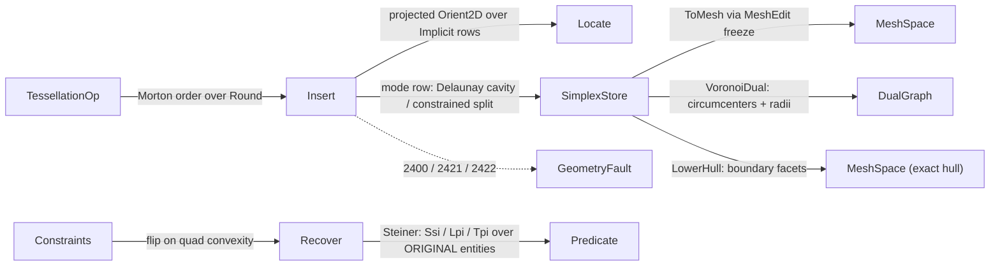

# [RASM_ARRANGEMENT_DELAUNAY]

`Rasm.Meshing` owns exact constrained Delaunay triangulation and tetrahedralization: one `Tessellation` `[Union]` built by one `Tessellation.Build` entry over one `SimplexStore` arena, every vertex carried by its defining entities through the `Implicit` row store so a constructed crossing keeps exact signs and rounds once, at the `ToMesh` emission seam. `TessellationPolicy.Mode` closes the two build regimes — `Delaunay` restores empty-circum by predicate-guarded flips, `Constrained` is the zero-in-circum exact-arrangement regime mandatory for implicit-bearing builds. One union over one store owns the whole insertion algebra, never a per-kind triangulator family.

`Implicit` rows are the exact vertex carrier, and every walk, cavity, flip, and recovery sign composes the `Predicate` family — both owned at `Numerics`, minted nowhere here. `SimplexStore` obeys the `Meshing/edit` arena contract, and `ToMesh` publishes through that arena's freeze: the one path from live build state to the hashable `MeshSpace` that `Spatial/reconciliation` `Encode` content-addresses. Failures route the band-2400 `GeometryFault` union. `VoronoiDual` and `LowerHull` serve the `Meshing/offset` medial substrate and the Fabrication envelope gate, this page holding the predicate-gated exact tier beside the `Spatial/cloud` host-kind hull rail, one anchor each side.

## [01]-[INDEX]

- [01]-[TESSELLATION]: one `Build(TessellationOp, Op?)` entry; `Tessellation` `[Union]` over one `SimplexStore` arena of `Implicit` rows; cavity-flood or split-insert by mode; constraint recovery with defining-entity Steiner re-anchoring; `ToMesh`/`Triangles`/`VoronoiDual`/`LowerHull` projections.
- [02]-[DENSITY_BAR]: one owner per axis-concern, each a case, row, or fold arm over the one store.

## [02]-[TESSELLATION]

- Owner: `Tessellation` `[Union]` (`Triangulation`/`Tetrahedralization`) mints the arrangement over one `SimplexStore` arena; `TessellationKind` is the dimensional discriminant, `TessellationPolicy` binds the `TessellationMode` regime with the flip, Steiner, and super-simplex budgets, and `Constraint` is the closed recovery input whose `Crossing` case carries a foreign supporting plane's original points.
- Cases: `Tessellation` 2, `TessellationOp` 3 (`Points`/`Insert`/`Recover`), `Constraint` 3 (`Segment`/`Facet`/`Crossing`), `TessellationKind` and `TessellationMode` 2 each; the fence carries every roster.
- Entry: one polymorphic `Build(TessellationOp, Op?)` discriminates `Points` (seed, Morton-order, insert, recover, strip), `Insert` (one incremental insertion), and `Recover` (force a constraint set) through the same one-row admission, so the interior never re-validates; no `BuildTriangulation`/`InsertVertex` sibling statics.
- Auto: `Points` seeds the scaled super-simplex, folds insertion over the Morton locality order, recovers each constraint, and strips super-incident simplices; the `TessellationMode` row selects per insertion — `Delaunay` floods the in-circum cavity over explicit-cornered simplices and cones it, `Constrained` split-inserts with zero in-circum references. Every interior query rides the vertex-anchored star walk, never a table scan. Recovery walks each missing edge, flips unconstrained crossings on quad convexity, and mints the exact Steiner over original entities (`Ssi`/`Lpi`/`Tpi` by root-carrier resolution) when the crossing is itself constrained, both sub-segments re-anchored on the root; 3D recovery is bistellar-only.
- Receipt: none on the build rail — the `Tessellation` value is the result and registers `IValidityEvidence`; the hash-eligible artifact is the frozen `MeshSpace` the `ToMesh` freeze publishes, never the live arena.
- Packages: `Rasm.Numerics` (the `Predicate` floor and `Implicit` carrier, the band-2400 `GeometryFault` union), `Rasm.Meshing` (the `MeshEdit` arena freeze and `MeshSpace`), `Rasm.Domain` (`Op` threading, `Context`, `ValidityClaim`), `Rhino.Geometry`, Thinktecture.Runtime.Extensions, LanguageExt.Core.
- Growth: a new tessellation modality is one `TessellationKind` or `TessellationMode` row and one fold arm over the same `SimplexStore`; a new constraint shape is one `Constraint` case and one `RecoverOne` arm; a new vertex-row construction is the `Numerics` predicate owner's `Implicit` case, this page widening by zero members.
- Boundary: the `Implicit` carrier keeps signs exact and rounds coordinates once at the emission seam; the depth-1 seal binds every constructed vertex — an implicit row references input points only, and a recovery split re-expresses over original entities through the `Constraint` carriage. An implicit-bearing `Delaunay` build faults at admission rather than coercing the mode. `Build` and the projections are total over the `Fin` rail; recovery splits a constraint within budget or faults typed with its index, never dropping it. Consumers reach this owner only through `Build` and the projections; `VoronoiDual` and `LowerHull` hold the predicate-gated exact envelope tier while `Spatial/cloud` owns the host and concave hull kinds.

```csharp signature
// --- [RUNTIME_PRELUDE] ----------------------------------------------------------------------
using System;
using System.Collections.Generic;
using System.Linq;
using LanguageExt;
using Rasm.Domain;
using Rasm.Numerics;
using Rhino.Geometry;
using Thinktecture;
using static LanguageExt.Prelude;
// CS0104 guard: LanguageExt.HashSet collides with the BCL name under the dual usings.
using IndexSet = System.Collections.Generic.HashSet<int>;

namespace Rasm.Meshing;

// --- [TYPES] ------------------------------------------------------------------------------
[SmartEnum<string>]
[KeyMemberEqualityComparer<ComparerAccessors.StringOrdinal, string>]
[KeyMemberComparer<ComparerAccessors.StringOrdinal, string>]
public sealed partial class TessellationKind {
    public static readonly TessellationKind Triangulation      = new("triangulation", simplexArity: 3);
    public static readonly TessellationKind Tetrahedralization = new("tetrahedralization", simplexArity: 4);

    public int SimplexArity { get; }
}

// Constrained is the zero-in-circum regime; implicit-bearing builds require it.
[SmartEnum<string>]
[KeyMemberEqualityComparer<ComparerAccessors.StringOrdinal, string>]
[KeyMemberComparer<ComparerAccessors.StringOrdinal, string>]
public sealed partial class TessellationMode {
    public static readonly TessellationMode Delaunay    = new("delaunay", restores: true);
    public static readonly TessellationMode Constrained = new("constrained", restores: false);

    public bool Restores { get; }
}

// --- [CONSTANTS] --------------------------------------------------------------------------
public sealed record TessellationPolicy(TessellationMode Mode, int MaxFlipPasses, int MaxRecoverySteiner, double SuperSimplexScale) : IValidityEvidence {
    public static readonly TessellationPolicy Canonical   = new(TessellationMode.Delaunay, MaxFlipPasses: 64, MaxRecoverySteiner: 1_024, SuperSimplexScale: 1e3);
    public static readonly TessellationPolicy Constrained = Canonical with { Mode = TessellationMode.Constrained };

    public bool IsValid => ValidityClaim.All(
        ValidityClaim.Positive(value: MaxFlipPasses),
        ValidityClaim.Positive(value: MaxRecoverySteiner),
        ValidityClaim.Positive(value: SuperSimplexScale));
}

// --- [MODELS] -----------------------------------------------------------------------------
// Single-writer arena under the Meshing/edit contract: the hybrid Implicit vertex table (explicit
// and defining-entity crossing rows in one carrier), arity-wide simplex vertex/neighbour columns,
// dead bitset, free list, doubling capacity.
public sealed class SimplexStore {
    Implicit[] rows;
    int[] vertices;
    int[] neighbours;
    int[] anchor;
    bool[] dead;
    readonly Stack<int> free = new();
    readonly int arity;
    int vertexCount, simplexCount, lastLive;

    internal SimplexStore(int arity, int capacity) {
        this.arity = arity;
        rows = new Implicit[capacity];
        vertices = new int[arity * capacity];
        neighbours = new int[arity * capacity];
        anchor = new int[capacity];
        dead = new bool[capacity];
    }

    public int Arity => arity;
    public int VertexCount => vertexCount;
    public int SimplexCount => simplexCount;
    public Implicit Row(int vertex) => rows[vertex];
    public bool Alive(int simplex) => simplex < simplexCount && !dead[simplex];
    public ReadOnlySpan<int> SimplexVertices(int simplex) => vertices.AsSpan(arity * simplex, arity);
    public int Neighbour(int simplex, int face) => neighbours[(arity * simplex) + face];
    public int LiveCount => Enumerable.Range(0, simplexCount).Count(Alive);

    internal int AddVertex(in Implicit row) {
        Grow(ref rows, vertexCount + 1);
        Grow(ref anchor, vertexCount + 1);
        rows[vertexCount] = row;
        anchor[vertexCount] = -1;
        return vertexCount++;
    }

    internal int Spawn(ReadOnlySpan<int> verts, ReadOnlySpan<int> nbrs) {
        int simplex = free.Count > 0 ? free.Pop() : simplexCount++;
        Grow(ref vertices, arity * (simplex + 1));
        Grow(ref neighbours, arity * (simplex + 1));
        Grow(ref dead, simplex + 1);
        verts.CopyTo(vertices.AsSpan(arity * simplex, arity));
        nbrs.CopyTo(neighbours.AsSpan(arity * simplex, arity));
        dead[simplex] = false;
        foreach (int v in verts) { anchor[v] = simplex; }
        return lastLive = simplex;
    }

    // One live incident simplex per vertex: Spawn stamps it, a stale stamp repairs by one scan and
    // re-caches, so the recovery inner loop's star walks stay O(star) amortized.
    public int Anchor(int vertex) {
        int s = anchor[vertex];
        if (s >= 0 && Alive(s) && SimplexVertices(s).Contains(vertex)) { return s; }
        for (int i = 0; i < simplexCount; i++) {
            if (!dead[i] && SimplexVertices(i).Contains(vertex)) { return anchor[vertex] = i; }
        }
        return -1;
    }

    internal void Kill(int simplex) { dead[simplex] = true; free.Push(simplex); }
    internal void Link(int simplex, int face, int neighbour) { neighbours[(arity * simplex) + face] = neighbour; }

    internal void LinkBack(int simplex, int toOld, int toNew) {
        if (simplex < 0) { return; }
        for (int f = 0; f < arity; f++) {
            if (neighbours[(arity * simplex) + f] == toOld) { neighbours[(arity * simplex) + f] = toNew; return; }
        }
    }

    internal int LastLive() {
        if (Alive(lastLive)) { return lastLive; }
        for (int s = simplexCount - 1; s >= 0; s--) {
            if (!dead[s]) { return lastLive = s; }
        }
        return -1;
    }

    static void Grow<T>(ref T[] column, int needed) {
        if (needed > column.Length) { Array.Resize(ref column, int.Max(needed, column.Length << 1)); }
    }
}

[Union(ConversionFromValue = ConversionOperatorsGeneration.None)]
public abstract partial record Constraint {
    private Constraint() { }

    public sealed record Segment(int A, int B) : Constraint;
    public sealed record Facet(int[] Boundary) : Constraint;

    // Crossing is the implicit-point case: a constrained segment tracing a FOREIGN supporting plane,
    // P/Q/R its ORIGINAL points, so a split re-anchors over input points (depth-1 sealed), never
    // over implicit endpoints.
    public sealed record Crossing(int A, int B, Point3d P, Point3d Q, Point3d R) : Constraint;

    public (int A, int B) Ends =>
        Switch(
            segment:  static s => (s.A, s.B),
            facet:    static f => (f.Boundary[0], f.Boundary[^1]),
            crossing: static c => (c.A, c.B));

    public Constraint Rebound(int a, int b) =>
        Switch(
            segment:  _ => (Constraint)new Segment(a, b),
            facet:    f => f with { },
            crossing: c => c with { A = a, B = b });
}

// Voronoi-dual projection carrier: circumcenters + circumradii (the clearance payload), dual
// edges, and the crossed DT edge per dual edge; node i names the same live triangle Triangles()[i].
public sealed record DualGraph(Point3d[] Circumcenters, double[] Radius, (int A, int B)[] Edges, (int U, int V)[] Across);

// --- [OPERATIONS] -------------------------------------------------------------------------
[Union(ConversionFromValue = ConversionOperatorsGeneration.None)]
public abstract partial record TessellationOp {
    private TessellationOp() { }

    // Support = the build plane's three ORIGINAL points (the Tpi witness a constraint x constraint
    // split needs); None for standalone planar builds whose constraints carry no foreign planes.
    public sealed record Points(
        TessellationKind Kind, Implicit[] Vertices, Seq<Constraint> Constraints,
        TessellationPolicy Policy, Axis Plane, Option<(Point3d P, Point3d Q, Point3d R)> Support = default) : TessellationOp;
    public sealed record Insert(Tessellation Into, Implicit Vertex) : TessellationOp;
    public sealed record Recover(Tessellation Into, Seq<Constraint> Constraints) : TessellationOp;
}

[Union(ConversionFromValue = ConversionOperatorsGeneration.None)]
public abstract partial record Tessellation : IValidityEvidence {
    private Tessellation() { }

    public sealed record Triangulation(SimplexStore Store, int SuperBase, Axis Plane, TessellationPolicy Policy, Option<(Point3d P, Point3d Q, Point3d R)> Support) : Tessellation;
    public sealed record Tetrahedralization(SimplexStore Store, int SuperBase, TessellationPolicy Policy) : Tessellation;

    public TessellationKind Kind =>
        Switch(triangulation: static _ => TessellationKind.Triangulation, tetrahedralization: static _ => TessellationKind.Tetrahedralization);

    public SimplexStore Store =>
        Switch(triangulation: static t => t.Store, tetrahedralization: static t => t.Store);

    int SuperBase =>
        Switch(triangulation: static t => t.SuperBase, tetrahedralization: static t => t.SuperBase);

    Axis Projection =>
        Switch(triangulation: static t => t.Plane, tetrahedralization: static _ => Axis.Z);

    TessellationPolicy Policy =>
        Switch(triangulation: static t => t.Policy, tetrahedralization: static t => t.Policy);

    public bool IsValid => ValidityClaim.All(
        ValidityClaim.CountAtLeast(count: Store.LiveCount, floor: 1),
        ValidityClaim.CountAtLeast(count: Store.VertexCount, floor: Kind.SimplexArity));

    // --- [BUILD]
    // Input rows occupy slots [0, n) — a Constraint's vertex ids ARE input indices; super rows sit
    // at the tail [SuperBase, SuperBase + arity). Morton permutes the insertion SEQUENCE, not ids.
    public static Fin<Tessellation> Build(TessellationOp op, Op? key = null) =>
        op.Switch(
            points: static p => Admit(p).Bind(static admitted => Seeded(admitted)
                .Bind(seed => Delaunay.InsertionOrder(admitted.Vertices).Fold(
                    Fin.Succ(seed), (acc, v) => acc.Bind(t => t.InsertRow(v).Map(_ => t))))
                .Bind(filled => admitted.Constraints.Map(static (c, i) => (Index: i, Row: c))
                    .Fold(Fin.Succ(filled), (acc, c) => acc.Bind(t => t.RecoverOne(c.Row, c.Index))))
                .Bind(static done => done.Restore())
                .Bind(static done => done.Stripped())),
            insert: static i => i.Into.AdmitRow(i.Vertex)
                .Bind(row => i.Into.InsertRow(i.Into.Store.AddVertex(in row)))
                .Map(_ => i.Into),
            recover: static r => r.Constraints.Map(static (c, i) => (Index: i, Row: c))
                .Fold(r.Into.AdmitIds(r.Constraints), (acc, c) => acc.Bind(t => t.RecoverOne(c.Row, c.Index))));

    static Fin<TessellationOp.Points> Admit(TessellationOp.Points p) {
        if (p.Vertices.Length == 0) { return Reject(0, "empty vertex set"); }
        Dictionary<Point3d, int> seen = new(p.Vertices.Length);
        for (int i = 0; i < p.Vertices.Length; i++) {
            if (!p.Vertices[i].IsExplicit) { continue; }
            Point3d at = p.Vertices[i].AsExplicit;
            if (!ValidityClaim.Finite(point: at)) { return Reject(i, "non-finite explicit row"); }
            if (!seen.TryAdd(at, i)) { return Reject(i, "bit-identical duplicate row"); }  // a coincident vertex degenerates every split that touches it
        }
        foreach ((Constraint row, int index) in p.Constraints.Map(static (c, i) => (c, i))) {
            // Facet shape gates run BEFORE Ends indexes Boundary, so a short or duplicated-vertex
            // ring fails typed here rather than throwing.
            bool broken = row is Constraint.Facet facet
                ? facet.Boundary.Length < 3 || facet.Boundary.Distinct().Count() != facet.Boundary.Length
                    || facet.Boundary.Any(v => v < 0 || v >= p.Vertices.Length)
                : row.Ends is (int a, int b) && (a == b || a < 0 || b < 0 || a >= p.Vertices.Length || b >= p.Vertices.Length);
            if (broken) { return Reject(index, "degenerate or out-of-table constraint"); }
        }
        bool implicitBearing = p.Vertices.Any(static v => !v.IsExplicit);
        return implicitBearing && p.Policy.Mode == TessellationMode.Delaunay ? Reject(0, "implicit rows demand constrained mode")
            : implicitBearing && p.Kind == TessellationKind.Tetrahedralization ? Reject(0, "3D implicit rows are CDTet-gated growth")
            : Fin.Succ(p);

        static Fin<TessellationOp.Points> Reject(int index, string witness) =>
            Fin.Fail<TessellationOp.Points>(new GeometryFault.DegenerateInput(Rasm.Domain.Kind.Point, index, witness).ToError());
    }

    // Insert-modality admission mirrors Admit one row at a time: the interior never re-validates (the
    // tetrahedral walk reads AsExplicit), and a coincident row degenerates every split touching it.
    Fin<Implicit> AdmitRow(Implicit vertex) =>
        vertex.IsExplicit && !ValidityClaim.Finite(point: vertex.AsExplicit)
            ? RejectRow("non-finite explicit row")
            : vertex.IsExplicit && Enumerable.Range(0, Store.VertexCount).Any(v => Store.Row(v).IsExplicit && Store.Row(v).AsExplicit == vertex.AsExplicit)
                ? RejectRow("bit-identical duplicate row")
                : !vertex.IsExplicit && Policy.Mode == TessellationMode.Delaunay
                    ? RejectRow("implicit rows demand constrained mode")
                    : !vertex.IsExplicit && Kind == TessellationKind.Tetrahedralization
                        ? RejectRow("3D implicit rows are CDTet-gated growth")
                        : Fin.Succ(vertex);

    Fin<Implicit> RejectRow(string witness) =>
        Fin.Fail<Implicit>(new GeometryFault.DegenerateInput(Rasm.Domain.Kind.Point, Store.VertexCount, witness).ToError());

    // Recover-modality admission: constraint ids must address the live vertex table; the Facet
    // shape gates mirror Admit and run before Ends indexes the boundary.
    Fin<Tessellation> AdmitIds(Seq<Constraint> constraints) {
        foreach ((Constraint row, int index) in constraints.Map(static (c, i) => (c, i))) {
            bool broken = row is Constraint.Facet facet
                ? facet.Boundary.Length < 3 || facet.Boundary.Distinct().Count() != facet.Boundary.Length
                    || facet.Boundary.Any(v => v < 0 || v >= Store.VertexCount)
                : row.Ends is (int a, int b) && (a == b || a < 0 || b < 0 || a >= Store.VertexCount || b >= Store.VertexCount);
            if (broken) { return Fin.Fail<Tessellation>(new GeometryFault.DegenerateInput(Rasm.Domain.Kind.Point, index, "degenerate or out-of-table constraint").ToError()); }
        }
        return Fin.Succ(this);
    }

    // --- [INSERT]
    Fin<int> InsertRow(int vertex) =>
        Locate(vertex).Bind(at => Policy.Mode.Restores && Restorable(at)
            ? CavityInsert(at, vertex)
            : SplitInsert(at, vertex));

    // Delaunay restoration needs the in-circum family's EXPLICIT corners: 3 (2D)/4 (3D) explicit vs an explicit-or-constructed query.
    bool Restorable(int simplex) {
        ReadOnlySpan<int> vs = Store.SimplexVertices(simplex);
        for (int i = 0; i < vs.Length; i++) {
            if (!Store.Row(vs[i]).IsExplicit) { return false; }
        }
        return true;
    }

    // --- [LOCATE]
    Fin<int> Locate(int query) {
        int current = Store.LastLive();
        Implicit q = Store.Row(query);
        for (int step = 0; step <= Store.SimplexCount; step++) {
            int exit = ExitFace(current, in q);
            if (exit < 0) { return Fin.Succ(current); }
            int next = Store.Neighbour(current, exit);
            if (next < 0) { return Fin.Fail<int>(new GeometryFault.DegenerateTessellation(current, "locate walked off the hull").ToError()); }
            current = next;
        }
        return Fin.Fail<int>(new GeometryFault.DegenerateTessellation(current, "locate walk overran the live count").ToError());
    }

    // Tetrahedral tests are APEX-RELATIVE: the cyclic face triple flips parity with f, so a fixed
    // sign is wrong on half the faces — a query exits face f when it lies strictly opposite the
    // apex vs[f]; 2D triangle rows are CCW by construction.
    int ExitFace(int simplex, in Implicit query) {
        ReadOnlySpan<int> vs = Store.SimplexVertices(simplex);
        int arity = Kind.SimplexArity;
        for (int f = 0; f < arity; f++) {
            Sign side;
            if (arity == 3) {
                side = Predicate.Orient2D(Store.Row(vs[(f + 1) % 3]), Store.Row(vs[(f + 2) % 3]), query, Projection);
            }
            else {
                (Point3d u1, Point3d u2, Point3d u3) = (Store.Row(vs[(f + 1) & 3]).AsExplicit, Store.Row(vs[(f + 2) & 3]).AsExplicit, Store.Row(vs[(f + 3) & 3]).AsExplicit);
                side = Predicate.Orient3D(u1, u2, u3, query.AsExplicit).Times(Predicate.Orient3D(u1, u2, u3, Store.Row(vs[f]).AsExplicit));
            }
            if (side == Sign.Negative) { return f; }
        }
        return -1;
    }

    // --- [CAVITY]
    // Membership commits at PUSH — deciding at pop lets a face toward a pending neighbour enter the
    // star spuriously and cone into the cavity interior.
    Fin<int> CavityInsert(int seed, int query) {
        IndexSet cavity = [seed];
        List<(int Simplex, int Face)> star = new();
        Stack<int> stack = new();
        stack.Push(seed);
        Implicit q = Store.Row(query);
        while (stack.Count > 0) {
            int s = stack.Pop();
            for (int f = 0; f < Kind.SimplexArity; f++) {
                int neighbour = Store.Neighbour(s, f);
                if (cavity.Contains(neighbour) && neighbour >= 0) { continue; }
                if (neighbour >= 0 && Restorable(neighbour) && InCircum(neighbour, in q) == Sign.Positive) {
                    cavity.Add(neighbour);
                    stack.Push(neighbour);
                }
                else { star.Add((s, f)); }
            }
        }
        return star.Count == 0
            ? Fin.Fail<int>(new GeometryFault.DegenerateTessellation(seed, "empty cavity star").ToError())
            : Fin.Succ(Cone(cavity, star, query));
    }

    Sign InCircum(int simplex, in Implicit query) {
        ReadOnlySpan<int> vs = Store.SimplexVertices(simplex);
        return Kind.SimplexArity == 3
            ? Predicate.InCircle(Store.Row(vs[0]).AsExplicit, Store.Row(vs[1]).AsExplicit, Store.Row(vs[2]).AsExplicit, in query, Projection)
            : Predicate.InSphere(Store.Row(vs[0]).AsExplicit, Store.Row(vs[1]).AsExplicit, Store.Row(vs[2]).AsExplicit, Store.Row(vs[3]).AsExplicit, in query);
    }

    // Cone the cavity-boundary star to the vertex: one new simplex per star face, outward neighbour
    // through LinkBack, siblings resolved by the shared-subface dictionary.
    int Cone(IndexSet cavity, List<(int Simplex, int Face)> star, int query) {
        int arity = Kind.SimplexArity;
        Dictionary<(int, int, int), (int Simplex, int Face)> bySubface = new();
        Span<int> verts = stackalloc int[arity];
        Span<int> nbrs = stackalloc int[arity];
        int seeded = -1;
        foreach ((int s, int f) in star) {
            ReadOnlySpan<int> vs = Store.SimplexVertices(s);
            verts[0] = query;
            for (int i = 1; i < arity; i++) { verts[i] = vs[(f + i) % arity]; }
            int outward = Store.Neighbour(s, f);
            nbrs[0] = outward;
            for (int i = 1; i < arity; i++) { nbrs[i] = -1; }
            int born = Store.Spawn(verts, nbrs);
            Store.LinkBack(outward, s, born);
            for (int i = 1; i < arity; i++) {
                (int, int, int) faceKey = SubfaceKey(verts, i, arity);
                if (bySubface.Remove(faceKey, out (int Simplex, int Face) other)) {
                    Store.Link(born, i, other.Simplex);
                    Store.Link(other.Simplex, other.Face, born);
                }
                else { bySubface[faceKey] = (born, i); }
            }
            seeded = born;
        }
        foreach (int s in cavity) { Store.Kill(s); }
        return seeded;

        static (int, int, int) SubfaceKey(ReadOnlySpan<int> verts, int face, int arity) {
            Span<int> rest = stackalloc int[3];
            int n = 0;
            for (int i = 0; i < arity; i++) {
                if (i != face) { rest[n++] = verts[i]; }
            }
            rest[..n].Sort();
            return (rest[0], n > 1 ? rest[1] : -1, n > 2 ? rest[2] : -1);
        }
    }

    // Zero-in-circum split-insertion (constrained regime): interior 1->3; a query exactly on a face
    // (projected orientation Zero) splits both incident simplices 2->4, or 1->2 on a hull edge whose
    // collinear face never cones (a coned collinear star face is a zero-area triangle).
    Fin<int> SplitInsert(int at, int query) {
        ReadOnlySpan<int> vs = Store.SimplexVertices(at);
        Implicit q = Store.Row(query);
        int onFace = -1;
        if (Kind.SimplexArity == 3) {
            for (int f = 0; f < 3; f++) {
                if (Predicate.Orient2D(Store.Row(vs[(f + 1) % 3]), Store.Row(vs[(f + 2) % 3]), q, Projection) == Sign.Zero) { onFace = f; break; }
            }
        }
        else {
            for (int f = 0; f < 4; f++) {
                (Point3d u1, Point3d u2, Point3d u3) = (Store.Row(vs[(f + 1) & 3]).AsExplicit, Store.Row(vs[(f + 2) & 3]).AsExplicit, Store.Row(vs[(f + 3) & 3]).AsExplicit);
                if (Predicate.Orient3D(u1, u2, u3, q.AsExplicit) == Sign.Zero) {
                    // A silent 1->4 here mints a zero-volume tet; the 2->6 on-face split is deferred.
                    return Fin.Fail<int>(new GeometryFault.DegenerateTessellation(at, "on-face 3D split is CDTet-gated growth").ToError());
                }
            }
        }
        List<(int Simplex, int Face)> star = new();
        IndexSet cavity = new() { at };
        if (onFace >= 0 && Store.Neighbour(at, onFace) is int twin and >= 0) { cavity.Add(twin); }
        foreach (int s in cavity) {
            for (int f = 0; f < Kind.SimplexArity; f++) {
                int n = Store.Neighbour(s, f);
                if (s == at && f == onFace && n < 0) { continue; }  // hull on-edge: the collinear face dies unconed — 1->2
                if (!cavity.Contains(n) || n < 0) { star.Add((s, f)); }
            }
        }
        return Fin.Succ(Cone(cavity, star, query));
    }

    // --- [RECOVER]
    // Walk the missing constraint edge: flip crossing unconstrained diagonals on quad convexity,
    // mint the exact Steiner over ORIGINAL entities when the crossing edge is itself constrained,
    // and re-anchor both sub-segments on the parent carrier.
    Fin<Tessellation> RecoverOne(Constraint constraint, int index) {
        if (constraint is Constraint.Facet facet) { return RecoverFacet(facet, index); }
        if (Kind == TessellationKind.Tetrahedralization) { return RecoverEdge3D(constraint, index); }  // 2D diagonal flips corrupt a tet store
        Queue<(Constraint Edge, Constraint Root)> queue = new();
        queue.Enqueue((constraint, constraint));
        int budget = Policy.MaxRecoverySteiner;
        while (queue.Count > 0) {
            (Constraint edge, Constraint root) = queue.Dequeue();
            (int a, int b) = edge.Ends;
            int guard = Policy.MaxFlipPasses * int.Max(Store.SimplexCount, 1);
            while (!EdgePresent(a, b)) {
                if (guard-- <= 0) { return Fin.Fail<Tessellation>(new GeometryFault.ConstraintUnrecoverable(index, Policy.MaxRecoverySteiner).ToError()); }
                Option<(int P, int Q, bool Constrained)> crossing = FirstCrossing(a, b);
                if (crossing.Case is not ((int p, int q, bool pinned))) {
                    // No straddling edge: the obstruction is a VERTEX exactly on (a,b), a grid
                    // T-junction, so the constraint splits AT it with no Steiner minted.
                    if (OnSegment(a, b).Case is int through) {
                        queue.Enqueue((edge.Rebound(a, through), root));
                        queue.Enqueue((edge.Rebound(through, b), root));
                        break;
                    }
                    return Fin.Fail<Tessellation>(new GeometryFault.DegenerateTessellation(Store.LastLive(), "constraint walk found no crossing").ToError());
                }
                if (!pinned && FlipDiagonal(p, q)) { continue; }
                if (budget-- <= 0) { return Fin.Fail<Tessellation>(new GeometryFault.ConstraintUnrecoverable(index, Policy.MaxRecoverySteiner).ToError()); }
                // Thread the VERTEX id through the insert (InsertRow returns the seeded SIMPLEX, a
                // mis-key if re-anchored on). Halves carry the ROOT, so a twice-split segment still
                // spells its Steiner over input points.
                Fin<int> steiner = SteinerOf(root, p, q, index).Map(row => Store.AddVertex(in row)).Bind(v => InsertRow(v).Map(_ => v));
                if (steiner.Case is not int w) { return steiner.Map(_ => (Tessellation)this); }
                queue.Enqueue((edge.Rebound(a, w), root));
                queue.Enqueue((edge.Rebound(w, b), root));
                break;
            }
            if (EdgePresent(a, b)) { Pin(a, b, root); }  // pin the ROOT — a later crossing reads this edge's ORIGINAL carriage
        }
        return Fin.Succ(this);
    }

    // First link vertex lying EXACTLY on segment (a,b), strictly between its ends: collinearity by
    // projected orientation, betweenness by Compare on a separating axis — a through-vertex
    // obstruction FirstCrossing's strict straddle cannot see.
    Option<int> OnSegment(int a, int b) {
        (Implicit ra, Implicit rb) = (Store.Row(a), Store.Row(b));
        Axis u = Ordinal(Projection.U);
        Axis extent = Predicate.Compare(in ra, in rb, u) != Sign.Zero ? u : Ordinal(Projection.V);
        foreach (int s in Star(a)) {
            foreach (int w in Store.SimplexVertices(s)) {
                if (w == a || w == b) { continue; }
                Implicit rw = Store.Row(w);
                if (Predicate.Orient2D(in ra, in rb, in rw, Projection) != Sign.Zero) { continue; }
                if (Predicate.Compare(in rw, in ra, extent).Times(Predicate.Compare(in rw, in rb, extent)) == Sign.Negative) { return Some(w); }
            }
        }
        return None;
    }

    // Exact Steiner over ORIGINAL entities, depth-1 by carrier resolution: each side spells as an
    // explicit input-point pair (Segment root) or a carried foreign plane (Crossing root) — pair x
    // pair = Ssi, pair x plane = Lpi, plane x plane x Support = Tpi. A side with neither spelling is
    // UNANCHORABLE and faults, since a rounded re-anchor breaks the depth-1 law.
    Fin<Implicit> SteinerOf(Constraint root, int p, int q, int index) {
        (Implicit rp, Implicit rq) = (Store.Row(p), Store.Row(q));
        ((Point3d A, Point3d B)? Pair, (Point3d P, Point3d Q, Point3d R)? Plane) own = CarrierOf(root);
        ((Point3d A, Point3d B)? Pair, (Point3d P, Point3d Q, Point3d R)? Plane) cross =
            ConstraintOf(p, q) is Constraint pinnedRoot ? CarrierOf(pinnedRoot)
            : rp.IsExplicit && rq.IsExplicit ? ((rp.AsExplicit, rq.AsExplicit), null)
            : (null, null);
        return (own.Pair, own.Plane, cross.Pair, cross.Plane) switch {
            ({ } sa, _, { } sb, _) => Fin.Succ<Implicit>(new Ssi(sa.A, sa.B, sb.A, sb.B, Projection)),
            ({ } sa, _, _, { } tp) => Fin.Succ<Implicit>(new Lpi(sa.A, sa.B, tp.P, tp.Q, tp.R)),
            (_, { } op, { } sb, _) => Fin.Succ<Implicit>(new Lpi(sb.A, sb.B, op.P, op.Q, op.R)),
            (_, { } op, _, { } tp) when SupportWitness().Case is ((Point3d sp, Point3d sq, Point3d sr)) =>
                Fin.Succ<Implicit>(new Tpi(sp, sq, sr, op.P, op.Q, op.R, tp.P, tp.Q, tp.R)),
            _ => Fin.Fail<Implicit>(new GeometryFault.ConstraintUnrecoverable(index, Policy.MaxRecoverySteiner).ToError()),
        };
    }

    // One side's original-entity spelling: a Crossing carries its foreign plane, a Segment with
    // explicit input rows the point pair; anything else has no depth-1 spelling.
    ((Point3d A, Point3d B)? Pair, (Point3d P, Point3d Q, Point3d R)? Plane) CarrierOf(Constraint root) =>
        root switch {
            Constraint.Crossing c => (null, (c.P, c.Q, c.R)),
            Constraint.Segment s when Store.Row(s.A).IsExplicit && Store.Row(s.B).IsExplicit =>
                ((Store.Row(s.A).AsExplicit, Store.Row(s.B).AsExplicit), null),
            _ => (null, null),
        };

    Option<(Point3d P, Point3d Q, Point3d R)> SupportWitness() =>
        Switch(triangulation: static t => t.Support, tetrahedralization: static _ => None);

    // --- [STORE_OPS]
    // Input rows first (ids = input indices); super rows at the tail from SuperBase = n.
    static Fin<Tessellation> Seeded(TessellationOp.Points p) {
        int arity = p.Kind.SimplexArity;
        SimplexStore store = new(arity, int.Max(2 * p.Vertices.Length + arity, 16));
        foreach (Implicit row in p.Vertices) { store.AddVertex(in row); }
        BoundingBox box = new(p.Vertices.Select(static v => v.Round()));
        double r = p.Policy.SuperSimplexScale * double.Max(box.Diagonal.Length, 1.0);
        Point3d c = box.Center;
        Span<int> super = stackalloc int[arity];
        if (arity == 3) {
            (int u, int v) = (p.Plane.U, p.Plane.V);
            super[0] = store.AddVertex(Planar(c, u, v, -3.0 * r, -r));
            super[1] = store.AddVertex(Planar(c, u, v, 3.0 * r, -r));
            super[2] = store.AddVertex(Planar(c, u, v, 0.0, 3.0 * r));
        }
        else {
            super[0] = store.AddVertex(new Implicit(new Point3d(c.X - (3.0 * r), c.Y - r, c.Z - r)));
            super[1] = store.AddVertex(new Implicit(new Point3d(c.X + (3.0 * r), c.Y - r, c.Z - r)));
            super[2] = store.AddVertex(new Implicit(new Point3d(c.X, c.Y + (3.0 * r), c.Z - r)));
            super[3] = store.AddVertex(new Implicit(new Point3d(c.X, c.Y, c.Z + (3.0 * r))));
        }
        Span<int> hull = stackalloc int[arity];
        hull.Fill(-1);
        store.Spawn(super, hull);
        int superBase = p.Vertices.Length;
        return Fin.Succ(p.Kind == TessellationKind.Triangulation
            ? new Triangulation(store, superBase, p.Plane, p.Policy, p.Support)
            : new Tetrahedralization(store, superBase, p.Policy));

        static Implicit Planar(Point3d c, int u, int v, double du, double dv) {
            Span<double> at = [c.X, c.Y, c.Z];
            at[u] += du;
            at[v] += dv;
            return new Implicit(new Point3d(at[0], at[1], at[2]));
        }
    }

    // Star walk: flood the live simplices sharing a vertex through neighbour links from its anchored
    // simplex — O(star), never a table scan; the recovery inner loop rides this.
    IEnumerable<int> Star(int vertex) {
        int seed = Store.Anchor(vertex);
        if (seed < 0) { yield break; }
        IndexSet seen = new() { seed };
        Stack<int> stack = new();
        stack.Push(seed);
        while (stack.Count > 0) {
            int s = stack.Pop();
            yield return s;
            for (int f = 0; f < Kind.SimplexArity; f++) {
                int n = Store.Neighbour(s, f);
                if (n >= 0 && Store.Alive(n) && Store.SimplexVertices(n).Contains(vertex) && seen.Add(n)) { stack.Push(n); }
            }
        }
    }

    bool EdgePresent(int a, int b) {
        foreach (int s in Star(a)) {
            if (Store.SimplexVertices(s).Contains(b)) { return true; }
        }
        return false;
    }

    // Corridor's first crossing: among a's star triangles, the edge OPPOSITE a strictly straddled
    // by (a,b) — the walk re-runs after every flip or split, advancing one exact decision at a time.
    Option<(int P, int Q, bool Constrained)> FirstCrossing(int a, int b) {
        (Implicit ra, Implicit rb) = (Store.Row(a), Store.Row(b));
        foreach (int s in Star(a)) {
            ReadOnlySpan<int> vs = Store.SimplexVertices(s);
            for (int f = 0; f < 3; f++) {
                (int p, int q) = (vs[(f + 1) % 3], vs[(f + 2) % 3]);
                if (p == a || p == b || q == a || q == b) { continue; }
                (Implicit rp, Implicit rq) = (Store.Row(p), Store.Row(q));
                bool straddles =
                    Predicate.Orient2D(ra, rb, rp, Projection).Times(Predicate.Orient2D(ra, rb, rq, Projection)) == Sign.Negative
                    && Predicate.Orient2D(rp, rq, ra, Projection).Times(Predicate.Orient2D(rp, rq, rb, Projection)) == Sign.Negative;
                if (straddles) { return Some((p, q, IsPinned(p, q))); }
            }
        }
        return None;
    }

    // One SimplexFlip serves recovery and restoration: flip diagonal (p,q) of the quad formed by its
    // two incident triangles iff the quad is convex (four exact orientation signs).
    bool FlipDiagonal(int p, int q) {
        Option<(int S, int T, int Sp, int Tp)> pair = IncidentPair(p, q);
        if (pair.Case is not ((int s, int t, int apexS, int apexT))) { return false; }
        (Implicit rp, Implicit rq, Implicit rs, Implicit rt) = (Store.Row(p), Store.Row(q), Store.Row(apexS), Store.Row(apexT));
        bool convex =
            Predicate.Orient2D(rs, rt, rp, Projection).Times(Predicate.Orient2D(rs, rt, rq, Projection)) == Sign.Negative
            && Predicate.Orient2D(rp, rq, rs, Projection).Times(Predicate.Orient2D(rp, rq, rt, Projection)) == Sign.Negative;
        if (!convex) { return false; }
        RewireFlip(s, t, p, q, apexS, apexT);
        return true;
    }

    // --- [RESTORE]
    // Delaunay-mode terminal pass: flip non-pinned explicit-cornered edges failing empty-circum,
    // bounded by MaxFlipPasses; the constrained regime returns immediately. 2D only — the 3D
    // Delaunay property rides the cavity insertion itself.
    Fin<Tessellation> Restore() {
        if (!Policy.Mode.Restores || Kind.SimplexArity != 3) { return Fin.Succ(this); }
        for (int pass = 0; pass < Policy.MaxFlipPasses; pass++) {
            bool flipped = false;
            for (int s = 0; s < Store.SimplexCount; s++) {
                if (!Store.Alive(s)) { continue; }
                ReadOnlySpan<int> vs = Store.SimplexVertices(s);
                for (int f = 0; f < 3; f++) {
                    (int p, int q) = (vs[(f + 1) % 3], vs[(f + 2) % 3]);
                    int twin = Store.Neighbour(s, f);
                    if (twin < 0 || IsPinned(p, q) || !Restorable(s) || !Restorable(twin)) { continue; }
                    int apex = Apex(twin, p, q);
                    Implicit qr = Store.Row(apex);
                    if (InCircum(s, in qr) == Sign.Positive && FlipDiagonal(p, q)) { flipped = true; break; }
                }
            }
            if (!flipped) { return Fin.Succ(this); }
        }
        return Fin.Succ(this);
    }

    // Strip, then the degenerate gate: a set whose every simplex touches the super frame (collinear,
    // or coplanar in 3D) leaves nothing live and faults typed, never an empty success.
    Fin<Tessellation> Stripped() {
        int arity = Kind.SimplexArity;
        for (int s = 0; s < Store.SimplexCount; s++) {
            if (!Store.Alive(s)) { continue; }
            ReadOnlySpan<int> vs = Store.SimplexVertices(s);
            for (int i = 0; i < arity; i++) {
                if (vs[i] >= SuperBase && vs[i] < SuperBase + arity) {
                    for (int f = 0; f < arity; f++) { Store.LinkBack(Store.Neighbour(s, f), s, -1); }
                    Store.Kill(s);
                    break;
                }
            }
        }
        return Store.LiveCount == 0
            ? Fin.Fail<Tessellation>(new GeometryFault.DegenerateInput(Rasm.Domain.Kind.Point, 0, "fully degenerate set: no simplex survives the super strip").ToError())
            : Fin.Succ(this);
    }

    // --- [PROJECTIONS]
    // Emission seam: implicit rows Round() HERE, the arena freeze re-admits. Tetra boundary faces
    // wind OUTWARD by the exact apex sign — the cyclic triple flips parity with the face index, so
    // a fixed winding is inward on half the faces.
    public Fin<MeshSpace> ToMesh(Context context, Op? key = null) {
        using MeshEdit edit = MeshEdit.Of([], []);
        Dictionary<int, int> slot = new();
        int Emit(int v) => slot.TryGetValue(v, out int at) ? at : slot[v] = edit.AddVertex(Store.Row(v).Round());
        int arity = Kind.SimplexArity;
        for (int s = 0; s < Store.SimplexCount; s++) {
            if (!Store.Alive(s)) { continue; }
            ReadOnlySpan<int> vs = Store.SimplexVertices(s);
            if (arity == 3) { edit.AddFace(Emit(vs[0]), Emit(vs[1]), Emit(vs[2])); continue; }
            for (int f = 0; f < 4; f++) {
                if (Store.Neighbour(s, f) < 0) { EmitOutward(edit, Emit, vs, f); }
            }
        }
        return edit.ToSpace(context, key);
    }

    void EmitOutward(MeshEdit edit, Func<int, int> emit, ReadOnlySpan<int> vs, int f) {
        (int a, int b, int c) = (vs[(f + 1) & 3], vs[(f + 2) & 3], vs[(f + 3) & 3]);
        bool flip = Predicate.Orient3D(Store.Row(a).AsExplicit, Store.Row(b).AsExplicit, Store.Row(c).AsExplicit, Store.Row(vs[f]).AsExplicit) == Sign.Positive;
        if (flip) { edit.AddFace(emit(a), emit(c), emit(b)); }
        else { edit.AddFace(emit(a), emit(b), emit(c)); }
    }

    // Lightweight sub-triangle emission (the arrangement per-face readback, the overlay
    // classification set): rows Round() HERE, and live-simplex order is THE index law —
    // Triangles()[i] and VoronoiDual node i name the same live triangle.
    public Fin<(Point3d A, Point3d B, Point3d C)[]> Triangles(Op? key = null) {
        if (Kind != TessellationKind.Triangulation) { return Fin.Fail<(Point3d, Point3d, Point3d)[]>(new GeometryFault.DegenerateTessellation(0, "triangle projection on a tetrahedralization").ToError()); }
        List<(Point3d, Point3d, Point3d)> tris = new();
        for (int s = 0; s < Store.SimplexCount; s++) {
            if (!Store.Alive(s)) { continue; }
            ReadOnlySpan<int> vs = Store.SimplexVertices(s);
            tris.Add((Store.Row(vs[0]).Round(), Store.Row(vs[1]).Round(), Store.Row(vs[2]).Round()));
        }
        return Fin.Succ(tris.ToArray());
    }

    // Exact DT adjacency; circumcenters + circumradii materialize at THIS emission seam. The medial
    // input is all-explicit, so the dual lands unconditionally; node order = the Triangles() live
    // order.
    public Fin<DualGraph> VoronoiDual(Op? key = null) {
        if (Kind != TessellationKind.Triangulation) { return Fin.Fail<DualGraph>(new GeometryFault.DegenerateTessellation(0, "dual is a triangulation projection").ToError()); }
        int[] live = Enumerable.Range(0, Store.SimplexCount).Where(Store.Alive).ToArray();
        Dictionary<int, int> dualOf = live.Index().ToDictionary(static r => r.Item, static r => r.Index);
        Point3d[] centers = new Point3d[live.Length];
        double[] radius = new double[live.Length];
        for (int i = 0; i < live.Length; i++) {
            ReadOnlySpan<int> vs = Store.SimplexVertices(live[i]);
            if (!Store.Row(vs[0]).IsExplicit || !Store.Row(vs[1]).IsExplicit || !Store.Row(vs[2]).IsExplicit) {
                return Fin.Fail<DualGraph>(new GeometryFault.DegenerateTessellation(live[i], "implicit-bearing dual").ToError());
            }
            (centers[i], radius[i]) = Circumcircle(Store.Row(vs[0]).AsExplicit, Store.Row(vs[1]).AsExplicit, Store.Row(vs[2]).AsExplicit, Projection);
            if (!ValidityClaim.Finite(point: centers[i])) {  // a collinear live triangle has no circumcircle — a NaN centre would poison the medial
                return Fin.Fail<DualGraph>(new GeometryFault.DegenerateTessellation(live[i], "degenerate circumcircle").ToError());
            }
        }
        List<(int A, int B)> edges = new();
        List<(int U, int V)> across = new();
        foreach (int s in live) {
            ReadOnlySpan<int> vs = Store.SimplexVertices(s);
            for (int f = 0; f < 3; f++) {
                int twin = Store.Neighbour(s, f);
                if (twin > s && Store.Alive(twin)) {
                    edges.Add((dualOf[s], dualOf[twin]));
                    across.Add((vs[(f + 1) % 3], vs[(f + 2) % 3]));
                }
            }
        }
        return Fin.Succ(new DualGraph(centers, radius, [.. edges], [.. across]));
    }

    // Paraboloid-lift equivalence: the Delaunay complex IS the lower hull of the lift, so the live
    // boundary facets ARE the predicate-exact convex hull. TETRAHEDRAL only — a triangulation's
    // hull is a boundary edge chain, not a face set, so its mesh spelling refuses typed; the tetra
    // ToMesh emission IS the boundary-facet fold, gated here.
    public Fin<MeshSpace> LowerHull(Context context, Op? key = null) =>
        Kind == TessellationKind.Tetrahedralization
            ? ToMesh(context, key)
            : Fin.Fail<MeshSpace>(new GeometryFault.DegenerateTessellation(0, "hull facets are a tetrahedralization projection").ToError());

    // --- [PRIVATE_KERNELS]
    // Pinned edges carry their Constraint so a later constraint x constraint split reads the
    // crossing edge's OWN carriage — the Tpi/Lpi re-anchor source.
    readonly Dictionary<(int, int), Constraint> pinned = [];
    void Pin(int a, int b, Constraint edge) => pinned[(int.Min(a, b), int.Max(a, b))] = edge;
    bool IsPinned(int a, int b) => pinned.ContainsKey((int.Min(a, b), int.Max(a, b)));
    Constraint? ConstraintOf(int p, int q) => pinned.TryGetValue((int.Min(p, q), int.Max(p, q)), out Constraint? c) ? c : null;

    Option<(int S, int T, int Sp, int Tp)> IncidentPair(int p, int q) {
        (int s, int t) = (-1, -1);
        foreach (int i in Star(p)) {
            if (!Store.SimplexVertices(i).Contains(q)) { continue; }
            if (s < 0) { s = i; }
            else { t = i; break; }
        }
        return s >= 0 && t >= 0 ? Some((s, t, Apex(s, p, q), Apex(t, p, q))) : None;
    }

    int Apex(int simplex, int p, int q) {
        ReadOnlySpan<int> vs = Store.SimplexVertices(simplex);
        for (int i = 0; i < vs.Length; i++) {
            if (vs[i] != p && vs[i] != q) { return vs[i]; }
        }
        return -1;
    }

    // Face i of [v0,v1,v2] is the edge opposite v[i]. The quad's four OUTWARD neighbours are the
    // two non-shared faces of each dying triangle; the shared (p,q) face dies with them.
    void RewireFlip(int s, int t, int p, int q, int apexS, int apexT) {
        (int sOppP, int sOppQ) = (Store.Neighbour(s, IndexOf(s, p)), Store.Neighbour(s, IndexOf(s, q)));
        (int tOppP, int tOppQ) = (Store.Neighbour(t, IndexOf(t, p)), Store.Neighbour(t, IndexOf(t, q)));
        Store.Kill(s);
        Store.Kill(t);
        Span<int> va = [apexS, apexT, q];
        Span<int> na = [tOppP, sOppP, -1];
        Span<int> vb = [apexT, apexS, p];
        Span<int> nb = [sOppQ, tOppQ, -1];
        int a = Store.Spawn(va, na);
        int b = Store.Spawn(vb, nb);
        Store.Link(a, 2, b);
        Store.Link(b, 2, a);
        Store.LinkBack(tOppP, t, a);
        Store.LinkBack(sOppP, s, a);
        Store.LinkBack(sOppQ, s, b);
        Store.LinkBack(tOppQ, t, b);

        int IndexOf(int simplex, int vertex) {
            ReadOnlySpan<int> vs = Store.SimplexVertices(simplex);
            for (int i = 0; i < vs.Length; i++) {
                if (vs[i] == vertex) { return i; }
            }
            return 0;
        }
    }

    Fin<Tessellation> RecoverFacet(Constraint.Facet facet, int index) =>
        facet.Boundary.Index().ToSeq().Fold(
            Fin.Succ(this),
            (acc, e) => acc.Bind(t => t.RecoverOne(new Constraint.Segment(facet.Boundary[e.Index], facet.Boundary[(e.Index + 1) % facet.Boundary.Length]), index)))
        .Bind(t => t.FacetConform(facet, index));

    // --- [BISTELLAR_3D]
    // 3D edge recovery is FLIP-ONLY: the blocking face pierced by (a,b) takes the 2-3 move when its
    // bipyramid is convex, and a stuck corridor faults typed within budget.
    Fin<Tessellation> RecoverEdge3D(Constraint edge, int index) {
        (int a, int b) = edge.Ends;
        int guard = Policy.MaxFlipPasses * int.Max(Store.SimplexCount, 1);
        while (!EdgePresent(a, b)) {
            if (guard-- <= 0) { return Fin.Fail<Tessellation>(new GeometryFault.ConstraintUnrecoverable(index, Policy.MaxFlipPasses).ToError()); }
            Option<(int Simplex, int Face)> blocking = BlockingFace(a, b);
            if (blocking.Case is not ((int s, int f))) {
                return Fin.Fail<Tessellation>(new GeometryFault.DegenerateTessellation(Store.LastLive(), "edge walk found no blocking face").ToError());
            }
            if (!Flip23(s, f)) { return Fin.Fail<Tessellation>(new GeometryFault.ConstraintUnrecoverable(index, Policy.MaxFlipPasses).ToError()); }
        }
        Pin(a, b, edge);
        return Fin.Succ(this);
    }

    // Find the a-incident tet face strictly pierced by (a,b): plane straddle plus three same-sign
    // edge-plane tests, every decision an exact Orient3D.
    Option<(int Simplex, int Face)> BlockingFace(int a, int b) {
        (Point3d pa, Point3d pb) = (Store.Row(a).AsExplicit, Store.Row(b).AsExplicit);
        foreach (int s in Star(a)) {
            ReadOnlySpan<int> vs = Store.SimplexVertices(s);
            for (int f = 0; f < 4; f++) {
                if (vs[f] != a) { continue; }
                (Point3d u, Point3d v, Point3d w) = (Store.Row(vs[(f + 1) & 3]).AsExplicit, Store.Row(vs[(f + 2) & 3]).AsExplicit, Store.Row(vs[(f + 3) & 3]).AsExplicit);
                if (Predicate.Orient3D(u, v, w, pa).Times(Predicate.Orient3D(u, v, w, pb)) != Sign.Negative) { continue; }
                Sign s1 = Predicate.Orient3D(pa, pb, u, v), s2 = Predicate.Orient3D(pa, pb, v, w), s3 = Predicate.Orient3D(pa, pb, w, u);
                if (s1 != Sign.Zero && s1 == s2 && s2 == s3) { return Some((s, f)); }
            }
        }
        return None;
    }

    // 2-3 bistellar move: the shared face (u,v,w) of tets s and t dies for the edge (p,q) joining
    // their apexes — legal exactly when that edge pierces the face (three same-sign Orient3D gates);
    // outward links re-wire through LinkBack, the three born tets pair on their (p,q,.) faces.
    bool Flip23(int s, int f) {
        int t = Store.Neighbour(s, f);
        if (t < 0 || !Store.Alive(t)) { return false; }
        ReadOnlySpan<int> svs = Store.SimplexVertices(s);
        int p = svs[f];
        Span<int> face = [svs[(f + 1) & 3], svs[(f + 2) & 3], svs[(f + 3) & 3]];
        int q = -1;
        foreach (int v in Store.SimplexVertices(t)) {
            if (v != face[0] && v != face[1] && v != face[2]) { q = v; break; }
        }
        (Point3d pp, Point3d pq) = (Store.Row(p).AsExplicit, Store.Row(q).AsExplicit);
        (Point3d fu, Point3d fv, Point3d fw) = (Store.Row(face[0]).AsExplicit, Store.Row(face[1]).AsExplicit, Store.Row(face[2]).AsExplicit);
        Sign s1 = Predicate.Orient3D(pp, pq, fu, fv), s2 = Predicate.Orient3D(pp, pq, fv, fw), s3 = Predicate.Orient3D(pp, pq, fw, fu);
        if (s1 == Sign.Zero || s1 != s2 || s2 != s3) { return false; }
        Span<int> sOpp = [OppositeOf(s, face[0]), OppositeOf(s, face[1]), OppositeOf(s, face[2])];
        Span<int> tOpp = [OppositeOf(t, face[0]), OppositeOf(t, face[1]), OppositeOf(t, face[2])];
        Store.Kill(s);
        Store.Kill(t);
        Span<int> born = stackalloc int[3];
        for (int k = 0; k < 3; k++) {
            Span<int> verts = [p, q, face[(k + 1) % 3], face[(k + 2) % 3]];
            Span<int> nbrs = [tOpp[k], sOpp[k], -1, -1];
            born[k] = Store.Spawn(verts, nbrs);
            Store.LinkBack(tOpp[k], t, born[k]);
            Store.LinkBack(sOpp[k], s, born[k]);
        }
        for (int k = 0; k < 3; k++) {
            Store.Link(born[k], 2, born[(k + 1) % 3]);
            Store.Link(born[(k + 1) % 3], 3, born[k]);
        }
        return true;
    }

    // 3-2 bistellar move: the edge (p,q) shared by EXACTLY three tets dies for the face (x,y,z) of
    // their off-edge vertices — legal exactly when (p,q) pierces that face.
    bool Flip32(int p, int q) {
        List<int> around = new(4);
        foreach (int s in Star(p)) {
            if (Store.SimplexVertices(s).Contains(q)) { around.Add(s); }
        }
        if (around.Count != 3) { return false; }
        List<int> off = new(3);
        foreach (int s in around) {
            foreach (int v in Store.SimplexVertices(s)) {
                if (v != p && v != q && !off.Contains(v)) { off.Add(v); }
            }
        }
        if (off.Count != 3) { return false; }
        (int x, int y, int z) = (off[0], off[1], off[2]);
        (Point3d pp, Point3d pq) = (Store.Row(p).AsExplicit, Store.Row(q).AsExplicit);
        (Point3d px, Point3d py, Point3d pz) = (Store.Row(x).AsExplicit, Store.Row(y).AsExplicit, Store.Row(z).AsExplicit);
        if (Predicate.Orient3D(px, py, pz, pp).Times(Predicate.Orient3D(px, py, pz, pq)) != Sign.Negative) { return false; }
        Sign s1 = Predicate.Orient3D(pp, pq, px, py), s2 = Predicate.Orient3D(pp, pq, py, pz), s3 = Predicate.Orient3D(pp, pq, pz, px);
        if (s1 == Sign.Zero || s1 != s2 || s2 != s3) { return false; }
        int Txy = around.First(s => Store.SimplexVertices(s).Contains(x) && Store.SimplexVertices(s).Contains(y));
        int Tyz = around.First(s => Store.SimplexVertices(s).Contains(y) && Store.SimplexVertices(s).Contains(z));
        int Tzx = around.First(s => Store.SimplexVertices(s).Contains(z) && Store.SimplexVertices(s).Contains(x));
        (int aOx, int aOy, int aOz) = (OppositeOf(Tyz, q), OppositeOf(Tzx, q), OppositeOf(Txy, q));
        (int bOx, int bOy, int bOz) = (OppositeOf(Tyz, p), OppositeOf(Tzx, p), OppositeOf(Txy, p));
        foreach (int s in around) { Store.Kill(s); }
        Span<int> av = [p, x, y, z];
        Span<int> an = [-1, aOx, aOy, aOz];
        Span<int> bv = [q, x, y, z];
        Span<int> bn = [-1, bOx, bOy, bOz];
        int ta = Store.Spawn(av, an);
        int tb = Store.Spawn(bv, bn);
        Store.Link(ta, 0, tb);
        Store.Link(tb, 0, ta);
        Store.LinkBack(aOx, Tyz, ta);
        Store.LinkBack(aOy, Tzx, ta);
        Store.LinkBack(aOz, Txy, ta);
        Store.LinkBack(bOx, Tyz, tb);
        Store.LinkBack(bOy, Tzx, tb);
        Store.LinkBack(bOz, Txy, tb);
        return true;
    }

    // A face CONTAINING crossing edge (u,v) taken by the 2-3 move drops the edge's incidence by
    // one — the peel that unlocks a 3-2 on over-populated edges.
    bool Peel(int u, int v) {
        foreach (int s in Star(u)) {
            if (!Store.SimplexVertices(s).Contains(v)) { continue; }
            ReadOnlySpan<int> vs = Store.SimplexVertices(s);
            for (int i = 0; i < 4; i++) {
                if (vs[i] != u && vs[i] != v && Flip23(s, i)) { return true; }
            }
        }
        return false;
    }

    // Interior conformance: bounded passes remove every tet edge crossing the facet interior —
    // incidence-three takes the 3-2 move directly, higher incidence first peels a face by the 2-3
    // move; crossings surviving the budget fault typed.
    Fin<Tessellation> FacetConform(Constraint.Facet facet, int index) {
        if (Kind != TessellationKind.Tetrahedralization) { return Fin.Succ(this); }
        Option<(Point3d A, Point3d B, Point3d C)> witness = PlaneWitness(facet.Boundary);
        if (witness.Case is not ((Point3d wa, Point3d wb, Point3d wc))) {
            return Fin.Fail<Tessellation>(new GeometryFault.DegenerateInput(Rasm.Domain.Kind.Point, index, "collinear facet boundary").ToError());
        }
        if (Axis.DominantOf(Vector3d.CrossProduct(wb - wa, wc - wa)).Case is not Axis plane) {
            return Fin.Fail<Tessellation>(new GeometryFault.DegenerateInput(Rasm.Domain.Kind.Point, index, "degenerate facet normal").ToError());
        }
        for (int pass = 0; pass < Policy.MaxFlipPasses; pass++) {
            (bool crossing, bool moved) = (false, false);
            for (int s = 0; s < Store.SimplexCount && !moved; s++) {
                if (!Store.Alive(s)) { continue; }
                ReadOnlySpan<int> vs = Store.SimplexVertices(s);
                for (int i = 0; i < 4 && !moved; i++) {
                    for (int j = i + 1; j < 4 && !moved; j++) {
                        if (!CrossesFacet(vs[i], vs[j], facet.Boundary, wa, wb, wc, plane)) { continue; }
                        crossing = true;
                        moved = Flip32(vs[i], vs[j]) || Peel(vs[i], vs[j]);
                    }
                }
            }
            if (!crossing) { return Fin.Succ(this); }
            if (!moved) { break; }
        }
        return Fin.Fail<Tessellation>(new GeometryFault.ConstraintUnrecoverable(index, Policy.MaxFlipPasses).ToError());
    }

    // Strict facet crossing: plane straddle, then the Lpi crossing's exact projected parity
    // against the facet polygon — containment runs ON the implicit point.
    bool CrossesFacet(int u, int v, int[] boundary, Point3d wa, Point3d wb, Point3d wc, Axis plane) {
        (Point3d pu, Point3d pv) = (Store.Row(u).AsExplicit, Store.Row(v).AsExplicit);
        if (Predicate.Orient3D(wa, wb, wc, pu).Times(Predicate.Orient3D(wa, wb, wc, pv)) != Sign.Negative) { return false; }
        Implicit hit = new Lpi(pu, pv, wa, wb, wc);
        Axis vOrdinal = Ordinal(plane.V);
        bool inside = false;
        for (int e = 0; e < boundary.Length; e++) {
            (Implicit rc, Implicit rd) = (Store.Row(boundary[e]), Store.Row(boundary[(e + 1) % boundary.Length]));
            Sign sc = Predicate.Compare(in rc, in hit, vOrdinal);
            Sign sd = Predicate.Compare(in rd, in hit, vOrdinal);
            if (sc.Times(sd) != Sign.Negative) { continue; }
            if (Predicate.Orient2D(in rc, in rd, in hit, plane).Times(sd) == Sign.Positive) { inside = !inside; }
        }
        return inside;
    }

    Option<(Point3d A, Point3d B, Point3d C)> PlaneWitness(int[] boundary) {
        (Point3d a, Point3d b) = (Store.Row(boundary[0]).AsExplicit, Store.Row(boundary[1]).AsExplicit);
        for (int k = 2; k < boundary.Length; k++) {
            Point3d c = Store.Row(boundary[k]).AsExplicit;
            bool collinear =
                Predicate.Orient2D(new Implicit(a), new Implicit(b), new Implicit(c), Axis.X) == Sign.Zero
                && Predicate.Orient2D(new Implicit(a), new Implicit(b), new Implicit(c), Axis.Y) == Sign.Zero
                && Predicate.Orient2D(new Implicit(a), new Implicit(b), new Implicit(c), Axis.Z) == Sign.Zero;
            if (!collinear) { return Some((a, b, c)); }
        }
        return None;
    }

    int OppositeOf(int simplex, int vertex) {
        ReadOnlySpan<int> vs = Store.SimplexVertices(simplex);
        for (int i = 0; i < vs.Length; i++) {
            if (vs[i] == vertex) { return Store.Neighbour(simplex, i); }
        }
        return -1;
    }

    static Axis Ordinal(int key) => key == 0 ? Axis.X : key == 1 ? Axis.Y : Axis.Z;

    static (Point3d Center, double Radius) Circumcircle(Point3d a, Point3d b, Point3d c, Axis plane) {
        (int u, int v) = (plane.U, plane.V);
        (double ax, double ay) = (Axis.Coord(a, u), Axis.Coord(a, v));
        (double bx, double by) = (Axis.Coord(b, u) - ax, Axis.Coord(b, v) - ay);
        (double cx, double cy) = (Axis.Coord(c, u) - ax, Axis.Coord(c, v) - ay);
        double d = 2.0 * ((bx * cy) - (by * cx));
        (double px, double py) = (((cy * ((bx * bx) + (by * by))) - (by * ((cx * cx) + (cy * cy)))) / d,
                                  ((bx * ((cx * cx) + (cy * cy))) - (cx * ((bx * bx) + (by * by)))) / d);
        Span<double> at = [0.0, 0.0, 0.0];
        (at[u], at[v], at[plane.Key]) = (ax + px, ay + py, (Axis.Coord(a, plane.Key) + Axis.Coord(b, plane.Key) + Axis.Coord(c, plane.Key)) / 3.0);
        Point3d center = new(at[0], at[1], at[2]);
        return (center, center.DistanceTo(a));
    }
}

public static class Delaunay {
    // Morton insertion order over Round() materializations: a locality heuristic only — every sign
    // reads the exact carrier, so the rounded key carries zero correctness weight.
    public static Seq<int> InsertionOrder(Implicit[] rows) {
        Point3d[] sites = [.. rows.Select(static r => r.Round())];
        BoundingBox box = new(sites);
        Vector3d span = box.Max - box.Min;
        uint[] codes = Array.ConvertAll(sites, p => Morton(
            Normalize(p.X, box.Min.X, span.X), Normalize(p.Y, box.Min.Y, span.Y), Normalize(p.Z, box.Min.Z, span.Z)));
        return toSeq(Enumerable.Range(0, sites.Length).OrderBy(i => codes[i]));
    }

    static uint Morton(uint x, uint y, uint z) => Expand10(x) | (Expand10(y) << 1) | (Expand10(z) << 2);

    static uint Expand10(uint v) {
        v &= 0x3FF;
        v = (v | (v << 16)) & 0x030000FF;
        v = (v | (v << 8)) & 0x0300F00F;
        v = (v | (v << 4)) & 0x030C30C3;
        v = (v | (v << 2)) & 0x09249249;
        return v;
    }

    static uint Normalize(double value, double min, double span) =>
        span <= double.Epsilon ? 0u : (uint)Math.Clamp((int)(1023.0 * (value - min) / span), 0, 1023);
}
```



## [03]-[DENSITY_BAR]

Each axis-concern binds one owner exposing one return rail over the one store.

| [INDEX] | [AXIS_CONCERN]     | [OWNER]            | [RAIL]                                                        | [CASES] |
| :-----: | :----------------- | :----------------- | :------------------------------------------------------------ | :-----: |
|  [01]   | Tessellation       | `Tessellation`     | `Tessellation.Build(TessellationOp, Op?) → Fin<Tessellation>` |    2    |
|  [02]   | Build modality     | `TessellationOp`   | request carrier                                               |    3    |
|  [03]   | Dimensional kind   | `TessellationKind` | discriminant (pure)                                           |    2    |
|  [04]   | Restoration regime | `TessellationMode` | policy row                                                    |    2    |
|  [05]   | Recovery input     | `Constraint`       | carrier (folded by `RecoverOne`)                              |    3    |
|  [06]   | Dual projection    | `DualGraph`        | `VoronoiDual(Op?) → Fin<DualGraph>`                           |    —    |

## [04]-[RESEARCH]

<!-- source-only: research row template:
[TOKEN]-[OPEN|BLOCKED]: <exact question>; <verification route>.
[SPLIT_MEMBER]-[OPEN]: does `shape-core` expose `split_all`; verify against the member rail.
-->

(none)
