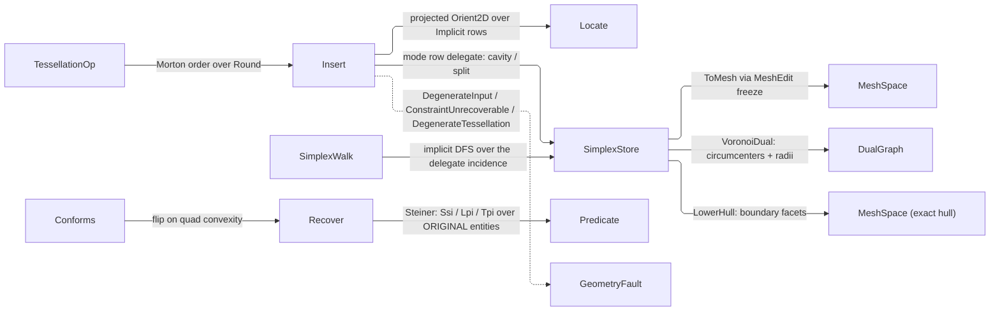

# [RASM_ARRANGEMENT_DELAUNAY]

`Rasm.Meshing` owns exact constrained Delaunay triangulation and tetrahedralization: one `Tessellation` `[Union]` built by `Tessellation.Build` over one `SimplexStore` arena, every vertex carried by defining entities through the `Implicit` store, so a constructed crossing keeps exact signs and rounds once at the `ToMesh` emission seam. `TessellationPolicy.Mode` closes the two build regimes — `Delaunay` restores empty-circum by predicate-guarded flips, `Constrained` holds zero-in-circum exactness for implicit-bearing builds — one union over one store owning the whole insertion algebra, each regime carrying its insert and settle arms as row delegates so no call site branches on row equality.

`Implicit` rows are the exact vertex carrier, and every walk, cavity, flip, and recovery sign composes the `Predicate` family — both owned at `Numerics`. `SimplexStore` obeys the `Meshing/edit` `[03]-[ARENA_LAW]` contract by name, `ToMesh` publishing through that arena's freeze to the hashable `MeshSpace` that `Spatial/reconciliation` `Encode` content-addresses; failures route the `GeometryFault` union. `SimplexWalk` is the page's one traversal owner over the store's neighbour incidence, composing QuikGraph. `VoronoiDual` and `LowerHull` serve the `Meshing/offset` medial substrate and the Fabrication operating-envelope gate, the predicate-gated exact tier beside the `Spatial/cloud` host-kind hull rail.

## [01]-[INDEX]

- [02]-[TESSELLATION]: one `Build(TessellationOp, Op?)` entry; `Tessellation` `[Union]` over one `SimplexStore` arena of `Implicit` rows; cavity-flood or split-insert by row delegate; `Conform` recovery with defining-entity Steiner re-anchoring; `ToMesh`/`Triangles`/`VoronoiDual`/`LowerHull` projections, the dual's bounded-cell overload clipping each site's cell to an admitted boundary ring.
- [03]-[DENSITY_BAR]: one owner per axis-concern, each a case, row, or fold arm over the one store.

## [02]-[TESSELLATION]

- Owner: `Tessellation` `[Union]` (`Triangulation`/`Tetrahedralization`) mints the arrangement over one `SimplexStore` arena; `TessellationKind` is the dimensional discriminant, `TessellationPolicy` binds the `TessellationMode` regime with the per-edge flip budget, the pass-shaped recovery budget, the Steiner budget, the arena seed, the super-simplex scale, and the one `CorridorGuard` derivation both recovery regimes read, `Conform` is the closed recovery input whose `Crossing` case carries a foreign supporting plane's original points, `Carrier` is the depth-1 original-entity spelling one side of a split resolves to, and `SimplexWalk` is the ONE traversal over the store's neighbour incidence.
- Cases: `Tessellation` 2, `TessellationOp` 3 (`Points`/`Insert`/`Recover`), `Conform` 3 (`Edge`/`Facet`/`Crossing`), `Carrier` 2 (`PairCase`/`PlaneCase`), `TessellationKind` and `TessellationMode` 2 each; the fence carries every roster. Every dispatch over `Conform` is the generated total `Switch` — the shape gate, the recovery route, and the carrier resolution alike — so a fourth case breaks all three at compile time instead of falling into a catch-all.
- Entry: one polymorphic `Build(TessellationOp, Op?)` discriminates `Points` (seed, Morton-order, insert, recover, strip), `Insert` (one incremental insertion), and `Recover` (force a conform set) through the same one-row admission, so the interior never re-validates; no `BuildTriangulation`/`InsertVertex` sibling statics.
- Auto: `Points` seeds the scaled super-simplex, folds insertion over the Morton locality order, recovers each conform row, and strips super-incident simplices; the `TessellationMode` row's `Insert` delegate selects per insertion — `Delaunay` floods the in-circum cavity over explicit-cornered simplices and cones it, `Constrained` split-inserts with zero in-circum references — and its `Settle` delegate owns the terminal restoration pass. Every interior query rides the vertex-anchored star walk over `SimplexWalk`'s implicit depth-first reach, whose colouring touches only what it discovers, never a table scan. Recovery walks each missing edge, flips unconstrained crossings on quad convexity, and mints the exact Steiner over original entities (`Ssi`/`Lpi`/`Tpi` by `Carrier` resolution) when the crossing is itself pinned, both sub-segments re-anchored on the root; 3D recovery is bistellar-only.
- Law: duplicate admission is decided by the page's OWN exact predicate — the explicit rows sort under `Predicate.Compare` on the three ordinals and adjacent equal pairs reject — never by a hash over `Point3d`, whose bucket a signed zero or a host-specific hash normalization can split while `==` calls the pair equal. Named cost is one `O(n log n)` sort in place of an `O(n)` probe, and the bought guarantee is that "duplicate" means what every other sign on this page means. Both admission modalities refuse identically: implicit rows demand `Constrained`, and a 3D implicit row is CDTet-gated growth on the batch entry exactly as on the incremental one.
- Receipt: none on the build rail — the `Tessellation` value is the result and registers `IValidityEvidence`; the hash-eligible artifact is the frozen `MeshSpace` the `ToMesh` freeze publishes, never the live arena.
- Exemption: `SimplexStore`'s columns, its free list, its live census, the cone's shared-subface table, and the pin table are mutable for the build's whole life and never freeze — the arena law's single-writer clause covers them, and the frozen projections are the only egress. That same clause covers every fold-scoped accumulator dying with the pass that fills it: the cavity `IndexSet` and star list of both insertion arms, the emission slot map, the ping-pong ring and label buffers of the bounded-cell clip, and the incidence and off-vertex lists of the 3-2 bistellar move. `Locate` states its own refusal: point location is a directed straight-line walk under an exact exit predicate — one path, no frontier, no colouring — so no container or observer expresses it, and the live-count bound faults typed on an overrun. Recovery work-lists are a SPLITTING fold, not a traversal: each dequeue may enqueue two halves of the segment it just cut, so the structure it walks does not exist until the walk creates it, and no QuikGraph container holds it. 3D bistellar corridors walk tetrahedra through `SimplexWalk` but decide each move by exact orientation, never by an edge weight.
- Packages: `Rasm.Numerics` (the `Predicate` floor and `Implicit` carrier, `Predicate.ClipHalfplane` + `Halfplane.Frame` the ONE ring clip, `Axis` with `AlongU`/`AlongV`, `EpsilonPolicy` the numerical floors, the `GeometryFault` union with its `TessellationWitness` roster, `Dimension`/`PositiveMagnitude`), `Rasm.Meshing` (the `MeshEdit` arena freeze and `MeshSpace`, and `FlipFrontier` — the folder's ONE flip work-list, composed with this page's three store reads), `Rasm.Domain` (`Op` threading, `Context`, `ValidityClaim`), QuikGraph (`DelegateIncidenceGraph` + `ImplicitDepthFirstSearchAlgorithm` + `VertexPredecessorRecorderObserver` — the one lazily-adjacent reach and its recorder), `Rhino.Geometry`, Thinktecture.Runtime.Extensions, LanguageExt.Core.
- Growth: a new tessellation modality is one `TessellationKind` or `TessellationMode` row with its two delegate columns over the same `SimplexStore`; a new budget is one `TessellationPolicy` column with the derivation that reads it; a new conform shape is one `Conform` case and one arm on each of the three total `Switch`es; a new depth-1 spelling is one `Carrier` case; a new vertex-row construction is the `Numerics` predicate owner's `Implicit` case, this page widening by zero members.
- Boundary: `Tessellation` is a CLASS union and never a record one — both cases hold the live arena and the root the live pin table, so a generated `with` clone would publish a second value aliasing one store and one pin map while claiming value semantics; the frozen hash-eligible artifact is the `MeshSpace` the `ToMesh` freeze publishes, and `Triangles` publishes corners beside face indices so a consumer welds on the seam's own ordinals rather than re-interning its rounded points. The `Implicit` carrier keeps signs exact and rounds coordinates once at the emission seam; the depth-1 seal binds every constructed vertex — an implicit row references input points only, and a recovery split re-expresses over original entities through the `Conform` carriage. `Build` and the projections are total over the `Fin` rail; recovery splits a conform row within budget or faults typed with its index, never dropping it, and every bounded pass on this page — the flip guard, the Steiner budget, the restoration passes, the facet conformance passes — exits through `ConstraintUnrecoverable` or `DegenerateTessellation` rather than returning an unconverged result shaped like a converged one. Consumers reach this owner only through `Build` and the projections; `VoronoiDual` and `LowerHull` hold the predicate-gated exact hull tier while `Spatial/cloud` owns the host and concave hull kinds. RETIRED VOCABULARY, stated once: this page's recovery input was `Constraint` and its two-ended case `Constraint.Segment`, now `Conform` and `Conform.Edge`; `Rasm.Solving` keeps `Constraint` for its solver rows, which is why the rename was kernel-interior, and the shared typed exhaustion fault `GeometryFault.ConstraintUnrecoverable(int Constraint, int Budget)` keeps its positional name at the `Numerics/faults` owner both families read — this page feeds it a CONFORM index and the field name follows the fault's owner, not its caller.

```csharp signature
// --- [RUNTIME_PRELUDE] ----------------------------------------------------------------------
using System;
using System.Collections.Frozen;
using System.Collections.Generic;
using System.Linq;
using LanguageExt;
using QuikGraph;
using QuikGraph.Algorithms.Observers;
using QuikGraph.Algorithms.Search;
using Rasm.Domain;
using Rasm.Numerics;
using Rhino.Geometry;
using Thinktecture;
using static LanguageExt.Prelude;
// CS0104 guard: LanguageExt.HashSet collides with the BCL name under the dual usings.
using IndexSet = System.Collections.Generic.HashSet<int>;

namespace Rasm.Meshing;

// --- [TYPES] ------------------------------------------------------------------------------
[SmartEnum<string>]
[KeyMemberEqualityComparer<ComparerAccessors.StringOrdinal, string>]
[KeyMemberComparer<ComparerAccessors.StringOrdinal, string>]
public sealed partial class TessellationKind {
    public static readonly TessellationKind Triangulation      = new("triangulation", simplexArity: 3);
    public static readonly TessellationKind Tetrahedralization = new("tetrahedralization", simplexArity: 4);

    public int SimplexArity { get; }
}

// Each regime IS its two arms: the insert delegate picks cavity-or-split, the settle delegate owns the
// terminal restoration. Constrained is the zero-in-circum regime; implicit-bearing builds require it.
[SmartEnum<string>]
[KeyMemberEqualityComparer<ComparerAccessors.StringOrdinal, string>]
[KeyMemberComparer<ComparerAccessors.StringOrdinal, string>]
public sealed partial class TessellationMode {
    public static readonly TessellationMode Delaunay = new("delaunay",
        insert: static (into, at, vertex) => into.Restorable(at) ? into.CavityInsert(at, vertex) : into.SplitInsert(at, vertex),
        settle: static into => into.RestoreEmptyCircum());
    public static readonly TessellationMode Constrained = new("constrained",
        insert: static (into, at, vertex) => into.SplitInsert(at, vertex),
        settle: static into => Fin.Succ(into));

    [UseDelegateFromConstructor] internal partial Fin<int> Insert(Tessellation into, int at, int vertex);
    [UseDelegateFromConstructor] internal partial Fin<Tessellation> Settle(Tessellation into);
}

// --- [CONSTANTS] --------------------------------------------------------------------------
// Every budget is a guarded count and the super scale a guarded magnitude, so a nonpositive policy is
// unrepresentable and the record needs no evidence fold. The two flip budgets count DIFFERENT things and never
// share a column: MaxFlipsPerEdge bounds one edge's re-entries into the restoration frontier, where Lawson
// flipping needs O(n^2) moves overall and a total cap would fault an ordinary input; MaxFlipPasses bounds the
// genuinely pass-shaped recovery sweeps, which re-scan the whole store per pass. SuperSimplexScale is the
// factor by which the frame exceeds the operand's own extent, wide enough that no insertion sees a super
// corner inside its circum-figure and narrow enough to stay inside NumericsPolicy.SplitCeiling.
public sealed record TessellationPolicy(
    TessellationMode Mode, Dimension MaxFlipsPerEdge, Dimension MaxFlipPasses, Dimension MaxRecoverySteiner,
    Dimension SeedCapacity, PositiveMagnitude SuperSimplexScale) {
    public static readonly TessellationPolicy Canonical = new(TessellationMode.Delaunay,
        MaxFlipsPerEdge: Dimension.Create(value: 16), MaxFlipPasses: Dimension.Create(value: 64),
        MaxRecoverySteiner: Dimension.Create(value: 1_024), SeedCapacity: Dimension.Create(value: 256),
        SuperSimplexScale: PositiveMagnitude.Create(value: 1e3));
    public static readonly TessellationPolicy Constrained = Canonical with { Mode = TessellationMode.Constrained };

    // ONE derived corridor budget both recovery regimes read: a per-pass allowance times the live store, so a
    // future edit to either column moves the 2D and 3D corridors together instead of drifting them apart.
    internal int CorridorGuard(int simplexCount) => MaxFlipPasses.Value * int.Max(simplexCount, 1);
}

// --- [MODELS] -----------------------------------------------------------------------------
// Single-writer arena under the Meshing/edit contract: the hybrid Implicit vertex table, arity-wide simplex
// vertex/neighbour columns, dead bitset, free list, doubling capacity.
public sealed class SimplexStore {
    Implicit[] rows;
    int[] vertices;
    int[] neighbours;
    int[] anchor;
    bool[] dead;
    // Slot recycler, not a frontier: Kill returns a slot and Spawn takes it back; no traversal reads it.
    readonly Stack<int> free = new();
    readonly int arity;
    int vertexCount, simplexCount, lastLive, liveCount;

    internal SimplexStore(int arity, int capacity) {
        this.arity = arity;
        rows = new Implicit[capacity];
        vertices = new int[arity * capacity];
        neighbours = new int[arity * capacity];
        anchor = new int[capacity];
        dead = new bool[capacity];
    }

    public int Arity => arity;
    public int VertexCount => vertexCount;
    public int SimplexCount => simplexCount;
    public Implicit Row(int vertex) => rows[vertex];
    public bool Alive(int simplex) => simplex < simplexCount && !dead[simplex];
    public ReadOnlySpan<int> SimplexVertices(int simplex) => vertices.AsSpan(arity * simplex, arity);
    public int Neighbour(int simplex, int face) => neighbours[(arity * simplex) + face];
    // The arena MAINTAINS its live census — Spawn increments, Kill decrements — so the two hottest readers
    // (the validity claim and the strip gate) cost a field read instead of a scan over every slot ever born.
    public int LiveCount => liveCount;
    public IEnumerable<int> Live => Enumerable.Range(0, simplexCount).Where(Alive);

    internal int AddVertex(in Implicit row) {
        Grow(ref rows, vertexCount + 1);
        Grow(ref anchor, vertexCount + 1);
        rows[vertexCount] = row;
        anchor[vertexCount] = -1;
        return vertexCount++;
    }

    internal int Spawn(ReadOnlySpan<int> verts, ReadOnlySpan<int> nbrs) {
        int simplex = free.Count > 0 ? free.Pop() : simplexCount++;
        Grow(ref vertices, arity * (simplex + 1));
        Grow(ref neighbours, arity * (simplex + 1));
        Grow(ref dead, simplex + 1);
        verts.CopyTo(vertices.AsSpan(arity * simplex, arity));
        nbrs.CopyTo(neighbours.AsSpan(arity * simplex, arity));
        dead[simplex] = false;
        liveCount++;
        foreach (int v in verts) { anchor[v] = simplex; }
        return lastLive = simplex;
    }

    // One live incident simplex per vertex: Spawn stamps it and a stale stamp repairs by one scan and re-caches,
    // so the recovery inner loop's star walks stay O(star) amortized.
    public int Anchor(int vertex) {
        int s = anchor[vertex];
        if (s >= 0 && Alive(s) && SimplexVertices(s).Contains(vertex)) { return s; }
        for (int i = 0; i < simplexCount; i++) {
            if (!dead[i] && SimplexVertices(i).Contains(vertex)) { return anchor[vertex] = i; }
        }
        return -1;
    }

    internal void Kill(int simplex) { dead[simplex] = true; liveCount--; free.Push(simplex); }
    internal void Link(int simplex, int face, int neighbour) { neighbours[(arity * simplex) + face] = neighbour; }

    internal void LinkBack(int simplex, int toOld, int toNew) {
        if (simplex < 0) { return; }
        for (int f = 0; f < arity; f++) {
            if (neighbours[(arity * simplex) + f] == toOld) { neighbours[(arity * simplex) + f] = toNew; return; }
        }
    }

    internal int LastLive() {
        if (Alive(lastLive)) { return lastLive; }
        for (int s = simplexCount - 1; s >= 0; s--) {
            if (!dead[s]) { return lastLive = s; }
        }
        return -1;
    }

    static void Grow<T>(ref T[] column, int needed) {
        if (needed > column.Length) { Array.Resize(ref column, int.Max(needed, column.Length << 1)); }
    }
}

[Union(ConversionFromValue = ConversionOperatorsGeneration.None)]
public abstract partial record Conform {
    private Conform() { }

    public sealed record Edge(int A, int B) : Conform;
    public sealed record Facet(Arr<int> Boundary) : Conform;

    // Crossing is the implicit-point case: a conformed segment tracing a FOREIGN supporting plane, P/Q/R its
    // ORIGINAL points, so a split re-anchors over input points (depth-1 sealed), never over implicit endpoints.
    public sealed record Crossing(int A, int B, Point3d P, Point3d Q, Point3d R) : Conform;

    public (int A, int B) Ends =>
        Switch(
            edge:     static e => (e.A, e.B),
            facet:    static f => (f.Boundary[0], f.Boundary[^1]),
            crossing: static c => (c.A, c.B));

    // ONE shape gate, read by both admission modalities against their own row count. The Facet arm runs BEFORE
    // any Ends read, so a short or duplicated-vertex ring fails typed here rather than throwing on the indexer.
    internal bool Broken(int rows) =>
        Switch(
            state:    rows,
            edge:     static (n, e) => Detached(e.A, e.B, n),
            facet:    static (n, f) => f.Boundary.Count < 3 || f.Boundary.Distinct().Count != f.Boundary.Count
                                       || f.Boundary.Exists(v => v < 0 || v >= n),
            crossing: static (n, c) => Detached(c.A, c.B, n));

    static bool Detached(int a, int b, int rows) => a == b || a < 0 || b < 0 || a >= rows || b >= rows;
}

// One side's ORIGINAL-entity spelling. A Crossing carries its foreign plane, an Edge over explicit input rows the
// point pair; a side with neither is UNANCHORABLE and has no case, since a rounded re-anchor breaks the seal.
[Union(ConversionFromValue = ConversionOperatorsGeneration.None)]
public abstract partial record Carrier {
    private Carrier() { }

    public sealed record PairCase(Point3d A, Point3d B) : Carrier;
    public sealed record PlaneCase(Point3d P, Point3d Q, Point3d R) : Carrier;
}

// Voronoi-dual projection carrier: circumcenters + circumradii (the clearance payload), dual
// edges, and the crossed DT edge per dual edge; node i names the same live triangle Triangles()[i].
public sealed record DualGraph(Arr<Point3d> Circumcenters, Arr<double> Radius, Arr<(int A, int B)> Edges, Arr<(int U, int V)> Across);

// One bounded Voronoi cell: the site's vertex index and its closed CCW ring clipped to the admitted boundary.
public sealed record BoundedCell(int Site, Arr<Point3d> Ring);

// --- [OPERATIONS] -------------------------------------------------------------------------
[Union(ConversionFromValue = ConversionOperatorsGeneration.None)]
public abstract partial record TessellationOp {
    private TessellationOp() { }

    // Support = the build plane's three ORIGINAL points (the Tpi witness a conform x conform split
    // needs); None for standalone planar builds whose conform rows carry no foreign planes.
    public sealed record Points(
        TessellationKind Kind, Arr<Implicit> Vertices, Seq<Conform> Conforms,
        TessellationPolicy Policy, Axis Plane, Option<(Point3d P, Point3d Q, Point3d R)> Support = default) : TessellationOp;
    public sealed record Insert(Tessellation Into, Implicit Vertex) : TessellationOp;
    public sealed record Recover(Tessellation Into, Seq<Conform> Conforms) : TessellationOp;
}

// ONE traversal owner over the store's neighbour incidence. The ADMISSION predicate is the parameter and the
// discovered set the product, so the cavity flood and the star walk are one lazily-served walk with two predicates.
internal static class SimplexWalk {
    // O(star), never O(simplexCount): DelegateIncidenceGraph publishes NO vertex set and the implicit search
    // colours only what it discovers, so nothing enumerates store.Live. A vertex-bearing container is REFUSED —
    // its initialize pass colours every live simplex, the table scan the recovery loop's per-iteration star walk
    // cannot afford. The reached set rides the recorder's own Attach seam, never a raw event lambda.
    internal static Seq<int> Reach(SimplexStore store, int arity, int seed, Func<int, bool> admits) {
        DelegateIncidenceGraph<int, SEquatableEdge<int>> incidence = new(
            (int s, out IEnumerable<SEquatableEdge<int>> outs) => {
                outs = Enumerable.Range(0, arity)
                    .Select(f => store.Neighbour(s, f))
                    .Where(n => n >= 0 && store.Alive(n) && admits(n))
                    .Select(n => new SEquatableEdge<int>(s, n));
                return true;
            });
        ImplicitDepthFirstSearchAlgorithm<int, SEquatableEdge<int>> walk = new(incidence);
        VertexPredecessorRecorderObserver<int, SEquatableEdge<int>> reached = new();
        using (reached.Attach(walk)) { walk.Compute(seed); }
        // Recorder keys every discovered vertex but the root, which has no tree edge to record.
        return Seq(seed) + toSeq(reached.VerticesPredecessors.Keys);
    }
}

// A CLASS union, not a record one: both cases hold a live SimplexStore and the root a live pin table, so a
// compiler-generated `with` clone would publish a second Tessellation aliasing one arena and one pin map while
// claiming value semantics. The class form removes `with` from the surface entirely; the hash-eligible artifact
// stays the frozen MeshSpace ToMesh publishes.
[BoundaryAdapter]
[Union(ConversionFromValue = ConversionOperatorsGeneration.None)]
public abstract partial class Tessellation : IValidityEvidence {
    private Tessellation() { }

    public sealed class Triangulation(SimplexStore store, int superBase, Axis plane, TessellationPolicy policy, Option<(Point3d P, Point3d Q, Point3d R)> support) : Tessellation {
        public SimplexStore Store { get; } = store;
        public int SuperBase { get; } = superBase;
        public Axis Plane { get; } = plane;
        public TessellationPolicy Policy { get; } = policy;
        public Option<(Point3d P, Point3d Q, Point3d R)> Support { get; } = support;
    }

    public sealed class Tetrahedralization(SimplexStore store, int superBase, TessellationPolicy policy) : Tessellation {
        public SimplexStore Store { get; } = store;
        public int SuperBase { get; } = superBase;
        public TessellationPolicy Policy { get; } = policy;
    }

    public TessellationKind Kind =>
        Switch(triangulation: static _ => TessellationKind.Triangulation, tetrahedralization: static _ => TessellationKind.Tetrahedralization);

    public SimplexStore Store =>
        Switch(triangulation: static t => t.Store, tetrahedralization: static t => t.Store);

    int SuperBase =>
        Switch(triangulation: static t => t.SuperBase, tetrahedralization: static t => t.SuperBase);

    Axis Projection =>
        Switch(triangulation: static t => t.Plane, tetrahedralization: static _ => Axis.Z);

    TessellationPolicy Policy =>
        Switch(triangulation: static t => t.Policy, tetrahedralization: static t => t.Policy);

    public bool IsValid => ValidityClaim.All(
        ValidityClaim.CountAtLeast(count: Store.LiveCount, floor: 1),
        ValidityClaim.CountAtLeast(count: Store.VertexCount, floor: Kind.SimplexArity));

    // --- [BUILD]
    // Input rows occupy slots [0, n) — a Conform's vertex ids ARE input indices; super rows sit
    // at the tail [SuperBase, SuperBase + arity). Morton permutes the insertion SEQUENCE, not ids.
    public static Fin<Tessellation> Build(TessellationOp op, Op? key = null) =>
        op.Switch(
            points: static p => Admit(p).Bind(static admitted => Delaunay.InsertionOrder(admitted.Vertices).Fold(
                    Fin.Succ(Seeded(admitted)), (acc, v) => acc.Bind(t => t.InsertRow(v).Map(_ => t)))
                .Bind(filled => admitted.Conforms.Map(static (c, i) => (Index: i, Row: c))
                    .Fold(Fin.Succ(filled), (acc, c) => acc.Bind(t => t.RecoverOne(c.Row, c.Index))))
                .Bind(static done => done.Policy.Mode.Settle(done))
                .Bind(static done => done.Stripped())),
            insert: static i => i.Into.AdmitRow(i.Vertex)
                .Bind(row => i.Into.InsertRow(i.Into.Store.AddVertex(in row)))
                .Map(_ => i.Into),
            recover: static r => r.Conforms.Map(static (c, i) => (Index: i, Row: c))
                .Fold(r.Into.AdmitIds(r.Conforms), (acc, c) => acc.Bind(t => t.RecoverOne(c.Row, c.Index))));

    static Fin<TessellationOp.Points> Admit(TessellationOp.Points p) {
        if (p.Vertices.Count == 0) { return Reject(0, "empty vertex set"); }
        for (int i = 0; i < p.Vertices.Count; i++) {
            if (p.Vertices[i].IsExplicit && !ValidityClaim.Finite(point: p.Vertices[i].AsExplicit)) { return Reject(i, "non-finite explicit row"); }
        }
        // Exact-ordinal duplicate scan: sort the explicit rows by the page's own predicate on the three
        // ordinals, reject an adjacent equal pair. A hash over Point3d would decide it by a different equality.
        int[] explicitRows = [.. Enumerable.Range(0, p.Vertices.Count).Where(i => p.Vertices[i].IsExplicit)];
        Array.Sort(explicitRows, (a, b) => Rank(p.Vertices[a], p.Vertices[b]));
        for (int i = 1; i < explicitRows.Length; i++) {
            if (Rank(p.Vertices[explicitRows[i - 1]], p.Vertices[explicitRows[i]]) == 0) { return Reject(explicitRows[i], "duplicate row"); }
        }
        foreach ((Conform row, int index) in p.Conforms.Map(static (c, i) => (c, i))) {
            if (row.Broken(p.Vertices.Count)) { return Reject(index, "degenerate or out-of-table conform"); }
        }
        // Batch entry refuses EXACTLY what AdmitRow refuses one row at a time; a mode or dimension
        // gate holding on one modality alone would admit through the other.
        bool implicitBearing = p.Vertices.Exists(static v => !v.IsExplicit);
        return !implicitBearing ? Fin.Succ(p)
            : p.Policy.Mode != TessellationMode.Constrained ? Reject(0, "implicit rows demand constrained mode")
            : p.Kind == TessellationKind.Tetrahedralization ? Reject(0, "3D implicit rows are CDTet-gated growth")
            : Fin.Succ(p);

        static Fin<TessellationOp.Points> Reject(int index, string witness) =>
            Fin.Fail<TessellationOp.Points>(new GeometryFault.DegenerateInput(Rasm.Domain.Kind.Point, index, witness));
    }

    // Total order on explicit rows through the exact comparison the whole page decides signs with.
    static int Rank(Implicit a, Implicit b) {
        foreach (Axis axis in Seq(Axis.X, Axis.Y, Axis.Z)) {
            Sign side = Predicate.Compare(in a, in b, axis);
            if (side != Sign.Zero) { return side == Sign.Negative ? -1 : 1; }
        }
        return 0;
    }

    // Insert-modality admission mirrors Admit one row at a time: the interior never re-validates (the
    // tetrahedral walk reads AsExplicit), and a coincident row degenerates every split touching it.
    Fin<Implicit> AdmitRow(Implicit vertex) =>
        vertex.IsExplicit && !ValidityClaim.Finite(point: vertex.AsExplicit)
            ? RejectRow("non-finite explicit row")
            : vertex.IsExplicit && Enumerable.Range(0, Store.VertexCount).Any(v => Store.Row(v).IsExplicit && Rank(Store.Row(v), vertex) == 0)
                ? RejectRow("duplicate row")
                : !vertex.IsExplicit && Policy.Mode == TessellationMode.Delaunay
                    ? RejectRow("implicit rows demand constrained mode")
                    : !vertex.IsExplicit && Kind == TessellationKind.Tetrahedralization
                        ? RejectRow("3D implicit rows are CDTet-gated growth")
                        : Fin.Succ(vertex);

    Fin<Implicit> RejectRow(string witness) =>
        Fin.Fail<Implicit>(new GeometryFault.DegenerateInput(Rasm.Domain.Kind.Point, Store.VertexCount, witness));

    // Recover-modality admission: conform ids must address the LIVE vertex table through the same shape gate.
    Fin<Tessellation> AdmitIds(Seq<Conform> conforms) {
        foreach ((Conform row, int index) in conforms.Map(static (c, i) => (c, i))) {
            if (row.Broken(Store.VertexCount)) {
                return Fin.Fail<Tessellation>(new GeometryFault.DegenerateInput(Rasm.Domain.Kind.Point, index, "degenerate or out-of-table conform"));
            }
        }
        return Fin.Succ(this);
    }

    // --- [INSERT]
    Fin<int> InsertRow(int vertex) => Locate(vertex).Bind(at => Policy.Mode.Insert(this, at, vertex));

    // Delaunay restoration needs the in-circum family's EXPLICIT corners: 3 (2D)/4 (3D) explicit vs an explicit-or-constructed query.
    internal bool Restorable(int simplex) {
        ReadOnlySpan<int> vs = Store.SimplexVertices(simplex);
        for (int i = 0; i < vs.Length; i++) {
            if (!Store.Row(vs[i]).IsExplicit) { return false; }
        }
        return true;
    }

    // --- [LOCATE]
    // REFUSES QuikGraph, stated here rather than inferred: point location is a directed straight-line walk
    // under an exact exit predicate — one path, no frontier, no colouring, and the next simplex is decided by
    // geometry the container cannot see — so no incidence walk or observer expresses it. The step bound is the
    // live count and overrunning it faults typed.
    Fin<int> Locate(int query) {
        int current = Store.LastLive();
        Implicit q = Store.Row(query);
        for (int step = 0; step <= Store.SimplexCount; step++) {
            int exit = ExitFace(current, in q);
            if (exit < 0) { return Fin.Succ(current); }
            int next = Store.Neighbour(current, exit);
            if (next < 0) { return Fin.Fail<int>(new GeometryFault.DegenerateTessellation(current, TessellationWitness.OffHullWalk)); }
            current = next;
        }
        return Fin.Fail<int>(new GeometryFault.DegenerateTessellation(current, TessellationWitness.WalkOverran));
    }

    // Tetrahedral tests are APEX-RELATIVE: the cyclic face triple flips parity with f, so a fixed
    // sign is wrong on half the faces — a query exits face f when it lies strictly opposite the
    // apex vs[f]; 2D triangle rows are CCW by construction.
    int ExitFace(int simplex, in Implicit query) {
        ReadOnlySpan<int> vs = Store.SimplexVertices(simplex);
        int arity = Kind.SimplexArity;
        for (int f = 0; f < arity; f++) {
            Sign side;
            if (arity == 3) {
                side = Predicate.Orient2D(Store.Row(vs[(f + 1) % 3]), Store.Row(vs[(f + 2) % 3]), query, Projection);
            }
            else {
                (Point3d u1, Point3d u2, Point3d u3) = (Store.Row(vs[(f + 1) & 3]).AsExplicit, Store.Row(vs[(f + 2) & 3]).AsExplicit, Store.Row(vs[(f + 3) & 3]).AsExplicit);
                side = Predicate.Orient3D(u1, u2, u3, query.AsExplicit).Times(Predicate.Orient3D(u1, u2, u3, Store.Row(vs[f]).AsExplicit));
            }
            if (side == Sign.Negative) { return f; }
        }
        return -1;
    }

    // --- [CAVITY]
    // Cavity is the reach's product and the star DERIVES from it afterward, so a face toward a still-pending
    // neighbour cannot enter the star spuriously — the hazard the interleaved form hand-ordered against.
    internal Fin<int> CavityInsert(int seed, int query) {
        Implicit q = Store.Row(query);
        IndexSet cavity = [.. SimplexWalk.Reach(Store, Kind.SimplexArity, seed,
            s => Restorable(s) && InCircum(s, in q) == Sign.Positive)];
        cavity.Add(seed);
        List<(int Simplex, int Face)> star = [];
        foreach (int s in cavity) {
            for (int f = 0; f < Kind.SimplexArity; f++) {
                int neighbour = Store.Neighbour(s, f);
                if (neighbour < 0 || !cavity.Contains(neighbour)) { star.Add((s, f)); }
            }
        }
        return star.Count == 0
            ? Fin.Fail<int>(new GeometryFault.DegenerateTessellation(seed, TessellationWitness.EmptyCavity))
            : Fin.Succ(Cone(cavity, star, query));
    }

    Sign InCircum(int simplex, in Implicit query) {
        ReadOnlySpan<int> vs = Store.SimplexVertices(simplex);
        return Kind.SimplexArity == 3
            ? Predicate.InCircle(Store.Row(vs[0]).AsExplicit, Store.Row(vs[1]).AsExplicit, Store.Row(vs[2]).AsExplicit, in query, Projection)
            : Predicate.InSphere(Store.Row(vs[0]).AsExplicit, Store.Row(vs[1]).AsExplicit, Store.Row(vs[2]).AsExplicit, Store.Row(vs[3]).AsExplicit, in query);
    }

    // Cone the cavity-boundary star to the vertex: one new simplex per star face, outward neighbour
    // through LinkBack, siblings resolved by the shared-subface table.
    int Cone(IndexSet cavity, List<(int Simplex, int Face)> star, int query) {
        int arity = Kind.SimplexArity;
        Dictionary<(int, int, int), (int Simplex, int Face)> bySubface = new();
        Span<int> verts = stackalloc int[arity];
        Span<int> nbrs = stackalloc int[arity];
        int seeded = -1;
        foreach ((int s, int f) in star) {
            ReadOnlySpan<int> vs = Store.SimplexVertices(s);
            verts[0] = query;
            for (int i = 1; i < arity; i++) { verts[i] = vs[(f + i) % arity]; }
            int outward = Store.Neighbour(s, f);
            nbrs[0] = outward;
            for (int i = 1; i < arity; i++) { nbrs[i] = -1; }
            int born = Store.Spawn(verts, nbrs);
            Store.LinkBack(outward, s, born);
            for (int i = 1; i < arity; i++) {
                (int, int, int) faceKey = SubfaceKey(verts, i, arity);
                if (bySubface.Remove(faceKey, out (int Simplex, int Face) other)) {
                    Store.Link(born, i, other.Simplex);
                    Store.Link(other.Simplex, other.Face, born);
                }
                else { bySubface[faceKey] = (born, i); }
            }
            seeded = born;
        }
        foreach (int s in cavity) { Store.Kill(s); }
        return seeded;

        static (int, int, int) SubfaceKey(ReadOnlySpan<int> verts, int face, int arity) {
            Span<int> rest = stackalloc int[3];
            int n = 0;
            for (int i = 0; i < arity; i++) {
                if (i != face) { rest[n++] = verts[i]; }
            }
            rest[..n].Sort();
            return (rest[0], n > 1 ? rest[1] : -1, n > 2 ? rest[2] : -1);
        }
    }

    // Zero-in-circum split-insertion (constrained regime): interior 1->3; an on-face query (projected orientation
    // Zero) splits both incident simplices 2->4, or 1->2 on a hull edge whose collinear face never cones.
    internal Fin<int> SplitInsert(int at, int query) {
        ReadOnlySpan<int> vs = Store.SimplexVertices(at);
        Implicit q = Store.Row(query);
        int onFace = -1;
        if (Kind.SimplexArity == 3) {
            for (int f = 0; f < 3; f++) {
                if (Predicate.Orient2D(Store.Row(vs[(f + 1) % 3]), Store.Row(vs[(f + 2) % 3]), q, Projection) == Sign.Zero) { onFace = f; break; }
            }
        }
        else {
            for (int f = 0; f < 4; f++) {
                (Point3d u1, Point3d u2, Point3d u3) = (Store.Row(vs[(f + 1) & 3]).AsExplicit, Store.Row(vs[(f + 2) & 3]).AsExplicit, Store.Row(vs[(f + 3) & 3]).AsExplicit);
                if (Predicate.Orient3D(u1, u2, u3, q.AsExplicit) == Sign.Zero) {
                    // Splitting 1->4 silently here mints a zero-volume tet; the 2->6 on-face split is deferred.
                    return Fin.Fail<int>(new GeometryFault.DegenerateTessellation(at, TessellationWitness.OnFaceCdtetGated));
                }
            }
        }
        List<(int Simplex, int Face)> star = [];
        IndexSet cavity = new() { at };
        if (onFace >= 0 && Store.Neighbour(at, onFace) is int twin and >= 0) { cavity.Add(twin); }
        foreach (int s in cavity) {
            for (int f = 0; f < Kind.SimplexArity; f++) {
                int n = Store.Neighbour(s, f);
                if (s == at && f == onFace && n < 0) { continue; }  // hull on-edge: the collinear face dies unconed — 1->2
                if (!cavity.Contains(n) || n < 0) { star.Add((s, f)); }
            }
        }
        return Fin.Succ(Cone(cavity, star, query));
    }

    // --- [RECOVER]
    // Total over the closed recovery family: a Facet decomposes into its boundary edges first, and the two
    // end-bearing cases take the corridor walk. A fourth case breaks here rather than falling through.
    Fin<Tessellation> RecoverOne(Conform conform, int index) =>
        conform.Switch(
            edge:     e => RecoverEnds(e, index),
            facet:    f => RecoverFacet(f, index),
            crossing: c => RecoverEnds(c, index));

    // Walk the missing conform edge: flip unpinned crossing diagonals on quad convexity, mint the exact Steiner
    // over ORIGINAL entities when the crossing carries its own pin, re-anchoring both halves on the parent.
    // This queue is a SPLITTING work-list, not a traversal: one dequeue enqueues the two halves it just cut, so the
    // structure walked does not exist until the walk creates it. It carries ENDS beside the carriage, never a
    // re-bound row — a split changes only the ends, so a rebound member had one arm with nothing to rebind.
    Fin<Tessellation> RecoverEnds(Conform root, int index) {
        if (Kind == TessellationKind.Tetrahedralization) { return RecoverEdge3D(root, index); }  // 2D diagonal flips corrupt a tet store
        Queue<(int A, int B, Conform Root)> queue = new();
        (int rootA, int rootB) = root.Ends;
        queue.Enqueue((rootA, rootB, root));
        int budget = Policy.MaxRecoverySteiner.Value;
        while (queue.Count > 0) {
            (int a, int b, Conform carrier) = queue.Dequeue();
            int guard = Policy.CorridorGuard(Store.SimplexCount);
            while (!EdgePresent(a, b)) {
                if (guard-- <= 0) { return Fin.Fail<Tessellation>(new GeometryFault.ConstraintUnrecoverable(index, Policy.MaxRecoverySteiner.Value)); }
                if (FirstCrossing(a, b).Case is not ((int p, int q, Option<Conform> pin))) {
                    // No straddling edge: the obstruction is a VERTEX exactly on (a,b), a grid
                    // T-junction, so the conform splits AT it with no Steiner minted.
                    if (OnSegment(a, b).Case is int through) {
                        queue.Enqueue((a, through, carrier));
                        queue.Enqueue((through, b, carrier));
                        break;
                    }
                    return Fin.Fail<Tessellation>(new GeometryFault.DegenerateTessellation(Store.LastLive(), TessellationWitness.NoCrossing));
                }
                if (pin.IsNone && FlipDiagonal(p, q)) { continue; }
                if (budget-- <= 0) { return Fin.Fail<Tessellation>(new GeometryFault.ConstraintUnrecoverable(index, Policy.MaxRecoverySteiner.Value)); }
                // Thread the VERTEX id through the insert (InsertRow returns the seeded SIMPLEX, a
                // mis-key if re-anchored on). Halves carry the ROOT, so a twice-split segment still
                // spells its Steiner over input points.
                Fin<int> steiner = SteinerOf(carrier, p, q, pin, index).Map(row => Store.AddVertex(in row)).Bind(v => InsertRow(v).Map(_ => v));
                if (steiner.Case is not int w) { return steiner.Map(_ => (Tessellation)this); }
                queue.Enqueue((a, w, carrier));
                queue.Enqueue((w, b, carrier));
                break;
            }
            if (EdgePresent(a, b)) { Pin(a, b, carrier); }  // pin the ROOT — a later crossing reads its ORIGINAL carriage
        }
        return Fin.Succ(this);
    }

    // First link vertex lying EXACTLY on segment (a,b), strictly between its ends: collinearity by projected
    // orientation, betweenness by Compare on a separating axis — what FirstCrossing's strict straddle cannot see.
    Option<int> OnSegment(int a, int b) {
        (Implicit ra, Implicit rb) = (Store.Row(a), Store.Row(b));
        Axis u = Projection.AlongU;
        Axis extent = Predicate.Compare(in ra, in rb, u) != Sign.Zero ? u : Projection.AlongV;
        foreach (int s in Star(a)) {
            foreach (int w in Store.SimplexVertices(s)) {
                if (w == a || w == b) { continue; }
                Implicit rw = Store.Row(w);
                if (Predicate.Orient2D(in ra, in rb, in rw, Projection) != Sign.Zero) { continue; }
                if (Predicate.Compare(in rw, in ra, extent).Times(Predicate.Compare(in rw, in rb, extent)) == Sign.Negative) { return Some(w); }
            }
        }
        return None;
    }

    // Exact Steiner over ORIGINAL entities, depth-1 by carrier resolution: pair x pair = Ssi,
    // pair x plane = Lpi, plane x plane x Support = Tpi. The crossing side's pin travels in from the
    // walk that already read it, so the pin table is probed once per crossing rather than twice.
    Fin<Implicit> SteinerOf(Conform root, int p, int q, Option<Conform> pin, int index) {
        Option<Carrier> own = CarrierOf(root);
        Option<Carrier> cross = pin.Match(Some: CarrierOf, None: () => ExplicitPair(p, q));
        return (own.Case, cross.Case) switch {
            (Carrier.PairCase sa, Carrier.PairCase sb) => Fin.Succ<Implicit>(new Ssi(sa.A, sa.B, sb.A, sb.B, Projection)),
            (Carrier.PairCase sa, Carrier.PlaneCase tp) => Fin.Succ<Implicit>(new Lpi(sa.A, sa.B, tp.P, tp.Q, tp.R)),
            (Carrier.PlaneCase op, Carrier.PairCase sb) => Fin.Succ<Implicit>(new Lpi(sb.A, sb.B, op.P, op.Q, op.R)),
            (Carrier.PlaneCase op, Carrier.PlaneCase tp) when SupportWitness().Case is ((Point3d sp, Point3d sq, Point3d sr)) =>
                Fin.Succ<Implicit>(new Tpi(sp, sq, sr, op.P, op.Q, op.R, tp.P, tp.Q, tp.R)),
            // Remaining shapes are UNANCHORABLE — one side has no depth-1 spelling, and a rounded
            // re-anchor would break the seal rather than merely lose precision.
            _ => Fin.Fail<Implicit>(new GeometryFault.ConstraintUnrecoverable(index, Policy.MaxRecoverySteiner.Value)),
        };
    }

    Option<Carrier> CarrierOf(Conform root) =>
        root.Switch(
            edge: static e => ExplicitPair(e.A, e.B),
            // Facet boundaries are a ring of input rows, not a supporting entity, so one has no depth-1 spelling
            // and its absence is typed here rather than swept up by a catch-all a fourth case would also enter.
            facet:    static _ => Option<Carrier>.None,
            crossing: static c => Some<Carrier>(new Carrier.PlaneCase(c.P, c.Q, c.R)));

    Option<Carrier> ExplicitPair(int a, int b) =>
        Store.Row(a).IsExplicit && Store.Row(b).IsExplicit
            ? Some<Carrier>(new Carrier.PairCase(Store.Row(a).AsExplicit, Store.Row(b).AsExplicit))
            : None;

    Option<(Point3d P, Point3d Q, Point3d R)> SupportWitness() =>
        Switch(triangulation: static t => t.Support, tetrahedralization: static _ => None);

    // --- [STORE_OPS]
    // Input rows first (ids = input indices); super rows at the tail from SuperBase = n.
    static Tessellation Seeded(TessellationOp.Points p) {
        int arity = p.Kind.SimplexArity;
        SimplexStore store = new(arity, int.Max((2 * p.Vertices.Count) + arity, p.Policy.SeedCapacity.Value));
        foreach (Implicit row in p.Vertices) { store.AddVertex(in row); }
        // Extent is read off the ROUNDED rows, which is a sizing question and never a sign one; a constructed
        // row with no readout contributes no corner and the frame still contains it, since the frame is scaled
        // by the operand's own diagonal rather than by an absolute unit length no model's units agree on.
        BoundingBox box = new(p.Vertices.AsIterable().Map(static v => v.Round()).Somes());
        double r = p.Policy.SuperSimplexScale.Value * double.Max(box.Diagonal.Length, EpsilonPolicy.ZeroTolerance);
        Point3d c = box.Center;
        // The 3r / -r offsets are the EQUILATERAL containment construction: a triangle with corners at
        // (+-3r, -r) and (0, 3r) about the centre contains the r-radius disc, and its tetrahedral analogue the
        // r-radius ball, so every insertion lands strictly inside the frame whatever its position in the box.
        Span<int> super = stackalloc int[arity];
        if (arity == 3) {
            (int u, int v) = (p.Plane.U, p.Plane.V);
            super[0] = store.AddVertex(Planar(c, u, v, -3.0 * r, -r));
            super[1] = store.AddVertex(Planar(c, u, v, 3.0 * r, -r));
            super[2] = store.AddVertex(Planar(c, u, v, 0.0, 3.0 * r));
        }
        else {
            super[0] = store.AddVertex(new Implicit(new Point3d(c.X - (3.0 * r), c.Y - r, c.Z - r)));
            super[1] = store.AddVertex(new Implicit(new Point3d(c.X + (3.0 * r), c.Y - r, c.Z - r)));
            super[2] = store.AddVertex(new Implicit(new Point3d(c.X, c.Y + (3.0 * r), c.Z - r)));
            super[3] = store.AddVertex(new Implicit(new Point3d(c.X, c.Y, c.Z + (3.0 * r))));
        }
        Span<int> hull = stackalloc int[arity];
        hull.Fill(-1);
        store.Spawn(super, hull);
        int superBase = p.Vertices.Count;
        return p.Kind == TessellationKind.Triangulation
            ? new Triangulation(store, superBase, p.Plane, p.Policy, p.Support)
            : new Tetrahedralization(store, superBase, p.Policy);

        static Implicit Planar(Point3d c, int u, int v, double du, double dv) {
            Span<double> at = [c.X, c.Y, c.Z];
            at[u] += du;
            at[v] += dv;
            return new Implicit(new Point3d(at[0], at[1], at[2]));
        }
    }

    // Star is the same reach under the incidence predicate — O(star), never a table scan; the
    // recovery inner loop rides this.
    IEnumerable<int> Star(int vertex) {
        int seed = Store.Anchor(vertex);
        return seed < 0 ? [] : SimplexWalk.Reach(Store, Kind.SimplexArity, seed, s => Store.SimplexVertices(s).Contains(vertex));
    }

    bool EdgePresent(int a, int b) {
        foreach (int s in Star(a)) {
            if (Store.SimplexVertices(s).Contains(b)) { return true; }
        }
        return false;
    }

    // Corridor's first crossing: among a's star triangles, the edge OPPOSITE a strictly straddled by (a,b) — the
    // walk re-runs after every flip or split. The crossing carries its PIN straight through to the Steiner.
    Option<(int P, int Q, Option<Conform> Pin)> FirstCrossing(int a, int b) {
        (Implicit ra, Implicit rb) = (Store.Row(a), Store.Row(b));
        foreach (int s in Star(a)) {
            ReadOnlySpan<int> vs = Store.SimplexVertices(s);
            for (int f = 0; f < 3; f++) {
                (int p, int q) = (vs[(f + 1) % 3], vs[(f + 2) % 3]);
                if (p == a || p == b || q == a || q == b) { continue; }
                (Implicit rp, Implicit rq) = (Store.Row(p), Store.Row(q));
                bool straddles =
                    Predicate.Orient2D(ra, rb, rp, Projection).Times(Predicate.Orient2D(ra, rb, rq, Projection)) == Sign.Negative
                    && Predicate.Orient2D(rp, rq, ra, Projection).Times(Predicate.Orient2D(rp, rq, rb, Projection)) == Sign.Negative;
                if (straddles) { return Some((p, q, PinOf(p, q))); }
            }
        }
        return None;
    }

    // One flip serves recovery and restoration: flip diagonal (p,q) of the quad formed by its
    // two incident triangles iff the quad is convex (four exact orientation signs).
    bool FlipDiagonal(int p, int q) {
        if (IncidentPair(p, q).Case is not ((int s, int t, int apexS, int apexT))) { return false; }
        (Implicit rp, Implicit rq, Implicit rs, Implicit rt) = (Store.Row(p), Store.Row(q), Store.Row(apexS), Store.Row(apexT));
        bool convex =
            Predicate.Orient2D(rs, rt, rp, Projection).Times(Predicate.Orient2D(rs, rt, rq, Projection)) == Sign.Negative
            && Predicate.Orient2D(rp, rq, rs, Projection).Times(Predicate.Orient2D(rp, rq, rt, Projection)) == Sign.Negative;
        if (!convex) { return false; }
        RewireFlip(s, t, p, q, apexS, apexT);
        return true;
    }

    // --- [RESTORE]
    // Delaunay row's Settle arm composes the folder's ONE flip work-list: the frontier owns the seed order, the
    // membership guard, and the PER-EDGE budget, and this page supplies only the three store reads. The restart
    // scan it replaces re-enumerated every live simplex per flip and spent a whole-run budget one move at a
    // time, so an ordinary point set exhausted it. 2D only — the 3D property rides cavity insertion.
    // Budget exhaustion FAULTS here where the intrinsic consumer merely witnesses it: a still-flipping set
    // returned as success is a triangulation the mode promises is Delaunay and is not.
    internal Fin<Tessellation> RestoreEmptyCircum() {
        if (Kind.SimplexArity != 3) { return Fin.Succ(this); }
        FlipFrontier settled = FlipFrontier.Settle(
            InteriorDiagonals(), Policy.MaxFlipsPerEdge,
            interior: (p, q) => PinOf(p, q).IsNone && IncidentPair(p, q).IsSome,
            settled: EmptyCircum,
            flip: FlipAndRim);
        return settled.BudgetExhaustedEdges == 0
            ? Fin.Succ(this)
            : Fin.Fail<Tessellation>(new GeometryFault.DegenerateTessellation(Store.LastLive(), TessellationWitness.FlipBudgetSpent));
    }

    // Seeds ascending over every live interior diagonal, so the flip sequence is replay-stable.
    IEnumerable<(int Lo, int Hi)> InteriorDiagonals() {
        HashSet<(int Lo, int Hi)> rim = [];
        foreach (int s in Store.Live) {
            ReadOnlySpan<int> vs = Store.SimplexVertices(s);
            for (int f = 0; f < 3; f++) {
                if (Store.Neighbour(s, f) < 0) { continue; }
                (int p, int q) = (vs[(f + 1) % 3], vs[(f + 2) % 3]);
                rim.Add((int.Min(p, q), int.Max(p, q)));
            }
        }
        return rim.OrderBy(static e => e.Lo).ThenBy(static e => e.Hi);
    }

    // Settled = the diagonal already satisfies empty-circum, or carries no restorable explicit-cornered pair to
    // test; the in-circum family needs EXPLICIT corners, so a constructed one leaves the diagonal alone.
    bool EmptyCircum(int p, int q) {
        if (IncidentPair(p, q).Case is not ((int s, int t, int _, int _))) { return true; }
        if (!Restorable(s) || !Restorable(t)) { return true; }
        Implicit apex = Store.Row(Apex(t, p, q));
        return InCircum(s, in apex) != Sign.Positive;
    }

    // The frontier's flip arm: rewire the diagonal and hand back the four rim edges of the two rebuilt
    // triangles — the only edges the move can have un-settled. A refused flip re-queues nothing.
    Seq<(int, int)> FlipAndRim(int p, int q) {
        if (IncidentPair(p, q).Case is not ((int _, int _, int apexS, int apexT)) || !FlipDiagonal(p, q)) { return Seq<(int, int)>(); }
        return Seq((apexS, p), (p, apexT), (apexT, q), (q, apexS));
    }

    // Strip, then the degenerate gate: a set whose every simplex touches the super frame (collinear,
    // or coplanar in 3D) leaves nothing live and faults typed, never an empty success.
    Fin<Tessellation> Stripped() {
        int arity = Kind.SimplexArity;
        foreach (int s in Store.Live.ToArray()) {
            ReadOnlySpan<int> vs = Store.SimplexVertices(s);
            for (int i = 0; i < arity; i++) {
                if (vs[i] >= SuperBase && vs[i] < SuperBase + arity) {
                    for (int f = 0; f < arity; f++) { Store.LinkBack(Store.Neighbour(s, f), s, -1); }
                    Store.Kill(s);
                    break;
                }
            }
        }
        return Store.LiveCount == 0
            ? Fin.Fail<Tessellation>(new GeometryFault.DegenerateInput(Rasm.Domain.Kind.Point, None, "fully degenerate set: no simplex survives the super strip"))
            : Fin.Succ(this);
    }

    // --- [PROJECTIONS]
    // Emission seam: implicit rows Round() HERE, the arena freeze re-admits. Tetra boundary faces wind OUTWARD by the
    // exact apex sign — the cyclic triple flips parity with the face index, so a fixed winding is half inward.
    public Fin<MeshSpace> ToMesh(Context context, Op? key = null) {
        using MeshEdit edit = MeshEdit.Of([], [], context);
        // Constructed (Steiner) rows may refuse the double readout: round each referenced vertex ONCE up front,
        // so `Emit` inside the face loop reads admitted coordinates and a `None` lands the typed refusal the
        // predicate rail already names as `Sign.Zero` — never a fabricated coordinate.
        Dictionary<int, int> slot = new();
        foreach (int s in Store.Live) {
            foreach (int v in Store.SimplexVertices(s)) {
                if (slot.ContainsKey(v)) { continue; }
                if (Store.Row(v).Round().Case is not Point3d at) {
                    return Fin.Fail<MeshSpace>(new GeometryFault.DegenerateTessellation(v, TessellationWitness.UnrepresentableVertex));
                }
                slot[v] = edit.AddVertex(at);
            }
        }
        int Emit(int v) => slot[v];
        int arity = Kind.SimplexArity;
        foreach (int s in Store.Live) {
            ReadOnlySpan<int> vs = Store.SimplexVertices(s);
            if (arity == 3) { edit.AddFace(Emit(vs[0]), Emit(vs[1]), Emit(vs[2])); continue; }
            for (int f = 0; f < 4; f++) {
                if (Store.Neighbour(s, f) < 0) { EmitOutward(edit, Emit, vs, f); }
            }
        }
        return edit.ToSpace(key.OrDefault());
    }

    void EmitOutward(MeshEdit edit, Func<int, int> emit, ReadOnlySpan<int> vs, int f) {
        (int a, int b, int c) = (vs[(f + 1) & 3], vs[(f + 2) & 3], vs[(f + 3) & 3]);
        bool flip = Predicate.Orient3D(Store.Row(a).AsExplicit, Store.Row(b).AsExplicit, Store.Row(c).AsExplicit, Store.Row(vs[f]).AsExplicit) == Sign.Positive;
        if (flip) { edit.AddFace(emit(a), emit(c), emit(b)); }
        else { edit.AddFace(emit(a), emit(b), emit(c)); }
    }

    // Lightweight sub-triangle emission (the arrangement per-face readback, the overlay classification set):
    // rows Round() HERE, ONCE per referenced vertex, and the projection publishes CORNERS beside FACE INDICES.
    // Handing back corner TRIPLES instead forced every consumer to re-intern the rounded points on its own key
    // to recover the sharing this seam already decided — a proof discarded by widening, and the arrangement rim
    // re-derived it on a raw bit triple. Live-simplex order is THE index law: Faces[i] and VoronoiDual node i
    // name the same live triangle.
    public Fin<(Arr<Point3d> Corners, Arr<(int A, int B, int C)> Faces)> Triangles(Op? key = null) {
        if (Kind != TessellationKind.Triangulation) {
            return Fin.Fail<(Arr<Point3d>, Arr<(int, int, int)>)>(new GeometryFault.DegenerateTessellation(0, TessellationWitness.ProjectionMismatch));
        }
        Dictionary<int, int> slot = new();
        List<Point3d> corners = [];
        List<(int A, int B, int C)> faces = [];
        int[] at = new int[3];
        foreach (int s in Store.Live) {
            ReadOnlySpan<int> vs = Store.SimplexVertices(s);
            for (int i = 0; i < 3; i++) {
                if (slot.TryGetValue(vs[i], out int cached)) { at[i] = cached; continue; }
                if (Store.Row(vs[i]).Round().Case is not Point3d corner) {
                    return Fin.Fail<(Arr<Point3d>, Arr<(int, int, int)>)>(new GeometryFault.DegenerateTessellation(s, TessellationWitness.UnrepresentableVertex));
                }
                corners.Add(corner);
                at[i] = slot[vs[i]] = corners.Count - 1;
            }
            faces.Add((at[0], at[1], at[2]));
        }
        return Fin.Succ((toArr(corners), toArr(faces)));
    }

    // Exact DT adjacency; circumcenters + circumradii materialize at THIS seam, node order = Triangles() live order.
    public Fin<DualGraph> VoronoiDual(Op? key = null) {
        if (Kind != TessellationKind.Triangulation) { return Fin.Fail<DualGraph>(new GeometryFault.DegenerateTessellation(0, TessellationWitness.ProjectionMismatch)); }
        int[] live = [.. Store.Live];
        FrozenDictionary<int, int> dualOf = live.Index().ToFrozenDictionary(static r => r.Item, static r => r.Index);
        Point3d[] centers = new Point3d[live.Length];
        double[] radius = new double[live.Length];
        for (int i = 0; i < live.Length; i++) {
            ReadOnlySpan<int> vs = Store.SimplexVertices(live[i]);
            (Implicit r0, Implicit r1, Implicit r2) = (Store.Row(vs[0]), Store.Row(vs[1]), Store.Row(vs[2]));
            if (!r0.IsExplicit || !r1.IsExplicit || !r2.IsExplicit) {
                return Fin.Fail<DualGraph>(new GeometryFault.DegenerateTessellation(live[i], TessellationWitness.ImplicitBearingDual));
            }
            // Collinearity is decided EXACTLY before the divide, never inferred from the quotient: the 2·(b×c)
            // denominator cancels on a near-collinear triple and lands a huge FINITE centre no probe catches. The
            // finiteness gate stays for the disjoint cause it does catch — a range overflowing the divide.
            if (Predicate.Orient2D(in r0, in r1, in r2, Projection) == Sign.Zero) {
                return Fin.Fail<DualGraph>(new GeometryFault.DegenerateTessellation(live[i], TessellationWitness.CollinearTriangle));
            }
            (centers[i], radius[i]) = Circumcircle(r0.AsExplicit, r1.AsExplicit, r2.AsExplicit, Projection);
            if (!ValidityClaim.Finite(point: centers[i])) {
                return Fin.Fail<DualGraph>(new GeometryFault.DegenerateTessellation(live[i], TessellationWitness.CircumcircleOverflow));
            }
        }
        List<(int A, int B)> edges = [];
        List<(int U, int V)> across = [];
        foreach (int s in live) {
            ReadOnlySpan<int> vs = Store.SimplexVertices(s);
            for (int f = 0; f < 3; f++) {
                int twin = Store.Neighbour(s, f);
                if (twin > s && Store.Alive(twin)) {
                    edges.Add((dualOf[s], dualOf[twin]));
                    across.Add((vs[(f + 1) % 3], vs[(f + 2) % 3]));
                }
            }
        }
        return Fin.Succ(new DualGraph(toArr(centers), toArr(radius), toArr(edges), toArr(across)));
    }

    // Bounded-cell overload of the SAME dual: each cell is the intersection of its neighbour bisector half-planes
    // seeded by the admitted boundary ring, so a hull site closes rather than radiating. Retires the foreign
    // bounded Fortune tessellator, and the third forked RNG it carried, from the Fabrication consumers.
    public Fin<Arr<BoundedCell>> VoronoiDual(Polyline boundary, Op? key = null) {
        Op op = key.OrDefault();
        if (Kind != TessellationKind.Triangulation) { return Fin.Fail<Arr<BoundedCell>>(new GeometryFault.DegenerateTessellation(0, TessellationWitness.ProjectionMismatch)); }
        return from _ in guard(boundary.IsClosed && boundary.Count >= 4 && boundary.All(static p => p.IsValid), op.InvalidInput()).ToFin()
               from cells in ClipCells(boundary: boundary, key: op)
               select cells;
    }
    // Sutherland-Hodgman half-plane fold, one cell per live site: fold the boundary ring through each incident
    // neighbour's perpendicular bisector, side decided by exact Orient2D over the bisector frame, and a ring the
    // fold empties drops its cell. The clipper is always a half-plane, so a non-convex boundary stays legal.
    Fin<Arr<BoundedCell>> ClipCells(Polyline boundary, Op key) {
        Point3d[] seed = Wound(boundary, Projection.U, Projection.V);
        List<BoundedCell> cells = [];
        for (int site = 0; site < Store.VertexCount; site++) {
            if (site >= SuperBase && site < SuperBase + Kind.SimplexArity) { continue; }
            if (Store.Anchor(site) < 0) { continue; }  // stripped out with its incident simplices
            // Steiner sites whose readout refuses fail the WHOLE dual: a silently dropped cell would leave a
            // hole no consumer can attribute, and `Sign.Zero` already names the cause on the predicate rail.
            if (Store.Row(site).Round().Case is not Point3d at) {
                return Fin.Fail<Arr<BoundedCell>>(new GeometryFault.DegenerateTessellation(site, TessellationWitness.UnrepresentableVertex));
            }
            int[] neighbours = Adjacent(site);
            int room = seed.Length + neighbours.Length + 2;
            (Point3d[] front, Point3d[] back) = (new Point3d[room], new Point3d[room]);
            (int[] frontLabel, int[] backLabel, bool[] forged) = (new int[room], new int[room], new bool[room]);
            seed.CopyTo(front, 0);
            int count = seed.Length;
            foreach (int neighbour in neighbours) {
                if (Store.Row(neighbour).Round().Case is not Point3d other) {
                    return Fin.Fail<Arr<BoundedCell>>(new GeometryFault.DegenerateTessellation(neighbour, TessellationWitness.UnrepresentableVertex));
                }
                Halfplane cut = Bisector(at, other);
                Fin<(int Written, int Fabricated)> clipped = Predicate.ClipHalfplane(
                    front.AsSpan(0, count), frontLabel.AsSpan(0, count), cut, cut.Side(at),
                    band: 0.0, denomFloor: EpsilonPolicy.ZeroTolerance, cutLabel: neighbour, back, backLabel, forged);
                if (clipped.Case is not (int written, int fabricated)) { return clipped.Map(static _ => Arr<BoundedCell>.Empty); }
                // A fabricated corner fails the WHOLE dual: the exact side test called the pair strictly
                // opposite while the raw offsets cancelled, so the midpoint standing in for that crossing is a
                // coordinate nothing measured, and the Fabrication envelope consumer cannot tell it from one.
                if (fabricated > 0) {
                    return Fin.Fail<Arr<BoundedCell>>(new GeometryFault.DegenerateTessellation(site, TessellationWitness.BisectorDenominator));
                }
                (front, back, frontLabel, backLabel, count) = (back, front, backLabel, frontLabel, written);
                if (count < 3) { break; }
            }
            if (count >= 3) { cells.Add(new BoundedCell(site, toArr<Point3d>([.. front.AsSpan(0, count), front[0]]))); }
        }
        return Fin.Succ(toArr(cells));
    }

    // Delaunay neighbours of a site — the other corners of its live incident simplices, which is every bisector the
    // cell needs. Sorted, because the reach's visit order is store-layout-dependent and the clip fold's
    // cyclic start vertex follows it, which a content-addressed cell ring cannot inherit.
    int[] Adjacent(int site) {
        IndexSet ring = [];
        foreach (int s in Star(site)) {
            foreach (int w in Store.SimplexVertices(s)) {
                if (w != site && !(w >= SuperBase && w < SuperBase + Kind.SimplexArity)) { ring.Add(w); }
            }
        }
        int[] ordered = [.. ring];
        Array.Sort(ordered);
        return ordered;
    }

    // The perpendicular bisector of (at, other) as the clip owner's exact frame: the midpoint and one step
    // along the in-plane perpendicular, both read in the projection plane. The KEEP side is the sign the SITE
    // takes on that frame — derived, never the constant the perpendicular's handedness makes it.
    Halfplane Bisector(Point3d at, Point3d other) {
        (int u, int v) = (Projection.U, Projection.V);
        (double mu, double mv) = ((Axis.Coord(at, u) + Axis.Coord(other, u)) * 0.5, (Axis.Coord(at, v) + Axis.Coord(other, v)) * 0.5);
        (double pu, double pv) = (Axis.Coord(at, v) - Axis.Coord(other, v), Axis.Coord(other, u) - Axis.Coord(at, u));
        return new Halfplane.Frame(Planar(mu, mv), Planar(mu + pu, mv + pv), Projection);

        Point3d Planar(double du, double dv) {
            Span<double> row = [0.0, 0.0, 0.0];
            (row[u], row[v]) = (du, dv);
            return new Point3d(row[0], row[1], row[2]);
        }
    }

    // Seed ring wound CCW in the projection plane: the boundary's own signed area decides, so a CW-admitted
    // boundary emits the same cells rather than mirrored ones, and the closing duplicate drops here so the
    // fold's `(i + 1) % Count` wrap is the only closure law.
    static Point3d[] Wound(Polyline boundary, int u, int v) {
        Point3d[] open = [.. boundary.Take(boundary.Count - 1)];
        double twice = 0.0;
        for (int i = 0; i < open.Length; i++) {
            (Point3d a, Point3d b) = (open[i], open[(i + 1) % open.Length]);
            twice += (Axis.Coord(a, u) * Axis.Coord(b, v)) - (Axis.Coord(b, u) * Axis.Coord(a, v));
        }
        if (twice < 0.0) { Array.Reverse(open); }
        return open;
    }

    // Paraboloid-lift equivalence: the Delaunay complex IS the lower hull, so the live boundary facets ARE the
    // predicate-exact convex hull. TETRAHEDRAL only — a triangulation's hull is an edge chain, not a face set.
    public Fin<MeshSpace> LowerHull(Context context, Op? key = null) =>
        Kind == TessellationKind.Tetrahedralization
            ? ToMesh(context, key)
            : Fin.Fail<MeshSpace>(new GeometryFault.DegenerateTessellation(0, TessellationWitness.ProjectionMismatch));

    // --- [PRIVATE_KERNELS]
    // Pinned edges carry their Conform so a later conform x conform split reads the crossing edge's OWN carriage — the
    // Tpi/Lpi re-anchor source. Exemption: written through the whole recovery, mutable for the build's life.
    readonly Dictionary<(int, int), Conform> pinned = [];
    void Pin(int a, int b, Conform edge) => pinned[(int.Min(a, b), int.Max(a, b))] = edge;
    Option<Conform> PinOf(int a, int b) => pinned.TryGetValue((int.Min(a, b), int.Max(a, b)), out Conform? c) ? Some(c) : None;

    Option<(int S, int T, int Sp, int Tp)> IncidentPair(int p, int q) {
        (int s, int t) = (-1, -1);
        foreach (int i in Star(p)) {
            if (!Store.SimplexVertices(i).Contains(q)) { continue; }
            if (s < 0) { s = i; }
            else { t = i; break; }
        }
        return s >= 0 && t >= 0 ? Some((s, t, Apex(s, p, q), Apex(t, p, q))) : None;
    }

    int Apex(int simplex, int p, int q) {
        ReadOnlySpan<int> vs = Store.SimplexVertices(simplex);
        for (int i = 0; i < vs.Length; i++) {
            if (vs[i] != p && vs[i] != q) { return vs[i]; }
        }
        return -1;
    }

    // Face i of [v0,v1,v2] is the edge opposite v[i]; the quad's four OUTWARD neighbours are the two non-shared
    // faces of each dying triangle. IncidentPair already proved s and t both carry p and q, so IndexOf cannot
    // miss — a miss-arm returning face 0 would rewire a live neighbour onto the wrong face, silently.
    void RewireFlip(int s, int t, int p, int q, int apexS, int apexT) {
        (int sOppP, int sOppQ) = (Store.Neighbour(s, Store.SimplexVertices(s).IndexOf(p)), Store.Neighbour(s, Store.SimplexVertices(s).IndexOf(q)));
        (int tOppP, int tOppQ) = (Store.Neighbour(t, Store.SimplexVertices(t).IndexOf(p)), Store.Neighbour(t, Store.SimplexVertices(t).IndexOf(q)));
        Store.Kill(s);
        Store.Kill(t);
        Span<int> va = [apexS, apexT, q];
        Span<int> na = [tOppP, sOppP, -1];
        Span<int> vb = [apexT, apexS, p];
        Span<int> nb = [sOppQ, tOppQ, -1];
        int a = Store.Spawn(va, na);
        int b = Store.Spawn(vb, nb);
        Store.Link(a, 2, b);
        Store.Link(b, 2, a);
        Store.LinkBack(tOppP, t, a);
        Store.LinkBack(sOppP, s, a);
        Store.LinkBack(sOppQ, s, b);
        Store.LinkBack(tOppQ, t, b);
    }

    Fin<Tessellation> RecoverFacet(Conform.Facet facet, int index) =>
        facet.Boundary.AsIterable().Map(static (v, i) => i).ToSeq().Fold(
            Fin.Succ(this),
            (acc, i) => acc.Bind(t => t.RecoverOne(new Conform.Edge(facet.Boundary[i], facet.Boundary[(i + 1) % facet.Boundary.Count]), index)))
        .Bind(t => t.FacetConform(facet, index));

    // --- [BISTELLAR_3D]
    // 3D edge recovery is FLIP-ONLY: the blocking face pierced by (a,b) takes the 2-3 move when its
    // bipyramid is convex, and a stuck corridor faults typed within budget.
    Fin<Tessellation> RecoverEdge3D(Conform edge, int index) {
        (int a, int b) = edge.Ends;
        int guard = Policy.CorridorGuard(Store.SimplexCount);
        while (!EdgePresent(a, b)) {
            if (guard-- <= 0) { return Fin.Fail<Tessellation>(new GeometryFault.ConstraintUnrecoverable(index, Policy.MaxFlipPasses.Value)); }
            if (BlockingFace(a, b).Case is not ((int s, int f))) {
                return Fin.Fail<Tessellation>(new GeometryFault.DegenerateTessellation(Store.LastLive(), TessellationWitness.NoBlockingFace));
            }
            if (!Flip23(s, f)) { return Fin.Fail<Tessellation>(new GeometryFault.ConstraintUnrecoverable(index, Policy.MaxFlipPasses.Value)); }
        }
        Pin(a, b, edge);
        return Fin.Succ(this);
    }

    // This a-incident tet face is strictly pierced by (a,b): plane straddle plus three same-sign edge-plane Orient3Ds.
    Option<(int Simplex, int Face)> BlockingFace(int a, int b) {
        (Point3d pa, Point3d pb) = (Store.Row(a).AsExplicit, Store.Row(b).AsExplicit);
        foreach (int s in Star(a)) {
            ReadOnlySpan<int> vs = Store.SimplexVertices(s);
            for (int f = 0; f < 4; f++) {
                if (vs[f] != a) { continue; }
                (Point3d u, Point3d v, Point3d w) = (Store.Row(vs[(f + 1) & 3]).AsExplicit, Store.Row(vs[(f + 2) & 3]).AsExplicit, Store.Row(vs[(f + 3) & 3]).AsExplicit);
                if (Predicate.Orient3D(u, v, w, pa).Times(Predicate.Orient3D(u, v, w, pb)) != Sign.Negative) { continue; }
                Sign s1 = Predicate.Orient3D(pa, pb, u, v), s2 = Predicate.Orient3D(pa, pb, v, w), s3 = Predicate.Orient3D(pa, pb, w, u);
                if (s1 != Sign.Zero && s1 == s2 && s2 == s3) { return Some((s, f)); }
            }
        }
        return None;
    }

    // 2-3 bistellar move: the shared face (u,v,w) of tets s and t dies for the edge (p,q) joining
    // their apexes — legal exactly when that edge pierces the face (three same-sign Orient3D gates);
    // outward links re-wire through LinkBack, the three born tets pair on their (p,q,.) faces.
    bool Flip23(int s, int f) {
        int t = Store.Neighbour(s, f);
        if (t < 0 || !Store.Alive(t)) { return false; }
        ReadOnlySpan<int> svs = Store.SimplexVertices(s);
        int p = svs[f];
        Span<int> face = [svs[(f + 1) & 3], svs[(f + 2) & 3], svs[(f + 3) & 3]];
        int q = -1;
        foreach (int v in Store.SimplexVertices(t)) {
            if (v != face[0] && v != face[1] && v != face[2]) { q = v; break; }
        }
        if (q < 0) { return false; }  // t does not oppose s across this face — refuse, never index Row(-1) out of the Fin rail
        (Point3d pp, Point3d pq) = (Store.Row(p).AsExplicit, Store.Row(q).AsExplicit);
        (Point3d fu, Point3d fv, Point3d fw) = (Store.Row(face[0]).AsExplicit, Store.Row(face[1]).AsExplicit, Store.Row(face[2]).AsExplicit);
        Sign s1 = Predicate.Orient3D(pp, pq, fu, fv), s2 = Predicate.Orient3D(pp, pq, fv, fw), s3 = Predicate.Orient3D(pp, pq, fw, fu);
        if (s1 == Sign.Zero || s1 != s2 || s2 != s3) { return false; }
        Span<int> sOpp = [OppositeOf(s, face[0]), OppositeOf(s, face[1]), OppositeOf(s, face[2])];
        Span<int> tOpp = [OppositeOf(t, face[0]), OppositeOf(t, face[1]), OppositeOf(t, face[2])];
        Store.Kill(s);
        Store.Kill(t);
        Span<int> born = stackalloc int[3];
        for (int k = 0; k < 3; k++) {
            Span<int> verts = [p, q, face[(k + 1) % 3], face[(k + 2) % 3]];
            Span<int> nbrs = [tOpp[k], sOpp[k], -1, -1];
            born[k] = Store.Spawn(verts, nbrs);
            Store.LinkBack(tOpp[k], t, born[k]);
            Store.LinkBack(sOpp[k], s, born[k]);
        }
        for (int k = 0; k < 3; k++) {
            Store.Link(born[k], 2, born[(k + 1) % 3]);
            Store.Link(born[(k + 1) % 3], 3, born[k]);
        }
        return true;
    }

    // 3-2 bistellar move: the edge (p,q) shared by EXACTLY three tets dies for the face (x,y,z) of their
    // off-edge vertices, legal exactly when (p,q) pierces it.
    bool Flip32(int p, int q) {
        List<int> around = new(4);
        foreach (int s in Star(p)) {
            if (Store.SimplexVertices(s).Contains(q)) { around.Add(s); }
        }
        if (around.Count != 3) { return false; }
        List<int> off = new(3);
        foreach (int s in around) {
            foreach (int v in Store.SimplexVertices(s)) {
                if (v != p && v != q && !off.Contains(v)) { off.Add(v); }
            }
        }
        if (off.Count != 3) { return false; }
        (int x, int y, int z) = (off[0], off[1], off[2]);
        (Point3d pp, Point3d pq) = (Store.Row(p).AsExplicit, Store.Row(q).AsExplicit);
        (Point3d px, Point3d py, Point3d pz) = (Store.Row(x).AsExplicit, Store.Row(y).AsExplicit, Store.Row(z).AsExplicit);
        if (Predicate.Orient3D(px, py, pz, pp).Times(Predicate.Orient3D(px, py, pz, pq)) != Sign.Negative) { return false; }
        Sign s1 = Predicate.Orient3D(pp, pq, px, py), s2 = Predicate.Orient3D(pp, pq, py, pz), s3 = Predicate.Orient3D(pp, pq, pz, px);
        if (s1 == Sign.Zero || s1 != s2 || s2 != s3) { return false; }
        // Absence REFUSES on the bool rail the callers already read, never an exception escaping the Fin rail —
        // the same spelling the q < 0 gate above uses, for the same reason.
        Option<int> oxy = toSeq(around).Find(s => Store.SimplexVertices(s).Contains(x) && Store.SimplexVertices(s).Contains(y));
        Option<int> oyz = toSeq(around).Find(s => Store.SimplexVertices(s).Contains(y) && Store.SimplexVertices(s).Contains(z));
        Option<int> ozx = toSeq(around).Find(s => Store.SimplexVertices(s).Contains(z) && Store.SimplexVertices(s).Contains(x));
        if ((oxy.Case, oyz.Case, ozx.Case) is not (int Txy, int Tyz, int Tzx)) { return false; }
        (int aOx, int aOy, int aOz) = (OppositeOf(Tyz, q), OppositeOf(Tzx, q), OppositeOf(Txy, q));
        (int bOx, int bOy, int bOz) = (OppositeOf(Tyz, p), OppositeOf(Tzx, p), OppositeOf(Txy, p));
        foreach (int s in around) { Store.Kill(s); }
        Span<int> av = [p, x, y, z];
        Span<int> an = [-1, aOx, aOy, aOz];
        Span<int> bv = [q, x, y, z];
        Span<int> bn = [-1, bOx, bOy, bOz];
        int ta = Store.Spawn(av, an);
        int tb = Store.Spawn(bv, bn);
        Store.Link(ta, 0, tb);
        Store.Link(tb, 0, ta);
        Store.LinkBack(aOx, Tyz, ta);
        Store.LinkBack(aOy, Tzx, ta);
        Store.LinkBack(aOz, Txy, ta);
        Store.LinkBack(bOx, Tyz, tb);
        Store.LinkBack(bOy, Tzx, tb);
        Store.LinkBack(bOz, Txy, tb);
        return true;
    }

    // Faces CONTAINING crossing edge (u,v) taken by the 2-3 move drop its incidence by one — the peel that
    // unlocks a 3-2 on over-populated edges.
    bool Peel(int u, int v) {
        foreach (int s in Star(u)) {
            if (!Store.SimplexVertices(s).Contains(v)) { continue; }
            ReadOnlySpan<int> vs = Store.SimplexVertices(s);
            for (int i = 0; i < 4; i++) {
                if (vs[i] != u && vs[i] != v && Flip23(s, i)) { return true; }
            }
        }
        return false;
    }

    // Interior conformance: bounded passes remove every tet edge crossing the facet interior — incidence-three
    // takes the 3-2 move, higher incidence peels first by the 2-3; crossings surviving the budget fault typed.
    Fin<Tessellation> FacetConform(Conform.Facet facet, int index) {
        if (Kind != TessellationKind.Tetrahedralization) { return Fin.Succ(this); }
        if (PlaneWitness(facet.Boundary).Case is not ((Point3d wa, Point3d wb, Point3d wc))) {
            return Fin.Fail<Tessellation>(new GeometryFault.DegenerateInput(Rasm.Domain.Kind.Point, index, "collinear facet boundary"));
        }
        if (Axis.DominantOf(Vector3d.CrossProduct(wb - wa, wc - wa)).Case is not Axis plane) {
            return Fin.Fail<Tessellation>(new GeometryFault.DegenerateInput(Rasm.Domain.Kind.Point, index, "degenerate facet normal"));
        }
        for (int pass = 0; pass < Policy.MaxFlipPasses.Value; pass++) {
            (bool crossing, bool moved) = (false, false);
            foreach (int s in Store.Live) {
                if (moved) { break; }
                ReadOnlySpan<int> vs = Store.SimplexVertices(s);
                for (int i = 0; i < 4 && !moved; i++) {
                    for (int j = i + 1; j < 4 && !moved; j++) {
                        if (!CrossesFacet(vs[i], vs[j], facet.Boundary, wa, wb, wc, plane)) { continue; }
                        crossing = true;
                        moved = Flip32(vs[i], vs[j]) || Peel(vs[i], vs[j]);
                    }
                }
            }
            if (!crossing) { return Fin.Succ(this); }
            if (!moved) { break; }
        }
        return Fin.Fail<Tessellation>(new GeometryFault.ConstraintUnrecoverable(index, Policy.MaxFlipPasses.Value));
    }

    // Strict facet crossing: plane straddle, then the Lpi crossing's exact projected parity against the facet
    // polygon — containment runs ON the implicit point.
    bool CrossesFacet(int u, int v, Arr<int> boundary, Point3d wa, Point3d wb, Point3d wc, Axis plane) {
        (Point3d pu, Point3d pv) = (Store.Row(u).AsExplicit, Store.Row(v).AsExplicit);
        if (Predicate.Orient3D(wa, wb, wc, pu).Times(Predicate.Orient3D(wa, wb, wc, pv)) != Sign.Negative) { return false; }
        Implicit hit = new Lpi(pu, pv, wa, wb, wc);
        Axis vOrdinal = plane.AlongV;
        bool inside = false;
        for (int e = 0; e < boundary.Count; e++) {
            (Implicit rc, Implicit rd) = (Store.Row(boundary[e]), Store.Row(boundary[(e + 1) % boundary.Count]));
            Sign sc = Predicate.Compare(in rc, in hit, vOrdinal);
            Sign sd = Predicate.Compare(in rd, in hit, vOrdinal);
            if (sc.Times(sd) != Sign.Negative) { continue; }
            if (Predicate.Orient2D(in rc, in rd, in hit, plane).Times(sd) == Sign.Positive) { inside = !inside; }
        }
        return inside;
    }

    Option<(Point3d A, Point3d B, Point3d C)> PlaneWitness(Arr<int> boundary) {
        (Point3d a, Point3d b) = (Store.Row(boundary[0]).AsExplicit, Store.Row(boundary[1]).AsExplicit);
        for (int k = 2; k < boundary.Count; k++) {
            Point3d c = Store.Row(boundary[k]).AsExplicit;
            bool collinear =
                Predicate.Orient2D(new Implicit(a), new Implicit(b), new Implicit(c), Axis.X) == Sign.Zero
                && Predicate.Orient2D(new Implicit(a), new Implicit(b), new Implicit(c), Axis.Y) == Sign.Zero
                && Predicate.Orient2D(new Implicit(a), new Implicit(b), new Implicit(c), Axis.Z) == Sign.Zero;
            if (!collinear) { return Some((a, b, c)); }
        }
        return None;
    }

    int OppositeOf(int simplex, int vertex) {
        ReadOnlySpan<int> vs = Store.SimplexVertices(simplex);
        for (int i = 0; i < vs.Length; i++) {
            if (vs[i] == vertex) { return Store.Neighbour(simplex, i); }
        }
        return -1;
    }

    static (Point3d Center, double Radius) Circumcircle(Point3d a, Point3d b, Point3d c, Axis plane) {
        (int u, int v) = (plane.U, plane.V);
        (double ax, double ay) = (Axis.Coord(a, u), Axis.Coord(a, v));
        (double bx, double by) = (Axis.Coord(b, u) - ax, Axis.Coord(b, v) - ay);
        (double cx, double cy) = (Axis.Coord(c, u) - ax, Axis.Coord(c, v) - ay);
        double d = 2.0 * ((bx * cy) - (by * cx));
        (double px, double py) = (((cy * ((bx * bx) + (by * by))) - (by * ((cx * cx) + (cy * cy)))) / d,
                                  ((bx * ((cx * cx) + (cy * cy))) - (cx * ((bx * bx) + (by * by)))) / d);
        Span<double> at = [0.0, 0.0, 0.0];
        (at[u], at[v], at[plane.Key]) = (ax + px, ay + py, (Axis.Coord(a, plane.Key) + Axis.Coord(b, plane.Key) + Axis.Coord(c, plane.Key)) / 3.0);
        Point3d center = new(at[0], at[1], at[2]);
        return (center, center.DistanceTo(a));
    }
}

public static class Delaunay {
    // Morton insertion order over Round() materializations: a locality heuristic only — every sign reads the
    // exact carrier, so the rounded key carries zero correctness weight. The signature admits CONSTRUCTED rows
    // (the constrained regime's whole point), so the key comes off the rounded readout and a row with no
    // readout carries no key and follows the keyed rows in row order — the sequence the depth-1 seal fixes.
    public static Seq<int> InsertionOrder(Arr<Implicit> rows) {
        Option<Point3d>[] sites = [.. rows.AsIterable().Map(static r => r.Round())];
        BoundingBox box = new(sites.Somes());
        Vector3d span = box.Max - box.Min;
        uint[] codes = Array.ConvertAll(sites, at => at.Match(
            Some: p => Morton(Normalize(p.X, box.Min.X, span.X), Normalize(p.Y, box.Min.Y, span.Y), Normalize(p.Z, box.Min.Z, span.Z)),
            None: static () => 0u));
        return toSeq(Enumerable.Range(0, sites.Length)
            .OrderBy(i => sites[i].IsNone).ThenBy(i => codes[i]).ThenBy(static i => i));
    }

    static uint Morton(uint x, uint y, uint z) => Expand10(x) | (Expand10(y) << 1) | (Expand10(z) << 2);

    static uint Expand10(uint v) {
        v &= 0x3FF;
        v = (v | (v << 16)) & 0x030000FF;
        v = (v | (v << 8)) & 0x0300F00F;
        v = (v | (v << 4)) & 0x030C30C3;
        v = (v | (v << 2)) & 0x09249249;
        return v;
    }

    // The floor is a LENGTH floor, not the denormal minimum: a 1e-300 span passes double.Epsilon and the
    // quotient below overflows the int cast, so a degenerate extent buckets to zero instead.
    static uint Normalize(double value, double min, double span) =>
        span <= EpsilonPolicy.ZeroTolerance ? 0u : (uint)Math.Clamp((int)(1023.0 * (value - min) / span), 0, 1023);
}
```


```mermaid
---
config:
  layout: elk
  flowchart:
    curve: linear
    padding: 25
---
flowchart LR
    accTitle: Tessellation build flow
    accDescr: Vertices and conform rows flow through the simplex store build, recovery, and the mesh, triangle, dual, and hull projections.
    TessellationOp -->|Morton order over Round| Insert
    Insert -->|projected Orient2D over Implicit rows| Locate
    Insert -->|mode row delegate: cavity / split| SimplexStore
    SimplexWalk -->|implicit DFS over the delegate incidence| SimplexStore
    Conforms -->|flip on quad convexity| Recover
    Recover -->|Steiner: Ssi / Lpi / Tpi over ORIGINAL entities| Predicate
    SimplexStore -->|ToMesh via MeshEdit freeze| MeshSpace
    SimplexStore -->|VoronoiDual: circumcenters + radii| DualGraph
    SimplexStore -->|LowerHull: boundary facets| Hull["MeshSpace (exact hull)"]
    Insert -.->|DegenerateInput / ConstraintUnrecoverable / DegenerateTessellation| GeometryFault
```

## [03]-[DENSITY_BAR]

Each axis-concern binds one owner exposing one return rail over the one store.

| [INDEX] | [AXIS_CONCERN]   | [OWNER]            | [RAIL]                                                        | [CASES] |
| :-----: | :--------------- | :----------------- | :------------------------------------------------------------ | :-----: |
|  [01]   | Tessellation     | `Tessellation`     | `Tessellation.Build(TessellationOp, Op?) → Fin<Tessellation>` |    2    |
|  [02]   | Build modality   | `TessellationOp`   | request carrier                                               |    3    |
|  [03]   | Dimensional kind | `TessellationKind` | discriminant (pure)                                           |    2    |
|  [04]   | Insertion regime | `TessellationMode` | `Insert`/`Settle` row delegates                               |    2    |
|  [05]   | Recovery input   | `Conform`          | carrier (folded by `RecoverOne`)                              |    3    |
|  [06]   | Depth-1 spelling | `Carrier`          | `CarrierOf → Option<Carrier>`                                 |    2    |
|  [07]   | Store traversal  | `SimplexWalk`      | `Reach → Seq<int>`                                            |    —    |
|  [08]   | Dual projection  | `DualGraph`        | `VoronoiDual(Op?) → Fin<DualGraph>`                           |    —    |

## [04]-[RESEARCH]

<!-- source-only: research row template:
[TOKEN]-[OPEN|BLOCKED]: <exact question>; <verification route>.
[SPLIT_MEMBER]-[OPEN]: does `shape-core` expose `split_all`; verify against the member rail.
-->

(none)
