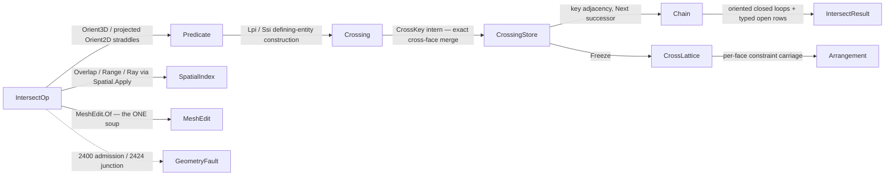

# [RASM_INTERSECTION_INTERSECT]

The predicate-exact crossing lattice of `Rasm.Geometry.Intersection` — ONE `IntersectOp` `[Union]` (`SegmentSegment`/`SegmentTriangle`/`TriangleTriangle`/`RayMesh`/`MeshMesh`/`PlaneMesh`) folded by ONE `Intersection.Apply(IntersectOp, Op? key = null)` entry, every crossing EXISTENCE decided by the `Numerics/predicates#ROBUST_PREDICATES` exact `Orient3D`/`Orient2D` straddle signs and every crossing POINT carried as the landed `Implicit` defining-entity construction (`Lpi` edge×plane over five original points, `Ssi` segment×segment over four points and the projection `Axis`) — signs exact, coordinates rounded ONLY at the `Round()` emission seam. The re-founded `Chain` is the page's spine: every crossing endpoint is KEYED BY ITS DEFINING ENTITIES (`CrossKey` — the piercing edge's canonical vertex pair plus the pierced face), so the same physical crossing produced from two adjacent face pairs interns to ONE row by integer key equality — the cross-face merge no float weld can express — and chains link ACROSS segments by that key adjacency and are walked by TRUE connectivity: a closed loop closes ORIENTED (outer CCW, holes CW in the section frame), an open curve runs end to end as a typed OPEN-chain row, and a dangling endpoint is structurally impossible on manifold input because the edge key is shared by exactly the two faces that bound it.

The page owns `PrimitiveKind` (the primitive vocabulary the `GeometryFault.IntersectionFault(PrimitiveKind, PrimitiveKind)` 2424 payload reads), `IntersectKind` (the op discriminant carrying the primitive-pair and emits-chain columns), `IntersectPolicy`, the `CrossKey`/`Crossing` carriers, the `CrossingStore` single-writer arena under the `Meshing/edit#ARENA_LAW` contract with its frozen `CrossLattice` projection (the per-face crossing sets + defining-entity carriage `Meshing/arrangement` constrains its substrate on), the typed `Chain` row, and the `IntersectResult` union. Broad-phase candidates come ONLY from the landed `Spatial/index` owner through `Spatial.Apply` (`SpatialQuery.Overlap`/`Range`/`Ray`), triangle soups ONLY from the landed `Meshing/edit` `MeshEdit.Of` adapter, and exact coordinate ordering ONLY from the landed `Predicate.Compare` order key — the page authors the narrow phase (Guigue-Devillers mutual straddles) and the key-connectivity chain assembly, nothing a sibling already owns. This owner is the E7 collapse target: `Meshing/arrangement`, `Meshing/offset`, and `Processing/repair` route `Intersection.Apply` — no fourth crossing kernel exists. The host boundary holds at the altitude seam: `Analysis/relations.md` owns Rhino NURBS/Brep parametric curve/surface intersection, this owner owns predicate-exact discrete crossing, and the two meet at no interior.

## [01]-[INDEX]

- [01]-[INTERSECTION]: ONE `Intersection.Apply(IntersectOp, Op?)` entry; `Crossing` = `Implicit` defining-entity construction + `CrossKey` merge key; `CrossingStore` arena + frozen `CrossLattice`; Guigue-Devillers exact narrow phase; key-connectivity chain assembly with oriented closed loops and typed open chains; `PrimitiveKind`/`IntersectKind` vocabularies.

## [02]-[INTERSECTION]

- Owner: `PrimitiveKind` `[SmartEnum<string>]` the primitive vocabulary (`segment`/`triangle`/`ray`/`plane`/`mesh`) MINTED HERE — the `IntersectionFault` payload discriminant and the op-kind column type, composed by the faults owner, never re-minted downstream; `IntersectKind` `[SmartEnum<string>]` the operation discriminant (`segment-segment`/`segment-triangle`/`triangle-triangle`/`ray-mesh`/`mesh-mesh`/`plane-mesh`) binding the shipped `ComparerAccessors.StringOrdinal`, carrying `A`/`B` (`PrimitiveKind` pair — the fault payload derives from the op's own row, never a per-site literal) and `EmitsChain` columns; `IntersectPolicy` the policy row (`BroadPhaseInflation` · `SeedCapacity` — an arena SEED the doubling law grows, never a fixed allocation — · `KeepCoplanar`) registering `IValidityEvidence`; `CrossKey` the defining-entity merge key — `Side` (which operand contributes the piercing edge), `EdgeU`/`EdgeV` (the edge's vertex pair, canonical `U < V`), `Face` (the pierced face of the other operand; `-1` = the cutting plane) — integer equality IS the cross-face merge; `Crossing` the crossing carrier — the `Implicit` exact construction plus its `CrossKey` (the `Site`/`OrderKey`/`RationalKey` rounded-plus-exact dual carriage of the prior fence is DEAD: one exact carrier, one key, rounding at emission only); `CrossingStore` the single-writer arena (key-interned crossing rows, segment pairs with face provenance, the `Next` successor column the chain walk populates) frozen into `CrossLattice` — per-face crossing/segment lookups (`OnFace`) plus the coplanar constraint rows; `Chain` the typed result row (`Points` polyline + `Closed` flag); `IntersectOp`/`IntersectResult` the request/result unions; `Intersection` the static surface.
- Cases: `PrimitiveKind` rows 5; `IntersectKind` rows 6; `IntersectOp` cases `SegmentSegment` · `SegmentTriangle` · `TriangleTriangle` · `RayMesh` · `MeshMesh` · `PlaneMesh` (6); `IntersectResult` cases `Points` · `Segments` · `Chains` (3 — `Chains` carries BOTH the walked `Chain` rows and the frozen `CrossLattice`, so the chain consumer and the arrangement's constraint consumer read one result without a second narrow-phase run).
- Entry: `public static Fin<IntersectResult> Apply(IntersectOp op, Op? key = null)` — the ONE entry discriminating on the op case. `Fin<T>` routes `GeometryFault.DegenerateInput(Kind, index, witness)` 2400 on an inadmissible primitive (zero-length segment, sliver triangle whose plane cannot orient a straddle, non-finite plane — the cross-cutting admission case), and `GeometryFault.IntersectionFault(op.Kind.A, op.Kind.B)` 2424 on a lattice inconsistency (a section edge key incident to three or more faces — a non-manifold junction the chain walk cannot resolve); an OPEN section on a boundaried mesh is NOT a fault — it is a typed `Chain(Closed: false)` row running end to end. `SegmentSegment` is the TYPED 2D RESTRICTION: the case carries its projection `Axis` and the crossing is the `Ssi` construction on that plane — the restriction is in the request shape, never an implicit convention. No `IntersectSegments`/`IntersectMesh`/`SectionPlane` sibling statics — one polymorphic `Apply`.
- Auto: point-level cases run the exact straddle directly — `SegmentSegment` the four projected `Orient2D` signs (both pairs strictly straddling) minting the `Ssi`; `SegmentTriangle` the two `Orient3D` endpoint signs against the triangle plane plus the exact projected in-triangle containment of the `Lpi` construction (containment tested on the IMPLICIT point through `Predicate.Orient2D(in Implicit, …)` — never a rounded materialization); `TriangleTriangle` the Guigue-Devillers procedure: mutual `Orient3D` straddle rejection without one constructed coordinate, canonical reorder placing each lone opposite-side vertex first, the two pierced edges minting `Lpi` endpoints, the shared-line interval ordered by `Predicate.Compare` on the crossing line's dominant axis, the COPLANAR pair (all six signs zero) routing the projected edge×edge `Ssi` sweep under `KeepCoplanar` — every pairwise crossing kept, no interior-crossing drop. Mesh-level cases compose the landed owners: `MeshEdit.Of(space)` admits each soup ONCE (the ONE adapter — a page-local `Soup(MeshSpace)` copy is dead), `Spatial.Apply(SpatialOp.Build(SpatialKind.Bvh, faceBounds, BuildPolicy.Canonical))` builds the BVH, `SpatialQuery.Overlap`/`Range`/`Ray` yield candidates with every `SpatialAnswer` projected by TYPED match routing `Fin` (the three hard casts of the prior fence are dead); each surviving candidate pair runs the narrow phase and interns its crossing endpoints into the `CrossingStore` by `CrossKey` — the same edge×face crossing reached from two face pairs lands on ONE row. `Chain` assembly is forward-following over material-oriented segments: every segment is STORED `from → to` along the op convention (`PlaneMesh`: `cut.Normal × faceNormal`; `MeshMesh`: `nA × nB` — the endpoint order decided by the exact `Compare` on the direction's dominant axis at accumulation), so an interior endpoint carries exactly one outgoing and one incoming segment, the walk follows `outgoing` (`Next` wired as the successor), a source endpoint (outgoing, no incoming) opens a typed OPEN chain, a remaining forward cycle closes a loop — outer CCW, holes CW in the section frame by construction — and a SECOND outgoing on one endpoint is the non-manifold junction routed typed; `RayMesh` takes the BVH front-to-back candidate and re-decides the hit exactly.
- Receipt: none on a dedicated rail — the `IntersectResult` union IS the typed result; `Chains` carries the frozen `CrossLattice` as evidence-bearing payload (crossing rows with defining-entity carriage, per-face constraint sets, coplanar rows) so the arrangement consumes the SAME run's lattice; the hash-eligible artifacts are the emitted `Polyline`/`Point3d` values at the `Round()` seam, never the live arena.
- Packages: `Rasm.Geometry.Numerics` (`Predicate` straddle/containment/`Compare`, `Implicit`/`Ssi`/`Lpi`, `Sign`, `Axis` — the exact floor; the prior fence's `ExtendedNumerics.Fraction` order-key import is DEAD — exact ordering lives inside the predicate owner), `Rasm.Geometry.Spatial` (`Spatial.Apply` + `SpatialOp`/`SpatialQuery`/`QueryResult`/`SpatialAnswer` — the broad-phase, composed), `Rasm.Geometry.Meshing` (`MeshEdit.Of` the ONE soup adapter), `Rasm.Geometry` (`GeometryFault`), `Rasm.Domain` (`Op`, `Kind`, `ValidityClaim`/`IValidityEvidence`), `Rasm`/Vectors (`Point3d`/`Line`/`Plane`/`Ray3d`/`Polyline`/`BoundingBox`/`MeshSpace`), Thinktecture.Runtime.Extensions, LanguageExt.Core, BCL inbox (`Dictionary<,>`, `List<T>`).
- Growth: a new crossing modality (curve-surface, swept-volume) is one `IntersectKind` row plus one `IntersectOp` case reading the SAME straddle narrow-phase and the SAME key-connectivity assembly; a new crossing construction is the predicate owner's `Implicit` case (this page widens by zero carriers); a new broad-phase knob is one `IntersectPolicy` column; the slice-stack consumer (`Meshing/slice`, W4) composes `PlaneMesh` over a plane family — a consumer fold, never a seventh case here; zero new surface.
- Boundary: the intersection owner is the ONE `IntersectOp` `[Union]` and a `SegmentIntersector`/`MeshIntersector`/`PlaneSectioner` sibling family is the named density defect collapsed onto one union; the crossing point is the `Implicit` defining-entity construction and a rounded `Point3d` materialized at birth beside an exact sort key (the dead `Site`+`OrderKey`+`RationalKey` triple) is the named robustness defect this rebuild deletes — the chain's combinatorial structure derives from INTEGER key equality and exact `Compare` signs, never a float weld or a float parametric sort; the chain is walked by defining-entity adjacency and a proximity-keyed endpoint merge is the deleted form; closed loops are ORIENTED at emission and a kind-keyed concat of unoriented fragments is the deleted form; open sections are TYPED rows and silent closure or silent drop of a non-watertight section is forbidden; the broad-phase composes `Spatial.Apply` and a local quadratic all-pairs scan or a second acceleration structure is the deleted form; every `SpatialAnswer` projects by typed match routing `Fin` and a hard cast is the deleted form; the soup adapter is `MeshEdit.Of` and a per-page `DuplicateNative` soup copy is the deleted form; `Apply` is total over the `Fin` rail and a thrown exception on a degenerate primitive is forbidden; the `CrossingStore` is an honest single-writer arena under the `Meshing/edit#ARENA_LAW` contract (seed capacity + amortized doubling — never a fixed `1 << 22` allocation) whose frozen `CrossLattice` is the only projection consumers hold; the host altitude boundary holds — `Analysis/relations.md` owns parametric curve/surface intersection and this owner never re-derives it, `relations.md` never re-derives the discrete lattice.

```csharp
// --- [RUNTIME_PRELUDE] ----------------------------------------------------------------------
using System;
using System.Collections.Generic;
using System.Linq;
using LanguageExt;
using LanguageExt.Common;
using Rasm.Domain;
using Rasm.Geometry;
using Rasm.Geometry.Meshing;
using Rasm.Geometry.Numerics;
using Rasm.Geometry.Spatial;
using Rasm.Vectors;
using Rhino.Geometry;
using Thinktecture;
using static LanguageExt.Prelude;

namespace Rasm.Geometry.Intersection;

// --- [TYPES] ------------------------------------------------------------------------------
// The primitive vocabulary the IntersectionFault(A, B) payload reads — minted HERE, composed by
// the faults owner and every op-kind row.
[SmartEnum<string>]
[KeyMemberEqualityComparer<ComparerAccessors.StringOrdinal, string>]
[KeyMemberComparer<ComparerAccessors.StringOrdinal, string>]
public sealed partial class PrimitiveKind {
    public static readonly PrimitiveKind Segment  = new("segment");
    public static readonly PrimitiveKind Triangle = new("triangle");
    public static readonly PrimitiveKind Ray      = new("ray");
    public static readonly PrimitiveKind Plane    = new("plane");
    public static readonly PrimitiveKind Mesh     = new("mesh");
}

[SmartEnum<string>]
[KeyMemberEqualityComparer<ComparerAccessors.StringOrdinal, string>]
[KeyMemberComparer<ComparerAccessors.StringOrdinal, string>]
public sealed partial class IntersectKind {
    public static readonly IntersectKind SegmentSegment   = new("segment-segment", PrimitiveKind.Segment, PrimitiveKind.Segment, emitsChain: false);
    public static readonly IntersectKind SegmentTriangle  = new("segment-triangle", PrimitiveKind.Segment, PrimitiveKind.Triangle, emitsChain: false);
    public static readonly IntersectKind TriangleTriangle = new("triangle-triangle", PrimitiveKind.Triangle, PrimitiveKind.Triangle, emitsChain: false);
    public static readonly IntersectKind RayMesh          = new("ray-mesh", PrimitiveKind.Ray, PrimitiveKind.Mesh, emitsChain: false);
    public static readonly IntersectKind MeshMesh         = new("mesh-mesh", PrimitiveKind.Mesh, PrimitiveKind.Mesh, emitsChain: true);
    public static readonly IntersectKind PlaneMesh        = new("plane-mesh", PrimitiveKind.Plane, PrimitiveKind.Mesh, emitsChain: true);

    public PrimitiveKind A { get; }
    public PrimitiveKind B { get; }
    public bool EmitsChain { get; }
}

// --- [CONSTANTS] --------------------------------------------------------------------------
// SeedCapacity seeds the arena; amortized doubling grows it — a fixed-cap crossing allocation is
// the dead prior form.
public sealed record IntersectPolicy(double BroadPhaseInflation, int SeedCapacity, bool KeepCoplanar) : IValidityEvidence {
    public static readonly IntersectPolicy Canonical = new(BroadPhaseInflation: 1e-9, SeedCapacity: 256, KeepCoplanar: true);

    public bool IsValid => ValidityClaim.All(
        ValidityClaim.Nonnegative(value: BroadPhaseInflation),
        ValidityClaim.Positive(value: SeedCapacity));
}

// --- [MODELS] -----------------------------------------------------------------------------
// The defining-entity merge key: integer equality IS the cross-face merge. Side = the operand
// contributing the piercing edge; EdgeU/EdgeV canonical (U < V); Face = the pierced face of the
// other operand, -1 for the cutting plane.
public readonly record struct CrossKey(int Side, int EdgeU, int EdgeV, int Face) {
    public static CrossKey Of(int side, int u, int v, int face) => new(side, int.Min(u, v), int.Max(u, v), face);
}

// One exact carrier, one key; Round() happens at the emission seam only.
public readonly record struct Crossing(Implicit Point, CrossKey Key);

public sealed record Chain(Polyline Points, bool Closed);

// Frozen projection of the arena: the per-face crossing/segment sets the arrangement constrains
// its substrate on, with defining-entity carriage intact. Coplanar rows are constraint-only
// contributions (an area contact is not a curve — it never enters the chain walk).
public sealed record CrossLattice(
    Crossing[] Rows,
    (int A, int B, int FaceA, int FaceB)[] Segments,
    (int A, int B, int FaceA, int FaceB)[] Coplanar) {
    public IEnumerable<(int A, int B, int FaceA, int FaceB)> OnFace(int side, int face) =>
        Segments.Concat(Coplanar).Where(s => (side == 0 ? s.FaceA : s.FaceB) == face);
}

// Single-writer arena under the Meshing/edit ARENA_LAW: key-interned crossing rows, segment pairs,
// and the Next successor column the chain walk populates. Freeze() is the one projection.
public sealed class CrossingStore {
    Crossing[] rows;
    int[] next;
    readonly Dictionary<CrossKey, int> interned = [];
    readonly List<(int A, int B, int FaceA, int FaceB)> segments = [];
    readonly List<(int A, int B, int FaceA, int FaceB)> coplanar = [];
    int count;

    public CrossingStore(int seed) { rows = new Crossing[seed]; next = new int[seed]; }

    public int Count => count;
    public Crossing Row(int slot) => rows[slot];
    public int Next(int slot) => next[slot];
    internal void Link(int slot, int successor) => next[slot] = successor;

    // Intern by defining-entity key: the same physical crossing reached from two adjacent face
    // pairs lands on ONE row — exact integer merge, no float weld.
    public int Intern(in Implicit point, CrossKey key) {
        if (interned.TryGetValue(key, out int at)) { return at; }
        Grow(count + 1);
        (rows[count], next[count]) = (new Crossing(point, key), -1);
        return interned[key] = count++;
    }

    public void Segment(int a, int b, int faceA, int faceB) => segments.Add((a, b, faceA, faceB));
    public void CoplanarRow(int a, int b, int faceA, int faceB) => coplanar.Add((a, b, faceA, faceB));

    public CrossLattice Freeze() => new([.. rows.AsSpan(0, count)], [.. segments], [.. coplanar]);

    void Grow(int needed) {
        if (needed <= rows.Length) { return; }
        int extent = int.Max(needed, rows.Length << 1);
        Array.Resize(ref rows, extent);
        Array.Resize(ref next, extent);
    }
}

[Union(ConversionFromValue = ConversionOperatorsGeneration.None)]
public abstract partial record IntersectResult {
    private IntersectResult() { }

    public sealed record Points(Seq<Point3d> Hits) : IntersectResult;
    public sealed record Segments(Seq<Line> Crossings) : IntersectResult;
    public sealed record Chains(Seq<Chain> Walked, CrossLattice Lattice) : IntersectResult;
}

// --- [OPERATIONS] -------------------------------------------------------------------------
[Union(ConversionFromValue = ConversionOperatorsGeneration.None)]
public abstract partial record IntersectOp {
    private IntersectOp() { }

    // The 2D restriction is TYPED: the case carries its projection Axis; the crossing is the Ssi.
    public sealed record SegmentSegment(Line A, Line B, Axis Plane, IntersectPolicy Policy) : IntersectOp;
    public sealed record SegmentTriangle(Line Edge, Point3d Ta, Point3d Tb, Point3d Tc, IntersectPolicy Policy) : IntersectOp;
    public sealed record TriangleTriangle(Point3d Pa, Point3d Pb, Point3d Pc, Point3d Qa, Point3d Qb, Point3d Qc, IntersectPolicy Policy) : IntersectOp;
    public sealed record RayMesh(Ray3d Ray, double MaxT, MeshSpace Mesh, IntersectPolicy Policy) : IntersectOp;
    public sealed record MeshMesh(MeshSpace A, MeshSpace B, IntersectPolicy Policy) : IntersectOp;
    public sealed record PlaneMesh(Plane Cut, MeshSpace Mesh, IntersectPolicy Policy) : IntersectOp;

    public IntersectKind Kind =>
        Switch(
            segmentSegment:   static _ => IntersectKind.SegmentSegment,
            segmentTriangle:  static _ => IntersectKind.SegmentTriangle,
            triangleTriangle: static _ => IntersectKind.TriangleTriangle,
            rayMesh:          static _ => IntersectKind.RayMesh,
            meshMesh:         static _ => IntersectKind.MeshMesh,
            planeMesh:        static _ => IntersectKind.PlaneMesh);
}

public static class Intersection {
    public static Fin<IntersectResult> Apply(IntersectOp op, Op? key = null) =>
        Admit(op).Bind(_ => op switch {
            IntersectOp.SegmentSegment s   => Fin.Succ(CrossSegments2D(s.A, s.B, s.Plane)
                .Match(Some: c => (IntersectResult)new IntersectResult.Points(Seq(c.Point.Round())), None: () => new IntersectResult.Points(Empty))),
            IntersectOp.SegmentTriangle s  => Fin.Succ((IntersectResult)new IntersectResult.Points(
                EdgePierce(s.Edge.From, s.Edge.To, s.Ta, s.Tb, s.Tc).Match(Some: p => Seq(p.Round()), None: () => Seq<Point3d>()))),
            IntersectOp.TriangleTriangle t => Fin.Succ((IntersectResult)new IntersectResult.Segments(
                TriTriSegment(t.Pa, t.Pb, t.Pc, t.Qa, t.Qb, t.Qc).Match(
                    Some: seg => Seq(new Line(seg.A.Round(), seg.B.Round())),
                    None: () => Seq<Line>()))),
            IntersectOp.RayMesh r          => FirstHit(r, key),
            IntersectOp.MeshMesh m         => Lattice(m, key).Bind(store => Walk(store, op.Kind)),
            IntersectOp.PlaneMesh p        => Section(p, key).Bind(store => Walk(store, op.Kind)),
            _                              => Fin.Fail<IntersectResult>(new GeometryFault.IntersectionFault(op.Kind.A, op.Kind.B).ToError()),
        });

    // Admission (the cross-cutting 2400 case): degenerate primitives fail HERE, once; the interior
    // never re-validates.
    static Fin<Unit> Admit(IntersectOp op) =>
        op switch {
            IntersectOp.SegmentSegment s when s.A.Length == 0.0 || s.B.Length == 0.0            => Reject(Kind.Line, "zero-length segment"),
            IntersectOp.SegmentTriangle s when s.Edge.Length == 0.0                             => Reject(Kind.Line, "zero-length segment"),
            IntersectOp.SegmentTriangle s when Sliver(s.Ta, s.Tb, s.Tc)                         => Reject(Kind.Mesh, "sliver triangle"),
            IntersectOp.TriangleTriangle t when Sliver(t.Pa, t.Pb, t.Pc) || Sliver(t.Qa, t.Qb, t.Qc) => Reject(Kind.Mesh, "sliver triangle"),
            IntersectOp.PlaneMesh p when !p.Cut.IsValid                                         => Reject(Kind.Plane, "non-finite plane"),
            IntersectOp.RayMesh r when !(r.MaxT > 0.0) || !r.Ray.Direction.IsValid              => Reject(Kind.Point, "degenerate ray"),
            _                                                                                   => Fin.Succ(unit),
        };

    static Fin<Unit> Reject(Kind kind, string witness) =>
        Fin.Fail<Unit>(new GeometryFault.DegenerateInput(kind, 0, witness).ToError());

    static bool Sliver(Point3d a, Point3d b, Point3d c) =>
        Predicate.Orient2D(a, b, c) == Sign.Zero
        && Predicate.Orient2D(Swap(a, Axis.X), Swap(b, Axis.X), Swap(c, Axis.X)) == Sign.Zero
        && Predicate.Orient2D(Swap(a, Axis.Y), Swap(b, Axis.Y), Swap(c, Axis.Y)) == Sign.Zero;

    static Point3d Swap(Point3d p, Axis axis) => new(Axis.Coord(p, axis.U), Axis.Coord(p, axis.V), 0.0);

    // --- [NARROW_PHASE]
    // Four projected Orient2D signs decide the 2D crossing; the point is the Ssi over the four
    // defining endpoints on the typed plane.
    static Option<Crossing> CrossSegments2D(Line a, Line b, Axis plane) {
        Sign d1 = Predicate.Orient2D(new Implicit(a.From), new Implicit(a.To), new Implicit(b.From), plane);
        Sign d2 = Predicate.Orient2D(new Implicit(a.From), new Implicit(a.To), new Implicit(b.To), plane);
        Sign d3 = Predicate.Orient2D(new Implicit(b.From), new Implicit(b.To), new Implicit(a.From), plane);
        Sign d4 = Predicate.Orient2D(new Implicit(b.From), new Implicit(b.To), new Implicit(a.To), plane);
        return d1.Times(d2) == Sign.Negative && d3.Times(d4) == Sign.Negative
            ? Some(new Crossing(new Ssi(a.From, a.To, b.From, b.To, plane), CrossKey.Of(0, 0, 1, -1)))
            : None;
    }

    // Edge-x-plane pierce with EXACT in-triangle containment of the IMPLICIT point — the projected
    // Orient2D containment runs on the Lpi construction, never a rounded materialization.
    static Option<Implicit> EdgePierce(Point3d u, Point3d v, Point3d a, Point3d b, Point3d c) {
        Sign su = Predicate.Orient3D(a, b, c, u), sv = Predicate.Orient3D(a, b, c, v);
        if (su.Times(sv) != Sign.Negative) { return None; }
        Implicit hit = new Lpi(u, v, a, b, c);
        Axis axis = DominantAxis(a, b, c);
        Sign s0 = Predicate.Orient2D(new Implicit(a), new Implicit(b), hit, axis);
        Sign s1 = Predicate.Orient2D(new Implicit(b), new Implicit(c), hit, axis);
        Sign s2 = Predicate.Orient2D(new Implicit(c), new Implicit(a), hit, axis);
        bool inside = (s0 != Sign.Negative && s1 != Sign.Negative && s2 != Sign.Negative)
            || (s0 != Sign.Positive && s1 != Sign.Positive && s2 != Sign.Positive);
        return inside ? Some(hit) : None;
    }

    // --- [GUIGUE_DEVILLERS]
    // Mutual straddle rejection with zero constructed coordinates; on a real crossing the two
    // pierced edges mint Lpi endpoints ordered by the exact Compare on the crossing line's
    // dominant axis. The coplanar pair (all six signs Zero) is the caller-visible None here — the
    // mesh fold routes it to the coplanar Ssi sweep.
    static Option<(Implicit A, Implicit B)> TriTriSegment(Point3d pa, Point3d pb, Point3d pc, Point3d qa, Point3d qb, Point3d qc) {
        Span<Sign> q = [Predicate.Orient3D(pa, pb, pc, qa), Predicate.Orient3D(pa, pb, pc, qb), Predicate.Orient3D(pa, pb, pc, qc)];
        if (SameSide(q)) { return None; }
        Span<Sign> p = [Predicate.Orient3D(qa, qb, qc, pa), Predicate.Orient3D(qa, qb, qc, pb), Predicate.Orient3D(qa, qb, qc, pc)];
        if (SameSide(p)) { return None; }
        var hits = new List<Implicit>(4);
        Collect(hits, pa, pb, pc, p, qa, qb, qc);
        Collect(hits, qa, qb, qc, q, pa, pb, pc);
        if (hits.Count < 2) { return None; }
        Axis order = DominantAxis(pa, pb, pc);
        hits.Sort((l, r) => Predicate.Compare(in l, in r, order).Key);
        return Some((hits[0], hits[^1]));

        static void Collect(List<Implicit> hits, Point3d a, Point3d b, Point3d c, ReadOnlySpan<Sign> signs, Point3d ta, Point3d tb, Point3d tc) {
            Span<(Point3d U, Point3d V, Sign Su, Sign Sv)> edges = [(a, b, signs[0], signs[1]), (b, c, signs[1], signs[2]), (c, a, signs[2], signs[0])];
            foreach ((Point3d u, Point3d v, Sign su, Sign sv) in edges) {
                if (su.Times(sv) == Sign.Negative && EdgePierce(u, v, ta, tb, tc).Case is Implicit hit) { hits.Add(hit); }
            }
        }
    }

    static bool SameSide(ReadOnlySpan<Sign> s) =>
        (s[0] != Sign.Negative && s[1] != Sign.Negative && s[2] != Sign.Negative && (s[0] == Sign.Positive || s[1] == Sign.Positive || s[2] == Sign.Positive))
        || (s[0] != Sign.Positive && s[1] != Sign.Positive && s[2] != Sign.Positive && (s[0] == Sign.Negative || s[1] == Sign.Negative || s[2] == Sign.Negative));

    // --- [BROAD_PHASE]
    // Every SpatialAnswer projects by TYPED match routing Fin — a hard cast is the deleted form.
    static Fin<SpatialIndex> Bvh(MeshEdit soup, Op? key) {
        var boxes = new BoundingBox[soup.FaceCount];
        for (int f = 0; f < soup.FaceCount; f++) { boxes[f] = soup.Bounds(f); }
        return Spatial.Apply(new SpatialOp.Build(SpatialKind.Bvh, boxes, BuildPolicy.Canonical), key)
            .Bind(static answer => answer is SpatialAnswer.Index built
                ? Fin.Succ(built.Value)
                : Fin.Fail<SpatialIndex>(new GeometryFault.KindMismatch(SpatialKind.Bvh, QueryKind.Overlap).ToError()));
    }

    static Fin<Seq<(int Left, int Right)>> OverlapPairs(SpatialIndex a, SpatialIndex b, double inflation, Op? key) =>
        Spatial.Apply(new SpatialOp.Query(a, new SpatialQuery.Overlap(b, inflation)), key)
            .Bind(static answer => answer is SpatialAnswer.Result { Value: QueryResult.Pairs pairs }
                ? Fin.Succ(pairs.Overlaps)
                : Fin.Fail<Seq<(int, int)>>(new GeometryFault.KindMismatch(SpatialKind.Bvh, QueryKind.Overlap).ToError()));

    // --- [LATTICE]
    // Each pierced edge x face interns under its CrossKey: the same crossing reached from two
    // adjacent face pairs merges by integer equality — the cross-face merge that keys the chain.
    static Fin<CrossingStore> Lattice(IntersectOp.MeshMesh op, Op? key) {
        using MeshEdit ea = MeshEdit.Of(op.A);
        using MeshEdit eb = MeshEdit.Of(op.B);
        return (Bvh(ea, key), Bvh(eb, key)).Apply((ia, ib) => (ia, ib)).As()
            .Bind(t => OverlapPairs(t.ia, t.ib, op.Policy.BroadPhaseInflation, key))
            .Map(pairs => pairs.Fold(new CrossingStore(op.Policy.SeedCapacity), (store, pair) => PairCrossings(store, ea, eb, pair.Left, pair.Right, op.Policy)));
    }

    static CrossingStore PairCrossings(CrossingStore store, MeshEdit a, MeshEdit b, int fa, int fb, IntersectPolicy policy) {
        (int a0, int a1, int a2) = a.Face(fa);
        (int b0, int b1, int b2) = b.Face(fb);
        (Point3d pa, Point3d pb, Point3d pc) = (a.Position(a0), a.Position(a1), a.Position(a2));
        (Point3d qa, Point3d qb, Point3d qc) = (b.Position(b0), b.Position(b1), b.Position(b2));
        Span<Sign> qs = [Predicate.Orient3D(pa, pb, pc, qa), Predicate.Orient3D(pa, pb, pc, qb), Predicate.Orient3D(pa, pb, pc, qc)];
        if (qs[0] == Sign.Zero && qs[1] == Sign.Zero && qs[2] == Sign.Zero) {
            return policy.KeepCoplanar ? CoplanarCrossings(store, a, b, fa, fb) : store;
        }
        var ends = new List<int>(2);
        Pierce(store, ends, side: 0, (a0, a1), (a0, a2), (a1, a2), a, fb, qa, qb, qc);
        Pierce(store, ends, side: 1, (b0, b1), (b0, b2), (b1, b2), b, fa, pa, pb, pc);
        if (ends.Count == 2) {
            Vector3d material = Vector3d.CrossProduct(Vector3d.CrossProduct(pb - pa, pc - pa), Vector3d.CrossProduct(qb - qa, qc - qa));
            (int from, int to) = Oriented(store, ends[0], ends[1], material);
            store.Segment(from, to, fa, fb);
        }
        return store;

        static void Pierce(CrossingStore store, List<int> ends, int side, (int U, int V) e0, (int U, int V) e1, (int U, int V) e2, MeshEdit soup, int face, Point3d ta, Point3d tb, Point3d tc) {
            foreach ((int u, int v) in (ReadOnlySpan<(int, int)>)[e0, e1, e2]) {
                if (EdgePierce(soup.Position(u), soup.Position(v), ta, tb, tc).Case is Implicit hit) {
                    ends.Add(store.Intern(in hit, CrossKey.Of(side, u, v, face)));
                }
            }
        }
    }

    // Material orientation lands at ACCUMULATION: each segment is stored from -> to along the op
    // convention (nA x nB for mesh-mesh, cut.Normal x faceNormal for sections), the endpoint order
    // decided by the exact Compare on the direction's dominant axis — the chain walk then follows
    // stored direction and closed loops close outer-CCW / holes-CW by construction.
    static (int From, int To) Oriented(CrossingStore store, int e0, int e1, Vector3d material) {
        Axis axis = Math.Abs(material.X) >= Math.Abs(material.Y) && Math.Abs(material.X) >= Math.Abs(material.Z) ? Axis.X
            : Math.Abs(material.Y) >= Math.Abs(material.Z) ? Axis.Y : Axis.Z;
        Implicit p0 = store.Row(e0).Point;
        Implicit p1 = store.Row(e1).Point;
        Sign order = Predicate.Compare(in p0, in p1, axis).Times(Sign.Of(Axis.Coord(new Point3d(material.X, material.Y, material.Z), axis.Key)));
        return order == Sign.Negative ? (e0, e1) : (e1, e0);
    }

    // Coplanar contact is an AREA: every projected edge x edge Ssi is kept as a constraint row on
    // BOTH faces (no interior-crossing drop — the flush-contact boolean's worst case), and none of
    // it enters the chain walk.
    static CrossingStore CoplanarCrossings(CrossingStore store, MeshEdit a, MeshEdit b, int fa, int fb) {
        (int a0, int a1, int a2) = a.Face(fa);
        (int b0, int b1, int b2) = b.Face(fb);
        Axis plane = DominantAxis(a.Position(a0), a.Position(a1), a.Position(a2));
        foreach ((int u, int v) in (ReadOnlySpan<(int, int)>)[(a0, a1), (a1, a2), (a2, a0)]) {
            foreach ((int s, int t) in (ReadOnlySpan<(int, int)>)[(b0, b1), (b1, b2), (b2, b0)]) {
                Line euv = new(a.Position(u), a.Position(v));
                Line est = new(b.Position(s), b.Position(t));
                if (CrossSegments2D(euv, est, plane).Case is Crossing hit) {
                    int at = store.Intern(hit.Point, CrossKey.Of(0, u, v, fb));
                    int bt = store.Intern(hit.Point, CrossKey.Of(1, s, t, fa));
                    store.CoplanarRow(at, bt, fa, fb);
                }
            }
        }
        return store;
    }

    // Plane section: each straddling face contributes one segment between its two pierced-edge
    // rows; the edge key is shared by the adjacent face, so section connectivity is EXACT by
    // construction — a dangling endpoint cannot exist on a manifold edge.
    static Fin<CrossingStore> Section(IntersectOp.PlaneMesh op, Op? key) {
        using MeshEdit soup = MeshEdit.Of(op.Mesh);
        (Point3d po, Point3d px, Point3d py) = (op.Cut.Origin, op.Cut.Origin + op.Cut.XAxis, op.Cut.Origin + op.Cut.YAxis);
        return Bvh(soup, key)
            .Bind(index => Spatial.Apply(new SpatialOp.Query(index, new SpatialQuery.Range(Slab(op.Cut, soup), None)), key))
            .Bind(static answer => answer is SpatialAnswer.Result { Value: QueryResult.Hits hits }
                ? Fin.Succ(hits.Ids)
                : Fin.Fail<Seq<int>>(new GeometryFault.KindMismatch(SpatialKind.Bvh, QueryKind.Range).ToError()))
            .Map(faces => faces.Fold(new CrossingStore(op.Policy.SeedCapacity), (store, f) => {
                (int v0, int v1, int v2) = soup.Face(f);
                var ends = new List<int>(2);
                foreach ((int u, int v) in (ReadOnlySpan<(int, int)>)[(v0, v1), (v1, v2), (v2, v0)]) {
                    if (EdgePierce(soup.Position(u), soup.Position(v), po, px, py).Case is Implicit hit) {
                        ends.Add(store.Intern(in hit, CrossKey.Of(0, u, v, -1)));
                    }
                }
                if (ends.Count == 2) {
                    Vector3d faceNormal = Vector3d.CrossProduct(soup.Position(v1) - soup.Position(v0), soup.Position(v2) - soup.Position(v0));
                    (int from, int to) = Oriented(store, ends[0], ends[1], Vector3d.CrossProduct(op.Cut.Normal, faceNormal));
                    store.Segment(from, to, f, -1);
                }
                return store;
            }));
    }

    // Broad-phase nearest candidate from the BVH front-to-back ray descent; the exact EdgePierce
    // re-decides the hit on the candidate face — the acceleration selects, the predicate decides.
    static Fin<IntersectResult> FirstHit(IntersectOp.RayMesh op, Op? key) {
        using MeshEdit soup = MeshEdit.Of(op.Mesh);
        Line probe = new(op.Ray.Position, op.Ray.PointAt(op.MaxT));
        return Bvh(soup, key)
            .Bind(index => Spatial.Apply(new SpatialOp.Query(index, new SpatialQuery.Ray(op.Ray, op.MaxT)), key))
            .Bind(static answer => answer is SpatialAnswer.Result { Value: QueryResult.RayHit hit }
                ? Fin.Succ(hit.Id)
                : Fin.Fail<Option<int>>(new GeometryFault.KindMismatch(SpatialKind.Bvh, QueryKind.Ray).ToError()))
            .Map(candidate => (IntersectResult)new IntersectResult.Points(candidate.Match(
                Some: f => {
                    (int v0, int v1, int v2) = soup.Face(f);
                    return EdgePierce(probe.From, probe.To, soup.Position(v0), soup.Position(v1), soup.Position(v2))
                        .Match(Some: static hit => Seq(hit.Round()), None: () => Seq<Point3d>());
                },
                None: () => Seq<Point3d>())));
    }

    // --- [CHAIN]
    // TRUE connectivity, forward-following: segments are stored material-oriented, so every
    // interior endpoint has exactly one outgoing (A -> B) and one incoming segment — the walk
    // follows `outgoing` (Next wired as the successor), sources (out, no in) open the typed OPEN
    // chains, remaining forward cycles are the closed loops (outer CCW / holes CW by the stored
    // orientation), and a second outgoing on one endpoint is the non-manifold junction fault.
    static Fin<IntersectResult> Walk(CrossingStore store, IntersectKind kind) {
        CrossLattice lattice = store.Freeze();
        var outgoing = new Dictionary<int, int>();
        var incoming = new HashSet<int>();
        foreach ((int a, int b, _, _) in lattice.Segments) {
            if (!outgoing.TryAdd(a, b)) {
                return Fin.Fail<IntersectResult>(new GeometryFault.IntersectionFault(kind.A, kind.B).ToError());
            }
            incoming.Add(b);
        }
        var visited = new HashSet<int>();
        var chains = new List<Chain>();
        foreach (int seed in outgoing.Keys.Where(a => !incoming.Contains(a)).Concat(outgoing.Keys).ToArray()) {
            if (visited.Contains(seed)) { continue; }
            var walk = new List<int> { seed };
            visited.Add(seed);
            int cur = seed;
            while (outgoing.TryGetValue(cur, out int nxt) && !visited.Contains(nxt)) {
                store.Link(cur, nxt);
                visited.Add(nxt);
                walk.Add(nxt);
                cur = nxt;
            }
            bool closed = outgoing.TryGetValue(cur, out int back) && back == seed && walk.Count > 2;
            var polyline = new Polyline(walk.Select(slot => lattice.Rows[slot].Point.Round()));
            if (closed) { polyline.Add(polyline[0]); store.Link(cur, seed); }
            if (polyline.Count > 1) { chains.Add(new Chain(polyline, closed)); }
        }
        return Fin.Succ((IntersectResult)new IntersectResult.Chains(toSeq(chains), lattice));
    }

    // --- [PRIMITIVES]
    // The Range probe sweeps the whole-mesh bounds — a correct, never-false-negative candidate
    // set; the exact per-edge straddle IS the narrow phase. An axis-aligned slab prune for
    // parallel-plane families is the slice consumer's recorded refinement (W4), not a second
    // broad-phase here.
    static BoundingBox Slab(Plane cut, MeshEdit soup) {
        var bounds = BoundingBox.Empty;
        for (int v = 0; v < soup.VertexCount; v++) { bounds.Union(soup.Position(v)); }
        _ = cut;
        return bounds;
    }

    static Axis DominantAxis(Point3d a, Point3d b, Point3d c) {
        Vector3d n = Vector3d.CrossProduct(b - a, c - a);
        (double x, double y, double z) = (Math.Abs(n.X), Math.Abs(n.Y), Math.Abs(n.Z));
        return x >= y && x >= z ? Axis.X : y >= z ? Axis.Y : Axis.Z;
    }
}
```



## [03]-[DENSITY_BAR]

One owner per axis; capability is a case, row, or fold arm, never a sibling surface. The `[RAIL]` cell names the one return rail each owner exposes.

| [INDEX] | [AXIS/CONCERN]     | [OWNER]          | [KIND]                                                                                              | [RAIL]                                              | [CASES] |
| :-----: | :----------------- | :--------------- | :--------------------------------------------------------------------------------------------------- | :---------------------------------------------------- | :-----: |
|  [01]   | Intersection       | `IntersectOp`    | `[Union]` six cases folded by ONE `Apply` with `Op?` threading                                      | `Intersection.Apply → Fin<IntersectResult>`          |    6    |
|  [1a]   | Primitive kinds    | `PrimitiveKind`  | `[SmartEnum<string>]` — the 2424 fault payload vocabulary, minted here                              | payload row (faults compose it)                      |    5    |
|  [1b]   | Operation kind     | `IntersectKind`  | `[SmartEnum<string>]` + `A`/`B` primitive-pair and `EmitsChain` columns                             | discriminant (fault payload derives from the row)    |    6    |
|  [1c]   | Crossing carrier   | `Crossing`       | `Implicit` defining-entity construction + `CrossKey` integer merge key                              | carrier (`Round()` at emission only)                 |    —    |
|  [1d]   | Chain arena        | `CrossingStore`  | single-writer arena (key intern · segments · `Next` successor) + `Freeze → CrossLattice`            | frozen projection                                    |    —    |
|  [1e]   | Result             | `IntersectResult`| `[Union]` `Points`/`Segments`/`Chains(Walked, Lattice)` — typed open chains, oriented closed loops  | carrier                                              |    3    |

The exact ordering machinery of the prior fence (`Expansion OrderKey` + `Fraction RationalKey` + rounded `Site`) is DEAD: connectivity derives from integer `CrossKey` equality, ordering where still needed (ray hits, coplanar sweeps, multi-crossing constraints) routes the landed `Predicate.Compare` order key, and the one materialization is `Implicit.Round()` at emission.

## [04]-[RESEARCH]

- [GUIGUE_DEVILLERS_EXACT] — `TriTriSegment` is the Guigue-Devillers procedure at full exactness: two mutual `Orient3D` straddle sweeps reject the trivial non-crossing with zero constructed coordinates; on a crossing, each triangle's pierced edges (differing non-zero endpoint signs) mint `Lpi` endpoints whose in-triangle containment is tested ON THE IMPLICIT POINT through the projected `Orient2D` family, and the shared-line interval orders by `Predicate.Compare` on the crossing line's dominant axis — no float parametric sort, no swapped or doubled endpoint. The coplanar pair (all six signs `Zero`) routes the projected edge×edge `Ssi` sweep under `IntersectPolicy.KeepCoplanar`, every pairwise crossing recorded on BOTH faces as constraint rows — the flush-contact boolean's worst case carries its full crossing set, never an endpoint-only truncation. The law-matrix (`IntersectionLaws`, CsCheck under `testing-cs`) proves straddle agreement against the `Fraction` rational oracle, interval totality under vertex permutation, and rigid-transform invariance of the crossing set.
- [DEFINING_ENTITY_CHAIN] — the chain's correctness is structural, not tolerant: a crossing endpoint is `CrossKey(side, edgeU, edgeV, face)`, so the crossing of edge `(u,v)` with face `f` computed while processing face pair `(fa, fb)` and again while processing `(fa', fb)` — the two faces sharing that edge — interns to ONE row by integer equality, which is exactly the cross-face merge key the prior fence lacked. Section connectivity inherits manifoldness: an edge key is shared by exactly the two faces bounding the edge, so every interior section endpoint receives one incoming and one outgoing material-oriented segment and the forward walk closes; a mesh boundary edge yields a source or sink — the typed OPEN `Chain(Closed: false)` row — and a second outgoing on one endpoint is the non-manifold junction routed `IntersectionFault(kind.A, kind.B)`. Orientation is decided at ACCUMULATION (each segment stored `from → to` along `cut.Normal × faceNormal` for sections, `nA × nB` for mesh-mesh, the endpoint order an exact `Compare` verdict), so closed loops emit outer CCW and holes CW in the section frame by construction — the orientation `Meshing/slice` (W4) nests on and `Drawing/view` `Section` consumes. The `Next` successor column is populated by the walk itself — the store's chain state is real, never a dead column.
- [LATTICE_SEAM] — `IntersectResult.Chains` carries the frozen `CrossLattice` beside the walked chains: the arrangement consumes the SAME run's per-face crossing sets (`OnFace`) with defining-entity carriage intact — its per-face substrate constraints intern crossing endpoints as `Implicit` vertex rows and ride `Constraint.Crossing` foreign-plane carriage into `Tessellation.Build`, so the E7 collapse lands BY CONSUMERS: `Meshing/arrangement` (face subdivision), `Meshing/offset` (`SegmentsCross` and loop-resolution crossings), and `Processing/repair` (W3 self-intersect re-mesh) all route `Intersection.Apply`, and a fourth crossing kernel anywhere in the kernel is the deleted form. The altitude boundary holds at `Analysis/relations.md`: host-parametric NURBS/Brep curve/surface intersection stays the host owner's, this page owns predicate-exact discrete crossing, each side one anchor, no interior meet.
