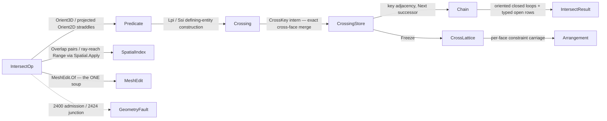

# [RASM_INTERSECTION_INTERSECT]

The predicate-exact crossing lattice of `Rasm.Meshing` — ONE `IntersectOp` `[Union]` (`SegmentSegment`/`SegmentTriangle`/`TriangleTriangle`/`RayMesh`/`MeshMesh`/`PlaneMesh`) folded by ONE `Intersection.Apply(IntersectOp, Op? key = null)` entry, every crossing EXISTENCE decided by the `Numerics/predicates#ROBUST_PREDICATES` exact `Orient3D`/`Orient2D` straddle signs and every crossing POINT carried as the landed `Implicit` defining-entity construction (`Lpi` edge×plane over five original points, `Ssi` segment×segment over four points and the projection `Axis`) — signs exact, coordinates rounded ONLY at the `Round()` emission seam. The re-founded `Chain` is the page's spine: every crossing endpoint is KEYED BY ITS DEFINING ENTITIES (`CrossKey` — the piercing edge's canonical vertex pair plus the pierced face), so the same physical crossing produced from two adjacent face pairs interns to ONE row by integer key equality — the cross-face merge no float weld can express — and chains link ACROSS segments by that key adjacency and are walked by TRUE connectivity: a closed loop closes ORIENTED (outer CCW, holes CW in the section frame), an open curve runs end to end as a typed OPEN-chain row, and a dangling endpoint is structurally impossible on manifold input because the edge key is shared by exactly the two faces that bound it.

The page owns `PrimitiveKind` (the primitive vocabulary the `GeometryFault.IntersectionFault(PrimitiveKind, PrimitiveKind)` 2424 payload reads), `IntersectKind` (the op discriminant carrying the primitive-pair columns), `IntersectPolicy`, the `CrossKey`/`Crossing` carriers, the `CrossingStore` single-writer arena under the `Meshing/edit#ARENA_LAW` contract with its frozen `CrossLattice` projection (the per-face crossing sets + defining-entity carriage `Meshing/arrangement` constrains its substrate on), the typed `Chain` row, and the `IntersectResult` union. Broad-phase candidates come ONLY from the landed `Spatial/index` owner through `Spatial.Apply` (`SpatialQuery.Overlap` for mesh pairs, `SpatialQuery.Range` over the ray's reach; the plane section is its own sign-driven per-face sweep — an infinite plane admits no box prune), triangle soups ONLY from the landed `Meshing/edit` `MeshEdit.Of` adapter, and exact coordinate ordering ONLY from the landed `Predicate.Compare` order key — the page authors the narrow phase (Guigue-Devillers mutual straddles) and the key-connectivity chain assembly, nothing a sibling already owns. This owner is the E7 collapse target: `Meshing/arrangement`, `Meshing/offset`, and `Processing/repair` route `Intersection.Apply` — no fourth crossing kernel exists. The host boundary holds at the altitude seam: `Analysis/relations.md` owns Rhino NURBS/Brep parametric curve/surface intersection, this owner owns predicate-exact discrete crossing, and the two meet at no interior.

## [01]-[INDEX]

- [01]-[INTERSECTION]: ONE `Intersection.Apply(IntersectOp, Op?)` entry; `Crossing` = `Implicit` defining-entity construction + `CrossKey` merge key; `CrossingStore` arena + frozen `CrossLattice`; Guigue-Devillers exact narrow phase; key-connectivity chain assembly with oriented closed loops and typed open chains; `PrimitiveKind`/`IntersectKind` vocabularies.

## [02]-[INTERSECTION]

- Owner: `PrimitiveKind` `[SmartEnum<string>]` the primitive vocabulary (`segment`/`triangle`/`ray`/`plane`/`mesh`) MINTED HERE — the `IntersectionFault` payload discriminant and the op-kind column type, composed by the faults owner, never re-minted downstream; `IntersectKind` `[SmartEnum<string>]` the operation discriminant (`segment-segment`/`segment-triangle`/`triangle-triangle`/`ray-mesh`/`mesh-mesh`/`self-mesh`/`plane-mesh`) binding the shipped `ComparerAccessors.StringOrdinal`, carrying the `A`/`B` `PrimitiveKind` pair (the fault payload derives from the op's own row, never a per-site literal); `IntersectPolicy` the policy row (`BroadPhaseInflation` · `SeedCapacity` — an arena SEED the doubling law grows, never a fixed allocation — · `KeepCoplanar`) registering `IValidityEvidence`; `CrossKey` the defining-entity merge key — `Side` (which operand contributes the defining edge), `EdgeU`/`EdgeV` (the edge's vertex pair, canonical `U < V`; `EdgeU == EdgeV` = an original VERTEX lying exactly on the other operand, keyed globally), `Face` (the pierced face of the other operand; `-1` = the cutting plane or a coplanar/vertex row), `OtherU`/`OtherV` (the SECOND defining edge of a coplanar edge×edge crossing — two edges define the point globally, so the same physical crossing interns once across every face pair) — integer equality IS the cross-face merge; `Crossing` the crossing carrier — the `Implicit` exact construction plus its `CrossKey` (the `Site`/`OrderKey`/`RationalKey` rounded-plus-exact dual carriage of the prior fence is DEAD: one exact carrier, one key, rounding at emission only); a pierce hit is KEYED BY ITS CLASSIFIED LANDING — interior by edge×pierced-face, on the pierced face's EDGE by the two defining edges (face-free), on its CORNER by that vertex's explicit row — and bit-identical EXPLICIT rows unify by value at intern (exact input-point identity, never a float weld), so the merge survives hits landing exactly on face boundaries and coincident operand corners; `CrossingStore` the single-writer arena (key-interned crossing rows, segment pairs with face provenance) frozen into `CrossLattice` — memoized per-face segment lookups (`OnFace`, O(F + S) for a whole-operand sweep) plus the coplanar sub-segment rows (`CoplanarOnFace`, each row carrying its ORIGINAL carrier edge); `Chain` the typed result row (`Points` polyline + `Closed` flag); `IntersectOp`/`IntersectResult` the request/result unions; `Intersection` the static surface.
- Cases: `PrimitiveKind` rows 5; `IntersectKind` rows 7; `IntersectOp` cases `SegmentSegment` · `SegmentTriangle` · `TriangleTriangle` · `RayMesh` · `MeshMesh` · `SelfMesh` · `PlaneMesh` (7 — `SelfMesh(MeshSpace, IntersectPolicy)` is the V4 self-crossing consumer row `Processing/repair`'s `SelfIntersectResolve` binds: one soup overlapped against itself, shared-vertex/shared-edge face pairs excluded exactly, each unordered pair narrow-phased once with ONE vertex namespace and ONE key space); `IntersectResult` cases `Points` · `Segments` · `Chains` (3 — `Chains` carries BOTH the walked `Chain` rows and the frozen `CrossLattice`, so the chain consumer and the arrangement's constraint consumer read one result without a second narrow-phase run).
- Entry: `public static Fin<IntersectResult> Apply(IntersectOp op, Op? key = null)` — the ONE entry discriminating on the op case. `Fin<T>` routes `GeometryFault.DegenerateInput(Kind, index, witness)` 2400 on an inadmissible primitive (zero-length segment, sliver triangle whose plane cannot orient a straddle, non-finite plane — the cross-cutting admission case), and `GeometryFault.IntersectionFault(op.Kind.A, op.Kind.B)` 2424 on a lattice inconsistency (a section edge key incident to three or more faces — a non-manifold junction the chain walk cannot resolve); an OPEN section on a boundaried mesh is NOT a fault — it is a typed `Chain(Closed: false)` row running end to end. `SegmentSegment` is the TYPED 2D RESTRICTION: the case carries its projection `Axis` and the crossing is the `Ssi` construction on that plane — the restriction is in the request shape, never an implicit convention. No `IntersectSegments`/`IntersectMesh`/`SectionPlane` sibling statics — one polymorphic `Apply`.
- Auto: point-level cases run the exact straddle directly — `SegmentSegment` the four projected `Orient2D` signs (both pairs strictly straddling) minting the `Ssi`; `SegmentTriangle` the two `Orient3D` endpoint signs against the triangle plane plus the exact projected in-triangle containment of the `Lpi` construction (containment tested on the IMPLICIT point through `Predicate.Orient2D(in Implicit, …)` — never a rounded materialization); `TriangleTriangle` the Guigue-Devillers procedure: mutual `Orient3D` straddle rejection without one constructed coordinate, pierced edges minting `Lpi` endpoints, EVERY detected `Zero` acting (a vertex exactly ON the other plane contributes its explicit row; an edge IN the other plane clips exactly to the other face — `ZeroPair` + `ClipToTriangle`), the shared-line interval ordered by `Predicate.Compare` on the dominant axis of the CROSSING LINE `nP×nQ` (a triangle-normal axis compares `Zero` on every hit for an axis-aligned operand — the deleted wrong-axis sort), the COPLANAR pair (all six signs zero) routing the exact per-edge clip under `KeepCoplanar` — boundary-inclusive vertex rows + strict edge×edge `Ssi` crossings, every consecutive pair a sub-segment row, no interior-crossing drop. Mesh-level cases compose the landed owners: `MeshEdit.Of(space)` admits each soup ONCE (the ONE adapter — a page-local `Soup(MeshSpace)` copy is dead), `Spatial.Apply(SpatialOp.Build(SpatialKind.Bvh, faceBounds, BuildPolicy.Canonical))` builds the BVH, `SpatialQuery.Overlap` yields mesh-mesh candidate pairs and `SpatialQuery.Range` prunes the ray's reach, every `SpatialAnswer` projected by TYPED match routing `Fin` (the three hard casts of the prior fence are dead); the plane section is a sign-driven per-face sweep (the plane is infinite — no containment gate, no candidate ceremony); `SelfMesh` overlaps the one soup's BVH against ITSELF, excludes shared-EDGE face pairs exactly (their intersection IS the shared edge — pure contact; a single-shared-vertex pair narrow-phases honestly, its Zero rows separating corner contact from a genuine crease fold-over interpenetration), and narrow-phases each unordered pair once with side `0` on both sweeps — one vertex namespace, one key space, the same physical self-crossing interning once regardless of pair order; each surviving candidate runs the narrow phase and interns its crossing endpoints into the `CrossingStore` by `CrossKey` — the same edge×face crossing reached from two face pairs lands on ONE row, a hit landing exactly ON the pierced face's edge or corner keys by the two edges or the corner's explicit row (never by either incident face), and a collinear multi-touch emits its consecutive-pair subdivision. `Chain` assembly is forward-following over material-oriented segments: every segment is STORED `from → to` along the op convention (`PlaneMesh`: `cut.Normal × faceNormal`; `MeshMesh`: `nA × nB` — the endpoint order decided by the exact `Compare` on the direction's dominant axis at accumulation), so an interior endpoint carries exactly one outgoing and one incoming segment, the walk follows the outgoing successor seeded in deterministic slot order, a source endpoint (outgoing, no incoming) opens a typed OPEN chain, a remaining forward cycle closes a loop — outer CCW, holes CW in the section frame by construction — and a SECOND outgoing or second incoming on one endpoint is the non-manifold junction routed typed; `RayMesh` exact-tests EVERY pruned candidate and takes the first hit by exact `Compare` along the ray's dominant axis (a nearest-box single re-test is the deleted false-miss form).
- Receipt: none on a dedicated rail — the `IntersectResult` union IS the typed result; `Chains` carries the frozen `CrossLattice` as evidence-bearing payload (crossing rows with defining-entity carriage, per-face constraint sets, coplanar rows) so the arrangement consumes the SAME run's lattice; the hash-eligible artifacts are the emitted `Polyline`/`Point3d` values at the `Round()` seam, never the live arena.
- Packages: `Rasm.Numerics` (`Predicate` straddle/containment/`Compare`, `Implicit`/`Ssi`/`Lpi`, `Sign`, `Axis` — the exact floor; the prior fence's `ExtendedNumerics.Fraction` order-key import is DEAD — exact ordering lives inside the predicate owner), `Rasm.Spatial` (`Spatial.Apply` + `SpatialOp`/`SpatialQuery`/`QueryResult`/`SpatialAnswer` — the broad-phase, composed), `Rasm.Meshing` (`MeshEdit.Of` the ONE soup adapter), `Rasm.Numerics` (`GeometryFault`), `Rasm.Domain` (`Op`, `Kind`, `ValidityClaim`/`IValidityEvidence`), `Rasm.Meshing` (`MeshSpace`), `Rhino.Geometry` (`Point3d`/`Line`/`Plane`/`Ray3d`/`Polyline`/`BoundingBox`), Thinktecture.Runtime.Extensions, LanguageExt.Core, BCL inbox (`Dictionary<,>`, `List<T>`).
- Growth: a new crossing modality (curve-surface, swept-volume) is one `IntersectKind` row plus one `IntersectOp` case reading the SAME straddle narrow-phase and the SAME key-connectivity assembly; a new crossing construction is the predicate owner's `Implicit` case (this page widens by zero carriers); a new broad-phase knob is one `IntersectPolicy` column; the slice-stack consumer (`Meshing/slice`, W4) composes `PlaneMesh` over a plane family — a consumer fold, never a seventh case here; zero new surface.
- Boundary: the intersection owner is the ONE `IntersectOp` `[Union]` and a `SegmentIntersector`/`MeshIntersector`/`PlaneSectioner` sibling family is the named density defect collapsed onto one union; the crossing point is the `Implicit` defining-entity construction and a rounded `Point3d` materialized at birth beside an exact sort key (the dead `Site`+`OrderKey`+`RationalKey` triple) is the named robustness defect this rebuild deletes — the chain's combinatorial structure derives from INTEGER key equality and exact `Compare` signs, never a float weld or a float parametric sort; the chain is walked by defining-entity adjacency and a proximity-keyed endpoint merge is the deleted form; closed loops are ORIENTED at emission and a kind-keyed concat of unoriented fragments is the deleted form; open sections are TYPED rows and silent closure or silent drop of a non-watertight section is forbidden; the broad-phase composes `Spatial.Apply` and a local quadratic all-pairs scan or a second acceleration structure is the deleted form; every `SpatialAnswer` projects by typed match routing `Fin` and a hard cast is the deleted form; the soup adapter is `MeshEdit.Of` and a per-page `DuplicateNative` soup copy is the deleted form; `Apply` is total over the `Fin` rail and a thrown exception on a degenerate primitive is forbidden; the `CrossingStore` is an honest single-writer arena under the `Meshing/edit#ARENA_LAW` contract (seed capacity + amortized doubling — never a fixed `1 << 22` allocation) whose frozen `CrossLattice` is the only projection consumers hold; the host altitude boundary holds — `Analysis/relations.md` owns parametric curve/surface intersection and this owner never re-derives it, `relations.md` never re-derives the discrete lattice.

```csharp
// --- [RUNTIME_PRELUDE] ----------------------------------------------------------------------
using System;
using System.Collections.Generic;
using System.Linq;
using LanguageExt;
using Rasm.Domain;
using Rasm.Numerics;
using Rasm.Spatial;
using Rhino.Geometry;
using Thinktecture;
using static LanguageExt.Prelude;
// CS0104 guard: LanguageExt.HashSet collides with the BCL name under the dual usings.
using IndexSet = System.Collections.Generic.HashSet<int>;

namespace Rasm.Meshing;

// --- [TYPES] ------------------------------------------------------------------------------
// The primitive vocabulary the IntersectionFault(A, B) payload reads — minted HERE, composed by
// the faults owner and every op-kind row.
[SmartEnum<string>]
[KeyMemberEqualityComparer<ComparerAccessors.StringOrdinal, string>]
[KeyMemberComparer<ComparerAccessors.StringOrdinal, string>]
public sealed partial class PrimitiveKind {
    public static readonly PrimitiveKind Segment  = new("segment");
    public static readonly PrimitiveKind Triangle = new("triangle");
    public static readonly PrimitiveKind Ray      = new("ray");
    public static readonly PrimitiveKind Plane    = new("plane");
    public static readonly PrimitiveKind Mesh     = new("mesh");
}

[SmartEnum<string>]
[KeyMemberEqualityComparer<ComparerAccessors.StringOrdinal, string>]
[KeyMemberComparer<ComparerAccessors.StringOrdinal, string>]
public sealed partial class IntersectKind {
    public static readonly IntersectKind SegmentSegment   = new("segment-segment", PrimitiveKind.Segment, PrimitiveKind.Segment);
    public static readonly IntersectKind SegmentTriangle  = new("segment-triangle", PrimitiveKind.Segment, PrimitiveKind.Triangle);
    public static readonly IntersectKind TriangleTriangle = new("triangle-triangle", PrimitiveKind.Triangle, PrimitiveKind.Triangle);
    public static readonly IntersectKind RayMesh          = new("ray-mesh", PrimitiveKind.Ray, PrimitiveKind.Mesh);
    public static readonly IntersectKind MeshMesh         = new("mesh-mesh", PrimitiveKind.Mesh, PrimitiveKind.Mesh);
    public static readonly IntersectKind SelfMesh         = new("self-mesh", PrimitiveKind.Mesh, PrimitiveKind.Mesh);
    public static readonly IntersectKind PlaneMesh        = new("plane-mesh", PrimitiveKind.Plane, PrimitiveKind.Mesh);

    public PrimitiveKind A { get; }
    public PrimitiveKind B { get; }
}

// --- [CONSTANTS] --------------------------------------------------------------------------
// SeedCapacity seeds the arena; amortized doubling grows it — a fixed-cap crossing allocation is
// the dead prior form.
public sealed record IntersectPolicy(double BroadPhaseInflation, int SeedCapacity, bool KeepCoplanar) : IValidityEvidence {
    public static readonly IntersectPolicy Canonical = new(BroadPhaseInflation: 1e-9, SeedCapacity: 256, KeepCoplanar: true);

    public bool IsValid => ValidityClaim.All(
        ValidityClaim.Nonnegative(value: BroadPhaseInflation),
        ValidityClaim.Positive(value: SeedCapacity));
}

// --- [MODELS] -----------------------------------------------------------------------------
// The defining-entity merge key: integer equality IS the cross-face merge. Side = the operand
// contributing the piercing edge; EdgeU/EdgeV canonical (U < V); Face = the pierced face of the
// other operand, -1 for the cutting plane. OtherU/OtherV carry the SECOND defining edge for
// coplanar edge x edge crossings (Face = -1 there — the two edges define the point globally);
// Vertex keys (EdgeU == EdgeV) carry an original vertex lying exactly on the other operand.
public readonly record struct CrossKey(int Side, int EdgeU, int EdgeV, int Face, int OtherU = -1, int OtherV = -1) {
    public static CrossKey Of(int side, int u, int v, int face) => new(side, int.Min(u, v), int.Max(u, v), face);
    public static CrossKey Vertex(int side, int w) => new(side, w, w, -1);
    public static CrossKey Coplanar(int u, int v, int s, int t) => new(0, int.Min(u, v), int.Max(u, v), -1, int.Min(s, t), int.Max(s, t));
}

// One exact carrier, one key; Round() happens at the emission seam only.
public readonly record struct Crossing(Implicit Point, CrossKey Key);

public sealed record Chain(Polyline Points, bool Closed);

// Frozen projection of the arena: the per-face crossing/segment sets the arrangement constrains
// its substrate on, with defining-entity carriage intact. Coplanar rows are clipped SUB-SEGMENTS
// of one operand's edge inside the other's face — constraint-only contributions carrying their
// ORIGINAL carrier edge (an area contact is not a curve; the rows never enter the chain walk).
public sealed record CrossLattice(
    Crossing[] Rows,
    (int A, int B, int FaceA, int FaceB)[] Segments,
    (int A, int B, int FaceA, int FaceB, int CarrierU, int CarrierV, int CarrierSide)[] Coplanar) {
    ILookup<int, (int A, int B, int FaceA, int FaceB)>? onA, onB;
    ILookup<int, (int A, int B, int FaceA, int FaceB, int CarrierU, int CarrierV, int CarrierSide)>? coA, coB;

    // Per-face lookups memoize on first read: the arrangement's per-face sweep is O(F + S), never
    // a per-face rescan of the whole segment array.
    public IEnumerable<(int A, int B, int FaceA, int FaceB)> OnFace(int side, int face) =>
        (side == 0 ? onA ??= Segments.ToLookup(static s => s.FaceA) : onB ??= Segments.ToLookup(static s => s.FaceB))[face];

    public IEnumerable<(int A, int B, int FaceA, int FaceB, int CarrierU, int CarrierV, int CarrierSide)> CoplanarOnFace(int side, int face) =>
        (side == 0 ? coA ??= Coplanar.ToLookup(static s => s.FaceA) : coB ??= Coplanar.ToLookup(static s => s.FaceB))[face];
}

// Single-writer arena under the Meshing/edit ARENA_LAW: key-interned crossing rows + segment pairs;
// Freeze() is the one projection. Bit-identical EXPLICIT rows unify by value — exact input-point
// identity (never a float weld), closing every coincident-corner key seam the classified keys
// cannot see (a vertex-on-vertex contact reached under two vertex keys).
public sealed class CrossingStore {
    Crossing[] rows;
    readonly Dictionary<CrossKey, int> interned = [];
    readonly Dictionary<Point3d, int> byValue = [];
    readonly List<(int A, int B, int FaceA, int FaceB)> segments = [];
    readonly List<(int A, int B, int FaceA, int FaceB, int CarrierU, int CarrierV, int CarrierSide)> coplanar = [];
    int count;

    public CrossingStore(int seed) { rows = new Crossing[seed]; }

    public int Count => count;
    public Crossing Row(int slot) => rows[slot];

    // Intern by defining-entity key: the same physical crossing reached from two adjacent face
    // pairs lands on ONE row — exact integer merge, no float weld.
    public int Intern(in Implicit point, CrossKey key) {
        if (interned.TryGetValue(key, out int at)) { return at; }
        if (point.IsExplicit && byValue.TryGetValue(point.AsExplicit, out int shared)) { return interned[key] = shared; }
        Grow(count + 1);
        rows[count] = new Crossing(point, key);
        if (point.IsExplicit) { byValue[point.AsExplicit] = count; }
        return interned[key] = count++;
    }

    public void Segment(int a, int b, int faceA, int faceB) => segments.Add((a, b, faceA, faceB));
    public void CoplanarRow(int a, int b, int faceA, int faceB, int carrierU, int carrierV, int carrierSide) => coplanar.Add((a, b, faceA, faceB, carrierU, carrierV, carrierSide));

    public CrossLattice Freeze() => new([.. rows.AsSpan(0, count)], [.. segments], [.. coplanar]);

    void Grow(int needed) {
        if (needed <= rows.Length) { return; }
        Array.Resize(ref rows, int.Max(needed, rows.Length << 1));
    }
}

[Union(ConversionFromValue = ConversionOperatorsGeneration.None)]
public abstract partial record IntersectResult {
    private IntersectResult() { }

    public sealed record Points(Seq<Point3d> Hits) : IntersectResult;
    public sealed record Segments(Seq<Line> Crossings) : IntersectResult;
    public sealed record Chains(Seq<Chain> Walked, CrossLattice Lattice) : IntersectResult;
}

// --- [OPERATIONS] -------------------------------------------------------------------------
[Union(ConversionFromValue = ConversionOperatorsGeneration.None)]
public abstract partial record IntersectOp {
    private IntersectOp() { }

    // The 2D restriction is TYPED: the case carries its projection Axis; the crossing is the Ssi.
    public sealed record SegmentSegment(Line A, Line B, Axis Plane, IntersectPolicy Policy) : IntersectOp;
    public sealed record SegmentTriangle(Line Edge, Point3d Ta, Point3d Tb, Point3d Tc, IntersectPolicy Policy) : IntersectOp;
    public sealed record TriangleTriangle(Point3d Pa, Point3d Pb, Point3d Pc, Point3d Qa, Point3d Qb, Point3d Qc, IntersectPolicy Policy) : IntersectOp;
    public sealed record RayMesh(Ray3d Ray, double MaxT, MeshSpace Mesh, IntersectPolicy Policy) : IntersectOp;
    public sealed record MeshMesh(MeshSpace A, MeshSpace B, IntersectPolicy Policy) : IntersectOp;
    public sealed record SelfMesh(MeshSpace Mesh, IntersectPolicy Policy) : IntersectOp;
    public sealed record PlaneMesh(Plane Cut, MeshSpace Mesh, IntersectPolicy Policy) : IntersectOp;

    public IntersectKind Kind =>
        Switch(
            segmentSegment:   static _ => IntersectKind.SegmentSegment,
            segmentTriangle:  static _ => IntersectKind.SegmentTriangle,
            triangleTriangle: static _ => IntersectKind.TriangleTriangle,
            rayMesh:          static _ => IntersectKind.RayMesh,
            meshMesh:         static _ => IntersectKind.MeshMesh,
            selfMesh:         static _ => IntersectKind.SelfMesh,
            planeMesh:        static _ => IntersectKind.PlaneMesh);
}

public static class Intersection {
    public static Fin<IntersectResult> Apply(IntersectOp op, Op? key = null) =>
        Admit(op).Bind(_ => op.Switch(
            segmentSegment:   s => Fin.Succ(CrossSegments2D(s.A, s.B, s.Plane)
                .Match(Some: c => (IntersectResult)new IntersectResult.Points(Seq(c.Point.Round())), None: () => new IntersectResult.Points(Seq<Point3d>()))),
            segmentTriangle:  s => Fin.Succ((IntersectResult)new IntersectResult.Points(
                EdgePierce(s.Edge.From, s.Edge.To, s.Ta, s.Tb, s.Tc).Match(Some: p => Seq(p.Round()), None: () => Seq<Point3d>()))),
            triangleTriangle: t => Fin.Succ((IntersectResult)new IntersectResult.Segments(
                TriTriSegment(t.Pa, t.Pb, t.Pc, t.Qa, t.Qb, t.Qc).Match(
                    Some: seg => Seq(new Line(seg.A.Round(), seg.B.Round())),
                    None: () => Seq<Line>()))),
            rayMesh:          r => FirstHit(r, key),
            meshMesh:         m => Lattice(m, key).Bind(store => Walk(store.Freeze(), m.Kind)),
            selfMesh:         sm => SelfLattice(sm, key).Bind(store => Walk(store.Freeze(), sm.Kind)),
            planeMesh:        p => Section(p, key).Bind(store => Walk(store.Freeze(), p.Kind))));

    // Admission (the cross-cutting 2400 case): degenerate primitives fail HERE, once; the interior
    // never re-validates. The generated Switch is TOTAL — a new op case breaks this gate at
    // compile time instead of silently admitting.
    static Fin<Unit> Admit(IntersectOp op) =>
        op.Switch(
            segmentSegment:   static s => s.A.Length == 0.0 || s.B.Length == 0.0 ? Reject(Kind.Line, "zero-length segment") : Fin.Succ(unit),
            segmentTriangle:  static s => s.Edge.Length == 0.0 ? Reject(Kind.Line, "zero-length segment")
                : Sliver(s.Ta, s.Tb, s.Tc) ? Reject(Kind.Mesh, "sliver triangle") : Fin.Succ(unit),
            triangleTriangle: static t => Sliver(t.Pa, t.Pb, t.Pc) || Sliver(t.Qa, t.Qb, t.Qc) ? Reject(Kind.Mesh, "sliver triangle") : Fin.Succ(unit),
            rayMesh:          static r => !(r.MaxT > 0.0) || !r.Ray.Direction.IsValid || r.Ray.Direction.IsZero ? Reject(Kind.Point, "degenerate ray") : Fin.Succ(unit),
            meshMesh:         static _ => Fin.Succ(unit),
            selfMesh:         static _ => Fin.Succ(unit),
            planeMesh:        static p => p.Cut.IsValid ? Fin.Succ(unit) : Reject(Kind.Plane, "non-finite plane"));

    static Fin<Unit> Reject(Kind kind, string witness) =>
        Fin.Fail<Unit>(new GeometryFault.DegenerateInput(kind, 0, witness).ToError());

    static bool Sliver(Point3d a, Point3d b, Point3d c) =>
        Predicate.Orient2D(a, b, c) == Sign.Zero
        && Predicate.Orient2D(Swap(a, Axis.X), Swap(b, Axis.X), Swap(c, Axis.X)) == Sign.Zero
        && Predicate.Orient2D(Swap(a, Axis.Y), Swap(b, Axis.Y), Swap(c, Axis.Y)) == Sign.Zero;

    static Point3d Swap(Point3d p, Axis axis) => new(Axis.Coord(p, axis.U), Axis.Coord(p, axis.V), 0.0);

    // --- [NARROW_PHASE]
    // Four projected Orient2D signs decide the 2D crossing; the point is the Ssi over the four
    // defining endpoints on the typed plane.
    static Option<Crossing> CrossSegments2D(Line a, Line b, Axis plane) {
        Sign d1 = Predicate.Orient2D(new Implicit(a.From), new Implicit(a.To), new Implicit(b.From), plane);
        Sign d2 = Predicate.Orient2D(new Implicit(a.From), new Implicit(a.To), new Implicit(b.To), plane);
        Sign d3 = Predicate.Orient2D(new Implicit(b.From), new Implicit(b.To), new Implicit(a.From), plane);
        Sign d4 = Predicate.Orient2D(new Implicit(b.From), new Implicit(b.To), new Implicit(a.To), plane);
        return d1.Times(d2) == Sign.Negative && d3.Times(d4) == Sign.Negative
            ? Some(new Crossing(new Ssi(a.From, a.To, b.From, b.To, plane), CrossKey.Of(0, 0, 1, -1)))
            : None;
    }

    // Edge-x-plane pierce with EXACT in-triangle containment of the IMPLICIT point — the projected
    // Orient2D containment runs on the Lpi construction, never a rounded materialization.
    static Option<Implicit> EdgePierce(Point3d u, Point3d v, Point3d a, Point3d b, Point3d c) {
        Sign su = Predicate.Orient3D(a, b, c, u), sv = Predicate.Orient3D(a, b, c, v);
        if (su.Times(sv) != Sign.Negative) { return None; }
        Implicit hit = new Lpi(u, v, a, b, c);
        return InsideProjected(in hit, a, b, c, DominantAxis(a, b, c)) ? Some(hit) : None;
    }

    // Boundary-inclusive projected containment, exact over the carrier: both winding orientations.
    static bool InsideProjected(in Implicit p, Point3d a, Point3d b, Point3d c, Axis axis) =>
        Placed(in p, a, b, c, axis).IsSome;

    // Containment WITH exact boundary classification: None = outside; `(-1,-1)` interior;
    // `(k,-1)` on face edge k (a→b, b→c, c→a); `(-1,w)` on face vertex w (two zero lines). The
    // classified key is what makes the cross-face merge hold THROUGH face boundaries — a hit on a
    // shared edge or corner must not key by either incident face.
    static Option<(int Edge, int Vertex)> Placed(in Implicit p, Point3d a, Point3d b, Point3d c, Axis axis) {
        Sign s0 = Predicate.Orient2D(new Implicit(a), new Implicit(b), in p, axis);
        Sign s1 = Predicate.Orient2D(new Implicit(b), new Implicit(c), in p, axis);
        Sign s2 = Predicate.Orient2D(new Implicit(c), new Implicit(a), in p, axis);
        bool inside = (s0 != Sign.Negative && s1 != Sign.Negative && s2 != Sign.Negative)
            || (s0 != Sign.Positive && s1 != Sign.Positive && s2 != Sign.Positive);
        return !inside ? None
            : (s0 == Sign.Zero, s1 == Sign.Zero, s2 == Sign.Zero) switch {
                (true, true, _)  => Some((-1, 1)),
                (_, true, true)  => Some((-1, 2)),
                (true, _, true)  => Some((-1, 0)),
                (true, _, _)     => Some((0, -1)),
                (_, true, _)     => Some((1, -1)),
                (_, _, true)     => Some((2, -1)),
                _                => Some((-1, -1)),
            };
    }

    // --- [GUIGUE_DEVILLERS]
    // Mutual straddle rejection with zero constructed coordinates; on a real crossing the pierced
    // edges mint Lpi endpoints and a vertex EXACTLY ON the other plane (a detected Zero, never an
    // epsilon) contributes its explicit row — the interval orders by the exact Compare on the
    // dominant axis of the CROSSING LINE nP×nQ (a triangle-normal axis compares Zero on every hit
    // for an axis-aligned operand and is the deleted wrong-axis form). The coplanar pair (all six
    // signs Zero) is the caller-visible None here — the mesh fold routes it to the coplanar clip.
    static Option<(Implicit A, Implicit B)> TriTriSegment(Point3d pa, Point3d pb, Point3d pc, Point3d qa, Point3d qb, Point3d qc) {
        Span<Sign> q = [Predicate.Orient3D(pa, pb, pc, qa), Predicate.Orient3D(pa, pb, pc, qb), Predicate.Orient3D(pa, pb, pc, qc)];
        if (q[0] == Sign.Zero && q[1] == Sign.Zero && q[2] == Sign.Zero) { return None; }  // the coplanar AREA pair — the mesh fold's clip owns it
        if (ZeroPair(q) is int zq) {  // one Q edge lies IN P's plane: the contact is its exact clip against P
            (Point3d u, Point3d v) = zq == 0 ? (qa, qb) : zq == 1 ? (qb, qc) : (qc, qa);
            List<Implicit> clip = ClipToTriangle(u, v, pa, pb, pc, DominantAxis(pa, pb, pc));
            return clip.Count >= 2 ? Some((clip[0], clip[^1])) : None;
        }
        if (SameSide(q)) { return None; }
        Span<Sign> p = [Predicate.Orient3D(qa, qb, qc, pa), Predicate.Orient3D(qa, qb, qc, pb), Predicate.Orient3D(qa, qb, qc, pc)];
        if (ZeroPair(p) is int zp) {
            (Point3d u, Point3d v) = zp == 0 ? (pa, pb) : zp == 1 ? (pb, pc) : (pc, pa);
            List<Implicit> clip = ClipToTriangle(u, v, qa, qb, qc, DominantAxis(qa, qb, qc));
            return clip.Count >= 2 ? Some((clip[0], clip[^1])) : None;
        }
        if (SameSide(p)) { return None; }
        List<Implicit> hits = new(4);
        Collect(hits, pa, pb, pc, p, qa, qb, qc);
        Collect(hits, qa, qb, qc, q, pa, pb, pc);
        if (hits.Count < 2) { return None; }
        Axis order = DominantOf(Vector3d.CrossProduct(Vector3d.CrossProduct(pb - pa, pc - pa), Vector3d.CrossProduct(qb - qa, qc - qa)));
        hits.Sort((l, r) => Predicate.Compare(in l, in r, order).Key);
        return Some((hits[0], hits[^1]));

        static void Collect(List<Implicit> hits, Point3d a, Point3d b, Point3d c, ReadOnlySpan<Sign> signs, Point3d ta, Point3d tb, Point3d tc) {
            Axis axis = DominantAxis(ta, tb, tc);
            Span<(Point3d W, Sign S)> verts = [(a, signs[0]), (b, signs[1]), (c, signs[2])];
            foreach ((Point3d w, Sign s) in verts) {
                Implicit row = new(w);
                if (s == Sign.Zero && InsideProjected(in row, ta, tb, tc, axis)) { hits.Add(row); }
            }
            Span<(Point3d U, Point3d V, Sign Su, Sign Sv)> edges = [(a, b, signs[0], signs[1]), (b, c, signs[1], signs[2]), (c, a, signs[2], signs[0])];
            foreach ((Point3d u, Point3d v, Sign su, Sign sv) in edges) {
                if (su.Times(sv) == Sign.Negative && EdgePierce(u, v, ta, tb, tc).Case is Implicit hit) { hits.Add(hit); }
            }
        }
    }

    static bool SameSide(ReadOnlySpan<Sign> s) =>
        (s[0] != Sign.Negative && s[1] != Sign.Negative && s[2] != Sign.Negative && (s[0] == Sign.Positive || s[1] == Sign.Positive || s[2] == Sign.Positive))
        || (s[0] != Sign.Positive && s[1] != Sign.Positive && s[2] != Sign.Positive && (s[0] == Sign.Negative || s[1] == Sign.Negative || s[2] == Sign.Negative));

    // Exactly two Zero signs name the in-plane edge (its first vertex ordinal); all-Zero is the
    // coplanar pair and routes elsewhere.
    static int? ZeroPair(ReadOnlySpan<Sign> s) =>
        (s[0] == Sign.Zero, s[1] == Sign.Zero, s[2] == Sign.Zero) switch {
            (true, true, false) => 0,
            (false, true, true) => 1,
            (true, false, true) => 2,
            _                   => null,
        };

    // Exact clip of the in-plane segment (u,v) against triangle (a,b,c): boundary-inclusive
    // endpoint rows plus strict edge crossings, ordered along the carrier — convexity makes every
    // consecutive pair an inside sub-segment.
    static List<Implicit> ClipToTriangle(Point3d u, Point3d v, Point3d a, Point3d b, Point3d c, Axis plane) {
        List<Implicit> kept = new(4);
        Implicit ru = new(u), rv = new(v);
        if (InsideProjected(in ru, a, b, c, plane)) { kept.Add(ru); }
        if (InsideProjected(in rv, a, b, c, plane)) { kept.Add(rv); }
        foreach ((Point3d s, Point3d t) in (ReadOnlySpan<(Point3d, Point3d)>)[(a, b), (b, c), (c, a)]) {
            if (CrossSegments2D(new Line(u, v), new Line(s, t), plane).Case is Crossing hit) { kept.Add(hit.Point); }
        }
        Axis along = DominantOf(v - u);
        kept.Sort((l, r) => Predicate.Compare(in l, in r, along).Key);
        return kept;
    }

    // --- [BROAD_PHASE]
    // Every SpatialAnswer projects by TYPED match routing Fin — a hard cast is the deleted form.
    static Fin<SpatialIndex> Bvh(MeshEdit soup, Op? key) {
        BoundingBox[] boxes = new BoundingBox[soup.FaceCount];
        for (int f = 0; f < soup.FaceCount; f++) { boxes[f] = soup.Bounds(f); }
        return Spatial.Apply(new SpatialOp.Build(SpatialKind.Bvh, boxes, BuildPolicy.Canonical), key)
            .Bind(static answer => answer is SpatialAnswer.Index built
                ? Fin.Succ(built.Value)
                : Fin.Fail<SpatialIndex>(new GeometryFault.KindMismatch(SpatialKind.Bvh, QueryKind.Overlap).ToError()));
    }

    static Fin<Seq<(int Left, int Right)>> OverlapPairs(SpatialIndex a, SpatialIndex b, double inflation, Op? key) =>
        Spatial.Apply(new SpatialOp.Query(a, new SpatialQuery.Overlap(b, inflation)), key)
            .Bind(static answer => answer is SpatialAnswer.Result { Value: QueryResult.Pairs pairs }
                ? Fin.Succ(pairs.Overlaps)
                : Fin.Fail<Seq<(int, int)>>(new GeometryFault.KindMismatch(SpatialKind.Bvh, QueryKind.Overlap).ToError()));

    // --- [LATTICE]
    // Each pierced edge x face interns under its CrossKey: the same crossing reached from two
    // adjacent face pairs merges by integer equality — the cross-face merge that keys the chain.
    static Fin<CrossingStore> Lattice(IntersectOp.MeshMesh op, Op? key) {
        using MeshEdit ea = MeshEdit.Of(op.A);
        using MeshEdit eb = MeshEdit.Of(op.B);
        return (Bvh(ea, key), Bvh(eb, key)).Apply((ia, ib) => (ia, ib)).As()
            .Bind(t => OverlapPairs(t.ia, t.ib, op.Policy.BroadPhaseInflation, key))
            .Map(pairs => pairs.Fold(new CrossingStore(op.Policy.SeedCapacity), (store, pair) => PairCrossings(store, ea, eb, pair.Left, pair.Right, op.Policy)));
    }

    // Self-crossing: ONE soup, its BVH overlapped against ITSELF, each unordered pair narrow-phased
    // ONCE with side 0 on BOTH sweeps — one vertex namespace, one key space, so the same physical
    // crossing interns once regardless of pair order. Only shared-EDGE pairs are excluded (their
    // intersection IS the shared edge — pure contact); a single-shared-vertex pair narrow-phases
    // honestly: the shared corner contributes one Zero row (no segment), a genuine fold-over
    // interpenetration contributes its real crossing rows — the exact Zeros separate contact from
    // crossing, so a crease fold-over is never silently dropped.
    static Fin<CrossingStore> SelfLattice(IntersectOp.SelfMesh op, Op? key) {
        using MeshEdit soup = MeshEdit.Of(op.Mesh);
        return Bvh(soup, key)
            .Bind(index => OverlapPairs(index, index, op.Policy.BroadPhaseInflation, key))
            .Map(pairs => pairs.Fold(new CrossingStore(op.Policy.SeedCapacity), (store, pair) =>
                pair.Left < pair.Right && SharedVertices(soup, pair.Left, pair.Right) < 2
                    ? PairCrossings(store, soup, soup, pair.Left, pair.Right, op.Policy, sideA: 0, sideB: 0)
                    : store));
    }

    static int SharedVertices(MeshEdit soup, int fa, int fb) {
        (int a0, int a1, int a2) = soup.Face(fa);
        (int b0, int b1, int b2) = soup.Face(fb);
        int shared = 0;
        foreach (int v in (ReadOnlySpan<int>)[a0, a1, a2]) {
            if (v == b0 || v == b1 || v == b2) { shared++; }
        }
        return shared;
    }

    static CrossingStore PairCrossings(CrossingStore store, MeshEdit a, MeshEdit b, int fa, int fb, IntersectPolicy policy, int sideA = 0, int sideB = 1) {
        (int a0, int a1, int a2) = a.Face(fa);
        (int b0, int b1, int b2) = b.Face(fb);
        (Point3d pa, Point3d pb, Point3d pc) = (a.Position(a0), a.Position(a1), a.Position(a2));
        (Point3d qa, Point3d qb, Point3d qc) = (b.Position(b0), b.Position(b1), b.Position(b2));
        Span<Sign> qs = [Predicate.Orient3D(pa, pb, pc, qa), Predicate.Orient3D(pa, pb, pc, qb), Predicate.Orient3D(pa, pb, pc, qc)];
        if (qs[0] == Sign.Zero && qs[1] == Sign.Zero && qs[2] == Sign.Zero) {
            return policy.KeepCoplanar ? CoplanarCrossings(store, a, b, fa, fb, sideA, sideB) : store;
        }
        Span<Sign> ps = [Predicate.Orient3D(qa, qb, qc, pa), Predicate.Orient3D(qa, qb, qc, pb), Predicate.Orient3D(qa, qb, qc, pc)];
        List<int> ends = new(4);
        Pierce(store, ends, sideA, sideB, a, (a0, a1, a2), ps, b, (b0, b1, b2), fb);
        Pierce(store, ends, sideB, sideA, b, (b0, b1, b2), qs, a, (a0, a1, a2), fa);
        if (ends.Count < 2) { return store; }  // a single row is a point touch — no curve
        Vector3d material = Vector3d.CrossProduct(Vector3d.CrossProduct(pb - pa, pc - pa), Vector3d.CrossProduct(qb - qa, qc - qa));
        Axis axis = DominantOf(material);
        Sign forward = Along(material, axis);
        ends.Sort((l, r) => { Implicit pl = store.Row(l).Point, pr = store.Row(r).Point; return Predicate.Compare(in pl, in pr, axis).Times(forward).Key; });
        for (int k = 0; k + 1 < ends.Count; k++) { store.Segment(ends[k], ends[k + 1], fa, fb); }  // interior rows kept — a collinear multi-touch subdivides
        return store;

        // Every detected Zero acts: a vertex EXACTLY ON the other plane (inside the other face)
        // interns its explicit row keyed by the VERTEX — globally shared, so adjacent-pair segments
        // meet at it; an edge IN the other plane contributes its exact edge x edge crossings under
        // Coplanar keys (its endpoint rows already land through the vertex loop); strict straddles
        // pierce as Lpi rows keyed by the CLASSIFIED landing — interior by edge x pierced-face, on
        // a face edge by the TWO edges (face-free), on a face corner by that vertex's explicit row
        // — so the merge survives a hit landing exactly on the other operand's edge or corner.
        static void Pierce(CrossingStore store, List<int> ends, int side, int otherSide, MeshEdit soup, (int V0, int V1, int V2) f, ReadOnlySpan<Sign> signs, MeshEdit other, (int W0, int W1, int W2) g, int otherFace) {
            (Point3d ta, Point3d tb, Point3d tc) = (other.Position(g.W0), other.Position(g.W1), other.Position(g.W2));
            Axis plane = DominantAxis(ta, tb, tc);
            Span<int> verts = [f.V0, f.V1, f.V2];
            int W(int ordinal) => ordinal == 0 ? g.W0 : ordinal == 1 ? g.W1 : g.W2;
            for (int i = 0; i < 3; i++) {
                Implicit row = new(soup.Position(verts[i]));
                if (signs[i] == Sign.Zero && InsideProjected(in row, ta, tb, tc, plane)) {
                    Keep(ends, store.Intern(in row, CrossKey.Vertex(side, verts[i])));
                }
            }
            for (int e = 0; e < 3; e++) {
                (int u, int v) = (verts[e], verts[(e + 1) % 3]);
                Sign su = signs[e], sv = signs[(e + 1) % 3];
                if (su.Times(sv) == Sign.Negative) {
                    Implicit hit = new Lpi(soup.Position(u), soup.Position(v), ta, tb, tc);
                    if (Placed(in hit, ta, tb, tc, plane).Case is (int onEdge, int onVertex)) {
                        Keep(ends, onVertex >= 0
                            ? store.Intern(new Implicit(other.Position(W(onVertex))), CrossKey.Vertex(otherSide, W(onVertex)))
                            : onEdge >= 0
                                ? store.Intern(in hit, CoplanarKey(side, otherSide, u, v, W(onEdge), W((onEdge + 1) % 3)))
                                : store.Intern(in hit, CrossKey.Of(side, u, v, otherFace)));
                    }
                }
                else if (su == Sign.Zero && sv == Sign.Zero) {
                    foreach ((int s2, int t2) in (ReadOnlySpan<(int, int)>)[(g.W0, g.W1), (g.W1, g.W2), (g.W2, g.W0)]) {
                        if (CrossSegments2D(new Line(soup.Position(u), soup.Position(v)), new Line(other.Position(s2), other.Position(t2)), plane).Case is Crossing cross) {
                            Keep(ends, store.Intern(cross.Point, CoplanarKey(side, otherSide, u, v, s2, t2)));
                        }
                    }
                }
            }
        }
    }

    // Coplanar keys put the side-0 edge first; a SELF pair (equal sides, one vertex namespace)
    // orders the two edges canonically so pair order never splits one physical crossing.
    static CrossKey CoplanarKey(int side, int otherSide, int u, int v, int s, int t) =>
        side == otherSide
            ? ((int.Min(u, v), int.Max(u, v)).CompareTo((int.Min(s, t), int.Max(s, t))) <= 0 ? CrossKey.Coplanar(u, v, s, t) : CrossKey.Coplanar(s, t, u, v))
            : side == 0 ? CrossKey.Coplanar(u, v, s, t) : CrossKey.Coplanar(s, t, u, v);

    static void Keep(List<int> ends, int slot) {
        if (!ends.Contains(slot)) { ends.Add(slot); }
    }

    // Material orientation lands at ACCUMULATION: each segment is stored from -> to along the op
    // convention (nA x nB for mesh-mesh, cut.Normal x faceNormal for sections), the endpoint order
    // decided by the exact Compare on the direction's dominant axis — the chain walk then follows
    // stored direction and closed loops close outer-CCW / holes-CW by construction.
    static (int From, int To) Oriented(CrossingStore store, int e0, int e1, Vector3d material) {
        Axis axis = DominantOf(material);
        Implicit p0 = store.Row(e0).Point;
        Implicit p1 = store.Row(e1).Point;
        Sign order = Predicate.Compare(in p0, in p1, axis).Times(Along(material, axis));
        return order == Sign.Negative ? (e0, e1) : (e1, e0);
    }

    // Coplanar contact is an AREA: each edge of one face clips EXACTLY against the other triangle
    // — boundary-inclusive vertex rows plus strict edge x edge Ssi crossings, keyed by DEFINING
    // entities (vertex keys global, crossing keys the edge pair — Face plays no part, so the same
    // physical point interns once across every coplanar face pair) — and every consecutive pair
    // along the carrier lands as a constraint row carrying the ORIGINAL carrier edge: interior
    // crossings kept, the flush-contact boolean's worst case subdivides on its full crossing set.
    static CrossingStore CoplanarCrossings(CrossingStore store, MeshEdit a, MeshEdit b, int fa, int fb, int sideA = 0, int sideB = 1) {
        (int a0, int a1, int a2) = a.Face(fa);
        (int b0, int b1, int b2) = b.Face(fb);
        Axis plane = DominantAxis(a.Position(a0), a.Position(a1), a.Position(a2));
        Flush(store, plane, sideA, sideB, a, (a0, a1, a2), b, (b0, b1, b2), fa, fb);
        Flush(store, plane, sideB, sideA, b, (b0, b1, b2), a, (a0, a1, a2), fa, fb);
        return store;

        static void Flush(CrossingStore store, Axis plane, int carrierSide, int otherSide, MeshEdit own, (int V0, int V1, int V2) f, MeshEdit other, (int W0, int W1, int W2) g, int fa, int fb) {
            (Point3d ta, Point3d tb, Point3d tc) = (other.Position(g.W0), other.Position(g.W1), other.Position(g.W2));
            foreach ((int u, int v) in (ReadOnlySpan<(int, int)>)[(f.V0, f.V1), (f.V1, f.V2), (f.V2, f.V0)]) {
                (Point3d pu, Point3d pv) = (own.Position(u), own.Position(v));
                List<int> kept = new(4);
                Implicit ru = new(pu), rv = new(pv);
                if (InsideProjected(in ru, ta, tb, tc, plane)) { Keep(kept, store.Intern(in ru, CrossKey.Vertex(carrierSide, u))); }
                if (InsideProjected(in rv, ta, tb, tc, plane)) { Keep(kept, store.Intern(in rv, CrossKey.Vertex(carrierSide, v))); }
                foreach ((int s, int t) in (ReadOnlySpan<(int, int)>)[(g.W0, g.W1), (g.W1, g.W2), (g.W2, g.W0)]) {
                    if (CrossSegments2D(new Line(pu, pv), new Line(other.Position(s), other.Position(t)), plane).Case is Crossing hit) {
                        Keep(kept, store.Intern(hit.Point, CoplanarKey(carrierSide, otherSide, u, v, s, t)));
                    }
                }
                if (kept.Count < 2) { continue; }
                Axis along = DominantOf(pv - pu);
                kept.Sort((l, r) => { Implicit pl = store.Row(l).Point, pr = store.Row(r).Point; return Predicate.Compare(in pl, in pr, along).Key; });
                for (int k = 0; k + 1 < kept.Count; k++) { store.CoplanarRow(kept[k], kept[k + 1], fa, fb, u, v, carrierSide); }
            }
        }
    }

    // Plane section: a sign-driven sweep — the cutting plane is INFINITE, so a pierced edge needs
    // no containment gate (the deleted prior form clipped the plane to its unit parameter triangle),
    // and the per-face fold is already the narrow phase (a plane-slab SpatialQuery case is the
    // slice consumer's recorded growth on the index owner, never a whole-bounds Range ceremony).
    // A vertex exactly ON the plane interns a globally keyed row, so adjacent segments meet through
    // it; an edge IN the plane counts ONCE, exactly when its two incident faces straddle.
    static Fin<CrossingStore> Section(IntersectOp.PlaneMesh op, Op? key) {
        using MeshEdit soup = MeshEdit.Of(op.Mesh);
        (Point3d po, Point3d px, Point3d py) = (op.Cut.Origin, op.Cut.Origin + op.Cut.XAxis, op.Cut.Origin + op.Cut.YAxis);
        CrossingStore store = new(op.Policy.SeedCapacity);
        Dictionary<(int U, int V), Sign> flush = new();
        for (int f = 0; f < soup.FaceCount; f++) {
            (int v0, int v1, int v2) = soup.Face(f);
            Span<int> verts = [v0, v1, v2];
            Span<Sign> s = [
                Predicate.Orient3D(po, px, py, soup.Position(v0)),
                Predicate.Orient3D(po, px, py, soup.Position(v1)),
                Predicate.Orient3D(po, px, py, soup.Position(v2))];
            if (s[0] == Sign.Zero && s[1] == Sign.Zero && s[2] == Sign.Zero) { continue; }  // a face IN the plane is an area contact, not a curve
            Vector3d faceNormal = Vector3d.CrossProduct(soup.Position(v1) - soup.Position(v0), soup.Position(v2) - soup.Position(v0));
            Vector3d material = Vector3d.CrossProduct(op.Cut.Normal, faceNormal);
            bool inPlane = false;
            for (int e = 0; e < 3; e++) {
                (int u, int v) = (verts[e], verts[(e + 1) % 3]);
                if (s[e] != Sign.Zero || s[(e + 1) % 3] != Sign.Zero) { continue; }
                inPlane = true;
                (int cu, int cv) = (int.Min(u, v), int.Max(u, v));
                if (!flush.TryGetValue((cu, cv), out Sign third)) { flush[(cu, cv)] = s[(e + 2) % 3]; continue; }
                if (third.Times(s[(e + 2) % 3]) == Sign.Negative) {  // straddling thirds: the edge IS section curve, once
                    int au = store.Intern(new Implicit(soup.Position(u)), CrossKey.Vertex(0, u));
                    int av = store.Intern(new Implicit(soup.Position(v)), CrossKey.Vertex(0, v));
                    (int from, int to) = Oriented(store, au, av, material);
                    store.Segment(from, to, f, -1);
                }
            }
            if (inPlane) { continue; }  // the third vertex is off-plane: the in-plane edge was this face's whole contribution
            List<int> ends = new(2);
            for (int i = 0; i < 3; i++) {
                if (s[i] == Sign.Zero) { Keep(ends, store.Intern(new Implicit(soup.Position(verts[i])), CrossKey.Vertex(0, verts[i]))); }
            }
            for (int e = 0; e < 3; e++) {
                (int u, int v) = (verts[e], verts[(e + 1) % 3]);
                if (s[e].Times(s[(e + 1) % 3]) == Sign.Negative) {
                    Keep(ends, store.Intern(new Lpi(soup.Position(u), soup.Position(v), po, px, py), CrossKey.Of(0, u, v, -1)));
                }
            }
            if (ends.Count == 2) {
                (int from, int to) = Oriented(store, ends[0], ends[1], material);
                store.Segment(from, to, f, -1);
            }
        }
        return Fin.Succ(store);
    }

    // Range prune over the ray's reach, exact re-decision on EVERY candidate, first hit by exact
    // Compare along the ray's dominant axis — a nearest-BOX candidate re-tested alone loses the
    // true farther hit whenever the predicate rejects it, the deleted false-miss form; the
    // acceleration selects, the predicate family alone decides and orders.
    static Fin<IntersectResult> FirstHit(IntersectOp.RayMesh op, Op? key) {
        using MeshEdit soup = MeshEdit.Of(op.Mesh);
        (Point3d from, Point3d to) = (op.Ray.Position, op.Ray.PointAt(op.MaxT));
        Axis axis = DominantOf(op.Ray.Direction);
        Sign forward = Along(op.Ray.Direction, axis);
        return Bvh(soup, key)
            .Bind(index => Spatial.Apply(new SpatialOp.Query(index, new SpatialQuery.Range(new BoundingBox([from, to]), None)), key))
            .Bind(static answer => answer is SpatialAnswer.Result { Value: QueryResult.Hits hits }
                ? Fin.Succ(hits.Ids)
                : Fin.Fail<Seq<int>>(new GeometryFault.KindMismatch(SpatialKind.Bvh, QueryKind.Range).ToError()))
            .Map(faces => {
                Option<Implicit> best = None;
                foreach (int f in faces) {
                    (int v0, int v1, int v2) = soup.Face(f);
                    if (EdgePierce(from, to, soup.Position(v0), soup.Position(v1), soup.Position(v2)).Case is not Implicit hit) { continue; }
                    best = best.Match(
                        Some: held => Predicate.Compare(in hit, in held, axis).Times(forward) == Sign.Negative ? Some(hit) : Some(held),
                        None: () => Some(hit));
                }
                return (IntersectResult)new IntersectResult.Points(best.Match(Some: static h => Seq(h.Round()), None: static () => Seq<Point3d>()));
            });
    }

    // --- [CHAIN]
    // TRUE connectivity, forward-following: segments are stored material-oriented, so every
    // interior endpoint has exactly one outgoing (A -> B) and one incoming segment — the walk
    // follows the outgoing successor, sources (out, no in) open the typed OPEN chains, remaining
    // forward cycles are the closed loops (outer CCW / holes CW by the stored orientation), and a
    // second outgoing OR second incoming on one endpoint is the non-manifold junction fault.
    static Fin<IntersectResult> Walk(CrossLattice lattice, IntersectKind kind) {
        Dictionary<int, int> outgoing = new();
        IndexSet incoming = new();
        foreach ((int a, int b, _, _) in lattice.Segments) {
            if (!outgoing.TryAdd(a, b) || !incoming.Add(b)) {
                return Fin.Fail<IntersectResult>(new GeometryFault.IntersectionFault(kind.A, kind.B).ToError());
            }
        }
        IndexSet visited = new();
        List<Chain> chains = new();
        // Seeds in SLOT order, sources first: emission order is deterministic — intern order is a
        // function of the input alone, never of dictionary iteration.
        foreach (int seed in Enumerable.Range(0, lattice.Rows.Length).Where(outgoing.ContainsKey).OrderBy(a => incoming.Contains(a)).ThenBy(static a => a)) {
            if (visited.Contains(seed)) { continue; }
            List<int> walk = new() { seed };
            visited.Add(seed);
            int cur = seed;
            while (outgoing.TryGetValue(cur, out int nxt) && !visited.Contains(nxt)) {
                visited.Add(nxt);
                walk.Add(nxt);
                cur = nxt;
            }
            bool closed = outgoing.TryGetValue(cur, out int back) && back == seed && walk.Count > 2;
            Polyline polyline = new(walk.Select(slot => lattice.Rows[slot].Point.Round()));
            if (closed) { polyline.Add(polyline[0]); }
            if (polyline.Count > 1) { chains.Add(new Chain(polyline, closed)); }
        }
        return Fin.Succ((IntersectResult)new IntersectResult.Chains(toSeq(chains), lattice));
    }

    // --- [PRIMITIVES]
    static Axis DominantAxis(Point3d a, Point3d b, Point3d c) => DominantOf(Vector3d.CrossProduct(b - a, c - a));

    static Axis DominantOf(Vector3d d) {
        (double x, double y, double z) = (Math.Abs(d.X), Math.Abs(d.Y), Math.Abs(d.Z));
        return x >= y && x >= z ? Axis.X : y >= z ? Axis.Y : Axis.Z;
    }

    static Sign Along(Vector3d d, Axis axis) => Sign.Of(axis.Key == 0 ? d.X : axis.Key == 1 ? d.Y : d.Z);
}
```



## [03]-[DENSITY_BAR]

One owner per axis; capability is a case, row, or fold arm, never a sibling surface. The `[RAIL]` cell names the one return rail each owner exposes.

| [INDEX] | [AXIS_CONCERN]   | [OWNER]           | [KIND]                                                                                                     | [RAIL]                                            | [CASES] |
| :-----: | :--------------- | :---------------- | :--------------------------------------------------------------------------------------------------------- | :------------------------------------------------ | :-----: |
|  [01]   | Intersection     | `IntersectOp`     | `[Union]` seven cases folded by ONE `Apply` with `Op?` threading                                           | `Intersection.Apply → Fin<IntersectResult>`       |    7    |
|  [1a]   | Primitive kinds  | `PrimitiveKind`   | `[SmartEnum<string>]` — the 2424 fault payload vocabulary, minted here                                     | payload row (faults compose it)                   |    5    |
|  [1b]   | Operation kind   | `IntersectKind`   | `[SmartEnum<string>]` + `A`/`B` primitive-pair columns                                                     | discriminant (fault payload derives from the row) |    7    |
|  [1c]   | Crossing carrier | `Crossing`        | `Implicit` defining-entity construction + `CrossKey` integer merge key                                     | carrier (`Round()` at emission only)              |    —    |
|  [1d]   | Chain arena      | `CrossingStore`   | single-writer arena (classified-key intern · exact value unification · segments) + `Freeze → CrossLattice` | frozen projection                                 |    —    |
|  [1e]   | Result           | `IntersectResult` | `[Union]` `Points`/`Segments`/`Chains(Walked, Lattice)` — typed open chains, oriented closed loops         | carrier                                           |    3    |

The exact ordering machinery of the prior fence (`Expansion OrderKey` + `Fraction RationalKey` + rounded `Site`) is DEAD: connectivity derives from integer `CrossKey` equality, ordering where still needed (ray hits, coplanar sweeps, multi-crossing constraints) routes the landed `Predicate.Compare` order key, and the one materialization is `Implicit.Round()` at emission.

## [04]-[RESEARCH]

- [GUIGUE_DEVILLERS_EXACT] — `TriTriSegment` is the Guigue-Devillers procedure at full exactness: two mutual `Orient3D` straddle sweeps reject the trivial non-crossing with zero constructed coordinates; on a crossing, each triangle's pierced edges (differing non-zero endpoint signs) mint `Lpi` endpoints whose in-triangle containment is tested ON THE IMPLICIT POINT through the projected `Orient2D` family, and the shared-line interval orders by `Predicate.Compare` on the dominant axis of the crossing line `nP×nQ` — no float parametric sort, no swapped or doubled endpoint, and never a triangle-normal axis (which compares `Zero` on every hit for an axis-aligned operand). Every detected `Zero` ACTS — that is what the exact floor is for: a vertex exactly on the other plane contributes its explicit row when the projected containment holds, an edge lying in the other plane clips exactly against the other face (`ZeroPair` → `ClipToTriangle`: boundary-inclusive endpoint rows + strict crossings, ordered along the carrier), and a silent drop of a detected-degenerate contact is the deleted form. The coplanar pair (all six signs `Zero`) routes the same exact clip per edge under `IntersectPolicy.KeepCoplanar`, every consecutive pair landing as a sub-segment constraint row carrying its ORIGINAL carrier edge — the flush-contact boolean's worst case carries its full crossing set with interior crossings kept, never an endpoint-only truncation or a zero-length point pairing. The law-matrix (`IntersectionLaws`, CsCheck) proves straddle agreement against the `Fraction` rational oracle, interval totality under vertex permutation, and rigid-transform invariance of the crossing set.
- [DEFINING_ENTITY_CHAIN] — the chain's correctness is structural, not tolerant: a crossing endpoint is `CrossKey(side, edgeU, edgeV, face, otherU, otherV)`, so the crossing of edge `(u,v)` with face `f` computed while processing face pair `(fa, fb)` and again while processing `(fa', fb)` — the two faces sharing that edge — interns to ONE row by integer equality, which is exactly the cross-face merge key the prior fence lacked; the SAME law holds through the pierced side's boundaries: a hit landing exactly ON the pierced face's edge keys by the TWO defining edges (`Face` plays no part — the two incident pierced faces produce one key), a hit landing exactly ON its corner interns that corner's explicit row under the global vertex key, and bit-identical explicit rows unify by VALUE at intern (exact input-point identity — coincident operand corners of touching meshes land on one row); a vertex lying exactly on the cutting plane or the other operand interns under its GLOBAL vertex key (`EdgeU == EdgeV`), so the section curve passes THROUGH an on-plane mesh vertex instead of breaking at it, and an in-plane mesh edge counts as section curve exactly once — when its two incident faces' third vertices straddle. Section connectivity inherits manifoldness: an edge key is shared by exactly the two faces bounding the edge, so every interior section endpoint receives one incoming and one outgoing material-oriented segment and the forward walk closes; a mesh boundary edge yields a source or sink — the typed OPEN `Chain(Closed: false)` row — and a second outgoing or second incoming on one endpoint is the non-manifold junction routed `IntersectionFault(kind.A, kind.B)`. Orientation is decided at ACCUMULATION (each segment stored `from → to` along `cut.Normal × faceNormal` for sections, `nA × nB` for mesh-mesh, the endpoint order an exact `Compare` verdict), so closed loops emit outer CCW and holes CW in the section frame by construction — the orientation `Meshing/slice` (W4) nests on and `Drawing/view` `Section` consumes; walk seeds ride ascending slot order, so emission is a deterministic function of the input; the successor relation lives in the walk's own fold — a store-resident successor column would be write-only state beside the frozen lattice, the deleted dead-column form.
- [LATTICE_SEAM] — `IntersectResult.Chains` carries the frozen `CrossLattice` beside the walked chains: the arrangement consumes the SAME run's per-face crossing sets (`OnFace`) with defining-entity carriage intact — its per-face substrate constraints intern crossing endpoints as `Implicit` vertex rows and ride `Constraint.Crossing` foreign-plane carriage into `Tessellation.Build`, so the E7 collapse lands BY CONSUMERS: `Meshing/arrangement` (face subdivision), `Meshing/offset` (`SegmentsCross` and loop-resolution crossings), and `Processing/repair` (the `SelfMesh` self-crossing lattice its W3 `SelfIntersectResolve` re-mesh binds) all route `Intersection.Apply`, and a fourth crossing kernel anywhere in the kernel is the deleted form. The altitude boundary holds at `Analysis/relations.md`: host-parametric NURBS/Brep curve/surface intersection stays the host owner's, this page owns predicate-exact discrete crossing, each side one anchor, no interior meet.
