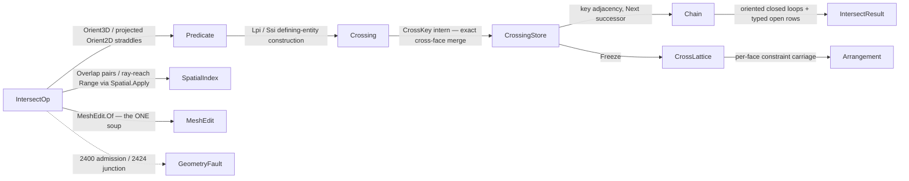

# [RASM_INTERSECTION_INTERSECT]

`Rasm.Meshing` owns the predicate-exact crossing lattice: one `IntersectOp` `[Union]` folded by one `Intersection.Apply` entry, crossing EXISTENCE decided by exact `Orient3D`/`Orient2D` straddle signs and every crossing POINT carried as an `Implicit` construction rounded only at the `Round()` emission seam. Every endpoint keys by its defining entities through `CrossKey`, so a crossing reached from two adjacent face pairs interns to one row by integer equality — the cross-face merge no float weld expresses — and chains walk that key adjacency into oriented closed loops and typed OPEN rows. Predicate-exact discrete crossing is the whole charter; host-parametric NURBS/Brep intersection homes at `Analysis/relations`.

A rebuild composes the broad phase from `Spatial.Apply`, the triangle soups from `MeshEdit.Of`, and exact ordering from `Predicate.Compare`, authoring the Guigue-Devillers narrow phase and the key-connectivity chain assembly alone. `CrossingStore` binds the `Meshing/edit` arena law, and `IntersectResult.Chains` carries the frozen `CrossLattice` so `Meshing/arrangement` consumes the same run without a second narrow phase.

## [01]-[INDEX]

- [01]-[INTERSECTION]: one `Intersection.Apply` folding seven `IntersectOp` cases; `Crossing` = `Implicit` construction + `CrossKey` merge key over the `CrossingStore` arena; Guigue-Devillers narrow phase; key-connectivity chain walk with oriented loops and typed open chains.

## [02]-[INTERSECTION]

- Owner: `PrimitiveKind` `[SmartEnum<string>]` mints the primitive vocabulary the `GeometryFault.IntersectionFault` payload reads; `IntersectKind` `[SmartEnum<string>]` carries the `A`/`B` primitive-pair columns the fault payload derives from its own row; `IntersectPolicy` registers `IValidityEvidence`; `CrossKey` is the defining-entity merge key where integer equality IS the cross-face merge; `Crossing` pairs the `Implicit` exact point with its `CrossKey`; `CrossingStore` interns key-classified crossing rows and segment pairs, freezing into the `CrossLattice` projection; `Chain` is the typed result row; `IntersectOp`/`IntersectResult` are the request/result unions folded by the `Intersection` static surface.
- Cases: `IntersectOp` cases `SegmentSegment` · `SegmentTriangle` · `TriangleTriangle` · `RayMesh` · `MeshMesh` · `SelfMesh` · `PlaneMesh`; `IntersectResult` cases `Points` · `Segments` · `Chains`.
- Entry: `Apply` discriminates on the op case; `Fin<T>` routes `GeometryFault.DegenerateInput` on an inadmissible primitive and `GeometryFault.IntersectionFault` on a section edge key incident to three or more faces, while an OPEN section on a boundaried mesh is a typed `Chain(Closed: false)`, never a fault. `SegmentSegment` carries its projection `Axis`, so the 2D restriction lives in the request shape.
- Auto: point-level cases run the exact straddle directly; mesh-level cases fold `MeshEdit.Of`, the `Spatial.Apply` BVH broad phase, and the narrow phase, interning each crossing endpoint into `CrossingStore` by `CrossKey` so a crossing reached from two face pairs lands on one row and a hit on a pierced edge or corner keys by its classified landing, not by either incident face. Chain assembly follows material-oriented segments stored `from → to`: the walk follows the outgoing successor, a source endpoint opens a typed open chain, a forward cycle closes an oriented loop, and a second outgoing or incoming on one endpoint routes the non-manifold junction fault.
- Receipt: `IntersectResult` is the typed result; `Chains` carries the frozen `CrossLattice` as evidence-bearing payload, and the hash-eligible artifacts are the `Polyline`/`Point3d` values at the `Round()` seam.
- Packages: `Rasm.Numerics` (`Predicate`, `Implicit`/`Ssi`/`Lpi`, `Sign`, `Axis`, `GeometryFault`), `Rasm.Spatial` (`Spatial.Apply` broad phase), `Rasm.Meshing` (`MeshEdit.Of`, `MeshSpace`), `Rasm.Domain` (`Op`, `Kind`, `ValidityClaim`/`IValidityEvidence`), `Rhino.Geometry`, Thinktecture.Runtime.Extensions, LanguageExt.Core, BCL inbox.
- Growth: a new crossing modality is one `IntersectKind` row and one `IntersectOp` case reading the same narrow phase and key-connectivity assembly; a new crossing construction is a predicate-owner `Implicit` case; a new broad-phase knob is one `IntersectPolicy` column.
- Boundary: one `IntersectOp` `[Union]` folds every case; connectivity derives from integer `CrossKey` equality and exact `Compare` signs; loops emit oriented at emission and open sections emit as typed rows; `Apply` is total over the `Fin` rail; `CrossingStore` is the single-writer arena whose frozen `CrossLattice` is the only projection consumers hold.

```csharp
// --- [RUNTIME_PRELUDE] ----------------------------------------------------------------------
using System;
using System.Collections.Generic;
using System.Linq;
using LanguageExt;
using Rasm.Domain;
using Rasm.Numerics;
using Rasm.Spatial;
using Rhino.Geometry;
using Thinktecture;
using static LanguageExt.Prelude;
// CS0104 guard: LanguageExt.HashSet collides with the BCL name under the dual usings.
using IndexSet = System.Collections.Generic.HashSet<int>;

namespace Rasm.Meshing;

// --- [TYPES] ------------------------------------------------------------------------------
// Primitive vocabulary the IntersectionFault payload reads — minted here, composed by the faults owner.
[SmartEnum<string>]
[KeyMemberEqualityComparer<ComparerAccessors.StringOrdinal, string>]
[KeyMemberComparer<ComparerAccessors.StringOrdinal, string>]
public sealed partial class PrimitiveKind {
    public static readonly PrimitiveKind Segment  = new("segment");
    public static readonly PrimitiveKind Triangle = new("triangle");
    public static readonly PrimitiveKind Ray      = new("ray");
    public static readonly PrimitiveKind Plane    = new("plane");
    public static readonly PrimitiveKind Mesh     = new("mesh");
}

[SmartEnum<string>]
[KeyMemberEqualityComparer<ComparerAccessors.StringOrdinal, string>]
[KeyMemberComparer<ComparerAccessors.StringOrdinal, string>]
public sealed partial class IntersectKind {
    public static readonly IntersectKind SegmentSegment   = new("segment-segment", PrimitiveKind.Segment, PrimitiveKind.Segment);
    public static readonly IntersectKind SegmentTriangle  = new("segment-triangle", PrimitiveKind.Segment, PrimitiveKind.Triangle);
    public static readonly IntersectKind TriangleTriangle = new("triangle-triangle", PrimitiveKind.Triangle, PrimitiveKind.Triangle);
    public static readonly IntersectKind RayMesh          = new("ray-mesh", PrimitiveKind.Ray, PrimitiveKind.Mesh);
    public static readonly IntersectKind MeshMesh         = new("mesh-mesh", PrimitiveKind.Mesh, PrimitiveKind.Mesh);
    public static readonly IntersectKind SelfMesh         = new("self-mesh", PrimitiveKind.Mesh, PrimitiveKind.Mesh);
    public static readonly IntersectKind PlaneMesh        = new("plane-mesh", PrimitiveKind.Plane, PrimitiveKind.Mesh);

    public PrimitiveKind A { get; }
    public PrimitiveKind B { get; }
}

// --- [CONSTANTS] --------------------------------------------------------------------------
// SeedCapacity seeds the arena; amortized doubling grows it.
public sealed record IntersectPolicy(double BroadPhaseInflation, int SeedCapacity, bool KeepCoplanar) : IValidityEvidence {
    public static readonly IntersectPolicy Canonical = new(BroadPhaseInflation: 1e-9, SeedCapacity: 256, KeepCoplanar: true);

    public bool IsValid => ValidityClaim.All(
        ValidityClaim.Nonnegative(value: BroadPhaseInflation),
        ValidityClaim.Positive(value: SeedCapacity));
}

// --- [MODELS] -----------------------------------------------------------------------------
// Defining-entity merge key: integer equality IS the cross-face merge. Side names the operand whose
// piercing edge defines the hit; EdgeU/EdgeV canonical (U < V), EdgeU == EdgeV a vertex on the other
// operand; Face is the pierced face (-1 = cutting plane); OtherU/OtherV a coplanar crossing's second edge.
public readonly record struct CrossKey(int Side, int EdgeU, int EdgeV, int Face, int OtherU = -1, int OtherV = -1) {
    public static CrossKey Of(int side, int u, int v, int face) => new(side, int.Min(u, v), int.Max(u, v), face);
    public static CrossKey Vertex(int side, int w) => new(side, w, w, -1);
    public static CrossKey Coplanar(int u, int v, int s, int t) => new(0, int.Min(u, v), int.Max(u, v), -1, int.Min(s, t), int.Max(s, t));
}

// One exact carrier, one key; Round() happens at the emission seam only.
public readonly record struct Crossing(Implicit Point, CrossKey Key);

public sealed record Chain(Polyline Points, bool Closed);

// Frozen arena projection: per-face crossing/segment sets with defining-entity carriage. Coplanar
// rows are constraint-only sub-segments carrying their original carrier edge, never in the chain walk.
public sealed record CrossLattice(
    Crossing[] Rows,
    (int A, int B, int FaceA, int FaceB)[] Segments,
    (int A, int B, int FaceA, int FaceB, int CarrierU, int CarrierV, int CarrierSide)[] Coplanar) {
    ILookup<int, (int A, int B, int FaceA, int FaceB)>? onA, onB;
    ILookup<int, (int A, int B, int FaceA, int FaceB, int CarrierU, int CarrierV, int CarrierSide)>? coA, coB;

    // Per-face lookups memoize on first read: the per-face sweep is O(F + S).
    public IEnumerable<(int A, int B, int FaceA, int FaceB)> OnFace(int side, int face) =>
        (side == 0 ? onA ??= Segments.ToLookup(static s => s.FaceA) : onB ??= Segments.ToLookup(static s => s.FaceB))[face];

    public IEnumerable<(int A, int B, int FaceA, int FaceB, int CarrierU, int CarrierV, int CarrierSide)> CoplanarOnFace(int side, int face) =>
        (side == 0 ? coA ??= Coplanar.ToLookup(static s => s.FaceA) : coB ??= Coplanar.ToLookup(static s => s.FaceB))[face];
}

// Single-writer arena under the Meshing/edit arena law: key-interned crossing rows + segment pairs,
// Freeze() the one projection. Bit-identical explicit rows unify by value, closing coincident-corner seams.
public sealed class CrossingStore {
    Crossing[] rows;
    readonly Dictionary<CrossKey, int> interned = [];
    readonly Dictionary<Point3d, int> byValue = [];
    readonly List<(int A, int B, int FaceA, int FaceB)> segments = [];
    readonly List<(int A, int B, int FaceA, int FaceB, int CarrierU, int CarrierV, int CarrierSide)> coplanar = [];
    int count;

    public CrossingStore(int seed) { rows = new Crossing[seed]; }

    public int Count => count;
    public Crossing Row(int slot) => rows[slot];

    // Intern by defining-entity key: a crossing reached from two adjacent face pairs lands on one row.
    public int Intern(in Implicit point, CrossKey key) {
        if (interned.TryGetValue(key, out int at)) { return at; }
        if (point.IsExplicit && byValue.TryGetValue(point.AsExplicit, out int shared)) { return interned[key] = shared; }
        Grow(count + 1);
        rows[count] = new Crossing(point, key);
        if (point.IsExplicit) { byValue[point.AsExplicit] = count; }
        return interned[key] = count++;
    }

    public void Segment(int a, int b, int faceA, int faceB) => segments.Add((a, b, faceA, faceB));
    public void CoplanarRow(int a, int b, int faceA, int faceB, int carrierU, int carrierV, int carrierSide) => coplanar.Add((a, b, faceA, faceB, carrierU, carrierV, carrierSide));

    public CrossLattice Freeze() => new([.. rows.AsSpan(0, count)], [.. segments], [.. coplanar]);

    void Grow(int needed) {
        if (needed <= rows.Length) { return; }
        Array.Resize(ref rows, int.Max(needed, rows.Length << 1));
    }
}

[Union(ConversionFromValue = ConversionOperatorsGeneration.None)]
public abstract partial record IntersectResult {
    private IntersectResult() { }

    public sealed record Points(Seq<Point3d> Hits) : IntersectResult;
    public sealed record Segments(Seq<Line> Crossings) : IntersectResult;
    public sealed record Chains(Seq<Chain> Walked, CrossLattice Lattice) : IntersectResult;
}

// --- [OPERATIONS] -------------------------------------------------------------------------
[Union(ConversionFromValue = ConversionOperatorsGeneration.None)]
public abstract partial record IntersectOp {
    private IntersectOp() { }

    // 2D restriction is TYPED: the case carries its projection Axis, the crossing an Ssi.
    public sealed record SegmentSegment(Line A, Line B, Axis Plane, IntersectPolicy Policy) : IntersectOp;
    public sealed record SegmentTriangle(Line Edge, Point3d Ta, Point3d Tb, Point3d Tc, IntersectPolicy Policy) : IntersectOp;
    public sealed record TriangleTriangle(Point3d Pa, Point3d Pb, Point3d Pc, Point3d Qa, Point3d Qb, Point3d Qc, IntersectPolicy Policy) : IntersectOp;
    public sealed record RayMesh(Ray3d Ray, double MaxT, MeshSpace Mesh, IntersectPolicy Policy) : IntersectOp;
    public sealed record MeshMesh(MeshSpace A, MeshSpace B, IntersectPolicy Policy) : IntersectOp;
    public sealed record SelfMesh(MeshSpace Mesh, IntersectPolicy Policy) : IntersectOp;
    public sealed record PlaneMesh(Plane Cut, MeshSpace Mesh, IntersectPolicy Policy) : IntersectOp;

    public IntersectKind Kind =>
        Switch(
            segmentSegment:   static _ => IntersectKind.SegmentSegment,
            segmentTriangle:  static _ => IntersectKind.SegmentTriangle,
            triangleTriangle: static _ => IntersectKind.TriangleTriangle,
            rayMesh:          static _ => IntersectKind.RayMesh,
            meshMesh:         static _ => IntersectKind.MeshMesh,
            selfMesh:         static _ => IntersectKind.SelfMesh,
            planeMesh:        static _ => IntersectKind.PlaneMesh);
}

public static class Intersection {
    public static Fin<IntersectResult> Apply(IntersectOp op, Op? key = null) =>
        Admit(op).Bind(_ => op.Switch(
            segmentSegment:   s => Fin.Succ(CrossSegments2D(s.A, s.B, s.Plane)
                .Match(Some: c => (IntersectResult)new IntersectResult.Points(Seq(c.Point.Round())), None: () => new IntersectResult.Points(Seq<Point3d>()))),
            segmentTriangle:  s => Fin.Succ((IntersectResult)new IntersectResult.Points(
                EdgePierce(s.Edge.From, s.Edge.To, s.Ta, s.Tb, s.Tc).Match(Some: p => Seq(p.Round()), None: () => Seq<Point3d>()))),
            triangleTriangle: t => Fin.Succ((IntersectResult)new IntersectResult.Segments(
                TriTriSegment(t.Pa, t.Pb, t.Pc, t.Qa, t.Qb, t.Qc).Match(
                    Some: seg => Seq(new Line(seg.A.Round(), seg.B.Round())),
                    None: () => Seq<Line>()))),
            rayMesh:          r => FirstHit(r, key),
            meshMesh:         m => Lattice(m, key).Bind(store => Walk(store.Freeze(), m.Kind)),
            selfMesh:         sm => SelfLattice(sm, key).Bind(store => Walk(store.Freeze(), sm.Kind)),
            planeMesh:        p => Section(p, key).Bind(store => Walk(store.Freeze(), p.Kind))));

    // Admission: degenerate primitives fail here once; the interior never re-validates. The generated
    // Switch is total, so a new op case breaks this gate at compile time.
    static Fin<Unit> Admit(IntersectOp op) =>
        op.Switch(
            segmentSegment:   static s => s.A.Length == 0.0 || s.B.Length == 0.0 ? Reject(Kind.Line, "zero-length segment") : Fin.Succ(unit),
            segmentTriangle:  static s => s.Edge.Length == 0.0 ? Reject(Kind.Line, "zero-length segment")
                : Sliver(s.Ta, s.Tb, s.Tc) ? Reject(Kind.Mesh, "sliver triangle") : Fin.Succ(unit),
            triangleTriangle: static t => Sliver(t.Pa, t.Pb, t.Pc) || Sliver(t.Qa, t.Qb, t.Qc) ? Reject(Kind.Mesh, "sliver triangle") : Fin.Succ(unit),
            rayMesh:          static r => !(r.MaxT > 0.0) || !r.Ray.Direction.IsValid || r.Ray.Direction.IsZero ? Reject(Kind.Point, "degenerate ray") : Fin.Succ(unit),
            meshMesh:         static _ => Fin.Succ(unit),
            selfMesh:         static _ => Fin.Succ(unit),
            planeMesh:        static p => p.Cut.IsValid ? Fin.Succ(unit) : Reject(Kind.Plane, "non-finite plane"));

    static Fin<Unit> Reject(Kind kind, string witness) =>
        Fin.Fail<Unit>(new GeometryFault.DegenerateInput(kind, 0, witness).ToError());

    static bool Sliver(Point3d a, Point3d b, Point3d c) =>
        Predicate.Orient2D(a, b, c) == Sign.Zero
        && Predicate.Orient2D(Swap(a, Axis.X), Swap(b, Axis.X), Swap(c, Axis.X)) == Sign.Zero
        && Predicate.Orient2D(Swap(a, Axis.Y), Swap(b, Axis.Y), Swap(c, Axis.Y)) == Sign.Zero;

    static Point3d Swap(Point3d p, Axis axis) => new(Axis.Coord(p, axis.U), Axis.Coord(p, axis.V), 0.0);

    // --- [NARROW_PHASE]
    // Four projected Orient2D signs decide the crossing; the point is the Ssi over the four endpoints.
    static Option<Crossing> CrossSegments2D(Line a, Line b, Axis plane) {
        Sign d1 = Predicate.Orient2D(new Implicit(a.From), new Implicit(a.To), new Implicit(b.From), plane);
        Sign d2 = Predicate.Orient2D(new Implicit(a.From), new Implicit(a.To), new Implicit(b.To), plane);
        Sign d3 = Predicate.Orient2D(new Implicit(b.From), new Implicit(b.To), new Implicit(a.From), plane);
        Sign d4 = Predicate.Orient2D(new Implicit(b.From), new Implicit(b.To), new Implicit(a.To), plane);
        return d1.Times(d2) == Sign.Negative && d3.Times(d4) == Sign.Negative
            ? Some(new Crossing(new Ssi(a.From, a.To, b.From, b.To, plane), CrossKey.Of(0, 0, 1, -1)))
            : None;
    }

    // Edge x plane pierce; in-triangle containment runs exact on the Lpi implicit point, never rounded.
    static Option<Implicit> EdgePierce(Point3d u, Point3d v, Point3d a, Point3d b, Point3d c) {
        Sign su = Predicate.Orient3D(a, b, c, u), sv = Predicate.Orient3D(a, b, c, v);
        if (su.Times(sv) != Sign.Negative) { return None; }
        Implicit hit = new Lpi(u, v, a, b, c);
        return Axis.DominantOf(a, b, c).Case is Axis axis && InsideProjected(in hit, a, b, c, axis) ? Some(hit) : None;
    }

    // Boundary-inclusive projected containment, exact over the carrier: both winding orientations.
    static bool InsideProjected(in Implicit p, Point3d a, Point3d b, Point3d c, Axis axis) =>
        Placed(in p, a, b, c, axis).IsSome;

    // Containment with exact boundary classification: None outside; `(-1,-1)` interior; `(k,-1)` on
    // face edge k; `(-1,w)` on face vertex w — the classified key holds the cross-face merge through boundaries.
    static Option<(int Edge, int Vertex)> Placed(in Implicit p, Point3d a, Point3d b, Point3d c, Axis axis) {
        Sign s0 = Predicate.Orient2D(new Implicit(a), new Implicit(b), in p, axis);
        Sign s1 = Predicate.Orient2D(new Implicit(b), new Implicit(c), in p, axis);
        Sign s2 = Predicate.Orient2D(new Implicit(c), new Implicit(a), in p, axis);
        bool inside = (s0 != Sign.Negative && s1 != Sign.Negative && s2 != Sign.Negative)
            || (s0 != Sign.Positive && s1 != Sign.Positive && s2 != Sign.Positive);
        return !inside ? None
            : (s0 == Sign.Zero, s1 == Sign.Zero, s2 == Sign.Zero) switch {
                (true, true, _)  => Some((-1, 1)),
                (_, true, true)  => Some((-1, 2)),
                (true, _, true)  => Some((-1, 0)),
                (true, _, _)     => Some((0, -1)),
                (_, true, _)     => Some((1, -1)),
                (_, _, true)     => Some((2, -1)),
                _                => Some((-1, -1)),
            };
    }

    // --- [GUIGUE_DEVILLERS]
    // Mutual straddle rejection with zero constructed coordinates; a crossing mints Lpi endpoints and a
    // detected-Zero vertex on the other plane contributes its explicit row. The interval orders by exact
    // Compare on the crossing line nP×nQ dominant axis; the all-Zero coplanar pair routes to the clip.
    static Option<(Implicit A, Implicit B)> TriTriSegment(Point3d pa, Point3d pb, Point3d pc, Point3d qa, Point3d qb, Point3d qc) {
        Span<Sign> q = [Predicate.Orient3D(pa, pb, pc, qa), Predicate.Orient3D(pa, pb, pc, qb), Predicate.Orient3D(pa, pb, pc, qc)];
        if (q[0] == Sign.Zero && q[1] == Sign.Zero && q[2] == Sign.Zero) { return None; }  // the coplanar AREA pair — the mesh fold's clip owns it
        if (ZeroPair(q) is int zq) {  // one Q edge lies IN P's plane: the contact is its exact clip against P
            (Point3d u, Point3d v) = zq == 0 ? (qa, qb) : zq == 1 ? (qb, qc) : (qc, qa);
            List<Implicit> clip = Axis.DominantOf(pa, pb, pc).Case is Axis plane ? ClipToTriangle(u, v, pa, pb, pc, plane) : [];
            return clip.Count >= 2 ? Some((clip[0], clip[^1])) : None;
        }
        if (SameSide(q)) { return None; }
        Span<Sign> p = [Predicate.Orient3D(qa, qb, qc, pa), Predicate.Orient3D(qa, qb, qc, pb), Predicate.Orient3D(qa, qb, qc, pc)];
        if (ZeroPair(p) is int zp) {
            (Point3d u, Point3d v) = zp == 0 ? (pa, pb) : zp == 1 ? (pb, pc) : (pc, pa);
            List<Implicit> clip = Axis.DominantOf(qa, qb, qc).Case is Axis plane ? ClipToTriangle(u, v, qa, qb, qc, plane) : [];
            return clip.Count >= 2 ? Some((clip[0], clip[^1])) : None;
        }
        if (SameSide(p)) { return None; }
        List<Implicit> hits = new(4);
        Collect(hits, pa, pb, pc, p, qa, qb, qc);
        Collect(hits, qa, qb, qc, q, pa, pb, pc);
        if (hits.Count < 2) { return None; }
        if (Axis.DominantOf(Vector3d.CrossProduct(Vector3d.CrossProduct(pb - pa, pc - pa), Vector3d.CrossProduct(qb - qa, qc - qa))).Case is not Axis order) { return None; }
        hits.Sort((l, r) => Predicate.Compare(in l, in r, order).Key);
        return Some((hits[0], hits[^1]));

        static void Collect(List<Implicit> hits, Point3d a, Point3d b, Point3d c, ReadOnlySpan<Sign> signs, Point3d ta, Point3d tb, Point3d tc) {
            if (Axis.DominantOf(ta, tb, tc).Case is not Axis axis) { return; }
            Span<(Point3d W, Sign S)> verts = [(a, signs[0]), (b, signs[1]), (c, signs[2])];
            foreach ((Point3d w, Sign s) in verts) {
                Implicit row = new(w);
                if (s == Sign.Zero && InsideProjected(in row, ta, tb, tc, axis)) { hits.Add(row); }
            }
            Span<(Point3d U, Point3d V, Sign Su, Sign Sv)> edges = [(a, b, signs[0], signs[1]), (b, c, signs[1], signs[2]), (c, a, signs[2], signs[0])];
            foreach ((Point3d u, Point3d v, Sign su, Sign sv) in edges) {
                if (su.Times(sv) == Sign.Negative && EdgePierce(u, v, ta, tb, tc).Case is Implicit hit) { hits.Add(hit); }
            }
        }
    }

    static bool SameSide(ReadOnlySpan<Sign> s) =>
        (s[0] != Sign.Negative && s[1] != Sign.Negative && s[2] != Sign.Negative && (s[0] == Sign.Positive || s[1] == Sign.Positive || s[2] == Sign.Positive))
        || (s[0] != Sign.Positive && s[1] != Sign.Positive && s[2] != Sign.Positive && (s[0] == Sign.Negative || s[1] == Sign.Negative || s[2] == Sign.Negative));

    // Exactly two Zero signs name the in-plane edge by its first vertex ordinal.
    static int? ZeroPair(ReadOnlySpan<Sign> s) =>
        (s[0] == Sign.Zero, s[1] == Sign.Zero, s[2] == Sign.Zero) switch {
            (true, true, false) => 0,
            (false, true, true) => 1,
            (true, false, true) => 2,
            _                   => null,
        };

    // Exact clip of the in-plane segment against the triangle: boundary-inclusive endpoint rows plus
    // strict edge crossings ordered along the carrier, so every consecutive pair is an inside sub-segment.
    static List<Implicit> ClipToTriangle(Point3d u, Point3d v, Point3d a, Point3d b, Point3d c, Axis plane) {
        List<Implicit> kept = new(4);
        Implicit ru = new(u), rv = new(v);
        if (InsideProjected(in ru, a, b, c, plane)) { kept.Add(ru); }
        if (InsideProjected(in rv, a, b, c, plane)) { kept.Add(rv); }
        foreach ((Point3d s, Point3d t) in (ReadOnlySpan<(Point3d, Point3d)>)[(a, b), (b, c), (c, a)]) {
            if (CrossSegments2D(new Line(u, v), new Line(s, t), plane).Case is Crossing hit) { kept.Add(hit.Point); }
        }
        if (Axis.DominantOf(v - u).Case is not Axis along) { return kept; }
        kept.Sort((l, r) => Predicate.Compare(in l, in r, along).Key);
        return kept;
    }

    // --- [BROAD_PHASE]
    // Every SpatialAnswer projects by typed match routing Fin.
    static Fin<SpatialIndex> Bvh(MeshEdit soup, Op? key) {
        BoundingBox[] boxes = new BoundingBox[soup.FaceCount];
        for (int f = 0; f < soup.FaceCount; f++) { boxes[f] = soup.Bounds(f); }
        return Spatial.Apply(new SpatialOp.Build(SpatialKind.Bvh, boxes, BuildPolicy.Canonical), key)
            .Bind(static answer => answer is SpatialAnswer.Index built
                ? Fin.Succ(built.Value)
                : Fin.Fail<SpatialIndex>(new GeometryFault.KindMismatch(SpatialKind.Bvh, QueryKind.Overlap).ToError()));
    }

    static Fin<Seq<(int Left, int Right)>> OverlapPairs(SpatialIndex a, SpatialIndex b, double inflation, Op? key) =>
        Spatial.Apply(new SpatialOp.Query(a, new SpatialQuery.Overlap(b, inflation)), key)
            .Bind(static answer => answer is SpatialAnswer.Result { Value: QueryResult.Pairs pairs }
                ? Fin.Succ(pairs.Overlaps)
                : Fin.Fail<Seq<(int, int)>>(new GeometryFault.KindMismatch(SpatialKind.Bvh, QueryKind.Overlap).ToError()));

    // --- [LATTICE]
    // Each pierced edge x face interns under its CrossKey, merging by integer equality across face pairs.
    static Fin<CrossingStore> Lattice(IntersectOp.MeshMesh op, Op? key) {
        using MeshEdit ea = MeshEdit.Of(op.A);
        using MeshEdit eb = MeshEdit.Of(op.B);
        return (Bvh(ea, key), Bvh(eb, key)).Apply((ia, ib) => (ia, ib)).As()
            .Bind(t => OverlapPairs(t.ia, t.ib, op.Policy.BroadPhaseInflation, key))
            .Map(pairs => pairs.Fold(new CrossingStore(op.Policy.SeedCapacity), (store, pair) => PairCrossings(store, ea, eb, pair.Left, pair.Right, op.Policy)));
    }

    // One soup's BVH overlapped against itself, each unordered pair narrow-phased once with side 0 on
    // both sweeps — one vertex namespace, one key space. Only shared-edge pairs are excluded; a
    // single-shared-vertex pair narrow-phases honestly, its exact Zeros separating contact from fold-over.
    static Fin<CrossingStore> SelfLattice(IntersectOp.SelfMesh op, Op? key) {
        using MeshEdit soup = MeshEdit.Of(op.Mesh);
        return Bvh(soup, key)
            .Bind(index => OverlapPairs(index, index, op.Policy.BroadPhaseInflation, key))
            .Map(pairs => pairs.Fold(new CrossingStore(op.Policy.SeedCapacity), (store, pair) =>
                pair.Left < pair.Right && SharedVertices(soup, pair.Left, pair.Right) < 2
                    ? PairCrossings(store, soup, soup, pair.Left, pair.Right, op.Policy, sideA: 0, sideB: 0)
                    : store));
    }

    static int SharedVertices(MeshEdit soup, int fa, int fb) {
        (int a0, int a1, int a2) = soup.Face(fa);
        (int b0, int b1, int b2) = soup.Face(fb);
        int shared = 0;
        foreach (int v in (ReadOnlySpan<int>)[a0, a1, a2]) {
            if (v == b0 || v == b1 || v == b2) { shared++; }
        }
        return shared;
    }

    static CrossingStore PairCrossings(CrossingStore store, MeshEdit a, MeshEdit b, int fa, int fb, IntersectPolicy policy, int sideA = 0, int sideB = 1) {
        (int a0, int a1, int a2) = a.Face(fa);
        (int b0, int b1, int b2) = b.Face(fb);
        (Point3d pa, Point3d pb, Point3d pc) = (a.Position(a0), a.Position(a1), a.Position(a2));
        (Point3d qa, Point3d qb, Point3d qc) = (b.Position(b0), b.Position(b1), b.Position(b2));
        Span<Sign> qs = [Predicate.Orient3D(pa, pb, pc, qa), Predicate.Orient3D(pa, pb, pc, qb), Predicate.Orient3D(pa, pb, pc, qc)];
        if (qs[0] == Sign.Zero && qs[1] == Sign.Zero && qs[2] == Sign.Zero) {
            return policy.KeepCoplanar ? CoplanarCrossings(store, a, b, fa, fb, sideA, sideB) : store;
        }
        Span<Sign> ps = [Predicate.Orient3D(qa, qb, qc, pa), Predicate.Orient3D(qa, qb, qc, pb), Predicate.Orient3D(qa, qb, qc, pc)];
        List<int> ends = new(4);
        Pierce(store, ends, sideA, sideB, a, (a0, a1, a2), ps, b, (b0, b1, b2), fb);
        Pierce(store, ends, sideB, sideA, b, (b0, b1, b2), qs, a, (a0, a1, a2), fa);
        if (ends.Count < 2) { return store; }  // a single row is a point touch — no curve
        Vector3d material = Vector3d.CrossProduct(Vector3d.CrossProduct(pb - pa, pc - pa), Vector3d.CrossProduct(qb - qa, qc - qa));
        if (Axis.DominantOf(material).Case is not Axis axis) { return store; }
        Sign forward = Along(material, axis);
        ends.Sort((l, r) => { Implicit pl = store.Row(l).Point, pr = store.Row(r).Point; return Predicate.Compare(in pl, in pr, axis).Times(forward).Key; });
        for (int k = 0; k + 1 < ends.Count; k++) { store.Segment(ends[k], ends[k + 1], fa, fb); }  // interior rows kept — a collinear multi-touch subdivides
        return store;

        // Every detected Zero acts: a vertex on the other plane interns its explicit row keyed by the
        // vertex (globally shared); an in-plane edge contributes edge x edge crossings under Coplanar keys;
        // a strict straddle pierces as an Lpi row keyed by its classified landing (edge, corner, or face).
        static void Pierce(CrossingStore store, List<int> ends, int side, int otherSide, MeshEdit soup, (int V0, int V1, int V2) f, ReadOnlySpan<Sign> signs, MeshEdit other, (int W0, int W1, int W2) g, int otherFace) {
            (Point3d ta, Point3d tb, Point3d tc) = (other.Position(g.W0), other.Position(g.W1), other.Position(g.W2));
            if (Axis.DominantOf(ta, tb, tc).Case is not Axis plane) { return; }
            Span<int> verts = [f.V0, f.V1, f.V2];
            int W(int ordinal) => ordinal == 0 ? g.W0 : ordinal == 1 ? g.W1 : g.W2;
            for (int i = 0; i < 3; i++) {
                Implicit row = new(soup.Position(verts[i]));
                if (signs[i] == Sign.Zero && InsideProjected(in row, ta, tb, tc, plane)) {
                    Keep(ends, store.Intern(in row, CrossKey.Vertex(side, verts[i])));
                }
            }
            for (int e = 0; e < 3; e++) {
                (int u, int v) = (verts[e], verts[(e + 1) % 3]);
                Sign su = signs[e], sv = signs[(e + 1) % 3];
                if (su.Times(sv) == Sign.Negative) {
                    Implicit hit = new Lpi(soup.Position(u), soup.Position(v), ta, tb, tc);
                    if (Placed(in hit, ta, tb, tc, plane).Case is (int onEdge, int onVertex)) {
                        Keep(ends, onVertex >= 0
                            ? store.Intern(new Implicit(other.Position(W(onVertex))), CrossKey.Vertex(otherSide, W(onVertex)))
                            : onEdge >= 0
                                ? store.Intern(in hit, CoplanarKey(side, otherSide, u, v, W(onEdge), W((onEdge + 1) % 3)))
                                : store.Intern(in hit, CrossKey.Of(side, u, v, otherFace)));
                    }
                }
                else if (su == Sign.Zero && sv == Sign.Zero) {
                    foreach ((int s2, int t2) in (ReadOnlySpan<(int, int)>)[(g.W0, g.W1), (g.W1, g.W2), (g.W2, g.W0)]) {
                        if (CrossSegments2D(new Line(soup.Position(u), soup.Position(v)), new Line(other.Position(s2), other.Position(t2)), plane).Case is Crossing cross) {
                            Keep(ends, store.Intern(cross.Point, CoplanarKey(side, otherSide, u, v, s2, t2)));
                        }
                    }
                }
            }
        }
    }

    // Coplanar keys put the side-0 edge first; a self pair orders the two edges canonically.
    static CrossKey CoplanarKey(int side, int otherSide, int u, int v, int s, int t) =>
        side == otherSide
            ? ((int.Min(u, v), int.Max(u, v)).CompareTo((int.Min(s, t), int.Max(s, t))) <= 0 ? CrossKey.Coplanar(u, v, s, t) : CrossKey.Coplanar(s, t, u, v))
            : side == 0 ? CrossKey.Coplanar(u, v, s, t) : CrossKey.Coplanar(s, t, u, v);

    static void Keep(List<int> ends, int slot) {
        if (!ends.Contains(slot)) { ends.Add(slot); }
    }

    // Orientation lands at accumulation: each segment stored from -> to along the op convention (nA x nB
    // mesh-mesh, cut.Normal x faceNormal sections), so closed loops close outer-CCW / holes-CW by construction.
    static (int From, int To) Oriented(CrossingStore store, int e0, int e1, Vector3d material) {
        if (Axis.DominantOf(material).Case is not Axis axis) { return (e0, e1); }
        Implicit p0 = store.Row(e0).Point;
        Implicit p1 = store.Row(e1).Point;
        Sign order = Predicate.Compare(in p0, in p1, axis).Times(Along(material, axis));
        return order == Sign.Negative ? (e0, e1) : (e1, e0);
    }

    // Coplanar contact is an area: each edge clips exactly against the other triangle — boundary-inclusive
    // vertex rows plus strict edge x edge Ssi crossings keyed by defining entities (Face-free, so the
    // point interns once per coplanar pair) — every consecutive pair a constraint row on its carrier edge.
    static CrossingStore CoplanarCrossings(CrossingStore store, MeshEdit a, MeshEdit b, int fa, int fb, int sideA = 0, int sideB = 1) {
        (int a0, int a1, int a2) = a.Face(fa);
        (int b0, int b1, int b2) = b.Face(fb);
        if (Axis.DominantOf(a.Position(a0), a.Position(a1), a.Position(a2)).Case is not Axis plane) { return store; }
        Flush(store, plane, sideA, sideB, a, (a0, a1, a2), b, (b0, b1, b2), fa, fb);
        Flush(store, plane, sideB, sideA, b, (b0, b1, b2), a, (a0, a1, a2), fa, fb);
        return store;

        static void Flush(CrossingStore store, Axis plane, int carrierSide, int otherSide, MeshEdit own, (int V0, int V1, int V2) f, MeshEdit other, (int W0, int W1, int W2) g, int fa, int fb) {
            (Point3d ta, Point3d tb, Point3d tc) = (other.Position(g.W0), other.Position(g.W1), other.Position(g.W2));
            foreach ((int u, int v) in (ReadOnlySpan<(int, int)>)[(f.V0, f.V1), (f.V1, f.V2), (f.V2, f.V0)]) {
                (Point3d pu, Point3d pv) = (own.Position(u), own.Position(v));
                List<int> kept = new(4);
                Implicit ru = new(pu), rv = new(pv);
                if (InsideProjected(in ru, ta, tb, tc, plane)) { Keep(kept, store.Intern(in ru, CrossKey.Vertex(carrierSide, u))); }
                if (InsideProjected(in rv, ta, tb, tc, plane)) { Keep(kept, store.Intern(in rv, CrossKey.Vertex(carrierSide, v))); }
                foreach ((int s, int t) in (ReadOnlySpan<(int, int)>)[(g.W0, g.W1), (g.W1, g.W2), (g.W2, g.W0)]) {
                    if (CrossSegments2D(new Line(pu, pv), new Line(other.Position(s), other.Position(t)), plane).Case is Crossing hit) {
                        Keep(kept, store.Intern(hit.Point, CoplanarKey(carrierSide, otherSide, u, v, s, t)));
                    }
                }
                if (kept.Count < 2) { continue; }
                if (Axis.DominantOf(pv - pu).Case is not Axis along) { continue; }
                kept.Sort((l, r) => { Implicit pl = store.Row(l).Point, pr = store.Row(r).Point; return Predicate.Compare(in pl, in pr, along).Key; });
                for (int k = 0; k + 1 < kept.Count; k++) { store.CoplanarRow(kept[k], kept[k + 1], fa, fb, u, v, carrierSide); }
            }
        }
    }

    // Plane section: a sign-driven sweep — the cutting plane is infinite, so a pierced edge needs no
    // containment gate and the per-face fold is the narrow phase. A vertex on the plane interns a globally
    // keyed row so adjacent segments meet through it; an in-plane edge counts once when its faces straddle.
    static Fin<CrossingStore> Section(IntersectOp.PlaneMesh op, Op? key) {
        using MeshEdit soup = MeshEdit.Of(op.Mesh);
        (Point3d po, Point3d px, Point3d py) = (op.Cut.Origin, op.Cut.Origin + op.Cut.XAxis, op.Cut.Origin + op.Cut.YAxis);
        CrossingStore store = new(op.Policy.SeedCapacity);
        Dictionary<(int U, int V), Sign> flush = new();
        for (int f = 0; f < soup.FaceCount; f++) {
            (int v0, int v1, int v2) = soup.Face(f);
            Span<int> verts = [v0, v1, v2];
            Span<Sign> s = [
                Predicate.Orient3D(po, px, py, soup.Position(v0)),
                Predicate.Orient3D(po, px, py, soup.Position(v1)),
                Predicate.Orient3D(po, px, py, soup.Position(v2))];
            if (s[0] == Sign.Zero && s[1] == Sign.Zero && s[2] == Sign.Zero) { continue; }  // a face IN the plane is an area contact, not a curve
            Vector3d faceNormal = Vector3d.CrossProduct(soup.Position(v1) - soup.Position(v0), soup.Position(v2) - soup.Position(v0));
            Vector3d material = Vector3d.CrossProduct(op.Cut.Normal, faceNormal);
            bool inPlane = false;
            for (int e = 0; e < 3; e++) {
                (int u, int v) = (verts[e], verts[(e + 1) % 3]);
                if (s[e] != Sign.Zero || s[(e + 1) % 3] != Sign.Zero) { continue; }
                inPlane = true;
                (int cu, int cv) = (int.Min(u, v), int.Max(u, v));
                if (!flush.TryGetValue((cu, cv), out Sign third)) { flush[(cu, cv)] = s[(e + 2) % 3]; continue; }
                if (third.Times(s[(e + 2) % 3]) == Sign.Negative) {  // straddling thirds: the edge IS section curve, once
                    int au = store.Intern(new Implicit(soup.Position(u)), CrossKey.Vertex(0, u));
                    int av = store.Intern(new Implicit(soup.Position(v)), CrossKey.Vertex(0, v));
                    (int from, int to) = Oriented(store, au, av, material);
                    store.Segment(from, to, f, -1);
                }
            }
            if (inPlane) { continue; }  // the third vertex is off-plane: the in-plane edge was this face's whole contribution
            List<int> ends = new(2);
            for (int i = 0; i < 3; i++) {
                if (s[i] == Sign.Zero) { Keep(ends, store.Intern(new Implicit(soup.Position(verts[i])), CrossKey.Vertex(0, verts[i]))); }
            }
            for (int e = 0; e < 3; e++) {
                (int u, int v) = (verts[e], verts[(e + 1) % 3]);
                if (s[e].Times(s[(e + 1) % 3]) == Sign.Negative) {
                    Keep(ends, store.Intern(new Lpi(soup.Position(u), soup.Position(v), po, px, py), CrossKey.Of(0, u, v, -1)));
                }
            }
            if (ends.Count == 2) {
                (int from, int to) = Oriented(store, ends[0], ends[1], material);
                store.Segment(from, to, f, -1);
            }
        }
        return Fin.Succ(store);
    }

    // Range prune over the ray's reach, exact re-decision on every candidate, first hit by exact Compare
    // along the ray's dominant axis: the acceleration selects, the predicate family alone decides and orders.
    static Fin<IntersectResult> FirstHit(IntersectOp.RayMesh op, Op? key) {
        using MeshEdit soup = MeshEdit.Of(op.Mesh);
        (Point3d from, Point3d to) = (op.Ray.Position, op.Ray.PointAt(op.MaxT));
        if (Axis.DominantOf(op.Ray.Direction, key).Case is not Axis axis) { return Fin.Fail<IntersectResult>(key.OrDefault().InvalidInput()); }
        Sign forward = Along(op.Ray.Direction, axis);
        return Bvh(soup, key)
            .Bind(index => Spatial.Apply(new SpatialOp.Query(index, new SpatialQuery.Range(new BoundingBox([from, to]), None)), key))
            .Bind(static answer => answer is SpatialAnswer.Result { Value: QueryResult.Hits hits }
                ? Fin.Succ(hits.Ids)
                : Fin.Fail<Seq<int>>(new GeometryFault.KindMismatch(SpatialKind.Bvh, QueryKind.Range).ToError()))
            .Map(faces => {
                Option<Implicit> best = None;
                foreach (int f in faces) {
                    (int v0, int v1, int v2) = soup.Face(f);
                    if (EdgePierce(from, to, soup.Position(v0), soup.Position(v1), soup.Position(v2)).Case is not Implicit hit) { continue; }
                    best = best.Match(
                        Some: held => Predicate.Compare(in hit, in held, axis).Times(forward) == Sign.Negative ? Some(hit) : Some(held),
                        None: () => Some(hit));
                }
                return (IntersectResult)new IntersectResult.Points(best.Match(Some: static h => Seq(h.Round()), None: static () => Seq<Point3d>()));
            });
    }

    // --- [CHAIN]
    // Forward-following over material-oriented segments: each interior endpoint has one outgoing and one
    // incoming. The walk follows the outgoing successor; a source opens a typed open chain, a forward cycle
    // closes an oriented loop, and a second outgoing or incoming on one endpoint is the non-manifold fault.
    static Fin<IntersectResult> Walk(CrossLattice lattice, IntersectKind kind) {
        Dictionary<int, int> outgoing = new();
        IndexSet incoming = new();
        foreach ((int a, int b, _, _) in lattice.Segments) {
            if (!outgoing.TryAdd(a, b) || !incoming.Add(b)) {
                return Fin.Fail<IntersectResult>(new GeometryFault.IntersectionFault(kind.A, kind.B).ToError());
            }
        }
        IndexSet visited = new();
        List<Chain> chains = new();
        // Seeds in slot order, sources first, so emission is a deterministic function of the input.
        foreach (int seed in Enumerable.Range(0, lattice.Rows.Length).Where(outgoing.ContainsKey).OrderBy(a => incoming.Contains(a)).ThenBy(static a => a)) {
            if (visited.Contains(seed)) { continue; }
            List<int> walk = new() { seed };
            visited.Add(seed);
            int cur = seed;
            while (outgoing.TryGetValue(cur, out int nxt) && !visited.Contains(nxt)) {
                visited.Add(nxt);
                walk.Add(nxt);
                cur = nxt;
            }
            bool closed = outgoing.TryGetValue(cur, out int back) && back == seed && walk.Count > 2;
            Polyline polyline = new(walk.Select(slot => lattice.Rows[slot].Point.Round()));
            if (closed) { polyline.Add(polyline[0]); }
            if (polyline.Count > 1) { chains.Add(new Chain(polyline, closed)); }
        }
        return Fin.Succ((IntersectResult)new IntersectResult.Chains(toSeq(chains), lattice));
    }

    // --- [PRIMITIVES]
    static Sign Along(Vector3d d, Axis axis) => Sign.Of(axis.Key == 0 ? d.X : axis.Key == 1 ? d.Y : d.Z);
}
```



## [03]-[DENSITY_BAR]

`[RAIL]` cells name the one return rail each owner exposes.

| [INDEX] | [AXIS_CONCERN]   | [OWNER]           | [RAIL]                                            | [CASES] |
| :-----: | :--------------- | :---------------- | :------------------------------------------------ | :-----: |
|  [01]   | Intersection     | `IntersectOp`     | `Intersection.Apply → Fin<IntersectResult>`       |    7    |
|  [02]   | Primitive kinds  | `PrimitiveKind`   | payload row (faults compose it)                   |    5    |
|  [03]   | Operation kind   | `IntersectKind`   | discriminant (fault payload derives from the row) |    7    |
|  [04]   | Crossing carrier | `Crossing`        | carrier (`Round()` at emission only)              |    —    |
|  [05]   | Chain arena      | `CrossingStore`   | frozen projection                                 |    —    |
|  [06]   | Result           | `IntersectResult` | carrier                                           |    3    |

## [04]-[RESEARCH]

<!-- source-only: research row template:
[TOKEN]-[OPEN|BLOCKED]: <exact question>; <verification route>.
[SPLIT_MEMBER]-[OPEN]: does `shape-core` expose `split_all`; verify against the member rail.
-->

(none)
