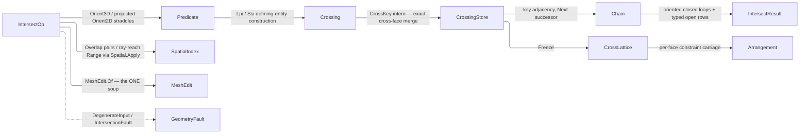

# [RASM_INTERSECTION_INTERSECT]

`Rasm.Meshing` owns the predicate-exact crossing lattice: one `IntersectOp` `[Union]` folded by one `Intersection.Apply` entry, crossing EXISTENCE decided by exact straddle signs, every crossing POINT an `Implicit` construction rounded at the `Round()` emission seam. Endpoints key by defining entities through `CrossKey`, adjacent-face crossings interning to one row by integer equality, and chains walk that adjacency into oriented closed loops and typed OPEN rows. Predicate-exact discrete crossing is the whole charter; host-parametric NURBS/Brep intersection homes at `Analysis/relations`.

Rebuilding composes the broad phase from `Spatial.Apply`, the triangle soups from `MeshEdit.Of`, and exact ordering from `Predicate.Compare`, authoring the Guigue-Devillers narrow phase and the key-connectivity chain assembly alone. `CrossingStore` binds the `Meshing/edit` arena law, and `IntersectResult.Chains` carries the frozen `CrossLattice` so `Meshing/arrangement` consumes the same run without a second narrow phase.

## [01]-[INDEX]

- [02]-[INTERSECTION]: one `Intersection.Apply` folding seven `IntersectOp` cases; `Crossing` = `Implicit` construction + `CrossKey` merge key over the `CrossingStore` arena; Guigue-Devillers narrow phase; key-connectivity chain walk with oriented loops and typed open chains.
- [03]-[DENSITY_BAR]: one owner per axis with its return rail and case count.

## [02]-[INTERSECTION]

- Owner: `PrimitiveKind` `[SmartEnum<string>]` mints the primitive vocabulary the `GeometryFault.IntersectionFault` payload reads; `IntersectKind` `[SmartEnum<string>]` carries the `A`/`B` primitive-pair columns the fault payload derives from its own row; `IntersectPolicy` registers `IValidityEvidence`; `CrossKey` is the defining-entity merge key where integer equality IS the cross-face merge; `Crossing` pairs the `Implicit` exact point with its `CrossKey`; `CrossingStore` interns key-classified crossing rows and segment pairs, freezing into the `CrossLattice` projection; `Chain` is the typed result row and `ChainWalk` the ONE oriented-edge decomposition behind it, composed here and by the arrangement rim; `IntersectOp`/`IntersectResult` are the request/result unions folded by the `Intersection` static surface.
- Cases: `IntersectOp` cases `SegmentSegment` · `SegmentTriangle` · `TriangleTriangle` · `RayMesh` · `MeshMesh` · `SelfMesh` · `PlaneMesh`; `IntersectResult` cases `Points` · `Segments` · `Chains`.
- Entry: `[BoundaryAdapter] Apply` discriminates on the op case and resolves the ONE key every interior static then takes outright; `Fin<T>` routes `GeometryFault.DegenerateInput` on an inadmissible primitive and `GeometryFault.IntersectionFault` — carrying the offending endpoint slot in its `Junction` column — on a section edge key incident to three or more faces, while an OPEN section on a boundaried mesh is a typed `Chain(Closed: false)`, never a fault. `SegmentSegment` carries its projection `Axis`, so the 2D restriction lives in the request shape.
- Auto: point-level cases run the exact straddle directly; mesh-level cases fold `MeshEdit.Of`, the `Spatial.Apply` BVH broad phase, and the narrow phase, interning each crossing endpoint into `CrossingStore` by `CrossKey` so a crossing reached from two face pairs lands on one row and a hit on a pierced edge or corner keys by its classified landing, not by either incident face. Chain assembly hands the material-oriented segments stored `from → to` to `ChainWalk`, which seats them in a bidirectional container source-first: an out-degree or in-degree above one on any endpoint routes the non-manifold junction fault carrying that endpoint, a zero-indegree head opens a typed open chain, a head the container gives a predecessor sits on a cycle and closes an oriented loop, and every remaining component is reached by the one depth-first sweep.
- Receipt: `IntersectResult` is the typed result; `Chains` carries the frozen `CrossLattice` as evidence-bearing payload, and the hash-eligible artifacts are the `Polyline`/`Point3d` values at the `Round()` seam.
- Law: every crossing row keys by INTEGER defining entities, and the one coincidence fallback keys by `Axis.BitKey` — the predicate owner's exact IEEE triple with signed zero folded onto positive, the same zero the exact `Compare` reads — so the arena carries no float-keyed table, no page re-derives that ordinal, and no tolerance decides identity. Broad-phase inflation reads `Context.For(ToleranceLane.MeshIntersection)` off the operand's own bound context, so the sweep band scales with the model instead of pinning an absolute epsilon on the policy row. `IntersectPolicy.KeepCoplanar` stays a bare bool: it gates whether the coplanar AREA contact emits constraint rows at all, and no second policy column shares a legal-corner law with it.
- Exemption: the mutable tables are arena or statement-kernel state, never frozen — `CrossingStore`'s `interned`/`byBits` intern maps and `segments`/`coplanar` accumulators (the arena's own columns, published only through `Freeze`), the `seam` third-vertex ledger inside one `Section` sweep, and `ChainWalk`'s `incoming` seed set, which orders the container's insertion and dies with the build.
- Packages: `Rasm.Numerics` (`Predicate`, `Implicit`/`Ssi`/`Lpi`, `Sign`, `Axis` with `Coord`/`BitKey`, `GeometryFault`), `Rasm.Spatial` (`Spatial.Apply` broad phase), `Rasm.Meshing` (`MeshEdit.Of`, `MeshSpace`), `Rasm.Domain` (`Op`, `Kind`, `Context`/`ToleranceLane`, `ValidityClaim`/`IValidityEvidence`), QuikGraph (`GraphExtensions.ToAdjacencyGraph`/`ToBidirectionalGraph`, `BidirectionalGraph`/`SEdge`, `DepthFirstSearchAlgorithm` under `ProcessAllComponents`, `VertexPredecessorPathRecorderObserver` — the chain decomposition's one container, one walk, one observer), `Rhino.Geometry`, Thinktecture.Runtime.Extensions, LanguageExt.Core.
- Growth: a new crossing modality is one `IntersectKind` row and one `IntersectOp` case reading the same narrow phase and key-connectivity assembly; a new crossing construction is a predicate-owner `Implicit` case; a new broad-phase knob is one `IntersectPolicy` column, and a new band is one `ToleranceLane` row at the context owner.
- Boundary: one `IntersectOp` `[Union]` folds every case; connectivity derives from integer `CrossKey` equality and exact `Compare` signs; every ordering is a TOTAL function of the input, the arena slot or arrival ordinal settling the `Compare` tie a collinear multi-touch produces, so no emission depends on an unstable sort's array layout; loops emit oriented at emission and open sections emit as typed rows; `Apply` is total over the `Fin` rail; `CrossingStore` is the single-writer arena whose frozen `CrossLattice` is the only projection consumers hold.

```csharp signature
// --- [RUNTIME_PRELUDE] ----------------------------------------------------------------------
using System;
using System.Collections.Generic;
using System.Linq;
using LanguageExt;
using QuikGraph;
using QuikGraph.Algorithms;
using QuikGraph.Algorithms.Observers;
using QuikGraph.Algorithms.Search;
using Rasm.Domain;
using Rasm.Numerics;
using Rasm.Spatial;
using Rhino.Geometry;
using Thinktecture;
using static LanguageExt.Prelude;
// CS0104 guard: LanguageExt.HashSet collides with the BCL name under the dual usings.
using IndexSet = System.Collections.Generic.HashSet<int>;

namespace Rasm.Meshing;

// --- [TYPES] ------------------------------------------------------------------------------
[SmartEnum<string>]
[KeyMemberEqualityComparer<ComparerAccessors.StringOrdinal, string>]
[KeyMemberComparer<ComparerAccessors.StringOrdinal, string>]
public sealed partial class PrimitiveKind {
    public static readonly PrimitiveKind Segment  = new("segment");
    public static readonly PrimitiveKind Triangle = new("triangle");
    public static readonly PrimitiveKind Ray      = new("ray");
    public static readonly PrimitiveKind Plane    = new("plane");
    public static readonly PrimitiveKind Mesh     = new("mesh");
}

[SmartEnum<string>]
[KeyMemberEqualityComparer<ComparerAccessors.StringOrdinal, string>]
[KeyMemberComparer<ComparerAccessors.StringOrdinal, string>]
public sealed partial class IntersectKind {
    public static readonly IntersectKind SegmentSegment   = new("segment-segment", PrimitiveKind.Segment, PrimitiveKind.Segment);
    public static readonly IntersectKind SegmentTriangle  = new("segment-triangle", PrimitiveKind.Segment, PrimitiveKind.Triangle);
    public static readonly IntersectKind TriangleTriangle = new("triangle-triangle", PrimitiveKind.Triangle, PrimitiveKind.Triangle);
    public static readonly IntersectKind RayMesh          = new("ray-mesh", PrimitiveKind.Ray, PrimitiveKind.Mesh);
    public static readonly IntersectKind MeshMesh         = new("mesh-mesh", PrimitiveKind.Mesh, PrimitiveKind.Mesh);
    public static readonly IntersectKind SelfMesh         = new("self-mesh", PrimitiveKind.Mesh, PrimitiveKind.Mesh);
    public static readonly IntersectKind PlaneMesh        = new("plane-mesh", PrimitiveKind.Plane, PrimitiveKind.Mesh);

    public PrimitiveKind A { get; }
    public PrimitiveKind B { get; }
}

// --- [CONSTANTS] --------------------------------------------------------------------------
// SeedCapacity seeds the arena; amortized doubling grows it. Broad-phase inflation is NOT a column: the
// operand's own Context owns it, so the sweep widens by the model's MeshIntersection lane rather than by an
// absolute epsilon meaningless at one scale and total at another.
public sealed record IntersectPolicy(int SeedCapacity, bool KeepCoplanar) : IValidityEvidence {
    public static readonly IntersectPolicy Canonical = new(SeedCapacity: 256, KeepCoplanar: true);

    public bool IsValid => ValidityClaim.Positive(value: SeedCapacity);
}

// --- [MODELS] -----------------------------------------------------------------------------
// Side names the operand whose piercing edge defines the hit; EdgeU/EdgeV canonical (U < V), EdgeU == EdgeV
// a vertex on the other operand; Face is the pierced face (-1 = cutting plane); OtherU/OtherV a coplanar
// crossing's second edge.
public readonly record struct CrossKey(int Side, int EdgeU, int EdgeV, int Face, int OtherU = -1, int OtherV = -1) {
    public static CrossKey Of(int side, int u, int v, int face) => new(side, int.Min(u, v), int.Max(u, v), face);
    public static CrossKey Vertex(int side, int w) => new(side, w, w, -1);
    public static CrossKey Coplanar(int u, int v, int s, int t) => new(0, int.Min(u, v), int.Max(u, v), -1, int.Min(s, t), int.Max(s, t));
}

public readonly record struct Crossing(Implicit Point, CrossKey Key);

public sealed record Chain(Polyline Points, bool Closed);

// ONE decomposition of an oriented edge set into closed loops and typed OPEN runs, composed by every rim and
// lattice assembly in the folder. Edges arrive as ordinal pairs and the corner projection is the caller's, so
// a rim over exact vertex ordinals and a lattice over interned crossing slots read one owner. Container is
// BIDIRECTIONAL because both degrees are read: an endpoint carrying a second outgoing or a second incoming is
// the non-manifold junction, and the fault carries the offending endpoint the caller cannot re-derive.
internal static class ChainWalk {
    internal static Fin<Seq<Chain>> Of(IEnumerable<(int From, int To)> edges, Func<int, Option<Point3d>> corner, PrimitiveKind a, PrimitiveKind b) {
        (int From, int To)[] rows = [.. edges];
        IndexSet incoming = [.. rows.Select(static row => row.To)];
        // Source-first ascending insertion IS the walk order: ToAdjacencyGraph seats vertices in edge order and
        // the search's remaining-component sweep follows it, so every open run is reached at its head and never
        // cut mid-run. Parallel edges are ADMITTED so a duplicated row raises the junction fault it is.
        BidirectionalGraph<int, SEdge<int>> graph = rows
            .OrderBy(row => incoming.Contains(row.From)).ThenBy(static row => row.From)
            .Select(static row => new SEdge<int>(row.From, row.To))
            .ToAdjacencyGraph<int, SEdge<int>>(allowParallelEdges: true)
            .ToBidirectionalGraph();
        if (toSeq(graph.Vertices).Find(v => graph.OutDegree(v) > 1 || graph.InDegree(v) > 1).Case is int junction) {
            return Fin.Fail<Seq<Chain>>(new GeometryFault.IntersectionFault(a, b, Some(junction)));
        }
        if (graph.EdgeCount == 0) { return Fin.Succ(Seq<Chain>()); }
        DepthFirstSearchAlgorithm<int, SEdge<int>> walk = new(graph) { ProcessAllComponents = true };
        VertexPredecessorPathRecorderObserver<int, SEdge<int>> recorder = new();
        using (recorder.Attach(walk)) { walk.Compute(graph.Vertices.First()); }
        List<Chain> chains = new();
        int covered = 0;
        foreach (IEnumerable<SEdge<int>> path in recorder.AllPaths()) {
            SEdge<int>[] run = [.. path];
            if (run.Length == 0) { continue; }
            covered += run.Length;
            // Both degrees are capped at one, so a head carrying a predecessor can only be sitting ON a cycle:
            // closure is that structural read, never an arity literal, and a two-row cycle IS closed.
            bool closed = graph.InDegree(run[0].Source) == 1;
            // A corner whose constructed readout refuses fails the WHOLE assembly: a silently dropped vertex
            // would publish a chain shorter than the rows that built it, attributable to nothing.
            if (Corners(run, corner).Case is not Polyline points) {
                return Fin.Fail<Seq<Chain>>(new GeometryFault.IntersectionFault(a, b, Some(run[0].Source)));
            }
            if (closed) { points.Add(points[0]); }
            chains.Add(new Chain(points, closed));
        }
        // Every edge belongs to exactly one run under the degree caps, so a shortfall is an assembly defect and
        // faults typed rather than publishing chains a consumer cannot reconcile against the row count.
        return covered == graph.EdgeCount
            ? Fin.Succ(toSeq(chains))
            : Fin.Fail<Seq<Chain>>(new GeometryFault.IntersectionFault(a, b, Some(graph.Edges.First().Source)));
    }

    static Option<Polyline> Corners(SEdge<int>[] run, Func<int, Option<Point3d>> corner) {
        Polyline line = new();
        foreach (int slot in run.Select(static edge => edge.Source).Append(run[^1].Target)) {
            if (corner(slot).Case is not Point3d at) { return None; }
            line.Add(at);
        }
        return Some(line);
    }
}

// Coplanar rows are constraint-only sub-segments carrying their original carrier edge, never in the chain walk.
public sealed record CrossLattice(
    Crossing[] Rows,
    (int A, int B, int FaceA, int FaceB)[] Segments,
    (int A, int B, int FaceA, int FaceB, int CarrierU, int CarrierV, int CarrierSide)[] Coplanar) {
    // Both per-side lookups materialize at CONSTRUCTION, which is Freeze — the one publication point — and both
    // consumers read every side, so a fill-on-read field buys nothing but a race between two operand legs over
    // one unguarded reference write. Side ordinal indexes the pair directly, so no fold re-derives a side.
    readonly ILookup<int, (int A, int B, int FaceA, int FaceB)>[] onFace =
        [Segments.ToLookup(static s => s.FaceA), Segments.ToLookup(static s => s.FaceB)];
    readonly ILookup<int, (int A, int B, int FaceA, int FaceB, int CarrierU, int CarrierV, int CarrierSide)>[] onCoplanar =
        [Coplanar.ToLookup(static s => s.FaceA), Coplanar.ToLookup(static s => s.FaceB)];

    public IEnumerable<(int A, int B, int FaceA, int FaceB)> OnFace(int side, int face) => onFace[side][face];

    public IEnumerable<(int A, int B, int FaceA, int FaceB, int CarrierU, int CarrierV, int CarrierSide)> CoplanarOnFace(int side, int face) =>
        onCoplanar[side][face];
}

public sealed class CrossingStore {
    Crossing[] rows;
    readonly Dictionary<CrossKey, int> interned = [];
    readonly Dictionary<(long X, long Y, long Z), int> byBits = [];
    readonly List<(int A, int B, int FaceA, int FaceB)> segments = [];
    readonly List<(int A, int B, int FaceA, int FaceB, int CarrierU, int CarrierV, int CarrierSide)> coplanar = [];
    int count;

    public CrossingStore(int seed) { rows = new Crossing[seed]; }

    public int Count => count;
    public Crossing Row(int slot) => rows[slot];

    // Coincidence keys the EXACT signed-zero-folded IEEE triple the predicate owner mints, never the Point3d
    // value: two rows unify only when every ordinate is bit-identical, so no tolerance decides identity.
    public int Intern(in Implicit point, CrossKey key) {
        if (interned.TryGetValue(key, out int at)) { return at; }
        if (point.IsExplicit && byBits.TryGetValue(Axis.BitKey(point.AsExplicit), out int shared)) { return interned[key] = shared; }
        Grow(count + 1);
        rows[count] = new Crossing(point, key);
        if (point.IsExplicit) { byBits[Axis.BitKey(point.AsExplicit)] = count; }
        return interned[key] = count++;
    }

    public void Segment(int a, int b, int faceA, int faceB) => segments.Add((a, b, faceA, faceB));
    public void CoplanarRow(int a, int b, int faceA, int faceB, int carrierU, int carrierV, int carrierSide) => coplanar.Add((a, b, faceA, faceB, carrierU, carrierV, carrierSide));

    public CrossLattice Freeze() => new([.. rows.AsSpan(0, count)], [.. segments], [.. coplanar]);

    void Grow(int needed) {
        if (needed <= rows.Length) { return; }
        Array.Resize(ref rows, int.Max(needed, rows.Length << 1));
    }
}

[Union(ConversionFromValue = ConversionOperatorsGeneration.None)]
public abstract partial record IntersectResult {
    private IntersectResult() { }

    public sealed record Points(Seq<Point3d> Hits) : IntersectResult;
    public sealed record Segments(Seq<Line> Crossings) : IntersectResult;
    public sealed record Chains(Seq<Chain> Walked, CrossLattice Lattice) : IntersectResult;
}

// --- [OPERATIONS] -------------------------------------------------------------------------
[Union(ConversionFromValue = ConversionOperatorsGeneration.None)]
public abstract partial record IntersectOp {
    private IntersectOp() { }

    public sealed record SegmentSegment(Line A, Line B, Axis Plane, IntersectPolicy Policy) : IntersectOp;
    public sealed record SegmentTriangle(Line Edge, Point3d Ta, Point3d Tb, Point3d Tc, IntersectPolicy Policy) : IntersectOp;
    public sealed record TriangleTriangle(Point3d Pa, Point3d Pb, Point3d Pc, Point3d Qa, Point3d Qb, Point3d Qc, IntersectPolicy Policy) : IntersectOp;
    public sealed record RayMesh(Ray3d Ray, double MaxT, MeshSpace Mesh, IntersectPolicy Policy) : IntersectOp;
    public sealed record MeshMesh(MeshSpace A, MeshSpace B, IntersectPolicy Policy) : IntersectOp;
    public sealed record SelfMesh(MeshSpace Mesh, IntersectPolicy Policy) : IntersectOp;
    public sealed record PlaneMesh(Plane Cut, MeshSpace Mesh, IntersectPolicy Policy) : IntersectOp;

    public IntersectKind Kind =>
        Switch(
            segmentSegment:   static _ => IntersectKind.SegmentSegment,
            segmentTriangle:  static _ => IntersectKind.SegmentTriangle,
            triangleTriangle: static _ => IntersectKind.TriangleTriangle,
            rayMesh:          static _ => IntersectKind.RayMesh,
            meshMesh:         static _ => IntersectKind.MeshMesh,
            selfMesh:         static _ => IntersectKind.SelfMesh,
            planeMesh:        static _ => IntersectKind.PlaneMesh);
}

public static class Intersection {
    [BoundaryAdapter]
    public static Fin<IntersectResult> Apply(IntersectOp op, Op? key = null) {
        Op site = key.OrDefault();
        return Admit(op).Bind(_ => op.Switch(
            segmentSegment:   s => Fin.Succ(CrossSegments2D(s.A, s.B, s.Plane)
                .Match(Some: c => (IntersectResult)new IntersectResult.Points(Seq(c.Point.Round())), None: () => new IntersectResult.Points(Seq<Point3d>()))),
            segmentTriangle:  s => Fin.Succ((IntersectResult)new IntersectResult.Points(
                EdgePierce(s.Edge.From, s.Edge.To, s.Ta, s.Tb, s.Tc).Match(Some: p => Seq(p.Round()), None: () => Seq<Point3d>()))),
            triangleTriangle: t => Fin.Succ((IntersectResult)new IntersectResult.Segments(
                TriTriSegment(t.Pa, t.Pb, t.Pc, t.Qa, t.Qb, t.Qc).Match(
                    Some: seg => Seq(new Line(seg.A.Round(), seg.B.Round())),
                    None: () => Seq<Line>()))),
            rayMesh:          r => FirstHit(r, site),
            meshMesh:         m => Lattice(m, site).Bind(store => Chains(store.Freeze(), m.Kind)),
            selfMesh:         sm => SelfLattice(sm, site).Bind(store => Chains(store.Freeze(), sm.Kind)),
            planeMesh:        p => Section(p, site).Bind(store => Chains(store.Freeze(), p.Kind))));
    }

    // Generated Switch is total, so a new op case breaks this gate at compile time.
    static Fin<Unit> Admit(IntersectOp op) =>
        op.Switch(
            segmentSegment:   static s => s.A.Length == 0.0 || s.B.Length == 0.0 ? Reject(Kind.Line, "zero-length segment") : Fin.Succ(unit),
            segmentTriangle:  static s => s.Edge.Length == 0.0 ? Reject(Kind.Line, "zero-length segment")
                : Sliver(s.Ta, s.Tb, s.Tc) ? Reject(Kind.Mesh, "sliver triangle") : Fin.Succ(unit),
            triangleTriangle: static t => Sliver(t.Pa, t.Pb, t.Pc) || Sliver(t.Qa, t.Qb, t.Qc) ? Reject(Kind.Mesh, "sliver triangle") : Fin.Succ(unit),
            rayMesh:          static r => !(r.MaxT > 0.0) || !r.Ray.Direction.IsValid || r.Ray.Direction.IsZero ? Reject(Kind.Point, "degenerate ray") : Fin.Succ(unit),
            meshMesh:         static _ => Fin.Succ(unit),
            selfMesh:         static _ => Fin.Succ(unit),
            planeMesh:        static p => p.Cut.IsValid ? Fin.Succ(unit) : Reject(Kind.Plane, "non-finite plane"));

    static Fin<Unit> Reject(Kind kind, string witness) =>
        Fin.Fail<Unit>(new GeometryFault.DegenerateInput(kind, None, witness));

    static bool Sliver(Point3d a, Point3d b, Point3d c) =>
        Predicate.Orient2D(a, b, c) == Sign.Zero
        && Predicate.Orient2D(Swap(a, Axis.X), Swap(b, Axis.X), Swap(c, Axis.X)) == Sign.Zero
        && Predicate.Orient2D(Swap(a, Axis.Y), Swap(b, Axis.Y), Swap(c, Axis.Y)) == Sign.Zero;

    static Point3d Swap(Point3d p, Axis axis) => new(Axis.Coord(p, axis.U), Axis.Coord(p, axis.V), 0.0);

    // --- [NARROW_PHASE]
    // Four projected Orient2D signs decide the crossing; the point is the Ssi over the four endpoints.
    static Option<Crossing> CrossSegments2D(Line a, Line b, Axis plane) {
        Sign d1 = Predicate.Orient2D(new Implicit(a.From), new Implicit(a.To), new Implicit(b.From), plane);
        Sign d2 = Predicate.Orient2D(new Implicit(a.From), new Implicit(a.To), new Implicit(b.To), plane);
        Sign d3 = Predicate.Orient2D(new Implicit(b.From), new Implicit(b.To), new Implicit(a.From), plane);
        Sign d4 = Predicate.Orient2D(new Implicit(b.From), new Implicit(b.To), new Implicit(a.To), plane);
        return d1.Times(d2) == Sign.Negative && d3.Times(d4) == Sign.Negative
            ? Some(new Crossing(new Ssi(a.From, a.To, b.From, b.To, plane), CrossKey.Of(0, 0, 1, -1)))
            : None;
    }

    // Edge x plane pierce; in-triangle containment runs exact on the Lpi implicit point, never rounded.
    static Option<Implicit> EdgePierce(Point3d u, Point3d v, Point3d a, Point3d b, Point3d c) {
        Sign su = Predicate.Orient3D(a, b, c, u), sv = Predicate.Orient3D(a, b, c, v);
        if (su.Times(sv) != Sign.Negative) { return None; }
        Implicit hit = new Lpi(u, v, a, b, c);
        return Axis.DominantOf(a, b, c).Case is Axis axis && InsideProjected(in hit, a, b, c, axis) ? Some(hit) : None;
    }

    // Boundary-inclusive projected containment, exact over the carrier: both winding orientations.
    static bool InsideProjected(in Implicit p, Point3d a, Point3d b, Point3d c, Axis axis) =>
        Placed(in p, a, b, c, axis).IsSome;

    // Containment with exact boundary classification: None outside; `(-1,-1)` interior; `(k,-1)` on
    // face edge k; `(-1,w)` on face vertex w — the classified key holds the cross-face merge through boundaries.
    static Option<(int Edge, int Vertex)> Placed(in Implicit p, Point3d a, Point3d b, Point3d c, Axis axis) {
        Sign s0 = Predicate.Orient2D(new Implicit(a), new Implicit(b), in p, axis);
        Sign s1 = Predicate.Orient2D(new Implicit(b), new Implicit(c), in p, axis);
        Sign s2 = Predicate.Orient2D(new Implicit(c), new Implicit(a), in p, axis);
        bool inside = (s0 != Sign.Negative && s1 != Sign.Negative && s2 != Sign.Negative)
            || (s0 != Sign.Positive && s1 != Sign.Positive && s2 != Sign.Positive);
        return !inside ? None
            : (s0 == Sign.Zero, s1 == Sign.Zero, s2 == Sign.Zero) switch {
                (true, true, _)  => Some((-1, 1)),
                (_, true, true)  => Some((-1, 2)),
                (true, _, true)  => Some((-1, 0)),
                (true, _, _)     => Some((0, -1)),
                (_, true, _)     => Some((1, -1)),
                (_, _, true)     => Some((2, -1)),
                _                => Some((-1, -1)),
            };
    }

    // --- [GUIGUE_DEVILLERS]
    // Mutual straddle rejection with zero constructed coordinates; a crossing mints Lpi endpoints and a
    // detected-Zero vertex on the other plane contributes its explicit row. The interval orders by exact
    // Compare on the crossing line nP×nQ dominant axis; the all-Zero coplanar pair routes to the clip.
    static Option<(Implicit A, Implicit B)> TriTriSegment(Point3d pa, Point3d pb, Point3d pc, Point3d qa, Point3d qb, Point3d qc) {
        Span<Sign> q = [Predicate.Orient3D(pa, pb, pc, qa), Predicate.Orient3D(pa, pb, pc, qb), Predicate.Orient3D(pa, pb, pc, qc)];
        if (q[0] == Sign.Zero && q[1] == Sign.Zero && q[2] == Sign.Zero) { return None; }  // the coplanar AREA pair — the mesh fold's clip owns it
        if (ZeroPair(q).Case is int zq) {  // one Q edge lies IN P's plane: the contact is its exact clip against P
            (Point3d u, Point3d v) = zq == 0 ? (qa, qb) : zq == 1 ? (qb, qc) : (qc, qa);
            List<Implicit> clip = Axis.DominantOf(pa, pb, pc).Case is Axis plane ? ClipToTriangle(u, v, pa, pb, pc, plane) : [];
            return clip.Count >= 2 ? Some((clip[0], clip[^1])) : None;
        }
        if (SameSide(q)) { return None; }
        Span<Sign> p = [Predicate.Orient3D(qa, qb, qc, pa), Predicate.Orient3D(qa, qb, qc, pb), Predicate.Orient3D(qa, qb, qc, pc)];
        if (ZeroPair(p).Case is int zp) {
            (Point3d u, Point3d v) = zp == 0 ? (pa, pb) : zp == 1 ? (pb, pc) : (pc, pa);
            List<Implicit> clip = Axis.DominantOf(qa, qb, qc).Case is Axis plane ? ClipToTriangle(u, v, qa, qb, qc, plane) : [];
            return clip.Count >= 2 ? Some((clip[0], clip[^1])) : None;
        }
        if (SameSide(p)) { return None; }
        List<Implicit> hits = new(4);
        Collect(hits, pa, pb, pc, p, qa, qb, qc);
        Collect(hits, qa, qb, qc, q, pa, pb, pc);
        if (hits.Count < 2) { return None; }
        if (Axis.DominantOf(Vector3d.CrossProduct(Vector3d.CrossProduct(pb - pa, pc - pa), Vector3d.CrossProduct(qb - qa, qc - qa))).Case is not Axis order) { return None; }
        // Only the interval ENDS are wanted, so one pass takes them under the exact order and the ROW ORDINAL
        // settles a tie: Compare reads Zero for two distinct rows sharing the ordering coordinate — a collinear
        // multi-touch — and an unstable sort would then hand two runtimes two different pairs.
        (int lo, int hi) = (0, 0);
        for (int i = 1; i < hits.Count; i++) {
            (Implicit here, Implicit least, Implicit greatest) = (hits[i], hits[lo], hits[hi]);
            if (Predicate.Compare(in here, in least, order) == Sign.Negative) { lo = i; }
            if (Predicate.Compare(in here, in greatest, order) != Sign.Negative) { hi = i; }
        }
        return Some((hits[lo], hits[hi]));

        static void Collect(List<Implicit> hits, Point3d a, Point3d b, Point3d c, ReadOnlySpan<Sign> signs, Point3d ta, Point3d tb, Point3d tc) {
            if (Axis.DominantOf(ta, tb, tc).Case is not Axis axis) { return; }
            Span<(Point3d W, Sign S)> verts = [(a, signs[0]), (b, signs[1]), (c, signs[2])];
            foreach ((Point3d w, Sign s) in verts) {
                Implicit row = new(w);
                if (s == Sign.Zero && InsideProjected(in row, ta, tb, tc, axis)) { hits.Add(row); }
            }
            Span<(Point3d U, Point3d V, Sign Su, Sign Sv)> edges = [(a, b, signs[0], signs[1]), (b, c, signs[1], signs[2]), (c, a, signs[2], signs[0])];
            foreach ((Point3d u, Point3d v, Sign su, Sign sv) in edges) {
                if (su.Times(sv) == Sign.Negative && EdgePierce(u, v, ta, tb, tc).Case is Implicit hit) { hits.Add(hit); }
            }
        }
    }

    static bool SameSide(ReadOnlySpan<Sign> s) =>
        (s[0] != Sign.Negative && s[1] != Sign.Negative && s[2] != Sign.Negative && (s[0] == Sign.Positive || s[1] == Sign.Positive || s[2] == Sign.Positive))
        || (s[0] != Sign.Positive && s[1] != Sign.Positive && s[2] != Sign.Positive && (s[0] == Sign.Negative || s[1] == Sign.Negative || s[2] == Sign.Negative));

    // Exactly two Zero signs name the in-plane edge by its first vertex ordinal; ABSENCE is the answer for
    // every other sign pattern, so no ordinal is reserved to spell "no in-plane edge".
    static Option<int> ZeroPair(ReadOnlySpan<Sign> s) =>
        (s[0] == Sign.Zero, s[1] == Sign.Zero, s[2] == Sign.Zero) switch {
            (true, true, false) => Some(0),
            (false, true, true) => Some(1),
            (true, false, true) => Some(2),
            _                   => Option<int>.None,
        };

    // Exact clip of the in-plane segment against the triangle: boundary-inclusive endpoint rows plus
    // strict edge crossings ordered along the carrier, so every consecutive pair is an inside sub-segment.
    static List<Implicit> ClipToTriangle(Point3d u, Point3d v, Point3d a, Point3d b, Point3d c, Axis plane) {
        List<Implicit> kept = new(4);
        Implicit ru = new(u), rv = new(v);
        if (InsideProjected(in ru, a, b, c, plane)) { kept.Add(ru); }
        if (InsideProjected(in rv, a, b, c, plane)) { kept.Add(rv); }
        foreach ((Point3d s, Point3d t) in (ReadOnlySpan<(Point3d, Point3d)>)[(a, b), (b, c), (c, a)]) {
            if (CrossSegments2D(new Line(u, v), new Line(s, t), plane).Case is Crossing hit) { kept.Add(hit.Point); }
        }
        if (Axis.DominantOf(v - u).Case is not Axis along) { return kept; }
        // Emission order is a total function of the input: the exact Compare orders, and the row's own arrival
        // ordinal settles the Zero a collinear multi-touch produces, which an introsort would leave to layout.
        int[] ranked = [.. Enumerable.Range(0, kept.Count)];
        Array.Sort(ranked, (l, r) => {
            (Implicit left, Implicit right) = (kept[l], kept[r]);
            Sign side = Predicate.Compare(in left, in right, along);
            return side != Sign.Zero ? side.Key : l.CompareTo(r);
        });
        return [.. ranked.Select(at => kept[at])];
    }

    // --- [BROAD_PHASE]
    static Fin<SpatialIndex> Bvh(MeshEdit soup, Op key) {
        BoundingBox[] boxes = new BoundingBox[soup.FaceCount];
        for (int f = 0; f < soup.FaceCount; f++) { boxes[f] = soup.Bounds(f); }
        return Spatial.Apply(new SpatialOp.Build(SpatialKind.Bvh, boxes, BuildPolicy.Canonical), key)
            .Bind(static answer => answer is SpatialAnswer.Index built
                ? Fin.Succ(built.Value)
                : Fin.Fail<SpatialIndex>(new GeometryFault.KindMismatch(SpatialKind.Bvh, QueryKind.Overlap)));
    }

    static Fin<Seq<(int Left, int Right)>> OverlapPairs(SpatialIndex a, SpatialIndex b, double inflation, Op key) =>
        Spatial.Apply(new SpatialOp.Query(a, new SpatialQuery.Overlap(b, inflation)), key)
            .Bind(static answer => answer is SpatialAnswer.Result { Value: QueryResult.Pairs pairs }
                ? Fin.Succ(pairs.Overlaps)
                : Fin.Fail<Seq<(int, int)>>(new GeometryFault.KindMismatch(SpatialKind.Bvh, QueryKind.Overlap)));

    // --- [LATTICE]
    static Fin<CrossingStore> Lattice(IntersectOp.MeshMesh op, Op key) {
        using MeshEdit ea = MeshEdit.Of(op.A);
        using MeshEdit eb = MeshEdit.Of(op.B);
        return (Bvh(ea, key), Bvh(eb, key)).Apply((ia, ib) => (ia, ib)).As()
            .Bind(t => OverlapPairs(t.ia, t.ib, op.A.Tolerance.For(ToleranceLane.MeshIntersection).Value, key))
            .Map(pairs => pairs.Fold(new CrossingStore(op.Policy.SeedCapacity), (store, pair) => PairCrossings(store, ea, eb, pair.Left, pair.Right, op.Policy)));
    }

    // One soup's BVH overlapped against itself, each unordered pair narrow-phased once with side 0 on
    // both sweeps — one vertex namespace, one key space. Only shared-edge pairs are excluded; a
    // single-shared-vertex pair narrow-phases honestly, its exact Zeros separating contact from fold-over.
    static Fin<CrossingStore> SelfLattice(IntersectOp.SelfMesh op, Op key) {
        using MeshEdit soup = MeshEdit.Of(op.Mesh);
        return Bvh(soup, key)
            .Bind(index => OverlapPairs(index, index, op.Mesh.Tolerance.For(ToleranceLane.MeshIntersection).Value, key))
            .Map(pairs => pairs.Fold(new CrossingStore(op.Policy.SeedCapacity), (store, pair) =>
                pair.Left < pair.Right && SharedVertices(soup, pair.Left, pair.Right) < 2
                    ? PairCrossings(store, soup, soup, pair.Left, pair.Right, op.Policy, sideA: 0, sideB: 0)
                    : store));
    }

    static int SharedVertices(MeshEdit soup, int fa, int fb) {
        (int a0, int a1, int a2) = soup.Face(fa);
        (int b0, int b1, int b2) = soup.Face(fb);
        int shared = 0;
        foreach (int v in (ReadOnlySpan<int>)[a0, a1, a2]) {
            if (v == b0 || v == b1 || v == b2) { shared++; }
        }
        return shared;
    }

    static CrossingStore PairCrossings(CrossingStore store, MeshEdit a, MeshEdit b, int fa, int fb, IntersectPolicy policy, int sideA = 0, int sideB = 1) {
        (int a0, int a1, int a2) = a.Face(fa);
        (int b0, int b1, int b2) = b.Face(fb);
        (Point3d pa, Point3d pb, Point3d pc) = (a.Position(a0), a.Position(a1), a.Position(a2));
        (Point3d qa, Point3d qb, Point3d qc) = (b.Position(b0), b.Position(b1), b.Position(b2));
        Span<Sign> qs = [Predicate.Orient3D(pa, pb, pc, qa), Predicate.Orient3D(pa, pb, pc, qb), Predicate.Orient3D(pa, pb, pc, qc)];
        if (qs[0] == Sign.Zero && qs[1] == Sign.Zero && qs[2] == Sign.Zero) {
            return policy.KeepCoplanar ? CoplanarCrossings(store, a, b, fa, fb, sideA, sideB) : store;
        }
        Span<Sign> ps = [Predicate.Orient3D(qa, qb, qc, pa), Predicate.Orient3D(qa, qb, qc, pb), Predicate.Orient3D(qa, qb, qc, pc)];
        List<int> ends = new(4);
        Pierce(store, ends, sideA, sideB, a, (a0, a1, a2), ps, b, (b0, b1, b2), fb);
        Pierce(store, ends, sideB, sideA, b, (b0, b1, b2), qs, a, (a0, a1, a2), fa);
        if (ends.Count < 2) { return store; }  // a single row is a point touch — no curve
        Vector3d material = Vector3d.CrossProduct(Vector3d.CrossProduct(pb - pa, pc - pa), Vector3d.CrossProduct(qb - qa, qc - qa));
        if (Axis.DominantOf(material).Case is not Axis axis) { return store; }
        Sign forward = Along(material, axis);
        // Arena slot settles the Compare tie a collinear multi-touch produces, so the emitted pairing is a total
        // function of the input rather than of an unstable sort's array layout.
        ends.Sort((l, r) => {
            (Implicit left, Implicit right) = (store.Row(l).Point, store.Row(r).Point);
            Sign side = Predicate.Compare(in left, in right, axis).Times(forward);
            return side != Sign.Zero ? side.Key : l.CompareTo(r);
        });
        for (int k = 0; k + 1 < ends.Count; k++) { store.Segment(ends[k], ends[k + 1], fa, fb); }  // interior rows kept — a collinear multi-touch subdivides
        return store;

        // Every detected Zero acts: a vertex on the other plane interns its explicit row keyed by the
        // vertex (globally shared); an in-plane edge contributes edge x edge crossings under Coplanar keys;
        // a strict straddle pierces as an Lpi row keyed by its classified landing (edge, corner, or face).
        static void Pierce(CrossingStore store, List<int> ends, int side, int otherSide, MeshEdit soup, (int V0, int V1, int V2) f, ReadOnlySpan<Sign> signs, MeshEdit other, (int W0, int W1, int W2) g, int otherFace) {
            (Point3d ta, Point3d tb, Point3d tc) = (other.Position(g.W0), other.Position(g.W1), other.Position(g.W2));
            if (Axis.DominantOf(ta, tb, tc).Case is not Axis plane) { return; }
            Span<int> verts = [f.V0, f.V1, f.V2];
            int W(int ordinal) => ordinal == 0 ? g.W0 : ordinal == 1 ? g.W1 : g.W2;
            for (int i = 0; i < 3; i++) {
                Implicit row = new(soup.Position(verts[i]));
                if (signs[i] == Sign.Zero && InsideProjected(in row, ta, tb, tc, plane)) {
                    Keep(ends, store.Intern(in row, CrossKey.Vertex(side, verts[i])));
                }
            }
            for (int e = 0; e < 3; e++) {
                (int u, int v) = (verts[e], verts[(e + 1) % 3]);
                Sign su = signs[e], sv = signs[(e + 1) % 3];
                if (su.Times(sv) == Sign.Negative) {
                    Implicit hit = new Lpi(soup.Position(u), soup.Position(v), ta, tb, tc);
                    if (Placed(in hit, ta, tb, tc, plane).Case is (int onEdge, int onVertex)) {
                        Keep(ends, onVertex >= 0
                            ? store.Intern(new Implicit(other.Position(W(onVertex))), CrossKey.Vertex(otherSide, W(onVertex)))
                            : onEdge >= 0
                                ? store.Intern(in hit, CoplanarKey(side, otherSide, u, v, W(onEdge), W((onEdge + 1) % 3)))
                                : store.Intern(in hit, CrossKey.Of(side, u, v, otherFace)));
                    }
                }
                else if (su == Sign.Zero && sv == Sign.Zero) {
                    foreach ((int s2, int t2) in (ReadOnlySpan<(int, int)>)[(g.W0, g.W1), (g.W1, g.W2), (g.W2, g.W0)]) {
                        if (CrossSegments2D(new Line(soup.Position(u), soup.Position(v)), new Line(other.Position(s2), other.Position(t2)), plane).Case is Crossing cross) {
                            Keep(ends, store.Intern(cross.Point, CoplanarKey(side, otherSide, u, v, s2, t2)));
                        }
                    }
                }
            }
        }
    }

    // Coplanar keys put the side-0 edge first; a self pair orders the two edges canonically.
    static CrossKey CoplanarKey(int side, int otherSide, int u, int v, int s, int t) =>
        side == otherSide
            ? ((int.Min(u, v), int.Max(u, v)).CompareTo((int.Min(s, t), int.Max(s, t))) <= 0 ? CrossKey.Coplanar(u, v, s, t) : CrossKey.Coplanar(s, t, u, v))
            : side == 0 ? CrossKey.Coplanar(u, v, s, t) : CrossKey.Coplanar(s, t, u, v);

    static void Keep(List<int> ends, int slot) {
        if (!ends.Contains(slot)) { ends.Add(slot); }
    }

    // Orientation lands at accumulation: each segment stored from -> to along the op convention (nA x nB
    // mesh-mesh, cut.Normal x faceNormal sections), so closed loops close outer-CCW / holes-CW by construction.
    static (int From, int To) Oriented(CrossingStore store, int e0, int e1, Vector3d material) {
        if (Axis.DominantOf(material).Case is not Axis axis) { return (e0, e1); }
        Implicit p0 = store.Row(e0).Point;
        Implicit p1 = store.Row(e1).Point;
        Sign order = Predicate.Compare(in p0, in p1, axis).Times(Along(material, axis));
        return order == Sign.Negative ? (e0, e1) : (e1, e0);
    }

    // Coplanar contact is an area: each edge clips exactly against the other triangle — boundary-inclusive
    // vertex rows plus strict edge x edge Ssi crossings keyed by defining entities (Face-free, so the
    // point interns once per coplanar pair) — every consecutive pair a constraint row on its carrier edge.
    static CrossingStore CoplanarCrossings(CrossingStore store, MeshEdit a, MeshEdit b, int fa, int fb, int sideA = 0, int sideB = 1) {
        (int a0, int a1, int a2) = a.Face(fa);
        (int b0, int b1, int b2) = b.Face(fb);
        if (Axis.DominantOf(a.Position(a0), a.Position(a1), a.Position(a2)).Case is not Axis plane) { return store; }
        Flush(store, plane, sideA, sideB, a, (a0, a1, a2), b, (b0, b1, b2), fa, fb);
        Flush(store, plane, sideB, sideA, b, (b0, b1, b2), a, (a0, a1, a2), fa, fb);
        return store;

        static void Flush(CrossingStore store, Axis plane, int carrierSide, int otherSide, MeshEdit own, (int V0, int V1, int V2) f, MeshEdit other, (int W0, int W1, int W2) g, int fa, int fb) {
            (Point3d ta, Point3d tb, Point3d tc) = (other.Position(g.W0), other.Position(g.W1), other.Position(g.W2));
            foreach ((int u, int v) in (ReadOnlySpan<(int, int)>)[(f.V0, f.V1), (f.V1, f.V2), (f.V2, f.V0)]) {
                (Point3d pu, Point3d pv) = (own.Position(u), own.Position(v));
                List<int> kept = new(4);
                Implicit ru = new(pu), rv = new(pv);
                if (InsideProjected(in ru, ta, tb, tc, plane)) { Keep(kept, store.Intern(in ru, CrossKey.Vertex(carrierSide, u))); }
                if (InsideProjected(in rv, ta, tb, tc, plane)) { Keep(kept, store.Intern(in rv, CrossKey.Vertex(carrierSide, v))); }
                foreach ((int s, int t) in (ReadOnlySpan<(int, int)>)[(g.W0, g.W1), (g.W1, g.W2), (g.W2, g.W0)]) {
                    if (CrossSegments2D(new Line(pu, pv), new Line(other.Position(s), other.Position(t)), plane).Case is Crossing hit) {
                        Keep(kept, store.Intern(hit.Point, CoplanarKey(carrierSide, otherSide, u, v, s, t)));
                    }
                }
                if (kept.Count < 2) { continue; }
                if (Axis.DominantOf(pv - pu).Case is not Axis along) { continue; }
                kept.Sort((l, r) => {
                    (Implicit left, Implicit right) = (store.Row(l).Point, store.Row(r).Point);
                    Sign side = Predicate.Compare(in left, in right, along);
                    return side != Sign.Zero ? side.Key : l.CompareTo(r);
                });
                for (int k = 0; k + 1 < kept.Count; k++) { store.CoplanarRow(kept[k], kept[k + 1], fa, fb, u, v, carrierSide); }
            }
        }
    }

    // Plane section: a sign-driven sweep — the cutting plane is infinite, so a pierced edge needs no
    // containment gate and the per-face fold is the narrow phase. A vertex on the plane interns a globally
    // keyed row so adjacent segments meet through it; an in-plane edge counts once when its faces straddle.
    static Fin<CrossingStore> Section(IntersectOp.PlaneMesh op, Op key) {
        using MeshEdit soup = MeshEdit.Of(op.Mesh);
        (Point3d po, Point3d px, Point3d py) = (op.Cut.Origin, op.Cut.Origin + op.Cut.XAxis, op.Cut.Origin + op.Cut.YAxis);
        CrossingStore store = new(op.Policy.SeedCapacity);
        Dictionary<(int U, int V), Sign> seam = new();
        for (int f = 0; f < soup.FaceCount; f++) {
            (int v0, int v1, int v2) = soup.Face(f);
            Span<int> verts = [v0, v1, v2];
            Span<Sign> s = [
                Predicate.Orient3D(po, px, py, soup.Position(v0)),
                Predicate.Orient3D(po, px, py, soup.Position(v1)),
                Predicate.Orient3D(po, px, py, soup.Position(v2))];
            if (s[0] == Sign.Zero && s[1] == Sign.Zero && s[2] == Sign.Zero) { continue; }  // a face IN the plane is an area contact, not a curve
            Vector3d faceNormal = Vector3d.CrossProduct(soup.Position(v1) - soup.Position(v0), soup.Position(v2) - soup.Position(v0));
            Vector3d material = Vector3d.CrossProduct(op.Cut.Normal, faceNormal);
            // At most ONE edge can lie in the plane once the all-Zero face is out, and it is then this
            // face's WHOLE contribution — the third vertex is off-plane, so no straddle pair remains. The
            // scan carries WHICH edge rather than a flag, and absence is the pierce sweep's own gate.
            Option<int> flat = None;
            for (int e = 0; e < 3 && flat.IsNone; e++) {
                if (s[e] == Sign.Zero && s[(e + 1) % 3] == Sign.Zero) { flat = Some(e); }
            }
            if (flat.Case is int lying) {
                (int u, int v) = (verts[lying], verts[(lying + 1) % 3]);
                (int cu, int cv) = (int.Min(u, v), int.Max(u, v));
                Sign third = s[(lying + 2) % 3];
                if (!seam.TryGetValue((cu, cv), out Sign facing)) { seam[(cu, cv)] = third; continue; }
                if (facing.Times(third) != Sign.Negative) { continue; }  // both thirds one side: a fold, not a crossing
                int au = store.Intern(new Implicit(soup.Position(u)), CrossKey.Vertex(0, u));
                int av = store.Intern(new Implicit(soup.Position(v)), CrossKey.Vertex(0, v));
                (int from, int to) = Oriented(store, au, av, material);
                store.Segment(from, to, f, -1);
                continue;
            }
            List<int> ends = new(2);
            for (int i = 0; i < 3; i++) {
                if (s[i] == Sign.Zero) { Keep(ends, store.Intern(new Implicit(soup.Position(verts[i])), CrossKey.Vertex(0, verts[i]))); }
            }
            for (int e = 0; e < 3; e++) {
                (int u, int v) = (verts[e], verts[(e + 1) % 3]);
                if (s[e].Times(s[(e + 1) % 3]) == Sign.Negative) {
                    Keep(ends, store.Intern(new Lpi(soup.Position(u), soup.Position(v), po, px, py), CrossKey.Of(0, u, v, -1)));
                }
            }
            if (ends.Count == 2) {
                (int from, int to) = Oriented(store, ends[0], ends[1], material);
                store.Segment(from, to, f, -1);
            }
        }
        return Fin.Succ(store);
    }

    // Range prune over the ray's reach, exact re-decision on every candidate, first hit by exact Compare
    // along the ray's dominant axis: the acceleration selects, the predicate family alone decides and orders.
    static Fin<IntersectResult> FirstHit(IntersectOp.RayMesh op, Op key) {
        using MeshEdit soup = MeshEdit.Of(op.Mesh);
        (Point3d from, Point3d to) = (op.Ray.Position, op.Ray.PointAt(op.MaxT));
        if (Axis.DominantOf(op.Ray.Direction, key).Case is not Axis axis) { return Fin.Fail<IntersectResult>(key.InvalidInput()); }
        Sign forward = Along(op.Ray.Direction, axis);
        return Bvh(soup, key)
            .Bind(index => Spatial.Apply(new SpatialOp.Query(index, new SpatialQuery.Range(new BoundingBox([from, to]), None)), key))
            .Bind(static answer => answer is SpatialAnswer.Result { Value: QueryResult.Hits hits }
                ? Fin.Succ(hits.Ids)
                : Fin.Fail<Seq<int>>(new GeometryFault.KindMismatch(SpatialKind.Bvh, QueryKind.Range)))
            .Map(faces => {
                Option<Implicit> best = None;
                foreach (int f in faces) {
                    (int v0, int v1, int v2) = soup.Face(f);
                    if (EdgePierce(from, to, soup.Position(v0), soup.Position(v1), soup.Position(v2)).Case is not Implicit hit) { continue; }
                    best = best.Match(
                        Some: held => Predicate.Compare(in hit, in held, axis).Times(forward) == Sign.Negative ? Some(hit) : Some(held),
                        None: () => Some(hit));
                }
                return (IntersectResult)new IntersectResult.Points(best.Match(Some: static h => Seq(h.Round()), None: static () => Seq<Point3d>()));
            });
    }

    // --- [CHAIN]
    // Chain assembly composes the folder's ONE oriented-edge decomposition: the lattice supplies its
    // material-oriented segments and its own emission-seam corner projection, and the walk owner returns
    // oriented loops and typed open runs over them.
    static Fin<IntersectResult> Chains(CrossLattice lattice, IntersectKind kind) =>
        ChainWalk.Of(lattice.Segments.Select(static s => (s.A, s.B)), slot => lattice.Rows[slot].Point.Round(), kind.A, kind.B)
            .Map(chains => (IntersectResult)new IntersectResult.Chains(chains, lattice));

    // --- [PRIMITIVES]
    static Sign Along(Vector3d d, Axis axis) => Sign.Of(Axis.Coord(d, axis.Key));
}
```


```mermaid
---
config:
  layout: elk
  flowchart:
    curve: linear
    padding: 25
---
flowchart LR
    accTitle: Crossing lattice flow
    accDescr: Operands flow through the broad phase, exact narrow phase, and key-interned crossing rows into chained loops and open rows.
    IntersectOp -->|Orient3D / projected Orient2D straddles| Predicate
    IntersectOp -->|Overlap pairs / ray-reach Range via Spatial.Apply| SpatialIndex
    IntersectOp -->|MeshEdit.Of — the ONE soup| MeshEdit
    Predicate -->|Lpi / Ssi defining-entity construction| Crossing
    Crossing -->|CrossKey intern — exact cross-face merge| CrossingStore
    CrossingStore -->|key adjacency, Next successor| Chain
    Chain -->|oriented closed loops + typed open rows| IntersectResult
    CrossingStore -->|Freeze| CrossLattice
    CrossLattice -->|per-face constraint carriage| Arrangement
    IntersectOp -.->|DegenerateInput / IntersectionFault| GeometryFault
```

## [03]-[DENSITY_BAR]

`[RAIL]` cells name the one return rail each owner exposes.

| [INDEX] | [AXIS_CONCERN]   | [OWNER]           | [RAIL]                                            | [CASES] |
| :-----: | :--------------- | :---------------- | :------------------------------------------------ | :-----: |
|  [01]   | Intersection     | `IntersectOp`     | `Intersection.Apply → Fin<IntersectResult>`       |    7    |
|  [02]   | Primitive kinds  | `PrimitiveKind`   | payload row (faults compose it)                   |    5    |
|  [03]   | Operation kind   | `IntersectKind`   | discriminant (fault payload derives from the row) |    7    |
|  [04]   | Crossing carrier | `Crossing`        | carrier (`Round()` at emission only)              |    —    |
|  [05]   | Chain arena      | `CrossingStore`   | frozen projection                                 |    —    |
|  [06]   | Result           | `IntersectResult` | carrier                                           |    3    |
|  [07]   | Chain assembly   | `ChainWalk`       | `Of → Fin<Seq<Chain>>`                            |    —    |

## [04]-[RESEARCH]

<!-- source-only: research row template:
[TOKEN]-[OPEN|BLOCKED]: <exact question>; <verification route>.
[SPLIT_MEMBER]-[OPEN]: does `shape-core` expose `split_all`; verify against the member rail.
-->

(none)
