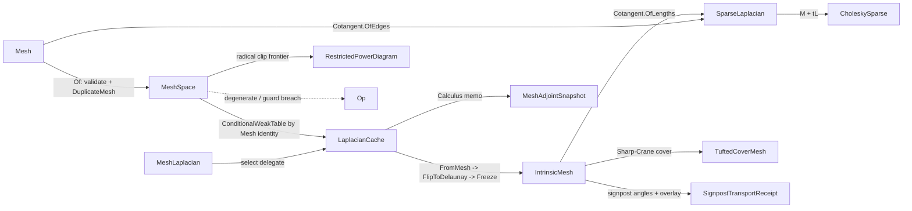

# [RASM_SUBSTRATE_MESH]

`Rasm.Meshing.mesh` owns the mesh substrate every DDG consumer composes: the validated `MeshSpace` snapshot, its `LaplacianCache` memoization, the intrinsic triangulation and `MeshLaplacian` assembly, and the topology, transport, and power-diagram witnesses. DEC operator assembly homes at `Meshing/dec`, reconstruction at `Meshing/reconstruct`, and every DDG solver at its owning `Processing/` page.

`MeshSpace`, `MeshAdjointSnapshot`, and `TopologyReceipt` are the public cross-package decode names the Geometry pages, the `Processing/receipts` route, and the `Rasm.Compute` adjoint seam bind.

## [01]-[INDEX]

- [02]-[MESH_SUBSTRATE]: snapshot admission, Laplacian memoization and assembly, the cotangent primitive, and the topology, transport, and power-diagram witnesses.

## [02]-[MESH_SUBSTRATE]

- Owner: `MeshSpace` `[BoundaryAdapter]` mints the validated defensive-snapshot handle; `MeshLaplacian` `[SmartEnum<int>]` selects the discretization and routes the owning cache memo; `LaplacianCache` mints the per-snapshot memoization service; `Cotangent` mints the one weight primitive both assembly paths, `Meshing/dec` star-1 construction, Crouzeix-Raviart pairs, and divergence scatter compose; `IntrinsicMesh`/`IntrinsicEdge` mint the mutable-build/frozen-read triangulation internal to the assembly; `MeshKernel` mints the substrate assembly kernel; `TuftedCoverMesh` mints the Sharp-Crane double cover; `RestrictedPowerDiagram`/`PowerCell`/`PowerFacet` mint the Laguerre diagram restricted to the mesh surface.
- Cases: `MeshLaplacian` rows `Cotangent`/`IntrinsicDelaunay`/`TuftedIntrinsic` carry the quality gate, triangulation law, cache memo, and kind-consistent intrinsic snapshot as row data, so no call site branches on row equality; `SignpostEncoding`, `SignpostGauge`, and `PowerDensityPolicy` carry their encoding, gauge, and fan-quadrature geometry the same way.
- Entry: `MeshSpace.Of` admits once (null gate, `Mesh.IsValid` gate, defensive `DuplicateMesh` snapshot) and fixes the assembly policy for the snapshot lifetime, so the ceiling and flip budget stay reachable knobs without per-call aliasing; `MeshSpace.Laplacian` is the one Laplacian entry, the kind row's delegate routing the cache memo and the cotangent row's quality-gate column routing the aspect-ratio guard while intrinsic kinds mollify; `MeshAdjointSnapshot.Of` projects the cached `DiscreteCalculus` for the adjoint seam; `MeshKernel.TopologyDetailed` is the total topology diagnostic; `MeshKernel.RestrictedPowerCells` is the power-diagram entry. One selector row owns each discretization, no per-kind assembly sibling.
- Auto: `LaplacianCache.For` resolves the per-snapshot cache; each memo swaps its `Atom<HashMap>` only on `Fin.Succ`, so a transient failure re-computes. Downstream solver artifacts ride the one type-keyed `Memoized` slot materialized from the `(TKey, T)` pair, so the substrate names no downstream type. Intrinsic assembly runs `FromMesh` → `FlipToDelaunay` → `Freeze` with the FLIP-N integer normal-coordinate update keeping the kernel integral and the parity invariant exact; the tufted path builds the double cover, applies global Sharp-Crane mollification, flips to Delaunay, and admits only under the structural guards. Every degenerate-area floor is scale-derived from `DegenerateAreaFloorOf`, one owner.
- Receipt: `SparseLaplacian` carries the stiffness/mass/witness bundle under dimension-agreement claims; `TuftedLaplacianReceipt` witnesses the full cover construction with the cover-law conjunction as a claim row; `TopologyReceipt` is the total un-gated topology witness — every field is evidence and a new witness is one field — carrying the validated-genus derivation and its typed `(Euler, Genus, BoundaryComponents)` projection row; `SignpostTransportReceipt`, `CommonSubdivision`, and `RestrictedPowerReceipt` witness transport, overlay partition-of-unity, and radical-clip degeneracy. Every gated receipt is one `ValidityClaim.All` fold over the rails claim rows declaring which claims hold, never re-deriving a predicate inline; `TopologyReceipt` alone stays gate-free.
- Packages: RhinoCommon is a genuine Rhino boundary here per the Tier-0 capture law, never thinned; `Numerics/matrix` owns sparse assembly and the Cholesky factor, `Numerics/spectral` the `DiscreteCalculus` carrier, `Numerics/atoms` the projection and magnitude value objects, `Spatial/neighbors` the one k-NN substrate the power-incident seed rides rather than a private RTree; `Domain/rails` owns `Op` and the `ValidityClaim` fold, `Domain/context` the `Context`; Thinktecture.Runtime.Extensions, LanguageExt.Core, and BCL concurrency complete the floor.
- Growth: a fourth Laplacian discretization is one `MeshLaplacian` row, one cache memo, and one assembly member, every call site untouched; a new memoized solver artifact is zero cache edits — the owning page mints its key record and calls `Memoized`; a new signpost gauge, power-density model, or topology witness is one row or one field. Zero new public surface.
- Boundary: cache identity keys on the snapshot `Mesh` reference and memoizes success only — a keyed dictionary leaks across snapshot lifetimes and re-keys on value equality, so the `ConditionalWeakTable` is the load-bearing contract. `Cotangent` arithmetic lives in one owner; a consumer re-deriving `(a·b)/(2A)` or the law-of-cosines form inline re-opens the collapsed duplication. `IntrinsicMesh` stays `internal` and the cross-package surface is `MeshAdjointSnapshot` carrying the public `DiscreteCalculus`, so no consumer mutates a frozen snapshot mid-cache. Aspect-ratio guard and intrinsic mollification are policy rows on `MeshAssemblyPolicy`/`TuftedCoverPolicy`, and `MeshAssemblyPolicy` travels on `MeshSpace.Of` one value per snapshot, so per-run variation means a fresh snapshot rather than a per-call knob aliasing the Unit-keyed memos. Two solver families sharing one `(key-record, artifact)` pair alias one `Memoized` slot, so every family declares its own key record beside its kernel. `PowerFacet.OffsetI` stays `None` at construction — the BNOT driver recomputes the weighted offset from live dual weights each outer iteration, and `A_ij == A_ji` holds because the FIFO incident-pair frontier pushes both cell views. Euclidean k-NN seeds the power-incident set through `Spatial/neighbors`, so non-trivial weights can under-clip the k-th neighbour; `KNearest` is a policy row and `IncidentPairCount`/`IntegrationResidual`/`QueuePeakDepth` make any under-clip observable. A degenerate mesh routes an `Op` fault over `Fin<T>`, never a throw.

```csharp signature
// --- [RUNTIME_PRELUDE] ----------------------------------------------------------------------
using System;
using System.Collections.Concurrent;
using System.Collections.Generic;
using System.Linq;
using System.Runtime.CompilerServices;
using System.Runtime.InteropServices;
using LanguageExt;
using Rasm.Domain;
using Rasm.Numerics;
using Rasm.Spatial;
using Rhino;
using Rhino.Geometry;
using Thinktecture;
using static LanguageExt.Prelude;
// CS0104 guard: Rhino.Geometry declares Matrix/Dimension homonyms under the dual usings.
using Dimension = Rasm.Numerics.Dimension;

namespace Rasm.Meshing;

// --- [TYPES] --------------------------------------------------------------------------------
// Discretization differences are ROW DATA — no call site branches on row equality.
[SmartEnum<int>]
public sealed partial class MeshLaplacian {
    public static readonly MeshLaplacian Cotangent = new(key: 0, requiresQualityGate: true, preservesInputTriangulation: true,
        select: static (cache, key) => cache.Cotangent(key),
        snapshot: static (cache, key) => cache.EnsureFrozenIntrinsic(kind: MeshLaplacian.Cotangent, key: key));
    public static readonly MeshLaplacian IntrinsicDelaunay = new(key: 1, requiresQualityGate: false, preservesInputTriangulation: false,
        select: static (cache, key) => cache.IntrinsicDelaunay(key),
        snapshot: static (cache, key) => cache.IntrinsicMeshSnapshot(key: key));
    public static readonly MeshLaplacian TuftedIntrinsic = new(key: 2, requiresQualityGate: false, preservesInputTriangulation: false,
        select: static (cache, key) => cache.TuftedIntrinsic(key),
        snapshot: static (cache, key) => cache.TuftedIntrinsicMeshSnapshot(key: key));
    internal bool RequiresQualityGate { get; }
    internal bool PreservesInputTriangulation { get; }
    [UseDelegateFromConstructor] internal partial Fin<SparseLaplacian> Select(LaplacianCache cache, Op key);
    [UseDelegateFromConstructor] internal partial Fin<MeshKernel.IntrinsicMesh> Snapshot(LaplacianCache cache, Op key);
}

[SmartEnum<int>]
public sealed partial class SignpostEncoding {
    public static readonly SignpostEncoding Signposts         = new(key: 0);
    public static readonly SignpostEncoding NormalCoordinates = new(key: 1);
    public static readonly SignpostEncoding Both              = new(key: 2);
}

[SmartEnum<int>]
public sealed partial class SignpostGauge {
    public static readonly SignpostGauge FirstHalfedge        = new(key: 0);
    public static readonly SignpostGauge LowestVertexNeighbor = new(key: 1);
}

[SmartEnum<int>]
public sealed partial class PowerDensityPolicy {
    public static readonly PowerDensityPolicy Constant            = new(key: 0, requiresField: false, quadratureNodes: 0, nodeFraction: 0.0);
    public static readonly PowerDensityPolicy ScalarFanQuadrature = new(key: 1, requiresField: true, quadratureNodes: 3, nodeFraction: 0.25);
    internal bool RequiresField { get; }
    internal int QuadratureNodes { get; }
    internal double NodeFraction { get; }
}

// --- [CONSTANTS] ----------------------------------------------------------------------------
// Policy rows, not consts; FIXED per snapshot at MeshSpace.Of — per-call variation aliases the Unit-keyed snapshot memos.
public readonly record struct MeshAssemblyPolicy(PositiveMagnitude AspectRatioCeiling, Dimension FlipCapPerEdge) {
    public static readonly MeshAssemblyPolicy Default = new(
        AspectRatioCeiling: PositiveMagnitude.Create(value: 11.5), FlipCapPerEdge: Dimension.Create(value: 16));
}

[BoundaryAdapter, StructLayout(LayoutKind.Auto)]
public readonly record struct TuftedCoverPolicy(
    PositiveMagnitude MollifyFactor, bool MollifyEnabled, PositiveMagnitude DelaunayTolerance,
    Dimension MaxFlipsPerEdge, UnitInterval EnergyScaleFactor, bool LaplacianReplace, bool MassReplace) {
    public static readonly TuftedCoverPolicy Default = new(
        MollifyFactor: PositiveMagnitude.Create(value: 1.0e-5), MollifyEnabled: true,
        DelaunayTolerance: PositiveMagnitude.Create(value: RhinoMath.SqrtEpsilon),
        MaxFlipsPerEdge: Dimension.Create(value: 16), EnergyScaleFactor: UnitInterval.Create(value: 0.5),
        LaplacianReplace: true, MassReplace: true);
    public static Fin<TuftedCoverPolicy> Of(double mollifyFactor, bool mollifyEnabled, double delaunayTolerance,
        int maxFlipsPerEdge, double energyScaleFactor, bool laplacianReplace, bool massReplace, Op? key = null);
}

[BoundaryAdapter, StructLayout(LayoutKind.Auto)]
public readonly record struct SignpostPolicy(
    SignpostEncoding Encoding, UnitInterval LawOfCosinesClamp, PositiveMagnitude DegenerateAreaFloor,
    Option<Dimension> TraceMaxIters, PositiveMagnitude VertexAngleRescaleFloor, SignpostGauge ReferenceDirectionGauge,
    bool CommonSubdivisionTriangulate) {
    public static readonly SignpostPolicy Default = new(
        Encoding: SignpostEncoding.Both, LawOfCosinesClamp: UnitInterval.Create(value: 1.0),
        DegenerateAreaFloor: PositiveMagnitude.Create(value: RhinoMath.SqrtEpsilon), TraceMaxIters: Option<Dimension>.None,
        VertexAngleRescaleFloor: PositiveMagnitude.Create(value: RhinoMath.SqrtEpsilon),
        ReferenceDirectionGauge: SignpostGauge.FirstHalfedge, CommonSubdivisionTriangulate: true);
    // None = edge-derived cap; the record carries no zero-sentinel. Of maps a nonpositive boundary arg to None.
    internal int TraceCapFor(int edgeCount) => TraceMaxIters.Map(static cap => cap.Value).IfNone(noneValue: Math.Max(1, edgeCount) * 16);
    public static Fin<SignpostPolicy> Of(SignpostEncoding encoding, double lawOfCosinesClamp, double degenerateAreaFloor,
        int traceMaxIters, double vertexAngleRescaleFloor, SignpostGauge referenceDirectionGauge,
        bool commonSubdivisionTriangulate, Op? key = null);
}

// Every clip threshold is scale-derived from the mesh bbox diagonal / mean edge, admitted once per run.
internal readonly record struct PowerClipPolicy(
    double ClipBand, double DenomFloor, double AreaFloor, double EdgeBand,
    int KNearest, int MinPolygonVertices, PowerDensityPolicy Density) {
    internal static Fin<PowerClipPolicy> Of(double diagonal, double meanEdge, PowerDensityPolicy density, Op key);
}

// --- [MODELS] -------------------------------------------------------------------------------
[BoundaryAdapter, StructLayout(LayoutKind.Auto)]
public readonly record struct MeshSpace {
    private MeshSpace(Mesh native, Context tolerance, MeshAssemblyPolicy assembly) { Native = native; Tolerance = tolerance; Assembly = assembly; }
    public static Fin<MeshSpace> Of(Mesh native, Context context, MeshAssemblyPolicy? assembly = null, Op? key = null) {
        Op op = key.OrDefault();
        return from active in Optional(native).ToFin(op.InvalidInput())
               from ctx in Optional(context).ToFin(op.MissingContext())
               from _ in guard(active.IsValid, op.InvalidInput())
               let snapshot = active.DuplicateMesh()
               select new MeshSpace(native: snapshot, tolerance: ctx, assembly: assembly ?? MeshAssemblyPolicy.Default);
    }
    public Context Tolerance { get; }
    public MeshAssemblyPolicy Assembly { get; }
    internal Mesh Native { get; }
    internal LaplacianCache Cache => LaplacianCache.For(space: this);
    public Mesh DuplicateNative() => Native.DuplicateMesh();
    public Fin<SparseLaplacian> Laplacian(MeshLaplacian kind, Op? key = null) =>
        MeshKernel.LaplacianOf(space: this, kind: kind, key: key.OrDefault());
}

[BoundaryAdapter, StructLayout(LayoutKind.Auto)]
public readonly record struct SparseLaplacian(
    SparseMatrix Stiffness, SparseMatrix MassConsistent, Arr<double> MassLumped,
    int SkippedDegenerateFaces = 0, Option<TuftedLaplacianReceipt> Tufted = default, int NegativeCotangentCount = 0) : IValidityEvidence {
    public bool IsValid => ValidityClaim.All(
        ValidityClaim.CountExactly(count: Stiffness.Rows.Value, expected: Stiffness.Cols.Value),
        ValidityClaim.CountExactly(count: MassConsistent.Rows.Value, expected: Stiffness.Rows.Value),
        ValidityClaim.CountExactly(count: MassConsistent.Cols.Value, expected: Stiffness.Cols.Value),
        ValidityClaim.CountExactly(count: MassLumped.Count, expected: Stiffness.Rows.Value),
        ValidityClaim.CountAtLeast(count: SkippedDegenerateFaces, floor: 0),
        ValidityClaim.CountAtLeast(count: NegativeCotangentCount, floor: 0),
        ValidityClaim.Of(Tufted.Map(static receipt => receipt.IsValid).IfNone(noneValue: true)));
}

// Cover-construction witness: measure/count claims plus the cover-law conjunction as a claim row.
[BoundaryAdapter, StructLayout(LayoutKind.Auto)]
public readonly record struct TuftedLaplacianReceipt(
    MeshLaplacian Kind, int OriginalVertices, int OriginalFaces, int IntrinsicVertices, int IntrinsicEdges,
    int IntrinsicFaces, int CoverFaces, int CoverEdges, int BoundaryEdges, int NonManifoldEdges,
    bool GluingMapIsBijection, int GluingSymmetryViolations, bool CoverIsEdgeManifold, bool CoverIsClosed,
    double MollificationEpsilon, int DegenerateTriangleCount, double LengthScaleH, double MinTriangleInequalitySlack,
    int IntrinsicFlips, int NonDelaunayEdgesRemaining, bool MaxFlipsHit, double MinCotanEdgeWeight,
    double MinBoundaryEdgeWeight, int NegativeWeightCount, double MinLumpedMass, double TotalCoveredArea,
    double EnergyScaleApplied, double SymmetryResidual, double RowSumResidual, int DroppedNonTriangleFaces,
    bool CoverAware, bool CollapsedToOriginalVertices) : IValidityEvidence {
    public bool IsValid => ValidityClaim.All(
        ValidityClaim.CountAtLeast(count: OriginalFaces, floor: IntrinsicFaces + DroppedNonTriangleFaces),
        ValidityClaim.Nonnegative(MollificationEpsilon), ValidityClaim.Positive(LengthScaleH),
        ValidityClaim.CountAtLeast(count: DegenerateTriangleCount, floor: 0), ValidityClaim.CountAtLeast(count: IntrinsicFlips, floor: 0),
        ValidityClaim.Finite(SymmetryResidual), ValidityClaim.Finite(RowSumResidual), ValidityClaim.Nonnegative(TotalCoveredArea),
        ValidityClaim.Positive(EnergyScaleApplied),
        ValidityClaim.Of(!CoverAware || (CoverFaces == 2 * IntrinsicFaces && GluingMapIsBijection && GluingSymmetryViolations == 0
            && CoverIsEdgeManifold && CoverIsClosed && NonDelaunayEdgesRemaining == 0 && !MaxFlipsHit
            && SymmetryResidual <= RhinoMath.SqrtEpsilon && RowSumResidual <= RhinoMath.SqrtEpsilon && MinLumpedMass > 0.0
            && MinCotanEdgeWeight >= -RhinoMath.SqrtEpsilon && MinBoundaryEdgeWeight >= -RhinoMath.SqrtEpsilon)),
        ValidityClaim.Of(!CollapsedToOriginalVertices || IntrinsicVertices == OriginalVertices));
}

// Build intermediate for the tufted snapshot only — never a cross-page surface.
[StructLayout(LayoutKind.Auto)]
internal readonly record struct TuftedBaseFaces(Mesh Triangulated, int TriangleCount, int DroppedNonTriangleFaces) : IValidityEvidence {
    public bool IsValid => ValidityClaim.All(
        ValidityClaim.Of(Triangulated is { IsValid: true }),
        ValidityClaim.CountAtLeast(count: TriangleCount, floor: 1),
        ValidityClaim.CountAtLeast(count: DroppedNonTriangleFaces, floor: 0));
    internal static Fin<TuftedBaseFaces> Of(Mesh source, Op key);   // quad-convert once; any residual non-triangle fails
}

[BoundaryAdapter, StructLayout(LayoutKind.Auto)]
public readonly record struct TopologyReceipt(
    int Vertices, int TopologyVertices, int TopologyEdges, int Faces, int Triangles, int Quads, int Ngons,
    int VisiblePolygons, int BoundaryComponents, int NonManifoldEdges, bool HasBoundary, bool IsClosed, bool IsSolid,
    bool IsWatertight, bool IsManifold, bool IsOriented, int EulerCharacteristic, Option<int> Genus, bool EulerValidated) {
    internal Fin<TOut> Project<TOut>(Op key) {
        TopologyReceipt self = this;
        return AtomProjection.Rows<TopologyReceipt, TOut>(self: self, key: key,
            ProjectionRow.Of<(int Euler, int Genus, int BoundaryComponents)>(() => self.Genus.Match(
                Some: genus => Fin.Succ((self.EulerCharacteristic, genus, self.BoundaryComponents)),
                None: () => Fin.Fail<(int Euler, int Genus, int BoundaryComponents)>(key.InvalidResult()))),
            // Genus-tolerant total row: un-gated over non-manifold/boundaried/odd-Euler meshes; Genus stays Option, no sentinel.
            ProjectionRow.Of<(int Euler, int BoundaryComponents, bool IsManifold, bool IsOriented, int NonManifoldEdges, Option<int> Genus)>(() =>
                Fin.Succ((self.EulerCharacteristic, self.BoundaryComponents, self.IsManifold, self.IsOriented, self.NonManifoldEdges, self.Genus))));
    }
}

// PUBLIC cross-package adjoint handle — Rasm.Compute GeometryTape carries THIS, never the internal IntrinsicMesh.
public sealed record MeshAdjointSnapshot(DiscreteCalculus Calculus, int VertexCount, int EdgeCount, int FaceCount) {
    public static Fin<MeshAdjointSnapshot> Of(MeshSpace space, Op? key = null) =>
        space.Cache.Calculus(key: key.OrDefault())
            .Map(dec => new MeshAdjointSnapshot(Calculus: dec,
                VertexCount: dec.D0.Cols.Value, EdgeCount: dec.D0.Rows.Value, FaceCount: dec.D1.Rows.Value));
}

[StructLayout(LayoutKind.Auto)]
public readonly record struct SignpostTransportReceipt(
    int VertexCount, int IntrinsicEdgeCount, int TransportedEdgeCount, int IntrinsicFlipCount, int ChordFallbackEdges,
    int MissingFrameEdges, int CommonSubdivisionSegments, int TracedPathEdgeCount, int NormalCoordinateParityErrors,
    int SumNormalCoordinates, bool IntrinsicSnapshot, bool ExactCommonSubdivision, double MaxAngleRadians,
    double MaxLengthResidual, double MaxSignpostUpdateResidual, Option<CommonSubdivision> Subdivision = default) : IValidityEvidence {
    public bool IsValid => ValidityClaim.All(
        ValidityClaim.CountAtLeast(count: IntrinsicEdgeCount, floor: TransportedEdgeCount + MissingFrameEdges),
        ValidityClaim.CountAtLeast(count: TransportedEdgeCount, floor: ChordFallbackEdges),
        ValidityClaim.CountExactly(count: CommonSubdivisionSegments, expected: SumNormalCoordinates),
        ValidityClaim.Of(!ExactCommonSubdivision || NormalCoordinateParityErrors == 0),
        ValidityClaim.Finite(MaxAngleRadians), ValidityClaim.Finite(MaxLengthResidual), ValidityClaim.Finite(MaxSignpostUpdateResidual),
        ValidityClaim.Of(Subdivision.Map(static sub => sub.IsValid).IfNone(noneValue: true)),
        ValidityClaim.Of(IntrinsicSnapshot));
}

// Partition-of-unity gate: every interpolation row sums to 1.0 within SqrtEpsilon (identity rows exactly, crossing rows
// (1-u)+u); the arrival residual is the BVP trace's relative gap, +inf when a transverse edge failed its crossings.
[StructLayout(LayoutKind.Auto)]
public readonly record struct CommonSubdivision(
    int SubdivisionVertexCount, int SubdivisionFaceCount, Arr<int> SourceFaceA, Arr<int> SourceFaceB,
    SparseMatrix InterpolationA, SparseMatrix InterpolationB,
    double RowSumResidualA, double RowSumResidualB, double EdgeLengthInterpolationResidual) : IValidityEvidence {
    public bool IsValid => ValidityClaim.All(
        ValidityClaim.CountExactly(count: InterpolationA.Rows.Value, expected: SubdivisionVertexCount),
        ValidityClaim.CountExactly(count: InterpolationB.Rows.Value, expected: SubdivisionVertexCount),
        ValidityClaim.CountExactly(count: InterpolationA.Cols.Value, expected: InterpolationB.Cols.Value),
        ValidityClaim.CountExactly(count: SourceFaceA.Count, expected: SubdivisionFaceCount),
        ValidityClaim.CountExactly(count: SourceFaceB.Count, expected: SubdivisionFaceCount),
        ValidityClaim.Of(RowSumResidualA <= RhinoMath.SqrtEpsilon),
        ValidityClaim.Of(RowSumResidualB <= RhinoMath.SqrtEpsilon),
        ValidityClaim.Finite(EdgeLengthInterpolationResidual));
}

// OffsetI stays None at construction — the BNOT driver recomputes from live dual weights; a populated midpoint would be trusted stale.
[BoundaryAdapter, StructLayout(LayoutKind.Auto)]
public readonly record struct PowerFacet(int SiteI, int SiteJ, double Length, Option<double> OffsetI, Point3d Centroid) : IValidityEvidence {
    public bool IsValid => ValidityClaim.All(
        ValidityClaim.Of(SiteI != SiteJ), ValidityClaim.Nonnegative(Length), ValidityClaim.Finite(Centroid));
}

[BoundaryAdapter, StructLayout(LayoutKind.Auto)]
public readonly record struct PowerCell(
    int Site, int FragmentCount, double Area, double Mass, Point3d Barycenter, double TransportCost, bool Empty) : IValidityEvidence {
    public bool IsValid => ValidityClaim.All(
        ValidityClaim.Of(Empty == (Mass <= 0.0)), ValidityClaim.Of(Empty || Barycenter.IsValid),
        ValidityClaim.CountAtLeast(count: FragmentCount, floor: 0), ValidityClaim.Nonnegative(Area), ValidityClaim.Finite(TransportCost));
}

// DegenerateClipCount = fragments below MinPolygonVertices/AreaFloor; ClipDegeneracyCount = radical-clip numerical degeneracies — distinct, never collapsed.
[BoundaryAdapter, StructLayout(LayoutKind.Auto)]
public readonly record struct RestrictedPowerReceipt(
    int SiteCount, int ClippedTriangleCount, int FragmentCount, int IncidentPairCount, int QueuePeakDepth,
    double FragmentAreaMin, double FragmentAreaMax, double TotalArea, double SurfaceArea, double IntegrationResidual,
    int FirstMomentFiniteCount, int NeighborFacetCount, int EmptyCellCount, int BoundarySiteCount,
    int DegenerateClipCount, int ClipDegeneracyCount, int NonFiniteDensityRejectionCount,
    double AreaTolerance, double LengthTolerance, int KNearest, PowerDensityPolicy Density) : IValidityEvidence {
    public bool IsValid => ValidityClaim.All(
        ValidityClaim.CountAtLeast(count: SiteCount, floor: 1), ValidityClaim.CountAtLeast(count: KNearest, floor: 1),
        ValidityClaim.Ordered(lower: FragmentAreaMin, upper: FragmentAreaMax),
        ValidityClaim.CountAtLeast(count: FragmentCount, floor: FirstMomentFiniteCount),
        ValidityClaim.CountAtLeast(count: SiteCount, floor: EmptyCellCount), ValidityClaim.CountAtLeast(count: SiteCount, floor: BoundarySiteCount),
        ValidityClaim.CountAtLeast(count: DegenerateClipCount, floor: 0), ValidityClaim.CountAtLeast(count: ClipDegeneracyCount, floor: 0),
        ValidityClaim.CountAtLeast(count: NonFiniteDensityRejectionCount, floor: 0),
        ValidityClaim.Nonnegative(TotalArea), ValidityClaim.Nonnegative(SurfaceArea), ValidityClaim.Finite(IntegrationResidual),
        ValidityClaim.Positive(AreaTolerance), ValidityClaim.Positive(LengthTolerance));
}

[BoundaryAdapter, StructLayout(LayoutKind.Auto)]
public readonly record struct RestrictedPowerDiagram(Arr<PowerCell> Cells, Arr<PowerFacet> Facets, RestrictedPowerReceipt Receipt) : IValidityEvidence {
    public bool IsValid => ValidityClaim.All(
        ValidityClaim.CountExactly(count: Cells.Count, expected: Receipt.SiteCount),
        ValidityClaim.CountExactly(count: Cells.Filter(static cell => cell.Empty).Count, expected: Receipt.EmptyCellCount),
        ValidityClaim.CountExactly(count: Facets.Count, expected: Receipt.NeighborFacetCount),
        ValidityClaim.Evidence(Receipt));
    internal Fin<TOut> Project<TOut>(Op key) {
        RestrictedPowerDiagram self = this;
        return AtomProjection.Rows<RestrictedPowerDiagram, TOut>(self: self, key: key,
            ProjectionRow.Of<Arr<PowerCell>>(() => Fin.Succ(self.Cells)),
            ProjectionRow.Of<Arr<PowerFacet>>(() => Fin.Succ(self.Facets)),
            ProjectionRow.Of<RestrictedPowerReceipt>(() => Fin.Succ(self.Receipt)),
            ProjectionRow.Of<Seq<Point3d>>(() => Fin.Succ(toSeq(
                self.Cells.AsIterable().Filter(static cell => !cell.Empty).Map(static cell => cell.Barycenter)))));
    }
}

// --- [SERVICES] -----------------------------------------------------------------------------
// Cache dies with its snapshot via ConditionalWeakTable GC; the CSparse factor Lock lives on CholeskySparse, never here.
internal sealed class LaplacianCache {
    internal const int DefaultSpectralCount = 32;
    private static readonly ConditionalWeakTable<object, LaplacianCache> Table = [];
    private sealed class Memo<TKey, T> {
        private readonly Atom<HashMap<TKey, T>> cache = Atom(value: HashMap<TKey, T>());
        internal Fin<T> Of(TKey probe, Func<Fin<T>> compute) =>
            cache.Value.Find(key: probe).Map(static value => Fin.Succ(value)).IfNone(() =>
                compute().Match(
                    Succ: value => { _ = cache.Swap(f: map => map.AddOrUpdate(key: probe, value: value)); return Fin.Succ(value); },
                    Fail: Fin.Fail<T>));
        internal bool Contains(TKey probe) => cache.Value.ContainsKey(key: probe);
    }
    private readonly Memo<Unit, SparseLaplacian> cotangent = new(), intrinsicDelaunay = new();
    private readonly Memo<TuftedCoverPolicy, SparseLaplacian> tuftedIntrinsic = new();
    private readonly Memo<Unit, CholeskySparse> cholesky = new();
    private readonly Memo<Unit, SpectralBasisBundle> defaultSpectral = new();
    private readonly Memo<Unit, DiscreteCalculus> calculus = new();
    private readonly Memo<Unit, MeshKernel.IntrinsicMesh> intrinsicMesh = new(), tuftedIntrinsicMesh = new();
    private readonly Memo<MeshLaplacian, MeshKernel.IntrinsicMesh> frozenIntrinsic = new();
    private readonly Memo<(int Symmetry, double Time), CholeskySparse> connectionCholesky = new();
    private readonly Memo<double, CholeskySparse> scalarHeatCholesky = new();
    private readonly Memo<double, EdgeConnectionFactor> edgeConnectionCholesky = new();
    // ONE open slot for every downstream solver artifact — materializes from the (TKey, T) pair, so a new family is ZERO cache edits.
    // Key records and carriers stay beside their owning kernels; the cache names no Processing-tier type.
    private readonly ConcurrentDictionary<(Type Key, Type Value), object> solverSlots = new();
    private readonly Lazy<double> meanEdgeLength;
    private readonly MeshSpace space;
    private LaplacianCache(MeshSpace space) {
        this.space = space;
        meanEdgeLength = new Lazy<double>(valueFactory: () => MeshKernel.MeanEdgeLengthOf(mesh: space.Native));
    }
    internal static LaplacianCache For(MeshSpace space) =>
        Table.GetValue(key: space.Native, createValueCallback: _ => new LaplacianCache(space: space));
    internal double MeanEdgeLength => meanEdgeLength.Value;
    // (mean edge)^2 * SqrtEpsilon gated at ZeroTolerance; travels on the owning receipt.
    internal double SpdMassShift =>
        Math.Max(MeanEdgeLength, RhinoMath.ZeroTolerance) * Math.Max(MeanEdgeLength, RhinoMath.ZeroTolerance) * RhinoMath.SqrtEpsilon;
    internal Fin<SparseLaplacian> Cotangent(Op key) =>
        cotangent.Of(probe: unit, compute: () => MeshKernel.AssembleCotangent(mesh: space.Native, key: key));
    internal Fin<SparseLaplacian> IntrinsicDelaunay(Op key) =>
        intrinsicDelaunay.Of(probe: unit, compute: () =>
            from imesh in IntrinsicMeshSnapshot(key: key)
            from laplacian in MeshKernel.AssembleCotangentFromIntrinsic(imesh: imesh, key: key)
            select laplacian);
    internal Fin<SparseLaplacian> TuftedIntrinsic(Op key) => TuftedIntrinsic(policy: TuftedCoverPolicy.Default, key: key);
    internal Fin<SparseLaplacian> TuftedIntrinsic(TuftedCoverPolicy policy, Op key) =>
        tuftedIntrinsic.Of(probe: policy, compute: () =>
            from imesh in TuftedIntrinsicMeshSnapshot(key: key)
            from laplacian in MeshKernel.AssembleTuftedCotangentFromIntrinsic(imesh: imesh, policy: policy, key: key)
            select laplacian);
    internal Fin<CholeskySparse> Cholesky(Op key) =>
        cholesky.Of(probe: unit, compute: () =>
            from laplacian in IntrinsicDelaunay(key: key)
            from spd in MeshKernel.AssembleMassStiffnessSystem(laplacian: laplacian, massScale: SpdMassShift, stiffnessScale: 1.0, key: key)
            from factor in CholeskySparse.Of(symmetric: spd, key: key)
            select factor);
    internal Fin<DiscreteCalculus> Calculus(Op key) =>
        calculus.Of(probe: unit, compute: () => DecAssembly.Build(space: space, key: key));
    internal Fin<MeshKernel.IntrinsicMesh> IntrinsicMeshSnapshot(Op key) =>
        intrinsicMesh.Of(probe: unit, compute: () => MeshKernel.BuildIntrinsicMesh(mesh: space.Native, assembly: space.Assembly, key: key));
    internal Fin<MeshKernel.IntrinsicMesh> TuftedIntrinsicMeshSnapshot(Op key) =>
        tuftedIntrinsicMesh.Of(probe: unit, compute: () =>
            from baseFaces in TuftedBaseFaces.Of(source: space.Native, key: key)
            from imesh in MeshKernel.BuildIntrinsicMesh(mesh: baseFaces.Triangulated, assembly: space.Assembly, key: key)
            select imesh);
    internal Fin<MeshKernel.IntrinsicMesh> EnsureFrozenIntrinsic(MeshLaplacian kind, Op key) =>
        frozenIntrinsic.Of(probe: kind, compute: () => MeshKernel.FrozenIntrinsicFor(mesh: space.Native, kind: kind, assembly: space.Assembly, key: key));
    internal Fin<SpectralBasisBundle> SpectralBasisBundleOf(int k, Op key);      // <=32 truncates the shared memo; larger recomputes
    // edgeAdjustment.IsSome BYPASSES the memo — an adjusted connection factor cached under (symmetry, time) would alias
    // across different cone prescriptions; only the unadjusted factor memoizes.
    internal Fin<CholeskySparse> ConnectionCholesky(int symmetry, double time, Option<Arr<double>> edgeAdjustment, Op key);
    internal Fin<CholeskySparse> ScalarHeatCholesky(double time, Op key);
    internal Fin<EdgeConnectionFactor> EdgeConnectionCholeskyDetailed(double time, Op key);
    // One distinct key-record type per solver family — two sharing a (TKey, T) pair alias one slot.
    internal Fin<T> Memoized<TKey, T>(TKey probe, Func<Fin<T>> compute) where TKey : notnull =>
        ((Memo<TKey, T>)solverSlots.GetOrAdd(key: (typeof(TKey), typeof(T)), valueFactory: static _ => new Memo<TKey, T>()))
            .Of(probe: probe, compute: compute);
}

// --- [OPERATIONS] ---------------------------------------------------------------------------
// Intrinsic path: law of cosines over 4A. Extrinsic path: dot over 2A. Corner angle shared.
internal static class Cotangent {
    internal static double OfLengths(double adjacent1, double adjacent2, double opposite, double area) =>
        ((adjacent1 * adjacent1) + (adjacent2 * adjacent2) - (opposite * opposite)) / (4.0 * area);
    internal static double OfEdges(Vector3d u, Vector3d v, double twoArea) => u * v / twoArea;
    internal static double AngleOfLengths(double opposite, double adjacent1, double adjacent2) {
        double denom = 2.0 * adjacent1 * adjacent2;
        double cos = denom > RhinoMath.ZeroTolerance
            ? ((adjacent1 * adjacent1) + (adjacent2 * adjacent2) - (opposite * opposite)) / denom : 1.0;
        return Math.Acos(d: Math.Clamp(value: cos, min: -1.0, max: 1.0));
    }
}

internal static class MeshKernel {
    // Per-face triplet accumulator: symmetric stiffness stencil, consistent + lumped mass, skip/negative witnesses.
    private sealed class LaplacianTriplets {
        internal LaplacianTriplets(int vertexCount);
        internal int SkippedDegenerateFaces;
        internal int NegativeCotangentCount;
        internal void AddTriangle(int va, int vb, int vc, double area, double cotA, double cotB, double cotC);
        internal Fin<SparseLaplacian> Build(Op key);                 // SparseMatrix.FromTriplets x2 + lumped Arr
    }

    // --- [SELECTION_SPD]
    internal static Fin<SparseLaplacian> LaplacianOf(MeshSpace space, MeshLaplacian kind, Op key) =>
        from active in Optional(kind).ToFin(key.InvalidInput())
        from _ in active.RequiresQualityGate
            ? AspectRatioGuard(mesh: space.Native, ceiling: space.Assembly.AspectRatioCeiling.Value, key: key)
            : Fin.Succ(unit)
        from result in active.Select(cache: space.Cache, key: key)
        select result;
    internal static Fin<SparseMatrix> AssembleMassStiffnessSystem(SparseLaplacian laplacian, double stiffnessScale, Op key, double massScale = 1.0) {
        int n = laplacian.Stiffness.Rows.Value;
        if (n == 0) return Fin.Fail<SparseMatrix>(key.InvalidInput());
        List<(int Row, int Col, double Value)> triplets = MatrixKernel.SparseTripletsOf(matrix: laplacian.Stiffness, capacityBonus: n, scale: stiffnessScale);
        for (int i = 0; i < n; i++) triplets.Add(item: (i, i, massScale * laplacian.MassLumped[index: i]));
        Dimension dim = Dimension.Create(value: n);
        return SparseMatrix.FromTriplets(rows: dim, cols: dim, triplets: triplets, key: key);
    }
    internal static Fin<Unit> AspectRatioGuard(Mesh mesh, double ceiling, Op key);   // Caution fault above the policy row

    // --- [COTANGENT_ASSEMBLY] — extrinsic path over face geometry; one scale-derived degenerate floor.
    // Quad faces split through the exact Kernels.QuadDiagonal gate; Faces.ConvertQuadsToTriangles is the rejected float heuristic.
    internal static Fin<SparseLaplacian> AssembleCotangent(Mesh mesh, Op key) {
        using Mesh active = mesh.DuplicateMesh();
        for (int f = 0; f < active.Faces.Count; f++) {
            MeshFace quad = active.Faces[index: f];
            if (!quad.IsQuad) continue;
            (Point3d qa, Point3d qb, Point3d qc, Point3d qd) = (active.Vertices[index: quad.A], active.Vertices[index: quad.B], active.Vertices[index: quad.C], active.Vertices[index: quad.D]);
            bool ac = Kernels.QuadDiagonal(a: qa, b: qb, c: qc, d: qd);
            if (!active.Faces.SetFace(index: f, vertex1: quad.A, vertex2: quad.B, vertex3: ac ? quad.C : quad.D)) return Fin.Fail<SparseLaplacian>(key.InvalidResult());
            if (active.Faces.AddFace(vertex1: ac ? quad.A : quad.B, vertex2: quad.C, vertex3: quad.D) < 0) return Fin.Fail<SparseLaplacian>(key.InvalidResult());
        }
        LaplacianTriplets triplets = new(vertexCount: active.Vertices.Count);
        double floor = DegenerateAreaFloorOf(scale: MeanEdgeLengthOf(mesh: active));
        for (int f = 0; f < active.Faces.Count; f++) {
            MeshFace face = active.Faces[index: f];
            if (!face.IsTriangle) continue;
            Point3d pa = active.Vertices[index: face.A]; Point3d pb = active.Vertices[index: face.B]; Point3d pc = active.Vertices[index: face.C];
            Vector3d ab = pb - pa; Vector3d ac = pc - pa; Vector3d bc = pc - pb;
            double area = 0.5 * Vector3d.CrossProduct(a: ab, b: ac).Length;
            if (area < floor) { triplets.SkippedDegenerateFaces++; continue; }
            double twoArea = 2.0 * area;
            double cotA = Cotangent.OfEdges(u: -ab, v: -ac, twoArea: twoArea);
            double cotB = Cotangent.OfEdges(u: ab, v: -bc, twoArea: twoArea);
            double cotC = Cotangent.OfEdges(u: ac, v: bc, twoArea: twoArea);
            triplets.NegativeCotangentCount += (cotA < 0.0 ? 1 : 0) + (cotB < 0.0 ? 1 : 0) + (cotC < 0.0 ? 1 : 0);
            triplets.AddTriangle(va: face.A, vb: face.B, vc: face.C, area: area, cotA: cotA, cotB: cotB, cotC: cotC);
        }
        return triplets.Build(key: key);
    }
    // Intrinsic path over frozen edge lengths: Heron area, Cotangent.OfLengths per corner, same accumulator.
    internal static Fin<SparseLaplacian> AssembleCotangentFromIntrinsic(IntrinsicMesh imesh, Op key);
    internal static Fin<SparseLaplacian> AssembleTuftedCotangentFromIntrinsic(IntrinsicMesh imesh, TuftedCoverPolicy policy, Op key) =>
        TuftedCoverMesh.Construct(imesh: imesh, policy: policy, key: key).Bind(cover => cover.Assemble(policy: policy, key: key));

    // --- [IDT_AND_INTRINSIC]
    internal static Fin<IntrinsicMesh> BuildIntrinsicMesh(Mesh mesh, MeshAssemblyPolicy assembly, Op key) =>
        from source in IntrinsicMesh.FromMesh(mesh: mesh, key: key)
        from flipped in FlipToDelaunay(imesh: source, assembly: assembly, key: key)
        select flipped.Freeze();
    // PreservesInputTriangulation column: cotangent keeps the input triangulation; Delaunay/tufted kinds run the IDT flip.
    internal static Fin<IntrinsicMesh> FrozenIntrinsicFor(Mesh mesh, MeshLaplacian kind, MeshAssemblyPolicy assembly, Op key) =>
        kind.PreservesInputTriangulation
            ? IntrinsicMesh.FromMesh(mesh: mesh, key: key).Map(static source => source.Freeze())
            : BuildIntrinsicMesh(mesh: mesh, assembly: assembly, key: key);
    // Deterministic edge queue, assembly.FlipCapPerEdge budget, IsDelaunay cos-sum gate; total re-check proves the invariant.
    private static Fin<IntrinsicMesh> FlipToDelaunay(IntrinsicMesh imesh, MeshAssemblyPolicy assembly, Op key);

    [StructLayout(LayoutKind.Auto)]
    internal readonly record struct IntrinsicEdge(int Lo, int Hi, double Length, int Face0, int Face1, int NormalCoord = -1) {
        internal bool IsInterior => Face1 >= 0;
        internal bool IsOriginalEdge => NormalCoord < 0;
        internal int Crossings => Math.Max(val1: NormalCoord, val2: 0);
    }

    // Mutable during FromMesh/Flip, frozen for every reader. INTERNAL — the public handle is MeshAdjointSnapshot.
    internal sealed class IntrinsicMesh {
        internal int VertexCount;
        internal Point3d[] Positions;
        internal readonly List<(int A, int B, int C)?> Triangles;
        internal readonly Dictionary<(int Lo, int Hi), (double Length, List<int> FaceIdx, int Normal)> EdgeData;
        internal bool HasFlips;
        internal int OriginalFaceCount;
        internal int DroppedNonTriangleFaces;
        internal int FlipCount;
        internal int ParityErrorCount;
        internal int BoundaryEdgeCount;
        internal int NonManifoldEdgeCount;
        internal bool IsFrozen { get; }
        internal int EdgeCount { get; }
        internal int LiveFaceCount { get; }
        internal int SumNormalCoordinates { get; }
        internal int TransverseEdgeCount { get; }
        internal static Fin<IntrinsicMesh> FromMesh(Mesh mesh, Op key);
        internal int AddTriangle(int a, int b, int c, double lAB, double lBC, double lAC, int normalAB = -1, int normalBC = -1, int normalCA = -1);
        internal IntrinsicMesh Freeze();
        internal IntrinsicEdge EdgeAt(int index);
        internal int IndexOfEdge(int lo, int hi);
        internal int[] EdgesOfFace(int faceIdx);
        internal double AreaOfFace(int faceIdx);
        internal int FirstIncidentEdge(int vertexIdx);
        internal IEnumerable<int> LiveFaceIndices();
        internal int OppositeVertex(int faceIdx, int i, int j);
        internal int FaceAcrossEdge(int faceIdx, int i, int j);
        internal bool IsInterior(int i, int j);
        internal bool IsInteriorVertex(int vertex);
        internal double EdgeLengthOf(int i, int j);
        internal int NormalCoordOf(int i, int j);
        internal bool IsDelaunay(int i, int j);              // cos-sum >= -SqrtEpsilon via Cotangent.AngleOfLengths terms
        internal Seq<(int, int)> Flip(int i, int j);         // intrinsic diagonal replace + FlipNormalCoordinate update
        // --- [NORMAL_COORDINATES] (FLIP-N) — Gillespie-Sharp-Crane integer update for the new diagonal kl.
        // Reference edges carry n=-1; corner coordinates DOUBLED keep the kernel integral; (quadrupled & 3 == 2) flags an orientation defect into ParityErrorCount.
        private int FlipNormalCoordinate(int nij, int njk, int nki, int nil, int nlj);
    }

    // Sharp-Crane tufted double cover: front sheet 2t, orientation-reversed back sheet 2t+1, per-base-edge fans glued into
    // one cyclic chain (boundary edges front-to-back) so the cover is closed and edge-manifold; GLOBAL mollification adds one
    // epsilon = max corner triangle-inequality deficit to every cover edge. Admission requires the structural-guard conjunction the receipt witnesses.
    internal sealed class TuftedCoverMesh {
        internal static Fin<TuftedCoverMesh> Construct(IntrinsicMesh imesh, TuftedCoverPolicy policy, Op key);
        internal Fin<SparseLaplacian> Assemble(TuftedCoverPolicy policy, Op key);
    }

    // --- [METRICS]
    internal static double MeanEdgeLengthOf(Mesh mesh);
    // ONE scale-relative degenerate floor: max(scale, ZeroTolerance)^2 * SqrtEpsilon — the same form SpdMassShift uses.
    internal static double DegenerateAreaFloorOf(double scale) =>
        Math.Max(scale, RhinoMath.ZeroTolerance) * Math.Max(scale, RhinoMath.ZeroTolerance) * RhinoMath.SqrtEpsilon;
    // Total diagnostic; validated genus only when manifold+oriented and the Euler numerator is even>=0.
    internal static Fin<TopologyReceipt> TopologyDetailed(MeshSpace space) {
        Mesh mesh = space.Native;
        bool manifold = mesh.IsManifold(topologicalTest: true, isOriented: out bool oriented, hasBoundary: out bool hasBoundary);
        int euler = mesh.TopologyVertices.Count - mesh.TopologyEdges.Count + mesh.Faces.Count;
        (int boundaryComponents, int nonManifoldEdges) = TopologyEdgeStatsOf(mesh: mesh);
        bool closed = mesh.IsClosed; bool solid = mesh.IsSolid;
        bool watertight = closed && solid && manifold && nonManifoldEdges == 0;
        int components = Math.Max(val1: 1, val2: mesh.DisjointMeshCount);
        int numerator = (2 * components) - boundaryComponents - euler;
        bool hasGenus = manifold && oriented && numerator >= 0 && numerator % 2 == 0;
        return Fin.Succ(new TopologyReceipt(
            Vertices: mesh.Vertices.Count, TopologyVertices: mesh.TopologyVertices.Count, TopologyEdges: mesh.TopologyEdges.Count,
            Faces: mesh.Faces.Count, Triangles: mesh.Faces.TriangleCount, Quads: mesh.Faces.QuadCount, Ngons: mesh.Ngons.Count,
            VisiblePolygons: mesh.GetNgonAndFacesCount(), BoundaryComponents: boundaryComponents, NonManifoldEdges: nonManifoldEdges,
            HasBoundary: hasBoundary || boundaryComponents > 0, IsClosed: closed, IsSolid: solid, IsWatertight: watertight,
            IsManifold: manifold, IsOriented: oriented, EulerCharacteristic: euler,
            Genus: hasGenus ? Some(numerator / 2) : Option<int>.None, EulerValidated: hasGenus));
    }
    private static (int BoundaryComponents, int NonManifoldEdges) TopologyEdgeStatsOf(Mesh mesh);   // GetNakedEdges + >2-face edges

    // --- [SIGNPOST_TRANSPORT] — per-vertex gauge halfedge angles from intrinsic corners, one-ring rescaled to 2pi (interior) / pi (boundary).
    // Fans ordered face-to-face via FaceAcrossEdge survive flips; a non-closing fan routes the witnessed chord fallback, never a partial rescale.
    internal static Fin<SignpostTransportReceipt> SignpostTransportReceiptOf(MeshSpace space, IntrinsicMesh imesh, Op key, Option<SignpostPolicy> policy = default);
    // Transport-row seam: (i<j, weight, rho) per intrinsic edge, cone-adjusted — the same rows the cached connection Cholesky assembles from.
    [StructLayout(LayoutKind.Auto)] internal readonly record struct ConnectionEntries(Seq<(int I, int J, double Weight, double Rho)> Rows, SignpostTransportReceipt Receipt);
    internal static Fin<ConnectionEntries> ConnectionEntriesOf(MeshSpace space, IntrinsicMesh imesh, Option<Arr<double>> edgeAdjustment, SignpostPolicy policy, Op key);

    // --- [COMMON_SUBDIVISION] — overlay(M,T): shared vertices + one crossing vertex per normal-coordinate unit; each transverse
    // T-edge traced by GeodesicKernel.WalkChart under GeodesicWalkMode.EdgeOverlay recovers its ordered M-edge crossings.
    // InterpolationA scatters M-barycentric rows ((1-u), u), InterpolationB T-barycentric rows at t_k=(k+1)/(c+1); the arrival
    // residual is the trace's relative gap (+inf on failed recovery), so a wrong overlay fails IsValid, never silently.
    private static CommonSubdivision BuildCommonSubdivision(MeshSpace space, IntrinsicMesh imesh, Op key);

    // --- [POWER_CELLS] — Sutherland-Hodgman radical clip, FIFO incident-pair frontier, shoelace area/first-moment accumulation.
    // Origin-shifted weighted sites: power(x)=|x-p'|^2-w with x,p' both bbox-centre shifted so only weight DIFFERENCES survive the
    // radical constant, killing binary cancellation. Keep g<=band against the affine radical
    // g_ij(x) = 2(p_j'-p_i')·x - (|p_j'|^2 - w_j - |p_i'|^2 + w_i) evaluated at lifted 3D polygon vertices.
    internal static Fin<RestrictedPowerDiagram> RestrictedPowerCells(MeshSpace space, Seq<Point3d> sites, Option<Arr<double>> weights, Option<ScalarField> density, Op key) {
        BoundingBox box = space.Native.GetBoundingBox(accurate: true);
        return !box.IsValid || box.Diagonal.Length <= RhinoMath.ZeroTolerance || sites.Count < 1
            ? Fin.Fail<RestrictedPowerDiagram>(key.InvalidInput())
            : from weightsActive in AdmitPowerWeights(sites: sites, weights: weights, key: key)
              from policy in PowerClipPolicy.Of(diagonal: box.Diagonal.Length, meanEdge: MeanEdgeLengthOf(mesh: space.Native),
                  density: density.IsSome ? PowerDensityPolicy.ScalarFanQuadrature : PowerDensityPolicy.Constant, key: key)
              from diagram in PowerDiagramRun(space: space, sites: sites, weights: weightsActive, density: density, center: box.Center, policy: policy, key: key)
              select diagram;
    }
    private static Fin<Arr<double>> AdmitPowerWeights(Seq<Point3d> sites, Option<Arr<double>> weights, Op key);
    private static Fin<RestrictedPowerDiagram> PowerDiagramRun(MeshSpace space, Seq<Point3d> sites, Arr<double> weights, Option<ScalarField> density, Point3d center, PowerClipPolicy policy, Op key);
    private static int[][] PowerSiteNeighbours(Point3d[] sites, int kNearest);       // NeighborIndex.Of + NeighborQuery nearest/pairs over the site set, self removed
    private static int[] NearestSitePerFace(Mesh triangulated, PowerSite[] powerSites, Vector3d shift);
    private static bool[] BoundaryFacesOf(Mesh mesh);                                // naked-edge incident faces
}
```



## [03]-[DENSITY_BAR]

Each `[RAIL]` cell names the one return rail; the per-axis kind rides the indexed notes below.

| [INDEX] | [AXIS_CONCERN]      | [OWNER]                               | [RAIL]                                               | [CASES] |
| :-----: | :------------------ | :------------------------------------ | :--------------------------------------------------- | :-----: |
|  [01]   | Mesh handle         | `MeshSpace`                           | `MeshSpace.Of → Fin<MeshSpace>`                      |    1    |
|  [02]   | Laplacian selection | `MeshLaplacian`                       | `Select → Fin<SparseLaplacian>`                      |    3    |
|  [03]   | Memoization         | `LaplacianCache`                      | `Memo.Of → Fin<T>`                                   | 12+slot |
|  [04]   | Cotangent primitive | `Cotangent`                           | pure                                                 |    2    |
|  [05]   | Intrinsic snapshot  | `IntrinsicMesh`/`IntrinsicEdge`       | `BuildIntrinsicMesh → Fin<IntrinsicMesh>`            |    —    |
|  [06]   | Adjoint handle      | `MeshAdjointSnapshot`                 | `Of → Fin<MeshAdjointSnapshot>`                      |    1    |
|  [07]   | Substrate assembly  | `MeshKernel`                          | `Fin` rails per member                               |    —    |
|  [08]   | Tangent transport   | `SignpostPolicy` + transport receipts | `SignpostTransportReceiptOf → Fin<...>`              |    —    |
|  [09]   | Power diagram       | `RestrictedPowerDiagram`              | `RestrictedPowerCells → Fin<RestrictedPowerDiagram>` |    —    |

- [01]-[MESH_HANDLE]: `[BoundaryAdapter]` validated defensive snapshot.
- [02]-[LAPLACIAN_SELECTION]: `[SmartEnum<int>]`, gate/triangulation columns + `Select`/`Snapshot` delegates.
- [03]-[MEMOIZATION]: `ConditionalWeakTable` service, `Atom<HashMap>` success-only memos + the type-keyed `Memoized` solver slot.
- [04]-[COTANGENT_PRIMITIVE]: one static owner, intrinsic + extrinsic arithmetic paths.
- [05]-[INTRINSIC_SNAPSHOT]: mutable-build / frozen-read triangulation + FLIP-N coordinates.
- [06]-[ADJOINT_HANDLE]: public record over the cached `DiscreteCalculus`.
- [07]-[SUBSTRATE_ASSEMBLY]: internal kernel — cotangent/IDT/tufted/SPD/topology.
- [08]-[TANGENT_TRANSPORT]: policy + gauge-angle kernel + overlay.
- [09]-[POWER_DIAGRAM]: receipt-carrying Laguerre diagram, scale-derived clip policy.

## [04]-[RESEARCH]

<!-- source-only: research row template:
[TOKEN]-[OPEN|BLOCKED]: <exact question>; <verification route>.
[SPLIT_MEMBER]-[OPEN]: does `shape-core` expose `split_all`; verify against the member rail.
-->

- [INTRINSIC_DELAUNAY]-[OPEN]: which transcription-complete `FlipToDelaunay`/`Flip` bodies restore the intrinsic Delaunay property under the deterministic queue and `FlipCapPerEdge` budget while preserving the FLIP-N integer normal-coordinate update and its parity invariant; verify the terminal re-check and `CommonSubdivisionSegments == SumNormalCoordinates` against the `SignpostTransportReceipt` gates.
- [TUFTED_COVER]-[OPEN]: which transcription-complete `TuftedCoverMesh.Construct`/`Assemble` body builds the Sharp-Crane closed edge-manifold double cover with global mollification and admits only under the structural guards; verify bijection, edge-manifold, closure, zero non-Delaunay remainder, and the symmetry/row-sum residual bounds against `TuftedLaplacianReceipt`.
- [SIGNPOST_OVERLAY]-[OPEN]: which transcription-complete signpost-transport and `BuildCommonSubdivision` bodies rescale each one-ring to `2π`/`π`, order fans by `FaceAcrossEdge`, and place one crossing vertex per normal-coordinate unit; verify the partition-of-unity rows and the arrival residual against `CommonSubdivision.IsValid`.
- [RESTRICTED_POWER]-[OPEN]: which transcription-complete `RestrictedPowerCells` body clips each triangle against the affine radical half-planes, floods the FIFO incident-pair frontier, and integrates density by the fan quadrature; verify `A_ij == A_ji` and Euclidean-k-NN under-clip observability against `RestrictedPowerReceipt`.
