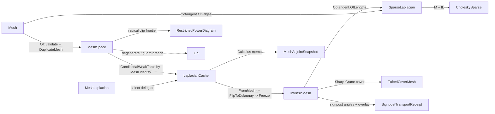

# [RASM_SUBSTRATE_MESH]

The mesh substrate owner: the validated `MeshSpace` snapshot handle every mesh-consuming page composes, the `LaplacianCache` memoization service the entire DDG suite rides, the frozen `IntrinsicMesh` triangulation with Gillespie-Sharp-Crane normal-coordinate flips, THE one `Cotangent` primitive (intrinsic edge-length and extrinsic face-geometry arithmetic under one owner — the three parallel cotangent computations formerly scattered across cotangent assembly, DEC star construction, and divergence scatter are dead), the cotangent/intrinsic-Delaunay/tufted-intrinsic Laplacian assembly behind the `MeshLaplacian` selector, the `(M + tL)` SPD system assembly, the `MeshKernel.TopologyDetailed` diagnostics producing the `TopologyReceipt` the public `VectorIntent.Topology` projection re-emits, the signpost tangent transport with the common-subdivision overlay (partition-of-unity gated), and the `RestrictedPowerDiagram` Laguerre cells restricted to the mesh (Sutherland-Hodgman radical clip) whose sole consumer is the `Processing/sample` BNOT driver — the coupling preserved by decision. This page is the substrate ONLY: the DEC operator assembly lives in `Meshing/dec`, the reconstruction and signed-heat spine in `Meshing/reconstruct`, and every DDG solver (heat geodesics, MCF, cross fields, vector heat, log maps, stripes, descriptors, segmentation, remesh) in its owning `Processing/` page — the one-file-owns-thirty-concerns shape is dead.

`MeshSpace`, `LaplacianCache`, `IntrinsicMesh`, `MeshAdjointSnapshot`, `MeshKernel.TopologyDetailed`, and `TopologyReceipt` are frozen names — twelve settled Geometry pages, the `Processing/receipts` route, and the `Rasm.Compute` adjoint seam bind them. `LaplacianCache` identity, GC, and concurrency semantics survive VERBATIM: `ConditionalWeakTable` keyed by `Mesh` reference identity (a cache dies with its snapshot, never leaks across duplicates), `Atom<HashMap>` success-only memos (a failed compute is never cached), `Lock`-guarded CSparse factor solves owned by `Numerics/matrix` `CholeskySparse`, and the `SpdMassShift` mesh-scale Tikhonov shift (mean edge length floored at `RhinoMath.ZeroTolerance`, squared, scaled by `RhinoMath.SqrtEpsilon` — never a bare literal). Receipt validity is ONE `ValidityClaim.All` fold per receipt over the `Domain/rails` claim vocabulary — a receipt declares WHICH claims hold (cover closure, partition of unity, crossing conservation, count and measure claims), never HOW a predicate computes; the hand-rolled private `&&`-chain litanies are dead. `Op` stays the explicit value key on every kernel signature per the one threading law. Failures route `Op` fault factories over `Fin<T>`; this owner computes no hash and mints no second identity.

## [01]-[INDEX]

- [02]-[MESH_SUBSTRATE]: `MeshSpace` handle; `LaplacianCache` service; `Cotangent` primitive; `IntrinsicMesh`/`IntrinsicEdge` frozen triangulation + FLIP-N normal coordinates; `MeshLaplacian` selector over cotangent/IDT/tufted assembly; `(M + tL)` SPD assembly; `TopologyReceipt`; `MeshAdjointSnapshot`; signpost transport + common subdivision; `RestrictedPowerDiagram`.

## [02]-[MESH_SUBSTRATE]

- Owner: `MeshSpace` `[BoundaryAdapter]` the validated defensive-snapshot mesh handle (`Of` duplicates the native mesh once; interior code never re-validates); `MeshLaplacian` `[SmartEnum<int>]` the discretization selector whose constructor delegate routes to the owning cache memo (`Cotangent`/`IntrinsicDelaunay`/`TuftedIntrinsic`); `LaplacianCache` the per-snapshot memoization service; `Cotangent` THE one cotangent-weight primitive with the intrinsic (`OfLengths`, law-of-cosines over edge lengths) and extrinsic (`OfEdges`, dot-over-doubled-area) arithmetic paths plus the shared `AngleOfLengths` corner recovery — `Meshing/dec` star-1 construction, Crouzeix-Raviart pairs, divergence scatter, and both assembly paths below all compose it; `IntrinsicMesh`/`IntrinsicEdge` the mutable-build/frozen-read intrinsic triangulation (`internal` to the assembly; the PUBLIC cross-package handle is `MeshAdjointSnapshot`); `MeshKernel` the substrate assembly kernel (cotangent/IDT/tufted assembly, SPD system, topology, signpost transport, common subdivision, restricted power cells — nothing else); `TuftedCoverMesh` the Sharp-Crane closed edge-manifold double cover; `RestrictedPowerDiagram`/`PowerCell`/`PowerFacet` the Laguerre diagram restricted to the mesh surface.
- Cases: `MeshLaplacian` rows `Cotangent` · `IntrinsicDelaunay` · `TuftedIntrinsic` (3, `RequiresQualityGate`/`PreservesInputTriangulation` columns + `Select`/`Snapshot` delegates — the quality gate, the triangulation law, the cache memo, and the kind-consistent intrinsic snapshot are ALL row data; no call site branches on row equality); `SignpostEncoding` rows `Signposts` · `NormalCoordinates` · `Both` (3); `SignpostGauge` rows `FirstHalfedge` · `LowestVertexNeighbor` (2); `PowerDensityPolicy` rows `Constant` · `ScalarFanQuadrature` (2, `RequiresField`/`QuadratureNodes`/`NodeFraction` columns — the fan-quadrature geometry is row data, never a stray const).
- Entry: `public static Fin<MeshSpace> Of(Mesh native, Context context, MeshAssemblyPolicy? assembly = null, Op? key = null)` admits once (null gate, `Mesh.IsValid` gate, defensive `DuplicateMesh` snapshot) and FIXES the assembly policy for the snapshot's lifetime — one policy per snapshot keeps the Unit-keyed snapshot memos coherent, so the ceiling and flip budget are reachable knobs without per-call aliasing; `public Fin<SparseLaplacian> Laplacian(MeshLaplacian kind, Op? key = null)` is the ONE Laplacian entry — the kind row's `Select` delegate routes the cache memo, and the cotangent row's `RequiresQualityGate` column routes the `space.Assembly.AspectRatioCeiling` guard (intrinsic kinds mollify instead of gating); `MeshAdjointSnapshot.Of(MeshSpace space, Op? key = null)` is the public adjoint-seam entry projecting the cached `DiscreteCalculus`; `MeshKernel.TopologyDetailed(MeshSpace space)` is the total topology diagnostic (never fails — every field is a witness); `MeshKernel.RestrictedPowerCells(MeshSpace space, Seq<Point3d> sites, Option<Arr<double>> weights, Option<ScalarField> density, Op key)` is the power-diagram entry. No `AssembleCotangent`/`AssembleIdt`/`AssembleTufted` public siblings — one selector row per discretization.
- Auto: `LaplacianCache.For(space)` resolves the per-snapshot cache through the `ConditionalWeakTable` keyed by the snapshot's `Mesh` reference — two `MeshSpace` values over one snapshot share one cache, a re-snapshot mints a fresh one, and the table entry dies with the mesh (GC semantics preserved verbatim). Every memo is success-only: `Memo<K,T>` holds `Atom<HashMap<K,T>>` and swaps the map only on `Fin.Succ`, so a transient failure re-computes instead of pinning a poisoned entry. Downstream solver artifacts ride the ONE type-keyed `Memoized<TKey,T>` slot — the slot materializes from the `(TKey, T)` type pair on first use, the caller supplies key record and compute, and the substrate names no downstream type. `SpdMassShift` derives the Tikhonov mass scale from `MeanEdgeLength` squared gated at `RhinoMath.ZeroTolerance`, travels on the owning receipt (`SignedHeatReceipt.SpdMassShift` in `Meshing/reconstruct`) so every regularized solve is replayable. Intrinsic assembly runs `FromMesh` (quads triangulated once, non-triangles counted) → `FlipToDelaunay` (deterministically ordered edge queue, the snapshot's `Assembly.FlipCapPerEdge` budget, `IsDelaunay` cos-sum gate at `-RhinoMath.SqrtEpsilon`) → `Freeze` (edge pruning, ordered edge index, Heron face areas, first-incident-edge table); the FLIP-N integer normal-coordinate update runs inside `Flip` with doubled corner coordinates keeping the kernel integral and the parity invariant (`quadrupled & 3 == 2` flags an orientation defect) exact. The tufted path constructs the double cover (front sheet `2t`, orientation-reversed back sheet `2t+1`, fan-glued so every cover edge is incident to exactly two cover faces and boundary edges glue front-to-back), applies GLOBAL Sharp-Crane mollification (one epsilon = max corner deficit added to every cover edge), flips the cover to Delaunay, and admits only when the structural guards hold (gluing bijection, edge-manifold, closed, zero non-Delaunay remainder, flip budget unexhausted). Degenerate-area floors are scale-derived everywhere: `DegenerateAreaFloorOf(scale) = max(scale, ZeroTolerance)² · SqrtEpsilon` — one owner, no scattered literals.
- Receipt: `SparseLaplacian` (stiffness + consistent mass + lumped mass + skip/negative-cotangent witnesses + optional tufted receipt) — dimension-agreement claims; `TuftedLaplacianReceipt` the full cover-construction witness (mollification epsilon, length scale, flip counts, gluing/symmetry/row-sum residuals) with the cover-law conjunction as a claim row; `TopologyReceipt` the 19-field TOTAL topology witness — never gated, every field is evidence — with the validated-genus derivation (`genus = (2·components − boundary − χ)/2` only when manifold ∧ oriented ∧ even ∧ nonnegative) and a typed `(Euler, Genus, BoundaryComponents)` projection row; `SignpostTransportReceipt` (transported/fallback/missing edge counts, flip count, normal-coordinate parity, max angle/length/update residuals, optional `CommonSubdivision`) with the conservation claim `CommonSubdivisionSegments == SumNormalCoordinates`; `CommonSubdivision` (overlay counts, per-side source-face maps, interpolation matrices, row-sum + arrival residuals) with the partition-of-unity claims (`RowSumResidual ≤ SqrtEpsilon` per side) and the `Finite` arrival-residual claim; `RestrictedPowerReceipt` (site/fragment/incident-pair/queue-peak counts, area extrema, integration residual, degeneracy witnesses, scale-derived tolerances) inside `RestrictedPowerDiagram` whose law checks cell/facet/receipt agreement. Every gated receipt is one `ValidityClaim.All` fold over the rails claim rows — finiteness/count predicates are claims, never per-receipt re-derivations; `TopologyReceipt` alone stays gate-free as the total witness.
- Packages: RhinoCommon (`Mesh`, `MeshFace`, `Point3d`/`Vector3d`, `RhinoMath` — this page is genuinely Rhino-boundary per the Tier-0 capture law, never thinned), `Rasm.Numerics` `Numerics/matrix` (`SparseMatrix.FromTriplets`, `CholeskySparse`, `Dimension`), `Numerics/spectral` (`DiscreteCalculus` carrier for the adjoint handle), `Numerics/atoms` (`AtomProjection.Rows`/`ProjectionRow`, `PositiveMagnitude`/`UnitInterval`/`Dimension`), `Spatial/neighbors` (`NeighborIndex.Of` + the `NeighborQuery` nearest/pairs probes — the power-incident k-NN seed rides the ONE neighborhood substrate, never a private RTree wrapper), `Domain/rails` (`Op`, `IValidityEvidence`, the `ValidityClaim` fold), `Domain/context` (`Context`), Thinktecture.Runtime.Extensions, LanguageExt.Core (`Fin`, `Atom`, `HashMap`, `Seq`, `Arr`, `Option`), BCL (`ConditionalWeakTable`, `ConcurrentDictionary`, `CollectionsMarshal`, `Lazy`).
- Growth: a fourth Laplacian discretization is one `MeshLaplacian` row (its column values, `Select`/`Snapshot` delegates) + one cache memo + one assembly member with every call site untouched — never a sibling selector; a new memoized solver artifact is ZERO cache edits — the owning page mints its key record and calls `Memoized`; a new signpost gauge is one `SignpostGauge` row; a power-diagram density model is one `PowerDensityPolicy` row; a new topology witness is one `TopologyReceipt` field (the receipt is the total witness — no gate to extend); zero new public surface.
- Boundary: `LaplacianCache` semantics are the load-bearing correctness contract — replacing the `ConditionalWeakTable` with a keyed dictionary leaks caches across snapshot lifetimes and re-keys on value equality (two duplicates would alias), and caching failures poisons every downstream solve: both are the named rebuild defects this page exists to prevent. The cotangent arithmetic lives in ONE `Cotangent` owner — a consumer re-deriving `(a·b)/(2A)` or the law-of-cosines form inline is the collapsed duplication re-opening. `IntrinsicMesh` stays `internal`: the cross-package surface is `MeshAdjointSnapshot` carrying the public `DiscreteCalculus`, and exposing the mutable triangulation would let a consumer mutate a frozen snapshot mid-cache. The cotangent-kind aspect-ratio guard and the intrinsic-kind mollification are policy rows on `MeshAssemblyPolicy`/`TuftedCoverPolicy`, never resurrected constants — and `MeshAssemblyPolicy` travels on `MeshSpace.Of`, one value per snapshot: a per-call assembly knob would alias the Unit-keyed intrinsic/cotangent memos under two flip budgets, so per-run variation means a fresh snapshot, never a cache poke. The `Memoized` anti-aliasing law is load-bearing: two solver families sharing one `(key-record, artifact)` type pair would alias one slot, so every family declares its own key record beside its kernel — re-adding named per-solver accessors here re-opens the downward type dependency this collapse killed. `PowerFacet.OffsetI` stays `Option<double>.None` at construction — the BNOT driver recomputes the weighted offset `d_ij = l_ij/2 + (w_i−w_j)/(2·l_ij)` from live dual weights each outer iteration, so a populated midpoint here would be silently trusted stale data; `A_ij == A_ji` holds because the FIFO incident-pair frontier pushes both cell views of every power facet. Euclidean k-NN seeds the power-incident set through the `Spatial/neighbors` substrate (Euclidean, not power-nearest), so with non-trivial weights the k-th neighbour can under-clip — `KNearest` is a policy row and `IncidentPairCount`/`IntegrationResidual`/`QueuePeakDepth` make any under-clip observable in the receipt, never silent. A thrown exception on a degenerate mesh is forbidden — the defect routes `Op` faults over `Fin<T>`.

```csharp signature
// --- [RUNTIME_PRELUDE] ----------------------------------------------------------------------
using System;
using System.Collections.Concurrent;
using System.Collections.Generic;
using System.Linq;
using System.Runtime.CompilerServices;
using System.Runtime.InteropServices;
using LanguageExt;
using Rasm.Domain;
using Rasm.Numerics;
using Rasm.Spatial;
using Rhino;
using Rhino.Geometry;
using Thinktecture;
using static LanguageExt.Prelude;
// CS0104 guard: Rhino.Geometry declares Matrix/Dimension homonyms under the dual usings.
using Dimension = Rasm.Numerics.Dimension;

namespace Rasm.Meshing;

// --- [TYPES] --------------------------------------------------------------------------------
// Discretization differences are ROW DATA: the quality-gate flag, the triangulation law, the cache memo,
// and the kind-consistent intrinsic snapshot all live on the row — no call site branches on row equality.
[SmartEnum<int>]
public sealed partial class MeshLaplacian {
    public static readonly MeshLaplacian Cotangent = new(key: 0, requiresQualityGate: true, preservesInputTriangulation: true,
        select: static (cache, key) => cache.Cotangent(key),
        snapshot: static (cache, key) => cache.EnsureFrozenIntrinsic(kind: MeshLaplacian.Cotangent, key: key));
    public static readonly MeshLaplacian IntrinsicDelaunay = new(key: 1, requiresQualityGate: false, preservesInputTriangulation: false,
        select: static (cache, key) => cache.IntrinsicDelaunay(key),
        snapshot: static (cache, key) => cache.IntrinsicMeshSnapshot(key: key));
    public static readonly MeshLaplacian TuftedIntrinsic = new(key: 2, requiresQualityGate: false, preservesInputTriangulation: false,
        select: static (cache, key) => cache.TuftedIntrinsic(key),
        snapshot: static (cache, key) => cache.TuftedIntrinsicMeshSnapshot(key: key));
    internal bool RequiresQualityGate { get; }
    internal bool PreservesInputTriangulation { get; }
    [UseDelegateFromConstructor] internal partial Fin<SparseLaplacian> Select(LaplacianCache cache, Op key);
    [UseDelegateFromConstructor] internal partial Fin<MeshKernel.IntrinsicMesh> Snapshot(LaplacianCache cache, Op key);
}

[SmartEnum<int>]
public sealed partial class SignpostEncoding {
    public static readonly SignpostEncoding Signposts         = new(key: 0);
    public static readonly SignpostEncoding NormalCoordinates = new(key: 1);
    public static readonly SignpostEncoding Both              = new(key: 2);
}

[SmartEnum<int>]
public sealed partial class SignpostGauge {
    public static readonly SignpostGauge FirstHalfedge        = new(key: 0);
    public static readonly SignpostGauge LowestVertexNeighbor = new(key: 1);
}

[SmartEnum<int>]
public sealed partial class PowerDensityPolicy {
    public static readonly PowerDensityPolicy Constant            = new(key: 0, requiresField: false, quadratureNodes: 0, nodeFraction: 0.0);
    public static readonly PowerDensityPolicy ScalarFanQuadrature = new(key: 1, requiresField: true, quadratureNodes: 3, nodeFraction: 0.25);
    internal bool RequiresField { get; }
    internal int QuadratureNodes { get; }
    internal double NodeFraction { get; }
}

// --- [CONSTANTS] ----------------------------------------------------------------------------
// Assembly ceilings are policy rows, never consts: the cotangent-kind quality gate and the IDT flip budget.
// The policy is FIXED per snapshot at MeshSpace.Of — per-call variation would alias the Unit-keyed snapshot memos.
public readonly record struct MeshAssemblyPolicy(PositiveMagnitude AspectRatioCeiling, Dimension FlipCapPerEdge) {
    public static readonly MeshAssemblyPolicy Default = new(
        AspectRatioCeiling: PositiveMagnitude.Create(value: 11.5), FlipCapPerEdge: Dimension.Create(value: 16));
}

[BoundaryAdapter, StructLayout(LayoutKind.Auto)]
public readonly record struct TuftedCoverPolicy(
    PositiveMagnitude MollifyFactor, bool MollifyEnabled, PositiveMagnitude DelaunayTolerance,
    Dimension MaxFlipsPerEdge, UnitInterval EnergyScaleFactor, bool LaplacianReplace, bool MassReplace) {
    public static readonly TuftedCoverPolicy Default = new(
        MollifyFactor: PositiveMagnitude.Create(value: 1.0e-5), MollifyEnabled: true,
        DelaunayTolerance: PositiveMagnitude.Create(value: RhinoMath.SqrtEpsilon),
        MaxFlipsPerEdge: Dimension.Create(value: 16), EnergyScaleFactor: UnitInterval.Create(value: 0.5),
        LaplacianReplace: true, MassReplace: true);
    public static Fin<TuftedCoverPolicy> Of(double mollifyFactor, bool mollifyEnabled, double delaunayTolerance,
        int maxFlipsPerEdge, double energyScaleFactor, bool laplacianReplace, bool massReplace, Op? key = null);
}

[BoundaryAdapter, StructLayout(LayoutKind.Auto)]
public readonly record struct SignpostPolicy(
    SignpostEncoding Encoding, UnitInterval LawOfCosinesClamp, PositiveMagnitude DegenerateAreaFloor,
    Option<Dimension> TraceMaxIters, PositiveMagnitude VertexAngleRescaleFloor, SignpostGauge ReferenceDirectionGauge,
    bool CommonSubdivisionTriangulate) {
    public static readonly SignpostPolicy Default = new(
        Encoding: SignpostEncoding.Both, LawOfCosinesClamp: UnitInterval.Create(value: 1.0),
        DegenerateAreaFloor: PositiveMagnitude.Create(value: RhinoMath.SqrtEpsilon), TraceMaxIters: Option<Dimension>.None,
        VertexAngleRescaleFloor: PositiveMagnitude.Create(value: RhinoMath.SqrtEpsilon),
        ReferenceDirectionGauge: SignpostGauge.FirstHalfedge, CommonSubdivisionTriangulate: true);
    // None = edge-derived cap; the record carries no zero-sentinel. Of maps a nonpositive boundary arg to None.
    internal int TraceCapFor(int edgeCount) => TraceMaxIters.Map(static cap => cap.Value).IfNone(noneValue: Math.Max(1, edgeCount) * 16);
    public static Fin<SignpostPolicy> Of(SignpostEncoding encoding, double lawOfCosinesClamp, double degenerateAreaFloor,
        int traceMaxIters, double vertexAngleRescaleFloor, SignpostGauge referenceDirectionGauge,
        bool commonSubdivisionTriangulate, Op? key = null);
}

// Every clip threshold is scale-derived from the mesh bbox diagonal / mean edge, admitted once per run.
internal readonly record struct PowerClipPolicy(
    double ClipBand, double DenomFloor, double AreaFloor, double EdgeBand,
    int KNearest, int MinPolygonVertices, PowerDensityPolicy Density) {
    internal static Fin<PowerClipPolicy> Of(double diagonal, double meanEdge, PowerDensityPolicy density, Op key);
}

// --- [MODELS] -------------------------------------------------------------------------------
[BoundaryAdapter, StructLayout(LayoutKind.Auto)]
public readonly record struct MeshSpace {
    private MeshSpace(Mesh native, Context tolerance, MeshAssemblyPolicy assembly) { Native = native; Tolerance = tolerance; Assembly = assembly; }
    public static Fin<MeshSpace> Of(Mesh native, Context context, MeshAssemblyPolicy? assembly = null, Op? key = null) {
        Op op = key.OrDefault();
        return from active in Optional(native).ToFin(op.InvalidInput())
               from ctx in Optional(context).ToFin(op.MissingContext())
               from _ in guard(active.IsValid, op.InvalidInput())
               let snapshot = active.DuplicateMesh()
               select new MeshSpace(native: snapshot, tolerance: ctx, assembly: assembly ?? MeshAssemblyPolicy.Default);
    }
    public Context Tolerance { get; }
    public MeshAssemblyPolicy Assembly { get; }
    internal Mesh Native { get; }
    internal LaplacianCache Cache => LaplacianCache.For(space: this);
    public Mesh DuplicateNative() => Native.DuplicateMesh();
    public Fin<SparseLaplacian> Laplacian(MeshLaplacian kind, Op? key = null) =>
        MeshKernel.LaplacianOf(space: this, kind: kind, key: key.OrDefault());
}

[BoundaryAdapter, StructLayout(LayoutKind.Auto)]
public readonly record struct SparseLaplacian(
    SparseMatrix Stiffness, SparseMatrix MassConsistent, Arr<double> MassLumped,
    int SkippedDegenerateFaces = 0, Option<TuftedLaplacianReceipt> Tufted = default, int NegativeCotangentCount = 0) : IValidityEvidence {
    public bool IsValid => ValidityClaim.All(
        ValidityClaim.CountExactly(count: Stiffness.Rows.Value, expected: Stiffness.Cols.Value),
        ValidityClaim.CountExactly(count: MassConsistent.Rows.Value, expected: Stiffness.Rows.Value),
        ValidityClaim.CountExactly(count: MassConsistent.Cols.Value, expected: Stiffness.Cols.Value),
        ValidityClaim.CountExactly(count: MassLumped.Count, expected: Stiffness.Rows.Value),
        ValidityClaim.CountAtLeast(count: SkippedDegenerateFaces, floor: 0),
        ValidityClaim.CountAtLeast(count: NegativeCotangentCount, floor: 0),
        ValidityClaim.Of(Tufted.Map(static receipt => receipt.IsValid).IfNone(noneValue: true)));
}

// The tufted-cover construction witness: measure/count claims plus the cover-law conjunction as claim rows.
[BoundaryAdapter, StructLayout(LayoutKind.Auto)]
public readonly record struct TuftedLaplacianReceipt(
    MeshLaplacian Kind, int OriginalVertices, int OriginalFaces, int IntrinsicVertices, int IntrinsicEdges,
    int IntrinsicFaces, int CoverFaces, int CoverEdges, int BoundaryEdges, int NonManifoldEdges,
    bool GluingMapIsBijection, int GluingSymmetryViolations, bool CoverIsEdgeManifold, bool CoverIsClosed,
    double MollificationEpsilon, int DegenerateTriangleCount, double LengthScaleH, double MinTriangleInequalitySlack,
    int IntrinsicFlips, int NonDelaunayEdgesRemaining, bool MaxFlipsHit, double MinCotanEdgeWeight,
    double MinBoundaryEdgeWeight, int NegativeWeightCount, double MinLumpedMass, double TotalCoveredArea,
    double EnergyScaleApplied, double SymmetryResidual, double RowSumResidual, int DroppedNonTriangleFaces,
    bool CoverAware, bool CollapsedToOriginalVertices) : IValidityEvidence {
    public bool IsValid => ValidityClaim.All(
        ValidityClaim.CountAtLeast(count: OriginalFaces, floor: IntrinsicFaces + DroppedNonTriangleFaces),
        ValidityClaim.Nonnegative(MollificationEpsilon), ValidityClaim.Positive(LengthScaleH),
        ValidityClaim.CountAtLeast(count: DegenerateTriangleCount, floor: 0), ValidityClaim.CountAtLeast(count: IntrinsicFlips, floor: 0),
        ValidityClaim.Finite(SymmetryResidual), ValidityClaim.Finite(RowSumResidual), ValidityClaim.Nonnegative(TotalCoveredArea),
        ValidityClaim.Positive(EnergyScaleApplied),
        ValidityClaim.Of(!CoverAware || (CoverFaces == 2 * IntrinsicFaces && GluingMapIsBijection && GluingSymmetryViolations == 0
            && CoverIsEdgeManifold && CoverIsClosed && NonDelaunayEdgesRemaining == 0 && !MaxFlipsHit
            && SymmetryResidual <= RhinoMath.SqrtEpsilon && RowSumResidual <= RhinoMath.SqrtEpsilon && MinLumpedMass > 0.0
            && MinCotanEdgeWeight >= -RhinoMath.SqrtEpsilon && MinBoundaryEdgeWeight >= -RhinoMath.SqrtEpsilon)),
        ValidityClaim.Of(!CollapsedToOriginalVertices || IntrinsicVertices == OriginalVertices));
}

// Build intermediate for the tufted snapshot only — never a cross-page surface.
[StructLayout(LayoutKind.Auto)]
internal readonly record struct TuftedBaseFaces(Mesh Triangulated, int TriangleCount, int DroppedNonTriangleFaces) : IValidityEvidence {
    public bool IsValid => ValidityClaim.All(
        ValidityClaim.Of(Triangulated is { IsValid: true }),
        ValidityClaim.CountAtLeast(count: TriangleCount, floor: 1),
        ValidityClaim.CountAtLeast(count: DroppedNonTriangleFaces, floor: 0));
    internal static Fin<TuftedBaseFaces> Of(Mesh source, Op key);   // quad-convert once; any residual non-triangle fails
}

// FROZEN NAME + SHAPE — settled receipts.md routes it; Analysis/inspect and reconstruct admission compose it.
[BoundaryAdapter, StructLayout(LayoutKind.Auto)]
public readonly record struct TopologyReceipt(
    int Vertices, int TopologyVertices, int TopologyEdges, int Faces, int Triangles, int Quads, int Ngons,
    int VisiblePolygons, int BoundaryComponents, int NonManifoldEdges, bool HasBoundary, bool IsClosed, bool IsSolid,
    bool IsWatertight, bool IsManifold, bool IsOriented, int EulerCharacteristic, Option<int> Genus, bool EulerValidated) {
    internal Fin<TOut> Project<TOut>(Op key) {
        TopologyReceipt self = this;
        return AtomProjection.Rows<TopologyReceipt, TOut>(self: self, key: key,
            ProjectionRow.Of<(int Euler, int Genus, int BoundaryComponents)>(() => self.Genus.Match(
                Some: genus => Fin.Succ((self.EulerCharacteristic, genus, self.BoundaryComponents)),
                None: () => Fin.Fail<(int Euler, int Genus, int BoundaryComponents)>(key.InvalidResult()))),
            // Genus-tolerant total row: un-gated over non-manifold/boundaried/odd-Euler meshes — the heal
            // rail's own input class projects instead of failing; Genus stays Option (absence, no sentinel).
            ProjectionRow.Of<(int Euler, int BoundaryComponents, bool IsManifold, bool IsOriented, int NonManifoldEdges, Option<int> Genus)>(() =>
                Fin.Succ((self.EulerCharacteristic, self.BoundaryComponents, self.IsManifold, self.IsOriented, self.NonManifoldEdges, self.Genus))));
    }
}

// PUBLIC cross-package adjoint handle — Rasm.Compute GeometryTape carries THIS, never the internal IntrinsicMesh.
public sealed record MeshAdjointSnapshot(DiscreteCalculus Calculus, int VertexCount, int EdgeCount, int FaceCount) {
    public static Fin<MeshAdjointSnapshot> Of(MeshSpace space, Op? key = null) =>
        space.Cache.Calculus(key: key.OrDefault())
            .Map(dec => new MeshAdjointSnapshot(Calculus: dec,
                VertexCount: dec.D0.Cols.Value, EdgeCount: dec.D0.Rows.Value, FaceCount: dec.D1.Rows.Value));
}

[StructLayout(LayoutKind.Auto)]
public readonly record struct SignpostTransportReceipt(
    int VertexCount, int IntrinsicEdgeCount, int TransportedEdgeCount, int IntrinsicFlipCount, int ChordFallbackEdges,
    int MissingFrameEdges, int CommonSubdivisionSegments, int TracedPathEdgeCount, int NormalCoordinateParityErrors,
    int SumNormalCoordinates, bool IntrinsicSnapshot, bool ExactCommonSubdivision, double MaxAngleRadians,
    double MaxLengthResidual, double MaxSignpostUpdateResidual, Option<CommonSubdivision> Subdivision = default) : IValidityEvidence {
    public bool IsValid => ValidityClaim.All(
        ValidityClaim.CountAtLeast(count: IntrinsicEdgeCount, floor: TransportedEdgeCount + MissingFrameEdges),
        ValidityClaim.CountAtLeast(count: TransportedEdgeCount, floor: ChordFallbackEdges),
        ValidityClaim.CountExactly(count: CommonSubdivisionSegments, expected: SumNormalCoordinates),
        ValidityClaim.Of(!ExactCommonSubdivision || NormalCoordinateParityErrors == 0),
        ValidityClaim.Finite(MaxAngleRadians), ValidityClaim.Finite(MaxLengthResidual), ValidityClaim.Finite(MaxSignpostUpdateResidual),
        ValidityClaim.Of(Subdivision.Map(static sub => sub.IsValid).IfNone(noneValue: true)),
        ValidityClaim.Of(IntrinsicSnapshot));
}

// Partition-of-unity gate: every interpolation row sums to 1.0 within SqrtEpsilon (identity rows exactly, crossing rows
// (1-u)+u); the arrival residual is the BVP trace's relative gap, +inf when a transverse edge failed its crossings.
[StructLayout(LayoutKind.Auto)]
public readonly record struct CommonSubdivision(
    int SubdivisionVertexCount, int SubdivisionFaceCount, Arr<int> SourceFaceA, Arr<int> SourceFaceB,
    SparseMatrix InterpolationA, SparseMatrix InterpolationB,
    double RowSumResidualA, double RowSumResidualB, double EdgeLengthInterpolationResidual) : IValidityEvidence {
    public bool IsValid => ValidityClaim.All(
        ValidityClaim.CountExactly(count: InterpolationA.Rows.Value, expected: SubdivisionVertexCount),
        ValidityClaim.CountExactly(count: InterpolationB.Rows.Value, expected: SubdivisionVertexCount),
        ValidityClaim.CountExactly(count: InterpolationA.Cols.Value, expected: InterpolationB.Cols.Value),
        ValidityClaim.CountExactly(count: SourceFaceA.Count, expected: SubdivisionFaceCount),
        ValidityClaim.CountExactly(count: SourceFaceB.Count, expected: SubdivisionFaceCount),
        ValidityClaim.Of(RowSumResidualA <= RhinoMath.SqrtEpsilon),
        ValidityClaim.Of(RowSumResidualB <= RhinoMath.SqrtEpsilon),
        ValidityClaim.Finite(EdgeLengthInterpolationResidual));
}

// Laguerre power diagram restricted to the mesh. OffsetI stays None at construction — the BNOT driver recomputes the
// weighted offset from live dual weights each outer iteration; a populated midpoint here would be trusted stale.
[BoundaryAdapter, StructLayout(LayoutKind.Auto)]
public readonly record struct PowerFacet(int SiteI, int SiteJ, double Length, Option<double> OffsetI, Point3d Centroid) : IValidityEvidence {
    public bool IsValid => ValidityClaim.All(
        ValidityClaim.Of(SiteI != SiteJ), ValidityClaim.Nonnegative(Length), ValidityClaim.Finite(Centroid));
}

[BoundaryAdapter, StructLayout(LayoutKind.Auto)]
public readonly record struct PowerCell(
    int Site, int FragmentCount, double Area, double Mass, Point3d Barycenter, double TransportCost, bool Empty) : IValidityEvidence {
    public bool IsValid => ValidityClaim.All(
        ValidityClaim.Of(Empty == (Mass <= 0.0)), ValidityClaim.Of(Empty || Barycenter.IsValid),
        ValidityClaim.CountAtLeast(count: FragmentCount, floor: 0), ValidityClaim.Nonnegative(Area), ValidityClaim.Finite(TransportCost));
}

// DegenerateClipCount = fragments discarded below MinPolygonVertices/AreaFloor; ClipDegeneracyCount = numerical
// degeneracies inside the radical clip itself — distinct mature counters, never twins to collapse.
[BoundaryAdapter, StructLayout(LayoutKind.Auto)]
public readonly record struct RestrictedPowerReceipt(
    int SiteCount, int ClippedTriangleCount, int FragmentCount, int IncidentPairCount, int QueuePeakDepth,
    double FragmentAreaMin, double FragmentAreaMax, double TotalArea, double SurfaceArea, double IntegrationResidual,
    int FirstMomentFiniteCount, int NeighborFacetCount, int EmptyCellCount, int BoundarySiteCount,
    int DegenerateClipCount, int ClipDegeneracyCount, int NonFiniteDensityRejectionCount,
    double AreaTolerance, double LengthTolerance, int KNearest, PowerDensityPolicy Density) : IValidityEvidence {
    public bool IsValid => ValidityClaim.All(
        ValidityClaim.CountAtLeast(count: SiteCount, floor: 1), ValidityClaim.CountAtLeast(count: KNearest, floor: 1),
        ValidityClaim.Ordered(lower: FragmentAreaMin, upper: FragmentAreaMax),
        ValidityClaim.CountAtLeast(count: FragmentCount, floor: FirstMomentFiniteCount),
        ValidityClaim.CountAtLeast(count: SiteCount, floor: EmptyCellCount), ValidityClaim.CountAtLeast(count: SiteCount, floor: BoundarySiteCount),
        ValidityClaim.CountAtLeast(count: DegenerateClipCount, floor: 0), ValidityClaim.CountAtLeast(count: ClipDegeneracyCount, floor: 0),
        ValidityClaim.CountAtLeast(count: NonFiniteDensityRejectionCount, floor: 0),
        ValidityClaim.Nonnegative(TotalArea), ValidityClaim.Nonnegative(SurfaceArea), ValidityClaim.Finite(IntegrationResidual),
        ValidityClaim.Positive(AreaTolerance), ValidityClaim.Positive(LengthTolerance));
}

[BoundaryAdapter, StructLayout(LayoutKind.Auto)]
public readonly record struct RestrictedPowerDiagram(Arr<PowerCell> Cells, Arr<PowerFacet> Facets, RestrictedPowerReceipt Receipt) : IValidityEvidence {
    public bool IsValid => ValidityClaim.All(
        ValidityClaim.CountExactly(count: Cells.Count, expected: Receipt.SiteCount),
        ValidityClaim.CountExactly(count: Cells.Filter(static cell => cell.Empty).Count, expected: Receipt.EmptyCellCount),
        ValidityClaim.CountExactly(count: Facets.Count, expected: Receipt.NeighborFacetCount),
        ValidityClaim.Evidence(Receipt));
    internal Fin<TOut> Project<TOut>(Op key) {
        RestrictedPowerDiagram self = this;
        return AtomProjection.Rows<RestrictedPowerDiagram, TOut>(self: self, key: key,
            ProjectionRow.Of<Arr<PowerCell>>(() => Fin.Succ(self.Cells)),
            ProjectionRow.Of<Arr<PowerFacet>>(() => Fin.Succ(self.Facets)),
            ProjectionRow.Of<RestrictedPowerReceipt>(() => Fin.Succ(self.Receipt)),
            ProjectionRow.Of<Seq<Point3d>>(() => Fin.Succ(toSeq(
                self.Cells.AsIterable().Filter(static cell => !cell.Empty).Map(static cell => cell.Barycenter)))));
    }
}

// --- [SERVICES] -----------------------------------------------------------------------------
// VERBATIM identity/GC/concurrency semantics: ConditionalWeakTable keyed by the snapshot Mesh reference (a cache dies
// with its snapshot); Atom<HashMap> memos swap only on Succ (failures never cached); factor Lock lives on CholeskySparse.
internal sealed class LaplacianCache {
    internal const int DefaultSpectralCount = 32;
    private static readonly ConditionalWeakTable<object, LaplacianCache> Table = [];
    private sealed class Memo<TKey, T> {
        private readonly Atom<HashMap<TKey, T>> cache = Atom(value: HashMap<TKey, T>());
        internal Fin<T> Of(TKey probe, Func<Fin<T>> compute) =>
            cache.Value.Find(key: probe).Map(static value => Fin.Succ(value)).IfNone(() =>
                compute().Match(
                    Succ: value => { _ = cache.Swap(f: map => map.AddOrUpdate(key: probe, value: value)); return Fin.Succ(value); },
                    Fail: Fin.Fail<T>));
        internal bool Contains(TKey probe) => cache.Value.ContainsKey(key: probe);
    }
    private readonly Memo<Unit, SparseLaplacian> cotangent = new(), intrinsicDelaunay = new();
    private readonly Memo<TuftedCoverPolicy, SparseLaplacian> tuftedIntrinsic = new();
    private readonly Memo<Unit, CholeskySparse> cholesky = new();
    private readonly Memo<Unit, SpectralBasisBundle> defaultSpectral = new();
    private readonly Memo<Unit, DiscreteCalculus> calculus = new();
    private readonly Memo<Unit, MeshKernel.IntrinsicMesh> intrinsicMesh = new(), tuftedIntrinsicMesh = new();
    private readonly Memo<MeshLaplacian, MeshKernel.IntrinsicMesh> frozenIntrinsic = new();
    private readonly Memo<(int Symmetry, double Time), CholeskySparse> connectionCholesky = new();
    private readonly Memo<double, CholeskySparse> scalarHeatCholesky = new();
    private readonly Memo<double, EdgeConnectionFactor> edgeConnectionCholesky = new();
    // ONE open slot family for every downstream solver artifact: the slot materializes from the (TKey, T) type pair,
    // so a new memoized solver family lands with ZERO cache edits. Key records and solution carriers stay declared
    // beside their owning kernels — the cache names NO Processing-tier type; the dec assembly partner's carriers
    // (DiscreteCalculus, SpectralBasisBundle, EdgeConnectionFactor) are the ONE sanctioned pair seam, blueprint unit 5.
    private readonly ConcurrentDictionary<(Type Key, Type Value), object> solverSlots = new();
    private readonly Lazy<double> meanEdgeLength;
    private readonly MeshSpace space;
    private LaplacianCache(MeshSpace space) {
        this.space = space;
        meanEdgeLength = new Lazy<double>(valueFactory: () => MeshKernel.MeanEdgeLengthOf(mesh: space.Native));
    }
    internal static LaplacianCache For(MeshSpace space) =>
        Table.GetValue(key: space.Native, createValueCallback: _ => new LaplacianCache(space: space));
    internal double MeanEdgeLength => meanEdgeLength.Value;
    // Scale-derived Tikhonov shift: (mean edge)^2 * SqrtEpsilon, gated at ZeroTolerance; travels on the owning receipt.
    internal double SpdMassShift =>
        Math.Max(MeanEdgeLength, RhinoMath.ZeroTolerance) * Math.Max(MeanEdgeLength, RhinoMath.ZeroTolerance) * RhinoMath.SqrtEpsilon;
    internal Fin<SparseLaplacian> Cotangent(Op key) =>
        cotangent.Of(probe: unit, compute: () => MeshKernel.AssembleCotangent(mesh: space.Native, key: key));
    internal Fin<SparseLaplacian> IntrinsicDelaunay(Op key) =>
        intrinsicDelaunay.Of(probe: unit, compute: () =>
            from imesh in IntrinsicMeshSnapshot(key: key)
            from laplacian in MeshKernel.AssembleCotangentFromIntrinsic(imesh: imesh, key: key)
            select laplacian);
    internal Fin<SparseLaplacian> TuftedIntrinsic(Op key) => TuftedIntrinsic(policy: TuftedCoverPolicy.Default, key: key);
    internal Fin<SparseLaplacian> TuftedIntrinsic(TuftedCoverPolicy policy, Op key) =>
        tuftedIntrinsic.Of(probe: policy, compute: () =>
            from imesh in TuftedIntrinsicMeshSnapshot(key: key)
            from laplacian in MeshKernel.AssembleTuftedCotangentFromIntrinsic(imesh: imesh, policy: policy, key: key)
            select laplacian);
    internal Fin<CholeskySparse> Cholesky(Op key) =>
        cholesky.Of(probe: unit, compute: () =>
            from laplacian in IntrinsicDelaunay(key: key)
            from spd in MeshKernel.AssembleMassStiffnessSystem(laplacian: laplacian, massScale: SpdMassShift, stiffnessScale: 1.0, key: key)
            from factor in CholeskySparse.Of(symmetric: spd, key: key)
            select factor);
    internal Fin<DiscreteCalculus> Calculus(Op key) =>
        calculus.Of(probe: unit, compute: () => DecAssembly.Build(space: space, key: key));
    internal Fin<MeshKernel.IntrinsicMesh> IntrinsicMeshSnapshot(Op key) =>
        intrinsicMesh.Of(probe: unit, compute: () => MeshKernel.BuildIntrinsicMesh(mesh: space.Native, assembly: space.Assembly, key: key));
    internal Fin<MeshKernel.IntrinsicMesh> TuftedIntrinsicMeshSnapshot(Op key) =>
        tuftedIntrinsicMesh.Of(probe: unit, compute: () =>
            from baseFaces in TuftedBaseFaces.Of(source: space.Native, key: key)
            from imesh in MeshKernel.BuildIntrinsicMesh(mesh: baseFaces.Triangulated, assembly: space.Assembly, key: key)
            select imesh);
    internal Fin<MeshKernel.IntrinsicMesh> EnsureFrozenIntrinsic(MeshLaplacian kind, Op key) =>
        frozenIntrinsic.Of(probe: kind, compute: () => MeshKernel.FrozenIntrinsicFor(mesh: space.Native, kind: kind, assembly: space.Assembly, key: key));
    internal Fin<SpectralBasisBundle> SpectralBasisBundleOf(int k, Op key);      // <=32 truncates the shared memo; larger recomputes
    // edgeAdjustment.IsSome BYPASSES the memo — an adjusted connection factor cached under (symmetry, time) would alias
    // across different cone prescriptions; only the unadjusted factor memoizes.
    internal Fin<CholeskySparse> ConnectionCholesky(int symmetry, double time, Option<Arr<double>> edgeAdjustment, Op key);
    internal Fin<CholeskySparse> ScalarHeatCholesky(double time, Op key);
    internal Fin<EdgeConnectionFactor> EdgeConnectionCholeskyDetailed(double time, Op key);
    // THE one downstream memo entry. LAW: one distinct key-record type per solver family — two families sharing the
    // same (TKey, T) pair would alias one slot; the anti-aliasing law is load-bearing.
    internal Fin<T> Memoized<TKey, T>(TKey probe, Func<Fin<T>> compute) where TKey : notnull =>
        ((Memo<TKey, T>)solverSlots.GetOrAdd(key: (typeof(TKey), typeof(T)), valueFactory: static _ => new Memo<TKey, T>()))
            .Of(probe: probe, compute: compute);
}

// --- [OPERATIONS] ---------------------------------------------------------------------------
// THE one cotangent primitive. Intrinsic path from edge lengths (law of cosines over 4A), extrinsic path from edge
// vectors (dot over 2A), corner angle shared. dec.md star-1/CR/divergence and both assemblies compose these three.
internal static class Cotangent {
    internal static double OfLengths(double adjacent1, double adjacent2, double opposite, double area) =>
        ((adjacent1 * adjacent1) + (adjacent2 * adjacent2) - (opposite * opposite)) / (4.0 * area);
    internal static double OfEdges(Vector3d u, Vector3d v, double twoArea) => u * v / twoArea;
    internal static double AngleOfLengths(double opposite, double adjacent1, double adjacent2) {
        double denom = 2.0 * adjacent1 * adjacent2;
        double cos = denom > RhinoMath.ZeroTolerance
            ? ((adjacent1 * adjacent1) + (adjacent2 * adjacent2) - (opposite * opposite)) / denom : 1.0;
        return Math.Acos(d: Math.Clamp(value: cos, min: -1.0, max: 1.0));
    }
}

internal static class MeshKernel {
    // Per-face triplet accumulator: symmetric stiffness stencil, consistent + lumped mass, skip/negative witnesses.
    private sealed class LaplacianTriplets {
        internal LaplacianTriplets(int vertexCount);
        internal int SkippedDegenerateFaces;
        internal int NegativeCotangentCount;
        internal void AddTriangle(int va, int vb, int vc, double area, double cotA, double cotB, double cotC);
        internal Fin<SparseLaplacian> Build(Op key);                 // SparseMatrix.FromTriplets x2 + lumped Arr
    }

    // --- [SELECTION_SPD]
    internal static Fin<SparseLaplacian> LaplacianOf(MeshSpace space, MeshLaplacian kind, Op key) =>
        from active in Optional(kind).ToFin(key.InvalidInput())
        from _ in active.RequiresQualityGate
            ? AspectRatioGuard(mesh: space.Native, ceiling: space.Assembly.AspectRatioCeiling.Value, key: key)
            : Fin.Succ(unit)
        from result in active.Select(cache: space.Cache, key: key)
        select result;
    internal static Fin<SparseMatrix> AssembleMassStiffnessSystem(SparseLaplacian laplacian, double stiffnessScale, Op key, double massScale = 1.0) {
        int n = laplacian.Stiffness.Rows.Value;
        if (n == 0) return Fin.Fail<SparseMatrix>(key.InvalidInput());
        List<(int Row, int Col, double Value)> triplets = MatrixKernel.SparseTripletsOf(matrix: laplacian.Stiffness, capacityBonus: n, scale: stiffnessScale);
        for (int i = 0; i < n; i++) triplets.Add(item: (i, i, massScale * laplacian.MassLumped[index: i]));
        Dimension dim = Dimension.Create(value: n);
        return SparseMatrix.FromTriplets(rows: dim, cols: dim, triplets: triplets, key: key);
    }
    internal static Fin<Unit> AspectRatioGuard(Mesh mesh, double ceiling, Op key);   // Caution fault above the policy row

    // --- [COTANGENT_ASSEMBLY] — extrinsic path over face geometry; one scale-derived degenerate floor.
    internal static Fin<SparseLaplacian> AssembleCotangent(Mesh mesh, Op key) {
        using Mesh active = mesh.DuplicateMesh();
        if (ContainsQuads(mesh: active) && !active.Faces.ConvertQuadsToTriangles()) return Fin.Fail<SparseLaplacian>(key.InvalidResult());
        LaplacianTriplets triplets = new(vertexCount: active.Vertices.Count);
        double floor = DegenerateAreaFloorOf(scale: MeanEdgeLengthOf(mesh: active));
        for (int f = 0; f < active.Faces.Count; f++) {
            MeshFace face = active.Faces[index: f];
            if (!face.IsTriangle) continue;
            Point3d pa = active.Vertices[index: face.A]; Point3d pb = active.Vertices[index: face.B]; Point3d pc = active.Vertices[index: face.C];
            Vector3d ab = pb - pa; Vector3d ac = pc - pa; Vector3d bc = pc - pb;
            double area = 0.5 * Vector3d.CrossProduct(a: ab, b: ac).Length;
            if (area < floor) { triplets.SkippedDegenerateFaces++; continue; }
            double twoArea = 2.0 * area;
            double cotA = Cotangent.OfEdges(u: -ab, v: -ac, twoArea: twoArea);
            double cotB = Cotangent.OfEdges(u: ab, v: -bc, twoArea: twoArea);
            double cotC = Cotangent.OfEdges(u: ac, v: bc, twoArea: twoArea);
            triplets.NegativeCotangentCount += (cotA < 0.0 ? 1 : 0) + (cotB < 0.0 ? 1 : 0) + (cotC < 0.0 ? 1 : 0);
            triplets.AddTriangle(va: face.A, vb: face.B, vc: face.C, area: area, cotA: cotA, cotB: cotB, cotC: cotC);
        }
        return triplets.Build(key: key);
    }
    // Intrinsic path over frozen edge lengths: Heron area, Cotangent.OfLengths per corner, same accumulator.
    internal static Fin<SparseLaplacian> AssembleCotangentFromIntrinsic(IntrinsicMesh imesh, Op key);
    internal static Fin<SparseLaplacian> AssembleTuftedCotangentFromIntrinsic(IntrinsicMesh imesh, TuftedCoverPolicy policy, Op key) =>
        TuftedCoverMesh.Construct(imesh: imesh, policy: policy, key: key).Bind(cover => cover.Assemble(policy: policy, key: key));

    // --- [IDT_AND_INTRINSIC]
    internal static Fin<IntrinsicMesh> BuildIntrinsicMesh(Mesh mesh, MeshAssemblyPolicy assembly, Op key) =>
        from source in IntrinsicMesh.FromMesh(mesh: mesh, key: key)
        from flipped in FlipToDelaunay(imesh: source, assembly: assembly, key: key)
        select flipped.Freeze();
    // The row's PreservesInputTriangulation column: cotangent keeps the input triangulation (intrinsic angles
    // consistent with extrinsic positions); Delaunay/tufted kinds run the IDT flip.
    internal static Fin<IntrinsicMesh> FrozenIntrinsicFor(Mesh mesh, MeshLaplacian kind, MeshAssemblyPolicy assembly, Op key) =>
        kind.PreservesInputTriangulation
            ? IntrinsicMesh.FromMesh(mesh: mesh, key: key).Map(static source => source.Freeze())
            : BuildIntrinsicMesh(mesh: mesh, assembly: assembly, key: key);
    // Deterministic edge queue, assembly.FlipCapPerEdge budget, IsDelaunay cos-sum gate; total re-check proves the invariant.
    private static Fin<IntrinsicMesh> FlipToDelaunay(IntrinsicMesh imesh, MeshAssemblyPolicy assembly, Op key);

    [StructLayout(LayoutKind.Auto)]
    internal readonly record struct IntrinsicEdge(int Lo, int Hi, double Length, int Face0, int Face1, int NormalCoord = -1) {
        internal bool IsInterior => Face1 >= 0;
        internal bool IsOriginalEdge => NormalCoord < 0;
        internal int Crossings => Math.Max(val1: NormalCoord, val2: 0);
    }

    // Mutable during FromMesh/Flip, frozen for every reader: ordered edge index, Heron face areas, first-incident-edge
    // table. INTERNAL to Rasm.Meshing — the public cross-package handle is MeshAdjointSnapshot.
    internal sealed class IntrinsicMesh {
        internal int VertexCount;
        internal Point3d[] Positions;
        internal readonly List<(int A, int B, int C)?> Triangles;
        internal readonly Dictionary<(int Lo, int Hi), (double Length, List<int> FaceIdx, int Normal)> EdgeData;
        internal bool HasFlips;
        internal int OriginalFaceCount;
        internal int DroppedNonTriangleFaces;
        internal int FlipCount;
        internal int ParityErrorCount;
        internal int BoundaryEdgeCount;
        internal int NonManifoldEdgeCount;
        internal bool IsFrozen { get; }
        internal int EdgeCount { get; }
        internal int LiveFaceCount { get; }
        internal int SumNormalCoordinates { get; }
        internal int TransverseEdgeCount { get; }
        internal static Fin<IntrinsicMesh> FromMesh(Mesh mesh, Op key);
        internal int AddTriangle(int a, int b, int c, double lAB, double lBC, double lAC, int normalAB = -1, int normalBC = -1, int normalCA = -1);
        internal IntrinsicMesh Freeze();
        internal IntrinsicEdge EdgeAt(int index);
        internal int IndexOfEdge(int lo, int hi);
        internal int[] EdgesOfFace(int faceIdx);
        internal double AreaOfFace(int faceIdx);
        internal int FirstIncidentEdge(int vertexIdx);
        internal IEnumerable<int> LiveFaceIndices();
        internal int OppositeVertex(int faceIdx, int i, int j);
        internal int FaceAcrossEdge(int faceIdx, int i, int j);
        internal bool IsInterior(int i, int j);
        internal bool IsInteriorVertex(int vertex);
        internal double EdgeLengthOf(int i, int j);
        internal int NormalCoordOf(int i, int j);
        internal bool IsDelaunay(int i, int j);              // cos-sum >= -SqrtEpsilon via Cotangent.AngleOfLengths terms
        internal Seq<(int, int)> Flip(int i, int j);         // intrinsic diagonal replace + FlipNormalCoordinate update
        // --- [NORMAL_COORDINATES] (FLIP-N) — Gillespie-Sharp-Crane integer update for the new diagonal kl after
        // flipping ij in quad i-k-j-l. Reference edges carry n=-1; corner coordinates carried DOUBLED to keep the
        // kernel integral; (quadrupled & 3 == 2) flags a corner-to-edge orientation defect into ParityErrorCount.
        private int FlipNormalCoordinate(int nij, int njk, int nki, int nil, int nlj);
    }

    // Sharp-Crane tufted double cover: front sheet 2t, orientation-reversed back sheet 2t+1, per-base-edge fans glued
    // into one cyclic chain (boundary edges glue front-to-back) so the cover is closed and edge-manifold. GLOBAL
    // mollification: one epsilon = max corner triangle-inequality deficit, added to every cover edge. Admission
    // requires bijection + edge-manifold + closed + zero non-Delaunay + flip budget unexhausted; the receipt witnesses.
    internal sealed class TuftedCoverMesh {
        internal static Fin<TuftedCoverMesh> Construct(IntrinsicMesh imesh, TuftedCoverPolicy policy, Op key);
        internal Fin<SparseLaplacian> Assemble(TuftedCoverPolicy policy, Op key);
    }

    // --- [METRICS]
    internal static double MeanEdgeLengthOf(Mesh mesh);
    // ONE scale-relative degenerate floor: max(scale, ZeroTolerance)^2 * SqrtEpsilon — the same form SpdMassShift uses.
    internal static double DegenerateAreaFloorOf(double scale) =>
        Math.Max(scale, RhinoMath.ZeroTolerance) * Math.Max(scale, RhinoMath.ZeroTolerance) * RhinoMath.SqrtEpsilon;
    internal static bool ContainsQuads(Mesh mesh) => mesh.Faces.QuadCount > 0;
    // FROZEN member — total diagnostic; validated genus only when manifold+oriented and the Euler numerator is even>=0.
    internal static Fin<TopologyReceipt> TopologyDetailed(MeshSpace space) {
        Mesh mesh = space.Native;
        bool manifold = mesh.IsManifold(topologicalTest: true, isOriented: out bool oriented, hasBoundary: out bool hasBoundary);
        int euler = mesh.TopologyVertices.Count - mesh.TopologyEdges.Count + mesh.Faces.Count;
        (int boundaryComponents, int nonManifoldEdges) = TopologyEdgeStatsOf(mesh: mesh);
        bool closed = mesh.IsClosed; bool solid = mesh.IsSolid;
        bool watertight = closed && solid && manifold && nonManifoldEdges == 0;
        int components = Math.Max(val1: 1, val2: mesh.DisjointMeshCount);
        int numerator = (2 * components) - boundaryComponents - euler;
        bool hasGenus = manifold && oriented && numerator >= 0 && numerator % 2 == 0;
        return Fin.Succ(new TopologyReceipt(
            Vertices: mesh.Vertices.Count, TopologyVertices: mesh.TopologyVertices.Count, TopologyEdges: mesh.TopologyEdges.Count,
            Faces: mesh.Faces.Count, Triangles: mesh.Faces.TriangleCount, Quads: mesh.Faces.QuadCount, Ngons: mesh.Ngons.Count,
            VisiblePolygons: mesh.GetNgonAndFacesCount(), BoundaryComponents: boundaryComponents, NonManifoldEdges: nonManifoldEdges,
            HasBoundary: hasBoundary || boundaryComponents > 0, IsClosed: closed, IsSolid: solid, IsWatertight: watertight,
            IsManifold: manifold, IsOriented: oriented, EulerCharacteristic: euler,
            Genus: hasGenus ? Some(numerator / 2) : Option<int>.None, EulerValidated: hasGenus));
    }
    private static (int BoundaryComponents, int NonManifoldEdges) TopologyEdgeStatsOf(Mesh mesh);   // GetNakedEdges + >2-face edges

    // --- [SIGNPOST_TRANSPORT] — per-vertex gauge halfedge angles from intrinsic corners, one-ring rescaled to span
    // 2pi (interior) / pi (boundary); fans ordered face-to-face via FaceAcrossEdge so flipped fans land in true angular
    // order; a non-closing fan leaves its neighbors unset for the witnessed chord fallback (never a partial rescale).
    internal static Fin<SignpostTransportReceipt> SignpostTransportReceiptOf(MeshSpace space, IntrinsicMesh imesh, Op key, Option<SignpostPolicy> policy = default);
    // The transport-row seam: (i < j, weight, rho) per intrinsic edge, cone-adjusted — the SAME rows the cached
    // connection Cholesky assembles from; Processing/segment builds its Hermitian eigen system from these, never a
    // page-local transport derivation.
    [StructLayout(LayoutKind.Auto)] internal readonly record struct ConnectionEntries(Seq<(int I, int J, double Weight, double Rho)> Rows, SignpostTransportReceipt Receipt);
    internal static Fin<ConnectionEntries> ConnectionEntriesOf(MeshSpace space, IntrinsicMesh imesh, Option<Arr<double>> edgeAdjustment, SignpostPolicy policy, Op key);

    // --- [COMMON_SUBDIVISION] — overlay(M,T): shared vertices + one crossing vertex per normal-coordinate unit; each
    // transverse T-edge traced by the ONE face-unfolding walk owner (GeodesicKernel.WalkChart under
    // GeodesicWalkMode.EdgeOverlay, Processing/geodesics — its overlay seat records raw (CutEdge,U) crossings for
    // exactly this replay) recovering its ordered M-edge crossings; InterpolationA scatters M-barycentric rows
    // ((1-u), u), InterpolationB T-barycentric rows at t_k=(k+1)/(c+1); the arrival residual is the trace's
    // relative gap (+inf on a failed recovery) so a wrong overlay fails IsValid, never silently.
    private static CommonSubdivision BuildCommonSubdivision(MeshSpace space, IntrinsicMesh imesh, Op key);

    // --- [POWER_CELLS] — NAMED STATEMENT-KERNEL EXEMPTION: the Sutherland-Hodgman radical clip, the FIFO incident-pair
    // frontier, and the shoelace area/first-moment accumulation run as in-place kernels; the surface returns Fin.
    // Origin-shifted weighted sites: power(x)=|x-p'|^2-w with x,p' both bbox-centre shifted so only weight DIFFERENCES
    // survive the radical constant and binary cancellation dies. Keep g<=band against the affine radical
    // g_ij(x) = 2(p_j'-p_i')·x - (|p_j'|^2 - w_j - |p_i'|^2 + w_i) evaluated at lifted 3D polygon vertices.
    internal static Fin<RestrictedPowerDiagram> RestrictedPowerCells(MeshSpace space, Seq<Point3d> sites, Option<Arr<double>> weights, Option<ScalarField> density, Op key) {
        BoundingBox box = space.Native.GetBoundingBox(accurate: true);
        return !box.IsValid || box.Diagonal.Length <= RhinoMath.ZeroTolerance || sites.Count < 1
            ? Fin.Fail<RestrictedPowerDiagram>(key.InvalidInput())
            : from weightsActive in AdmitPowerWeights(sites: sites, weights: weights, key: key)
              from policy in PowerClipPolicy.Of(diagonal: box.Diagonal.Length, meanEdge: MeanEdgeLengthOf(mesh: space.Native),
                  density: density.IsSome ? PowerDensityPolicy.ScalarFanQuadrature : PowerDensityPolicy.Constant, key: key)
              from diagram in PowerDiagramRun(space: space, sites: sites, weights: weightsActive, density: density, center: box.Center, policy: policy, key: key)
              select diagram;
    }
    private static Fin<Arr<double>> AdmitPowerWeights(Seq<Point3d> sites, Option<Arr<double>> weights, Op key);
    private static Fin<RestrictedPowerDiagram> PowerDiagramRun(MeshSpace space, Seq<Point3d> sites, Arr<double> weights, Option<ScalarField> density, Point3d center, PowerClipPolicy policy, Op key);
    private static int[][] PowerSiteNeighbours(Point3d[] sites, int kNearest);       // NeighborIndex.Of + NeighborQuery nearest/pairs over the site set, self removed
    private static int[] NearestSitePerFace(Mesh triangulated, PowerSite[] powerSites, Vector3d shift);
    private static bool[] BoundaryFacesOf(Mesh mesh);                                // naked-edge incident faces
}
```



## [03]-[DENSITY_BAR]

One owner per axis; capability is a row, case, memo slot, or fold arm, never a sibling surface. The `[RAIL]` cell names the one return rail; the per-axis kind rides the indexed notes below.

| [INDEX] | [AXIS_CONCERN]      | [OWNER]                               | [RAIL]                                               | [CASES] |
| :-----: | :------------------ | :------------------------------------ | :--------------------------------------------------- | :-----: |
|  [01]   | Mesh handle         | `MeshSpace`                           | `MeshSpace.Of → Fin<MeshSpace>`                      |    1    |
|  [02]   | Laplacian selection | `MeshLaplacian`                       | `Select → Fin<SparseLaplacian>`                      |    3    |
|  [03]   | Memoization         | `LaplacianCache`                      | `Memo.Of → Fin<T>`                                   | 12+slot |
|  [04]   | Cotangent primitive | `Cotangent`                           | pure                                                 |    2    |
|  [05]   | Intrinsic snapshot  | `IntrinsicMesh`/`IntrinsicEdge`       | `BuildIntrinsicMesh → Fin<IntrinsicMesh>`            |    —    |
|  [06]   | Adjoint handle      | `MeshAdjointSnapshot`                 | `Of → Fin<MeshAdjointSnapshot>`                      |    1    |
|  [07]   | Substrate assembly  | `MeshKernel`                          | `Fin` rails per member                               |    —    |
|  [08]   | Tangent transport   | `SignpostPolicy` + transport receipts | `SignpostTransportReceiptOf → Fin<...>`              |    —    |
|  [09]   | Power diagram       | `RestrictedPowerDiagram`              | `RestrictedPowerCells → Fin<RestrictedPowerDiagram>` |    —    |

- [01]-[MESH_HANDLE]: `[BoundaryAdapter]` validated defensive snapshot.
- [02]-[LAPLACIAN_SELECTION]: `[SmartEnum<int>]`, gate/triangulation columns + `Select`/`Snapshot` delegates.
- [03]-[MEMOIZATION]: `ConditionalWeakTable` service, `Atom<HashMap>` success-only memos + the type-keyed `Memoized` solver slot.
- [04]-[COTANGENT_PRIMITIVE]: one static owner, intrinsic + extrinsic arithmetic paths.
- [05]-[INTRINSIC_SNAPSHOT]: mutable-build / frozen-read triangulation + FLIP-N coordinates.
- [06]-[ADJOINT_HANDLE]: public record over the cached `DiscreteCalculus`.
- [07]-[SUBSTRATE_ASSEMBLY]: internal kernel — cotangent/IDT/tufted/SPD/topology.
- [08]-[TANGENT_TRANSPORT]: policy + gauge-angle kernel + overlay.
- [09]-[POWER_DIAGRAM]: receipt-carrying Laguerre diagram, scale-derived clip policy.

The `MeshSpace`/`LaplacianCache`/`Cotangent`/`TopologyDetailed`/`AssembleCotangent`/`AssembleMassStiffnessSystem` fences are transcription-complete; the four cache factor/bundle recipes (`SpectralBasisBundleOf`/`ConnectionCholesky`/`ScalarHeatCholesky`/`EdgeConnectionCholeskyDetailed`), the `IntrinsicMesh` member cluster, `TuftedCoverMesh`, the signpost/overlay kernels, and the power-clip run are signature-fixed with their bodies the algorithms the `[04]` research contracts specify — each is a named statement-kernel exemption whose invariants (FLIP-N parity, cover closure, fan ordering, partition of unity, radical-clip degeneracy counting) are stated on the owning receipt gates, so a rebuild that loses an invariant fails the receipt, never silently.

## [04]-[RESEARCH]

- [INTRINSIC_DELAUNAY] — `FlipToDelaunay` restores the intrinsic Delaunay property by the cos-sum criterion (`cosA + cosB >= -SqrtEpsilon` over the two opposite corners, angles recovered from edge lengths alone) under a deterministic queue and the `FlipCapPerEdge` budget; the terminal full re-check proves the invariant or fails the rail. `Flip` replaces the diagonal with the law-of-cosines fourth side and runs the FLIP-N integer normal-coordinate update (Gillespie-Sharp-Crane): corner coordinates carried doubled keep the update integral, and `(quadrupled & 3) == 2` increments `ParityErrorCount` — the exact-overlay gate `SignpostTransportReceipt.ExactCommonSubdivision` requires zero. The law-matrix (`IntrinsicLaws`, CsCheck) asserts: post-flip complex validity (every live face's three edges resolve), flip-count monotone under the budget, Delaunay property total on success, and normal-coordinate crossing conservation `CommonSubdivisionSegments == SumNormalCoordinates`.
- [TUFTED_COVER] — `TuftedCoverMesh.Construct` builds the Sharp-Crane closed edge-manifold double cover over any non-manifold or boundary input: duplicate every intrinsic triangle into front (`2t`) and orientation-reversed back (`2t+1`) sheets, side-glue each base edge's incident fan into one cyclic chain (boundary edges glue front-to-back), apply GLOBAL mollification (one epsilon = max corner deficit `max(0, delta − slack)` added to every cover edge so the triangle inequality holds with delta-margin everywhere), flip the cover to Delaunay, assemble with the intrinsic `Cotangent.OfLengths` path, and average the two sheets back to base vertices. Admission is the structural-guard conjunction on the receipt law (bijection, edge-manifold, closed, zero non-Delaunay remainder, budget unexhausted, symmetry/row-sum residuals within `SqrtEpsilon`) — a cover failing any guard routes `Op.InvalidResult` with the guard states in the fault detail.
- [SIGNPOST_OVERLAY] — signpost angles rescale each vertex one-ring to span exactly `2π` (interior) / `π` (boundary); the closure residual witnesses the rescaled float error, never the cone-point defect. The fan is ordered by face adjacency through `FaceAcrossEdge` (an IDT flip emits co-oriented triangles that collide on a prev-keyed chain, so face-to-face walking is the only order that survives flips); a non-closing fan returns empty and its edges route the witnessed chord fallback (`ChordFallbackEdges`), never a partial rescale. The common subdivision `overlay(M,T)` places one crossing vertex per normal-coordinate unit by replaying each transverse T-edge as a straight geodesic over M — a page-local intrinsic face-unfolding replay whose honesty is the receipt, never a downward reach into a Processing tracer (the substrate depends on nothing above it; the `Processing/geodesics` walk-chart owner is that stratum's own unfold seat); `InterpolationA`/`InterpolationB` carry the M-side/T-side barycentric rows, the partition-of-unity gate rejects any malformed row, and the arrival residual (`+∞` on a failed crossing recovery) rejects a wrong overlay through `CommonSubdivision.IsValid` — the `Finite` claim on `EdgeLengthInterpolationResidual` is the enforcing row.
- [RESTRICTED_POWER] — `RestrictedPowerCells` clips each mesh triangle against the affine radical half-planes of its power-incident sites (Sutherland-Hodgman in the triangle frame, lifted evaluation), floods site-face incidence through the FIFO frontier (both cell views of every facet are pushed, so `A_ij == A_ji` by construction), and accumulates shoelace area/first-moment/transport integrals per cell. Density mass integrates by the symmetric fan quadrature the `PowerDensityPolicy.ScalarFanQuadrature` row parameterizes — `QuadratureNodes` nodes at `NodeFraction` of `sqrt(area)` about the centroid. Euclidean k-NN under-clip with non-trivial weights is observable through `IncidentPairCount`/`QueuePeakDepth`/`IntegrationResidual` — the receipt is the honesty contract. Sole consumer: the `Processing/sample` de Goes BNOT continuous power-CCVT driver, which recomputes weighted facet offsets from live dual weights each outer iteration.

## [05]-[CROSS_PAGE_SEAMS]

- `Meshing/dec` composes `IntrinsicMesh`/`Cotangent`/`LaplacianCache.Cholesky`/`TopologyDetailed` and populates the `Calculus` memo this page's `MeshAdjointSnapshot.Of` projects; the receipt types it produces land beside their algorithms there, never here.
- `Meshing/reconstruct` reaches the `EdgeConnectionCholeskyDetailed`/`Cholesky` factor memos and memoizes its signed-heat solutions through the `Memoized` slot; the signed-heat policies, kernels, keys, and receipts are that page's owners — this page carries only the factor recipes, the slot, and the `SpdMassShift` scale law.
- `Processing/geodesics`, `Processing/segment`, and `Spatial/fields` mesh-aware cases reach every solver artifact through the ONE type-keyed `Memoized` slot plus the shared factor memos (`ScalarHeatCholesky`, `ConnectionCholesky`, `SpectralBasisBundleOf`) — each family's key record and solution carrier are declared beside its owning kernel (`GeodesicKey`/`McfKey`/`VectorHeatKey` on `Processing/geodesics`, `CrossFieldKey` on `Processing/segment`, `BoundarySignedHeatKey`/`ClosedSignedHeatKey` on `Meshing/reconstruct`), one distinct key-record type per family by the anti-aliasing law; the cache stays the ONE memo service and mints no second entry.
- `Processing/sample` `PowerCcvtRun` is the sole `RestrictedPowerDiagram` consumer; settled `Processing/receipts` routes `MeshKernel.TopologyDetailed`; `Meshing/edit` owns `MeshEdit` — this page mints no edit surface; the two-carrier seam holds `MeshSpace` (this page's immutable admission snapshot) ⟂ `MeshEdit` (edit's single-writer build arena), publish-by-freeze re-entering through `MeshSpace.Of`, and no third mesh carrier exists.
