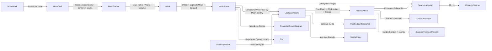

# [RASM_SUBSTRATE_MESH]

`Rasm.Meshing.mesh` owns the mesh substrate every DDG consumer composes: the ONE mesh admission discriminant `MeshSource`, the validated `MeshSpace` snapshot every arm resolves to, the decode-time `MeshDraft` accumulator and its `SceneWalk` fold, the `LaplacianCache` memoization, the intrinsic triangulation and `MeshLaplacian` assembly, and the topology, transport, and power-diagram witnesses. DEC operator assembly homes at `Meshing/dec`, reconstruction at `Meshing/reconstruct`, and every DDG solver at its owning `Processing/` page.

`MeshSource`, `MeshSpace`, `MeshDraft`, `MeshBlockRange`, `MeshAdjointSnapshot`, and `TopologyReceipt` are the public cross-package decode names the Geometry pages, the `Processing/receipts` route, the interchange decoders, and the `Rasm.Compute` adjoint seam bind. `MeshSource` arms carry `Rasm.Drawing`'s `EncodedGeometry` lane arena verbatim, `MeshDraft` composes `Meshing/edit`'s arena law by name, and every band on this page is a `ToleranceLane` read off the snapshot's own bound `Context`.

## [01]-[INDEX]

- [02]-[MESH_SOURCE]: mesh admission discriminant, its cell-topology roster, the decode-time draft accumulator and scene-walk fold, and the `MeshSpace` snapshot every arm resolves to with its bounds and broad-phase reads.
- [03]-[MESH_SUBSTRATE]: Laplacian selection and memoization, the cotangent primitive, the intrinsic triangulation, and the topology, transport, and power-diagram witnesses.
- [04]-[DENSITY_BAR]: owner, rail, and case partition across the substrate's axes.

## [02]-[MESH_SOURCE]

- Owner: `MeshSource` `[Union]` is the ONE mesh admission discriminant — `Native` the already-shaped host mesh, `Arena` the decoded lane pool with its corner roster, `Volume` the FE cell block under a `CellTopology` row; `CellTopology` `[SmartEnum<string>]` carries node count, corner count, and the reference-cell facet table as row data; `MeshDraft` is the decode-time accumulator a multi-source reader appends into block by block and the ONE public arena egress; `MeshBlockRange` is one appended block's vertex/corner extent with its declared lane set and shading key; `SceneWalk<TNode>` is the ONE scene-graph fold every interchange reader parameterizes; `MeshSpace` `[BoundaryAdapter]` mints the validated defensive-snapshot handle every arm resolves to.
- Cases: `MeshSource` closes at three arms and `MeshSpace.Of` is total over them through the generated `Map` — a fourth source is one case and one `Lift` arm, every existing call site untouched. `CellTopology` rows are the closed linear-and-quadratic Lagrange cell family (CGNS/VTK element roster, named upstream): `Tet4` `Tet10` `Hex8` `Hex20` `Wedge6` `Pyramid5`; a quadratic row shares its linear parent's facet table because a mid-side node carries no boundary corner.
- Entry: `MeshSpace.Of(Mesh, …)` and `MeshSpace.Of(MeshSource, …)` are the two admission entries and `MeshSpace.Accrue(MeshDraft, …)` the draft close into a host snapshot; all three funnel one `Admit` gate — null screen, `Mesh.IsValid` gate, defensive `DuplicateMesh` snapshot, `Context` binding, assembly policy fixed for the snapshot lifetime. `MeshDraft.Close` is the PUBLIC arena egress beside it: it publishes the packed lanes, the rebased corner roster, and the block overlay without minting a host mesh at all, which is the read an Element-tier `ImportedGeometry` mint composes. `MeshSpace.Bounds` and `MeshSpace.Index` are the memoized extent and broad-phase reads — a consumer building its own per-face box roster re-opens the copy this memo collapses.
- Auto: `Admit` is the one snapshot gate and takes its provenance as a parameter, so the `Native` arm re-wraps the SNAPSHOT (never the caller's mesh, which aliases the memory the defensive copy exists to escape) while the lane arms keep their immutable source arm. `LiftArena` reads the `Position` lane into vertices and the corner roster into triangles, carrying `Normal` and `Uv` when declared. `LiftVolume` folds the cell block through `CellTopology.Facets`, keying each facet on its sorted CORNER tuple; a key appearing once is a boundary facet and becomes a mesh face. `MeshDraft.Append` is total on its arena and returns the block's ORDINAL — the only block handle the scene fold carries — while `Close` pools each declared channel densely and refuses only an EMPTY column. `MeshDraft.Place` answers on the same `Fin` rail, so a stale ordinal from a caller-side memo refuses instead of vanishing. `SceneWalk.Accrue` walks the scene depth-first, prunes each excluded subtree, threads the parent frame into every node's placements, appends each node's blocks through the accessor's own memo, and sweeps the draft's un-referenced ordinals in un-placed at identity — every placement and every parent-frame read folding onto the one accumulator the walk aborts on.
- Law: `MeshDraft.Close` refuses a channel EMPTY across the whole arena and a vertex count past the encode seam's own `int` width; it never refuses a ragged union. Per-block `Declared` is the gate every consumer reads, and a block that declared no lane leaves its ordinates in that lane untouched — never read as values — so the pooled lane stays dense while a partially-declaring pool stays honest. Inverting that law — refusing a block that declared fewer lanes than the draft's union — is the DELETED form: it refused every real multi-source import where a UV-bearing block sits beside a UV-free one.
- Receipt: none at this cluster — `MeshSpace` IS the receipt-bearing artifact and `TopologyReceipt` witnesses it at `[03]`; `MeshDraft` is build state, and `MeshBlockRange` is an extent, not evidence.
- Packages: `Rasm.Drawing` (`EncodedGeometry`/`EncodingChannel`/`Encode.Of` the lane arena and its one raw-lane mint), `Rasm.Spatial` (`SpatialIndex`/`SpatialKind`/`BuildPolicy` the broad-phase build), `Rasm.Meshing` (`ArenaPolicy` from `Meshing/edit` — one arena policy row, never a draft twin), `Rasm.Domain` (`Context`, `ToleranceLane`, `Op`, `Kind`), `Rasm.Numerics` (`Dimension`, `GeometryFault`), QuikGraph (`DelegateIncidenceGraph` + `ImplicitDepthFirstSearchAlgorithm` — the scene walk's lazily-adjacent container and its reach-only colouring), Thinktecture.Runtime.Extensions (`[Union]`, `[SmartEnum]`), LanguageExt.Core, Rhino.Geometry.
- Growth: a new source modality is one `MeshSource` case with one `Lift` arm; a new cell family is one `CellTopology` row carrying its facet table; a new interchange reader is one `SceneWalk<TNode>` instantiation, zero new folds; a new lane is one `EncodingChannel` row at the `Drawing/pack` owner and zero draft edits — the pool fold is channel-generic and strides on the channel's own declared arity. Zero new carriers.
- Boundary: `MeshSpace`'s whole value is the VALIDATED HOST SNAPSHOT — the `Mesh.IsValid` gate, the defensive copy, the `Context` binding, and the Laplacian memo keyed on the snapshot's identity — so a raw-buffer arm aliasing caller memory cannot honour it; `Arena` and `Volume` therefore admit through their own `Lift` and never hand a caller's buffer to the substrate. `MeshSource.Arena` carries the `(EncodedGeometry, ImmutableArray<long>)` lane pair and NOT `ImportedGeometry`: the closed spelling names an Element-tier carrier (`Rasm.Element/.planning/Projection/projection.md:322`) the kernel cannot depend upward on, so the strata law refutes it here and the Element mint composes `MeshDraft.Close` instead — the same fact, spelled at the tier that owns it. Three further named losses ride the snapshot decision: the plural carriers' direct buffer access, bought back by `Lift` at one gate; decode-time arena pooling, which survives as `MeshDraft`'s internal and never as a public shape; and each provider's native ABI, which stays behind its own arm because the layout is the library's, not the kernel's. `Volume` publishes the LINEAR boundary hull — mid-side nodes carry no boundary corner, so a quadratic cell's curved facet flattens to its corner triangle, and a consumer needing the curved facet reads the lane arena directly. Corners are `long` end to end — the seam's own width and the `Volume` arm's — while counts narrow to `int` at `Encode.Of`, which is the one place the width disagreement is decidable and where `Close` refuses it typed. `MeshDraft` and `Meshing/edit`'s `MeshEdit` are two arenas under one law and split on ADMISSION SIDE: `MeshEdit` binds a `Context` because it mutates already-admitted geometry under a proven tolerance regime, `MeshDraft` binds none because raw decoded lanes have no regime until `Accrue` supplies one. A MISSING parent frame in the walk is a walk-order violation and refuses typed: reading it as the identity transform relocates a whole subtree to the world origin with nothing on the rail to say so. `SceneWalk`'s FRAME LAW is that a node's own frame is the HEAD of its placements and a node placing nothing inherits its parent's unchanged, which is what lets a mesh-free transform node carry its subtree; a format publishing world transforms per node ignores the threaded parent and the law is vacuous there. `MeshletBand` is NOT this owner's — the partition band seats beside `MeshBlock` at `Rasm.Element`, and `MeshBlockRange` here is the draft's own extent, never a band.

```csharp signature
// --- [RUNTIME_PRELUDE] ----------------------------------------------------------------------
using System;
using System.Collections.Generic;
using System.Collections.Immutable;
using System.Linq;
using System.Runtime.InteropServices;
using LanguageExt;
using QuikGraph;
using QuikGraph.Algorithms.Search;
using Rasm.Domain;
using Rasm.Drawing;
using Rasm.Numerics;
using Rasm.Spatial;
using Rhino.Geometry;
using Thinktecture;
using static LanguageExt.Prelude;
// CS0104 guard: Rhino.Geometry declares a Dimension homonym under the dual usings.
using Dimension = Rasm.Numerics.Dimension;

namespace Rasm.Meshing;

// --- [TYPES] --------------------------------------------------------------------------------
// Facet rosters wind OUTWARD, so a boundary facet's mesh face inherits the outward normal with no re-orientation.
[SmartEnum<string>]
public sealed partial class CellTopology {
    public static readonly CellTopology Tet4     = new("tet4",     nodes: 4,  corners: 4, facets: [[0, 2, 1], [0, 1, 3], [1, 2, 3], [2, 0, 3]]);
    public static readonly CellTopology Tet10    = new("tet10",    nodes: 10, corners: 4, facets: [[0, 2, 1], [0, 1, 3], [1, 2, 3], [2, 0, 3]]);
    public static readonly CellTopology Hex8     = new("hex8",     nodes: 8,  corners: 8, facets: [[0, 3, 2, 1], [4, 5, 6, 7], [0, 1, 5, 4], [1, 2, 6, 5], [2, 3, 7, 6], [3, 0, 4, 7]]);
    public static readonly CellTopology Hex20    = new("hex20",    nodes: 20, corners: 8, facets: [[0, 3, 2, 1], [4, 5, 6, 7], [0, 1, 5, 4], [1, 2, 6, 5], [2, 3, 7, 6], [3, 0, 4, 7]]);
    public static readonly CellTopology Wedge6   = new("wedge6",   nodes: 6,  corners: 6, facets: [[0, 2, 1], [3, 4, 5], [0, 1, 4, 3], [1, 2, 5, 4], [2, 0, 3, 5]]);
    public static readonly CellTopology Pyramid5 = new("pyramid5", nodes: 5,  corners: 5, facets: [[0, 3, 2, 1], [0, 1, 4], [1, 2, 4], [2, 3, 4], [3, 0, 4]]);
    public int Nodes { get; }
    public int Corners { get; }
    public ImmutableArray<ImmutableArray<int>> Facets { get; }
}

[Union]
public abstract partial record MeshSource {
    private MeshSource() { }
    public sealed record Native(Mesh Value) : MeshSource;
    public sealed record Arena(EncodedGeometry Lanes, ImmutableArray<long> Corners) : MeshSource;
    public sealed record Volume(EncodedGeometry Lanes, ImmutableArray<long> Cells, CellTopology Topology) : MeshSource;
}

// --- [CONSTANTS] ----------------------------------------------------------------------------
// Policy rows, not consts; FIXED per snapshot at MeshSpace.Of — per-call variation aliases the snapshot memos.
// AspectRatioCeiling is the circumradius-to-inradius quality measure, 2 at an equilateral corner and unbounded
// as a triangle degenerates; the default bounds the direct-cotangent quality gate, so the number chooses where
// that route refuses weights it cannot certify and a consumer with its own quality
// regime overrides it per snapshot. Intrinsic-sourced kinds skip the guard entirely — they mollify instead.
// SpectralCount is the eigenbasis width every unqualified spectral read requests; it is a POLICY row rather
// than a const because it is simultaneously a default and a memo key, and a rule living in a trailing comment
// is a rule nothing enforces.
public readonly record struct MeshAssemblyPolicy(
    PositiveMagnitude AspectRatioCeiling, Dimension FlipCapPerEdge, Dimension SpectralCount) {
    public static readonly MeshAssemblyPolicy Default = new(
        AspectRatioCeiling: PositiveMagnitude.Create(value: 11.5), FlipCapPerEdge: Dimension.Create(value: 16),
        SpectralCount: Dimension.Create(value: 32));
}

// --- [MODELS] -------------------------------------------------------------------------------
// Declared is the block's EVIDENCE set and the gate every consumer reads, which is why an untouched ordinate in
// a pooled lane is never read as a value.
public readonly record struct MeshBlockRange(
    long VertexOffset, long VertexCount, long CornerOffset, long CornerCount,
    Seq<EncodingChannel> Declared, Option<string> Material = default) : IValidityEvidence {
    public bool IsValid => ValidityClaim.All(
        VertexOffset >= 0L, VertexCount >= 1L, CornerOffset >= 0L, CornerCount % 3L == 0L,
        Declared.Contains(EncodingChannel.Position));
}

// Decode-time accumulator composing `Meshing/edit`'s [03]-[ARENA_LAW] by name: single-writer, publish-by-freeze,
// amortized doubling, no fault union past the close, and no content hash until the close publishes.
public sealed class MeshDraft : IDisposable {
    public static MeshDraft Of(Option<ArenaPolicy> policy = default);
    public ArenaPolicy Policy { get; }
    public long VertexCount { get; }
    public long CornerCount { get; }
    // Ordinal-indexed: Append returns the index into THIS roster and it is the only block handle the scene fold
    // carries, so the un-referenced complement is a read of the draft's own count rather than a declared arity.
    public Seq<MeshBlockRange> Blocks { get; }
    public Seq<(int Block, Transform Placement)> Instances { get; }
    // Corners are BLOCK-LOCAL on the way in and rebased onto the draft's vertex offset on the way down, so a decoder
    // appending its second primitive never re-indexes what it already handed over.
    public Fin<int> Append(long count, Seq<(EncodingChannel Channel, float[] Values)> lanes,
        ReadOnlySpan<long> corners, Op key, Option<string> material = default);
    // Placement rides the SAME rail as the write side: an ordinal outside [0, Blocks.Count) is a stale handle
    // from a caller-side memo, and placing a transform on a block that does not exist is the silent relocation
    // the discarded result used to hide.
    public Fin<Unit> Place(int block, Transform placement);
    // One close serves the draft. Each declared channel pools DENSELY on its own arity: a declaring block copies its own range,
    // a non-declaring one leaves that range untouched, so per-vertex lockstep and the descriptor stride both hold.
    // Refusals: a channel empty across the WHOLE arena, and a count past the int width Encode.Of admits.
    public Fin<(EncodedGeometry Lanes, ImmutableArray<long> Corners, Seq<MeshBlockRange> Blocks)> Close(Op key);
    public void Dispose();
}

// One fold for every interchange scene graph. Placements takes the PARENT frame so world = local * parent is
// expressible, and Blocks memoizes its ordinals so a re-visited prototype fans no duplicate block.
public sealed record SceneWalk<TNode>(
    Func<TNode, Seq<TNode>> Flatten,
    Func<TNode, bool> Excluded,
    Func<TNode, Transform, Seq<Transform>> Placements,
    Func<TNode, MeshDraft, Fin<Seq<int>>> Blocks) where TNode : notnull {
    // ImplicitDepthFirstSearchAlgorithm over a DelegateIncidenceGraph: the implicit walk colours only what it
    // reaches. A vertex-bearing container is REFUSED — its initialize pass enumerates a roster no scene publishes.
    public Fin<MeshDraft> Accrue(TNode root, MeshDraft draft, Op key) {
        DelegateIncidenceGraph<TNode, SEquatableEdge<TNode>> scene = new(
            (TNode node, out IEnumerable<SEquatableEdge<TNode>> children) => {
                children = Excluded(node) ? [] : Flatten(node).Map(child => new SEquatableEdge<TNode>(node, child));
                return true;
            });
        HashMap<TNode, Transform> frames = HashMap((root, Transform.Identity));
        Fin<Set<int>> referenced = Fin.Succ(Set<int>());
        ImplicitDepthFirstSearchAlgorithm<TNode, SEquatableEdge<TNode>> walk = new(visitedGraph: scene);
        // TreeEdge fires BEFORE the target's DiscoverVertex, so a child reads the frame its parent already
        // settled. A MISSING parent frame is a walk-order violation, not an identity placement: reading one as
        // identity relocates a whole subtree to the world origin silently, so it binds onto the abort rail the
        // fold already threads.
        walk.TreeEdge += edge => referenced = referenced.Bind(seen => {
            if (frames.Find(key: edge.Source).Case is not Transform parent) { return Fin.Fail<Set<int>>(key.InvalidResult(detail: "scene-frame")); }
            frames = frames.AddOrUpdate(key: edge.Target, value: parent);
            return Fin.Succ(seen);
        });
        walk.DiscoverVertex += node => {
            if (referenced.IsFail) { walk.Abort(); return; }
            if (Excluded(node)) { return; }
            referenced = referenced.Bind(seen => {
                if (frames.Find(key: node).Case is not Transform parent) { return Fin.Fail<Set<int>>(key.InvalidResult(detail: "scene-frame")); }
                Seq<Transform> places = Placements(node, parent);
                frames = frames.AddOrUpdate(key: node, value: places.Head.IfNone(noneValue: parent));
                return Blocks(node, draft).Bind(ordinals =>
                    ordinals.Bind(block => places.Map(place => draft.Place(block: block, placement: place)))
                        .TraverseM(identity).As()
                        .Map(_ => ordinals.Fold(seen, static (held, block) => held.Add(block))));
            });
            if (referenced.IsFail) { walk.Abort(); }
        };
        walk.Compute(root);
        return referenced.Bind(seen =>
            toSeq(Enumerable.Range(start: 0, count: draft.Blocks.Count).Where(ordinal => !seen.Contains(ordinal)))
                .Map(block => draft.Place(block: block, placement: Transform.Identity))
                .TraverseM(identity).As()
                .Map(_ => draft));
    }
}

[BoundaryAdapter, StructLayout(LayoutKind.Auto)]
public readonly record struct MeshSpace {
    private MeshSpace(Mesh snapshot, MeshSource source, Context tolerance, MeshAssemblyPolicy assembly) {
        (Native, Source, Tolerance, Assembly) = (snapshot, source, tolerance, assembly);
    }
    public static Fin<MeshSpace> Of(Mesh native, Context context, Option<MeshAssemblyPolicy> assembly = default, Op? key = null) =>
        Admit(native: native, provenance: static snapshot => new MeshSource.Native(Value: snapshot),
            context: context, assembly: assembly, key: key.OrDefault());
    public static Fin<MeshSpace> Of(MeshSource source, Context context, Option<MeshAssemblyPolicy> assembly = default, Op? key = null) {
        Op op = key.OrDefault();
        return source.Map(
            native: arm => Admit(native: arm.Value, provenance: static snapshot => new MeshSource.Native(Value: snapshot),
                context: context, assembly: assembly, key: op),
            arena: arm => LiftArena(lanes: arm.Lanes, corners: arm.Corners, key: op)
                .Bind(mesh => Admit(native: mesh, provenance: _ => arm, context: context, assembly: assembly, key: op)),
            volume: arm => LiftVolume(lanes: arm.Lanes, cells: arm.Cells, topology: arm.Topology, key: op)
                .Bind(mesh => Admit(native: mesh, provenance: _ => arm, context: context, assembly: assembly, key: op)));
    }
    // Host-snapshot close runs here. The block overlay stays with the draft's own reader — Close publishes it, and a
    // consumer wanting the lane arena alone takes that read instead of paying for a Mesh it never touches.
    public static Fin<MeshSpace> Accrue(MeshDraft draft, Context context, Option<MeshAssemblyPolicy> assembly = default, Op? key = null) =>
        draft.Close(key: key.OrDefault())
            .Bind(closed => Of(source: new MeshSource.Arena(Lanes: closed.Lanes, Corners: closed.Corners),
                context: context, assembly: assembly, key: key));
    private static Fin<MeshSpace> Admit(Mesh native, Func<Mesh, MeshSource> provenance, Context context, Option<MeshAssemblyPolicy> assembly, Op key) =>
        from active in Optional(native).ToFin(key.InvalidInput())
        from ctx in Optional(context).ToFin(key.MissingContext())
        from _ in guard(active.IsValid, key.InvalidInput())
        let snapshot = active.DuplicateMesh()
        select new MeshSpace(snapshot: snapshot, source: provenance(snapshot), tolerance: ctx,
            assembly: assembly.IfNone(noneValue: MeshAssemblyPolicy.Default));
    // Position is the only REQUIRED lane; Normal and Uv ride when the descriptor set declares them.
    private static Fin<Mesh> LiftArena(EncodedGeometry lanes, ImmutableArray<long> corners, Op key);
    private static Fin<Mesh> LiftVolume(EncodedGeometry lanes, ImmutableArray<long> cells, CellTopology topology, Op key);
    public MeshSource Source { get; }
    public Context Tolerance { get; }
    public MeshAssemblyPolicy Assembly { get; }
    internal Mesh Native { get; }
    internal LaplacianCache Cache => LaplacianCache.For(space: this);
    public Mesh DuplicateNative() => Native.DuplicateMesh();
    public BoundingBox Bounds => Cache.Bounds;
    public Fin<SpatialIndex> Index(Op? key = null) => Cache.Index(key: key.OrDefault());
    public Fin<SparseLaplacian> Laplacian(MeshLaplacian kind, Op? key = null) =>
        MeshKernel.LaplacianOf(space: this, kind: kind, key: key.OrDefault());
    public Fin<Arr<Vector3d>> FaceNormals(Op? key = null) => Cache.FaceNormals(key: key.OrDefault());
}

// WITNESS — the three interchange hand walks rebuilt here, in prose because their node types are the reader's.
// USD: its per-prim block pool becomes the Blocks memo keyed by prim path, its prototype guard becomes Excluded,
// its PointInstancer scatter one node's Placements Seq (parent frame ignored — USD composes each prim's own
// local-to-world, the frame law's vacuous arm). Assimp: its recursive Walk(node, parent) becomes Placements:
// (node, parent) => Seq(Numeric(node.Transform) * parent), its referenced[] sweep the draft's own complement.
// glTF: Node.Flatten becomes Flatten and its GPU-instancing fan one node's Placements Seq.
```

## [03]-[MESH_SUBSTRATE]

- Owner: `MeshLaplacian` `[SmartEnum<int>]` selects the discretization and routes the owning cache memo, its quality gate DERIVED from the `TriangulationSource` row it carries; `LaplacianCache` mints the per-snapshot memoization service; `Cotangent` mints the one corner primitive both assembly paths, Crouzeix-Raviart pairs, and divergence scatter compose, and `MeshKernel.CotanEdgeWeightOf` the one `0.5(cot α + cot β)` edge weight the transport rows and `Meshing/dec` star-1 construction both read; `IntrinsicMesh`/`IntrinsicEdge`/`SeedHalfedge` mint the mutable-build/frozen-read triangulation internal to the assembly; `FlipFrontier` mints the folder's ONE Delaunay flip work-list and its budget census, parameterized on the interior, settled, and flip arms so the tessellation arena composes the same fixpoint; `MeshKernel` mints the substrate assembly kernel; `TuftedCoverMesh` mints the Sharp-Crane double cover; `RestrictedPowerDiagram`/`PowerCell`/`PowerFacet` mint the Laguerre diagram restricted to the mesh surface.
- Cases: `MeshLaplacian` rows `Cotangent`/`IntrinsicDelaunay`/`TuftedIntrinsic` carry the triangulation source, cache memo, and kind-consistent intrinsic snapshot as row data, so no call site branches on row equality — the two columns the census carried as bools were perfectly correlated, a row running on the INPUT triangulation exactly when its quality is the caller's to answer for. `TransportHalf` is the transport vocabulary and a request is a `CapabilitySet<TransportHalf>` — frames answer direction and normal coordinates answer crossing, two INDEPENDENT measurements of one pass, so the three named encodings were exactly its three legal non-empty subsets and the roster derives instead of restating them. `CoverSubstitution`, `CoverLaw`, and `MeshTrait` are the cover-substitution, cover-proof, and topology vocabularies; `OverlayEmit` and `PowerDensityPolicy` carry their emission and fan-quadrature geometry the same way.
- Entry: `MeshSpace.Laplacian` is the one Laplacian entry, the kind row's delegate routing the cache memo and the `TriangulationSource.Input` row routing the aspect-ratio guard while intrinsic kinds mollify; `MeshSpace.FaceNormals` is the one per-face normal read — the memoized unit-normal column over the native face roster, so a mesh-evidence consumer indexes faces without a native copy or a `ComputeFaceNormals` mutation; `MeshAdjointSnapshot.Of` projects the cached `DiscreteCalculus` for the adjoint seam; `MeshKernel.TopologyDetailed` is the total topology diagnostic; `MeshKernel.RestrictedPowerCells` is the power-diagram entry. One selector row owns each discretization, no per-kind assembly sibling.
- Auto: `LaplacianCache.For` resolves the per-snapshot cache; each memo seats its `Atom<HashMap>` through `Cell.Claim` only on `Fin.Succ`, so a transient failure re-computes and a racing computer's seated value is what both callers read. Downstream solver artifacts ride the one type-keyed `Memoized` slot materialized from the `(TKey, T)` pair, so the substrate names no downstream type. Intrinsic assembly runs `FromMesh` → `FlipFrontier.Settle` → `Freeze` with the FLIP-N integer normal-coordinate update keeping the kernel integral and the parity invariant exact, and with signposts seeded over the input fan at `FromMesh` and maintained per flip, so the frozen snapshot's angles are the flipped triangulation's own and the input halfedge directions the overlay traces survive beside them; the tufted path builds the double cover, applies global Sharp-Crane mollification, settles the flip frontier, and admits only under the structural guards. Every degenerate-area floor is scale-derived from `DegenerateAreaFloorOf`, one owner.
- Law: a band a consumer can override is a `ToleranceLane` read off `MeshSpace.Tolerance`; a scale-relative NUMERICAL floor — the cotangent denominator screen, `DegenerateAreaFloorOf`, `SpdMassShift` — stays an `EpsilonPolicy` row because it guards float arithmetic, not a domain decision, and admits no per-model override. Receipts gated at a band CARRY that band, so a witness read later states the regime it passed under rather than assuming the reader's.
- Receipt: `SparseLaplacian` carries the stiffness/mass/witness bundle under dimension-agreement claims; `TuftedLaplacianReceipt` witnesses the full cover construction, its proved cover laws riding one `CapabilitySet<CoverLaw>` column and its residual band riding beside them; `TopologyReceipt` is the total un-gated topology witness carrying its measured `CapabilitySet<MeshTrait>`, its DERIVED watertight and Euler-validated reads, and the typed `(Euler, Genus, BoundaryComponents)` projection row — every field is evidence and a new witness is one row; `SignpostTransportReceipt`, `CommonSubdivision`, and `RestrictedPowerReceipt` witness transport, overlay partition-of-unity, and radical-clip degeneracy. Census bool `SignpostTransportReceipt.IntrinsicSnapshot` is ABSORBED, not dropped: `TransportOf` guards `imesh is { IsFrozen: true, SignpostAngle: not null }` at entry, so a receipt reporting an unfrozen snapshot is unrepresentable and the field carries a constant `true`. Every gated receipt is one `ValidityClaim.All` fold over the rails claim rows; `TopologyReceipt` alone stays gate-free.
- Exemption: `FlipFrontier` is a WORK-LIST fixpoint, not a traversal, and names its refusal in-fence at the owner both flip consumers compose — QuikGraph's `BreadthFirstSearchAlgorithm` colours each vertex once and admits no re-entry, so composing it caps every edge at one flip and silently changes the algorithm, and `IQueue<TVertex>` selects a frontier over a STATIC container while every flip rewrites the incidence the frontier reads. Power-cell FIFO frontier and signpost fan orbit refuse the same operators for the same reason and stay measured statement kernels. `IntrinsicMesh.EdgeData` stays a mutable `Dictionary` because a flip rewrites it in place; `SeedHalfedges` freezes into a `FrozenDictionary` at `Freeze`, and `LaplacianCache.solverSlots` stays concurrent because it grows across the snapshot's whole lifetime. That same clause covers every span-kernel accumulator that dies with the fold that fills it: `LaplacianTriplets`' per-face triplet columns, the SPD assembly's `triplets` list, `TransportFramesOf`'s `rows`, and the overlay's `points`, `crossings`, and preallocated `alongB` slot table — the last is preallocated BY NORMAL COORDINATE precisely so a missed crossing lands as a null slot the completeness gate refuses. `MeshKernel.TraitsOf` takes five bools because RhinoCommon's `IsManifold` publishes its predicates as `out` parameters: the K2 exemption is a HOST-BOUNDARY one, the five arguments are consumed by one fold into `CapabilitySet<MeshTrait>` in the same expression that reads them, and no bool crosses a page surface.
- Packages: RhinoCommon is a genuine Rhino boundary here per the Tier-0 capture law, never thinned; `Numerics/matrix` owns sparse assembly and the Cholesky factor, `Numerics/spectral` the `DiscreteCalculus` carrier, `Numerics/atoms` the projection and magnitude value objects, `Spatial/neighbors` the one k-NN substrate the power-incident seed rides rather than a private RTree, `Spatial/index` the broad phase the snapshot memoizes, `Processing/geodesics` the one chart-unfolding `WalkChart` the overlay trace seats in `EdgeOverlay` mode rather than minting a second unfold; `Domain/rails` owns `Op`, the `ValidityClaim` fold, and the `Transition`/`Cell` CAS verdict the memos seat through, `Domain/context` the `Context` and its lanes, `Domain/validation` the `CapabilitySet`/`ICapability` idiom. Thinktecture.Runtime.Extensions, LanguageExt.Core, and BCL concurrency complete the floor.
- Growth: a fourth Laplacian discretization is one `MeshLaplacian` row, one cache memo, and one assembly member, every call site untouched; a new memoized solver artifact is zero cache edits — the owning page mints its key record and calls `Memoized`; a new transport half is one `TransportHalf` row, a new cover law one `CoverLaw` row, a new topology fact one `MeshTrait` row; a new signpost gauge, power-density model, or topology witness is one row or one field. Zero new public surface.
- Boundary: the radical clip is NOT this page's arithmetic — `Predicate.ClipHalfplane` is the one convex-ring half-plane fold, and the power path supplies its `Halfplane.Affine` cut, its band, and its floor, so the guarded crossing and the fabrication channel are the same code the bounded Voronoi cell runs. A `DenomFloor` hit publishes a midpoint the aggregate tally alone could not attribute, so `PowerCell.Fabricated` and `PowerFacet.Fabricated` name the contaminated rows and a Newton step refuses them rather than the run. Cache identity keys on the snapshot `Mesh` reference and memoizes success only — a keyed dictionary leaks across snapshot lifetimes and re-keys on value equality, so the `ConditionalWeakTable` is the load-bearing contract. `Cotangent` arithmetic lives in one owner and the edge weight over it in `CotanEdgeWeightOf`; a consumer re-deriving `(a·b)/(2A)`, the law-of-cosines form, or the half-sum of opposite cotangents inline re-opens the collapsed duplication. Face normals ride the memoized column the same way: a consumer duplicating the native to run `FaceNormals.ComputeFaceNormals` re-opens the per-consumer copy the column collapsed, and running it on the snapshot itself mutates a frozen mesh every cached reader aliases. `IntrinsicMesh` stays `internal` and the cross-package surface is `MeshAdjointSnapshot` carrying the public `DiscreteCalculus`, so no consumer mutates a frozen snapshot mid-cache. Aspect-ratio guard and intrinsic mollification are policy rows on `MeshAssemblyPolicy`/`TuftedCoverPolicy`, and `MeshAssemblyPolicy` travels on `MeshSpace.Of` one value per snapshot, so per-run variation means a fresh snapshot rather than a per-call knob aliasing the Unit-keyed memos. The direct-cotangent host-read window sits wholly inside `Op.Catch`: a proved over-ceiling finite ratio alone mints `GeometryFault.CotangentQuality` with face and guarded ratio evidence, a malformed reading returns the kernel invalid-result refusal, and an unknown raise remains exact. Two solver families sharing one `(key-record, artifact)` pair alias one `Memoized` slot, so every family declares its own key record beside its kernel. `PowerFacet` carries the SIGNED dual length and the UNCLAMPED radical foot `OffsetI`, both built from the weights the clip itself ran under, so the BNOT weight-Newton Hessian reads them rather than re-deriving a site distance; a clamped foot or an unsigned length mints a wrong-sign Newton step no residual catches. `A_ij == A_ji` holds because the canonical `(min, max)` key accumulates ONCE — the FIFO frontier reaches both cell views and the two clip SEQUENCES differ by ulps, so summing both doubles every length. Euclidean k-NN seeds the power-incident set through `Spatial/neighbors`, so non-trivial weights can under-clip the k-th neighbour; the weighted security radius tests the farthest neighbour after the list exhausts, `KNearest` is a policy row, and the signed `IntegrationResidual`, the `NeighborFacetCount`-versus-`IncidentPairCount` gap, and `QueuePeakDepth` make any under-clip observable from two independent directions. Degenerate meshes route an `Op` fault over `Fin<T>`, never a throw.

```csharp signature
// --- [RUNTIME_PRELUDE] ----------------------------------------------------------------------
using System;
using System.Collections.Concurrent;
using System.Collections.Frozen;
using System.Collections.Generic;
using System.Linq;
using System.Runtime.CompilerServices;
using System.Runtime.InteropServices;
using LanguageExt;
using Rasm.Domain;
using Rasm.Numerics;
using Rasm.Processing;
using Rasm.Spatial;
using Rhino.Geometry;
using Thinktecture;
using static LanguageExt.Prelude;
// CS0104 guard: Rhino.Geometry declares Matrix/Dimension homonyms under the dual usings.
using Dimension = Rasm.Numerics.Dimension;

namespace Rasm.Meshing;

// --- [TYPES] --------------------------------------------------------------------------------
[SmartEnum<string>]
public sealed partial class TriangulationSource {
    public static readonly TriangulationSource Input = new("input");
    public static readonly TriangulationSource Intrinsic = new("intrinsic");
}

[SmartEnum<int>]
public sealed partial class MeshLaplacian {
    public static readonly MeshLaplacian Cotangent = new(key: 0, triangulation: TriangulationSource.Input,
        select: static (cache, key) => cache.Cotangent(key),
        snapshot: static (cache, key) => cache.EnsureFrozenIntrinsic(kind: MeshLaplacian.Cotangent, key: key));
    public static readonly MeshLaplacian IntrinsicDelaunay = new(key: 1, triangulation: TriangulationSource.Intrinsic,
        select: static (cache, key) => cache.IntrinsicDelaunay(key),
        snapshot: static (cache, key) => cache.IntrinsicMeshSnapshot(key: key));
    public static readonly MeshLaplacian TuftedIntrinsic = new(key: 2, triangulation: TriangulationSource.Intrinsic,
        select: static (cache, key) => cache.TuftedIntrinsic(key),
        snapshot: static (cache, key) => cache.TuftedIntrinsicMeshSnapshot(key: key));
    internal TriangulationSource Triangulation { get; }
    internal bool RequiresQualityGate => Triangulation == TriangulationSource.Input;
    [UseDelegateFromConstructor] internal partial Fin<SparseLaplacian> Select(LaplacianCache cache, Op key);
    [UseDelegateFromConstructor] internal partial Fin<MeshKernel.IntrinsicMesh> Snapshot(LaplacianCache cache, Op key);
}

[SmartEnum<string>]
public sealed partial class TransportHalf : ICapability<TransportHalf> {
    public static readonly TransportHalf Frames = new("frames", rank: 0);
    public static readonly TransportHalf Overlay = new("overlay", rank: 1);
    public int Rank { get; }
    // Requests measuring neither half are not transport requests; every other corner is legal.
    public static readonly CapabilityLaw<TransportHalf> Law = new(Legal: Seq(
        CapabilitySet<TransportHalf>.Of(Frames),
        CapabilitySet<TransportHalf>.Of(Overlay),
        CapabilitySet<TransportHalf>.All));
}

[SmartEnum<string>]
public sealed partial class CoverSubstitution : ICapability<CoverSubstitution> {
    public static readonly CoverSubstitution Stiffness = new("stiffness", rank: 0);
    public static readonly CoverSubstitution Mass = new("mass", rank: 1);
    public int Rank { get; }
}

[SmartEnum<string>]
public sealed partial class CoverLaw : ICapability<CoverLaw> {
    public static readonly CoverLaw Bijective = new("bijective", rank: 0);
    public static readonly CoverLaw EdgeManifold = new("edge-manifold", rank: 1);
    public static readonly CoverLaw Closed = new("closed", rank: 2);
    public static readonly CoverLaw Delaunay = new("delaunay", rank: 3);
    public static readonly CoverLaw VertexCollapsed = new("vertex-collapsed", rank: 4);
    public int Rank { get; }
}

[SmartEnum<string>]
public sealed partial class MeshTrait : ICapability<MeshTrait> {
    public static readonly MeshTrait Boundary = new("boundary", rank: 0);
    public static readonly MeshTrait Closed = new("closed", rank: 1);
    public static readonly MeshTrait Solid = new("solid", rank: 2);
    public static readonly MeshTrait Manifold = new("manifold", rank: 3);
    public static readonly MeshTrait Oriented = new("oriented", rank: 4);
    public int Rank { get; }
}

[SmartEnum<string>]
public sealed partial class OverlayEmit {
    public static readonly OverlayEmit Polygons = new("polygons");
    public static readonly OverlayEmit Triangles = new("triangles");
}

// Gauge is a READ-time rotation: angles store from the structural fan start, so selecting a gauge subtracts one
// per-vertex constant. LowestVertexNeighbor is invariant under incident-edge insertion order, hence replay-stable.
[SmartEnum<int>]
public sealed partial class SignpostGauge {
    public static readonly SignpostGauge FirstHalfedge        = new(key: 0,
        reference: static (imesh, vertex) => imesh.FirstIncidentEdge(vertexIdx: vertex));
    public static readonly SignpostGauge LowestVertexNeighbor = new(key: 1,
        reference: static (imesh, vertex) => imesh.LowestNeighborEdge(vertexIdx: vertex));
    [UseDelegateFromConstructor] internal partial int ReferenceEdge(MeshKernel.IntrinsicMesh imesh, int vertex);
}

// ScalarFanQuadrature is EXACT P1, not an approximation: the three fan-triangle corner samples integrate a linear
// density in closed form against the simplex moments, so the row carries a node COUNT and no node fraction.
[SmartEnum<int>]
public sealed partial class PowerDensityPolicy {
    public static readonly PowerDensityPolicy Constant            = new(key: 0, quadratureNodes: 0);
    public static readonly PowerDensityPolicy ScalarFanQuadrature = new(key: 1, quadratureNodes: 3);
    internal int QuadratureNodes { get; }
    internal bool RequiresField => QuadratureNodes > 0;
}

// --- [CONSTANTS] ----------------------------------------------------------------------------
// Mollification absence IS disablement: a factor of zero and a disabled pass were two spellings of one state.
// The scale is a LANE, not a scalar — a band a consumer overrides is a Context read by this page's own law, and
// Mollification is the row minted for exactly this deficit, so the cover scales with the model rather than
// with a literal that swallows a millimetre model and vanishes on a site one.
[BoundaryAdapter, StructLayout(LayoutKind.Auto)]
public readonly record struct TuftedCoverPolicy(
    Option<ToleranceLane> Mollify, ToleranceLane DelaunayBand, Dimension MaxFlipsPerEdge,
    UnitInterval EnergyScaleFactor, CapabilitySet<CoverSubstitution> Substitute) {
    public static readonly TuftedCoverPolicy Default = new(
        Mollify: Some(ToleranceLane.Mollification), DelaunayBand: ToleranceLane.Cocircular,
        MaxFlipsPerEdge: Dimension.Create(value: 16), EnergyScaleFactor: UnitInterval.Create(value: 0.5),
        Substitute: CapabilitySet<CoverSubstitution>.All);
    public static Fin<TuftedCoverPolicy> Of(Option<ToleranceLane> mollify, ToleranceLane delaunayBand, int maxFlipsPerEdge,
        double energyScaleFactor, CapabilitySet<CoverSubstitution> substitute, Op? key = null);
}

// Default measures FRAMES alone — the overlay is a far heavier request a caller states rather than pays for on
// every assembly. The cone-angle floor reads Collinear: a ring under it has collapsed to a collinear wedge.
[BoundaryAdapter, StructLayout(LayoutKind.Auto)]
public readonly record struct SignpostPolicy(
    CapabilitySet<TransportHalf> Halves, Option<Dimension> TraceMaxIters, Dimension TraceCapPerEdge,
    ToleranceLane RescaleFloor, SignpostGauge ReferenceDirectionGauge, OverlayEmit Emit) {
    public static readonly SignpostPolicy Default = new(
        Halves: CapabilitySet<TransportHalf>.Of(TransportHalf.Frames), TraceMaxIters: None,
        TraceCapPerEdge: Dimension.Create(value: 16),
        RescaleFloor: ToleranceLane.Collinear, ReferenceDirectionGauge: SignpostGauge.LowestVertexNeighbor,
        Emit: OverlayEmit.Triangles);
    // None = edge-derived cap; the record carries no zero-sentinel. Of maps a nonpositive boundary arg to None.
    // The per-edge multiplier is a COLUMN like every other axis on this row — a body literal would read as one
    // policy with the two flip caps that happen to share its value.
    internal int TraceCapFor(int edgeCount) =>
        TraceMaxIters.Map(static cap => cap.Value).IfNone(noneValue: Math.Max(1, edgeCount) * TraceCapPerEdge.Value);
    public static Fin<SignpostPolicy> Of(CapabilitySet<TransportHalf> halves, int traceMaxIters, int traceCapPerEdge,
        ToleranceLane rescaleFloor, SignpostGauge referenceDirectionGauge, OverlayEmit emit, Op? key = null);
}

// Every clip threshold is scale-derived from the mesh bbox diagonal / mean edge, admitted once per run.
internal readonly record struct PowerClipPolicy(
    double ClipBand, double DenomFloor, double AreaFloor, double EdgeBand,
    int KNearest, int MinPolygonVertices, PowerDensityPolicy Density) {
    internal static Fin<PowerClipPolicy> Of(double diagonal, double meanEdge, PowerDensityPolicy density, Op key);
}

// --- [MODELS] -------------------------------------------------------------------------------
[BoundaryAdapter, StructLayout(LayoutKind.Auto)]
public readonly record struct SparseLaplacian(
    SparseMatrix Stiffness, SparseMatrix MassConsistent, Arr<double> MassLumped,
    int SkippedDegenerateFaces = 0, Option<TuftedLaplacianReceipt> Tufted = default, int NegativeCotangentCount = 0) : IValidityEvidence {
    public bool IsValid => ValidityClaim.All(
        ValidityClaim.CountExactly(count: Stiffness.Rows.Value, expected: Stiffness.Cols.Value),
        ValidityClaim.CountExactly(count: MassConsistent.Rows.Value, expected: Stiffness.Rows.Value),
        ValidityClaim.CountExactly(count: MassConsistent.Cols.Value, expected: Stiffness.Cols.Value),
        ValidityClaim.CountExactly(count: MassLumped.Count, expected: Stiffness.Rows.Value),
        ValidityClaim.CountAtLeast(count: SkippedDegenerateFaces, floor: 0),
        ValidityClaim.CountAtLeast(count: NegativeCotangentCount, floor: 0),
        Tufted.Map(static receipt => receipt.IsValid).IfNone(noneValue: true));
}

// CoverAware DERIVES from the face-doubling identity, and the flip budget is a COUNT of spent edges rather than a
// bool, so a partially-settled cover reports how far it got.
[BoundaryAdapter, StructLayout(LayoutKind.Auto)]
public readonly record struct TuftedLaplacianReceipt(
    MeshLaplacian Kind, CapabilitySet<CoverLaw> Laws, Tolerance ResidualBand,
    int OriginalVertices, int OriginalFaces, int IntrinsicVertices, int IntrinsicEdges,
    int IntrinsicFaces, int CoverFaces, int CoverEdges, int BoundaryEdges, int NonManifoldEdges,
    int GluingSymmetryViolations, double MollificationEpsilon, int DegenerateTriangleCount, double LengthScaleH,
    double MinTriangleInequalitySlack, int IntrinsicFlips, int NonDelaunayEdgesRemaining, int FlipBudgetExhaustedEdges,
    double MinCotanEdgeWeight, double MinBoundaryEdgeWeight, int NegativeWeightCount, double MinLumpedMass,
    double TotalCoveredArea, double EnergyScaleApplied, double SymmetryResidual, double RowSumResidual,
    int DroppedNonTriangleFaces) : IValidityEvidence {
    public bool CoverAware => CoverFaces == 2 * IntrinsicFaces;
    public bool IsValid => ValidityClaim.All(
        ValidityClaim.CountAtLeast(count: OriginalFaces, floor: IntrinsicFaces + DroppedNonTriangleFaces),
        ValidityClaim.Nonnegative(MollificationEpsilon), ValidityClaim.Positive(LengthScaleH),
        ValidityClaim.CountAtLeast(count: DegenerateTriangleCount, floor: 0), ValidityClaim.CountAtLeast(count: IntrinsicFlips, floor: 0),
        ValidityClaim.Finite(SymmetryResidual), ValidityClaim.Finite(RowSumResidual), ValidityClaim.Nonnegative(TotalCoveredArea),
        ValidityClaim.Positive(EnergyScaleApplied),
        !CoverAware || (Laws.AdmitsAll(CapabilitySet<CoverLaw>.All)
            && GluingSymmetryViolations == 0 && NonDelaunayEdgesRemaining == 0 && FlipBudgetExhaustedEdges == 0
            && SymmetryResidual <= ResidualBand.Value && RowSumResidual <= ResidualBand.Value && MinLumpedMass > 0.0
            && MinCotanEdgeWeight >= -ResidualBand.Value && MinBoundaryEdgeWeight >= -ResidualBand.Value),
        !Laws.Admits(CoverLaw.VertexCollapsed) || IntrinsicVertices == OriginalVertices);
}

// Build intermediate for the tufted snapshot only — never a cross-page surface.
[StructLayout(LayoutKind.Auto)]
internal readonly record struct TuftedBaseFaces(Mesh Triangulated, int TriangleCount, int DroppedNonTriangleFaces) : IValidityEvidence {
    public bool IsValid => ValidityClaim.All(
        Triangulated is { IsValid: true },
        ValidityClaim.CountAtLeast(count: TriangleCount, floor: 1),
        ValidityClaim.CountAtLeast(count: DroppedNonTriangleFaces, floor: 0));
    internal static Fin<TuftedBaseFaces> Of(Mesh source, Op key);   // quad-convert once; any residual non-triangle fails
}

[BoundaryAdapter, StructLayout(LayoutKind.Auto)]
public readonly record struct TopologyReceipt(
    CapabilitySet<MeshTrait> Traits, int Vertices, int TopologyVertices, int TopologyEdges, int Faces,
    int Triangles, int Quads, int Ngons, int VisiblePolygons, int BoundaryComponents, int NonManifoldEdges,
    int EulerCharacteristic, Option<int> Genus) {
    public bool Watertight =>
        Traits.AdmitsAll(CapabilitySet<MeshTrait>.Of(MeshTrait.Closed, MeshTrait.Solid, MeshTrait.Manifold)) && NonManifoldEdges == 0;
    public bool EulerValidated => Genus.IsSome;
    internal Fin<TOut> Project<TOut>(Op key) {
        TopologyReceipt self = this;
        return AtomProjection.Rows<TopologyReceipt, TOut>(self: self, key: key,
            ProjectionRow.Of<(int Euler, int Genus, int BoundaryComponents)>(() => self.Genus.Match(
                Some: genus => Fin.Succ((self.EulerCharacteristic, genus, self.BoundaryComponents)),
                None: () => Fin.Fail<(int Euler, int Genus, int BoundaryComponents)>(key.InvalidResult()))),
            // Genus-tolerant total row: un-gated over non-manifold/boundaried/odd-Euler meshes; Genus stays Option.
            ProjectionRow.Of<(int Euler, int BoundaryComponents, CapabilitySet<MeshTrait> Traits, int NonManifoldEdges, Option<int> Genus)>(() =>
                Fin.Succ((self.EulerCharacteristic, self.BoundaryComponents, self.Traits, self.NonManifoldEdges, self.Genus))));
    }
}

// PUBLIC cross-package adjoint handle — Rasm.Compute GeometryTape carries THIS, never the internal IntrinsicMesh.
public sealed record MeshAdjointSnapshot(DiscreteCalculus Calculus, int VertexCount, int EdgeCount, int FaceCount) {
    public static Fin<MeshAdjointSnapshot> Of(MeshSpace space, Op key) =>
        space.Cache.Calculus(key: key)
            .Map(dec => new MeshAdjointSnapshot(Calculus: dec,
                VertexCount: dec.D0.Cols.Value, EdgeCount: dec.D0.Rows.Value, FaceCount: dec.D1.Rows.Value));
}

[StructLayout(LayoutKind.Auto)]
public readonly record struct SignpostFrameFacts(
    int TransportedEdgeCount, int ChordFallbackEdges, int MissingFrameEdges,
    double MaxAngleRadians, double MaxLengthResidual, double MaxSignpostUpdateResidual);

// ExactCommonSubdivision is DERIVED — the overlay ran, its crossing count equals the normal-coordinate sum, and
// parity held. Frames and Subdivision are Option because the half SET decides which half ran.
[StructLayout(LayoutKind.Auto)]
public readonly record struct SignpostTransportReceipt(
    CapabilitySet<TransportHalf> Halves, int VertexCount, int IntrinsicEdgeCount, int IntrinsicFlipCount,
    int FlipBudgetExhaustedEdges, int NormalCoordinateParityErrors, int SumNormalCoordinates,
    Option<SignpostFrameFacts> Frames, Option<int> CommonSubdivisionSegments, Option<int> TracedPathEdgeCount,
    Option<CommonSubdivision> Subdivision = default) : IValidityEvidence {
    public bool ExactCommonSubdivision =>
        Subdivision.IsSome && NormalCoordinateParityErrors == 0
        && CommonSubdivisionSegments.Map(segments => segments == SumNormalCoordinates).IfNone(noneValue: false);
    public bool IsValid {
        get {
            int edgeCount = IntrinsicEdgeCount;
            return ValidityClaim.All(
                Halves.Admits(TransportHalf.Frames) == Frames.IsSome,
                Halves.Admits(TransportHalf.Overlay) == Subdivision.IsSome,
                Subdivision.IsSome == CommonSubdivisionSegments.IsSome,
                Subdivision.IsSome == TracedPathEdgeCount.IsSome,
                Frames.Map(f =>
                    ValidityClaim.CountAtLeast(count: edgeCount, floor: f.TransportedEdgeCount + f.MissingFrameEdges).Holds
                    && ValidityClaim.CountAtLeast(count: f.TransportedEdgeCount, floor: f.ChordFallbackEdges).Holds
                    && ValidityClaim.Finite(f.MaxAngleRadians).Holds && ValidityClaim.Finite(f.MaxLengthResidual).Holds
                    && ValidityClaim.Finite(f.MaxSignpostUpdateResidual).Holds).IfNone(noneValue: true),
                Subdivision.IsNone || ExactCommonSubdivision,
                Subdivision.Map(static sub => sub.IsValid).IfNone(noneValue: true),
                ValidityClaim.CountAtLeast(count: SumNormalCoordinates, floor: 0));
        }
    }
}

// Partition-of-unity gate: every interpolation row sums to 1.0 within RowSumBand, and the arrival residual is one
// subdivision edge's length measured in each source triangulation, +inf when a transverse edge failed to recover.
// Element counts close in the overlay's OWN arithmetic: nV = |V_T| + sum n+_e, nE = sum_e (n+_e + 1) +
// sum_f (c+e), nF = sum_f (c + e + 1), with CornerCrossingSum the per-face (c_i+c_j+c_k+e_i+e_j+e_k) total.
[StructLayout(LayoutKind.Auto)]
public readonly record struct CommonSubdivision(
    int SourceVertexCount, int SourceEdgeCount, int SourceFaceCount, int SumNormalCoordinates, int CornerCrossingSum,
    int SubdivisionVertexCount, int SubdivisionEdgeCount, int SubdivisionFaceCount,
    Arr<int> SourceFaceA, Arr<int> SourceFaceB, SparseMatrix InterpolationA, SparseMatrix InterpolationB,
    double RowSumResidualA, double RowSumResidualB, double EdgeLengthInterpolationResidual, Tolerance RowSumBand) : IValidityEvidence {
    public bool IsValid => ValidityClaim.All(
        ValidityClaim.CountExactly(count: SubdivisionVertexCount, expected: SourceVertexCount + SumNormalCoordinates),
        ValidityClaim.CountExactly(count: SubdivisionEdgeCount, expected: SourceEdgeCount + SumNormalCoordinates + CornerCrossingSum),
        ValidityClaim.CountExactly(count: SubdivisionFaceCount, expected: SourceFaceCount + CornerCrossingSum),
        ValidityClaim.CountExactly(count: InterpolationA.Rows.Value, expected: SubdivisionVertexCount),
        ValidityClaim.CountExactly(count: InterpolationB.Rows.Value, expected: SubdivisionVertexCount),
        ValidityClaim.CountExactly(count: InterpolationA.Cols.Value, expected: InterpolationB.Cols.Value),
        ValidityClaim.CountExactly(count: SourceFaceA.Count, expected: SubdivisionFaceCount),
        ValidityClaim.CountExactly(count: SourceFaceB.Count, expected: SubdivisionFaceCount),
        RowSumResidualA <= RowSumBand.Value,
        RowSumResidualB <= RowSumBand.Value,
        ValidityClaim.Finite(EdgeLengthInterpolationResidual));
}

// Fabricated marks a facet at least one of whose cut vertices stood in for a vanished crossing denominator:
// the coordinate is not a measurement, so a BNOT Newton step reads the flag and refuses the row rather than
// trusting a length and a foot built on it.
[BoundaryAdapter, StructLayout(LayoutKind.Auto)]
public readonly record struct PowerFacet(
    int SiteI, int SiteJ, double Length, double OffsetI, Point3d Centroid, bool Fabricated = false) : IValidityEvidence {
    public bool IsValid => ValidityClaim.All(
        SiteI != SiteJ, ValidityClaim.Finite(Length), ValidityClaim.Finite(OffsetI), ValidityClaim.Finite(Centroid));
}

[BoundaryAdapter, StructLayout(LayoutKind.Auto)]
public readonly record struct PowerCell(
    int Site, int FragmentCount, double Area, double Mass, Point3d Barycenter, double TransportCost,
    bool Fabricated = false) : IValidityEvidence {
    public bool Empty => Mass <= 0.0;
    public bool IsValid => ValidityClaim.All(
        Empty || Barycenter.IsValid,
        ValidityClaim.CountAtLeast(count: FragmentCount, floor: 0), ValidityClaim.Nonnegative(Area), ValidityClaim.Finite(TransportCost));
}

// Two degeneracy tallies count different refusals and never collapse: ClipDegeneracyCount is DenomFloor hits —
// a crossing whose radical denominator vanished and took the t = 0.5 midpoint — while DegenerateClipCount is
// fragment rejections at MinPolygonVertices or AreaFloor. The aggregate answers HOW MANY; PowerCell.Fabricated
// and PowerFacet.Fabricated answer WHICH, so a consumer refuses the contaminated rows instead of the run.
// BoundarySiteCount is the sites owning at least one fragment on a naked-edge-incident face.
[BoundaryAdapter, StructLayout(LayoutKind.Auto)]
public readonly record struct RestrictedPowerReceipt(
    int SiteCount, int ClippedTriangleCount, int FragmentCount, int IncidentPairCount, int QueuePeakDepth,
    double FragmentAreaMin, double FragmentAreaMax, double TotalArea, double SurfaceArea, double IntegrationResidual,
    int FirstMomentFiniteCount, int NeighborFacetCount, int EmptyCellCount, int BoundarySiteCount,
    int DegenerateClipCount, int ClipDegeneracyCount, int NonFiniteDensityRejectionCount,
    Tolerance AreaBand, Tolerance LengthBand, int KNearest, PowerDensityPolicy Density) : IValidityEvidence {
    public bool IsValid => ValidityClaim.All(
        ValidityClaim.CountAtLeast(count: SiteCount, floor: 1), ValidityClaim.CountAtLeast(count: KNearest, floor: 1),
        ValidityClaim.Ordered(lower: FragmentAreaMin, upper: FragmentAreaMax),
        ValidityClaim.CountAtLeast(count: FragmentCount, floor: FirstMomentFiniteCount),
        ValidityClaim.CountAtLeast(count: SiteCount, floor: EmptyCellCount), ValidityClaim.CountAtLeast(count: SiteCount, floor: BoundarySiteCount),
        ValidityClaim.CountAtLeast(count: DegenerateClipCount, floor: 0), ValidityClaim.CountAtLeast(count: ClipDegeneracyCount, floor: 0),
        ValidityClaim.CountAtLeast(count: NonFiniteDensityRejectionCount, floor: 0),
        ValidityClaim.Nonnegative(TotalArea), ValidityClaim.Nonnegative(SurfaceArea), ValidityClaim.Finite(IntegrationResidual),
        ValidityClaim.Positive(AreaBand.Value), ValidityClaim.Positive(LengthBand.Value));
}

[BoundaryAdapter, StructLayout(LayoutKind.Auto)]
public readonly record struct RestrictedPowerDiagram(Arr<PowerCell> Cells, Arr<PowerFacet> Facets, RestrictedPowerReceipt Receipt) : IValidityEvidence {
    public bool IsValid => ValidityClaim.All(
        ValidityClaim.CountExactly(count: Cells.Count, expected: Receipt.SiteCount),
        ValidityClaim.CountExactly(count: Cells.Filter(static cell => cell.Empty).Count, expected: Receipt.EmptyCellCount),
        ValidityClaim.CountExactly(count: Facets.Count, expected: Receipt.NeighborFacetCount),
        ValidityClaim.Evidence(Receipt));
    internal Fin<TOut> Project<TOut>(Op key) {
        RestrictedPowerDiagram self = this;
        return AtomProjection.Rows<RestrictedPowerDiagram, TOut>(self: self, key: key,
            ProjectionRow.Of<Arr<PowerCell>>(() => Fin.Succ(self.Cells)),
            ProjectionRow.Of<Arr<PowerFacet>>(() => Fin.Succ(self.Facets)),
            ProjectionRow.Of<RestrictedPowerReceipt>(() => Fin.Succ(self.Receipt)),
            ProjectionRow.Of<Seq<Point3d>>(() => Fin.Succ(toSeq(
                self.Cells.AsIterable().Filter(static cell => !cell.Empty).Map(static cell => cell.Barycenter)))));
    }
}

// --- [SERVICES] -----------------------------------------------------------------------------
// Cache dies with its snapshot via ConditionalWeakTable GC; the CSparse factor Lock lives on CholeskySparse, never here.
internal sealed class LaplacianCache {
    private static readonly ConditionalWeakTable<object, LaplacianCache> Table = [];
    private sealed class Memo<TKey, T> {
        private readonly Atom<HashMap<TKey, T>> cache = Atom(value: HashMap<TKey, T>());
        // Only a Succ seats; Cell.Claim runs the mint ONCE outside the CAS and republishes the SEATED value, so a
        // race leaves both callers reading one artifact rather than two equal-but-distinct ones.
        internal Fin<T> Of(TKey probe, Func<Fin<T>> compute) =>
            cache.Value.Find(key: probe).Map(static value => Fin.Succ(value)).IfNone(() =>
                compute().Map(value =>
                    Cell.Claim(cell: cache, key: probe, mint: () => value).Current.Find(key: probe).IfNone(noneValue: value)));
        internal bool Contains(TKey probe) => cache.Value.ContainsKey(key: probe);
    }
    private readonly Memo<Unit, Arr<Vector3d>> faceNormals = new();
    private readonly Memo<Unit, SpatialIndex> index = new();
    private readonly Memo<Unit, SparseLaplacian> cotangent = new(), intrinsicDelaunay = new();
    private readonly Memo<TuftedCoverPolicy, SparseLaplacian> tuftedIntrinsic = new();
    private readonly Memo<Unit, CholeskySparse> cholesky = new();
    // Keyed on the REQUESTED width, so a wider request neither truncates a narrower memo nor silently pays a
    // full recompute the receipt cannot see. Named loss: a k = 8 read no longer rides a k = 32 computation.
    private readonly Memo<Dimension, SpectralBasisBundle> spectral = new();
    private readonly Memo<Unit, DiscreteCalculus> calculus = new();
    private readonly Memo<Unit, MeshKernel.IntrinsicMesh> intrinsicMesh = new(), tuftedIntrinsicMesh = new();
    private readonly Memo<MeshLaplacian, MeshKernel.IntrinsicMesh> frozenIntrinsic = new();
    private readonly Memo<(int Symmetry, double Time), CholeskySparse> connectionCholesky = new();
    private readonly Memo<double, CholeskySparse> scalarHeatCholesky = new();
    private readonly Memo<double, EdgeConnectionFactor> edgeConnectionCholesky = new();
    // ONE open slot for every downstream solver artifact — materializes from the (TKey, T) pair, so a new family is
    // ZERO cache edits. Exemption: mutable for the snapshot's whole lifetime, so it never freezes.
    private readonly ConcurrentDictionary<(Type Key, Type Value), object> solverSlots = new();
    private readonly Lazy<double> meanEdgeLength;
    private readonly Lazy<BoundingBox> bounds;
    private readonly MeshSpace space;
    private LaplacianCache(MeshSpace space) {
        this.space = space;
        meanEdgeLength = new Lazy<double>(valueFactory: () => MeshKernel.MeanEdgeLengthOf(mesh: space.Native));
        bounds = new Lazy<BoundingBox>(valueFactory: () => space.Native.GetBoundingBox(accurate: true));
    }
    internal static LaplacianCache For(MeshSpace space) =>
        Table.GetValue(key: space.Native, createValueCallback: _ => new LaplacianCache(space: space));
    internal double MeanEdgeLength => meanEdgeLength.Value;
    internal BoundingBox Bounds => bounds.Value;
    // (mean edge)^2 * SqrtEpsilon gated at ZeroTolerance; travels on the owning receipt.
    internal double SpdMassShift =>
        Math.Max(MeanEdgeLength, EpsilonPolicy.ZeroTolerance) * Math.Max(MeanEdgeLength, EpsilonPolicy.ZeroTolerance) * EpsilonPolicy.SqrtEpsilon;
    internal Fin<Arr<Vector3d>> FaceNormals(Op key) =>
        faceNormals.Of(probe: unit, compute: () => MeshKernel.FaceNormalsOf(mesh: space.Native, key: key));
    internal Fin<SpatialIndex> Index(Op key) =>
        index.Of(probe: unit, compute: () => MeshKernel.FaceIndexOf(mesh: space.Native, key: key));
    internal Fin<SparseLaplacian> Cotangent(Op key) =>
        cotangent.Of(probe: unit, compute: () => MeshKernel.AssembleCotangent(mesh: space.Native, key: key));
    internal Fin<SparseLaplacian> IntrinsicDelaunay(Op key) =>
        intrinsicDelaunay.Of(probe: unit, compute: () =>
            from imesh in IntrinsicMeshSnapshot(key: key)
            from laplacian in MeshKernel.AssembleCotangentFromIntrinsic(imesh: imesh, key: key)
            select laplacian);
    internal Fin<SparseLaplacian> TuftedIntrinsic(Op key) => TuftedIntrinsic(policy: TuftedCoverPolicy.Default, key: key);
    internal Fin<SparseLaplacian> TuftedIntrinsic(TuftedCoverPolicy policy, Op key) =>
        tuftedIntrinsic.Of(probe: policy, compute: () =>
            from imesh in TuftedIntrinsicMeshSnapshot(key: key)
            from laplacian in MeshKernel.AssembleTuftedCotangentFromIntrinsic(imesh: imesh, space: space, policy: policy, key: key)
            select laplacian);
    internal Fin<CholeskySparse> Cholesky(Op key) =>
        cholesky.Of(probe: unit, compute: () =>
            from laplacian in IntrinsicDelaunay(key: key)
            from spd in MeshKernel.AssembleMassStiffnessSystem(laplacian: laplacian, massScale: SpdMassShift, stiffnessScale: 1.0, key: key)
            from factor in CholeskySparse.Of(symmetric: spd, key: key)
            select factor);
    internal Fin<DiscreteCalculus> Calculus(Op key) =>
        calculus.Of(probe: unit, compute: () => DecAssembly.Build(space: space, key: key));
    internal Fin<MeshKernel.IntrinsicMesh> IntrinsicMeshSnapshot(Op key) =>
        intrinsicMesh.Of(probe: unit, compute: () => MeshKernel.BuildIntrinsicMesh(mesh: space.Native, assembly: space.Assembly, key: key));
    internal Fin<MeshKernel.IntrinsicMesh> TuftedIntrinsicMeshSnapshot(Op key) =>
        tuftedIntrinsicMesh.Of(probe: unit, compute: () =>
            from baseFaces in TuftedBaseFaces.Of(source: space.Native, key: key)
            from imesh in MeshKernel.BuildIntrinsicMesh(mesh: baseFaces.Triangulated, assembly: space.Assembly, key: key)
            select imesh);
    internal Fin<MeshKernel.IntrinsicMesh> EnsureFrozenIntrinsic(MeshLaplacian kind, Op key) =>
        frozenIntrinsic.Of(probe: kind, compute: () => MeshKernel.FrozenIntrinsicFor(mesh: space.Native, kind: kind, assembly: space.Assembly, key: key));
    internal Fin<SpectralBasisBundle> SpectralBasisBundleOf(Dimension k, Op key);   // one memo slot per requested width
    // edgeAdjustment.IsSome BYPASSES the memo — an adjusted connection factor cached under (symmetry, time) would
    // alias across different cone prescriptions; only the unadjusted factor memoizes.
    internal Fin<CholeskySparse> ConnectionCholesky(int symmetry, double time, Option<Arr<double>> edgeAdjustment, Op key);
    internal Fin<CholeskySparse> ScalarHeatCholesky(double time, Op key);
    internal Fin<EdgeConnectionFactor> EdgeConnectionCholeskyDetailed(double time, Op key);
    // One distinct key-record type per solver family — two sharing a (TKey, T) pair alias one slot.
    internal Fin<T> Memoized<TKey, T>(TKey probe, Func<Fin<T>> compute) where TKey : notnull =>
        ((Memo<TKey, T>)solverSlots.GetOrAdd(key: (typeof(TKey), typeof(T)), valueFactory: static _ => new Memo<TKey, T>()))
            .Of(probe: probe, compute: compute);
}

// --- [OPERATIONS] ---------------------------------------------------------------------------
// Intrinsic path: law of cosines over 4A. Extrinsic path: dot over 2A. Corner angle shared.
internal static class Cotangent {
    internal static double OfLengths(double adjacent1, double adjacent2, double opposite, double area) =>
        ((adjacent1 * adjacent1) + (adjacent2 * adjacent2) - (opposite * opposite)) / (4.0 * area);
    internal static double OfEdges(Vector3d u, Vector3d v, double twoArea) => u * v / twoArea;
    // A corner whose adjacent lengths fall under the floor has NO measurable angle, and answering zero would
    // hand a running fan sum, a cone-angle divisor, and an empty-circum cos test a fabricated measurement none
    // of them can distinguish from a real right-angle-free corner. Absence rides the carrier instead.
    internal static Option<double> AngleOfLengths(double opposite, double adjacent1, double adjacent2) {
        double denom = 2.0 * adjacent1 * adjacent2;
        if (denom <= EpsilonPolicy.ZeroTolerance) { return None; }
        double cos = ((adjacent1 * adjacent1) + (adjacent2 * adjacent2) - (opposite * opposite)) / denom;
        return Some(Math.Acos(d: Math.Clamp(value: cos, min: -1.0, max: 1.0)));
    }
}

// The folder's ONE Delaunay flip work-list, composed by the intrinsic triangulation and the tessellation
// arena alike. Variation rides three arms and never a second loop: which pairs are interior, which are already
// settled, and what a flip rewrites and hands back to re-queue. Deterministic ascending seed order makes the
// flip sequence replay-stable, and each flip re-queues only the edges its own move touched.
// REFUSES QuikGraph: no operator expresses a fixpoint work-list over a MUTATING structure, a coloured
// traversal caps every edge at ONE flip and silently changes the algorithm, and `IQueue<TVertex>` selects a
// frontier over a STATIC container while every flip rewrites the incidence the frontier reads.
// Exemption: mutable state IS the fold; it dies with the settle.
internal sealed class FlipFrontier {
    private readonly Dictionary<(int Lo, int Hi), int> spent = [];
    private readonly HashSet<(int Lo, int Hi)> queued = [];
    private readonly Queue<(int Lo, int Hi)> pending = new();
    private readonly int cap;
    internal int BudgetExhaustedEdges { get; private set; }
    private FlipFrontier(IEnumerable<(int Lo, int Hi)> seeds, int cap);   // seeds in the caller's ascending order
    // Budget-exhausted remainders are EVIDENCE the CALLER adjudicates: the intrinsic consumer rides the count
    // onto its receipt, where the cap bounds a pathological metric and a remainder is honest; the tessellation
    // consumer faults typed, because its regime PROMISES the Delaunay property a remainder falsifies. The
    // frontier decides neither and publishes both censuses.
    internal static FlipFrontier Settle(
        IEnumerable<(int Lo, int Hi)> seeds, Dimension cap,
        Func<int, int, bool> interior, Func<int, int, bool> settled, Func<int, int, Seq<(int, int)>> flip) {
        FlipFrontier frontier = new(seeds: seeds, cap: cap.Value);
        while (frontier.Next() is (int i, int j)) {
            if (!interior(i, j) || settled(i, j)) continue;
            if (!frontier.Spend(i: i, j: j)) continue;
            foreach ((int a, int b) in flip(i, j))
                if (interior(a, b)) frontier.Enqueue(lo: a, hi: b);
        }
        return frontier;
    }
    private (int, int)? Next();                                   // dequeue and drop the membership mark
    private void Enqueue(int lo, int hi);                         // membership-guarded; a live edge may re-enter
    // False once the edge has spent its budget, counting that edge ONCE however often it re-enters.
    private bool Spend(int i, int j) {
        ref int budget = ref CollectionsMarshal.GetValueRefOrAddDefault(dictionary: spent, key: (i, j), exists: out _);
        if (budget == cap) { BudgetExhaustedEdges++; budget++; return false; }
        if (budget > cap) return false;
        budget++;
        return true;
    }
}

internal static class MeshKernel {
    // Per-face triplet accumulator: symmetric stiffness stencil, consistent + lumped mass, skip/negative witnesses.
    private sealed class LaplacianTriplets {
        internal LaplacianTriplets(int vertexCount);
        internal int SkippedDegenerateFaces;
        internal int NegativeCotangentCount;
        internal void AddTriangle(int va, int vb, int vc, double area, double cotA, double cotB, double cotC);
        internal Fin<SparseLaplacian> Build(Op key);                 // SparseMatrix.FromTriplets x2 + lumped Arr
    }

    // --- [SELECTION_SPD]
    internal static Fin<SparseLaplacian> LaplacianOf(MeshSpace space, MeshLaplacian kind, Op key) =>
        from active in Optional(kind).ToFin(key.InvalidInput())
        from _ in active.RequiresQualityGate
            ? AspectRatioGuard(mesh: space.Native, ceiling: space.Assembly.AspectRatioCeiling, key: key)
            : Fin.Succ(unit)
        from result in active.Select(cache: space.Cache, key: key)
        select result;
    internal static Fin<SparseMatrix> AssembleMassStiffnessSystem(SparseLaplacian laplacian, double stiffnessScale, Op key, double massScale = 1.0) {
        int n = laplacian.Stiffness.Rows.Value;
        if (n == 0) return Fin.Fail<SparseMatrix>(key.InvalidInput());
        List<(int Row, int Col, double Value)> triplets = MatrixKernel.SparseTripletsOf(matrix: laplacian.Stiffness, capacityBonus: n, scale: stiffnessScale);
        for (int i = 0; i < n; i++) triplets.Add(item: (i, i, massScale * laplacian.MassLumped[index: i]));
        Dimension dim = Dimension.Create(value: n);
        return SparseMatrix.FromTriplets(rows: dim, cols: dim, triplets: triplets, key: key);
    }
    // The whole Rhino read window is captured once. Only a finite positive ratio proved above the policy row mints
    // the semantic leaf; a malformed host reading is a kernel invalid result, and an unknown raise remains exact.
    internal static Fin<Unit> AspectRatioGuard(Mesh mesh, PositiveMagnitude ceiling, Op key) =>
        key.Catch(() => {
            for (int face = 0; face < mesh.Faces.Count; face++) {
                double ratio = mesh.Faces.GetFaceAspectRatio(index: face);
                if (!double.IsFinite(ratio) || ratio <= 0.0) { return Fin.Fail<Unit>(key.InvalidResult()); }
                if (ratio > ceiling.Value) {
                    return Fin.Fail<Unit>(new GeometryFault.CotangentQuality(
                        Face: face, Ratio: PositiveMagnitude.Create(value: ratio), Ceiling: ceiling));
                }
            }
            return Fin.Succ(unit);
        });

    // --- [COTANGENT_ASSEMBLY]
    // Quad faces split through the exact Kernels.QuadDiagonal gate; Faces.ConvertQuadsToTriangles is the rejected float heuristic.
    internal static Fin<SparseLaplacian> AssembleCotangent(Mesh mesh, Op key) {
        using Mesh active = mesh.DuplicateMesh();
        for (int f = 0; f < active.Faces.Count; f++) {
            MeshFace quad = active.Faces[index: f];
            if (!quad.IsQuad) continue;
            (Point3d qa, Point3d qb, Point3d qc, Point3d qd) = (active.Vertices[index: quad.A], active.Vertices[index: quad.B], active.Vertices[index: quad.C], active.Vertices[index: quad.D]);
            bool ac = Kernels.QuadDiagonal(a: qa, b: qb, c: qc, d: qd);
            if (!active.Faces.SetFace(index: f, vertex1: quad.A, vertex2: quad.B, vertex3: ac ? quad.C : quad.D)) return Fin.Fail<SparseLaplacian>(key.InvalidResult());
            if (active.Faces.AddFace(vertex1: ac ? quad.A : quad.B, vertex2: quad.C, vertex3: quad.D) < 0) return Fin.Fail<SparseLaplacian>(key.InvalidResult());
        }
        LaplacianTriplets triplets = new(vertexCount: active.Vertices.Count);
        double floor = DegenerateAreaFloorOf(scale: MeanEdgeLengthOf(mesh: active));
        for (int f = 0; f < active.Faces.Count; f++) {
            MeshFace face = active.Faces[index: f];
            if (!face.IsTriangle) continue;
            Point3d pa = active.Vertices[index: face.A]; Point3d pb = active.Vertices[index: face.B]; Point3d pc = active.Vertices[index: face.C];
            Vector3d ab = pb - pa; Vector3d ac = pc - pa; Vector3d bc = pc - pb;
            double area = 0.5 * Vector3d.CrossProduct(a: ab, b: ac).Length;
            if (area < floor) { triplets.SkippedDegenerateFaces++; continue; }
            double twoArea = 2.0 * area;
            double cotA = Cotangent.OfEdges(u: -ab, v: -ac, twoArea: twoArea);
            double cotB = Cotangent.OfEdges(u: ab, v: -bc, twoArea: twoArea);
            double cotC = Cotangent.OfEdges(u: ac, v: bc, twoArea: twoArea);
            triplets.NegativeCotangentCount += (cotA < 0.0 ? 1 : 0) + (cotB < 0.0 ? 1 : 0) + (cotC < 0.0 ? 1 : 0);
            triplets.AddTriangle(va: face.A, vb: face.B, vc: face.C, area: area, cotA: cotA, cotB: cotB, cotC: cotC);
        }
        return triplets.Build(key: key);
    }
    // Intrinsic path over frozen edge lengths: Heron area, Cotangent.OfLengths per corner, the SAME LaplacianTriplets
    // accumulator as the extrinsic path, so both intrinsic rows terminate in one assembly.
    internal static Fin<SparseLaplacian> AssembleCotangentFromIntrinsic(IntrinsicMesh imesh, Op key) {
        LaplacianTriplets triplets = new(vertexCount: imesh.VertexCount);
        double mean = Enumerable.Range(start: 0, count: imesh.EdgeCount).Average(selector: i => imesh.EdgeAt(index: i).Length);
        double floor = DegenerateAreaFloorOf(scale: mean);
        foreach (int f in imesh.LiveFaceIndices()) {
            (int a, int b, int c) = imesh.Triangles[index: f]!.Value;
            (double lab, double lbc, double lca) = (imesh.EdgeLengthOf(i: a, j: b), imesh.EdgeLengthOf(i: b, j: c), imesh.EdgeLengthOf(i: c, j: a));
            double area = imesh.AreaOfFace(faceIdx: f);
            if (area < floor) { triplets.SkippedDegenerateFaces++; continue; }
            double cotA = Cotangent.OfLengths(adjacent1: lab, adjacent2: lca, opposite: lbc, area: area);
            double cotB = Cotangent.OfLengths(adjacent1: lab, adjacent2: lbc, opposite: lca, area: area);
            double cotC = Cotangent.OfLengths(adjacent1: lca, adjacent2: lbc, opposite: lab, area: area);
            triplets.NegativeCotangentCount += (cotA < 0.0 ? 1 : 0) + (cotB < 0.0 ? 1 : 0) + (cotC < 0.0 ? 1 : 0);
            triplets.AddTriangle(va: a, vb: b, vc: c, area: area, cotA: cotA, cotB: cotB, cotC: cotC);
        }
        return triplets.Build(key: key);
    }
    internal static Fin<SparseLaplacian> AssembleTuftedCotangentFromIntrinsic(IntrinsicMesh imesh, MeshSpace space, TuftedCoverPolicy policy, Op key) =>
        TuftedCoverMesh.Construct(imesh: imesh, space: space, policy: policy, key: key)
            .Bind(cover => cover.Assemble(space: space, policy: policy, key: key));

    // --- [IDT_AND_INTRINSIC]
    internal static Fin<IntrinsicMesh> BuildIntrinsicMesh(Mesh mesh, MeshAssemblyPolicy assembly, Op key) =>
        from source in IntrinsicMesh.FromMesh(mesh: mesh, key: key)
        from flipped in SettleFlips(imesh: source, cap: assembly.FlipCapPerEdge, key: key)
        select flipped.Freeze();
    // Cotangent keeps the input triangulation; intrinsic-sourced kinds run the IDT flip.
    internal static Fin<IntrinsicMesh> FrozenIntrinsicFor(Mesh mesh, MeshLaplacian kind, MeshAssemblyPolicy assembly, Op key) =>
        kind.Triangulation == TriangulationSource.Input
            ? IntrinsicMesh.FromMesh(mesh: mesh, key: key).Map(static source => source.Freeze())
            : BuildIntrinsicMesh(mesh: mesh, assembly: assembly, key: key);

    // The intrinsic consumer's settle arm: the shared frontier owns the fixpoint and this owner supplies the
    // three store reads plus its own adjudication. A budget remainder is EVIDENCE riding the snapshot onto
    // every receipt; a parity error is different in KIND — the integer kernel has lost its invariant — and it
    // lands BEFORE any overlay build by construction, because the triforce branch divides
    // (n_ij - n_jk + n_ki) by two and an odd corner coordinate makes that split unrecoverable.
    internal static Fin<IntrinsicMesh> SettleFlips(IntrinsicMesh imesh, Dimension cap, Op key) {
        imesh.FlipBudgetExhaustedEdges = FlipFrontier.Settle(
            seeds: imesh.InteriorEdges(), cap: cap,
            interior: imesh.IsInterior, settled: imesh.IsDelaunay, flip: imesh.Flip).BudgetExhaustedEdges;
        return imesh.ParityErrorCount is 0
            ? Fin.Succ(imesh)
            : Fin.Fail<IntrinsicMesh>(key.InvalidResult(detail: $"idt-parity:{imesh.ParityErrorCount}"));
    }

    [StructLayout(LayoutKind.Auto)]
    internal readonly record struct IntrinsicEdge(int Lo, int Hi, double Length, int Face0, int Face1, int NormalCoord = -1) {
        internal bool IsInterior => Face1 >= 0;
        internal bool IsOriginalEdge => NormalCoord < 0;
        internal int Crossings => Math.Max(val1: NormalCoord, val2: 0);
    }

    // Both directed angles plus the shared length, written once per undirected pair from whichever endpoint the
    // sweep reaches second, so a pair whose other endpoint fell back keeps the reachable half.
    [StructLayout(LayoutKind.Auto)]
    internal readonly record struct SeedHalfedge(double AtLo, double AtHi, double Length);

    // Mutable during FromMesh/Flip, frozen for every reader. INTERNAL — the public handle is MeshAdjointSnapshot.
    internal sealed class IntrinsicMesh {
        internal int VertexCount;
        internal Point3d[] Positions;
        internal readonly List<(int A, int B, int C)?> Triangles;
        internal readonly Dictionary<(int Lo, int Hi), (double Length, List<int> FaceIdx, int Normal)> EdgeData;
        internal bool HasFlips;
        internal int OriginalFaceCount;
        internal int DroppedNonTriangleFaces;
        internal int FlipCount;
        internal int FlipBudgetExhaustedEdges;
        internal int ParityErrorCount;
        internal int BoundaryEdgeCount;
        internal int NonManifoldEdgeCount;
        // UNSCALED by construction: SignpostAngle is the running corner sum from the vertex's structural fan start,
        // VertexAngleSum is the metric cone angle Theta_v — flip-INVARIANT, because a diagonal replace moves no
        // vertex — and both the 2pi/Theta (pi at a boundary vertex) rescale and the SignpostGauge rotation are
        // read-time projections, so a gauge change costs one subtraction, never a re-walk.
        internal double[] SignpostAngle;                     // 2*EdgeCount halfedges: 2*edge + (tail == Lo ? 0 : 1)
        internal double[] VertexAngleSum;
        internal bool[] ChordFallbackVertex;                 // the SET, not a tally — the transport fold reads it per edge
        internal int MissingFrameHalfedges;
        internal double MaxSignpostUpdateResidual;
        // INPUT halfedge directions and lengths freeze at seed: a flip reuses an edge index, so the live
        // array cannot answer where an input edge pointed, and this is the overlay trace's whole ingress.
        private readonly Dictionary<(int Lo, int Hi), SeedHalfedge> seedHalfedges;
        internal FrozenDictionary<(int Lo, int Hi), SeedHalfedge> SeedHalfedges { get; private set; }
        internal bool IsFrozen { get; }
        internal int EdgeCount { get; }
        internal int LiveFaceCount { get; }
        internal int SumNormalCoordinates { get; }
        internal int TransverseEdgeCount { get; }
        internal static Fin<IntrinsicMesh> FromMesh(Mesh mesh, Op key);      // topology, lengths, then SeedSignposts
        internal int AddTriangle(int a, int b, int c, double lAB, double lBC, double lAC, int normalAB = -1, int normalBC = -1, int normalCA = -1);
        internal IntrinsicMesh Freeze();                     // seals SeedHalfedges into its frozen projection
        internal IntrinsicEdge EdgeAt(int index);
        internal int IndexOfEdge(int lo, int hi);
        internal IEnumerable<(int Lo, int Hi)> InteriorEdges();      // ascending (Lo, Hi) — the flip frontier's seed order
        internal int[] EdgesOfFace(int faceIdx);
        internal double AreaOfFace(int faceIdx);
        internal int FirstIncidentEdge(int vertexIdx);
        internal int LowestNeighborEdge(int vertexIdx);      // incident edge of least other-endpoint index — insertion-order invariant
        internal IEnumerable<int> LiveFaceIndices();
        internal int OppositeVertex(int faceIdx, int i, int j);
        internal int FaceAcrossEdge(int faceIdx, int i, int j);
        internal bool IsInterior(int i, int j);
        internal bool IsInteriorVertex(int vertex);
        internal double EdgeLengthOf(int i, int j);
        internal int NormalCoordOf(int i, int j);
        internal bool IsDelaunay(int i, int j);              // cos-sum >= -SqrtEpsilon; an unmeasurable corner reads SETTLED, never flippable
        internal Seq<(int, int)> Flip(int i, int j);         // diagonal replace + FlipNormalCoordinate + FlipSignposts

        // --- [HALFEDGE_ADDRESSING] — the directed reads the fan orbit and the flip update run on.
        internal int HalfedgeOf(int tail, int tip);          // 2*IndexOfEdge + side; -1 when the pair is not an edge
        internal int FaceOf(int tail, int tip);              // the incident face whose winding runs tail->tip; -1 at a boundary
        internal int ThirdVertex(int faceIdx, int a, int b); // the corner of faceIdx that is neither a nor b
        internal Option<double> CornerAngleAt(int faceIdx, int vertex) {
            (int a, int b, int c) = Triangles[index: faceIdx]!.Value;
            (int left, int right) = vertex == a ? (b, c) : vertex == b ? (c, a) : (a, b);
            return Cotangent.AngleOfLengths(opposite: EdgeLengthOf(i: left, j: right),
                adjacent1: EdgeLengthOf(i: vertex, j: left), adjacent2: EdgeLengthOf(i: vertex, j: right));
        }
        // CW-most incident (tip, face) pair: an interior vertex starts at FirstIncidentEdge and its Face0, a boundary
        // vertex starts at the incident boundary edge whose CCW step enters a live face, so one wedge walk covers the ring.
        private (int Tip, int Face) FanSeedOf(int vertex);

        // --- [SIGNPOSTS] — Sharp-Soliman-Crane CCW fan seed. The orbit step next().next().twin() is exactly
        // ThirdVertex-then-FaceAcrossEdge, which is why a fan ordered this way survives every flip. A non-interior
        // step BREAKS — that terminator is the boundary wedge — and an INTERIOR fan that fails to close is a
        // chord-fallback vertex taking NO partial rescale: a truncated Theta_v is wrong for every halfedge in the ring.
        internal void SeedSignposts() {
            SignpostAngle = new double[2 * EdgeCount];
            VertexAngleSum = new double[VertexCount];
            ChordFallbackVertex = new bool[VertexCount];
            for (int v = 0; v < VertexCount; v++) {
                (int firstTip, int face) = FanSeedOf(vertex: v);
                if (firstTip < 0 || face < 0) { ChordFallbackVertex[v] = true; continue; }
                (int tip, double running, bool closed) = (firstTip, 0.0, false);
                for (int step = 0; step <= LiveFaceCount && face >= 0; step++) {
                    int he = HalfedgeOf(tail: v, tip: tip);
                    if (he < 0) { MissingFrameHalfedges++; break; }
                    SignpostAngle[he] = running;
                    // An unmeasurable corner is the absence this fan already has a spelling for: the ring takes
                    // the chord fallback WHOLE rather than folding a fabricated zero into Theta_v, which every
                    // rescale downstream divides by.
                    if (CornerAngleAt(faceIdx: face, vertex: v).Case is not double corner) {
                        MissingFrameHalfedges++;
                        ChordFallbackVertex[v] = true;
                        break;
                    }
                    running += corner;
                    tip = ThirdVertex(faceIdx: face, a: v, b: tip);
                    face = FaceAcrossEdge(faceIdx: face, i: v, j: tip);
                    if (tip != firstTip) continue;
                    closed = true; break;
                }
                if (ChordFallbackVertex[v] || (IsInteriorVertex(vertex: v) && !closed)) { ChordFallbackVertex[v] = true; continue; }
                VertexAngleSum[v] = running;
                foreach (int tipIdx in NeighborsOf(vertex: v))
                    seedHalfedges[key: (Math.Min(v, tipIdx), Math.Max(v, tipIdx))] = SeedHalfedgeRowOf(vertex: v, tip: tipIdx);
            }
        }
        private int[] NeighborsOf(int vertex);
        private SeedHalfedge SeedHalfedgeRowOf(int vertex, int tip);
        // Paper 3.3.1 updateAngleFromCWNeighor. A halfedge with no interior face carries the boundary wedge's LAST
        // angle Theta_v; one whose twin has no interior face carries the wedge's FIRST angle 0; otherwise the angle
        // is the CW neighbour's plus that neighbour's corner, standardized into one turn (no wrap at a boundary
        // vertex, which cannot turn around). MaxSignpostUpdateResidual is the wrap MAGNITUDE before the fmod.
        private void UpdateAngleFromCwNeighbor(int tail, int tip) {
            int he = HalfedgeOf(tail: tail, tip: tip);
            if (he < 0) { MissingFrameHalfedges++; return; }
            (int face, int twinFace) = (FaceOf(tail: tail, tip: tip), FaceOf(tail: tip, tip: tail));
            if (face < 0) { SignpostAngle[he] = VertexAngleSum[tail]; return; }
            if (twinFace < 0) { SignpostAngle[he] = 0.0; return; }
            int cwHe = HalfedgeOf(tail: tail, tip: ThirdVertex(faceIdx: twinFace, a: tail, b: tip));
            if (cwHe < 0) { MissingFrameHalfedges++; return; }
            if (CornerAngleAt(faceIdx: twinFace, vertex: tail).Case is not double corner) { MissingFrameHalfedges++; return; }
            double raw = SignpostAngle[cwHe] + corner;
            double sum = VertexAngleSum[tail];
            double standardized = IsInteriorVertex(vertex: tail) && sum > EpsilonPolicy.ZeroTolerance ? raw % sum : raw;
            MaxSignpostUpdateResidual = Math.Max(val1: MaxSignpostUpdateResidual, val2: Math.Abs(value: raw - standardized));
            SignpostAngle[he] = standardized;
        }
        // Four flip sites cover the new diagonal's two halfedges and the two new faces' bases; this model stores no
        // per-face frame, so the face-basis sites are structurally absent and the angle pair is the whole update.
        private void FlipSignposts(int k, int l) {
            UpdateAngleFromCwNeighbor(tail: k, tip: l);
            UpdateAngleFromCwNeighbor(tail: l, tip: k);
        }

        // --- [NORMAL_COORDINATES] (FLIP-N) — Gillespie-Sharp-Crane Eq. (3) for the new diagonal kl, arguments in
        // quad order (ejk, eki above ij; eil, elj below). Reference edges carry n = -1, so every coordinate enters
        // through its positive part; c is DOUBLED to clear the division and the whole expression QUADRUPLED.
        private int FlipNormalCoordinate(int nij, int njk, int nki, int nil, int nlj) {
            int alongIJ = -Math.Min(val1: nij, val2: 0);      // n^-_ij : 1 when an input edge runs along ij
            (nij, njk, nki, nil, nlj) = (Math.Max(val1: nij, val2: 0), Math.Max(val1: njk, val2: 0),
                Math.Max(val1: nki, val2: 0), Math.Max(val1: nil, val2: 0), Math.Max(val1: nlj, val2: 0));

            int eIlj = Math.Max(val1: nlj - nij - nil, val2: 0), eJil = Math.Max(val1: nil - nlj - nij, val2: 0);
            int eLji = Math.Max(val1: nij - nil - nlj, val2: 0), eIjk = Math.Max(val1: njk - nki - nij, val2: 0);
            int eJki = Math.Max(val1: nki - nij - njk, val2: 0), eKij = Math.Max(val1: nij - njk - nki, val2: 0);

            int cIlj = -(Math.Min(val1: nlj - nij - nil, val2: 0) + eJil + eLji);
            int cJil = -(Math.Min(val1: nil - nlj - nij, val2: 0) + eIlj + eLji);
            int cLji = -(Math.Min(val1: nij - nil - nlj, val2: 0) + eIlj + eJil);
            int cIjk = -(Math.Min(val1: njk - nki - nij, val2: 0) + eJki + eKij);
            int cJki = -(Math.Min(val1: nki - nij - njk, val2: 0) + eIjk + eKij);
            int cKij = -(Math.Min(val1: nij - njk - nki, val2: 0) + eIjk + eJki);

            int quadrupled = (2 * cLji) + (2 * cKij)
                           + Math.Abs(value: cJil - cJki) + Math.Abs(value: cIlj - cIjk)   // the cross-edge pair
                           - (2 * eLji) - (2 * eKij)
                           + (4 * (eIlj + eIjk + eJil + eJki));

            // INVARIANT guard: one face's three doubled corner coordinates share its parity word, so either odd
            // means (n_ab + n_bc + n_ca + e_a + e_b + e_c) mod 2 != 0 — a mis-oriented gluing across ij. ARITHMETIC
            // guard, the strict subset: one odd face makes the shift below truncate a half-integer. Counts once.
            bool parityViolated = ((cLji | cKij) & 1) != 0;
            bool answerNonIntegral = (quadrupled & 3) == 2;
            if (parityViolated || answerNonIntegral) ParityErrorCount++;
            // Two's complement makes & and >> exact for a negative quadrupled: the mask reads the non-negative
            // residue and the arithmetic shift equals division whenever the residue is zero.
            return (quadrupled >> 2) + alongIJ;
        }
    }

    // Sharp-Crane double cover. Front sheet 2t, orientation-reversed back sheet 2t+1; every base edge's incident
    // half-edge fan glues into ONE cyclic chain (front-to-back at a boundary edge), so the cover is closed and
    // edge-manifold whatever the base's manifoldness. GLOBAL mollification adds one epsilon to EVERY cover edge —
    // per-edge mollification would break the gluing's length agreement across sheets.
    internal sealed class TuftedCoverMesh {
        internal static Fin<TuftedCoverMesh> Construct(IntrinsicMesh imesh, MeshSpace space, TuftedCoverPolicy policy, Op key);
        //  (1) Emit 2·LiveFaceCount cover faces, t keeping (a,b,c) and t+LiveFaceCount reversing to (a,c,b);
        //      vertices are SHARED, which is the receipt's CoverLaw.VertexCollapsed row.
        //  (2) Glue each base edge's incident half-edges into ONE cyclic chain ordered by FaceAcrossEdge, front
        //      forward and back reverse, a boundary edge closing front-to-back; the walk yields Bijective.
        //  (3) MollificationEpsilon = max cover-corner deficit max(0, lOpp-lA-lB) scaled by the resolved
        //      policy.Mollify lane read off space.Tolerance; None leaves the deficit unscaled and the pass off.
        //  (4) MeshKernel.SettleFlips at the DelaunayBand lane; CoverLaw.Delaunay requires BOTH remainders zero.
        internal Fin<SparseLaplacian> Assemble(MeshSpace space, TuftedCoverPolicy policy, Op key);
        //  (5) Cotangent.OfLengths per cover corner into the vertex-indexed stiffness; a base vertex accumulates
        //      from BOTH sheets, which is why the cover's Laplacian is SPD where the base's is not.
        //  (6) Scale by policy.EnergyScaleFactor (0.5: each base triangle appears twice); policy.Substitute rides.
        //  (7) SymmetryResidual = max |L[i,j] - L[j,i]|, RowSumResidual = max |Σ_j L[i,j]|, gated at the band.
    }

    // --- [METRICS]
    internal static double MeanEdgeLengthOf(Mesh mesh);
    // ONE per-face unit-normal column over the NATIVE face roster — quads keep their own index. openNURBS's row
    // arithmetic 0.5*(C-A)x(D-B) collapses to the triangle cross at D == C; FaceNormals.ComputeFaceNormals is the
    // REJECTED spelling because it MUTATES the frozen snapshot mid-cache. The quad form is the vector area and is
    // SPLIT-INVARIANT, so the column matches the exact quad split unrun; a zero-area row stays Vector3d.Zero.
    internal static Fin<Arr<Vector3d>> FaceNormalsOf(Mesh mesh, Op key);
    // Per-face bounds and centroids folded once into the broad phase over the same native roster.
    internal static Fin<SpatialIndex> FaceIndexOf(Mesh mesh, Op key);
    // ONE scale-relative degenerate floor: max(scale, ZeroTolerance)^2 * SqrtEpsilon — the same form SpdMassShift uses.
    internal static double DegenerateAreaFloorOf(double scale) =>
        Math.Max(scale, EpsilonPolicy.ZeroTolerance) * Math.Max(scale, EpsilonPolicy.ZeroTolerance) * EpsilonPolicy.SqrtEpsilon;
    // Total diagnostic; validated genus only when manifold+oriented and the Euler numerator is even>=0.
    internal static Fin<TopologyReceipt> TopologyDetailed(MeshSpace space) {
        Mesh mesh = space.Native;
        bool manifold = mesh.IsManifold(topologicalTest: true, isOriented: out bool oriented, hasBoundary: out bool hasBoundary);
        int euler = mesh.TopologyVertices.Count - mesh.TopologyEdges.Count + mesh.Faces.Count;
        (int boundaryComponents, int nonManifoldEdges) = TopologyEdgeStatsOf(mesh: mesh);
        // Component count is a MEASUREMENT: a host reading zero has measured nothing, and clamping it to one
        // fabricates the very number the genus halves. An unmeasurable count lands Genus: None, which
        // TopologyReceipt.EulerValidated already spells as not-Euler-validated.
        int components = mesh.DisjointMeshCount;
        int numerator = (2 * components) - boundaryComponents - euler;
        bool hasGenus = manifold && oriented && components > 0 && numerator >= 0 && numerator % 2 == 0;
        return Fin.Succ(new TopologyReceipt(
            Traits: TraitsOf(hasBoundary: hasBoundary || boundaryComponents > 0, closed: mesh.IsClosed,
                solid: mesh.IsSolid, manifold: manifold, oriented: oriented),
            Vertices: mesh.Vertices.Count, TopologyVertices: mesh.TopologyVertices.Count, TopologyEdges: mesh.TopologyEdges.Count,
            Faces: mesh.Faces.Count, Triangles: mesh.Faces.TriangleCount, Quads: mesh.Faces.QuadCount, Ngons: mesh.Ngons.Count,
            VisiblePolygons: mesh.GetNgonAndFacesCount(), BoundaryComponents: boundaryComponents, NonManifoldEdges: nonManifoldEdges,
            EulerCharacteristic: euler, Genus: hasGenus ? Some(numerator / 2) : None));
    }
    // Host-boundary exemption: RhinoCommon publishes its five topology predicates as `out` bools, and this fold is the
    // one expression that reads them — no bool crosses a page surface. A new trait is one row and one argument.
    private static CapabilitySet<MeshTrait> TraitsOf(bool hasBoundary, bool closed, bool solid, bool manifold, bool oriented) =>
        Seq((hasBoundary, MeshTrait.Boundary), (closed, MeshTrait.Closed), (solid, MeshTrait.Solid),
                (manifold, MeshTrait.Manifold), (oriented, MeshTrait.Oriented))
            .Fold(CapabilitySet<MeshTrait>.None, static (held, row) => row.Item1 ? held.With(row.Item2) : held);
    private static (int BoundaryComponents, int NonManifoldEdges) TopologyEdgeStatsOf(Mesh mesh);   // GetNakedEdges + >2-face edges

    // --- [SIGNPOST_TRANSPORT] — the READ side of the seeded, flip-maintained signpost state. The stored angle is
    // unscaled, so one projection applies both the gauge rotation and the cone rescale:
    //   theta~(tail -> tip) = (turn_v / Theta_v) * ((SignpostAngle[he] - SignpostAngle[gauge_v]) mod Theta_v)
    // turn_v = 2pi interior, pi at a boundary. Callers reach this only past the framed test, which refuses below band.
    private static double ScaledAngleOf(IntrinsicMesh imesh, int tail, int tip, SignpostPolicy policy) {
        double sum = imesh.VertexAngleSum[tail];
        int gaugeEdge = policy.ReferenceDirectionGauge.ReferenceEdge(imesh: imesh, vertex: tail);
        IntrinsicEdge gauge = imesh.EdgeAt(index: gaugeEdge);
        double origin = imesh.SignpostAngle[imesh.HalfedgeOf(tail: tail, tip: gauge.Lo == tail ? gauge.Hi : gauge.Lo)];
        double raw = imesh.SignpostAngle[imesh.HalfedgeOf(tail: tail, tip: tip)] - origin;
        double turn = imesh.IsInteriorVertex(vertex: tail) ? 2.0 * Math.PI : Math.PI;
        return turn / sum * (raw < 0.0 ? raw + sum : raw);
    }
    // ONE cotangent edge weight owner: 0.5*(cot alpha + cot beta) over the two opposite corners, absent face
    // contributing zero. Meshing/dec's star-1 construction reads THIS — a page-local re-derivation is the twin.
    internal static double CotanEdgeWeightOf(IntrinsicMesh imesh, IntrinsicEdge edge);

    [StructLayout(LayoutKind.Auto)]
    internal readonly record struct TransportFrames(Seq<(int I, int J, double Weight, double Rho)> Rows, SignpostFrameFacts Facts);

    // Edges are FRAMED when both endpoints closed their fan past the rescale band; a chord-fallback endpoint routes
    // its incident edges to the embedded chord direction instead. Rho closes in the angles alone — unit(-vecB/vecA)
    // is e^(i*(thetaB-thetaA+pi)) — so MaxLengthResidual is zero on a framed edge and picks up the fallback gap.
    private static Fin<TransportFrames> TransportFramesOf(IntrinsicMesh imesh, Context context, SignpostPolicy policy, Op key) {
        double floor = context.For(policy.RescaleFloor).Value;
        List<(int I, int J, double Weight, double Rho)> rows = new(capacity: imesh.EdgeCount);
        (int fallback, int missing, double maxAngle, double maxLength) = (0, 0, 0.0, 0.0);
        for (int e = 0; e < imesh.EdgeCount; e++) {
            IntrinsicEdge edge = imesh.EdgeAt(index: e);
            bool rescalable = imesh.VertexAngleSum[edge.Lo] > floor && imesh.VertexAngleSum[edge.Hi] > floor
                && imesh.HalfedgeOf(tail: edge.Lo, tip: edge.Hi) >= 0 && imesh.HalfedgeOf(tail: edge.Hi, tip: edge.Lo) >= 0;
            bool chord = imesh.ChordFallbackVertex[edge.Lo] || imesh.ChordFallbackVertex[edge.Hi];
            if (!rescalable && !chord) { missing++; continue; }
            (double thetaA, double thetaB) = chord
                ? (ChordAngleOf(imesh: imesh, tail: edge.Lo, tip: edge.Hi, policy: policy), ChordAngleOf(imesh: imesh, tail: edge.Hi, tip: edge.Lo, policy: policy))
                : (ScaledAngleOf(imesh: imesh, tail: edge.Lo, tip: edge.Hi, policy: policy), ScaledAngleOf(imesh: imesh, tail: edge.Hi, tip: edge.Lo, policy: policy));
            // Symmetric wrap into (-pi, pi] as one expression — the transport rotation's principal argument.
            double raw = thetaB - thetaA + Math.PI;
            double rho = raw - (2.0 * Math.PI * Math.Floor(d: (raw + Math.PI) / (2.0 * Math.PI)));
            rows.Add(item: (edge.Lo, edge.Hi, CotanEdgeWeightOf(imesh: imesh, edge: edge), rho));
            fallback += chord ? 1 : 0;
            maxAngle = Math.Max(val1: maxAngle, val2: Math.Abs(value: rho));
            maxLength = Math.Max(val1: maxLength, val2: chord
                ? Math.Abs(value: imesh.Positions[edge.Lo].DistanceTo(other: imesh.Positions[edge.Hi]) - edge.Length) : 0.0);
        }
        return rows.Count == 0 && imesh.EdgeCount > 0
            ? Fin.Fail<TransportFrames>(key.InvalidResult(detail: $"signpost-frames:{missing}"))
            : Fin.Succ(new TransportFrames(Rows: toSeq(rows),
                Facts: new SignpostFrameFacts(TransportedEdgeCount: rows.Count, ChordFallbackEdges: fallback,
                    MissingFrameEdges: missing, MaxAngleRadians: maxAngle, MaxLengthResidual: maxLength,
                    MaxSignpostUpdateResidual: imesh.MaxSignpostUpdateResidual)));
    }
    // Embedded-chord direction for a ring the fan could not close: the chord projected into the vertex's
    // area-weighted normal plane, measured from the gauge neighbour's projected chord. No rescale factor applies.
    private static double ChordAngleOf(IntrinsicMesh imesh, int tail, int tip, SignpostPolicy policy);

    // ONE transport pass per request. The frozen-snapshot guard is why the receipt carries no snapshot flag: an
    // unfrozen or unseeded intrinsic mesh cannot reach the body at all.
    private static Fin<(Option<TransportFrames> Frames, SignpostTransportReceipt Receipt)> TransportOf(MeshSpace space, IntrinsicMesh imesh, SignpostPolicy policy, Op key) =>
        from _ in guard(imesh is { IsFrozen: true, SignpostAngle: not null }, key.InvalidInput())
        from halves in TransportHalf.Law.Admit(policy.Halves)
        from frames in halves.Admits(TransportHalf.Frames)
            ? TransportFramesOf(imesh: imesh, context: space.Tolerance, policy: policy, key: key).Map(Some)
            : Fin.Succ(Option<TransportFrames>.None)
        from overlay in halves.Admits(TransportHalf.Overlay)
            ? BuildCommonSubdivision(space: space, imesh: imesh, policy: policy, key: key).Map(Some)
            : Fin.Succ(Option<CommonSubdivision>.None)
        select (frames, new SignpostTransportReceipt(
            Halves: halves, VertexCount: imesh.VertexCount, IntrinsicEdgeCount: imesh.EdgeCount,
            IntrinsicFlipCount: imesh.FlipCount, FlipBudgetExhaustedEdges: imesh.FlipBudgetExhaustedEdges,
            NormalCoordinateParityErrors: imesh.ParityErrorCount,
            SumNormalCoordinates: imesh.SumNormalCoordinates,
            Frames: frames.Map(static f => f.Facts),
            CommonSubdivisionSegments: overlay.Map(static sub => sub.SumNormalCoordinates),
            TracedPathEdgeCount: overlay.Map(static sub => sub.SourceEdgeCount),
            Subdivision: overlay));
    internal static Fin<SignpostTransportReceipt> SignpostTransportReceiptOf(MeshSpace space, IntrinsicMesh imesh, Op key, Option<SignpostPolicy> policy = default) =>
        TransportOf(space: space, imesh: imesh, policy: policy.IfNone(noneValue: SignpostPolicy.Default), key: key)
            .Map(static transport => transport.Receipt);
    // Transport-row seam: (i<j, weight, rho) per intrinsic edge, cone-adjusted. The edge adjustment is a per-edge
    // additive rotation the cone prescription supplies, so an adjusted run is the SAME rows with rho shifted.
    [StructLayout(LayoutKind.Auto)] internal readonly record struct ConnectionEntries(Seq<(int I, int J, double Weight, double Rho)> Rows, SignpostTransportReceipt Receipt);
    internal static Fin<ConnectionEntries> ConnectionEntriesOf(MeshSpace space, IntrinsicMesh imesh, Option<Arr<double>> edgeAdjustment, SignpostPolicy policy, Op key) =>
        from transport in TransportOf(space: space, imesh: imesh, policy: policy, key: key)
        from frames in transport.Frames.ToFin(key.Unsupported(inputType: typeof(TransportHalf), outputType: typeof(ConnectionEntries)))
        from adjusted in edgeAdjustment.Match(
            Some: shift => guard(shift.Count == frames.Rows.Count, key.InvalidInput()).ToFin().Map(_ => frames.Rows.Map(
                (row, index) => (row.I, row.J, row.Weight, Rho: row.Rho + shift[index: index]))),
            None: () => Fin.Succ(frames.Rows))
        select new ConnectionEntries(Rows: adjusted, Receipt: transport.Receipt);

    // --- [COMMON_SUBDIVISION] — overlay(M,T): shared vertices plus one crossing per normal-coordinate unit. A
    // flip-only triangulation inserts NO vertices, so the inserted EDGE/FACE_VERTEX arms cannot inhabit this owner.
    [Union]
    internal abstract partial record OverlayPoint {
        private OverlayPoint() { }
        internal sealed record SharedCase(int Vertex) : OverlayPoint;
        // Input edges are named by their ORDERED vertex pair, never an index a flip goes stale on. ParameterA runs
        // along TailA -> TipA, ParameterB from the cut edge's own Lo.
        internal sealed record CrossingCase(int TailA, int TipA, double ParameterA, int EdgeB, double ParameterB) : OverlayPoint;
    }

    private static Fin<CommonSubdivision> BuildCommonSubdivision(MeshSpace space, IntrinsicMesh imesh, SignpostPolicy policy, Op key) {
        // (1) Shared vertices first, so a crossing's slot indices are stable against the point roster.
        List<OverlayPoint> points = [.. Enumerable.Range(start: 0, count: imesh.VertexCount)
            .Select(static v => (OverlayPoint)new OverlayPoint.SharedCase(Vertex: v))];
        // (2) Preallocate each edge's crossing list BY NORMAL COORDINATE — endpoints at 0 and n+1, the iB-th
        //     interior crossing at iB+1 — which is what makes a missed crossing a null slot rather than a short list.
        OverlayPoint?[][] alongB = new OverlayPoint?[imesh.EdgeCount][];
        for (int e = 0; e < imesh.EdgeCount; e++) {
            IntrinsicEdge edge = imesh.EdgeAt(index: e);
            alongB[e] = new OverlayPoint?[edge.Crossings + 2];
            (alongB[e][0], alongB[e][edge.Crossings + 1]) = (points[index: edge.Lo], points[index: edge.Hi]);
        }
        // (3) Trace every INPUT edge across the intrinsic triangulation and fill the slots. The walk is the one
        //     chart-unfolding owner in EdgeOverlay mode — vertex snapping suppressed so a grazing pass cannot
        //     swallow a crossing — seated from the input halfedge's FROZEN angle. One trace from the canonical
        //     tail makes crossing ORDER canonical; ParameterB measured from the CUT edge's own Lo makes ascending
        //     parameter ascending slot, where a face-local exit parameter reverses an edge with every count agreeing.
        GeodesicTracePolicy trace = GeodesicTracePolicy.Default with { MaxSteps = Dimension.Create(value: policy.TraceCapFor(edgeCount: imesh.EdgeCount)) };
        // One cone-angle sweep for the whole overlay: the walk's vertex-pass continuation reads the array rather than
        // re-deriving a single cone per pass.
        double[] coneAngles = GeodesicKernel.ConeAnglesOf(imesh: imesh);
        List<(int Edge, double Parameter, OverlayPoint Point)> crossings = [];
        foreach (((int Lo, int Hi) pair, SeedHalfedge seed) in imesh.SeedHalfedges) {
            (int face, int va, int vb, int vc, double seatAngle) = OverlaySeatOf(imesh: imesh, tail: pair.Lo, inputAngle: seed.AtLo, policy: policy);
            // Overlay seats in chart coordinates alone, so the walk's world-direction slot carries Unset — a
            // fabricated direction would read as measured evidence.
            GeodesicKernel.ExpTrace walk = GeodesicKernel.WalkChart(imesh: imesh, startFace: face, va: va, vb: vb, vc: vc,
                seatAngle: seatAngle, seatedWorldDir: Vector3d.Unset, traceLength: seed.Length, coneAngles: coneAngles,
                mode: GeodesicKernel.GeodesicWalkMode.EdgeOverlay, stopAtVertex: pair.Hi, policy: trace);
            if (walk.Stop != GeodesicStopKind.StopVertex) return Fin.Fail<CommonSubdivision>(key.InvalidResult(detail: $"overlay-trace:{pair.Lo}-{pair.Hi}"));
            // CORRECTION over even spacing: the parameter is the GEOMETRIC crossing position from accumulated
            // chart arc length; t_k = (k+1)/(c+1) yields valid topology, wrong geometry, and a residual measuring nothing.
            Arr<double> tA = RecoverTraceParameters(walk: walk, imesh: imesh);
            for (int iC = 0; iC < walk.Crossings.Count; iC++) {
                (int cutEdge, double u) = walk.Crossings[index: iC];
                crossings.Add(item: (cutEdge, u, new OverlayPoint.CrossingCase(
                    TailA: pair.Lo, TipA: pair.Hi, ParameterA: tA[index: iC], EdgeB: cutEdge, ParameterB: u)));
            }
        }
        // Ascending cut-edge parameter is ascending slot; a collision or an overflow lands as a null slot the gate
        // below refuses, so an over-crossed edge cannot quietly overwrite a neighbour's crossing.
        foreach ((int edge, double _, OverlayPoint point) in crossings.OrderBy(static row => row.Edge).ThenBy(static row => row.Parameter)) {
            int slot = Array.FindIndex(array: alongB[edge], startIndex: 1, match: static occupant => occupant is null);
            if (slot < 1 || slot > imesh.EdgeAt(index: edge).Crossings) return Fin.Fail<CommonSubdivision>(key.InvalidResult(detail: $"overlay-slot:{edge}"));
            alongB[edge][slot] = point;
            points.Add(item: point);
        }
        // (4) Completeness gate — every preallocated slot filled, and no shared vertex sitting in the INTERIOR of an
        //     edge's list (a shared point there means the trace ran through a vertex the coordinates said it crossed).
        for (int e = 0; e < alongB.Length; e++)
            for (int slot = 0; slot < alongB[e].Length; slot++)
                if (alongB[e][slot] is null || (slot > 0 && slot < alongB[e].Length - 1 && alongB[e][slot] is OverlayPoint.SharedCase))
                    return Fin.Fail<CommonSubdivision>(key.InvalidResult(detail: $"overlay-incomplete:{e}:{slot}"));
        // (5) Face slicing: reverse each face's three crossing lists into face order, rotate the longest to lead,
        //     dispatch on the FAN condition n_ij > n_jk + n_ki. Fan — vertex k emanates e_k = n_ij - n_jk - n_ki
        //     edges: two strips plus a corner fan. Triforce — c_i = (n_ij - n_jk + n_ki)/2 cyclic strips each
        //     corner and ONE hexagon remains; that halving is why ParityErrorCount fails the snapshot first.
        (List<int[]> faces, Arr<int> sourceB, int cornerSum) = SliceFaces(imesh: imesh, alongB: alongB, points: points);
        // (6) SourceFaceA recovers by adjacency search over input faces sharing every corner's support, SourceFaceB
        //     is the enclosing intrinsic face; Triangles fans each polygon COPYING both provenances onto every child.
        Arr<int> sourceA = RecoverSourceFacesA(space: space, imesh: imesh, faces: faces, points: points);
        (List<int[]> emitted, Arr<int> emittedA, Arr<int> emittedB) = policy.Emit == OverlayEmit.Triangles
            ? TriangulateOverlay(faces: faces, sourceA: sourceA, sourceB: sourceB)
            : (faces, sourceA, sourceB);
        // (7) One interpolation arm per source-point type against each triangulation: a shared vertex scatters one
        //     identity entry, a crossing scatters (1-t) and t at its edge's endpoints.
        return from a in InterpolationOf(points: points, columnCount: imesh.VertexCount, row: InputRowOf, key: key)
               from b in InterpolationOf(points: points, columnCount: imesh.VertexCount, row: point => IntrinsicRowOf(point: point, imesh: imesh), key: key)
               select new CommonSubdivision(
                   SourceVertexCount: imesh.VertexCount, SourceEdgeCount: imesh.SeedHalfedges.Count,
                   SourceFaceCount: imesh.LiveFaceCount, SumNormalCoordinates: imesh.SumNormalCoordinates,
                   CornerCrossingSum: cornerSum, SubdivisionVertexCount: points.Count,
                   SubdivisionEdgeCount: imesh.SeedHalfedges.Count + imesh.SumNormalCoordinates + cornerSum,
                   SubdivisionFaceCount: emitted.Count, SourceFaceA: emittedA, SourceFaceB: emittedB,
                   InterpolationA: a.Matrix, InterpolationB: b.Matrix,
                   RowSumResidualA: a.RowSumResidual, RowSumResidualB: b.RowSumResidual,
                   EdgeLengthInterpolationResidual: EdgeLengthDisagreementOf(points: points, faces: emitted, space: space, imesh: imesh),
                   RowSumBand: space.Tolerance.For(ToleranceLane.Residual));
    }
    // Chart seat for an input halfedge: walk the tail's fan until the frozen input angle falls inside a corner
    // wedge, returning that face laid out with the tail first and the seat angle measured from its leading edge.
    private static (int Face, int Va, int Vb, int Vc, double SeatAngle) OverlaySeatOf(IntrinsicMesh imesh, int tail, double inputAngle, SignpostPolicy policy);
    // Arc-length recovery: accumulate each chart segment's displacement length along the walk, then normalize the
    // whole run to [0,1] so every crossing carries its true fraction of the input edge.
    private static Arr<double> RecoverTraceParameters(GeodesicKernel.ExpTrace walk, IntrinsicMesh imesh);
    // Returns the sliced polygons, their enclosing intrinsic faces, and the per-face (c_i+c_j+c_k+e_i+e_j+e_k) total the
    // element-count identities close on — one sum, produced where the slicing already computes both halves.
    private static (List<int[]> Faces, Arr<int> SourceFaceB, int CornerCrossingSum) SliceFaces(IntrinsicMesh imesh, OverlayPoint?[][] alongB, List<OverlayPoint> points);
    private static Arr<int> RecoverSourceFacesA(MeshSpace space, IntrinsicMesh imesh, List<int[]> faces, List<OverlayPoint> points);
    private static (List<int[]> Faces, Arr<int> SourceFaceA, Arr<int> SourceFaceB) TriangulateOverlay(List<int[]> faces, Arr<int> sourceA, Arr<int> sourceB);
    // ONE scatter body over both triangulations; which source a point is read against is the ROW PROJECTION handed
    // in, never a boolean the body branches on. Both arms are total over the closed point family.
    private static Fin<(SparseMatrix Matrix, double RowSumResidual)> InterpolationOf(
        List<OverlayPoint> points, int columnCount, Func<OverlayPoint, Seq<(int Column, double Weight)>> row, Op key);
    private static Seq<(int Column, double Weight)> InputRowOf(OverlayPoint point) => point.Switch(
        sharedCase:   static c => Seq((c.Vertex, 1.0)),
        crossingCase: static c => Seq((c.TailA, 1.0 - c.ParameterA), (c.TipA, c.ParameterA)));
    private static Seq<(int Column, double Weight)> IntrinsicRowOf(OverlayPoint point, IntrinsicMesh imesh) => point.Switch(
        state: imesh,
        sharedCase:   static (_, c) => Seq((c.Vertex, 1.0)),
        crossingCase: static (m, c) => CrossingRowOf(edge: m.EdgeAt(index: c.EdgeB), parameter: c.ParameterB));
    private static Seq<(int Column, double Weight)> CrossingRowOf(IntrinsicEdge edge, double parameter) =>
        Seq((edge.Lo, 1.0 - parameter), (edge.Hi, parameter));
    // Per subdivision edge, the displacement length in EACH source triangulation over the shared source face —
    // both reproduce one length, so disagreement IS the residual and a shared-face-less edge returns +inf.
    private static double EdgeLengthDisagreementOf(List<OverlayPoint> points, List<int[]> faces, MeshSpace space, IntrinsicMesh imesh);

    // --- [POWER_CELLS] — Sutherland-Hodgman radical clip, FIFO incident-pair frontier, shoelace accumulation.
    // Origin-shifted weighted sites: power(x)=|x-p'|^2-w with x,p' both bbox-centre shifted so only weight
    // DIFFERENCES survive the radical constant, killing binary cancellation. Keep g<=band against the affine radical
    // g_ij(x) = 2(p_j'-p_i')·x - (|p_j'|^2 - w_j - |p_i'|^2 + w_i) evaluated at lifted 3D polygon vertices.
    internal static Fin<RestrictedPowerDiagram> RestrictedPowerCells(MeshSpace space, Seq<Point3d> sites, Option<Arr<double>> weights, Option<ScalarField> density, Op key) {
        BoundingBox box = space.Bounds;
        return !box.IsValid || box.Diagonal.Length <= EpsilonPolicy.ZeroTolerance || sites.Count < 1
            ? Fin.Fail<RestrictedPowerDiagram>(key.InvalidInput())
            : from weightsActive in AdmitPowerWeights(sites: sites, weights: weights, key: key)
              from policy in PowerClipPolicy.Of(diagonal: box.Diagonal.Length, meanEdge: MeanEdgeLengthOf(mesh: space.Native),
                  density: density.IsSome ? PowerDensityPolicy.ScalarFanQuadrature : PowerDensityPolicy.Constant, key: key)
              from diagram in PowerDiagramRun(space: space, sites: sites, weights: weightsActive, density: density, center: box.Center, policy: policy, key: key)
              select diagram;
    }
    private static Fin<Arr<double>> AdmitPowerWeights(Seq<Point3d> sites, Option<Arr<double>> weights, Op key);

    // One shifted weighted site, minted once per run. SquareLength is |p'|^2 read off the shifted position, so the
    // radical constant never recomputes it and the shift applies exactly once.
    [StructLayout(LayoutKind.Auto)]
    private readonly record struct PowerSite(Point3d Shifted, double Weight, double SquareLength);

    // Affine radical of one incident pair, hoisted per (i, j) and handed to the ONE clip owner as its Affine
    // cut. The two subtractions stay GROUPED — a 4-way sum re-opens the cancellation the bbox shift kills,
    // |p_j'|^2 and |p_i'|^2 being large and near-equal.
    private static Halfplane RadicalOf(PowerSite from, PowerSite to) =>
        new Halfplane.Affine(
            Normal: 2.0 * ((Vector3d)to.Shifted - (Vector3d)from.Shifted),
            Constant: (to.SquareLength - from.SquareLength) - (to.Weight - from.Weight));

    // The radical clip IS `Predicate.ClipHalfplane` — the ONE convex-ring half-plane fold — run on ping-pong
    // buffers preallocated to 3 + KNearest, the hard bound on a convex triangle clipped by KNearest planes.
    // The owner keeps every load-bearing rule this kernel forked: emission per source vertex is CROSSING FIRST
    // then the kept vertex, a crossing needs a STRICT straddle, ClipBand widens the KEEP test alone and never
    // the sign test (or the two mirror views disagree on counts and A_ij != A_ji), and one int outLabel travels
    // per vertex as `cutLabel` — the site whose plane carries the LEAVING edge, -1 on a host boundary — kept
    // vertices keeping theirs, a LEAVING crossing taking j, an ENTERING one inheriting; geogram's adjacent_seed
    // convention is REJECTED, sound only for an unordered neighbour set. The owner also returns the per-vertex
    // FABRICATED channel a DenomFloor hit writes, which is what makes a contaminated cell nameable rather than
    // a tally: ClipDegeneracyCount keeps the aggregate and PowerCell/PowerFacet carry the per-row mark.

    // FIFO incident-pair frontier (Yan-Levy-Liu-Sun-Wang 3.3). Completeness holds under weights because the
    // cells partition a convex triangle into convex fragments whose shared-cut-edge adjacency is connected —
    // weights move geometry, never convexity — so only the SEED and the k-NN list are weight-sensitive. Three
    // load-bearing points: the stamp is written at ENQUEUE, because dequeue-time marking admits a site twice; the
    // stamp array holds the TRIANGLE index so no O(n*m) per-triangle clear runs; and the frontier pushes only
    // SURVIVING outLabels, never the k-NN list, which would destroy completeness. QueuePeakDepth is read BEFORE the
    // dequeue. IntegrationResidual = TotalArea - SurfaceArea stays SIGNED because under-clipping OVERLAPS.
    // Exemption: no incidence exists to walk until the clip produces one, so no QuikGraph container can hold it.
    private static Fin<RestrictedPowerDiagram> PowerDiagramRun(MeshSpace space, Seq<Point3d> sites, Arr<double> weights, Option<ScalarField> density, Point3d center, PowerClipPolicy policy, Op key);
    private static int[][] PowerSiteNeighbours(Point3d[] sites, int kNearest);       // NeighborIndex.Of + NeighborQuery nearest/pairs over the site set, self removed
    // CORRECTION over the Euclidean seed: the POWER argmin at the face centroid always belongs to a site owning
    // that point, while a low-weight Euclidean-nearest site can own none — an empty seed and zero area, unwitnessed.
    private static int[] NearestSitePerFace(Mesh triangulated, PowerSite[] powerSites, Vector3d shift);   // argmin_i(|c - p_i'|^2 - w_i)
    // Weighted security radius (Levy-Bonneel Thm 1, corrected for weights). With R the farthest current-polygon
    // vertex from p_i', j is provably non-contributing iff R^2 + w_j - w_i <= 0 OR d_ij >= R + sqrt(R^2 + w_j - w_i),
    // collapsing to d_ij >= 2R at equal weights. A LARGER-weight neighbour needs a LARGER separation — the direction
    // a Euclidean k-NN under-covers — so the test runs on the FARTHEST neighbour and a survivor marks the list short.
    private static bool ListProvablyComplete(PowerSite site, PowerSite farthest, double radius);
    // Signed fan from vertex 0 against the host triangle's unit normal, A_k = 0.5*dot(cross(q_k-q_0, q_k1-q_0), N): the
    // per-term sign is KEPT, so a non-convex fragment from a degenerate clip still integrates correctly and the
    // FRAGMENT rejects at |A| < AreaFloor. Constant: Mass += sum A_k, MomentSum += sum (A_k/3)(q_0 + q_k + q_k1).
    // Exact P1, S = rho_0 + rho_a + rho_b: Mass += A_k*S/3, MomentSum += (A_k/12)*((rho_0+S)q_0 + (rho_a+S)q_k +
    // (rho_b+S)q_k1) — closed against int(l1^a l2^b l3^c) = 2A*a!b!c!/(a+b+c+2)!, so no quadrature error to bound.
    private static (double Mass, Vector3d MomentSum, int Rejected) AccumulateFragment(Point3d[] polygon, int count, Vector3d normal, Option<ScalarField> density, PowerClipPolicy policy, Context context, Op key);
    // Transport cost, exact in BOTH density rows and evaluated at the APEX, so the site never projects into the
    // fragment plane — it generally does not lie in it, and the apex form needs no projection at all:
    //   constant: (A_k/6)*(|u0|^2 + |u1|^2 + |u2|^2 + u0.u1 + u0.u2 + u1.u2), u_m = p_i' - q_m
    //   exact P1: (A_k/30) * the lower-triangle six-dot-product fold over (alpha_m + rho_n), alpha_m = S + rho_m
    private static double TransportCostOf(Point3d[] polygon, int count, PowerSite site, Vector3d normal, Option<ScalarField> density, Context context, Op key);
    // Facet extraction over the surviving outLabels: per polygon vertex with label j >= 0 the edge to the next
    // vertex is the cut segment against j. Accumulation is LENGTH-WEIGHTED — CentSum += len*0.5*(a+b) — never a
    // midpoint average, which weights a sliver like a full edge; a segment under EdgeBand drops and the same band
    // guards the divide. NeighborFacetCount's gap to IncidentPairCount is the SECOND, independent under-clip signal.
    private static (Arr<PowerFacet> Facets, int IncidentPairCount) EmitFacets(Point3d[] polygon, int[] outLabel, int count, PowerSite[] powerSites, PowerClipPolicy policy);
    private static bool[] BoundaryFacesOf(Mesh mesh);                                // naked-edge incident faces (no adjacent facet)
}
```


```mermaid
---
config:
  layout: elk
  flowchart:
    curve: linear
    padding: 25
---
flowchart LR
    accTitle: Mesh substrate flow
    accDescr: Sources admit through one gate into the validated snapshot, then flow through the Laplacian row cache and the intrinsic triangulation into solver-facing carriers.
    MeshSource -->|Map: Native / Arena / Volume| Admit
    MeshDraft -->|Close: pooled lanes + corners + blocks| MeshSource
    SceneWalk -->|Accrue per node| MeshDraft
    Admit -->|IsValid + DuplicateMesh + Context| MeshSpace
    MeshSpace -->|ConditionalWeakTable by Mesh identity| LaplacianCache
    MeshLaplacian -->|select delegate| LaplacianCache
    LaplacianCache -->|FromMesh -> FlipFrontier -> Freeze| IntrinsicMesh
    IntrinsicMesh -->|Cotangent.OfLengths| SparseLaplacian
    MeshSpace -->|Cotangent.OfEdges| SparseLaplacian
    IntrinsicMesh -->|Sharp-Crane cover| TuftedCoverMesh
    SparseLaplacian -->|M + tL| CholeskySparse
    LaplacianCache -->|Calculus memo| MeshAdjointSnapshot
    LaplacianCache -->|per-face bounds| SpatialIndex
    IntrinsicMesh -->|signpost angles + overlay| SignpostTransportReceipt
    MeshSpace -->|radical clip frontier| RestrictedPowerDiagram
    MeshSpace -.->|degenerate / guard breach| Op
```

## [04]-[DENSITY_BAR]

Each `[RAIL]` cell names the one return rail; the per-axis kind rides the indexed notes below.

| [INDEX] | [AXIS_CONCERN]      | [OWNER]                               | [RAIL]                                               | [CASES] |
| :-----: | :------------------ | :------------------------------------ | :--------------------------------------------------- | :-----: |
|  [01]   | Mesh admission      | `MeshSource`                          | `MeshSpace.Of → Fin<MeshSpace>`                      |    3    |
|  [02]   | Cell family         | `CellTopology`                        | row data (facet table)                               |    6    |
|  [03]   | Decode accumulation | `MeshDraft`                           | `Close → Fin<(lanes, corners, blocks)>`              |    —    |
|  [04]   | Scene fold          | `SceneWalk<TNode>`                    | `Accrue → Fin<MeshDraft>`                            |    —    |
|  [05]   | Mesh handle         | `MeshSpace`                           | `MeshSpace.Of → Fin<MeshSpace>`                      |    1    |
|  [06]   | Laplacian selection | `MeshLaplacian`                       | `Select → Fin<SparseLaplacian>`                      |    3    |
|  [07]   | Memoization         | `LaplacianCache`                      | `Memo.Of → Fin<T>`                                   | 14+slot |
|  [08]   | Cotangent primitive | `Cotangent`                           | pure                                                 |    2    |
|  [09]   | Intrinsic snapshot  | `IntrinsicMesh`/`IntrinsicEdge`       | `BuildIntrinsicMesh → Fin<IntrinsicMesh>`            |    —    |
|  [10]   | Flip settlement     | `FlipFrontier`                        | `Settle → FlipFrontier` (budget census)              |    —    |
|  [11]   | Adjoint handle      | `MeshAdjointSnapshot`                 | `Of → Fin<MeshAdjointSnapshot>`                      |    1    |
|  [12]   | Substrate assembly  | `MeshKernel`                          | `Fin` rails per member                               |    —    |
|  [13]   | Tangent transport   | `SignpostPolicy` + transport receipts | `SignpostTransportReceiptOf → Fin<...>`              |    —    |
|  [14]   | Power diagram       | `RestrictedPowerDiagram`              | `RestrictedPowerCells → Fin<RestrictedPowerDiagram>` |    —    |

- [01]-[MESH_ADMISSION]: `[Union]` over native, lane-arena, and FE-volume arms; every arm resolves to the one validated snapshot.
- [02]-[CELL_FAMILY]: `[SmartEnum<string>]` carrying node/corner counts and the outward-wound reference facet table.
- [03]-[DECODE_ACCUMULATION]: single-writer draft under the `Meshing/edit` arena law; ordinal-addressed blocks, densely pooled lanes.
- [04]-[SCENE_FOLD]: parameterized depth-first scene walk over a delegate incidence graph, parent frame threaded.
- [05]-[MESH_HANDLE]: `[BoundaryAdapter]` validated defensive snapshot with bounds and broad-phase reads.
- [06]-[LAPLACIAN_SELECTION]: `[SmartEnum<int>]`, triangulation-source column + `Select`/`Snapshot` delegates.
- [07]-[MEMOIZATION]: `ConditionalWeakTable` service, `Cell.Claim` success-only memos + the type-keyed `Memoized` solver slot.
- [08]-[COTANGENT_PRIMITIVE]: one static owner, intrinsic + extrinsic arithmetic paths.
- [09]-[INTRINSIC_SNAPSHOT]: mutable-build / frozen-read triangulation + FLIP-N coordinates.
- [10]-[FLIP_SETTLEMENT]: work-list fixpoint owning its pending order, membership set, and per-edge budget census; three delegate arms carry every store-specific read.
- [11]-[ADJOINT_HANDLE]: public record over the cached `DiscreteCalculus`.
- [12]-[SUBSTRATE_ASSEMBLY]: internal kernel — cotangent/IDT/tufted/SPD/topology.
- [13]-[TANGENT_TRANSPORT]: policy + gauge-angle kernel + overlay.
- [14]-[POWER_DIAGRAM]: receipt-carrying Laguerre diagram, scale-derived clip policy.

## [05]-[RESEARCH]

<!-- source-only: research row template:
[TOKEN]-[OPEN|BLOCKED]: <exact question>; <verification route>.
[SPLIT_MEMBER]-[OPEN]: does `shape-core` expose `split_all`; verify against the member rail.
-->

(none)
