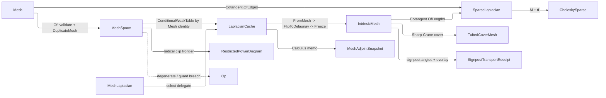

# [RASM_SUBSTRATE_MESH]

`Rasm.Meshing.mesh` owns the mesh substrate every DDG consumer composes: the validated `MeshSpace` snapshot, its `LaplacianCache` memoization, the intrinsic triangulation and `MeshLaplacian` assembly, and the topology, transport, and power-diagram witnesses. DEC operator assembly homes at `Meshing/dec`, reconstruction at `Meshing/reconstruct`, and every DDG solver at its owning `Processing/` page.

`MeshSpace`, `MeshAdjointSnapshot`, and `TopologyReceipt` are the public cross-package decode names the Geometry pages, the `Processing/receipts` route, and the `Rasm.Compute` adjoint seam bind.

## [01]-[INDEX]

- [02]-[MESH_SUBSTRATE]: snapshot admission, Laplacian memoization and assembly, the cotangent primitive, and the topology, transport, and power-diagram witnesses.

## [02]-[MESH_SUBSTRATE]

- Owner: `MeshSpace` `[BoundaryAdapter]` mints the validated defensive-snapshot handle; `MeshLaplacian` `[SmartEnum<int>]` selects the discretization and routes the owning cache memo; `LaplacianCache` mints the per-snapshot memoization service; `Cotangent` mints the one corner primitive both assembly paths, Crouzeix-Raviart pairs, and divergence scatter compose, and `MeshKernel.CotanEdgeWeightOf` the one `0.5(cot α + cot β)` edge weight the transport rows and `Meshing/dec` star-1 construction both read; `IntrinsicMesh`/`IntrinsicEdge` mint the mutable-build/frozen-read triangulation internal to the assembly; `MeshKernel` mints the substrate assembly kernel; `TuftedCoverMesh` mints the Sharp-Crane double cover; `RestrictedPowerDiagram`/`PowerCell`/`PowerFacet` mint the Laguerre diagram restricted to the mesh surface.
- Cases: `MeshLaplacian` rows `Cotangent`/`IntrinsicDelaunay`/`TuftedIntrinsic` carry the quality gate, triangulation law, cache memo, and kind-consistent intrinsic snapshot as row data, so no call site branches on row equality; `SignpostEncoding`, `SignpostGauge`, and `PowerDensityPolicy` carry their encoding, gauge, and fan-quadrature geometry the same way.
- Entry: `MeshSpace.Of` admits once (null gate, `Mesh.IsValid` gate, defensive `DuplicateMesh` snapshot) and fixes the assembly policy for the snapshot lifetime, so the ceiling and flip budget stay reachable knobs without per-call aliasing; `MeshSpace.Laplacian` is the one Laplacian entry, the kind row's delegate routing the cache memo and the cotangent row's quality-gate column routing the aspect-ratio guard while intrinsic kinds mollify; `MeshSpace.FaceNormals` is the one per-face normal read — the memoized unit-normal column over the native face roster, so a mesh-evidence consumer indexes faces without a native copy or a `ComputeFaceNormals` mutation; `MeshAdjointSnapshot.Of` projects the cached `DiscreteCalculus` for the adjoint seam; `MeshKernel.TopologyDetailed` is the total topology diagnostic; `MeshKernel.RestrictedPowerCells` is the power-diagram entry. One selector row owns each discretization, no per-kind assembly sibling.
- Auto: `LaplacianCache.For` resolves the per-snapshot cache; each memo swaps its `Atom<HashMap>` only on `Fin.Succ`, so a transient failure re-computes. Downstream solver artifacts ride the one type-keyed `Memoized` slot materialized from the `(TKey, T)` pair, so the substrate names no downstream type. Intrinsic assembly runs `FromMesh` → `FlipToDelaunay` → `Freeze` with the FLIP-N integer normal-coordinate update keeping the kernel integral and the parity invariant exact, and with signposts seeded over the input fan at `FromMesh` and maintained per flip, so the frozen snapshot's angles are the flipped triangulation's own and the input halfedge directions the overlay traces survive beside them; the tufted path builds the double cover, applies global Sharp-Crane mollification, flips to Delaunay, and admits only under the structural guards. Every degenerate-area floor is scale-derived from `DegenerateAreaFloorOf`, one owner.
- Receipt: `SparseLaplacian` carries the stiffness/mass/witness bundle under dimension-agreement claims; `TuftedLaplacianReceipt` witnesses the full cover construction with the cover-law conjunction as a claim row; `TopologyReceipt` is the total un-gated topology witness — every field is evidence and a new witness is one field — carrying the validated-genus derivation and its typed `(Euler, Genus, BoundaryComponents)` projection row; `SignpostTransportReceipt`, `CommonSubdivision`, and `RestrictedPowerReceipt` witness transport, overlay partition-of-unity, and radical-clip degeneracy. Every gated receipt is one `ValidityClaim.All` fold over the rails claim rows declaring which claims hold, never re-deriving a predicate inline; `TopologyReceipt` alone stays gate-free.
- Packages: RhinoCommon is a genuine Rhino boundary here per the Tier-0 capture law, never thinned; `Numerics/matrix` owns sparse assembly and the Cholesky factor, `Numerics/spectral` the `DiscreteCalculus` carrier, `Numerics/atoms` the projection and magnitude value objects, `Spatial/neighbors` the one k-NN substrate the power-incident seed rides rather than a private RTree, `Processing/geodesics` the one chart-unfolding `WalkChart` the overlay trace seats in `EdgeOverlay` mode rather than minting a second unfold; `Domain/rails` owns `Op` and the `ValidityClaim` fold, `Domain/context` the `Context`; Thinktecture.Runtime.Extensions, LanguageExt.Core, and BCL concurrency complete the floor.
- Growth: a fourth Laplacian discretization is one `MeshLaplacian` row, one cache memo, and one assembly member, every call site untouched; a new memoized solver artifact is zero cache edits — the owning page mints its key record and calls `Memoized`; a new signpost gauge, power-density model, or topology witness is one row or one field. Zero new public surface.
- Boundary: cache identity keys on the snapshot `Mesh` reference and memoizes success only — a keyed dictionary leaks across snapshot lifetimes and re-keys on value equality, so the `ConditionalWeakTable` is the load-bearing contract. `Cotangent` arithmetic lives in one owner and the edge weight over it in `CotanEdgeWeightOf`; a consumer re-deriving `(a·b)/(2A)`, the law-of-cosines form, or the half-sum of opposite cotangents inline re-opens the collapsed duplication. Face normals ride the memoized column the same way: a consumer duplicating the native to run `FaceNormals.ComputeFaceNormals` re-opens the per-consumer copy the column collapsed, and running it on the snapshot itself mutates a frozen mesh every cached reader aliases. `IntrinsicMesh` stays `internal` and the cross-package surface is `MeshAdjointSnapshot` carrying the public `DiscreteCalculus`, so no consumer mutates a frozen snapshot mid-cache. Aspect-ratio guard and intrinsic mollification are policy rows on `MeshAssemblyPolicy`/`TuftedCoverPolicy`, and `MeshAssemblyPolicy` travels on `MeshSpace.Of` one value per snapshot, so per-run variation means a fresh snapshot rather than a per-call knob aliasing the Unit-keyed memos. Two solver families sharing one `(key-record, artifact)` pair alias one `Memoized` slot, so every family declares its own key record beside its kernel. `PowerFacet` carries the SIGNED dual length and the UNCLAMPED radical foot `OffsetI`, both built from the weights the clip itself ran under, so the BNOT weight-Newton Hessian reads them rather than re-deriving a site distance; a clamped foot or an unsigned length mints a wrong-sign Newton step no residual catches. `A_ij == A_ji` holds because the canonical `(min, max)` key accumulates ONCE — the FIFO frontier reaches both cell views and the two clip SEQUENCES differ by ulps, so summing both would double every length. Euclidean k-NN seeds the power-incident set through `Spatial/neighbors`, so non-trivial weights can under-clip the k-th neighbour; the weighted security radius tests the farthest neighbour after the list exhausts, `KNearest` is a policy row, and the signed `IntegrationResidual`, the `NeighborFacetCount`-versus-`IncidentPairCount` gap, and `QueuePeakDepth` make any under-clip observable from two independent directions. Degenerate meshes route an `Op` fault over `Fin<T>`, never a throw.

```csharp signature
// --- [RUNTIME_PRELUDE] ----------------------------------------------------------------------
using System;
using System.Collections.Concurrent;
using System.Collections.Generic;
using System.Linq;
using System.Runtime.CompilerServices;
using System.Runtime.InteropServices;
using LanguageExt;
using Rasm.Domain;
using Rasm.Numerics;
using Rasm.Processing;
using Rasm.Spatial;
using Rhino;
using Rhino.Geometry;
using Thinktecture;
using static LanguageExt.Prelude;
// CS0104 guard: Rhino.Geometry declares Matrix/Dimension homonyms under the dual usings.
using Dimension = Rasm.Numerics.Dimension;

namespace Rasm.Meshing;

// --- [TYPES] --------------------------------------------------------------------------------
// Discretization differences are ROW DATA — no call site branches on row equality.
[SmartEnum<int>]
public sealed partial class MeshLaplacian {
    public static readonly MeshLaplacian Cotangent = new(key: 0, requiresQualityGate: true, preservesInputTriangulation: true,
        select: static (cache, key) => cache.Cotangent(key),
        snapshot: static (cache, key) => cache.EnsureFrozenIntrinsic(kind: MeshLaplacian.Cotangent, key: key));
    public static readonly MeshLaplacian IntrinsicDelaunay = new(key: 1, requiresQualityGate: false, preservesInputTriangulation: false,
        select: static (cache, key) => cache.IntrinsicDelaunay(key),
        snapshot: static (cache, key) => cache.IntrinsicMeshSnapshot(key: key));
    public static readonly MeshLaplacian TuftedIntrinsic = new(key: 2, requiresQualityGate: false, preservesInputTriangulation: false,
        select: static (cache, key) => cache.TuftedIntrinsic(key),
        snapshot: static (cache, key) => cache.TuftedIntrinsicMeshSnapshot(key: key));
    internal bool RequiresQualityGate { get; }
    internal bool PreservesInputTriangulation { get; }
    [UseDelegateFromConstructor] internal partial Fin<SparseLaplacian> Select(LaplacianCache cache, Op key);
    [UseDelegateFromConstructor] internal partial Fin<MeshKernel.IntrinsicMesh> Snapshot(LaplacianCache cache, Op key);
}

// The two encodings are INDEPENDENT halves of one transport pass: frames answer direction, normal coordinates answer
// crossing. Each row states which halves it measures, so the pass never branches on row equality and an unmeasured
// half rides an absent receipt slot rather than a zero.
[SmartEnum<int>]
public sealed partial class SignpostEncoding {
    public static readonly SignpostEncoding Signposts         = new(key: 0, carriesFrames: true,  carriesOverlay: false);
    public static readonly SignpostEncoding NormalCoordinates = new(key: 1, carriesFrames: false, carriesOverlay: true);
    public static readonly SignpostEncoding Both              = new(key: 2, carriesFrames: true,  carriesOverlay: true);
    internal bool CarriesFrames { get; }
    internal bool CarriesOverlay { get; }
}

// The gauge is the fan's reference halfedge, and it is a READ-time rotation: angles store from the structural fan
// start, so selecting a gauge subtracts one per-vertex constant. The row carries the selector, so no call site
// branches — LowestVertexNeighbor is the replay-stable choice, invariant under incident-edge insertion order.
[SmartEnum<int>]
public sealed partial class SignpostGauge {
    public static readonly SignpostGauge FirstHalfedge        = new(key: 0,
        reference: static (imesh, vertex) => imesh.FirstIncidentEdge(vertexIdx: vertex));
    public static readonly SignpostGauge LowestVertexNeighbor = new(key: 1,
        reference: static (imesh, vertex) => imesh.LowestNeighborEdge(vertexIdx: vertex));
    [UseDelegateFromConstructor] internal partial int ReferenceEdge(MeshKernel.IntrinsicMesh imesh, int vertex);
}

// ScalarFanQuadrature is EXACT P1, not a quadrature approximation: the three fan-triangle corner samples integrate a
// linear density in closed form against the simplex moments, so the row carries a node COUNT and no node fraction —
// an interior node placement would state a rule the closed form never runs, and every 3-node interior rule is weaker.
[SmartEnum<int>]
public sealed partial class PowerDensityPolicy {
    public static readonly PowerDensityPolicy Constant            = new(key: 0, requiresField: false, quadratureNodes: 0);
    public static readonly PowerDensityPolicy ScalarFanQuadrature = new(key: 1, requiresField: true, quadratureNodes: 3);
    internal bool RequiresField { get; }
    internal int QuadratureNodes { get; }
}

// --- [CONSTANTS] ----------------------------------------------------------------------------
// Policy rows, not consts; FIXED per snapshot at MeshSpace.Of — per-call variation aliases the Unit-keyed snapshot memos.
public readonly record struct MeshAssemblyPolicy(PositiveMagnitude AspectRatioCeiling, Dimension FlipCapPerEdge) {
    public static readonly MeshAssemblyPolicy Default = new(
        AspectRatioCeiling: PositiveMagnitude.Create(value: 11.5), FlipCapPerEdge: Dimension.Create(value: 16));
}

[BoundaryAdapter, StructLayout(LayoutKind.Auto)]
public readonly record struct TuftedCoverPolicy(
    PositiveMagnitude MollifyFactor, bool MollifyEnabled, PositiveMagnitude DelaunayTolerance,
    Dimension MaxFlipsPerEdge, UnitInterval EnergyScaleFactor, bool LaplacianReplace, bool MassReplace) {
    public static readonly TuftedCoverPolicy Default = new(
        MollifyFactor: PositiveMagnitude.Create(value: 1.0e-5), MollifyEnabled: true,
        DelaunayTolerance: PositiveMagnitude.Create(value: EpsilonPolicy.SqrtEpsilon),
        MaxFlipsPerEdge: Dimension.Create(value: 16), EnergyScaleFactor: UnitInterval.Create(value: 0.5),
        LaplacianReplace: true, MassReplace: true);
    public static Fin<TuftedCoverPolicy> Of(double mollifyFactor, bool mollifyEnabled, double delaunayTolerance,
        int maxFlipsPerEdge, double energyScaleFactor, bool laplacianReplace, bool massReplace, Op? key = null);
}

// The corner-angle clamp is Cotangent.AngleOfLengths's own and the degenerate-area floor is DegenerateAreaFloorOf's,
// each one owner already, so a mirrored row here would be a second spelling of a fixed law rather than a knob.
// Default encoding is Signposts: frames are what the DEC and connection consumers need, and the overlay is a
// separate, far heavier request a caller states rather than pays for on every assembly.
[BoundaryAdapter, StructLayout(LayoutKind.Auto)]
public readonly record struct SignpostPolicy(
    SignpostEncoding Encoding, Option<Dimension> TraceMaxIters, PositiveMagnitude VertexAngleRescaleFloor,
    SignpostGauge ReferenceDirectionGauge, bool CommonSubdivisionTriangulate) {
    public static readonly SignpostPolicy Default = new(
        Encoding: SignpostEncoding.Signposts, TraceMaxIters: Option<Dimension>.None,
        VertexAngleRescaleFloor: PositiveMagnitude.Create(value: EpsilonPolicy.SqrtEpsilon),
        ReferenceDirectionGauge: SignpostGauge.LowestVertexNeighbor, CommonSubdivisionTriangulate: true);
    // None = edge-derived cap; the record carries no zero-sentinel. Of maps a nonpositive boundary arg to None.
    internal int TraceCapFor(int edgeCount) => TraceMaxIters.Map(static cap => cap.Value).IfNone(noneValue: Math.Max(1, edgeCount) * 16);
    public static Fin<SignpostPolicy> Of(SignpostEncoding encoding, int traceMaxIters, double vertexAngleRescaleFloor,
        SignpostGauge referenceDirectionGauge, bool commonSubdivisionTriangulate, Op? key = null);
}

// Every clip threshold is scale-derived from the mesh bbox diagonal / mean edge, admitted once per run.
internal readonly record struct PowerClipPolicy(
    double ClipBand, double DenomFloor, double AreaFloor, double EdgeBand,
    int KNearest, int MinPolygonVertices, PowerDensityPolicy Density) {
    internal static Fin<PowerClipPolicy> Of(double diagonal, double meanEdge, PowerDensityPolicy density, Op key);
}

// --- [MODELS] -------------------------------------------------------------------------------
[BoundaryAdapter, StructLayout(LayoutKind.Auto)]
public readonly record struct MeshSpace {
    private MeshSpace(Mesh native, Context tolerance, MeshAssemblyPolicy assembly) { Native = native; Tolerance = tolerance; Assembly = assembly; }
    public static Fin<MeshSpace> Of(Mesh native, Context context, MeshAssemblyPolicy? assembly = null, Op? key = null) {
        Op op = key.OrDefault();
        return from active in Optional(native).ToFin(op.InvalidInput())
               from ctx in Optional(context).ToFin(op.MissingContext())
               from _ in guard(active.IsValid, op.InvalidInput())
               let snapshot = active.DuplicateMesh()
               select new MeshSpace(native: snapshot, tolerance: ctx, assembly: assembly ?? MeshAssemblyPolicy.Default);
    }
    public Context Tolerance { get; }
    public MeshAssemblyPolicy Assembly { get; }
    internal Mesh Native { get; }
    internal LaplacianCache Cache => LaplacianCache.For(space: this);
    public Mesh DuplicateNative() => Native.DuplicateMesh();
    public Fin<SparseLaplacian> Laplacian(MeshLaplacian kind, Op? key = null) =>
        MeshKernel.LaplacianOf(space: this, kind: kind, key: key.OrDefault());
    // The one per-face normal read: the memoized unit-normal column over the NATIVE face roster, quads on their own index.
    public Fin<Arr<Vector3d>> FaceNormals(Op? key = null) => Cache.FaceNormals(key: key.OrDefault());
}

[BoundaryAdapter, StructLayout(LayoutKind.Auto)]
public readonly record struct SparseLaplacian(
    SparseMatrix Stiffness, SparseMatrix MassConsistent, Arr<double> MassLumped,
    int SkippedDegenerateFaces = 0, Option<TuftedLaplacianReceipt> Tufted = default, int NegativeCotangentCount = 0) : IValidityEvidence {
    public bool IsValid => ValidityClaim.All(
        ValidityClaim.CountExactly(count: Stiffness.Rows.Value, expected: Stiffness.Cols.Value),
        ValidityClaim.CountExactly(count: MassConsistent.Rows.Value, expected: Stiffness.Rows.Value),
        ValidityClaim.CountExactly(count: MassConsistent.Cols.Value, expected: Stiffness.Cols.Value),
        ValidityClaim.CountExactly(count: MassLumped.Count, expected: Stiffness.Rows.Value),
        ValidityClaim.CountAtLeast(count: SkippedDegenerateFaces, floor: 0),
        ValidityClaim.CountAtLeast(count: NegativeCotangentCount, floor: 0),
        ValidityClaim.Of(Tufted.Map(static receipt => receipt.IsValid).IfNone(noneValue: true)));
}

// Cover-construction witness: measure/count claims plus the cover-law conjunction as a claim row.
[BoundaryAdapter, StructLayout(LayoutKind.Auto)]
public readonly record struct TuftedLaplacianReceipt(
    MeshLaplacian Kind, int OriginalVertices, int OriginalFaces, int IntrinsicVertices, int IntrinsicEdges,
    int IntrinsicFaces, int CoverFaces, int CoverEdges, int BoundaryEdges, int NonManifoldEdges,
    bool GluingMapIsBijection, int GluingSymmetryViolations, bool CoverIsEdgeManifold, bool CoverIsClosed,
    double MollificationEpsilon, int DegenerateTriangleCount, double LengthScaleH, double MinTriangleInequalitySlack,
    int IntrinsicFlips, int NonDelaunayEdgesRemaining, bool MaxFlipsHit, double MinCotanEdgeWeight,
    double MinBoundaryEdgeWeight, int NegativeWeightCount, double MinLumpedMass, double TotalCoveredArea,
    double EnergyScaleApplied, double SymmetryResidual, double RowSumResidual, int DroppedNonTriangleFaces,
    bool CoverAware, bool CollapsedToOriginalVertices) : IValidityEvidence {
    public bool IsValid => ValidityClaim.All(
        ValidityClaim.CountAtLeast(count: OriginalFaces, floor: IntrinsicFaces + DroppedNonTriangleFaces),
        ValidityClaim.Nonnegative(MollificationEpsilon), ValidityClaim.Positive(LengthScaleH),
        ValidityClaim.CountAtLeast(count: DegenerateTriangleCount, floor: 0), ValidityClaim.CountAtLeast(count: IntrinsicFlips, floor: 0),
        ValidityClaim.Finite(SymmetryResidual), ValidityClaim.Finite(RowSumResidual), ValidityClaim.Nonnegative(TotalCoveredArea),
        ValidityClaim.Positive(EnergyScaleApplied),
        ValidityClaim.Of(!CoverAware || (CoverFaces == 2 * IntrinsicFaces && GluingMapIsBijection && GluingSymmetryViolations == 0
            && CoverIsEdgeManifold && CoverIsClosed && NonDelaunayEdgesRemaining == 0 && !MaxFlipsHit
            && SymmetryResidual <= EpsilonPolicy.SqrtEpsilon && RowSumResidual <= EpsilonPolicy.SqrtEpsilon && MinLumpedMass > 0.0
            && MinCotanEdgeWeight >= -EpsilonPolicy.SqrtEpsilon && MinBoundaryEdgeWeight >= -EpsilonPolicy.SqrtEpsilon)),
        ValidityClaim.Of(!CollapsedToOriginalVertices || IntrinsicVertices == OriginalVertices));
}

// Build intermediate for the tufted snapshot only — never a cross-page surface.
[StructLayout(LayoutKind.Auto)]
internal readonly record struct TuftedBaseFaces(Mesh Triangulated, int TriangleCount, int DroppedNonTriangleFaces) : IValidityEvidence {
    public bool IsValid => ValidityClaim.All(
        ValidityClaim.Of(Triangulated is { IsValid: true }),
        ValidityClaim.CountAtLeast(count: TriangleCount, floor: 1),
        ValidityClaim.CountAtLeast(count: DroppedNonTriangleFaces, floor: 0));
    internal static Fin<TuftedBaseFaces> Of(Mesh source, Op key);   // quad-convert once; any residual non-triangle fails
}

[BoundaryAdapter, StructLayout(LayoutKind.Auto)]
public readonly record struct TopologyReceipt(
    int Vertices, int TopologyVertices, int TopologyEdges, int Faces, int Triangles, int Quads, int Ngons,
    int VisiblePolygons, int BoundaryComponents, int NonManifoldEdges, bool HasBoundary, bool IsClosed, bool IsSolid,
    bool IsWatertight, bool IsManifold, bool IsOriented, int EulerCharacteristic, Option<int> Genus, bool EulerValidated) {
    internal Fin<TOut> Project<TOut>(Op key) {
        TopologyReceipt self = this;
        return AtomProjection.Rows<TopologyReceipt, TOut>(self: self, key: key,
            ProjectionRow.Of<(int Euler, int Genus, int BoundaryComponents)>(() => self.Genus.Match(
                Some: genus => Fin.Succ((self.EulerCharacteristic, genus, self.BoundaryComponents)),
                None: () => Fin.Fail<(int Euler, int Genus, int BoundaryComponents)>(key.InvalidResult()))),
            // Genus-tolerant total row: un-gated over non-manifold/boundaried/odd-Euler meshes; Genus stays Option, no sentinel.
            ProjectionRow.Of<(int Euler, int BoundaryComponents, bool IsManifold, bool IsOriented, int NonManifoldEdges, Option<int> Genus)>(() =>
                Fin.Succ((self.EulerCharacteristic, self.BoundaryComponents, self.IsManifold, self.IsOriented, self.NonManifoldEdges, self.Genus))));
    }
}

// PUBLIC cross-package adjoint handle — Rasm.Compute GeometryTape carries THIS, never the internal IntrinsicMesh.
public sealed record MeshAdjointSnapshot(DiscreteCalculus Calculus, int VertexCount, int EdgeCount, int FaceCount) {
    public static Fin<MeshAdjointSnapshot> Of(MeshSpace space, Op? key = null) =>
        space.Cache.Calculus(key: key.OrDefault())
            .Map(dec => new MeshAdjointSnapshot(Calculus: dec,
                VertexCount: dec.D0.Cols.Value, EdgeCount: dec.D0.Rows.Value, FaceCount: dec.D1.Rows.Value));
}

// The frame half and the overlay half are measured independently, so each rides its own optional slot: an encoding
// that took no frame pass carries None rather than a zero transported count reading as a total frame loss.
[StructLayout(LayoutKind.Auto)]
public readonly record struct SignpostFrameFacts(
    int TransportedEdgeCount, int ChordFallbackEdges, int MissingFrameEdges,
    double MaxAngleRadians, double MaxLengthResidual, double MaxSignpostUpdateResidual);

// ExactCommonSubdivision is DERIVED — the overlay is exact exactly when it ran, its recovered crossing count equals
// the normal-coordinate sum, and the integer kernel never lost parity; a stored bit beside those three facts is a
// desynchronizable duplicate.
[StructLayout(LayoutKind.Auto)]
public readonly record struct SignpostTransportReceipt(
    SignpostEncoding Encoding, int VertexCount, int IntrinsicEdgeCount, int IntrinsicFlipCount,
    int NormalCoordinateParityErrors, int SumNormalCoordinates, bool IntrinsicSnapshot,
    Option<SignpostFrameFacts> Frames, Option<int> CommonSubdivisionSegments, Option<int> TracedPathEdgeCount,
    Option<CommonSubdivision> Subdivision = default) : IValidityEvidence {
    public bool ExactCommonSubdivision =>
        Subdivision.IsSome && NormalCoordinateParityErrors == 0
        && CommonSubdivisionSegments.Map(segments => segments == SumNormalCoordinates).IfNone(noneValue: false);
    public bool IsValid {
        get {
            int edgeCount = IntrinsicEdgeCount;
            return ValidityClaim.All(
                ValidityClaim.Of(Encoding is not null),
                ValidityClaim.Of(Encoding.CarriesFrames == Frames.IsSome),
                ValidityClaim.Of(Encoding.CarriesOverlay == Subdivision.IsSome),
                ValidityClaim.Of(Subdivision.IsSome == CommonSubdivisionSegments.IsSome),
                ValidityClaim.Of(Subdivision.IsSome == TracedPathEdgeCount.IsSome),
                ValidityClaim.Of(Frames.Map(f =>
                    ValidityClaim.CountAtLeast(count: edgeCount, floor: f.TransportedEdgeCount + f.MissingFrameEdges).Holds
                    && ValidityClaim.CountAtLeast(count: f.TransportedEdgeCount, floor: f.ChordFallbackEdges).Holds
                    && ValidityClaim.Finite(f.MaxAngleRadians).Holds && ValidityClaim.Finite(f.MaxLengthResidual).Holds
                    && ValidityClaim.Finite(f.MaxSignpostUpdateResidual).Holds).IfNone(noneValue: true)),
                ValidityClaim.Of(Subdivision.IsNone || ExactCommonSubdivision),
                ValidityClaim.Of(Subdivision.Map(static sub => sub.IsValid).IfNone(noneValue: true)),
                ValidityClaim.CountAtLeast(count: SumNormalCoordinates, floor: 0),
                ValidityClaim.Of(IntrinsicSnapshot));
        }
    }
}

// Partition-of-unity gate: every interpolation row sums to 1.0 within SqrtEpsilon (identity rows exactly, crossing rows
// (1-u)+u, face rows the three barycentrics); the arrival residual is the A-versus-B disagreement of one subdivision
// edge's length measured in each source triangulation, +inf when a transverse edge failed to recover its crossings.
// The three element counts close in the overlay's OWN arithmetic against the intrinsic census and the two integer
// sums the slicing produced — SumNormalCoordinates over edges, CornerCrossingSum over faces — so a census that drifted
// from the slicing is refused rather than published: nV = |V_T| + sum n+_e, nE = sum_e (n+_e + 1) + sum_f (c+e),
// nF = sum_f (c + e + 1), with CornerCrossingSum the per-face (c_i + c_j + c_k + e_i + e_j + e_k) total.
[StructLayout(LayoutKind.Auto)]
public readonly record struct CommonSubdivision(
    int SourceVertexCount, int SourceEdgeCount, int SourceFaceCount, int SumNormalCoordinates, int CornerCrossingSum,
    int SubdivisionVertexCount, int SubdivisionEdgeCount, int SubdivisionFaceCount,
    Arr<int> SourceFaceA, Arr<int> SourceFaceB, SparseMatrix InterpolationA, SparseMatrix InterpolationB,
    double RowSumResidualA, double RowSumResidualB, double EdgeLengthInterpolationResidual) : IValidityEvidence {
    public bool IsValid => ValidityClaim.All(
        ValidityClaim.CountExactly(count: SubdivisionVertexCount, expected: SourceVertexCount + SumNormalCoordinates),
        ValidityClaim.CountExactly(count: SubdivisionEdgeCount, expected: SourceEdgeCount + SumNormalCoordinates + CornerCrossingSum),
        ValidityClaim.CountExactly(count: SubdivisionFaceCount, expected: SourceFaceCount + CornerCrossingSum),
        ValidityClaim.CountExactly(count: InterpolationA.Rows.Value, expected: SubdivisionVertexCount),
        ValidityClaim.CountExactly(count: InterpolationB.Rows.Value, expected: SubdivisionVertexCount),
        ValidityClaim.CountExactly(count: InterpolationA.Cols.Value, expected: InterpolationB.Cols.Value),
        ValidityClaim.CountExactly(count: SourceFaceA.Count, expected: SubdivisionFaceCount),
        ValidityClaim.CountExactly(count: SourceFaceB.Count, expected: SubdivisionFaceCount),
        ValidityClaim.Of(RowSumResidualA <= EpsilonPolicy.SqrtEpsilon),
        ValidityClaim.Of(RowSumResidualB <= EpsilonPolicy.SqrtEpsilon),
        ValidityClaim.Finite(EdgeLengthInterpolationResidual));
}

// Length is the SIGNED dual measure — magnitude the accumulated cut-segment length, sign the orientation of the dual
// edge against (p_i' -> p_j'), so a negative entry flags a site the pair is about to hide; the BNOT weight-Newton
// Hessian reads it directly (H_ij = -0.5*Length/l_ij off-diagonal, H_ii = +0.5*sum_j Length/l_ij), and an unsigned
// magnitude there mints a wrong-sign Newton step no residual catches.
// OffsetI is the radical foot 0.5*(l_ij + (w_i - w_j)/l_ij) along p_i' -> p_j', built from the SAME weights the clip
// ran under, so it is never stale — and it stays UNCLAMPED: a foot outside [0, l_ij] is the geometric signature of a
// dominated site, and clamping it into the segment silently corrupts the dual step that reads it.
[BoundaryAdapter, StructLayout(LayoutKind.Auto)]
public readonly record struct PowerFacet(int SiteI, int SiteJ, double Length, double OffsetI, Point3d Centroid) : IValidityEvidence {
    public bool IsValid => ValidityClaim.All(
        ValidityClaim.Of(SiteI != SiteJ), ValidityClaim.Finite(Length), ValidityClaim.Finite(OffsetI), ValidityClaim.Finite(Centroid));
}

[BoundaryAdapter, StructLayout(LayoutKind.Auto)]
public readonly record struct PowerCell(
    int Site, int FragmentCount, double Area, double Mass, Point3d Barycenter, double TransportCost, bool Empty) : IValidityEvidence {
    public bool IsValid => ValidityClaim.All(
        ValidityClaim.Of(Empty == (Mass <= 0.0)), ValidityClaim.Of(Empty || Barycenter.IsValid),
        ValidityClaim.CountAtLeast(count: FragmentCount, floor: 0), ValidityClaim.Nonnegative(Area), ValidityClaim.Finite(TransportCost));
}

// The two degeneracy tallies count different refusals and never collapse: ClipDegeneracyCount is DenomFloor hits —
// a crossing whose radical denominator vanished and took the t = 0.5 midpoint — while DegenerateClipCount is fragment
// rejections at MinPolygonVertices or AreaFloor. BoundarySiteCount is the sites owning at least one fragment on a
// naked-edge-incident face. IntegrationResidual = TotalArea - SurfaceArea stays SIGNED, positive diagnosing under-clip.
[BoundaryAdapter, StructLayout(LayoutKind.Auto)]
public readonly record struct RestrictedPowerReceipt(
    int SiteCount, int ClippedTriangleCount, int FragmentCount, int IncidentPairCount, int QueuePeakDepth,
    double FragmentAreaMin, double FragmentAreaMax, double TotalArea, double SurfaceArea, double IntegrationResidual,
    int FirstMomentFiniteCount, int NeighborFacetCount, int EmptyCellCount, int BoundarySiteCount,
    int DegenerateClipCount, int ClipDegeneracyCount, int NonFiniteDensityRejectionCount,
    double AreaTolerance, double LengthTolerance, int KNearest, PowerDensityPolicy Density) : IValidityEvidence {
    public bool IsValid => ValidityClaim.All(
        ValidityClaim.CountAtLeast(count: SiteCount, floor: 1), ValidityClaim.CountAtLeast(count: KNearest, floor: 1),
        ValidityClaim.Ordered(lower: FragmentAreaMin, upper: FragmentAreaMax),
        ValidityClaim.CountAtLeast(count: FragmentCount, floor: FirstMomentFiniteCount),
        ValidityClaim.CountAtLeast(count: SiteCount, floor: EmptyCellCount), ValidityClaim.CountAtLeast(count: SiteCount, floor: BoundarySiteCount),
        ValidityClaim.CountAtLeast(count: DegenerateClipCount, floor: 0), ValidityClaim.CountAtLeast(count: ClipDegeneracyCount, floor: 0),
        ValidityClaim.CountAtLeast(count: NonFiniteDensityRejectionCount, floor: 0),
        ValidityClaim.Nonnegative(TotalArea), ValidityClaim.Nonnegative(SurfaceArea), ValidityClaim.Finite(IntegrationResidual),
        ValidityClaim.Positive(AreaTolerance), ValidityClaim.Positive(LengthTolerance));
}

[BoundaryAdapter, StructLayout(LayoutKind.Auto)]
public readonly record struct RestrictedPowerDiagram(Arr<PowerCell> Cells, Arr<PowerFacet> Facets, RestrictedPowerReceipt Receipt) : IValidityEvidence {
    public bool IsValid => ValidityClaim.All(
        ValidityClaim.CountExactly(count: Cells.Count, expected: Receipt.SiteCount),
        ValidityClaim.CountExactly(count: Cells.Filter(static cell => cell.Empty).Count, expected: Receipt.EmptyCellCount),
        ValidityClaim.CountExactly(count: Facets.Count, expected: Receipt.NeighborFacetCount),
        ValidityClaim.Evidence(Receipt));
    internal Fin<TOut> Project<TOut>(Op key) {
        RestrictedPowerDiagram self = this;
        return AtomProjection.Rows<RestrictedPowerDiagram, TOut>(self: self, key: key,
            ProjectionRow.Of<Arr<PowerCell>>(() => Fin.Succ(self.Cells)),
            ProjectionRow.Of<Arr<PowerFacet>>(() => Fin.Succ(self.Facets)),
            ProjectionRow.Of<RestrictedPowerReceipt>(() => Fin.Succ(self.Receipt)),
            ProjectionRow.Of<Seq<Point3d>>(() => Fin.Succ(toSeq(
                self.Cells.AsIterable().Filter(static cell => !cell.Empty).Map(static cell => cell.Barycenter)))));
    }
}

// --- [SERVICES] -----------------------------------------------------------------------------
// Cache dies with its snapshot via ConditionalWeakTable GC; the CSparse factor Lock lives on CholeskySparse, never here.
internal sealed class LaplacianCache {
    internal const int DefaultSpectralCount = 32;
    private static readonly ConditionalWeakTable<object, LaplacianCache> Table = [];
    private sealed class Memo<TKey, T> {
        private readonly Atom<HashMap<TKey, T>> cache = Atom(value: HashMap<TKey, T>());
        internal Fin<T> Of(TKey probe, Func<Fin<T>> compute) =>
            cache.Value.Find(key: probe).Map(static value => Fin.Succ(value)).IfNone(() =>
                compute().Match(
                    Succ: value => { _ = cache.Swap(f: map => map.AddOrUpdate(key: probe, value: value)); return Fin.Succ(value); },
                    Fail: Fin.Fail<T>));
        internal bool Contains(TKey probe) => cache.Value.ContainsKey(key: probe);
    }
    private readonly Memo<Unit, Arr<Vector3d>> faceNormals = new();
    private readonly Memo<Unit, SparseLaplacian> cotangent = new(), intrinsicDelaunay = new();
    private readonly Memo<TuftedCoverPolicy, SparseLaplacian> tuftedIntrinsic = new();
    private readonly Memo<Unit, CholeskySparse> cholesky = new();
    private readonly Memo<Unit, SpectralBasisBundle> defaultSpectral = new();
    private readonly Memo<Unit, DiscreteCalculus> calculus = new();
    private readonly Memo<Unit, MeshKernel.IntrinsicMesh> intrinsicMesh = new(), tuftedIntrinsicMesh = new();
    private readonly Memo<MeshLaplacian, MeshKernel.IntrinsicMesh> frozenIntrinsic = new();
    private readonly Memo<(int Symmetry, double Time), CholeskySparse> connectionCholesky = new();
    private readonly Memo<double, CholeskySparse> scalarHeatCholesky = new();
    private readonly Memo<double, EdgeConnectionFactor> edgeConnectionCholesky = new();
    // ONE open slot for every downstream solver artifact — materializes from the (TKey, T) pair, so a new family is ZERO cache edits.
    // Key records and carriers stay beside their owning kernels; the cache names no Processing-tier type.
    private readonly ConcurrentDictionary<(Type Key, Type Value), object> solverSlots = new();
    private readonly Lazy<double> meanEdgeLength;
    private readonly MeshSpace space;
    private LaplacianCache(MeshSpace space) {
        this.space = space;
        meanEdgeLength = new Lazy<double>(valueFactory: () => MeshKernel.MeanEdgeLengthOf(mesh: space.Native));
    }
    internal static LaplacianCache For(MeshSpace space) =>
        Table.GetValue(key: space.Native, createValueCallback: _ => new LaplacianCache(space: space));
    internal double MeanEdgeLength => meanEdgeLength.Value;
    // (mean edge)^2 * SqrtEpsilon gated at ZeroTolerance; travels on the owning receipt.
    internal double SpdMassShift =>
        Math.Max(MeanEdgeLength, EpsilonPolicy.ZeroTolerance) * Math.Max(MeanEdgeLength, EpsilonPolicy.ZeroTolerance) * EpsilonPolicy.SqrtEpsilon;
    internal Fin<Arr<Vector3d>> FaceNormals(Op key) =>
        faceNormals.Of(probe: unit, compute: () => MeshKernel.FaceNormalsOf(mesh: space.Native, key: key));
    internal Fin<SparseLaplacian> Cotangent(Op key) =>
        cotangent.Of(probe: unit, compute: () => MeshKernel.AssembleCotangent(mesh: space.Native, key: key));
    internal Fin<SparseLaplacian> IntrinsicDelaunay(Op key) =>
        intrinsicDelaunay.Of(probe: unit, compute: () =>
            from imesh in IntrinsicMeshSnapshot(key: key)
            from laplacian in MeshKernel.AssembleCotangentFromIntrinsic(imesh: imesh, key: key)
            select laplacian);
    internal Fin<SparseLaplacian> TuftedIntrinsic(Op key) => TuftedIntrinsic(policy: TuftedCoverPolicy.Default, key: key);
    internal Fin<SparseLaplacian> TuftedIntrinsic(TuftedCoverPolicy policy, Op key) =>
        tuftedIntrinsic.Of(probe: policy, compute: () =>
            from imesh in TuftedIntrinsicMeshSnapshot(key: key)
            from laplacian in MeshKernel.AssembleTuftedCotangentFromIntrinsic(imesh: imesh, policy: policy, key: key)
            select laplacian);
    internal Fin<CholeskySparse> Cholesky(Op key) =>
        cholesky.Of(probe: unit, compute: () =>
            from laplacian in IntrinsicDelaunay(key: key)
            from spd in MeshKernel.AssembleMassStiffnessSystem(laplacian: laplacian, massScale: SpdMassShift, stiffnessScale: 1.0, key: key)
            from factor in CholeskySparse.Of(symmetric: spd, key: key)
            select factor);
    internal Fin<DiscreteCalculus> Calculus(Op key) =>
        calculus.Of(probe: unit, compute: () => DecAssembly.Build(space: space, key: key));
    internal Fin<MeshKernel.IntrinsicMesh> IntrinsicMeshSnapshot(Op key) =>
        intrinsicMesh.Of(probe: unit, compute: () => MeshKernel.BuildIntrinsicMesh(mesh: space.Native, assembly: space.Assembly, key: key));
    internal Fin<MeshKernel.IntrinsicMesh> TuftedIntrinsicMeshSnapshot(Op key) =>
        tuftedIntrinsicMesh.Of(probe: unit, compute: () =>
            from baseFaces in TuftedBaseFaces.Of(source: space.Native, key: key)
            from imesh in MeshKernel.BuildIntrinsicMesh(mesh: baseFaces.Triangulated, assembly: space.Assembly, key: key)
            select imesh);
    internal Fin<MeshKernel.IntrinsicMesh> EnsureFrozenIntrinsic(MeshLaplacian kind, Op key) =>
        frozenIntrinsic.Of(probe: kind, compute: () => MeshKernel.FrozenIntrinsicFor(mesh: space.Native, kind: kind, assembly: space.Assembly, key: key));
    internal Fin<SpectralBasisBundle> SpectralBasisBundleOf(int k, Op key);      // <=32 truncates the shared memo; larger recomputes
    // edgeAdjustment.IsSome BYPASSES the memo — an adjusted connection factor cached under (symmetry, time) would alias
    // across different cone prescriptions; only the unadjusted factor memoizes.
    internal Fin<CholeskySparse> ConnectionCholesky(int symmetry, double time, Option<Arr<double>> edgeAdjustment, Op key);
    internal Fin<CholeskySparse> ScalarHeatCholesky(double time, Op key);
    internal Fin<EdgeConnectionFactor> EdgeConnectionCholeskyDetailed(double time, Op key);
    // One distinct key-record type per solver family — two sharing a (TKey, T) pair alias one slot.
    internal Fin<T> Memoized<TKey, T>(TKey probe, Func<Fin<T>> compute) where TKey : notnull =>
        ((Memo<TKey, T>)solverSlots.GetOrAdd(key: (typeof(TKey), typeof(T)), valueFactory: static _ => new Memo<TKey, T>()))
            .Of(probe: probe, compute: compute);
}

// --- [OPERATIONS] ---------------------------------------------------------------------------
// Intrinsic path: law of cosines over 4A. Extrinsic path: dot over 2A. Corner angle shared.
internal static class Cotangent {
    internal static double OfLengths(double adjacent1, double adjacent2, double opposite, double area) =>
        ((adjacent1 * adjacent1) + (adjacent2 * adjacent2) - (opposite * opposite)) / (4.0 * area);
    internal static double OfEdges(Vector3d u, Vector3d v, double twoArea) => u * v / twoArea;
    internal static double AngleOfLengths(double opposite, double adjacent1, double adjacent2) {
        double denom = 2.0 * adjacent1 * adjacent2;
        double cos = denom > EpsilonPolicy.ZeroTolerance
            ? ((adjacent1 * adjacent1) + (adjacent2 * adjacent2) - (opposite * opposite)) / denom : 1.0;
        return Math.Acos(d: Math.Clamp(value: cos, min: -1.0, max: 1.0));
    }
}

internal static class MeshKernel {
    // Per-face triplet accumulator: symmetric stiffness stencil, consistent + lumped mass, skip/negative witnesses.
    private sealed class LaplacianTriplets {
        internal LaplacianTriplets(int vertexCount);
        internal int SkippedDegenerateFaces;
        internal int NegativeCotangentCount;
        internal void AddTriangle(int va, int vb, int vc, double area, double cotA, double cotB, double cotC);
        internal Fin<SparseLaplacian> Build(Op key);                 // SparseMatrix.FromTriplets x2 + lumped Arr
    }

    // --- [SELECTION_SPD]
    internal static Fin<SparseLaplacian> LaplacianOf(MeshSpace space, MeshLaplacian kind, Op key) =>
        from active in Optional(kind).ToFin(key.InvalidInput())
        from _ in active.RequiresQualityGate
            ? AspectRatioGuard(mesh: space.Native, ceiling: space.Assembly.AspectRatioCeiling.Value, key: key)
            : Fin.Succ(unit)
        from result in active.Select(cache: space.Cache, key: key)
        select result;
    internal static Fin<SparseMatrix> AssembleMassStiffnessSystem(SparseLaplacian laplacian, double stiffnessScale, Op key, double massScale = 1.0) {
        int n = laplacian.Stiffness.Rows.Value;
        if (n == 0) return Fin.Fail<SparseMatrix>(key.InvalidInput());
        List<(int Row, int Col, double Value)> triplets = MatrixKernel.SparseTripletsOf(matrix: laplacian.Stiffness, capacityBonus: n, scale: stiffnessScale);
        for (int i = 0; i < n; i++) triplets.Add(item: (i, i, massScale * laplacian.MassLumped[index: i]));
        Dimension dim = Dimension.Create(value: n);
        return SparseMatrix.FromTriplets(rows: dim, cols: dim, triplets: triplets, key: key);
    }
    internal static Fin<Unit> AspectRatioGuard(Mesh mesh, double ceiling, Op key);   // Caution fault above the policy row

    // --- [COTANGENT_ASSEMBLY] — extrinsic path over face geometry; one scale-derived degenerate floor.
    // Quad faces split through the exact Kernels.QuadDiagonal gate; Faces.ConvertQuadsToTriangles is the rejected float heuristic.
    internal static Fin<SparseLaplacian> AssembleCotangent(Mesh mesh, Op key) {
        using Mesh active = mesh.DuplicateMesh();
        for (int f = 0; f < active.Faces.Count; f++) {
            MeshFace quad = active.Faces[index: f];
            if (!quad.IsQuad) continue;
            (Point3d qa, Point3d qb, Point3d qc, Point3d qd) = (active.Vertices[index: quad.A], active.Vertices[index: quad.B], active.Vertices[index: quad.C], active.Vertices[index: quad.D]);
            bool ac = Kernels.QuadDiagonal(a: qa, b: qb, c: qc, d: qd);
            if (!active.Faces.SetFace(index: f, vertex1: quad.A, vertex2: quad.B, vertex3: ac ? quad.C : quad.D)) return Fin.Fail<SparseLaplacian>(key.InvalidResult());
            if (active.Faces.AddFace(vertex1: ac ? quad.A : quad.B, vertex2: quad.C, vertex3: quad.D) < 0) return Fin.Fail<SparseLaplacian>(key.InvalidResult());
        }
        LaplacianTriplets triplets = new(vertexCount: active.Vertices.Count);
        double floor = DegenerateAreaFloorOf(scale: MeanEdgeLengthOf(mesh: active));
        for (int f = 0; f < active.Faces.Count; f++) {
            MeshFace face = active.Faces[index: f];
            if (!face.IsTriangle) continue;
            Point3d pa = active.Vertices[index: face.A]; Point3d pb = active.Vertices[index: face.B]; Point3d pc = active.Vertices[index: face.C];
            Vector3d ab = pb - pa; Vector3d ac = pc - pa; Vector3d bc = pc - pb;
            double area = 0.5 * Vector3d.CrossProduct(a: ab, b: ac).Length;
            if (area < floor) { triplets.SkippedDegenerateFaces++; continue; }
            double twoArea = 2.0 * area;
            double cotA = Cotangent.OfEdges(u: -ab, v: -ac, twoArea: twoArea);
            double cotB = Cotangent.OfEdges(u: ab, v: -bc, twoArea: twoArea);
            double cotC = Cotangent.OfEdges(u: ac, v: bc, twoArea: twoArea);
            triplets.NegativeCotangentCount += (cotA < 0.0 ? 1 : 0) + (cotB < 0.0 ? 1 : 0) + (cotC < 0.0 ? 1 : 0);
            triplets.AddTriangle(va: face.A, vb: face.B, vc: face.C, area: area, cotA: cotA, cotB: cotB, cotC: cotC);
        }
        return triplets.Build(key: key);
    }
    // Intrinsic path over frozen edge lengths: Heron area, Cotangent.OfLengths per corner, the SAME LaplacianTriplets
    // accumulator as the extrinsic path — SkippedDegenerateFaces counts against the scale-derived floor,
    // NegativeCotangentCount counts from the emitted weights, and lumped mass accrues AreaOfFace/3 per corner, so
    // both MeshLaplacian intrinsic rows terminate in one assembly and its witnesses ride SparseLaplacian unchanged.
    internal static Fin<SparseLaplacian> AssembleCotangentFromIntrinsic(IntrinsicMesh imesh, Op key) {
        LaplacianTriplets triplets = new(vertexCount: imesh.VertexCount);
        double mean = Enumerable.Range(start: 0, count: imesh.EdgeCount).Average(selector: i => imesh.EdgeAt(index: i).Length);
        double floor = DegenerateAreaFloorOf(scale: mean);
        foreach (int f in imesh.LiveFaceIndices()) {
            (int a, int b, int c) = imesh.Triangles[index: f]!.Value;
            (double lab, double lbc, double lca) = (imesh.EdgeLengthOf(i: a, j: b), imesh.EdgeLengthOf(i: b, j: c), imesh.EdgeLengthOf(i: c, j: a));
            double area = imesh.AreaOfFace(faceIdx: f);
            if (area < floor) { triplets.SkippedDegenerateFaces++; continue; }
            double cotA = Cotangent.OfLengths(adjacent1: lab, adjacent2: lca, opposite: lbc, area: area);
            double cotB = Cotangent.OfLengths(adjacent1: lab, adjacent2: lbc, opposite: lca, area: area);
            double cotC = Cotangent.OfLengths(adjacent1: lca, adjacent2: lbc, opposite: lab, area: area);
            triplets.NegativeCotangentCount += (cotA < 0.0 ? 1 : 0) + (cotB < 0.0 ? 1 : 0) + (cotC < 0.0 ? 1 : 0);
            triplets.AddTriangle(va: a, vb: b, vc: c, area: area, cotA: cotA, cotB: cotB, cotC: cotC);
        }
        return triplets.Build(key: key);
    }
    internal static Fin<SparseLaplacian> AssembleTuftedCotangentFromIntrinsic(IntrinsicMesh imesh, TuftedCoverPolicy policy, Op key) =>
        TuftedCoverMesh.Construct(imesh: imesh, policy: policy, key: key).Bind(cover => cover.Assemble(policy: policy, key: key));

    // --- [IDT_AND_INTRINSIC]
    internal static Fin<IntrinsicMesh> BuildIntrinsicMesh(Mesh mesh, MeshAssemblyPolicy assembly, Op key) =>
        from source in IntrinsicMesh.FromMesh(mesh: mesh, key: key)
        from flipped in FlipToDelaunay(imesh: source, assembly: assembly, key: key)
        select flipped.Freeze();
    // PreservesInputTriangulation column: cotangent keeps the input triangulation; Delaunay/tufted kinds run the IDT flip.
    internal static Fin<IntrinsicMesh> FrozenIntrinsicFor(Mesh mesh, MeshLaplacian kind, MeshAssemblyPolicy assembly, Op key) =>
        kind.PreservesInputTriangulation
            ? IntrinsicMesh.FromMesh(mesh: mesh, key: key).Map(static source => source.Freeze())
            : BuildIntrinsicMesh(mesh: mesh, assembly: assembly, key: key);
    // Deterministic (Lo, Hi)-ascending seed order makes the flip sequence replay-stable across runs and runtimes.
    // Each flip re-queues only the four edges of the two rebuilt faces, and the per-edge budget bounds a cycling
    // pathological metric. The TERMINAL re-check proves the invariant instead of trusting the queue's exit.
    private static Fin<IntrinsicMesh> FlipToDelaunay(IntrinsicMesh imesh, MeshAssemblyPolicy assembly, Op key) {
        int cap = assembly.FlipCapPerEdge.Value;
        Dictionary<(int Lo, int Hi), int> spent = new(capacity: imesh.EdgeCount);
        HashSet<(int Lo, int Hi)> queued = new(capacity: imesh.EdgeCount);
        Queue<(int Lo, int Hi)> pending = new(capacity: imesh.EdgeCount);
        foreach ((int lo, int hi) in Enumerable.Range(start: 0, count: imesh.EdgeCount)
                     .Select(imesh.EdgeAt).Where(static edge => edge.IsInterior)
                     .Select(static edge => (edge.Lo, edge.Hi))
                     .OrderBy(static edge => edge.Lo).ThenBy(static edge => edge.Hi)) {
            if (queued.Add((lo, hi))) pending.Enqueue((lo, hi));
        }
        while (pending.Count > 0) {
            (int i, int j) = pending.Dequeue();
            _ = queued.Remove((i, j));
            if (!imesh.IsInterior(i: i, j: j) || imesh.IsDelaunay(i: i, j: j)) continue;
            ref int budget = ref CollectionsMarshal.GetValueRefOrAddDefault(dictionary: spent, key: (i, j), exists: out _);
            if (budget >= cap) continue;
            budget++;
            foreach ((int a, int b) in imesh.Flip(i: i, j: j))
                if (imesh.IsInterior(i: a, j: b) && queued.Add((a, b))) pending.Enqueue((a, b));
        }
        // Budget-exhausted remainders are EVIDENCE, not failures: the cap exists to bound a pathological metric,
        // and AssembleCotangentFromIntrinsic carries the count onto SparseLaplacian.NegativeCotangentCount. A parity
        // error is different in kind — the integer kernel has lost its invariant, so nothing downstream is trustable.
        // This refusal lands BEFORE any overlay build by construction: the triforce branch of the face slicing divides
        // (n_ij - n_jk + n_ki) by two, and an odd corner coordinate makes that numerator odd and the split unrecoverable.
        return imesh.ParityErrorCount is 0
            ? Fin.Succ(imesh)
            : Fin.Fail<IntrinsicMesh>(key.InvalidResult(detail: $"idt-parity:{imesh.ParityErrorCount}"));
    }

    [StructLayout(LayoutKind.Auto)]
    internal readonly record struct IntrinsicEdge(int Lo, int Hi, double Length, int Face0, int Face1, int NormalCoord = -1) {
        internal bool IsInterior => Face1 >= 0;
        internal bool IsOriginalEdge => NormalCoord < 0;
        internal int Crossings => Math.Max(val1: NormalCoord, val2: 0);
    }

    // Mutable during FromMesh/Flip, frozen for every reader. INTERNAL — the public handle is MeshAdjointSnapshot.
    internal sealed class IntrinsicMesh {
        internal int VertexCount;
        internal Point3d[] Positions;
        internal readonly List<(int A, int B, int C)?> Triangles;
        internal readonly Dictionary<(int Lo, int Hi), (double Length, List<int> FaceIdx, int Normal)> EdgeData;
        internal bool HasFlips;
        internal int OriginalFaceCount;
        internal int DroppedNonTriangleFaces;
        internal int FlipCount;
        internal int ParityErrorCount;
        internal int BoundaryEdgeCount;
        internal int NonManifoldEdgeCount;
        // Signpost state, seeded at FromMesh and maintained through every Flip so the frozen snapshot's angles are the
        // flipped triangulation's own. UNSCALED by construction: SignpostAngle is the running corner sum from the
        // vertex's structural fan start, VertexAngleSum is the metric cone angle Theta_v — flip-INVARIANT, because a
        // diagonal replace moves no vertex — and both the 2pi/Theta (pi at a boundary vertex) rescale and the
        // SignpostGauge rotation are read-time projections, so a gauge change costs one subtraction, never a re-walk.
        internal double[] SignpostAngle;                     // 2*EdgeCount halfedges: 2*edge + (tail == Lo ? 0 : 1)
        internal double[] VertexAngleSum;
        internal bool[] ChordFallbackVertex;                 // the SET, not a tally — the transport fold reads it per edge
        internal int MissingFrameHalfedges;
        internal double MaxSignpostUpdateResidual;
        // The INPUT triangulation's halfedge directions and lengths, frozen at seed and never rewritten: a flip
        // replaces an edge at the same index, so the live array cannot answer where an input edge pointed. This is
        // the overlay trace's whole ingress — without it a flipped snapshot has no input-edge direction left to trace.
        internal readonly Dictionary<(int Lo, int Hi), (double AtLo, double AtHi, double Length)> SeedHalfedges;
        internal bool IsFrozen { get; }
        internal int EdgeCount { get; }
        internal int LiveFaceCount { get; }
        internal int SumNormalCoordinates { get; }
        internal int TransverseEdgeCount { get; }
        internal static Fin<IntrinsicMesh> FromMesh(Mesh mesh, Op key);      // topology, lengths, then SeedSignposts
        internal int AddTriangle(int a, int b, int c, double lAB, double lBC, double lAC, int normalAB = -1, int normalBC = -1, int normalCA = -1);
        internal IntrinsicMesh Freeze();
        internal IntrinsicEdge EdgeAt(int index);
        internal int IndexOfEdge(int lo, int hi);
        internal int[] EdgesOfFace(int faceIdx);
        internal double AreaOfFace(int faceIdx);
        internal int FirstIncidentEdge(int vertexIdx);
        internal int LowestNeighborEdge(int vertexIdx);      // incident edge of least other-endpoint index — insertion-order invariant
        internal IEnumerable<int> LiveFaceIndices();
        internal int OppositeVertex(int faceIdx, int i, int j);
        internal int FaceAcrossEdge(int faceIdx, int i, int j);
        internal bool IsInterior(int i, int j);
        internal bool IsInteriorVertex(int vertex);
        internal double EdgeLengthOf(int i, int j);
        internal int NormalCoordOf(int i, int j);
        internal bool IsDelaunay(int i, int j);              // cos-sum >= -SqrtEpsilon via Cotangent.AngleOfLengths terms
        internal Seq<(int, int)> Flip(int i, int j);         // diagonal replace + FlipNormalCoordinate + FlipSignposts

        // --- [HALFEDGE_ADDRESSING] — the directed reads the fan orbit and the flip update run on.
        internal int HalfedgeOf(int tail, int tip);          // 2*IndexOfEdge + side; -1 when the pair is not an edge
        internal int FaceOf(int tail, int tip);              // the incident face whose winding runs tail->tip; -1 at a boundary
        internal int ThirdVertex(int faceIdx, int a, int b); // the corner of faceIdx that is neither a nor b
        internal double CornerAngleAt(int faceIdx, int vertex) {
            (int a, int b, int c) = Triangles[index: faceIdx]!.Value;
            (int left, int right) = vertex == a ? (b, c) : vertex == b ? (c, a) : (a, b);
            return Cotangent.AngleOfLengths(opposite: EdgeLengthOf(i: left, j: right),
                adjacent1: EdgeLengthOf(i: vertex, j: left), adjacent2: EdgeLengthOf(i: vertex, j: right));
        }
        // CW-most incident (tip, face) pair: an interior vertex starts at FirstIncidentEdge and its Face0, a boundary
        // vertex starts at the incident boundary edge whose CCW step enters a live face, so one wedge walk covers the ring.
        private (int Tip, int Face) FanSeedOf(int vertex);

        // --- [SIGNPOSTS] — Sharp-Soliman-Crane CCW fan seed. Each halfedge stores the running UNSCALED corner sum;
        // the orbit step next().next().twin() is exactly ThirdVertex-then-FaceAcrossEdge, which is why a fan ordered
        // this way survives every flip. A non-interior step BREAKS — that terminator is the boundary wedge — and an
        // INTERIOR fan that fails to close is a chord-fallback vertex: it takes no partial rescale, because a
        // truncated Theta_v is wrong for every halfedge in that ring, not just the missing one.
        internal void SeedSignposts() {
            SignpostAngle = new double[2 * EdgeCount];
            VertexAngleSum = new double[VertexCount];
            ChordFallbackVertex = new bool[VertexCount];
            for (int v = 0; v < VertexCount; v++) {
                (int firstTip, int face) = FanSeedOf(vertex: v);
                if (firstTip < 0 || face < 0) { ChordFallbackVertex[v] = true; continue; }
                (int tip, double running, bool closed) = (firstTip, 0.0, false);
                for (int step = 0; step <= LiveFaceCount && face >= 0; step++) {
                    int he = HalfedgeOf(tail: v, tip: tip);
                    if (he < 0) { MissingFrameHalfedges++; break; }
                    SignpostAngle[he] = running;
                    running += CornerAngleAt(faceIdx: face, vertex: v);
                    tip = ThirdVertex(faceIdx: face, a: v, b: tip);
                    face = FaceAcrossEdge(faceIdx: face, i: v, j: tip);
                    if (tip != firstTip) continue;
                    closed = true; break;
                }
                // An interior ring that never closed has a TRUNCATED cone angle, so no halfedge in it may rescale —
                // the whole vertex routes to the chord fallback rather than publishing a partial 2pi/Theta.
                if (IsInteriorVertex(vertex: v) && !closed) { ChordFallbackVertex[v] = true; continue; }
                VertexAngleSum[v] = running;
                foreach (int tipIdx in NeighborsOf(vertex: v))
                    SeedHalfedges[key: (Math.Min(v, tipIdx), Math.Max(v, tipIdx))] = SeedHalfedgeRowOf(vertex: v, tip: tipIdx);
            }
        }
        private int[] NeighborsOf(int vertex);
        // Both directed angles plus the shared length, written once per undirected pair from whichever endpoint the
        // sweep reaches second, so a pair whose other endpoint fell back keeps the reachable half.
        private (double AtLo, double AtHi, double Length) SeedHalfedgeRowOf(int vertex, int tip);
        // Paper 3.3.1 updateAngleFromCWNeighor. A halfedge with no interior face carries the boundary wedge's LAST
        // angle Theta_v; one whose twin has no interior face carries the wedge's FIRST angle 0; otherwise the angle is
        // the CW neighbour's plus that neighbour's corner, standardized into one turn (no wrap at a boundary vertex,
        // which cannot turn around). MaxSignpostUpdateResidual is the wrap MAGNITUDE before the fmod — the amount the
        // incremental chain ran past a full turn, which a from-scratch fan can never report.
        private void UpdateAngleFromCwNeighbor(int tail, int tip) {
            int he = HalfedgeOf(tail: tail, tip: tip);
            if (he < 0) { MissingFrameHalfedges++; return; }
            (int face, int twinFace) = (FaceOf(tail: tail, tip: tip), FaceOf(tail: tip, tip: tail));
            if (face < 0) { SignpostAngle[he] = VertexAngleSum[tail]; return; }
            if (twinFace < 0) { SignpostAngle[he] = 0.0; return; }
            int cwHe = HalfedgeOf(tail: tail, tip: ThirdVertex(faceIdx: twinFace, a: tail, b: tip));
            if (cwHe < 0) { MissingFrameHalfedges++; return; }
            double raw = SignpostAngle[cwHe] + CornerAngleAt(faceIdx: twinFace, vertex: tail);
            double sum = VertexAngleSum[tail];
            double standardized = IsInteriorVertex(vertex: tail) && sum > EpsilonPolicy.ZeroTolerance ? raw % sum : raw;
            MaxSignpostUpdateResidual = Math.Max(val1: MaxSignpostUpdateResidual, val2: Math.Abs(value: raw - standardized));
            SignpostAngle[he] = standardized;
        }
        // The four flip sites are the new diagonal's two halfedges and the two new faces' bases; this model stores no
        // per-face frame — the transport read derives it from the two halfedge angles — so the face-basis sites are
        // structurally absent and the angle pair is the whole update. VertexAngleSum stands: Theta_v is metric.
        private void FlipSignposts(int k, int l) {
            UpdateAngleFromCwNeighbor(tail: k, tip: l);
            UpdateAngleFromCwNeighbor(tail: l, tip: k);
        }

        // --- [NORMAL_COORDINATES] (FLIP-N) — Gillespie-Sharp-Crane Eq. (3) for the new diagonal kl, argument order
        // matching the quad (ejk, eki above ij; eil, elj below). Reference edges carry n = -1, so n^-_ij is the
        // along-edge arc count and every coordinate enters through its positive part. The half-integer corner
        // coordinate c is DOUBLED, which clears the only division; the whole expression is then QUADRUPLED because
        // the two cross-edge terms are half-absolute-differences, and the answer divides out by an arithmetic shift.
        private int FlipNormalCoordinate(int nij, int njk, int nki, int nil, int nlj) {
            int alongIJ = -Math.Min(val1: nij, val2: 0);      // n^-_ij : 1 when an input edge runs along ij
            (nij, njk, nki, nil, nlj) = (Math.Max(val1: nij, val2: 0), Math.Max(val1: njk, val2: 0),
                Math.Max(val1: nki, val2: 0), Math.Max(val1: nil, val2: 0), Math.Max(val1: nlj, val2: 0));

            int eIlj = Math.Max(val1: nlj - nij - nil, val2: 0), eJil = Math.Max(val1: nil - nlj - nij, val2: 0);
            int eLji = Math.Max(val1: nij - nil - nlj, val2: 0), eIjk = Math.Max(val1: njk - nki - nij, val2: 0);
            int eJki = Math.Max(val1: nki - nij - njk, val2: 0), eKij = Math.Max(val1: nij - njk - nki, val2: 0);

            int cIlj = -(Math.Min(val1: nlj - nij - nil, val2: 0) + eJil + eLji);
            int cJil = -(Math.Min(val1: nil - nlj - nij, val2: 0) + eIlj + eLji);
            int cLji = -(Math.Min(val1: nij - nil - nlj, val2: 0) + eIlj + eJil);
            int cIjk = -(Math.Min(val1: njk - nki - nij, val2: 0) + eJki + eKij);
            int cJki = -(Math.Min(val1: nki - nij - njk, val2: 0) + eIjk + eKij);
            int cKij = -(Math.Min(val1: nij - njk - nki, val2: 0) + eIjk + eJki);

            int quadrupled = (2 * cLji) + (2 * cKij)
                           + Math.Abs(value: cJil - cJki) + Math.Abs(value: cIlj - cIjk)   // the cross-edge pair
                           - (2 * eLji) - (2 * eKij)
                           + (4 * (eIlj + eIjk + eJil + eJki));

            // INVARIANT guard, complete over the defect class: all three doubled corner coordinates of one face share
            // that face's parity word, so cLji carries the lower face's and cKij the upper's, and either odd means a
            // face violates (n_ab + n_bc + n_ca + e_a + e_b + e_c) mod 2 == 0 — a mis-oriented gluing across ij.
            // ARITHMETIC guard, the strict subset it subsumes: exactly one face odd makes the doubled answer odd, so
            // the shift below would truncate a half-integer. Both are spelled because they refuse different things —
            // one the invariant, one the return's exactness — and a defective flip counts once.
            bool parityViolated = ((cLji | cKij) & 1) != 0;
            bool answerNonIntegral = (quadrupled & 3) == 2;
            if (parityViolated || answerNonIntegral) ParityErrorCount++;
            // Two's complement makes & and >> exact for a negative quadrupled: the mask reads the non-negative
            // residue and the arithmetic shift equals division whenever the residue is zero.
            return (quadrupled >> 2) + alongIJ;
        }
    }

    // Sharp-Crane double cover. Front sheet 2t, orientation-reversed back sheet 2t+1; every base edge's incident
    // half-edge fan glues into ONE cyclic chain (front-to-back at a boundary edge), so the cover is closed and
    // edge-manifold whatever the base's manifoldness. GLOBAL mollification adds one epsilon to EVERY cover edge —
    // per-edge mollification would break the gluing's length agreement across sheets.
    internal sealed class TuftedCoverMesh {
        internal static Fin<TuftedCoverMesh> Construct(IntrinsicMesh imesh, TuftedCoverPolicy policy, Op key);
        //  (1) Emit 2·LiveFaceCount cover faces: face t keeps its (a,b,c) winding, face t+LiveFaceCount reverses to
        //      (a,c,b). Vertices are SHARED — the cover collapses to the original vertex set, which is exactly the
        //      receipt's CollapsedToOriginalVertices claim.
        //  (2) For each base edge, order its incident half-edges by FaceAcrossEdge and glue them into one cyclic
        //      chain, front sheet forward and back sheet reverse; a boundary edge closes front-to-back. Record
        //      GluingMapIsBijection and GluingSymmetryViolations from the chain walk itself.
        //  (3) MollificationEpsilon = max over cover corners of the triangle-inequality DEFICIT
        //      max(0, lOpp - lA - lB), scaled by policy.MollifyFactor and applied to EVERY cover edge at once when
        //      policy.MollifyEnabled. MinTriangleInequalitySlack witnesses the post-mollification margin.
        //  (4) FlipToDelaunay over the cover under policy.MaxFlipsPerEdge; NonDelaunayEdgesRemaining and MaxFlipsHit
        //      witness the outcome, and the receipt's cover-law conjunction requires BOTH zero.
        internal Fin<SparseLaplacian> Assemble(TuftedCoverPolicy policy, Op key);
        //  (5) Cotangent.OfLengths per cover corner into the vertex-indexed stiffness; every base vertex accumulates
        //      from BOTH sheets, which is the whole point — the cover's Laplacian is SPD where the base's is not.
        //  (6) Scale the assembled energy by policy.EnergyScaleFactor (0.5 by default: each base triangle appears
        //      twice), and take LaplacianReplace/MassReplace as the substitution rows into SparseLaplacian.
        //  (7) SymmetryResidual = max |L[i,j] - L[j,i]|, RowSumResidual = max |Σ_j L[i,j]|; the receipt gates both
        //      at EpsilonPolicy.SqrtEpsilon, so an assembly that drifted is refused rather than published.
    }

    // --- [METRICS]
    internal static double MeanEdgeLengthOf(Mesh mesh);
    // ONE per-face unit-normal column over the NATIVE face roster — quads keep their own index, so face evidence
    // downstream (draft, resting, overhang censuses) indexes the same roster the locus and spatial reads share.
    // The read composes the Faces/Vertices rosters into openNURBS's own row arithmetic 0.5*(C-A)x(D-B) — D == C on
    // a triangle collapses it to the triangle cross — unitized per row; FaceNormals.ComputeFaceNormals is the
    // REJECTED spelling because it MUTATES the frozen snapshot mid-cache, and a consumer-side DuplicateNative just
    // to run it re-opens the per-consumer copy this memo collapses. The quad form is the vector area, and the
    // vector area is SPLIT-INVARIANT: it equals the area-weighted triangle-normal sum under EITHER
    // Kernels.QuadDiagonal outcome, so the column agrees with the exact quad split without running it. A zero-area
    // face's row stays Vector3d.Zero under the failed unitize — observable, and every consumer floor already skips it.
    internal static Fin<Arr<Vector3d>> FaceNormalsOf(Mesh mesh, Op key);
    // ONE scale-relative degenerate floor: max(scale, ZeroTolerance)^2 * SqrtEpsilon — the same form SpdMassShift uses.
    internal static double DegenerateAreaFloorOf(double scale) =>
        Math.Max(scale, EpsilonPolicy.ZeroTolerance) * Math.Max(scale, EpsilonPolicy.ZeroTolerance) * EpsilonPolicy.SqrtEpsilon;
    // Total diagnostic; validated genus only when manifold+oriented and the Euler numerator is even>=0.
    internal static Fin<TopologyReceipt> TopologyDetailed(MeshSpace space) {
        Mesh mesh = space.Native;
        bool manifold = mesh.IsManifold(topologicalTest: true, isOriented: out bool oriented, hasBoundary: out bool hasBoundary);
        int euler = mesh.TopologyVertices.Count - mesh.TopologyEdges.Count + mesh.Faces.Count;
        (int boundaryComponents, int nonManifoldEdges) = TopologyEdgeStatsOf(mesh: mesh);
        bool closed = mesh.IsClosed; bool solid = mesh.IsSolid;
        bool watertight = closed && solid && manifold && nonManifoldEdges == 0;
        int components = Math.Max(val1: 1, val2: mesh.DisjointMeshCount);
        int numerator = (2 * components) - boundaryComponents - euler;
        bool hasGenus = manifold && oriented && numerator >= 0 && numerator % 2 == 0;
        return Fin.Succ(new TopologyReceipt(
            Vertices: mesh.Vertices.Count, TopologyVertices: mesh.TopologyVertices.Count, TopologyEdges: mesh.TopologyEdges.Count,
            Faces: mesh.Faces.Count, Triangles: mesh.Faces.TriangleCount, Quads: mesh.Faces.QuadCount, Ngons: mesh.Ngons.Count,
            VisiblePolygons: mesh.GetNgonAndFacesCount(), BoundaryComponents: boundaryComponents, NonManifoldEdges: nonManifoldEdges,
            HasBoundary: hasBoundary || boundaryComponents > 0, IsClosed: closed, IsSolid: solid, IsWatertight: watertight,
            IsManifold: manifold, IsOriented: oriented, EulerCharacteristic: euler,
            Genus: hasGenus ? Some(numerator / 2) : Option<int>.None, EulerValidated: hasGenus));
    }
    private static (int BoundaryComponents, int NonManifoldEdges) TopologyEdgeStatsOf(Mesh mesh);   // GetNakedEdges + >2-face edges

    // --- [SIGNPOST_TRANSPORT] — the READ side of the seeded, flip-maintained signpost state.
    // The stored angle is unscaled, so one projection applies both the gauge rotation and the cone rescale:
    //   theta~(tail -> tip) = (turn_v / Theta_v) * ((SignpostAngle[he] - SignpostAngle[gauge_v]) mod Theta_v)
    // with turn_v = 2pi at an interior vertex and pi at a boundary vertex, exactly the augmented angle of the paper.
    // Callers reach this only past the framed test below, which is where Theta_v <= VertexAngleRescaleFloor refuses.
    private static double ScaledAngleOf(IntrinsicMesh imesh, int tail, int tip, SignpostPolicy policy) {
        double sum = imesh.VertexAngleSum[tail];
        int gaugeEdge = policy.ReferenceDirectionGauge.ReferenceEdge(imesh: imesh, vertex: tail);
        IntrinsicEdge gauge = imesh.EdgeAt(index: gaugeEdge);
        double origin = imesh.SignpostAngle[imesh.HalfedgeOf(tail: tail, tip: gauge.Lo == tail ? gauge.Hi : gauge.Lo)];
        double raw = imesh.SignpostAngle[imesh.HalfedgeOf(tail: tail, tip: tip)] - origin;
        double turn = imesh.IsInteriorVertex(vertex: tail) ? 2.0 * Math.PI : Math.PI;
        return turn / sum * (raw < 0.0 ? raw + sum : raw);
    }
    // ONE cotangent edge weight owner: 0.5*(cot alpha + cot beta) over the two opposite corners, absent face
    // contributing zero. Meshing/dec's star-1 construction reads THIS — a page-local re-derivation is the twin.
    internal static double CotanEdgeWeightOf(IntrinsicMesh imesh, IntrinsicEdge edge);

    [StructLayout(LayoutKind.Auto)]
    internal readonly record struct TransportFrames(Seq<(int I, int J, double Weight, double Rho)> Rows, SignpostFrameFacts Facts);

    // One pass over intrinsic edges. An edge is FRAMED when both endpoints closed their fan and carry a cone angle
    // past the rescale floor; an endpoint the seed marked chord-fallback routes its incident edges to the embedded
    // chord direction instead, counted and never partially rescaled.
    // Rho closes in the angles alone: with vecA = l*e^(i*thetaA) and vecB = l*e^(i*thetaB), unit(-vecB/vecA) is
    // e^(i*(thetaB - thetaA + pi)), so the lengths cancel and no complex division runs; the cone adjustment is
    // already inside both reads because each is the 2pi/Theta-rescaled angle. MaxLengthResidual is zero on every
    // framed edge by construction and picks up exactly the chord-fallback gap — which is its whole job as a drift witness.
    private static Fin<TransportFrames> TransportFramesOf(IntrinsicMesh imesh, SignpostPolicy policy, Op key) {
        double floor = policy.VertexAngleRescaleFloor.Value;
        List<(int I, int J, double Weight, double Rho)> rows = new(capacity: imesh.EdgeCount);
        (int fallback, int missing, double maxAngle, double maxLength) = (0, 0, 0.0, 0.0);
        for (int e = 0; e < imesh.EdgeCount; e++) {
            IntrinsicEdge edge = imesh.EdgeAt(index: e);
            bool rescalable = imesh.VertexAngleSum[edge.Lo] > floor && imesh.VertexAngleSum[edge.Hi] > floor
                && imesh.HalfedgeOf(tail: edge.Lo, tip: edge.Hi) >= 0 && imesh.HalfedgeOf(tail: edge.Hi, tip: edge.Lo) >= 0;
            bool chord = imesh.ChordFallbackVertex[edge.Lo] || imesh.ChordFallbackVertex[edge.Hi];
            if (!rescalable && !chord) { missing++; continue; }
            (double thetaA, double thetaB) = chord
                ? (ChordAngleOf(imesh: imesh, tail: edge.Lo, tip: edge.Hi, policy: policy), ChordAngleOf(imesh: imesh, tail: edge.Hi, tip: edge.Lo, policy: policy))
                : (ScaledAngleOf(imesh: imesh, tail: edge.Lo, tip: edge.Hi, policy: policy), ScaledAngleOf(imesh: imesh, tail: edge.Hi, tip: edge.Lo, policy: policy));
            // Symmetric wrap into (-pi, pi] as one expression — the transport rotation's principal argument.
            double raw = thetaB - thetaA + Math.PI;
            double rho = raw - (2.0 * Math.PI * Math.Floor(d: (raw + Math.PI) / (2.0 * Math.PI)));
            rows.Add(item: (edge.Lo, edge.Hi, CotanEdgeWeightOf(imesh: imesh, edge: edge), rho));
            fallback += chord ? 1 : 0;
            maxAngle = Math.Max(val1: maxAngle, val2: Math.Abs(value: rho));
            maxLength = Math.Max(val1: maxLength, val2: chord
                ? Math.Abs(value: imesh.Positions[edge.Lo].DistanceTo(other: imesh.Positions[edge.Hi]) - edge.Length) : 0.0);
        }
        return rows.Count == 0 && imesh.EdgeCount > 0
            ? Fin.Fail<TransportFrames>(key.InvalidResult(detail: $"signpost-frames:{missing}"))
            : Fin.Succ(new TransportFrames(Rows: toSeq(rows),
                Facts: new SignpostFrameFacts(TransportedEdgeCount: rows.Count, ChordFallbackEdges: fallback,
                    MissingFrameEdges: missing, MaxAngleRadians: maxAngle, MaxLengthResidual: maxLength,
                    MaxSignpostUpdateResidual: imesh.MaxSignpostUpdateResidual)));
    }
    // Embedded-chord direction for a ring the fan could not close: the chord projected into the vertex's
    // area-weighted normal plane, measured from the gauge neighbour's projected chord. No rescale factor applies.
    private static double ChordAngleOf(IntrinsicMesh imesh, int tail, int tip, SignpostPolicy policy);

    // ONE transport pass per request. Encoding rows decide which halves run; neither half branches on row equality,
    // an unmeasured half is absent, and both the receipt-only entry and the row seam read this single fold — a
    // receipt built beside a second frame pass would report a run the rows did not come from.
    private static Fin<(Option<TransportFrames> Frames, SignpostTransportReceipt Receipt)> TransportOf(MeshSpace space, IntrinsicMesh imesh, SignpostPolicy policy, Op key) =>
        from _ in guard(imesh is { IsFrozen: true, SignpostAngle: not null }, key.InvalidInput())
        from frames in policy.Encoding.CarriesFrames
            ? TransportFramesOf(imesh: imesh, policy: policy, key: key).Map(Some)
            : Fin.Succ(Option<TransportFrames>.None)
        from overlay in policy.Encoding.CarriesOverlay
            ? BuildCommonSubdivision(space: space, imesh: imesh, policy: policy, key: key).Map(Some)
            : Fin.Succ(Option<CommonSubdivision>.None)
        select (frames, new SignpostTransportReceipt(
            Encoding: policy.Encoding, VertexCount: imesh.VertexCount, IntrinsicEdgeCount: imesh.EdgeCount,
            IntrinsicFlipCount: imesh.FlipCount, NormalCoordinateParityErrors: imesh.ParityErrorCount,
            SumNormalCoordinates: imesh.SumNormalCoordinates, IntrinsicSnapshot: imesh.IsFrozen,
            Frames: frames.Map(static f => f.Facts),
            CommonSubdivisionSegments: overlay.Map(static sub => sub.SumNormalCoordinates),
            TracedPathEdgeCount: overlay.Map(static sub => sub.SourceEdgeCount),
            Subdivision: overlay));
    internal static Fin<SignpostTransportReceipt> SignpostTransportReceiptOf(MeshSpace space, IntrinsicMesh imesh, Op key, Option<SignpostPolicy> policy = default) =>
        TransportOf(space: space, imesh: imesh, policy: policy.IfNone(noneValue: SignpostPolicy.Default), key: key)
            .Map(static transport => transport.Receipt);
    // Transport-row seam: (i<j, weight, rho) per intrinsic edge, cone-adjusted — the same rows the cached connection
    // Cholesky assembles from. The edge adjustment is a per-edge additive rotation the cone prescription supplies, so
    // an adjusted run is the SAME rows with rho shifted — never a second transport pass.
    [StructLayout(LayoutKind.Auto)] internal readonly record struct ConnectionEntries(Seq<(int I, int J, double Weight, double Rho)> Rows, SignpostTransportReceipt Receipt);
    internal static Fin<ConnectionEntries> ConnectionEntriesOf(MeshSpace space, IntrinsicMesh imesh, Option<Arr<double>> edgeAdjustment, SignpostPolicy policy, Op key) =>
        from transport in TransportOf(space: space, imesh: imesh, policy: policy, key: key)
        from frames in transport.Frames.ToFin(key.Unsupported(geometryType: typeof(SignpostEncoding), outputType: typeof(ConnectionEntries)))
        from adjusted in edgeAdjustment.Match(
            Some: shift => guard(shift.Count == frames.Rows.Count, key.InvalidInput()).ToFin().Map(_ => frames.Rows.Map(
                (row, index) => (row.I, row.J, row.Weight, Rho: row.Rho + shift[index: index]))),
            None: () => Fin.Succ(frames.Rows))
        select new ConnectionEntries(Rows: adjusted, Receipt: transport.Receipt);

    // --- [COMMON_SUBDIVISION] — overlay(M,T): shared vertices plus one crossing vertex per normal-coordinate unit.
    // A flip-only triangulation inserts NO vertices, so every intrinsic vertex is a shared VERTEX_VERTEX point and
    // the inserted EDGE_VERTEX / FACE_VERTEX arms cannot inhabit this owner — the point family closes at two cases.
    [Union]
    internal abstract partial record OverlayPoint {
        private OverlayPoint() { }
        internal sealed record SharedCase(int Vertex) : OverlayPoint;
        // The input edge is named by its ORDERED vertex pair, never by an index: both triangulations share the vertex
        // set, while a flip reuses an intrinsic edge index, so an index into the input roster goes stale on the first
        // flip and a pair cannot. ParameterA runs along TailA -> TipA, ParameterB from the cut edge's own Lo.
        internal sealed record CrossingCase(int TailA, int TipA, double ParameterA, int EdgeB, double ParameterB) : OverlayPoint;
    }

    private static Fin<CommonSubdivision> BuildCommonSubdivision(MeshSpace space, IntrinsicMesh imesh, SignpostPolicy policy, Op key) {
        // (1) Shared vertices first, so a crossing's slot indices are stable against the point roster.
        List<OverlayPoint> points = [.. Enumerable.Range(start: 0, count: imesh.VertexCount)
            .Select(static v => (OverlayPoint)new OverlayPoint.SharedCase(Vertex: v))];
        // (2) Preallocate each intrinsic edge's crossing list BY NORMAL COORDINATE — endpoints at 0 and n+1, the
        //     iB-th interior crossing at slot iB+1. The preallocation is what makes a missed crossing a HARD error:
        //     a short list would pass every sweep, a null slot cannot.
        OverlayPoint?[][] alongB = new OverlayPoint?[imesh.EdgeCount][];
        for (int e = 0; e < imesh.EdgeCount; e++) {
            IntrinsicEdge edge = imesh.EdgeAt(index: e);
            alongB[e] = new OverlayPoint?[edge.Crossings + 2];
            (alongB[e][0], alongB[e][edge.Crossings + 1]) = (points[index: edge.Lo], points[index: edge.Hi]);
        }
        // (3) Trace every INPUT edge across the intrinsic triangulation and fill the slots. The walk is the one
        //     chart-unfolding owner in EdgeOverlay mode — crossings recorded, vertex snapping suppressed so a grazing
        //     pass cannot swallow one — seated from the input halfedge's FROZEN angle, stopped at the far input
        //     vertex, and capped by the policy's trace budget (edge-derived when TraceMaxIters is None). An input
        //     edge is traced ONCE from its canonical tail, so the crossing ORDER along the input edge is canonical by
        //     construction and the paper's per-halfedge reversal has nothing left to reverse. What still needs a
        //     canonical direction is the slot index along the CUT edge: the reference indexes it combinatorially and
        //     flips iB to n+ - iB - 1 on a negatively-oriented halfedge, and the equivalent here is that ParameterB
        //     is measured from the cut edge's OWN Lo endpoint, so ascending parameter IS ascending slot. Reading a
        //     face-local exit parameter instead reverses one edge's whole ordering while every count still agrees.
        GeodesicTracePolicy trace = GeodesicTracePolicy.Default with { MaxSteps = Dimension.Create(value: policy.TraceCapFor(edgeCount: imesh.EdgeCount)) };
        List<(int Edge, double Parameter, OverlayPoint Point)> crossings = [];
        foreach (((int Lo, int Hi) pair, (double AtLo, double AtHi, double Length) seed) in imesh.SeedHalfedges) {
            (int face, int va, int vb, int vc, double seatAngle) = OverlaySeatOf(imesh: imesh, tail: pair.Lo, inputAngle: seed.AtLo, policy: policy);
            // The overlay seats in chart coordinates alone, so the walk's world-direction slot carries Unset — it is
            // echoed onto the trace and never read here, and a fabricated direction would read as measured evidence.
            GeodesicKernel.ExpTrace walk = GeodesicKernel.WalkChart(imesh: imesh, startFace: face, va: va, vb: vb, vc: vc,
                seatAngle: seatAngle, seatedWorldDir: Vector3d.Unset, traceLength: seed.Length,
                mode: GeodesicKernel.GeodesicWalkMode.EdgeOverlay, stopAtVertex: pair.Hi, policy: trace);
            if (!walk.ReachedStopVertex) return Fin.Fail<CommonSubdivision>(key.InvalidResult(detail: $"overlay-trace:{pair.Lo}-{pair.Hi}"));
            // CORRECTION over even spacing: the parameter along the INPUT edge is the GEOMETRIC crossing position,
            // recovered by accumulating chart-segment arc length and normalizing the whole run to [0,1]. Even
            // spacing t_k = (k+1)/(c+1) yields a valid TOPOLOGY with wrong geometry and makes the length residual
            // measure nothing, because both interpolations then reproduce the same fiction.
            Arr<double> tA = RecoverTraceParameters(walk: walk, imesh: imesh);
            for (int iC = 0; iC < walk.Crossings.Count; iC++) {
                (int cutEdge, double u) = walk.Crossings[index: iC];
                crossings.Add(item: (cutEdge, u, new OverlayPoint.CrossingCase(
                    TailA: pair.Lo, TipA: pair.Hi, ParameterA: tA[index: iC], EdgeB: cutEdge, ParameterB: u)));
            }
        }
        // Ascending cut-edge parameter is ascending slot; a collision or an overflow lands as a null slot the gate
        // below refuses, so an over-crossed edge cannot quietly overwrite a neighbour's crossing.
        foreach ((int edge, double _, OverlayPoint point) in crossings.OrderBy(static row => row.Edge).ThenBy(static row => row.Parameter)) {
            int slot = Array.FindIndex(array: alongB[edge], startIndex: 1, match: static occupant => occupant is null);
            if (slot < 1 || slot > imesh.EdgeAt(index: edge).Crossings) return Fin.Fail<CommonSubdivision>(key.InvalidResult(detail: $"overlay-slot:{edge}"));
            alongB[edge][slot] = point;
            points.Add(item: point);
        }
        // (4) Completeness gate — the page's exact-overlay claim, made structural: every preallocated slot filled,
        //     and no shared vertex sitting in the INTERIOR of an edge's list (a shared point there means the trace
        //     ran through a vertex the normal coordinates said it crossed transversely).
        for (int e = 0; e < alongB.Length; e++)
            for (int slot = 0; slot < alongB[e].Length; slot++)
                if (alongB[e][slot] is null || (slot > 0 && slot < alongB[e].Length - 1 && alongB[e][slot] is OverlayPoint.SharedCase))
                    return Fin.Fail<CommonSubdivision>(key.InvalidResult(detail: $"overlay-incomplete:{e}:{slot}"));
        // (5) Face slicing: reverse each face's three crossing lists into face order, rotate so the longest leads,
        //     then dispatch on the FAN condition n_ij > n_jk + n_ki. Fan — vertex k emanates e_k = n_ij - n_jk - n_ki
        //     edges, so the face is two crossing strips plus a triangle fan off the single corner point. Triforce —
        //     the three corner counts c_i = (n_ij - n_jk + n_ki)/2 (and cyclic) each strip a corner, and what remains
        //     is ONE central hexagon; the halving is exactly why an odd corner coordinate is unrecoverable and why
        //     ParityErrorCount fails the snapshot before this body ever runs.
        (List<int[]> faces, Arr<int> sourceB, int cornerSum) = SliceFaces(imesh: imesh, alongB: alongB, points: points);
        // (6) SourceFaceA is recovered by adjacency search over the candidate input faces sharing every corner's
        //     support; SourceFaceB is the enclosing intrinsic face directly. CommonSubdivisionTriangulate fans each
        //     polygon and COPIES both source faces onto every child, so the fan never loses either provenance.
        Arr<int> sourceA = RecoverSourceFacesA(space: space, imesh: imesh, faces: faces, points: points);
        (List<int[]> emitted, Arr<int> emittedA, Arr<int> emittedB) = policy.CommonSubdivisionTriangulate
            ? TriangulateOverlay(faces: faces, sourceA: sourceA, sourceB: sourceB)
            : (faces, sourceA, sourceB);
        // (7) One interpolation arm per source-point type against each triangulation: a shared vertex scatters one
        //     identity entry, a crossing scatters (1-t) and t at its edge's endpoints. Row sums are 1 by
        //     construction, so the residual witnesses accumulated drift and gates at SqrtEpsilon.
        return from a in InterpolationOf(points: points, columnCount: imesh.VertexCount, row: InputRowOf, key: key)
               from b in InterpolationOf(points: points, columnCount: imesh.VertexCount, row: point => IntrinsicRowOf(point: point, imesh: imesh), key: key)
               select new CommonSubdivision(
                   SourceVertexCount: imesh.VertexCount, SourceEdgeCount: imesh.SeedHalfedges.Count,
                   SourceFaceCount: imesh.LiveFaceCount, SumNormalCoordinates: imesh.SumNormalCoordinates,
                   CornerCrossingSum: cornerSum, SubdivisionVertexCount: points.Count,
                   SubdivisionEdgeCount: imesh.SeedHalfedges.Count + imesh.SumNormalCoordinates + cornerSum,
                   SubdivisionFaceCount: emitted.Count, SourceFaceA: emittedA, SourceFaceB: emittedB,
                   InterpolationA: a.Matrix, InterpolationB: b.Matrix,
                   RowSumResidualA: a.RowSumResidual, RowSumResidualB: b.RowSumResidual,
                   EdgeLengthInterpolationResidual: EdgeLengthDisagreementOf(points: points, faces: emitted, space: space, imesh: imesh));
    }
    // The chart seat for an input halfedge: walk the tail's fan until the frozen input angle falls inside a corner
    // wedge, returning that face laid out with the tail first and the seat angle measured from its leading edge.
    private static (int Face, int Va, int Vb, int Vc, double SeatAngle) OverlaySeatOf(IntrinsicMesh imesh, int tail, double inputAngle, SignpostPolicy policy);
    // Arc-length recovery: accumulate each chart segment's displacement length along the walk, then normalize the
    // whole run to [0,1] so every crossing carries its true fraction of the input edge.
    private static Arr<double> RecoverTraceParameters(GeodesicKernel.ExpTrace walk, IntrinsicMesh imesh);
    // Returns the sliced polygons, their enclosing intrinsic faces, and the per-face (c_i+c_j+c_k+e_i+e_j+e_k) total
    // the element-count identities close on — one sum, produced where the slicing already computes both halves.
    private static (List<int[]> Faces, Arr<int> SourceFaceB, int CornerCrossingSum) SliceFaces(IntrinsicMesh imesh, OverlayPoint?[][] alongB, List<OverlayPoint> points);
    private static Arr<int> RecoverSourceFacesA(MeshSpace space, IntrinsicMesh imesh, List<int[]> faces, List<OverlayPoint> points);
    private static (List<int[]> Faces, Arr<int> SourceFaceA, Arr<int> SourceFaceB) TriangulateOverlay(List<int[]> faces, Arr<int> sourceA, Arr<int> sourceB);
    // ONE scatter body over both triangulations; which source a point is read against is the ROW PROJECTION handed
    // in, never a boolean the body branches on. Both arms are total over the closed point family through its own
    // generated dispatch, so a third point kind breaks them at compile time.
    private static Fin<(SparseMatrix Matrix, double RowSumResidual)> InterpolationOf(
        List<OverlayPoint> points, int columnCount, Func<OverlayPoint, Seq<(int Column, double Weight)>> row, Op key);
    private static Seq<(int Column, double Weight)> InputRowOf(OverlayPoint point) => point.Switch(
        sharedCase:   static c => Seq((c.Vertex, 1.0)),
        crossingCase: static c => Seq((c.TailA, 1.0 - c.ParameterA), (c.TipA, c.ParameterA)));
    private static Seq<(int Column, double Weight)> IntrinsicRowOf(OverlayPoint point, IntrinsicMesh imesh) => point.Switch(
        state: imesh,
        sharedCase:   static (_, c) => Seq((c.Vertex, 1.0)),
        crossingCase: static (m, c) => CrossingRowOf(edge: m.EdgeAt(index: c.EdgeB), parameter: c.ParameterB));
    private static Seq<(int Column, double Weight)> CrossingRowOf(IntrinsicEdge edge, double parameter) =>
        Seq((edge.Lo, 1.0 - parameter), (edge.Hi, parameter));
    // Per subdivision edge, the displacement length measured in EACH source triangulation over the shared source
    // face; the paper's guarantee that both reproduce one length makes the disagreement the residual. An edge whose
    // endpoints share no source face returns +inf — the recovery gap that count agreement alone cannot see.
    private static double EdgeLengthDisagreementOf(List<OverlayPoint> points, List<int[]> faces, MeshSpace space, IntrinsicMesh imesh);

    // --- [POWER_CELLS] — Sutherland-Hodgman radical clip, FIFO incident-pair frontier, shoelace area/first-moment accumulation.
    // Origin-shifted weighted sites: power(x)=|x-p'|^2-w with x,p' both bbox-centre shifted so only weight DIFFERENCES survive the
    // radical constant, killing binary cancellation. Keep g<=band against the affine radical
    // g_ij(x) = 2(p_j'-p_i')·x - (|p_j'|^2 - w_j - |p_i'|^2 + w_i) evaluated at lifted 3D polygon vertices.
    internal static Fin<RestrictedPowerDiagram> RestrictedPowerCells(MeshSpace space, Seq<Point3d> sites, Option<Arr<double>> weights, Option<ScalarField> density, Op key) {
        BoundingBox box = space.Native.GetBoundingBox(accurate: true);
        return !box.IsValid || box.Diagonal.Length <= EpsilonPolicy.ZeroTolerance || sites.Count < 1
            ? Fin.Fail<RestrictedPowerDiagram>(key.InvalidInput())
            : from weightsActive in AdmitPowerWeights(sites: sites, weights: weights, key: key)
              from policy in PowerClipPolicy.Of(diagonal: box.Diagonal.Length, meanEdge: MeanEdgeLengthOf(mesh: space.Native),
                  density: density.IsSome ? PowerDensityPolicy.ScalarFanQuadrature : PowerDensityPolicy.Constant, key: key)
              from diagram in PowerDiagramRun(space: space, sites: sites, weights: weightsActive, density: density, center: box.Center, policy: policy, key: key)
              select diagram;
    }
    private static Fin<Arr<double>> AdmitPowerWeights(Seq<Point3d> sites, Option<Arr<double>> weights, Op key);

    // One shifted weighted site, minted once per run. SquareLength is |p'|^2 read off the shifted position, so the
    // radical constant never recomputes it and the shift applies exactly once.
    [StructLayout(LayoutKind.Auto)]
    private readonly record struct PowerSite(Point3d Shifted, double Weight, double SquareLength);

    // The affine radical of one incident pair, hoisted per (i, j). The two subtractions stay GROUPED — flattening to
    // a 4-way sum re-opens the cancellation the bbox shift exists to kill, because |p_j'|^2 and |p_i'|^2 are the two
    // large near-equal terms and (w_j - w_i) is O(edge^2) beside them.
    [StructLayout(LayoutKind.Auto)]
    private readonly record struct RadicalPlane(int Site, Vector3d Normal, double Constant) {
        internal double Evaluate(Point3d x) => (Normal * (Vector3d)x) - Constant;
    }
    private static RadicalPlane RadicalOf(int site, PowerSite from, PowerSite to) =>
        new(Site: site, Normal: 2.0 * ((Vector3d)to.Shifted - (Vector3d)from.Shifted),
            Constant: (to.SquareLength - from.SquareLength) - (to.Weight - from.Weight));

    // Sutherland-Hodgman against one radical half-plane, on ping-pong buffers preallocated to 3 + KNearest — the hard
    // bound on a convex triangle clipped by KNearest planes. Three details are literal and load-bearing: the crossing
    // requires prev_status != 0, which suppresses the duplicate a previous vertex lying exactly on the plane already
    // contributed; the emission order per source vertex is CROSSING FIRST then the kept vertex; and ClipBand widens
    // the KEEP test alone, never the sign test, or the two mirror views disagree on vertex counts and A_ij != A_ji.
    // One int outLabel travels per polygon vertex — the site whose radical plane carries the edge LEAVING that
    // vertex, -1 on a host-triangle boundary edge. A kept vertex keeps its label, a LEAVING crossing takes j, an
    // ENTERING crossing inherits the previous vertex's; exact, because a convex polygon meets a line in 0 or 2
    // points and the leaving crossing is always followed in output order by its matching entering one. Geogram's
    // adjacent_seed convention is REJECTED here: it flags the leaving crossing but stores j on the entering one, and
    // is sound only because geogram consumes it as an unordered neighbour set, never as a per-edge label.
    // Exemption: the clip is a measured span kernel; the fold body is statement-shaped and returns a plain count.
    private static int ClipByPlane(Point3d[] source, int[] sourceLabel, int count, Point3d[] target, int[] targetLabel,
        RadicalPlane plane, double band, double denomFloor, ref int degeneracies) {
        int written = 0;
        Point3d prev = source[count - 1];
        double gPrev = plane.Evaluate(x: prev);
        int statusPrev = Math.Sign(value: gPrev);
        int labelPrev = sourceLabel[count - 1];
        for (int k = 0; k < count; k++) {
            Point3d cur = source[k];
            double gCur = plane.Evaluate(x: cur);
            int statusCur = Math.Sign(value: gCur);
            if (statusCur != statusPrev && statusPrev != 0) {
                double denom = gPrev - gCur;
                double t = 0.5;
                if (Math.Abs(value: denom) < denomFloor) { degeneracies++; } else { t = gPrev / denom; }
                targetLabel[written] = statusPrev < 0 ? plane.Site : labelPrev;
                target[written++] = prev + (t * (cur - prev));
            }
            if (gCur <= band) { targetLabel[written] = sourceLabel[k]; target[written++] = cur; }
            (prev, gPrev, statusPrev, labelPrev) = (cur, gCur, statusCur, sourceLabel[k]);
        }
        return written;
    }

    // The FIFO incident-pair frontier (Yan-Levy-Liu-Sun-Wang 3.3). Completeness holds under weights because the
    // restricted power cells partition a convex triangle into convex fragments whose shared-cut-edge adjacency graph
    // is connected — weights move geometry, never convexity — so the frontier itself is EXACT and only the SEED and
    // the k-NN list are weight-sensitive. Three points are load-bearing: the stamp is written at ENQUEUE, because
    // dequeue-time marking admits a site twice; the stamp array holds the TRIANGLE index so no per-triangle clear
    // runs, a full reset being O(n*m) and dominating the sweep; and the frontier pushes only SURVIVING outLabels,
    // never the k-NN list, which would collapse the frontier back into that list and destroy completeness.
    // Neighbours are processed in increasing distance so the polygon shrinks fastest, and the early-out fires after
    // EVERY half-plane rather than once at the end. QueuePeakDepth is read BEFORE the dequeue, so it is the true
    // high-water mark. A_ij == A_ji is enforced by the canonical (min, max) key accumulating ONCE — the two views
    // clip by different half-plane SEQUENCES, so their endpoints differ by ulps and summing both doubles Length.
    // IntegrationResidual = TotalArea - SurfaceArea stays SIGNED: under-clipping produces OVERLAPPING fragments, so a
    // POSITIVE residual is the under-clip signature, and an absolute value erases the one direction that diagnoses.
    // Exemption: the frontier is a measured statement kernel over preallocated buffers; every exit is a Fin value.
    private static Fin<RestrictedPowerDiagram> PowerDiagramRun(MeshSpace space, Seq<Point3d> sites, Arr<double> weights, Option<ScalarField> density, Point3d center, PowerClipPolicy policy, Op key);
    private static int[][] PowerSiteNeighbours(Point3d[] sites, int kNearest);       // NeighborIndex.Of + NeighborQuery nearest/pairs over the site set, self removed
    // CORRECTION over the Euclidean seed: the argmin of POWER distance at the face centroid always belongs to a site
    // whose cell contains that point, while a low-weight Euclidean-nearest site can own none of the triangle — the
    // seed polygon then returns empty and the triangle contributes zero area with no witness anywhere.
    private static int[] NearestSitePerFace(Mesh triangulated, PowerSite[] powerSites, Vector3d shift);   // argmin_i(|c - p_i'|^2 - w_i)
    // Weighted security radius (Levy-Bonneel Thm 1, corrected for weights). With R the farthest current-polygon
    // vertex from p_i', |x - p_j'| >= d_ij - R gives: j is provably non-contributing iff R^2 + w_j - w_i <= 0 OR
    // d_ij >= R + sqrt(R^2 + w_j - w_i), collapsing to the classic d_ij >= 2R at equal weights. Note the asymmetry —
    // a LARGER-weight neighbour needs a LARGER separation before dismissal, exactly the direction a Euclidean k-NN
    // list under-covers — so the test runs against the FARTHEST neighbour after the list is exhausted, and a
    // survivor marks the list short for that fragment. Geogram's unweighted dij > 4.1*R2 is wrong under weights.
    private static bool ListProvablyComplete(PowerSite site, PowerSite farthest, double radius);
    // Signed fan from vertex 0 against the host triangle's unit normal, computed once per host triangle: with
    // A_k = 0.5*dot(cross(q_k - q_0, q_k1 - q_0), N) the per-term sign is KEPT, so a rare non-convex fragment from a
    // degenerate clip still integrates correctly; the FRAGMENT is rejected at |A| < AreaFloor into DegenerateClipCount.
    // Constant density: Mass += sum A_k, MomentSum += sum (A_k/3)(q_0 + q_k + q_k1).
    // Exact P1: with S = rho_0 + rho_a + rho_b per fan triangle, Mass += A_k*S/3 and
    // MomentSum += (A_k/12)*((rho_0 + S)q_0 + (rho_a + S)q_k + (rho_b + S)q_k1) — closed forms against the simplex
    // moments int(lambda1^a lambda2^b lambda3^c) = 2A*a!b!c!/(a+b+c+2)!, so there is no quadrature error to bound.
    // A non-finite rho rejects into NonFiniteDensityRejectionCount; every accepted moment counts FirstMomentFiniteCount.
    private static (double Mass, Vector3d MomentSum, int Rejected) AccumulateFragment(Point3d[] polygon, int count, Vector3d normal, Option<ScalarField> density, PowerClipPolicy policy, Context context, Op key);
    // Transport cost, exact in BOTH density rows and evaluated at the APEX, so the site never projects into the
    // fragment plane — it generally does not lie in it, and the apex form needs no projection at all:
    //   constant: (A_k/6)*(|u0|^2 + |u1|^2 + |u2|^2 + u0.u1 + u0.u2 + u1.u2), u_m = p_i' - q_m
    //   exact P1: (A_k/30) * the lower-triangle six-dot-product fold over (alpha_m + rho_n), alpha_m = S + rho_m
    // The parallel-axis form A*|G - p|^2 + (A/36)*sum|e|^2 is equivalent and strictly costlier.
    private static double TransportCostOf(Point3d[] polygon, int count, PowerSite site, Vector3d normal, Option<ScalarField> density, Context context, Op key);
    // Facet extraction over the surviving outLabels: per polygon vertex with label j >= 0 the edge to the next vertex
    // is the cut segment against j. Accumulation is LENGTH-WEIGHTED — CentSum += len*0.5*(a+b), Centroid =
    // CentSum/Length — never a plain midpoint average, which weights a sliver like a full edge. A segment under
    // EdgeBand drops, and the same band guards the centroid divide. NeighborFacetCount is the canonical pairs with
    // Length past EdgeBand; its gap to IncidentPairCount is the SECOND under-clip signal, independent of the area
    // residual. Length carries the dual sign and OffsetI the unclamped radical foot, both read straight into the
    // BNOT weight-Newton Hessian by its consumer.
    private static (Arr<PowerFacet> Facets, int IncidentPairCount) EmitFacets(Point3d[] polygon, int[] outLabel, int count, PowerSite[] powerSites, PowerClipPolicy policy);
    private static bool[] BoundaryFacesOf(Mesh mesh);                                // naked-edge incident faces (no adjacent facet)
}
```


```mermaid
---
config:
  layout: elk
  flowchart:
    curve: linear
    padding: 25
---
flowchart LR
    accTitle: Mesh substrate flow
    accDescr: Meshes flow through snapshot admission, the Laplacian row cache, and the intrinsic triangulation into solver-facing carriers.
    Mesh -->|Of: validate + DuplicateMesh| MeshSpace
    MeshSpace -->|ConditionalWeakTable by Mesh identity| LaplacianCache
    MeshLaplacian -->|select delegate| LaplacianCache
    LaplacianCache -->|FromMesh -> FlipToDelaunay -> Freeze| IntrinsicMesh
    IntrinsicMesh -->|Cotangent.OfLengths| SparseLaplacian
    Mesh -->|Cotangent.OfEdges| SparseLaplacian
    IntrinsicMesh -->|Sharp-Crane cover| TuftedCoverMesh
    SparseLaplacian -->|M + tL| CholeskySparse
    LaplacianCache -->|Calculus memo| MeshAdjointSnapshot
    IntrinsicMesh -->|signpost angles + overlay| SignpostTransportReceipt
    MeshSpace -->|radical clip frontier| RestrictedPowerDiagram
    MeshSpace -.->|degenerate / guard breach| Op
```

## [03]-[DENSITY_BAR]

Each `[RAIL]` cell names the one return rail; the per-axis kind rides the indexed notes below.

| [INDEX] | [AXIS_CONCERN]      | [OWNER]                               | [RAIL]                                               | [CASES] |
| :-----: | :------------------ | :------------------------------------ | :--------------------------------------------------- | :-----: |
|  [01]   | Mesh handle         | `MeshSpace`                           | `MeshSpace.Of → Fin<MeshSpace>`                      |    1    |
|  [02]   | Laplacian selection | `MeshLaplacian`                       | `Select → Fin<SparseLaplacian>`                      |    3    |
|  [03]   | Memoization         | `LaplacianCache`                      | `Memo.Of → Fin<T>`                                   | 13+slot |
|  [04]   | Cotangent primitive | `Cotangent`                           | pure                                                 |    2    |
|  [05]   | Intrinsic snapshot  | `IntrinsicMesh`/`IntrinsicEdge`       | `BuildIntrinsicMesh → Fin<IntrinsicMesh>`            |    —    |
|  [06]   | Adjoint handle      | `MeshAdjointSnapshot`                 | `Of → Fin<MeshAdjointSnapshot>`                      |    1    |
|  [07]   | Substrate assembly  | `MeshKernel`                          | `Fin` rails per member                               |    —    |
|  [08]   | Tangent transport   | `SignpostPolicy` + transport receipts | `SignpostTransportReceiptOf → Fin<...>`              |    —    |
|  [09]   | Power diagram       | `RestrictedPowerDiagram`              | `RestrictedPowerCells → Fin<RestrictedPowerDiagram>` |    —    |

- [01]-[MESH_HANDLE]: `[BoundaryAdapter]` validated defensive snapshot.
- [02]-[LAPLACIAN_SELECTION]: `[SmartEnum<int>]`, gate/triangulation columns + `Select`/`Snapshot` delegates.
- [03]-[MEMOIZATION]: `ConditionalWeakTable` service, `Atom<HashMap>` success-only memos + the type-keyed `Memoized` solver slot.
- [04]-[COTANGENT_PRIMITIVE]: one static owner, intrinsic + extrinsic arithmetic paths.
- [05]-[INTRINSIC_SNAPSHOT]: mutable-build / frozen-read triangulation + FLIP-N coordinates.
- [06]-[ADJOINT_HANDLE]: public record over the cached `DiscreteCalculus`.
- [07]-[SUBSTRATE_ASSEMBLY]: internal kernel — cotangent/IDT/tufted/SPD/topology.
- [08]-[TANGENT_TRANSPORT]: policy + gauge-angle kernel + overlay.
- [09]-[POWER_DIAGRAM]: receipt-carrying Laguerre diagram, scale-derived clip policy.

## [04]-[RESEARCH]

<!-- source-only: research row template:
[TOKEN]-[OPEN|BLOCKED]: <exact question>; <verification route>.
[SPLIT_MEMBER]-[OPEN]: does `shape-core` expose `split_all`; verify against the member rail.
-->

(none)
