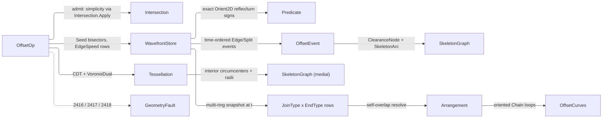

# [RASM_OFFSETTING_OFFSET]

`OffsetOp` owns exact wavefront offsetting in `Rasm.Meshing`: straight-skeleton, offset, medial axis, Minkowski sum, and clearance are peer modality cases on one `[Union]` folded by one `Offsetting.Apply` entry over an Aichholzer-Aurenhammer wavefront. Exactness lives where a sign decides structure — reflex classification, split admission, ring simplicity, and convolution compatibility read exact `Predicate.Orient2D` turn signs over INPUT geometry — while event times stay analytic schedule data validated at fire by liveness, ring adjacency, and the collapse band.

A rebuild composes ring simplicity and convolution crossings from `Meshing/intersect` `Intersection.Apply`, self-overlap resolution from `Meshing/arrangement` `Arrangement.Apply` `PlanarOverlay` under the nonzero winding rule, and the medial locus from `Meshing/delaunay` `VoronoiDual`. It mints `ClearanceNode`, the `SkeletonGraph`/`SkeletonArc` carriers, the `JoinType`/`EndType` generators, the `WavefrontStore` arena under the `Meshing/edit` arena law, and the `OffsetEvent` and `OffsetOp`/`OffsetResult` unions; every failure returns over the `Fin` rail.

## [01]-[INDEX]

- [01]-[OFFSETTING]: one `Offsetting.Apply` folding six `OffsetOp` cases over one wavefront; the `Edge`/`Split` event queue on the `WavefrontStore` arena; the minted `ClearanceNode` family and `Clearance(probe)` query; medial via the delaunay `VoronoiDual`; `JoinType`×`EndType` corner/cap generators; the support-vertex Minkowski walk; loop resolution through the arrangement.

## [02]-[OFFSETTING]

- Owner: `OffsetOp` mints the one request `[Union]` and `Offsetting.Apply` the sole fold. `JoinType` and `EndType` are `[SmartEnum<string>]` generators — each row carries its own `Corner`/`Cap` emission delegate, so a join or cap `switch` is unspellable. `OffsetPolicy` registers `IValidityEvidence`, its `EdgeSpeed` table addressing the ORIGINAL ring edges: a non-empty table IS the weighted lane, gated `Count == edge count`. `SkeletonGraph` is one graph shape for skeleton and medial alike, the `OffsetResult` case carrying the semantics; the fence declares each supporting owner — the `WavefrontStore` arena, the `OffsetEvent` algebra, the `ClearanceNode`/`SkeletonArc`/`OffsetCurves` carriers — one per row.
- Cases: `OffsetOp` discriminates the offsetting modality and `OffsetResult` the return shape — `Skeleton`/`Weighted` yield `Graph`, `Medial` an `Axis`, `Offset`/`Minkowski` `Curves`, `Clearance` a `Probe`.
- Entry: one polymorphic `Apply` discriminates on the op case — no `BuildSkeleton`/`BuildMedial`/`OffsetPolyline` sibling statics. Its `Fin` rail routes `DegenerateOffset` 2416 on an inadmissible input (open or non-finite ring, zero area, self-intersection via `Intersection.Apply`, a `Weighted` speed table whose `Count` mismatches the edge count, or an invalid policy — gated once at `Apply` over the derived `OffsetOp.Policy`), `SkeletonStalled` 2417 on budget exhaustion, and `CollapseStalled` 2418 on a zero-progress event cycle. `Offset` owns every offset modality in the one case: inward closed-ring (positive `Distance`, the wavefront lane), outward closed-ring (negative `Distance`, the direct ribbon), and open-path (the two-sided ribbon with `EndType` caps) — the input shape and distance sign discriminate, never a sibling `OffsetOpen`/`OffsetOutward` entry; a distance past the inradius vanishes to an empty curve set, never a fault. Evaluation runs on the XY projection, every emission returning at the ring's leading elevation.
- Auto: `Skeleton`, `Weighted`, and `Offset` share one `Propagate` wavefront — `Seed` builds each vertex's inward velocity solving both incident edges at their own `EdgeSpeed`, so the weighted skeleton is the same queue at non-unit speeds and `EdgeOf` keys every respawn's speeds through each rewire. Exact `Orient2D` signs decide reflex classification and split admission while the time-ordered queue drains `Edge` and `Split` events, each re-validated at fire and minting a `ClearanceNode` whose radius is the boundary distance — recomputed as the true Euclidean distance under `Weighted` so the payload never carries a weighted time. `Offset` freezes the drain at `until = Distance`: every surviving ring walks out and each reflex corner dresses with the arc of radius `Distance − spawn` centred on its emanating node and the `JoinType` fan, convex corners passing through, while outward and open offsets ride the direct ribbon. `Medial` composes the constrained-Delaunay `VoronoiDual` interior circumcenters, whose curved sampling carries the parabolic reflex arcs; `Minkowski` walks the support vertices emitting both convolution directions from one walk over a convex-gated element; every self-overlapping loop set resolves through the arrangement's nonzero winding.
- Receipt: no dedicated receipt rail — the `OffsetResult` union IS the typed result, every node carrying its clearance radius as first-class evidence; the hash-eligible artifacts are the emitted `Polyline`/`Chain` values, never the live `WavefrontStore`.
- Packages: `Rasm.Numerics` (`Predicate` exact-turn floor, `GeometryFault`), `Rasm.Meshing` (`Intersection.Apply` crossing checks and `Chain` loop rows, `Tessellation.Build`/`VoronoiDual` medial substrate, `Arrangement.Apply` loop resolution), `Rasm.Domain` (`Op`, `ValidityClaim`/`IValidityEvidence`), `Rhino.Geometry` (`Point3d`/`Vector3d`/`Polyline`), Thinktecture.Runtime.Extensions, LanguageExt.Core, BCL `PriorityQueue`.
- Growth: a new offsetting modality is one `OffsetOp` case over the same propagation; a new corner strategy one `JoinType` row carrying its emission delegate; a new cap one `EndType` row; a new event shape one `OffsetEvent` case and one drain arm. Clearance family widens by zero new types; variable-speed demands ride `EdgeSpeed`.
- Boundary: `OffsetOp` is the sole offsetting `[Union]`; exact turn signs decide reflex classification, split admission, ring simplicity, and convolution compatibility over input geometry, while event ordering stays analytic schedule data validated at fire. Ring simplicity and convolution crossings route `Intersection.Apply`; loop resolution routes `Arrangement.Apply` `PlanarOverlay` ring-direct; the medial composes the delaunay `VoronoiDual`. `Apply` is total over the `Fin` rail, so a degenerate ring or stalled queue returns a fault rather than throwing, and a `Split` divides the ring rather than dropping a reflex chain to satisfy a budget.

```csharp
// --- [RUNTIME_PRELUDE] ----------------------------------------------------------------------
using System;
using System.Collections.Generic;
using System.Linq;
using LanguageExt;
using Rasm.Domain;
using Rasm.Numerics;
using Rhino.Geometry;
using Thinktecture;
using static LanguageExt.Prelude;
// CS0104 guard: LanguageExt.HashSet collides with the BCL name under the dual usings.
using IndexSet = System.Collections.Generic.HashSet<int>;

namespace Rasm.Meshing;

// --- [TYPES] ------------------------------------------------------------------------------
// Each row emits only the INTERIOR fan between the two tangent points the lane supplies; Bevel's
// empty fan leaves the bare chord.
[SmartEnum<string>]
[KeyMemberEqualityComparer<ComparerAccessors.StringOrdinal, string>]
[KeyMemberComparer<ComparerAccessors.StringOrdinal, string>]
public sealed partial class JoinType {
    public static readonly JoinType Miter  = new("miter", MiterCorner);
    public static readonly JoinType Round  = new("round", RoundCorner);
    public static readonly JoinType Bevel  = new("bevel", static (_, _, _, _, _) => Seq<Point3d>());
    public static readonly JoinType Square = new("square", SquareCorner);

    [UseDelegateFromConstructor]
    public partial Seq<Point3d> Corner(Point3d apex, Vector3d nIn, Vector3d nOut, double distance, OffsetPolicy policy);

    // Miter apex = bisector hit clamped at MiterLimit; past the clamp the row degrades to the bevel chord.
    static Seq<Point3d> MiterCorner(Point3d apex, Vector3d nIn, Vector3d nOut, double distance, OffsetPolicy policy) {
        Vector3d bisector = nIn + nOut;
        double len = bisector.Length;
        if (len <= double.Epsilon) { return Seq<Point3d>(); }
        double reach = distance / (0.5 * len);
        return reach <= policy.MiterLimit * Math.Abs(distance)
            ? Seq(apex + (reach / len) * bisector)
            : Seq<Point3d>();
    }

    // In-plane rotation nIn->nOut through the SHORT arc; a slerp sin(sweep) denominator dies at sweep = π.
    static Seq<Point3d> RoundCorner(Point3d apex, Vector3d nIn, Vector3d nOut, double distance, OffsetPolicy policy) {
        double cross = (nIn.X * nOut.Y) - (nIn.Y * nOut.X);
        double sweep = Math.Atan2(Math.Abs(cross), (nIn.X * nOut.X) + (nIn.Y * nOut.Y));
        double turn = cross < 0.0 ? -1.0 : 1.0;
        Vector3d perp = new(-turn * nIn.Y, turn * nIn.X, 0.0);
        int steps = int.Max(1, (int)Math.Ceiling(sweep / (2.0 * Math.Acos(double.Clamp(1.0 - (policy.ArcTolerance / Math.Abs(distance)), -1.0, 1.0)))));
        return toSeq(Enumerable.Range(1, steps - 1).Select(i => {
            double t = sweep * i / steps;
            return apex + (distance * ((Math.Cos(t) * nIn) + (Math.Sin(t) * perp)));
        }));
    }

    // Both points sit on the chord perpendicular to the bisector at the offset distance; each slides
    // along its own tangent line to that cut, the signed advance absorbing either turn.
    static Seq<Point3d> SquareCorner(Point3d apex, Vector3d nIn, Vector3d nOut, double distance, OffsetPolicy policy) {
        Vector3d bisector = nIn + nOut;
        double len = bisector.Length;
        if (len <= double.Epsilon) { return Seq<Point3d>(); }
        (double bx, double by) = (bisector.X / len, bisector.Y / len);
        double cos = (nIn.X * bx) + (nIn.Y * by);
        double dotIn = (-nIn.Y * bx) + (nIn.X * by);
        double dotOut = (-nOut.Y * bx) + (nOut.X * by);
        if (Math.Abs(dotIn) <= double.Epsilon || Math.Abs(dotOut) <= double.Epsilon) { return Seq<Point3d>(); }
        return Seq(
            apex + (distance * nIn) + ((distance * (1.0 - cos) / dotIn) * new Vector3d(-nIn.Y, nIn.X, 0.0)),
            apex + (distance * nOut) + ((distance * (1.0 - cos) / dotOut) * new Vector3d(-nOut.Y, nOut.X, 0.0)));
    }
}

// Cap rows for open-path offsets; `closed` is the ring row emitting nothing.
[SmartEnum<string>]
[KeyMemberEqualityComparer<ComparerAccessors.StringOrdinal, string>]
[KeyMemberComparer<ComparerAccessors.StringOrdinal, string>]
public sealed partial class EndType {
    public static readonly EndType Closed = new("closed", static (_, _, _, _) => Seq<Point3d>());
    public static readonly EndType Butt   = new("butt", static (_, _, _, _) => Seq<Point3d>());
    public static readonly EndType Square = new("square", SquareCap);
    public static readonly EndType Round  = new("round", RoundCap);

    [UseDelegateFromConstructor]
    public partial Seq<Point3d> Cap(Point3d end, Vector3d tangent, double distance, OffsetPolicy policy);

    static Seq<Point3d> SquareCap(Point3d end, Vector3d tangent, double distance, OffsetPolicy policy) =>
        Seq(end + distance * new Vector3d(tangent.Y, -tangent.X, 0.0) + distance * tangent,
            end + distance * new Vector3d(-tangent.Y, tangent.X, 0.0) + distance * tangent);

    static Seq<Point3d> RoundCap(Point3d end, Vector3d tangent, double distance, OffsetPolicy policy) =>
        JoinType.Round.Corner(end, new Vector3d(tangent.Y, -tangent.X, 0.0), new Vector3d(-tangent.Y, tangent.X, 0.0), distance, policy);
}

// --- [CONSTANTS] --------------------------------------------------------------------------
// EdgeSpeed indexes the ORIGINAL ring edges; Weighted admission gates Count == edge count.
public sealed record OffsetPolicy(
    double TimeBudget, int MaxEvents, double CollapseTolerance, double MiterLimit, double ArcTolerance, Arr<double> EdgeSpeed = default) : IValidityEvidence {
    public static readonly OffsetPolicy Canonical =
        new(TimeBudget: 1e9, MaxEvents: 1 << 20, CollapseTolerance: 1e-12, MiterLimit: 2.0, ArcTolerance: 1e-3);

    public bool IsValid => ValidityClaim.All(
        ValidityClaim.Positive(value: TimeBudget),
        ValidityClaim.Positive(value: MaxEvents),
        ValidityClaim.Positive(value: CollapseTolerance),
        ValidityClaim.Positive(value: MiterLimit),
        ValidityClaim.Positive(value: ArcTolerance),
        ValidityClaim.Of(EdgeSpeed.ForAll(static speed => speed > 0.0)));
}

// --- [MODELS] -----------------------------------------------------------------------------
// Position, distance-to-boundary radius, nearest-feature witness.
public sealed record ClearanceNode(Point3d At, double Radius, int NearestEdge);

// One graph shape for skeleton AND medial; the OffsetResult case carries the semantics. The graph
// pre-seeds ring vertices as nodes 0..n-1 at radius zero, so arcs reference node ids uniformly.
public sealed record SkeletonArc(int From, int To, int OriginEdge);
public sealed record SkeletonGraph(Seq<ClearanceNode> Nodes, Seq<SkeletonArc> Arcs);
public sealed record OffsetCurves(Seq<Chain> Loops, double Distance);

// Single-writer arena: every Spawn grows every column by amortized doubling — splits spawn unbounded
// vertices. Plane carries the ring elevation so every emission returns at the source plane. Node is the
// emanating skeleton node (ring seeds ARE nodes 0..n-1); EdgeOf is the ORIGINAL ring edge, keying the
// weighted lane's speed through every rewire.
public sealed class WavefrontStore {
    double[] px, py, vx, vy, spawnTime;
    int[] prev, next, node, edgeOf;
    bool[] dead;
    readonly Stack<int> free = new();
    readonly double plane;
    int count;

    public WavefrontStore(int seed, double plane) {
        (px, py, vx, vy, spawnTime) = (new double[seed], new double[seed], new double[seed], new double[seed], new double[seed]);
        (prev, next, node, edgeOf, dead) = (new int[seed], new int[seed], new int[seed], new int[seed], new bool[seed]);
        this.plane = plane;
    }

    public int Count => count;
    public bool Alive(int v) => v >= 0 && v < count && !dead[v];
    public int Prev(int v) => prev[v];
    public int Next(int v) => next[v];
    public int Node(int v) => node[v];
    public int EdgeOf(int v) => edgeOf[v];
    public double SpawnTime(int v) => spawnTime[v];
    public Point3d At(int v, double time) =>
        new(px[v] + ((time - spawnTime[v]) * vx[v]), py[v] + ((time - spawnTime[v]) * vy[v]), plane);
    public Vector3d Velocity(int v) => new(vx[v], vy[v], 0.0);

    public int Spawn(Point3d at, Vector3d velocity, double time, int fromNode, int outEdge) {
        int v = free.Count > 0 ? free.Pop() : count++;
        Grow(v + 1);
        (px[v], py[v], vx[v], vy[v]) = (at.X, at.Y, velocity.X, velocity.Y);
        (spawnTime[v], node[v], edgeOf[v], dead[v]) = (time, fromNode, outEdge, false);
        return v;
    }

    public void Kill(int v) { dead[v] = true; free.Push(v); }
    public void LinkRing(int a, int b) { next[a] = b; prev[b] = a; }

    void Grow(int needed) {
        if (needed <= px.Length) { return; }
        int extent = int.Max(needed, px.Length << 1);
        Array.Resize(ref px, extent); Array.Resize(ref py, extent);
        Array.Resize(ref vx, extent); Array.Resize(ref vy, extent);
        Array.Resize(ref spawnTime, extent);
        Array.Resize(ref prev, extent); Array.Resize(ref next, extent);
        Array.Resize(ref node, extent); Array.Resize(ref edgeOf, extent);
        Array.Resize(ref dead, extent);
    }
}

public readonly record struct Trace(WavefrontStore Store, SkeletonGraph Graph);

[Union(ConversionFromValue = ConversionOperatorsGeneration.None)]
public abstract partial record OffsetEvent {
    private OffsetEvent() { }

    public sealed record Edge(double Time, int Vertex, int NextVertex) : OffsetEvent;
    public sealed record Split(double Time, int Reflex, int OpposingA, int OpposingB) : OffsetEvent;

    public double Time =>
        Switch(edge: static e => e.Time, split: static s => s.Time);
}

[Union(ConversionFromValue = ConversionOperatorsGeneration.None)]
public abstract partial record OffsetResult {
    private OffsetResult() { }

    public sealed record Graph(SkeletonGraph Skeleton) : OffsetResult;
    public sealed record Axis(SkeletonGraph Medial) : OffsetResult;
    public sealed record Curves(OffsetCurves Offset) : OffsetResult;
    public sealed record Probe(ClearanceNode Node) : OffsetResult;
}

// --- [OPERATIONS] -------------------------------------------------------------------------
[Union(ConversionFromValue = ConversionOperatorsGeneration.None)]
public abstract partial record OffsetOp {
    private OffsetOp() { }

    public sealed record Skeleton(Polyline Ring, OffsetPolicy Policy) : OffsetOp;
    public sealed record Weighted(Polyline Ring, OffsetPolicy Policy) : OffsetOp;
    public sealed record Offset(Polyline Path, double Distance, JoinType Join, EndType End, OffsetPolicy Policy) : OffsetOp;
    public sealed record Medial(Polyline Ring, OffsetPolicy Policy) : OffsetOp;
    public sealed record Minkowski(Polyline Ring, Polyline Element, OffsetPolicy Policy) : OffsetOp;
    public sealed record Clearance(Polyline Ring, Point3d Probe, OffsetPolicy Policy) : OffsetOp;

    public OffsetPolicy Policy =>
        Switch(
            skeleton:  static s => s.Policy,
            weighted:  static w => w.Policy,
            offset:    static o => o.Policy,
            medial:    static m => m.Policy,
            minkowski: static k => k.Policy,
            clearance: static c => c.Policy);
}

public static class Offsetting {
    public static Fin<OffsetResult> Apply(OffsetOp op, Op? key = null) =>
        !op.Policy.IsValid
        ? Fin.Fail<OffsetResult>(new GeometryFault.DegenerateOffset(0, 0.0).ToError())
        : op.Switch(
            state: key,
            skeleton:  static (key, s) => AdmitRing(s.Ring, key).Bind(ring => Propagate(ring, s.Policy, Arr<double>.Empty)).Map(static t => (OffsetResult)new OffsetResult.Graph(t.Graph)),
            weighted:  static (key, w) => AdmitRing(w.Ring, key)
                .Bind(ring => w.Policy.EdgeSpeed.Count == ring.Count - 1
                    ? Propagate(ring, w.Policy, Orientation(w.Ring) == Sign.Negative ? ReversedSpeeds(w.Policy.EdgeSpeed) : w.Policy.EdgeSpeed)
                    : Fin.Fail<Trace>(new GeometryFault.DegenerateOffset(w.Policy.EdgeSpeed.Count, 0.0).ToError()))
                .Map(static t => (OffsetResult)new OffsetResult.Graph(t.Graph)),
            offset:    static (key, o) => Snapshot(o, key),
            medial:    static (key, m) => AdmitRing(m.Ring, key).Bind(ring => MedialOf(ring, key)).Map(static axis => (OffsetResult)new OffsetResult.Axis(axis)),
            minkowski: static (key, k) => AdmitRing(k.Ring, key).Bind(ring => Convolve(ring, k.Element, key)).Map(static loops => (OffsetResult)new OffsetResult.Curves(loops)),
            clearance: static (key, c) => AdmitRing(c.Ring, key).Map(ring => (OffsetResult)new OffsetResult.Probe(ClearanceAt(ring, c.Probe))));

    // Admission once: finite, closed, non-zero-area, CCW-oriented, SIMPLE — simplicity routes the ONE crossing owner per non-adjacent pair,
    // evaluated on the XY projection; the ring's leading elevation rides through to every emission.
    static Fin<Polyline> AdmitRing(Polyline ring, Op? key) {
        if (ring.Count < 4 || !ring.IsClosed) { return Fail(0); }
        for (int i = 0; i < ring.Count; i++) {
            if (!ring[i].IsValid) { return Fail(i); }
        }
        if (Orientation(ring) == Sign.Zero) { return Fail(0); }
        int n = ring.Count - 1;
        for (int i = 0; i < n; i++) {
            for (int j = i + 2; j < n; j++) {
                if (i == 0 && j == n - 1) { continue; }
                Fin<IntersectResult> hit = Intersection.Apply(
                    new IntersectOp.SegmentSegment(new Line(ring[i], ring[i + 1]), new Line(ring[j], ring[j + 1]), Axis.Z, IntersectPolicy.Canonical), key);
                if (hit.Case is IntersectResult.Points { Hits.IsEmpty: false }) { return Fail(i); }
            }
        }
        return Fin.Succ(Oriented(ring));
    }

    // Open-path admission: finite vertices, two or more of them, no zero-length edge (a coincident
    // pair degenerates the ribbon normal).
    static Fin<Polyline> AdmitPath(Polyline path) {
        if (path.Count < 2) { return Fail(0); }
        for (int i = 0; i < path.Count; i++) {
            if (!path[i].IsValid) { return Fail(i); }
            if (i > 0 && path[i] == path[i - 1]) { return Fail(i); }
        }
        return Fin.Succ(path);
    }

    static Fin<Polyline> Fail(int vertex) => Fin.Fail<Polyline>(new GeometryFault.DegenerateOffset(vertex, 0.0).ToError());

    // --- [WAVEFRONT]
    // Event times are analytic schedule data; validity at fire is liveness + ring adjacency + the
    // collapse band, the exact signs at reflex classification and split admission over input geometry.
    // `until` freezes the drain — events past it stay unfired, so the store IS the wavefront state at
    // that instant. A non-empty speed table IS the weighted lane.
    static Fin<Trace> Propagate(Polyline ring, OffsetPolicy policy, Arr<double> speeds, double until = double.PositiveInfinity) {
        WavefrontStore store = Seed(ring, speeds);
        PriorityQueue<OffsetEvent, double> queue = new();
        int n = ring.Count - 1;
        List<ClearanceNode> nodes = new(Enumerable.Range(0, n).Select(i => new ClearanceNode(ring[i], 0.0, i)));
        List<SkeletonArc> arcs = new();
        for (int v = 0; v < store.Count; v++) { EnqueueAt(store, queue, v, 0.0, policy, speeds); }
        (int fired, double lastTime, int sameTime) = (0, -1.0, 0);
        while (queue.Count > 0 && queue.Peek().Time <= until) {
            if (fired++ > policy.MaxEvents) { return Fin.Fail<Trace>(new GeometryFault.SkeletonStalled(queue.Count, queue.Peek().Time).ToError()); }
            OffsetEvent ev = queue.Dequeue();
            if (ev.Time > policy.TimeBudget) { return Fin.Fail<Trace>(new GeometryFault.SkeletonStalled(queue.Count, ev.Time).ToError()); }
            sameTime = ev.Time == lastTime ? sameTime + 1 : 0;
            if (sameTime > store.Count << 2) { return Fin.Fail<Trace>(new GeometryFault.CollapseStalled(fired, ev.Time - lastTime).ToError()); }
            lastTime = ev.Time;
            // TOTAL Switch: a new event case breaks the drain at compile time; a failed guard is a
            // stale event superseded by a rewire, skipped — never a tolerance guess.
            ev.Switch(
                edge: e => {
                    if (store.Alive(e.Vertex) && store.Alive(e.NextVertex) && store.Next(e.Vertex) == e.NextVertex
                        && store.At(e.Vertex, e.Time).DistanceTo(store.At(e.NextVertex, e.Time)) <= policy.CollapseTolerance) {
                        Collapse(store, e, ring, nodes, arcs, queue, policy, speeds);
                    }
                },
                split: s => {
                    if (store.Alive(s.Reflex) && store.Alive(s.OpposingA) && store.Alive(s.OpposingB) && store.Next(s.OpposingA) == s.OpposingB) {
                        Divide(store, s, ring, nodes, arcs, queue, policy, speeds);
                    }
                });
        }
        return Fin.Succ(new Trace(store, new SkeletonGraph(toSeq(nodes), toSeq(arcs))));
    }

    static WavefrontStore Seed(Polyline ring, Arr<double> speeds) {
        int n = ring.Count - 1;
        WavefrontStore store = new(int.Max(2 * n, 16), ring[0].Z);
        for (int i = 0; i < n; i++) {
            int inEdge = (i - 1 + n) % n;
            store.Spawn(ring[i], Bisector(ring[inEdge], ring[i], ring[(i + 1) % n], Speed(speeds, inEdge), Speed(speeds, i)), 0.0, fromNode: i, outEdge: i);
        }
        for (int i = 0; i < n; i++) { store.LinkRing(i, (i + 1) % n); }
        return store;
    }

    static double Speed(Arr<double> speeds, int edge) => speeds.Count > 0 ? speeds[edge] : 1.0;

    // A CW input re-orients CCW at admission; reversed-ring edge k is caller edge n-1-k, so the
    // per-ORIGINAL-edge speed table re-indexes with the ring.
    static Arr<double> ReversedSpeeds(Arr<double> speeds) {
        double[] flipped = new double[speeds.Count];
        for (int e = 0; e < flipped.Length; e++) { flipped[e] = speeds[speeds.Count - 1 - e]; }
        return Arr.create<double>(flipped);
    }

    // INWARD velocity: the CCW interior sits LEFT of each edge, so the inward normal of (a->b) is
    // (a.Y-b.Y, b.X-a.X); the (dy,-dx) spelling is OUTWARD and grows the front. v solves
    // v·n̂In = speedIn ∧ v·n̂Out = speedOut — each incident edge advances at its OWN speed; equal
    // speeds recover the 2b/|b|² bisector, parallel edges translate at the out-edge speed.
    static Vector3d Bisector(Point3d prev, Point3d cur, Point3d next, double speedIn, double speedOut) {
        Vector3d nIn = Unit(new Vector3d(prev.Y - cur.Y, cur.X - prev.X, 0.0));
        Vector3d nOut = Unit(new Vector3d(cur.Y - next.Y, next.X - cur.X, 0.0));
        double det = (nIn.X * nOut.Y) - (nIn.Y * nOut.X);
        return Math.Abs(det) <= double.Epsilon
            ? speedOut * nOut
            : new Vector3d(((speedIn * nOut.Y) - (speedOut * nIn.Y)) / det, ((speedOut * nIn.X) - (speedIn * nOut.X)) / det, 0.0);
    }

    static void EnqueueAt(WavefrontStore store, PriorityQueue<OffsetEvent, double> queue, int v, double now, OffsetPolicy policy, Arr<double> speeds) {
        if (!store.Alive(v)) { return; }
        int nxt = store.Next(v);
        EdgeCollapseTime(store, v, nxt, now).IfSome(t => { if (t <= policy.TimeBudget) { queue.Enqueue(new OffsetEvent.Edge(t, v, nxt), t); } });
        if (IsReflex(store, v, now)) {
            SplitTime(store, v, now, speeds).IfSome(s => { if (s.Time <= policy.TimeBudget) { queue.Enqueue(new OffsetEvent.Split(s.Time, v, s.A, s.B), s.Time); } });
        }
    }

    static void Collapse(WavefrontStore store, OffsetEvent.Edge ev, Polyline ring, List<ClearanceNode> nodes, List<SkeletonArc> arcs, PriorityQueue<OffsetEvent, double> queue, OffsetPolicy policy, Arr<double> speeds) {
        Point3d meet = store.At(ev.Vertex, ev.Time);
        (double radius, int witness) = EdgeDistance(ring, meet);
        int node = nodes.Count;
        nodes.Add(new ClearanceNode(meet, speeds.Count > 0 ? radius : ev.Time, witness));  // unit speed: time IS the boundary distance
        arcs.Add(new SkeletonArc(store.Node(ev.Vertex), node, store.EdgeOf(ev.Vertex)));
        arcs.Add(new SkeletonArc(store.Node(ev.NextVertex), node, store.EdgeOf(ev.NextVertex)));
        (int before, int after) = (store.Prev(ev.Vertex), store.Next(ev.NextVertex));
        store.Kill(ev.Vertex);
        store.Kill(ev.NextVertex);
        if (before == ev.NextVertex || after == ev.Vertex) { return; }  // a 2-ring dies at its node
        int outEdge = store.EdgeOf(ev.NextVertex);
        int merged = store.Spawn(meet,
            Bisector(store.At(before, ev.Time), meet, store.At(after, ev.Time), Speed(speeds, store.EdgeOf(before)), Speed(speeds, outEdge)),
            ev.Time, node, outEdge);
        store.LinkRing(before, merged);
        store.LinkRing(merged, after);
        EnqueueAt(store, queue, before, ev.Time, policy, speeds);
        EnqueueAt(store, queue, merged, ev.Time, policy, speeds);
    }

    static void Divide(WavefrontStore store, OffsetEvent.Split ev, Polyline ring, List<ClearanceNode> nodes, List<SkeletonArc> arcs, PriorityQueue<OffsetEvent, double> queue, OffsetPolicy policy, Arr<double> speeds) {
        Point3d hit = store.At(ev.Reflex, ev.Time);
        (double radius, int witness) = EdgeDistance(ring, hit);
        int node = nodes.Count;
        nodes.Add(new ClearanceNode(hit, speeds.Count > 0 ? radius : ev.Time, witness));
        arcs.Add(new SkeletonArc(store.Node(ev.Reflex), node, store.EdgeOf(ev.Reflex)));
        (int before, int after) = (store.Prev(ev.Reflex), store.Next(ev.Reflex));
        int opposingEdge = store.EdgeOf(ev.OpposingA);  // both halves of the split edge keep its origin
        int left = store.Spawn(hit,
            Bisector(store.At(before, ev.Time), hit, store.At(ev.OpposingB, ev.Time), Speed(speeds, store.EdgeOf(before)), Speed(speeds, opposingEdge)),
            ev.Time, node, opposingEdge);
        int right = store.Spawn(hit,
            Bisector(store.At(ev.OpposingA, ev.Time), hit, store.At(after, ev.Time), Speed(speeds, opposingEdge), Speed(speeds, store.EdgeOf(ev.Reflex))),
            ev.Time, node, store.EdgeOf(ev.Reflex));
        store.Kill(ev.Reflex);
        store.LinkRing(before, left);
        store.LinkRing(left, ev.OpposingB);
        store.LinkRing(ev.OpposingA, right);
        store.LinkRing(right, after);
        foreach (int v in (ReadOnlySpan<int>)[before, left, ev.OpposingA, right]) { EnqueueAt(store, queue, v, ev.Time, policy, speeds); }
    }

    static Option<double> EdgeCollapseTime(WavefrontStore store, int u, int v, double now) {
        (Point3d pu, Point3d pv) = (store.At(u, now), store.At(v, now));
        (Vector3d du, Vector3d dv) = (store.Velocity(u), store.Velocity(v));
        Vector3d gap = pv - pu, rel = dv - du;
        double closing = (gap.X * rel.X) + (gap.Y * rel.Y);
        double speed2 = (rel.X * rel.X) + (rel.Y * rel.Y);
        return closing < 0.0 && speed2 > 0.0 ? Some(now + (-closing / speed2)) : None;
    }

    // Opposing edge moves INWARD at its own speed; the reflex hits when its signed offset along its
    // inward normal m closes — t = now + m·(a − p) / (d·m − speed).
    static Option<(double Time, int A, int B)> SplitTime(WavefrontStore store, int reflex, double now, Arr<double> speeds) {
        Point3d p = store.At(reflex, now);
        Vector3d d = store.Velocity(reflex);
        (Option<(double, int, int)> best, double bestTime) = (None, double.PositiveInfinity);
        for (int e = store.Next(reflex); store.Alive(e) && e != store.Prev(reflex); e = store.Next(e)) {
            int f = store.Next(e);
            if (e == reflex || f == reflex || !store.Alive(f)) { continue; }
            (Point3d a, Point3d b) = (store.At(e, now), store.At(f, now));
            Vector3d m = Unit(new Vector3d(a.Y - b.Y, b.X - a.X, 0.0));
            double approach = (d.X * m.X) + (d.Y * m.Y) - Speed(speeds, store.EdgeOf(e));
            if (approach >= 0.0) { continue; }
            double t = now + (((m.X * (a.X - p.X)) + (m.Y * (a.Y - p.Y))) / approach);
            if (t > now && t < bestTime) { (best, bestTime) = (Some((t, e, f)), t); }
        }
        return best.Map(static x => (x.Item1, x.Item2, x.Item3));
    }

    // Exact turn sign at the vertex's CURRENT neighbours; the ring is CCW, so a clockwise turn is reflex.
    static bool IsReflex(WavefrontStore store, int v, double now) =>
        store.Alive(v)
        && Predicate.Orient2D(store.At(store.Prev(v), now), store.At(v, now), store.At(store.Next(v), now)) == Sign.Negative;

    // --- [OFFSET_ASSEMBLY]
    // Two lanes: INWARD (positive distance, closed ring) rides the wavefront frozen at until = Distance,
    // EVERY surviving ring walking out, a full collapse before Distance a legitimately EMPTY set. OUTWARD
    // and OPEN paths ride the direct ribbon. Both resolve self-overlap through the arrangement.
    static Fin<OffsetResult> Snapshot(OffsetOp.Offset op, Op? key) =>
        (op.Path.IsClosed && op.Distance > 0.0
            ? AdmitRing(op.Path, key)
                .Bind(ring => Propagate(ring, op.Policy, Arr<double>.Empty, until: op.Distance))
                .Map(trace => Rings(trace.Store).Map(loop => Dressed(trace, loop, op)))
            : op.Path.IsClosed
                ? AdmitRing(op.Path, key).Map(ring => Ribbon(op with { Path = ring }))
                : AdmitPath(op.Path).Map(path => Ribbon(op with { Path = path })))
        .Bind(loops => loops.IsEmpty ? Fin.Succ(Seq<Chain>()) : Resolve(loops, key))
        .Map(chains => (OffsetResult)new OffsetResult.Curves(new OffsetCurves(chains, op.Distance)));

    static Seq<int[]> Rings(WavefrontStore store) {
        IndexSet seen = new();
        List<int[]> loops = new();
        for (int v = 0; v < store.Count; v++) {
            if (!store.Alive(v) || seen.Contains(v)) { continue; }
            List<int> loop = new();
            int cur = v;
            do {
                seen.Add(cur);
                loop.Add(cur);
                cur = store.Next(cur);
            } while (store.Alive(cur) && cur != v && !seen.Contains(cur));
            if (loop.Count > 2) { loops.Add([.. loop]); }
        }
        return toSeq(loops);
    }

    // Reflex corner dressing: its true inward offset is the ARC of radius (Distance - spawn) centred on its
    // emanating NODE — the lane supplies the two tangent points (centre + r·m̂ along each inward normal);
    // its JoinType row emits only the INTERIOR fan between them, convex corners passing through as the
    // exact offset.
    static Polyline Dressed(Trace trace, int[] loop, OffsetOp.Offset op) {
        WavefrontStore store = trace.Store;
        Polyline dressed = new();
        int n = loop.Length;
        for (int k = 0; k < n; k++) {
            int v = loop[k];
            Point3d at = store.At(v, op.Distance);
            (Point3d prev, Point3d next) = (store.At(loop[(k - 1 + n) % n], op.Distance), store.At(loop[(k + 1) % n], op.Distance));
            double r = op.Distance - store.SpawnTime(v);
            bool reflex = r > 0.0 && Predicate.Orient2D(prev, at, next) == Sign.Negative;
            if (!reflex) { dressed.Add(at); continue; }
            Point3d centre = trace.Graph.Nodes[store.Node(v)].At;
            Vector3d mIn = Unit(new Vector3d(prev.Y - at.Y, at.X - prev.X, 0.0));
            Vector3d mOut = Unit(new Vector3d(at.Y - next.Y, next.X - at.X, 0.0));
            dressed.Add(centre + (r * mIn));
            foreach (Point3d fan in op.Join.Corner(centre, mIn, mOut, r, op.Policy)) { dressed.Add(fan); }
            dressed.Add(centre + (r * mOut));
        }
        if (dressed.Count > 2) { dressed.Add(dressed[0]); }
        return dressed;
    }

    // Direct ribbon: per-edge translates with the row's fan at each convex turn; open paths close through
    // its EndType caps and the mirrored return side.
    static Seq<Polyline> Ribbon(OffsetOp.Offset op) {
        Polyline path = op.Path;
        bool closed = path.IsClosed;
        int n = path.Count - (closed ? 1 : 0);
        double d = Math.Abs(op.Distance);
        Polyline cycle = new();
        Emit(cycle, path, n, closed, d, op);
        if (!closed) {
            foreach (Point3d cap in op.End.Cap(path[n - 1], Unit(path[n - 1] - path[n - 2]), d, op.Policy)) { cycle.Add(cap); }
            Emit(cycle, Reversed(path), n, closed: false, d, op);
            foreach (Point3d cap in op.End.Cap(path[0], Unit(path[0] - path[1]), d, op.Policy)) { cycle.Add(cap); }
        }
        if (cycle.Count > 2) { cycle.Add(cycle[0]); return Seq(cycle); }
        return Seq<Polyline>();

        static void Emit(Polyline cycle, Polyline path, int n, bool closed, double d, OffsetOp.Offset op) {
            int edges = closed ? n : n - 1;
            for (int i = 0; i < edges; i++) {
                (Point3d a, Point3d b) = (path[i], path[(i + 1) % n]);
                Vector3d normal = d * Unit(Normal(a, b));
                cycle.Add(a + normal);
                cycle.Add(b + normal);
                if (closed || i + 1 < edges) {
                    foreach (Point3d fan in op.Join.Corner(b, Unit(Normal(a, b)), Unit(Normal(b, path[(i + 2) % n])), d, op.Policy)) { cycle.Add(fan); }
                }
            }
        }

        static Polyline Reversed(Polyline path) {
            Polyline back = new(path);
            back.Reverse();
            return back;
        }
    }

    // Self-overlap check routes the ONE crossing owner; resolution routes the arrangement ring-direct.
    static Fin<Seq<Chain>> Resolve(Seq<Polyline> loops, Op? key) {
        bool overlapping = loops.Exists(loop => {
            int n = loop.Count - 1;
            for (int i = 0; i < n; i++) {
                for (int j = i + 2; j < n; j++) {
                    if (i == 0 && j == n - 1) { continue; }
                    Fin<IntersectResult> hit = Intersection.Apply(new IntersectOp.SegmentSegment(new Line(loop[i], loop[i + 1]), new Line(loop[j], loop[j + 1]), Axis.Z, IntersectPolicy.Canonical), key);
                    if (hit.Case is IntersectResult.Points { Hits.IsEmpty: false }) { return true; }
                }
            }
            return false;
        });
        return overlapping
            ? Arrangement.Apply(new ArrangementOp.PlanarOverlay(loops, Seq<Polyline>(), BooleanOp.Union, Axis.Z, ArrangementPolicy.Canonical), key)
                .Bind(static result => result is ArrangementResult.Overlay overlay
                    ? Fin.Succ(overlay.Loops)
                    : Fin.Fail<Seq<Chain>>(new GeometryFault.DegenerateOffset(0, 0.0).ToError()))
            : Fin.Succ(loops.Map(static loop => new Chain(loop, Closed: true)));
    }

    // --- [MEDIAL]
    // Interior circumcenters ARE medial samples carrying their circumradius as clearance; the dual's
    // curved sampling carries the parabolic reflex arcs the linear skeleton approximates.
    static Fin<SkeletonGraph> MedialOf(Polyline ring, Op? key) {
        int n = ring.Count - 1;
        Implicit[] rows = [.. Enumerable.Range(0, n).Select(i => new Implicit(ring[i]))];
        Seq<Constraint> edges = toSeq(Enumerable.Range(0, n).Select(i => (Constraint)new Constraint.Segment(i, (i + 1) % n)));
        return Tessellation.Build(new TessellationOp.Points(TessellationKind.Triangulation, rows, edges, TessellationPolicy.Canonical, Axis.Z), key)
            .Bind(t => t.VoronoiDual(key).Map(dual => (Tess: t, Dual: dual)))
            .Bind(pair => pair.Tess.Triangles(key).Map(tris => (pair.Dual, Tris: tris)))
            .Map(x => {
                bool[] interior = [.. x.Tris.Select(tri => Inside(Centroid(tri), ring))];
                Dictionary<int, int> keep = new();
                List<ClearanceNode> nodes = new();
                for (int i = 0; i < x.Dual.Circumcenters.Length; i++) {
                    if (i < interior.Length && interior[i]) {
                        keep[i] = nodes.Count;
                        (double radius, int edge) = EdgeDistance(ring, x.Dual.Circumcenters[i]);
                        nodes.Add(new ClearanceNode(x.Dual.Circumcenters[i], double.Min(radius, x.Dual.Radius[i]), edge));
                    }
                }
                List<SkeletonArc> arcs = new();
                for (int e = 0; e < x.Dual.Edges.Length; e++) {
                    (int a, int b) = x.Dual.Edges[e];
                    if (keep.TryGetValue(a, out int ka) && keep.TryGetValue(b, out int kb)) { arcs.Add(new SkeletonArc(ka, kb, x.Dual.Across[e].U)); }
                }
                return new SkeletonGraph(toSeq(nodes), toSeq(arcs));
            });
    }

    // --- [MINKOWSKI]
    // COMPLETE convolution as a SUPPORT-VERTEX walk — a global two-pointer normal merge is unsound for
    // non-convex rings (normal sequence not angle-sorted). Each ring edge translates by the element
    // vertex EXTREME under its outward normal; each ring vertex walks the element boundary prev->next
    // support — CCW at convex turns (fan), CW at reflex (reversed arc) — both directions from one walk,
    // resolved through the arrangement. Element gated CLOSED + CCW + CONVEX by exact signs; a reflex
    // element faults, its convex decomposition the recorded growth row.
    static Fin<OffsetCurves> Convolve(Polyline ring, Polyline element, Op? key) {
        if (element.Count < 4 || !element.IsClosed) { return Fin.Fail<OffsetCurves>(new GeometryFault.DegenerateOffset(0, 0.0).ToError()); }
        Polyline b = Oriented(element);
        int rn = ring.Count - 1, en = b.Count - 1;
        for (int j = 0; j < en; j++) {
            if (Predicate.Orient2D(b[(j - 1 + en) % en], b[j], b[(j + 1) % en]) == Sign.Negative) {
                return Fin.Fail<OffsetCurves>(new GeometryFault.DegenerateOffset(j, 0.0).ToError());
            }
        }
        int Support(Vector3d outward) {
            (int best, double reach) = (0, double.NegativeInfinity);
            for (int j = 0; j < en; j++) {
                double dot = (b[j].X * outward.X) + (b[j].Y * outward.Y);
                if (dot > reach) { (best, reach) = (j, dot); }
            }
            return best;
        }
        Span<int> support = new int[rn];
        for (int i = 0; i < rn; i++) { support[i] = Support(Normal(ring[i], ring[(i + 1) % rn])); }
        Polyline cycle = new();
        for (int i = 0; i < rn; i++) {
            int from = support[(i - 1 + rn) % rn], to = support[i];
            bool convex = Predicate.Orient2D(ring[(i - 1 + rn) % rn], ring[i], ring[(i + 1) % rn]) != Sign.Negative;
            for (int k = from, step = 0; k != to && step <= en; k = (k + (convex ? 1 : en - 1)) % en, step++) {
                cycle.Add(ring[i] + (b[k] - Point3d.Origin));  // the fan (CCW) or reversed arc (CW) at the vertex
            }
            cycle.Add(ring[i] + (b[to] - Point3d.Origin));
            cycle.Add(ring[(i + 1) % rn] + (b[to] - Point3d.Origin));  // the translated edge under its support
        }
        cycle.Add(cycle[0]);
        return Arrangement.Apply(new ArrangementOp.PlanarOverlay(Seq(cycle), Seq<Polyline>(), BooleanOp.Union, Axis.Z, ArrangementPolicy.Canonical), key)
            .Bind(static result => result is ArrangementResult.Overlay overlay
                ? Fin.Succ(new OffsetCurves(overlay.Loops, 0.0))
                : Fin.Fail<OffsetCurves>(new GeometryFault.DegenerateOffset(0, 0.0).ToError()));
    }

    // --- [CLEARANCE]
    // Arbitrary-probe query of the minted family: minimum point-segment distance with its witness.
    static ClearanceNode ClearanceAt(Polyline ring, Point3d probe) {
        (double radius, int edge) = EdgeDistance(ring, probe);
        return new ClearanceNode(probe, radius, edge);
    }

    static (double Radius, int Edge) EdgeDistance(Polyline ring, Point3d p) {
        (double best, int at) = (double.PositiveInfinity, 0);
        for (int e = 0; e < ring.Count - 1; e++) {
            double d = new Line(ring[e], ring[e + 1]).DistanceTo(p, limitToFiniteSegment: true);
            if (d < best) { (best, at) = (d, e); }
        }
        return (best, at);
    }

    // --- [PRIMITIVES]
    // RIGHT/OUTWARD normal of (a->b) on a CCW ring — ribbon and support lanes grow along it; the
    // wavefront's INWARD normals are its negation, spelled at their own sites.
    static Vector3d Normal(Point3d a, Point3d b) => new(b.Y - a.Y, a.X - b.X, 0.0);
    static Vector3d Unit(Vector3d v) { double len = v.Length; return len == 0.0 ? v : (1.0 / len) * v; }

    // Whole-ring orientation as an EXACT sign: the lexicographic-extremal vertex lies on the hull, so its
    // first nonzero forward turn IS the orientation. An all-zero scan is the zero-area collinear ring, so
    // degeneracy gate and orientation decision collapse to one exact verdict.
    static Sign Orientation(Polyline ring) {
        int n = ring.Count - 1;
        int extreme = 0;
        for (int i = 1; i < n; i++) {
            if (ring[i].X < ring[extreme].X || (ring[i].X == ring[extreme].X && ring[i].Y < ring[extreme].Y)) { extreme = i; }
        }
        for (int offset = 0; offset < n; offset++) {
            int at = (extreme + offset) % n;
            Sign turn = Predicate.Orient2D(ring[(at - 1 + n) % n], ring[at], ring[(at + 1) % n]);
            if (turn != Sign.Zero) { return turn; }
        }
        return Sign.Zero;
    }

    static Polyline Oriented(Polyline ring) {
        if (Orientation(ring) != Sign.Negative) { return ring; }
        Polyline reversed = new(ring);
        reversed.Reverse();
        return reversed;
    }

    // Even-odd parity EXACT: the Y-straddle reads Predicate.Compare signs (half-open at Zero, slice.md's
    // Parity law) and the crossing side the exact Orient2D.
    static bool Inside(Point3d probe, Polyline ring) {
        bool inside = false;
        for (int e = 0; e < ring.Count - 1; e++) {
            (Point3d a, Point3d b) = (ring[e], ring[e + 1]);
            Sign av = Predicate.Compare(new Implicit(a), new Implicit(probe), Axis.Y);
            Sign bv = Predicate.Compare(new Implicit(b), new Implicit(probe), Axis.Y);
            bool aBelow = av == Sign.Negative;
            bool bBelow = bv == Sign.Negative;
            if (aBelow == bBelow) { continue; }
            Sign side = Predicate.Orient2D(new Implicit(a), new Implicit(b), new Implicit(probe), Axis.Z);
            if (aBelow ? side == Sign.Positive : side == Sign.Negative) { inside = !inside; }
        }
        return inside;
    }

    static Point3d Centroid((Point3d A, Point3d B, Point3d C) tri) =>
        new((tri.A.X + tri.B.X + tri.C.X) / 3.0, (tri.A.Y + tri.B.Y + tri.C.Y) / 3.0, (tri.A.Z + tri.B.Z + tri.C.Z) / 3.0);
}
```



## [03]-[DENSITY_BAR]

Each `[RAIL]` cell names the one return rail its owner exposes; the per-axis kind rides the indexed notes below.

| [INDEX] | [AXIS_CONCERN]   | [OWNER]          | [RAIL]                                 | [CASES] |
| :-----: | :--------------- | :--------------- | :------------------------------------- | :-----: |
|  [01]   | Offsetting       | `OffsetOp`       | `Offsetting.Apply → Fin<OffsetResult>` |    6    |
|  [02]   | Corner generator | `JoinType`       | policy rows (the next join is a row)   |    4    |
|  [03]   | Cap generator    | `EndType`        | policy rows                            |    4    |
|  [04]   | Clearance family | `ClearanceNode`  | result rows                            |    —    |
|  [05]   | Skeleton graph   | `SkeletonGraph`  | result carrier (`Graph`/`Axis` cases)  |    —    |
|  [06]   | Wavefront arena  | `WavefrontStore` | arena (trace projections)              |    —    |
|  [07]   | Event algebra    | `OffsetEvent`    | carrier (drained in `Propagate`)       |    2    |

- [01]-[OFFSETTING]: `[Union]` six cases folded by ONE `Apply`.
- [02]-[CORNER_GENERATOR]: `[SmartEnum<string>]` — each row carries its `Corner` emission delegate.
- [03]-[CAP_GENERATOR]: `[SmartEnum<string>]` — each row carries its `Cap` emission delegate.
- [04]-[CLEARANCE_FAMILY]: minted clearance carrier — position, radius, nearest-feature witness.
- [05]-[SKELETON_GRAPH]: ONE graph shape for skeleton AND medial — ring seeds are radius-zero nodes, arcs node-uniform.
- [06]-[WAVEFRONT_ARENA]: single-writer SoA arena — amortized-doubling `Spawn`, ring links, node/edge provenance, elevation.
- [07]-[EVENT_ALGEBRA]: `[Union]` (`Edge`/`Split`) drained time-ordered.

## [04]-[RESEARCH]

<!-- source-only: research row template:
[TOKEN]-[OPEN|BLOCKED]: <exact question>; <verification route>.
[SPLIT_MEMBER]-[OPEN]: does `shape-core` expose `split_all`; verify against the member rail.
-->

(none)
