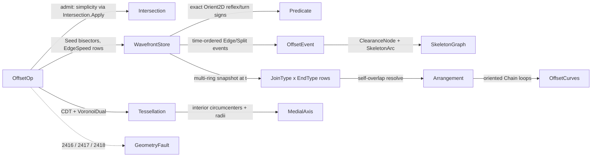

# [RASM_OFFSETTING_OFFSET]

The exact wavefront offsetting owner of `Rasm.Geometry.Offsetting` — ONE `OffsetOp` `[Union]` (`Skeleton`/`Weighted`/`Offset`/`Medial`/`Minkowski`/`Clearance`) folded by ONE `Offsetting.Apply(OffsetOp, Op? key = null)` entry over one Aichholzer-Aurenhammer wavefront propagation. The exactness lives where a sign decides structure: reflex classification and split-hit admission read the `Numerics/predicates#ROBUST_PREDICATES` exact `Orient2D` turn signs over INPUT geometry, ring simplicity routes `Meshing/intersect` `Intersection.Apply` (the local `SegmentsCross` copy is DEAD — the E7 collapse), and self-overlapping result loops resolve through `Meshing/arrangement` `PlanarOverlay` under the nonzero winding rule (the `Mesh.CreateFromClosedPolyline` null-skip of the prior fence is DEAD — loops route the arrangement DIRECTLY as ring sets); event times are analytic `double` schedule data validated at fire by liveness, ring adjacency, and the collapse band — the prior fence's decorative exact-zero test on float trajectory positions was ILLUSORY exactness and is deleted, the honest contract stated instead.

This page MINTS the kernel's ONE clearance vocabulary — `ClearanceNode(At, Radius, NearestEdge)`, the per-point clearance RADIUS as a first-class result field on every skeleton and medial node plus the `Clearance(probe)` arbitrary-probe op case — the SAME result family `Meshing/skeleton` (W4, 3D MCF) composes, so 2D medial and 3D curve-skeleton speak one clearance language across the `Rasm.Fabrication` toolpath seam (`FAB:22` — `Toolpath/Skeleton.cs` dies for `Offsetting.Apply`; the `RASM-CS-FABRICATION [V5]` weighted/variable-speed rows ride the existing `Weighted` modality). The medial axis is REAL against the `Meshing/delaunay` `VoronoiDual` projection: the ring's constrained Delaunay dual supplies circumcenters WITH circumradii (the clearance payload) whose interior sub-graph carries the parabolic reflex arcs the linear straight skeleton only approximates — the prior fence built the tessellation and DISCARDED it; this one reads the dual as the medial locus and reconciles the skeleton's reflex arcs against it. Corner strategy is a generator: `JoinType` (Miter/Round/Bevel/Square) and `EndType` (Closed/Butt/Square/Round) rows carry their own emission delegates over the ONE offset assembly — the next join is a data row, never a sibling assembler (the CavalierContours kerf/arc lane stays `Rasm.Fabrication` stratum). `MinkowskiConvolution` is COMPLETE as one ordered normal MERGE: both CCW boundaries' edge-normal sequences interleave, so translated A-edges AND the B-edge fan at every convex A vertex emit from the one merge, connected by construction (a reflex element routes the typed fault — its convex decomposition is the recorded growth row), the cycle resolved through the arrangement. The `WavefrontStore` is an honest single-writer arena under the `Meshing/edit#ARENA_LAW` contract with amortized-doubling capacity — the fixed `2n` under-allocation and the immutable-record prose of the prior fence are dead. Failures route the `offsetting` cluster (`DegenerateOffset` 2416, `SkeletonStalled` 2417, `CollapseStalled` 2418).

## [01]-[INDEX]

- [01]-[OFFSETTING]: ONE `Offsetting.Apply(OffsetOp, Op?)` entry; the wavefront event queue (edge collapse / reflex split) over one `WavefrontStore` arena; the MINTED `ClearanceNode` family + `Clearance(probe)` query; medial REAL against the delaunay `VoronoiDual`; `JoinType`×`EndType` corner/cap generator rows; complete two-directional Minkowski convolution; loop resolution through the arrangement.

## [02]-[OFFSETTING]

- Owner: `OffsetKind` `[SmartEnum<string>]` the operation discriminant (`skeleton`/`weighted`/`offset`/`medial`/`minkowski`/`clearance`) binding the shipped `ComparerAccessors.StringOrdinal`, carrying `EmitsGraph`/`EmitsCurves` columns; `JoinType` `[SmartEnum<string>]` (`miter`/`round`/`bevel`/`square`) — each row carries its `[UseDelegateFromConstructor]` `Corner` emission delegate (the fan a convex offset corner inserts between its two offset segments: the clamped miter apex, the arc fan at `ArcTolerance`, the bare chord, the squared pair) so the offset assembly reads the row and a join `switch` is unspellable; `EndType` `[SmartEnum<string>]` (`closed`/`butt`/`square`/`round`) — cap emission rows for open-path offsets, `closed` the ring row that emits nothing; `OffsetPolicy` the policy row (`TimeBudget` · `MaxEvents` · `CollapseTolerance` · `MiterLimit` · `ArcTolerance` · `EdgeSpeed` the per-edge speed table the `Weighted` modality reads via `SpeedOf`) registering `IValidityEvidence`; `ClearanceNode` THE minted clearance carrier (`At` · `Radius` — the distance-to-boundary payload every consumer reads · `NearestEdge` the witness); `SkeletonArc(From, To, OriginEdge)`; `SkeletonGraph(Seq<ClearanceNode>, Seq<SkeletonArc>)`; `MedialAxis(Seq<ClearanceNode>, Seq<SkeletonArc>)` — the SAME node family, dual-sourced; `OffsetCurves(Seq<Chain> Loops, double Distance)` — composing intersect's oriented `Chain` rows, open and closed; `WavefrontStore` the single-writer propagation arena (position/velocity columns, `Prev`/`Next` active rings, dead bitset + free list, `SpawnTime`/`Origin` provenance; `Spawn` grows every column by amortized doubling); `OffsetEvent` `[Union]` (`Edge`/`Split`) the time-ordered queue algebra; `OffsetOp`/`OffsetResult` the request/result unions; `Offsetting` the static surface.
- Cases: `OffsetKind` rows 6; `JoinType` rows 4; `EndType` rows 4; `OffsetEvent` cases 2; `OffsetOp` cases `Skeleton` · `Weighted` · `Offset` · `Medial` · `Minkowski` · `Clearance` (6); `OffsetResult` cases `Graph` · `Axis` · `Curves` · `Probe` (4).
- Entry: `public static Fin<OffsetResult> Apply(OffsetOp op, Op? key = null)` — the ONE entry discriminating on the op case. `Fin<T>` routes `GeometryFault.DegenerateOffset(vertex, time)` 2416 on an inadmissible ring (open where a ring is demanded, zero area, self-intersecting — simplicity checked through `Intersection.Apply`, never a local crossing kernel) or a wavefront that dies at a vertex; `GeometryFault.SkeletonStalled(pendingEvents, time)` 2417 when the event budget exhausts with the queue non-empty; `GeometryFault.CollapseStalled(iteration, residual)` 2418 on a zero-progress event cycle (a same-time re-enqueue livelock — the residual is the stalled time delta). `Skeleton`/`Weighted` return `Graph`; `Medial` returns `Axis`; `Offset`/`Minkowski` return `Curves`; `Clearance` returns `Probe`. `Offset` owns every offset modality in one case: an inward closed-ring offset (positive `Distance` — the wavefront lane, where topology events live), an outward closed-ring offset (negative `Distance` — the direct ribbon lane), and an open-path offset (the two-sided ribbon with `EndType` caps) — the input shape plus the distance sign discriminate, never a sibling `OffsetOpen`/`OffsetOutward` entry. No `BuildSkeleton`/`BuildMedial`/`OffsetPolyline` sibling statics — one polymorphic `Apply`.
- Auto: `Skeleton`/`Weighted`/`Offset` run the ONE `Propagate` wavefront — `Seed` builds the active ring with each vertex's inward bisector velocity (the `Weighted` row scaling each edge's unit normal by `OffsetPolicy.SpeedOf(edge)` — the weighted straight skeleton is the SAME queue at non-unit speeds, never a parallel skeletonizer), `EnqueueAt` computes each vertex's analytic edge-collapse and reflex-split candidate times (`IsReflex` the exact `Orient2D` turn sign — a near-collinear vertex never spuriously splits), and the time-ordered `PriorityQueue` drains: an `Edge` event re-validates liveness + ring adjacency + the collapse band then merges the pair into one respawned vertex (skeleton node minted WITH its clearance radius — the collapse time times the unit speed IS the boundary distance; under `Weighted` the radius recomputes as the true Euclidean edge distance so the clearance payload never lies), a `Split` event re-validates the reflex hit on its opposing edge then divides the ring into two live rings, and every affected vertex re-enqueues its candidates. `Offset` splits by lane: the inward closed-ring offset drains the wavefront FROZEN at `until = Distance` (events past the instant stay unfired, so the store IS the state at `Distance` — never the fully-collapsed end state) and EVERY surviving ring walks out (the multi-ring snapshot; the prior fence's first-ring-only walk dropped every post-split component) with the `JoinType` row's fan dressed at each corner; the outward and open-path offsets ride the direct ribbon (per-edge translates + corner fans + `EndType` caps — no topology events exist on the growing side); and any self-overlapping loop set from either lane routes `Arrangement.Apply(PlanarOverlay(loops, ∅, Union, plane, policy))` under the nonzero winding rule. `Medial` builds the ring's constrained Delaunay (`Tessellation.Build`, `Delaunay` mode, boundary `Constraint.Segment` rows), takes `VoronoiDual`, keeps the interior sub-graph (dual nodes of inside triangles — the even-odd parity of each triangle against the ring), and emits `MedialAxis` nodes as `ClearanceNode(circumcenter, circumradius, nearestEdge)` — the parabolic reflex arcs ARE the dual's curved sampling, reconciled against the straight skeleton's linear reflex arcs (the skeleton underestimates clearance at reflex fans; the dual carries the true bisector locus). `Minkowski` gates the element convex (exact turn signs; a reflex turn faults — convex decomposition is the recorded growth row) then runs the ordered normal MERGE: both boundaries CCW, both edge-normal sequences CCW-sorted, so advancing whichever boundary's normal leads emits translated A-edges and the B-edge fan at each convex A vertex as ONE connected cycle — both convolution directions from one merge — resolved through the arrangement's nonzero winding into the sum boundary. `Clearance` answers the arbitrary probe: the exact scan over ring edges for the minimum point-segment distance, returning `ClearanceNode(probe, radius, argminEdge)`.
- Receipt: none on a dedicated rail — the `OffsetResult` union IS the typed result, every node row carrying its clearance radius as first-class evidence; the hash-eligible artifacts are the emitted `Polyline`/`Chain` values, never the live `WavefrontStore`.
- Packages: `Rasm.Geometry.Numerics` (`Predicate.Orient2D`/`Sign`/`Axis` — the exact-turn floor), `Rasm.Geometry.Intersection` (`Intersection.Apply` `SegmentSegment` — ring simplicity + convolution crossing checks; `Chain` — the loop rows), `Rasm.Geometry.Arrangement` delaunay owners (`Tessellation.Build` + `VoronoiDual`/`DualGraph` — the medial substrate) and arrangement owners (`Arrangement.Apply` `PlanarOverlay` — loop resolution), `Rasm.Geometry` (`GeometryFault`), `Rasm.Domain` (`Op`, `Kind`, `ValidityClaim`/`IValidityEvidence`), `Rasm`/Vectors (`Point3d`/`Vector3d`/`Polyline`), Thinktecture.Runtime.Extensions, LanguageExt.Core, BCL inbox (`PriorityQueue<TElement,TPriority>`).
- Growth: a new offsetting modality (curved-input offset, multi-ring nesting offset) is one `OffsetKind` row plus one `OffsetOp` case over the SAME propagation; a new corner strategy is ONE `JoinType` row carrying its emission delegate (the generator law — never a fourth assembly body); a new cap is one `EndType` row; a new event shape is one `OffsetEvent` case plus one drain arm; the 3D clearance consumer (`Meshing/skeleton`, W4) COMPOSES `ClearanceNode` — the family widens by zero types; the Fabrication variable-speed rows ride `EdgeSpeed`; zero new surface.
- Boundary: the offsetting owner is the ONE `OffsetOp` `[Union]` and a `StraightSkeleton`/`MedialAxis`/`MinkowskiSum`/`PolygonOffset` sibling family is the named density defect collapsed onto one union; the clearance vocabulary is THE `ClearanceNode` family minted here and a radius-less medial node, a sibling 3D clearance shape, or a per-consumer clearance record is the named capability defect (`Meshing/skeleton` composes THIS family); event ordering is analytic schedule data and CLAIMED exactness over float trajectory positions is the named illusory-robustness defect this rebuild deletes — the exact signs live at reflex classification, split admission, simplicity, and convolution compatibility, all over INPUT geometry; ring simplicity and convolution crossings route `Intersection.Apply` and a local four-sign straddle copy is the deleted form; loop resolution routes `Arrangement.Apply` `PlanarOverlay` ring-direct and a `Mesh.CreateFromClosedPolyline` round-trip (null on exactly the self-intersecting loops the resolve exists for) is the deleted circular form; the medial COMPOSES the delaunay `VoronoiDual` and a discarded substrate build or a local Voronoi re-derivation is the deleted form; the `WavefrontStore` is an honest single-writer arena under the `Meshing/edit#ARENA_LAW` contract (amortized doubling — a store sized `2n` where splits spawn unbounded vertices is the deleted under-allocation) and immutable prose over a mutating store is the deleted claim; `Apply` is total over the `Fin` rail and a thrown exception on a degenerate ring or a stalled queue is forbidden; a `Split` divides the ring rather than discarding a reflex chain — no propagation drops a polygon feature to satisfy a budget.

```csharp
// --- [RUNTIME_PRELUDE] ----------------------------------------------------------------------
using System;
using System.Collections.Generic;
using System.Linq;
using LanguageExt;
using LanguageExt.Common;
using Rasm.Domain;
using Rasm.Geometry;
using Rasm.Geometry.Arrangement;
using Rasm.Geometry.Intersection;
using Rasm.Geometry.Numerics;
using Rasm.Vectors;
using Rhino.Geometry;
using Thinktecture;
using static LanguageExt.Prelude;

namespace Rasm.Geometry.Offsetting;

// --- [TYPES] ------------------------------------------------------------------------------
// GENERATOR_LAW: each row carries its corner emission — the INTERIOR fan inserted between the two
// tangent points of a dressed corner (the lanes supply the tangent endpoints; Bevel's empty fan
// leaves the bare chord). A new join is one row; a join switch is unspellable.
[SmartEnum<string>]
[KeyMemberEqualityComparer<ComparerAccessors.StringOrdinal, string>]
[KeyMemberComparer<ComparerAccessors.StringOrdinal, string>]
public sealed partial class JoinType {
    public static readonly JoinType Miter  = new("miter", MiterCorner);
    public static readonly JoinType Round  = new("round", RoundCorner);
    public static readonly JoinType Bevel  = new("bevel", static (_, _, _, _, _) => Seq<Point3d>());
    public static readonly JoinType Square = new("square", SquareCorner);

    [UseDelegateFromConstructor]
    public partial Seq<Point3d> Corner(Point3d apex, Vector3d nIn, Vector3d nOut, double distance, OffsetPolicy policy);

    // Miter apex = bisector hit, clamped at MiterLimit x distance; beyond the clamp the row
    // degrades to the bevel chord — the clamp is the row's own law, never a caller branch.
    static Seq<Point3d> MiterCorner(Point3d apex, Vector3d nIn, Vector3d nOut, double distance, OffsetPolicy policy) {
        Vector3d bisector = nIn + nOut;
        double len = bisector.Length;
        if (len <= double.Epsilon) { return Seq<Point3d>(); }
        double reach = distance / (0.5 * len);
        return reach <= policy.MiterLimit * Math.Abs(distance)
            ? Seq(apex + (reach / len) * bisector)
            : Seq<Point3d>();
    }

    static Seq<Point3d> RoundCorner(Point3d apex, Vector3d nIn, Vector3d nOut, double distance, OffsetPolicy policy) {
        double sweep = Vector3d.VectorAngle(nIn, nOut);
        int steps = int.Max(1, (int)Math.Ceiling(sweep / (2.0 * Math.Acos(double.Clamp(1.0 - (policy.ArcTolerance / Math.Abs(distance)), -1.0, 1.0)))));
        return toSeq(Enumerable.Range(1, steps - 1).Select(i => {
            double t = sweep * i / steps;
            Vector3d spun = (Math.Sin(sweep - t) / Math.Sin(sweep)) * nIn + (Math.Sin(t) / Math.Sin(sweep)) * nOut;
            return apex + distance * spun;
        }));
    }

    static Seq<Point3d> SquareCorner(Point3d apex, Vector3d nIn, Vector3d nOut, double distance, OffsetPolicy policy) {
        Vector3d bisector = nIn + nOut;
        double len = bisector.Length;
        return len <= double.Epsilon
            ? Seq<Point3d>()
            : Seq(apex + distance * nIn + (policy.ArcTolerance / len) * bisector, apex + distance * nOut + (policy.ArcTolerance / len) * bisector);
    }
}

// Cap rows for open-path offsets; `closed` is the ring row emitting nothing.
[SmartEnum<string>]
[KeyMemberEqualityComparer<ComparerAccessors.StringOrdinal, string>]
[KeyMemberComparer<ComparerAccessors.StringOrdinal, string>]
public sealed partial class EndType {
    public static readonly EndType Closed = new("closed", static (_, _, _, _) => Seq<Point3d>());
    public static readonly EndType Butt   = new("butt", static (_, _, _, _) => Seq<Point3d>());
    public static readonly EndType Square = new("square", SquareCap);
    public static readonly EndType Round  = new("round", RoundCap);

    [UseDelegateFromConstructor]
    public partial Seq<Point3d> Cap(Point3d end, Vector3d tangent, double distance, OffsetPolicy policy);

    static Seq<Point3d> SquareCap(Point3d end, Vector3d tangent, double distance, OffsetPolicy policy) =>
        Seq(end + distance * new Vector3d(tangent.Y, -tangent.X, 0.0) + distance * tangent,
            end + distance * new Vector3d(-tangent.Y, tangent.X, 0.0) + distance * tangent);

    static Seq<Point3d> RoundCap(Point3d end, Vector3d tangent, double distance, OffsetPolicy policy) =>
        JoinType.Round.Corner(end, new Vector3d(tangent.Y, -tangent.X, 0.0), new Vector3d(-tangent.Y, tangent.X, 0.0), distance, policy);
}

// --- [CONSTANTS] --------------------------------------------------------------------------
// EdgeSpeed is the Weighted lane's PER-EDGE speed table (index = original ring edge; the Weighted
// admission gates Count == edge count — a wrapped or padded table is a mis-addressed request).
public sealed record OffsetPolicy(
    double TimeBudget, int MaxEvents, double CollapseTolerance, double MiterLimit, double ArcTolerance, Arr<double> EdgeSpeed = default) : IValidityEvidence {
    public static readonly OffsetPolicy Canonical =
        new(TimeBudget: 1e9, MaxEvents: 1 << 20, CollapseTolerance: 1e-12, MiterLimit: 2.0, ArcTolerance: 1e-3);

    public bool IsValid => ValidityClaim.All(
        ValidityClaim.Positive(value: TimeBudget),
        ValidityClaim.Positive(value: MaxEvents),
        ValidityClaim.Positive(value: CollapseTolerance),
        ValidityClaim.Positive(value: MiterLimit),
        ValidityClaim.Positive(value: ArcTolerance));
}

// --- [MODELS] -----------------------------------------------------------------------------
// THE minted clearance family — one vocabulary across 2D medial/skeleton and the W4 3D MCF
// skeleton: position, distance-to-boundary radius, and the nearest-feature witness.
public sealed record ClearanceNode(Point3d At, double Radius, int NearestEdge);

// ONE graph shape for skeleton AND medial (the OffsetResult case carries the semantics — two
// field-identical records are the deleted sibling form): the first n nodes are the ring vertices
// at radius zero (the degree-1 skeleton endpoints), arcs reference node ids uniformly.
public sealed record SkeletonArc(int From, int To, int OriginEdge);
public sealed record SkeletonGraph(Seq<ClearanceNode> Nodes, Seq<SkeletonArc> Arcs);
public sealed record OffsetCurves(Seq<Chain> Loops, double Distance);

// Single-writer arena under the Meshing/edit ARENA_LAW: every Spawn grows every column by
// amortized doubling — splits spawn unbounded vertices, so a fixed-extent store is structurally
// impossible here, not merely discouraged. The wavefront evaluates on the XY projection; Plane
// carries the ring elevation so every emission returns at the source plane. Node = the skeleton
// node the vertex emanates from (ring seeds ARE nodes 0..n-1); EdgeOf = the ORIGINAL ring edge
// the vertex's outgoing wavefront edge descends from — the weighted lane's speed key through
// every rewire.
public sealed class WavefrontStore {
    double[] px, py, vx, vy, spawnTime;
    int[] prev, next, node, edgeOf;
    bool[] dead;
    readonly Stack<int> free = new();
    readonly double plane;
    int count;

    public WavefrontStore(int seed, double plane) {
        (px, py, vx, vy, spawnTime) = (new double[seed], new double[seed], new double[seed], new double[seed], new double[seed]);
        (prev, next, node, edgeOf, dead) = (new int[seed], new int[seed], new int[seed], new int[seed], new bool[seed]);
        this.plane = plane;
    }

    public int Count => count;
    public bool Alive(int v) => v >= 0 && v < count && !dead[v];
    public int Prev(int v) => prev[v];
    public int Next(int v) => next[v];
    public int Node(int v) => node[v];
    public int EdgeOf(int v) => edgeOf[v];
    public double SpawnTime(int v) => spawnTime[v];
    public Point3d At(int v, double time) =>
        new(px[v] + ((time - spawnTime[v]) * vx[v]), py[v] + ((time - spawnTime[v]) * vy[v]), plane);
    public Vector3d Velocity(int v) => new(vx[v], vy[v], 0.0);

    public int Spawn(Point3d at, Vector3d velocity, double time, int fromNode, int outEdge) {
        int v = free.Count > 0 ? free.Pop() : count++;
        Grow(v + 1);
        (px[v], py[v], vx[v], vy[v]) = (at.X, at.Y, velocity.X, velocity.Y);
        (spawnTime[v], node[v], edgeOf[v], dead[v]) = (time, fromNode, outEdge, false);
        return v;
    }

    public void Kill(int v) { dead[v] = true; free.Push(v); }
    public void LinkRing(int a, int b) { next[a] = b; prev[b] = a; }

    void Grow(int needed) {
        if (needed <= px.Length) { return; }
        int extent = int.Max(needed, px.Length << 1);
        Array.Resize(ref px, extent); Array.Resize(ref py, extent);
        Array.Resize(ref vx, extent); Array.Resize(ref vy, extent);
        Array.Resize(ref spawnTime, extent);
        Array.Resize(ref prev, extent); Array.Resize(ref next, extent);
        Array.Resize(ref node, extent); Array.Resize(ref edgeOf, extent);
        Array.Resize(ref dead, extent);
    }
}

public readonly record struct Trace(WavefrontStore Store, SkeletonGraph Graph);

[Union(ConversionFromValue = ConversionOperatorsGeneration.None)]
public abstract partial record OffsetEvent {
    private OffsetEvent() { }

    public sealed record Edge(double Time, int Vertex, int NextVertex) : OffsetEvent;
    public sealed record Split(double Time, int Reflex, int OpposingA, int OpposingB) : OffsetEvent;

    public double Time =>
        Switch(edge: static e => e.Time, split: static s => s.Time);
}

[Union(ConversionFromValue = ConversionOperatorsGeneration.None)]
public abstract partial record OffsetResult {
    private OffsetResult() { }

    public sealed record Graph(SkeletonGraph Skeleton) : OffsetResult;
    public sealed record Axis(SkeletonGraph Medial) : OffsetResult;
    public sealed record Curves(OffsetCurves Offset) : OffsetResult;
    public sealed record Probe(ClearanceNode Node) : OffsetResult;
}

// --- [OPERATIONS] -------------------------------------------------------------------------
[Union(ConversionFromValue = ConversionOperatorsGeneration.None)]
public abstract partial record OffsetOp {
    private OffsetOp() { }

    public sealed record Skeleton(Polyline Ring, OffsetPolicy Policy) : OffsetOp;
    public sealed record Weighted(Polyline Ring, OffsetPolicy Policy) : OffsetOp;
    public sealed record Offset(Polyline Path, double Distance, JoinType Join, EndType End, OffsetPolicy Policy) : OffsetOp;
    public sealed record Medial(Polyline Ring, OffsetPolicy Policy) : OffsetOp;
    public sealed record Minkowski(Polyline Ring, Polyline Element, OffsetPolicy Policy) : OffsetOp;
    public sealed record Clearance(Polyline Ring, Point3d Probe, OffsetPolicy Policy) : OffsetOp;
}

public static class Offsetting {
    public static Fin<OffsetResult> Apply(OffsetOp op, Op? key = null) =>
        op switch {
            OffsetOp.Skeleton s  => AdmitRing(s.Ring, key).Bind(ring => Propagate(ring, s.Policy, Arr<double>.Empty)).Map(static t => (OffsetResult)new OffsetResult.Graph(t.Graph)),
            OffsetOp.Weighted w  => AdmitRing(w.Ring, key)
                .Bind(ring => w.Policy.EdgeSpeed.Count == ring.Count - 1
                    ? Propagate(ring, w.Policy, w.Policy.EdgeSpeed)
                    : Fin.Fail<Trace>(new GeometryFault.DegenerateOffset(w.Policy.EdgeSpeed.Count, 0.0).ToError()))
                .Map(static t => (OffsetResult)new OffsetResult.Graph(t.Graph)),
            OffsetOp.Offset o    => Snapshot(o, key),
            OffsetOp.Medial m    => AdmitRing(m.Ring, key).Bind(ring => MedialOf(ring, m.Policy, key)).Map(static axis => (OffsetResult)new OffsetResult.Axis(axis)),
            OffsetOp.Minkowski k => AdmitRing(k.Ring, key).Bind(ring => Convolve(ring, k.Element, k.Policy, key)).Map(static loops => (OffsetResult)new OffsetResult.Curves(loops)),
            OffsetOp.Clearance c => AdmitRing(c.Ring, key).Map(ring => (OffsetResult)new OffsetResult.Probe(ClearanceAt(ring, c.Probe))),
            _                    => Fin.Fail<OffsetResult>(new GeometryFault.DegenerateOffset(0, 0.0).ToError()),
        };

    // Admission once: finite, closed, non-zero-area, CCW-oriented, SIMPLE — simplicity routes the
    // ONE crossing owner per non-adjacent pair, never a local straddle copy. The owner evaluates
    // on the XY projection; the ring's leading elevation rides through to every emission.
    static Fin<Polyline> AdmitRing(Polyline ring, Op? key) {
        if (ring.Count < 4 || !ring.IsClosed) { return Fail(0); }
        for (int i = 0; i < ring.Count; i++) {
            if (!ring[i].IsValid) { return Fail(i); }
        }
        if (SignedArea(ring) == 0.0) { return Fail(0); }
        int n = ring.Count - 1;
        for (int i = 0; i < n; i++) {
            for (int j = i + 2; j < n; j++) {
                if (i == 0 && j == n - 1) { continue; }
                Fin<IntersectResult> hit = Intersection.Apply(
                    new IntersectOp.SegmentSegment(new Line(ring[i], ring[i + 1]), new Line(ring[j], ring[j + 1]), Axis.Z, IntersectPolicy.Canonical), key);
                if (hit.Case is IntersectResult.Points { Hits.IsEmpty: false }) { return Fail(i); }
            }
        }
        return Fin.Succ(Oriented(ring));
    }

    // Open-path admission: finite vertices, two or more of them, no zero-length edge (a coincident
    // pair degenerates the ribbon normal).
    static Fin<Polyline> AdmitPath(Polyline path) {
        if (path.Count < 2) { return Fail(0); }
        for (int i = 0; i < path.Count; i++) {
            if (!path[i].IsValid) { return Fail(i); }
            if (i > 0 && path[i] == path[i - 1]) { return Fail(i); }
        }
        return Fin.Succ(path);
    }

    static Fin<Polyline> Fail(int vertex) => Fin.Fail<Polyline>(new GeometryFault.DegenerateOffset(vertex, 0.0).ToError());

    // --- [WAVEFRONT]
    // Event times are analytic schedule data; validity at fire is liveness + ring adjacency + the
    // collapse band. The exact signs live at reflex classification and split admission over input
    // geometry — never a fake zero-test of float trajectory positions. `until` freezes the drain:
    // events past it stay unfired, so the store IS the wavefront state at that time — the offset
    // snapshot reads a true instant, never the fully-collapsed end state. The graph pre-seeds the
    // ring vertices as nodes 0..n-1 (radius zero — the boundary endpoints), so arcs reference node
    // ids uniformly; a non-empty speed table IS the weighted lane.
    static Fin<Trace> Propagate(Polyline ring, OffsetPolicy policy, Arr<double> speeds, double until = double.PositiveInfinity) {
        WavefrontStore store = Seed(ring, speeds);
        var queue = new PriorityQueue<OffsetEvent, double>();
        int n = ring.Count - 1;
        var nodes = new List<ClearanceNode>(Enumerable.Range(0, n).Select(i => new ClearanceNode(ring[i], 0.0, i)));
        var arcs = new List<SkeletonArc>();
        for (int v = 0; v < store.Count; v++) { EnqueueAt(store, queue, v, 0.0, policy, speeds); }
        (int fired, double lastTime, int sameTime) = (0, -1.0, 0);
        while (queue.Count > 0 && queue.Peek().Time <= until) {
            if (fired++ > policy.MaxEvents) { return Fin.Fail<Trace>(new GeometryFault.SkeletonStalled(queue.Count, queue.Peek().Time).ToError()); }
            OffsetEvent ev = queue.Dequeue();
            if (ev.Time > policy.TimeBudget) { return Fin.Fail<Trace>(new GeometryFault.SkeletonStalled(queue.Count, ev.Time).ToError()); }
            sameTime = ev.Time == lastTime ? sameTime + 1 : 0;
            if (sameTime > store.Count << 2) { return Fin.Fail<Trace>(new GeometryFault.CollapseStalled(fired, ev.Time - lastTime).ToError()); }
            lastTime = ev.Time;
            switch (ev) {
                case OffsetEvent.Edge e when store.Alive(e.Vertex) && store.Alive(e.NextVertex) && store.Next(e.Vertex) == e.NextVertex
                    && store.At(e.Vertex, e.Time).DistanceTo(store.At(e.NextVertex, e.Time)) <= policy.CollapseTolerance:
                    Collapse(store, e, ring, nodes, arcs, queue, policy, speeds);
                    break;
                case OffsetEvent.Split s when store.Alive(s.Reflex) && store.Alive(s.OpposingA) && store.Alive(s.OpposingB) && store.Next(s.OpposingA) == s.OpposingB:
                    Divide(store, s, ring, nodes, arcs, queue, policy, speeds);
                    break;
                default: break;  // stale event: superseded by an earlier rewire — skipped by validation, never by a tolerance guess
            }
        }
        return Fin.Succ(new Trace(store, new SkeletonGraph(toSeq(nodes), toSeq(arcs))));
    }

    static WavefrontStore Seed(Polyline ring, Arr<double> speeds) {
        int n = ring.Count - 1;
        var store = new WavefrontStore(int.Max(2 * n, 16), ring[0].Z);
        for (int i = 0; i < n; i++) {
            int inEdge = (i - 1 + n) % n;
            store.Spawn(ring[i], Bisector(ring[inEdge], ring[i], ring[(i + 1) % n], Speed(speeds, inEdge), Speed(speeds, i)), 0.0, fromNode: i, outEdge: i);
        }
        for (int i = 0; i < n; i++) { store.LinkRing(i, (i + 1) % n); }
        return store;
    }

    static double Speed(Arr<double> speeds, int edge) => speeds.Count > 0 ? speeds[edge] : 1.0;

    // INWARD bisector velocity: the CCW ring's interior sits LEFT of each edge, so the inward
    // normal of (a -> b) is (a.Y - b.Y, b.X - a.X) — the (dy, -dx) spelling is OUTWARD and grows
    // the front (no event ever fires); the 1/(2h²) scale gives the exact vertex speed.
    static Vector3d Bisector(Point3d prev, Point3d cur, Point3d next, double speedIn, double speedOut) {
        Vector3d nIn = speedIn * Unit(new Vector3d(prev.Y - cur.Y, cur.X - prev.X, 0.0));
        Vector3d nOut = speedOut * Unit(new Vector3d(cur.Y - next.Y, next.X - cur.X, 0.0));
        Vector3d bisector = nIn + nOut;
        double half = 0.5 * bisector.Length;
        return half <= double.Epsilon ? nOut : (1.0 / (2.0 * half * half)) * bisector;
    }

    static void EnqueueAt(WavefrontStore store, PriorityQueue<OffsetEvent, double> queue, int v, double now, OffsetPolicy policy, Arr<double> speeds) {
        if (!store.Alive(v)) { return; }
        int nxt = store.Next(v);
        EdgeCollapseTime(store, v, nxt, now).IfSome(t => { if (t <= policy.TimeBudget) { queue.Enqueue(new OffsetEvent.Edge(t, v, nxt), t); } });
        if (IsReflex(store, v, now)) {
            SplitTime(store, v, now, speeds).IfSome(s => { if (s.Time <= policy.TimeBudget) { queue.Enqueue(new OffsetEvent.Split(s.Time, v, s.A, s.B), s.Time); } });
        }
    }

    static void Collapse(WavefrontStore store, OffsetEvent.Edge ev, Polyline ring, List<ClearanceNode> nodes, List<SkeletonArc> arcs, PriorityQueue<OffsetEvent, double> queue, OffsetPolicy policy, Arr<double> speeds) {
        Point3d meet = store.At(ev.Vertex, ev.Time);
        (double radius, int witness) = EdgeDistance(ring, meet);
        int node = nodes.Count;
        nodes.Add(new ClearanceNode(meet, speeds.Count > 0 ? radius : ev.Time, witness));  // unit speed: time IS the boundary distance
        arcs.Add(new SkeletonArc(store.Node(ev.Vertex), node, store.EdgeOf(ev.Vertex)));
        arcs.Add(new SkeletonArc(store.Node(ev.NextVertex), node, store.EdgeOf(ev.NextVertex)));
        (int before, int after) = (store.Prev(ev.Vertex), store.Next(ev.NextVertex));
        store.Kill(ev.Vertex);
        store.Kill(ev.NextVertex);
        if (before == ev.NextVertex || after == ev.Vertex) { return; }  // a 2-ring dies at its node
        int outEdge = store.EdgeOf(ev.NextVertex);
        int merged = store.Spawn(meet,
            Bisector(store.At(before, ev.Time), meet, store.At(after, ev.Time), Speed(speeds, store.EdgeOf(before)), Speed(speeds, outEdge)),
            ev.Time, node, outEdge);
        store.LinkRing(before, merged);
        store.LinkRing(merged, after);
        EnqueueAt(store, queue, before, ev.Time, policy, speeds);
        EnqueueAt(store, queue, merged, ev.Time, policy, speeds);
    }

    static void Divide(WavefrontStore store, OffsetEvent.Split ev, Polyline ring, List<ClearanceNode> nodes, List<SkeletonArc> arcs, PriorityQueue<OffsetEvent, double> queue, OffsetPolicy policy, Arr<double> speeds) {
        Point3d hit = store.At(ev.Reflex, ev.Time);
        (double radius, int witness) = EdgeDistance(ring, hit);
        int node = nodes.Count;
        nodes.Add(new ClearanceNode(hit, speeds.Count > 0 ? radius : ev.Time, witness));
        arcs.Add(new SkeletonArc(store.Node(ev.Reflex), node, store.EdgeOf(ev.Reflex)));
        (int before, int after) = (store.Prev(ev.Reflex), store.Next(ev.Reflex));
        int opposingEdge = store.EdgeOf(ev.OpposingA);  // both halves of the split edge keep its origin
        int left = store.Spawn(hit,
            Bisector(store.At(before, ev.Time), hit, store.At(ev.OpposingB, ev.Time), Speed(speeds, store.EdgeOf(before)), Speed(speeds, opposingEdge)),
            ev.Time, node, opposingEdge);
        int right = store.Spawn(hit,
            Bisector(store.At(ev.OpposingA, ev.Time), hit, store.At(after, ev.Time), Speed(speeds, opposingEdge), Speed(speeds, store.EdgeOf(ev.Reflex))),
            ev.Time, node, store.EdgeOf(ev.Reflex));
        store.Kill(ev.Reflex);
        store.LinkRing(before, left);
        store.LinkRing(left, ev.OpposingB);
        store.LinkRing(ev.OpposingA, right);
        store.LinkRing(right, after);
        foreach (int v in (ReadOnlySpan<int>)[before, left, ev.OpposingA, right]) { EnqueueAt(store, queue, v, ev.Time, policy, speeds); }
    }

    static Option<double> EdgeCollapseTime(WavefrontStore store, int u, int v, double now) {
        (Point3d pu, Point3d pv) = (store.At(u, now), store.At(v, now));
        (Vector3d du, Vector3d dv) = (store.Velocity(u), store.Velocity(v));
        Vector3d gap = pv - pu, rel = dv - du;
        double closing = (gap.X * rel.X) + (gap.Y * rel.Y);
        double speed2 = (rel.X * rel.X) + (rel.Y * rel.Y);
        return closing < 0.0 && speed2 > 0.0 ? Some(now + (-closing / speed2)) : None;
    }

    // The opposing edge's line moves INWARD at its own speed; the reflex hits when its signed
    // offset along the inward normal m closes — t = now + m·(a − p) / (d·m − speed).
    static Option<(double Time, int A, int B)> SplitTime(WavefrontStore store, int reflex, double now, Arr<double> speeds) {
        Point3d p = store.At(reflex, now);
        Vector3d d = store.Velocity(reflex);
        (Option<(double, int, int)> best, double bestTime) = (None, double.PositiveInfinity);
        for (int e = store.Next(reflex); store.Alive(e) && e != store.Prev(reflex); e = store.Next(e)) {
            int f = store.Next(e);
            if (e == reflex || f == reflex || !store.Alive(f)) { continue; }
            (Point3d a, Point3d b) = (store.At(e, now), store.At(f, now));
            Vector3d m = Unit(new Vector3d(a.Y - b.Y, b.X - a.X, 0.0));
            double approach = (d.X * m.X) + (d.Y * m.Y) - Speed(speeds, store.EdgeOf(e));
            if (approach >= 0.0) { continue; }
            double t = now + (((m.X * (a.X - p.X)) + (m.Y * (a.Y - p.Y))) / approach);
            if (t > now && t < bestTime) { (best, bestTime) = (Some((t, e, f)), t); }
        }
        return best.Map(static x => (x.Item1, x.Item2, x.Item3));
    }

    // The exact turn sign at the vertex's CURRENT ring neighbours — a near-collinear vertex never
    // spuriously splits; the ring is CCW, so a clockwise turn is reflex.
    static bool IsReflex(WavefrontStore store, int v, double now) =>
        store.Alive(v)
        && Predicate.Orient2D(store.At(store.Prev(v), now), store.At(v, now), store.At(store.Next(v), now)) == Sign.Negative;

    // --- [OFFSET_ASSEMBLY]
    // Two lanes, one modality: INWARD (positive distance, closed ring) rides the wavefront frozen
    // at `until = Distance` — the event queue owns the topology changes, EVERY surviving ring
    // walks out, and a wavefront that fully collapses before `Distance` is a legitimately EMPTY
    // curve set (the offset vanished past the inradius), never a fault; OUTWARD (negative
    // distance) and OPEN paths ride the direct ribbon (edge translates + JoinType fans + EndType
    // caps — no topology events exist there). Both resolve self-overlap through the arrangement
    // under the nonzero winding rule.
    static Fin<OffsetResult> Snapshot(OffsetOp.Offset op, Op? key) =>
        (op.Path.IsClosed && op.Distance > 0.0
            ? AdmitRing(op.Path, key)
                .Bind(ring => Propagate(ring, op.Policy, Arr<double>.Empty, until: op.Distance))
                .Map(trace => Rings(trace.Store).Map(loop => Dressed(trace, loop, op)))
            : op.Path.IsClosed
                ? AdmitRing(op.Path, key).Map(ring => Ribbon(op with { Path = ring }))
                : AdmitPath(op.Path).Map(path => Ribbon(op with { Path = path })))
        .Bind(loops => loops.IsEmpty ? Fin.Succ(Seq<Chain>()) : Resolve(loops, op.Policy, key))
        .Map(chains => (OffsetResult)new OffsetResult.Curves(new OffsetCurves(chains, op.Distance)));

    static Seq<int[]> Rings(WavefrontStore store) {
        var seen = new HashSet<int>();
        var loops = new List<int[]>();
        for (int v = 0; v < store.Count; v++) {
            if (!store.Alive(v) || seen.Contains(v)) { continue; }
            var loop = new List<int>();
            int cur = v;
            do {
                seen.Add(cur);
                loop.Add(cur);
                cur = store.Next(cur);
            } while (store.Alive(cur) && cur != v && !seen.Contains(cur));
            if (loop.Count > 2) { loops.Add([.. loop]); }
        }
        return toSeq(loops);
    }

    // Corner dressing on the wavefront snapshot: a REFLEX corner's true inward offset is the ARC
    // of radius (Distance - spawn) centred on the corner's emanating NODE — the lane supplies the
    // two tangent points (centre + r·m̂ along each adjacent edge's inward normal; the moving edge
    // stays tangent to that circle), the JoinType row emits only the INTERIOR fan between them
    // (Miter keeps the trajectory vertex; Bevel's empty fan leaves the bare chord). Convex corners
    // ARE the exact offset and pass through untouched.
    static Polyline Dressed(Trace trace, int[] loop, OffsetOp.Offset op) {
        WavefrontStore store = trace.Store;
        var dressed = new Polyline();
        int n = loop.Length;
        for (int k = 0; k < n; k++) {
            int v = loop[k];
            Point3d at = store.At(v, op.Distance);
            (Point3d prev, Point3d next) = (store.At(loop[(k - 1 + n) % n], op.Distance), store.At(loop[(k + 1) % n], op.Distance));
            double r = op.Distance - store.SpawnTime(v);
            bool reflex = op.Join != JoinType.Miter && r > 0.0 && Predicate.Orient2D(prev, at, next) == Sign.Negative;
            if (!reflex) { dressed.Add(at); continue; }
            Point3d centre = trace.Graph.Nodes[store.Node(v)].At;
            Vector3d mIn = Unit(new Vector3d(prev.Y - at.Y, at.X - prev.X, 0.0));
            Vector3d mOut = Unit(new Vector3d(at.Y - next.Y, next.X - at.X, 0.0));
            dressed.Add(centre + (r * mIn));
            foreach (Point3d fan in op.Join.Corner(centre, mIn, mOut, r, op.Policy)) { dressed.Add(fan); }
            dressed.Add(centre + (r * mOut));
        }
        if (dressed.Count > 2) { dressed.Add(dressed[0]); }
        return dressed;
    }

    // The direct ribbon: per-edge offset translates with the row's fan at every turned-convex
    // vertex; open paths close through the EndType caps and the mirrored return side.
    static Seq<Polyline> Ribbon(OffsetOp.Offset op) {
        Polyline path = op.Path;
        bool closed = path.IsClosed;
        int n = path.Count - (closed ? 1 : 0);
        double d = Math.Abs(op.Distance);
        var cycle = new Polyline();
        Emit(cycle, path, n, closed, d, forward: true, op);
        if (!closed) {
            foreach (Point3d cap in op.End.Cap(path[n - 1], Unit(path[n - 1] - path[n - 2]), d, op.Policy)) { cycle.Add(cap); }
            Emit(cycle, Reversed(path), n, closed: false, d, forward: true, op);
            foreach (Point3d cap in op.End.Cap(path[0], Unit(path[0] - path[1]), d, op.Policy)) { cycle.Add(cap); }
        }
        if (cycle.Count > 2) { cycle.Add(cycle[0]); return Seq(cycle); }
        return Seq<Polyline>();

        static void Emit(Polyline cycle, Polyline path, int n, bool closed, double d, bool forward, OffsetOp.Offset op) {
            int edges = closed ? n : n - 1;
            for (int i = 0; i < edges; i++) {
                (Point3d a, Point3d b) = (path[i], path[(i + 1) % n]);
                Vector3d normal = d * Unit(Normal(a, b));
                cycle.Add(a + normal);
                cycle.Add(b + normal);
                if (closed || i + 1 < edges) {
                    foreach (Point3d fan in op.Join.Corner(b, Unit(Normal(a, b)), Unit(Normal(b, path[(i + 2) % n])), d, op.Policy)) { cycle.Add(fan); }
                }
            }
            _ = forward;
        }

        static Polyline Reversed(Polyline path) {
            var back = new Polyline(path);
            back.Reverse();
            return back;
        }
    }

    // Self-overlap check routes the ONE crossing owner; resolution routes the arrangement ring-direct.
    static Fin<Seq<Chain>> Resolve(Seq<Polyline> loops, OffsetPolicy policy, Op? key) {
        bool overlapping = loops.Exists(loop => {
            int n = loop.Count - 1;
            for (int i = 0; i < n; i++) {
                for (int j = i + 2; j < n; j++) {
                    if (i == 0 && j == n - 1) { continue; }
                    Fin<IntersectResult> hit = Intersection.Apply(new IntersectOp.SegmentSegment(new Line(loop[i], loop[i + 1]), new Line(loop[j], loop[j + 1]), Axis.Z, IntersectPolicy.Canonical), key);
                    if (hit.Case is IntersectResult.Points { Hits.IsEmpty: false }) { return true; }
                }
            }
            return false;
        });
        return overlapping
            ? Arrangement.Apply(new ArrangementOp.PlanarOverlay(loops, Seq<Polyline>(), BooleanOp.Union, Axis.Z, ArrangementPolicy.Canonical), key)
                .Bind(static result => result is ArrangementResult.Overlay overlay
                    ? Fin.Succ(overlay.Loops)
                    : Fin.Fail<Seq<Chain>>(new GeometryFault.DegenerateOffset(0, 0.0).ToError()))
            : Fin.Succ(loops.Map(static loop => new Chain(loop, Closed: true)));
    }

    // --- [MEDIAL]
    // REAL against the delaunay dual: interior circumcenters ARE medial samples carrying their
    // circumradius as the clearance payload; the dual's curved sampling carries the parabolic
    // reflex arcs the linear skeleton approximates.
    static Fin<MedialAxis> MedialOf(Polyline ring, OffsetPolicy policy, Op? key) {
        int n = ring.Count - 1;
        Implicit[] rows = [.. Enumerable.Range(0, n).Select(i => new Implicit(ring[i]))];
        Seq<Constraint> edges = toSeq(Enumerable.Range(0, n).Select(i => (Constraint)new Constraint.Segment(i, (i + 1) % n)));
        return Tessellation.Build(new TessellationOp.Points(TessellationKind.Triangulation, rows, edges, TessellationPolicy.Canonical, Axis.Z), key)
            .Bind(t => t.VoronoiDual(key).Map(dual => (Tess: t, Dual: dual)))
            .Bind(pair => pair.Tess.Triangles(key).Map(tris => (pair.Dual, Tris: tris)))
            .Map(x => {
                bool[] interior = [.. x.Tris.Select(tri => Inside(Centroid(tri), ring))];
                var keep = new Dictionary<int, int>();
                var nodes = new List<ClearanceNode>();
                for (int i = 0; i < x.Dual.Circumcenters.Length; i++) {
                    if (i < interior.Length && interior[i]) {
                        keep[i] = nodes.Count;
                        (double radius, int edge) = EdgeDistance(ring, x.Dual.Circumcenters[i]);
                        nodes.Add(new ClearanceNode(x.Dual.Circumcenters[i], double.Min(radius, x.Dual.Radius[i]), edge));
                    }
                }
                var arcs = new List<SkeletonArc>();
                for (int e = 0; e < x.Dual.Edges.Length; e++) {
                    (int a, int b) = x.Dual.Edges[e];
                    if (keep.TryGetValue(a, out int ka) && keep.TryGetValue(b, out int kb)) { arcs.Add(new SkeletonArc(ka, kb, x.Dual.Across[e].U)); }
                }
                return new MedialAxis(toSeq(nodes), toSeq(arcs));
            });
    }

    // --- [MINKOWSKI]
    // The COMPLETE convolution as an ordered normal merge: both boundaries CCW, both edge-normal
    // sequences CCW-sorted, so the convolution cycle interleaves translated A-edges (advancing A
    // while its normal leads) and B-edge fans at A's vertices (advancing B while its normal leads)
    // — BOTH directions and every convex-vertex fan emitted by the ONE merge, connected by
    // construction. Merge order rides normal angles (a near-tie merged either way differs by a
    // degenerate sliver the arrangement resolve removes); the element must be CONVEX — a reflex
    // element turn routes the typed fault, its convex decomposition the recorded growth row.
    static Fin<OffsetCurves> Convolve(Polyline ring, Polyline element, OffsetPolicy policy, Op? key) {
        int rn = ring.Count - 1, en = element.Count - 1;
        for (int j = 0; j < en; j++) {
            if (Predicate.Orient2D(element[(j - 1 + en) % en], element[j], element[(j + 1) % en]) == Sign.Negative) {
                return Fin.Fail<OffsetCurves>(new GeometryFault.DegenerateOffset(j, 0.0).ToError());
            }
        }
        double AngleA(int i) => Math.Atan2(Normal(ring[i % rn], ring[(i + 1) % rn]).Y, Normal(ring[i % rn], ring[(i + 1) % rn]).X);
        double AngleB(int j) => Math.Atan2(Normal(element[j % en], element[(j + 1) % en]).Y, Normal(element[j % en], element[(j + 1) % en]).X);
        int b0 = Enumerable.Range(0, en).OrderBy(AngleB).First();  // align B's sweep start under A's first edge normal
        var cycle = new Polyline();
        (int i, int j) = (0, b0);
        for (int emitted = 0; emitted < rn + en; emitted++) {
            cycle.Add(ring[i % rn] + (element[j % en] - Point3d.Origin));
            double turnA = Sweep(AngleA(i));
            double turnB = Sweep(AngleB(j));
            if (turnA <= turnB && i < rn) { i++; }
            else { j++; }
        }
        cycle.Add(cycle[0]);
        return Arrangement.Apply(new ArrangementOp.PlanarOverlay(Seq(cycle), Seq<Polyline>(), BooleanOp.Union, Axis.Z, ArrangementPolicy.Canonical), key)
            .Bind(static result => result is ArrangementResult.Overlay overlay
                ? Fin.Succ(new OffsetCurves(overlay.Loops, 0.0))
                : Fin.Fail<OffsetCurves>(new GeometryFault.DegenerateOffset(0, 0.0).ToError()));

        static double Sweep(double angle) => angle < 0.0 ? angle + (2.0 * Math.PI) : angle;
    }

    // --- [CLEARANCE]
    // The arbitrary-probe query of the minted family: minimum point-segment distance + witness.
    static ClearanceNode ClearanceAt(Polyline ring, Point3d probe) {
        (double radius, int edge) = EdgeDistance(ring, probe);
        return new ClearanceNode(probe, radius, edge);
    }

    static (double Radius, int Edge) EdgeDistance(Polyline ring, Point3d p) {
        (double best, int at) = (double.PositiveInfinity, 0);
        for (int e = 0; e < ring.Count - 1; e++) {
            double d = new Line(ring[e], ring[e + 1]).DistanceTo(p, limitToFiniteSegment: true);
            if (d < best) { (best, at) = (d, e); }
        }
        return (best, at);
    }

    // --- [PRIMITIVES]
    static Vector3d Normal(Point3d a, Point3d b) => new(b.Y - a.Y, a.X - b.X, 0.0);
    static Vector3d Unit(Vector3d v) { double len = v.Length; return len == 0.0 ? v : (1.0 / len) * v; }

    static double SignedArea(Polyline ring) {
        double sum = 0.0;
        for (int i = 0; i < ring.Count - 1; i++) { sum += (ring[i].X * ring[i + 1].Y) - (ring[i + 1].X * ring[i].Y); }
        return 0.5 * sum;
    }

    static Polyline Oriented(Polyline ring) {
        if (SignedArea(ring) >= 0.0) { return ring; }
        var reversed = new Polyline(ring);
        reversed.Reverse();
        return reversed;
    }

    static bool Inside(Point3d probe, Polyline ring) {
        bool inside = false;
        for (int e = 0; e < ring.Count - 1; e++) {
            (Point3d a, Point3d b) = (ring[e], ring[e + 1]);
            if ((a.Y > probe.Y) == (b.Y > probe.Y)) { continue; }
            Sign side = Predicate.Orient2D(a, b, probe);
            if (side.Times(Sign.Of(b.Y.CompareTo(probe.Y))) == Sign.Negative) { inside = !inside; }
        }
        return inside;
    }

    static Point3d Centroid((Point3d A, Point3d B, Point3d C) tri) =>
        new((tri.A.X + tri.B.X + tri.C.X) / 3.0, (tri.A.Y + tri.B.Y + tri.C.Y) / 3.0, (tri.A.Z + tri.B.Z + tri.C.Z) / 3.0);
}
```



## [03]-[DENSITY_BAR]

One owner per axis; capability is a case, row, or fold arm, never a sibling surface. The `[RAIL]` cell names the one return rail each owner exposes.

| [INDEX] | [AXIS/CONCERN]    | [OWNER]          | [KIND]                                                                                          | [RAIL]                                     | [CASES] |
| :-----: | :---------------- | :--------------- | :------------------------------------------------------------------------------------------------ | :------------------------------------------- | :-----: |
|  [01]   | Offsetting        | `OffsetOp`       | `[Union]` (`Skeleton`/`Weighted`/`Offset`/`Medial`/`Minkowski`/`Clearance`) folded by ONE `Apply` | `Offsetting.Apply → Fin<OffsetResult>`     |    6    |
|  [1a]   | Operation kind    | `OffsetKind`     | `[SmartEnum<string>]` + emits columns                                                            | discriminant (pure)                        |    6    |
|  [1b]   | Corner generator  | `JoinType`       | `[SmartEnum<string>]` — each row carries its `Corner` emission delegate                          | policy rows (the next join is a row)       |    4    |
|  [1c]   | Cap generator     | `EndType`        | `[SmartEnum<string>]` — each row carries its `Cap` emission delegate                             | policy rows                                |    4    |
|  [1d]   | Clearance family  | `ClearanceNode`  | THE minted 2D/3D clearance carrier — position · radius · nearest-feature witness                 | result rows (skeleton.md composes, W4)     |    —    |
|  [1e]   | Wavefront arena   | `WavefrontStore` | single-writer SoA arena, amortized-doubling `Spawn`, ring links                                  | arena (trace projections)                  |    —    |
|  [1f]   | Event algebra     | `OffsetEvent`    | `[Union]` (`Edge`/`Split`) drained time-ordered                                                  | carrier (drained in `Propagate`)           |    2    |

The prior fence's `SegmentsCross` copy, `Mesh.CreateFromClosedPolyline` loop path, discarded medial tessellation, single-direction fan-less Minkowski, first-ring-only snapshot, `2n` store sizing, and decorative exact-zero event guard are all deleted; every deletion lands as a composition of the sibling owner that already carries the concern.

## [04]-[RESEARCH]

- [WAVEFRONT_HONESTY] — the Aichholzer-Aurenhammer propagation is exact where exactness is structural and analytic where it is schedule: `IsReflex` and the split-hit admission read exact `Orient2D` turn signs (a mis-classified reflex vertex produces a spurious split or a missed one — the failure class the predicate floor closes), while candidate event TIMES are analytic ray intersections whose staleness is caught at fire by liveness + ring-adjacency + collapse-band validation — a superseded event is skipped by structure, never by an epsilon guess, and the prior fence's exact-sign test over float trajectory positions (which could essentially never fire and silently skipped collapse events) is the deleted illusory form. Zero-progress livelock (a same-time re-enqueue cycle) routes `CollapseStalled(iteration, residual)`; budget exhaustion routes `SkeletonStalled(pending, time)`. The `Weighted` row is the SAME queue at non-unit `EdgeSpeed` — its skeleton nodes recompute the TRUE Euclidean clearance radius so the minted family never carries a weighted time as a distance. The law-matrix (`SkeletonLaws`, CsCheck under `testing-cs`) asserts arcs partition the interior, per-edge monotone faces, termination within budget, weighted determinism, and that every snapshot ring is simple.
- [CLEARANCE_FAMILY] — `ClearanceNode(At, Radius, NearestEdge)` is the kernel's ONE clearance vocabulary: skeleton nodes carry collapse-time radii (unit speed = boundary distance), medial nodes carry circumradii off the dual, the `Clearance(probe)` case answers arbitrary probes with the exact minimum edge distance and its witness — and `Meshing/skeleton` (W4) emits its 3D MCF nodes as the SAME family, so the `Rasm.Fabrication` toolpath seam (`FAB:22`) reads one payload across dimensionalities: per-point clearance radius plus arbitrary-probe query, the `[V5]` weighted/variable-speed demands riding `EdgeSpeed` and the existing `Weighted` case.
- [MEDIAL_VIA_DUAL] — the medial axis composes the delaunay `VoronoiDual`: the ring's CDT interior circumcenters sample the true bisector locus — including the PARABOLIC point-edge bisectors at reflex fans the linear straight skeleton only approximates — each dual node carrying its circumradius, tightened against the exact edge-distance scan, as the clearance payload; interior selection is the exact-sign ray parity of each triangle centroid. The straight skeleton and the medial coincide on convex input and diverge exactly at reflex vertices — the two projections serve different consumers (offset assembly wants the skeleton's monotone faces; toolpath clearance wants the medial's true radii) off one wavefront + one dual, never two skeleton engines. The exact circumcenter side-of trim is the recorded growth row on the dual.
- [CONVOLUTION_AND_RESOLUTION] — the Minkowski convolution is one ordered normal MERGE over two CCW boundaries: because both edge-normal sequences are CCW-sorted, advancing whichever boundary's normal leads interleaves translated A-edges with the B-edge fan at each convex A vertex — BOTH convolution directions and every fan from one merge, the cycle connected by construction; the element is gated CONVEX by exact turn signs (a reflex element faults typed, its convex decomposition the recorded growth row), merge ORDER rides normal angles (a near-tie merged either way differs by a degenerate sliver the resolve removes — order is assembly scheduling, never a sign decision), and the self-overlapping convolution cycle resolves through `Arrangement.Apply` `PlanarOverlay` under the NONZERO winding rule — even-odd would punch false holes where the convolution winds twice, so the arrangement's ring classification counts signed crossings. The same resolution serves the offset snapshot: any self-overlapping offset loop set routes the arrangement ring-direct — the prior `CreateFromClosedPolyline` bridge failed on exactly the self-intersecting loops the resolve exists for and is deleted as a circular dependency, not merely as noise.
