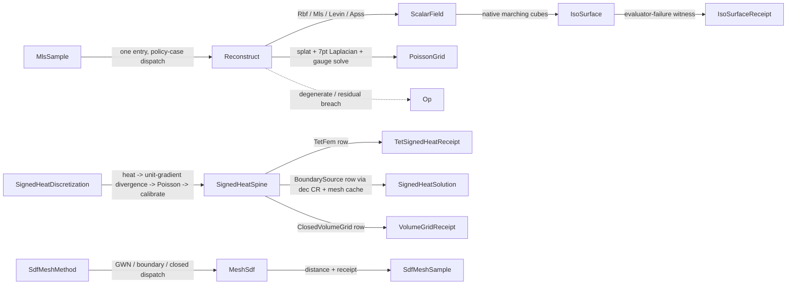

# [RASM_RECONSTRUCTION_RECONSTRUCT]

`Reconstruction` owns one `Reconstruct` entry over `ReconstructionPolicy`; each policy case builds a `Spatial/fields` scalar field carrying typed reconstruction evidence. `SignedHeatSpine`, `MeshSdf`, and `IsoSurface` own the delegated signed-distance and native-extraction rails, every native callback boundary converted through `Op.Catch` and every failure kept on `Fin`.

`Spatial/fields` owns the `ScalarField` union and its frozen cases; this page owns the kernels those cases delegate to. `Meshing/mesh` owns the type-keyed `Memoized` solver slot and `SpdMassShift`, so this page declares `BoundarySignedHeatKey`/`ClosedSignedHeatKey` and composes the memo at `SignedHeatSpine.BoundarySolutionOf`/`ClosedSolutionOf`. `Meshing/dec` owns the Crouzeix-Raviart assembly the boundary-source row composes, `Spatial/index` the accelerated winding lane the GWN row composes, `Numerics/matrix` every linear solve, and `Numerics/calculus` the kernel-profile math.

## [01]-[INDEX]

- [02]-[RECONSTRUCTION]: the `ReconstructionPolicy` construction discriminant and its one `Reconstruct` entry, the `SignedHeatDiscretization` four-stage spine, `SdfMeshMethod` mesh-SDF dispatch, and native `IsoSurface` extraction.

## [02]-[RECONSTRUCTION]

- Owner: `ReconstructionPolicy` `[Union]` is the one construction discriminant, each case carrying its typed policy payload and deriving its `ReconstructionMode` row; `Reconstruction` is the build/evaluate kernel; `SignedHeatDiscretization` `[Union]` the spine discriminant and `SignedHeatSpine` its one four-stage signed-heat law; `MeshSdf` the mesh-SDF dispatch over `SdfMeshMethod`; `IsoSurface` the native extraction adapter; `TetMeshDomain` the validated tetrahedral domain deriving its full boundary-face topology at admission. Every knob is a validated policy row carrying a preset.
- Cases: `ReconstructionPolicy` cases `RbfCase`/`MlsCase`/`LevinCase`/`ApssCase`/`PoissonCase` select the build kernel; `ReconstructionMode` carries the seven modes with normals, sparse-system, degree, and status columns; `SignedHeatDiscretization` cases `TetFem`/`BoundarySource`/`ClosedVolumeGrid`; `SdfMeshMethod` carries `GeneralizedWindingNumber`/`BoundarySignedHeat`/`ClosedSurfaceSignedHeat`, and the method row IS the mesh-SDF classification; `PoissonBoundary` carries `Neumann` (singular) and `Dirichlet` (definite); `IsoSurfaceStatus` carries four rows, each with its own receipt-evidence predicate. Every single-value policy enum lands one row in the fence.
- Entry: `Reconstruction.Reconstruct` is the one reconstruction entry — the policy case selects the build kernel, admission internalizes per case (finite positions/normals/values, mode-specific guards), and the result carries a frozen `Spatial/fields` case with `ReconstructionReceipt`. `SignedHeatSpine.Solve` routes each `SignedHeatDiscretization` case to its row kernel over the same four-stage law. `MeshSdf.SignedDistanceDetailed` dispatches on `policy.Method` and `MeshSdf.Prewarm` factors and caches the solves without sampling. `IsoSurface.Detailed` returns the classified receipt for every native outcome — admission failures alone fail the rail, consumers gate on `Receipt.Valid`. No per-mode public factory siblings on the surface.
- Auto: RBF selects interpolation vs approximation by the smoothing row (`≤ ZeroTolerance` → exact kernel-matrix solve; `> 0` → `√smoothing`-diagonal-augmented least squares) — the mode split is a value consequence, not a knob. MLS solves the 4-equation-per-neighbor design (`[1, −offset] · [value; gradient]` rows weighted by `√profile`) and gates on rank ≥ 4 and normal agreement ≥ 0.5 against the weighted normal. Levin runs step one as covariance plane seed (smallest eigenvector, orientation-corrected) then alternates Brent root-finding on the weighted energy derivative along the normal (bracket/accuracy scale-derived from support) with normal re-estimation (at most `NormalMaxIter` inner steps against `NormalTau`, offset/normal convergence at `StepEps`/`NormalStepTol`), gated by the planarity ratio `λ0/λ2 ≤ PlanarityTau`; step two fits the ridge-regularized degree-`PolyDegree` height polynomial in the local tangent frame. APSS fits the algebraic sphere `(hc, hl, hq)` by Pratt normalization, classifies the plane-degenerate branch by `DegeneracyRatio ≤ EpsDegeneracy`, and projects iteratively with `StepDamping` under `ProjTol`. Poisson splats inward normals trilinearly onto the `2^Depth` lattice — the degree-1 discretization, the ONE splat the lattice owns (splat radius `Width`-scaled per cell; density estimate normalized by `SamplesPerNode` with weight floor `max(√ε, Density)`; bounding box grown by `Scale`) — assembles the 7-point Laplacian with one-sided boundary differences, adds `α = 8^Depth · PointWeight` screening outer products per sample when screened, imposes Dirichlet rows when `Boundary.IsDirichlet`, solves definite systems by `CholeskySparse` and singular ones by `SingularSolveDetailed` under `GaugePolicy.PinConstant(interior, GaugeShift.PinZero)` — residual-gated against `Solver.ResidualTolerance` like every other solve on this page — and derives the isovalue `γ` as the density-weighted mean sample indicator. Signed-heat rows specialize the same four stages across tet FEM, boundary CR, and closed volume-grid discretizations, heat time resolving per row from `SignedHeatTime`.
- Receipt: every build, point evaluation, and spine step carries its typed receipt as one `ValidityClaim.All` fold. `ReconstructionReceipt`/`ReconstructionSampleReceipt` ride the RBF/MLS rail with the interpolation verdict on `Mode.Status`; the deep `LevinMlsSampleReceipt`/`ApssSampleReceipt` carry their solver witnesses; `PoissonReceipt` carries the splat-conservation claim; `SignedHeatReceipt`/`VolumeGridReceipt`/`TetSignedHeatReceipt` sit per spine row, `SdfMeshReceipt` on the mesh-SDF rail, and `IsoSurfaceReceipt` inside `IsoSurfaceResult`.
- Packages: `Rasm.Numerics` `Numerics/matrix` (sparse and dense solves, gauge policy, solve receipts) and `Numerics/calculus` (kernel-profile math, composed never re-minted); `Meshing/mesh` (the `MeshSpace` snapshot, cache memo slots, `TopologyReceipt`) and `Meshing/dec` (CR heat-system assembly, face-field sampling, intrinsic divergence); `Spatial/fields` (`ScalarField` frozen cases as the build product); `Spatial/index` (`Spatial.Apply` over `SpatialQuery.Winding`, the accelerated GWN lane); `Domain/rails` and `Domain/context`; MathNet.Numerics (`RootFinding.Brent` for the Levin energy root); RhinoCommon (`Mesh.CreateFromIsosurface` and the inside/closest/orientation predicates, genuinely Rhino-boundary, never thinned); LanguageExt.Core; BCL (`Interlocked`).
- Growth: a new reconstruction family (partition-of-unity implicits, neural pull) is one `ReconstructionPolicy` case + one `ReconstructionMode` row + one build arm producing a new frozen field case; a new signed-heat discretization (polygon FEM, adaptive octree grid) is one `SignedHeatDiscretization` case + one stage row on the same four-stage spine — never a parallel heat→Poisson pipeline; a new mesh-SDF method is one `SdfMeshMethod` row; a new lattice boundary condition is one `PoissonBoundary` row with its column values; a grid ceiling change is a policy-row edit; zero new entry surface.
- Boundary: `SignedHeatSpine` owns one heat→divergence→Poisson→calibrate law. Boundary-source rows reject flipped intrinsic snapshots; closed-grid rows admit only watertight, solid, closed, oriented topology. `PoissonGrid.SampleTrilinear` returns a positive outside value instead of clamping to an edge. Native evaluator callbacks count failures with `Interlocked`; every linear solve routes through `Numerics/matrix`, and `Op.Catch` converts the native callback boundary.

```csharp signature
// --- [RUNTIME_PRELUDE] ----------------------------------------------------------------------
using System;
using System.Collections.Generic;
using System.Linq;
using System.Runtime.InteropServices;
using System.Threading;
using LanguageExt;
using Rasm.Domain;
using Rasm.Numerics;
using Rasm.Spatial;
using Rhino;
using Rhino.Geometry;
using Thinktecture;
using static LanguageExt.Prelude;
// CS0104 guard: Rhino.Geometry declares Matrix/Dimension homonyms under the dual usings.
using Dimension = Rasm.Numerics.Dimension;

namespace Rasm.Meshing;

// --- [TYPES] --------------------------------------------------------------------------------
[SmartEnum<int>]
public sealed partial class ReconstructionStatus {
    public static readonly ReconstructionStatus ExactInterpolation = new(key: 0);
    public static readonly ReconstructionStatus ApproximateSdf     = new(key: 1);
    public static readonly ReconstructionStatus PoissonIndicator   = new(key: 2);
}

// Status is a COLUMN — a pure function of the mode row, never a second bit carried beside Mode on a receipt.
[SmartEnum<int>]
public sealed partial class ReconstructionMode {
    public static readonly ReconstructionMode RbfInterpolation          = new(key: 0, requiresNormals: false, requiresSparseSystem: false, polynomialDegree: 0, status: ReconstructionStatus.ExactInterpolation);
    public static readonly ReconstructionMode RbfApproximation          = new(key: 1, requiresNormals: false, requiresSparseSystem: false, polynomialDegree: 0, status: ReconstructionStatus.ApproximateSdf);
    public static readonly ReconstructionMode MovingLeastSquares        = new(key: 2, requiresNormals: true, requiresSparseSystem: false, polynomialDegree: 1, status: ReconstructionStatus.ApproximateSdf);
    public static readonly ReconstructionMode LevinMovingLeastSquares   = new(key: 3, requiresNormals: true, requiresSparseSystem: false, polynomialDegree: 2, status: ReconstructionStatus.ApproximateSdf);
    public static readonly ReconstructionMode AlgebraicPointSetSurfaces = new(key: 4, requiresNormals: true, requiresSparseSystem: false, polynomialDegree: 2, status: ReconstructionStatus.ApproximateSdf);
    public static readonly ReconstructionMode Poisson                   = new(key: 5, requiresNormals: true, requiresSparseSystem: true, polynomialDegree: 0, status: ReconstructionStatus.PoissonIndicator);
    public static readonly ReconstructionMode ScreenedPoisson           = new(key: 6, requiresNormals: true, requiresSparseSystem: true, polynomialDegree: 0, status: ReconstructionStatus.PoissonIndicator);
    public bool RequiresNormals { get; }
    public bool RequiresSparseSystem { get; }
    public int PolynomialDegree { get; }
    public ReconstructionStatus Status { get; }
}

[SmartEnum<int>]
public sealed partial class PoissonBoundary {
    public static readonly PoissonBoundary Neumann   = new(key: 0, singular: true, exteriorValue: 0.0, isDirichlet: false);
    public static readonly PoissonBoundary Dirichlet = new(key: 1, singular: false, exteriorValue: -0.5, isDirichlet: true);
    public bool Singular { get; }
    public double ExteriorValue { get; }
    public bool IsDirichlet { get; }
}

// SdfMeshMethod IS the mesh-SDF classification — the method row carries it on the receipt.
[SmartEnum<int>]
public sealed partial class SdfMeshMethod {
    public static readonly SdfMeshMethod GeneralizedWindingNumber = new(key: 0);
    public static readonly SdfMeshMethod BoundarySignedHeat      = new(key: 1);
    public static readonly SdfMeshMethod ClosedSurfaceSignedHeat = new(key: 2);
}

[SmartEnum<int>]
public sealed partial class SdfSignConvention {
    public static readonly SdfSignConvention NegativeInsidePositiveOutside = new(key: 0, multiplier: 1.0);
    public static readonly SdfSignConvention PositiveInsideNegativeOutside = new(key: 1, multiplier: -1.0);
    public double Multiplier { get; }
}

[SmartEnum<int>]
public sealed partial class IsoSurfaceStatus {
    public static readonly IsoSurfaceStatus NativeValid = new(key: 0,
        admitsEvidence: static (failures, vertices, faces, naked) => failures == 0 && vertices > 0 && faces > 0 && naked.IsSome);
    public static readonly IsoSurfaceStatus EvaluatorFailure = new(key: 1,
        admitsEvidence: static (failures, _, _, _) => failures > 0);
    public static readonly IsoSurfaceStatus NativeReturnedNull = new(key: 2,
        admitsEvidence: static (failures, vertices, faces, naked) => failures == 0 && vertices == 0 && faces == 0 && naked.IsNone);
    public static readonly IsoSurfaceStatus NativeInvalidMesh = new(key: 3,
        admitsEvidence: static (failures, _, _, naked) => failures == 0 && naked.IsNone);

    [UseDelegateFromConstructor]
    internal partial bool AdmitsEvidence(int failures, int vertices, int faces, Option<int> nakedBoundaryLoops);
}

[SmartEnum<int>] public sealed partial class TetGaugePolicy { public static readonly TetGaugePolicy PinnedFirstBoundary = new(key: 0); }
[SmartEnum<int>] public sealed partial class TetInterpolation { public static readonly TetInterpolation Barycentric = new(key: 0); }
[SmartEnum<int>] public sealed partial class VolumeSolverKind { public static readonly VolumeSolverKind SparseCholeskyPinned = new(key: 0); }
[SmartEnum<int>] public sealed partial class VolumeBoundaryCondition { public static readonly VolumeBoundaryCondition NeumannGaugePinned = new(key: 0); }
[SmartEnum<int>] public sealed partial class VolumeInterpolation { public static readonly VolumeInterpolation Trilinear = new(key: 0); }

// THE one construction discriminant: a policy case IS the mode selection; no per-mode factory siblings.
[Union]
public abstract partial record ReconstructionPolicy {
    private ReconstructionPolicy() { }
    public sealed record RbfCase(KernelKind Kernel, PositiveMagnitude Radius, double Smoothing) : ReconstructionPolicy;
    public sealed record MlsCase(KernelKind Kernel, PositiveMagnitude Radius) : ReconstructionPolicy;
    public sealed record LevinCase(LevinMlsPolicy Policy) : ReconstructionPolicy;
    public sealed record ApssCase(ApssPolicy Policy) : ReconstructionPolicy;
    public sealed record PoissonCase(PoissonPolicy Policy) : ReconstructionPolicy;
    public static Fin<ReconstructionPolicy> Rbf(KernelKind kernel, double radius, double smoothing = 0.0, Op? key = null);
    public static Fin<ReconstructionPolicy> Mls(KernelKind kernel, double radius, Op? key = null);
    public static Fin<ReconstructionPolicy> Levin(LevinMlsPolicy policy, Op? key = null);
    public static Fin<ReconstructionPolicy> Apss(ApssPolicy policy, Op? key = null);
    public static Fin<ReconstructionPolicy> Poisson(PoissonPolicy policy, Op? key = null);
    public ReconstructionMode Mode => Switch(
        rbfCase:     static c => c.Smoothing <= RhinoMath.ZeroTolerance ? ReconstructionMode.RbfInterpolation : ReconstructionMode.RbfApproximation,
        mlsCase:     static _ => ReconstructionMode.MovingLeastSquares,
        levinCase:   static _ => ReconstructionMode.LevinMovingLeastSquares,
        apssCase:    static _ => ReconstructionMode.AlgebraicPointSetSurfaces,
        poissonCase: static c => c.Policy.PointWeight > 0.0 ? ReconstructionMode.ScreenedPoisson : ReconstructionMode.Poisson);
}

// THE spine discriminant: each case carries its domain and policy; the spine runs ONE four-stage law over the row.
[Union]
public abstract partial record SignedHeatDiscretization {
    private SignedHeatDiscretization() { }
    public sealed record TetFemCase(TetMeshDomain Domain, TetSignedHeatPolicy Policy) : SignedHeatDiscretization;
    public sealed record BoundarySourceCase(MeshSpace Space, SdfMeshPolicy Policy) : SignedHeatDiscretization;
    public sealed record ClosedVolumeGridCase(MeshSpace Space, SdfMeshPolicy Policy) : SignedHeatDiscretization;
    public static Fin<SignedHeatDiscretization> TetFem(TetMeshDomain domain, TetSignedHeatPolicy? policy = null, Op? key = null);
    public static Fin<SignedHeatDiscretization> BoundarySource(MeshSpace space, SdfMeshPolicy policy, Op? key = null);
    public static Fin<SignedHeatDiscretization> ClosedVolumeGrid(MeshSpace space, SdfMeshPolicy policy, Op? key = null);
}

// --- [CONSTANTS] ----------------------------------------------------------------------------
[BoundaryAdapter, StructLayout(LayoutKind.Auto)]
public readonly record struct SignedHeatTime(Option<PositiveMagnitude> Explicit, PositiveMagnitude Coefficient) {
    public static Fin<SignedHeatTime> Scaled(double coefficient = 1.0, Op? key = null);
    public static Fin<SignedHeatTime> Fixed(double value, Op? key = null);
    // Eager IfNone — a None lambda would capture struct state (CS1673); the fallback multiply is cheap.
    internal double Resolve(double cellSize) =>
        Explicit.Map(static heat => heat.Value).IfNone(noneValue: Coefficient.Value * cellSize * cellSize);
    internal bool IsValid => Coefficient.Value > 0.0 && Explicit.Map(static heat => heat.Value > 0.0).IfNone(noneValue: true);
}

[BoundaryAdapter, StructLayout(LayoutKind.Auto)]
public readonly record struct VolumeSolverPolicy(VolumeSolverKind Kind, PositiveMagnitude ResidualTolerance) {
    public const double DefaultRelativeResidualTolerance = 1.0e-8;
    public static Fin<VolumeSolverPolicy> SparseCholesky(double residualTolerance = DefaultRelativeResidualTolerance, Op? key = null);
    internal bool IsValid => Kind is not null && ResidualTolerance.Value > 0.0;
}

// Ceilings are POLICY ROWS: MaxNodes bounds the node lattice, KernelSofteningRatio scales the heat-kernel softening.
[BoundaryAdapter, StructLayout(LayoutKind.Auto)]
public readonly record struct VolumeGridPolicy(
    Option<Dimension> Resolution, Option<PositiveMagnitude> CellSize, PositiveMagnitude Padding,
    Dimension MaxNodes, UnitInterval KernelSofteningRatio) {
    public static Fin<VolumeGridPolicy> ByResolution(int resolution = 16, double padding = 1.0, Op? key = null);
    public static Fin<VolumeGridPolicy> ByCellSize(double cellSize, double padding = 1.0, Op? key = null);
    public static readonly Dimension DefaultMaxNodes = Dimension.Create(value: 1_000_000);
    public static readonly UnitInterval DefaultKernelSofteningRatio = UnitInterval.Create(value: 0.0625);
    internal bool IsValid => Padding.Value > 0.0 && Resolution.IsSome != CellSize.IsSome && MaxNodes.Value > 0;
}

[BoundaryAdapter, StructLayout(LayoutKind.Auto)]
public readonly record struct SdfMeshPolicy(
    SdfMeshMethod Method, SdfSignConvention SignConvention, Option<VolumeGridPolicy> Grid,
    SignedHeatTime Heat, VolumeSolverPolicy Solver, VolumeInterpolation Interpolation, VolumeBoundaryCondition BoundaryCondition,
    double WindingBetaSquared) {
    // betaSquared = the SpatialQuery.Winding far-field acceptance ratio (Barill β = 2 default).
    public static Fin<SdfMeshPolicy> GeneralizedWinding(SdfSignConvention? signConvention = null, double betaSquared = 4.0, Op? key = null);
    public static Fin<SdfMeshPolicy> BoundarySignedHeat(SignedHeatTime? heat = null, VolumeSolverPolicy? solver = null, SdfSignConvention? signConvention = null, Op? key = null);
    public static Fin<SdfMeshPolicy> ClosedSignedHeat(VolumeGridPolicy grid, SignedHeatTime? heat = null, VolumeSolverPolicy? solver = null, SdfSignConvention? signConvention = null, Op? key = null);
    internal Fin<SdfMeshPolicy> Admit(Op key);       // grid present IFF ClosedSurfaceSignedHeat; heat/solver validity; WindingBetaSquared finite > 0
}

[BoundaryAdapter, StructLayout(LayoutKind.Auto)]
public readonly record struct TetSignedHeatPolicy(
    SignedHeatTime Heat, VolumeSolverPolicy Solver, SdfSignConvention SignConvention, TetGaugePolicy Gauge, TetInterpolation Interpolation) {
    public static Fin<TetSignedHeatPolicy> Of(SignedHeatTime? heat = null, VolumeSolverPolicy? solver = null,
        SdfSignConvention? signConvention = null, TetGaugePolicy? gauge = null, TetInterpolation? interpolation = null, Op? key = null);
    internal Fin<TetSignedHeatPolicy> Admit(Op key);
}

// NormalMaxIter/NormalStepTol bound the inner normal re-estimation loop — no conjugate gradient exists on this rail.
[BoundaryAdapter, StructLayout(LayoutKind.Auto)]
public readonly record struct LevinMlsPolicy(
    PositiveMagnitude Support, int PolyDegree, double NeglectEps, int MinNeighbors, double BracketFactor,
    int MaxOuterIter, double StepEps, double RootTol, int NormalMaxIter, double NormalStepTol, double PlanarityTau,
    double RidgeLambda, double NormalTau, double ProjEps, bool PlaneThroughPoint, bool OrientNormals, WeightKernelFamily WeightKernel) {
    public static Fin<LevinMlsPolicy> Of(double support, int polyDegree = 2, double neglectEps = 1e-3, int minNeighbors = 6,
        double bracketFactor = 2.0, int maxOuterIter = 16, double stepEps = 1e-4, double rootTol = 1e-6, int normalMaxIter = 32,
        double normalStepTol = 1e-6, double planarityTau = 0.25, double ridgeLambda = 0.0, double normalTau = 0.3, double projEps = 1e-4,
        bool planeThroughPoint = false, bool orientNormals = true, WeightKernelFamily? weightKernel = null, Op? key = null);
}

[BoundaryAdapter, StructLayout(LayoutKind.Auto)]
public readonly record struct ApssPolicy(
    PositiveMagnitude Support, WeightKernelFamily WeightKernel, double Beta, double NeglectEps, double EpsDegeneracy,
    double EpsPratt, int ProjMaxIter, double ProjTol, double StepDamping, int MinNeighbors) {
    public static Fin<ApssPolicy> Of(double support, WeightKernelFamily? weightKernel = null, double beta = 1.0,
        double neglectEps = 1e-3, double epsDegeneracy = 1e-6, double epsPratt = 1e-9, int projMaxIter = 16,
        double projTol = 1e-4, double stepDamping = 1.0, int minNeighbors = 6, Op? key = null);
}

// Dense regular lattice: trilinear interpolation IS degree 1, and every lattice solve routes the one VolumeSolverPolicy
// as a direct factorization.
[BoundaryAdapter, StructLayout(LayoutKind.Auto)]
public readonly record struct PoissonPolicy(
    Dimension Depth, PositiveMagnitude Width, PositiveMagnitude Scale, PositiveMagnitude SamplesPerNode,
    double PointWeight, PoissonBoundary Boundary, VolumeSolverPolicy Solver, Option<PositiveMagnitude> Density) {
    // density <= 0 maps to None — the splat weight floor is then the sqrt-eps floor alone, never a zero sentinel.
    public static Fin<PoissonPolicy> Of(int depth = 6, double width = 1.0, double scale = 1.1, double samplesPerNode = 1.5,
        double pointWeight = 0.0, PoissonBoundary? boundary = null, VolumeSolverPolicy? solver = null,
        double density = 0.0, Op? key = null);
}

[BoundaryAdapter, StructLayout(LayoutKind.Auto)]
public readonly record struct IsoSurfacePolicy(Dimension MaxRootSteps, long MaxCells) {
    public static readonly IsoSurfacePolicy Default = new(MaxRootSteps: Dimension.Create(value: 32), MaxCells: 16_777_216L);
}

// --- [MODELS] -------------------------------------------------------------------------------
[BoundaryAdapter, StructLayout(LayoutKind.Auto)] public readonly record struct MlsSample(Point3d Position, Vector3d Normal, double Value);

// Kernel/radius/smoothing are Option — absent for kernel-less modes, never fabricated zeros; the interpolation
// verdict rides Mode.Status. PolynomialDegree is the ACTUAL fitted degree, which a Levin policy may override.
[BoundaryAdapter, StructLayout(LayoutKind.Auto)]
public readonly record struct ReconstructionReceipt(
    ReconstructionMode Mode, Option<KernelKind> Kernel, Option<double> Radius, Option<double> Smoothing,
    int SampleCount, int CenterCount, int PolynomialDegree, Option<SolveReceipt> Solve) : IValidityEvidence {
    public bool IsValid => ValidityClaim.All(
        ValidityClaim.CountAtLeast(count: SampleCount, floor: 1), ValidityClaim.CountAtLeast(count: CenterCount, floor: 0),
        ValidityClaim.CountAtLeast(count: PolynomialDegree, floor: 0),
        ValidityClaim.Of(Radius.Map(static r => ValidityClaim.Positive(r).Holds).IfNone(noneValue: true)),
        ValidityClaim.Of(Smoothing.Map(static s => ValidityClaim.Nonnegative(s).Holds).IfNone(noneValue: true)),
        ValidityClaim.Of(Solve.Map(static receipt => receipt.IsValid).IfNone(noneValue: true)));
}

[BoundaryAdapter, StructLayout(LayoutKind.Auto)]
public readonly record struct ReconstructionResult(ScalarField Field, ReconstructionReceipt Receipt) {
    internal Fin<TOut> Project<TOut>(Op key) {
        ReconstructionResult self = this;
        return AtomProjection.Rows<ReconstructionResult, TOut>(self: self, key: key,
            ProjectionRow.Of<ReconstructionReceipt>(() => Fin.Succ(self.Receipt)),
            ProjectionRow.Of<ScalarField>(() => Optional(self.Field).ToFin(key.InvalidResult())));
    }
}

[BoundaryAdapter, StructLayout(LayoutKind.Auto)]
public readonly record struct ReconstructionSample(double Value, ReconstructionSampleReceipt Receipt) {
    internal Fin<TOut> Project<TOut>(Op key);        // typed rows: receipt | double
}

// Status rides Mode.Status. Kernel/Radius are Option like the build receipt — Levin and APSS weight through
// WeightKernelFamily + Support on their deep receipts, so a fabricated KernelKind here would lie.
[BoundaryAdapter, StructLayout(LayoutKind.Auto)]
public readonly record struct ReconstructionSampleReceipt(
    ReconstructionMode Mode, Option<KernelKind> Kernel, Option<double> Radius, int SampleCount,
    int NeighborhoodCount, int RejectedWeightCount, double WeightSum, int Rank,
    Option<double> Condition, Option<double> NormalAgreement, Option<double> GradientNorm, Option<SolveReceipt> Solve) : IValidityEvidence {
    public bool IsValid => ValidityClaim.All(
        ValidityClaim.CountAtLeast(count: SampleCount, floor: 1), ValidityClaim.CountAtLeast(count: NeighborhoodCount, floor: 0),
        ValidityClaim.CountAtLeast(count: RejectedWeightCount, floor: 0), ValidityClaim.CountAtLeast(count: Rank, floor: 0),
        ValidityClaim.Nonnegative(WeightSum),
        ValidityClaim.Of(Radius.Map(static r => ValidityClaim.Positive(r).Holds).IfNone(noneValue: true)),
        ValidityClaim.Of(Solve.Map(static receipt => receipt.IsValid).IfNone(noneValue: true)));
}

[BoundaryAdapter, StructLayout(LayoutKind.Auto)]
public readonly record struct LevinMlsSampleReceipt(
    Point3d PlaneOrigin, Vector3d PlaneNormal, Vector3d MlsNormal, double Offset, Vector3d FrameU, Vector3d FrameV,
    int Step1Iterations, bool Step1Converged, int RootIterations, double RootResidual, double SecondDerivative,
    int NormalIterations, double NormalResidual, double Lambda0, double Lambda2, double Planarity,
    int NeighborCount, double WeightSum, double Step1Energy, int PolyDegree, int CoefficientCount,
    double Step2Residual, double Step2Rms, double DesignCondition, int Rank, double GradientMagnitude,
    double NormalAgreement, double ProjDisplacement, double ProjResidual, bool ProjConverged, bool PlaneThroughPoint, SolveReceipt Solve) : IValidityEvidence {
    public bool IsValid => ValidityClaim.All(
        ValidityClaim.CountAtLeast(count: NeighborCount, floor: 1), ValidityClaim.Positive(WeightSum),
        ValidityClaim.CountAtLeast(count: PolyDegree, floor: 1), ValidityClaim.CountAtLeast(count: CoefficientCount, floor: 1),
        ValidityClaim.CountAtLeast(count: Rank, floor: 1),
        ValidityClaim.Finite(PlaneOrigin), ValidityClaim.Finite(PlaneNormal), ValidityClaim.Finite(Offset),
        ValidityClaim.Finite(RootResidual), ValidityClaim.Finite(Step2Residual), ValidityClaim.Finite(GradientMagnitude),
        ValidityClaim.Evidence(Solve));
}

[BoundaryAdapter, StructLayout(LayoutKind.Auto)]
public readonly record struct ApssSampleReceipt(
    double Hc, Vector3d Hl, double Hq, double PrattNormSquared, bool IsPlane, double DegeneracyRatio,
    Point3d Center, double Radius, double MeanCurvature, double FieldValue, double GradientNorm, Vector3d Normal,
    int NeighborCount, double WeightSum, int ProjIterations, double TaubinResidual, double ProjDisplacement) : IValidityEvidence {
    public bool IsValid => ValidityClaim.All(
        ValidityClaim.Positive(PrattNormSquared), ValidityClaim.CountAtLeast(count: NeighborCount, floor: 1),
        ValidityClaim.Positive(WeightSum), ValidityClaim.Finite(FieldValue), ValidityClaim.Nonnegative(DegeneracyRatio),
        ValidityClaim.CountAtLeast(count: ProjIterations, floor: 0));
}

[BoundaryAdapter, StructLayout(LayoutKind.Auto)]
public readonly record struct PoissonGrid(Point3d Origin, double Spacing, int Resolution, Arr<double> Chi, Arr<double> Density) : IValidityEvidence {
    internal static Fin<PoissonGrid> Of(Point3d origin, double spacing, int resolution, Arr<double> chi, double[] density, Op key);
    public bool IsValid => ValidityClaim.All(
        ValidityClaim.CountExactly(count: Chi.Count, expected: Resolution * Resolution * Resolution),
        ValidityClaim.CountExactly(count: Density.Count, expected: Chi.Count),
        ValidityClaim.CountAtLeast(count: Resolution, floor: 2), ValidityClaim.Positive(Spacing));
    // Outside the lattice returns the positive far value max(1, Spacing*Resolution) — clamp-to-edge would fabricate interiors.
    internal double SampleTrilinear(Point3d point);
}

[BoundaryAdapter, StructLayout(LayoutKind.Auto)]
public readonly record struct PoissonReceipt(
    ReconstructionMode Mode, Dimension Depth, int GridResolution, int SystemDof, PoissonBoundary Boundary,
    double PointWeight, double Scale, int SampleCount, int ContributionCount, int RejectedCount, int ClampedCount,
    double WeightSum, int LaplacianNonZeros, int ScreeningNonZeros, double RhsNorm, double Isovalue, double IsovalueStdDev,
    double MeanAbsChi, double MaxAbsChi, double GradientEnergy, double ScreeningEnergy, Option<double> DataResidual,
    double GradientResidual, bool UnscreenedEquivalence, Option<GaugeReceipt> Gauge, SolveReceipt Solve) : IValidityEvidence {
    public bool IsValid => ValidityClaim.All(
        ValidityClaim.CountExactly(count: SystemDof, expected: GridResolution * GridResolution * GridResolution),
        ValidityClaim.CountExactly(count: SystemDof, expected: Solve.Cols.Value),
        ValidityClaim.CountExactly(count: ContributionCount + RejectedCount + ClampedCount, expected: SampleCount),
        ValidityClaim.Nonnegative(WeightSum), ValidityClaim.Finite(Isovalue), ValidityClaim.Nonnegative(GradientEnergy),
        ValidityClaim.Nonnegative(ScreeningEnergy), ValidityClaim.Finite(GradientResidual),
        ValidityClaim.Of(!UnscreenedEquivalence || (ScreeningNonZeros == 0 && PointWeight <= 0.0 && ScreeningEnergy == 0.0 && DataResidual.IsNone)),
        ValidityClaim.Evidence(Solve),
        ValidityClaim.Of(Gauge.Map(static receipt => receipt.IsValid).IfNone(noneValue: true)));
}

[BoundaryAdapter, StructLayout(LayoutKind.Auto)]
public readonly record struct SignedHeatReceipt(
    int BoundarySourceVertexCount, int BoundaryEncodedEdgeSourceCount, int BoundaryRejectedPointCount,
    int BoundaryUnmatchedSegmentCount, Option<SolveReceipt> HeatSolve, SolveReceipt PoissonSolve,
    Option<SpectralAssemblyReceipt> EdgeAssembly = default, Option<double> SpdMassShift = default) : IValidityEvidence {
    // Boundary counts floor at ZERO — the closed-grid spine row shares this receipt with no boundary sources.
    public bool IsValid => ValidityClaim.All(
        ValidityClaim.CountAtLeast(count: BoundarySourceVertexCount, floor: 0),
        ValidityClaim.CountAtLeast(count: BoundaryEncodedEdgeSourceCount, floor: 0),
        ValidityClaim.CountAtLeast(count: BoundaryRejectedPointCount, floor: 0),
        ValidityClaim.CountAtLeast(count: BoundaryUnmatchedSegmentCount, floor: 0),
        ValidityClaim.Of(HeatSolve.Map(static receipt => receipt.IsValid).IfNone(noneValue: true)),
        ValidityClaim.Evidence(PoissonSolve),
        ValidityClaim.Of(EdgeAssembly.Map(static receipt => receipt.IsValid).IfNone(noneValue: true)),
        ValidityClaim.Of(SpdMassShift.Map(static shift => ValidityClaim.Positive(shift).Holds).IfNone(noneValue: true)));
}

[BoundaryAdapter, StructLayout(LayoutKind.Auto)]
public readonly record struct VolumeGridReceipt(
    BoundingBox Bounds, int Resolution, int XNodes, int YNodes, int ZNodes, double CellSize, double Padding,
    int NodeCount, int CellCount, int SourceTriangleCount, int DegenerateTriangleCount, double SourceArea,
    int InsideNodeCount, int OutsideNodeCount, int NearSurfaceNodeCount, int RejectedVectorCount, double HeatTime,
    int GaugeNode, double SurfaceShift, VolumeInterpolation Interpolation, VolumeBoundaryCondition BoundaryCondition,
    VolumeSolverPolicy Solver, int OperatorNonZeros, Option<int> FactorNonZeros, double Residual) : IValidityEvidence {
    public bool IsValid => ValidityClaim.All(
        ValidityClaim.CountExactly(count: NodeCount, expected: XNodes * YNodes * ZNodes),
        ValidityClaim.CountAtLeast(count: NodeCount, floor: InsideNodeCount + OutsideNodeCount),
        ValidityClaim.Positive(CellSize), ValidityClaim.Positive(HeatTime), ValidityClaim.Nonnegative(SourceArea),
        ValidityClaim.CountAtLeast(count: SourceTriangleCount, floor: 1), ValidityClaim.Finite(SurfaceShift), ValidityClaim.Finite(Residual));
}

[BoundaryAdapter, StructLayout(LayoutKind.Auto)]
public readonly record struct SdfMeshReceipt(
    SdfMeshMethod Method, TopologyReceipt Topology,
    Option<SignedHeatReceipt> SignedHeat, Option<VolumeGridReceipt> VolumeGrid = default) : IValidityEvidence {
    public bool IsValid => ValidityClaim.All(
        ValidityClaim.Of(SignedHeat.Map(static receipt => receipt.IsValid).IfNone(noneValue: true)),
        ValidityClaim.Of(VolumeGrid.Map(static receipt => receipt.IsValid).IfNone(noneValue: true)));
}

[BoundaryAdapter, StructLayout(LayoutKind.Auto)] public readonly record struct SdfMeshSample(double Distance, SdfMeshReceipt Receipt);

[BoundaryAdapter, StructLayout(LayoutKind.Auto)]
public readonly record struct TetCell(int A, int B, int C, int D) { internal int[] Indices => [A, B, C, D]; }

// Admission derives the FULL boundary topology once: face-count map -> boundary faces (count==1) -> boundary vertices,
// cell volumes, interior count, total volume. Admit() re-derives and cross-checks a carried domain against rebuild.
[BoundaryAdapter, StructLayout(LayoutKind.Auto)]
public readonly record struct TetMeshDomain(
    Seq<Point3d> Vertices, Seq<TetCell> Cells, Context Context, Arr<double> CellVolumes, Seq<int> BoundaryVertices,
    BoundingBox Bounds, int BoundaryFaceCount, int InteriorVertexCount, double TotalVolume) {
    public static Fin<TetMeshDomain> Of(Seq<Point3d> vertices, Seq<TetCell> cells, Context context, Op? key = null);
    internal Fin<TetMeshDomain> Admit(Op key);
    internal static Fin<TetCellMetric> MetricOf(Point3d[] points, TetCell cell, Op key);   // Jacobian-inverse P1 gradients
}
internal readonly record struct TetCellMetric(double Volume, Vector3d[] Gradients);

[BoundaryAdapter, StructLayout(LayoutKind.Auto)]
public readonly record struct TetFemReceipt(
    int VertexCount, int CellCount, int BoundaryVertexCount, int BoundaryFaceCount, int InteriorVertexCount,
    int IncidenceCount, double TotalVolume, double MinCellVolume, double MaxCellVolume,
    int MassNonZeros, int StiffnessNonZeros, int HeatOperatorNonZeros, int DivergenceNonZeros, int RejectedGradientCellCount) : IValidityEvidence {
    public bool IsValid => ValidityClaim.All(
        ValidityClaim.CountExactly(count: BoundaryVertexCount + InteriorVertexCount, expected: VertexCount),
        ValidityClaim.Ordered(lower: MinCellVolume, upper: MaxCellVolume),
        ValidityClaim.CountAtLeast(count: CellCount, floor: 1), ValidityClaim.Positive(TotalVolume),
        ValidityClaim.CountAtLeast(count: RejectedGradientCellCount, floor: 0));
}

[BoundaryAdapter, StructLayout(LayoutKind.Auto)]
public readonly record struct TetInterpolationReceipt(TetInterpolation Interpolation, int CellIndex, Arr<double> Barycentric, bool Inside) : IValidityEvidence {
    public bool IsValid => ValidityClaim.Of(!Inside || Barycentric.Count == 4);
}

[BoundaryAdapter, StructLayout(LayoutKind.Auto)]
public readonly record struct TetSignedHeatReceipt(
    TetFemReceipt Fem, SignedHeatTime Heat, VolumeSolverPolicy Solver, SdfSignConvention SignConvention,
    TetGaugePolicy Gauge, TetInterpolation Interpolation, int GaugeVertex, double HeatTime,
    double BoundaryShift, double InteriorMean, SolveReceipt HeatSolve, SolveReceipt PoissonSolve) : IValidityEvidence {
    public bool IsValid => ValidityClaim.All(
        ValidityClaim.Evidence(Fem), ValidityClaim.Positive(HeatTime),
        ValidityClaim.Finite(BoundaryShift), ValidityClaim.Finite(InteriorMean),
        ValidityClaim.Evidence(HeatSolve), ValidityClaim.Evidence(PoissonSolve));
}

[BoundaryAdapter, StructLayout(LayoutKind.Auto)]
public readonly record struct TetSignedHeatSample(double Value, TetSignedHeatReceipt Receipt, TetInterpolationReceipt Interpolation);

[BoundaryAdapter, StructLayout(LayoutKind.Auto)]
public readonly record struct IsoSurfaceGrid(
    BoundingBox Bounds, int Resolution, long XCells, long YCells, long ZCells, double CellSize,
    long HexCellCount, long CornerSampleCount, long CenterSampleCount, long InitialSampleCount, long MaxCells);

// FixedTolerance/FixedNormalSampleDistance WITNESS the native evaluator's fixed internals — recorded, never chosen.
// Valid is DERIVED from Status — a second stored bit would be a desynchronizable duplicate.
[BoundaryAdapter, StructLayout(LayoutKind.Auto)]
public readonly record struct IsoSurfaceReceipt(
    bool NativeRouted, IsoSurfaceStatus Status, IsoSurfaceGrid Grid, int MaxRootSteps, bool ParallelCallback,
    int EvaluatorFailures, int VertexCount, int FaceCount, Option<int> NakedBoundaryLoopCount,
    Option<double> FixedTolerance, Option<double> FixedNormalSampleDistance, Option<SdfMeshReceipt> MeshPreflight) : IValidityEvidence {
    public bool Valid => Status is not null && Status.Equals(IsoSurfaceStatus.NativeValid);
    public bool IsValid => ValidityClaim.All(
        ValidityClaim.Of(Status is not null && Status.AdmitsEvidence(
            failures: EvaluatorFailures, vertices: VertexCount, faces: FaceCount, nakedBoundaryLoops: NakedBoundaryLoopCount)),
        ValidityClaim.CountAtLeast(count: EvaluatorFailures, floor: 0),
        ValidityClaim.Of(NakedBoundaryLoopCount.Map(static count => count >= 0).IfNone(noneValue: true)),
        ValidityClaim.Of(MeshPreflight.Map(static receipt => receipt.IsValid).IfNone(noneValue: true)));
}

[BoundaryAdapter, StructLayout(LayoutKind.Auto)] public readonly record struct IsoSurfaceResult(Mesh Mesh, IsoSurfaceReceipt Receipt);

// Spine carriers and memo key records for the Meshing/mesh type-keyed Memoized slot, declared beside their kernels.
internal readonly record struct BoundarySignedHeatKey(SignedHeatTime Heat, VolumeSolverPolicy Solver);
internal readonly record struct ClosedSignedHeatKey(VolumeGridPolicy Grid, SignedHeatTime Heat, VolumeSolverPolicy Solver, VolumeInterpolation Interpolation, VolumeBoundaryCondition BoundaryCondition);
internal readonly record struct SignedHeatSolution(Arr<double> Values, SignedHeatReceipt Receipt, TopologyReceipt Topology);
internal readonly record struct ClosedSignedHeatSolution(VolumeGridDomain Domain, Arr<double> Values, SignedHeatReceipt Receipt, TopologyReceipt Topology);
internal readonly record struct VolumeGridDomain(BoundingBox Bounds, int Resolution, int XCells, int YCells, int ZCells, double CellSize, double Padding, VolumeGridReceipt Receipt) {
    internal int XNodes => XCells + 1; internal int YNodes => YCells + 1; internal int ZNodes => ZCells + 1;
    internal int NodeCount => XNodes * YNodes * ZNodes; internal int CellCount => XCells * YCells * ZCells;
    internal int Index(int x, int y, int z) => x + (XNodes * (y + (YNodes * z)));
    internal Point3d PointAt(int x, int y, int z);
}

[Union]
public abstract partial record SignedHeatOutcome {
    private SignedHeatOutcome() { }
    public sealed record SurfaceCase(SignedHeatSolution Solution) : SignedHeatOutcome;
    public sealed record VolumeCase(ClosedSignedHeatSolution Solution) : SignedHeatOutcome;
    public sealed record TetCase(Arr<double> Values, TetSignedHeatReceipt Receipt) : SignedHeatOutcome;
}

// --- [OPERATIONS] ---------------------------------------------------------------------------
public static class Reconstruction {
    public static Fin<ReconstructionResult> Reconstruct(Seq<MlsSample> samples, ReconstructionPolicy policy, Context context, Op? key = null) =>
        key.OrDefault() switch {
            Op op => policy.Switch(
                rbfCase:     c => BuildRbf(samples: samples.Map(static s => (s.Position, s.Value)), kernel: c.Kernel, radius: c.Radius, smoothing: c.Smoothing, key: op),
                mlsCase:     c => BuildMls(samples: samples, kernel: c.Kernel, radius: c.Radius, context: context, key: op),
                levinCase:   c => BuildLevin(samples: samples, policy: c.Policy, context: context, key: op),
                apssCase:    c => BuildApss(samples: samples, policy: c.Policy, context: context, key: op),
                poissonCase: c => BuildPoisson(samples: samples, policy: c.Policy, context: context, key: op)),
        };
    // RBF: interpolation solves the kernel matrix exactly; approximation augments sqrt(smoothing) diagonal rows into LSQ.
    private static Fin<ReconstructionResult> BuildRbf(Seq<(Point3d Position, double Value)> samples, KernelKind kernel, PositiveMagnitude radius, double smoothing, Op key);
    private static Fin<ReconstructionResult> BuildMls(Seq<MlsSample> samples, KernelKind kernel, PositiveMagnitude radius, Context context, Op key);
    private static Fin<ReconstructionResult> BuildLevin(Seq<MlsSample> samples, LevinMlsPolicy policy, Context context, Op key);
    private static Fin<ReconstructionResult> BuildApss(Seq<MlsSample> samples, ApssPolicy policy, Context context, Op key);
    // Poisson: trilinear inward-normal splat -> 7-pt Laplacian (+screening/Dirichlet per policy) -> definite Cholesky
    // or PinConstant singular solve -> density-weighted isovalue gamma. The lattice triple loops are the named kernel.
    private static Fin<ReconstructionResult> BuildPoisson(Seq<MlsSample> samples, PoissonPolicy policy, Context context, Op key);

    // Point evaluators the frozen Spatial/fields cases delegate to.
    internal static Fin<double> EvaluateRbf(Seq<(Point3d Position, double Value)> samples, KernelKind kernel, double radius, Arr<double> coefficients, Point3d sample, Op key);
    internal static Fin<ReconstructionSample> EvaluateMls(Seq<MlsSample> samples, KernelKind kernel, double radius, Point3d sample, Context context, Op key);
    internal static Fin<(ReconstructionSample Sample, LevinMlsSampleReceipt Levin)> EvaluateLevinMls(Seq<MlsSample> samples, LevinMlsPolicy policy, Point3d sample, Context context, Op key);
    internal static Fin<(ReconstructionSample Sample, ApssSampleReceipt Apss)> EvaluateApss(Seq<MlsSample> samples, ApssPolicy policy, Point3d sample, Context context, Op key);
    // Shared neighborhood collection: neglect radius = support*sqrt(ln(1/eps)), weight floor from context.Relative.
    private static Fin<Neighbor[]> CollectNeighborhood(Seq<MlsSample> samples, Point3d sample, double support, WeightKernelFamily kernel, double neglectEps, int minNeighbors, Context context, Op key);
    private readonly record struct Neighbor(MlsSample Sample, Vector3d Offset, double Distance, double Weight);
}

// THE unified signed-heat spine: heat diffusion -> unit-gradient divergence -> gauge-fixed Poisson -> sign calibration.
// One law, three discretization rows; heat time resolves per row from SignedHeatTime against the row's cell size.
public static class SignedHeatSpine {
    public static Fin<SignedHeatOutcome> Solve(SignedHeatDiscretization discretization, Op? key = null) =>
        key.OrDefault() switch {
            Op op => discretization.Switch(
                tetFemCase:         c => SolveTetSignedHeat(domain: c.Domain, policy: c.Policy, key: op)
                                             .Map(solved => (SignedHeatOutcome)new SignedHeatOutcome.TetCase(Values: solved.Values, Receipt: solved.Receipt)),
                boundarySourceCase: c => BoundarySolutionOf(space: c.Space, policy: c.Policy, key: op)
                                             .Map(solution => (SignedHeatOutcome)new SignedHeatOutcome.SurfaceCase(Solution: solution)),
                closedVolumeGridCase: c => ClosedSolutionOf(space: c.Space, policy: c.Policy, key: op)
                                             .Map(solution => (SignedHeatOutcome)new SignedHeatOutcome.VolumeCase(Solution: solution))),
        };

    // THE one memo composition point per cached row, keyed by the row's key record. SignConvention and Method stay
    // OUTSIDE the keys — the solution is sign-agnostic (the multiplier applies at sampling), so both conventions share one solve.
    internal static Fin<SignedHeatSolution> BoundarySolutionOf(MeshSpace space, SdfMeshPolicy policy, Op key) =>
        space.Cache.Memoized(probe: new BoundarySignedHeatKey(Heat: policy.Heat, Solver: policy.Solver),
            compute: () => ComputeSignedHeatDetailed(space: space, policy: policy, key: key));
    internal static Fin<ClosedSignedHeatSolution> ClosedSolutionOf(MeshSpace space, SdfMeshPolicy policy, Op key) =>
        policy.Grid.ToFin(key.InvalidInput()).Bind(grid =>
            space.Cache.Memoized(
                probe: new ClosedSignedHeatKey(Grid: grid, Heat: policy.Heat, Solver: policy.Solver,
                    Interpolation: policy.Interpolation, BoundaryCondition: policy.BoundaryCondition),
                compute: () => ComputeClosedSignedHeatDetailed(space: space, policy: policy, key: key)));

    // ROW 1 — P1 tet FEM: (M + tK) heat, per-cell unit gradients, -V*(grad(phi_i) . g) divergence, PinConstant Poisson,
    // boundary-mean shift + interior-mean sign calibration.
    internal static Fin<(Arr<double> Values, TetSignedHeatReceipt Receipt)> SolveTetSignedHeat(TetMeshDomain domain, TetSignedHeatPolicy policy, Op key);
    internal static Fin<TetSignedHeatSample> SampleTetSignedHeat(TetMeshDomain domain, TetSignedHeatPolicy policy, Arr<double> values, Point3d sample, Context context, Op key);

    // ROW 2 — boundary-source CR surface: naked-edge polylines encoded as signed CR edge sources (Lo->Hi sign, closest-
    // vertex snap with rejection witnesses); heat through the cached CR factor; face field -> intrinsic cotangent
    // divergence -> cached (L + SpdMassShift*M) regularized Poisson -> source-mean shift. REJECTS flipped intrinsic (Unsupported).
    internal static Fin<SignedHeatSolution> ComputeSignedHeatDetailed(MeshSpace space, SdfMeshPolicy policy, Op key) {
        double h = space.Cache.MeanEdgeLength;
        if (h <= RhinoMath.ZeroTolerance) return Fin.Fail<SignedHeatSolution>(key.InvalidResult());
        double t = policy.Heat.Resolve(cellSize: 0.5 * h);
        return from imesh in space.Cache.IntrinsicMeshSnapshot(key: key)
               from _ in guard(!imesh.HasFlips, key.Unsupported(geometryType: typeof(MeshKernel.IntrinsicMesh), outputType: typeof(SignedHeatSolution)))
               from admitted in AdmitBoundarySignedHeat(space: space, imesh: imesh, key: key)
               from heatFactor in space.Cache.EdgeConnectionCholeskyDetailed(time: t, key: key)
               from heatSolve in heatFactor.Factor.SolveDetailed(rhs: admitted.Source.Rhs, key: key)
               let faceField = DecAssembly.SampleCrouzeixRaviartFaceField(mesh: space.Native, imesh: imesh, stacked: heatSolve.Solution)
               let divergence = DecAssembly.ComputeIntrinsicVertexDivergence(mesh: space.Native, imesh: imesh, faceFields: faceField)
               from poissonFactor in space.Cache.Cholesky(key: key)
               from poissonSolve in poissonFactor.SolveDetailed(rhs: divergence, key: key)
               from residuals in heatSolve.Residual <= policy.Solver.ResidualTolerance.Value && poissonSolve.Residual <= policy.Solver.ResidualTolerance.Value
                   ? Fin.Succ(unit) : Fin.Fail<Unit>(key.InvalidResult())
               from shifted in ShiftSignedHeat(phi: poissonSolve.Solution, sourceVertices: admitted.Source.SourceVertices, vertexCount: space.Native.Vertices.Count, key: key)
               select new SignedHeatSolution(
                   Values: shifted,
                   Receipt: new SignedHeatReceipt(
                       BoundarySourceVertexCount: admitted.Source.SourceVertices.Count,
                       BoundaryEncodedEdgeSourceCount: admitted.Source.EncodedEdgeSourceCount,
                       BoundaryRejectedPointCount: admitted.Source.RejectedBoundaryPointCount,
                       BoundaryUnmatchedSegmentCount: admitted.Source.UnmatchedBoundarySegmentCount,
                       HeatSolve: Some(heatSolve), PoissonSolve: poissonSolve,
                       EdgeAssembly: Some(heatFactor.Receipt), SpdMassShift: Some(space.Cache.SpdMassShift)),
                   Topology: admitted.Topology);
    }
    private static Fin<(TopologyReceipt Topology, BoundarySignedHeatSource Source)> AdmitBoundarySignedHeat(MeshSpace space, MeshKernel.IntrinsicMesh imesh, Op key);
    private static Fin<Arr<double>> ShiftSignedHeat(Arr<double> phi, Seq<int> sourceVertices, int vertexCount, Op key);

    // ROW 3 — closed-surface regular grid: watertight-solid-closed-oriented gate; padded grid under the MaxNodes
    // policy ceiling; softened heat kernel Area*e^(-r/sqrt(t))/r per node over all source triangles (the hot triple
    // loop is the named kernel); 7-pt FD Poisson under MeanZeroConstant(MinZero); source-mean + interior-sign calibrate.
    internal static Fin<ClosedSignedHeatSolution> ComputeClosedSignedHeatDetailed(MeshSpace space, SdfMeshPolicy policy, Op key);
    private static Fin<VolumeGridDomain> VolumeGridDomainOf(BoundingBox source, VolumeGridPolicy grid, Op key);   // overflow-checked against grid.MaxNodes
    internal static Fin<double> InterpolateVolumeGrid(VolumeGridDomain domain, Arr<double> values, Point3d sample, Op key);
    internal readonly record struct BoundarySignedHeatSource(Arr<double> Rhs, Seq<int> SourceVertices, int EncodedEdgeSourceCount, int RejectedBoundaryPointCount, int UnmatchedBoundarySegmentCount);
}

// Mesh-SDF dispatch: the SdfMeshMethod row's generated Switch is exhaustive — no when-Equals chain, no dead
// fallback arm; a fourth method row fails to compile until it names its arm. Prewarm factors and caches without sampling.
public static class MeshSdf {
    public static Fin<SdfMeshSample> SignedDistanceDetailed(MeshSpace space, SdfMeshPolicy policy, Point3d sample, Op? key = null) =>
        key.OrDefault() switch {
            Op op => policy.Admit(key: op).Bind(active => active.Method.Switch(
                generalizedWindingNumber: () =>
                    from distance in GeneralizedWindingDistance(space: space, policy: active, sample: sample, key: op)
                    from receipt in ReceiptOf(space: space, policy: active, signedHeat: Option<SignedHeatReceipt>.None)
                    select new SdfMeshSample(Distance: active.SignConvention.Multiplier * distance, Receipt: receipt),
                boundarySignedHeat: () =>
                    from solution in SignedHeatSpine.BoundarySolutionOf(space: space, policy: active, key: op)
                    from signed in InterpolateOnMesh(space: space, sample: sample, perVertex: solution.Values, key: op)
                    from receipt in ReceiptOf(space: space, policy: active, signedHeat: Some(solution.Receipt), topology: Some(solution.Topology))
                    select new SdfMeshSample(Distance: active.SignConvention.Multiplier * signed, Receipt: receipt),
                closedSurfaceSignedHeat: () =>
                    from solution in SignedHeatSpine.ClosedSolutionOf(space: space, policy: active, key: op)
                    from signed in SignedHeatSpine.InterpolateVolumeGrid(domain: solution.Domain, values: solution.Values, sample: sample, key: op)
                    from receipt in ReceiptOf(space: space, policy: active, signedHeat: Some(solution.Receipt), topology: Some(solution.Topology), volumeGrid: Some(solution.Domain.Receipt))
                    select new SdfMeshSample(Distance: active.SignConvention.Multiplier * signed, Receipt: receipt))),
        };
    public static Fin<SdfMeshReceipt> Prewarm(MeshSpace space, SdfMeshPolicy policy, Op? key = null);
    private static Fin<SdfMeshReceipt> ReceiptOf(MeshSpace space, SdfMeshPolicy policy, Option<SignedHeatReceipt> signedHeat, Option<TopologyReceipt> topology = default, Option<VolumeGridReceipt> volumeGrid = default);
    // GWN rides Spatial/index's accelerated Winding query, the ONE distance-field lane: TriangleSoup's per-triangle
    // boxes build ONE Bvh per MeshSpace (Spatial.Apply over SpatialOp.Build(SpatialKind.Bvh, boxes, BuildPolicy.Canonical),
    // memoized under WindingIndexKey), then every probe batch is ONE Spatial.Apply over SpatialOp.Query with
    // SpatialQuery.Winding(samples, triangles, policy.WindingBetaSquared), read SpatialAnswer.Result → QueryResult.Field.
    // |w| > 0.5 -> inside -> negative native-ClosestPoint distance; SpatialIndex owns the solid-angle descent, so a local walker is deleted.
    internal readonly record struct WindingIndexKey;
    internal static Fin<double[]> WindingFieldOf(MeshSpace space, Point3d[] samples, SdfMeshPolicy policy, Op key);
    private static Fin<double> GeneralizedWindingDistance(MeshSpace space, SdfMeshPolicy policy, Point3d sample, Op key);   // singleton batch over WindingFieldOf
    // Kernels.QuadDiagonal splits every quad; Boxes[i] bounds half-open Triangles[3i..3i+3).
    private static (BoundingBox[] Boxes, Point3d[] Triangles) TriangleSoup(MeshSpace space);
    private static Fin<double> InterpolateOnMesh(MeshSpace space, Point3d sample, Arr<double> perVertex, Op key);   // barycentric at ClosestMeshPoint
}

// Native marching-cubes: prewarm mesh-backed fields, count evaluator failures via Interlocked, and the Op.Catch funnel converts the one native callback boundary.
public static class IsoSurface {
    // RhinoCommon-owned evaluator internals — RECORDED as witnesses on the receipt, never chosen here.
    private const double NativeFixedTolerance = 0.001;
    private const double NativeFixedNormalSampleDistance = 1.0e-5;
    public static Fin<IsoSurfaceResult> Detailed(ScalarField field, BoundingBox bounds, int resolution, IsoSurfacePolicy policy, Context context, Op? key = null) {
        Op op = key.OrDefault();
        return AdmitGrid(bounds: bounds, resolution: resolution, policy: policy, key: op)
            .Bind(grid => PreflightOf(field: field, context: context, key: op)
            .Bind(preflight => op.Catch(() => {
                int failures = 0;
                // Increment only — assigning the returned count back would race the parallel callback (lost update).
                double EvaluateIso(Point3d point) =>
                    field.SampleScalar(sample: point, context: context, key: op).Match(
                        Succ: static value => value,
                        Fail: _ => { _ = Interlocked.Increment(location: ref failures); return double.NaN; });
                Mesh? result = Mesh.CreateFromIsosurface(scalarFieldEvaluator: EvaluateIso, box: bounds, resolution: resolution, RootFindingMaxSteps: policy.MaxRootSteps.Value);
                Option<int> nakedBoundaryLoops = result switch {
                    { IsValid: true, IsClosed: true } => Some(0),
                    { IsValid: true } mesh => Optional(mesh.GetNakedEdges()).Map(static loops => loops.Length),
                    _ => Option<int>.None,
                };
                IsoSurfaceStatus status = (failures, result) switch {
                    ( > 0, _) => IsoSurfaceStatus.EvaluatorFailure,
                    (_, null) => IsoSurfaceStatus.NativeReturnedNull,
                    (_, { IsValid: true }) when nakedBoundaryLoops.IsSome => IsoSurfaceStatus.NativeValid,
                    _ => IsoSurfaceStatus.NativeInvalidMesh,
                };
                return Fin.Succ(new IsoSurfaceResult(
                    Mesh: result ?? new Mesh(),
                    Receipt: new IsoSurfaceReceipt(NativeRouted: true, Status: status, Grid: grid, MaxRootSteps: policy.MaxRootSteps.Value,
                        ParallelCallback: true, EvaluatorFailures: failures,
                        VertexCount: result?.Vertices.Count ?? 0, FaceCount: result?.Faces.Count ?? 0,
                        NakedBoundaryLoopCount: nakedBoundaryLoops,
                        FixedTolerance: Some(NativeFixedTolerance), FixedNormalSampleDistance: Some(NativeFixedNormalSampleDistance), MeshPreflight: preflight)));
            })));
    }
    // Every classified native outcome RETURNS its receipt — a terminal Valid gate here would strip the failure
    // evidence the extract rail inspects; admission failures alone fail the rail, consumers gate on Receipt.Valid.
    private static Fin<IsoSurfaceGrid> AdmitGrid(BoundingBox bounds, int resolution, IsoSurfacePolicy policy, Op key);   // cell census against policy.MaxCells
    private static Fin<Option<SdfMeshReceipt>> PreflightOf(ScalarField field, Context context, Op key);                  // MeshSdf.Prewarm for mesh-backed fields
}
```



## [03]-[DENSITY_BAR]

Each `[RAIL]` cell names the one return rail its owner exposes; the per-axis collapse kind rides the indexed notes below.

| [INDEX] | [AXIS_CONCERN]    | [OWNER]                                               | [RAIL]                                        | [CASES] |
| :-----: | :---------------- | :---------------------------------------------------- | :-------------------------------------------- | :-----: |
|  [01]   | Construction      | `ReconstructionPolicy` → `Reconstruction.Reconstruct` | `Reconstruct → Fin<ReconstructionResult>`     |    5    |
|  [02]   | Mode vocabulary   | `ReconstructionMode`                                  | discriminant                                  |    7    |
|  [03]   | Signed-heat spine | `SignedHeatDiscretization` → `SignedHeatSpine.Solve`  | `Solve → Fin<SignedHeatOutcome>`              |    3    |
|  [04]   | Mesh SDF          | `SdfMeshPolicy` → `MeshSdf`                           | `SignedDistanceDetailed → Fin<SdfMeshSample>` |    3    |
|  [05]   | Tet domain        | `TetMeshDomain`                                       | `Of → Fin<TetMeshDomain>`                     |    1    |
|  [06]   | Volume grid       | `VolumeGridPolicy` / `VolumeGridDomain`               | `VolumeGridDomainOf → Fin<VolumeGridDomain>`  |    —    |
|  [07]   | Iso extraction    | `IsoSurface`                                          | `Detailed → Fin<IsoSurfaceResult>`            |    4    |
|  [08]   | Policy family     | `SignedHeatTime` … `PoissonPolicy`                    | `Of → Fin<policy>` per record                 |    —    |

- [01]-[CONSTRUCTION]: `[Union]` policy discriminant, one entry, per-case admission.
- [02]-[MODE_VOCABULARY]: `[SmartEnum<int>]` with normals/sparse/degree/status columns.
- [03]-[SIGNED_HEAT_SPINE]: `[Union]` rows over ONE four-stage law.
- [04]-[MESH_SDF]: method-row dispatch, cache-backed solves.
- [05]-[TET_DOMAIN]: validated domain, boundary topology derived at admission.
- [06]-[VOLUME_GRID]: resolution-xor-cellsize + ceiling policy rows.
- [07]-[ISO_EXTRACTION]: native marching-cubes adapter, failure-classified receipt.
- [08]-[POLICY_FAMILY]: validated policy records with presets over the one `VolumeSolverPolicy` solve gate.

## [04]-[RESEARCH]

<!-- source-only: research row template:
[TOKEN]-[OPEN|BLOCKED]: <exact question>; <verification route>.
[SPLIT_MEMBER]-[OPEN]: does `shape-core` expose `split_all`; verify against the member rail.
-->

- [RECONSTRUCTION_KERNELS]-[OPEN]: Which transcription-complete bodies close the signature-fixed RBF, MLS, Levin, APSS, and Poisson kernels while preserving their receipt laws?; verify each body against `Numerics/calculus`, `Numerics/matrix`, and the declared residual and orientation gates.
- [SCREENED_POISSON]-[OPEN]: Which transcription-complete dense-lattice body preserves trilinear normal splats, one-sided seven-point stencils, screening outer products, explicit boundary rows, and `UnscreenedEquivalence`?; verify definite and pinned-singular routes against `CholeskySparse` and `SingularSolveDetailed`.
- [SIGNED_HEAT_SPINE]-[OPEN]: Which transcription-complete row bodies close the P1 tet FEM, boundary-source CR, and closed-volume-grid stages under one heat-to-Poisson law?; verify time derivation, source proximity, sign calibration, residual gates, and every solve receipt.
- [MESH_SDF_AND_ISO]-[OPEN]: Which transcription-complete mesh-SDF helper bodies close cached winding, signed-heat projection, and native isosurface preflight without admitting approximate predicates?; verify evaluator-failure counting and receipt invalidation against `Mesh.CreateFromIsosurface` and `Interlocked`.
