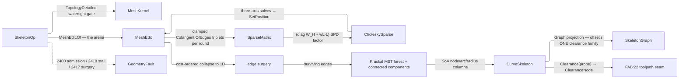

# [RASM_OFFSETTING_SKELETON]

`Skeletonize` owns 3D curve-skeleton extraction in `Rasm.Meshing`: ONE `Skeletonize.Apply(SkeletonOp, Op? key = null)` folds mean-curvature-flow contraction toward the medial curve, cost-ordered edge-collapse surgery that eliminates every face-bearing edge to the 1D remnant, and QuikGraph tree extraction into one `Fin<CurveSkeleton>`. Admission gates a watertight oriented manifold: the contraction flows a closed surface toward its interior medial, so an open shell carries no interior curve-skeleton and refuses.

`CurveSkeleton` composes `offset.md`'s clearance vocabulary and widens the family by zero types: nodes are `ClearanceNode` rows, arcs `SkeletonArc` rows, the typed view the SAME `SkeletonGraph` the 2D medial emits, and `Clearance(Point3d)` answers an arbitrary probe with the SAME distance-to-boundary semantics (`r(foot) − |probe − foot|`), so 2D medial and 3D curve-skeleton speak one clearance language across the `Rasm.Fabrication` toolpath seam. Skeleton topology is a kernel-owned SoA wire whose `SkeletonGraph` and `ClearanceNode` rows mint FROM the columns on read, QuikGraph serving in-computation only with the frozen columns the complete decode contract.

## [01]-[INDEX]

- [01]-[SKELETONIZATION]: ONE `Skeletonize.Apply` folding implicit-MCF contraction, cost-ordered surgery to 1D, and QuikGraph tree/branch extraction into the `CurveSkeleton` SoA wire that composes offset's clearance family.

## [02]-[SKELETONIZATION]

- Owner: `SkeletonPolicy` the Au weight/convergence/surgery policy row registering `IValidityEvidence`; `SkeletonOp(Mesh, Policy)` the request record, one modality with the probe query a result member; `CurveSkeleton` the frozen SoA result — node position/radius/witness columns and arc endpoint/provenance/component columns — projecting the composed `SkeletonGraph` through `Graph` and answering `Clearance(Point3d)`; `Skeletonize` the static surface.
- Cases: none minted — the clearance family (`ClearanceNode` · `SkeletonArc` · `SkeletonGraph`) is `offset.md`'s, composed verbatim, and the result's node and arc rows ARE that family's rows read off the columns.
- Entry: `public static Fin<CurveSkeleton> Apply(SkeletonOp op, Op? key = null)` — the ONE entry, the probe riding the result with no `Contract`/`ExtractSkeleton`/`ProbeClearance` sibling. Admission gates `IsManifold ∧ IsOriented ∧ BoundaryComponents == 0` over the landed `MeshKernel.TopologyDetailed` witness, routing `DegenerateInput` 2400 on an empty mesh, an invalid policy row, or an open shell rather than a silent garbage graph; a stalled area ratio routes `CollapseStalled` 2418, an exhausted surgery queue `SkeletonStalled` 2417.
- Auto: admission snapshots the ORIGINAL positions and one-ring areas (the `W_H` anchoring denominators and the radius provenance) and opens ONE `MeshEdit.Of` arena with the policy floor threaded into `ArenaPolicy`. Each contraction round re-assembles the clamped cotangent stiffness from LIVE arena positions, factors `diag(W_H) + w_L·L_k` once through `CholeskySparse`, solves the three coordinate axes' mass-weighted right-hand sides, writes contracted positions back, kills sub-floor faces, refreshes `W_H` off the collapsing one-ring areas, and scales `w_L` — until the area ratio meets `CollapseAreaRatio` or stalls inside `StallBand`. Surgery then drains a cost-ordered `PriorityQueue` over FACE-BEARING edges: a dequeued edge collapses only while a live face carries both endpoints, so every accepted collapse kills at least one face and a face-less edge — the emerging 1D skeleton — survives untouched, each collapse folding the victim's merge set into the survivor. Extraction folds the survivors into a transient `UndirectedGraph`, takes `MinimumSpanningTreeKruskal` to prune contraction-noise cycles to the tree and span a multi-shell remnant as a forest, labels branches through `ConnectedComponents`, recovers `Radius` and `Witness` from the merge provenance, and under `SmoothBranches` re-samples each maximal degree-2 chain's interior through `Interpolate.CubicSplineRobust`.
- Receipt: none on a dedicated rail — `CurveSkeleton` IS the typed result and the wire; the frozen node/arc/radius columns are the evidence the Fabrication decoder binds, never the live arena or the transient graph.
- Packages: `Rasm.Meshing` sibling file (`ClearanceNode`/`SkeletonArc`/`SkeletonGraph`, composed never re-minted), `Rasm.Meshing` (`MeshEdit.Of`/`SetPosition`/`SetFace`/`KillFace`/`Parallel` the arena; `ArenaPolicy` the floor carrier; `MeshSpace` the admission snapshot; `MeshKernel.TopologyDetailed` the watertight gate; `Cotangent.OfEdges` THE cotangent arithmetic), `Rasm.Numerics` (`SparseMatrix.FromTriplets` + `CholeskySparse.Of`/`Solve` the landed sparse owners; `GeometryFault`), `Rhino.Geometry` (`Point3d`/`Vector3d`), MathNet.Numerics (`Interpolate.CubicSplineRobust` → `IInterpolation.Interpolate` the branch-smoothing pass), QuikGraph (`UndirectedGraph<int, SEdge<int>>`, `AddVertexRange`, `MinimumSpanningTreeKruskal`, `ConnectedComponents`), CommunityToolkit.HighPerformance (`IAction` struct actions through the arena's `Parallel` verb), `Rasm.Domain` (`Op`, `Kind`, `ValidityClaim`/`IValidityEvidence`), Thinktecture.Runtime.Extensions, LanguageExt.Core, BCL inbox (`PriorityQueue<TElement,TPriority>`).
- Growth: a new contraction law (anisotropic weighting, feature-pinned contraction) is a policy column feeding the SAME assembly; a new surgery cost term is one addend in the cost fold; a per-node cross-section ellipse beyond the scalar radius is one further node column pair; a geodesic-distance radius is one policy row re-routing the provenance measure through the landed `geodesics.md` distance arm; a cycle-preserving policy for genus-bearing input retains the MST's dropped longest-cycle edge; zero new entry surface, zero new clearance types.
- Boundary: the clearance vocabulary is `offset.md`'s ONE family — `Radius` means distance-to-boundary on BOTH pages and the probe returns `r(foot) − |probe − foot|`. Contraction composes the landed owners and re-derives none: `Cotangent.OfEdges` is the one cotangent arithmetic, `SparseMatrix.FromTriplets`/`CholeskySparse` the one sparse rail, while the per-round re-assembly is skeleton's OWN loop because the substrate `Laplacian(Cotangent)` row quality-gates exactly the degenerate regime the contraction inhabits and `IntrinsicDelaunay` re-triangulates away the connectivity the surgery must own — the composed-primitive/authored-loop split is the design. `geodesics.md`'s memoized MCF arm stays the SCALAR-FIELD owner (fixed connectivity, one factor, displacement magnitudes) and the two MCF forms share no interior. QuikGraph stays transient in-computation state with the frozen SoA columns the complete contract. Arena state stays single-writer with the surgery's adjacency scratch kernel-local, and the ORIGINAL mesh is never mutated — the arena copies at admission and radius provenance reads the snapshot. `Apply` is total over the `Fin` rail, so a thrown exception on a stalled contraction or an open shell is forbidden.

```csharp
// --- [RUNTIME_PRELUDE] ----------------------------------------------------------------------
using System;
using System.Collections.Generic;
using System.Linq;
using CommunityToolkit.HighPerformance.Helpers;
using LanguageExt;
using MathNet.Numerics;
using MathNet.Numerics.Interpolation;
using QuikGraph;
using QuikGraph.Algorithms;
using Rasm.Domain;
using Rasm.Numerics;
using Rhino.Geometry;
using static LanguageExt.Prelude;
// CS0104 guard: LanguageExt.HashSet collides with the BCL name under the dual usings.
using EdgeKeySet = System.Collections.Generic.HashSet<(int, int)>;
using IndexSet = System.Collections.Generic.HashSet<int>;
using Dimension = Rasm.Numerics.Dimension;

namespace Rasm.Meshing;

// --- [CONSTANTS] ------------------------------------------------------------------------------
// Au policy row: w_L0 = LaplaceSeed·sqrt(mean face area) scaled ContractionScale/round, W_H,i = Attraction·sqrt(A0_i/A_i), CotangentCeiling clamps near-degenerate cot weights.
public sealed record SkeletonPolicy(
    double LaplaceSeed, double ContractionScale, double Attraction, double CotangentCeiling,
    int MaxIterations, double CollapseAreaRatio, double StallBand, double SamplingWeight,
    bool SmoothBranches, int ParallelFloor) : IValidityEvidence {
    public static readonly SkeletonPolicy Canonical = new(
        LaplaceSeed: 1e-3, ContractionScale: 2.0, Attraction: 1.0, CotangentCeiling: 1e4,
        MaxIterations: 24, CollapseAreaRatio: 1e-6, StallBand: 1e-2, SamplingWeight: 0.1,
        SmoothBranches: true, ParallelFloor: 4_096);

    public bool IsValid => ValidityClaim.All(
        ValidityClaim.Positive(value: LaplaceSeed),
        ValidityClaim.Positive(value: ContractionScale),
        ValidityClaim.Positive(value: Attraction),
        ValidityClaim.Positive(value: CotangentCeiling),
        ValidityClaim.Positive(value: MaxIterations),
        ValidityClaim.Positive(value: CollapseAreaRatio),
        ValidityClaim.Positive(value: StallBand),
        ValidityClaim.Nonnegative(value: SamplingWeight),
        ValidityClaim.Positive(value: ParallelFloor));
}

// --- [MODELS] -----------------------------------------------------------------------------------
public sealed record SkeletonOp(MeshSpace Mesh, SkeletonPolicy Policy);

// SoA wire: node position/radius/witness + arc endpoint/provenance/component columns; the typed view is offset's clearance family minted FROM the columns.
public sealed record CurveSkeleton(
    double[] NodeX, double[] NodeY, double[] NodeZ, double[] Radius, int[] Witness,
    int[] ArcFrom, int[] ArcTo, int[] ArcOrigin, int[] Component) {

    public int NodeCount => Radius.Length;
    public int ArcCount => ArcFrom.Length;
    public Point3d NodeAt(int n) => new(NodeX[n], NodeY[n], NodeZ[n]);

    public SkeletonGraph Graph => new(
        toSeq(Enumerable.Range(0, NodeCount).Select(n => new ClearanceNode(NodeAt(n), Radius[n], Witness[n]))),
        toSeq(Enumerable.Range(0, ArcCount).Select(a => new SkeletonArc(ArcFrom[a], ArcTo[a], ArcOrigin[a]))));

    // Arbitrary-probe clearance, offset's distance-to-boundary semantics: the exact scan finds the nearest arc foot, Radius = r(foot) − |probe − foot|.
    // A zero-arc skeleton (fully merged shells, one isolated node each) answers from its nearest node.
    public ClearanceNode Clearance(Point3d probe) {
        if (ArcCount == 0) {
            (double near, int at) = (double.PositiveInfinity, 0);
            for (int n = 0; n < NodeCount; n++) {
                double d = probe.DistanceTo(NodeAt(n));
                if (d < near) { (near, at) = (d, n); }
            }
            return new ClearanceNode(probe, Radius[at] - near, -1);
        }
        (double best, int arc, double radiusAtFoot) = (double.PositiveInfinity, -1, 0.0);
        for (int a = 0; a < ArcCount; a++) {
            (Point3d p, Point3d q) = (NodeAt(ArcFrom[a]), NodeAt(ArcTo[a]));
            Vector3d d = q - p;
            double t = d.SquareLength <= double.Epsilon ? 0.0 : Math.Clamp(((probe - p) * d) / d.SquareLength, 0.0, 1.0);
            double dist = probe.DistanceTo(p + (t * d));
            if (dist < best) {
                (best, arc) = (dist, a);
                radiusAtFoot = ((1.0 - t) * Radius[ArcFrom[a]]) + (t * Radius[ArcTo[a]]);
            }
        }
        return new ClearanceNode(probe, radiusAtFoot - best, arc);
    }
}

// --- [OPERATIONS] -------------------------------------------------------------------------------
public static class Skeletonize {
    public static Fin<CurveSkeleton> Apply(SkeletonOp op, Op? key = null) =>
        Admit(op).Bind(_ => {
            using MeshEdit arena = MeshEdit.Of(op.Mesh, ArenaPolicy.Canonical with { ParallelFloor = op.Policy.ParallelFloor });
            return Contract(arena, op, key)
                .Bind(state => Surgery(state, op.Policy))
                .Map(state => Extract(state, op.Policy));
        });

    // Watertight gate over the landed TOTAL topology witness — the contraction flows a closed surface to its interior medial, so an open shell refuses.
    static Fin<Unit> Admit(SkeletonOp op) =>
        op.Mesh.Native.Faces.Count == 0 ? Fin.Fail<Unit>(new GeometryFault.DegenerateInput(Kind.Mesh, 0, "empty mesh").ToError())
        : !op.Policy.IsValid ? Fin.Fail<Unit>(new GeometryFault.DegenerateInput(Kind.Mesh, 0, "invalid skeleton policy").ToError())
        : MeshKernel.TopologyDetailed(op.Mesh).Bind(static topology =>
            topology.IsManifold && topology.IsOriented && topology.BoundaryComponents == 0
                ? Fin.Succ(unit)
                : Fin.Fail<Unit>(new GeometryFault.DegenerateInput(Kind.Mesh, topology.BoundaryComponents, "skeletonization requires a watertight oriented manifold").ToError()));

    // Contraction state: live arena, frozen originals (radius provenance + W_H anchors + pre-surgery face triples), union-find merge path-compressed at read.
    sealed record ContractState(MeshEdit Arena, Point3d[] Original, (int A, int B, int C)[] OriginalFaces, int[] Merged);

    static int Home(int[] merged, int o) {
        while (merged[o] != o) { merged[o] = merged[merged[o]]; o = merged[o]; }
        return o;
    }

    // Per-vertex one-ring area + attraction refresh over the arena's budgeted Parallel verb.
    readonly struct AttractionAction(double[] ringArea, double[] originalRingArea, double attraction, double[] wh) : IAction {
        public void Invoke(int v) =>
            wh[v] = attraction * Math.Sqrt(originalRingArea[v] / Math.Max(ringArea[v], double.Epsilon));
    }

    static Fin<ContractState> Contract(MeshEdit arena, SkeletonOp op, Op? key) {
        int n = arena.VertexCount;
        Point3d[] original = new Point3d[n];
        for (int v = 0; v < n; v++) { original[v] = arena.Position(v); }
        (int, int, int)[] faces = new (int, int, int)[arena.FaceCount];
        for (int f = 0; f < arena.FaceCount; f++) { faces[f] = arena.Face(f); }
        double[] ringArea = RingAreas(arena);
        double[] ringSeed = (double[])ringArea.Clone();
        double totalSeed = ringArea.Sum();
        double meanFace = totalSeed / double.Max(arena.FaceCount, 1);
        double[] wh = new double[n];
        Array.Fill(wh, op.Policy.Attraction);
        double wl = op.Policy.LaplaceSeed * Math.Sqrt(meanFace);
        double priorRatio = 1.0;

        for (int round = 0; round < op.Policy.MaxIterations; round++) {
            Fin<Unit> step = Assemble(arena, wl, wh, op.Policy.CotangentCeiling, key)
                .Bind(system => CholeskySparse.Of(symmetric: system, key: key))
                .Bind(factor => SolveAxes(arena, factor, wh, key));
            if (step.Case is LanguageExt.Common.Error fault) { return Fin.Fail<ContractState>(fault); }

            KillDegenerate(arena);
            ringArea = RingAreas(arena);
            arena.Parallel(n, new AttractionAction(ringArea, ringSeed, op.Policy.Attraction, wh));
            wl *= op.Policy.ContractionScale;

            double ratio = ringArea.Sum() / totalSeed;
            if (ratio <= op.Policy.CollapseAreaRatio) {
                return Fin.Succ(new ContractState(arena, original, faces, [.. Enumerable.Range(0, n)]));
            }
            if (priorRatio - ratio < op.Policy.StallBand * priorRatio) {
                return Fin.Fail<ContractState>(new GeometryFault.CollapseStalled(round, ratio).ToError());
            }
            priorRatio = ratio;
        }
        return Fin.Fail<ContractState>(new GeometryFault.CollapseStalled(op.Policy.MaxIterations, priorRatio).ToError());
    }

    // Clamped cotangent stiffness from LIVE positions + the W_H diagonal (SPD); the assembly loop is skeleton's own, only the cotangent arithmetic composed.
    static Fin<SparseMatrix> Assemble(MeshEdit arena, double wl, double[] wh, double ceiling, Op? key) {
        List<(int Row, int Col, double Value)> triplets = [];
        for (int f = 0; f < arena.FaceCount; f++) {
            if (!arena.Alive(f)) { continue; }
            (int a, int b, int c) = arena.Face(f);
            (Point3d pa, Point3d pb, Point3d pc) = (arena.Position(a), arena.Position(b), arena.Position(c));
            double twoArea = Vector3d.CrossProduct(pb - pa, pc - pa).Length;
            if (twoArea <= double.Epsilon) { continue; }
            Span<(int I, int J, double Cot)> corners = [
                (b, c, Math.Clamp(Cotangent.OfEdges(pb - pa, pc - pa, twoArea), -ceiling, ceiling)),
                (c, a, Math.Clamp(Cotangent.OfEdges(pc - pb, pa - pb, twoArea), -ceiling, ceiling)),
                (a, b, Math.Clamp(Cotangent.OfEdges(pa - pc, pb - pc, twoArea), -ceiling, ceiling))];
            foreach ((int i, int j, double cot) in corners) {
                double w = 0.5 * wl * cot;
                triplets.Add((i, j, -w)); triplets.Add((j, i, -w));
                triplets.Add((i, i, w)); triplets.Add((j, j, w));
            }
        }
        for (int v = 0; v < arena.VertexCount; v++) { triplets.Add((v, v, wh[v])); }
        return SparseMatrix.FromTriplets(Dimension.Create(arena.VertexCount), Dimension.Create(arena.VertexCount), triplets, key);
    }

    // Backward-Euler solve per round: rhs_axis = W_H ⊙ x_axis, three axes through one factor via TraverseM, contracted positions written back.
    static Fin<Unit> SolveAxes(MeshEdit arena, CholeskySparse factor, double[] wh, Op? key) {
        int n = arena.VertexCount;
        double[][] rhs = [new double[n], new double[n], new double[n]];
        for (int v = 0; v < n; v++) {
            Point3d p = arena.Position(v);
            (rhs[0][v], rhs[1][v], rhs[2][v]) = (wh[v] * p.X, wh[v] * p.Y, wh[v] * p.Z);
        }
        return toSeq(rhs)
            .TraverseM(axis => factor.Solve(rhs: new Arr<double>(axis), key: key.OrDefault()))
            .As()
            .Map(axes => {
                Arr<double>[] solved = [.. axes];
                for (int v = 0; v < n; v++) { arena.SetPosition(v, new Point3d(solved[0][v], solved[1][v], solved[2][v])); }
                return unit;
            });
    }

    static double[] RingAreas(MeshEdit arena) {
        double[] ring = new double[arena.VertexCount];
        for (int f = 0; f < arena.FaceCount; f++) {
            if (!arena.Alive(f)) { continue; }
            (int a, int b, int c) = arena.Face(f);
            double third = Vector3d.CrossProduct(arena.Position(b) - arena.Position(a), arena.Position(c) - arena.Position(a)).Length / 6.0;
            ring[a] += third; ring[b] += third; ring[c] += third;
        }
        return ring;
    }

    static void KillDegenerate(MeshEdit arena) {
        for (int f = 0; f < arena.FaceCount; f++) {
            if (!arena.Alive(f)) { continue; }
            (int a, int b, int c) = arena.Face(f);
            if (Vector3d.CrossProduct(arena.Position(b) - arena.Position(a), arena.Position(c) - arena.Position(a)).Length <= double.Epsilon) {
                arena.KillFace(f);
            }
        }
    }

    // --- [SURGERY]
    // Cost-ordered half-edge collapses over FACE-BEARING edges until no face survives: cost = length + λ·(length × adjacent-sum), centering AND evenly sampling the 1D remnant.
    // A face-less edge (the emerging skeleton) skips, so each accepted collapse kills ≥1 face and bounds the loop by face count; vertex→face/vertex indexes update per collapse, merges route the union-find parents.
    static Fin<ContractState> Surgery(ContractState state, SkeletonPolicy policy) {
        MeshEdit arena = state.Arena;
        Dictionary<int, IndexSet> adjacency = [];
        Dictionary<int, IndexSet> facesOf = [];
        void Link(int u, int v) {
            (adjacency.TryGetValue(u, out IndexSet? su) ? su : adjacency[u] = []).Add(v);
            (adjacency.TryGetValue(v, out IndexSet? sv) ? sv : adjacency[v] = []).Add(u);
        }
        int liveFaces = 0;
        for (int f = 0; f < arena.FaceCount; f++) {
            if (!arena.Alive(f)) { continue; }
            liveFaces++;
            (int a, int b, int c) = arena.Face(f);
            Link(a, b); Link(b, c); Link(c, a);
            foreach (int v in (ReadOnlySpan<int>)[a, b, c]) {
                (facesOf.TryGetValue(v, out IndexSet? fs) ? fs : facesOf[v] = []).Add(f);
            }
        }
        PriorityQueue<(int U, int V), double> queue = new();
        foreach ((int u, IndexSet around) in adjacency) {
            foreach (int v in around) { if (u < v) { queue.Enqueue((u, v), Cost(arena, adjacency, u, v, policy.SamplingWeight)); } }
        }
        int rounds = 0;
        while (liveFaces > 0) {
            if (!queue.TryDequeue(out (int U, int V) edge, out _)) {
                return Fin.Fail<ContractState>(new GeometryFault.SkeletonStalled(liveFaces, rounds).ToError());
            }
            (int u, int v) = edge;
            if (!adjacency.TryGetValue(u, out IndexSet? uSet) || !uSet.Contains(v)) { continue; }  // stale row
            bool faced = facesOf.TryGetValue(u, out IndexSet? uFaces) && uFaces.Any(f => arena.Alive(f) && Holds(arena.Face(f), v));
            if (!faced) { continue; }  // face-less edge — the emerging 1D skeleton, never collapsed
            rounds++;
            foreach (int f in facesOf.TryGetValue(u, out IndexSet? incident) ? incident.ToArray() : []) {
                if (!arena.Alive(f)) { continue; }
                (int a, int b, int c) = arena.Face(f);
                (a, b, c) = (a == u ? v : a, b == u ? v : b, c == u ? v : c);
                if (a == b || b == c || c == a) {
                    arena.KillFace(f);
                    liveFaces--;
                }
                else {
                    arena.SetFace(f, a, b, c);
                    (facesOf.TryGetValue(v, out IndexSet? vf) ? vf : facesOf[v] = []).Add(f);
                }
            }
            facesOf.Remove(u);
            foreach (int w in uSet.Where(w => w != v).ToArray()) {
                adjacency[w].Remove(u);
                Link(v, w);
                queue.Enqueue((int.Min(v, w), int.Max(v, w)), Cost(arena, adjacency, v, w, policy.SamplingWeight));
            }
            adjacency[v].Remove(u);
            adjacency.Remove(u);
            state.Merged[u] = v;  // union-find parent; Home() path-compresses at read
        }
        return Fin.Succ(state);
    }

    static bool Holds((int A, int B, int C) face, int v) => face.A == v || face.B == v || face.C == v;

    static double Cost(MeshEdit arena, Dictionary<int, IndexSet> adjacency, int u, int v, double lambda) {
        double length = arena.Position(u).DistanceTo(arena.Position(v));
        double sampling = adjacency.TryGetValue(u, out IndexSet? around)
            ? around.Sum(w => arena.Position(u).DistanceTo(arena.Position(w)))
            : 0.0;
        return length + (lambda * length * sampling);
    }

    // --- [EXTRACTION]
    // Surviving edges -> transient UndirectedGraph -> Kruskal MST (prunes contraction-noise cycles to the tree; spans a multi-shell remnant as a forest) -> ConnectedComponents branch labels.
    // SoA columns follow, radii recovered from merge provenance, with optional per-branch spline smoothing.
    static CurveSkeleton Extract(ContractState state, SkeletonPolicy policy) {
        MeshEdit arena = state.Arena;
        int[] survivors = [.. Enumerable.Range(0, state.Merged.Length).Where(o => Home(state.Merged, o) == o).Order()];
        Dictionary<int, int> dense = survivors.Index().ToDictionary(static row => row.Item, static row => row.Index);
        UndirectedGraph<int, SEdge<int>> graph = new(allowParallelEdges: false);
        graph.AddVertexRange(Enumerable.Range(0, survivors.Length));
        EdgeKeySet seen = [];
        foreach ((int a, int b, int c) in state.OriginalFaces) {
            foreach ((int u, int v) in (ReadOnlySpan<(int, int)>)[(a, b), (b, c), (c, a)]) {
                (int hu, int hv) = (dense[Home(state.Merged, u)], dense[Home(state.Merged, v)]);
                if (hu != hv && seen.Add((int.Min(hu, hv), int.Max(hu, hv)))) { graph.AddEdge(new SEdge<int>(int.Min(hu, hv), int.Max(hu, hv))); }
            }
        }
        SEdge<int>[] tree = [.. graph.MinimumSpanningTreeKruskal(e =>
            arena.Position(survivors[e.Source]).DistanceTo(arena.Position(survivors[e.Target])))];
        Dictionary<int, int> components = [];
        graph.ConnectedComponents(components);

        int nodes = survivors.Length;
        (double[] nx, double[] ny, double[] nz, double[] radius, int[] witness) =
            (new double[nodes], new double[nodes], new double[nodes], new double[nodes], new int[nodes]);
        (int[] count, int[] seed, double[] best) = (new int[nodes], new int[nodes], new double[nodes]);
        Array.Fill(seed, int.MaxValue);
        Array.Fill(best, double.PositiveInfinity);
        for (int nId = 0; nId < nodes; nId++) {
            Point3d p = arena.Position(survivors[nId]);
            (nx[nId], ny[nId], nz[nId]) = (p.X, p.Y, p.Z);
        }
        for (int o = 0; o < state.Merged.Length; o++) {
            int nId = dense[Home(state.Merged, o)];
            double d = state.Original[o].DistanceTo(arena.Position(survivors[nId]));
            radius[nId] += d;
            count[nId]++;
            if (o < seed[nId]) { seed[nId] = o; }
            if (d < best[nId]) { (best[nId], witness[nId]) = (d, o); }
        }
        for (int nId = 0; nId < nodes; nId++) { radius[nId] /= double.Max(count[nId], 1); }

        (int[] arcFrom, int[] arcTo, int[] arcOrigin, int[] arcComponent) =
            (new int[tree.Length], new int[tree.Length], new int[tree.Length], new int[tree.Length]);
        for (int a = 0; a < tree.Length; a++) {
            (arcFrom[a], arcTo[a]) = (tree[a].Source, tree[a].Target);
            arcOrigin[a] = seed[tree[a].Source];
            arcComponent[a] = components[tree[a].Source];
        }
        CurveSkeleton skeleton = new(nx, ny, nz, radius, witness, arcFrom, arcTo, arcOrigin, arcComponent);
        return policy.SmoothBranches ? Smooth(skeleton) : skeleton;
    }

    // One IInterpolation pass per maximal degree-2 chain: chord-length-parameterized robust cubic per coordinate, interior nodes re-sampled, junctions/endpoints pinned.
    static CurveSkeleton Smooth(CurveSkeleton skeleton) {
        int[] degree = new int[skeleton.NodeCount];
        foreach (int end in skeleton.ArcFrom) { degree[end]++; }
        foreach (int end in skeleton.ArcTo) { degree[end]++; }
        (double[] nx, double[] ny, double[] nz) = ((double[])skeleton.NodeX.Clone(), (double[])skeleton.NodeY.Clone(), (double[])skeleton.NodeZ.Clone());
        foreach (int[] chain in Branches(skeleton, degree)) {
            if (chain.Length < 4) { continue; }
            double[] t = new double[chain.Length];
            for (int i = 1; i < chain.Length; i++) { t[i] = t[i - 1] + skeleton.NodeAt(chain[i - 1]).DistanceTo(skeleton.NodeAt(chain[i])); }
            IInterpolation sx = Interpolate.CubicSplineRobust(t, [.. chain.Select(n => skeleton.NodeX[n])]);
            IInterpolation sy = Interpolate.CubicSplineRobust(t, [.. chain.Select(n => skeleton.NodeY[n])]);
            IInterpolation sz = Interpolate.CubicSplineRobust(t, [.. chain.Select(n => skeleton.NodeZ[n])]);
            for (int i = 1; i < chain.Length - 1; i++) {
                (nx[chain[i]], ny[chain[i]], nz[chain[i]]) = (sx.Interpolate(t[i]), sy.Interpolate(t[i]), sz.Interpolate(t[i]));
            }
        }
        return skeleton with { NodeX = nx, NodeY = ny, NodeZ = nz };
    }

    static IEnumerable<int[]> Branches(CurveSkeleton skeleton, int[] degree) {
        Dictionary<int, List<int>> next = [];
        for (int a = 0; a < skeleton.ArcCount; a++) {
            (next.TryGetValue(skeleton.ArcFrom[a], out List<int>? f) ? f : next[skeleton.ArcFrom[a]] = []).Add(skeleton.ArcTo[a]);
            (next.TryGetValue(skeleton.ArcTo[a], out List<int>? t) ? t : next[skeleton.ArcTo[a]] = []).Add(skeleton.ArcFrom[a]);
        }
        EdgeKeySet visited = [];
        foreach (int anchor in Enumerable.Range(0, skeleton.NodeCount).Where(n => degree[n] != 2)) {
            foreach (int start in next.TryGetValue(anchor, out List<int>? around) ? around : []) {
                if (!visited.Add((anchor, start))) { continue; }
                List<int> chain = [anchor, start];
                (int prior, int at) = (anchor, start);
                while (degree[at] == 2) {
                    int forward = next[at].First(w => w != prior);
                    visited.Add((at, forward));
                    chain.Add(forward);
                    (prior, at) = (at, forward);
                }
                visited.Add((at, prior));
                yield return [.. chain];
            }
        }
    }
}
```



## [03]-[DENSITY_BAR]

One owner per axis; capability is a case, row, or fold arm, never a sibling surface. `[RAIL]` cells name the one return rail each owner exposes; the per-axis kind rides the indexed notes below.

| [INDEX] | [AXIS_CONCERN]     | [OWNER]          | [RAIL]                                   | [CASES] |
| :-----: | :----------------- | :--------------- | :--------------------------------------- | :-----: |
|  [01]   | Skeletonization    | `SkeletonOp`     | `Skeletonize.Apply → Fin<CurveSkeleton>` |    —    |
|  [02]   | Contraction policy | `SkeletonPolicy` | value (`IValidityEvidence`)              |    —    |
|  [03]   | Result + wire      | `CurveSkeleton`  | carrier (columns frozen at extraction)   |    —    |

- [01]-[SKELETONIZATION]: request record folded by ONE `Apply` (contract → surgery → extract → smooth).
- [02]-[CONTRACTION_POLICY]: policy row — Au weight laws, cot clamp, convergence/stall bands, surgery λ, smoothing, floor.
- [03]-[RESULT_AND_WIRE]: SoA node/arc/radius columns + `Graph` projection (offset's family) + `Clearance`.

## [04]-[RESEARCH]

<!-- source-only: research row template:
[TOKEN]-[OPEN|BLOCKED]: <exact question>; <verification route>.
[SPLIT_MEMBER]-[OPEN]: does `shape-core` expose `split_all`; verify against the member rail.
-->

(none)
