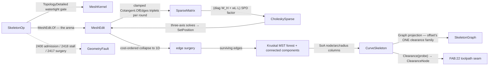

# [RASM_OFFSETTING_SKELETON]

The 3D curve-skeleton owner of `Rasm.Meshing` — ONE `Skeletonize.Apply(SkeletonOp, Op? key = null)` running Au-2008-class mean-curvature-flow contraction to the medial curve: per-iteration implicit backward-Euler steps `(diag(W_H) + w_L·L_k)·x' = diag(W_H)·x` over the CURRENT geometry's clamped cotangent stiffness, the contraction weight `w_L` scaling geometrically per round while the per-vertex attraction `W_H,i = attraction·√(A⁰_i/A_i)` anchors collapsed neighborhoods, interleaved with degenerate-face surgery on the `MeshEdit` arena, until the surface collapses toward its 1D medial; a cost-ordered edge-collapse surgery then eliminates every remaining face (face-bearing edges only — a face-less edge IS the emerging 1D skeleton and never collapses), and the surviving edge set extracts through QuikGraph — `MinimumSpanningTreeKruskal` prunes numerical cycles to the curve-skeleton tree and spans a multi-shell remnant as a forest, `ConnectedComponents` labels the branches — never a hand-rolled branch/junction walk.

The page COMPOSES the clearance vocabulary `offset.md` mints and widens the family by ZERO types: every skeleton node is a `ClearanceNode(At, Radius, NearestEdge)` — `Radius` the distance-to-boundary payload recovered from the node's merged ORIGINAL surface vertices, `NearestEdge` the nearest-feature witness — arcs are `SkeletonArc(From, To, OriginEdge)` rows, the typed view is the SAME `SkeletonGraph` shape the 2D medial emits, and the arbitrary-probe query is `CurveSkeleton.Clearance(Point3d probe) → ClearanceNode` with the SAME distance-to-boundary semantics (`r(foot) − |probe − foot|`, the medial-transform estimate), so 2D medial and 3D curve-skeleton speak one clearance language across the `Rasm.Fabrication` seam (`FAB:22` — `Toolpath/Skeleton.cs` dies for `Offsetting.Apply` + `Skeletonize.Apply`; the `RASM-CS-FABRICATION [V5]` weighted/variable-speed and arbitrary-probe demands land on this one family). Skeleton topology is a kernel-owned SoA wire — node coordinate/radius/witness columns plus arc from/to/origin/component columns — QuikGraph in-computation only per the bounded-lane law, `SkeletonGraph` and `ClearanceNode` rows minted FROM the columns on read. Failures route the `offsetting` cluster: `CollapseStalled(iteration, residual)` 2418 for a stalled contraction, `SkeletonStalled(pendingEvents, time)` 2417 for an exhausted surgery queue.

## [01]-[INDEX]

- [01]-[SKELETONIZATION]: ONE `Skeletonize.Apply(SkeletonOp, Op?)` entry; the implicit-MCF contraction loop (clamped cotangent re-assembly per round over live arena positions, `CholeskySparse` per-axis solves, `W_H` area-ratio anchoring, interleaved degenerate-face surgery); the cost-ordered collapse to 1D with merge-set provenance; QuikGraph tree/branch extraction; the `CurveSkeleton` SoA wire composing offset's `ClearanceNode`/`SkeletonArc`/`SkeletonGraph` family + the `Clearance(probe)` query; optional spline branch smoothing.

## [02]-[SKELETONIZATION]

- Owner: `SkeletonPolicy` the policy row (`LaplaceSeed` — the initial contraction weight factor `w_L⁰ = seed·√(mean face area)`; `ContractionScale` — the per-round `w_L` multiplier; `Attraction` — the `W_H` base; `CotangentCeiling` — the |cot| clamp the near-degenerate contraction regime demands; `MaxIterations` · `CollapseAreaRatio` — the convergence target `ΣA_k/ΣA⁰` · `StallBand` — the zero-progress band; `SamplingWeight` — the surgery cost's λ blending shape against sampling cost; `SmoothBranches` — the spline pass row; `ParallelFloor`) registering `IValidityEvidence`; `SkeletonOp` the request record (`Mesh` · `Policy` — one modality, the probe query a RESULT member, so the request is a record); `CurveSkeleton` the frozen SoA result — node columns (`NodeX`/`NodeY`/`NodeZ` · `Radius` · `Witness`) + arc columns (`ArcFrom`/`ArcTo` · `ArcOrigin` — the seed original-vertex provenance riding `SkeletonArc.OriginEdge` · `Component` — the branch label) — with the `Graph` projection minting the composed `SkeletonGraph` and the `Clearance(Point3d)` arbitrary-probe member; `Skeletonize` the static surface.
- Cases: none minted — the clearance family (`ClearanceNode` · `SkeletonArc` · `SkeletonGraph`) is `offset.md`'s, composed verbatim; the result's node and arc rows ARE that family's rows read off the columns. Zero new clearance types is this page's first law.
- Entry: `public static Fin<CurveSkeleton> Apply(SkeletonOp op, Op? key = null)` — the ONE entry. `Fin<T>` routes `GeometryFault.DegenerateInput(Kind.Mesh, index, witness)` 2400 on an inadmissible input — an empty mesh, an invalid policy row, or a non-watertight one: the contraction flows a closed surface toward its interior medial, so the admission composes the landed `MeshKernel.TopologyDetailed` total witness and gates `IsManifold ∧ IsOriented ∧ BoundaryComponents == 0` (an open shell has no interior curve-skeleton; the honest refusal beats a silent garbage graph); `GeometryFault.CollapseStalled(iteration, residual)` 2418 when the area ratio stalls inside `StallBand` above `CollapseAreaRatio` or `MaxIterations` exhausts with the residual ratio recorded; `GeometryFault.SkeletonStalled(pendingEvents, time)` 2417 when the surgery queue exhausts its admissible collapses while faces remain — `PendingEvents` the live-face count, `Time` the surgery round. No `Contract`/`ExtractSkeleton`/`ProbeClearance` sibling statics — one polymorphic `Apply`; the probe rides the result.
- Auto: admission snapshots the ORIGINAL positions and one-ring areas (`A⁰_i`, the anchoring denominators and the radius provenance), opens ONE `MeshEdit.Of(space, ...)` arena with the policy floor threaded into `ArenaPolicy` at `Of`, and iterates: (1) assemble the clamped cotangent stiffness from LIVE arena positions — per face, `Cotangent.OfEdges(u, v, twoArea)` per corner clamped to `±CotangentCeiling` with degenerate-area faces skipped, accumulated as triplets into `SparseMatrix.FromTriplets` (the mesh substrate's `Laplacian` rows serve quality-gated snapshots; the contraction lives PAST the quality regime by design — see Boundary); (2) factor `diag(W_H) + w_L·L_k` once via `CholeskySparse.Of` and solve the three coordinate axes' mass-weighted right-hand sides through `TraverseM` (the geodesics backward-Euler shape, re-weighted per round); (3) write the contracted positions back through `SetPosition`, kill faces whose area collapses under the scale floor, and refresh `W_H,i = Attraction·√(A⁰_i/A_i)` — the one-ring area sweep partitioned by the arena's own budgeted `Parallel` struct-action verb under `ParallelFloor`; (4) scale `w_L ← ContractionScale·w_L` and test the area ratio against `CollapseAreaRatio`/`StallBand`. Surgery then collapses to 1D: the undirected edge multiset (unique face edges, re-keyed on every collapse) drains a cost-ordered `PriorityQueue` gated on face incidence — a dequeued edge collapses ONLY while a live face carries both endpoints, so every accepted collapse kills at least one face and a face-less edge (the emerging 1D skeleton) survives untouched — collapse cost = edge length (the local shape term) + `SamplingWeight`·(edge length × adjacent-length sum), the Au blending that keeps nodes centered AND evenly sampled — each half-edge collapse `u→v` re-pointing faces through `SetFace`, tombstoning degenerates through `KillFace`, folding `u`'s merge set (its accumulated original vertices) into `v`; when no live face remains the surviving edges ARE the raw skeleton. Extraction folds them into a transient `UndirectedGraph<int, SEdge<int>>` (`AddVertexRange` admits every surviving node so an isolated component still lands), takes `MinimumSpanningTreeKruskal(e => |pos(Source) − pos(Target)|)` — contraction noise mints spurious short cycles; the MST is the curve-skeleton tree, and Kruskal spans a disconnected multi-shell remnant as a forest with no root choice — and labels branches through `ConnectedComponents` (the undirected components read; `WeaklyConnectedComponents` binds only the directed `IVertexListGraph` contract); node radii recover from provenance — `Radius = mean |node − original(merged)|`, `Witness = argmin` original ordinal (the nearest surface feature) — and `SmoothBranches` runs the one `IInterpolation` pass: every maximal degree-2 chain chord-length-parameterizes and re-samples its INTERIOR nodes through `Interpolate.CubicSplineRobust` per coordinate (junctions and endpoints pinned; chains under four nodes pass through), deleting the per-iteration contraction jitter with one policy row, never a hand-rolled smoother.
- Receipt: none on a dedicated rail — `CurveSkeleton` IS the typed result and the wire: node/arc/radius columns are the evidence the Fabrication decoder binds, `Graph` projects the composed `SkeletonGraph`, `Clearance(probe)` answers the arbitrary probe from the same columns; hash-eligible artifacts are the frozen columns, never the live arena or the transient graph.
- Packages: `Rasm.Meshing` (sibling file — `ClearanceNode`/`SkeletonArc`/`SkeletonGraph`, composed never re-minted), `Rasm.Meshing` (`MeshEdit.Of`/`SetPosition`/`SetFace`/`KillFace`/`Parallel` — the arena; `ArenaPolicy` the floor carrier the policy threads at `Of`; `MeshSpace` the admission snapshot), `Rasm.Meshing` (`MeshKernel.TopologyDetailed` the watertight gate; `Cotangent.OfEdges` THE cotangent arithmetic), `Rasm.Numerics` (`SparseMatrix.FromTriplets` + `CholeskySparse.Of`/`Solve` the landed sparse owners), `Rhino.Geometry` (`Point3d`/`Vector3d`), MathNet.Numerics (`Interpolate.CubicSplineRobust` → `IInterpolation.Interpolate` — the branch-smoothing pass), QuikGraph (`UndirectedGraph<int, SEdge<int>>`, `AddVertexRange`, `MinimumSpanningTreeKruskal`, `ConnectedComponents` — in-computation only), CommunityToolkit.HighPerformance (`IAction` struct actions through the arena's `Parallel` verb), `Rasm.Numerics` (`GeometryFault`), `Rasm.Domain` (`Op`, `Kind`, `ValidityClaim`/`IValidityEvidence`), Thinktecture.Runtime.Extensions, LanguageExt.Core, BCL inbox (`PriorityQueue<TElement,TPriority>`).
- Growth: a new contraction law (anisotropic weighting, feature-pinned contraction) is a policy column feeding the SAME assembly; a new surgery cost term is one addend in the cost fold; a per-node cross-section ellipse (beyond the scalar radius) is one further node column pair on the wire; a geodesic-distance radius (surface distance instead of Euclidean) is one policy row re-routing the provenance measure through the landed `geodesics.md` distance arm; zero new entry surface, zero new clearance types.
- Boundary: the clearance vocabulary is `offset.md`'s ONE family and a skeleton-local node/arc/graph shape, a per-consumer clearance record, or a second probe semantics is the named capability defect — `Radius` means distance-to-boundary on BOTH pages and the probe returns `r(foot) − |probe − foot|`, the medial-transform boundary estimate; the contraction COMPOSES the landed owners at the right altitude and re-derives none — `Cotangent.OfEdges` is the one cotangent arithmetic (an inline `(a·b)/2A` re-derivation is the collapsed duplication re-opening), `SparseMatrix.FromTriplets`/`CholeskySparse` are the one sparse rail, and the per-round re-assembly is skeleton's OWN loop because the substrate's `Laplacian(Cotangent)` row quality-gates exactly the degenerate regime contraction inhabits while `IntrinsicDelaunay` re-triangulates away the connectivity the surgery must own — the composed-primitive/authored-loop split is the design, not a shortcut; `geodesics.md`'s memoized MCF arm stays the SCALAR-FIELD owner (fixed connectivity, one factor, displacement magnitudes; `fields.md` `MeanCurvatureFlowCase` samples it) and this page never reaches into it — the two MCF forms meet at no interior, one anchor each; QuikGraph is transient in-computation state and a stored graph field or a hand-rolled junction/branch walk is the deleted form; the arena is single-writer under the `Meshing/edit#ARENA_LAW` contract — parallel sweeps ride the budgeted `Parallel` verb over partition-disjoint slots, and the surgery's adjacency scratch is kernel-local under the arena statement exemption; the ORIGINAL mesh is never mutated (the arena copies at admission; radius provenance reads the snapshot); `Apply` is total over the `Fin` rail and a thrown exception on a stalled contraction or an open shell is forbidden.

```csharp
// --- [RUNTIME_PRELUDE] ----------------------------------------------------------------------
using System;
using System.Collections.Generic;
using System.Linq;
using CommunityToolkit.HighPerformance.Helpers;
using LanguageExt;
using MathNet.Numerics;
using MathNet.Numerics.Interpolation;
using QuikGraph;
using QuikGraph.Algorithms;
using Rasm.Domain;
using Rasm.Numerics;
using Rhino.Geometry;
using static LanguageExt.Prelude;
// CS0104 guard: LanguageExt.HashSet collides with the BCL name under the dual usings.
using EdgeKeySet = System.Collections.Generic.HashSet<(int, int)>;
using IndexSet = System.Collections.Generic.HashSet<int>;
using Dimension = Rasm.Numerics.Dimension;

namespace Rasm.Meshing;

// --- [CONSTANTS] ------------------------------------------------------------------------------
// The Au-2008 knob set as one policy row: w_L0 = LaplaceSeed·sqrt(mean face area), w_L scales by
// ContractionScale per round, W_H,i = Attraction·sqrt(A0_i/A_i); CotangentCeiling clamps the
// near-degenerate cot weights the contraction regime produces by design.
public sealed record SkeletonPolicy(
    double LaplaceSeed, double ContractionScale, double Attraction, double CotangentCeiling,
    int MaxIterations, double CollapseAreaRatio, double StallBand, double SamplingWeight,
    bool SmoothBranches, int ParallelFloor) : IValidityEvidence {
    public static readonly SkeletonPolicy Canonical = new(
        LaplaceSeed: 1e-3, ContractionScale: 2.0, Attraction: 1.0, CotangentCeiling: 1e4,
        MaxIterations: 24, CollapseAreaRatio: 1e-6, StallBand: 1e-2, SamplingWeight: 0.1,
        SmoothBranches: true, ParallelFloor: 4_096);

    public bool IsValid => ValidityClaim.All(
        ValidityClaim.Positive(value: LaplaceSeed),
        ValidityClaim.Positive(value: ContractionScale),
        ValidityClaim.Positive(value: Attraction),
        ValidityClaim.Positive(value: CotangentCeiling),
        ValidityClaim.Positive(value: MaxIterations),
        ValidityClaim.Positive(value: CollapseAreaRatio),
        ValidityClaim.Positive(value: StallBand),
        ValidityClaim.Nonnegative(value: SamplingWeight),
        ValidityClaim.Positive(value: ParallelFloor));
}

// --- [MODELS] -----------------------------------------------------------------------------------
public sealed record SkeletonOp(MeshSpace Mesh, SkeletonPolicy Policy);

// The SoA skeleton wire: node columns (position, clearance radius, nearest-feature witness) + arc
// columns (endpoints, seed-vertex provenance, branch component). The typed view is offset.md's ONE
// clearance family, minted FROM the columns — never a second stored row set.
public sealed record CurveSkeleton(
    double[] NodeX, double[] NodeY, double[] NodeZ, double[] Radius, int[] Witness,
    int[] ArcFrom, int[] ArcTo, int[] ArcOrigin, int[] Component) {

    public int NodeCount => Radius.Length;
    public int ArcCount => ArcFrom.Length;
    public Point3d NodeAt(int n) => new(NodeX[n], NodeY[n], NodeZ[n]);

    public SkeletonGraph Graph => new(
        toSeq(Enumerable.Range(0, NodeCount).Select(n => new ClearanceNode(NodeAt(n), Radius[n], Witness[n]))),
        toSeq(Enumerable.Range(0, ArcCount).Select(a => new SkeletonArc(ArcFrom[a], ArcTo[a], ArcOrigin[a]))));

    // Arbitrary-probe clearance, the SAME distance-to-boundary semantics as offset's ring probe:
    // the exact scan finds the nearest arc foot; Radius = r(foot) − |probe − foot| (the medial
    // transform's boundary-distance estimate), NearestEdge = the arc ordinal witness. A zero-arc
    // skeleton (fully merged shells — one isolated node EACH) answers from its nearest node.
    public ClearanceNode Clearance(Point3d probe) {
        if (ArcCount == 0) {
            (double near, int at) = (double.PositiveInfinity, 0);
            for (int n = 0; n < NodeCount; n++) {
                double d = probe.DistanceTo(NodeAt(n));
                if (d < near) { (near, at) = (d, n); }
            }
            return new ClearanceNode(probe, Radius[at] - near, -1);
        }
        (double best, int arc, double radiusAtFoot) = (double.PositiveInfinity, -1, 0.0);
        for (int a = 0; a < ArcCount; a++) {
            (Point3d p, Point3d q) = (NodeAt(ArcFrom[a]), NodeAt(ArcTo[a]));
            Vector3d d = q - p;
            double t = d.SquareLength <= double.Epsilon ? 0.0 : Math.Clamp(((probe - p) * d) / d.SquareLength, 0.0, 1.0);
            double dist = probe.DistanceTo(p + (t * d));
            if (dist < best) {
                (best, arc) = (dist, a);
                radiusAtFoot = ((1.0 - t) * Radius[ArcFrom[a]]) + (t * Radius[ArcTo[a]]);
            }
        }
        return new ClearanceNode(probe, radiusAtFoot - best, arc);
    }
}

// --- [OPERATIONS] -------------------------------------------------------------------------------
public static class Skeletonize {
    public static Fin<CurveSkeleton> Apply(SkeletonOp op, Op? key = null) =>
        Admit(op).Bind(_ => {
            using MeshEdit arena = MeshEdit.Of(op.Mesh, ArenaPolicy.Canonical with { ParallelFloor = op.Policy.ParallelFloor });
            return Contract(arena, op, key)
                .Bind(state => Surgery(state, op.Policy))
                .Map(state => Extract(state, op.Policy));
        });

    // Watertight gate over the landed TOTAL topology witness: the contraction flows a closed
    // surface to its interior medial — an open shell refuses honestly.
    static Fin<Unit> Admit(SkeletonOp op) =>
        op.Mesh.Native.Faces.Count == 0 ? Fin.Fail<Unit>(new GeometryFault.DegenerateInput(Kind.Mesh, 0, "empty mesh").ToError())
        : !op.Policy.IsValid ? Fin.Fail<Unit>(new GeometryFault.DegenerateInput(Kind.Mesh, 0, "invalid skeleton policy").ToError())
        : MeshKernel.TopologyDetailed(op.Mesh).Bind(static topology =>
            topology.IsManifold && topology.IsOriented && topology.BoundaryComponents == 0
                ? Fin.Succ(unit)
                : Fin.Fail<Unit>(new GeometryFault.DegenerateInput(Kind.Mesh, topology.BoundaryComponents, "skeletonization requires a watertight oriented manifold").ToError()));

    // Contraction working state: the live arena, the frozen originals (radius provenance + W_H
    // anchors + the pre-surgery face triples the extraction maps through), and the union-find
    // merge routing the surgery writes (path-compressed at read — never an O(n) remap per collapse).
    sealed record ContractState(MeshEdit Arena, Point3d[] Original, (int A, int B, int C)[] OriginalFaces, int[] Merged);

    static int Home(int[] merged, int o) {
        while (merged[o] != o) { merged[o] = merged[merged[o]]; o = merged[o]; }
        return o;
    }

    // The per-vertex one-ring area + attraction refresh — partition-disjoint slots through the
    // arena's budgeted Parallel verb.
    readonly struct AttractionAction(double[] ringArea, double[] originalRingArea, double attraction, double[] wh) : IAction {
        public void Invoke(int v) =>
            wh[v] = attraction * Math.Sqrt(originalRingArea[v] / Math.Max(ringArea[v], double.Epsilon));
    }

    static Fin<ContractState> Contract(MeshEdit arena, SkeletonOp op, Op? key) {
        int n = arena.VertexCount;
        Point3d[] original = new Point3d[n];
        for (int v = 0; v < n; v++) { original[v] = arena.Position(v); }
        (int, int, int)[] faces = new (int, int, int)[arena.FaceCount];
        for (int f = 0; f < arena.FaceCount; f++) { faces[f] = arena.Face(f); }
        double[] ringArea = RingAreas(arena);
        double[] ringSeed = (double[])ringArea.Clone();
        double totalSeed = ringArea.Sum();
        double meanFace = totalSeed / double.Max(arena.FaceCount, 1);
        double[] wh = new double[n];
        Array.Fill(wh, op.Policy.Attraction);
        double wl = op.Policy.LaplaceSeed * Math.Sqrt(meanFace);
        double priorRatio = 1.0;

        for (int round = 0; round < op.Policy.MaxIterations; round++) {
            Fin<Unit> step = Assemble(arena, wl, wh, op.Policy.CotangentCeiling, key)
                .Bind(system => CholeskySparse.Of(symmetric: system, key: key))
                .Bind(factor => SolveAxes(arena, factor, wh, key));
            if (step.Case is LanguageExt.Common.Error fault) { return Fin.Fail<ContractState>(fault); }

            KillDegenerate(arena);
            ringArea = RingAreas(arena);
            arena.Parallel(n, new AttractionAction(ringArea, ringSeed, op.Policy.Attraction, wh));
            wl *= op.Policy.ContractionScale;

            double ratio = ringArea.Sum() / totalSeed;
            if (ratio <= op.Policy.CollapseAreaRatio) {
                return Fin.Succ(new ContractState(arena, original, faces, [.. Enumerable.Range(0, n)]));
            }
            if (priorRatio - ratio < op.Policy.StallBand * priorRatio) {
                return Fin.Fail<ContractState>(new GeometryFault.CollapseStalled(round, ratio).ToError());
            }
            priorRatio = ratio;
        }
        return Fin.Fail<ContractState>(new GeometryFault.CollapseStalled(op.Policy.MaxIterations, priorRatio).ToError());
    }

    // Clamped cotangent stiffness from LIVE positions + the W_H diagonal: (diag(W_H) + wL·L) is SPD.
    // The substrate Laplacian rows quality-gate exactly the degenerate regime contraction inhabits,
    // so the assembly loop is skeleton's own; the cotangent ARITHMETIC is the one composed primitive.
    static Fin<SparseMatrix> Assemble(MeshEdit arena, double wl, double[] wh, double ceiling, Op? key) {
        List<(int Row, int Col, double Value)> triplets = [];
        for (int f = 0; f < arena.FaceCount; f++) {
            if (!arena.Alive(f)) { continue; }
            (int a, int b, int c) = arena.Face(f);
            (Point3d pa, Point3d pb, Point3d pc) = (arena.Position(a), arena.Position(b), arena.Position(c));
            double twoArea = Vector3d.CrossProduct(pb - pa, pc - pa).Length;
            if (twoArea <= double.Epsilon) { continue; }
            Span<(int I, int J, double Cot)> corners = [
                (b, c, Math.Clamp(Cotangent.OfEdges(pb - pa, pc - pa, twoArea), -ceiling, ceiling)),
                (c, a, Math.Clamp(Cotangent.OfEdges(pc - pb, pa - pb, twoArea), -ceiling, ceiling)),
                (a, b, Math.Clamp(Cotangent.OfEdges(pa - pc, pb - pc, twoArea), -ceiling, ceiling))];
            foreach ((int i, int j, double cot) in corners) {
                double w = 0.5 * wl * cot;
                triplets.Add((i, j, -w)); triplets.Add((j, i, -w));
                triplets.Add((i, i, w)); triplets.Add((j, j, w));
            }
        }
        for (int v = 0; v < arena.VertexCount; v++) { triplets.Add((v, v, wh[v])); }
        return SparseMatrix.FromTriplets(Dimension.Create(arena.VertexCount), Dimension.Create(arena.VertexCount), triplets, key);
    }

    // The geodesics backward-Euler shape re-weighted per round: rhs_axis = W_H ⊙ x_axis, three
    // solves through one factor via TraverseM, contracted positions written back to the arena.
    static Fin<Unit> SolveAxes(MeshEdit arena, CholeskySparse factor, double[] wh, Op? key) {
        int n = arena.VertexCount;
        double[][] rhs = [new double[n], new double[n], new double[n]];
        for (int v = 0; v < n; v++) {
            Point3d p = arena.Position(v);
            (rhs[0][v], rhs[1][v], rhs[2][v]) = (wh[v] * p.X, wh[v] * p.Y, wh[v] * p.Z);
        }
        return toSeq(rhs)
            .TraverseM(axis => factor.Solve(rhs: new Arr<double>(axis), key: key.OrDefault()))
            .As()
            .Map(axes => {
                Arr<double>[] solved = [.. axes];
                for (int v = 0; v < n; v++) { arena.SetPosition(v, new Point3d(solved[0][v], solved[1][v], solved[2][v])); }
                return unit;
            });
    }

    static double[] RingAreas(MeshEdit arena) {
        double[] ring = new double[arena.VertexCount];
        for (int f = 0; f < arena.FaceCount; f++) {
            if (!arena.Alive(f)) { continue; }
            (int a, int b, int c) = arena.Face(f);
            double third = Vector3d.CrossProduct(arena.Position(b) - arena.Position(a), arena.Position(c) - arena.Position(a)).Length / 6.0;
            ring[a] += third; ring[b] += third; ring[c] += third;
        }
        return ring;
    }

    static void KillDegenerate(MeshEdit arena) {
        for (int f = 0; f < arena.FaceCount; f++) {
            if (!arena.Alive(f)) { continue; }
            (int a, int b, int c) = arena.Face(f);
            if (Vector3d.CrossProduct(arena.Position(b) - arena.Position(a), arena.Position(c) - arena.Position(a)).Length <= double.Epsilon) {
                arena.KillFace(f);
            }
        }
    }

    // --- [SURGERY]
    // Cost-ordered half-edge collapses over FACE-BEARING edges until no face survives: cost =
    // edge length + λ·(length × adjacent-length sum) — the Au blending keeping the 1D remnant
    // centered AND evenly sampled. A dequeued edge with no live face carrying both endpoints is
    // the emerging 1D skeleton and skips (never collapses); an accepted collapse therefore kills
    // ≥1 face, bounding the loop by the face count. Vertex→incident-face and vertex→vertex
    // indexes update per collapse (never a full-array rescan — the decimate O(F²) class); stale
    // queue rows drop by adjacency containment; merges route the union-find parents.
    static Fin<ContractState> Surgery(ContractState state, SkeletonPolicy policy) {
        MeshEdit arena = state.Arena;
        Dictionary<int, IndexSet> adjacency = [];
        Dictionary<int, IndexSet> facesOf = [];
        void Link(int u, int v) {
            (adjacency.TryGetValue(u, out IndexSet? su) ? su : adjacency[u] = []).Add(v);
            (adjacency.TryGetValue(v, out IndexSet? sv) ? sv : adjacency[v] = []).Add(u);
        }
        int liveFaces = 0;
        for (int f = 0; f < arena.FaceCount; f++) {
            if (!arena.Alive(f)) { continue; }
            liveFaces++;
            (int a, int b, int c) = arena.Face(f);
            Link(a, b); Link(b, c); Link(c, a);
            foreach (int v in (ReadOnlySpan<int>)[a, b, c]) {
                (facesOf.TryGetValue(v, out IndexSet? fs) ? fs : facesOf[v] = []).Add(f);
            }
        }
        PriorityQueue<(int U, int V), double> queue = new();
        foreach ((int u, IndexSet around) in adjacency) {
            foreach (int v in around) { if (u < v) { queue.Enqueue((u, v), Cost(arena, adjacency, u, v, policy.SamplingWeight)); } }
        }
        int rounds = 0;
        while (liveFaces > 0) {
            if (!queue.TryDequeue(out (int U, int V) edge, out _)) {
                return Fin.Fail<ContractState>(new GeometryFault.SkeletonStalled(liveFaces, rounds).ToError());
            }
            (int u, int v) = edge;
            if (!adjacency.TryGetValue(u, out IndexSet? uSet) || !uSet.Contains(v)) { continue; }  // stale row
            bool faced = facesOf.TryGetValue(u, out IndexSet? uFaces) && uFaces.Any(f => arena.Alive(f) && Holds(arena.Face(f), v));
            if (!faced) { continue; }  // face-less edge — the emerging 1D skeleton, never collapsed
            rounds++;
            foreach (int f in facesOf.TryGetValue(u, out IndexSet? incident) ? incident.ToArray() : []) {
                if (!arena.Alive(f)) { continue; }
                (int a, int b, int c) = arena.Face(f);
                (a, b, c) = (a == u ? v : a, b == u ? v : b, c == u ? v : c);
                if (a == b || b == c || c == a) {
                    arena.KillFace(f);
                    liveFaces--;
                }
                else {
                    arena.SetFace(f, a, b, c);
                    (facesOf.TryGetValue(v, out IndexSet? vf) ? vf : facesOf[v] = []).Add(f);
                }
            }
            facesOf.Remove(u);
            foreach (int w in uSet.Where(w => w != v).ToArray()) {
                adjacency[w].Remove(u);
                Link(v, w);
                queue.Enqueue((int.Min(v, w), int.Max(v, w)), Cost(arena, adjacency, v, w, policy.SamplingWeight));
            }
            adjacency[v].Remove(u);
            adjacency.Remove(u);
            state.Merged[u] = v;  // union-find parent; Home() path-compresses at read
        }
        return Fin.Succ(state);
    }

    static bool Holds((int A, int B, int C) face, int v) => face.A == v || face.B == v || face.C == v;

    static double Cost(MeshEdit arena, Dictionary<int, IndexSet> adjacency, int u, int v, double lambda) {
        double length = arena.Position(u).DistanceTo(arena.Position(v));
        double sampling = adjacency.TryGetValue(u, out IndexSet? around)
            ? around.Sum(w => arena.Position(u).DistanceTo(arena.Position(w)))
            : 0.0;
        return length + (lambda * length * sampling);
    }

    // --- [EXTRACTION]
    // Surviving edges -> transient UndirectedGraph -> Kruskal MST (contraction noise mints spurious
    // short cycles; the MST is the tree, and Kruskal spans a disconnected multi-shell remnant as a
    // FOREST) -> ConnectedComponents branch labels -> SoA columns with clearance radii
    // recovered from merge provenance; optional spline smoothing per branch.
    static CurveSkeleton Extract(ContractState state, SkeletonPolicy policy) {
        MeshEdit arena = state.Arena;
        int[] survivors = [.. Enumerable.Range(0, state.Merged.Length).Where(o => Home(state.Merged, o) == o).Order()];
        Dictionary<int, int> dense = survivors.Index().ToDictionary(static row => row.Item, static row => row.Index);
        UndirectedGraph<int, SEdge<int>> graph = new(allowParallelEdges: false);
        graph.AddVertexRange(Enumerable.Range(0, survivors.Length));
        EdgeKeySet seen = [];
        foreach ((int a, int b, int c) in state.OriginalFaces) {
            foreach ((int u, int v) in (ReadOnlySpan<(int, int)>)[(a, b), (b, c), (c, a)]) {
                (int hu, int hv) = (dense[Home(state.Merged, u)], dense[Home(state.Merged, v)]);
                if (hu != hv && seen.Add((int.Min(hu, hv), int.Max(hu, hv)))) { graph.AddEdge(new SEdge<int>(int.Min(hu, hv), int.Max(hu, hv))); }
            }
        }
        SEdge<int>[] tree = [.. graph.MinimumSpanningTreeKruskal(e =>
            arena.Position(survivors[e.Source]).DistanceTo(arena.Position(survivors[e.Target])))];
        Dictionary<int, int> components = [];
        graph.ConnectedComponents(components);

        int nodes = survivors.Length;
        (double[] nx, double[] ny, double[] nz, double[] radius, int[] witness) =
            (new double[nodes], new double[nodes], new double[nodes], new double[nodes], new int[nodes]);
        (int[] count, int[] seed, double[] best) = (new int[nodes], new int[nodes], new double[nodes]);
        Array.Fill(seed, int.MaxValue);
        Array.Fill(best, double.PositiveInfinity);
        for (int nId = 0; nId < nodes; nId++) {
            Point3d p = arena.Position(survivors[nId]);
            (nx[nId], ny[nId], nz[nId]) = (p.X, p.Y, p.Z);
        }
        for (int o = 0; o < state.Merged.Length; o++) {
            int nId = dense[Home(state.Merged, o)];
            double d = state.Original[o].DistanceTo(arena.Position(survivors[nId]));
            radius[nId] += d;
            count[nId]++;
            if (o < seed[nId]) { seed[nId] = o; }
            if (d < best[nId]) { (best[nId], witness[nId]) = (d, o); }
        }
        for (int nId = 0; nId < nodes; nId++) { radius[nId] /= double.Max(count[nId], 1); }

        (int[] arcFrom, int[] arcTo, int[] arcOrigin, int[] arcComponent) =
            (new int[tree.Length], new int[tree.Length], new int[tree.Length], new int[tree.Length]);
        for (int a = 0; a < tree.Length; a++) {
            (arcFrom[a], arcTo[a]) = (tree[a].Source, tree[a].Target);
            arcOrigin[a] = seed[tree[a].Source];
            arcComponent[a] = components[tree[a].Source];
        }
        CurveSkeleton skeleton = new(nx, ny, nz, radius, witness, arcFrom, arcTo, arcOrigin, arcComponent);
        return policy.SmoothBranches ? Smooth(skeleton) : skeleton;
    }

    // One IInterpolation pass per maximal degree-2 chain: chord-length parameterized robust cubic
    // per coordinate, interior nodes re-sampled, junctions/endpoints pinned, radii untouched.
    static CurveSkeleton Smooth(CurveSkeleton skeleton) {
        int[] degree = new int[skeleton.NodeCount];
        foreach (int end in skeleton.ArcFrom) { degree[end]++; }
        foreach (int end in skeleton.ArcTo) { degree[end]++; }
        (double[] nx, double[] ny, double[] nz) = ((double[])skeleton.NodeX.Clone(), (double[])skeleton.NodeY.Clone(), (double[])skeleton.NodeZ.Clone());
        foreach (int[] chain in Branches(skeleton, degree)) {
            if (chain.Length < 4) { continue; }
            double[] t = new double[chain.Length];
            for (int i = 1; i < chain.Length; i++) { t[i] = t[i - 1] + skeleton.NodeAt(chain[i - 1]).DistanceTo(skeleton.NodeAt(chain[i])); }
            IInterpolation sx = Interpolate.CubicSplineRobust(t, [.. chain.Select(n => skeleton.NodeX[n])]);
            IInterpolation sy = Interpolate.CubicSplineRobust(t, [.. chain.Select(n => skeleton.NodeY[n])]);
            IInterpolation sz = Interpolate.CubicSplineRobust(t, [.. chain.Select(n => skeleton.NodeZ[n])]);
            for (int i = 1; i < chain.Length - 1; i++) {
                (nx[chain[i]], ny[chain[i]], nz[chain[i]]) = (sx.Interpolate(t[i]), sy.Interpolate(t[i]), sz.Interpolate(t[i]));
            }
        }
        return skeleton with { NodeX = nx, NodeY = ny, NodeZ = nz };
    }

    static IEnumerable<int[]> Branches(CurveSkeleton skeleton, int[] degree) {
        Dictionary<int, List<int>> next = [];
        for (int a = 0; a < skeleton.ArcCount; a++) {
            (next.TryGetValue(skeleton.ArcFrom[a], out List<int>? f) ? f : next[skeleton.ArcFrom[a]] = []).Add(skeleton.ArcTo[a]);
            (next.TryGetValue(skeleton.ArcTo[a], out List<int>? t) ? t : next[skeleton.ArcTo[a]] = []).Add(skeleton.ArcFrom[a]);
        }
        EdgeKeySet visited = [];
        foreach (int anchor in Enumerable.Range(0, skeleton.NodeCount).Where(n => degree[n] != 2)) {
            foreach (int start in next.TryGetValue(anchor, out List<int>? around) ? around : []) {
                if (!visited.Add((anchor, start))) { continue; }
                List<int> chain = [anchor, start];
                (int prior, int at) = (anchor, start);
                while (degree[at] == 2) {
                    int forward = next[at].First(w => w != prior);
                    visited.Add((at, forward));
                    chain.Add(forward);
                    (prior, at) = (at, forward);
                }
                visited.Add((at, prior));
                yield return [.. chain];
            }
        }
    }
}
```



## [03]-[DENSITY_BAR]

One owner per axis; capability is a case, row, or fold arm, never a sibling surface. The `[RAIL]` cell names the one return rail each owner exposes.

| [INDEX] | [AXIS/CONCERN]     | [OWNER]          | [KIND]                                                                                              | [RAIL]                                       | [CASES] |
| :-----: | :----------------- | :--------------- | :--------------------------------------------------------------------------------------------------- | :---------------------------------------------- | :-----: |
|  [01]   | Skeletonization    | `SkeletonOp`     | request record folded by ONE `Apply` (contract → surgery → extract → smooth)                        | `Skeletonize.Apply → Fin<CurveSkeleton>`     |    —    |
|  [1a]   | Contraction policy | `SkeletonPolicy` | policy row — Au weight laws · cot clamp · convergence/stall bands · surgery λ · smoothing · floor   | value (`IValidityEvidence`)                  |    —    |
|  [1b]   | Result + wire      | `CurveSkeleton`  | SoA node/arc/radius columns + `Graph` projection (offset's family, zero new types) + `Clearance`    | carrier (columns frozen at extraction)       |    —    |

## [04]-[RESEARCH]

- [AU_CONTRACTION_LAW] — the contraction is the Au-2008 implicit form: each round solves `(diag(W_H) + w_L·L_k)·x' = diag(W_H)·x` — the SAME backward-Euler shape as the landed heat/MCF machinery, with three re-weightings that make it a skeletonizer rather than a smoother: `L_k` re-assembles from the CONTRACTED positions every round (the flow follows the collapsing geometry), `w_L` scales geometrically (`ContractionScale` per round, seeded at `LaplaceSeed·√(mean face area)`) so contraction pressure outruns the shrinking cotangent scale, and `W_H,i = Attraction·√(A⁰_i/A_i)` grows exactly where the one-ring has collapsed, anchoring the emerging curve against drift. Convergence is the total-area ratio against `CollapseAreaRatio`; a ratio stalling inside `StallBand` routes the typed 2418 with the residual recorded — a stall is evidence (near-zero-volume input, a policy mis-fit), never an infinite loop. The boundary against the landed owners is deliberate and stated on both sides: `geodesics.md`'s MCF arm is the SCALAR-FIELD owner — fixed connectivity, one memoized SPD factor, displacement magnitudes out — and the substrate `Laplacian(Cotangent)` row quality-gates skinny triangles while `IntrinsicDelaunay` re-triangulates them away; skeletonization NEEDS the degenerate regime and the raw connectivity, so it composes the `Cotangent.OfEdges` arithmetic and the `matrix.md` sparse owners directly and owns its loop.
- [SURGERY_AND_TREE] — the 1D extraction is a cost-ordered half-edge collapse over the contracted remnant's FACE-BEARING edges: cost = edge length + `SamplingWeight`·(length × adjacent-length sum), the Au blending whose first term keeps collapses local (shape) and second term penalizes gobbling long neighborhoods (sampling), so skeleton nodes stay evenly spaced along the medial; an edge whose last incident face died is already 1D output and never collapses — the gate that stops the queue from eating the skeleton it is producing and bounds surgery by the face count; every collapse folds the victim's merge set into the survivor, and that provenance IS the clearance recovery — `Radius = mean |node − merged originals|` is the distance from the medial curve to the surface region it abstracts, `Witness` the nearest original vertex. A queue that exhausts admissible collapses while faces remain routes the typed 2417 (`PendingEvents` = live faces, `Time` = surgery rounds) — the non-manifold-remnant witness. Extraction composes QuikGraph in-computation only: `MinimumSpanningTreeKruskal` under Euclidean edge weights prunes the spurious short cycles contraction noise mints (the curve-skeleton of a genus-0 solid is a tree; a genuine genus loop surfaces as the MST dropping its longest cycle edge — the recorded growth row is a cycle-preserving policy for genus-bearing input), `ConnectedComponents` labels branches for multi-shell input, and the RESULT leaves as frozen SoA columns per the bounded-lane law.
- [ONE_CLEARANCE_FAMILY] — `offset.md` minted the kernel's clearance vocabulary and this page proves the "widens by zero types" claim: nodes are `ClearanceNode` rows, arcs `SkeletonArc` rows, the typed view the SAME `SkeletonGraph`, and the probe query returns `ClearanceNode(probe, r(foot) − |probe − foot|, arc)` — the medial-transform boundary-distance estimate, exactly the semantics the 2D ring probe answers, so `Rasm.Fabrication` reads ONE clearance language across plan-view medial toolpaths and volumetric skeleton passes (`FAB:22`); the `[V5]` weighted/variable-speed rows ride `offset.md`'s `Weighted` modality and the per-node radius column here, with no third clearance surface anywhere in the kernel.
